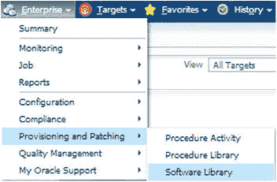
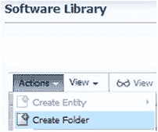
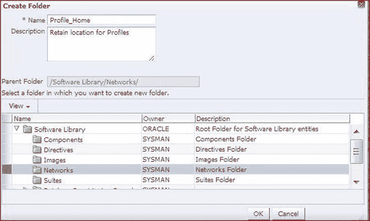
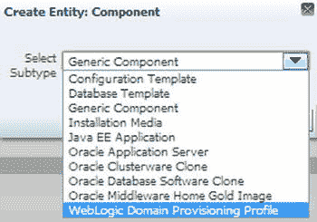
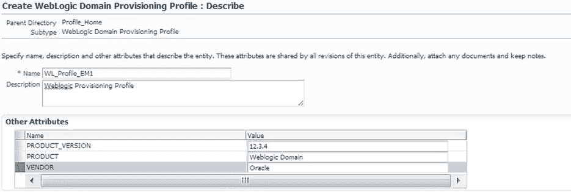
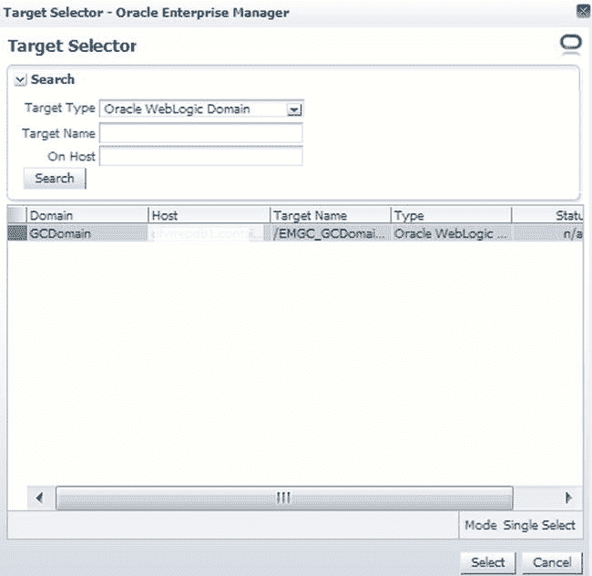
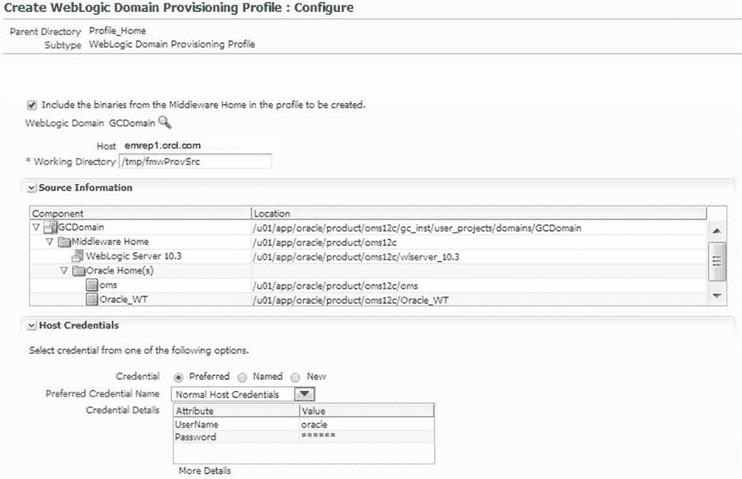
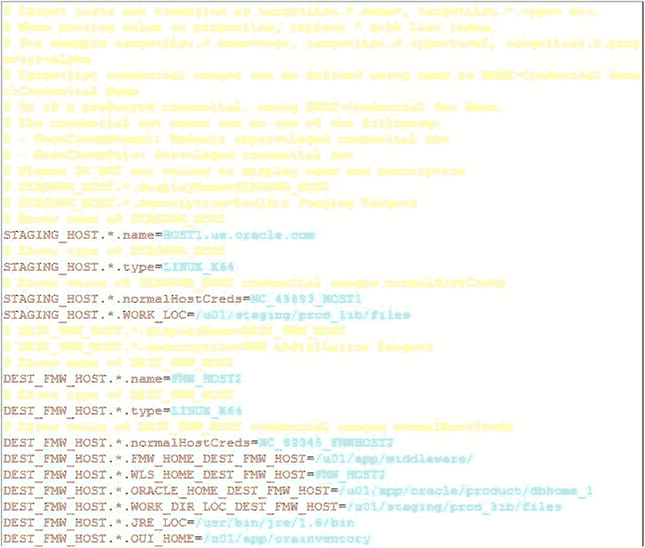

# WebLogic 服务器配置要求与概览

为了提供最新的插件、管理包以及对 Enterprise Manager 云环境的完全访问，必须使 WebLogic 服务器对`企业管理器命令行界面 (EM CLI)`可用并与其同步。

### 要求

为了在`OMS`上安装`EM CLI`之前了解相关要求，请确保`WebLogic 域配置配置文件`的创建方式满足：软件库中存档并存储了属于该域的`中间件主目录`，作为 WebLogic 域的一部分。

## 创建 WebLogic 域配置配置文件

配置配置文件由三个组件组成：

*   一个中间件主目录
*   WebLogic 服务器组件使用的二进制文件
*   配置配置文件的域配置

如果只是让管理员或超级管理员登录到`EM12c`环境，是不足以完成`WLS`域配置配置文件的。要完成此任务，您必须具备以下条件：

*   `WLS`以及参与配置设置的任何其他主机的主机凭据。这些凭据是初始安装`OEM`时所必需的。
*   所有目标必须启用`Java 必需文件 (JRF)`，这些文件由`Enterprise Manager`发现和监控。

以超级用户身份登录到`Enterprise Manager Cloud Console`，然后依次单击`Enterprise`（企业）、`Provisioning and Patching`（配置与修补）和`Software Library`（软件库），如图 2-1 所示。



图 2-1. 在`EM12c`控制台中访问软件库

进入`软件库`后，您需要创建一个文件夹来存储配置文件（图 2-2）。



图 2-2. 在软件库中创建用于配置、修补或安装的新文件夹

`软件库`已有一组预定的子目录可用。在我们的示例中，我们将创建一个名为`Profile_Home`的新目录，为其添加明确的描述，并将其保存到新定义的`Networks`子目录中（图 2-3）。



图 2-3. 创建将用于 WebLogic`EM CLI`安装的`Profile_Home`文件夹及其详细信息

对条目满意后，单击`确定`。系统将显示目录创建成功，以及软件库目录树中新子目录的位置（图 2-4）。


图 2-4. 确认在软件库的`Networks`目录中成功创建文件夹

您将返回到软件库主菜单。再次单击`操作`、`创建实体`，然后单击`组件`（图 2-5）。


图 2-5. `操作`菜单，显示了用于在软件库中访问组件创建操作的展开选项

组件向导将引导您完成创建实际配置文件的步骤。屏幕上将显示一个下拉菜单；选择最后一个选项`WebLogic 域配置配置文件`（图 2-6）。



图 2-6. 在`EM12c`控制台中为`WebLogic 域配置配置文件`创建实体

选择配置文件子类型后，单击`继续`按钮。

**注意：** 请不要担心，如果下一步操作返回屏幕需要一些时间。在`继续`步骤会有一个延迟。

当向导到达组件的详细信息页面时，输入以下内容（图 2-7）：

*   名称
*   描述
*   其他属性（这些设置也可以在 WebLogic 服务器的主页上设置）



图 2-7. 为新的`WebLogic 域配置配置文件`填写描述和值

不要添加任何文件附件或其他信息，只需单击`下一步`。然后，系统将要求您选择一个 WebLogic 服务。在选择之前，请确保选中“将要创建的配置文件的中间件主目录的二进制文件包含在内”复选框。这对于正确创建配置文件至关重要。

单击“未选择 WebLogic 域”旁边的放大镜。将弹出一个显示可用 WebLogic 域的窗口（图 2-8）。



图 2-8. 在`EM12c`控制台中选择要添加到 WebLogic 域的目标

您可以简化搜索，但大多数环境只有少数几个 WebLogic 服务器。从列表中选择您希望使用的服务器，然后单击`选择`。

`配置`页面将要求您复查到目前为止选择的数据（图 2-9）。正确设置一个存在的工作目录，该目录至少要有 200 MB 的可用空间用于工作文件。如果工作目录设置不正确或空间不足，作业将失败，这将导致需要清理配置文件组件并从此步骤开始重新创建。这也绝对不是配置文件的最终存储位置，所有工作文件将在处理后被清理。



图 2-9. 为将用于软件库设置的 WebLogic 域配置配置文件

确保凭据设置正确，如果必要则创建新凭据，但希望到此时您已按照最佳实践创建了首选凭据。

确认向导`配置`页面上的信息正确后，单击`下一步`。

如果您对`复查`页面上的信息满意（此时无需上传任何文件，所以当底部部分显示没有任何文件时请不要担心），请单击`保存并上传`。

现在将为该任务提交一个作业，您将收到确认信息（图 2-10）。


图 2-10. 确认`WebLogic 域配置配置文件`创建作业已提交

由于该作业由`Enterprise Manager 作业服务`管理，您现在可以依次单击`Enterprise`、`作业`和`作业活动`，像监控通过此功能提交的任何其他作业一样监控该作业（图 2-11）。


图 2-11. 在`EM12c`控制台的`作业活动`视图中监控配置配置文件作业

在作业运行时以及作业完成后，您可能需要刷新控制台视图。您可能需要将`活动`视图状态更改为`全部`或`成功`才能查看已完成的作业。该作业需要相当长的时间，但您可以在服务器上您选择放置工作文件的工作目录中看到作业目录（在此示例中，我选择在`/u01/home/oracle/`中创建一个临时文件夹，如图 2-12 所示）。


## 图 2-12. 通过作为作业一部分创建的工作文件，从命令行查看作业状态

作业完成后，你可以通过以下三种方式之一验证其是否已成功完成：

*   检查作业活动详情，确保所有步骤均已成功完成。
*   依次点击“企业”、“修补与置备”，然后点击“中间件”，检查你刚创建的配置文件是否已列出。
*   依次点击“企业”、“修补与置备”，然后点击“软件库”。如果将“网络”文件夹展开到其子目录，你将能看到构成该配置文件的三个组件，它们都应显示成功状态。

## 过滤掉 Fusion Middleware

配置文件置备完成后，你现在可以通过过滤掉 Fusion Middleware 来减少屏幕上显示的进程列表数量。这是通过为 Fusion Middleware 置备进程 (`FMWPROV`) 创建一个新的属性文件模板来实现的，该模板通过相应的全局通用标识符 (`GUID`) 进行标识。使用更新后的属性文件提交 `FMWPROV` 进程直至完成。

### 获取 GUID 并创建属性文件

要捕获部署进程的 `GUID`，可使用如下 `emcli` 命令：

```
> emcli get_procedures | grep FMWPROV
```

你的结果将是以下格式：

```
<proc_guid>, <procedure_type>, <display_name>, <version>, <parent_name>
```

输出示例如下：

```
> emcli get_procedures | grep FMWPROV
F5143FC2A0D94E37E043BB76F00ADE34 FMW Provisioning FMWPROV_DP Provision Middleware 5.0 ORACLE
```

使用上面的 `GUID`，准备属性文件模板：

```
> emcli describe_procedure_input -procedure=F5143FC2A0D94E37E043BB76F00ADE34 >FMVtmp.properties
> 一个名为 FMVtmp.properties 的属性文件被创建
```

文件创建后，使用 `vi` 打开该文件，并使用完成 `FMV` 置备所需的必要数据属性进行更新（在图 2-13 中以红色显示；需要替换为你环境的具体值）：



## 图 2-13. 用于通过 EM CLI 满足进程调用请求的已填写属性文件示例

保存更新后的模板文件，并提交进程以完成置备：

```
> emcli submit_procedure -input_file=data:FMVtmp.properties -procedure= F5143FC2A0D94E37E043BB76F00ADE34
```

### 扩展中间件部署

置备的主要优势之一是其可扩展性。`EM12c` 提供了通过增加服务器实例来提高集群容量的机会。需要使用 `EM CLI` 命令、`SCALEUP` 进程以及实例 `GUID` 来纵向和横向扩展受管服务器，才能创建该进程的输入属性文件。属性文件更新后，即可提交 `SCALEUP` 进程：

```
> emcli get_procedures | grep SCALEUP
B95E01B1F145B5EEE050634DC8854DC, FMW Provisioning, SCALEUP DP, Scale up/Scale out Middleware, 2.0, ORACLE
```

获取到此信息后，你可以使用 `GUID` 信息创建属性文件。此过程必须针对目标 `GUID` 至少提交一次以创建属性文件，否则会发生错误：

```
> emcli get_instance_data –instance= B95E01B1F145B5EEE050634DC8854DC > instancetmp.properties
一个名为 instancetmp.properties 的属性文件被创建。
```

在编辑器中打开属性文件，输入更新后的信息，然后保存。更新完成后，你必须提交该进程：

```
> emcli submit_procedure –input_file: instancetmp.properties –procedure=B95E01B1F145B5EEE050634DC8854DC
```

这将完成提交进程以扩展中间件部署的过程。

## Jython

Python 已存在相当长一段时间，并将继续作为一种相对易用且功能强大的开发语言而日益普及。但什么是“Jython”？

`Jython`，最简单的定义是，`Python` 语言的 `Java` 实现。与 `Python` 一样，其语法简单易学，具有自我格式化能力，并且（像 `Perl` 一样）在代码使用前不需要编译。

从 `EM12c 第 3 版` 开始，`EM CLI` 包含了一个嵌入式的 `Jython` 解释器。函数调用（也称为动词）通过其对应的键值对或作为动词参数呈现的参数来执行。动词的目的和用法将在本书后面解释。

如果使用交互模式，解释器会打开一个用于发出更简单命令的 shell，而不是采用 shell 脚本模式（即解释器接受一个命令脚本列表作为程序来处理），也不是简单地以命令行方式使用 `EM CLI`。其优势当然在于，最终用户无需关心语法和键值对，即可运用 `EM CLI` 的强大功能。

你可以通过 `OMS` 中的无状态通信和安全层，连接到 `Enterprise Manager` 环境中的任何目标，从而将 `Jython` 与 `EM CLI` 结合使用。`Enterprise Manager` 资源中有一个简单通用的列表功能，以及运行用户定义的 `SQL` 查询以访问已发布存储库视图的能力。

要执行用 `Jython` 编写的脚本，命令可以很简单，就像从命令行交互式执行一样，类似于执行 `SQL` 脚本：

```
> emcli @test_python_scrpt.py
```

要在交互模式下运行，你需要启动 `EM CLI` 程序：

```
> emcli <enter>
emcli>
```

基于 `Jython` 的脚本环境允许交互式处理和一种使用 `JSON` 的标准化格式的简单脚本模式。`JSON` 代表 `JavaScript 对象表示法`。`JSON` 格式也相当简单，它只需要名称和值对集合的表示数据。然后，这些对被置于数组、映射或列表中以确保可管理性。

类似于 `XML`，`JSON` 符合开发者和环境系统读取数据的方式，但它没有 `XML` 所需的元数据开销（称为元素和属性名称）。

## 支持的 Java 版本

`EM CLI` 需要适当的 `Java` 版本支持，这也是使用 `Jython` 进行高级脚本编写的要求，因此了解 `Java` 版本非常重要。在标准产品安装过程中安装到你的 `OMS` 上的 `EM CLI` 副本依赖于已为 `OEM` 设置的 `JAVA_HOME`。

位于其他位置（例如你的桌面）的 `EM CLI` 必须设置 `JAVA_HOME`，并且它需要 `Java` 版本 `1.6.0.43` 或更高版本。

如果使用 `Jython`，则必须在安装 `EM CLI` 高级套件 (`emcliadvancedkit.jar`) 之前安装并设置 `Java`。除非存在 `Java` 版本 `1.7.0.17`，否则 `Windows 8` 和 `8.1` 会出现错误。兼容性矩阵可在 `My Oracle Support` 上获取。

> **提示**  Windows 服务器通常建议在安装新版本的 `Java` 后卸载旧版本。为避免注册表问题，请确保：
> *   没有其他 `ORACLE_HOME` 在其路径中使用该 `Java` 版本，并且
> *   在安装新版本 *之前* 卸载旧版本的 `Java`，以防止对新安装产生任何影响。

## 路径和环境变量

要执行 `EM CLI` 动词，无论它们是 `Python` 编写还是其他形式，你都需要连接到 `OMS`。这将需要设置环境变量（也称为客户端属性）作为 `EM CLI` 脚本环境的一部分。你可以利用 `EM CLI` 中的帮助选项检查所有可能的客户端属性：

```
> emcli>help('client_properties')
        EMCLI_OMS_URL
        EMCLI_USERNAME
        EMCLI_AUTOLOGIN
        EMCLI_TRUSTALL
        EMCLI_VERBJAR_DIR
        EMCLI_CERT_LOC
        EMCLI_LOG_LOC
        EMCLI_LOG_LEVEL
        EMCLI_OUTPUT_TYPE(status())
```


