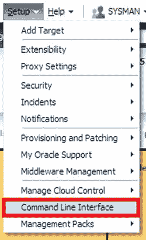
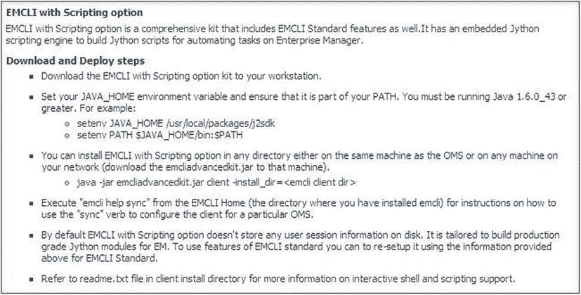
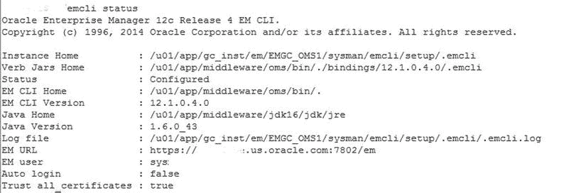
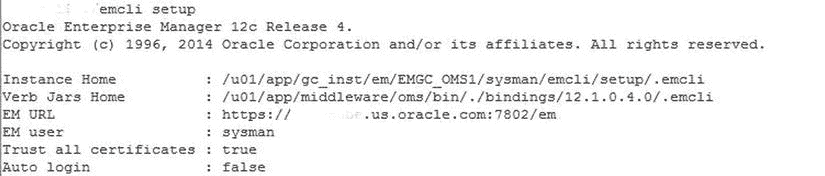

# 客户端或远程目标安装

在远程目标上安装 EM CLI 有多种原因。您必须判断是否存在这样做的显著必要性，或者是否可以通过使用 `emctl` 命令来完成需要在远程目标上运行的任务。

## 考虑原因

以下是在远程目标或客户端上不安装 EM CLI 的两个原因：

1.  **安全性**：EM CLI 将被配置为访问 OMS，因此这样做的安全风险需要被充分评估。任何在远程目标或客户端上使用 EM CLI 的用户，仍然需要像从 OMS 安装的 EM CLI 那样登录，但这确实比纯 OMS 安装的配置增加了额外的安全风险。
2.  **效率**：Enterprise Manager Control (`EMCTL`) 命令可以在命令行完成与 EM CLI 相同的多项任务，例如发出对目标的远程停机维护等。在这些情况下，无需进行完整的 EM CLI 远程安装和配置。`EMCTL` 使用现有的 EM agent 来执行这些任务，利用其标准连接，无需额外的密码或认证令牌。

## 安装概述

现在，我们将回顾当您有合理理由需要进行 EM CLI 的远程目标或客户端安装时应遵循的步骤。EM CLI 客户端的桌面安装也通过此过程完成。

下载和部署 EM CLI 客户端到远程主机只需几个步骤。实际的 EM CLI 安装已在 OMS 主机上自动完成，因此只需要手动进行远程客户端安装。EM CLI 客户端包含两个套件——EM CLI 标准套件和 EM CLI 脚本套件。如果您希望在 OMS 主机之外使用脚本方法，那么远程安装则需要同时安装这两个套件。脚本套件包含了 Jython 解释器，因此进行 Jython 脚本编写时无需额外的解释器。

本节将仅关注标准套件，而下一节将通过关注高级（包含标准和脚本）套件来增强安装技术。

## 先决条件

在安装之前，您必须在任何客户端或远程目标上满足以下要求：

*   EM12c Cloud Control Framework
*   Java 版本 1.6x 或更高
*   操作系统为 Linux、Sun、HPUX、AIX 或 Windows。

## 下载套件

满足这些要求后，您必须从两个位置之一下载套件。第一种是通过 EM12c 控制台，点击 `设置` > `命令行界面`，然后选择 `将 EM CLI 标准套件下载到您的工作站`。选择一个位置来保存下载的文件。

您也可以使用 URL 链接从 OMS 主机下载：

```
https://<OMS_HOST>:<port>/em/<swlib_directory>/emcli/kit/emclikit.jar
```

完成 `emclikit.jar` 文件的下载后，通过 SCP/FTP 或其他传输工具将其复制到远程服务器。

## 设置环境

传输完 `.jar` 文件后，与任何套件安装一样，请确保您的 `JAVA_HOME` 已设置。根据您的操作系统，可能需要以下设置之一：

Unix:

```
> setenv JAVA_HOME /usr/local/packages/j2sdk
> setenv PATH $JAVA_HOME/bin:$PATH
> echo $JAVA_HOME
> echo $PATH
```

Linux:

```
> export JAVA_HOME /usr/bin/jdk6/jre
> export PATH $JAVA_HOME/bin:$PATH
> echo $JAVA_HOME $PATH
```

Windows:

```
> set JAVA_HOME D:\progra~1\java\jre
> echo %JAVA_HOME%
```

 `注意` 路径将在服务器的环境变量中设置。

然后按如下方式检查 Java 路径：

Unix/Linux:

```
> which java
```

Windows:

```
C:\users: where java
```

## 安装命令

一旦确认了 `JAVA_HOME`，即可通过执行以下命令快速安装 EM CLI 标准套件，将 `emcli_install_dir` 替换为您希望安装 EM CLI 的相关目录：

```
> $JAVA_HOME/bin/java -jar emclikit.jar -install_dir=<em_cli_home_dir>
```

对于 Windows 系统，该过程会进行调整以考虑环境变量的变化。


```
%JAVA_HOME%\bin\java -jar emclikit.jar -install_dir=<em_cli_home_dir>
```
安装完成后，将返回以下消息：
```
The EM CLI client is installed in <emcli_client_install_dir>
```
这将验证安装是否完成。您需要查看日志并确保安装过程中没有错误；同时检查所有功能是否已启用。如果您使用单点登录（SSO）或其他高级安全功能，请确保已采取相应步骤以包含与 EM CLI 的同步。

### EM CLI 高级工具包

与标准工具包一样，EM CLI 高级工具包也可以从 EM12c 控制台下载。登录到企业环境后，依次单击 Setup（设置）> Command Line Interface（命令行界面）（图 2-14）。



图 2-14. 从 Enterprise Manager 控制台访问 EM CLI

进入 EM CLI 安装向导后，您将看到如 图 2-15 所示的选择。



图 2-15. 从 Enterprise Manager 控制台进行 EM CLI 安装的安装要求

页面右侧的说明清晰地定义了下载工具包以及成功完成安装所需的先决条件步骤。

### 通过 OMS 安装 EMCLI

最后的安装选项是通过 OMS 执行。您需要先将 EM CLI 工具包下载到远程主机或您的工作站。请注意，下载链接是显示页面中的第一个项目符号选项：“Download the EM CLI with scripting options to your workstation（下载带脚本选项的 EM CLI 到您的工作站）”。

单击此链接开始下载过程。由于这是一个 Java 文件，您可能会收到类似以下警告（图 2-16）：


图 2-16. 下载用于工作站安装 EM CLI 所需的 .jar 文件时的警告

您也可以通过以下 URL 直接下载文件：
```
http://<EM_HOST>:<port>/em/<public_sw_lib>/emcli/kit/emcliadvancedkit.jar
```
完成后，请确保已通过 SCP/FTP 或其他文件传输实用程序将文件复制到新主机。如果高级工具包将用于本地 OMS 主机，则可以继续执行安装步骤。

确保您已正确设置 `JAVA_HOME` 并且它已包含在环境路径中，这在标准工具包安装步骤中已介绍。

 `Note` 如果这是用于 Windows 主机安装，请在环境变量中设置 `JAVA_HOME`，而不是在会话级别设置。Oracle 安装通常会调用可能不会继承会话级别变量的辅助会话，这可能导致这些辅助进程失败。

使用以下命令执行安装步骤，将 `emcli_install_dir` 替换为与安装路径关联的目录：
```
> java –jar emcliadvancedkit.jar client –install_dir=<emcli_install_dir>
```
如前所述，成功安装后将返回以下消息：
```
The EM CLI client is installed in <emcli_install_dir>
```

### 安装后配置

对于任何工具包，无论是安装在主机还是远程主机上，安装完成后都应执行与 OMS 的同步。

在同步之前，您首先需要将 EM CLI 客户端或远程主机信息配置到现有 OMS 中。

切换到 EM CLI 主目录并使用本地配置信息设置本地用户。您可以通过输入以下命令轻松收集关于 `setup` 动词的信息：
```
> emcli help setup
```
设置本地用户需要以下命令语法：

**标准工具包**
```
> emcli setup –url=http://<local_host_name>:<port>/em –username=em_user
```
**高级（脚本）工具包**
```
> emcli setup –url=http://<local_host_name>:<port>/em –username=em_user -trustall
> emcli login –username=sysman
```
设置完成后，需要将其与 OMS 同步：
```
> emcli help sync
```

### 补丁与升级

尽管补丁和升级最初可能看起来不属于安装的一部分，但它们是安装过程中非常重要的一个方面。考虑到我们强调在安装后立即应用所有捆绑补丁的重要性，在安装过程中包含对这些补丁的检查，正说明了这一步在任何 OEM 环境安装中的重要性。

#### 使用 EM CLI 客户端打补丁

通过命令行界面利用部署过程执行打补丁，其功能完整性不亚于通过 Enterprise Manager 控制台执行。打补丁是与一个属性文件结合执行的，该文件包含简化命令的输入信息，并提供 EM CLI 完成补丁过程所需的信息。请记住，EM CLI 不是像每个主机上的常规 EM 代理那样的代理；它是作为客户端软件安装的实用程序。

要从头开始创建属性文件，您需要了解如何以及何时使用以下步骤之一创建：

*   从现有过程的模板创建
*   使用通过控制台创建的、当前状态的属性文件
*   重用先前执行中保存的属性文件

**从模板创建属性文件**

使用现有过程 GUID，只需几个命令即可构建一个模板，并为您要执行的新过程插入值。

然后执行 EM CLI 命令以获取有关可用过程模板的信息。在下面的示例中，我们将拉取补丁模板示例：
```
./emcli get_procedures -type=PatchOracleSoftware
CF9D698E8D3843B9E043200B14ACB8B3, PatchOracleSoftware, CLONE_PATCH_SIDB, Clone and Patch Oracle 
Database, 12.2, ORACLE
CF9D698E8D4743B9E043200B14ACB8B3, PatchOracleSoftware, PATCH_ALL_NODES_CLUSTER_ASM, Patch Oracle 
Cluster ASM - All Nodes, 12.2, ORACLE
```
返回的第一条信息是我们需要的过程 GUID，然后我们可以从中创建属性文件以供使用：
```
./emcli describe_procedure_input -procedure=CF9D698E8D3843B9E043200B14ACB8B3 
> Patch_template.properties
Verifying parameters ...
```
现在您的模板文件已创建：
```
-rw-r--r-- 1 oracle dba   65950 Jan 27 19:12 Patch_template.properties
```

**为远程客户端安装打补丁**

如果您已将 EM CLI 客户端部署到目标服务器，则可以通过在 EM CLI 设置过程中将其在 OMS 中注册来轻松跟踪它们。跟踪信息保留在 OMS 中，记录所有需要打补丁的 EM CLI 客户端安装二进制文件。它还会识别需要更新密码或需要使用 OMS 存储库中的新动词进行同步的 EM CLI 安装。客户端软件安装不是 OEM 中的目标，因此不受 EM 代理的跟踪或监控。

### EM 安全框架

鉴于 EM CLI 的强大功能，安全性始终是任何人心中的首要考虑。命令行可以访问整个受监控环境，因此这个问题被包含在这里也就不足为奇了。

按照任何 Oracle 安全实践的标准，建议作为安全实践的一部分对服务器进行加固——移除服务和直接访问属于 Oracle 的操作系统级别文件。

基本的安全设计要求我们从所有受监控目标一直到 Enterprise Manager 组件进行全面审视，但有一些白皮书可以解决 EM CLI 之外的安全问题；在本节中，我们将重点介绍命令行和 Enterprise Manager 的安全性。

### EM CLI 中的安全性


## EM CLI 安全架构与关键功能

EM CLI 的安全架构构建于 Enterprise Manager 12c 环境的架构之上，正如我们上面所讨论的，它通常是首要的安全关注点。通过 EM CLI 访问 Enterprise Manager 的单点入口是第二个关注点。您将通过 EM CLI 与之交互的远程目标的凭据是第三级访问权限，更需要关注，因为这些目标很可能包含您数据库环境的生产目标。

### EM CLI 设置的安全模式

在讨论第二级安全时，我们将阐述 EM CLI 中安全模式的含义。安全模式 EM CLI 是默认的安装模式，它不会在本地磁盘或日志文件中存储任何 Enterprise Manager 或 SSO 密码。

默认情况下，EM CLI 登录在达到设定的不活动时间点后会自动超时，用户必须在尝试通过 EM CLI 发出任何其他命令之前重新登录。

如果您希望将 EM CLI 安置设置为在重新发出动词时自动登录，并要求显式注销 EM CLI，请执行以下命令：

```
> emcli setup –noautologin
```

### HTTPS 受信证书

设置 HTTPS 受信证书首先需要快速检查以确认尚未完成。这可以通过以下同步后的 EM CLI 状态命令来实现，如图 2-17 所示：

```
> emcli status
```



图 2-17. 从 EM CLI 发出状态调用以查看有关 Enterprise Manager 命令行界面和 https 状态的信息

检查 EM URL 值，查看连接是否已在使用安全的 HTTPS URL。如果尚未使用，可以通过 EM CLI 动词调用进行配置：

```
> emcli setup –url="http[s]://host:port/em" –username="<username>” [-trustall] [-novalidate]
```

系统将要求您提供 `SYSMAN` 密码以完成对 EM 控制台的此安全级别配置更改。输入密码并按回车键以完成设置。运行 `emcli status` 动词调用将显示 `EMURL` 的更新值，或者可以使用 `emcli setup` 调用来查看它（图 2-18）。



图 2-18. 发出 `setup` 命令以验证 EM CLI 和 Enterprise Manager 控制台所用 EM URL 的安全 https 连接

### Release 4 中的重要动词

与 EM12c 的每个版本一样，Release 4 也包含了重大的增强和新动词的引入。Release 4 (12.1.0.4) 也不例外，并且有更新的补丁来完成该版本，因为其他产品线的动词依赖项也同时发布了。

#### 金质代理更新动词

“金质代理”动词是那些在补丁中发布而非初始 Release 4 一部分的动词组之一。它们列在初始的 EM CLI 发布文档和帮助文件中，但实际上直到补丁发布后才可用。参见以下列表：

*   `get_agent_update_status`: 显示使用金质映像的所有代理更新结果
*   `get_not_updatable_agents`: 显示无法作为金质映像一部分进行更新的代理
*   `get_updatable_agents`: 显示给定金质代理映像名称或金质映像系列中可更新的代理

#### BI 发布报表动词

Release 4 将 BI Publisher 作为安装的一部分包含在内。紧凑型安装现在仅约 300 MB 大小，只需几个 EM CLI 命令即可授予 Enterprise Manager 用户访问权限和功能：

*   `grant_bipublisher_roles`: 授予对 BI Publisher 目录和功能的访问权限
*   `revoke_bipublisher_roles`: 撤销对 BI Publisher 目录和功能的访问权限

#### 云服务动词

随着 Release 4 的发布，云产品得到了显著改进，能够从命令行管理云请求、用户和服务实例数据对于简化云服务的任务管理至关重要：

*   `cancel_cloud_service_requests`: 取消云请求。应提供用户或名称选项
*   `delete_cloud_service_instances`: 根据指定的过滤器删除云服务实例
*   `delete_cloud_user_objects`: 删除云用户对象，包括云服务实例和请求
*   `get_cloud_service_instances`: 检索云服务实例列表。如果未指定选项，将打印所有实例。
*   `get_cloud_service_requests`: 检索云请求列表。如果未应用过滤器，将打印所有请求。
*   `get_cloud_user_objects`: 检索云用户对象列表，包括云服务实例和请求。如果未使用用户选项，将打印所有对象。

#### 其他动词

Release 4 对维护间隔（blackouts）进行了重大更改，其中之一是允许在控制台和命令行内进行追溯性维护间隔：

*   `create_rbk`: 在给定目标上创建追溯性维护间隔并更新其可用性。使用此 `emcli` 命令需要先在 UI 中启用追溯性维护间隔功能。
*   孤儿目标一直是困扰一段时间的问题。新增的合规性增强动词解决了这个问题：
    *   `fix_compliance_state`: 通过删除对已删除目标的引用来修复合规状态。
*   以下动词用于支持 WebLogic 环境中的复杂复合目标。设计一个专门用于修改这些目标的动词至关重要：
    *   `modify_monitoring_agent`: 此动词可用于更改配置为监控 WebLogic 域中目标的代理。

#### Fusion Middleware 配置动词

Fusion Middleware 新增了多个动词并进行了增强，以帮助管理 WebLogic 功能并从命令行构建更多选项：

*   `create_fmw_domain_profile`: 从 WebLogic 域创建 Fusion Middleware 配置文件
*   `create_fmw_home_profile`: 从 Oracle 主目录创建 Fusion Middleware 配置文件
*   `create_inst_media_profile`: 从安装介质创建 Fusion Middleware 配置文件

#### 作业动词

EM 作业服务进行了多项增强。这些增强功能使我们能够将作业从一个 EM12c Release 2 OMS 导出并导入到相同版本或更高版本的环境中。为了提供更好的作业管理选项，Oracle 还在 Release 4 中通过 EM CLI 添加了更高级的作业控制：

*   `export_jobs`: 导出 EM 中所有匹配的作业定义，包括纠正措施。系统作业和嵌套作业被排除。
*   `import_jobs`: 将所有作业定义（包括来自 zip 文件的纠正措施）导入 EM。创建库作业。EM CLI 登录用户被设置为库作业所有者。
*   `job_input_file`: 在属性文件中指定作业动词的部分或全部属性。在命令行设置的属性会覆盖文件中的值。
*   `resume_job`: 恢复与过滤条件匹配的一个或一组作业。
*   `suspend_job`: 挂起与过滤条件匹配的一个或一组作业。

#### 目标数据动词


