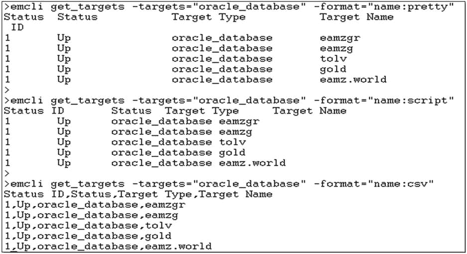

# Description: (Optional) Command to run on the target.
variable.command=%job_default_shell%

schedule.frequency=IMMEDIATE

[oracle ~]$ emcli create_library_job -input_file='property_file:uname_r.job'
Creation of library job "UNAME_R" was successful.
```

导出作业使用户能够轻松复制作业（包括活动和库作业），以及以通用格式保留该作业的外部备份。此备份可以作为将作业恢复到另一系统、构建副本或测试系统以及在必要时生成审计记录的方法。

## 总结

对于不经常使用 EM CLI 的人来说，其术语可能令人困惑。动词（Verbs）定义了您想用 EM CLI 执行的功能。进行更改的“方式”称为模式（Modes）。命令行模式也称为经典模式，一次执行一个命令。交互和脚本模式使用 Python 语法，并且可以额外使用该强大编程语言的成熟功能。

鉴于其规模和复杂性，任何人都不可能记住有关 EM CLI 的所有内容。即使是最先进的用户也需要定期参考文档。幸运的是，EM CLI 提供了丰富的帮助功能。从在线找到的优秀文档到命令行和交互模式本身包含的手册页，所需的所有信息都易于获取。


没有人喜欢看到错误信息，但当它们在 `EM CLI` 中出现时，通常描述性强，易于阅读和理解。许多产品的错误语法可能很棘手，尤其是管理员每天需要在各种不同工具之间切换的情况下。与许多其他工具相比，`EM CLI` 中的错误语法直观且简单。

`EM CLI` 在每个已安装的 `OMS` 上都已完全配置好并可随时使用。它也易于下载、安装和设置在任何其他能够运行 `Java` 的机器上。`EM CLI` 客户端与 `OMS` 之间的通信方式几乎与浏览器和 `OMS` 之间的通信完全相同。两者都高度安全，并使用标准、成熟的技术。

然而，`EMCTL` 不会在短期内消失。尽管 `EMCTL` 和 `EM CLI` 可以执行一些相同的功能，但它们在目的和功能上大相径庭。请不要因为 `EM CLI` 功能强大就错误地认为 `EM CTL` 无用。针对不同的任务，你将两者都需要。

本章中的示例仅展示了 `EM CLI` 功能的冰山一角，但很可能，你心中已经想到了一些场景，在这些场景中，`EM CLI` 可以解决 `GUI` 和其他命令行工具无法解决的问题。这里的示例是使用 `EM CLI` 最显而易见的几种方式。在 Enterprise Manager 中，有多种方法和工具可以解决大多数问题。本书中展示的示例绝不会声称是做某事的“正确”方式。请利用这里的信息，找出你自己的“正确”方式。

## 第 4 章


## 在命令行工作

`EM CLI` 非常适合 shell 脚本，但它也简化了通常在控制台中执行的任务。例如，通过控制台移除一个 `EM` 代理及其相关目标可能相当费力。使用 `EM CLI`，你只需发出一条单行命令，相同的任务就能快速、完整地从命令行执行完毕。

本章将向你介绍 `EM CLI` 在命令行的一些基础知识，然后说明几种你可以应用 `EM CLI` 来更快速地管理环境的方法——无需像在控制台中执行相同任务那样进行大量的鼠标点击。

我们常常将“命令行”这个术语与 `Unix` 联系起来，这在这里也适用，但请记住，由于 `EM CLI` 是一个 `Java` 应用程序，它可以在任何平台上运行。无论你是登录到服务器还是从桌面执行命令，`EM CLI` 的运行方式都是一样的。

### 启动一个 EM CLI 会话

虽然每个 `CLI` 命令都在单独的行上运行，但在登录 `EM CLI` 时，会为所有后续语句建立一个单一的会话。`login` 动词在开始任何工作之前，会与 `OMS` 服务器建立连接并验证用户。你可以在命令行上输入密码（不推荐用于交互式会话），也可以等待在登录过程中提示输入密码。

`sync` 命令确保你的运行时执行使用的是管理服务器软件库中当前可用的动词定义。这在你对 `OMS` 打补丁或升级后尤为重要。

```
emcli login -username="SYSMAN"
emcli sync
```

### CLI 参考

Oracle 文档 #E17786.12 包含了 `OEM 12.1.0.4` 版本发布时可用的 `EM CLI` 动词目录。请访问 Oracle 网站 `http://docs.oracle.com/cd/E24628_01/em.121/e17786.pdf` 以确保你拥有最新版本。

通过 `EM CLI` 本身也可以在线获取帮助。你的 `OMS` 软件库中已知的当前动词列表可在命令行中获取。

```
emcli help

> emcli help

命令摘要:
    argfile    -- 从文件执行 emcli 动词
    help       -- 获取 emcli 动词的帮助（用法: emcli help [动词名称]）
    login      -- 登录到 EM 管理服务器 (OMS)
    logout     -- 从 EM 管理服务器注销
    setup      -- 设置 emcli 以与 EM 管理服务器一起工作
    status     -- 列出 emcli 配置详细信息
    sync       -- 与 EM 管理服务器同步
    version    -- 列出 emcli 动词版本或 emcli 客户端版本

添加主机动词
    continue_add_host             -- 继续失败的“添加主机”会话
    get_add_host_status           -- 显示“添加主机”会话的最新状态。
    list_add_host_platforms       -- 列出可以执行“添加主机”操作的平台。
    list_add_host_sessions        -- 列出所有“添加主机”会话。
    retry_add_host                -- 重试失败的“添加主机”会话
    submit_add_host               -- 提交一个“添加主机”会话。

代理管理动词
    get_agent_properties     -- 显示代理的所有属性详细信息
    get_agent_property       -- 显示代理特定属性的值
    resecure_agent           -- 重新保护一个代理
    restart_agent            -- 重启一个代理
    secure_agent             -- 保护一个代理
    set_agent_property       -- 修改代理的特定属性
    start_agent              -- 启动一个代理
    stop_agent               -- 关闭一个代理
    unsecure_agent           -- 取消保护一个代理
...
```

将动词名称添加到 `help` 命令后，可获取该动词的具体指导。下面的示例显示了 `sync` 动词的帮助结果。

```
> emcli help sync
  emcli sync

描述:
将 emcli 客户端与 OMS 同步。

同步后，该 OMS 可用的所有动词及相关在线帮助
    在 emcli 客户端都变得可用。在调用 setup 时会自动发生同步。
  选项:
    -url
        EM (OMS) 的 URL。
        支持 http 和 https 协议
        （出于安全原因，建议使用 https）。
    -username
        所有后续 emcli 命令在联系 OMS 时
        将使用的 EM 用户名。
    -password
        EM 用户的密码。
        如果未指定此选项，系统会交互提示
        用户输入密码。
        在命令行上提供密码是不安全的，
        应避免这样做。
    -trustall
        自动接受来自 OMS 的任何服务器证书，
        这会导致安全性降低。
        同时指示设置目录是本地且受信任的。
```

### get_targets 动词

`EM CLI` 动词大致分为三类：`EM` 查询、`OEM` 管理操作和目标操作。动词使用非常具体的语法，因此传递给 `EM CLI` 的目标名称必须与 `OEM` 字典中的对象名称匹配。

`get_targets` 动词可用于在将目标名称用于任何管理或维护任务之前验证其名称。例如，假设你想为主机 `myhostx` 上的数据库 `orcl1` 创建一个停用时间，并且你是通过自动化过程提升已发现的数据库和监听器目标。`OEM` 中的数据库目标可能被添加为 `sidc_myhostx`（按其 `RAC` 实例名），或其全局名称。有时它甚至可能显示为服务名或 `SID`。当你通过“自动发现结果”使用目标提升时，可能会出现这种可变性。你应该在添加目标时手动设置目标名称，使用引导发现过程以确保整个企业内的一致性。

### 输出格式

`EM CLI` 为查询结果预配置了三种输出格式。也支持用户自定义格式。


*   `Pretty` 格式将列标题与结果集数据对齐。
*   `Script` 格式在标题和结果列的值之间用空格分隔。此格式与 `awk` 编程语言配合使用效果极佳。
*   `Csv` 格式，顾名思义，使用逗号分隔值，以便在电子表格中解析或使用 Shell 的 `cut` 命令处理。

假设您想使用以下命令为 `eamz` 数据库设置 OEM 凭据：
```
emcli set_credential -target_type=oracle_database -target_name="eamz" \
                     -credential_set=DBCredsNormal \
                     -columns="username:dbsnmp;password:Super_S3cret;role:Normal"
```
您的命令会失败，因为 OEM 找不到匹配的目标名称。图 4-1 说明了不同的样式。
```
emcli get_targets -targets="oracle_database" -format="name:csv" | grep -i eamz
```

图 4-1. 输出样式示例

我们将在本章及下一章中探讨应用此命令的几个示例。

## 代理管理

在桌面上安装 EM CLI 客户端的功能使您无需打开浏览器即可执行 EM CLI 命令——无需使用控制台或登录到管理服务器主机。这种灵活性使您能够通过众多与代理相关的 EM CLI 命令之一快速控制 OEM 代理。

如前所述，您可以使用 `get_targets` 命令通过将 `get_targets` 结果按目标类型 `oracle_emd` 过滤来查找任何代理的具体名称。这对于代理尤为重要，因为代理名称包含主机名和端口号。
```
> emcli  get_targets –targets="oracle_emd"  –name="name:csv"
Status ID,Status,Target Type,Target Name
1,Up,oracle_emd,acme_dev:2480
1,Up,oracle_emd,acme_qa:3872
1,Up,oracle_emd,acme_prod:3872
```
`targets` 变量也接受包含目标名称和目标类型的成对值，例如：–targets=“acme_qa:oracle_database”

所有通过 OEM 控制台可用的代理管理任务也都可以通过 EM CLI 命令完成。请注意，在以下示例中，每种情况都需要提供 OEM 代理二进制文件所有者/主机用户的密码。
```
emcli stop_agent  -agent=acme_qa:3872 -host_username=oracle
Host User password:
The Shut Down operation is in progress for the Agent: acme_qa:3872
The Agent "acme_qa:3872" has been stopped successfully.

emcli start_agent  -agent=acme_qa:3872 -host_username=oracle
Host User password:
The Start Up operation is in progress for the Agent: acme_qa:3872
The Agent "acme_qa:3872" has been started successfully.

emcli restart_agent  -agent=acme_qa:3872 -host_username=oracle
Host User password:
The Restart operation is in progress for the Agent: acme_qa:3872
The Agent "acme_qa:3872" has been restarted successfully.
```
代理有时会在打补丁后或由于中断而与 OMS 不同步，因此需要更新其注册信息，甚至需要代理同步才能允许上传。实现此目的的最简单方法是 `resecure` 代理以理顺连接。如果您的环境不需要安全的代理，您可以使用与 `secure_agent` 命令相同的语法执行 `unsecure_agent` 命令来移除安全关系。

注意，代理可执行文件所有者的密码和 OMS 注册密码都是必需的。
```
emcli secure_agent  -agent=acme_qa:3872 -host_username=oracle
Host User password:
Registration Password:
The Secure operation is in progress for the Agent: acme_qa:3872
The Agent "acme_qa:3872" has been secured successfully.

emcli resecure_agent  -agent=acme_qa:3872 -host_username=oracle
Host User password:
Registration Password:
The Resecure operation is in progress for the Agent: acme_qa:3872
The Agent "acme_qa:3872" has been resecured successfully.
```
`agent_resync` 命令会在存储库数据库中启动一个作业，以更新被阻止代理的状态。当存储库包含来自代理上传的冲突数据时，代理会被置于阻止状态。这通常在计划外问题影响代理与 OMS 的连接后发生。因此，命令行的标准输出信息量不足。虽然您可以点击控制台中的作业来跟踪进度，但 EM CLI 中没有匹配的选项。
```
emcli resyncAgent -agent=acme_qa:3872
Resync job RESYNC_20140422135854 successfully submitted
```
EM CLI 还可用于提供有关代理的详细信息，可以列出其所有属性，也可以深入查看特定属性，如下所示。
```
emcli get_agent_properties -agent_name=acme_qa:3872
Name                        Value
agentVersion                12.1.0.3.0
agentTZRegion               America/Los_Angeles
emdRoot                     /opt/oracle/agent12c/core/12.1.0.3.0
agentStateDir               /opt/oracle/agent12c/agent_inst
perlBin                     /opt/oracle/agent12c/core/12.1.0.3.0/perl/bin
scriptsDir                  /opt/oracle/agent12c/core/12.1.0.3.0/sysman/admin/ scripts
EMD_URL                     https://acme_qa:3872/emd/main/
REPOSITORY_URL              https://myoms.com:4903/empbs/upload
EMAGENT_PERL_TRACE_LEVEL    INFO
UploadInterval              15
Total Properties :          10

emcli get_agent_property -agent_name=acme_qa:3872 -name=agentTZRegion
Property Name: agentTZRegion
Property Value: America/Los_Angeles
```

## 使用 EM CLI 删除 EM 目标

`delete_targets` 命令可用于移除单个目标或一组相关目标。从控制台单独选择目标并按下 `删除目标` 按钮似乎更简单。这通常是正确的，但我们发现，在某些情况下，最终可能会留下孤立目标，例如当其所有同类成员都被删除后遗留的 `oracle_dbsys` 目标类型。此外，如果您在桌面上安装了 EM CLI 客户端，则无需登录控制台即可删除目标！

### 查找确切的目标名称

控制台从会话信息派生目标名称和目标类型，因此在控制台内删除目标时，会确保使用这两个目标的精确名称和类型。要找到这些值，我们将使用 `get_targets` 命令和一个简单的 `grep` 来区分我们感兴趣的目标。
```
> emcli get_targets | grep -i bertha
1       Up               oracle_database    bertha
1       Up               oracle_dbsys         bertha_sys
1       Up               oracle_listener       LSNRBERTHA_oemdemo.com
```

### 删除目标

数据库和监听器都属于数据库系统 `bertha_sys`，因此可以使用一条命令删除所有三者：
```
> emcli delete_target –type = "oracle_db_sys" –name="bertha_sys" –delete_members
  Target "bertha_sys:oracle_dbsys" deleted successfully
```
您也可以像这样删除单个成员：
```
> emcli delete_target –type = "oracle_listener" –name="LSNRBERTHA"
  Target "LSNRBERTHA:oracle_listener" deleted successfully
```

## 如何用一条命令移除 Enterprise Manager 代理

从 Enterprise Manager 中移除 EM 代理需要移除该代理管理的所有目标及其所有指标。在控制台中，这需要按其发现的大致相反顺序执行多个删除操作。例如，当您首次将代理部署到主机时，代理和主机会成为已知的第一和第二个目标。然后，您会发现并提升驻留在该主机上的其他目标。


## 监视目标的删除与代理管理

监视目标的删除顺序与发现顺序相反，以便能正确地从存储库数据库中删除参考数据。目标删除必须从已发现/提升的目标开始，然后是主机，最后是代理。

如果你使用 `-delete_monitored_targets` 标志，`delete_targets` 动词可以在一个命令中移除代理及其所有监视目标。

```
> emcli delete_target -name="<Agent Name>"
  -type="oracle_emd"
  -delete_monitored_targets
  -async;
```

 **注意** 删除前必须先停止代理。

删除代理目标类型的过程与移除其他目标类型非常相似。由于代理名称由主机名和代理端口号组成，我们将先运行 `get_targets`。

```
> emcli get_targets | grep -i demohost01
1       Up               host                     demohost01
1       Up               oracle_emd          demohost01:3872

> emcli delete_target -name="demohost01:3872" -type="oracle_emd" -delete_monitored_targets -async;
Target "LSNRBERTHA:oracle_listener" deleted successfully
```

代理的完全移除涉及管理服务器（OMS）和远程主机上的操作。参见 表 4-1。

表 4-1. 代理移除任务

| 位置 | 操作 | 示例 |
| --- | --- | --- |
| 远程主机 | 从代理获取目标名称 | `> emctl status agent | grep "<Agent URL>"` |
| 远程主机 | 使用 `emcli` 或 `emctl` 停止代理。你也可以使用本章前面描述的 `emcli stop_agent` 动词从 CLI 会话中关闭它。由于完整的代理移除任务包括在远程主机上的 OUI 会话，因此在此情况下执行 `emctl` 命令更简单 | `> emctl stop agent` |
| OMS | 删除目标 | `> emcli delete_target -name="<Agent Name>"``-type="oracle_emd"``-delete_monitored_targets``-async;` |
| 远程主机 | 卸载插件和 sbin 二进制文件。OUI Oracle 主目录移除与 OEM 中目标创建的关系相同。代理主目录是首先创建的，必须作为单独步骤最后删除。 | `cd $AGENT_BASE/core/<agent release>/oui/bin``./runInstaller -deinstall –remove_all_files` |
| 远程主机 | 使用 `including_files` 选项卸载代理软件 | |

## 将目标转移到另一个 EM 代理

变化总是会发生。也许你决定将数据库移动到不同的主机，或者你想更改包含 EM 代理二进制文件的目录。你可以删除并重新发现目标，但这样会丢失其指标历史记录。

你可以使用 `relocate_targets` 动词保留该历史记录，并将特定目标的指标收集和停机责任重新分配给另一个 EM 代理。

### 工作原理

每个 EM 代理都有自己的 `targets.xml` 文件，位于 `$AGENT_BASE/agent_inst/sysman/emd`。`relocate_targets` 动词会更新源主机和目标主机上的这些 XML 文件，并更新存储库中的关系。

代理及其监视的目标必须位于同一主机上。这意味着你不能使用 `relocate_targets` 通过不同主机上的代理来监视数据库。此技术仅限于将目标移动到同一主机上的 EM 代理，或执行迁移到另一台服务器的任务。让我们看一个例子。

要将 goldfish 数据库及其侦听器从 alice 服务器移动到 buster：

```
emcli relocate_targets
  -src_agent="alice:3872"
  -dest_agent="buster:3872"
  -target_name="goldfish"
  -target_type="oracle_database"
  -copy_from_src

emcli relocate_targets
  -src_agent="alice:3872"
  -dest_agent="buster:3872"
  -target_name="lsnrgoldfish"
  -target_type="oracle_listener"
```

对于此传输，你将使用以下值：

*   `src_agent`= alice:3872        （当前代理名称）
*   `dest_agent`= buster:3872  （目标代理名称）
*   `target_name`= goldfish      （要移动的目标名称）
*   `target_type`= 该目标的 EM 类型

数据库目标还包括 `copy_from_src` 标志以保留其历史记录。每个 EM CLI 命令只能重新定位一个目标。

### OMS 介导的目标

不要对 RAC 数据库或任何类型的 Oracle 集群使用 `relocate_targets` 动词。你的管理服务器了解使用 Oracle 软件的集群对象之间的关系，并将自动在集群主机之间调解代理职责。如果你手动将集群目标重新定位到另一个集群中的另一个代理，则存在破坏 OEM 在集群成员之间关联的风险。

你可以查询存储库数据库以确定哪些目标是 OMS 介导的，如下所示：

```
SELECT   entity_type,
         entity_name,
         host_name
FROM     sysman.em_manageable_entities
WHERE    manage_status =2-- Managed
AND      promote_status =3-- Promoted
AND      monitoring_mode =1-- OMS mediated
ORDERBY  entity_type,entity_name, host_name;

ENTITY_TYPE                ENTITY_NAME                            HOST_NAME
-------------------------  -------------------------------------  --------------------
cluster                    clust01                                cluster01b.com
cluster                    clust01                                cluster01b.com
rac_database               apple                                  cluster01b.com
rac_database               betty                                  cluster01a.com
rac_database               jack                                   cluster01b.com
weblogic_domain            /EMGC_GCDomain/GCDom                   myoms.com
weblogic_domain            /Farm01_IDMDomain/ID                   myoms.com
weblogic_domain            /Farm02_IDMDomain/ID                   myoms.com
```

## 管理 OEM 管理员

控制台提供了一种清晰、便捷的方法来管理 OEM 管理员帐户，但其灵活性使得创建多个帐户变得非常麻烦，因为需要点击所有屏幕。EM CLI 将 OEM 代码库固有的灵活性与命令行界面的简单性相结合。

控制台中定义的所有选项都可以使用下面显示的标志作为 EM CLI 中的选项授予权限。要创建管理员，你只需给帐户一个名称和密码。

```
emcli create_user -name="SuzyQueue" -password="oracle"
```

如果你在阅读 Apress 的书籍，那么你不会忽视用户安全性，因此你会希望使用 `-expired="true"` 标志使用户的新密码过期，如下所示：

```
emcli create_user -name="SuzyQueue" -password="oracle" -expired="true"
```

其他可选参数允许你执行 OEM 控制台中的大多数用户授权操作，而无需点击流程。EM CLI 和 OMS 服务器使用相同的代码库，因此这不足为奇。

### 角色管理

企业管理器管理员和用户作为数据库用户帐户存储在存储库数据库中。避免通过 SQL*Plus 授予角色权限的诱惑，因为 OEM 的内部安全管理可能正在执行其他操作。

你可以通过添加 `-roles` 参数在创建用户时添加角色授权：

```
emcli create_user -name="SuzyQueue" -password="oracle" \
                                    -roles="em_all_administrator"
```

你也可以通过 `grant_roles` 或 `revoke_roles` 动词修改用户：

```
emcli grant_roles -name="SuzyQueue" -roles="em_all_viewer"

emcli revoke_roles -name="SuzyQueue" -roles="em_all_operator"
```

我们将在下一章中探讨如何使用 shell 脚本构建一组管理员。

### 跟踪管理服务器登录

有时你可能想知道谁登录了你的管理服务器。`list_active_sessions` 动词通过传递 `–details` 标志提供该信息及其详细信息，如下所示：

```
emcli list_active_sessions -details
```


OMS 名称: `myoms.com:4889_Management_Service`
管理员: `SYSMAN`
登录自: `Browser@123.45.6.234`
会话: `F7CA6D7DE88B0917E04312E7510A9E54`
登录时间: `2014-04-24 06:46:53.876687`

OMS 名称: `myoms.com:4889_Management_Service`
管理员: `BOBBY`
登录自: `Browser@SAMPLEPC.com`
会话: `F7CD5C7EE0A961C7E04312E7510A8A71`
登录时间: `2014-04-24 11:05:24.199258`

OMS 名称: `myoms.com:4889_Management_Service`
管理员: `PHIL`
登录自: `Browser@123.45.6.228`
会话: `F7CECDD6335543E3E04312E7510AA25C`
登录时间: `2014-04-24 11:13:20.567234`

OMS 名称: `myoms.com:4889_Management_Service`
管理员: `SYSMAN`
登录自: `Browser@123.45.6.234`
会话: `F7CF52CA3BE1692FE04312E7510A7494`
登录时间: `2014-04-24 11:50:31.152683`

OMS 名称: `myoms.com:4889_Management_Service`
管理员: `SYSMAN`
登录自: `EMCLI@123.45.6.231`
会话: `F7CF52CA3BE3692FE04312E7510A7494`
登录时间: `2014-04-24 11:55:52.482938`

OMS 名称: `myoms.com:4889_Management_Service`
管理员: `SYSMAN`
登录自: `Browser@123.45.6.231`
会话: `F7CF52CA3BE5692FE04312E7510A7494`
登录时间: `2014-04-24 12:07:52.335728`

## 总结

`EM CLI` 允许你从命令行执行许多管理任务，甚至可以在桌面上完成。本章描述的简单技术非常适合于 Shell 脚本编写和进一步的自动化，这将在下一章中进行描述。

---

¹你的环境中存在多种目标类型。在安装过程中，`EM` 代理会发现主机上的目标，并将它们与特定的目标类型关联起来。会为识别的每种目标类型创建一个新的 `Oracle Home` 并安装相应的插件。每种目标类型的标签是固定的，每个目标仅与一种目标类型相关联。

# 第 5 章


## 通过 Shell 脚本实现自动化

正如我们在前一章所发现的，`EM CLI` 提供了完成复杂任务的更快捷方式，而这些任务通常通过 `OEM` 控制台进行管理。`EM CLI` 的强大之处在于将 `EM CLI` 与经典的 Shell 脚本技术相结合。本章中的示例是为 `Unix/Linux` 环境编写的，但由于 `EM CLI` 是一个 `Java` 应用程序，此处显示的 `CLI` 语法在其他环境中同样有效。

本章从 `CLI` 脚本基础开始，然后通过几个示例演示该技术的应用。在每个示例中，为了确保说明清晰，我们移除了那些使脚本稳健运行的常见维护命令。由于这些技术适用于任何脚本解决方案，我们在处理任何 `OEM` 解决方案之前，将先列出一些基本的脚本编写准则。

本章中的所有示例均使用基础的 `bash` Shell 脚本编写，因其普及性和清晰性。可以使用 `Perl` 或其他语言来提升脚本性能，但在本章中加入这些内容可能会掩盖所演示技术的基础知识。

本章首先介绍一些 Shell 脚本编写的基础知识，进而发展到构建和应用 Shell 函数。在此过程中，我们将了解如何创建和控制 `OEM` 黑屏、管理用户账户以及处理更大的数据集。最后，我们将看一下使用 `getopts` 的一些高级 Shell 脚本编写技术。

### Shell 脚本编写最佳实践

任何有 Shell 脚本编写经验的人，无论是针对 `Windows`、`Linux` 还是任何其他 `Unix` 变体，都有自己偏好的技术。希望你环境中的脚本呈现一致的外观和感觉，使其易于阅读和维护。编写任何程序的最佳实践，无论使用何种 Shell 或操作系统，都由 `Unix` 的创造者提出，并在 Eric S. Raymond 所著的 *The Art of Unix Programming* 中有所记载。这些准则为我们执行的任何编程奠定了非常清晰的基础。该书的免费在线副本可在 `https://archive.org/details/ost-computer-science-the_art_of_unix_programming` 获取。

#### 日志记录

谜团应该放在你的床头柜上，而不是在你的 `Enterprise Manager` 环境中。任何 `Unix` 程序的输出都应在运行时提供有用的、完整的、简洁的屏幕输出以及详尽的日志文件。日志文件是通过重定向 Shell 输出创建的。

#### 重定向

`Echo` 语句将其标准输出定向到屏幕。这种类型的输出是 `Unix` 操作系统最早的功能之一，它使得创建日志文件成为脚本的简单扩展。可以使用一个或两个尖括号（也称为尖括号或角括号）重定向输出，通常指向右侧。一个简单的 `echo` 语句将标准输出发送到屏幕。

```bash
echo "Hello world"
Hello world
```

你可以使用向右的尖括号将相同的输出直接重定向到文件：

```bash
echo "Hello world"> myFile.lst
cat myFile.lst
Hello world
```

单个右尖括号创建一个新文件，而双右尖括号则将输出追加到文件末尾。

```bash
echo "Shell scripting makes me hungry">> myFile.lst
echo "What about you?">> myFile.lst
cat myFile.lst
Hello world
Shell scripting makes me hungry
What about you?
```

健壮的 Shell 脚本既编写用于无人值守的计划活动（例如 `cron`），也编写用于交互式执行以进行调试和一次性使用。“通过管道输出到 `tee`”可以在控制台提供即时反馈，同时将标准输出写入文件，如下所示：

```bash
echo "Hello world"| tee myFile.lst
Hello world
cat myFile.lst
Hello world
```

通过在你的 `tee` 语句后添加 `-a` 来追加到文件：

```bash
echo "Shell scripting makes me hungry"| tee -a myFile.lst
echo "What about you?"| tee -a myFile.lst
```

#### 错误处理

即使是最简单的 `Unix` 程序也期望你的程序能让机器完成工作。编写不当的脚本会基于现有安装和配置做出假设（可能还经过测试）。正如你所知，在我们的行业中，没有什么是不变的，所以要为意外情况编程。

没有什么比一个程序在发现一个本可以由脚本轻松处理的问题时却失败退出更令人沮丧的了。例如，如果你的脚本需要一个用于日志或临时存储的特定目录，那么脚本应该创建这些目录并设置程序所需的适当权限：

```bash
if [ ! -d /tmp/staging ]; then
        mkdir -p /tmp/staging
        chmod 770 /tmp/staging
fi
```

程序挂起是另一个领域，你的程序应该预见失败并在问题发生之前测试问题情况。例如，空文件可能导致你的脚本挂起，因此在 `grep` 文件输出之前，你应该检查文件是否确实存在：

```bash
if [ -f myFile.lst ]; then
  cat myFile.lst | grep "Hello World"
else
  echo "File myFile.lst is missing!"
  exit 1
fi
```

在 *The Art of Unix Programming* 中还有其他一些相关的脚本编写准则。我们刚才考虑的例子代表了本章为了简洁和清晰而省略的编程基础类型。

### 密码与 Shell 脚本


在所有关于 Shell 编程的准则和建议中，一直有一条铁律：永远不要将密码硬编码到你的脚本中——这会成为维护和安全的噩梦。你需要自行开发管理密码文件的方法。选择哪种方式——是开发内部的 Java 解决方案，应用从网上找到的技术，依赖代码混淆和隐藏文件，还是使用其他巧妙的技巧——取决于你自己。本书范围之外，无法提供具体解决方案。

本章的剩余部分，每当脚本中需要密码时，都将使用名为`${SECRET_PASSWORD}`的变量。

## 从 Shell 脚本调用 EM CLI

像`SQL*Plus`这样的命令行工具在 Shell 脚本内部的子 Shell 中运行，通常包裹在以开始和结束`EOF`标签标记的“Here Document”中，如下例所示：

```
sqlplus / as sysdba <<EOF
  SELECT sysdate FROM dual;
  exit
EOF

SYSDATE

03-AUG-14
```

你可以在此处找到关于此过程的更多信息：`http://www.tldp.org/LDP/abs/html/here-docs.html`。

每个 EM CLI 命令都是独立执行的，因此在你的 Shell 脚本中调用时不需要子 Shell。取而代之的是，当需要一起执行一系列相关的 CLI 命令时，你应该使用 Shell 脚本函数。

## Shell 脚本函数

Shell 函数的语法非常简单。只需遵循以下步骤：

1.  使用`function`关键字，后跟函数名和一个左花括号。花括号是`{ }`，而方括号是这些角括号：`[ ]`。
2.  包含要执行的 Shell 命令。
3.  添加一个右花括号。

在下面的示例中，将几个目录的内容复制到备份目标位置。为每个目录重复编写创建文件列表和移动文件所需的代码是可行的。相反，重复性的任务由同一个代码块执行，该代码块通过函数名`CopyFiles`调用。可以添加常见的补充任务，例如压缩和`chmod`文件，以便进行单点编辑。

变量，如`${SOURCE_DIR}`、`${TARGET_DIR}`和`${WORKFILE}`，在运行时传递给函数。从属变量，如`${SOURCE_FILE}`和`${TARGET_FILE}`，在运行时为每个目录填充：

```
