# ===============================================================
read OLD_DEPT?"Enter the old department number:  "
read NEW_DEPT?"Now enter the new department number: "

sqlplus <Connect String><<EOF
SET echo OFF
SET heading OFF feedback OFF page 999
spool old_department.lst
SELECT user_name
FROM     sysman.mgmt_created_users
WHERE  department = '${OLD_DEPT}';
spool off
exit
EOF

touch myARGFILE.lst

for thisUSER in `cat old_department.lst`; do
        echo "modify_user -name="${thisUSER}"-department="${NEW_DEPT}">>myARGILE.lst
done

emcli argfile myARGFILE.lst

echo "\n\nDepartment settings after the change:\n"
sqlplus <Connect String><<EOF
SET echo OFF
SET heading ON pages 999
SELECT user_name,
       department
FROM   sysman.mgmt_created_users
ORDER BY user_name;
exit
EOF
[ old_department.lst ] && rm –f old.department.lst
[ myARGFILE.lst ] && rm –f myARGFILE.lst
```

最后两个步骤清理了运行时创建的临时文件。每个 shell 脚本都应该自行清理。上面的语法检查文件是否存在，并在找到时将其删除。您也可以选择构建一个简单的 `if` 语句。

## Shell Getopts 命令

除了 `getopts`（复数）外，Linux 还有 `getopt`（单数）命令。本讨论是关于 `getopts` 的。这是一个 shell 实用程序，而不是 EM CLI 动词。前面的示例提示用户输入两个部门编号，这对于交互式脚本是可以的，但对于计划作业则不可扩展。您可以在命令行使用位置参数，如下所示：

```
if [ $1 ]; then
export OLD_DEPT=${1}
else
read OLD_DEPT?"Enter the old department number:  "
fi

if [ $2 ]; then
        export NEW_DEPT=${1}
else
read NEW_DEPT?"Enter the new department number:  "
fi

if [[ ${OLD_DEPT} == ${NEW_DEPT} ]]; then
        echo "The values for the old and new departments are the same"
        < Error handling >
fi
```

这种方法依赖于用户输入以正确的顺序呈现。在当前示例中，第一个输入值对应于旧部门，第二个对应于新部门。但是，如果它们顺序不对怎么办？`getopts` 命令允许您使用输入标志来避免此问题。


# 第六章 高级脚本编写

### 概述

命令行界面（如 `EM CLI`）的一大优势在于能够一次性自动化执行多条命令。本章将深入探讨 `Python` 与 `EM CLI` 的结合，即所谓的交互式和脚本模式。

本章第一部分回顾了 `Python`、`Jython` 和 `JSON` 的历史渊源。要在 `EM CLI` 中利用 `Python` 的功能，需要对编程和 `Python` 语法有基本的了解。本章将通过示例介绍 `Python`，即使是首次使用者也能在 `EM CLI` 中高效地运用它。

最后，一个详细的示例将展示如何使用 `Python` 类对象，借助 `EM CLI` 的功能一次性修改多个目标的属性。这是一项在图形用户界面中非常繁琐的常见任务，必须理解并学会在 `EM CLI` 中使用。

## 命令行输入的处理

命令行输入由脚本中的 `case` 语句进行评估，以决定如何处理标志（flag）值。它们被输入到命令行的顺序是无关紧要的。`OPTARG` 是 `getopts` 传递的值的名称。让我们看看其工作原理。对于命令行中的这个条目，将通过名为 `OPTARG` 的 `getopts` 输出返回一个字符串。

```bash
./change_admin_depts.sh –a 500 –b 750

while getopts a:b: OptValue; do
  case $OptValue in
    a) export OLD_DEPT=${OPTARG};;
    b) export NEW_DEPT=${OPTARG};;
    *) echo "No values were provided for old and new departments";;
  esac
done
```

这个示例测试了一个名为 `OptValue` 的临时变量是否与预期的字符匹配，并做出相应的响应。命令行中识别为 `-a` 或 `-b` 的每一个值都对应一个新部门或旧部门的编号。

```bash
echo $OLD_DEPT

echo $NEW_DEPT
```

在 `getopts` 语句中，后跟冒号 “`:`” 的字符标识表示该标志后将跟随一个字符串。没有冒号的 `OptValue` 则不会接受字符串，可用于在脚本中发出特定流程的信号。

在下面的示例中，如果在命令行接收到 `-t` 标志，则会执行一个名为 `RunTestFunctions` 的函数：

```bash
change_admin_depts.sh -a 747 -b 757 -t
```

脚本按顺序处理这些请求：

```bash
while getopts a:b:t OptValue; do
  case $OptValue in
    a) export OLD_DEPT=${OPTARG};;
    b) export NEW_DEPT=${OPTARG};;
    t) export TestOnly="True";;
    *) echo "No values were provided for old and new departments";;
  esac
done

if [ $TestOnly == True ]; then
    RunTestFunctions
fi
```

这种方法灵活性随着可处理的值的数量而增长。例如，`ChangeAdminDepts` 函数中的逻辑可以调整来处理你可以用 `modify_user` 动词设置的其他值，比如业务线（line of business）和位置（location）。`getopts` 标志可用于决定应用哪些函数。参见以下示例：

```bash
while getopts a:b:c:d:e:f:t OptValue; do
  case $OptValue in
    a) export OLD_DEPT=${OPTARG};;
    b) export NEW_DEPT=${OPTARG};;
    c) export OLD_LOB=${OPTARG};;
    d) export NEW_LOB=${OPTARG};;
    e) export OLD_LOCATION=${OPTARG};;
    f) export NEW_LOCATION=${OPTARG};;
    t) export TestOnly="True";;
    *) echo "No values were provided for old and new departments";;
  esac
done

if [ ${#OLD_DEPT} -gt 0 ]; then
    if [ ${#NEW_DEPT} -gt 0 ]; then
        ChangeAdminDepts
    else
        echo "Error: You provided the old department but"
        echo "the value for the new department is missing."
        echo "Please run this script again and provide"
        echo "both values when prompted"
        exit 1
    fi
fi
```

## 使用参数文件更新目标属性

`OEM` 属性为目标（targets）和管理员提供了另一个数据点。例如，为主机和数据库目标设置 `Department` 属性对于过滤报告可能很有用，或者你可以使用一个属性将目标映射到管理员。`Lifecycle Status` 属性可用于过滤正常运行时间报告。你懂的。这是在 `Groups` 等内置 `OEM` 结构之外的另一个参考点。

尽管它们很有用，但为 `OEM` 目标设置属性相当不便。当你发现一个新主机或配置到一个新数据库的连接时，控制台不会提示你输入 `LifeCycle Status`、`Department`、`Location` 或任何其他可直接分配给目标的属性。

因此，你的某些目标在这些字段中可能没有当前或准确的值。这里有一个查询使用字符串逻辑从主机名推导 `LifeCycle Status`。在这个例子中，生产主机被命名为 `oraprod01`、`oraprod02` 等。测试和开发主机也遵循相同的通用命名标准。注意：像这样的命名标准会给黑客发出一个信号：“不要在那个开发/测试服务器上浪费时间——我所有的生产数据都在这里！” 这只是一个例子。

`set_target_property_value` 动词允许你为单个目标设置单个属性。你有更好的事情要做，因此我们将通过将该查询的结果加载到 `SQL` 缓存文件中，将这些动词字符串拉入一个参数文件，如下所示：

```bash
sqlplus -S ${SYSMAN_CONNECT} <<EOF
SET ECHO OFF
SET FEEDBACK OFF HEADING OFF LINES 250 PAGES 999
SPOOL ${ARGFILE01}
SELECT
        CASE SUBSTR ( host_name, 0, 6 )
           WHEN 'oraprod' THEN
            DECODE ( property_value, 'Production', NULL, 'set target_property_value -property_records="' || target_name ||':oracle_database:LifeCycle Status:Production"' )
           WHEN 'oratest' THEN
            DECODE ( property_value,'Test', NULL,'set_target_property_value -property_records="' || target_name ||':oracle_database:LifeCycle Status:Test"' )
           WHEN 'oradevl' THEN
             DECODE ( property_value,'Development', NULL,'set_target_property_value -property_records="' || target_name ||':oracle_database:LifeCycle Status:Development"' )
        ELSE 'Not defined'
        END  AS corrective_action
FROM    sysman.gc\$target_properties a,
        sysman.gc\$target b
WHERE   a.target_guid = b.target_guid
 AND    b.target_type = 'oracle_database'
 AND    a.property_name = 'orcl_gtp_lifecycle_status';
SPOOL OFF
EOF

if [ `cat ${ARGFILE01} | wc -l` -gt 0 ]; then
    emcli login -user=sysman -pass=${CONSOLE_PWD} 2>/dev/null
    emcli argfile ${ARGFILE01}
    emcli logout
fi
```

## 总结

`EM CLI` 支持控制台内可用的许多技术，并允许你在可移植的 `shell` 脚本或 `OEM` 作业中管理和操作目标数据。本章重点介绍了原生的 `shell` 脚本，但一个更快、更灵活的 `jython` 脚本技术随着 12.1.0.3 版本发布。接下来的章节将展示如何利用该功能。

高级 `jython` 脚本的可用性不应使你放弃基础的 `shell` 脚本编写。`shell` 脚本无需额外的安装或配置即可运行。它们还有一个优势，即几乎所有管理员都对它很熟悉。

## Python 的历史

`Python` 由 `Guido van Rossum` 在 1980 年代末期创建，起源于一种名为 `ABC` 的解释型语言。当时，`van Rossum` 正在使用 `ABC`，他喜欢其语法但想改变一些功能。在 1989 年的圣诞节假期期间，`van Rossum` 设计了后来被称为 `Python` 的语言。`Python` 于 1991 年正式发布，当时 `van Rossum` 在阿姆斯特丹一家名为 `Stichting Mathematisch Centrum` 的公司工作。

`Python` 的名字并非来源于危险的爬行动物，而是来源于英国 `BBC` 的流行喜剧系列《*Monty Python’s Flying Circus*》。`van Rossum` 是该剧的粉丝，并需要一个适合该语言的名字。


# Python、Jython 与 EM CLI 入门指南

范罗苏姆继续扮演着核心角色，并被任命为 Python 的终身仁慈独裁者（Benevolent Dictator for Life， BDFL）。这个称谓是为范罗苏姆创造的，但已成为开源软件中一个常见的描述，指其创建者仍是社区内争议或争论的最终决策者。

Python 是一种编程语言，但由于代码在运行时编译，它也可以被视为一种脚本语言。这两者之间并不总是有明确的界限，而且各自的定义也随着时间而变化。通常，编程语言必须先编译才能运行，而脚本则从一组命令运行，可以是交互式的，也可以是从文件运行的。既然 Python 能同时做到这两者，那么对于“Python 是编程语言还是脚本语言？”这个问题的回答就是“是的！”。

## Jython

Jython 是用 Java 实现的 Python 版本。Jython 最初创建于 1997 年底，旨在用 Java 替换 Python 的“C”实现，以处理 Python 程序访问的性能密集型代码。了解如何用 Java 编程虽然对使用 Jython 有帮助，但并非先决条件。事实上，即使对 Java 一无所知，也可以使用 Jython。然而，在使用 Jython 时，很可能会遇到 Java 代码，因为 Jython 程序除了使用 Python 模块外，还会使用 Java 类。

企业管理器命令行界面（Enterprise Manager Command-Line Interface）几乎完全用 Java 和 Jython 编写。从 OMS 下载 EM CLI 是一个 JAR 文件，需要 Java 可执行文件来安装。当以交互模式使用 EM CLI 时，命令行界面就是 Jython。

本章的剩余部分将互换地引用 Python 和 Jython。这是因为大多数用户从 Python 开始，随后学习 Jython，或者在使用 Jython 时只使用 Python 语言（不使用 Java）。互联网和书籍中有大量关于 Python 的信息和教程，因此建议在查找语法、示例等时搜索“Python”而不是“Jython”。

如果你曾经使用过 Oracle 的任何中间件产品，你很可能已经接触过 Jython。WebLogic 应用服务器脚本工具（也称为“`wlst`”）也使用 Jython。

## JSON

EM CLI 命令的输出将以两种方式之一显示。标准的表格或列式格式称为“文本”（`text`）模式。在达到某个临界点之前，文本模式通常是数据最可读的形式。例如，一个有五列的表在文本模式下显示良好，但一个由 20 列组成的表则非常难以阅读或解析。文本模式是 EM CLI 交互模式的默认显示模式。

替代文本模式显示命令输出的另一种方式是 JavaScript 对象表示法，通常称为 JSON。JSON 最初源自 JavaScript，此后已成为数据交换的通用工具。几乎每种编程和脚本语言不仅使用和理解 JSON，而且对其有大量内置功能支持。

JSON 是 EM CLI “脚本”（`scripting`）模式下存储和显示命令输出的默认方法，该模式专为处理 EM CLI 命令和输出而构建。预计在 EM CLI 脚本中处理的命令所接收的数据将以某种方式被操作。

## 入门

Python 为易用性和简洁性而构建。因此，对于新手来说，学习该语言的基本功能并使用它来完成任务并不困难。DBA 在学习 Python 方面往往具有优势，因为他们具有使用 PL/SQL、Java、Shell 脚本、各种命令行界面的经验以及分析倾向。

也许 Python 最显著的特点是使用缩进来表示块结构。Python 不使用开始和结束语句来包围一个流程控制块（例如 `if` 语句），而是使用四个空格来缩进属于该块的代码行。因此，在第一个未缩进的行之上的行就结束了该块。块的第一行后面总是跟着一个冒号。

```python
>>> for VAR in myLoop:
...     do this command
>>> this line does not belong in the loop
```

Python 和 Jython（以及 EM CLI 和 WLST）都有一个交互式界面，其中在脚本中执行的任何命令都可以被编写或复制并执行，以实时查看结果。大多数 Linux 主机都安装了 Python。要调用交互式界面，只需键入 `python`：

```shell
[root@server ~]# which python
/usr/bin/python
[root@server ~]# python
Python 2.6.6 (r266:84292, Jul 10 2013, 06:42:56)
[GCC 4.4.7 20120313 (Red Hat 4.4.7-3)] on linux2
Type "help", "copyright", "credits" or "license" for more information.
>>>print("this is the interactive Python prompt")
this is the interactive Python prompt
>>>exit()
```

## Hello World!

“`Hello World!`” 是任何编程或脚本语言最常见的入门介绍。以下示例使用三行代码演示了 Python 中五个重要的概念，这些概念几乎在每个脚本中都会用到。注意每一行中没有多余的文本或命令。

```python
>>> myvar = 'Hello World!'
>>> if myvar:
...     print(myvar)
...
Hello World!
```

第一行展示了如何为变量赋值。变量在被赋值之前不需要被创建。这两个步骤是一次性完成的。赋给 `myvar` 的值是一个字符串值，因此该变量是一个字符串变量。

第二行开始一个 `if` 代码块。该块表示：“如果变量 `myvar` 存在并且已为其赋值，则继续执行此块中的下一行”。代码块的起始行总是以冒号结束。

第三行打印 `myvar` 变量的值，后跟一个新行。`print` 函数总是在打印的字符串末尾包含一个换行符。

第四行需要一个回车来表示代码块已结束。在脚本中并非如此，代码块后的空行不是必需的。

第五行显示了代码块命令的输出。这表明 `myvar` 变量确实存在并且已被赋值，因此执行了代码块中的那一行，这通过 `print` 函数的成功执行得到了证明。

## 查找帮助

互联网上有大量关于 Python 的信息。一个简单的互联网搜索就能返回足够多的结果，让你回忆起一个被遗忘的命令。但是，Python 做得更好。一套完整的帮助功能可以直接从命令行获得。

通过调用 `help()` 函数可以了解如何使用 Python 内部帮助的基本语法，该函数将用户带入 Python 内的另一个命令行界面，在该界面中可以输入几乎任何在 Python 中找到的关键词（包括“`help`”）以提供易于理解的信息：

```python
>>> help()

Welcome to Python 2.6!  This is the online help utility.

If this is your first time using Python, you should definitely check out
the tutorial on the Internet at http://docs.python.org/tutorial/.

Enter the name of any module, keyword, or topic to get help on writing
Python programs and using Python modules.  To quit this help utility and
return to the interpreter, just type "quit".

To get a list of available modules, keywords, or topics, type "modules",
"keywords", or "topics".  Each module also comes with a one-line summary
of what it does; to list the modules whose summaries contain a given word
such as "spam", type "modules spam".

help>
```


# Python 帮助系统与基础对象

## 使用 Python 帮助系统

例如，如果我需要了解字符串的相关知识，可以在`help>`命令行中输入`string`，然后我就可以阅读关于 Python 中字符串多种用法的说明。一个更简单的方法是输入`topics`来查找主题。该命令会打印出可用主题的列表，包括`STRINGS`。输入`STRINGS`会展示一篇关于 Python 字符串的易懂文章。输入字母`q`将退出文章，输入`<CTRL-D>`将退出帮助命令行：

```
help> topics

Here is a list of available topics.  Enter any topic name to get more help.

ASSERTION           DEBUGGING           LITERALS            SEQUENCEMETHODS2
ASSIGNMENT          DELETION            LOOPING             SEQUENCES
ATTRIBUTEMETHODS    DICTIONARIES        MAPPINGMETHODS      SHIFTING
ATTRIBUTES          DICTIONARYLITERALS  MAPPINGS            SLICINGS
AUGMENTEDASSIGNMENT DYNAMICFEATURES     METHODS             SPECIALATTRIBUTES
BACKQUOTES          ELLIPSIS            MODULES             SPECIALIDENTIFIERS
BASICMETHODS        EXCEPTIONS          NAMESPACES          SPECIALMETHODS
BINARY              EXECUTION           NONE                STRINGMETHODS
BITWISE             EXPRESSIONS         NUMBERMETHODS       STRINGS
BOOLEAN             FILES               NUMBERS             SUBSCRIPTS
CALLABLEMETHODS     FLOAT               OBJECTS             TRACEBACKS
CALLS               FORMATTING          OPERATORS           TRUTHVALUE
CLASSES             FRAMEOBJECTS        PACKAGES            TUPLELITERALS
CODEOBJECTS         FRAMES              POWER               TUPLES
COERCIONS           FUNCTIONS           PRECEDENCE          TYPEOBJECTS
COMPARISON          IDENTIFIERS         PRINTING            TYPES
COMPLEX             IMPORTING           PRIVATENAMES        UNARY
CONDITIONAL         INTEGER             RETURNING           UNICODE
CONTEXTMANAGERS     LISTLITERALS        SCOPING
CONVERSIONS         LISTS               SEQUENCEMETHODS1

help> STRINGS
String literals
***************

String literals are described by the following lexical definitions:

stringliteral   ::= stringprefix
   stringprefix    ::= "r" | "u" | "ur" | "R" | "U" | "UR" | "Ur" | "uR"
   shortstring     ::= "'" shortstringitem* "'" | '"' shortstringitem* '"'
...

:q

help> <CTRL-D>
You are now leaving help and returning to the Python interpreter.
If you want to ask for help on a particular object directly from the
interpreter, you can type "help(object)". Executing "help('string')"
has the same effect as typing a particular string at the help> prompt.
>>>
```

## EM CLI 中的 `help` 函数

`help`函数在 EM CLI 中也非常有用。开发者投入了大量时间确保程序本身包含了这些信息。与 Python 不同，输入`help()`不会进入另一个命令行；它只是简单地打印出一个按类别排序和分组的动词列表。

然后，可以在`help`函数中指定具体的动词，以获取关于该动词的更详细信息。例如，在 EM CLI 中输入`help('list_active_sessions')`将打印出关于`list_active_sessions()`函数的详细信息。

## Python 对象

Python 中的对象是一个可以保存数据的实体，在大多数情况下，可以通过改变对象内部包含的数据或改变对象本身的属性来进行操作。Python 对象的内容和复杂性取决于对象类型。例如，如果你需要一个只包含单个数字的对象，你会使用`number`对象。如果你需要一个包含多个键/值对的对象，你会使用`dictionary`对象。对象的生命周期始于它被创建或被赋值，结束于它被显式销毁或 Python 会话结束。本节列出了最常见的对象类型，并展示了如何创建和使用它们的示例。

#### 数字和字符串

`number`对象是一个包含单个整数值的实体。`string`对象是一个包含单个字符串值的实体。这些类型的对象是可变的，这意味着在对象的生命周期内，其值可以在任何时候被更改或替换。这些无疑是 Python 中最常用的对象。

“Hello World!”示例介绍了 Python 中最基本的对象：字符串。字符串在 Python 中无处不在，大多数其他对象都是由数字和字符串组成的。字符串可以包含数字，但数字不能包含字符串。

下面这个示例展示了如何通过将字符串赋值给变量来创建一个简单的字符串对象：

```
>>> mystring = 'Here is my string'
>>> type(mystring)
<type 'str'>
```

我可以通过将数字赋值给变量来创建一个数字对象。`int`代表整数：

```
>>> mynumber = 12345
>>> type(mynumber)
<type 'int'>
```

数字和字符串是不同类型的对象。尝试将字符串值与数字值连接会导致错误：

```
>>> mystring + mynumber
Traceback (most recent call last):
  File "<stdin>", line 1, in <module>
TypeError: Can't convert 'int' object to str implicitly
```

#### 列表

列表是在一个对象中存储一组带索引的值的常用方式。一个简单的列表被赋值给对象的方式与字符串被赋值给对象的方式类似，不同之处在于该对象现在是一个列表对象，而不是字符串对象。这在 Python 中不像在其他语言中那么重要，但理解这种差异是好的，因为它可能对程序的行为产生影响。

这个示例展示了一个包含单个值的列表对象。赋值给列表的值被括号包裹。如果没有括号，这将是一个简单的字符串对象。参见：

```
>>> mylist = ['one']
>>> print(mylist)
['one']
>>> type(mylist)
<type 'list'>
>>> mystring = 'one'
>>> type(mystring)
<type 'str'>
```

#### 简单列表

一个只有一个值的列表可能有用，但列表的目的是能够在单个对象中分配多个列表值。这些值被称为*元素*。在前面的例子中，值`one`被分配为`mylist`对象中的第一个元素。

这个示例创建了一个名为`mylist`的列表，包含五个成员。打印列表会按照它被创建时的样子显示。五个元素被打印在一对开闭括号内。括号告诉我们这是一个列表，而不是字符串或任何其他类型的对象。索引为 2 的元素实际上是列表中的第三个元素，因为索引号从 0 开始。

列表的强大之处在于可以以多种方式操作各个元素。例如，可以通过指定其索引号从列表中查询任何元素。列表的索引从零开始，所以列表的第一个元素被赋予数字零：

```
>>> mylist = ['one', 'two', 'three', 'four', 'five']
>>> print(mylist)
['one', 'two', 'three', 'four', 'five']
>>> type(mylist)
<type 'list'>
>>> print(mylist[2])
three
```

列表是可变的，这意味着它可以在创建后被操作。它可以被延长或缩短，元素也可以被更改。这个示例展示了`mylist`对象被追加了值`6`。该对象中的元素数量从五个增加到六个：

```
>>> mylist.append('six')
>>> print(mylist)
['one', 'two', 'three', 'four', 'five', 'six']
>>> print(len(mylist))
6
```

前一个示例中使用的`len()`函数显示了列表中的元素数量。像许多函数一样，`len()`可以用于列表、字符串和所有其他对象类型。


# EM CLI 中的列表

下一个示例展示了如何通过提取并删除 `myshortlist` 的最后一个元素来进一步操作列表。此示例中的第一条命令完成了三件事：`pop()` 函数从 `mylist` 中提取并删除最后一个元素，创建 `myshortlist` 列表对象，并将“弹出”的元素赋给它。如果 `pop()` 函数前没有对象赋值，它只会简单地打印该元素：

```python
>>> myshortlist = mylist.pop()
>>> print(myshortlist)
six
>>> print(mylist)
['one', 'two', 'three', 'four', 'five']
```

列表在 EM CLI 中扮演着关键角色。EM CLI 中函数的输出可能会产生一个包含数百甚至数千个元素的列表，这些元素可以由字符串、数字或其他对象组成。EM CLI 中的列表工作方式与前面示例中的完全相同。

理解以下示例的所有内容目前并不重要，但需要注意的是，`list()` 函数是 EM CLI 中最常用的函数之一，并且总是返回一个列表对象。该列表有 29 个元素，可以逐个“弹出”并赋给另一个对象：

```python
emcli>mytargs = list(resource='Targets').out()['data']
emcli>type(mytargs)
<type 'list'>
emcli>len(mytargs)

emcli>myshorttargs = mytargs.pop()
emcli>print(myshorttargs)
{'TYPE_DISPLAY_NAME': 'Oracle WebLogic Server', 'TYPE_QUA...
```

`list()` EM CLI 函数的输出是一个目标信息的列表。

# 字符串与列表

本节将展示如何通过 Linux 的 `ps` 和 `grep` 命令，在 Linux 系统中完成查找正在运行的 Oracle 数据库监听器这一常见任务。示例的第一部分将展示如何生成进程信息。第二部分将展示如何使用各种 Linux 工具解析 `ps` 命令的输出，随后使用 Python 完成相同的任务。

清单 6-1 展示了一个 Oracle 数据库监听器后台进程的详细列表。`ps -ef` 命令列出服务器上所有正在运行的进程，这些进程通过管道传递给 `grep`，以将输出限制为仅监听器进程。

## 清单 6-1. 在 Linux 中查找 Oracle 数据库监听器进程

```bash
[oracle@server ]$ ps -ef | grep [t]nslsnr
oracle    1723     1  0 16:21 ?        00:00:01 
/u01/app/oracle/product/12.1.0/dbhome_1/bin/tnslsnr LISTENER -inherit
```

`ps` 和 `grep` 的组合显示有一个监听器正在运行，并在输出的第八列显示了完整的命令。监听器命令实际上包含两个空格，因此对我们来说，该命令看起来跨越了第八、第九和第十个以空格分隔的列。`awk` 命令可以很好地解析这些信息，如清单 6-2 所示。

## 清单 6-2. 使用 `awk` 解析进程详细信息

```bash
[oracle@server ]$ ps -ef | grep [t]nslsnr | awk '{print $8,$9,$10}'
/u01/app/oracle/product/12.1.0/dbhome_1/bin/tnslsnr LISTENER -inherit
```

清单 6-3 展示了 Python 会将 `ps` 命令的输出视为由多个部分组成的对象。前一个示例中使用的分隔符是一个或多个空格。我们可以使用 Python 而不是 `awk` 来解析相同的命令。

## 清单 6-3. 使用 Python 解析进程详细信息

```python
>>> psout = 'oracle 1723  1  0 16:21 ? 00:00:01 /u01/app/oracle/product/12.1.0/dbhome_1/bin/tnslsnr LISTENER -inherit'
>>> type(psout)
<type 'str'>
>>> psoutlist = psout.split()
>>> type(psoutlist)
<type 'list'>
>>> psoutlist[7:]
['/u01/app/oracle/product/12.1.0/dbhome_1/bin/tnslsnr', 'LISTENER', '-inherit']
>>> ' '.join(psoutlist[7:])
'/u01/app/oracle/product/12.1.0/dbhome_1/bin/tnslsnr LISTENER -inherit'
>>> psoutstring = ' '.join(psoutlist[7:])
>>> psoutstring
'/u01/app/oracle/product/12.1.0/dbhome_1/bin/tnslsnr LISTENER -inherit'
```

`psoutlist = psout.split()` 根据空白符分隔符将字符串拆分为一个由字符串元素组成的列表，并将其赋给 `psoutlist` 列表对象。`psoutlist[7:]` 打印 `psoutlist` 列表对象从第八个（记住列表索引从 0 开始）到最后一个元素的子集。`psoutstring = ' '.join(psoutlist[7:])` 将元素子集重新连接成一个以单个空格分隔的字符串，并将其赋给 `psoutstring` 字符串对象。真正让 Python 大放异彩的是，这一切都可以通过一条命令完成，如清单 6-4 所示。

## 清单 6-4. 将清单 6-3 中的命令合并为单条命令

```python
>>> ' '.join('oracle 1723 1  0 16:21 ? 00:00:01 /u01/app/oracle/product/12.1.0/dbhome_1/bin/tnslsnr LISTENER -inherit'.split()[7:])
'/u01/app/oracle/product/12.1.0/dbhome_1/bin/tnslsnr LISTENER -inherit'
```

清单 6-3 直接将 `ps` 命令的输出填充到 `psout` 变量中。捕获 `ps` 命令输出的过程也可以直接在 Python 内部完成，如清单 6-3a 所示。

## 清单 6-3a. 使用 Python subprocess 模块捕获 `ps` 命令输出

```python
>>> import subprocess
>>> mycommand = ['ps', '-ef']
>>> psoutput = subprocess.Popen(mycommand, stdout=subprocess.PIPE).communicate()[0].split('\n')
>>> for i in psoutput:
...     if 'tnslsnr' in i:
...         psout = i
```

列表是将字符串和数字分组在一起的有用方式，但有时需要更复杂的对象。有时单个元素的索引并不足够，我们需要一种将键和值组合在一起的方法。这在使用 EM CLI 时尤其如此，其中数组很常见且通常很复杂。这就是 Python 字典对象的用武之地。

#### 字典

在 Python 中，尤其是在 EM CLI 中，另一个同样重要的对象类型是“字典”。类似于 Java 的“哈希表”、Perl 的“哈希”对象和 PL/SQL 的“关联数组”，字典由键/值对的集合组成。换句话说，字典的每个元素将由一个键和一个值组成。然后可以通过指定其对应的键来提取该值。调用值的语法类似于在列表中调用值，但指定的是键而不是索引值。清单 6-5 调用属于标记为 `'second'` 的键的值。

## 清单 6-5. 通过指定所属键来从字典调用值

```python
emcli>mydic = {'first': 'one', 'second': 'two', 'third': 'three', 'fourth': 'four', 'fifth': 'five'}
emcli>mydic['second']
'two'
```

字典使用键而不是数字索引。JSON 在 Python 中表示为字典对象，因为 JSON 本质上就是一个高效的键/值对象。这在 EM CLI 中可以清楚地看到，如清单 6-6 所示。

## 清单 6-6. 在 EM CLI 中使用 `list()` 函数展示 JSON 字典

```python
emcli>set_client_property('EMCLI_OUTPUT_TYPE', 'JSON')
emcli>list(resource='Targets').isJson()
True
emcli>type(list(resource='Targets').out())
<type 'dict'>
emcli>list(resource='Targets').out()
{'exceedsMaxRows': False, 'columnHeaders': ['TARGET_NAM...
```

大多数 EM CLI 函数包含一个 `isJson` 函数，该函数返回一个布尔值结果，指示结果集是否为 JSON。此命令表明结果集将返回 JSON 而不是文本。

默认情况下，EM CLI 的交互模式是文本模式。第一条命令更改了该行为，以便所有结果集都以 JSON 形式返回。


第四行调用了 `list` 函数的 `out` 子函数。这个 `out` 函数要么将调用它的函数的输出打印到屏幕，要么将其传递给另一个对象。在此例中，`list` 函数正在返回有关 EM 目标的信息，而 `type` 函数告诉我们这个输出是以字典对象的形式返回的。

第六行显示了实际输出的一个非常小的部分，表明它包含在花括号内。花括号表明这是一个字典。请注意，其中一个值是一个列表，而不是字符串。字典值可以是任何其他对象类型，包括另一个字典。

### 登录脚本

使用 EM CLI 的交互模式或脚本模式时，必须在 EM CLI 和 OMS 之间建立连接。这是一个可重复的过程，因此最佳实践是准备一个脚本，在每次调用脚本或登录 EM CLI 交互模式时都能调用它。

下面描述了登录脚本，并附有对各个部分的注释。完整的脚本在分析之后列出。

首先需要导入 EM CLI 的类和函数：

```python
from emcli import *
```

也可以直接导入：

```python
import emcli
```

但是，在这种情况下，每次调用 EM CLI 函数都需要加上模块名 `emcli` 作为限定符。

下一步是确定要连接的 OMS：

```python
set_client_property('EMCLI_OMS_URL', 'https://em12cr3.example.com:7802/em')
```

接下来，需要指定一个有效的 SSL 证书文件以向 OMS 进行身份验证，或者指定信任任何呈现的证书：

```python
set_client_property('EMCLI_CERT_LOC', '/path/to/cert.file')
```

或者

```python
set_client_property('EMCLI_TRUSTALL', 'true')
```

可选地，你可以指定命令返回的格式：“JSON” 或 “TEXT”。除非有特定的文本输出需求，否则 JSON 是最通用且易于操作的格式。然而，它也更难阅读：

```python
set_client_property('EMCLI_OUTPUT_TYPE', 'JSON')
```

或者

```python
set_client_property('EMCLI_OUTPUT_TYPE', 'TEXT')
```

最后，指定要以哪个用户身份登录，并可选地提供该用户的密码。如果未指定密码，系统将提示你输入：

```python
print(login(username='sysman', password='foobar'))
```

完整的脚本如清单 6-7 所示。

清单 6-7. `start.py` 登录脚本

```python
from emcli import *
set_client_property('EMCLI_OMS_URL', 'https://em12cr3.example.com:7802/em')
set_client_property('EMCLI_TRUSTALL', 'true')
set_client_property('EMCLI_OUTPUT_TYPE', 'JSON')
print(login(username='sysman', password='foobar'))
```

尽管可以从包含登录脚本的同一目录启动 EM CLI，但如果该目录不在 Jython 的搜索路径中，Jython 将无法看到它。清单 6-8 显示了如果你尝试导入的 `start.py` 文件不在 Jython 搜索路径中时会收到的错误消息。

清单 6-8. `start.py` 不在 Jython 搜索路径中

```
emcli>import start
Traceback (most recent call last):
  File "<stdin>", line 1, in <module>
ImportError: No module named start
```

`JYTHONPATH` 环境变量告诉 Jython 在哪些附加目录中搜索要导入的模块。在执行 `emcli` 之前设置此变量。在清单 6-9 中，`start` 模块现在可以成功导入，无论是直接从交互模式命令行还是在脚本模式的脚本中。

清单 6-9. 成功执行 `start.py` 脚本

```
[oracle@server ]$ export JYTHONPATH=/home/oracle/scripts
[oracle@server ]$ emcli
emcli>import start
Login successful
```

如果你不习惯在脚本中包含密码（你确实不应该），并且只为登录函数指定 `username` 参数，系统将提示你输入密码：

```
Enter password :  **********
```

清单 6-10 展示了一种替代的身份验证方法，它既能保证密码不包含在脚本中的安全性，又不需要每次调用脚本时都输入密码。此示例中的密码将包含在 `.secret` 文件中，该文件的权限应设置为仅允许调用 EM CLI 的操作系统用户读取。

清单 6-10. 使用从外部文件读取密码的 `start.py` 登录脚本

```python
from emcli import *
set_client_property('EMCLI_OMS_URL', 'https://em12cr3.example.com:7802/em')
set_client_property('EMCLI_TRUSTALL', 'true')
set_client_property('EMCLI_OUTPUT_TYPE', 'JSON')
f = open('/home/oracle/.secret','r')
pwd = f.read()
print(login(username='sysman', password=pwd))
```

每次在脚本模式或交互模式下调用 EM CLI 时，都需要执行 `start.py` 脚本中包含的步骤，这就是为什么将登录过程编写为脚本很重要。任何直接调用的脚本都应在执行任何其他操作之前调用 `import start` 命令。

## 使用 EM CLI 的 Python 脚本设置目标属性

EM CLI 包含一个用于更改目标属性的函数。如果需要更新少量目标的属性，只需为每个目标执行 `set_target_property_value()` 函数即可。当需要更新数十甚至数百个目标的属性时，为每个目标执行该函数效率低下。幸运的是，使用 EM CLI，我们可以利用 Python 的完整脚本功能。

可以使用 `for` 循环遍历任何对象，并对这些对象的每个部分执行任何任务。例如，在添加目标后添加或更新目标属性是很常见的。在 GUI 中为多个目标（超过几个）更改目标属性的任何任务都是繁琐且耗时的。在 EM CLI 中有不止一种方法可以完成此任务，但所有这些方法都比 GUI 提供的方法更简单、更高效。

出于演示目的，我们将使用交互模式，但所有这些命令在脚本模式下同样有效：

```
emcli>import start
Enter password :  **********
Login successful
```

创建一个包含所有目标的对象。暂时不用担心过滤掉目标。这部分将在脚本的后面完成：

```
emcli>myobj = get_targets().out()['data']
emcli>len(myobj)
```

在此例中，我知道我的仓库中有 `29` 个目标。我们想要将刚添加的、前缀为 `TEST_` 的目标的 `Lifecycle Status` 和 `Location` 属性分别更新为 `Development` 和 `COLO`。由于我们将来可能需要添加或更改此属性列表，因此我们将把这些作为键和值放入一个字典中：

```
emcli>myprops = {'LifeCycle Status':'Development', 'Location':'COLO'}
```

我们希望确保为此更新选择了正确的目标，因此我们将使用正则表达式来筛选目标名称。在 Jython 中使用正则表达式需要我们导入另一个模块：

```
emcli>import re
```

现在我们可以创建用于筛选目标名称的正则表达式。此筛选器将应用于每个目标名称，以确定是否将目标属性应用于该目标：

```
emcli>filtermatch = '^TEST_'
emcli>myreg = re.compile(filtermatch)
```


创建一个 `for` 循环来遍历这些目标。在编写此类程序时，最好写一点代码就进行测试，尤其是在刚开始的时候。一旦循环创建完成，我们将运行一个简单的 `print` 命令，以确保我们正在遍历正确的信息。

请确保示例中以三个点（...）开头的行已正确缩进。在 Python 中，一个缩进级别代表四个空格：

```python
emcli>for targ in myobj:
...    print(targ['Target Name'])
```

这显示我们能够看到存储库中的所有目标名称。现在我们可以应用过滤器，以便只查看以 `TEST_` 开头的目标：

```python
emcli>for targ in myobj:
...    if myreg.search(targ['Target Name']):
...        print(targ['Target Name'] + \
...              '  -  ' + targ['Target Type'])
```

现在，我们只看到了想要修改的目标。让我们添加命令来更改属性。但是，为了不盲目地运行命令，我们将只打印循环本应执行的命令，以确保这些命令是我们想要的，而不会实际影响目标：

```python
emcli>for targ in myobj:
...    if myreg.search(targ['Target Name']):
...        mycommand = 'set_target_property_value(' + \
...                    'property_records="' + \
...                    targ['Target Name'] + ':' + \
...                    targ['Target Type'] + \
...                    ':LifeCycle Status:Development")'
...        print(mycommand)
set_target_property_value(property_records="TEST_em12cr3.example.com:host:LifeCycle 
Status:Development")
set_target_property_value(property_records="TEST_em12cr3.example.com:3872:oracle_emd:LifeCycle 
Status:Development")
```

`set_target_property_value()` 函数命令被打印到屏幕上。然后可以将这些命令复制并粘贴到同一个 EM CLI 会话中执行：

```bash
emcli>set_target_property_value(property_records="TEST_em12cr3.example.com:host:LifeCycle 
Status:Development")
Properties updated successfully
```

然而，如果我们尝试为代理目标运行该命令，会立即出现一个问题：

```bash
emcli>set_target_property_value(property_records="TEST_em12cr3.example.com:3872:oracle_emd:LifeCycle 
Status:Development")
Syntax Error: Invalid value for parameter "INVALID_RECORD_ERR": 
"em12cr3.example.com:3872:oracle_emd:LifeCycle Status:Development"
```

目标名称 `TEST_em12cr3.example.com:3872` 包含默认分隔符冒号字符，这意味着我们需要在 `set_target_property_value()` 函数中包含另一个参数来更改分隔符。`subseparator` 参数会将分隔 `property_records` 参数不同部分的字符从冒号更改为 `@` 符号。请注意新增的 `mysubsep` 和 `myproprecs` 变量：

```python
emcli>for targ in myobj:
...    if myreg.search(targ['Target Name']):
...        mysubsep = 'property_records=@'
...        myproprecs = targ['Target Name'] + \
...                     '@' + targ['Target Type'] + \
...                     '@LifeCycle Status@Development'
...        mycommand = 'set_target_property_value(' + \
...                    'subseparator="' + \
...                    mysubsep + '", property_records="' + \
...                    myproprecs + '")'
...        print(mycommand)
set_target_property_value(subseparator="property_records=@", property_records=" TEST_em12cr3.
                                        example.com@host@LifeCycle Status@Development")
set_target_property_value(subseparator="property_records=@", property_records=" TEST_em12cr3.
                                        example.com:3872@oracle_emd@LifeCycle Status@Development")
```

命令再次被打印到屏幕上。`TEST_em12cr3.example.com` 目标的属性已经更新过了，因此只需要复制并粘贴用于更改 `TEST_em12cr3.example.com:3872` 目标的命令：

```bash
emcli>set_target_property_value(subseparator="property_records=@", property_records="TEST_em12cr3.example.com:3872@oracle_emd@LifeCycle Status@Development")
Properties updated successfully
```

我们刚刚查看的示例将属性**硬编码**了。如果属性永不改变，这没问题，但在这个练习的开始，我们创建了 `myprops` 字典，以便我们可以轻松更改属性键和值：

```python
emcli>myprops = {'LifeCycle Status':'Development', 'Location':'COLO'}
```

现在让我们修改刚刚编写的代码，以利用这个变量。我们将继续使用代码中包含的调试模式，将命令打印到屏幕上，然后在现有的 `for` 循环内添加一个嵌套的 `for` 循环；我们将遍历 `myprops` 字典的条目。这里还有一个额外的更改，即添加了 `mydelim` 变量。到现在你应该注意到一个模式了；你参数化的越多，你的代码就越容易阅读、更改、排除故障等。现在，如果我们决定将 `subseparator` 从 `@` 符号更改为其他符号，我们只需在一个地方更改，而不是四个地方：

```python
emcli>for targ in myobj:
...    if myreg.search(targ['Target Name']):
...        mydelim = '@'
...        mysubsep = 'property_records=' + mydelim
...        myproprecs = targ['Target Name'] + \
...                     mydelim + targ['Target Type'] + mydelim
...        for propkey, propvalue in myprops.items():
...            myproprecprops = propkey + mydelim + propvalue
...            mycommand = 'set_target_property_value(' + \
...                        'subseparator="' + \
...                        mysubsep + '", property_records="' + \
...                        myproprecs + \
...                        myproprecprops + '")'
...            print(mycommand)
```

这些命令非常适合复制和粘贴，但我们希望进一步自动化，跳过复制粘贴步骤，让命令在代码中自动运行。然而，当以后出现问题时，我们不想失去再次查看这个详细输出的能力，因此我们将保留调试功能，并补充一个选择功能，让我们决定是想看到命令打印到屏幕上，还是让脚本自动运行它们。

在脚本开头添加一个 `debug` 变量，并在脚本内检查该变量的值，是启用或禁用“测试”模式的简单方法。默认情况下，`debug` 变量为假（false），除非为其赋值，在这种情况下它变为真（true）：

```python
emcli>debug = ''
emcli>if debug:
...     print('True')
... else:
...     print('False')
...
False
emcli>debug = 'Yes'
emcli>if debug:
...     print('True')
... else:
...     print('False')
...
True
```

现在我们可以将这个逻辑添加到脚本中，并用它来决定我们是在调试脚本还是正常执行它。在正常执行模式下，还有一行输出用于打印有关命令正在做什么的一些基本信息：


emcli>debug = ''
emcli>for targ in myobj:
...     if myreg.search(targ['Target Name']):
...        mydelim = '@'
...        mysubsep = 'property_records=' + mydelim
...        myproprecs = targ['Target Name'] + mydelim + \
...                     targ['Target Type'] + mydelim
...        for propkey, propvalue in myprops.items():
...            myproprecprops = propkey + mydelim + propvalue
...            if debug:
...                mycommand = 'set_target_property_value(' + \
...                            'subseparator="' + mysubsep + \
...                            '", property_records="' + \
...                            myproprecs + \
...                            myproprecprops + '")'
...                print(mycommand)
...            else:
...                print('Target: ' + targ['Target Name'] + \
...                      ' (' + targ['Target Type'] + \
...                      ')\n\tProperty: ' + propkey + \
...                      '\n\tValue:    ' + propvalue)
...                set_target_property_value(
...                subseparator=mysubsep,
...                property_records=myproprecs + myproprecprops)
...
Target: TEST_em12cr3.example.com (host)
        Property: Location
        Value:    COLO
Properties updated successfully

Target: TEST_em12cr3.example.com (host)
        Property: LifeCycle Status
        Value:    Development
Properties updated successfully

这个函数让事情变得相当简单，我们可以轻松地更改属性或目标列表筛选器。使用 `debug` 变量，我们可以打印出命令而不是执行它们。然而，我们可以通过将所有这些命令移动到一个类中来进一步简化更新目标属性的过程。此外，我们将添加更多功能以使其更加健壮且更不易出错。

## 使用 EM CLI 设置目标属性的 Python 类

创建一个 Python “类” 允许我们将代码“打包”成一个单一的单元，其中属于该类的所有代码都知晓并可以使用该类中的所有其他代码。从一个类中，可以创建一个“实例”。实例在 Python 中是一个对象，对该实例任何部分的更改在其整个生命周期内都是持久有效的。清单 6-11 展示了 `updateProps.py` 脚本的完整文本，其中包含了 `updateProps()` 类。为获得最佳效果，请在文件系统上创建一个名为 `updateProps.py` 的文件，并将代码的完整文本粘贴进去：

清单 6-11. `update Props.py` 创建了 `updateProps( )` 类

import emcli
import re
import operator

class updateProps():
    def __init__(self, agentfilter='.*', typefilter='.*',
                 namefilter='.*', propdict={}):
        self.targs = []
        self.reloadtargs = True
        self.props(propdict)
        self.__loadtargobjects()
        self.filt(agentfilter=agentfilter, typefilter=typefilter,
                  namefilter=namefilter)
    def __loadtargobjects(self):
        if self.reloadtargs == True:
            self.reloadtargs = False
            self.fulltargs = \
              emcli.list(resource='Targets').out()['data']
            self.targprops = \
              emcli.list(resource='TargetProperties'
                        ).out()['data']
    def props(self, propdict):
        assert isinstance(propdict, dict), \
               'propdict parameter must be ' + \
               'a dictionary of ' + \
              '{"property_name":"property_value"}'
        self.propdict = propdict
    def filt(self, agentfilter='.*', typefilter='.*',
             namefilter='.*',
             sort=('TARGET_TYPE','TARGET_NAME'), show=False):
        self.targs = []
        __agentcompfilt = re.compile(agentfilter)
        __typecompfilt = re.compile(typefilter)
        __namecompfilt = re.compile(namefilter)
        self.__loadtargobjects()
        for __inttarg in self.fulltargs:
            if __typecompfilt.search(__inttarg['TARGET_TYPE']) \
               and __namecompfilt.search(
                   __inttarg['TARGET_NAME']) \
               and (__inttarg['EMD_URL'] == None or \
               __agentcompfilt.search(__inttarg['EMD_URL'])):
                self.targs.append(__inttarg)
        __myoperator = operator
        for __myop in sort:
            __myoperator = operator.itemgetter(__myop)
        self.targssort = sorted(self.targs, key=__myoperator)
        if show == True:
            self.show()
    def show(self):
        print('%-5s%-40s%s' % (
              ' ', 'TARGET_TYPE'.ljust(40, '.'),
              'TARGET_NAME'))
        print('%-15s%-30s%s\n%s\n' % (
              ' ', 'PROPERTY_NAME'.ljust(30, '.'),
              'PROPERTY_VALUE', '=' * 80))
        for __inttarg in self.targssort:
            print('%-5s%-40s%s' % (
                  ' ', __inttarg['TARGET_TYPE'].ljust(40, '.'),
                  __inttarg['TARGET_NAME']))
            self.__showprops(__inttarg['TARGET_GUID'])
            print('')
    def __showprops(self, guid):
        self.__loadtargobjects()
        for __inttargprops in self.targprops:
            __intpropname = \
              __inttargprops['PROPERTY_NAME'].split('_')
            if __inttargprops['TARGET_GUID'] == guid and \
               __intpropname[0:2] == ['orcl', 'gtp']:
                print('%-15s%-30s%s' %
                      (' ', ' '.join(__intpropname[2:]).ljust(
                       30, '.'),
                       __inttargprops['PROPERTY_VALUE']))
    def setprops(self, show=False):
        assert len(self.propdict) > 0, \
               'The propdict parameter must contain ' + \
               'at least one property. Use the ' + \
               'props() function to modify.'
        self.reloadtargs = True
        __delim = '@#&@#&&'
        __subseparator = 'property_records=' + __delim
        for __inttarg in self.targs:
            for __propkey, __propvalue \
                in self.propdict.items():
                __property_records = __inttarg['TARGET_NAME'] + \
                  __delim + __inttarg['TARGET_TYPE'] + \
                  __delim + __propkey + __delim + __propvalue
                print('Target: ' + __inttarg['TARGET_NAME'] +
                      ' (' + __inttarg['TARGET_TYPE'] +
                      ')\n\tProperty: '
                      + __propkey + '\n\tValue: ' +
                      __propvalue + '\n')
                emcli.set_target_property_value(
                  subseparator=__subseparator,
                  property_records=__property_records)
        if show == True:
            self.show()


## 使用 updateProps 类更新目标属性

一旦有了包含代码的文件，我们就可以使用此代码来更新企业管理器目标的属性。启动一个 EM CLI 会话并登录到 OMS。

### 使用 updateProps() 类

Listing 6-12 展示了如何使用 `updateProps()` 类来更新一些 EM CLI 目标的属性。该类所做的事情与上一节中的命令完全相同，但你会注意到所需的代码量要少得多。

**Listing 6-12**：导入并使用 **updateProps()** 类来更改目标属性

```
emcli>import updateProps
emcli>myinst = updateProps.updateProps()
emcli>myinst.props({'LifeCycle Status':'Development'})
emcli>myinst.filt(namefilter='^em12cr3.example.com$', typefilter='host')
emcli>myinst.show()
     TARGET_TYPE.............................TARGET_NAME
               PROPERTY_NAME.................PROPERTY_VALUE
================================================================================

host....................................em12cr3.example.com
               target version................6.4.0.0.0
               os............................Linux
               platform......................x86_64

emcli>myinst.setprops(show=True)
Target: em12cr3.example.com (host)
        Property: LifeCycle Status
        Value: Development

TARGET_TYPE.............................TARGET_NAME
               PROPERTY_NAME.................PROPERTY_VALUE
================================================================================

host....................................em12cr3.example.com
               target version................6.4.0.0.0
               os............................Linux
               platform......................x86_64
               lifecycle status..............Development
```

Listing 6-12 中的示例仅更新了一个目标的一个属性。`updateProps()` 类能够为任意数量的目标更新任意数量的属性。Listing 6-13 扩展了之前的示例，更新了同一个目标的更多属性。

**Listing 6-13**：扩展要更新的属性

```
emcli>myinst.props({'LifeCycle Status':'Development', 'Location':'COLO', 'Comment':'Test EM'})
emcli>myinst.setprops(show=True)
Target: em12cr3.example.com (host)
        Property: Location
        Value: COLO

Target: em12cr3.example.com (host)
        Property: LifeCycle Status
        Value: Development

Target: em12cr3.example.com (host)
        Property: Comment
        Value: Test EM

TARGET_TYPE.............................TARGET_NAME
               PROPERTY_NAME.................PROPERTY_VALUE
================================================================================

host....................................em12cr3.example.com
               target version................6.4.0.0.0
               os............................Linux
               platform......................x86_64
               location......................COLO
               comment.......................Test EM
               lifecycle status..............Development
```

我们没有更改目标过滤器。我们对 `myinst` 实例所做的唯一更改是要更新的属性。`myinst.props()` 函数更改了要应用于目标的属性。输出显示，同一个目标的三个不同属性被更新了。

假设我们希望将相同的三个属性应用于更多目标，但我们只想将它们应用于企业管理器 OMS 服务器的主机和代理目标。我们将保持属性不变，但会更新目标过滤器以包含额外的目标类型 `oracle_emd`，如 Listing 6-14 所示。

**Listing 6-14**：更改目标类型以包含代理目标

```
emcli>myinst.filt(namefilter='^em12cr3.example.com.*$', typefilter='host|oracle_emd')
emcli>myinst.show()
     TARGET_TYPE.............................TARGET_NAME
               PROPERTY_NAME.................PROPERTY_VALUE
================================================================================

host....................................em12cr3.example.com
               target version................6.4.0.0.0
               os............................Linux
               platform......................x86_64
               location......................COLO
               comment.......................Test EM
               lifecycle status..............Development

oracle_emd..............................em12cr3.example.com:3872
               os............................Linux
               platform......................x86_64
               target version................12.1.0.3.0
emcli>myinst.setprops(show=True)
Target: em12cr3.example.com (host)
        Property: Location
        Value: COLO

Target: em12cr3.example.com (host)
        Property: LifeCycle Status
        Value: Development

Target: em12cr3.example.com (host)
        Property: Comment
        Value: Test EM

Target: em12cr3.example.com:3872 (oracle_emd)
        Property: Location
        Value: COLO

Target: em12cr3.example.com:3872 (oracle_emd)
        Property: LifeCycle Status
        Value: Development

Target: em12cr3.example.com:3872 (oracle_emd)
        Property: Comment
        Value: Test EM

TARGET_TYPE.............................TARGET_NAME
               PROPERTY_NAME.................PROPERTY_VALUE
================================================================================

host....................................em12cr3.example.com
               target version................6.4.0.0.0
               os............................Linux
               platform......................x86_64
               location......................COLO
               comment.......................Test EM
               lifecycle status..............Development

oracle_emd..............................em12cr3.example.com:3872
               os............................Linux
               platform......................x86_64
               lifecycle status..............Development
               location......................COLO
               comment.......................Test EM
               target version................12.1.0.3.0
```

`updateProps()` 的功能非常广泛，可以如你所愿地精细或宽泛。关于如何使用它的更详细描述可以在第 8 章中找到。充分利用 `updateProps()` 类的最佳方式是理解代码本身。

### 理解代码

现在我们已经看到了代码本身及其工作原理概述，我们将分析代码以了解幕后发生的事情。理解代码不仅有助于你利用其所有功能，还能让你根据自己的喜好和需求对其进行定制。

首先要注意的是，类声明之后的所有内容都至少缩进四个空格。这意味着类声明之后的所有代码都是类的一部分。类内部是函数声明，每个函数下方是属于该函数的代码。让我们将其分解成更小的部分，以便准确理解代码在做什么以及为什么使用类提供了显著的优势。


#### `__init__()` 函数

清单 6-15 中展示的第一个函数名为 `__init__()`。这是一个保留的函数名，在类被调用时会自动执行。`self` 这个词是对从类创建的实例的引用。当实例变量或对象（以 `self.` 开头）被创建时，它是一个被分配给该实例并在该实例的生命周期内存在的变量或对象。当 `myinst` 实例从 `updateProps()` 创建时，列表对象 `targs` 和布尔变量 `reloadtargs` 也随之被创建。在大多数情况下，实例变量和对象可以被视为实例的一部分。

清单 6-15. `__init__()` 是 `updateProps()` 类的初始化函数

```python
def __init__(self, agentfilter='.*', typefilter='.*',
             namefilter='.*', propdict={}):
    self.targs = []
    self.reloadtargs = True
    self.props(propdict)
    self.__loadtargobjects()
    self.filt(agentfilter=agentfilter, typefilter=typefilter,
              namefilter=namefilter)
```

在清单 6-16 中，我们通过创建类的实例（执行类）并将该执行结果赋值给一个变量，来创建 `updateProps()` 类的一个实例对象。然后，我们可以打印出 `reloadtargs` 实例变量。请注意，没有括号的词是 `class`，而带括号的同一个词是一个实例。

清单 6-16. 从类创建一个实例

```python
emcli>import updateProps
emcli>myinst = updateProps.updateProps()
emcli>print(myinst.reloadtargs)
False
emcli>type(updateProps.updateProps)
<type 'classobj'>
emcli>type(updateProps.updateProps())
<type 'instance'>
emcli>type(myinst)
<type 'instance'>
```

`__init__` 函数的最后四行调用了 `props`、`__loadtargobjects` 和 `filt` 函数。`props` 函数用于设置属性键和值，`__loadtargobjects` 函数用于缓存目标信息，而 `filt` 函数允许我们过滤分配给该实例的目标。这些函数都在类中进一步定义。创建实例会在处理命令之前解析整个类，因此类内函数的顺序并不重要。

#### `__loadtargobjects()` 函数

查询目标信息是一个相当耗时的过程，可能需要一到二十秒的时间来运行。如清单 6-17 所示，`__loadtargobjects` 函数是一个性能调优函数，它使类的执行更高效。它仅通过被 `__init__` 函数调用，在创建实例时查询和加载目标信息，并且仅当 `self.reloadtargs` 设置为 `True` 时才这样做。

清单 6-17. `updateProps()` 类的 `__loadtargobjects()` 在必要时重新加载 EM 目标

```python
def __loadtargobjects(self):
    if self.reloadtargs == True:
        self.reloadtargs = False
        self.fulltargs = \
          emcli.list(resource='Targets').out()['data']
        self.targprops = \
          emcli.list(resource='TargetProperties'
                    ).out()['data']
```

#### `props()` 函数

清单 6-18 中展示的 `props()` 函数设置或修改 `propdict` 变量，该变量保存着用于设置目标属性的键值字典。这被转换为一个函数，而不是直接设置参数，主要是因为它可以被多次调用，并且包含了用于错误检查的 `assert` 语句。

清单 6-18. `updateProps()` 类的 `props()` 函数更新 `propdict` 属性字典

```python
def props(self, propdict):
    assert isinstance(propdict, dict), \
           'propdict parameter must be ' + \
           'a dictionary of ' + \
           '{"property_name":"property_value"}'
    self.propdict = propdict
```

#### `filt()` 函数

清单 6-19 展示了 `filt()` 函数，它定义了将为此实例应用已定义属性的目标范围。即使在过滤器应用之后，也可以对其进行查询或更改。前三个参数（`agentfilter`、`typefilter` 和 `namefilter`）被编译为正则表达式，以便为此实例包含或排除目标。如果在调用 `filt()` 函数时未定义这些参数，则它们被隐式定义为包含所有目标。`sort` 参数定义了如何对过滤后的目标进行排序，最后，`show` 参数决定了是否将过滤后的目标列表输出打印到屏幕。

清单 6-19. `updateProps()` 类的 `filt()` 函数创建并管理过滤后的目标列表

```python
def filt(self, agentfilter='.*', typefilter='.*',
         namefilter='.*',
         sort=('TARGET_TYPE','TARGET_NAME'), show=False):
    self.targs = []
    __agentcompfilt = re.compile(agentfilter)
    __typecompfilt = re.compile(typefilter)
    __namecompfilt = re.compile(namefilter)
    self.__loadtargobjects()
    for __inttarg in self.fulltargs:
        if __typecompfilt.search(__inttarg['TARGET_TYPE']) \
           and __namecompfilt.search(
               __inttarg['TARGET_NAME']) \
           and (__inttarg['EMD_URL'] == None or \
           __agentcompfilt.search(__inttarg['EMD_URL'])):
            self.targs.append(__inttarg)
    __myoperator = operator
    for __myop in sort:
        __myoperator = operator.itemgetter(__myop)
    self.targssort = sorted(self.targs, key=__myoperator)
    if show == True:
        self.show()
```

`self.targs = []` 定义或清空一个列表用于存储过滤后的目标。接下来的三行为前三个过滤参数编译正则表达式。`self.__loadtargobjects()` 调用 `__loadtargobjects()` 函数重新加载完整的目标列表。`for __inttarg in self.fulltargs:` 循环及其嵌套的 `if` 语句根据过滤参数创建过滤后的目标列表。`__myoperator = operator` 及其后的三行定义了排序键并对过滤后的目标列表进行排序。最后，可以将过滤并排序后的列表打印到屏幕。

除非为 `myinst` 实例定义的目标属性应应用于所有目标，否则需要调用 `filt` 函数。当实例创建时，目标列表也随之创建，并包含 Enterprise Manager 中定义的所有目标。`targs` 实例列表对象显示了当前为该实例定义的目标数量，如清单 6-20 所示。

清单 6-20. 当创建 `updateProps()` 的实例时，它包含所有目标

```python
emcli>len(myinst.targs)

```

如果修改此实例的过滤列表，`targs` 对象的长度将反映此变化，如清单 6-21 所示。

清单 6-21. 使用 `filt()` 函数精简实例目标

```python
emcli>myinst.filt(namefilter='^orcl.*\.example\.com')
emcli>len(myinst.targs)

```

目标列表的过滤也可以在实例创建期间进行，如清单 6-22 所示。

清单 6-22. 在实例创建过程中精简实例目标

```python
emcli>myinst = updateProps.updateProps(namefilter='^orcl.*\.example\.com')
emcli>len(myinst.targs)

```


我们可能不会在首先了解目标名称及其当前定义属性之前，就贸然更改目标属性。清单 6-23 中的 `show()` 函数允许我们查看这些信息，并以一种比 JSON 或 Python 字典更易读的格式进行打印。

清单 6-23。`updateProps()` 类的 `show()` 函数可预览实例目标列表及其当前已分配的属性

```
def show(self):
    print('%-5s%-40s%s' % (
          ' ', 'TARGET_TYPE'.ljust(40, '.'),
          'TARGET_NAME'))
    print('%-15s%-30s%s\n%s\n' % (
          ' ', 'PROPERTY_NAME'.ljust(30, '.'),
          'PROPERTY_VALUE', '=' * 80))
    for __inttarg in self.targssort:
        print('%-5s%-40s%s' % (
              ' ', __inttarg['TARGET_TYPE'].ljust(40, '.'),
              __inttarg['TARGET_NAME']))
        self.__showprops(__inttarg['TARGET_GUID'])
        print('')
```

清单 6-24 中展示的 `__showprops()` 函数从 `show()` 函数中以递归方式调用，以检索为目标定义的每个属性。换句话说，`__showprops()` 函数为实例定义的每个目标调用一次，而为目标定义的属性则作为子记录与其一起存储。

清单 6-24。调用 `updateProps()` 类的 `__showprops()` 函数以检索实例中定义的每个目标的属性

```
def __showprops(self, guid):
    self.__loadtargobjects()
    for __inttargprops in self.targprops:
        __intpropname = \
          __inttargprops['PROPERTY_NAME'].split('_')
        if __inttargprops['TARGET_GUID'] == guid and \
           __intpropname[0:2] == ['orcl', 'gtp']:
            print('%-15s%-30s%s' %
                  (' ', ' '.join(__intpropname[2:]).ljust(
                   30, '.'),
                   __inttargprops['PROPERTY_VALUE']))
```

最后，清单 6-25 展示了 `setprops()` 函数，调用此函数来实现神奇的效果。在调用此函数时，过滤后的目标列表已经定义完成，并且 `propdict` 字典变量也已填充了将为过滤后目标列表设置的属性名称-值对。

清单 6-25。调用 `updateProps()` 类的 `setprops()` 函数以应用属性更新

```
def setprops(self, show=False):
    assert len(self.propdict) > 0, \
           'The propdict parameter must contain ' + \
           'at least one property. Use the ' + \
           'props() function to modify.'
    self.reloadtargs = True
    __delim = '@#&@#&&'
    __subseparator = 'property_records=' + __delim
    for __inttarg in self.targs:
        for __propkey, __propvalue \
            in self.propdict.items():
            __property_records = __inttarg['TARGET_NAME'] + \
              __delim + __inttarg['TARGET_TYPE'] + \
              __delim + __propkey + __delim + __propvalue
            print('Target: ' + __inttarg['TARGET_NAME'] +
                  ' (' + __inttarg['TARGET_TYPE'] +
                  ')\n\tProperty: '
                  + __propkey + '\n\tValue: ' +
                  __propvalue + '\n')
            emcli.set_target_property_value(
              subseparator=__subseparator,
              property_records=__property_records)
    if show == True:
        self.show()
```

`assert` 语句执行一些错误检查，以确保 `propdict` 变量中至少有一个要设置到目标列表上的属性名称-值对。`self.reloadtargs = True` 通知实例，在设置新的目标属性后，应从数据库中重新查询目标和属性信息。`__delim = '@#&@#&&'` 是一组不应出现在目标或属性名称中的字符，在 `emcli.set_target_property_value()` 函数中用作分隔符。`__subseparator = 'property_records=' + __delim` 也用于格式化。

第一个 `for` 循环遍历过滤后的目标列表。第二个 `for` 循环遍历 `propdict` 变体。在第二个嵌套的 `for` 循环内部是 `emcli.set_target_property_value()` 函数，该函数实际在每个目标上设置属性。此 `set_target_property_value()` 函数针对每个目标的每个属性执行一次，因此该函数的总执行次数将是过滤后目标列表中的记录数乘以 `propdict` 中的属性名称-值对的数量。随着每个属性被设置，结果会打印到屏幕上。

在 Python 中使用类需要前期投入一点额外的时间和精力，但这是非常值得的。你辛苦创建的代码是可扩展、可扩展和可重用的。你可以重用从任何创建的类中得到的代码，而不必担心需要再次测试它们。

## 总结

Enterprise Manager 确实是一个强大的工具。牢固掌握其图形界面的功能对于有效使用它至关重要。EM CLI 极大地增强了利用 EM 所有强大功能的能力。EM CLI 并非最容易学习的工具，但能够通过它编写脚本和自动化活动，为管理员提供了明显的优势。

Python 是一种强大的编程语言，其成熟度在过去 20 多年中得到了验证。EM CLI 是用 Jython 编写的，它是 Python 的 Java 实现。Jython 允许管理员通过结合 Python 的强大功能和灵活性以及 EM CLI，来提高他们的 EM 效率。

任何命令行工具的学习曲线都很高，但 Python 语言和 EM CLI 都相当直观。如果你在语法或功能上遇到困难，有大量且易于获得的帮助。本章给出的示例是在真实生产环境中因实际需要而创建的，因为在那些环境中通过 GUI 执行这些任务是不可行的。

作为读者，你将面临的真实环境可能与此处的不同，但本章演示的原则和大部分代码都可以用来为 Enterprise 管理员创建有效且高效的解决方案。

# 第 7 章


## 使用软件库和 Oracle 可扩展性交换中心

### OEM 软件库

创建软件库可确保所有置备、打补丁和脚本编写实体都存储在 OEM 仓库可用的位置；这为 IT 基础架构节省了资源和成本。这个概念看起来足够简单，但通常当你进入一个 IT 组织时，会发现安装介质、补丁位置等有多个来源。拥有一个在 EM12c 环境中配置且大小合适（小型环境至少 100 GB，大型和 HA/MAA [高可用性/最高可用性架构] 环境至少 250 GB）的中央软件库，可确保在 OEM 系统的生命周期内支持置备、打补丁和脚本编写。

中央软件库的额外好处是减少了重复性任务，例如下载软件或重新创建有价值的脚本、部署过程和其他 Enterprise Manager 实体。

软件库


EM12c 提供了一个有价值的功能：`OEM` 软件库。在您能够使用和管理软件库之前，必须配置共享存储位置。这需要一个可引用的存储库，该存储库位于共享文件存储中，可以是 `OMS` 共享文件系统，也可以是 `OMS` 所在主机上的 `OMS` 代理文件位置。

在规划软件库存储设计时，请考虑 `OMS` 环境设计。如果存在多个 `OMS` 实例，那么使用共享或挂载路径将是最佳选择。根据决策不同，软件库存储的配置会略有差异。

## 设置软件库存储

可以通过两种路径实现此设置：从“配置（`Setup`）”菜单中的“置备和修补（`Provisioning and Patching`）”选项，或者从左侧导航的“云控制（`Cloud Control`）”选项。无需云控制插件，即可在 `EM12c` 控制台中访问图 7-1 所示的界面，方法是依次点击 `Setup`、`Provisioning and Patching`，然后点击 `Software Library`。


**图 7-1** 访问软件库的“设置（`Setup`）”菜单下拉列表

进入此向导后，您可以选择查看 `OMS` 共享文件系统或 `OMS` 代理文件系统。截至 12.1.0.3 版本，`Oracle` 建议如果要在代理主机之间共享脚本，应优先选择后者。但在图 7-1 的示例中，我们将使用 `OMS` 共享文件系统作为脚本存储库。

请确保选择的任何位置作为软件库存储位置时，都有足够的空间容纳所有当前和未来的实体，包括未来的补丁和安装，以缓解管理挑战。本章前面提供了软件库大小调整的最低指南；在选择位置时请牢记这些指南，以免以后需要辅助存储库。

您可以根据 `OMS` 配置的需要添加任意多个文件位置和引用文件位置（图 7-2）。引用文件位置指的是位于代理主机上的文件，并且通过软件库是只读位置。


**图 7-2** `EM12c` 软件库界面，显示现有的 `OMS` 共享文件系统

对于多 `OMS` 环境，您应该在非本地的共享文件系统中配置软件库，以便任何 `OMS` 环境都可以访问它。

对于 `OMS` 代理文件系统，代理只需要能够访问 `OMS` 主机。此配置需要在设置代理文件系统之前配置命名或首选凭据以确保成功。在设置 `OMS` 代理文件系统时有一个选项可以创建首选凭据，但在某些 `Release 2` 版本中报告了失败。因此，我建议在尝试代理文件系统设置之前配置好首选凭据。

在软件库配置界面中点击“添加（`Add`）”按钮后，将出现图 7-3 所示的屏幕：


**图 7-3** 创建一个用于软件库的共享文件系统

可以为任何 `OMS` 文件系统位置提供一个别名，然后输入共享文件系统的路径。图 7-3 显示了一个 `Windows OMS` 主机；路径显示的是驱动器盘符分配，而不是我们在 `Unix/Linux` 环境中会使用的卷标条目。一旦对提供的信息满意，管理员点击“确定（`OK`）”，共享文件系统即被创建。

要使用 `EM CLI` 创建一个新的软件库位置，您可以执行以下操作：


# 使用 EM CLI 管理 Oracle Enterprise Manager 12c 软件库

## 创建软件库位置

可以使用`emcli add_swlib_storage_location`命令创建新的共享文件系统。
```
emcli add_swlib_storage_location
        -name="WIN_UPLOAD"
        -path="F:\sw_lib "
```
此操作将创建一个新的 OMS 共享文件系统，其使用方式与通过控制台创建的任何文件系统相同。

可以通过以下 EM CLI 命令创建代理共享文件系统：
```
emcli add_swlib_storage_location
        -name="Agent_WIN_UPLOAD"
        -path="F:\swlib"
        -type="OmsAgent"
        -host="orcl.us.acme.com"
        -credential_name="MyOrclCreds"
        -credential_owner="ORCL_USER"
```
这个共享代理文件系统现已就绪，它将利用`EM12c`环境中已设置的现有凭证，并使用共享卷目录路径`/u01/swlib`。

第三种选择是引用文件位置。仅当文件存储在软件库外部时才使用此选项，并将从该引用位置进行部署。

## 在软件库中创建文件夹

最佳实践建议在 Enterprise Manager 软件库中创建一个独立的文件夹来存放脚本或其他杂项实体。从`EM12c`控制台执行此操作很简单。

从控制台依次点击 `Enterprise`、`Provisioning and Patching`，然后点击 `Software Library`，如图图 7-4 所示。

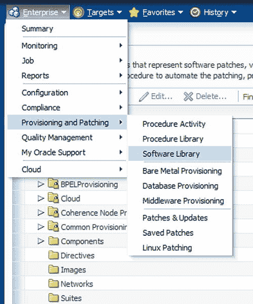
*图 7-4. 在 EM12c 中访问软件库*

在软件库中，已经存在许多文件夹，但应该创建一个新文件夹来存放脚本。右键点击 `Software Library`（目录中的顶层），然后点击 `Create Folder`（图 7-5）。

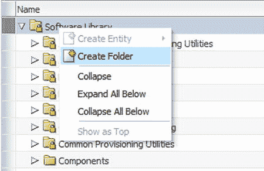
*图 7-5. 在 EM12c 软件库中创建文件夹*

屏幕图 7-6 弹出，允许您输入与文件夹相关的信息。

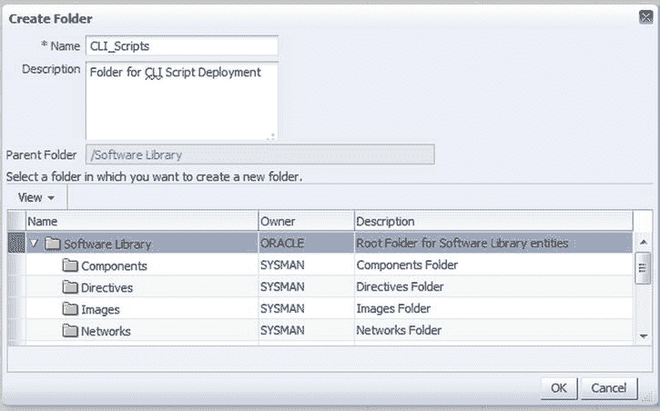
*图 7-6. 在软件库中创建文件夹的信息条目*

输入一个明确定义文件夹用途的名称，并添加一个描述以帮助任何阅读该文件夹属性的人。确认您希望在软件库的父目录中创建该文件夹，满意后点击`OK`。

返回到软件库的主页，新文件夹现在将出现在下拉列表中（图 7-7）：

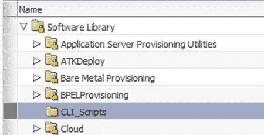
*图 7-7. 刚在软件库中为命令行脚本创建的新文件夹*

此文件夹将用于在软件库中存放`EM CLI`脚本，从而轻松地将它们与其他存储实体区分开来。

## 将脚本添加到软件库

从上一节创建的文件夹加载脚本是在软件库内的相同区域执行的。首先，高亮显示已创建的`CLI_Scripts`文件夹，然后依次点击`Actions`、`Create Entity`，最后点击`Component`（图 7-8）。

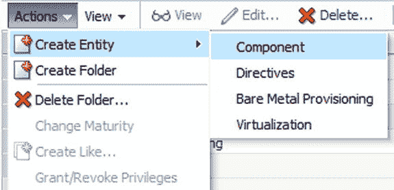
*图 7-8. 将脚本添加到软件库（即创建实体）*

脚本将被构建为一个可以从软件库部署的单一组件。如果多个脚本是单个部署过程的一部分，可以将它们存储在一个组件中。

您可以选择将文件上传到库中或引用文件（一个引用）。对于此处的示例，目标是签入一个脚本。它将被存储为一个单一的通用组件（即实体）。

选择将要上传到的软件库位置。在我们的示例中，我们将使用默认的上传共享位置。逻辑位置将是控制台内的`CLI_Scripts`文件夹。

# Enterprise Manager 12c Cloud Control 中的软件库与 CLI 作业操作

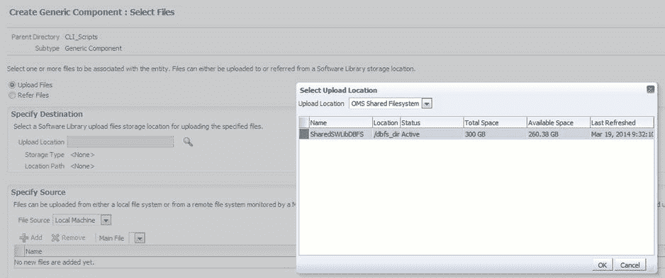

图 7-9. 如何在软件库中创建通用组件并选择文件

点击“确定”，系统会提示第二个窗口，您可以在其中提供有关即将添加到软件库的实体（即脚本）的信息（图 7-10）。

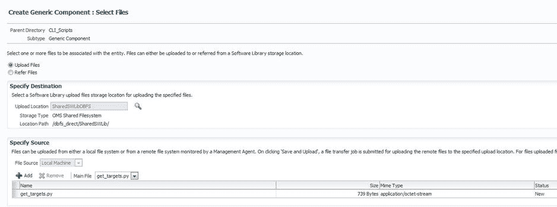

图 7-10. 为要上传到软件库的脚本输入描述性数据和路径信息

点击“下一步”添加脚本。我们上传的是一个简单的脚本，它以美观的视图列出目标（图 7-11）。点击“添加”按钮，浏览到脚本（它可以位于本地工作站上），然后点击“确定”。点击“保存”，因为我们不需要添加任何其他配置信息，至此脚本上传到软件库的操作即告完成。

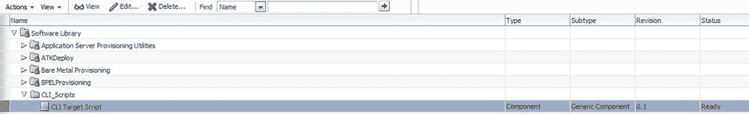

图 7-11. 在软件库文件夹 `CLI Target Script` 中添加、编辑和删除脚本的选项

 **提示**：所有签入软件库的实体必须具有唯一的名称。如果您添加的脚本与软件库中已有的脚本同名，系统会要求您在添加前对其进行重命名。

现在，`CLI Target Script` 在库中可见，并可供软件库使用。

## 构建报告定义库

可以构建软件库文件夹，从而创建一个可供存储库使用的库，而不是每次都编写新脚本或让脚本驻留在不同的主机或工作站上。

请像规划其他实体一样，仔细规划这个库。创建一个独立的库文件夹位置，并考虑此类型配置所需的空间分配。规划来自其他功能的实体，例如度量扩展、软件安装和应用程序构建，这些在完成复合报告时将成为报告定义的一部分。

## 使用 CLI 调用的 OEM 作业

企业作业是 EM 环境的支柱。它们在幕后运行我们作为 Enterprise Manager 12c Cloud Control 的一部分每天使用的许多功能。管理员拥有从命令行运行 EM 作业的附加能力。一旦收集了需求并熟悉了它们，设置通过 `emcli` 运行的作业是一个简单的过程。使用 EM CLI 中 `create_job` 动词的 `help` 函数，我们可以收集需求：

```
$ emcli help create_job
emcli create_job
     -name=<job_name>
     -type=<job_type>
     -input_file="property_file:<filename>"
Description:
 Create and schedule a job.

Options:
     -name: Optional parameter. The name may be specified in the input file instead.
     -type: Optional parameter. The type may be specified in the input file instead.
     -input_file: Required parameter. <filename> must be provided to load the properties for
                    creating and scheduling the job.

A template property file for the job_type can be obtained using EMCLI verb "describe_job_type".
 Another job of the same job type could also be used to generate the property file using EMCLI verb 
"describe_job".
 Please make sure that the property file is accessible to the EMCLI client for reading.

Sample:
 Create and schedule a job with name MYJOB1 and of job type MyJobType1 with property file present at 
location /tmp/myjob1_prop.txt
     emcli create_job -name=MYJOB1 -job_type=MyJobType1 -
input_file="property_file:/tmp/myjob1_prop.txt"
```

### 创建作业

必须执行以下步骤来创建作业。在我们的示例中，我们将首先对六个现有代理的主机执行升级，然后删除那些之前的代理。

**升级步骤：**
1.  检查有哪些代理可用于升级。
2.  输入并使用文件列出这些代理，并使用该文件作为我们作业的一部分。
3.  升级代理。
4.  升级完成后检查进程状态。

**移除旧代理步骤：**
1.  检查升级后可以清理哪些现有的代理安装。
2.  使用 EM CLI 卸载旧的代理安装。
3.  使用 EM CLI 主机命令删除每个旧的代理主目录。

### 步骤 1：升级代理

列出我们将作为 EM 作业一部分升级的代理：

```
>emcli get_upgradable_agents > /u01/app/scripts/upg_agents.txt

orcl2:3872 12.1.0.2.0 12.1.0.3.0 Linux x86-64
 /u01/app/oracle/Agent12c/core/12.1.0.2.0
orcl1:3872 12.1.0.2.0 12.1.0.3.0 Linux x86-64 /u01/app/oracle/Agent12c/core/12.1.0.2.0

>vi /u01/app/scripts/upg_agents.txt
移除版本信息和平台信息。剩下的应该是代理主机和端口：
orcl2:3872
orcl1:3872
...
```

使用此文件创建一个 EM 作业来升级代理，并确保 `stage_location` 目录值有至少 2 GB 的空间：

```
>emcli upgrade_agents -input_file="agents_file:/u01/app/scripts/upg_agents.txt" -job_
name="UPG_021814_AGENTS" -stage_location=/u01/app/jobs
The agent list size is 6

Upgradable Agents

Agent Installed Version Version After Upgrade Platform Oracle Home
----- ----------------- --------------------- -------- ----
orcl2:3872 12.1.0.2.0 12.1.0.3.0 Linux x86-64 /u01/app/oracle/agent12c/core/12.1.0.2.0
orcl1:3872 12.1.0.2.0 12.1.0.3.0 Linux x86-64 /u01/app/oracle/agent12c/core/12.1.0.2.0

You can run the the root.sh from the EM CLI to each of the hosts that have been granted root/sudo 
privileges (one more reason to be offered this access via the EM12c environment). If the preferred 
credentials do NOT have root access, then you will need to run it manually via the EM CLI or from 
each of the agent targets to complete the installations.

Agent Reason
----- ------
orcl1:3872 Preferred Privileged Credential for Oracle Home of Agent : Not Set | Privilege Delegation 
for Host : Not Set

Once the agent has been upgraded, you will see the following message so you can check the status of 
the job quickly from within the console:

Agent Upgrade Job submitted for Upgradable Agents shown above. Use emcli get_agent_upgrade_status 
command or goto EM CONSOLE -> Set Up -> Manage Cloud Control -> Upgrade Agents -> Agent Upgrade 
Results to see job status
Job Name : UPG_021814_AGENTS
>emcli get_agent_upgrade_status -job_name=UPG_021814_AGENTS

Showing for each agent in the job UPG_021814_AGENTS

Agent Status Started Ended
----- ------ ------- -----
orcl2:3872 Running 2014-02-18 15:32:58 MST -
orcl1:3872 Running 2014-02-18 15:32:58 MST –
...
```

如果发生任何失败，您需要通过控制台进行检查（这是最简单的访问方式），或者查询 EM 存储库。在此示例中，我们将查看高级状态：

```
>emcli get_agent_upgrade_status -job_name=UPG_021814_AGENTS

Showing for each agent in the job UPG_021814_AGENTS

Agent Status Started Ended
----- ------ ------- -----
orcl2:3872 Success 2014-02-18 15:32:08 MST 2014-02-18 15:53:22 MST
...
```

我们现在可以使用此信息为下一步创建输入文件，以移除我们不再需要在 EM12c 环境中的所有代理安装：

```
>emcli get_signoff_agents -output_file="/u01/app/work/signoff_021814.txt"
```

上述命令将输出到一个文件，该文件可用于下一步：

```
Agents available for Sign-off

Agent Installed Version Platform Oracle Home

----- ----------------- -------- -----------

orcl2:3872 12.1.0.3.0 Linux x86-64 /u01/app/oracle/agent12c/core/12.1.0.3.0

orcl1:3872 12.1.0.3.0 Linux x86-64 /u02/oracle/agent12cR2/core/12.1.0.3.0

orcl3:3872 12.1.0.3.0 Linux x86-64 /u01/app/oracle/agent12c/core/12.1.0.3.0

orcl4:3872 12.1.0.3.0 Linux x86-64 /u01/app/oracle/agent12c/core/12.1.0.3.0
```

要查看文件输出：

```
>cat /u01/app/oracle/work/signoff_agents.txt

orcl2:3872
orcl1:3872
orcl3:3872
orcl4:3872
emrp2:3872
orcl6:3872
```

步骤 2：移除旧代理

我们的第二个示例将清理所有已升级的代理。通过使用 EM CLI 的 `signoff_agents` 命令并在搜索中指定匹配字符串来移除代理：

```
>emcli signoff_agents -agents="oradba%" -job_name=CLEANUP_12cR2_AGNTS

可用于签出的代理

代理 已安装版本 平台 Oracle 主目录

----- ----------------- -------- -----------

orcl2:3872 12.1.0.3.0 Linux x86-64 /u01/app/oracle/agent12c/core/12.1.0.3.0

orcl1:3872 12.1.0.3.0 Linux x86-64 /u01/app/oracle/agent12c/core/12.1.0.3.0

已为上述代理提交代理签出作业。使用 emcli get_signoff_status 或前往 EM 控制台 -> 设置 -> 管理云控制 -> 升级代理 -> 代理升级后任务 -> 签出代理结果以查看作业状态
作业名称 : CLEANUP_12CR2_AGNTS
```

一旦所有作业都验证为已完成，应进行第二次检查，以确认相关每个代理都已收到签出状态：

```
>emcli get_signoff_status

显示每个作业的状态

作业名称 状态 总代理数 开始时间 结束时间

-------- ------ ------------ ------- -----

CLEANUP_12CR2_AGNTS 成功 2 2013-11-21 17:08:30 CST
2013-11-21 17:08:44 CST
```

请注意，签出操作并不会删除旧的代理主目录。我们现在将通过一个 EM CLI `host` 命令在登录后执行此操作：

```
>emcli execute_hostcmd –cmd=”rm -rf /u01/oracle/agent12c/core/12.1.0.2.0” -targets="remote-host:host"
```

此命令将从其运行的每个主机中删除先前未使用的目录主目录。

这些示例旨在向您展示一些非常简单的命令，它们完成了通常需要手动执行的多个步骤，从而减轻了管理员的负担。任何仔细阅读了 DBA 在六台服务器上必须执行的实际步骤（包括验证成功然后移除先前安装）的人，都会意识到 EM CLI 作业提交选项背后蕴含的强大能力。

信息出版商报告的导出/导入功能

BI Publisher (BIP) 现在作为第 4 版 (12.1.0.4) 的集成部分成为标准配置。随着这一变化，信息出版商报告 (IP 报告) 仍然受支持，但建议迁移到 BIP。

任何报告都需要大量的开发时间，而能够通过 EM CLI 导出和导入它非常有益；这对于您现有的 IP 报告来说也不例外。在此示例中，我们将首先列出然后导出一个名为 “Exadata Summary Report” 的 IP 报告：

```
>emcli get_reports –owner="KPOTVIN"
```

从 “KPOTVIN” 拥有的报告列表中，我们可以选择一个名为 `EXADATA_SUMMARY_REPORT` 的报告并导出它：

```
>emcli export_report -title="Exadata Summary Report" -owner="KPOTVIN" -output_file="$OMS_HOME/reports/exadata_summary.xml"
```

此报告现在将位于 `$OMS_HOME/reports` 目录中，文件将被命名为 `exadata_summary` 以便于识别。

然后要导入此报告，执行以下操作：

```
>emcli import_report -files="$OMS_HOME/reports/exadata_summary.xml"
```

导出 BIP 报告目前通过控制台执行，并将文件导出到本地文件。

在软件库中存储定义库

将定义文件存储在软件库中非常合理。没有人愿意继续创建和保留同一定义文件（又称响应文件）的多个副本。通过实施软件库，可以更少担心版本控制，因为这可以作为该功能的一部分进行管理。

创建定义文件是一个简单的过程：

```
>emcli get_procedures -type=DBPROV 
```

这将创建一个所有配置过程的列表，然后可用于创建定义文件；这将与部署或配置动词调用一起使用。此定义文件包含所有目标和过程步骤。与编写所有任务（就像响应文件消除了数据库配置助理 (dbca) 静默运行的类似工作）相比，将其用作“快捷方式”可以节省时间和额外精力。

您可以使用以下命令“描述”或列出命令和信息到输出文件：

```
>emcli describe_procedure_input -procedure=B35E10B1F427B4EEE040578CD78179DC > newoutputfile.properties
```

此命令将基于命令中列出的过程 GUID，在软件库目录中创建一个名为 “newoutputfile.properties” 的文件。

然后您可以使用 VI 或其他编辑器打开该文件，根据需要更改目标等信息并保存；接着，将其上传回软件库：

```
>emcli save_procedure_input –name=Prov_db12cR1_temp -procedure="DB12cR1 Template" -owner="KPOTVIN"
-input_file=data:$OMS_HOME/sw_files/newoutputfile.properties
```

该文件现已上传到软件库，可以下载以供将来使用，或者可以直接使用。

Oracle 可扩展性交换中心

Oracle 的可扩展性交换中心是一个云存储库（库），Oracle 和合作伙伴已向其贡献了脚本、插件和其他 Enterprise Manager 实体以供下载。可通过以下链接 (图 7-12) 通过 Web 浏览器访问可扩展性交换中心：`http://www.oracle.com/goto/emextensibility`。

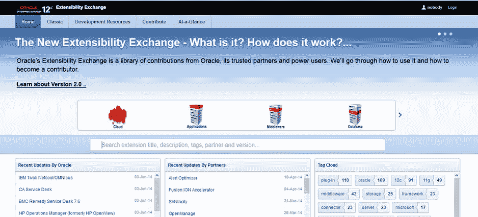

图 7-12。Oracle 可扩展性交换中心 2.0 版的主页

拥有可扩展性交换中心的好处类似于拥有配置库，只是范围是全球性的。它允许 EM12c 专业人员与 OEM 社区的其他人分享他们的知识和专长。它为社区中的人们提供了解决方案，为他们节省了原本会浪费在重新创建他人已花费宝贵时间原创的代码上的时间和资源。

重用 Enterprise Manager 实体（例如脚本、插件和补丁计划）的愿望很快变得明显，并且许多高级用户请求此功能。没有人喜欢重新发明轮子，借助可扩展性交换中心，EM12c 软件库被提升到了一个新的水平。可用实体的来源不再局限于 EM12c 存储库本地，而是现在任何有浏览器访问权限的人都可以获得；来自整个 Oracle 社区高级用户的贡献也同样可用。

随着 2014 年 6 月 2.0 版本的发布，可扩展性交换中心的未来前景广阔。随着 Enterprise Manager 功能的增强，新的卸载和导出功能以及新的脚本编写方法不断被发现。随着我们在 EM CLI 中实现的功能越来越多，我们计划看到更多的 Jython 和 JSON 脚本，这些脚本将涵盖我们现在在数据库环境中所做的大部分工作。然而，随着向移动设备的转移，谁知道会利用 ADF（应用程序开发表格）和 APEX 想出什么，所有这些都在 EM12c 中得到支持，并作为部署的一部分通过 EM CLI 编写脚本。很快，不仅会有插件和脚本，还可能有完整的监控实体套件通过可扩展性交换中心提供。

为了更好地理解这些功能，我们可以通过 Web 浏览器登录可扩展性交换中心。页面标题为用户提供了有关即将举行的 Enterprise Manager 培训和信息活动的丰富信息 (图 7-13)。还有一个链接，如果用户想继续访问该站点以获取更多信息或注册活动。


# 扩展性交换平台概述

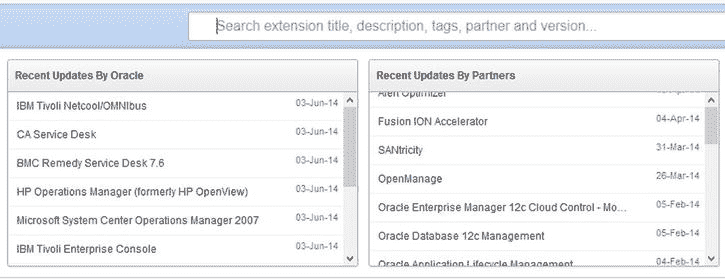

图 7-13。展示事件信息和扩展性交换平台网站上热门类别的页头页面

按受欢迎程度和实体数量排序的类别显示在事件页头的图 7-14 中。

## 搜索与最近更新

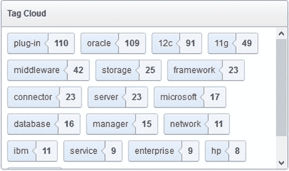

图 7-14。扩展性交换平台网站上由 Oracle 及合作伙伴创建的插件和实体的搜索栏及最近更新列表

搜索选项既实用又易于使用。只需输入一个关键词，它就会开始查找交换平台中标题包含该词条的所有实体。

如果您不想搜索，可以滚动到页面底部，按 Oracle、按合作伙伴和/或按 `标签` 浏览库中最近更新的扩展，如图 7-15 所示。标签是可用于提供链接按钮的搜索词，该按钮将快速带您找到所有符合该 `标签化` 搜索条件的实体或插件。

## 标签化搜索

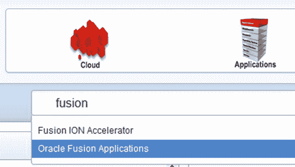

图 7-15。扩展性交换平台网站上的标签化搜索，以及每个标签搜索词对应的实体计数

在图 7-16 中，我们将对 `fusion` 进行一次简单的搜索。

## 执行搜索

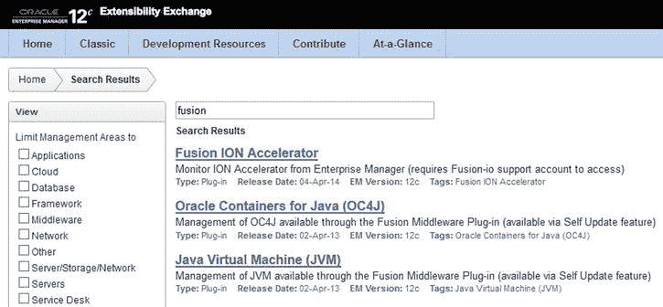

图 7-16。扩展性交换平台的搜索栏视图，以及响应关键词输入的快速搜索结果

如您所见，关键词 `fusion` 立即显示了结果。以我们的示例为例，我们将选择 `Oracle Fusion Applications`。

这将带我们到匹配搜索结果的实体页面（图 7-17），然后我们可以从下拉列表中选择。

## 插件详情页面

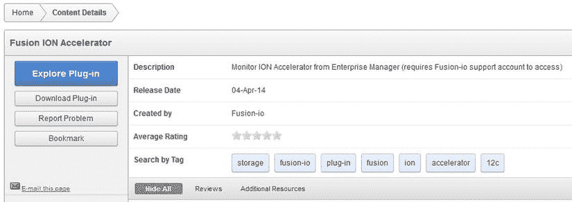

图 7-17。基于关键词输入的二级搜索页面，显示可供查看或下载的可用插件（即“实体”）列表

通过点击搜索中找到的第一个扩展，我们进入 Fusion ION Accelerator 插件的内容详情页面（图 7-18）。

图 7-18。Fusion ION Accelerator 插件的访问页面视图，显示文档、下载、报告和书签链接

请注意，您可以阅读该插件的完整文档 (`Explore Plug-in`)，下载它，如果遇到插件问题可以进行报告，或者通过网络浏览器将其添加书签以便日后参考。

为了网站未来的改进，如果您最终下载了该插件，请记得回来为其评分。收到反馈对于扩展性交换平台的其他用户非常有价值。

如果您选择下载一个插件，并且它来自 Oracle，系统会将您带到 Oracle 或合作伙伴的页面以访问下载选项。

### 经典视图

现在，如果您更习惯扩展性交换平台的先前版本，您可以选择点击页面顶部的 `Classic` 标签页，这将恢复到该优秀网站的先前版本。习惯新的应用程序用户界面通常需要时间，因此我建议您先使用新界面一段时间，然后再选择切换回去。

## 开发资源

如果您的环境拥有度量扩展、插件以及对您的 EM12c 环境有价值的其他附加组件，并且您想了解如何将它们贡献到 Exchange Extensibility 存储库，有一个 `开发资源` 页面会解释如何操作。此页面包括工具包、指南、白皮书和屏幕录像的下载，所有这些都有助于简化开发和提交实体的过程。

## 贡献

一旦您完成了要提交到扩展性交换平台的实体的正确开发，必须填写 `Contribute` 标签页上的表单。填写完成后，点击 `Create`。Oracle 将继续验证您的贡献，然后将其添加到扩展性交换平台目录。

## 概览

最后一个标签页极其重要，尽管它位于 Exchange Extensibility 页面上的位置如此。这个 `概览` 页面（图 7-19）可以快速查看哪个插件提供了什么功能。

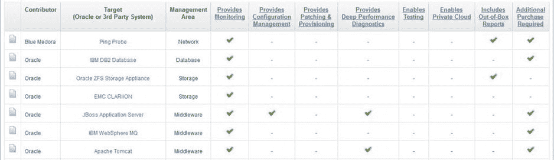

图 7-19。“概览”标签页以及令人印象深刻的插件比较功能

它还提供了出色的搜索功能，包括针对不同插件的过滤器和比较选项（图 7-20）。

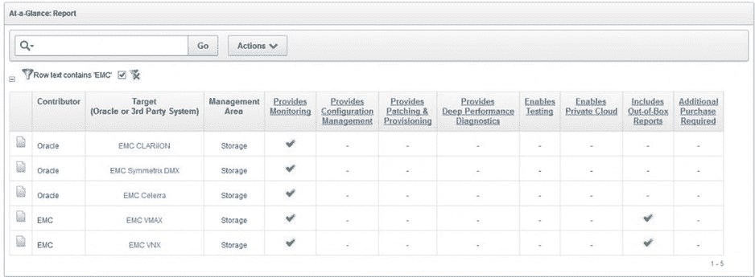

图 7-20。EMC 插件的清晰搜索结果和比较，显示哪些插件包含开箱即用的报告

在此图中，我们对 EMC 插件进行了快速搜索，有两个插件提供了 `开箱即用` 的报告，因此，如果这是您需要的插件的一项要求，此页面将快速为您定位到所需的实体。

## 总结

软件库是您用于 EM12c 环境的实体的内部存储库。在扩展性交换平台中拥有一个全局软件库，使 Enterprise Manager 能够共享他们以前必须自行设计的实体。

在本章中，我们讨论了为什么在能够使用 EM12c 控制台的许多功能（包括置备和 `EM CLI` 脚本功能）之前，您必须配置软件库。我们演示了如何配置一些更高级的功能，以及它们如何满足您的日常需求。

我们还介绍了强大的扩展性交换平台网站。这是 Oracle 的实体库，允许 Oracle、Oracle 合作伙伴以及像您这样的高级用户开发、测试、确保质量，然后与 Oracle 社区共享实体，使所有人受益。为每个人提供一个一站式的位置来查看、试用和评价插件、度量扩展以及未来的实体，这是 Oracle 社区在行业内相互分享丰富技能的一种绝佳方式。

# 第 8 章：EM CLI 脚本示例


在整本书中，我们向您展示了如何使用 `EM CLI` 管理您的 OEM 环境，包括使用命令行、`Jython` 脚本选项（该选项使用 `JSON` 和 `Jython`）。

本章包含一些示例脚本供您适配到您的环境中。

*   第 1 节：函数库和 Shell 脚本
*   第 2 节：`EM CLI` 和 Veritas Cluster Services
*   第 3 节：基本 OMS 服务器管理脚本
*   第 4 节：`EM CLI` 脚本和交互式脚本

## 第 1 节：函数库和 Shell 脚本

第 5 章探讨了您可以将 `EM CLI` 与 shell 脚本结合使用的各种方式。本节扩展了这些解决方案，并为您提供了可在环境中使用的示例脚本。

本章中的示例已为清晰起见进行了编辑，主要是通过移除 `echo` 语句的格式选项和重定向到日志文件。您在脚本中必须提供的两个最重要的事项是：用于有监控的在线使用的清晰说明，以及用于通过 `Cron` 或 `OEM` 等其他作业调度器进行无人值守执行的完整日志文件。

### 命令行输入

使用经过验证的输入值可提供可扩展性和易用性。在部署脚本之前，请考虑添加并测试这一重要功能。


本节中几乎所有脚本都需要在命令行输入一个或多个变量，通常就是目标名称。命令行传递的变量会按其出现的顺序在脚本主体中引用。可执行文件表示为 `$0`，其后的第一个字符串是 `$1`，依此类推。例如，可以使用类似这样的条目：

```
./oem_target_blackout.sh orcla
```

此例将变量 `$0` 解释为脚本名 `oem_target_blackout.sh`，将 `$1` 解释为数据库名。脚本中的逻辑应验证所需的命令行输入非空，或者退出时给出明确的错误陈述，告知用户或日志文件出了什么问题。在示例脚本中，你会看到这种技术的几个应用实例。

## 存活性证据

你开发的每个 Shell 脚本都应能够在命令行上直接执行以测试单次运行，同时也应无需任何修改就能通过 Cron 等调度器执行。要避免使用同一脚本的两个版本来支持这两种操作模式。随着环境复杂性的增加，这可能演变成维护的噩梦。相反，应通过检查调用脚本的会话性质来测试是否存在活跃的用户会话。在运行时，每个活跃用户连接都会在 `/dev` 目录下为每个终端会话创建一个文件系统条目。TTY 是 **电传会话** 的旧称——即你的终端会话。当然，通过 Cron 执行的脚本不是从终端调用的，因此与那些执行没有关联的 `/dev/tty`。

使用 `if` 语句测试 TTY 会话的存在，并相应地设置运行时变量。例如，如果你的脚本要求在命令行上传递数据库名，那么对于有人值守的会话和 cron/计划执行的会话，对缺失输入的处理方式会有所不同：

```
if [ ${1} -eq 0 ]; then
  if tty -s; then
      read -p "Please provide the name of the database: " thisSID
  else
      echo "The database name was not provided on the command line"  >>runtime.log
      exit
   fi
fi
```

为了清晰起见，示例脚本中移除了这类会话检查。

## 示例函数库

本函数库被本节剩余部分中的许多 Shell 脚本引入。它也可以在终端会话中引入以便立即使用，或引入到任何其他 Shell 脚本中使用。

```
Sample Script: emcli_functions.lib
#!/bin/sh
#/* vim: set filetype=sh : */
