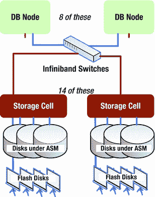

# 第 1 章：Exadata 基础

自 2008 年 9 月推出以来，Exadata 已迅速成为 IT/数据库领域既熟悉又常见的术语。在其短暂的历史中，该系统经历了数次变革，从存储解决方案演变为完整的数据库一体机。尽管它还不是家喻户晓的名字，但 Exadata 的装机量已经增长到即将在全国各地的数据中心变得司空见惯的程度。那么，*究竟什么是* Exadata？或许最好先从说明 Exadata *不是*什么开始。Exadata 不是：

*   自切片面包以来最伟大的发明；
*   能单枪匹马消除您应用程序中所有争用问题的唯一数据库机器；
*   解决您所有其他数据库性能问题的期待已久的灵丹妙药；
*   一个由中土世界巫师建造、只有被选中少数人才能理解的黑匣子。

## *究竟什么是* Exadata？

既然您知道了 Exadata 不是什么，现在让我们来讨论它是什么。Exadata 是一个系统，由经过匹配和调优的组件组成，提供其他配置无法获得的增强功能，能够提升数据库层的性能。该系统包括数据库服务器、存储服务器、带有交换机的内部 InfiniBand 网络以及存储设备（磁盘），所有这些都由 Oracle 高级客户支持人员根据客户需求进行配置。（对该配置的更改，包括更改数据和恢复磁盘组之间的默认存储分配，可以在 Oracle 高级客户支持人员的协助下完成。）图 1-1 展示了 Exadata 系统的总体布局。

图 1-1. Exadata 系统的总体布局

Exadata 能改善所有情况吗？不能，但这并非其设计初衷。Exadata 最初是作为数据仓库/商业智能一体机设计的，从 V2 版本开始增加了在线事务处理（OLTP）应用支持。然而，并非 Exadata 的每个特性都适用于可能出现的每个查询、应用程序或情况。如果您的应用程序没有遭受争用问题，那么 Exadata 很可能比使用现成组件的系统提供更短的响应时间和更好的吞吐量。

Exadata 并非生来就是今天的样子；最初，它被构想为 RAC（真正应用集群）安装的开源存储解决方案，旨在解决通过网格基础架构（Oracle 内部称为 SAGE，即网格环境存储设备）传输大量数据的问题。2008 年 9 月，Oracle 发布了 HP Oracle 数据库一体机，重点展示了 Exadata 存储服务器。当时，Exadata 仅指存储服务器组件，尽管 HP Oracle 数据库一体机包含了后来发布的 Exadata 产品中的所有组件。

## 可用配置

取代 X2 系列的 X3 系列 Exadata 机器提供以下五种配置：

*   `X3-2 八分之一机架`：两台数据库服务器，每台配备两颗八核至强处理器（启用八个核心）及 256GB 内存，三台存储服务器，以及三十六块磁盘驱动器。
*   `X3-2 四分之一机架`：两台数据库服务器，每台配备两颗八核至强处理器及 256GB 内存，三台存储服务器，以及三十六块磁盘驱动器。
*   `X3-2 半机架`：四台数据库服务器，每台配备两颗八核至强处理器及 256GB 内存，七台存储服务器，八十四块磁盘驱动器，以及一个用于扩展的脊柱交换机。
*   `X3-2 全机架`：八台数据库服务器，每台配备两颗八核至强处理器及 256GB 内存，十四台存储服务器，一百六十八块磁盘驱动器，以及一个用于扩展的脊柱交换机。
*   `X3-8 全机架`：两台数据库服务器，每台配备八颗十核至强处理器及 2TB 内存，十四台存储服务器，一百六十八块磁盘驱动器，一个用于扩展的脊柱交换机，并且不含键盘/视频/鼠标模块。

总的来说，按“同类相比”，X3 系列 Exadata 机器的性能是已停产的 X2 系列的两倍。如前所述，在 `X3-2` 系列中，新增了 `八分之一机架` 配置，其计算能力略低于 `X2-2 四分之一机架`（后者提供总共十二个处理器核心，全部启用），前者总共十六个处理器核心，其中八个启用）。与 `X3-2 四分之一机架` 相比，这降低了许可成本，使得 `八分之一机架` 成为进入 Exadata 领域的非常合适且经济高效的 `X3-2` 入门点。

## 存储

原始存储容量取决于您选择的是高容量还是高性能驱动器——高容量 `串行连接 SCSI (SAS)` 驯动器每块提供 3TB 原始存储，转速为 7,200RPM；而高性能驱动器每块提供 600GB，转速为 15,000RPM。对于配置了高容量磁盘的 `四分之一机架`，可提供 108TB 的总原始存储，在配置了正常的自动存储管理 (`ASM`) 冗余后，大约有 40TB 可用于数据。使用高性能磁盘时，`四分之一机架` 机器的总原始存储为 21.1TB，在正常的 `ASM` 冗余下，可用数据存储空间约为 8.4TB。高冗余配置会使两种配置的存储空间再减少大约三分之一；其代价是在磁盘故障时增加了一个 `ASM` 镜像，因为高冗余提供两份数据副本。正常冗余则提供一份副本。

磁盘通过存储服务器（或单元）访问，这些服务器运行自己的 Linux 版本，其中内嵌了 Oracle 内核的一个子集。有趣的是，数据库服务器无法直接访问存储；它们“看到”磁盘的唯一途径是通过 `ASM`。在 `X3-2 四分之一机架` 和 `八分之一机架` 配置中，有三个存储单元，每个存储单元控制十二块磁盘。每台存储服务器提供两颗六核至强处理器和 24GB 内存。在各种 Exadata 配置中，差异主要体现在数据库服务器（通常称为 `计算节点`）的数量以及存储服务器或单元的数量上——存储单元的数量越多，Exadata 机器内部能控制的存储就越多。如前所述，存储服务器也运行集成的 Oracle 内核。这使得数据库服务器能够“移交”（或卸载）部分合格的查询，从而数据库服务器只需处理结果集的缩减数据量，而不必扫描目标对象的每个数据或索引块。这被称为 `智能扫描`。`智能扫描` 的工作原理及其触发条件将在 第 2 章 中介绍。

## 智能闪存缓存

Exadata 性能套件的另一部分是 `智能闪存缓存`，每个存储单元配备 384GB 固态闪存存储，配置在四个 `Sun Flash Accelerator F20 PCIe 卡` 上。采用 `四分之一机架` 配置（三台存储服务器/单元）时，可提供 1.1TB 闪存存储；`全机架` 则提供 5.3TB 闪存存储。闪存缓存可用作智能缓存来服务大量的随机读取，也可以配置为闪存磁盘设备并挂载为 `ASM` 磁盘组。该主题将在 第 4 章 中深入探讨。

## 更多存储

扩展机架包含存储服务器和磁盘驱动器。有三种不同的配置可供选择：`四分之一机架`、`半机架` 和 `全机架`，其中任何一种都可以连接到任何 Oracle Exadata 机器。对于 `四分之一机架` 配置，将需要一个额外的脊柱交换机；该交换机的 IP 地址在配置时保留未分配，因此如果安装了交换机，该地址将可用，无需重新配置机器。

除了增加存储，这些机架还为 `智能扫描` 操作增加了计算能力，最小的扩展机架包含四台存储服务器和四十八块磁盘驱动器，增加了八颗六核 CPU。最大的扩展机架提供 18 台存储服务器和 216 块磁盘驱动器。实际存储容量取决于系统使用的是高容量还是高性能磁盘驱动器；在单个 Exadata 机器/扩展机架配置中不能混合使用驱动器类型，因此如果 Exadata 系统使用高容量驱动器，并且这些磁盘要添加到现有的磁盘组中，那么扩展机架也必须包含高容量磁盘。

此要求的一个原因是，`ASM` 会将数据条带化分布到磁盘组中的所有驱动器上，因此磁盘单元的容量和几何结构必须在存储层上保持一致。扩展机架的磁盘不一定需要添加到现有的磁盘组中；可以从中创建完全独立的磁盘组。您不能在扩展机架内混合存储类型，但如果要从该存储创建单独的磁盘组，则磁盘类型不需要与主机系统匹配。这些扩展机架的妙处在于它们能与主机 Exadata 系统上的现有存储无缝集成。如果将这些磁盘添加到现有的磁盘组中，`ASM` 会自动触发重新平衡操作，以在所有可用磁盘上均匀分布数据区。

### 须知事项

该系统最初是作为数据仓库解决方案进行营销的。一年后，`Exadata V2` 发布，这次被宣传为一个完整的集成数据库一体机，包括数据库服务器、存储服务器、内部 InfiniBand 网络以及旨在使各组件协同工作作为统一整体的软件。Oracle 将该一体机宣传为第一台用于 OLTP 的数据库机器，因此现在 `Exadata` 成为数据仓库和 OLTP 系统的首选机器。次年（2010 年）发布了 `Exadata X2`，通过增加第二种配置（`X2-8`）延续了改进。这为客户提供了两种全机架实施选项。2012 年 9 月，`Exadata X3` 上市，再次提升了性能，并提供了第五种配置选项——`八分之一机架`。

Exadata 系统提供四种配置，它是一个由数据库服务器、存储服务器、磁盘驱动器以及内部 InfiniBand 网络组成的复杂架构，其经过修改的设计以独特的方式解决了许多性能问题。它是首个采用"分而治之"方法进行查询处理的系统，能显著提升性能并缩短查询响应时间。它还包括**智能闪存缓存**，这是一种能够处理大量读取操作的写回缓存，专为在线事务处理系统设计。此缓存也可以配置为闪存磁盘设备。额外的存储可通过**Exadata 扩展机架**的形式提供，它可以添加到任何 Exadata 配置中，以扩展存储容量并增加存储单元的计算能力。扩展机架中的存储可以与 Exadata 服务器中的类型相同；然而，在某些情况下，Oracle 建议为扩展机架使用大容量硬盘，而不论主机 Exadata 系统中配置的是何种存储。

接下来，我们将讨论 Exadata 提供的各种性能增强功能，以及这些功能至少在有限范围内是如何实现的。本书并非详尽无遗的专著，而是一本"入门"指南，旨在帮助您理清头绪。您可以阅读其他更具技术性的书籍来深入了解这台机器，但有了本书的基础知识，您将更容易理解 Exadata 具备哪些其他系统所不具备的功能。

