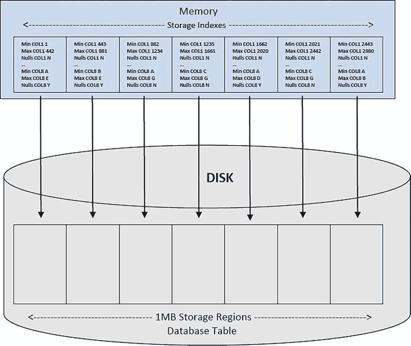

# 第 2 章


## 智能扫描与卸载

Exadata 提供的增强功能之一是**智能扫描**，这是一种可以将部分查询**卸载**或移交到存储服务器进行处理的机制。这种"分而治之"的方法是 Exadata 能够提供如此卓越性能的原因之一。这是通过 Exadata 的配置实现的，其中数据库服务器和存储单元提供计算能力和处理查询的能力，这要归功于在存储单元上运行的独特存储服务器软件。

## 智能扫描

并非每个查询都能进行智能扫描，因为必须满足某些条件。这些条件如下：
* 必须使用全表扫描或全索引扫描，此外还需要直接路径读取。
* 必须使用以下一个或多个简单的比较运算符：
  * =
  * <
  * >
  * >=
  * =<
  * BETWEEN
  * IN
  * IS NULL
  * IS NOT NULL

当并行运行查询时，智能扫描也将可用，因为并行查询从属进程默认执行直接路径读取。当然，其他条件也必须满足：并行执行仅确保使用直接路径读取。智能扫描如何提升性能？它减少了数据库服务器为返回结果而必须处理的数据量。卸载过程将工作负载分配到计算节点和存储单元之间，涉及更多的 CPU 资源，并将更小的数据集返回给接收进程。

卸载不是读取 10,000 个数据块来返回 1,000 行数据，而是允许存储单元利用访问和过滤谓词执行部分工作，并仅发回符合所提供条件的行。与并行查询从属进程的操作类似，卸载过程将工作分配到可用的存储单元，每个单元返回存储在该特定磁盘子集中的任何符合条件的行。并且，与并行查询类似，这些"片段"结果被合并成最终的结果集。卸载还减少了节点之间的实例间传输，从而减少了**闩锁**和**全局锁**。闩锁尤其消耗 CPU 周期。更少的闩锁等同于进一步减少 CPU 周期，从而提升性能。CPU 工作和执行时间的净"节省"可能是相当可观的；在非 Exadata 系统上需要数分钟执行的查询，使用智能扫描后有时可以在数秒内完成。

## 执行计划与指标


### 执行计划中的 Smart Scan 活动报告与验证

如果执行计划是优化器在运行时生成的实际计划，那么它们可以报告 Smart Scan 活动。符合条件的执行计划可以在 `V$SQL_PLAN` 和 `DBA_HIST_SQL_PLAN` 视图中找到；当使用 `ON` 选项时，`autotrace` 会生成这些计划；或者也可以通过启用 `10046` 跟踪并使用 `tkprof` 处理生成的跟踪文件来找到它们。使用 `EXPLAIN` 模式的 `autotrace` 可能无法提供与运行时生成的计划相同的计划，因为它仍然可能使用基于规则的优化器决策来生成计划。`EXPLAIN PLAN` 也是如此。（我们见过 `EXPLAIN PLAN` 和 `10046` 跟踪报告不同执行计划的情况。）`tkprof` 工具也提供了 `explain` 模式，它同样可能提供误导性的计划。默认情况下，`tkprof` 提供执行中的实际计划，因此使用命令行的 `explain` 选项是不必要的。

### 识别执行计划中的 Smart Scan 操作

在执行计划中，可以通过以下三种方式之一识别 Smart Scan：

*   `TABLE ACCESS STORAGE FULL`
*   `INDEX STORAGE FULL SCAN`
*   `INDEX STORAGE FAST FULL SCAN`

出现一个或多个这样的操作并不意味着实际发生了 Smart Scan；应使用其他指标来验证 Smart Scan 的执行。

## 使用视图列验证 Smart Scan

`V$SQL` 视图（对于 RAC 数据库，是 `GV$SQL`）有两个列提供了关于单元格卸载执行的更多信息：`io_cell_offload_eligible_bytes` 和 `io_cell_offload_returned_bytes`。如果确实执行了 Smart Scan，这些列将填充有关给定 `sql_id` 的单元格卸载活动的相关信息。

`io_cell_offload_eligible_bytes` 列报告符合卸载条件的数据字节数。这是在查询执行期间可以卸载到存储单元的数据量。`io_cell_offload_returned_bytes` 列报告通过常规 I/O 路径返回的字节数。这些是未被卸载到单元格的字节。这两个值之间的差值提供了查询执行期间实际卸载的字节数。如果没有使用 Smart Scan，这两个列的值都将为 0。有些情况下，`io_cell_offload_eligible_bytes` 列的值会等于 0，但 `io_cell_offload_returned_bytes` 列的值不为 0。这种情况通常（但不总是）出现在引用固定视图（如 `GV$SESSION_WAIT`）或其他数据字典视图（例如 `V$TEMPSEG_USAGE`）时。此类查询不被视为符合卸载条件。（这些视图不可卸载，因为它们可能暴露驻留在数据库计算节点上的内存结构，但这并不表示它们不符合 Smart Scan 的条件【该视图的一个或多个基础表可能符合条件】。）`V$SQL_PLAN`/`GV$SQL_PLAN` 中存在投影数据就足以证明执行了 Smart Scan。

### 查询示例

查看一个执行了 Smart Scan 的查询示例，使用 `smart_scan_ex.sql` 脚本，我们可以看到：

```
SQL> select *
  2  from emp
  3  where empid = 7934;

EMPID EMPNAME                                              DEPTNO
---------- ---------------------------------------- ----------
      7934 Smorthorper7934                                         15

Elapsed: 00:00:00.21

Execution Plan
----------------------------------------------------------
Plan hash value: 3956160932

| Id  | Operation                 | Name | Rows  | Bytes | Cost (%CPU)| Time     |

|   0 | SELECT STATEMENT          |      |     1 |    28 |  6361   (1)| 00:00:01 |
|*  1 |  TABLE ACCESS STORAGE FULL| EMP  |     1 |    28 |  6361   (1)| 00:00:01 |

Predicate Information (identified by operation id):
---------------------------------------------------
   1 - storage("EMPID"=7934)
       filter("EMPID"=7934)

Statistics
----------------------------------------------------------
          1  recursive calls
          1  db block gets
      40185  consistent gets
      22594  physical reads
        168  redo size
        680  bytes sent via SQL*Net to client
        524  bytes received via SQL*Net from client
          2  SQL*Net roundtrips to/from client
          0  sorts (memory)
          0  sorts (disk)
          1  rows processed

SQL>
```

请注意，执行计划通过 `TABLE ACCESS STORAGE FULL` 操作报告正在使用 Smart Scan。通过快速查询 `V$SQL` 来验证这一点，我们看到：

```
SQL> select sql_text,
  2         io_cell_offload_eligible_bytes,
  3         io_cell_offload_returned_bytes
  4  from v$sql
  5  where sql_id = '...';

SQL_TEXT                     IO_CELL_OFFLOAD_ELIGIBLE_BYTES IO_CELL_OFFLOAD_RETURNED_BYTES
---------------------------- ----------------------------- -----------------------------
select * from emp where ...                        1835008                           183508

SQL>
```


## Smart Scan 性能测试与优化

### 性能测试

以下查询用于分析智能扫描（Smart Scan）节省的 I/O 比例：

```sql
SQL>select  sql_id,
  2  io_cell_offload_eligible_bytes qualifying,
  3  io_cell_offload_eligible_bytes - io_cell_offload_returned_bytes actual,
  4  round(((io_cell_offload_eligible_bytes - io_cell_offload_returned_bytes)/io_cell_offload_eligible_bytes)*100, 2) io_saved_pct,
  5  sql_text
  6  from v$sql
  7  where io_cell_offload_returned_bytes> 0
  8  and instr(sql_text, 'emp') > 0
  9  and parsing_schema_name = 'BING';
```

查询结果如下：

```text
SQL_ID        QUALIFYING     ACTUAL IO_SAVED_PCT SQL_TEXT
------------- ---------- ---------- ------------ -------------------------------------
gfjb8dpxvpuv6  185081856   42510928        22.97 select * from emp where empid = 7934
```

根据结果，I/O 节省百分比为`22.97%`，这意味着 Oracle 处理的数据量比未执行智能扫描时减少了近 23%。

### 禁用 Smart Scan

在会话中设置`cell_offload_processing=false`，使用`no_smart_scan_ex.sql`脚本重新执行查询：

```sql
SQL> alter session set cell_offload_processing=false;

Session altered.

Elapsed: 00:00:00.00
SQL>
SQL> select *
  2  from emp
  3  where empid = 7934;

EMPID EMPNAME                                             DEPTNO
---------- ---------------------------------------- ----------
     7934 Smorthorper7934                                         15

Elapsed: 00:00:03.73

Execution Plan

Plan hash value: 3956160932

| Id  | Operation                 | Name | Rows  | Bytes | Cost (%CPU)| Time     |

|   0 | SELECT STATEMENT          |      |     1 |    28 |  6361   (1)| 00:00:01 |
|*  1 |  TABLE ACCESS STORAGE FULL| EMP  |     1 |    28 |  6361   (1)| 00:00:01 |

Predicate Information (identified by operation id):

1 - filter("EMPID"=7934)

Statistics

1  recursive calls
          1  db block gets
      45227  consistent gets
      22593  physical reads
          0  redo size
        680  bytes sent via SQL*Net to client
        524  bytes received via SQL*Net from client
          2  SQL*Net roundtrips to/from client
          0  sorts (memory)
          0  sorts (disk)
          1  rows processed

SQL>
SQL> set autotrace off timing off
SQL>
SQL> select sql_id,
  2  io_cell_offload_eligible_bytes qualifying,
  3  io_cell_offload_eligible_bytes - io_cell_offload_returned_bytes actual,
  4  round(((io_cell_offload_eligible_bytes - io_cell_offload_returned_bytes)/io_cell_offload_eligible_bytes)*100, 2) io_saved_pct,
  5  sql_text
  6  from v$sql
  7  where io_cell_offload_returned_bytes > 0
  8  and instr(sql_text, 'emp') > 0
  9  and parsing_schema_name = 'BING';

no rows selected

SQL>
```

没有智能扫描时，查询耗时`3.73`秒，处理了全部`185081856`字节的数据。由于禁用了卸载处理，存储单元未提供任何查询处理协助。有趣的是，执行计划报告了`TABLE ACCESS STORAGE FULL`，这通常与智能扫描相关。缺少谓词信息以及卸载字节查询的“no rows selected”结果证明，智能扫描并未执行。禁用单元卸载处理造成了明显的执行时间差异，这证明了智能扫描的威力。

对于更大数据量，智能扫描的性能也可能优于索引，它允许 Oracle 在返回满足查询条件的行时，将 I/O 减少数 GB 甚至数 TB。然而，在某些情况下，智能扫描并非最佳选择；例如为表添加索引后，第三次执行相同的查询集（再次使用`smart_scan_ex.sql`脚本）：

### 使用索引

```sql
SQL> create index empid_idx on emp(empid);

Index created.

SQL>
SQL> set autotrace on timing on
SQL>
SQL> select *
  2  from emp
  3  where empid = 7934;

EMPID EMPNAME                                             DEPTNO
---------- ---------------------------------------- ----------
     7934 Smorthorper7934                                         15

Elapsed: 00:00:00.01

Execution Plan

Plan hash value: 1109982043

| Id | Operation                   | Name      | Rows  | Bytes | Cost(%CPU)| Time    |

|  0 | SELECT STATEMENT            |           |     1 |    28 |     4  (0)| 00:00:01|
|  1 |  TABLE ACCESS BY INDEX ROWID| EMP       |     1 |    28 |     4  (0)| 00:00:01|
|* 2 |   INDEX RANGE SCAN          | EMPID_IDX |     1 |       |     3  (0)| 00:00:01|

Predicate Information (identified by operation id):

2 - access("EMPID"=7934)

Statistics

1  recursive calls
  0  db block gets
  5  consistent gets
  2  physical reads
148  redo size
684  bytes sent via SQL*Net to client
524  bytes received via SQL*Net from client
  2  SQL*Net roundtrips to/from client
  0  sorts (memory)
  0  sorts (disk)
  1  rows processed
SQL>
SQL> set autotrace off timing off
SQL>
SQL>select sql_id,
  2  io_cell_offload_eligible_bytes qualifying,
  3  io_cell_offload_returned_bytes actual,
  4  round(((io_cell_offload_eligible_bytes - io_cell_offload_returned_bytes)/io_cell_offload_eligible_bytes)*100, 2) io_saved_pct,
  5  sql_text
  6  from v$sql
  7  where io_cell_offload_returned_bytes> 0
  8  and instr(sql_text, 'emp') > 0
  9  and parsing_schema_name = 'BING';

no rows selected

SQL>
```

请注意，优化器选择了索引范围扫描，而不是将谓词卸载到存储单元。索引范围扫描的耗时远少于智能扫描的耗时，因此，在某些情况下，智能扫描可能并非访问数据的最有效路径。这也说明了现有索引可能带来的问题，即优化器可能选择使执行路径更糟的索引，这解释了为什么一些 Exadata 资料建议删除索引以提高性能。虽然最终可能决定删除索引对于查询或查询组的整体性能是最佳选择，但此处不提供此类建议，因为每种情况都不同，需要根据具体情况评估；对一个 Exadata 系统和应用程序有益的做法，可能对另一个并非如此。唯一能够相对确定是否要删除某个索引的方法，是在尽可能接近生产的环境中进行测试并评估结果。

### Smart Scan 优化

智能扫描使用各种优化来完成任务。它实现了三项主要优化：列投影、谓词过滤和存储索引。由于存储索引将在下一章详细讨论，本节将重点讨论前两项优化。目前只需了解，存储索引不同于常规索引，它们告知 Exadata *不要*在何处查找数据。这一点现在可能令人困惑，但稍后将深入探讨。接下来章节的主要焦点将是列投影和谓词过滤。

#### 列投影

什么是列投影？它是 Exadata 仅返回查询所需列的能力。在使用通用硬件的传统系统中，Oracle 会从存储单元完整获取感兴趣的数据块，将它们加载到缓冲区缓存中。然后，Oracle 从这些块中提取列，最后进行过滤以仅返回选择列表中的列。因此，整行数据都会返回，以便在显示最终结果之前进行进一步处理。列投影在数据到达数据库服务器*之前*进行过滤，仅返回选择列表中的列，以及（如果适用）连接操作所需的列。Exadata 不是返回整个数据块或行，而是仅返回完成查询操作所需的数据。这可以显著减少数据库服务器处理的数据量。


以包含 45 列的表和包含其中 7 列的选择列表为例。列投影仅返回这 7 列，而不是全部 45 列，从而显著减轻数据库服务器的工作负载。假设在查询中添加一个两列的连接条件，并从另一个包含 71 列的表中选择另外两列；列投影将返回选择列表中的 9 列和连接条件中的 4 列（假设连接列不在选择列表中）。13 列的数据量远小于 116 列（第一个表的 45 列加上第二个表的 71 列），这是智能扫描能够如此快速的原因之一。列投影信息可从`V$SQL_PLAN`的`PROJECTION`列或`DBMS_XPLAN`包中获取，因此你可以选择两者中更容易使用的一个；仅当向`DISPLAY_CURSOR`函数传递了“+projection”参数时（如本例所示，来自`smart_scan_ex.sql`），才会返回投影信息，该示例同时使用了两种检索列投影数据的方法：

```
SQL> select *
  2  from emp
  3  where empid = 7934;

EMPID EMPNAME                                      DEPTNO
---------- ---------------------------------------- ----------
      7934 Smorthorper7934                                  15

Elapsed: 00:00:00.16

SQL> select sql_id,
  2         projection
  3  from v$sql_plan
  4  where sql_id = 'gfjb8dpxvpuv6';

SQL_ID        PROJECTION
------------- ----------------------------------------------------------------------------
gfjb8dpxvpuv6 "EMPID"[NUMBER,22], "EMP"."EMPNAME"[VARCHAR2,40], "EMP"."DEPTNO"[NUMBER,22]

SQL>
SQL> select *
  2  from table(dbms_xplan.display_cursor('&sql_id','&child_no', '+projection'));
Enter value for sql_id: gfjb8dpxvpuv6
Enter value for child_no:

PLAN_TABLE_OUTPUT
-------------------------------------------------------------------------------------------SQL_ID  gfjb8dpxvpuv6, child number 0

select * from emp where empid = 7934

Plan hash value: 3956160932

| Id  | Operation                 | Name | Rows  | Bytes | Cost (%CPU)| Time     |

|   0 | SELECT STATEMENT          |      |       |       |  6361 (100)|          |
|*  1 |  TABLE ACCESS STORAGE FULL| EMP  |     1 |    28 |  6361   (1)| 00:00:01 |

Predicate Information (identified by operation id):

1 - storage("EMPID"=7934)
       filter("EMPID"=7934)

Column Projection Information (identified by operation id):

1 - "EMPID"[NUMBER,22], "EMP"."EMPNAME"[VARCHAR2,40],
    "EMP"."DEPTNO"[NUMBER,22]

29 rows selected.

SQL>
```

由于只请求了三列，因此存储服务器仅返回了这三列（由自动跟踪报告的列投影信息部分证明），这使得查询执行效率更高。数据库服务器无需过滤结果集行来仅返回所需的列。

#### 谓词过滤

列投影仅从选择列表或连接条件中返回感兴趣的列，而谓词过滤则是 Exadata 用来仅返回感兴趣行的机制。这种过滤发生在存储单元，从而减少了数据库服务器必须处理的数据量。在智能扫描执行过程中，谓词信息会传递给存储服务器，因此在存储服务器级别执行过滤操作是一个合乎逻辑的选择。由于传输到数据库服务器的数据量减少，数据库服务器 CPU 的负载也随之降低。前面的示例同时使用了列投影和谓词过滤来快速返回结果集；结合使用这两种功能是一个强大的组合，这是由不匹配的独立组件配置的系统所无法提供的。

#### 基本连接

根据查询的不同，连接处理也可以被下推到存储服务器执行，这些连接使用一种称为**bloom filter**的有趣结构进行处理。它们并非新技术，也非 Exadata 独有，因为 Oracle 从 Oracle 数据库 10g 第 2 版开始就在查询处理中使用它们，主要用于减少并行查询服务进程之间的流量。什么是 bloom filter？它以 Burton Howard Bloom 的名字命名，他在 20 世纪 70 年代提出了这个概念，是一种高效的数据结构，用于快速确定一个元素是否有可能属于给定集合。它基于一个位数组，可以进行快速搜索，并返回两种结果之一：元素可能在集合中（可能产生假阳性），或者元素肯定不在集合中。过滤器不会产生假阴性，假阳性的发生率相对较低。bloom filter 的另一个优势是它们相对于用于类似目的的其他数据结构（自平衡二叉搜索树、哈希表或链表）体积较小。假阳性的可能性需要添加另一个过滤器来从结果中消除它们，但这样的过滤器不会显著增加处理时间，因此相对而言不引人注意。

当在 Exadata 系统上对查询使用 bloom filter 时，过滤器谓词**和**存储谓词都会列出被调用的`SYS_OP_BLOOM_FILTER`函数。该函数包含用于消除可能返回的假阳性的额外过滤器。正是存储谓词提供了 Exadata 上 bloom filter 的真正威力。使用 bloom filter 在存储服务器级别对表进行预连接，减少了数据库服务器需要处理的数据量，并且可以显著减少给定查询的执行时间。

下面是 bloom filter 实际应用的一个示例；此输出由执行`bloom_fltr_ex.sql`脚本生成。

```
SQL> --
SQL> -- 创建示例表
SQL> --
SQL> -- 并行创建它们，这是对这些表进行智能扫描所必需的
SQL> --
SQL> create table emp(
  2     empid   number,
  3     empnmvarchar2(40),
  4     empsal  number,
  5     empssn  varchar2(12),
  6     constraint emp_pk primary key (empid)
  7  ) parallel 4;

Table created.

SQL>
SQL> create table emp_dept(
  2     empid   number,
  3     empdept number,
  4     emploc  varchar2(60),
  5    constraint emp_dept_pk primary key(empid)
  6  ) parallel 4;

Table created.

SQL>
SQL> create table dept_info(
  2     deptnum number,
  3     deptnm  varchar2(25),
  4    constraint dept_info_pk primary key(deptnum)
  5  ) parallel 4;

Table created.
SQL>
SQL> --
SQL> -- 向示例表中加载数据
SQL> --
SQL> begin
  2          for i in 1..2000000 loop
  4                  insert into emp
  5                  values(i, 'Fnarm'||i, (mod(i, 7)+1)*1000, mod(i,10)||mod(i,10)||mod(i,10)||'-'||mod(i,10)||mod(i,10)||'-'||mod(i,10)||mod(i,10)||mod(i,10)||mod(i,10));
  6                  insert into emp_dept
  7             values(i, (mod(i,8)+1)*10, 'Zanzwalla'||(mod(i,8)+1)*10);
  8                   commit;
  9          end loop;
 10          insert into dept_info
 11          select distinct empdept, case when empdept = 10 then 'SALES'
 12                                 when empdept = 20 then 'PROCUREMENT'
 13                                 when empdept = 30 then 'HR'
 14                                 when empdept = 40 then 'RESEARCH'
 15                                 when empdept = 50 then 'DEVELOPMENT'
 16                                 when empdept = 60 then 'EMPLOYEE RELATIONS'
 17                                 when empdept = 70 then 'FACILITIES'
 18                                 when empdept = 80 then 'FINANCE' end
 19          from emp_dept;

20  end;
 21  /

PL/SQL procedure successfully completed.
```


## SQL 查询性能分析：布隆过滤器与 Exadata 卸载

### 运行使用布隆过滤器的连接查询
执行以下 SQL 查询来生成执行计划，以验证布隆过滤器的使用情况，并报告查询执行时间。

```sql
SQL> set autotrace on
SQL> set timing on

SQL> select /*+ bloom join 2 parallel 2 use_hash(empemp_dept) */ e.empid, e.empnm, d.deptnm, e.empsal
  2  from emp e join emp_depted on (ed.empid = e.empid) join dept_info d on (ed.empdept = d.deptnum)
  3  where ed.empdept = 20;

EMPID EMPNM                     DEPTNM                       EMPSAL
---------- ---------------------- ------------------------- ----------
    904505 Fnarm904505           PROCUREMENT                    1000
    907769 Fnarm907769           PROCUREMENT                    3000
    ...
250000 rows selected.

Elapsed: 00:00:14.27

Execution Plan
Plan hash value: 2643012915
Predicate Information (identified by operation id):
3 - access("ED"."EMPID"="E"."EMPID")
11 - access("D"."DEPTNUM"=20)
13 - storage("ED"."EMPDEPT"=20)
     filter("ED"."EMPDEPT"=20)
15 - storage(SYS_OP_BLOOM_FILTER(:BF0000,"E"."EMPID"))
     filter(SYS_OP_BLOOM_FILTER(:BF0000,"E"."EMPID"))
Note
- dynamic sampling used for this statement (level=2)
Statistics
60  recursive calls
    174  db block gets
 40753  consistent gets
  17710  physical reads
   2128  redo size
9437983  bytes sent via SQL*Net to client
 183850  bytes received via SQL*Net from client
  16668  SQL*Net roundtrips to/from client
      6  sorts (memory)
      0  sorts (disk)
 250000  rows processed
```

在不到 15 秒的时间内，从超过 400 万行数据的三表连接查询中返回了 25 万行数据。布隆过滤器显著改变了该查询的处理方式，并在处理如此大量数据时提供了卓越的性能。即使关闭卸载处理，布隆过滤器仍然会在数据库层被使用。

```sql
SQL> select /*+ bloom join 2 parallel 2 use_hash(empemp_dept) */ e.empid, e.empnm, d.deptnm, e.empsal
  2  from emp e join emp_depted on (ed.empid = e.empid) join dept_info d on (ed.empdept = d.deptnum)
  3  where ed.empdept = 20;
...
Elapsed: 00:00:16.60

Statistics
33  recursive calls
        171  db block gets
      40049  consistent gets
      17657  physical reads
          0  redo size
    9437503  bytes sent via SQL*Net to client
     183850  bytes received via SQL*Net from client
      16668  SQL*Net roundtrips to/from client
          5  sorts (memory)
          0  sorts (disk)
     250000  rows processed
```

如果没有在存储层执行布隆过滤器，查询执行时间增加了 2.33 秒，增幅达 16.3%。对于执行时间更长的查询，这种差异可能非常显著。赋予 Exadata 强大连接处理能力的并非布隆过滤器本身，而是 Exadata 能够在数据库层和存储层执行它，这是普通硬件配置无法做到的。

### 卸载功能
关于 Exadata 的智能扫描功能，函数的卸载是一个有趣的话题。Oracle 实现了两种基本类型的函数：单行函数（如`TO_CHAR()`、`TO_NUMBER()`、`CHR()`、`LPAD()`）和多行函数（如`AVG()`、`LAG()`、`LEAD()`、`MIN()`、`MAX()`等）。分析函数属于第二种类型。单行函数有资格被卸载，从而使查询符合智能扫描的条件，因为它们可以在存储服务器之间分配来处理数据。而多行函数（如`AVG()`、`MIN()`和`MAX()`）必须能够访问整个表数据集，这在 Exadata 的存储架构下通过智能扫描是无法实现的。最小的 Exadata 配置中至少有三台存储服务器，数据相对均匀地分布在它们之间，这使得单台存储服务器无法访问全部磁盘。因此，大多数多行函数无法被卸载到存储层；然而，执行这些函数的查询仍然可能进行智能扫描，即使函数本身无法被卸载，如下所示（仅显示相关输出）。

```sql
SQL> select avg(sal)
  2  from emp;

AVG(SAL)
----------
2500000.5

Elapsed: 00:00:00.49

Execution Plan
Plan hash value: 2083865914
| Id  | Operation                  | Name | Rows  | Bytes | Cost (%CPU)| Time     |
|   0 | SELECT STATEMENT           |      |     1 |     6 |  7468   (1)| 00:00:01 |
|   1 |  SORT AGGREGATE            |      |     1 |     6 |            |          |
|   2 |   TABLE ACCESS STORAGE FULL| EMP  |  5000K|    28M|  7468   (1)| 00:00:01 |

Statistics
1  recursive calls
         1  db block gets
      45123  consistent gets
      26673  physical reads
          0  redo size
        530  bytes sent via SQL*Net to client
        524  bytes received via SQL*Net from client
          2  SQL*Net roundtrips to/from client
          0  sorts (memory)
          0  sorts (disk)
          1  rows processed

SQL>
SQL> set autotrace off timing off
SQL>
SQL> select sql_id,
  2  io_cell_offload_eligible_bytes qualifying,
  3  io_cell_offload_eligible_bytes - io_cell_offload_returned_bytes actual,
  4  round(((io_cell_offload_eligible_bytes - io_cell_offload_returned_bytes)/io_cell_offload_eligible_bytes)*100, 2) io_saved_pct,
  5  sql_text
  6  from v$sql
  7  where io_cell_offload_returned_bytes > 0
  8  and instr(sql_text, 'emp') > 0
  9  and parsing_schema_name = 'BING';

SQL_ID        QUALIFYING     ACTUAL IO_SAVED_PCT SQL_TEXT
------------- ---------- ---------- ------------ ---------------------------------------------
2cqn6rjvp8qm7  218505216   54685152        22.82 select avg(sal) from emp
>
SQL>
```


## Smart Scan 数据节省示例

### AVG() 查询

一次 Smart Scan 向数据库服务器返回的数据减少了近 23%，从而减轻了服务器的工作负担。由于 `AVG()` 函数不可卸载，且查询中没有 `WHERE` 子句，节省的开销来自于列投影（Column Projection），因此 Oracle 只返回了计算平均值所需的数据（`SAL` 列的值）。

### COUNT() 查询

`COUNT()` 同样是一个不可卸载的函数，但使用 `COUNT()` 的查询也可以执行 Smart Scan，如下面的示例所示（同样来自 `agg_smart_scan_ex.sql`）。

```sql
SQL> select count(*)
  2  from emp;

COUNT(*)

Elapsed: 00:00:00.34

Execution Plan

Plan hash value: 2083865914

| Id  | Operation                   | Name | Rows  | Cost (%CPU)| Time     |
|   0 | SELECT STATEMENT            |      |     1 |  7460   (1)| 00:00:01 |
|   1 |  SORT AGGREGATE             |      |     1 |            |          |
|   2 |   TABLE ACCESS STORAGE FULL | EMP  |  5000K|  7460   (1)| 00:00:01 |

Statistics

          1  recursive calls
          1  db block gets
      26881  consistent gets
      26673  physical reads
          0  redo size
        526  bytes sent via SQL*Net to client
        524  bytes received via SQL*Net from client
          2  SQL*Net roundtrips to/from client
          0  sorts (memory)
          0  sorts (disk)
          1  rows processed

SQL>
SQL> set autotrace off timing off
SQL>
SQL> select sql_id,
  2  io_cell_offload_eligible_bytes qualifying,
  3  io_cell_offload_eligible_bytes - io_cell_offload_returned_bytes actual,
  4  round(((io_cell_offload_eligible_bytes - io_cell_offload_returned_bytes)/io_cell_offload_eligible_bytes)*100, 2) io_saved_pct,
  5  sql_text
  6  from v$sql
  7  where io_cell_offload_returned_bytes > 0
  8  and instr(sql_text, 'emp') > 0
  9  and parsing_schema_name = 'BING';

SQL_ID        QUALIFYING     ACTUAL IO_SAVED_PCT SQL_TEXT
------------- ---------- ---------- ------------ ---------------------------------------------
6tds0512tv661  218505216  160899016        73.64 select count(*) from emp

SQL>
SQL> select sql_id,
  2         projection
  3  from v$sql_plan
  4  where sql_id = '&sql_id';
Enter value for sql_id: 6tds0512tv661
old   4: where sql_id = '&sql_id'
new   4: where sql_id = '6tds0512tv661'

SQL_ID        PROJECTION
------------- ------------------------------------------------------------
6tds0512tv661 (#keys=0) COUNT(*)[22]

SQL>
SQL> select *
  2  from table(dbms_xplan.display_cursor('&sql_id','&child_no', '+projection'));
Enter value for sql_id: 6tds0512tv661
Enter value for child_no: 0
old   2: from table(dbms_xplan.display_cursor('&sql_id','&child_no', '+projection'))
new   2: from table(dbms_xplan.display_cursor('6tds0512tv661','0', '+projection'))

PLAN_TABLE_OUTPUT

SQL_ID  6tds0512tv661, child number 0

select count(*) from emp

Plan hash value: 2083865914

| Id  | Operation                   | Name | Rows  | Cost (%CPU)| Time     |
|   0 | SELECT STATEMENT            |      |       |  7460 (100)|          |
|   1 |  SORT AGGREGATE             |      |     1 |            |          |
|   2 |   TABLE ACCESS STORAGE FULL | EMP  |  5000K|  7460   (1)| 00:00:01 |

Column Projection Information (identified by operation id):

1 - (#keys=0) COUNT(*)[22]

23 rows selected.

SQL>
```

`COUNT()` 查询从 Smart Scan 中获得的节省非常显著。Oracle 只需处理传统配置系统将返回的数据量的大约四分之一。

### 可卸载函数列表

由于 Oracle 数据库中有许多函数，哪些函数可以被卸载呢？Oracle 提供了一个数据字典视图 `V$SQLFN_METADATA`，它正好回答了这个问题。该视图中有一个名为 `OFFLOADABLE` 的列，它针对数据库中的每一个 Oracle 自带函数，指明其是否可以被卸载。正如您可能猜到的那样，最好在运行 Exadata 的 Oracle 新版本或补丁级别上查阅此视图。对于版本 11.2.0.3，有 393 个函数是可卸载的，这个列表无论如何都相当长。以下是 `offloadable_fn_tbl.sql` 脚本生成的完整列表的表格输出。


## 比较操作符
* `>`
* `<`
* `>=`
* `<=`
* `=`
* `!=`

## 常用函数与操作符
* `OPTTAD`
* `OPTTSU`
* `OPTTMU`
* `OPTTDI`
* `OPTTNG`
* `TO_NUMBER`
* `TO_CHAR`
* `NVL`
* `CHARTOROWID`
* `ROWIDTOCHAR`

### 字符函数
* `OPTTLK`
* `OPTTNK`
* `CONCAT`
* `SUBSTR`
* `LENGTH`
* `INSTR`
* `LOWER`
* `UPPER`
* `ASCII`
* `CHR`
* `SOUNDEX`
* `INITCAP`
* `TRANSLATE`
* `LTRIM`
* `RTRIM`
* `GREATEST`
* `LEAST`
* `REPLACE`
* `NLSSORT`
* `NLS_LOWER`
* `NLS_UPPER`
* `NLS_INITCAP`
* `INSTRB`
* `LENGTHB`
* `SUBSTRB`
* `TRIM`
* `TO_SINGLE_BYTE`
* `TO_MULTI_BYTE`

### 数学函数
* `ROUND`
* `TRUNC`
* `MOD`
* `ABS`
* `SIGN`
* `VSIZE`
* `CEIL`
* `FLOOR`
* `POWER`
* `SQRT`
* `EXP`
* `LN`
* `LOG`
* `COS`
* `SIN`
* `TAN`
* `COSH`
* `SINH`
* `TANH`
* `ASIN`
* `ACOS`
* `ATAN`
* `ATAN2`
* `REMAINDER`

### 日期时间函数
* `ADD_MONTHS`
* `MONTHS_BETWEEN`
* `TO_DATE`
* `LAST_DAY`
* `NEW_TIME`
* `NEXT_DAY`
* `TO_TIME`
* `TO_TIME_TZ`
* `TO_TIMESTAMP`
* `TO_TIMESTAMP_TZ`
* `TO_YMINTERVAL`
* `TO_DSINTERVAL`
* `NUMTOYMINTERVAL`
* `NUMTODSINTERVAL`
* `FROM_TZ`
* `TZ_OFFSET`
* `ADJ_DATE`
* `SESSIONTIMEZONE`

### 转换函数
* `OPTDAN`
* `OPTDSN`
* `OPTDSU`
* `OPTDDS`
* `OPTDSI`
* `OPTDIS`
* `OPTDID`
* `OPTDDI`
* `OPTDJN`
* `OPTDNJ`
* `OPTDDJ`
* `OPTDIJ`
* `OPTDJS`
* `OPTDIF`
* `OPTDOF`
* `OPTNTI`
* `OPTCTZ`
* `OPTCDY`
* `OPTNDY`
* `OPTDPC`
* `DUMP`
* `OPTDRO`
* `OPTRTB`
* `OPTBTR`
* `OPTR2C`
* `OPTTLK2`
* `OPTTNK2`
* `RAWTOHEX`
* `HEXTORAW`
* `CONVERT`
* `REVERSE`
* `BITAND`
* `SYS_OP_TPR`
* `TO_BINARY_FLOAT`
* `TO_BINARY_DOUBLE`
* `OPTTVLCF`
* `OPTRTUR`
* `OPTURTB`
* `OPTBTUR`
* `OPTCTUR`
* `OPTURTC`
* `OPTURGT`
* `OPTURLT`
* `OPTURGE`
* `OPTURLE`
* `OPTUREQ`
* `OPTURNE`
* `CSCONVERT`
* `NLS_CHARSET_NAME`
* `NLS_CHARSET_ID`
* `OPTIDN`
* `SYS_OP_RPB`
* `OPTTM2C`
* `OPTTMZ2C`
* `OPTST2C`
* `OPTSTZ2C`
* `OPTIYM2C`
* `OPTIDS2C`
* `OPTDIPR`
* `OPTXTRCT`
* `OPTITME`
* `OPTTMEI`
* `OPTITTZ`
* `OPTTTZI`
* `OPTISTM`
* `OPTSTMI`
* `OPTISTZ`
* `OPTSTZI`
* `OPTIIYM`
* `OPTIYMI`
* `OPTIIDS`
* `OPTIDSI`
* `OPTITMES`
* `OPTITTZS`
* `OPTISTMS`
* `OPTISTZS`
* `OPTIIYMS`
* `OPTIIDSS`
* `OPTLDIIF`
* `OPTLDIOF`
* `OPTDIADD`
* `OPTDISUB`
* `OPTDDSUB`
* `OPTIIADD`
* `OPTIISUB`
* `OPTINMUL`
* `OPTINDIV`
* `OPTCHGTZ`
* `OPTOVLPS`
* `OPTOVLPC`
* `OPTDCAST`
* `OPTINTN`
* `OPTNTIN`
* `CAST`
* `SYS_EXTRACT_UTC`
* `GROUPING`
* `SYS_OP_MAP_NONNULL`
* `OPTT2TTZ1`
* `OPTT2TTZ2`
* `OPTTTZ2T1`
* `OPTTTZ2T2`
* `OPTTS2TSTZ1`
* `OPTTS2TSTZ2`
* `OPTTSTZ2TS1`
* `OPTTSTZ2TS2`
* `OPTDAT2TS1`
* `OPTDAT2TS2`
* `OPTTS2DAT1`
* `OPTTS2DAT2`
* `OPTNTUB8`
* `OPTUB8TN`
* `OPTITZS2A`
* `OPTITZA2S`
* `OPTITZ2TSTZ`
* `OPTTSTZ2ITZ`
* `OPTITZ2TS`
* `OPTTS2ITZ`
* `OPTITZ2C2`
* `OPTITZ2C1`
* `OPTSRCSE`
* `OPTAND`
* `OPTOR`
* `OPTNTUB4`
* `OPTUB4TN`
* `OPTCIDN`
* `OPTSMCSE`
* `COALESCE`
* `SYS_OP_VECXOR`
* `SYS_OP_VECAND`
* `BIN_TO_NUM`
* `SYS_OP_NUMTORAW`
* `SYS_OP_RAWTONUM`
* `SYS_OP_GROUPING`
* `ADJ_DATE`
* `ROWIDTONCHAR`
* `TO_NCHAR`
* `RAWTONHEX`
* `NCHR`
* `SYS_OP_C2C`
* `COMPOSE`
* `DECOMPOSE`
* `ASCIISTR`
* `UNISTR`
* `LENGTH2`
* `LENGTH4`
* `LENGTHC`
* `INSTR2`
* `INSTR4`
* `INSTRC`
* `SUBSTR2`
* `SUBSTR4`
* `SUBSTRC`
* `OPTLIK2`
* `OPTLIK2N`
* `OPTLIK2E`
* `OPTLIK2NE`
* `OPTLIK4`
* `OPTLIK4N`
* `OPTLIK4E`
* `OPTLIK4NE`
* `OPTLIKC`
* `OPTLIKCN`
* `OPTLIKCE`
* `OPTLIKCNE`
* `SYS_OP_VECBIT`
* `SYS_OP_CONVERT`
* `ORA_HASH`
* `OPTTINLA`
* `OPTTINLO`
* `SYS_OP_COMP`
* `SYS_OP_DECOMP`
* `OPTRXLIKE`
* `OPTRXNLIKE`
* `REGEXP_SUBSTR`
* `REGEXP_INSTR`
* `REGEXP_REPLACE`
* `OPTRXCOMPILE`
* `OPTCOLLCONS`
* `OPTFCFSTCF`
* `OPTFCDSTCF`
* `OPTFCSTFCF`
* `OPTFCSTDCF`
* `OPTFFINF`
* `OPTFDINF`
* `OPTFFNAN`
* `OPTFDNAN`
* `OPTFFNINF`
* `OPTFDNINF`
* `OPTFFNNAN`
* `OPTFDNNAN`
* `NANVL`
* `OPTFFADD`
* `OPTFDADD`
* `OPTFFSUB`
* `OPTFDSUB`
* `OPTFFMUL`
* `OPTFDMUL`
* `OPTFFDIV`
* `OPTFDDIV`
* `OPTFFNEG`
* `OPTFDNEG`
* `OPTFCFEI`
* `OPTFCDEI`
* `OPTFCFIE`
* `OPTFCDIE`
* `OPTFCFI`
* `OPTFCDI`
* `OPTFCIF`
* `OPTFCID`
* `OPTIAND`
* `OPTIOR`
* `OPTMKNULL`
* `OPTRTRI`
* `OPTNINF`
* `OPTNNAN`
* `OPTNNINF`
* `OPTNNNAN`
* `OPTFCFINT`
* `OPTFCDINT`
* `OPTFCINTF`
* `OPTFCINTD`
* `OPTDMO`

### 数据挖掘函数
* `PREDICTION`
* `PREDICTION_PROBABILITY`
* `PREDICTION_COST`
* `CLUSTER_ID`
* `CLUSTER_PROBABILITY`
* `FEATURE_ID`
* `FEATURE_VALUE`

### 其他函数
* `SYS_OP_ROWIDTOOBJ`
* `OPTENCRYPT`
* `OPTDECRYPT`


### 数据库函数名列表

```
SYS_OP_OPNSIZE           SYS_OP_COMBINED_HASH     REGEXP_COUNT              OPTDMGETO
SYS_DM_RXFORM_N         SYS_DM_RXFORM_CHR        SYS_OP_BLOOM_FILTER       OPTXTRCT_XQUERY
OPTORNA                 OPTORNO                  SYS_OP_BLOOM_FILTER_LIST   OPTDM
OPTDMGE   
```

你可能会注意到函数名有重复；每个函数都有一个唯一的 `func_id`，尽管名称可能不唯一。这是重载的结果，提供了同名函数的多个版本，以接受不同数量和/或类型的参数。

### 虚拟列

虚拟列是 Oracle 中一个受欢迎的新增功能。它们允许表包含基于同一表中其他列计算得出的值。一个例子是包含工资（`salary`）和佣金（`commission`）之和的 `TOTAL_COMP` 列。这些列值不物理存储在表中，因此，例如，更新计算所依据的基础列，将改变虚拟列返回的结果值。与表中的任何其他列一样，虚拟列可以用作分区键、用于约束或索引，并且也可以对其收集统计信息。尽管虚拟列中包含的值不随表的其他数据一起存储，但它们（或者更准确地说，用于生成它们的计算）可以被卸载，因此可以实现智能扫描（Smart Scans）。这一点可以通过运行 `smart_scan_virt_ex.sql` 来说明。以下是有所简略的输出。

```
SQL> create table emp (empid number not null,
  2                    empname varchar2(40),
  3                    deptno        number,
  4                    sal           number,
  5                    comm          number,
  6                    ttl_comp      number generated always as (sal + nvl(comm, 0)) virtual );

表已创建。

SQL>
SQL> begin
  2          for i in 1..5000000 loop
  3                  insert into emp(empid, empname, deptno, sal, comm)
  4                  values (i, 'Smorthorper'||i, mod(i, 40)+1, 900*(mod(i,4)+1), 200*mod(i,9));
  5          end loop;
  6          commit;
  7  end;
  8  /
  9  /

PL/SQL 过程已成功完成。

SQL>
SQL> set echo on
SQL>
SQL> exec dbms_stats.gather_schema_stats('BING')

PL/SQL 过程已成功完成。

SQL>
SQL> set autotrace on timing on
SQL>
SQL> select *
  2  from emp
  3  where ttl_comp > 5000;

EMPID EMPNAME                                      DEPTNO        SAL       COMM   TTL_COMP
---------- ---------------------------------------- ---------- ---------- ---------- ----------
     12131 Smorthorper12131                                 12       3600       1600       5200
     12167 Smorthorper12167                                  8       3600       1600       5200
     12203 Smorthorper12203                                  4       3600       1600       5200
     12239 Smorthorper12239                                 40       3600       1600       5200
     12275 Smorthorper12275                                 36       3600       1600       5200
...
   4063355 Smorthorper4063355                               36       3600       1600       5200
   4063391 Smorthorper4063391                               32       3600       1600       5200
   4063427 Smorthorper4063427                               28       3600       1600       5200

已选择 138888 行。

已用时间: 00:00:20.09

执行计划
----------------------------------------------------------
Plan hash value: 3956160932

| Id  | Operation                 | Name | Rows  | Bytes | Cost (%CPU)| Time     |
|   0 | SELECT STATEMENT          |      |   232K|  8402K|  7520   (2)| 00:00:01 |
|*  1 |  TABLE ACCESS STORAGE FULL| EMP  |   232K|  8402K|  7520   (2)| 00:00:01 |

谓词信息 (由操作 ID 识别):
   1 - storage("TTL_COMP">5000)
       filter("TTL_COMP">5000)

SQL> select  sql_id,
  2          io_cell_offload_eligible_bytes qualifying,
  3          io_cell_offload_eligible_bytes - io_cell_offload_returned_bytes actual,
  4          round(((io_cell_offload_eligible_bytes - io_cell_offload_returned_bytes)/io_cell_offload_eligible_bytes)*100, 2) io_saved_pct,
  5          sql_text
  6  from v$sql
  7  where io_cell_offload_returned_bytes > 0
  8  and instr(sql_text, 'emp') > 0
  9  and parsing_schema_name = 'BING';
```


### 须知事项

智能扫描是 Exadata 的生命线。它们提供了商用硬件无法匹敌的处理速度。查询若要符合智能扫描处理的条件，需执行全表扫描或全索引扫描，包含可卸载的比较运算符，并利用直接读取。

查询计划中的三个操作表明存在智能扫描活动：`TABLE ACCESS STORAGE FULL`、`INDEX STORAGE FULL SCAN` 和 `INDEX STORAGE FAST FULL SCAN`。此外，来自 `V$SQL`/`GV$SQL` 的两个指标 (`io_cell_offload_eligible_bytes`, `io_cell_offload_returned_bytes`) 表明已执行智能扫描。仅凭计划步骤无法证明智能扫描活动；`V$SQL`/`GV$SQL` 指标也必须非零才能确认智能扫描是活跃的。

Exadata 通过使用谓词过滤、列投影和存储索引（一个仅在第三章讨论的主题）来提供智能扫描的卓越处理能力。谓词过滤是 Exadata 仅将感兴趣的行返回给数据库服务器的能力。列投影仅返回感兴趣的列，即`select`列表中的列和连接谓词中的列。这两项优化都减少了数据库服务器为返回最终结果所需处理的数据量。同样值得关注的是卸载，这是 Exadata 将部分查询卸载或移交给存储服务器执行的过程，让它们在查询处理中承担大量工作。由于存储单元拥有自己的 CPU，这也降低了数据库服务器上的 CPU 使用率，而数据库服务器是 Exadata 与用户之间的唯一接触点。

连接操作也“加入”了 Exadata 的性能增强阵营，因为 Exadata 利用布隆过滤器来预处理符合条件的连接，从而在比哈希连接或嵌套循环连接短得多的时间内返回大型表连接的结果。

有些函数也可以卸载到存储单元，但通常由于存储单元配置的性质，只有单行函数符合条件。函数不可卸载并不会使查询失去执行智能扫描的资格，你会发现使用某些函数（如`AVG()`和`COUNT()`）的查询也会报告智能扫描活动。在 Oracle 11.2.0.3 版本中，有 393 个函数符合卸载条件。`V$SQLFN_METADATA`视图通过`OFFLOADABLE`列指示可卸载函数，符合条件的函数该列值为`YES`。

虚拟列（其值从同一表中的其他列计算得出的列）也是可卸载的，即使这些列中的值是在查询时动态生成的，因此包含虚拟列的表仍然符合智能扫描的条件。

### 存储索引


存储索引可能是 Exadata 中最被误解和令人困惑的部分。这个名称会让人联想到传统的索引结构，如 B 树索引、位图索引、LOB 索引等，但它与你在 Exadata 之外可能见过的任何索引都有很大不同，其目的也大相径庭。它以独特的方式设计和实现，其目的与任何传统索引都截然不同，它以统一的片段编录数据，并记录索引所能包含的最少量信息。尽管数据量很小，但存储索引可能是 Exadata 最强大的组件之一。

一个“非索引”的索引

---

## SQL 查询示例与分析

```sql
SQL_ID        QUALIFYING     ACTUAL IO_SAVED_PCT SQL_TEXT
------------- ---------- ---------- ------------ ---------------------------------------------
6vzxd7wn8858v  218505216     626720          .29 select * from emp where ttl_comp > 5000
```

```sql
SQL> select sql_id,
  2         projection
  3  from v$sql_plan
  4  where sql_id = '6vzxd7wn8858v';

SQL_ID        PROJECTION
------------- ------------------------------------------------------------
6vzxd7wn8858v
6vzxd7wn8858v "EMP"."EMPID"[NUMBER,22], "EMP"."EMPNAME"[VARCHAR2,40], "EMP
              "."DEPTNO"[NUMBER,22], "SAL"[NUMBER,22], "COMM"[NUMBER,22]
```

更新`COMM`列（这反过来更新了`TTL_COMP`虚拟列），并修改查询以寻找更高的`TTL_COMP`值，可以跳过更多的表数据。

```sql
SQL> update emp
  2  set comm=2000
  3  where sal=3600
  4  and mod(empid, 3) = 0;

416667 rows updated.
```

```sql
SQL> commit;

Commit complete.
```

```sql
SQL> set autotrace on timing on
```

```sql
SQL> select *
  2  from emp
  3  where ttl_comp > 5200;

EMPID EMPNAME                                              DEPTNO        SAL       COMM   TTL_COMP
---------- ---------------------------------------- ---------- ---------- ---------- ----------
     12131 Smorthorper12131                                          12       3600       2000       5600
     12159 Smorthorper12159                                          40       3600       2000       5600
     12187 Smorthorper12187                                          28       3600       2000       5600
     12215 Smorthorper12215                                          16       3600       2000       5600
     12243 Smorthorper12243                                           4       3600       2000       5600
     12271 Smorthorper12271                                          32       3600       2000       5600
...
   4063339 Smorthorper4063339                                        20       3600       2000       5600
   4063367 Smorthorper4063367                                         8       3600       2000       5600
   4063395 Smorthorper4063395                                        36       3600       2000       5600
   4063423 Smorthorper4063423                                        24       3600       2000       5600

416667 rows selected.

Elapsed: 00:00:43.85

Execution Plan

Plan hash value: 3956160932

| Id  | Operation                 | Name | Rows  | Bytes | Cost (%CPU)| Time     |

|   0 | SELECT STATEMENT          |      |   138K|  5018K|  7520   (2)| 00:00:01 |
|*  1 |  TABLE ACCESS STORAGE FULL| EMP  |   138K|  5018K|  7520   (2)| 00:00:01 |

Predicate Information (identified by operation id):

1 - storage("TTL_COMP">5200)
       filter("TTL_COMP">5200)
```

```sql
SQL> set autotrace off timing off
```

```sql
SQL> select  sql_id,
  2          io_cell_offload_eligible_bytes qualifying,
  3          io_cell_offload_eligible_bytes - io_cell_offload_returned_bytes actual,
  4          round(((io_cell_offload_eligible_bytes - io_cell_offload_returned_bytes)/io_cell_offload_eligible_bytes)*100, 2) io_saved_pct,
  5          sql_text
  6  from v$sql
  7  where io_cell_offload_returned_bytes > 0
  8  and instr(sql_text, 'emp') > 0
  9  and parsing_schema_name = 'BING';

SQL_ID        QUALIFYING     ACTUAL IO_SAVED_PCT SQL_TEXT
------------- ---------- ---------- ------------ ---------------------------------------------
6vzxd7wn8858v  218505216     626720          .29 select * from emp where ttl_comp > 5000
62pvf6c8bng9k  218505216   69916712           32 update emp set comm=2000 where sal=3600 and m
                                                  od(empid, 3) = 0

bmyygpg0uq9p0  218505216  152896792        69.97 select * from emp where ttl_comp > 5200
```

```sql
SQL> select sql_id,
  2         projection
  3  from v$sql_plan
  4  where sql_id = '&sql_id';
Enter value for sql_id: bmyygpg0uq9p0
old   4: where sql_id = '&sql_id'
new   4: where sql_id = 'bmyygpg0uq9p0'

SQL_ID        PROJECTION
------------- ------------------------------------------------------------
bmyygpg0uq9p0
bmyygpg0uq9p0 "EMP"."EMPID"[NUMBER,22], "EMP"."EMPNAME"[VARCHAR2,40], "EMP
              "."DEPTNO"[NUMBER,22], "SAL"[NUMBER,22], "COMM"[NUMBER,22]
```


## Exadata 存储索引

存储索引是动态为给定表创建的，以 1MB 分段的形式存储在内存中，并基于卸载的谓词构建。每个分段最多可索引 8 列，每个分段记录列名、该分段的最小值、最大值以及该 1MB“块”中是否存在任何`NULL`值。

列的索引遵循先到先得的原则；例如，Exadata 不会索引表中的前八列，而是根据它们在查询谓词中出现的顺序进行索引。对于同一个表，其每个 1MB 分段所索引的列也可能不同。更常见（尽管不保证）的情况是，许多已索引的分段包含相同的列列表。

这些索引也可以从多组查询谓词中构建。如果一个查询的`WHERE`子句中有四列，并且被查询的表尚不存在存储索引，那么这四列将创建索引。如果另一个查询将同一个表的另外五列卸载到存储单元，则前四列将补全所访问表分段的存储索引。第二个查询也可能比前一个查询访问更多的表分段；如果这些额外的分段中没有索引，则所有五列都将被索引。这个过程可以持续进行，直到所有 1MB 的表分段都关联了一个存储索引，每个索引最多包含八列。这些索引将驻留在内存中，直到`CELLSRV`重启或存储单元本身重新启动。重新启动或重启会清除它们，整个过程重新开始，随着存储单元接收到卸载的谓词信息而动态构建存储索引。

这也是为什么在运行大量即席查询的系统中，在`CELLSRV`重启后创建的存储索引可能与存储单元关闭前使用的索引不完全相同的一个原因。此类存储索引的重建可能导致轻微的性能变化，这应是预期行为。运行预打包应用程序（如 ERP 系统）的 Exadata 系统更有可能重新创建与存储层重启前相同的存储索引，因为绝大多数卸载到存储单元的查询都卸载相同的谓词，且顺序相同，无论它们何时执行（这是“罐装”查询的优点）。这并不意味着预打包应用程序在存储单元重启后总会创建相同的存储索引，只是这种可能性要大得多。

存储索引看起来不像你以前遇到过的任何索引，其行为也不同。一个简化的可视化效果可能类似于图 3-1（图片由 Richard Foote 提供，他对 Oracle 索引有丰富的知识）。



**图 3-1. 存储索引结构**

表的每个存储段在每个存储单元中都关联一个内存区域；每个内存区域包含其所映射的表存储段的索引数据。当 Oracle 处理`Smart Scan`时，它也会扫描这些索引区域，寻找可能的匹配项（可能包含所需值的分段），同时跳过可以忽略的分段（那些不可能包含所需值的分段）。正是这种跳过读取“不必要”数据段（即找不到所需数据的段）的能力，赋予了存储索引强大的功能。

有了这个虽然长但很精彩的描述，就不难理解为什么存储索引会让人困惑了。但它们其实不必如此。

### “不要看这里”

与旨在告诉 Oracle 数据“在哪里”的 B-tree 索引不同，存储索引旨在允许 Oracle 跳过或绕过存储段，基本上是告诉 Oracle 数据“不在哪里”。进一步解释，B-tree 索引包含索引的确切值以及表中每一行的`rowid`。`rowid`的存在精确定位了特定索引键的位置，使 Oracle 能够直接找到所需键的确切位置。因此，B-tree 索引报告了每个索引键的确切位置。存储索引则不存储确切的位置。

对于每个卸载的查询，`Smart Scan`将使用存储索引（如果有的话）。请记住：这些索引是在谓词卸载到存储单元时动态创建的，因此某些表可能尚未创建存储索引。当存在存储索引时，Oracle 将通过存储单元扫描它，并查看感兴趣的列是否存在，以及所需的值是否落在该列在给定分段中记录的最小/最大范围内。如果该列已被索引且所需值落在记录的范围之外，则该 1MB 分段将被跳过，从而立即节省 I/O。

`IS NULL`和`IS NOT NULL`谓词也会使用存储索引，因为索引段中有一个位用于指示`NULL`值的存在。根据数据的不同，查询在寻找或避免`NULL`值时，可以绕过大部分表数据，使得结果集的返回速度比在传统配置的系统上快得多。查询必须符合`Smart Scan`的条件才会使用存储索引；因此，它必须满足`Smart Scan`执行的所有标准。这些条件已在上一章列出，此处不再重复。

存储索引的一个有趣方面是它的有效性，这取决于表中键数据的位置。对于传统的 B-tree 索引，这被称为聚类因子（Clustering Factor），它衡量 Oracle 在表中“移动”多远才能到达索引中下一个键的位置。正如人们所料，聚类因子值相当低是件好事；不幸的是，这只有在表数据按索引键排序时才能保证。为一个索引对数据进行排序以改进其聚类因子，通常会使其他索引的聚类因子变得更差。同样，存储索引有一个伪“聚类因子”，因为索引键值的位置会影响存储索引的使用效果以及它是否能提供真正的 I/O 节省。与 B-tree 索引不同，在表中将键聚集在一起可以增强性能，并且由于每个表只有一个存储索引，因此不利影响很少。当然，在堆表初始数据加载后，不能保证排序会被保留，因为插入和删除可能会将数据键移出期望的分组。尽管如此，需要大量的插入和删除才能完全消除最初建立的键聚集。


请记住，单元维护会导致存储索引段丢失，迫使单元重新上线后，必须根据卸载的谓词重新创建存储索引。如果这些谓词创建的存储索引段与丢失的不同，那么最初建立的键聚类可能不再有利。当`搜索键`分散在整个表中时，查询可能无法节省任何字节（0 字节节省），因为在指定范围内可能不存在不包含所需值的段。相对于`搜索键`聚类的表数据，可以提供不同程度的 I/O 减少，具体取决于搜索键的分组紧密程度。低基数列（例如包含`True`、`False`、`Yes`、`No`或有限范围数值的列）在聚类时比具有广泛取值范围的列或强制执行`Unique`和`Primary Key`约束的列表现更好。接下来两节中的示例使用一个低基数列（`SUITABLE_FOR_FRYING`），该列包含“Yes”和“No”两个值之一，来阐释两种情况。

### 我使用了它

要了解存储索引是否为查询提供了任何益处，一个统计信息`cell physical IO bytes saved by storage index`将记录存储索引允许 Oracle 跳过的字节数。这是一个累积指标，意味着每当存储索引允许 Oracle 跳过读取当前连接会话（由`V$MYSTAT`报告）或给定会话（在`GV$SESSTAT`中）的数据段时，前值就会增加。（创建新会话或重新建立连接[在`SQL>`提示符下使用`connect <user>/<pass>`]将重置会话级计数器。）

为了说明这一点，在一些初始设置（示例中未显示）之后，将执行两个查询，以展示存储索引允许 Oracle 跳过数据读取，并且 Oracle 报告的字节节省值确实是累积的。使用`storage_index_ex.sql`脚本生成此输出，在您自己的系统上运行此脚本将显示此处所示的设置和输出，以及由于篇幅而被编辑掉的部分。此脚本生成的日志文件非常大；它确实包含了两组示例，并且只需要一次执行即可提供整套结果。第二个示例在第一个示例之后立即运行，并以重新连接为 schema 所有者开始，执行相同的两个查询。两个语句之间将重新建立连接，这将显示每个查询的实际节省量。

创建并填充了两个表，然后运行查询；以下是第一次运行的结果：

```
SQL> select /*+ parallel(4) */
  2  count(*)
  3  from chicken_hr_tab
  4  where suitable_for_frying = 'Yes';

COUNT(*)

SQL> select *
  2  from v$mystat
  3  where statistic# = (select statistic# from v$statname where name = 'cell physical
      IO bytes saved by storage index');

SID STATISTIC#      VALUE
---------- ---------- ----------
      1107        247 1201201152

SQL> select /*+ parallel(4) */
  2  chicken_id, chicken_name, suitable_for_frying
  3  from chicken_hr_tab
  4  where suitable_for_frying = 'Yes';

CHICKEN_ID CHICKEN_NAME         SUI
---------- -------------------- ---
  38719703 Frieda               Yes
  38719704 Edie                 Yes
  38719705 Eunice               Yes
...
  37973451 Eunice               Yes
  37973452 Fran                 Yes

2621440 rows selected.

SQL> select *
  2  from v$mystat
  3  where statistic# = (select statistic# from v$statname where name = 'cell physical
      IO bytes saved by storage index');

SID STATISTIC#      VALUE
---------- ---------- ----------
      1107        247 2281971712

SQL>
```

对于第一个查询，大约跳过了 1GB 的数据来提供记录计数；第二个查询额外跳过了 1GB 的表数据。从所示输出中并不明显，因为如前所述，显示的值是累积结果。您可能不需要知道每个查询跳过的字节数，因此累积计数可能正是您想要的。但是，对于未执行智能扫描的查询，累积计数也将保持不变，因此必须仔细关注`V$MYSTAT`查询的输出。如果您确实需要单独的节省数据，那么也可以生成这些结果；在这种情况下，不符合智能扫描条件的查询将返回 0 字节总计。如前所述，脚本在查询之间重新连接；这产生了更好地说明存储索引在每个查询基础上提供的 I/O 节省的结果：

```
SQL> connect bing/#######
Connected.
SQL> select /*+ parallel(4) */
  2  count(*)
  3  from chicken_hr_tab
  4  where suitable_for_frying = 'Yes';

COUNT(*)

SQL> select *
  2  from v$mystat
  3  where statistic# = (select statistic# from v$statname where name = 'cell physical
      IO bytes saved by storage index');

SID STATISTIC#      VALUE
---------- ---------- ----------
      1233        247 1080770560

SQL> connect bing/#######
Connected.
SQL> select /*+ parallel(4) */
  2  chicken_id, chicken_name, suitable_for_frying
  3  from chicken_hr_tab
  4  where suitable_for_frying = 'Yes';

CHICKEN_ID CHICKEN_NAME         SUI
---------- -------------------- ---
  38719703 Frieda               Yes
  38719704 Edie                 Yes
...
  37973451 Eunice               Yes
  37973452 Fran                 Yes

2621440 rows selected.

SQL>
SQL> select *
  2  from v$mystat
  3  where statistic# = (select statistic# from v$statname where name = 'cell physical
      IO bytes saved by storage index');

SID STATISTIC#      VALUE
---------- ---------- ----------
      1233        247 1080770560

SQL>
```

现在，每个查询跳过了多少数据就显而易见了。对于初始运行，加载数据时也跳过了 120,430,592 字节。（执行了初始`insert`语句后，使用了一系列“`insert into . . . select . . . from . . .`”语句来进一步填充表。）第二次运行显示了存储索引为每个查询提供的实际节省量。

Oracle 可以根据存储索引提供的信息跳过表段，但由于索引数据非常基础，可能会出现一些“误报”。Oracle 可能发现某个段满足搜索条件，因为搜索值落在该段记录的最小值和最大值之间，但实际上，最小值和最大值掩盖了所需的实际值在该特定段中并不存在的事实。

在这种情况下，Oracle 会读取该段，但最终空手而归，因为没有找到符合确切查询条件的行，尽管存储索引表明可能有。根据表中键的分组紧密程度，可能比预期读取更多的段，这些段不产生任何结果，因为索引值“错误地”表明可能存在一行或多行。在下一个示例中，需要统计`TALENT_CD`为`4`的记录数。数据加载时，将`TALENT_CD`值`3`和`5`放在相同的表段中，其余`TALENT_CD`值加载到剩余段中。这将为从存储索引创建“误报”结果提供条件：

```
SQL> insert /*+ append */
  2  into chicken_hr_tab (chicken_name, talent_cd, retired, retire_dt, suitable_for_frying, fry_dt)
  3  select
  4  chicken_name, talent_cd, retired, retire_dt, suitable_for_frying, fry_dt from chicken_hr_tab2
  5  where talent_cd in (3,5);

1048576 rows created.

Elapsed: 00:01:05.10
SQL> commit;

Commit complete.
```


```
已用时间：00:00:00.01
SQL> insert /*+ append */
  2  into chicken_hr_tab (chicken_name, talent_cd, retired, retire_dt, suitable_for_frying, fry_dt)
  3  select
  4  chicken_name, talent_cd, retired, retire_dt, suitable_for_frying, fry_dt from chicken_hr_tab2
  5  where talent_cd not in (3,5);

已创建 37748736 行。

已用时间：00:38:09.12
SQL> commit;

提交完成。

已用时间：00:00:00.00
SQL>
SQL> exec dbms_stats.gather_table_stats(user, 'CHICKEN_TALENT_TAB', cascade=>true, estimate_percent=>null);

PL/SQL 过程已成功完成。

已用时间：00:00:00.46
SQL> exec dbms_stats.gather_table_stats(user, 'CHICKEN_HR_TAB', cascade=>true, estimate_percent=>null);

PL/SQL 过程已成功完成。

已用时间：00:00:31.66
SQL>
SQL> set timing on
SQL>
SQL> connect bing/bong0$tar
已连接。
SQL> alter session set parallel_force_local=true;

会话已更改。

已用时间：00:00:00.00
SQL> alter session set parallel_min_time_threshold=2;

会话已更改。

已用时间：00:00:00.00
SQL> alter session set parallel_degree_policy=manual;

会话已更改。

已用时间：00:00:00.00
SQL>
SQL>
SQL> set timing on
SQL>
SQL> select /*+ parallel(4) */
  2  chicken_id
  3  from chicken_hr_tab
  4  where talent_cd = 4;

CHICKEN_ID

...

已选择 4718592 行。

已用时间：00:03:17.92
SQL>
SQL> select *
  2  from v$mystat
  3  where statistic# = (select statistic# from v$statname where name = 'cell physical
      IO bytes saved by storage index');

SID      STATISTIC#           VALUE
--------------- --------------- ---------------
            915             247               0

已用时间：00:00:00.01
SQL>
```

 `注意`

数据加载的方式设定了`TALENT_CD`的最小值和最大值，导致存储索引无法忽略任何数据块，即使其中一些段并不包含目标值。

为索引段存储的最小值和最大值并不保证目标值一定存在，仅表示该值在关联的表段中存在的概率很高。

尽管本例是特意构造以提供这种条件，但在生产系统中也可能发生，因为正常的数据变化（通过插入、更新和删除）可能会造成同样的情况。

### 或许并非如此

数据聚簇对存储索引是否能提供任何益处有很大影响。在前面的例子中，我们非常小心地以一种使存储索引对查询有益的方式加载数据。感兴趣的`WHERE`子句中的值被加载，使得存储索引所操作的 1MB 表段中的一个或多个可以被跳过。在下一个例子中，数据以相当快速和便捷的方式加载；初始的表填充导致包含感兴趣值（`SUITABLE_FOR_FRYING`为`'Yes'`）的行分散在整个表中，因此出现在每个 1MB 的存储索引段中。随后使用简单的“`insert into . . . select from . . .`”语法加载数据，保留了这种分散性，使得存储索引对于给定查询基本上无用。（当“`cell physical IO bytes saved by storage index`”统计值为 0 时，通常认为存储索引“未使用”，但这并不准确。存储索引确实被使用了；这一点毫无疑问，但它未能以减少 I/O 的形式提供任何益处，因为 Oracle 在搜索目标行时无法跳过任何 1MB 的数据段。）观察存储索引“键”数据分散在整个表的那次运行，可以看到以下结果：

```
SQL> select /*+ parallel(4) */
  2  count(*)
  3  from chicken_hr_tab
  4  where suitable_for_frying = 'Yes';

COUNT(*)

SQL>
SQL> select *
  2  from v$mystat
  3  where statistic# = (select statistic# from v$statname where name = 'cell physical
      IO bytes saved by storage index');

SID STATISTIC#      VALUE
---------- ---------- ----------
      1304        247          0

SQL> select /*+ parallel(4) */
  2  chicken_id, chicken_name, suitable_for_frying
  3  from chicken_hr_tab
  4  where suitable_for_frying = 'Yes';

CHICKEN_ID CHICKEN_NAME         SUI
---------- -------------------- ---
  38699068 Pickles              Yes
  38699070 Frieda               Yes
  ...
  10116134 Pickles              Yes
  10116136 Frieda               Yes

已选择 2621440 行。

SQL>
SQL> select *
  2  from v$mystat
  3  where statistic# = (select statistic# from v$statname where name = 'cell physical
      IO bytes saved by storage index');

SID STATISTIC#      VALUE
---------- ---------- ----------
      1304        247          0

SQL> select /*+ parallel(4) */
  2  h.chicken_name, t.talent, h.suitable_for_frying
  3  from chicken_hr_tab h join chicken_talent_tab t on (t.talent_cd = h.talent_cd)
  4  where h.talent_cd = 5;

CHICKEN_NAME         TALENT                                   SUI
-------------------- ---------------------------------------- ---
Cat                  Accountant                               No
Cat                  Accountant                               No
Cat                  Accountant                               No
Cat                  Accountant                               No
...
Cat                  Accountant                               No
Cat                  Accountant                               No

已选择 524288 行。

SQL>
SQL> select *
  2  from v$mystat
  3  where statistic# = (select statistic# from v$statname where name = 'cell physical
     IO bytes saved by storage index');

SID STATISTIC#      VALUE
---------- ---------- ----------
      1304        247          0

SQL>
```

由于没有一个 1MB 的段不包含被搜索的值，存储索引无法通知 Oracle 跳过其中任何一个，这反映在`V$MYSTAT`中“`cell physical IO bytes saved by storage index`”统计信息的`VALUE`列上。（在 11.2.0.3 中，此事件的统计编号是 247，但最好还是直接按统计名称查询，因为 Oracle 可以也已经在新版本中为现有统计信息重新分配过统计编号。）再次强调，这并不意味着该存储索引未被使用；它确实被使用了；这一点毫无疑问，但它未能以减少 I/O 的形式提供任何益处。

### 执行计划无法知晓

执行计划不会报告存储索引的使用情况，因为坦白说，优化器不知道对于给定的查询是否会使用智能扫描。除了在`CELLSRV`级别启用跟踪之外，唯一确定的监控方法是通过“`cell physical IO bytes saved by storage index`”统计信息。第 9 章将介绍如何启用`CELLSRV`跟踪；启动`CELLSRV`跟踪需要重启单元，这会导致存储索引段被丢弃。

回顾前面的查询，它们显示（和未显示）了存储索引节省的 I/O，将执行计划添加到生成的输出中可以验证优化器不会报告有关正在使用的存储索引的任何信息：

```
SQL> set autotrace on
SQL>
SQL> select /*+ parallel(4) */
  2  h.chicken_name, t.talent, h.suitable_for_frying
  3  from chicken_hr_tab h join chicken_talent_tab t on (t.talent_cd = h.talent_cd)
  4  where h.talent_cd = 5;
```


## 存储索引使用分析

### 查询结果与执行计划

执行以下查询后得到结果集与执行计划：
```sql
SELECT *
FROM chicken_hr_tab h JOIN chicken_talent_tab t ON (t.talent_cd = h.talent_cd)
WHERE h.talent_cd = 5;
```

查询结果示例如下：
```
CHICKEN_NAME         TALENT                                     SUI
-------------------- ---------------------------------------- ---
Cat                  Accountant                               No
Cat                  Accountant                               No
... (共 524288 行)
```

执行计划如下：
```
Plan hash value: 793882093

Predicate Information (identified by operation id):
6 - storage("H"."TALENT_CD"=5)
    filter("H"."TALENT_CD"=5)
7 - access("T"."TALENT_CD"="H"."TALENT_CD")
    filter("T"."TALENT_CD"="H"."TALENT_CD")
11 - storage("T"."TALENT_CD"=5)
    filter("T"."TALENT_CD"=5)

Note
- Degree of Parallelism is 4 because of hint

Statistics
25  recursive calls
0  db block gets
152401  consistent gets
151444  physical reads
0  redo size
9018409  bytes sent via SQL*Net to client
384995  bytes received via SQL*Net from client
34954  SQL*Net roundtrips to/from client
8  sorts (memory)
0  sorts (disk)
524288  rows processed
```

### 存储索引使用证据

查询 `v$mystat` 的结果为：
```
SQL> select *
  2  from v$mystat
  3  where statistic# = (select statistic# from v$statname where name = 'cell physical
      IO bytes saved by storage index');

SID STATISTIC#      VALUE
---------- ---------- ----------
         3        247   92028928
```

此查询结果是本示例中存储索引使用的唯一证据。执行计划输出中未提及存储索引。

### 表大小与分区的影响

数据分布对存储索引性能有重要影响，但并非唯一影响智能扫描（Smart Scan）执行的因素。表的大小同样决定存储索引能否被利用。大对象通常使用串行直接路径读取，小表很少触发智能扫描。

对于本文所示脚本，保证触发智能扫描的最小表大小为 335,544,320 字节。未进行穷尽测试，可能存在更小的表也能触发智能扫描。

智能扫描是否触发的另一个因素是表分区。整体表大小足以触发智能扫描，但单个分区的尺寸可能不足。`storage_index_part_ex.sql` 脚本创建并填充了五个分区，数据分布均匀。各分区名称与行数如下：
```sql
SQL> select count(*) from chicken_hr_tab partition(chick1);
SQL> select count(*) from chicken_hr_tab partition(chick2);
SQL> select count(*) from chicken_hr_tab partition(chick3);
SQL> select count(*) from chicken_hr_tab partition(chick4);
SQL> select count(*) from chicken_hr_tab partition(chick5);
```

### 分区表查询与存储索引效益

对于分区表，执行相同查询，`Exadata` 报告的结果如下：
```sql
SQL> select /*+ parallel(4) */
  2  count(*)
  3  from chicken_hr_tab
  4  where suitable_for_frying = 'Yes';

COUNT(*)
...
```

查询 `v$mystat` 验证存储索引节省的字节数：
```sql
SQL> select *
  2  from v$mystat
  3  where statistic# = (select statistic# from v$statname where name = 'cell physical
      IO bytes saved by storage index');

SID      STATISTIC#           VALUE
--------------- --------------- ---------------
         1434             247       187088896
```

执行带 `parallel(4)` 提示的查询：
```sql
SQL> select /*+ parallel(4) */
  2  chicken_id, chicken_name, suitable_for_frying
  3  from chicken_hr_tab
  4  where suitable_for_frying = 'Yes';

CHICKEN_ID CHICKEN_NAME         SUI
--------------- -------------------- ---
        2411502 Frieda             Yes
...
        9507996 Eunice             Yes
655360 rows selected.
```

查询 `v$sql` 视图查看 `I/O` 节省比例：
```sql
SQL> select  sql_id,
  2  io_cell_offload_eligible_bytes qualifying,
  3  io_cell_offload_eligible_bytes - io_cell_offload_returned_bytes actual,
  4  round(((io_cell_offload_eligible_bytes - io_cell_offload_returned_bytes)/io_cell_offload_eligible_bytes)*100, 2) io_saved_pct,
  5  sql_text
  6  from v$sql
  7  where io_cell_offload_returned_bytes > 0
  8  and instr(sql_text, 'suitable_for_frying') > 0
  9  and parsing_schema_name = 'BING';

SQL_ID         QUALIFYING          ACTUAL    IO_SAVED_PCT
------------- --------------- --------------- ---------------
SQL_TEXT
8hgwndn3tj7xg       315211776       223167616            70.8
select /*+ parallel(4) */ chicken_id, chicken_name, suitable_for_frying from chicken_hr_tab where suitable_for_frying = 'Yes'

c1486fx9pv44n       315211776       230036536           72.98
select /*+ parallel(4) */ count(*) from chicken_hr_tab where suitable_for_frying = 'Yes'

9u65az96tvhj5        62111744        22646696           36.46
select /*+ parallel(4) */ h.chicken_name, t.talent, h.suitable_for_frying from chicken_hr_tab h join chicken_talent_tab t on (t.talent_cd = h.talent_cd) where h.talent_cd = 5
```

再次查询 `v$mystat`：
```sql
SQL> select *
  2  from v$mystat
  3  where statistic# = (select statistic# from v$statname where name = 'cell physical
      IO bytes saved by storage index');

SID      STATISTIC#           VALUE
--------------- --------------- ---------------
         1434             247       282230784
```

最后，执行连接查询：
```sql
SQL> select /*+ parallel(4) */
  2  h.chicken_name, t.talent, h.suitable_for_frying
  3  from chicken_hr_tab h join chicken_talent_tab t ON (t.talent_cd = h.talent_cd)
  4  where h.talent_cd = 5;

CHICKEN_NAME         TALENT                                     SUI
-------------------- ---------------------------------------- ---
Hazel                Accountant                               No
Red                  Accountant                               No
Amanda               Accountant                               No
Dolly                Accountant                               No
...
Terry                Accountant                               No
Beulah               Accountant                               No
Calcutta             Accountant                               No
1835008 rows selected.
```


### Smart Scan 在分区表上的行为分析

以下是初始查询及其结果，展示了在分区表上执行查询时，`Smart Scan`的预期行为。

```sql
SQL>
SQL> select sql_id,
  2  io_cell_offload_eligible_bytes qualifying,
  3  io_cell_offload_eligible_bytes - io_cell_offload_returned_bytes actual,
  4  round(((io_cell_offload_eligible_bytes - io_cell_offload_returned_bytes)/io_cell_offload_eligible_bytes)*100, 2) io_saved_pct,
  5  sql_text
  6  from v$sql
  7  where io_cell_offload_returned_bytes > 0
  8  and instr(sql_text, 'suitable_for_frying') > 0
  9  and parsing_schema_name = 'BING';

SQL_ID              QUALIFYING          ACTUAL    IO_SAVED_PCT
------------- --------------- --------------- ---------------
SQL_TEXT

8hgwndn3tj7xg       315211776       223167616            70.8
select /*+ parallel(4) */ chicken_id, chicken_name, suitable_for_frying from chicken_hr_tab where suitable_for_frying = 'Yes'

c1486fx9pv44n       315211776       230036536           72.98
select /*+ parallel(4) */ count(*) from chicken_hr_tab where suitable_for_frying = 'Yes'

9u65az96tvhj5        62242816        26925984           43.26
select /*+ parallel(4) */ h.chicken_name, t.talent, h.suitable_for_frying from chicken_hr_tab h join chicken_talent_tab t on (t.talent_cd = h.talent_cd) where h.talent_cd = 5

SQL>
```

到目前为止，一切顺利，`Smart Scan` 正如预期那样执行。作为模式所有者重新连接并添加另一个查询后，情况出现了变化。在分区表的每个查询之间，通过再次作为模式所有者连接来重置会话统计，如下所示：

```sql
SQL> connect bing/#########
Connected.
SQL>
SQL> select /*+ parallel(4) */
  2  count(*)
  3  from chicken_hr_tab
  4  where suitable_for_frying = 'Yes';

COUNT(*)

SQL>
SQL> select sql_id,
  2  io_cell_offload_eligible_bytes qualifying,
  3  io_cell_offload_eligible_bytes - io_cell_offload_returned_bytes actual,
  4  round(((io_cell_offload_eligible_bytes - io_cell_offload_returned_bytes)/io_cell_offload_eligible_bytes)*100, 2) io_saved_pct,
  5  sql_text
  6  from v$sql
  7  where io_cell_offload_returned_bytes > 0
  8  and instr(sql_text, 'suitable_for_frying') > 0
  9  and parsing_schema_name = 'BING';

SQL_ID              QUALIFYING          ACTUAL    IO_SAVED_PCT
------------- --------------- --------------- ---------------
SQL_TEXT

8hgwndn3tj7xg       315211776       223167616            70.8
select /*+ parallel(4) */ chicken_id, chicken_name, suitable_for_frying from chicken_hr_tab where suitable_for_frying = 'Yes'

c1486fx9pv44n       315211776       230036536           72.98
select /*+ parallel(4) */ count(*) from chicken_hr_tab where suitable_for_frying = 'Yes'

9u65az96tvhj5        62242816        26925984           43.26
select /*+ parallel(4) */ h.chicken_name, t.talent, h.suitable_for_frying from chicken_hr_tab h join chicken_talent_tab t on (t.talent_cd = h.talent_cd) where h.talent_cd = 5

SQL>

SQL> select *
  2  from v$mystat
  3  where statistic# = (select statistic# from v$statname where name = 'cell physical IO bytes saved by storage index');

SID      STATISTIC#           VALUE
--------------- --------------- ---------------
           1434             247        50757632

SQL>
```

```sql
SQL> connect bing/#########
Connected.
SQL>
SQL> select /*+ parallel(4) */
  2  sum(chicken_id)
  3  from chicken_hr_tab
  4  where suitable_for_frying = 'Yes';

SUM(CHICKEN_ID)

SQL>
SQL> select sql_id,
  2  io_cell_offload_eligible_bytes qualifying,
  3  io_cell_offload_eligible_bytes - io_cell_offload_returned_bytes actual,
  4  round(((io_cell_offload_eligible_bytes - io_cell_offload_returned_bytes)/io_cell_offload_eligible_bytes)*100, 2) io_saved_pct,
  5  sql_text
  6  from v$sql
  7  where io_cell_offload_returned_bytes > 0
  8  and instr(sql_text, 'suitable_for_frying') > 0
  9  and parsing_schema_name = 'BING';

SQL_ID              QUALIFYING          ACTUAL    IO_SAVED_PCT
------------- --------------- --------------- ---------------
SQL_TEXT

8hgwndn3tj7xg       315211776       223167616            70.8
select /*+ parallel(4) */ chicken_id, chicken_name, suitable_for_frying from chicken_hr_tab where suitable_for_frying = 'Yes'

c1486fx9pv44n       315211776       230036536           72.98
select /*+ parallel(4) */ count(*) from chicken_hr_tab where suitable_for_frying = 'Yes'

9u65az96tvhj5        62242816        26925984           43.26
select /*+ parallel(4) */ h.chicken_name, t.talent, h.suitable_for_frying from chicken_hr_tab h join chicken_talent_tab t on (t.talent_cd = h.talent_cd) where h.talent_cd = 5

SQL>
SQL> select *
  2  from v$mystat
  3  where statistic# = (select statistic# from v$statname where name = 'cell physical IO bytes saved by storage index');

SID      STATISTIC#           VALUE
--------------- --------------- ---------------
           1434             247               0

SQL>
```

```sql
SQL> connect bing/#########
Connected.
SQL>
SQL> select /*+ parallel(4) */
  2  chicken_id, chicken_name, suitable_for_frying
  3  from chicken_hr_tab
  4  where suitable_for_frying = 'Yes';

CHICKEN_ID CHICKEN_NAME         SUI
--------------- -------------------- ---
        9539150 Frieda               Yes
        9539151 Frieda               Yes
...
        9489101 Eunice               Yes
        9489102 Eunice               Yes

655360 rows selected.

SQL>
SQL> select sql_id,
  2  io_cell_offload_eligible_bytes qualifying,
  3  io_cell_offload_eligible_bytes - io_cell_offload_returned_bytes actual,
  4  round(((io_cell_offload_eligible_bytes - io_cell_offload_returned_bytes)/io_cell_offload_eligible_bytes)*100, 2) io_saved_pct,
  5  sql_text
  6  from v$sql
  7  where io_cell_offload_returned_bytes > 0
  8  and instr(sql_text, 'suitable_for_frying') > 0
  9  and parsing_schema_name = 'BING';

SQL_ID              QUALIFYING          ACTUAL    IO_SAVED_PCT
------------- --------------- --------------- ---------------
SQL_TEXT

8hgwndn3tj7xg       315211776       223167616            70.8
select /*+ parallel(4) */ chicken_id, chicken_name, suitable_for_frying from chicken_hr_tab where suitable_for_frying = 'Yes'

c1486fx9pv44n       315211776       230036536           72.98
select /*+ parallel(4) */ count(*) from chicken_hr_tab where suitable_for_frying = 'Yes'

9u65az96tvhj5        62242816        26925984           43.26
select /*+ parallel(4) */ h.chicken_name, t.talent, h.suitable_for_frying from chicken_hr_tab h join chicken_talent_tab t on (t.talent_cd = h.talent_cd) where h.talent_cd = 5

SQL>
SQL> select *
  2  from v$mystat
  3  where statistic# = (select statistic# from v$statname where name = 'cell physical IO bytes saved by storage index');

SID      STATISTIC#           VALUE
--------------- --------------- ---------------
           1434             247               0

SQL>
```

```sql
SQL> connect bing/#########
Connected.
SQL>
SQL> select /*+ parallel(4) */
  2  h.chicken_name, t.talent, h.suitable_for_frying
  3  from chicken_hr_tab h join chicken_talent_tab t on (t.talent_cd = h.talent_cd)
  4  where h.talent_cd = 5;

CHICKEN_NAME         TALENT                                   SUI
-------------------- ---------------------------------------- ---
Jennifer             Accountant                               No
Constance            Accountant                               No
Rachel               Accountant                               No
Katy                 Accountant                               No
...
Calcutta             Accountant                               No
Jennifer             Accountant                               No

1835008 rows selected.
```


### SQL 查询示例

```sql
SQL>
SQL> select  sql_id,
  2  io_cell_offload_eligible_bytes qualifying,
  3  io_cell_offload_eligible_bytes - io_cell_offload_returned_bytes actual,
  4  round(((io_cell_offload_eligible_bytes - io_cell_offload_returned_bytes)/io_cell_offload_eligible_bytes)*100, 2) io_saved_pct,
  5  sql_text
  6  from v$sql
  7  where io_cell_offload_returned_bytes > 0
  8  and instr(sql_text, 'suitable_for_frying') > 0
  9  and parsing_schema_name = 'BING';

SQL_ID             QUALIFYING          ACTUAL    IO_SAVED_PCT
------------- --------------- --------------- ---------------
SQL_TEXT

8hgwndn3tj7xg       315211776       223167616            70.8
select /*+ parallel(4) */ chicken_id, chicken_name, suitable_for_frying from chicken_hr_tab where suitable_for_frying = 'Yes'

c1486fx9pv44n       315211776       230036536           72.98
select /*+ parallel(4) */ count(*) from chicken_hr_tab where suitable_for_frying = 'Yes'

9u65az96tvhj5        62242816        26925984           43.26
select /*+ parallel(4) */ h.chicken_name, t.talent, h.suitable_for_frying from chicken_hr_tab h join chicken_talent_tab t on (t.talent_cd = h.talent_cd) where h.talent_cd = 5

SQL> select *
  2  from v$mystat
  3  where statistic# = (select statistic# from v$statname where name = 'cell physical IO bytes saved by storage index');

SID      STATISTIC#           VALUE
--------------- --------------- ---------------
           1434             247               0

SQL>
```

对于上一个查询，存储索引并未带来任何`收益`，因为它没有执行智能扫描；各个分区太小，不足以触发智能扫描执行。此外，计算总和的第一个查询也未被卸载执行。这一点可以通过一个事实来证明：使用该表的其他副本和数据进行卸载执行的 SQL 语句列表中，并未包含此查询文本。

### NULL 值优化

在 Exadata 中，对`NULL`值的搜索处理方式略有不同，但效率更高。与非`NULL`的表数据（通过列出列的最小值和最大值建立索引）不同，`NULL`值的存在是通过存储索引中为每个列设置的一个位来标记的。包含索引列为`NULL`的存储区域会设置此位，这使得查找`NULL`值成为一个非常快的操作，因为 Oracle 只需要搜索`NULL`指示位显示存在`NULL`值的段。同样，避免`NULL`值的效率也很高，因为 Oracle 只需要读取`NULL`指示位未设置的表段。

通过另一个示例来证明这一点，它沿用之前的数据加载策略，将期望值聚集在一起，以从存储索引中获得最大的“性价比”。在数据中加入了`NULL`值，使得`SUITABLE_FOR_FRYING`列现在存在三个值。已启用计时以显示每次查询执行的耗时，因此可以记录每个查询的总时间，并通过在查询之间重新连接来重置会话级统计信息，从而更容易地看到每个搜索条件跳过了多少字节：

```sql
SQL>
SQL> connect bing/#########
Connected.
SQL>
SQL> set timing on
SQL>
SQL> select /*+ parallel(4) */
  2  count(*)
  3  from chicken_hr_tab
  4  where suitable_for_frying = 'Yes';

COUNT(*)

已用时间: 00:00:00.80
SQL>
SQL> select *
  2  from v$mystat
  3  where statistic# = (select statistic# from v$statname where name = 'cell physical IO bytes saved by storage index');

SID      STATISTIC#           VALUE
--------------- --------------- ---------------
           1111             247       566501376

已用时间: 00:00:00.00
SQL>
SQL> connect bing/#########
Connected.
SQL>
SQL> set timing on
SQL>
SQL> select /*+ parallel(4) */
  2  count(*)
  3  from chicken_hr_tab
  4  where suitable_for_frying is null;

COUNT(*)

已用时间: 00:00:00.23
SQL>
SQL> select *
  2  from v$mystat
  3  where statistic# = (select statistic# from v$statname where name = 'cell physical IO bytes saved by storage index');

SID      STATISTIC#           VALUE
--------------- --------------- ---------------
           1111             247      1141440512

已用时间: 00:00:00.00
SQL>
```

`IS NULL`查询的执行时间不到查找准备好“下锅”的员工的查询所需时间的三分之一，并且跳过的字节数几乎是后者的两倍，因为很少有表段包含`NULL`值。同样，这种速度部分归因于无需检查指定列的最小值和最大值。使用这种策略，不会出现“误报”，因为 Oracle 不会标记*可能*包含`NULL`的段，只会标记实际存在`NULL`值的段。

### 索引重建

需要“重建”吗？

存储索引是驻留在内存中的结构。只要存储单元有电，这些索引就保持有效。当然，使用内存而非更持久的物理介质使得这些索引具有临时性，会受到维护窗口、断电和内存卡故障的影响。没有方法可以备份存储索引，而且考虑到构建存储索引只需要很少的时间，也确实没有必要这样做。如前所述，构建过程不像构建“永久”索引那样是资源密集型操作。在我们看来，用*重建*一词来替代丢失的存储索引是不准确的，因为没有脚本来构建它们，并且存储单元重启后构建的存储索引很可能与故障前的存储索引不匹配。

由于存储索引是建立在存储于 1MB 段中的数据之上，扫描该表段以找到索引列包含的最小值和最大值，并记录是否存在`NULL`值，并不需要很长时间。故障后构建存储索引与创建更永久索引那种资源密集型操作不同。例如，构建或重建一个 B 树索引可能需要数小时，并且会明显消耗 CPU 和磁盘资源，而构建存储索引在日常操作过程中几乎难以察觉，在构建时不会妨碍其他会话，并且完成时间仅为前者的一小部分。确实，存储索引中的信息与 B 树索引的完全不同，但为了实现其预期目的，也无需相同。

每个存储服务器（或单元）都有自己的存储索引，因此丢失一个单元不会删除其余单元中的索引，这意味着只需要重新创建问题单元中的存储索引。存储索引的一个优点是，每个 1MB 段的索引不需要与其他表段所代表的索引匹配。因为表在磁盘组中是跨磁盘条带化的，所以表数据分布在所有存储单元上，因此每个表在每个存储单元中都会有存储索引段。一个单元的问题不会导致完全没有存储索引，因此查询仍然可以从未受影响的单元中的索引段受益。此外，ASM 中的冗余将冗余数据放在与主源不同的存储单元上。这使得 Exadata 能够丢失一个存储单元或以滚动方式应用补丁，而不会失去对数据的访问。


### 存储索引

打补丁和软件升级可能是触发存储索引重建的最常见原因，因为在开始某些打补丁操作或软件升级之前，需要停止 `CELLSRV` 服务。打补丁或升级的规模和范围将决定存储索引的命运：数据库服务器的补丁/升级不会触及存储节点，因此存储索引将保持完整；而涉及存储层或整个 Exadata 机器的补丁/升级则会导致存储索引被清除。影响物理磁盘的固件问题也会导致存储索引的“重建”，因为存储节点本身（包括操作系统）将需要重启。诚然，存储固件问题和 Exadata 升级并不常发生，但它们确实可能发生，因此需要记住的是：无论是作为存储维护的一部分，还是作为整个 Exadata 补丁/升级的一部分，一旦存储固件打了补丁或存储服务器完成了升级，并且存储节点已经重启，存储索引就必须重新构建。

存储索引需要重建的另一个原因涉及闪存缓存硬件（Sun 闪存 PCIe 卡）的维护。每个存储服务器中安装了四张这样的卡，提供 384GB 的闪存存储。偶尔，这些单元需要维护或更换，这会导致受影响的存储节点被断电。尽管这与存储没有直接关系，但它们是存储节点架构的一部分，应该注意的是，闪存缓存问题可能需要停机才能解决。

请记住，即使没有存储索引存在，也可以发生智能扫描。在存储索引因维护窗口或断电而丢失期间，只要它们在重新创建，就不会对性能产生显著影响。它们缺失的时间也会很短暂，因为当存储节点再次启动并运行后，第一个可下推的查询就会重新启动构建过程，随后的每个下推查询都会为这些索引做出贡献，直到它们完成。对于运行查询的最终用户来说，这甚至可能是难以察觉的，因为与之前存储索引可用时的运行时间相比，时间差异可能很小。

### 须知事项

存储索引是驻留在内存中的结构，而非永久性的数据库对象。当谓词被下推到存储节点时，它们会被动态构建或修改。每个索引段最多可以索引八列，外加 NULL 值的存在指示，并且索引的数据段大小为 1MB。索引段的构建遵循先到先得的原则；下推的谓词会被添加到索引中，直到达到每个段八列的限制。多个查询可以为同一张表的存储索引添加列。索引段包含列名、该段的最小值、最大值，以及该段是否包含所包含列的 NULL 值（通过段结构中的一个位来指示）。当存储索引存在时，智能扫描总是会使用它们；然而，并非每个查询都能从存储索引中受益，因为值可能分散在各个表段中，导致 Oracle 读取每个段。存储索引就像一个概率矩阵，仅指示某个值存在于被索引表段中的可能性，因此，可能会发生“误判”。这种“误判”发生在索引段中某列的最小值和最大值区间包含了目标值，但目标值实际上并不在该段中时，它也会导致 Oracle 读取每一个表段，无法节省任何字节的 I/O。

存储索引不像传统的 B-tree 索引：它不是用来定位数据在哪里；而是用来了解数据**不在**哪里。扫描给定存储段中某列的最小值和最大值，可以使 Oracle 排除需要搜索的位置。由于每个存储索引段索引的是表中一个 1MB 的存储“块”，因此创建存储索引是一个相当快速的操作，是在查询处理过程中“即时”完成的。此外，排除表中 1MB 的数据块可以快速提升查询速度：Oracle 需要筛选的数据越少，结果集返回就越快。在某些方面，存储索引实际上是一种反向索引，因为它用于排除搜索位置，而不是精确定位所需数据的确切位置。

NULL 值的处理方式与非 NULL 搜索条件不同且更高效，因为 Oracle 只需读取索引中的 NULL 位。这可以通过比评估最小值-最大值对更快地排除存储段来加速查询。使用 `IS NULL` 和 `IS NOT NULL` 比较运算符的查询，其返回速度通常比使用实际数据值的查询快得多。

数据加载到表中的方式也会影响存储索引的效率和速度。相似值聚集在一起的表，比数据值分散在整个表中的情况，能够排除更多的存储段。包含目标值的存储段越少，Oracle 就能排除越多的存储段不进行读取，从而比随机数据加载情况下更快地返回结果。当然，不可能为存储索引可能包含的每一个列都进行优化，就像不可能为针对表创建的每一个 B-tree 索引都生成最优的聚簇因子一样。

大小在存储索引的创建中扮演着重要角色，特别是分区表，如果被查询的分区相对于整个表的大小较小，可能无法从存储索引中获得任何好处。如果不使用分区裁剪而查询整张表，则可以从使用存储索引中获益。

从数据库服务器监控存储索引的效益是一项简单的任务。`V$SESSTAT` 和 `V$MYSTAT` 视图中一个名为 `cell physical IO bytes saved by storage index` 的统计信息，以累积方式记录节省的字节数：在 `V$SESSTAT` 中是针对每个会话，在 `V$MYSTAT` 中是针对当前会话。注销后重新登录，或使用 connect 命令建立新会话，会将此统计信息重置为 0。这可以作为一种有用的技术，通过在每次连接后执行单个查询，来精确报告某个特定查询节省了多少字节。它也可用于确定使用存储索引是否带来了任何好处。有些查询不会受益，因为它们不是可下推的，或者相关表的数据分散在每一个存储段中。

存储索引可能需要在若干原因下被重建。打补丁、软件和/或硬件维护以及断电是导致这种情况发生的主要原因。一个不太常见的原因是 PCIe 闪存存储卡的维护或更换，因为该维护需要将受影响的存储节点断电。由于它们是基础索引，只包含最少量的信息，因此易于快速创建，对系统造成的负载很小。只有受影响的存储节点会丢失存储索引，因此如果只有一个节点宕机，则只需重建那些索引。

