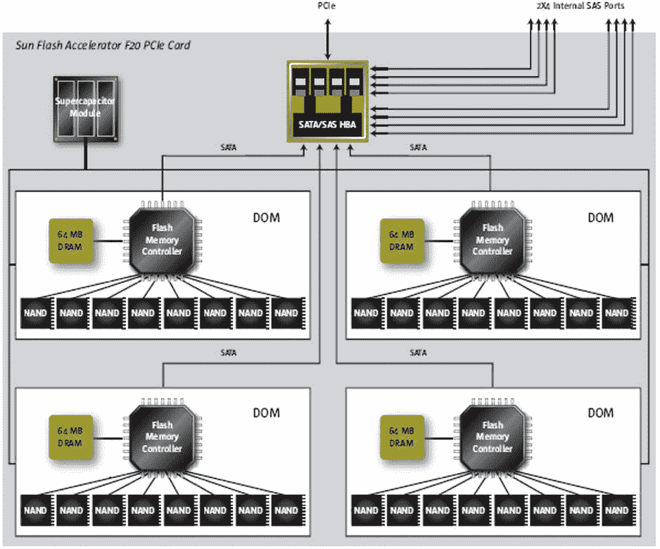

# 第四章


## 智能闪存缓存


## 智能闪存缓存

## 闪存登场

智能闪存缓存通过缓存频繁访问的数据，并允许直接从闪存而非磁盘或内存中读取，为 Exadata 提供了实现高 IOPS（每秒输入输出操作次数）的能力。它通过缓存常用的表和索引块以备后用，从而吸收重复读取可能产生的负载。控制文件的读写以及文件头的读写也会被缓存。不过，与传统系统不同，此闪存缓存是智能化的，不会缓存为 ASM 冗余而写入的重复块，也不会缓存与备份过程和数据泵导出相关的 I/O。

智能闪存缓存表现得像磁盘，但它并非磁盘。每个存储单元包含 4 块 Sun Flash PCIe 卡，每卡配备 96GB 闪存，因此智能闪存缓存总可用空间为 384GB。对于 X3 八分之一机架配置，总闪存存储为 4.8TB；对于四分之一机架配置，可用总闪存存储为 2.4TB。X3 半机架拥有 11.2TB 闪存，而全机架则提供 22.4TB。作为比较，X2 Exadata 四分之一机架配置拥有 1.1TB 可用闪存，半机架为 2.6TB，全机架为 5.3TB。其中一块卡的基本框图如 图 4-1 所示。



图 4-1. Sun Flash Accelerator F20 PCIe 卡框图

在安装时，Exadata 系统将几乎所有的 PCIe 闪存存储配置为闪存缓存，其中一小部分配置为闪存日志。DBA 可以相当轻松地通过调整大小、重建或创建可供 ASM 访问的闪存“磁盘”来重新配置闪存缓存。智能闪存缓存构建在闪存磁盘之上，这与 DBA 可创建的、用于提供可由 ASM 使用的闪存存储的虚拟闪存磁盘不同。连接到存储单元并使用 `CellCLI` 查看闪存缓存详细信息，可显示已配置闪存缓存的组成：

```
CellCLI> list flashcache detail
         name:                   myexa1cel01_FLASHCACHE
         cellDisk:               FD_07_myexa1cel01,FD_12_myexa1cel01,FD_15_myexa1cel01,FD_13_myexa1cel01,FD_04_myexa1cel01,FD_14_myexa1cel01,FD_00_myexa1cel01,FD_10_myexa1cel01,FD_03_myexa1cel01,FD_09_myexa1cel01,FD_08_myexa1cel01,FD_02_myexa1cel01,FD_01_myexa1cel01,FD_11_myexa1cel01,FD_05_myexa1cel01,FD_06_myexa1cel01
         creationTime:           2013-03-16T12:16:39-05:00
         degradedCelldisks:
         effectiveCacheSize:     364.75G
         id:                     3dfc24a5-2591-43d3-aa34-72379abdf3b3
         size:                   364.75G
         status:                 normal

CellCLI>
```

每个存储单元使用 16 个磁盘来构建智能闪存缓存。每块 Sun PCIe 卡有 4 个这样的磁盘，每个磁盘大小为 32GB，其中 24GB 为可寻址的非易失性存储。尽管总共有 384GB 闪存存储，但请注意，其中 19.25GB 保留给闪存日志和其他用途，因此可用于创建闪存缓存的闪存存储为 22.875GB。每块卡还包含 64MB DRAM，用于缓冲写入非易失性存储器的数据，以及一个能量存储模块（ESM）。该模块实际上是一个电容器，在发生断电时，它能提供足够的电力将数据从缓冲区刷新到非易失性存储器中。如果 ESM 发生故障，将绕过易失性缓冲区，允许直接写入非易失性存储器。只要闪存磁盘配置为智能闪存缓存，失去 ESM 不会带来写入惩罚；存储软件将智能闪存缓存视为直写缓存，会绕过它直接写入磁盘。如果闪存磁盘被配置为闪存磁盘组，则失去 ESM 将产生写入惩罚，因为动态缓存不再可用。

这些 PCIe 卡的预期寿命为两年，因为 ESM 将失去其充电能力。Sun 文档声明这些卡可以在不关闭系统的情况下更换；而 Oracle Exadata 文档建议在开始此类维护之前，将受影响的存储服务器断电。请记住，ASM 故障组的配置确保了一个存储单元的丢失不会影响运行中的数据库。

使用 `create flashcache all` 命令为存储单元重建闪存缓存，将创建与 Exadata 安装后相同的存储分布；DBA 可以通过指定 `size` 参数在存储单元上创建一个较小的智能闪存缓存，但不能创建更大的。

## 工作原理

智能闪存缓存是一种针对频繁访问数据进行优化的、基于每个单元的缓存机制。一个对象是否会被考虑用于智能闪存缓存，部分取决于对象创建时设置的 `CELL_FLASH_CACHE` 存储参数。看一下 `EMP` 演示表的 `CREATE TABLE` 语句：

```
CREATE TABLE "BING"."EMP"
  (    "EMPNO" NUMBER(4,0) NOT NULL ENABLE,
       "ENAME" VARCHAR2(10),
       "JOB" VARCHAR2(9),
       "MGR" NUMBER(4,0),
       "HIREDATE" DATE,
       "SAL" NUMBER(7,2),
       "COMM" NUMBER(7,2),
       "DEPTNO" NUMBER(2,0)
  ) SEGMENT CREATION IMMEDIATE
  PCTFREE 10 PCTUSED 40 INITRANS 1 MAXTRANS 255
 NOCOMPRESS LOGGING
  STORAGE(INITIAL 65536 NEXT 1048576 MINEXTENTS 1 MAXEXTENTS 2147483645
  PCTINCREASE 0 FREELISTS 1 FREELIST GROUPS 1
  BUFFER_POOL DEFAULT FLASH_CACHE DEFAULT CELL_FLASH_CACHE DEFAULT)
  TABLESPACE "USERS" ROWDEPENDENCIES
```

此存储参数有三个可能的值，`DEFAULT` 顺理成章地成为默认值。此设置告知 Oracle 以正常模式利用智能闪存缓存，根据提供的缓存标准缓存数据，并根据适当的保留策略淘汰缓存数据。对于 `DEFAULT` 设置，这将使用一种优先级的最近最少使用（LRU）算法（最旧的数据最先被淘汰，这是常见的 LRU 配置）。此存储参数还可以设置为另外两个值：`KEEP` 和 `NONE`。`KEEP` 设置通过尽可能长时间地将数据保留在缓存中来改变 LRU 算法，但是，为防止 `KEEP` 数据占用缓存，最多只有 80% 的已配置缓存可用于标记为 `KEEP` 的数据。超过附加淘汰策略的未使用 `KEEP` 块将被清除。将 `CELL_FLASH_CACHE` 设置为 `NONE` 会为该对象禁用智能闪存缓存。

每次读或写操作都关联以下附加信息：

*   相关对象的 `CELL_FLASH_CACHE` 设置
*   基于请求目的的缓存提示。可用的提示有：


*   `CACHE`，这会导致块被缓存。索引查找的 I/O 就是一种会被缓存的请求类型。
*   `NOCACHE`，这将应用于来自 ASM 的镜像块、日志写入，或者简单来说就是太大而无法放入缓存的请求。无论`CELL_FLASH_CACHE`设置为`DEFAULT`还是`KEEP`，此提示都会被设置。
*   `EVICT`，用于从缓存中移除数据。使用此提示的活动将是 ASM 再平衡操作（这会导致块从一个磁盘移动到另一个磁盘，从而使缓存的条目失效，因为它们引用的是原始物理位置）以及查找已超过 LRU 算法阈值的缓存数据。

智能闪存缓存在决定如何以及处理什么时，除了考虑`CELL_FLASH_CACHE`设置和提供的提示外，还会考虑 I/O 大小、类型和当前的缓存负载。非常大的 I/O 请求不会被缓存，任何可能对吞吐量产生负面影响的 I/O 请求也不会被缓存，因为缓存可能非常繁忙。

被缓存的写操作不受此缓存的影响，因为写入性能既不会提高也不会降低。`CELLSRV`执行磁盘写入，向数据库层发送确认，因此事务可以继续而不会中断。然后，智能闪存缓存决定数据是否要被缓存，使得磁盘写入独立于数据缓存过程。

读取事务是智能闪存缓存的受益者。对于读取操作，`CELLSRV`会确定数据是否已在智能闪存缓存中；它维护了一个缓存数据的内存散列表，以便 Oracle 可以快速确定所需的块是否可以在那里找到。该散列表列出了未被标记为驱逐的块，因此当找到匹配项时，可以执行缓存查找。在以下情况下，缓存块可能会被驱逐：源块自缓存数据写入后已更改、当前事务的 I/O 需要空间且这些块位于 LRU 列表的顶部、块被标记为`KEEP`但已超出额外的`KEEP`阈值而未使用，或者它们的寿命已超过标准 LRU 阈值。

也可以使用`ALTER TABLE <TABLE_NAME> STORAGE(FLASH_CACHE [NONE|DEFAULT|KEEP])`和`ALTER INDEX <INDEX_NAME> STORAGE(FLASH_CACHE [NONE|DEFAULT|KEEP])`命令手动将表或索引放入智能闪存缓存。指定`NONE`会阻止表或索引使用智能闪存缓存。`DEFAULT`设置智能闪存缓存的正常行为，并且在创建表或索引时默认设置为此值；`KEEP`会将表或索引放入智能闪存缓存（前提是空间足够），并且不会将其换出。不加区别地使用`KEEP`选项可能会填满智能闪存缓存，而没有空间留给`FLASH_CACHE`设置为`DEFAULT`的对象。`KEEP`设置应用于小表（例如，较小的查找表）或索引，以允许更大的表/索引（其`FLASH_CACHE`存储参数设置为`DEFAULT`）使用智能闪存缓存。

## 日志记录

每个单元上配置的闪存存储并非仅用于智能闪存缓存，因为 Exadata 还提供了智能闪存日志作为重做日志写入的额外机制。每个配置的闪存磁盘都有 32MB 的存储空间被配置为智能闪存日志；每个存储单元总共 512MB 的智能闪存日志存储。使用智能闪存日志可以加速事务处理，因为第一个报告完成的写入会触发数据库层继续进行事务处理。

重做日志写入被同时发送到磁盘和智能闪存日志。一旦日志写入器进程（`LGWR`）收到写入完成的确认，事务处理就会继续。无论是智能闪存日志还是磁盘上的写入先完成都不重要；是确认信号触发了数据库服务器允许处理继续进行。请放心，所有写入智能闪存日志的数据也会被写入磁盘。智能闪存日志先完成并不会阻止`LGWR`完成其磁盘写入。从概念上讲，智能闪存日志与使用多路复用重做日志非常相似，因为所有配置的日志都会被写入，无论哪个日志先完成写入。

## 它是磁盘

智能闪存磁盘并不仅限于智能闪存缓存和智能闪存日志使用。可以将这些设备配置为 ASM 识别的闪存磁盘，以创建闪存磁盘组。

可以使用一个或多个存储单元上的闪存磁盘创建闪存磁盘组，但这需要调整现有智能闪存缓存的大小。在开始此过程之前，应决定这些闪存磁盘的大小，因为创建此类磁盘并非易事，因为第一步是删除现有的闪存缓存：

```
CellCLI> drop flashcache
Flash cache myexa1cel01_flashcache successfully dropped
```

一旦闪存缓存被删除，就可以用新的大小创建它。要创建一个 100GB 的闪存缓存：

```
CellCLI> create flashcache all size=100G
Flash cache myexa1cel01_flashcache successfully created
```

可用于 ASM 的闪存磁盘将使用剩余的可用闪存存储（264.75GB）创建，因此不需要使用大小参数：

```
CellCLI> create griddisk all flashdisk prefix=flash
GridDisk flash_FD_00_myexa1cel01 successfully created
GridDisk flash_FD_01_myexa1cel01 successfully created
...
GridDisk flash_FD_15_myexa1cel01 successfully created

CellCLI> list griddisk
...
         flash_FD_00_myexa1cel01 active
         flash_FD_01_myexa1cel01 active
         ...
         flash_FD_15_myexa1cel01 active
CellCLI>
```

可以选择创建一组或多组闪存磁盘，方法是仅在一个存储单元、两个存储单元甚至所有可用存储服务器上重新配置智能闪存缓存。在存储服务器之间使用相同的前缀允许将所有闪存磁盘分配给一个磁盘组，无论涉及哪个存储单元。也可以通过使前缀特定于单元来创建单独的闪存磁盘集，这样，只需在`CREATE DISKGROUP`命令中指定前缀名称，就可以创建多个基于闪存的磁盘组。

创建闪存磁盘组并不困难；但是，如果使用多个闪存磁盘前缀，则需要仔细注意细节，以便将正确的闪存磁盘集分配给正确的磁盘组。命令语法很简单，但是，首先必须设置数据库服务器上的环境才能访问 ASM 实例。以下脚本`sid`是设置环境的好方法：

```
#################################################################
# Oracle sid selection script
#
# 13-May-2012 - Mary Mikell Spence
#               Infocrossing
#################################################################

ORASID=$ORACLE_SID

if [ -f /etc/oratab ]
then
   export ORATAB=/etc/oratab
else
   export ORATAB=/var/opt/oracle/oratab
fi

unset ORACLE_BASE

echo;
I=1
for SHOW_DB in `cat $ORATAB | grep -v "#" |  grep -v '*' | cut -f 1 -d :`
do
   OHOME=`grep -v '#' $ORATAB | grep -v '*' | grep "^$SHOW_DB:" | cut -d: -f 2`
   echo "$I - $SHOW_DB - $OHOME"
   I=`expr $I + 1`
done
echo;
```


GOOD_NAME=false
while [ "${GOOD_NAME}" = "false" ]
do
  echo "请通过编号或名称进行选择 [$ORASID]: "
  read CHOICE
  if [ "$CHOICE" = "" ]
  then
    GOOD_NAME=true
    CHOICE=$ORASID
  else
    I=1
    for DB_NAME in `cat $ORATAB | grep -v "#" |  grep -v '*' | cut -f 1 -d :`
    do
      if [ "$DB_NAME" = "$CHOICE" -o "$I" = "$CHOICE" ]
      then
        GOOD_NAME=true
        CHOICE=$DB_NAME
      fi
      I=`expr $I + 1`
    done
  fi
done

ORAENV_ASK=NO
ORACLE_SID=$CHOICE

. oraenv > /dev/null

echo; echo;
echo "*************************************************"
echo "ORACLE_BASE...$ORACLE_BASE"
echo "ORACLE_HOME...$ORACLE_HOME"
echo "ORACLE_SID....$ORACLE_SID"
echo "*************************************************"
echo;

unset ORATAB
unset GOOD_NAME
unset I
unset SHOW_DB
unset CHOICE
unset DB_NAME
unset OHOME
unset ORASID
```

现在，您已经掌握了设置环境的方法，接下来就为创建基于闪存的磁盘组做好了准备：

```
[oracle@myexa1db01 dbm1 ∼]$ . sid

1 - +ASM1 - /u01/app/11.2.0.3/grid
2 - dbm1 - /u01/app/oracle/product/11.2.0.3/dbhome_1
3 - client - /u01/app/oracle/product/11.2.0/client_1

请通过编号或名称进行选择 [dbm1]:

*******************************************************
ORACLE_BASE.../u01/app/oracle
ORACLE_HOME.../u01/app/11.2.0.3/grid
ORACLE_SID....+ASM1
*******************************************************

[oracle@myexa1db01 +ASM1 ∼]$ sqlplus / as sysasm

SQL*Plus: Release 11.2.0.3.0 Production on Tue Apr 30 10:11:09 2013

Copyright (c) 1982, 2011, Oracle.  All rights reserved.

Connected to:
Oracle Database 11g Enterprise Edition Release 11.2.0.3.0 - 64bit Production
With the Real Application Clusters and Automatic Storage Management options

SYS@+ASM1> col path format a45
SYS@+ASM1> select path, header_status
  2  from v$asm_disk
  3  where path like 'o/%/flash%'
  4  /

PATH                                          HEADER_STATU
--------------------------------------------- ------------
o/192.168.10.5/flash_FD_00_myexa1cel01        CANDIDATE
o/192.168.10.5/flash_FD_01_myexa1cel01        CANDIDATE
o/192.168.10.5/flash_FD_02_myexa1cel01        CANDIDATE
o/192.168.10.5/flash_FD_03_myexa1cel01        CANDIDATE
o/192.168.10.5/flash_FD_04_myexa1cel01        CANDIDATE
o/192.168.10.5/flash_FD_05_myexa1cel01        CANDIDATE
o/192.168.10.5/flash_FD_06_myexa1cel01        CANDIDATE
o/192.168.10.5/flash_FD_07_myexa1cel01        CANDIDATE
o/192.168.10.5/flash_FD_08_myexa1cel01        CANDIDATE
o/192.168.10.5/flash_FD_08_myexa1cel01        CANDIDATE
o/192.168.10.5/flash_FD_10_myexa1cel01        CANDIDATE
o/192.168.10.5/flash_FD_11_myexa1cel01        CANDIDATE
o/192.168.10.5/flash_FD_12_myexa1cel01        CANDIDATE
o/192.168.10.5/flash_FD_13_myexa1cel01        CANDIDATE
o/192.168.10.5/flash_FD_14_myexa1cel01        CANDIDATE
o/192.168.10.5/flash_FD_15_myexa1cel01        CANDIDATE

16 rows selected.

SYS@+ASM1> create diskgroup flash_dg redundancy normal
  2  disk 'o/%/flash%'
  3  attribute 'compatible.rdbms' = '11.2.0.0.0',
  4  'compatible.asm' = '11.2.0.0.0',
  5  'cell.smart.scan.capable' = 'TRUE',
  6  'au_size' = '4M'
  7   /

Diskgroup created.

SYS@+ASM1>
```

一个基于闪存的磁盘组现在可供使用了。根据所使用的冗余级别（NORMAL，提供数据的一份副本；或 HIGH，提供数据的两份副本），数据可用的存储空间将是总可用空间的一半到三分之一。这使得基于闪存的磁盘组比基于磁盘的对应磁盘组要小得多。在本例中，请记住总可用闪存空间为 264.75GB。由于指定了 NORMAL 冗余，因此该闪存磁盘组大约有 132GB 可用。如果使用 HIGH 冗余，总可用空间将约为 88GB。

监控

监控数据库服务器上的**智能闪存缓存**与监控来自它们的**智能扫描**非常相似，同样受限，因为从`V$SYSSTAT`中只有一项记录闪存缓存活动的指标可用：“cell flash cache read hits”。另一方面，从存储服务器监控智能闪存缓存则提供了更详细的数据和诊断信息，尽管无法从单一位置监控整个存储层；因此，这些统计信息仅针对给定存储服务器上总闪存缓存的一部分。

存储服务器工具

通过`CellCLI`实用程序，可以使用许多统计信息来监控闪存缓存的使用情况。您可以使用`LIST METRICDEFINITION`命令查看指标及其描述。要返回闪存缓存指标及其描述，可以使用以下命令：

```
CellCLI> list metricdefinition attributes name, description where objectType = 'FLASHCACHE'
```

这些指标及其描述列于表 4-1 中。

表 4-1. 存储单元闪存缓存指标及其描述


## FlashCache 性能指标

| `FC_BYKEEP_OVERWR` | "由于‘keep’对象的空间限制而从 FlashCache 中推出（换出）的兆字节数" |
| `FC_BYKEEP_OVERWR_SEC` | "由于‘keep’对象的空间限制，每秒从 FlashCache 中推出（换出）的兆字节数" |
| `FC_BYKEEP_USED` | "FlashCache 上用于‘keep’对象的已用兆字节数" |
| `FC_BY_USED` | "FlashCache 上的已用兆字节数" |
| `FC_IO_BYKEEP_R` | "从 FlashCache 为‘keep’对象读取的兆字节数" |
| `FC_IO_BYKEEP_R_SEC` | "每秒从 FlashCache 为‘keep’对象读取的兆字节数" |
| `FC_IO_BYKEEP_W` | "写入 FlashCache 用于‘keep’对象的兆字节数" |
| `FC_IO_BYKEEP_W_SEC` | "每秒写入 FlashCache 用于‘keep’对象的兆字节数" |
| `FC_IO_BY_R` | "从 FlashCache 读取的兆字节数" |
| `FC_IO_BY_R_MISS` | "由于并非所有请求的数据都在 FlashCache 中而从磁盘读取的兆字节数" |
| `FC_IO_BY_R_MISS_SEC` | "每秒由于并非所有请求的数据都在 FlashCache 中而从磁盘读取的兆字节数" |
| `FC_IO_BY_R_SEC` | "每秒从 FlashCache 读取的兆字节数" |
| `FC_IO_BY_R_SKIP` | "绕过 FlashCache 的 I/O 请求从磁盘读取的兆字节数" |
| `FC_IO_BY_R_SKIP_SEC` | "每秒绕过 FlashCache 的 I/O 请求从磁盘读取的兆字节数" |
| `FC_IO_BY_W` | "写入 FlashCache 的兆字节数" |
| `FC_IO_BY_W_SEC` | "每秒写入 FlashCache 的兆字节数" |
| `FC_IO_ERRS` | "FlashCache 上的 I/O 错误数" |
| `FC_IO_RQKEEP_R` | "为‘keep’对象满足的从 FlashCache 的读 IO 请求数" |
| `FC_IO_RQKEEP_R_MISS` | "为‘keep’对象未在 FlashCache 中找到所有数据的读 I/O 请求数" |
| `FC_IO_RQKEEP_R_MISS_SEC` | "每秒为‘keep’对象未在 FlashCache 中找到所有数据的读 I/O 请求数" |
| `FC_IO_RQKEEP_R_SEC` | "每秒为‘keep’对象满足的从 FlashCache 的读 I/O 请求数" |
| `FC_IO_RQKEEP_R_SKIP` | "为‘keep’对象绕过 FlashCache 的读 I/O 请求数" |
| `FC_IO_RQKEEP_R_SKIP_SEC` | "每秒为‘keep’对象绕过 FlashCache 的读 I/O 请求数" |
| `FC_IO_RQKEEP_W` | "导致用数据填充 FlashCache 的‘keep’对象 I/O 请求数" |
| `FC_IO_RQKEEP_W_SEC` | "每秒导致用数据填充 FlashCache 的‘keep’对象 I/O 请求数" |
| `FC_IO_RQ_R` | "从 FlashCache 满足的读 I/O 请求数" |
| `FC_IO_RQ_R_MISS` | "未在 FlashCache 中找到所有数据的读 I/O 请求数" |
| `FC_IO_RQ_R_MISS_SEC` | "每秒未在 FlashCache 中找到所有数据的读 I/O 请求数" |
| `FC_IO_RQ_R_SEC` | "每秒从 FlashCache 满足的读 I/O 请求数" |
| `FC_IO_RQ_R_SKIP` | "绕过 FlashCache 的读 I/O 请求数" |
| `FC_IO_RQ_R_SKIP_SEC` | "每秒绕过 FlashCache 的读 I/O 请求数" |
| `FC_IO_RQ_W` | "导致用数据填充 FlashCache 的 I/O 请求数" |
| `FC_IO_RQ_W_SEC` | "每秒导致用数据填充 FlashCache 的 I/O 请求数" |

### 查看当前指标

这些指标是自 `CELLSRV` 启动以来的累计值。要列出一个或多个指标的当前值，需要使用 `LIST METRICCURRENT` 语句。输出报告的是单个存储节点的累计统计信息；要监控整个 Smart Flash Cache 的活动，必须在所有剩余的存储节点上运行相同的命令。

使用 `LIST METRICCURRENT` 语句返回给定存储节点的 Smart Flash Cache 指标：

```
CellCLI> list metriccurrent where objectType = 'FLASHCACHE'

FC_BYKEEP_OVERWR                FLASHCACHE      0.000 MB
   FC_BYKEEP_OVERWR_SEC            FLASHCACHE      0.000 MB/sec
   FC_BYKEEP_USED                  FLASHCACHE      0.000 MB
   FC_BY_USED                      FLASHCACHE      365,322 MB
   FC_IO_BYKEEP_R                  FLASHCACHE      0.000 MB
   FC_IO_BYKEEP_R_SEC              FLASHCACHE      0.000 MB/sec
   FC_IO_BYKEEP_W                  FLASHCACHE      0.047 MB
   FC_IO_BYKEEP_W_SEC              FLASHCACHE      0.000 MB/sec
   FC_IO_BY_R                      FLASHCACHE      60,257,512 MB
   FC_IO_BY_R_MISS                 FLASHCACHE      12,592,252 MB
   FC_IO_BY_R_MISS_SEC             FLASHCACHE      0.891 MB/sec
   FC_IO_BY_R_SEC                  FLASHCACHE      21.193 MB/sec
   FC_IO_BY_R_SKIP                 FLASHCACHE      567,179,945 MB
   FC_IO_BY_R_SKIP_SEC             FLASHCACHE      3.681 MB/sec
   FC_IO_BY_W                      FLASHCACHE      22,170,046 MB
   FC_IO_BY_W_SEC                  FLASHCACHE      4.028 MB/sec
   FC_IO_ERRS                      FLASHCACHE      0
   FC_IO_RQKEEP_R                  FLASHCACHE      0 IO requests
   FC_IO_RQKEEP_R_MISS             FLASHCACHE      0 IO requests
   FC_IO_RQKEEP_R_MISS_SEC         FLASHCACHE      0.0 IO/sec
   FC_IO_RQKEEP_R_SEC              FLASHCACHE      0.0 IO/sec
   FC_IO_RQKEEP_R_SKIP             FLASHCACHE      0 IO requests
   FC_IO_RQKEEP_R_SKIP_SEC         FLASHCACHE      0.0 IO/sec
   FC_IO_RQKEEP_W                  FLASHCACHE      3 IO requests
   FC_IO_RQKEEP_W_SEC              FLASHCACHE      0.0 IO/sec
   FC_IO_RQ_R                      FLASHCACHE      6,638,504,145 IO
requests
   FC_IO_RQ_R_MISS                 FLASHCACHE      373,704,323 IO
requests
   FC_IO_RQ_R_MISS_SEC             FLASHCACHE      28.5 IO/sec
   FC_IO_RQ_R_SEC                  FLASHCACHE      2,688 IO/sec
   FC_IO_RQ_R_SKIP                 FLASHCACHE      1,010,237,424 IO
requests
   FC_IO_RQ_R_SKIP_SEC             FLASHCACHE      16.7 IO/sec
   FC_IO_RQ_W                      FLASHCACHE      1,096,872,236 IO
requests
   FC_IO_RQ_W_SEC                  FLASHCACHE      326 IO/sec
```

可以筛选并报告 `CELL_FLASH_CACHE` 存储子句设置为 `KEEP` 的对象的指标，例如：

```
CellCLI> list metriccurrent where objectType = 'FLASHCACHE' and name like '.*KEEP.*'
         FC_BYKEEP_OVERWR                FLASHCACHE      0.000 MB
         FC_BYKEEP_OVERWR_SEC            FLASHCACHE      0.000 MB/sec
         FC_BYKEEP_USED                  FLASHCACHE      0.000 MB
         FC_IO_BYKEEP_R                  FLASHCACHE      0.000 MB
         FC_IO_BYKEEP_R_SEC              FLASHCACHE      0.000 MB/sec
         FC_IO_BYKEEP_W                  FLASHCACHE      0.047 MB
         FC_IO_BYKEEP_W_SEC              FLASHCACHE      0.000 MB/sec
         FC_IO_RQKEEP_R                  FLASHCACHE      0 IO requests
         FC_IO_RQKEEP_R_MISS             FLASHCACHE      0 IO requests
         FC_IO_RQKEEP_R_MISS_SEC         FLASHCACHE      0.0 IO/sec
         FC_IO_RQKEEP_R_SEC              FLASHCACHE      0.0 IO/sec
         FC_IO_RQKEEP_R_SKIP             FLASHCACHE      0 IO requests
         FC_IO_RQKEEP_R_SKIP_SEC         FLASHCACHE      0.0 IO/sec
         FC_IO_RQKEEP_W                  FLASHCACHE      3 IO requests
         FC_IO_RQKEEP_W_SEC              FLASHCACHE      0.0 IO/sec

CellCLI>
```

也可以通过稍微更改语句来排除这些相同的指标：


## 智能闪存缓存性能监控与内容查询

CellCLI> list metriccurrent where objectType = 'FLASHCACHE' and name not like '.*KEEP.*'
         FC_BY_USED              FLASHCACHE      365,290 MB
         FC_IO_BY_R              FLASHCACHE      60,267,646 MB
         FC_IO_BY_R_MISS         FLASHCACHE      12,592,880 MB
         FC_IO_BY_R_MISS_SEC     FLASHCACHE      1.568 MB/秒
         FC_IO_BY_R_SEC          FLASHCACHE      23.065 MB/秒
         FC_IO_BY_R_SKIP         FLASHCACHE      567,186,500 MB
         FC_IO_BY_R_SKIP_SEC     FLASHCACHE      5.888 MB/秒
         FC_IO_BY_W              FLASHCACHE      22,171,791 MB
         FC_IO_BY_W_SEC          FLASHCACHE      2.865 MB/秒
         FC_IO_ERRS              FLASHCACHE      0
         FC_IO_RQ_R              FLASHCACHE      6,639,787,345 IO 请求
         FC_IO_RQ_R_MISS         FLASHCACHE      373,724,226 IO 请求
         FC_IO_RQ_R_MISS_SEC     FLASHCACHE      50.2 IO/秒
         FC_IO_RQ_R_SEC          FLASHCACHE      2,927 IO/秒
         FC_IO_RQ_R_SKIP         FLASHCACHE      1,010,251,273 IO 请求
         FC_IO_RQ_R_SKIP_SEC     FLASHCACHE      19.4 IO/秒
         FC_IO_RQ_W              FLASHCACHE      1,096,966,059 IO 请求
         FC_IO_RQ_W_SEC          FLASHCACHE      170 IO/秒
CellCLI>

对于智能闪存缓存，收集的不仅仅是性能指标。您可以使用 `LIST FLASHCACHECONTENT` 命令查看缓存中的内容。若要查看可用的属性或用于筛选输出的属性，可以描述 `FLASHCACHECONTENT` 对象：

CellCLI> describe flashcachecontent
        cachedKeepSize
        cachedSize
        dbID
        dbUniqueName
        hitCount
        hoursToExpiration
        missCount
        objectNumber
        tableSpaceNumber

可以通过 `dbUniqueName` 或 `dbID` 来指定特定的数据库。`objectNumber` 和 `tableSpaceNumber` 属性是特定于某个 `dbUniqueName`/`dbID` 的，因此应与 `dbUniqueName` 或 `dbID` 结合使用。例如，要查看 `DBM` 数据库对象的唯一数据库名称、对象编号、KEEP 大小、缓存大小、命中次数和未命中次数，可以使用以下命令：

CellCLI> list flashcachecontent where dbUniqueName = 'DBM' and hitcount > 99 attributes dbUniqueName, objectNumber, cachedKeepSize, cachedSize, hitcount, misscount
         DBM     2       0       172032          1889    350
         DBM     8       0       81920           168     7
         DBM     104     0       622592          170     48
         DBM     225     0       2654208         382     247
         DBM     227     0       1081344         173     77
         DBM     268     0       1859584         770     25
         DBM     271     0       65536           298     5
         DBM     272     0       65536           383     4
         DBM     421     0       2064384         8120    772
         DBM     424     0       589824          2391    63
         DBM     425     0       122880          372     17
         DBM     466     0       196608          612     37
         DBM     469     0       131072          462     4
         ...
         DBM     48306   0       32768           242     120
         DBM     48406   0       196608          102     12
         DBM     48464   0       237568          116     110
         DBM     48466   0       1220608         247     104
         DBM     48663   0       802816          142     52
         DBM     48705   0       917504          101     20
         DBM     48840   0       2334720         170     31
         DBM     48972   0       2138112         176     104
         DBM     4294967294      0       376832          25674712        181405
CellCLI>

默认情况下，`LIST FLASHCACHECONTENT` 命令会报告 `dbID`、`tableSpaceNumber` 和 `objectNumber`。若要返回其他属性，需要使用 `attributes` 子句在命令中列出它们，如本例所示。

请注意，在存储单元级可用的所有属性中，对象名称并不在其中。这可以通过在数据库服务器上查询 `DBA_OBJECTS` 来轻松报告，使用 `CellCLI` 报告的 `objectNumber`，该编号映射到 `DATA_OBJECT_ID` 列：

SQL> select owner,  object_type, object_name
  2  from dba_objects
  3  where data_object_id = 5888;

OWNER                OBJECT_TYPE         OBJECT_NAME
-------------------- ------------------- --------------------------------
SYS                  INDEX               WRI$_ADV_MSG_GRPS_IDX_01
SQL>

可以编写一个脚本来生成 `LIST FLASHCACHECONTENT` 命令的输出，并将其放入数据库服务器上的文本文件中，例如：

```
/usr/bin/ssh celladmin@myexa1cel01-priv.7-11.com  "cellcli -e list flashcachecontent where dbUniqueName = '$1' attributes dbUniquename,objectNumber,hitcount,misscount,cachedSize"
/usr/bin/ssh celladmin@myexa1cel02-priv.7-11.com  "cellcli -e list flashcachecontent where dbUniqueName = '$1' attributes dbUniquename,objectNumber,hitcount,misscount,cachedSize"
/usr/bin/ssh celladmin@myexa1cel03-priv.7-11.com  "cellcli -e list flashcachecontent where dbUniqueName = '$1' attributes dbUniquename,objectNumber,hitcount,misscount,cachedSize"
```

可以使用第二个脚本来执行第一个脚本并将输出发送到文件：

```
/home/oracle/bin/cellcli_flashcache_mon_nohdrs.sh $1 > /home/oracle/ext_tbls/flash_mon.txt
```

感兴趣的数据库名称通过命令行传递给第二个脚本。生成的文件随后可用于创建外部表，该表可与 `DBA_OBJECTS` 视图关联，以按对象名称报告智能闪存缓存活动。例如：

SQL> create or replace directory admin_dat_dir as '/home/oracle/ext_tbls';

目录已创建。

SQL> create or replace directory admin_log_dir as '/home/oracle/logs';

目录已创建。

SQL> create or replace directory admin_bad_dir as '/home/oracle/bad';

目录已创建。

SQL>
SQL> CREATE TABLE flashmon_ext
  2                      (db_name     varchar2(12),
  3                       object_id   number,
  4                       hitct       number,
  5                       missct      number,
  6                       cachesz     number
  7                      )
        ORGANIZATION EXTERNAL
        (
          TYPE ORACLE_LOADER
          DEFAULT DIRECTORY admin_dat_dir
          ACCESS PARAMETERS
          (
            records delimited by newline
            badfile admin_bad_dir:'flashmon_ext%a_%p.bad'
            logfile admin_log_dir:'flashmon_ext%a_%p.log'
            fields terminated by whitespace
            missing field values are null
            ( db_name, object_id, hitct, missct, cachesz
            )
          )
          LOCATION ('flash_mon.txt')
        )
        PARALLEL
        REJECT LIMIT UNLIMITED;

表已创建。

SQL>

第一个目录包含从 `CellCLI` 和 `LIST FLASHCACHECONTENT` 命令生成的文本文件。接下来的两个目录用于日志文件和坏文件，这些文件可能由 `SQL*Loader` 生成。最后，我们创建外部表。由于文本文件不应更改名称或位置，生成新文件不会导致外部表失效。因此，数据可以随时刷新，而外部表仍然可用。

创建外部表后，编写查询以将 `object_name` 映射到 `object_id` 是一项简单的任务：

SQL> select f.db_name, o.object_name, f.hitct, f.missct, f.cachesz
  2  from flashmon_ext f left outer join dba_objects o on (o.data_object_id = f.object_id);


### 示例输出

```
DB_NAME      OBJECT_NAME                              HITCT     MISSCT    CACHESZ
------------ ----------------------------------- ---------- ---------- ----------
DBM          ICOL$                                    407479       9163   40828928
DBM          ICOL$                                    425912      11731   59179008
DBM          ICOL$                                    575450      44509   31588352
DBM          I_USER1                                       33          4      32768
DBM          CON$                                         159         60      32768
DBM          CON$                                         447         67      98304
DBM          UNDO$                                         49          2      32768
DBM          C_COBJ#                                      4782        572    2129920
DBM          C_COBJ#                                      9077        984    3178496
DBM          C_COBJ#                                      8120        968    4358144
DBM          I_OBJ#                                       2320         65     557056
DBM          I_OBJ#                                       1323         17     327680
DBM          I_OBJ#                                       1742         30     327680
DBM          I_IND1                                        280         19     458752
DBM          I_IND1                                       1160         44     196608
DBM          I_IND1                                       1405         35     131072
DBM          I_CDEF2                                      6150        516     425984
DBM          I_CDEF2                                      1332         78     720896
DBM          I_CDEF2                                      3483        210    2031616
DBM          I_OBJ5                                      49088       2555    9732096
DBM          I_OBJ5                                      16742       1144    8192000
...
```

在此示例中，`flashmon_ext` 表包含 16,202 行，因为数据是在所有三个可用的存储单元上收集的。这解释了输出中对象名称明显重复的原因；每个存储单元可以同时缓存相同的对象。即使对象名称可能重复，缓存大小、命中次数和未命中次数通常也是不同的。

发现 `object_id` 值在四十亿范围内并不罕见，而且这些 `object_ids` 不会与 `DBA_OBJECTS` 中的任何对象匹配。`object_ids` 处于该范围的一个来源是 `V$FIXED_TABLE` 和 `GV$FIXED_TABLE` 视图；然而，`flashmon_ext` 表中列出的处于该范围的 `object_id` 值没有一个与这些对象中的任何一个匹配。在没有全局临时表的情况下，有问题的对象是撤销段。

## 数据库服务器工具

遗憾的是，在数据库层面没有太多可查看的内容。一个统计信息，“`cell flash cache read hits`”，是唯一可用的。与其他指标一样，这是自实例在 `V$SYSSTAT` 中报告的启动以来以及当前会话在 `V$MYSTAT` 中的持续时间内的累积值。衡量 SQL 语句的智能闪存缓存活动最简单的方法是在语句执行前后查询 `V$MYSTAT`。在 SQL*Plus 中执行此操作提供了将查询结果保存到变量中以供语句完成后使用的能力，如下所示：

```
SQL> select statistic#, value
  2  from v$mystat
  3  where statistic# in (select statistic# from v$statname where name = 'cell flash cache read hits');

STATISTIC#      VALUE
---------- ----------
       605          1

SQL>
SQL> select count(*)
  2  from emp;

COUNT(*)
--------
       14

SQL>
SQL> column   val new_value beginval
SQL>
SQL> select statistic#, value val
  2  from v$mystat
  3  where statistic# in (select statistic# from v$statname where name = 'cell flash cache read hits');

STATISTIC#        VAL
---------- ----------
       605        855

SQL>
SQL> select count(*)
  2  from emp;

COUNT(*)
--------
       14

SQL>
SQL> column   val new_value endval
SQL>
SQL> select statistic#, value val
  2  from v$mystat
  3  where statistic# in (select statistic# from v$statname where name = 'cell flash cache read hits');

STATISTIC#        VAL
---------- ----------
       605        857

SQL>
SQL>
SQL> select &endval - &beginval flash_hits
  2  from dual;

FLASH_HITS
----------
         2

SQL>
```

### 性能表现

作为平衡 I/O 子系统的一部分，智能闪存缓存提供了比非 Exadata 系统可衡量的性能改进。单元单块读取时间可以定期降至 1 毫秒或更低，这比使用固态硬盘 (SSD) 的非 Exadata 系统表现更为出色。主要区别在于 Exadata 处理更大 I/O 负载并维持此性能水平的能力。由于 Exadata 是一个平衡的系统，拥有匹配且经过调优的组件，在达到 CPU 和/或内存的物理极限之前，性能不会受到影响。

## 注意事项

智能闪存缓存通过缓存频繁访问的表和索引块，提供了高 I/O 每秒速率的能力，允许直接从闪存中读取它们。

智能闪存缓存由每个存储单元的 4 个 Sun Flash PCIe 卡组成，每个卡具有 96GB 的闪存存储。对于具有 3 个存储单元的 Exadata 系统，可用的总闪存存储为 1.125TB。这些 PCIe 卡的预期寿命为两年，因为存储电容器会随时间推移而失去保持电荷的能力。根据 Sun 的说法，可以在不关闭存储单元的情况下单独更换这些卡。然而，Oracle 建议在维护前关闭存储单元电源。

智能闪存缓存是一种按单元缓存机制，针对频繁访问的数据进行了优化。对象是否将被考虑用于智能闪存缓存使用，部分取决于创建该对象时设置的 `CELL_FLASH_CACHE` 存储参数。

写入操作不受此缓存影响。`CELLSRV` 执行磁盘写入，向数据库层发送确认，因此事务可以继续而不会中断。然后智能闪存缓存决定数据是否要被缓存，使磁盘写入与数据缓存过程无关。

维护了一个已缓存数据的内存中哈希表，因此 Oracle 可以快速确定所需的块是否可以在那里找到。该哈希表列出了未标记为驱逐的块，因此当找到匹配项时，可以执行缓存查找。

当源块自缓存数据写入后已更改、需要空间用于当前事务的 I/O、块被标记为 `KEEP` 但已超过额外的 `KEEP` 阈值而未使用，或者它们的生命周期已超过标准 LRU 阈值时，可能会驱逐缓存的块。

每个配置的闪存磁盘有 32MB 的存储配置为智能闪存日志 (Smart Flash Log)；这总计每个存储单元 512MB 的智能闪存日志存储。重做日志写入同时发送到磁盘和智能闪存日志。一旦日志写入器进程 (`LGWR`) 收到写入完成（无论是到重做日志还是智能闪存日志区域）的确认，事务处理就会继续。

可以使用一个或多个存储单元上的闪存磁盘创建闪存磁盘组；这样做需要调整现有智能闪存缓存的大小。可以通过重新配置一个、两个或所有可用存储服务器上的智能闪存缓存来创建一个或多个闪存磁盘集。选择的冗余级别将决定可用的存储空间；最大值为总可用空间的一半，最小值为总可用空间的三分之一。

从存储单元监控智能闪存缓存提供了比从数据库服务器监控更广的指标范围。一个指标，“`cell flash cache read hits`”，是数据库层闪存缓存活动的唯一指标。存储单元提供了 30 多个记录智能闪存缓存活动的指标，但遗憾的是，每个单元都必须单独监控。可以编写存储单元监控脚本并在数据库中填充一个外部表，以便可以使用对象名称（而不是对象 ID）来识别缓存的段。


# 第 5 章

## 并行查询


与 Exadata 的其他领域不同，并行查询执行使用的是与非 Exadata 系统相同的 Oracle 11.2 版本功能。由于 Exadata 本质上是一个数据仓库系统，高效处理和加工数据仓库工作负载是其主要设计目标之一，并行查询处理因此成为一项重要特性。请记住，**智能扫描**和**下载处理**依赖于直接路径读取，这与并行查询从属进程使用的读取功能相同。在 11.2 版本中，Oracle 对早期控制并行执行的尝试提供了三项改进。这些改进，结合 Exadata 的处理能力，使得此特性比早期数据库版本更易于管理、更具可扩展性，并且更不容易使服务器资源（如内存和 CPU）达到饱和。我们将讨论的第一项改进是并行语句排队。

## 进入队列

并行查询自 Oracle 第 7 版起就已可用，若谨慎使用，可显著提升语句性能。另一方面，若过度使用，它可能会让数据库服务器不堪重负。多个用户若都选择并行执行，会使 CPU 资源达到饱和，并行查询的优势便会成为并行查询的诅咒。直到 11.2 版本之前，都没有办法在同一系统上控制多用户的并行执行。随着并行语句排队的引入，这一状况得以改变。之所以实现这一功能，是因为 Exadata 是一个为处理混合工作负载而设计的系统，允许数据仓库和在线事务处理应用程序同时运行，并确保两者不会因对方而受损。通过并行语句排队，Exadata 能够区分不同类型的工作负载，并且“约束”那些在多用户系统中原本会消耗过多资源的并行语句。

### 传统方式

为了说明并行语句排队如何改进了并行查询性能，有必要审视 Oracle 在早期版本中提供的用于管理此功能的工具。`parallel_adaptive_multi_user` 参数是一个相当强大的工具，但它会在运行时决定是否对语句进行并行化，从而导致性能波动。它还决定应为并行化查询启用多少个从属进程。在这种机制下，并行度可能会急剧下降，这取决于做出决定（即执行开始时）那一刻的系统资源使用情况。

一个语句上次执行时可能拥有 16 个或更多并行从属进程，而下次执行时可能一个都没有。请记住，一旦确定了并行度 (`DOP`)，它就无法更改；语句必须在分配的 `DOP`（可能为 1）下运行至完成。该语句也无法利用其执行期间释放的资源；如果在该语句串行执行期间有十个并行查询从属进程变为可用，它们也无法被重新利用以提供更高的 `DOP`，从而无法缩短执行时间。

举个例子，假设你有一个语句，上次运行时被分配了 24 个并行查询从属进程，执行时间为 1 分钟。当下一次执行此语句时，活动出现短暂峰值，将其降级为串行操作。几秒钟后，峰值结束；该语句却卡住了，可能串行执行 24 分钟或更长时间。从用户的角度看，这种看似不稳定的行为似乎毫无规律或原因，如此不一致的性能会导致用户不满，也会让开发者非常困惑和不快。

### 新方法

并行自适应多用户是基于可用资源控制并行执行的一个良好开端，但 11.2 版本引入了并行语句排队，允许在资源不足时将并行执行挂起，直到有足够资源可用。

 **注意** 最好将 `parallel_adaptive_multi_user` 设置为 `FALSE`，以防止这两个功能相互冲突。当两者都启用时，我们观察到并行查询的执行时间会大大延长。

其工作原理其实很简单。通过将 `parallel_degree_policy` 设置为 `AUTO` 来启用此功能。接着，将 `parallel_servers_target` 设置为你想要的并行从属进程数。简单之处在于，你只需运行查询；Oracle 会为你处理剩下的事。基本上，如果一个语句所需的并行从属进程数超过当前可用数量，它将被放入队列。一旦所需数量的从属进程被释放，该语句就会执行。

`V$SQL_MONITOR` 和 `GV$SQL_MONITOR` 视图报告已提交语句的执行状态；这些视图主要报告语句是 `DONE`（以某种形式）、`EXECUTING`，或者如果启用了并行语句排队，则是 `QUEUED`。有了这些信息，不难看出哪些语句在并行语句队列中等待。我们使用了来自 `demobld.sql` 脚本的标准 `EMP` 表，尽管它加载了非常大量的记录：

```
SQL> select count(*)
  2  from emp;

COUNT(*)

SQL>
```

我们选择从 12 个不同的会话中，对我们这个大型 `EMP` 表求平均薪资。然后，我们查询 `V$SQL_MONITOR`，以查看这些会话中有多少最终进入了队列。该查询产生以下输出：

```
SQL> select sid, sql_id, sql_exec_id, sql_text
  2  from v$sql_monitor monitor
  3  where status = 'QUEUED'
  4  order by 3;

SID SQL_ID        SQL_EXEC_ID SQL_TEXT
---------- ------------- ----------- ------------------------------------
      1532 5du23va3p3ad0    16777216 select avg(sal) from emp
      1059 5du23va3p3ad0    16777217 select avg(sal) from emp
      1628 5du23va3p3ad0    16777218 select avg(sal) from emp
       865 5du23va3p3ad0    16777219 select avg(sal) from emp
       205 5du23va3p3ad0    16777220 select avg(sal) from emp
      2199 5du23va3p3ad0    16777221 select avg(sal) from emp
      1542 5du23va3p3ad0    16777222 select avg(sal) from emp
       159 5du23va3p3ad0    16777223 select avg(sal) from emp
      1888 5du23va3p3ad0    16777224 select avg(sal) from emp
      1234 5du23va3p3ad0    16777225 select avg(sal) from emp
       705 5du23va3p3ad0    16777226 select avg(sal) from emp

11 rows selected.

SQL>
```

`sql_exec_id` 基本上是一个运行编号，指示语句在队列中的位置。对于所有排队语句，`sql_exec_id` 也可能相同（表示同时执行），前提是执行所需的并行资源总和不超过数据库可用的最大值。

### 控制问题

有时你可能希望对并行语句排队的行为进行一些控制。如果你只是将其打开并让它运行，它是一个先进先出 (`FIFO`) 队列。可以使用提示 (`hint`) 绕过队列。即使数据库级别未启用该功能，也仍然可以使用并行语句排队。

有两个可用参数可以影响并行语句排队，其中最重要的是 `parallel_servers_target`。此参数的值设置了 Oracle 在将语句放入队列之前可以运行的并行服务器进程数。计算默认值的公式如下：

```
((4*cpu_count)*parallel_threads_per_cpu)*活动实例数
```

给定一台 Exadata X3-2，其设置如下：

`cpu_count` 24

`parallel_threads_per_cpu` 4

以及两个活动实例，默认设置将计算如下：

```
((4*24)*4)*2 = 768
```


## Oracle 并行查询执行：参数与自动并行度（Auto DOP）

这个值通常远高于您实际想要设置的值；按此计算，其意图是为并行查询进程利用所有可用资源。此外，过高的设置会严重影响 OLTP 事务，因为如果一个运行时间长、资源消耗大的并行查询占用了可用的 CPU 和内存，这些事务可能会因资源匮乏而无法进行。

与 `pga_aggregate_target` 类似，此参数设置的是一个目标值，而非硬性限制。实际运行的并行服务器进程数量可能会超过该参数的初始配置值。这是因为分配给一条语句的并行从属进程数量可能高达 DOP（并行度）设置的**两倍**。例如，假设一个系统的 `parallel_servers_target` 设置为 4，而自动并行度（Auto DOP）计算出的并行度也为 4。那么，该语句可能最多有 8 个并行查询进程为其服务，这超过了目标设定值。并行查询进程的分配部分取决于可用资源，因此偶尔超过 `parallel_servers_target` 设置值并不是问题。该语句最终可能会进入并行语句队列，但它不会运行失败，因为它使用的并行查询从属进程数量虽然超过了 `parallel_servers_target` 参数所暗示的允许值。

影响并行语句排队的第二个参数是一个隐藏参数：`_parallel_statement_queuing`。该参数的值为 `TRUE` 或 `FALSE`，当 `parallel_degree_policy` 设置为 `AUTO` 时，默认值为 `TRUE`。它可以独立于 `parallel_degree_policy` 进行设置，以启用或禁用此功能。

即使启用了并行语句排队，也可以通过一个提示（hint）完全绕过队列。`NO_STATEMENT_QUEUING` 提示允许您立即执行那些原本会被放入队列的并行查询。检查队列寻找它们是徒劳的，因为它们不会以“排队”状态出现。查询与 `V$SESSION`/`GV$SESSION` 相关联的 `V$SQL`/`GV$SQL` 将揭示它们确实正在运行。它们不仅跳过了队列，而且还能产生超过 `parallel_servers_target` 设置值的并行查询从属进程。

如果您没有启用并行语句排队，仍然可以使用另一个提示来启用它：`STATEMENT_QUEUING`。如果在语句开始执行时并行资源稀缺，该提示会将语句放入队列。

### 必要设置

除了我们刚刚介绍的并行语句排队功能，Oracle 还提供了自动并行度（Auto DOP）和内存中并行执行功能。当 `parallel_degree_policy` 设置为 `AUTO` 时，这三项功能将全部启用。自动并行度允许数据库基于逐个查询来计算并行度；我们将在单独的章节中更详细地讨论这一点。这是需要稍加努力才能启动的功能，因为如果未对 I/O 系统进行校准，Oracle 将不会激活此功能。

我们将在本章后面更详细地讨论 I/O 校准。现在您需要知道，这不是一项应在业务执行时段运行的任务。

I/O 校准只是并行查询处理配置的一部分；有几个数据库初始化参数控制着并行查询执行的某些方面。这些参数、其设置以及它们影响的功能或并行查询执行的方面列于表 5-1 中。

**表 5-1.** 影响并行查询执行的参数

| 名称 | 默认值 | 描述 |
| --- | --- | --- |
| `parallel_adaptive_multi_user` | `TRUE` | 为多用户流启用自适应并行度设置。 |
| `parallel_automatic_tuning` | `FALSE` | 为并行执行参数启用智能默认值。 |
| `parallel_degree_limit` | `CPU` | 对并行度的限制。取值范围包括 CPU、I/O 和大于等于 2 的整数值。 |
| `parallel_degree_policy` | `MANUAL` | 用于计算并行度的策略（MANUAL/LIMITED/AUTO）。 |
| `parallel_execution_message_size` | `16384` | 并行执行的消息缓冲区大小。 |
| `parallel_force_local` | `FALSE` | 强制在单实例上执行。 |
| `parallel_instance_group` |  | 用于所有并行操作的实例组。可以将并行操作限制在可用 RAC 实例的一个子集中。 |
| `parallel_io_cap_enabled` | `FALSE` | 启用基于 I/O 带宽的 DOP 上限。 |
| `parallel_max_servers` | `240` | 每个实例的最大并行查询服务器数。 |
| `parallel_min_percent` | `0` | 并行查询所需的最小线程百分比。 |
| `parallel_min_servers` |  | 每个实例的最小并行查询服务器数。 |
| `parallel_min_time_threshold` | `AUTO` | 超过此阈值的执行计划有资格被并行化（以秒为单位）。也可以设置为数值，包括 0。 |
| `parallel_servers_target` | `240` | 实例目标（以并行服务器数量计）。 |
| `parallel_threads_per_cpu` | `2` | 每个 CPU 的并行执行线程数。用于各种并行查询计算。 |

并行语句排队和内存中并行执行依赖于 `parallel_servers_target` 和 `parallel_min_time_threshold` 参数设置。我们在本章开头已经讨论了并行语句排队；内存中并行执行将在其专门章节中讨论。

### 我的朋友“自动”（Auto）

自动并行度（Auto DOP）是 Oracle 11.2 版本中引入的并行操作方面的一个变革。在之前的数据库版本中，并行操作依赖于查询级别的提示或所用对象的 `DEGREE` 和 `INSTANCES` 设置。一个不幸的现实是，对于一个给定对象，单一的 DOP 设置几乎不可能在所有时间都适用于所有查询。要找出使查询执行比串行执行更高效、且不会对其他查询和语句产生不利影响的实用 DOP 值，是一个耗时的试错过程。这要求开发团队了解所使用的平台以及语句执行时系统将承受的工作负载。DOP 的另一个问题是：它无法在语句执行期间更改。自动并行度正是为了克服此类问题而设计的，并且它出色地完成了任务。

### 校准我

当启用并激活后，自动并行度会使 Oracle 评估每条语句，以确定是否应并行运行。一旦做出该决定，便会设定 DOP。

 **注意** 必须注意，仅仅启用自动并行度并不会使其工作；它需要通过在每个您希望自动并行度可用的数据库中运行 I/O 校准来激活。

优化器会评估串行执行时间，通常情况下，如果该估算时间超过了 `parallel_min_time_threshold` 的设置值，语句将被并行执行。默认情况下，此参数设置为 `AUTO`，提供 10 秒的阈值。可以在系统级别或会话级别更改此参数，以实现更低或更高的并行触发阈值。


一个提供的包 `DBMS_RESOURCE_MANAGER` 包含了 `CALIBRATE_IO` 过程，该过程用于在集群上的所有 RAC 实例中生成随机的只读工作负载。此过程接受五个参数：两个输入值（磁盘数量和预估的最大磁盘延迟）以及三个输出变量，用于接收计算得出的最大每秒 I/O 次数、最大每秒兆字节数和计算出的延迟。可以使用匿名 PL/SQL 块来调用此过程并返回计算得到的指标，如下所示：

```
Set serveroutput on size 1000000
Declare
        Calc_lat        number;
        Calc_iops       number;
        Calc_mbps       number;
Begin
        Dbms_resource_manager.calibrate_io(&dsks,&maxlat, Calc_iops, Calc_mbps, Calc_lat);
        Dbms_output.put_line('Max IOPS          : '||Calc_iops);
        Dbms_output.put_line('Max mbytes-per-sec: '||Calc_mbps);
        Dbms_output.put_line('Calc. latency     : '||Calc_lat);
End;
/
```

如本章前面所述，在激活自动 DOP 之前，必须校准 I/O 系统。对于在 Exadata 系统上运行的每个不同数据库，都必须执行此操作。

 **注意** 再怎么强调都不为过：I/O 校准是一项资源密集型操作，不应在正经历高负载的系统上运行。这是一项“下班后”操作，运行大约需要 15 分钟或更长时间。当自动 DOP 功能生效时，你的耐心将会得到回报。

### 检查校准状态

视图 `V$IO_CALIBRATION_STATUS` 会报告此校准是否已经运行。需要校准的数据库在查询 `V$IO_CALIBRATION_STATUS` 时将显示以下结果：

```
SQL> select *
  2  from v$io_calibration_status;

STATUS        CALIBRATION_TIME
------------- -----------------------------------------------------------
NOT AVAILABLE

SQL>
```

在未运行 I/O 校准的数据库上，本应并行执行的查询将会串行执行。当启用 autotrace 时，执行计划会立即返回一条关于自动 DOP 计算的信息性消息，在查询执行后可见：

```
SQL> select count(*)
  2  from dba_objects
  3  /

COUNT(*)
-------------------
51085

Execution Plan
----------------------------------------------------------
Plan hash value: 3660875064

Predicate Information (identified by operation id):
---------------------------------------------------
   4 - filter("O"."TYPE#"<>4 AND "O"."TYPE#"<>5 AND "O"."TYPE#"<>7 AND "O"."TYPE#"<>8
           AND "O"."TYPE#"<>9 AND "O"."TYPE#"<>11 AND "O"."TYPE#"<>12 AND "O"."TYPE#"<>13 AND
           "O"."TYPE#"<>14 AND "O"."TYPE#"<>22 AND "O"."TYPE#"<>87 AND "O"."TYPE#"<>88 OR
           BITAND("U"."SPARE1",16)=0 OR ("O"."TYPE#"=4 OR "O"."TYPE#"=5 OR "O"."TYPE#"=7 OR
           "O"."TYPE#"=8 OR "O"."TYPE#"=9 OR "O"."TYPE#"=10 OR "O"."TYPE#"=11 OR "O"."TYPE#"=12
           OR "O"."TYPE#"=13 OR "O"."TYPE#"=14 OR "O"."TYPE#"=22 OR "O"."TYPE#"=87) AND
           ("U"."TYPE#"<>2 AND SYS_CONTEXT('userenv','current_edition_name')='ORA$BASE' OR
           "U"."TYPE#"=2 AND "U"."SPARE2"=TO_NUMBER(SYS_CONTEXT('userenv','current_edition_id'))
           OR  EXISTS (SELECT 0 FROM SYS."USER$" "U2",SYS."OBJ$" "O2" WHERE "O2"."TYPE#"=88 AND
           "O2"."DATAOBJ#"=:B1 AND "U2"."TYPE#"=2 AND "O2"."OWNER#"="U2"."USER#" AND
           "U2"."SPARE2"=TO_NUMBER(SYS_CONTEXT('userenv','current_edition_id')))))
   5 - access("O"."SPARE3"="U"."USER#")
   7 - access("O"."OWNER#"="U"."USER#")
   9 - storage("O"."LINKNAME" IS NULL AND "O"."TYPE#"<>10 AND
           BITAND("O"."FLAGS",128)=0 AND "O"."NAME"<>'_NEXT_OBJECT' AND
           "O"."NAME"<>'_default_auditing_options_')
      filter("O"."LINKNAME" IS NULL AND "O"."TYPE#"<>10 AND BITAND("O"."FLAGS",128)=0
           AND "O"."NAME"<>'_NEXT_OBJECT' AND "O"."NAME"<>'_default_auditing_options_')
  11 - access("O2"."DATAOBJ#"=:B1 AND "O2"."TYPE#"=88)
  12 - access("O2"."OWNER#"="U2"."USER#" AND "U2"."TYPE#"=2 AND
           "U2"."SPARE2"=TO_NUMBER(SYS_CONTEXT('userenv','current_edition_id')))
      filter("U2"."SPARE2"=TO_NUMBER(SYS_CONTEXT('userenv','current_edition_id')))
  13 - access("L"."OWNER#"="U"."USER#")

Note
-----
   - automatic DOP: skipped because of IO calibrate statistics are missing

Statistics
----------------------------------------------------------
         17  recursive calls
          2  db block gets
       4788  consistent gets
       4772  physical reads
          0  redo size
        528  bytes sent via SQL*Net to client
        524  bytes received via SQL*Net from client
          2  SQL*Net roundtrips to/from client
          0  sorts (memory)
          0  sorts (disk)
          1  rows processed

SQL>
```

### 运行校准过程

运行校准过程简单直接，我们将磁盘数量和预期延迟 10 传递给脚本。该过程会返回实际延迟，以及存储系统可以支持的最大 IOPS 和最大每秒兆字节数：

```
SQL> @calibrate_io
Enter value for dsks: 36
Enter value for maxlat: 10
old   7:    dbms_resource_manager.calibrate_io (&dsks, &maxlat, Calc_iops, Calc_mbps, Calc_lat);
new   7:    dbms_resource_manager.calibrate_io (36, 10, Calc_iops, Calc_mbps, Calc_lat);
Max IOPS          : 1022
Max mbytes-per-sec: 2885
Calc. latency     : 11

PL/SQL procedure successfully completed.

Elapsed: 00:07:10.57
SQL>
```

### 查看校准结果

一旦校准完成，查询 `V$IO_CALIBRATION_STATUS` 会报告与之前不同的结果：

```
SQL> select *
  2  from v$io_calibration_status;

STATUS        CALIBRATION_TIME
------------- -----------------------------------------------------------
READY         08-APR-13 11.24.49.977 AM

SQL>
```

如果您在 I/O 校准运行期间查询 `V$IO_CALIBRATION_STATUS`，该视图将报告类似于以下输出的结果：

```
SQL> select *
  2  from v$io_calibration_status;

STATUS        CALIBRATION_TIME
------------- -----------------------------------------------------------
IN PROGRESS   01-APR-12 09.34.13.083 AM

SQL>
```

报告的 `CALIBRATION_TIME` 值将来自上一次运行；正是 `IN PROGRESS` 状态让您知道 I/O 校准正在运行。

查询 `DBA_RSRC_IO_CALIBRATE` 会显示完成运行后记录的所有当前校准统计数据：

```
SQL> select num_physical_disks, max_iops, max_mbps, max_pmbps, latency
  2  from dba_rsrc_io_calibrate;

NUM_PHYSICAL_DISKS    MAX_IOPS    MAX_MBPS   MAX_PMBPS     LATENCY
-------------------- ---------- ---------- ---------- ----------
                  36       1022       2885       2885         11

SQL>
```


```
