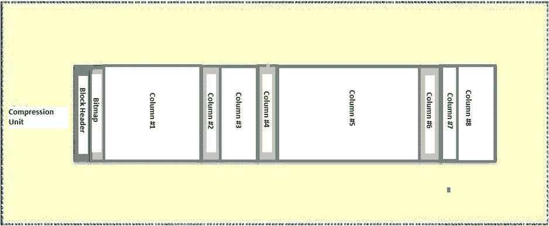
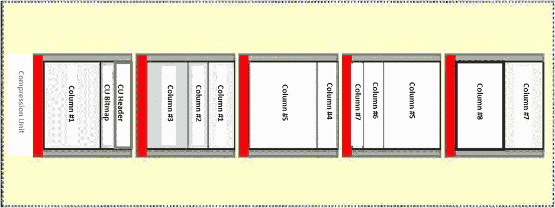
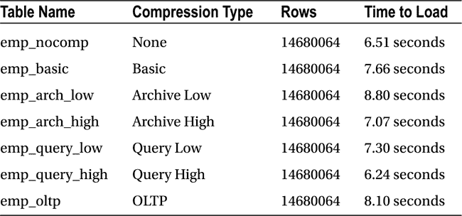
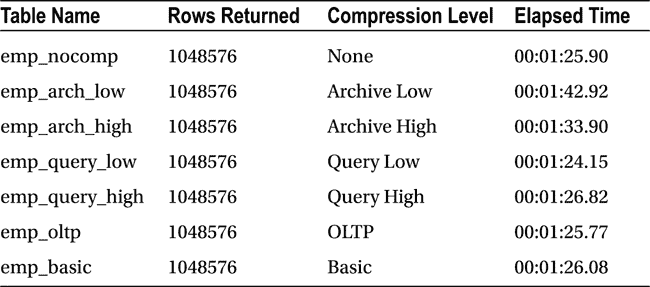

# 第五章标题

NUM_PHYSICAL_DISKS   MAX_IOPS   MAX_MBPS  MAX_PMBPS    LATENCY
------------------ ---------- ---------- ---------- ----------
                36       1022       2885        289         11

```

成功完成 I/O 校准后，如果查询或语句达到或超过了 `parallel_min_time_threshold` 参数所表示的串行执行时间阈值，那么自动 DOP 将设置并行度，而不管是否有对象被显式设置为并行执行。您可能会发现，一旦 I/O 校准完成，某些任务可能需要更长时间才能完成，因为它们被放入了队列。这可能是因为分配的并行资源可能不足以满足所有符合并行执行条件的查询和语句。有一份 Metalink Note，文档 ID 1393405.1，解释了如何删除 I/O 校准统计信息。简而言之，这两个视图都基于一个单一的表：`RESOURCE_IO_CALIBRATE$`。从该表中删除数据会清除 I/O 校准统计信息，从而使自动 DOP 不再起作用。在统计信息被删除时处于队列中的语句将保留在队列中直到被执行；在 I/O 校准统计信息被删除后，不会有额外的语句被加入队列。这并不像乍看起来那样是一种激烈的措施，因为 `DBMS_RESOURCE_MANAGER.CALIBRATE_IO` 在使用相同的语句生成当前统计信息之前，会删除任何现有的 I/O 校准值，正如部分 tkprof 输出所示：

```
SQL ID: bzhku92rujah0 Plan Hash: 256968859

delete from resource_io_calibrate$

call     count       cpu    elapsed       disk      query    current        rows
------- ------  -------- ---------- ---------- ---------- ----------  ----------
Parse        1      0.01       0.00          0          0          0           0
Execute      1      0.00       0.00          0          1          0           0
Fetch        0      0.00       0.00          0          0          0           0
------- ------  -------- ---------- ---------- ---------- ----------  ----------
total        2      0.01       0.00          0          1          0           0

Misses in library cache during parse: 1
Optimizer mode: ALL_ROWS
Parsing user id: SYS   (recursive depth: 1)
Number of plan statistics captured: 1

Rows (1st) Rows (avg) Rows (max)  Row Source Operation
---------- ---------- ----------  ---------------------------------------------------
         0          0          0  DELETE  RESOURCE_IO_CALIBRATE$ (cr=1 pr=0 pw=0 time=26 us)
         0          0          0  TABLE ACCESS FULL RESOURCE_IO_CALIBRATE$ (cr=1 pr=0 pw=0 time=21 
                                  us cost=2 size=0 card=1) 
********************************************************************************
```

## 实现它

I/O 校准并非启用自动 DOP 的唯一因素，因为参数 `parallel_degree_policy` 必须设置为 `AUTO` 或 `LIMITED`。默认情况下，它被设置为 `MANUAL`，这会禁用 Oracle 11.2 版本的三个并行功能：自动 DOP、并行语句排队和内存中并行执行。这三个可用的设置及其对这些功能的影响列在表 5-2 中。

表 5-2. `parallel_degree_policy` 设置如何影响并行执行

| 设置 | 影响 |
| --- | --- |
| `MANUAL` | 禁用所有三个新的并行查询功能。导致并行处理回退到先前版本的行为，仅当语句有提示或被查询的对象是创建时或被更改为具有大于默认值 1 的 `DEGREE` 时，才会并行化语句。 |
| `LIMITED` | 仅启用自动 DOP；其余两个新的并行功能被禁用。在此设置下，只有针对与 `DEGREE` 为 `DEFAULT` 相关联的对象的查询才会被考虑。 |
| `AUTO` | 所有三个新的并行功能都被启用。无论访问的对象上的 `DEGREE` 设置如何，查询和语句都将被评估是否进行并行执行。 |

另一个影响其中一个新功能的“隐藏”参数是 `_parallel_statement_queueing`。当设置为 `TRUE`（默认值）时，排队功能被启用，这允许 Oracle 在运行时决定并行语句是否可以执行，或者是否需要等待队列中直到有足够资源可用。还有一个“隐藏”参数 `_parallel_cluster_cache_policy`，它控制内存中并行执行是否可用。设置为 `cached` 会启用此功能。在 Exadata 上，此功能可能不太有用；当它启用时，扫描缓冲区缓存时将无法使用 Smart Scan 优化。这是一个选择：是对缓冲区缓存使用 Smart Scan 的全部功能，还是使用内存中并行执行。这主要适用于数据仓库工作负载，因为 OLTP 处理很少需要并行处理。但您应该意识到，当配置了内存中并行执行时，访问缓冲区缓存的 Smart Scan 可能会受到影响。

当 `parallel_degree_policy` 设置为 `AUTO` 时，对象是否以大于 1 的 `DEGREE` 创建就不重要了，因为数据库决定哪些语句并行运行、使用多少并行从属进程执行，甚至决定涉及多少个 RAC 节点参与该过程。这就是自动 DOP 的魅力和强大之处。

### 在内存中执行

第三个并行功能，内存中并行执行，可以在不使用 Smart Scan 时提高查询性能。它设计为使用缓冲区缓存，具有集群感知能力，并且可以利用所有可用的 RAC 节点。当 `parallel_degree_policy` 设置为 `AUTO` 时，它即被启用。其他可以影响内存中并行执行的参数有 `parallel_servers_target`、`parallel_min_time_threshold`、`parallel_degree_limit` 和 `parallel_degree_policy`。`parallel_servers_target`、`parallel_degree_limit` 和 `parallel_min_time_threshold` 的较低值会使内存中更有可能运行并行执行。此外，可以将 `parallel_force_local` 参数设置为 `TRUE`，将可用的并行资源限制在本地服务器上，这也有利于内存中并行执行。影响此改进的非并行参数是 `sga_max_size` 和 `sga_target`，它们控制着缓冲区缓存大小以及 SGA 的其他区域。更大的缓存大小可以在内存中容纳更大的表，这也使得此功能更有可能运行。将这些参数设置为较低值不能保证此功能会运行，但如果缩减这些设置，您使用它的机会可能会更大。

虽然内存确实比磁盘快得多，但 Smart Scan 旨在快速高效地访问磁盘上的数据。列投影和谓词过滤大大减少了数据库层处理的数据量，从而加快了查询速度。但如果所有数据都能在内存中加载和处理，那么处理相同数据量所需的时间将只是从磁盘读取处理时间的一小部分。

内存中并行执行有其好处。


## Oracle Exadata 并行查询处理特性详解

### 内存并行执行的优缺点与考量

*   物理 I/O 实际上被消除。
*   数据库服务器与存储单元之间的流量被消除。
*   与磁盘或闪存存储相比，内存访问的延迟要低得多。

然而，这些益处不能孤立看待，因为必须考虑可用的 CPU 和内存资源。在智能扫描执行期间，本应卸载到存储单元的功能（数据过滤和数据解压缩）现在需要由数据库服务器来执行。这可能增加处理数据所需的 CPU 周期，并且如果没有存储服务器额外的 CPU 和内存，可能会给数据库服务器性能带来压力。你有可能拥有这些富余资源，也同样有可能没有。是否使用此功能是一个只有你在仔细考虑所有事实后才能做出的决定。

我们处理过的所有 Exadata 系统均未使用内存并行执行。这很可能是一件好事，如果大多数查询都使用智能扫描，因为如前所述，所有智能扫描优化都不可用。是的，它会消除磁盘 I/O，但它也消除了存储服务器本可提供的、用于数据过滤、解压缩和其他操作的额外 CPU。尽管理念上看起来不错，但在 Exadata 系统上，使用内存并行执行可能比使用智能扫描效率更低，因为在智能扫描中，存储服务器分担工作负载并减少了数据库层处理的数据量。此外，能从中获益最大的查询，恰恰是那些通常不会使用存储索引的查询，它们会将整张表放入内存。在大量查询和语句不使用智能扫描、且表的大小足以完全放入缓冲区缓存的 Exadata 系统上，内存并行执行可以通过消除磁盘 I/O（以物理读的形式）并转为内存访问（通过逻辑读）来提升性能。

### 如何禁用内存并行执行

如前所述，当 `parallel_degree_policy` 设置为 `AUTO` 时，所有三项并行功能都将启用。如果你想禁用内存并行执行，可以通过以下两种方式之一完成：要么将 `parallel_degree_policy` 设置为 `MANUAL`（此设置将禁用所有功能），要么将隐藏参数 `_parallel_cluster_cache_policy` 设置为 `ADAPTIVE`，后者会保留自动并行度和并行语句排队功能的可用性。当自动并行度激活时，`_parallel_cluster_cache_policy` 将被设置为 `CACHED`。

### 在 Exadata 上实施的挑战

内存并行执行并非在 Exadata 上最容易实现的功能。我们尚未在我们的系统上成功启用它，即使将 `parallel_min_time_threshold`、`parallel_servers_target` 和 `parallel_degree_limit` 设置为异常低的阈值。它还要求整张表必须能放入缓冲区缓存，这并非易事。此外，数据库服务器在没有智能扫描协助的情况下执行所有工作，无法消除可能的数据大容量，因此智能扫描可能是一条更好的路径。再次强调，这是一个只有你在考虑了智能扫描和内存并行执行的所有方面，以及系统当前工作负载后，才能做出的决定。

## 注意事项

并行查询处理并非 Exadata 独有；它使用的是任何 Oracle 11.2 安装都可用的相同功能。它对 Exadata 特别有益的原因在于，Exadata 从一开始就是为数据仓库而设计的，而并行处理在数据仓库中被频繁使用。

并行查询处理有三个改变其性能的新特性。它们是自动并行度、并行语句排队和内存并行处理。其中，前两项对 Exadata 提供了最大的益处。

### 自动并行度

自动并行度正如其名：它根据可用资源和系统负载自动计算并行度。默认情况下不启用。必须将初始化参数 `parallel_degree_policy` 设置为 `AUTO` 或 `LIMITED` 才能启用自动并行度。默认情况下，此参数设置为 `MANUAL`。当此参数设置为 `AUTO` 时，所有三项新的并行查询特性都将被启用。

I/O 校准是使自动并行度正常工作的必要条件，使用提供的过程 `DBMS_RESOURCE_MANAGER.CALIBRATE_IO` 来生成和记录校准数据。尽管执行起来相当简单，但它是一项耗时且资源密集型的操作，不应在负载重的系统上尝试。

I/O 校准结果可在 `V$IO_CALIBRATION_STATUS` 和 `DBA_RSRC_IO_CALIBRATE` 视图中查看。结果存储在 `RESOURCE_IO_CALIBRATE$` 表中。当查询 `V$IO_CALIBRATION_STATUS` 返回状态为 `NOT AVAILABLE` 时，表明尚未运行 I/O 校准。状态为 `COMPLETED` 以及完成日期则证明存在有效的校准数据。

启用自动并行度后可能会出现性能问题，例如查询整体完成时间变长。可以通过从 `RESOURCE_IO_CALIBRATE$` 表中删除来清除 I/O 校准统计信息。这并不像乍看起来那么激烈，因为 `DBMS_RESOURCE_MANAGER.CALIBRATE_IO` 过程在生成新校准数据之前会先执行此删除操作。

### 并行语句排队

并行语句排队通过以下初始化参数启用：

```
parallel_degree_policy
parallel_servers_target
```

请记住，将 `parallel_degree_policy` 设置为 `AUTO` 会启用所有三项新的并行查询功能，这是启用并行语句排队的唯一方式。`parallel_servers_target` 应设置为允许的并行从属进程的期望数量。然而，它并非硬性限制，因为在某些情况下可能会超过此设置，因为自动并行度可以设置分配的 DOP 两倍的并行从属进程数。这种情况并不常见，所以即使发生也不是问题。

`V$SQL_MONITOR` 和 `GV$SQL_MONITOR` 视图记录哪些语句处于并行语句队列中。状态为 `QUEUED` 表示哪些语句正在队列中等待。除了报告队列中的语句外，这些视图还记录了 `SQL_EXEC_ID`，它指示了排队语句的执行顺序。通常，这是顺序分配的，但如果几个排队的语句可以并行同时执行，`SQL_EXEC_ID` 可能对多个条目显示相同的值。

可以控制并行语句排队。更改 `parallel_servers_target` 的值会影响语句何时进入队列。较低的 `parallel_servers_target` 值可能导致更多语句排队，因为可用的并行查询资源减少了。增加此值可以在队列填满之前允许更多语句处理。另一种控制排队的方法是通过提示。如果使用 `NO_STATEMENT_QUEUING` 提示，则可以绕过该语句的并行语句排队。如果可用资源低到足以使该语句被放入队列，那么带有此提示的语句将绕过语句队列，并立即以计算出的 DOP 运行。这是 `parallel_servers_target` 的值可能被超过的一种情况。

# 第 6 章 压缩

如果未启用并行语句排队（通过将 `parallel_degree_policy` 设置为 `LIMITED` 或 `MANUAL`，或者将隐藏参数 `_parallel_statement_queuing` 设置为 `FALSE`），仍可使用 `STATEMENT_QUEUING` 提示对选定的语句进行排队。使用此提示会使 Oracle 的行为如同启用了并行语句排队，但仅影响使用此提示的语句。当你只想为你选择的、其并行执行可能阻碍更重要的业务语句处理的语句启用并行语句排队时，这非常有用。

内存中并行执行是第三个新特性，它可能不是大多数在 Exadata 上运行的查询会利用的功能。该特性有其优点和缺点。优点是消除了磁盘 I/O、数据库服务器与存储单元之间的通信流量，并且内存的延迟远低于磁盘或闪存存储。在 Exadata 上的缺点是，由于消除了磁盘 I/O，Smart Scan 优化不再可用，数据库服务器必须承担所有数据过滤和解压缩的工作，并且由于存储服务器不再参与查询处理，可用的 CPU 数量也减少了。

可以通过将另一个隐藏参数 `_parallel_cluster_cache_policy` 设置为 `ADAPTIVE`，或者将 `parallel_degree_policy` 设置为 `MANUAL` 来禁用内存中并行执行，后者会关闭所有新的并行查询特性。

内存中并行执行在 Exadata 系统中很少见。可能存在某个查询从内存中并行执行中获益比使用 Smart Scan 更多的情况，但在我们支持的 Exadata 系统上尚未遇到过。


Oracle 11.2 版本提供了高级压缩，这是一种通过使用令牌（可代表更长字符串和值的助记符）压缩常见值和字符串来减少数据总体大小的方法。在不使用 Exadata 类型存储的系统上提供两种压缩类型：基础压缩和 OLTP 压缩。基础压缩无需高级压缩许可即可使用。第三种压缩选项，混合列压缩（HCC），可在 Exadata 系统和使用 Exadata 类型存储的非 Exadata 系统上使用。它提供两个基本级别：QUERY 和 ARCHIVE。

这些压缩选项可节省空间，将表大小压缩到几乎未压缩大小的一半。当然，这些特性并非没有代价，其行为也可能不如预期。谨慎使用时，可以减少存储需求，有时效果显著。正是知道何时使用压缩以及实现哪个压缩级别，才使得这项功能既实用又有价值。

## 我可以如何压缩你

压缩有三个通用级别：基础压缩、OLTP 压缩和混合列压缩（我们将之称为 HCC，适用于 Exadata）。到目前为止，其中最激进的是 HCC，但它可能会给初学者带来一些意外。另外请注意，对于非分区表，一次只能使用一种高级压缩选项；可以是 OLTP 压缩或 HCC，但不能同时使用两者。分区表的不同之处在于每个分区可以使用不同的压缩方法。例如，按日期分区的当前分区可以使用 OLTP 压缩以使更新和插入更省时；未来六个月的分区可以使用 QUERY LOW 压缩；而存档分区（超过六个月的分区）可以使用 ARCHIVE HIGH 压缩，以便为不再更新的分区节省空间。

### 基础压缩

基础压缩名副其实；它简单且相当快速地压缩表数据，从而显著节省空间：

```sql
SQL> select segment_name, bytes
  2  from user_segments;

SEGMENT_NAME                               BYTES
----------------------------------- ----------
DEPT                                       65536
SALGRADE                                   65536
DUMMY                                      65536
EMP                                  713031680

SQL> alter table emp move compress;

Table altered.

SQL> select segment_name, bytes
  2  from user_segments;

SEGMENT_NAME                               BYTES
----------------------------------- ----------
DEPT                                       65536
SALGRADE                                   65536
DUMMY                                      65536
EMP                                  184549376
```

要影响当前数据以及未来的插入和更新，我们必须移动表并对其进行压缩。一个简单的 `alter table emp compress;` 命令会将表设置为压缩，但当前数据将保持不变，无法立即节省空间。移动操作使 Oracle 能够压缩表中的现有数据。

##### OLTP 压缩

OLTP 压缩是需要单独许可才能使用的高级压缩选项之一。与基础压缩不同，OLTP 压缩确实能在更新后自动进行压缩；但是，它是以逐块（block-by-block）的批量类型操作执行的。它同样能在存储层上提供可观的节省：

```sql
SQL> select segment_name, bytes
  2  from user_segments;

SEGMENT_NAME                               BYTES
----------------------------------- ----------
EMP                                  721420288
DEPT                                       65536
SALGRADE                                   65536
DUMMY                                      65536

SQL> alter table emp move compress for oltp;

Table altered.

SQL> select segment_name, bytes
  2  from user_segments;

SEGMENT_NAME                               BYTES
----------------------------------- ----------
EMP                                  201326592
DEPT                                       65536
SALGRADE                                   65536
DUMMY                                      65536

SQL>
```

使用 OLTP 压缩后的大小比基础压缩稍大，但你可以获得更新块填满后最终重新压缩的额外好处。当更新的块达到压缩阈值时，它们会使用 OLTP 算法进行压缩，因此无需手动重新压缩表。这当然会使更新后的表处于压缩块和未压缩块的*混合状态*，但一旦达到压缩条件，未压缩的块将返回到压缩状态。

### 混合列压缩 (HCC)

混合列压缩是一种仅适用于驻留在 Exadata 存储上的表的压缩选项。（除了 Exadata，还包括 Axiom、SPARC SuperCluster 和 Sun ZFS Storage Appliance。）如果你在任何其他系统上尝试此操作，将收到以下信息性消息：

```sql
SQL> alter table emp move compress for query high;
alter table emp move compress for query high
            *
ERROR at line 1:
ORA-64307: hybrid columnar compression is not supported for tablespaces on this storage type

SQL>
```

短语 `this storage type` 指的是本节开头所列存储类型之外的任何存储。考虑到这一点，我们要提到，当目标数据库不在 Exadata 上或未使用 Exadata 存储时，HCC 可能会成为 Data Guard 的*障碍*。受影响的 Data Guard 实例中的表在事务应用之前将需要解压缩，因此所有节省的空间都将丢失。对于启用了 HCC 的数据库备份也是如此。将使用 HCC 压缩的备份恢复到非 Exadata 系统时，将需要解压缩这些表。如果存储需求是根据 Exadata 端确定的，这很容易导致在解压缩所有表之前存储空间就已耗尽。

# HCC

HCC 的工作原理与本章前面提到的两种选项不同，因为它会将数据重新组织为压缩单元（`CU`）。其工作原理将在下一节讨论。目前，我们将专注于实现 HCC 的四种形式以及它们之间的差异。HCC 标志下有两种基本类型：`QUERY`和`ARCHIVE`，每种类型都有`HIGH`和`LOW`选项。我们将首先讨论属于`QUERY`类型的第一组 HCC 选项，然后讨论`ARCHIVE`类型。

### QUERY

这种类型不如`ARCHIVE`激进，但它最初压缩数据的程度仍然高于`OLTP`压缩。我们首先对`EMP`表进行`QUERY HIGH`压缩：

```sql
SQL>
SQL> --
SQL> -- Current storage for the EMP table
SQL> -- (this is simply a test table for this example)
SQL> --
SQL> select segment_name, sum(bytes) total_space
  2  from user_segments
  3  group by segment_name;

SEGMENT_NAME                        TOTAL_SPACE
----------------------------------- -----------
DEPT                                      65536
DUMMY                                     65536
EMP                                  713031680
EMP_IDX                             478150656
SALGRADE                                65536

Elapsed: 00:00:00.82
SQL>
SQL> --
SQL> -- Compress the table for query high (use HCC)
SQL> --
SQL> -- Note elapsed time to compress
SQL> --
SQL> alter table emp move compress for query high;

Table altered.

Elapsed: 00:00:35.65
SQL>
SQL> --
SQL> -- Index is now invalid
SQL> --
SQL> -- Must rebuild to make it usable
SQL> --
SQL> -- Note elapsed time
SQL> --
SQL> alter index emp_idx rebuild;

Index altered.

Elapsed: 00:01:13.70
SQL>
SQL> --
SQL> -- Current compression type, storage for table/index
SQL> -- initially after compression is enabled
SQL> --
SQL> select table_name, compression, compress_for
  2  from user_tables;

TABLE_NAME                   COMPRESS COMPRESS_FOR
------------------------------ -------- ------------
DEPT                         DISABLED
BONUS                        DISABLED
SALGRADE                     DISABLED
DUMMY                        DISABLED
EMP                          ENABLED  QUERY HIGH

Elapsed: 00:00:00.20
SQL>
SQL> select segment_name, sum(bytes) total_space
  2  from user_segments
  3  group by segment_name;

SEGMENT_NAME                        TOTAL_SPACE
----------------------------------- -----------
DEPT                                      65536
DUMMY                                     65536
EMP                                    8388608
EMP_IDX                             260046848
SALGRADE                                65536

Elapsed: 00:00:00.03
SQL>
```

结果大小比`Basic`或`OLTP`压缩选项都要小得多。即使在`QUERY LOW`压缩率下，其大小仍然小于`OLTP`压缩所能提供的：

```sql
SQL>
SQL> --
SQL> -- Initial storage
SQL> --
SQL> select segment_name, sum(bytes) total_space
  2  from user_segments
  3  group by segment_name;

SEGMENT_NAME                        TOTAL_SPACE
----------------------------------- -----------
DEPT                                      65536
DUMMY                                     65536
EMP                                  713031680
EMP_IDX                             478150656
SALGRADE                                65536

Elapsed: 00:00:00.25
SQL>
SQL> --
SQL> -- Compress for QUERY LOW
SQL> --
SQL> -- Note elapsed time
SQL> --
SQL> alter table emp move compress for query low;

Table altered.

Elapsed: 00:00:16.16
SQL>
SQL> alter index emp_idx rebuild;

Index altered.

Elapsed: 00:00:43.08
SQL>
SQL> --
SQL> -- These figures are the same as those generated
SQL> -- AFTER the HCC compressed data was updated the first time
SQL> --
SQL> select table_name, compression, compress_for
  2  from user_tables;

TABLE_NAME                   COMPRESS COMPRESS_FOR
------------------------------ -------- ------------
DEPT                         DISABLED
BONUS                        DISABLED
SALGRADE                     DISABLED
DUMMY                        DISABLED
EMP                          ENABLED  QUERY LOW

Elapsed: 00:00:00.02
SQL>
SQL> select segment_name, sum(bytes) total_space
  2  from user_segments
  3  group by segment_name;

SEGMENT_NAME                        TOTAL_SPACE
----------------------------------- -----------
DEPT                                      65536
DUMMY                                     65536
EMP                                   14680064
EMP_IDX                             260046848
SALGRADE                                65536

Elapsed: 00:00:00.02
SQL>
```

### ARCHIVE

`HCC`压缩类型`ARCHIVE`无疑是在节省空间方面最激进的，但它也是为那些被指定为只读并被归档以供偶尔使用的数据而设计的。它当然不适用于频繁更新的表；因为空间节省会被为允许更新而解压数据以及在较低的`OLTP`级别重新压缩所抵消。我们将对标准`EMP`表进行`ARCHIVE HIGH`压缩，看看能产生多少空间节省：

```sql
SQL> --
SQL> -- Current storage for the EMP table
SQL> -- (this is simply a test table for this example)
SQL> --
SQL> select segment_name, sum(bytes) total_space
  2  from user_segments
  3  group by segment_name;

SEGMENT_NAME                        TOTAL_SPACE
----------------------------------- -----------
DEPT                                      65536
DUMMY                                     65536
EMP                                  713031680
EMP_IDX                             478150656
SALGRADE                                65536

Elapsed: 00:00:00.02
SQL>
SQL> --
SQL> -- Compress the table for archive high
SQL> --
SQL> -- Note elapsed time to compress
SQL> --
SQL> alter table emp move compress for archive high;

Table altered.

Elapsed: 00:00:38.55
SQL>
SQL> --
SQL> -- Index is now invalid
SQL> --
SQL> -- Must rebuild to make it usable
SQL> --
SQL> -- Note elapsed time
SQL> --
SQL> alter index emp_idx rebuild;

Index altered.

Elapsed: 00:00:39.45
SQL>
SQL> --
SQL> -- Current compression type, storage for table/index
SQL> -- initially after compression is enabled
SQL> --
SQL> select table_name, compression, compress_for
  2  from user_tables;

TABLE_NAME                   COMPRESS COMPRESS_FOR
------------------------------ -------- ------------
DEPT                         DISABLED
BONUS                        DISABLED
SALGRADE                     DISABLED
DUMMY                        DISABLED
EMP                          ENABLED  ARCHIVE HIGH

Elapsed: 00:00:00.02
SQL>
SQL> select segment_name, sum(bytes) total_space
  2  from user_segments
  3  group by segment_name;

SEGMENT_NAME                        TOTAL_SPACE
----------------------------------- -----------
DEPT                                      65536
DUMMY                                     65536
EMP                                    4194304
EMP_IDX                             260046848
SALGRADE                                65536

Elapsed: 00:00:00.01
SQL>
```

空间节省是巨大的，将表从原始的 680 兆字节减少到 4 兆字节，节省了 99.41%。使用`ARCHIVE LOW`代替`ARCHIVE HIGH`仍然能产生令人印象深刻的结果：

```sql
SQL> --
SQL> -- Initial storage
SQL> --
SQL> select segment_name, sum(bytes) total_space
  2  from user_segments
  3  group by segment_name;

SEGMENT_NAME                        TOTAL_SPACE
----------------------------------- -----------
DEPT                                      65536
DUMMY                                     65536
EMP                                  713031680
EMP_IDX                             478150656
SALGRADE                                65536
```


## Oracle HCC 压缩性能观察与详解

### 数据库操作与观察

以下记录了使用 `ARCHIVE LOW` 压缩对表和索引进行操作后的观察结果。
```
Elapsed: 00:00:01.31
SQL>
SQL> --
SQL> -- Compress for ARCHIVE LOW
SQL> --
SQL> -- Note elapsed time
SQL> --
SQL> alter table emp move compress for archive low;

Table altered.

Elapsed: 00:00:34.16
SQL>
SQL> alter index emp_idx rebuild;

Index altered.

Elapsed: 00:00:48.44
SQL>
SQL> --
SQL> -- These figures are the same as those generated
SQL> -- AFTER the HCC compressed data was updated the first time
SQL> --
SQL> select table_name, compression, compress_for
  2  from user_tables;

TABLE_NAME                     COMPRESS COMPRESS_FOR
------------------------------ -------- ------------
DEPT                           DISABLED
BONUS                          DISABLED
SALGRADE                       DISABLED
DUMMY                          DISABLED
EMP                            ENABLED  ARCHIVE LOW

Elapsed: 00:00:00.03
SQL>
SQL> select segment_name, sum(bytes) total_space
  2  from user_segments
  3  group by segment_name;

SEGMENT_NAME                    TOTAL_SPACE
------------------------------- -----------
DEPT                                 65536
DUMMY                                65536
EMP                                8388608
EMP_IDX                         260046848
SALGRADE                            65536

Elapsed: 00:00:00.02
SQL>
```
使用 `ARCHIVE LOW` 后，表的大小最终是使用 `ARCHIVE HIGH` 时的两倍，但与压缩前的原始状态相比，表缩小了 98.82%。这与 `QUERY HIGH` 提供的压缩级别相同。

Oracle 在 `DBMS_COMPRESSION` 包中提供了一个名为 `GET_COMPRESSION_TYPE` 的函数。此函数返回一个数字，表示给定表正在使用的压缩类型和级别。我们有一个查询可以报告给定表的所有者、表名、数字压缩 ID 和类型名称。我们将所有者和表名作为输入传入。
```
set verify off
select distinct
        '&&owner' owner,
        '&&tabname' table_name,
        dbms_compression.get_compression_type('&&owner','&&tabname', rowid) comp_typ,
        decode(dbms_compression.get_compression_type('&&owner','&&tabname', rowid),
               1, 'NONE',
               2, 'OLTP',
               4, 'QUERY HIGH',
               8, 'QUERY LOW',
              16, 'ARCHIVE HIGH',
              32, 'ARCHIVE LOW') type_name
from
        &&owner..&&tabname
/

Undefine owner
Undefine tabname
```
输出如下：
```
SQL> @get_compression_type.sql
Enter value for owner: BING
Enter value for tabname: EMP

OWNE TABL   COMP_TYP TYPE_NAME
---- ---- ---------- ------------
BING EMP           8 QUERY LOW

SQL>
```

### 压缩技术详解

#### HCC 的基本原理

使用 HCC 会改变 Oracle 存储表数据的方式，将存储格式从通常的堆式块填充改为以列为中心的格式，仍然使用数据块，但称为压缩单元或 `CU`。这是一个逻辑上的改变，因为压缩单元由多个具有独特布局的 Oracle 块组成。首先，Oracle 为压缩单元收集大量相似的行，并以列式格式组织它们，类似于图 6-1。


图 6-1 HCC 压缩单元的初始数据组织

收集相似数据的行使得使用 HCC 压缩数据更容易，因为可以替换为标记的公共元素被 *colocated* 在同一个压缩单元中。Oracle 设计上是一个以行为中心的 DBMS，因此这个中间结构会转换回行格式，类似于图 6-2。


图 6-2 HCC 压缩单元布局

在此示例中，使用五个数据块来存储数据，每列是块中的一行。有些列无法放入单个块中，因此它们会跨多个块链接，如图所示。块头显示为红色；压缩单元头位于压缩单元的第一个块中，压缩单元位图也在此处，显示行的位置。数据列紧随块 1 中的 `CU` 头和 `CU` 位图行之后，列 1 数据从块的第三行开始。

如前所述，如果列无法完全放入单个块中，则会链接到压缩单元中的下一个块。此策略会持续进行，直到所有列都存储完毕。因为相似的数据存储在一起，与基本压缩或 OLTP 压缩相比，HCC 可以提供极高的压缩比。此外，以这种方式创建压缩单元可以防止单行被拆分到多个 `CU` 中，因此可以从单个 `CU` 中读取整行。

#### 性能影响

根据您是插入、更新还是查询数据，压缩表的性能可能不如预期。查询数据通常是一个快速的操作。除了 OLTP 压缩外，插入操作都需要并行或直接路径加载插入，以便新插入的行被压缩。更新操作耗时更长，因为数据在更新前必须被解压缩。在决定使用压缩之前，请仔细分析表的使用方式；频繁更新的表更适合使用 OLTP 压缩，而不是 HCC 压缩类型。请记住，工程通常被描述为进行 *权衡* 的艺术。鱼与熊掌不可兼得。

##### 加载数据的影响

向压缩表中加载数据，除了 OLTP 压缩这个唯一的例外，都需要并行或直接路径插入。当然，向压缩表中加载数据可能比对未压缩表进行相同的过程花费更长时间。我们使用各种压缩方法创建了空表，并从我们在前面示例中填充的 `EMP` 表中加载数据。这些加载的结果以及所需时间如下例所示：
```
SQL>
SQL> --
SQL> -- Build compressed tables, keep them empty
SQL> --
SQL>
SQL> create table emp_arch_low as select * from emp where 0=1;

Table created.

Elapsed: 00:00:01.42
SQL> create table emp_arch_high as select * from emp where 0=1;

Table created.

Elapsed: 00:00:00.01
SQL> create table emp_query_low as select * from emp where 0=1;

Table created.

Elapsed: 00:00:00.01
SQL> create table emp_query_high as select * from emp where 0=1;

Table created.

Elapsed: 00:00:00.01
SQL> create table emp_oltp as select * from emp where 0=1;

Table created.

Elapsed: 00:00:00.01
SQL> create table emp_basic as select * from emp where 0=1;

Table created.

Elapsed: 00:00:00.01
SQL>
SQL> --
SQL> -- Create a copy of emp, uncompressed
SQL> --
SQL>
SQL> create table emp_nocomp as select * From emp where 0=1;

Table created.

Elapsed: 00:00:00.02
SQL>
SQL> --
SQL> --
SQL> -- We load the tables and see how long each
SQL> -- compression level takes
SQL> --
SQL> --
SQL>
SQL> insert /*+ append */ into emp_nocomp select * from emp;

14680064 rows created.

Elapsed: 00:00:06.51
SQL> insert /*+ append */ into emp_arch_low       select * from emp;

14680064 rows created.

Elapsed: 00:00:08.80
SQL> insert /*+ append */ into emp_arch_high select * from emp;

14680064 rows created.

Elapsed: 00:00:07.07
SQL> insert /*+ append */ into emp_query_low select * from emp;

14680064 rows created.

Elapsed: 00:00:07.30
SQL> insert /*+ append */ into emp_query_high select * from emp;

14680064 rows created.

Elapsed: 00:00:06.24
SQL> insert /*+ append */ into emp_oltp select * from emp;

14680064 rows created.

Elapsed: 00:00:08.10
SQL> insert /*+ append */ into emp_basic select * from emp;

14680064 rows created.

Elapsed: 00:00:07.66
SQL>
```
我们已经收集了数据，并将其呈现在表 6-1 中，以便更容易理解。


##### 表 6-1. 压缩表的加载时间与数据量



除了 `QUERY HIGH` 压缩方式外，其他压缩表的加载时间都超过了加载未压缩表所需的时间。您执行测试所得的时间可能与我们生成的时间有所不同，因为这取决于您执行测试时系统所承受的负载。如果使用了 `Smart Scans`，部分处理工作将被下推到存储单元执行，从而减轻数据库服务器的工作负载。这可能导致加载时间比加载未压缩数据的时间更短。

##### 当您执行查询时

数据压缩后，查询处理也可能需要更长的时间。`Smart Scans` 在这里也起到作用，因为部分工作（如解压缩数据）由存储单元承担，而非数据库服务器。我们对代表不同压缩类型的每张表运行了相同的查询；这些测试的结果如下：

```sql
SQL>
SQL> --
SQL> -- 让我们从每张表中进行选择，看看需要多长时间
SQL> --
SQL>
SQL> select /*+ parallel 4 */ *
  2  from emp_nocomp
  3  where empno > 7930;

EMPNO ENAME      JOB              MGR HIREDATE         SAL       COMM     DEPTNO
---------- ---------- --------- ---------- --------- ---------- ---------- ----------
      7934 MILLER     CLERK           7782 23-JAN-82       1300                    10
      7934 MILLER     CLERK           7782 23-JAN-82       1300                    10
      7934 MILLER     CLERK           7782 23-JAN-82       1300                    10
      7934 MILLER     CLERK           7782 23-JAN-82       1300                    10
...
      7934 MILLER     CLERK           7782 23-JAN-82       1300                    10
      7934 MILLER     CLERK           7782 23-JAN-82       1300                    10
      7934 MILLER     CLERK           7782 23-JAN-82       1300                    10

1048576 rows selected.

Elapsed: 00:01:25.90
SQL>
SQL> select /*+ parallel 4 */ *
  2  from emp_arch_low
  3  where empno > 7930;

EMPNO ENAME      JOB              MGR HIREDATE         SAL       COMM     DEPTNO
---------- ---------- --------- ---------- --------- ---------- ---------- ----------
      7934 MILLER     CLERK           7782 23-JAN-82       1300                    10
      7934 MILLER     CLERK           7782 23-JAN-82       1300                    10
      7934 MILLER     CLERK           7782 23-JAN-82       1300                    10
      7934 MILLER     CLERK           7782 23-JAN-82       1300                    10
...
      7934 MILLER     CLERK           7782 23-JAN-82       1300                    10
      7934 MILLER     CLERK           7782 23-JAN-82       1300                    10
      7934 MILLER     CLERK           7782 23-JAN-82       1300                    10

1048576 rows selected.

Elapsed: 00:01:42.92
SQL>
SQL> select /*+ parallel 4 */ *
  2  from emp_arch_high
  3  where empno > 7930;

EMPNO ENAME      JOB              MGR HIREDATE         SAL       COMM     DEPTNO
---------- ---------- --------- ---------- --------- ---------- ---------- ----------
      7934 MILLER     CLERK           7782 23-JAN-82       1300                    10
      7934 MILLER     CLERK           7782 23-JAN-82       1300                    10
      7934 MILLER     CLERK           7782 23-JAN-82       1300                    10
      7934 MILLER     CLERK           7782 23-JAN-82       1300                    10
...
      7934 MILLER     CLERK           7782 23-JAN-82       1300                    10
      7934 MILLER     CLERK           7782 23-JAN-82       1300                    10
      7934 MILLER     CLERK           7782 23-JAN-82       1300                    10

1048576 rows selected.

Elapsed: 00:01:33.90
SQL>
SQL> select /*+ parallel 4 */ *
  2  from emp_query_low
  3  where empno > 7930;

EMPNO ENAME      JOB              MGR HIREDATE         SAL       COMM     DEPTNO
---------- ---------- --------- ---------- --------- ---------- ---------- ----------
      7934 MILLER     CLERK           7782 23-JAN-82       1300                    10
      7934 MILLER     CLERK           7782 23-JAN-82       1300                    10
      7934 MILLER     CLERK           7782 23-JAN-82       1300                    10
      7934 MILLER     CLERK           7782 23-JAN-82       1300                    10
...
      7934 MILLER     CLERK           7782 23-JAN-82       1300                    10
      7934 MILLER     CLERK           7782 23-JAN-82       1300                    10
      7934 MILLER     CLERK           7782 23-JAN-82       1300                    10

1048576 rows selected.

Elapsed: 00:01:24.15
SQL>
SQL> select /*+ parallel 4 */ *
  2  from emp_query_high
  3  where empno > 7930;

EMPNO ENAME      JOB              MGR HIREDATE         SAL       COMM     DEPTNO
---------- ---------- --------- ---------- --------- ---------- ---------- ----------
      7934 MILLER     CLERK           7782 23-JAN-82       1300                    10
      7934 MILLER     CLERK           7782 23-JAN-82       1300                    10
      7934 MILLER     CLERK           7782 23-JAN-82       1300                    10
      7934 MILLER     CLERK           7782 23-JAN-82       1300                    10
...
      7934 MILLER     CLERK           7782 23-JAN-82       1300                    10
      7934 MILLER     CLERK           7782 23-JAN-82       1300                    10
      7934 MILLER     CLERK           7782 23-JAN-82       1300                    10

1048576 rows selected.

Elapsed: 00:01:26.82
SQL>
SQL> select /*+ parallel 4 */ *
  2  from emp_oltp
  3  where empno > 7930;

EMPNO ENAME      JOB              MGR HIREDATE         SAL       COMM     DEPTNO
---------- ---------- --------- ---------- --------- ---------- ---------- ----------
      7934 MILLER     CLERK           7782 23-JAN-82       1300                    10
      7934 MILLER     CLERK           7782 23-JAN-82       1300                    10
      7934 MILLER     CLERK           7782 23-JAN-82       1300                    10
      7934 MILLER     CLERK           7782 23-JAN-82       1300                    10
...
      7934 MILLER     CLERK           7782 23-JAN-82       1300                    10
      7934 MILLER     CLERK           7782 23-JAN-82       1300                    10
      7934 MILLER     CLERK           7782 23-JAN-82       1300                    10

1048576 rows selected.

Elapsed: 00:01:25.77
SQL>
SQL> select /*+ parallel 4 */ *
  2  from emp_basic
  3  where empno > 7930;

EMPNO ENAME      JOB              MGR HIREDATE         SAL       COMM     DEPTNO
---------- ---------- --------- ---------- --------- ---------- ---------- ----------
      7934 MILLER     CLERK           7782 23-JAN-82       1300                    10
      7934 MILLER     CLERK           7782 23-JAN-82       1300                    10
      7934 MILLER     CLERK           7782 23-JAN-82       1300                    10
      7934 MILLER     CLERK           7782 23-JAN-82       1300                    10
...
      7934 MILLER     CLERK           7782 23-JAN-82       1300                    10
      7934 MILLER     CLERK           7782 23-JAN-82       1300                    10
      7934 MILLER     CLERK           7782 23-JAN-82       1300                    10

1048576 rows selected.

Elapsed: 00:01:26.08
SQL>
```

汇总数据见表 6-2。

##### 表 6-2. 压缩表的查询执行时间



请注意，除了为 `ARCHIVE HIGH` 和 `ARCHIVE LOW` 压缩的表之外，其他表的执行时间与未压缩表非常接近。所有查询的执行计划都相同，如下所示：

```sql
Execution Plan

Plan hash value: 398743904

Predicate Information (identified by operation id):
```


##### 存储与过滤操作

4 - `storage("EMPNO">7930)`
       `filter("EMPNO">7930)`

## 注意事项

-  此语句使用了动态采样 (`level=2`)
    - 自动 `DOP`：计算得出的并行度为 2

自动 `DOP` 和 `智能扫描` 使得查询时间与未压缩数据相比基本没有变差，这证明了 `Exadata` 的这两项特性。`智能扫描` 还从存储单元提供了额外的 CPU 周期，因为数据是在存储单元解压缩的，而不是在数据库服务器上。

##### 当你执行更新时

更新会对 `基本级压缩` 带来一个问题，因为数据必须被解压缩，并且在更新后保持解压缩状态。

```
SQL> update emp set sal=sal*1.10 where empno = 7566;

1048576 rows updated.

SQL> select segment_name, bytes
  2  from user_segments;

SEGMENT_NAME                             BYTES
----------------------------------- ----------
DEPT                                     65536
SALGRADE                                 65536
DUMMY                                    65536
EMP                                  243269632

SQL>
```

请注意，`EMP` 表占用的总字节数在更新完成后增加了。后续的更新将导致表的大小继续增长，因为数据块会被处理。必须再次压缩表才能恢复最初节省的空间，如下所示：

```
SQL> alter table emp move compress;

Table altered.

SQL> select segment_name, bytes
  2  from user_segments;

SEGMENT_NAME                             BYTES
----------------------------------- ----------
DEPT                                     65536
SALGRADE                                 65536
DUMMY                                    65536
EMP                                  184549376

SQL>
```

目前没有提供在更新后自动重新压缩的功能。尽管 `基本压缩` 无需额外许可即可使用，但它的使用范围可能仅限于不更新或更新不频繁的表。

对压缩表的更新也比对未压缩表花费更长时间，因为受更新影响的数据块必须先解压缩，更新才能进行。使用 `基本压缩` 压缩的表进行批量更新的耗时如下：

```
SQL> update emp set sal=sal*1.10 where empno = 7566;

1048576 rows updated.

Elapsed: 00:01:05.85
SQL>
```

这是在无负载且只有一个连接用户的系统上执行的。在负载更重的系统上，耗时可能会更长，并且有趣的是，如果批量更新影响了表数据的很大一部分，表的大小可能会增长到超过原始大小。

```
SQL>
SQL> --
SQL> -- `EMP` 表当前的存储情况
SQL> -- （此表仅为本示例的测试表）
SQL> --
SQL> select segment_name, sum(bytes) total_space
  2  from user_segments
  3  group by segment_name;

SEGMENT_NAME                        TOTAL_SPACE
----------------------------------- -----------
DEPT                                     65536
DUMMY                                    65536
EMP                                  713031680
EMP_IDX                              469762048
SALGRADE                                 65536

Elapsed: 00:00:01.46
SQL>
SQL> --
SQL> -- 使用基本压缩对表进行压缩
SQL> --
SQL> -- 注意压缩操作的耗时
SQL> --
SQL> alter table emp move compress;

Table altered.

Elapsed: 00:00:15.57
SQL>
SQL> --
SQL> -- 索引现在无效了
SQL> --
SQL> -- 必须重建才能使其可用
SQL> --
SQL> -- 注意耗时
SQL> --
SQL> alter index emp_idx rebuild;

Index altered.

Elapsed: 00:00:53.01
SQL>
SQL> --
SQL> -- 启用压缩后，表/索引的当前压缩类型和存储空间
SQL> --
SQL> select table_name, compression, compress_for
  2  from user_tables;

TABLE_NAME                     COMPRESS COMPRESS_FOR
------------------------------ -------- ------------
DEPT                           DISABLED
BONUS                          DISABLED
SALGRADE                       DISABLED
DUMMY                          DISABLED
EMP                            ENABLED  BASIC

Elapsed: 00:00:00.03
SQL>
SQL> select segment_name, sum(bytes) total_space
  2  from user_segments
  3  group by segment_name;

SEGMENT_NAME                        TOTAL_SPACE
----------------------------------- -----------
DEPT                                     65536
DUMMY                                    65536
EMP                                  184549376
EMP_IDX                              260046848
SALGRADE                                 65536

Elapsed: 00:00:00.02
SQL>
SQL> --
SQL> -- 对压缩数据执行一次更新操作
SQL> --
SQL> -- 注意完成耗时
SQL> --
SQL> update emp set sal=sal*1.08 where empno > 7350;

14680064 rows updated.

Elapsed: 00:14:25.18
SQL>
SQL> commit;

Commit complete.

Elapsed: 00:00:00.00
SQL>
SQL> --
SQL> -- 数据字典中的压缩类型没有改变
SQL> -- 但占用的空间已经超过了表的原始大小
SQL> --
SQL> select table_name, compression, compress_for
  2  from user_tables;

TABLE_NAME                     COMPRESS COMPRESS_FOR
------------------------------ -------- ------------
DEPT                           DISABLED
BONUS                          DISABLED
SALGRADE                       DISABLED
DUMMY                          DISABLED
EMP                            ENABLED  BASIC

Elapsed: 00:00:00.03
SQL>
SQL> select segment_name, sum(bytes) total_space
  2  from user_segments
  3  group by segment_name;

SEGMENT_NAME                        TOTAL_SPACE
----------------------------------- -----------
DEPT                                     65536
DUMMY                                    65536
EMP                                  956301312
EMP_IDX                              260046848
SALGRADE                                 65536

Elapsed: 00:00:00.01
SQL>
SQL> --
SQL> -- 执行第二次更新
SQL> --
SQL> -- 注意耗时
SQL> --
SQL> update emp set sal=sal*1.08 where empno > 7350;

14680064 rows updated.

Elapsed: 00:03:48.95
SQL>
SQL> commit;

Commit complete.

Elapsed: 00:00:00.01
SQL>
SQL> --
SQL> -- 第二次更新后当前占用的存储空间
SQL> --
SQL> select table_name, compression, compress_for
  2  from user_tables;

TABLE_NAME                     COMPRESS COMPRESS_FOR
------------------------------ -------- ------------
DEPT                           DISABLED
BONUS                          DISABLED
SALGRADE                       DISABLED
DUMMY                          DISABLED
EMP                            ENABLED  BASIC

Elapsed: 00:00:00.03
SQL>
SQL> select segment_name, sum(bytes) total_space
  2  from user_segments
  3  group by segment_name;

SEGMENT_NAME                        TOTAL_SPACE
----------------------------------- -----------
DEPT                                     65536
DUMMY                                    65536
EMP                                  956301312
EMP_IDX                              260046848
SALGRADE                                 65536

Elapsed: 00:00:00.01
SQL>
```

由于使用 `基本压缩` 算法更新了压缩数据，表的大小已经增长。这种行为使得 `基本压缩` 对于频繁更新的表来说不是一个可行的选择。

##### OLTP 压缩

`OLTP 压缩` 可以更容易地保留初始压缩所生成的相当一部分空间节省，尽管这可能无法立即实现，因为并非所有更新后的数据块都会被填满。以下示例说明了这一点：

```
SQL>
SQL> --
SQL> -- 初始存储空间
SQL> --
SQL> select segment_name, sum(bytes) total_space
  2  from user_segments
  3  group by segment_name;
```


## Oracle 表压缩操作与性能观察

### 初始状态与 OLTP 压缩

执行以下命令以观察初始段大小，并将 `emp` 表移动为 OLTP 压缩格式。

```
SEGMENT_NAME                        TOTAL_SPACE
----------------------------------- -----------
DEPT                                      65536
DUMMY                                     65536
EMP                                  713031680
EMP_IDX                              478150656
SALGRADE                                 65536

已用时间: 00:00:00.03
SQL>
SQL> --
SQL> -- 压缩为 OLTP 而非 QUERY HIGH
SQL> --
SQL> -- 注意已用时间
SQL> --
SQL> alter table emp move compress for oltp;

表已更改。

已用时间: 00:00:19.36
SQL>
SQL> alter index emp_idx rebuild;

索引已更改。

已用时间: 00:00:52.12
SQL>
SQL> --
SQL> -- 这些数字与 HCC 压缩数据首次更新后生成的数字相同
SQL> --
SQL> select table_name, compression, compress_for
  2  from user_tables;

TABLE_NAME                     COMPRESS COMPRESS_FOR
------------------------------ -------- ------------
DEPT                           DISABLED
BONUS                          DISABLED
SALGRADE                       DISABLED
DUMMY                          DISABLED
EMP                            ENABLED  OLTP

已用时间: 00:00:00.04
SQL>
SQL> select segment_name, sum(bytes) total_space
  2  from user_segments
  3  group by segment_name;

SEGMENT_NAME                        TOTAL_SPACE
----------------------------------- -----------
DEPT                                      65536
DUMMY                                     65536
EMP                                  201326592
EMP_IDX                              260046848
SALGRADE                                 65536

已用时间: 00:00:00.01
SQL>
SQL> --
SQL> -- 执行一次更新
SQL> --
SQL> -- 注意已用时间（少于之前的压缩更新）
SQL> --
SQL> update emp set sal=sal*1.08 where empno > 7350;

14680064 行已更新。

已用时间: 00:20:40.64
SQL>
SQL> commit;

提交完成。

已用时间: 00:00:00.01
SQL>
SQL> --
SQL> -- 当前的压缩级别和存储情况
SQL> --
SQL> -- 看起来像是 HCC 压缩数据第二次更新后的存储情况
SQL> --
SQL> select table_name, compression, compress_for
  2  from user_tables;

TABLE_NAME                     COMPRESS COMPRESS_FOR
------------------------------ -------- ------------
DEPT                           DISABLED
BONUS                          DISABLED
SALGRADE                       DISABLED
DUMMY                          DISABLED
EMP                            ENABLED  OLTP

已用时间: 00:00:00.03
SQL>
SQL> select segment_name, sum(bytes) total_space
  2  from user_segments
  3  group by segment_name;

SEGMENT_NAME                        TOTAL_SPACE
----------------------------------- -----------
DEPT                                      65536
DUMMY                                     65536
EMP                                  511705088
EMP_IDX                              260046848
SALGRADE                                 65536

已用时间: 00:00:00.01
SQL>
```

### 压缩行为分析

表的整体大小仍然小于原始大小。部分填充的数据块仍处于未压缩状态，这导致了大小的增加。随着这些数据块被填满，它们将以批处理方式自动压缩，从而进一步减小表的大小。

对使用 HCC 压缩的数据进行更新，会表现出您在阅读本章提供的示例后所预期的行为。然而，在此场景中，由于更新操作，压缩算法发生了变化。数据最初以 `QUERY HIGH` 压缩，在更新后，压缩变为 `OLTP`，并保持此状态直到您进行修改。数据字典仍然报告 HCC 处于有效状态，它也确实如此，但由于更新，Oracle 现在将此数据视为使用 `OLTP` 压缩方案压缩的数据。我们将使用为 `QUERY HIGH` 压缩的 `EMP` 表，然后是为 `QUERY LOW` 压缩的表来更新数据，以说明此行为。

### QUERY HIGH 压缩下的更新

```
SQL> --
SQL> -- 在压缩数据上执行更新
SQL> --
SQL> -- 注意完成所需的已用时间
SQL> --
SQL> update emp set sal=sal*1.08 where empno > 7350;

14680064 行已更新。

已用时间: 00:42:34.40
SQL>
SQL> commit;

提交完成。

已用时间: 00:00:00.03
SQL>
SQL> --
SQL> -- 数据字典中的压缩类型没有改变，
SQL> -- 但消耗的空间已增加到最初为 OLTP 压缩的表的水平
SQL> --
SQL> select table_name, compression, compress_for
  2  from user_tables;

TABLE_NAME                     COMPRESS COMPRESS_FOR
------------------------------ -------- ------------
DEPT                           DISABLED
BONUS                          DISABLED
SALGRADE                       DISABLED
DUMMY                          DISABLED
EMP                            ENABLED  QUERY HIGH

已用时间: 00:00:00.03
SQL>
SQL> select segment_name, sum(bytes) total_space
  2  from user_segments
  3  group by segment_name;

SEGMENT_NAME                        TOTAL_SPACE
----------------------------------- -----------
DEPT                                      65536
DUMMY                                     65536
EMP                                  226492416
EMP_IDX                              721420288
SALGRADE                                 65536

已用时间: 00:00:00.33
SQL>
SQL> --
SQL> -- 执行第二次更新
SQL> --
SQL> -- 注意已用时间
SQL> --
SQL> update emp set sal=sal*1.08 where empno > 7350;

14680064 行已更新。

已用时间: 00:03:15.00
SQL>
SQL> commit;

提交完成。

已用时间: 00:00:00.02
SQL>
SQL> --
SQL> -- 第二次更新后当前的存储消耗情况
SQL> --
SQL> select table_name, compression, compress_for
  2  from user_tables;

TABLE_NAME                     COMPRESS COMPRESS_FOR
------------------------------ -------- ------------
DEPT                           DISABLED
BONUS                          DISABLED
SALGRADE                       DISABLED
DUMMY                          DISABLED
EMP                            ENABLED  QUERY HIGH

已用时间: 00:00:00.02
SQL>
SQL> select segment_name, sum(bytes) total_space
  2  from user_segments
  3  group by segment_name;

SEGMENT_NAME                        TOTAL_SPACE
----------------------------------- -----------
DEPT                                      65536
DUMMY                                     65536
EMP                                  452984832
EMP_IDX                              721420288
SALGRADE                                 65536

已用时间: 00:00:00.21
SQL>
```

请注意，与表关联的索引在第一次更新后大小也会增加，并在随后的表更新期间保持该大小。我们现在将对为 `QUERY LOW` 压缩的 `EMP` 表执行相同的更新，如下所示：

### QUERY LOW 压缩下的更新

```
SQL> --
SQL> -- 执行更新
SQL> --
SQL> -- 注意已用时间（少于之前的压缩更新）
SQL> --
SQL> update emp set sal=sal*1.08 where empno > 7350;

14680064 行已更新。

已用时间: 00:47:52.75
SQL>
SQL> commit;

提交完成。

已用时间: 00:00:00.02
SQL>
SQL> --
SQL> -- 当前的压缩级别和存储情况
SQL> --
SQL> -- 看起来像是 HCC 压缩数据第二次更新后的存储情况
SQL> --
SQL> select table_name, compression, compress_for
  2  from user_tables;

TABLE_NAME                     COMPRESS COMPRESS_FOR
------------------------------ -------- ------------
DEPT                           DISABLED
BONUS                          DISABLED
SALGRADE                       DISABLED
DUMMY                          DISABLED
EMP                            ENABLED  QUERY LOW

已用时间: 00:00:00.03
SQL>
SQL> select segment_name, sum(bytes) total_space
  2  from user_segments
  3  group by segment_name;
```


请注意 `QUERY HIGH` 和 `QUERY LOW` 压缩更新后结果之间的细微大小差异。真正的差异体现在完成所需更新的总耗时上。对表的第一次更新耗时最长，因为需要完全解压缩数据以完成事务。第二次更新比未压缩表耗时更长，但仍比初始更新耗时少得多。这是在活动表上使用压缩的问题之一。

使用两种 `ARCHIVE` 压缩类型时，情况并无不同。由于 `ARCHIVE` 级别提供了最佳的初始压缩率，可以预期对以这两种方式之一压缩的表进行更新将需要更长时间完成，尤其是在压缩完成后第一次更新时。我们对这两个压缩级别执行了与其他级别相同的更新，并报告了结果。

### ARCHIVE HIGH 压缩更新测试

首先，对于 `ARCHIVE HIGH`：

```
SQL> --
SQL> -- 对压缩数据执行更新
SQL> --
SQL> -- 注意完成耗时
SQL> --
SQL> update emp set sal=sal*1.08 where empno > 7350;

14680064 rows updated.

Elapsed: 00:50:36.26
SQL>
SQL> commit;

Commit complete.

Elapsed: 00:00:00.02
SQL>
SQL> --
SQL> -- 数据字典中的压缩类型未变，
SQL> -- 但消耗的空间已增加到
SQL> -- 初始为 OLTP 压缩的表的水平
SQL> --
SQL> select table_name, compression, compress_for
  2  from user_tables;

TABLE_NAME                     COMPRESS COMPRESS_FOR
------------------------------ -------- ------------
DEPT                           DISABLED
BONUS                          DISABLED
SALGRADE                       DISABLED
DUMMY                          DISABLED
EMP                            ENABLED  ARCHIVE HIGH

Elapsed: 00:00:00.03
SQL>
SQL> select segment_name, sum(bytes) total_space
  2  from user_segments
  3  group by segment_name;

SEGMENT_NAME                    TOTAL_SPACE
-------------------------------- -----------
DEPT                                  65536
DUMMY                                 65536
EMP                              234881024
EMP_IDX                          679477248
SALGRADE                            65536

Elapsed: 00:00:00.11
SQL>
SQL> --
SQL> -- 执行第二次更新
SQL> --
SQL> -- 注意耗时
SQL> --
SQL> update emp set sal=sal*1.08 where empno > 7350;

14680064 rows updated.

Elapsed: 00:02:23.52
SQL>
SQL> commit;

Commit complete.

Elapsed: 00:00:00.02
SQL>
SQL> --
SQL> -- 第二次更新后的当前存储消耗
SQL> --
SQL> select table_name, compression, compress_for
  2  from user_tables;

TABLE_NAME                     COMPRESS COMPRESS_FOR
------------------------------ -------- ------------
DEPT                           DISABLED
BONUS                          DISABLED
SALGRADE                       DISABLED
DUMMY                          DISABLED
EMP                            ENABLED  ARCHIVE HIGH

Elapsed: 00:00:00.06
SQL>
SQL> select segment_name, sum(bytes) total_space
  2  from user_segments
  3  group by segment_name;

SEGMENT_NAME                    TOTAL_SPACE
-------------------------------- -----------
DEPT                                  65536
DUMMY                                 65536
EMP                              452984832
EMP_IDX                          679477248
SALGRADE                            65536

Elapsed: 00:00:03.00
SQL>
```

使用 `ARCHIVE HIGH` 所有的空间节省都丧失了，经过相同的更新后，表回到了 OLTP 压缩的范围。请注意，与 `QUERY` 压缩表相比，第一次更新多消耗了大约五分钟的耗时。

### ARCHIVE LOW 压缩更新测试

为了完成使用 HCC 在活动表上可能预期的空间变化，我们对为 `ARCHIVE LOW` 压缩的 `EMP` 表执行了相同的更新，如下所示：

```
SQL>
SQL> --
SQL> -- 执行更新
SQL> --
SQL> -- 注意耗时（比之前的压缩更新短）
SQL> --
SQL> update emp set sal=sal*1.08 where empno > 7350;

14680064 rows updated.

Elapsed: 00:07:29.25
SQL>
SQL> commit;

Commit complete.

Elapsed: 00:00:00.02
SQL>
SQL> --
SQL> -- 当前压缩级别和存储情况
SQL> --
SQL> -- 看起来存储情况类似于
SQL> -- 对 HCC 压缩数据的第二次更新后
SQL> --
SQL> select table_name, compression, compress_for
  2  from user_tables;

TABLE_NAME                     COMPRESS COMPRESS_FOR
------------------------------ -------- ------------
DEPT                           DISABLED
BONUS                          DISABLED
SALGRADE                       DISABLED
DUMMY                          DISABLED
EMP                            ENABLED  ARCHIVE LOW

Elapsed: 00:00:00.03
SQL>
SQL> select segment_name, sum(bytes) total_space
  2  from user_segments
  3  group by segment_name;

SEGMENT_NAME                    TOTAL_SPACE
-------------------------------- -----------
DEPT                                  65536
DUMMY                                 65536
EMP                              218103808
EMP_IDX                          637534208
SALGRADE                            65536

Elapsed: 00:00:00.02
SQL>
SQL> --
SQL> -- 执行第二次更新
SQL> --
SQL> -- 注意耗时
SQL> --
SQL> update emp set sal=sal*1.08 where empno > 7350;

14680064 rows updated.

Elapsed: 00:02:12.42
SQL>
SQL> commit;

Commit complete.

Elapsed: 00:00:00.03
SQL>
SQL> --
SQL> -- 第二次更新后的当前存储消耗
SQL> --
SQL> select table_name, compression, compress_for
  2  from user_tables;

TABLE_NAME                     COMPRESS COMPRESS_FOR
------------------------------ -------- ------------
DEPT                           DISABLED
BONUS                          DISABLED
SALGRADE                       DISABLED
DUMMY                          DISABLED
EMP                            ENABLED  ARCHIVE LOW

Elapsed: 00:00:00.06
SQL>
SQL> select segment_name, sum(bytes) total_space
  2  from user_segments
  3  group by segment_name;
```


SEGMENT_NAME                        TOTAL_SPACE
----------------------------------- -----------
部门                                     65536
虚拟表                                   65536
员工表                              452984832
员工表索引                          637534208
薪资等级表                            65536

耗时: 00:00:00.02
SQL>
```

同样地，在两次更新后，`EMP` 表占用的总空间恢复到了 `OLTP` 压缩级别的水平，因此在表最初压缩后节省的空间已经丢失。

## 比率——预期效果

我们已经展示了当数据最初被压缩时，`HCC` 能大幅减小表的大小。从 Oracle 可以获得相当准确的估算值。

### Oracle 的观点

要返回相当准确的压缩比，可以使用 `DBMS_COMPRESSION.GET_COMPRESSION_RATIO` 过程。

```sql
SQL>
SQL> --
SQL> -- 计算压缩估算
SQL> --
SQL>
SQL> set serveroutput on size 1000000
SQL>
SQL> declare
  2          blockct_comp    number;
  3          blockct_uncomp  number;
  4          rows_comp       number;
  5          rows_uncomp     number;
  6          comp_rat        number;
  7          comp_type       varchar2(40);
  8  begin
  9          dbms_compression.get_compression_ratio('&&tblspc','&&ownr','&&tblname',null,
             dbms_compression.comp_for_oltp, blockct_comp, blockct_uncomp,rows_comp, rows_uncomp,
             comp_rat, comp_type);
 10          dbms_output.put_line('压缩类型: '||comp_type||'     压缩比 (估算):
             '||comp_rat);
 11          dbms_compression.get_compression_ratio('&&tblspc','&&ownr','&&tblname',null,
             dbms_compression.comp_for_query_low, blockct_comp, blockct_uncomp,rows_comp,
             rows_uncomp, comp_rat, comp_type);
 12          dbms_output.put_line('压缩类型: '||comp_type||'     压缩比 (估算):
             '||comp_rat);
 13          dbms_compression.get_compression_ratio('&&tblspc','&&ownr','&&tblname',null,
             dbms_compression.comp_for_query_high, blockct_comp, blockct_uncomp,rows_comp,
             rows_uncomp, comp_rat, comp_type);
 14          dbms_output.put_line('压缩类型: '||comp_type||'     压缩比 (估算):
             '||comp_rat);
 15          dbms_compression.get_compression_ratio('&&tblspc','&&ownr','&&tblname',null,
             dbms_compression.comp_for_archive_low, blockct_comp, blockct_uncomp,rows_comp,
             rows_uncomp, comp_rat, comp_type);
 16          dbms_output.put_line('压缩类型: '||comp_type||'     压缩比 (估算):
             '||comp_rat);
 17          dbms_compression.get_compression_ratio('&&tblspc','&&ownr','&&tblname',null,
             dbms_compression.comp_for_archive_high, blockct_comp, blockct_uncomp,rows_comp,
             rows_uncomp, comp_rat, comp_type);
 18          dbms_output.put_line('压缩类型: '||comp_type||'     压缩比 (估算):
             '||comp_rat);
 19  end;
 20  /
输入 tblspc 的值: USERS
输入 ownr 的值: BING
输入 tblname 的值: EMP
old   9:        dbms_compression.get_compression_ratio('&&tblspc','&&ownr','&&tblname',null,
                dbms_compression.comp_for_oltp, blockct_comp, blockct_uncomp,rows_comp, rows_uncomp,
                comp_rat, comp_type);
new   9:        dbms_compression.get_compression_ratio('USERS','BING','EMP',null,dbms_compression.
                comp_for_oltp, blockct_comp, blockct_uncomp,rows_comp, rows_uncomp, comp_rat, comp_type);
old  11:        dbms_compression.get_compression_ratio('&&tblspc','&&ownr','&&tblname',null,
                dbms_compression.comp_for_query_low, blockct_comp, blockct_uncomp,rows_comp, rows_uncomp,
                comp_rat, comp_type);
new  11:        dbms_compression.get_compression_ratio('USERS','BING','EMP',null, dbms_compression.
                comp_for_query_low, blockct_comp, blockct_uncomp,rows_comp, rows_uncomp, comp_rat, comp_type);
old  13:        dbms_compression.get_compression_ratio('&&tblspc','&&ownr','&&tblname',null, dbms_compression.comp_
                for_query_high, blockct_comp, blockct_uncomp,rows_comp, rows_uncomp, comp_rat, comp_type);
new  13:        dbms_compression.get_compression_ratio('USERS','BING','EMP',null, dbms_compression.comp_
                for_query_high, blockct_comp, blockct_uncomp,rows_comp, rows_uncomp, comp_rat, comp_type);
old  15:        dbms_compression.get_compression_ratio('&&tblspc','&&ownr','&&tblname',null, dbms_compression.comp
                for_archive_low, blockct_comp, blockct_uncomp,rows_comp, rows_uncomp, comp_rat, comp_type);
new  15:        dbms_compression.get_compression_ratio('USERS','BING','EMP',null, dbms_compression.comp_
                for_archive_low, blockct_comp, blockct_uncomp,rows_comp, rows_uncomp, comp_rat, comp_type);

old  17:        dbms_compression.get_compression_ratio('&&tblspc','&&ownr','&&tblname',null, dbms_compression.comp_
                for_archive_high, blockct_comp, blockct_uncomp,rows_comp, rows_uncomp, comp_rat, comp_type);
new  17:        dbms_compression.get_compression_ratio('USERS','BING','EMP',null, dbms_compression.comp_
                for_archive_high, blockct_comp, blockct_uncomp,rows_comp, rows_uncomp, comp_rat, comp_type);
```


### 压缩测试结果

```
Compression type: "Compress For OLTP"     Compression ratio (est): 3.5
Compression Advisor self-check validation successful. select count(*) on both Uncompressed and EHCC
Compressed format = 1000001 rows
Compression type: "Compress For Query Low"     Compression ratio (est): 51.1
Compression Advisor self-check validation successful. select count(*) on both Uncompressed and EHCC
Compressed format = 1000001 rows
Compression type: "Compress For Query High"     Compression ratio (est): 183.9
Compression Advisor self-check validation successful. select count(*) on both Uncompressed and EHCC
Compressed format = 1000001 rows
Compression type: "Compress For Archive Low"     Compression ratio (est): 183.9
Compression Advisor self-check validation successful. select count(*) on both Uncompressed and EHCC
Compressed format = 1000001 rows
Compression type: "Compress For Archive High"     Compression ratio (est): 189.8

PL/SQL procedure successfully completed.

Elapsed: 00:04:30.02
SQL>
```

### 压缩比率分析

表 6-3 总结了各种压缩类型的估计压缩比率。

**表 6-3. 估计的压缩比率**

| 压缩类型 | 估计比率 |
| --- | --- |
| OLTP | 3.5 |
| Query Low | 51.1 |
| Query High | 183.9 |
| Archive Low | 183.9 |
| Archive High | 189.8 |

#### 实际结果与差异

我们的 `EMP` 表中的数据非常易于压缩（简单来说，就是同样的 14 行数据被反复加载，以达到目标大小和行数），因此压缩比率非常可观。你的数据可能没那么容易压缩（很可能不会），所以你的估计值和实际比率可能会有所不同。我们数据的实际比率与估计值相当吻合；表 6-4 总结了这些结果。

**表 6-4. 实际观察到的压缩比率**

| 压缩类型 | 实际比率 |
| --- | --- |
| OLTP | 3.5 |
| Query Low | 48.6 |
| Query High | 85.0 |
| Archive Low | 85.0 |
| Archive High | 170.0 |

你的结果可能不同，但在列出的五种压缩类型中，Oracle 在三种类型的压缩比率估计上做得非常好。需要注意的是，Oracle 报告的比率可能与实际使用中获得的不完全一致。

### 压缩技术细节

有三个通用的压缩级别，其中两个需要额外的许可证：`Basic`、`OLTP` 和 `Hybrid Columnar Compression` (`HCC`)。

`HCC` 有两种类型（`QUERY` 和 `ARCHIVE`），每种类型又有两个子类型（`HIGH` 和 `LOW`），从而提供了四个不同的 `HCC` 级别。通常，`QUERY` 类型的压缩适用于 somewhat active 的数据，而 `ARCHIVE` 压缩则适用于查询频率相当低且不会更新的数据。

`HCC` 通过收集具有相似数据的行并将它们压缩到一个压缩单元（`Compression Unit`, `CU`）中来实现其功能。每个单元由多个数据块组成，这些数据块包含了整个 `CU` 中的完整行数据。这使得 Oracle 返回数据变得更容易、更高效，因为只需要访问一个 `CU` 就能返回完整的行。

压缩级别因压缩类型而异。`Basic` 提供的压缩比最低，而 `ARCHIVE HIGH` 在压缩时提供最大的空间节省。

将数据加载到压缩表中通常需要并行处理和/或直接路径加载（后者由 `SQL*Loader` 提供）。`/*+ append */` 提示可以使插入操作并行化，允许它们在插入时被压缩。加载压缩表可能比加载未压缩表花费更长的时间。

在执行时间方面，查询是一个混合体，因为 `Smart Scans` 可以通过将解压缩活动卸载到存储单元来加快对压缩数据的查询。不使用 `Smart Scans` 的对压缩数据的查询可能比对相同未压缩数据的查询运行时间更长（而且很可能确实如此）。

对压缩表的更新会导致表的大小增加。`Basic` 压缩没有自动重新压缩的机制，因此使用此方法的表如果频繁更新，将需要定期重新压缩。`OLTP` 压缩会自动重新压缩已满的数据块，为更多未压缩数据腾出空间。`HCC` 压缩在数据更新后会静默地回退到 `OLTP`，因此原始压缩级别会丢失，但 `OLTP` 级别的压缩仍然保留，包括对满数据块的自动压缩。

压缩比率可以通过 `DBMS_COMPRESSION.GET_COMPRESSION_RATIO` 过程进行估计，在许多情况下，它与用户数据上观察到的压缩比率一致。高度可压缩的数据可能会在估计和实际压缩比率之间显示出巨大差异，因此如果没有得到 Oracle 预测的确切结果，也不必惊慌。

