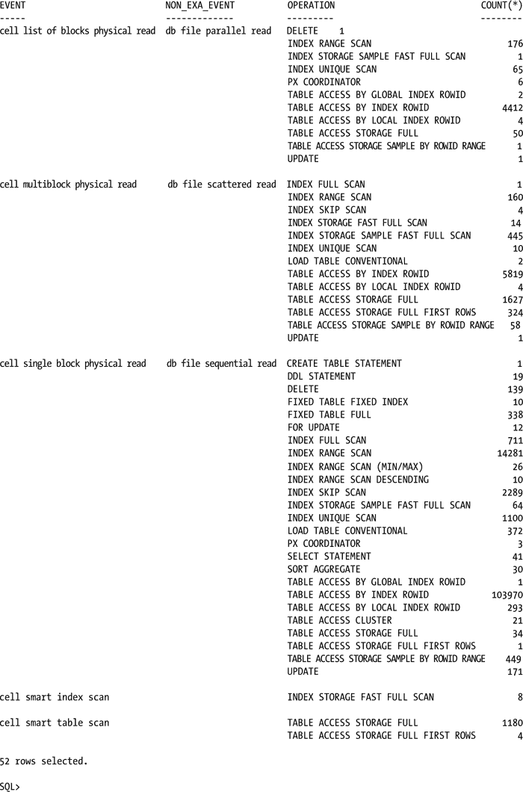
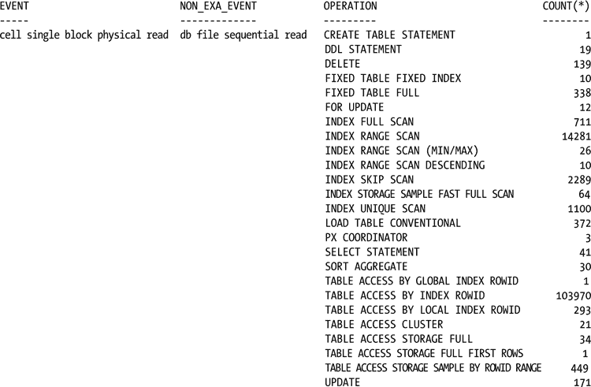
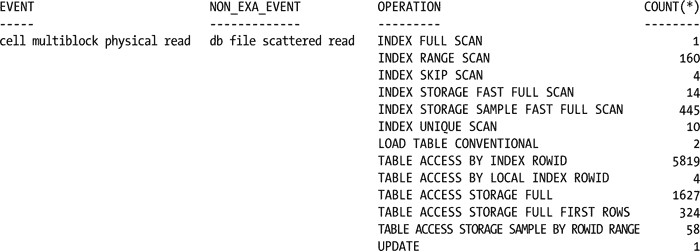
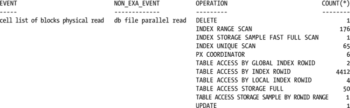

# 第 7 章


## Exadata 单元等待事件

Oracle 等待接口首次在 Oracle 8.1.x 版本中扩展，以提供了解 Oracle 性能的窗口。在后续版本中，此接口不断改进和扩展，使 Oracle 成为一个监控非常完善的数据库。通过跟踪 Oracle 在何处花费时间以及每个事件消耗多少时间，等待接口是数据库管理员（`DBA`）诊断性能问题的宝贵工具。对于 `Exadata`，此等待接口已进一步扩展，包括了支持此系统特有操作的 `Exadata` 特定等待事件。本章将介绍这些事件以及它们监视的实际操作。我们还将介绍适用于 `Exadata` 操作的现有非 `Exadata` 等待事件。

什么是*等待事件*？它是数据库正在等待的事件，例如磁盘读取，该事件被计时并赋予一个名称。在 11.2.0.3 版本中，`V$EVENT_NAME` 视图中列出了 1150 个命名的等待事件，其中 23 个引用了 `Exadata` 特定的操作。其中，17 个特定于存储单元。这些就是我们将在本章中介绍的事件。

### 独家可用

因为 `Exadata` 使用的是与非 `Exadata` 系统上相同的 Oracle 软件，所以无论你是否使用 `Exadata`，等待事件的列表都是相同的。区别在于其中一些事件只会在 `Exadata` 系统上填充，这是它们独家可用的唯一原因。

### 单元事件

显然，单元事件是不会在非 `Exadata` 系统或未使用 `Exadata` 存储的系统上填充的事件。在 `V$EVENT_NAME` 中有 17 个与单元相关的事件。这些事件列于 表 7-1。

**表 7-1. 单元等待事件及其类别**

| 等待事件 | 类别 |
| --- | --- |
| Cell worker idle | Idle |
| Cell manager cancel work request | Other |
| Cell smart flash unkeep | Other |
| Cell worker online completion | Other |
| Cell worker retry | Other |
| Cell manager closing cell | System I/O |
| Cell manager discovering disks | System I/O |
| Cell manager opening cell | System I/O |
| Cell smart incremental backup | System I/O |
| Cell smart restore from backup | System I/O |
| Cell list of blocks physical read | User I/O |
| Cell multiblock physical read | User I/O |
| Cell single block physical read | User I/O |
| Cell smart file creation | User I/O |
| Cell smart index scan | User I/O |
| Cell smart table scan | User I/O |
| Cell statistics gather | User I/O |

这些事件将在本章后面的章节中详细讨论。

## 触发事件


观察哪些操作会触发不同的单元等待事件是很有趣的。这些信息可以从 `DBA_HIST_ACTIVE_SESS_HISTORY` 视图以及 `V$SYSTEM_EVENT` 中获取。很可能并非表 7-1 中列出的每个事件都会在 `DBA_HIST_ACTIVE_SESS_HISTORY` 中被报告；然而，一个事件可能由多个计划操作触发。我们用来生成事件及相关操作列表的查询如下：

```
SQL> select event , non_exa_event, operation ,count(*)
  2  from
  3  (select event,
  4          decode(event, 'cell smart table scan','',
  5  'cell smart index scan','',
  6  'cell statistics gather','',
  7  'cell smart incremental backup','',
  8  'cell smart file creation','',
  9  'cell smart restore from backup','',
 10  'cell single block physical read','db file sequential read',
 11  'cell multiblock physical read','db file scattered read',
 12  'cell list of blocks physical read','db file parallel read',
 13  'cell manager opening cell','',
 14  'cell manager closing cell','',
 15  'cell manager discovering disks','',
 16  'cell worker idle','',
 17  'cell smart flash unkeep','',
 18  'cell worker online completion','',
 19  'cell worker retry','',
 20  'cell manager cancel work request','') non_Exa_event,
 21          sql_plan_operation||' '||sql_plan_options operation
 22  from dba_hist_active_sess_history
 23  where event like 'cell%')
 24  where operation <> ' '
 25  group by event, non_exa_event, operation
 26  order by 1
 27  /
```



该列表还包含等效的非 Exadata 事件（如果存在）。在接下来的章节中，将讨论这些事件、它们等效的非 Exadata 事件、描述以及它们提供的各种参数。

## 用户 I/O 事件

每个事件都与一个等待类相关联；单元事件有四个不同的等待类。单元事件中最主要的等待类是用户 I/O 类，十七个事件中有七个属于该类。我们将在本节中查看该类中的每个事件，并了解它报告了什么。

## 单元智能表扫描

`cell smart table scan` 事件记录因全表扫描卸载到存储单元而产生的等待时间。因为它可用于确定某个语句是否利用了智能扫描，并因此受益于卸载，所以它可能是 Exadata 系统中最重要的等待事件。请记住，卸载只发生在直接路径读取期间，因此该事件通常会取代 `direct path read` 事件。这并不是说你在 Exadata 系统上看不到 `direct path read` 事件，但更有可能看到时间被记录在 `cell smart table scan` 事件上。由于这是直接路径读取，它直接将数据返回给请求它的用户进程的程序全局区 (PGA)，这包括并行从属进程。

与非 Exadata 系统相比，InfiniBand 网络的使用改变了直接路径读取的实际机制。对存储单元的每个直接路径读取请求还包含对选择列表、连接谓词（如果存在）和查询谓词的引用。这允许存储服务器在“移交”结果给数据库服务器之前过滤数据并执行列投影。智能扫描处理的每个数据块都应用了这些优化；请求它的数据库服务器进程处理这些数据。数据还可以访问 ASM 区图，因此它们可以从每个存储单元请求必要的分配单元 (AU)。然后存储单元按请求顺序读取这些分配单元，并对每个 AU 应用智能扫描优化，返回满足所提供过滤条件的行的投影列。正如预期的那样，当执行大型扫描时，该事件会反复出现。

10046 跟踪是查看此事件被记录的一个很好来源。我们提供了一个大型表并行扫描的一小部分，如下所示：

```
WAIT #46969064935512: nam='cell smart table scan' ela= 794053 cellhash#=88802347 p2=0 p3=0 obj#=133235 tim=1371608209311673
WAIT #46969064935512: nam='cell smart table scan' ela= 151 cellhash#=88802347 p2=0 p3=0 obj#=133235 tim=1371608209317400
WAIT #46969064935512: nam='PX Deq: Execution Msg' ela= 80 sleeptime/senderid=268566527 passes=1 p3=7325501352 obj#=133235 tim=1371608209321134
WAIT #46969064935512: nam='cell smart table scan' ela= 116 cellhash#=88802347 p2=0 p3=0 obj#=133235 tim=1371608209321618
WAIT #46969064935512: nam='cell smart table scan' ela= 39049 cellhash#=88802347 p2=0 p3=0 obj#=133235 tim=1371608209360713
WAIT #46969064935512: nam='PX Deq: Execution Msg' ela= 138 sleeptime/senderid=268566527 passes=1 p3=7325501352 obj#=133235 tim=1371608209361123
WAIT #46969064935512: nam='cell smart table scan' ela= 126 cellhash#=398250101 p2=0 p3=0 obj#=133235 tim=1371608209361740
WAIT #46969064935512: nam='cell smart table scan' ela= 39318 cellhash#=398250101 p2=0 p3=0 obj#=133235 tim=1371608209401129
WAIT #46969064935512: nam='PX Deq: Execution Msg' ela= 84 sleeptime/senderid=268566527 passes=1 p3=7325501352 obj#=133235 tim=1371608209401312
WAIT #46969064935512: nam='cell smart table scan' ela= 100 cellhash#=398250101 p2=0 p3=0 obj#=133235 tim=1371608209401875
WAIT #46969064935512: nam='cell smart table scan' ela= 44604 cellhash#=398250101 p2=0 p3=0 obj#=133235 tim=1371608209446549
WAIT #46969064935512: nam='PX Deq: Execution Msg' ela= 76 sleeptime/senderid=268566527 passes=1 p3=7325501352 obj#=133235 tim=1371608209446719
WAIT #46969064935512: nam='cell smart table scan' ela= 120 cellhash#=2520626383 p2=0 p3=0 obj#=133235 tim=1371608209447214
WAIT #46969064935512: nam='cell smart table scan' ela= 223022 cellhash#=2520626383 p2=0 p3=0 obj#=133235 tim=1371608209670288
WAIT #46969064935512: nam='PX Deq: Execution Msg' ela= 82 sleeptime/senderid=268566527 passes=1 p3=7325501352 obj#=133235 tim=1371608209670463
WAIT #46969064935512: nam='cell smart table scan' ela= 103 cellhash#=2520626383 p2=0 p3=0 obj#=133235 tim=1371608209670967
WAIT #46969064935512: nam='cell smart table scan' ela= 5520 cellhash#=2520626383 p2=0 p3=0 obj#=133235 tim=1371608209676590
WAIT #46969064935512: nam='PX Deq: Execution Msg' ela= 90 sleeptime/senderid=268566527 passes=1 p3=7325501352 obj#=133235 tim=1371608209676760
WAIT #46969064935512: nam='cell smart table scan' ela= 161 cellhash#=398250101 p2=0 p3=0 obj#=133235 tim=1371608209677348
WAIT #46969064935512: nam='cell smart table scan' ela= 43339 cellhash#=398250101 p2=0 p3=0 obj#=133235 tim=1371608209720745
WAIT #46969064935512: nam='PX Deq: Execution Msg' ela= 113 sleeptime/senderid=268566527 passes=1 p3=7325501352 obj#=133235 tim=1371608209720974
WAIT #46969064935512: nam='cell smart table scan' ela= 132 cellhash#=2520626383 p2=0 p3=0 obj#=133235 tim=1371608209721594
WAIT #46969064935512: nam='cell smart table scan' ela= 9462 cellhash#=2520626383 p2=0 p3=0 obj#=133235 tim=1371608209731125
WAIT #46969064935512: nam='PX Deq: Execution Msg' ela= 102 sleeptime/senderid=268566527 passes=1 p3=7325501352 obj#=133235 tim=1371608209731327
WAIT #46969064935512: nam='cell smart table scan' ela= 84 cellhash#=2520626383 p2=0 p3=0 obj#=133235 tim=1371608209732040
WAIT #46969064935512: nam='cell smart table scan' ela= 19 cellhash#=88802347 p2=0 p3=0 obj#=133235 tim=1371608209732081
```

请注意，此部分还包括许多 `'PX Deq: Execution Msg'` 事件，这证明了查询执行期间使用了并行处理。

该事件提供的参数仅包括对象 id (`obj#`) 和单元哈希号 (`cellhash#`)。参数 `P2` 和 `P3` 未使用。相比之下，直接路径读取事件提供了 `object_id`、文件号、文件中的偏移量（第一个 dba）以及读取的连续块数（块计数），如下所示：


### Cell Smart Index Scan

与 `cell smart table scan` 类似，`cell smart index scan` 记录了被下推到存储单元执行的快速全索引扫描的时间，唯一的真正区别在于被扫描的对象类型。

在其中一个最活跃的系统中，我们在 `DBA_HIST_ACTIVE_SESS_HISTORY` 中总共记录了 1184 次 `cell smart table scan`，而在同一时间段内，只报告了 8 次 `cell smart index scan`。这可能是由于 Oracle 11.2 在串行表扫描时倾向于执行直接路径读取。有一个隐藏参数 `_serial_direct_read`，通常设置为 `FALSE`，可以设置为 `TRUE` 以促进这种活动。设置此事件可能会在重度使用的生产系统中引发性能问题，因此最好在尽可能接近生产环境的非生产系统上进行测试。请注意，该参数仅指定串行直接读，而不指定这些读操作所操作的对象，因此索引也可以利用这种串行读机制。由于索引往往比它们索引的表小，它们较小的尺寸很可能排除了使用 `cell smart index scan` 事件的可能性。此外，只有快速全索引扫描有资格进行 `cell smart index scan`；索引范围扫描和索引全扫描不符合条件。

与 `cell smart table scan` 事件类似，`cell smart index scan` 事件没有提供太多信息；在 10046 跟踪文件中只能找到单元哈希号（`cellhash#`）和对象 ID（`obj#`），参数 `P2` 和 `P3` 同样未被使用。

```
WAIT #46969064936345: nam='cell smart index scan' ela= 178 cellhash#=2520626383 p2=0 p3=0 obj#=448299 tim=1371608209741332
WAIT #46969064936345: nam='cell smart index scan' ela= 462 cellhash#=2520626383 p2=0 p3=0 obj#=448299 tim=1371608209752118
```

### Cell Single-Block Physical Read

此事件是 Exadata 系统上非 Exadata 系统中 `db file sequential read` 事件的等价物。这通常表示索引访问操作，包括索引块读取和通过索引查找提供的 `rowid` 进行的表块读取，但其他操作在访问单个块时也可以使用此事件。

产生 `cell single block physical read` 事件的操作可能有很多，如下列来自 `DBA_HIST_ACTIVE_SESS_HISTORY` 的输出所示：



上述列表中最常见的事件是索引访问，占所列条目中的 11 个。再加上这些事件的总发生次数，就更明显地表明，最有可能标记此事件时间的操作是索引访问。

此事件比迄今为止讨论的其他事件提供了更多信息，报告了单元哈希号（`cellhash#`）、磁盘哈希号（`diskhash#`）、操作期间传递的总字节数（`bytes`）和对象 ID（`obj#`）。通过此事件，您不仅知道访问了哪个对象，还知道从哪个磁盘、哪个单元读取以及读取了多少字节。以下是在 10046 跟踪文件上使用 `grep` 命令输出的一小部分，展示了这些报告的值：

```
WAIT #47185678513912: nam='cell single block physical read' ela= 13725 cellhash#=398250101 diskhash#=2110579711 bytes=8192 obj#=134196 tim=1364280947867845
WAIT #47185663242504: nam='cell single block physical read' ela= 562 cellhash#=398250101 diskhash#=736840779 bytes=8192 obj#=21 tim=1364280948818774
WAIT #47185660188840: nam='cell single block physical read' ela= 516 cellhash#=398250101 diskhash#=592573387 bytes=8192 obj#=69 tim=1364280948820595
WAIT #47185681467920: nam='cell single block physical read' ela= 518 cellhash#=398250101 diskhash#=323658058 bytes=8192 obj#=62 tim=1364280948828550
WAIT #47185664116080: nam='cell single block physical read' ela= 593 cellhash#=2520626383 diskhash#=1392289187 bytes=8192 obj#=61 tim=1364280948829493
WAIT #47185671820512: nam='cell single block physical read' ela= 520 cellhash#=2520626383 diskhash#=1878859599 bytes=8192 obj#=54 tim=1364280948832544
WAIT #47185672026856: nam='cell single block physical read' ela= 536 cellhash#=88802347 diskhash#=1487722174 bytes=8192 obj#=37 tim=1364280948855726
WAIT #47185676137528: nam='cell single block physical read' ela= 505 cellhash#=398250101 diskhash#=949169843 bytes=8192 obj#=75 tim=1364280948856712
WAIT #47185663821624: nam='cell single block physical read' ela= 504 cellhash#=2520626383 diskhash#=372821781 bytes=8192 obj#=106 tim=1364280948857502
WAIT #47185663821624: nam='cell single block physical read' ela= 510 cellhash#=88802347 diskhash#=2410699693 bytes=8192 obj#=104 tim=1364280948858089
WAIT #47185671360600: nam='cell single block physical read' ela= 484 cellhash#=398250101 diskhash#=4004546112 bytes=8192 obj#=108 tim=1364280948859019
WAIT #47185671360600: nam='cell single block physical read' ela= 508 cellhash#=2520626383 diskhash#=3373534499 bytes=8192 obj#=108 tim=1364280948859781
WAIT #47185663242504: nam='cell single block physical read' ela= 499 cellhash#=398250101 diskhash#=736840779 bytes=8192 obj#=21 tim=1364280948860521
WAIT #47185671976024: nam='cell single block physical read' ela= 519 cellhash#=88802347 diskhash#=2410699693 bytes=8192 obj#=4 tim=1364280948873162
WAIT #47185678747440: nam='cell single block physical read' ela= 505 cellhash#=88802347 diskhash#=3487034449 bytes=8192 obj#=427 tim=1364280948876978
WAIT #47185678747440: nam='cell single block physical read' ela= 504 cellhash#=88802347 diskhash#=351342063 bytes=8192 obj#=425 tim=1364280948877576
```

### Cell Multiblock Physical Read

此事件在 Exadata 系统上被重命名，因为非 Exadata 事件被命名为 `db file scattered read`，这个名称有描述性但不完全准确，因为读取的块可能不是分散的而是连续的。Oracle 11.2 在非 Exadata 系统上仍然使用 `db file scattered read` 事件报告多块读取，无论它们读取的是连续块还是分散块。对于 Exadata 系统，此事件记录连续多块读取的时间。

触发此等待事件的操作的部分列表如下：



以下是对另一个 10046 跟踪文件进行 `grep` 处理的输出，展示了此事件的报告方式：


```
WAIT #47901352100880: nam='cell multiblock physical read' ela= 640 cellhash#=398250101 diskhash#=4004546112 bytes=65536 obj#=631 tim=1371659723908619
WAIT #47901352100880: nam='cell multiblock physical read' ela= 844 cellhash#=398250101 diskhash#=4004546112 bytes=65536 obj#=631 tim=1371659723909603
WAIT #47901352100880: nam='cell multiblock physical read' ela= 632 cellhash#=398250101 diskhash#=4004546112 bytes=65536 obj#=631 tim=1371659723910387
WAIT #47901352100880: nam='cell multiblock physical read' ela= 620 cellhash#=398250101 diskhash#=4004546112 bytes=65536 obj#=631 tim=1371659723911140
WAIT #47901352100880: nam='cell multiblock physical read' ela= 639 cellhash#=398250101 diskhash#=4004546112 bytes=65536 obj#=631 tim=1371659723911925
WAIT #47901352100880: nam='cell multiblock physical read' ela= 653 cellhash#=398250101 diskhash#=2110579711 bytes=65536 obj#=631 tim=1371659723912743
WAIT #47901352100880: nam='cell multiblock physical read' ela= 960 cellhash#=398250101 diskhash#=2110579711 bytes=65536 obj#=631 tim=1371659723913842
WAIT #47901352100880: nam='cell multiblock physical read' ela= 841 cellhash#=398250101 diskhash#=2110579711 bytes=65536 obj#=631 tim=1371659723914879
WAIT #47901352100880: nam='cell multiblock physical read' ela= 630 cellhash#=398250101 diskhash#=2110579711 bytes=65536 obj#=631 tim=1371659723915692
WAIT #47901352100880: nam='cell multiblock physical read' ela= 726 cellhash#=398250101 diskhash#=2110579711 bytes=65536 obj#=631 tim=1371659723916608
WAIT #47901352100880: nam='cell multiblock physical read' ela= 820 cellhash#=398250101 diskhash#=2110579711 bytes=65536 obj#=631 tim=1371659723917621
WAIT #47901352100880: nam='cell multiblock physical read' ela= 687 cellhash#=398250101 diskhash#=2110579711 bytes=65536 obj#=631 tim=1371659723918461
WAIT #47901352100880: nam='cell multiblock physical read' ela= 757 cellhash#=398250101 diskhash#=2110579711 bytes=65536 obj#=631 tim=1371659723919396
WAIT #47901352100880: nam='cell multiblock physical read' ela= 13061 cellhash#=398250101 diskhash#=323658058 bytes=1048576 obj#=631 tim=1371659723933281
WAIT #47901352100880: nam='cell multiblock physical read' ela= 11539 cellhash#=2520626383 diskhash#=1346328363 bytes=1048576 obj#=631 tim=1371659723946098
WAIT #47901352100880: nam='cell multiblock physical read' ela= 14240 cellhash#=88802347 diskhash#=493540951 bytes=1048576 obj#=631 tim=1371659723964141
WAIT #47901352100880: nam='cell multiblock physical read' ela= 7785 cellhash#=88802347 diskhash#=4062498200 bytes=163840 obj#=631 tim=1371659723973491
WAIT #47901352100880: nam='cell multiblock physical read' ela= 597 cellhash#=398250101 diskhash#=949169843 bytes=32768 obj#=997 tim=1371659723976483
```

此事件报告的信息与单元单块物理读事件相同，即单元哈希值（`cellhash#`）、磁盘哈希值（`diskhash#`）、总传输字节数（`bytes`）以及对象 ID（`obj#`）。

## 单元物理读取的块列表

该事件原名为`db file parallel read`，在 Exadata 系统上被重命名，以更准确地反映触发它的操作。然而，在非 Exadata 系统上，记录时间的仍然是原名事件。有趣的是，此事件与并行数据操作语言（DML）操作*无关*。

此事件记录当块*不*连续时的多块读取时间。这使得它更容易与连续的多块读取区分开来。同样，许多执行计划操作都可以触发此事件，如下列表所示：



在我们一个数据库上，按频率排序，最“受欢迎”的四种执行计划操作是`TABLE ACCESS BY INDEX ROWID`（通过索引 ROWID 访问表）、`INDEX RANGE SCAN`（索引范围扫描）、`INDEX UNIQUE SCAN`（索引唯一扫描）和`TABLE ACCESS STORAGE FULL`（全表存储访问）。

再次查看 10046 跟踪文件，可以从以下`grep`命令的输出中看到此事件是如何被报告的：

```
WAIT #47901352100880: nam='cell list of blocks physical read' ela= 537 cellhash#=398250101 diskhash#=2110579711 blocks=3 obj#=997 tim=1371659723985684
WAIT #47901352100880: nam='cell list of blocks physical read' ela= 574 cellhash#=398250101 diskhash#=2110579711 blocks=4 obj#=997 tim=1371659723988550
WAIT #47901352100880: nam='cell list of blocks physical read' ela= 1723 cellhash#=398250101 diskhash#=323658058 blocks=46 obj#=997 tim=1371659723998837
WAIT #47901352100880: nam='cell list of blocks physical read' ela= 1208 cellhash#=2520626383 diskhash#=1346328363 blocks=36 obj#=997 tim=1371659724003584
WAIT #47901352100880: nam='cell list of blocks physical read' ela= 1567 cellhash#=2520626383 diskhash#=4245410826 blocks=47 obj#=997 tim=1371659724010794
WAIT #47901352100880: nam='cell list of blocks physical read' ela= 632 cellhash#=398250101 diskhash#=4080537574 blocks=4 obj#=997 tim=1371659724013129
WAIT #47901344458904: nam='cell list of blocks physical read' ela= 33814 cellhash#=398250101 diskhash#=949169843 blocks=27 obj#=447547 tim=1371659793327488
WAIT #47901354882040: nam='cell list of blocks physical read' ela= 702 cellhash#=398250101 diskhash#=949169843 blocks=7 obj#=4 tim=1371659807119269
WAIT #47901354882040: nam='cell list of blocks physical read' ela= 715 cellhash#=398250101 diskhash#=323658058 blocks=8 obj#=4 tim=1371659807144991
WAIT #47901354882040: nam='cell list of blocks physical read' ela= 40454 cellhash#=398250101 diskhash#=4080537574 blocks=61 obj#=4 tim=1371659807259159
WAIT #47901354882040: nam='cell list of blocks physical read' ela= 1135 cellhash#=398250101 diskhash#=4080537574 blocks=17 obj#=4 tim=1371659807265443
WAIT #47901354882040: nam='cell list of blocks physical read' ela= 805 cellhash#=398250101 diskhash#=4080537574 blocks=12 obj#=4 tim=1371659807266892
WAIT #47901354882040: nam='cell list of blocks physical read' ela= 198850 cellhash#=88802347 diskhash#=2443481431 blocks=57 obj#=4 tim=1371659807516838
WAIT #47901354882040: nam='cell list of blocks physical read' ela= 1987 cellhash#=88802347 diskhash#=987865679 blocks=31 obj#=4 tim=1371659807569906
WAIT #47901354882040: nam='cell list of blocks physical read' ela= 1733 cellhash#=88802347 diskhash#=987865679 blocks=37 obj#=4 tim=1371659807574314
WAIT #47901354882040: nam='cell list of blocks physical read' ela= 2216 cellhash#=88802347 diskhash#=4062498200 blocks=69 obj#=4 tim=1371659807579817
WAIT #47901354882040: nam='cell list of blocks physical read' ela= 34220 cellhash#=88802347 diskhash#=4062498200 blocks=54 obj#=4 tim=1371659807615518
WAIT #47901354882040: nam='cell list of blocks physical read' ela= 36753 cellhash#=398250101 diskhash#=949169843 blocks=126 obj#=4 tim=1371659807657273
WAIT #47901354882040: nam='cell list of blocks physical read' ela= 2424 cellhash#=398250101 diskhash#=4004546112 blocks=89 obj#=4 tim=1371659807700181
WAIT #47901354882040: nam='cell list of blocks physical read' ela= 2656 cellhash#=88802347 diskhash#=987865679 blocks=95 obj#=4 tim=1371659807707733
WAIT #47901354882040: nam='cell list of blocks physical read' ela= 1534 cellhash#=2520626383 diskhash#=3381263565 blocks=15 obj#=4 tim=1371659807714012
WAIT #47901354882040: nam='cell list of blocks physical read' ela= 1958 cellhash#=2520626383 diskhash#=3381263565 blocks=51 obj#=4 tim=1371659807719799
```

与其他单元块读取事件一样，此事件也报告单元哈希值（`cellhash#`）、磁盘哈希值（`diskhash#`）以及被扫描对象的对象 ID（`obj#`）。其不同之处在于报告了读取的非连续块的总数（`blocks`）。

### 单元智能文件创建


### 等待事件：数据块格式化与 Exadata 存储单元操作

当创建或扩展数据文件时，必须格式化数据块。在非 Exadata 系统上，此任务由数据库服务器执行，`data file init write`事件会记录此操作发生时的时间。Exadata 的处理方式不同，它让存储单元执行此任务，因此，`cell smart file creation`等待事件记录了格式化数据块时所花费的时间。请注意，文件不必添加到表空间中才会发生此等待；该事件实际记录的是数据块格式化操作的时间。

将此等待事件归类在**用户 I/O**类别中可能显得奇怪，但很多时候，数据块格式化是由 DML 操作触发的，例如自动扩展数据文件或删除数据。其他可以触发此事件的操作包括更新、非唯一索引创建、直接路径加载以及使用`/*+ append */`提示的插入。

更新和删除操作如何触发`cell smart file creation`等待事件？如前所述，该等待事件实际记录的是数据块格式化操作的时间，当数据块不再包含数据时，删除操作可能导致这些数据块被重新格式化以供重用。更新操作也可能触发此事件，因为如果发生行链接或行迁移，更新可能会触发数据文件扩展或使用新的数据块。

当此事件被触发时，只返回一个参数，即单元哈希值（`cellhash#`）；所有其他可能传递的参数都未被使用。

## 等待事件：Cell Statistics Gather

我们认为这个等待事件被错误地归类为**用户 I/O**，因为它不记录磁盘 I/O 操作的时间；相反，它记录的是从`V$CELL_THREAD_HISTORY`、`V$CELL_REQUEST_TOTALS`以及其他引用单元活动的 X$表和 V$视图，以及针对`AUD$`表的递归查询中读取数据所花费的时间。

生成 10046 跟踪文件并使用`grep`查找此事件会产生以下简化的输出：

```
WAIT #47971177959976: nam='cell statistics gather' ela= 235 cellhash#=0 p2=0 p3=0 obj#=384 tim=1372568877816026
WAIT #47971177959976: nam='cell statistics gather' ela= 253 cellhash#=0 p2=0 p3=0 obj#=384 tim=1372568877836094
WAIT #47971177959976: nam='cell statistics gather' ela= 256 cellhash#=0 p2=0 p3=0 obj#=384 tim=1372568877855930
WAIT #47971177959976: nam='cell statistics gather' ela= 280 cellhash#=0 p2=0 p3=0 obj#=384 tim=1372568877882687
WAIT #47971177959976: nam='cell statistics gather' ela= 276 cellhash#=0 p2=0 p3=0 obj#=384 tim=1372568877902691
WAIT #47971177959976: nam='cell statistics gather' ela= 256 cellhash#=0 p2=0 p3=0 obj#=384 tim=1372568877921221
WAIT #47971177959976: nam='cell statistics gather' ela= 318 cellhash#=0 p2=0 p3=0 obj#=384 tim=1372568877940424
```

这些等待是针对`AUD$`表的（在我们的数据库中，`object_id`和`data_object_id`为 384）。此跟踪文件中执行的查询并非针对`AUD$`，而是针对`V$CELL`和`V$CELL_THREAD_HISTORY`。由`tkprof`格式化输出的、针对`V$CELL_THREAD_HISTORY`查询生成的跟踪文件内容如下：

```
SQL ID: fqv4mmcqsysbp Plan Hash: 3553215696

select *
From
 v$cell_thread_history

call     count       cpu    elapsed       disk      query    current        rows
------- ------  -------- ---------- ---------- ---------- ----------  ----------
Parse        1      0.00       0.00          0          4          0           0
Execute      1      0.00       0.00          0          0          0           0
Fetch     2775      0.13       0.15          0          0          0       41609
------- ------  -------- ---------- ---------- ---------- ----------  ----------
total     2777      0.13       0.15          0          4          0       41609

Misses in library cache during parse: 1
Optimizer mode: ALL_ROWS
Parsing user id: 401
Number of plan statistics captured: 1

Rows (1st) Rows (avg) Rows (max)  Row Source Operation
---------- ---------- ----------  ---------------------------------------------------
     41609      41609      41609  FIXED TABLE FULL X$KCFISOSSN (cr=0 pr=0 pw=0 time=116083 us cost=0
                                  size=676 card=1)

Elapsed times include waiting on following events:
  Event waited on                             Times   Max. Wait  Total Waited
  ----------------------------------------   Waited  ----------  ------------
  SQL*Net message to client                    2775        0.00          0.00
  cell statistics gather                         66        0.00          0.02
  SQL*Net message from client                  2775        2.63         12.53
  row cache lock                                   9        0.00          0.00
  library cache lock                               2        0.00          0.00
  library cache pin                                2        0.00          0.00
********************************************************************************
```

## 系统 I/O 等待事件

在此等待类别中有五个特定于单元的事件，其中三个很少积累显著的时间。两个备份事件在备份和恢复操作期间确实会积累时间，它们之所以有趣，不仅在于哪些操作记录了时间，还在于你认为应该记录时间但实际上没有记录的操作。我们在表 7-2 中列出了非备份事件。

表 7-2。单元启动和关闭等待事件

| 事件 | 描述 |
| --- | --- |
| Cell manager closing cell | 此事件是单元关闭事件，记录单元关闭操作的时间。唯一传回的参数是单元哈希值（`cellhash#`）。 |
| Cell manager opening cell | 此事件是单元启动事件。唯一传回的参数同样是单元哈希值（`cellhash#`）。 |
| Cell manager discovering disks | 这是另一个单元启动事件，传回单元哈希值（`cellhash#`）。与其他两个事件一样，不提供其他参数。 |

## 等待事件：Cell Smart Incremental Backup

Exadata 通过允许将 RMAN（恢复管理器）增量备份卸载到存储层，优化了此类备份。因此，此事件会为增量级别 1 备份积累等待时间，其中处理已卸载到存储层。在 Exadata 上，更改在块级别进行跟踪，从而可以更快地备份自上次增量级别 0 备份以来更改的块。存储层特别适合此类处理，因此需要这个新的等待事件。

并非每个增量备份都会触发此等待事件。增量级别 0 备份不会触发，因为它们本质上是完整备份，不依赖于块更改跟踪。它们是任何使用增量备份的恢复操作的起点，这就是为什么在执行恢复时，如果没有`RECOVER ... UNTIL ...`子句或`SET UNTIL TIME`语句，最近的增量级别 0 备份会取代任何先前的增量级别 0 备份。

此事件仅填充单元哈希值（`cellhash#`）。通常，Oracle 会重置或清除当前等待事件未传递的任何参数，但有时，先前等待事件填充的值会残留下来。`obj#`参数就是其中一个可能在记录此事件的 10046 跟踪文件中被填充的参数。在这种情况下，非负的`obj#`是没有意义的。Oracle 会用-1 填充`obj#`，以显示它是从先前的事件中清除的。

## 等待事件：Cell Smart Restore from Backup

此事件记录使用 RMAN 进行还原所花费的等待时间。就像前一个事件一样，Exadata 将此处理卸载到存储单元，这些单元再次因其直接访问存储而特别适合此类操作。

此事件实际上与`cell smart file creation`事件相关；两个事件都记录格式化空数据块和与文件创建相关的初始化操作的时间。


## 空闲类/其他类

在一个正常运行的 Exadata 系统中，这两类中的五个等待事件很少被使用。我们在所管理的系统上未曾发现过它们，您很可能也不会遇到。但有一个例外，即 `cell flash unkeep` 事件，该事件将在其专属章节中进行介绍。其余的这些事件，对于 `V$SESSION_WAIT` 视图中提供的 P1、P2 和 P3 参数值而言，都缺乏信息量。表 7-3 列出了您不太可能看到的事件及其提供给 Oracle 的参数的基本描述。

表 7-3. 极少报告的单元等待事件

| 事件 | 描述 |
| --- | --- |
| 单元管理器取消工作请求 | 此事件提供的信息很稀疏，因为可提供的参数在 `V$SESSION_WAIT` 中均未填充。我们尚未在 `10046` 跟踪中看到此事件。 |
| 单元工作进程联机完成 | 这似乎是一个单元启动事件。提供的唯一参数是单元哈希（在 `10046` 跟踪中为 `cellhash#`，在 `V$SESSION_WAIT` 视图中为 P1）。这是另一个我们未见报告的等待事件。 |
| 单元工作进程重试 | 另一个仅填充单元哈希 (`cellhash#`) 而无其他信息的等待事件。 |
| 单元工作进程空闲 | 此事件不提供任何参数，并且我们在所管理的任何系统上均未见其报告。 |

## 单元智能闪存解保持

此事件记录 Oracle 将数据块从智能闪存缓存中刷出时的等待时间，但它不会为使用默认 FIFO 方式的智能闪存缓存的对象触发。此事件跟踪那些旨在保留在智能闪存缓存中的对象（使用 `STORAGE(FLASH_CACHE KEEP)` 参数）的等待时间。会触发此事件的操作包括表的 `DROP` 和 `TRUNCATE`。与此等待相关联的另一个事件是 `enq: RO fast object reuse`，因为触发此事件的操作也会触发缓冲区缓存清理。截断或删除表还需要移除该对象的任何缓存数据，并且在 Exadata 上，有两个独立的缓存需要维护。

此事件提供的唯一参数是单元哈希 (`cellhash#`)，用于标识是哪个单元为截断或删除操作提供了服务。在 `10046` 跟踪的 `WAIT` 事件或 `V$SESSION_WAIT` 视图中，没有其他参数被填充。

## 需要了解的事项

等待接口在过去几个 Oracle 版本中已经得到了扩展，在 Exadata 上它又经历了一次扩展：增加了特定于单元的事件，这些事件在某些情况下取代了非 Exadata 系统上已有的事件。同时还添加了新的事件来监控 Exadata 特有的新机制。

`cell smart table scan` 事件记录了智能扫描所花费的时间，使得该事件对于使用 Exadata 或 Exadata 存储的系统至关重要。此事件通常取代了 `direct path read` 事件，尽管当查询不符合智能扫描条件时，您仍然可以在 Exadata 系统上找到直接路径读等待。

`cell smart index scan` 事件报告索引快速全扫描的等待时间；没有其他索引访问路径会触发此等待。

`cell single block physical read` 事件等同于非 Exadata 系统上的 `db file sequential read` 事件。它最常与索引访问操作和通过索引行 ID 访问表的操作相关联，但任何单块访问操作都可能触发此等待。我们认为，它的命名比其非 Exadata 对应项更准确，因为读取的数据块是单块，而不一定是顺序的。

`cell multiblock physical read` 事件收集顺序多块读的时间，是 `db file scattered read` 事件的替代者。同样，我们认为 Exadata 事件的命名更好，因为它表明读取的是顺序排列的数据块集合。`db file scattered read` 事件在非 Exadata 系统中记录顺序和非顺序读的时间，所以其名称有些令人困惑。

Exadata 提供了一个新事件 `cell list of blocks read`，用于记录非顺序或分散的数据块读取的时间。此事件也可以替代 `db file scattered read` 事件，因为如前所述，旧事件记录所有多块读的时间，无论是否顺序。

在 Exadata 中，数据块准备工作被下推到存储单元执行，因此增加了一个名为 `cell smart file creation` 的新事件。这个名称有点用词不当，因为它不一定是指文件创建（尽管那是可以触发此等待的操作之一），而通常是收集数据块格式化/重新格式化以准备新数据所花费的时间。触发此事件的操作包括删除、更新、数据库文件创建和文件自动扩展。

`cell statistics gather` 事件被我们归类错误，因为它与磁盘 I/O 操作无关。它记录访问各种 `V$` 和 `X$` 表/视图的时间，更准确地说，可以被视为系统 I/O 或其他等待类事件。

RMAN 也有特定于 Exadata 的等待，因为某些 RMAN 操作被下推到存储单元执行。`cell smart incremental backup` 事件记录了增量级别 1 备份所经历的等待时间。因为增量级别 0 备份实际上是完整备份，也是下一系列级别 1 增量备份的起点，所以它不会触发此事件。

`cell smart restore from backup` 事件收集 RMAN 在执行数据库恢复时经历的等待时间，因为与此等待相关的操作被下推到存储单元执行。由于存储单元是 Exadata 系统中唯一能直接访问存储的服务器，下推这两个 RMAN 操作是合理的。

Exadata 作为性能增强功能之一，拥有智能闪存缓存。当使用 `STORAGE(FLASH_CACHE KEEP)` 指令创建表/索引时，截断或删除这些对象会触发 `cell smart flash unkeep` 事件。这些操作也会触发缓冲区缓存清理，因此报告此事件的跟踪文件通常也会报告 `enq: RO fast object reuse` 等待。

