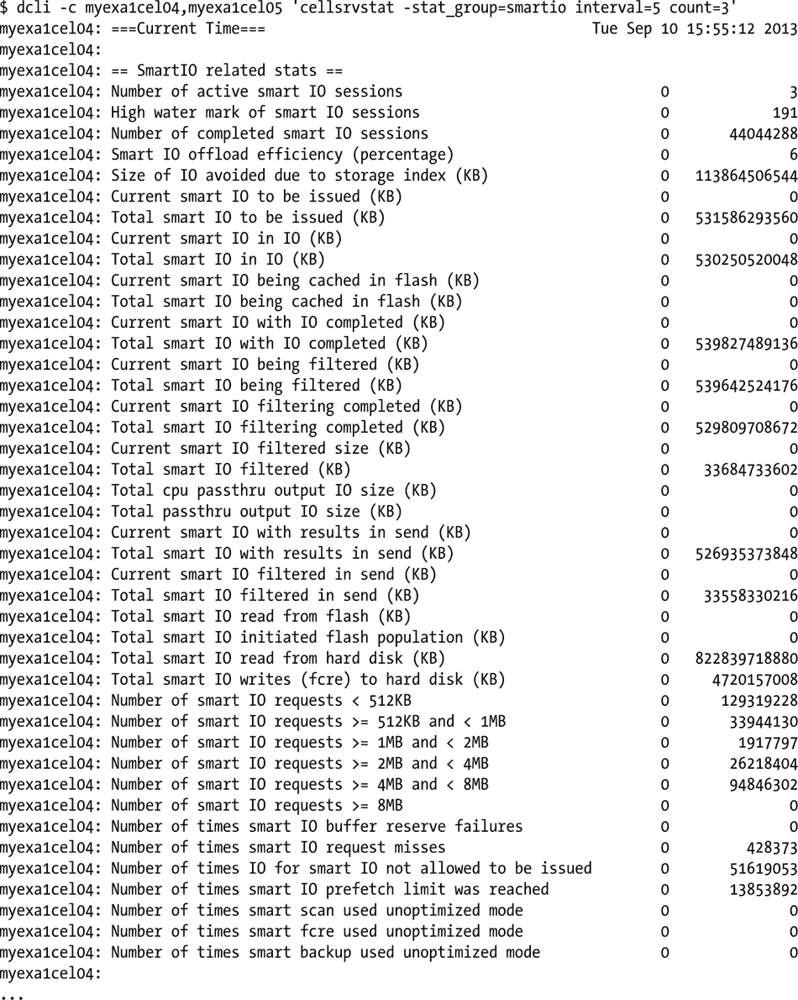
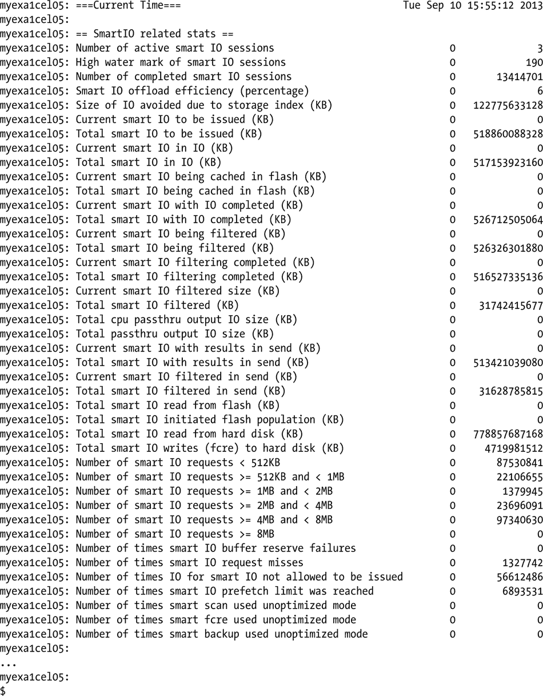

# 第九章


## 存储单元监控

这里有三个这样的计数器，其中 `______` 可以是 `user`、`CELLSRV` 或时区。这些计数器指示了启动智能扫描但转换为常规块 I/O 模式的次数。当这种情况发生时，块会传递到数据库服务器，并绕过单元处理。智能扫描实际上是在读取块，但没有在本地单元上进行任何处理，而是将它们发送到数据库服务器进行处理。除非存储单元上存在内存问题，否则您不应该看到这些计数器增加，因为直通处理不应该发生。如果这些计数器开始递增，这是一个很好的迹象，表明存在需要调查的存储单元级别的问题。

## 单元指标

**直接发送到数据库节点以平衡 CPU 使用率的 cell 物理 IO 字节数**

该计数器记录了 cell CPU 使用率过高导致 Oracle 选择回退到直通模式的次数，这使得数据库服务器执行常规块 I/O 以减轻存储单元的 CPU 负载。通常，您不应该看到此计数器增加。同样，如果它开始递增，则表明存在需要诊断的存储单元级别的问题。在旧版本的 Exadata 中，此计数器的名称为 `cell physical IO bytes pushed back due to excessive CPU on cell`。

**由单元处理的链接行**

链接行在任何数据库中都可能是个问题，在 Exadata 中尤其如此，因为磁盘组跨所有可用磁盘条带化，并由每个可用存储单元访问。在未使用 ASM 的非 Exadata 数据库中，链接或延续行将位于另一个块中，但很可能与链头在同一个磁盘上。使用 ASM 和 Exadata 时，行的下一个片段可能位于另一个存储单元访问的另一个磁盘上。请记住，存储单元之间不通信，因此当 Oracle 遇到链接行时，智能扫描将在数据库层回退到常规块 I/O，以便处理该链接行。这对于链接行处理效率更高，但它确实会减慢智能扫描速度。链接行越多，智能扫描就越慢。如果智能扫描可以从行头片段获取所需的数据，那么智能扫描不会损失任何速度，并且处理将像往常一样流畅进行。如果 Oracle 需要访问该链接行的任何其他片段，则需要常规块 I/O，从而减慢智能扫描速度。

此统计信息 `chained rows processed by cell` 报告在存储单元内处理的链接行，即行片段（或至少是 Oracle 需要返回结果的那些片段）位于给定存储单元访问的存储范围内。这被称为块内链接，即行片段位于与行头相同的数据块中。这是行链接的一种特殊情况，适用于超过 255 列的行。下一个片段与行头在同一个块中，无需额外操作即可获取。

**由单元拒绝的链接行**

该计数器记录了链接行的下一个片段不在同一个块或单元中的情况，如前一节所述。此统计信息在特殊情况下递增，因为在我们管理的系统中，我们不经常看到它递增。当此计数器递增时，智能扫描会回退到常规块 I/O 来处理该行。

**由单元跳过的链接行**

这是当智能扫描必须恢复为常规块 I/O 时最常递增的统计信息。同样，当找到链接行且剩余片段驻跨整个存储条带（跨越多个存储单元）时，它会递增。目前尚不清楚在此类情况下前一个计数器或此计数器何时应递增。我们发现，当智能扫描回退到常规块 I/O 来处理链接行时，此计数器最常递增。

## SQL 语句性能

了解 SQL 语句在执行期间的时间花费非常重要。`V$SQL`、`V$SQL_MONITOR`、`V$SQL_PLAN_MONITOR` 和 `V$ACTIVE_SESSION_HISTORY` 是用于分析 SQL 语句性能的优秀视图。以下是使用 `V$SQL` 的示例，展示了查询如何受益于智能扫描优化：

```
SQL>select  sql_id,
  2  io_cell_offload_eligible_bytes qualifying,
  3  io_cell_offload_eligible_bytes - io_cell_offload_returned_bytes actual,
  4  round(((io_cell_offload_eligible_bytes - io_cell_offload_returned_bytes)/io_cell_offload_eligible_bytes)*100, 2) io_saved_pct,
  5  sql_text
  6  from v$sql
  7  where io_cell_offload_returned_bytes> 0
  8  and instr(sql_text, 'emp') > 0
  9  and parsing_schema_name = 'BING';

SQL_ID        QUALIFYING     ACTUAL IO_SAVED_PCT SQL_TEXT
------------- ---------- ---------- ------------ -------------------------------------
gfjb8dpxvpuv6  185081856   42510928        22.97 select * from emp where empid = 7934

SQL>
```

请注意 `V$SQL` 中使用的以下列：

*   `io_cell_offload_eligible_bytes`
*   `io_cell_offload_returned_bytes`

这两列告诉您有多少字节符合条件可以卸载，以及作为智能扫描卸载的结果实际返回了多少字节。提供的查询计算了节省的 I/O 字节占总符合条件字节的百分比，因此您可以看到智能扫描执行对所讨论查询的效率。

## 需知事项

本章的目的并非提供关于 Exadata 的详尽性能调优参考，而是概述可用的指标和计数器、它们的含义以及何时应考虑使用它们。

`cell` 指标提供了对语句性能以及 Exadata 如何执行语句的洞察。像 `cell blocks processed by data layer` 和 `cell blocks processed by index layer` 这样的动态计数器显示了存储单元在处理过程中的效率。每当存储单元能够完成数据层和索引层处理而无需将数据传回数据库层时，这些计数器就会递增。存储单元将数据传回数据库服务器的两个原因是一致性读处理需要撤销块（常规块 I/O）和链接行处理中链接片段跨越存储单元的情况。虽然第一个条件无法完全控制（事务可能非常大，超过自动块清除阈值），但第二个问题，即链接行，是可以解决并可能纠正的。

`cell num fast response sessions` 和 `cell num fast response sessions continuing to smart scan` 计数器揭示了 Oracle 选择推迟智能扫描而改用常规块 I/O 的次数，这是试图以最少的工作量返回请求的数据（列出的第一个计数器），以及当快速响应会话未能返回请求的数据后，Oracle 实际启动智能扫描的次数。通过显示由于小型常规块 I/O 操作返回了请求的数据而避免智能扫描的频率，这些计数器可以让您洞察提交到 Exadata 数据库的语句的性质。

`V$SQL` 也提供了可用于确定语句效率的数据，位于 `io_cell_offload_eligible_bytes` 和 `io_cell_offload_returned_bytes` 列中。这两列可用于计算智能扫描为给定查询实现的节省百分比。


## 管理和监控 Exadata 存储单元

### 存储单元概述
到目前为止，我们已经介绍了足够的 Exadata 架构知识，您已经了解到存储单元独立于数据库服务器，并提供自己的指标和计数器。由于数据库服务器不直接与存储通信，因此由存储单元负责向数据库服务器提供请求的数据。为了协助完成此任务，存储单元拥有自己的 CPU 和内存，这些资源可提供额外的处理能力。它们还拥有自己的操作系统级用户账户，本章我们将关注其中的两个。

感兴趣的账户是 `celladmin` 和 `cellmonitor`，具体使用哪个账户取决于任务的性质。您可能已经猜到，`cellmonitor` 账户可以访问计数器和指标，但不能执行任何管理任务。`celladmin` 账户也可以访问指标和计数器，但还拥有启动和停止所有单元服务的管理权限。访问存储单元是真正监控单元性能并诊断与单元相关的性能问题的唯一方法。

### 与存储单元通信
与存储单元通信需要登录到存储单元，Exadata 为此提供了两个专用账户。我们讨论的第一个账户是 `cellmonitor`，这是一个能够访问单元性能指标和计数器的账户。`cellmonitor` 账户是存储服务器上的受限账户，仅能访问其主目录和有限的命令。我们将介绍的第二个账户是 `celladmin`，这是一个管理账户，在操作系统级别拥有更多的特权和对存储单元的访问权限。虽然数据库服务器不直接与存储设备通信，但可以使用 `ssh` 从 Exadata 系统中的任何数据库服务器登录到每个可用的存储单元，以检查性能指标。

 **注意** 由于存储服务器运行的是 Linux 内核，因此“root”账户也存在于每个可用的存储单元上，并且为该账户在 Exadata 系统中的所有服务器配置了用户等效性（无需密码即可登录）。除非您是数据库机器管理员 (DMA)，否则您不太可能被授予“root”权限。在“root”访问权限与系统管理员 (SA) 关联的企业中，DBA 通常可以访问 `celladmin` 和 `cellmonitor` 用户账户及其密码。本章我们将遵循基本的 SA/DBA 职责分离原则进行介绍。

### 查找存储单元
可用存储服务器的名称和 IP 地址可以在 Exadata 系统中任何数据库服务器的 `/etc/hosts` 文件中找到。以下示例展示了这些条目在 `/etc/hosts` 文件中的样子。

```
#### CELL Node Private Interface details
123.456.789.3    myexa1cel01-priv.mydomain.com       myexa1cel01-priv
123.456.789.4    myexa1cel02-priv.mydomain.com       myexa1cel02-priv
123.456.789.5    myexa1cel03-priv.mydomain.com       myexa1cel03-priv
123.456.789.6    myexa1cel04-priv.mydomain.com       myexa1cel04-priv
123.456.789.7    myexa1cel05-priv.mydomain.com       myexa1cel05-priv
123.456.789.8    myexa1cel06-priv.mydomain.com       myexa1cel06-priv
123.456.789.9    myexa1cel07-priv.mydomain.com       myexa1cel07-priv
```

一个简单的 `ssh` 命令即可让您以 `cellmonitor` 身份连接到其中一个可用的存储单元。

```
ssh cellmonitor@myexa1cel04-priv.mydomain.com
```

除非您配置了无密码 `ssh`，否则将需要输入密码。

```
cellmonitor@myexa1cel04-priv.mydomain.com's password:
[cellmonitor@myexa1cel04 ∼]$
```

您现在已使用 `cellmonitor` 账户连接到存储单元 4。连接到其余存储单元使用相同的过程，只是单元名称不同。所有存储单元上的可用命令都是相同的，但为了避免混淆，我们将仅提供一个单元的示例。

### 监控目标
目标是监控和管理存储单元，确保诸如智能闪存缓存和智能扫描等区域正常运行。检查两个账户均可访问的指标对于确保 Exadata 以最佳性能运行，并且没有硬件/固件/配置错误给最终用户带来问题至关重要。

### 指标名称
`cellsrvstat` 报告的单元指标名称相当详细，因此应该不难理解。例如，在我们看来，智能 I/O 指标的名称清晰且具有描述性。

```
活动智能 I/O 会话数
智能 I/O 会话数高水位线
已完成的智能 I/O 会话数
智能 I/O 卸载效率（百分比）
因存储索引而避免的 IO 大小（KB）
当前待发出的智能 I/O（KB）
待发出的智能 I/O 总量（KB）
当前正在执行 IO 的智能 I/O（KB）
正在执行 IO 的智能 I/O 总量（KB）
当前正在闪存中缓存的智能 I/O（KB）
正在闪存中缓存的智能 I/O 总量（KB）
当前已完成 IO 的智能 I/O（KB）
已完成 IO 的智能 I/O 总量（KB）
当前正在过滤的智能 I/O（KB）
正在过滤的智能 I/O 总量（KB）
当前已完成过滤的智能 I/O（KB）
已完成过滤的智能 I/O 总量（KB）
当前已过滤的智能 I/O 大小（KB）
已过滤的智能 I/O 总量（KB）
CPU 直通输出 IO 总量（KB）
直通输出 IO 总量（KB）
当前结果正在发送的智能 I/O（KB）
结果正在发送的智能 I/O 总量（KB）
当前正在发送中被过滤的智能 I/O（KB）
发送中被过滤的智能 I/O 总量（KB）
从闪存读取的智能 I/O 总量（KB）
由智能 I/O 发起的闪存填充总量（KB）
从硬盘读取的智能 I/O 总量（KB）
写入硬盘的智能 I/O（fcre）总量（KB）
小于 512KB 的智能 I/O 请求数
大于等于 512KB 且小于 1MB 的智能 I/O 请求数
大于等于 1MB 且小于 2MB 的智能 I/O 请求数
大于等于 2MB 且小于 4MB 的智能 I/O 请求数
大于等于 4MB 且小于 8MB 的智能 I/O 请求数
大于等于 8MB 的智能 I/O 请求数
智能 I/O 缓冲区预留失败次数
智能 I/O 请求未命中的次数
智能 IO 因不允许而未能发出的次数
达到智能 I/O 预取限制的次数
智能扫描使用非优化模式的次数
智能 fcre 使用非优化模式的次数
智能备份使用非优化模式的次数
```

这样的指标使得评估（例如）智能 I/O 性能变得容易，因为没有指标使用不清晰的缩写或可能无法准确反映所报告统计性质的名称。

如果没有 `DETAIL` 关键字，`cellcli` 接口的输出可能难以阅读。这就是我们更喜欢使用 `DETAIL` 的原因，除非我们正在查找特定指标并希望获得属性的简短列表。下一节将提供 `cellcli` 生成的两种版本的输出。

### 基础监控：作为 cellmonitor
当以 `cellmonitor` 身份连接时，您可以使用 CellCLI，这是用于监控存储单元的命令行界面。在 `CellCLI>` 提示符下键入 `help` 可以生成完整的命令列表。

```
[cellmonitor@myexa1cel04 ∼]$ cellcli
CellCLI: Release 11.2.3.2.1 - Production on Wed Aug 07 13:19:59 CDT 2013

Copyright (c) 2007, 2012, Oracle.  All rights reserved.
Cell Efficiency Ratio: 234

CellCLI> help
```


## 帮助 [主题]

### 可用主题：
`ALTER`
`ALTER ALERTHISTORY`
`ALTER CELL`
`ALTER CELLDISK`
`ALTER GRIDDISK`
`ALTER IBPORT`
`ALTER IORMPLAN`
`ALTER LUN`
`ALTER PHYSICALDISK`
`ALTER QUARANTINE`
`ALTER THRESHOLD`
`ASSIGN KEY`
`CALIBRATE`
`CREATE`
`CREATE CELL`
`CREATE CELLDISK`
`CREATE FLASHCACHE`
`CREATE FLASHLOG`
`CREATE GRIDDISK`
`CREATE KEY`
`CREATE QUARANTINE`
`CREATE THRESHOLD`
`DESCRIBE`
`DROP`
`DROP ALERTHISTORY`
`DROP CELL`
`DROP CELLDISK`
`DROP FLASHCACHE`
`DROP FLASHLOG`
`DROP GRIDDISK`
`DROP QUARANTINE`
`DROP THRESHOLD`
`EXPORT CELLDISK`
`IMPORT CELLDISK`
`LIST`
`LIST ACTIVEREQUEST`
`LIST ALERTDEFINITION`
`LIST ALERTHISTORY`
`LIST CELL`
`LIST CELLDISK`
`LIST FLASHCACHE`
`LIST FLASHCACHECONTENT`
`LIST FLASHLOG`
`LIST GRIDDISK`
`LIST IBPORT`
`LIST IORMPLAN`
`LIST KEY`
`LIST LUN`
`LIST METRICCURRENT`
`LIST METRICDEFINITION`
`LIST METRICHISTORY`
`LIST PHYSICALDISK`
`LIST QUARANTINE`
`LIST THRESHOLD`
`SET`
`SPOOL`
`START`

`CellCLI>`

由于您以 `cellmonitor` 身份连接，诸如 `ALTER`、`ASSIGN`、`CALIBRATE`、`DROP`、`EXPORT` 和 `IMPORT` 等管理命令不可用。这些命令是为 `celladmin` 用户账户保留的。`DESCRIBE`、`LIST` 和 `SET` 是可用的，`SPOOL` 命令也可用，用于将输出发送到文件。

那么，作为 `cellmonitor` 你能做什么呢？您可以执行监控任务以确保存储单元正常运行。注意这里长长的 `LIST` 命令列表。它们用于报告存储单元操作的重要领域，包括智能闪存缓存。我们将从查看智能闪存缓存开始。

```
CellCLI> list flashcache attributes all
         myexa1cel04_FLASHCACHE  FD_08_myexa1cel04,FD_10_myexa1cel04,FD_00_myexa1cel04,FD_12_myexa1cel04,FD_03_myexa1cel04,FD_02_
myexa1cel04,FD_05_myexa1cel04,FD_01_myexa1cel04,FD_13_myexa1cel04,FD_04_myexa1cel04,FD_11_myexa1
cel04,FD_15_myexa1cel04,FD_07_myexa1cel04,FD_14_myexa1cel04,FD_09_myexa1cel04,FD_06_myexa1cel04     2013-07-09T17:33:53-05:00               1488.75G        7af2354f-1e3b-4932-b2be-4c57a1c03f33     
1488.75G        normal

CellCLI>
```

`LIST FLASHCACHE ATTRIBUTES ALL` 命令会返回所有可用属性的值，但输出格式可能难以阅读。您可以缩小列表范围，仅报告选定的属性。

```
CellCLI> list flashcache attributes name, degradedCelldisks, effectiveCacheSize
         myexa1cel04_FLASHCACHE          1488.75G

CellCLI>
```

请注意，任何 `LIST FLASHCACHE ATTRIBUTES` 语句的输出中都不包含属性名称。您可以使用 `DESCRIBE` 命令来提供属性名称，如下所示：

```
CellCLI> describe flashcache
        name
        cellDisk
        creationTime
        degradedCelldisks
        effectiveCacheSize
        id
        size
        status

CellCLI>
```

您也可以使用 `LIST FLASHCACHE DETAIL` 命令来获取更用户友好的输出，如下所示：

```
CellCLI> list flashcache detail
         name:                   myexa1cel04_FLASHCACHE
         cellDisk:               FD_08_myexa1cel04,FD_10_myexa1cel04,FD_00_myexa1cel04,FD_12_myexa1cel04,FD_03_myexa1cel04,FD_02_
myexa1cel04,FD_05_myexa1cel04,FD_01_myexa1cel04,FD_13_myexa1cel04,FD_04_myexa1cel04,FD_11_myexa1
cel04,FD_15_myexa1cel04,FD_07_myexa1cel04,FD_14_myexa1cel04,FD_09_myexa1cel04,FD_06_myexa1cel04
         creationTime:           2013-07-09T17:33:53-05:00
         degradedCelldisks:
         effectiveCacheSize:     1488.75G
         id:                     7af2354f-1e3b-4932-b2be-4c57a1c03f33
         size:                   1488.75G
         status:                 normal
CellCLI>
```

输出按每个属性一行进行格式化，并提供了名称，因此您知道哪个属性对应哪个值。查看属性，报告的大小小于智能闪存缓存总共的 1600GB。这不是问题，因为闪存日志也是从智能闪存缓存存储中配置的，并消耗了总缓存大小的 512MB。闪存日志使 Oracle 能够同时将重做日志写入重做日志文件和闪存存储，以加速事务处理。首先完成的写入会通知 Oracle 事务已成功记录在重做流中。这允许更快的事务时间和更高的吞吐量，因为 Oracle 不需要等待重做日志写入。您可以像报告闪存缓存一样报告闪存日志。

```
CellCLI> list flashlog detail
         name:                   myexa1cel04_FLASHLOG
         cellDisk:               FD_14_myexa1cel04,FD_05_myexa1cel04,FD_00_myexa1cel04,FD_01_myexa1cel04,FD_04_myexa1cel04,FD_07_
myexa1cel04,FD_09_odevx1cel04,FD_02_myexa1cel04,FD_08_myexa1cel04,FD_03_myexa1cel04,FD_15_
myexa1cel04,FD_12_myexa1cel04,FD_11_myexa1cel04,FD_06_myexa1cel04,FD_10_myexa1cel 04,FD_13_
myexa1cel04
         creationTime:           2013-07-09T17:33:31-05:00
         degradedCelldisks:
         effectiveSize:          512M
         efficiency:             100.0
         id:                     7eb480f9-b94a-4493-bfca-3ba00b6618bb
         size:                   512M
         status:                 normal

CellCLI>
```

该存储单元的智能闪存缓存和闪存日志报告的总大小为 1489.25GB，仍然小于分配给缓存的 1600GB。与物理磁盘一样，智能闪存缓存中使用的“磁盘”也需要为操作系统管理任务（如 inode 列表等）预留空间。无需担心，因为分配的空间足以让智能闪存缓存提供出色的性能。如果大小小于 1488.75GB，则表明一个或多个闪存磁盘存在问题。我们将在后面的章节中使用 `celladmin` 账户来介绍该问题。

您还可以列出有关网格磁盘（配置在存储层中的物理驱动器）的详细信息。`LIST GRIDDISK ATTRIBUTES name, size` 报告以下输出：

```
CellCLI> list griddisk attributes name, size;
         DATA_MYEXA1_CD_00_Myexa1cel04   2208G
         DATA_MYEXA1_CD_01_Myexa1cel04   2208G
         DATA_MYEXA1_CD_02_Myexa1cel04   2208G
...
         DBFS_DG_CD_02_Myexa1cel04       33.796875G
         DBFS_DG_CD_03_Myexa1cel04       33.796875G
         DBFS_DG_CD_04_Myexa1cel04       33.796875G
...
         RECO_MYEXA1_CD_00_Myexa1cel04   552.109375G
         RECO_MYEXA1_CD_01_Myexa1cel04   552.109375G
         RECO_MYEXA1_CD_02_Myexa1cel04   552.109375G
...
         RECO_MYEXA1_CD_11_Myexa1cel04   552.109375G

CellCLI>
```

磁盘组名称是磁盘名称的一部分，这使得很容易查看每个磁盘组中每个磁盘的空间。使用 `LIST GRIDDISK DETAIL` 可以获得更详细的信息；部分报告如下：

```
CellCLI> list griddisk detail
         name:                   DATA_MYEXA1_CD_00_Myexa1cel04
         asmDiskgroupName:       DATA_MYEXA1
         asmDiskName:            DATA_MYEXA1_CD_00_MYEXA1CEL04
         asmFailGroupName:       MYEXA1CEL04
         availableTo:
         cachingPolicy:          default
         cellDisk:               CD_00_Myexa1cel04
         comment:
         creationTime:           2013-07-09T17:36:41-05:00
         diskType:               HardDisk
         errorCount:             0
         id:                     aa946f1e-f7c4-4fee-8660-4c69c830ef59
         offset:                 32M
         size:                   2208G
         status:                 active
```


## 监控网格磁盘与存储单元

### 使用 LIST 命令查看信息

通过 `LIST` 命令的 `DETAIL` 选项可以查看完整的属性列表，其输出格式为 `属性: 值`。某些 `LIST` 命令（例如 `LIST GRIDDISK DETAIL`）会产生较长的输出，您可以等待滚动停止后再记录可用的属性。掌握属性列表后，就可以查询感兴趣的特定属性。

例如，使用 `LIST GRIDDISK ATTRIBUTES name, celldisk, offset, size, status` 命令可以生成更易于管理的可读报告。

```
CellCLI> LIST GRIDDISK ATTRIBUTES name, celldisk, offset, size, status
         DATA_MYEXA1_CD_00_myexa1celMyexa1cel04   CD_00_myexa1celMyexa1cel04       32M             2208G           active
         DATA_MYEXA1_CD_01_myexa1celMyexa1cel04   CD_01_myexa1celMyexa1cel04       32M             2208G           active
myexa1celmyexa1celmyexa1celmyexa1celmyexa1celmyexa1celmyexa1celmyexa1celmyexa1celmyexa1celmyexa1celmyexa1celmyexa1celmyexa1celmyexa1celmyexa1celmyexa1celmyexa1celmyexa1celmyexa1celmyexa1celmyexa1cel...
         DBFS_DG_CD_03_myexa1celMyexa1cel04       CD_03_myexa1celMyexa1cel04       2760.15625G      33.796875G      active
         DBFS_DG_CD_04_myexa1celMyexa1cel04       CD_04_myexa1celMyexa1cel04       2760.15625G      33.796875G      active
         DBFS_DG_CD_05_myexa1celMyexa1cel04       CD_05_myexa1celMyexa1cel04       2760.15625G      33.796875G      active
myexa1celmyexa1celmyexa1celmyexa1celmyexa1celmyexa1celmyexa1celmyexa1celmyexa1celmyexa1celmyexa1celmyexa1cel...
         RECO_MYEXA1_CD_00_myexa1celMyexa1cel04   CD_00_myexa1celMyexa1cel04       2208.046875G     552.109375G     active
         RECO_MYEXA1_CD_01_myexa1celMyexa1cel04   CD_01_myexa1celMyexa1cel04       2208.046875G     552.109375G     active
         RECO_MYEXA1_CD_02_myexa1celMyexa1cel04   CD_02_myexa1celMyexa1cel04       2208.046875G     552.109375G     active
myexa1celmyexa1celmyexa1celmyexa1celmyexa1celmyexa1celmyexa1celmyexa1celmyexa1celmyexa1celmyexa1celmyexa1celmyexa1celmyexa1celmyexa1celmyexa1celmyexa1celmyexa1cel...

CellCLI>
```

### 磁盘配置说明

在 Exadata 配置期间，磁盘根据 `/opt/oracle.SupportTools/onecommand/onecommand.params` 文件中的数据被划分为多个切片。默认情况下，`SizeArr` 变量设置为 2208GB，这是为数据磁盘组分配的切片大小。其他切片大小均由此初始设置衍生而来。（可以更改磁盘分配；该过程将在 第 11 章 中讨论。）每个磁盘有 32MB 用于管理进程和数据，这解释了 ASM 可用的第一个磁盘切片的偏移量。在上面的示例中，第一个切片分配给了 `DATA_MYEXA1` 磁盘组，大小为 2208GB。下一个可用切片用于恢复磁盘组，大小为 565360MB。最后一个切片用于 DBFS 磁盘组，提供 34608MB 的存储空间。初始 32MB 之后的每个偏移量都是 32MB 加上已配置切片的大小；它为磁盘上配置的 ASM 存储的每个区域提供了“起始点”。

### 存储单元账户与权限

`cellmonitor` 账户是在服务器级别查看存储单元的一个良好起点，但它功能受限，因为它只是一个监控账户，无法管理存储单元。要更深入地研究存储单元并获取额外的统计信息和指标，您必须使用 `celladmin` 账户。

以 `celladmin` 身份连接到存储单元与以 `cellmonitor` 身份连接没有区别；但是，`celladmin` 提供了更多的功能和指标访问权限。除了 `cellcli`，`celladmin` 账户还可以访问 `cellsrvstat`，它可以提供 `cellcli` 未报告的额外统计信息和指标。

当以 `celladmin` 身份连接时，`cellcli` 接口提供了本章前面列出的全部函数列表。由于这是一个管理员账户，您可以执行 `cellmonitor` 无法完成的以下操作：

```
ALTER ALERTHISTORY
ALTER CELL
ALTER CELLDISK
ALTER GRIDDISK
ALTER IBPORT
ALTER IORMPLAN
ALTER LUN
ALTER PHYSICALDISK
ALTER QUARANTINE
ALTER THRESHOLD
ASSIGN KEY
CREATE CELL
CREATE CELLDISK
CREATE FLASHCACHE
CREATE FLASHLOG
CREATE GRIDDISK
CREATE KEY
CREATE QUARANTINE
CREATE THRESHOLD
DESCRIBE
DROP ALERTHISTORY
DROP CELL
DROP CELLDISK
DROP FLASHCACHE
DROP FLASHLOG
DROP GRIDDISK
DROP QUARANTINE
DROP THRESHOLD
EXPORT CELLDISK
IMPORT CELLDISK
```

### 查看告警历史

在存储单元的可用指标中，告警历史是开始查找潜在问题的好地方。查看 `LIST ALERTHISTORY DETAIL` 的输出，我们看到以下信息：

```
CellCLI> list alerthistory detail
         name:                   1_1
         alertMessage:           "Cell configuration checkdiscovered the following problems:
Check Exadata configuration via ipconf utility Verifying of Exadata configuration file /opt/oracle.cellos/cell.conf Error. Exadata configuration file not found /opt/oracle.cellos/cell.conf [INFO] The ipconf check may generate a failure for temporary inability to reach NTP or DNS server. You may ignore this alert, if the NTP or DNS servers are valid and available. [INFO] You may ignore this alert, if the NTP or DNS servers are valid and available. [INFO] As root user run /usr/local/bin/ipconf -verify -semantic to verify consistent network configurations."
         alertSequenceID:        1
         alertShortName:         Software
         alertType:              Stateful
         beginTime:              2013-05-14T22:31:59-05:00
         endTime:                2013-06-20T11:36:18-05:00
         examinedBy:
         metricObjectName:       checkconfig
         notificationState:      0
         sequenceBeginTime:      2013-05-14T22:31:59-05:00
         severity:               critical
         alertAction:            "Correct the configuration problems. Then run cellcli command:
ALTER CELL VALIDATE CONFIGURATION   Verify that the new configuration is correct."

myexa1celmyexa1cel....

name:                   4_1
         alertMessage:           "The disk controller battery is executing a learn cycle and may
temporarily enter WriteThrough Caching mode as part of the learn cycle. Disk write throughput
might be temporarily lower during this time. The flash drives are not affected. The battery
learn cycle is a normal maintenance activity that occurs quarterly and runs for approximately 1
to 12 hours.  Note that many learn cycles do not require entering WriteThrough caching mode.
When the disk controller cache returns to the normal WriteBack caching mode, an additional
informational alert will be sent.  Battery Serial Number : 6360  Battery Type          : iBBU08
Battery Temperature   : 35 C  Full Charge Capacity  : 1342 mAh  Relative Charge       : 97 %
Ambient Temperature   : 22 C"
         alertSequenceID:        4
         alertShortName:         Hardware
         alertType:              Stateful
         beginTime:              2013-07-17T04:00:56-05:00
         endTime:                2013-07-17T10:09:16-05:00
         examinedBy:
         metricObjectName:       LUN_LEARN_CYCLE_ALERT
         notificationState:      0
         sequenceBeginTime:      2013-07-17T04:00:56-05:00
         severity:               info
         alertAction:            Informational.
```


## Exadata 警报管理与系统监控

### 1. 警报属性示例

以下是名为 `4_2` 的警报详细信息示例：
```
name:                   4_2
         alertMessage:           "All disk drives are in WriteBack caching mode.  Battery Serial
Number : 6360  Battery Type          : iBBU08  Battery Temperature   : 39 C  Full Charge
Capacity  : 1345 mAh  Relative Charge       : 52 %  Ambient Temperature   : 21 C"
         alertSequenceID:        4
         alertShortName:         Hardware
         alertType:              Stateful
         beginTime:              2013-07-17T10:09:16-05:00
         endTime:                2013-07-17T10:09:16-05:00
         examinedBy:
         metricObjectName:       LUN_LEARN_CYCLE_ALERT
         notificationState:      0
         sequenceBeginTime:      2013-07-17T04:00:56-05:00
         severity:               clear
         alertAction:            Informational.

CellCLI>
```

### 2. `examinedBy` 属性的使用

在这里，您可以看到警报的名称（`name`）、消息（`alertMessage`）、时间范围（`beginTime`, `endTime`）、严重程度（`severity`）以及处理操作（`alertAction`）等属性。同时，请注意 `examinedBy` 属性。该属性报告了检查此警报的数据库管理员（DBA）或数据库管理助理（DMA）的用户 ID 或别名。在阅读警报历史后设置此属性是一个很好的做法，因为它能让系统上其他活跃的 DBA 或 DMA 知道这些警报已被查阅。这个任务相当容易完成，因为它可以针对历史中的所有警报执行，也可以仅对满足特定条件的警报执行，例如 `alertType='Stateful'` 或 `alertShortName='Software'`。您可以使用以下命令为历史中的所有警报设置 `examinedBy`：

```
CellCLI> alter alerthistory all examinedBy=dfitzj01
Alert 1_1 successfully altered
Alert 1_2 successfully altered
Alert 2 successfully altered
Alert 3_1 successfully altered
Alert 3_2 successfully altered
Alert 4_1 successfully altered
Alert 4_2 successfully altered

CellCLI>
```

如果存在已确认（acknowledged）和未确认（unacknowledged）的警报，您将不得不按名称为未确认的警报设置 `examinedBy`；`WHERE` 子句仅对 `LIST` 命令可用。您可以使用以下命令找到未确认的警报：

```
CellCLI> list alerthistory attributes name where examinedBy = ''
         1_1
         1_2

3_1
         3_2
         4_1
         4_2

CellCLI>
```

这将为您提供所有未确认警报的名称。您现在可以按名称更新它们，如下所示：

```
CellCLI> alter alerthistory 1_1,1_2,2,3_1,3_2,4_1,4_2 examinedBy=dfitzj01
Alert 1_1 successfully altered
Alert 1_2 successfully altered
Alert 2 successfully altered
Alert 3_1 successfully altered
Alert 3_2 successfully altered
Alert 4_1 successfully altered
Alert 4_2 successfully altered

CellCLI>
```

在此示例中，所有警报都是未确认的，但使用 `ALL` 将导致您丢失已为已确认警报设置的任何 `examinedBy` 值。您应该养成在阅读警报时就为其设置 `examinedBy` 的习惯，因为 `exachk`（Exadata 系统验证实用程序）会检查未审阅的警报。

### 3. 警报类型与处理

一些警报通知您必须采取的操作，例如存储服务器的固件修订。另一些则通知您 Oracle 需要处理的支持问题，例如故障磁盘和 PCIe 卡。这些警报是信息性的，让您知道需要做什么，以便您决定由谁来完成工作。实际的硬件问题属于 Oracle 客户支持（OCS）的范畴，而诸如固件升级等问题可以由 DBA 和/或系统管理员（SA）在现场完成。

### 4. 使用 `cellsrvstat` 工具监控

`celladmin` 用户可用的其他度量是由 **`cellsrvstat`** 实用程序生成的。报告五类统计信息，包括累计值和当前增量值。只需在命令提示符下运行该实用程序，不带任何额外参数或限定符，即可产生以下输出：

```
[celladmin@myexa1celMyexa1cel05 ∼]$ cellsrvstat
===Current Time===                                      Mon Aug 12 22:57:41 2013

== Input/Output related stats ==
Number of hard disk block IO read requests                      0      670402182
Number of hard disk block IO write requests                     0      682463432
Hard disk block IO reads (KB)                                   0   330820733723
Hard disk block IO writes (KB)                                  0    43747895151
Number of flash disk block IO read requests                     0     1195284486
Number of flash disk block IO write requests                    0      369512940
Flash disk block IO reads (KB)                                  0    10211102636
Flash disk block IO writes (KB)                                 0     6340334020
Number of disk IO errors                                        0              0
Number of reads from flash cache                                0     1191640708
Number of writes to flash cache                                 0       67271278
Flash cache reads (KB)                                          0    10209174920
Flash cache writes (KB)                                         0              0
Number of flash cache IO errors                                 0              0
Size of eviction from flash cache (KB)                          0              0
Number of outstanding large flash IOs                           0              0
Number of latency threshold warnings during job                 0          87255
Number of latency threshold warnings by checker                 0              0
Number of latency threshold warnings for smart IO               0              0
Number of latency threshold warnings for redo log writes        0           1625
Current read block IO to be issued (KB)                         0              0
Total read block IO to be issued (KB)                           0    31352009247
Current write block IO to be issued (KB)                        0              0
Total write block IO to be issued (KB)                          0    42382773866
Current read blocks in IO (KB)                                  0              0
Total read block IO issued (KB)                                 0    31352009247
Current write blocks in IO (KB)                                 0            560
Total write block IO issued (KB)                                0    42382773866
Current read block IO in network send (KB)                      0              0
Total read block IO in network send (KB)                        0    31352009247
Current write block IO in network send (KB)                     0              0
Total write block IO in network send (KB)                       0    42382773306
Current block IO being populated in flash (KB)                  0              0
Total block IO KB populated in flash (KB)                       0     1012902872
```


#### 内存相关统计

```
SGA heap used - kgh statistics (KB)                     0        1050259
SGA heap free - cellsrv statistics (KB)                 0         209261
OS memory allocated to SGA (KB)                         0        1259525
SGA heap used - cellsrv statistics - KB                 0        1050264
OS memory allocated to PGA (KB)                         0          21784
PGA heap used - cellsrv statistics (KB)                 0           8723
OS memory allocated to cellsrv (KB)                     0       22726298
Top 5 SGA consumers (KB)
          `storidx:arrayRIDX`                           0         267676
          `storidx::arraySeqRIDX`                       0         267676
          `FlashCacheCtx`                               0         101609
          `Thread IO Lat Stats`                         0          98440
          `SUBHEAP Networ`                              0          81937
Top 5 SGA subheap consumers (KB)
          `oracle_fp_init_scan:fplibCtx`                0      206406797
          `oracle_fp_init_scan:fplibmd`                 0      170654364
          `SageCacheInitScan : ctx`                     0       13481725
          `SageTxnInitScan : ctx`                       0        8523711
          `oracle_fp_reinit_md:fplibfmd`                0        2537710
Number of allocation failures in 512 bytes pool         0              0
Number of allocation failures in 2KB pool               0              0
Number of allocation failures in 4KB pool               0              0
Number of allocation failures in 8KB pool               0              0
Number of allocation failures in 16KB pool              0              0
Number of allocation failures in 32KB pool              0              0
Number of allocation failures in 64KB pool              0              0
Number of allocation failures in 1MB pool               0              0
Allocation hwm in 512 bytes pool                        0           1955
Allocation hwm in 2KB pool                              0           1091
Allocation hwm in 4KB pool                              0           2244
Allocation hwm in 8KB pool                              0           2048
Allocation hwm in 16KB pool                             0            963
Allocation hwm in 32KB pool                             0           1068
Allocation hwm in 64KB pool                             0           1621
Allocation hwm in 1MB pool                              0           1725
Number of low memory threshold failures                 0              0
Number of no memory threshold failures                  0              0
Dynamic buffer allocation requests                      0              0
Dynamic buffer allocation failures                      0              0
Dynamic buffer allocation failures due to low mem       0              0
Dynamic buffer allocated size (KB)                      0              0
Dynamic buffer allocation hwm (KB)                      0              0
```

#### 执行相关统计

```
Incarnation number                                      0              6
Number of module version failures                       0              0
Number of threads working                               0              1
Number of threads waiting for network                   0             19
Number of threads waiting for resource                  0              1
Number of threads waiting for a mutex                   0              0
Number of Jobs executed for each job type
          `CacheGet`                                    0     1485087768
          `CachePut`                                    0      680448625
          `CloseDisk`                                   0        9210374
          `OpenDisk`                                    0       11546018
          `ProcessIoctl`                                0        4581873
          `PredicateDiskRead`                           0       12992231
          `PredicateDiskWrite`                          0          27125
          `PredicateFilter`                             0       13896087
          `PredicateCacheGet`                           0      139408284
          `PredicateCachePut`                           0       79265728
          `FlashCacheMetadataWrite`                     0              0
          `RemoteListenerJob`                           0              0
          `FlashCacheResilveringTableUpdate`            0              0
          `CellDiskMetadataPrepare`                     0              0

SQL ids consuming the most CPU
          `MYDB`                           `0000000000000`             82
          `MYDB2`                          `0000000000000`              1
          `OKRA`                           `1g3c5u9p6fpwr`             15
          `MYDB`                           `bnrjgybpsu009`              2
          `MYDB3`                          `0000000000000`              1
END SQL ids consuming the most CPU
```

#### 网络相关统计

```
Total bytes received from the network                   0   969635109657
Total bytes transmitted to the network                  0   122811940168
Total bytes retransmitted to the network                0              0
Number of active sendports                              0            168
Hwm of active sendports                                 0           1678
Number of active remote open infos                      0           1975
HWM of remote open infos                                0           6472
```


## SmartIO 相关统计信息

## SmartIO 相关统计信息

活动 SmartIO 会话数                                                     0               3
SmartIO 会话数高位水位标记                                             0             186
已完成 SmartIO 会话数                                                  0         9006624
SmartIO 卸载效率（百分比）                                            0               8
因存储索引避免的 IO 大小（KB）                                        0    55764980592
当前待发出的 SmartIO（KB）                                           0            3072
累计待发出的 SmartIO（KB）                                           0   366554357584
当前正在 IO 的 SmartIO（KB）                                           0               0
累计正在 IO 的 SmartIO（KB）                                           0   365924276816
当前缓存于闪存中的 SmartIO（KB）                                     0               0
累计缓存于闪存中的 SmartIO（KB）                                     0               0
当前已完成 IO 的 SmartIO（KB）                                         0            7776
累计已完成 IO 的 SmartIO（KB）                                         0   375182446096
当前正在过滤的 SmartIO（KB）                                         0               0
累计正在过滤的 SmartIO（KB）                                         0   375150215792
当前已完成过滤的 SmartIO（KB）                                       0           58848
累计已完成过滤的 SmartIO（KB）                                       0   365818995944
当前已过滤的 SmartIO 大小（KB）                                       0           10187
累计已过滤的 SmartIO（KB）                                           0    29376577170
累计 CPU 直通输出 IO 大小（KB）                                         0               0
累计直通输出 IO 大小（KB）                                            0               0
当前结果正在发送的 SmartIO（KB）                                     0               0
累计结果正在发送的 SmartIO（KB）                                     0   365498643760
当前正在发送的已过滤 SmartIO（KB）                                   0               0
累计正在发送的已过滤 SmartIO（KB）                                   0    29283529373
累计从闪存读取的 SmartIO（KB）                                       0               0
累计 SmartIO 触发的闪存填充（KB）                                     0               0
累计从硬盘读取的 SmartIO（KB）                                       0   617450473088
累计写入硬盘的 SmartIO (fcre)（KB）                                  0      1365452520
大小 < 512KB 的 SmartIO 请求数                                         0       73658951
大小 >= 512KB 且 < 1MB 的 SmartIO 请求数                               0       15965416
大小 >= 1MB 且 < 2MB 的 SmartIO 请求数                                 0        1146863
大小 >= 2MB 且 < 4MB 的 SmartIO 请求数                                 0       12189413
大小 >= 4MB 且 < 8MB 的 SmartIO 请求数                                 0       73111527
大小 >= 8MB 的 SmartIO 请求数                                          0               0
SmartIO 缓冲区预留失败次数                                           0               0
SmartIO 请求未命中次数                                               0          473544
智能 IO 的 IO 不允许发出次数                                            0       30383972
达到 SmartIO 预取限制次数                                              0        5041176
智能扫描使用非优化模式次数                                          0               0
智能 fcre 使用非优化模式次数                                          0               0
智能备份使用非优化模式次数                                          0               0

`[celladmin@myexa1celMyexa1cel05 ∼]$`

如果您只监控 Smart I/O 指标，则无需返回所有这些输出。如果需要，可以监控单个统计信息组。例如，我们将监控 `smartio` 统计组。

### 监控 SmartIO 统计组示例

```
[celladmin@myexa1celMyexa1cel05 ∼]$ cellsrvstat -stat_group=smartio

===Current Time===                                              Sat Mar 16 15:29:33 2013

== SmartIO related stats ==
Number of active smart IO sessions                                                     0               2
High water mark of smart IO sessions                                                   0               3
Number of completed smart IO sessions                                                  0              18
Smart IO offload efficiency (percentage)                                               0               0
Size of IO avoided due to storage index (KB)                                           0      123950808
Current smart IO to be issued (KB)                                                 10208           28576
Total smart IO to be issued (KB)                                                 2652520     6416726632
Current smart IO in IO (KB)                                                       -4096           10176
Total smart IO in IO (KB)                                                         2642312     6416698056
Current smart IO being cached in flash (KB)                                            0               0
Total smart IO being cached in flash (KB)                                              0               0
Current smart IO with IO completed (KB)                                                0               0
Total smart IO with IO completed (KB)                                            2646408     6416688024
Current smart IO being filtered (KB)                                               -1024               0
Total smart IO being filtered (KB)                                                 2646408     6416688024
Current smart IO filtering completed (KB)                                           1024            1024
Total smart IO filtering completed (KB)                                           2647432     6416687880
Current smart IO filtered size (KB)                                                    1               1
Total smart IO filtered (KB)                                                         394          966771
Total cpu passthru output IO size (KB)                                                 0               0
Total passthru output IO size (KB)                                                     0               0
Current smart IO with results in send (KB)                                             0               0
Total smart IO with results in send (KB)                                         2646408     6416675592
Current smart IO filtered in send (KB)                                                 0               0
Total smart IO filtered in send (KB)                                                 393           966769
Total smart IO read from flash (KB)                                                    0               0
Total smart IO initiated flash population (KB)                                         0               0
Total smart IO read from hard disk (KB)                                          2642312     6292747248
Total smart IO writes (fcre) to hard disk (KB)                                         0               0
Number of smart IO requests < 512KB                                                   52          128995
Number of smart IO requests >= 512KB and < 1MB                                        260          604218
Number of smart IO requests >= 1MB and < 2MB                                           0              35
Number of smart IO requests >= 2MB and < 4MB                                          286          697848
Number of smart IO requests >= 4MB and < 8MB                                          299          723438
Number of smart IO requests >= 8MB                                                     0               0
Number of times smart IO buffer reserve failures                                       0               0
Number of times smart IO request misses                                               18           55773
Number of times IO for smart IO not allowed to be issued                                0           10072
Number of times smart IO prefetch limit was reached                                     0               0
Number of times smart scan used unoptimized mode                                        0               0
Number of times smart fcre used unoptimized mode                                        0               0
Number of times smart backup used unoptimized mode                                      0               0

[celladmin@myexa1celMyexa1cel05 ∼]$
```

当前统计信息增量显示为第一列数字，而从单元格启动到当前时间的累计统计信息位于最后一个数字列。由于第一列数字是增量值，在不同运行之间可能为负数。


## Exadata 智能扫描监控与故障处理

### 监控指标

当监控到增量中的多个 0 值时，应检查查询是否符合 **智能扫描** 条件，并检查存储单元是否存在可能影响 **智能扫描** 性能的告警。我们遇到过因固件版本不匹配导致访问受影响磁盘时出现 **智能扫描** 问题的情况，升级固件解决了这些 **智能扫描** 问题。

在存储单元级别监控 **智能 I/O** 时，我们使用以下指标：

```
Size of IO avoided due to storage index (KB)                    0      123950808
Current smart IO to be issued (KB)                          10208          28576
Total smart IO read from hard disk (KB)                   2642312     6292747248
Number of smart IO requests < 512KB                          52         128995
Number of smart IO requests >= 512KB and < 1MB               260         604218
Number of smart IO requests >= 1MB and < 2MB                  0             35
Number of smart IO requests >= 2MB and < 4MB                286         697848
Number of smart IO requests >= 4MB and < 8MB                299         723438
Number of smart IO requests >= 8MB                           0              0
```

### 监控指标解释

`Size of IO avoided due to storage index (KB)` 指标提供了另一种检查 **智能扫描** 期间是否使用存储索引的方法。你可以看到与上两次快照之间的当前增量以及报告的累计节省量。`Current smart IO to be issued (KB)` 报告了在当前快照时符合 **智能扫描** 处理条件的 **KB** 数据量，这表明 **智能扫描** 处于活动状态。`Total smart IO read from hard disk` 指标报告了由 **智能扫描** 处理、从磁盘而非缓存读取的数据量。`Number of smart IO requests` 指标让我们能够了解这些扫描请求的数据大小范围，以及给定范围内生成了多少请求，从而提供了另一种衡量 **智能扫描** 性能的方法。

### 执行计划隔离

有时执行计划会被 **Exadata** 隔离。这通常是由于操作系统级故障报告的 `ORA-07445` 错误导致的。此外，受影响的磁盘存储区域也可能被隔离，这会禁用该区域的 **智能扫描**，以及任何使用被隔离计划的查询。告警历史会报告此类错误，以下是一个告警示例：

```
alertMessage: "ORA-7445: exception encountered: core dump
[kdzsBufferCUPiece()+35] [11] [0x000000000] [] [] []"
```

告警历史中包含一个类似于以下内容的条目：

```
alertMessage: "A SQL PLAN quarantine has been added. As a result,
Smart Scan is disabled for SQL statements with the quarantined SQL plan.
Quarantine id : 1 Quarantine type : SQL PLAN Quarantine reason :
  : 1dx1zzf5bwd07 SQL Plan details : {SQL_PLAN_HASH_VALUE=2181142203,
PLAN_LINE_ID=19} In addition, the following disk region has been
quarantined, and Smart Scan will be disabled for this region: Disk Region :
```

需要解决此类错误，但即使在纠正后，受影响的计划仍可能处于隔离状态。要查看哪些计划被隔离，可以使用 `cellcli` 的 `LIST QUARANTINE` 语句。该命令将显示每个被隔离计划的以下属性：

```
name
cellsrvChecksum
clientPID
comment                 modifiable
crashReason
creationTime
dbUniqueID
dbUniqueName
incidentID
ioBytes
ioGridDisk
ioOffset
planLineID
quarantineReason
quarantineType
remoteHostName
rpmVersion
sqlID
sqlPlanHashValue
```

要清除隔离，可以使用 `drop quarantine` 命令。如果导致计划被隔离的所有问题尚未完全解决，也可以只删除原因已纠正的被隔离计划。这可以使用 `drop quarantine [name, name, name, name, ...]` 语法，仅删除列出的命名隔离。一旦隔离被删除，你应该能看到曾经受影响的计划的 **智能扫描** 性能得以恢复。

### 监控工具

最好定期使用两个账户来监控存储单元：使用 `cellmonitor` 处理日常任务，并在 `cellmonitor` 脚本提供的输出表明可能存在潜在问题时使用 `celladmin`。从数据库服务器上的脚本向存储服务器提交 `cellcli` 和 `cellsrvstat` 命令是一项简单的任务。对于 `cellcli`：

```
cellcli -e "command"
```

示例：

```
[celladmin@myexa1celMyexa1cel05 ∼]$ cellcli -e "list flashcache detail"
         name:                   myexa1celMyexa1cel05_FLASHCACHE
         cellDisk:               FD_11_myexa1celMyexa1cel05,FD_03_myexa1celMyexa1cel05,FD_15_myexa1celMyexa1cel05,FD_13_myexa1cel
Myexa1cel05,FD_08_myexa1celMyexa1cel05,FD_10_myexa1celMyexa1cel05,FD_00_myexa1celMyexa1cel05,FD_
14_myexa1celMyexa1cel05,FD_04_myexa1celMyexa1cel05,FD_06_myexa1celMyexa1cel05,FD_07_myexa1celMy
exa1cel05,FD_05_myexa1celMyexa1cel05,FD_12_myexa1celMyexa1cel05,FD_09_myexa1celMyexa1cel05,FD_02_
myexa1celMyexa1cel05,FD_01_myexa1celMyexa1cel05
         creationTime:           2013-07-09T17:33:53-05:00
         degradedCelldisks:
         effectiveCacheSize:     1488.75G
         id:                     8a380bf9-06c3-445e-8081-cff72d49bfe6
         size:                   1488.75G
         status:                 normal
[celladmin@myexa1celMyexa1cel05 ∼]$
```

你无需进入 `cellcli` 交互界面即可从 `cellcli` 返回数据。`cellsrvstat` 工具的操作方式类似，如下例所示：

```
[celladmin@myexa1celMyexa1cel05 ∼]$ cellsrvstat -stat_group=smartio -interval=1 -count=10
```


... 
== SmartIO 相关统计 ==
活动 Smart IO 会话数                                                0              2
Smart IO 会话高水位标记                                             0              3
已完成的 Smart IO 会话数                                           0             44
Smart IO 卸载效率（百分比）                                         0              0
因存储索引而避免的 IO 大小（KB）                                    0      139751400
当前待发出的 Smart IO（KB）                                     10208          18368
待发出的 Smart IO 总计（KB）                                  2652520    13375858840
当前正在 IO 中的 Smart IO（KB）                                  -992          10240
正在 IO 中的 Smart IO 总计（KB）                               2642312    13375840472
当前正在闪存中缓存的 Smart IO（KB）                                 0              0
正在闪存中缓存的 Smart IO 总计（KB）                                 0              0
当前已完成 IO 的 Smart IO（KB）                                     0              0
已完成 IO 的 Smart IO 总计（KB）                               2643304    13375830376
当前正在过滤的 Smart IO（KB）                                       0              0
正在过滤的 Smart IO 总计（KB）                                 2643304    13375830376
当前过滤已完成的 Smart IO（KB）                                   1024           1024
过滤已完成的 Smart IO 总计（KB）                               2643304    13375830232
当前 Smart IO 过滤后大小（KB）                                       1              1
已过滤的 Smart IO 总计（KB）                                        393        1999243
CPU 直通输出 IO 大小总计（KB）                                       0              0
直通输出 IO 大小总计（KB）                                           0              0
当前结果正在发送的 Smart IO（KB）                                    0              0
结果正在发送的 Smart IO 总计（KB）                              2642280    13375817944
当前正在发送中过滤的 Smart IO（KB）                                  0              0
正在发送中过滤的 Smart IO 总计（KB）                                392        1999241
从闪存读取的 Smart IO 总计（KB）                                     0              0
Smart IO 发起的闪存填充总计（KB）                                    0              0
从硬盘读取的 Smart IO 总计（KB）                               2642312    13236089072
Smart IO 写入（fcre）硬盘总计（KB）                                   0              0
Smart IO 请求数 < 512KB                                           52         265049
Smart IO 请求数 >= 512KB 且 < 1MB                                 260        1284245
Smart IO 请求数 >= 1MB 且 < 2MB                                     0             82
Smart IO 请求数 >= 2MB 且 < 4MB                                   286        1446473
Smart IO 请求数 >= 4MB 且 < 8MB                                   299        1510123
Smart IO 请求数 >= 8MB                                              0              0
...

此示例还说明，`cellsrvstat` 能够在几秒钟内自动生成指定运行次数和指定间隔的数据。从数据库服务器自动化这些命令需要使用 `ssh` 登录到存储单元，并将所需命令传递到命令提示符。以下是 `cellsrvstat` 的示例：

```
echo "=========================================================================================="
echo "======================================= Cell 1 ==========================================="
echo "=========================================================================================="
/usr/bin/ssh celladmin@mytexa1cel01-priv.mydomain.com   "cellsrvstat -stat_group=smartio -interval=$1 -count=$2"
echo "=========================================================================================="
echo "======================================= Cell 2" ===========================================
echo "=========================================================================================="
/usr/bin/ssh celladmin@myexa1cel02-priv.mydomain.com  "cellsrvstat -stat_group=smartio -interval=$1 -count=$2"
echo "=========================================================================================="
echo "======================================= Cell 3" ===========================================
echo "=========================================================================================="
/usr/bin/ssh celladmin@myexa1cel03-priv.mydomain.com  "cellsrvstat -stat_group=smartio -interval=$1 -count=$2"
```

 **注意**   此脚本依赖于 `celladmin` 到各个存储单元的无密码登录，因此可以从 cron 任务中运行。如果未配置无密码登录，则可以从命令提示符手动运行该脚本，它会在继续前要求输入密码。由于有许多资源描述了如何跨服务器设置无密码访问，我们在此不再讨论。

一旦编写了这样的脚本，在数据库服务器上生成输出的日志文件就同样简单了。只需创建另一个脚本调用此脚本，提供所需参数，并将输出重定向到本地文件，如下所示：

```
/home/oracle/bin/cellsrvstat_smartio.sh 5 100 > /home/oracle/mydb/logs/cellsrvstat_smartio_`date '+%m%d%Y%H%M%S'`.log
```

输出将被定向到数据库服务器上指定的日志文件，因此您可以无需直接访问存储单元即可检查输出。

您还可以使用数据库服务器上的 `dcli` 工具执行类似操作。使用 `-c` 选项可以指定一个以逗号分隔的存储单元名称列表，`dcli` 将连接到这些单元。您希望执行的整个命令，包括任何提供的参数，都必须用单引号括起来。以下是在存储单元 4 和 5 上生成类似报告的示例。



将显示存储单元名称，以及每个报告间隔的 `cellsrvstat` 报告数据。这也依赖于对存储单元的无密码 `ssh` 访问；如果未建立此访问，则需要为列表中的每个单元输入密码才能连接。

使用 cron 设置这样的存储单元监控非常值得投入时间和少量精力，因为从长远来看会有回报。通过拥有当前性能的基线，可以更轻松地排查 Smart Scan 和 Smart Flash Cache 问题。差异和偏差将更容易发现和解决，从而缩短故障排除时间并加快问题解决速度。

### 须知事项

作为 DBA，您应该了解存储单元的两个账户：`cellmonitor` 和 `celladmin`。`cellmonitor` 账户严格用于监控登录，对存储单元目录结构的访问受限。`celladmin` 账户拥有更多的访问权限和特权，旨在用于管理职责。

可以通过 `ssh` 访问存储单元；可用存储单元的地址可在 Exadata 系统中所有可用数据库服务器的 `/etc/hosts` 文件中找到。


