# 第 10 章：监控 Exadata


## 引言

Exadata 是一个由相互关联的组件组成的复杂系统；有效监控它们既是一门艺术，也是一门科学。在本书中，我们已经讨论了 Exadata 各个领域的监控选项。在本章中，我们将进一步探讨此主题，并提供跨数据库节点和存储单元监控 Exadata 的方法。我们将了解如何使用 `V$SQL` 和 `V$SQLSTATS` 来监控 SQL 语句性能，并提供关于智能扫描活动的信息。我们还将再次审视存储单元，比较命令行接口和 Oracle 企业管理器（OEM）的监控功能。我们并非承诺让你成为爱因斯坦和伦勃朗的结合体，但我们将帮助你理解可用的工具和技术，以便你能智能地监控你的系统。

## 存储单元监控实用程序

存在两种用于监控和管理存储单元的实用程序：`cellcli` 和 `cellsrvstat`。`cellcli` 实用程序可供 `cellmonitor` 和 `celladmin` 用户使用，其中 `cellmonitor` 拥有一组受限的可用指令。`cellmonitor` 帐户旨在用于常规监控，使用 `LIST` 命令集，该命令集输出存储单元各个区域的统计数据和度量指标。`celladmin` 帐户旨在允许 DBA 处理由 `cellmonitor` 输出报告的问题。

`cellcli` 和 `cellsrvstat` 命令都可以在命令行上传递，并且 `cellsrvstat` 命令可以通过提供以秒为单位的间隔和要运行的给定命令的执行计数，在某种程度上实现自动化。你还可以通过使用 `-stat_group` 参数指定要监控的一个或多个组来限制 `cellsrvstat` 的输出。可用的组有 `smartio`、`io`、`mem`、`exec` 和 `net`。

从数据库服务器监控存储单元可以通过使用无密码登录到存储单元和脚本来自动化，使用 `ssh` 连接到每个存储单元，并将 `cellcli` 或 `cellsrvstat` 命令传递给你连接到的单元。通过编写所谓的“包装器”脚本来重定向输出，输出也可以被重定向到数据库服务器上的日志文件。当输出指示可能的问

题区域时，这可以建立一个用于比较的性能基线。

## 数据库层

这是用户将访问的层，因此我们认为这是讨论监控的合理起点。我们已经在第 7 章中讨论了等待接口，在第 8 章中讨论了性能。现在是时候将它们结合起来并制定监控策略了。

Exadata 的一大卖点是智能扫描，了解哪些查询有资格、哪些没有资格进行智能扫描非常重要。我们在第 2 章中介绍了这些内容，同时介绍了一些监控步骤，以查看是否执行了智能扫描。我们将在下一节中使用 `V$SQL` 和 `V$SQLSTATS` 视图重新审视该主题。

### 我们到了吗？（进度如何？）

Exadata 提供了丰富的度量、计数器和统计信息，旨在报告系统在给定任务中的行为。仅仅因为这些度量存在，并不意味着你应该报告 Exadata 记录的所有内容。监控 Exadata 需要有目的和方向。没有目的和方向，你很可能会被引向错误的道路，去解决错误的“问题”。请记住，监控应旨在建立初始基线，以便为比较提供坚实的基础。随后的监控数据应相对于该基线提供一个窗口，显示性能随时间和数据变化的情况。如果可以避免，你不会想追逐一个移动的目标。没有明确的起点只会使故障排除和问题解决更加困难。

要设计和实施有效的监控策略，你需要从 DBA 的常规角色中抽身出来，从用户的角度审视系统。是的，你可以深入研究各种度量、统计信息、等待事件和计时器，但最终用户其实并不关心这些。他们主要关心的是他们的流程或查询需要多长时间完成。如果一个流程花费的时间比用户认为应该的时间长，系统就是慢的，需要调优。是的，很可能正是他们的查询需要注意，但对用户来说，是数据库导致了问题，而数据库是你的专业领域。用户不想知道是 `ORDERS` 表第 32 行第 58 位出了问题。他们只希望看到问题得到纠正，响应时间缩短。了解这一点就为你的监控过程提供了方向和目的，这是有效监控系统所需的两个要素。

当然，不仅仅是用户声称的性能不满意在起作用；还涉及什么是可接受和不可接受的性能。仅仅因为监控脚本或工具报告了“过高的 CPU 使用率”并不意味着性能不可接受。你必须考虑到当时有多少会话处于活动状态以及这些会话正在做什么。许多工具为此类警报/报告设置了默认阈值，而这些阈值可能不适合你的系统，因此请检查这些阈值，并根据你的硬件、软件和用户负载将其设置为合理的值。在监控方面，并非放之四海而皆准。

### 实时 SQL 监控报告

迄今为止，监控 SQL 性能最简单的方法是通过安装了诊断和调优包的 Oracle 企业管理器 12c（OEM 12c）。Oracle 会自动监控并行运行的 SQL 语句以及累计 I/O 和 CPU 时间达到或超过五秒的序列化语句。也可以使用 `/*+ MONITOR */` 提示来监控 SQL 语句。查看 图 10-1 中 OEM 12c 性能窗口的截图，你可以看到所呈现的信息级别。

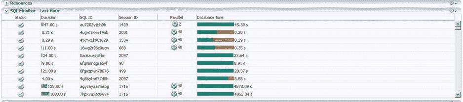

**图 10-1.** OEM 12c SQL 监控面板

呈现的详细信息包括持续时间、SQL ID、运行该语句的会话 ID、并行执行的并行度，以及数据库时间的条形图，该条形图按记录时间的三个类别 `CPU`、`用户 I/O` 和 `其他` 进行分解。绿色报告 `CPU` 时间占总时间的百分比，蓝色报告 `用户 I/O` 占总时间的百分比，橙色报告记录为 `其他` 的时间（同样占总时间的百分比）。只需单击该 SQL ID，即可从报告中“深入查看”特定 SQL ID 的详细信息，如 图 10-2 所示。

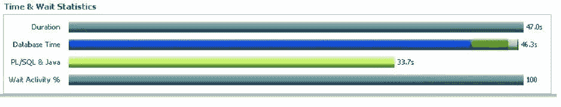

**图 10-2.** OEM 12c 中的 SQL ID 时间与等待窗口


### 引言：执行计划的增强信息与统计

除了增强的执行计划（提供时间线以及常规信息）外，计划上方还有两个部分，分别提供时间和等待统计信息，以及 I/O 统计信息。这对于在单条语句级别诊断和排除性能问题非常有帮助。它不仅显示了“墙上时钟”时间（以 `Duration` 条显示），还将时间分解为各个组成部分，因此你可以看到执行语句时时间都花在了哪里。请注意，数据库时间、PL/SQL 和 Java 时间，以及等待活动，都在“时间和等待统计”窗口中报告。从显示的 `Database Time` 条来看，时间被分解为四个等待类别：用户 I/O（蓝色）、CPU（绿色）、集群（白色）和应用程序（红色）。将光标悬停在这些区域上，会报告所代表的类别及其占数据库总时间的百分比。这种分解对于确定时间花费在何处以及可能实施哪些改进非常有帮助。同样地，将光标悬停在 I/O 统计信息窗口中的条上，会报告相应的数据。图 10-3 展示了“时间和等待统计”的示例。

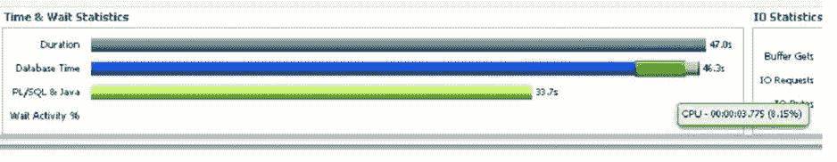

图 10-3. 时间与等待统计分解

图 10-4 展示了 I/O 窗口的类似行为。

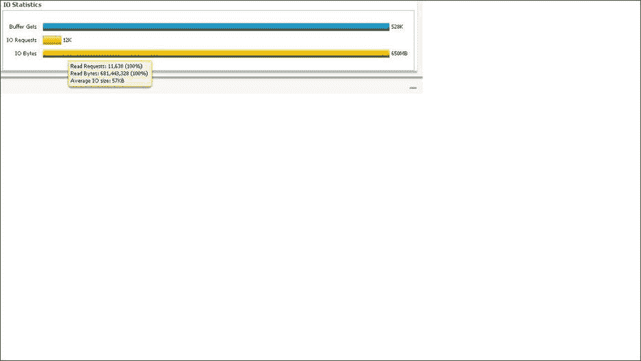

图 10-4. I/O 统计分解

通过执行计划上方的选项卡，你可以将并行等待统计信息（对于使用并行执行的语句）视为条形图，将其他各种指标视为折线图，后者如 图 10-5 所示。

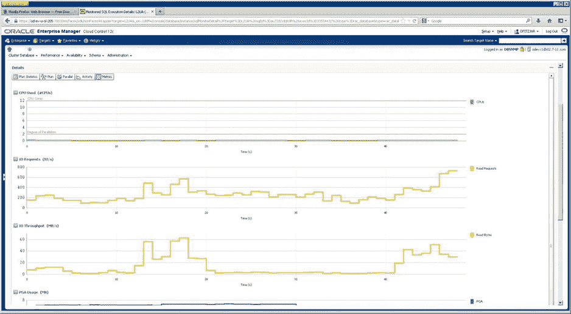

图 10-5. OEM 12c 中的 SQL ID 指标图

我们使用 `Duration` 列来引导我们找到可能有问题的语句，这些语句可以被隔离并调查以确认它们是否真的存在问题。如果一个语句在过去一小时内的 `Duration` 为 993 秒，但执行了 1233 次，那么每次执行的时间不到 1 秒，这是可以接受的性能。另一方面，如果一个语句在过去一小时内的 `Duration` 为 79 秒，但只执行了 1 次，那么这个 `SQL ID` 就值得进一步调查。`Duration` 列报告的值很大，这一事实本身意义不大。你必须进一步调查，以准确判断它是否是个问题。

图形界面很好用，也相当容易上手，但它们并非监控 Exadata 所绝对必需的。如果你无法访问 OEM 12c（无论是未安装还是停止工作），也并非无计可施。你可以从 `SQL*Plus` 生成实时 SQL 监控报告。

### 使用 GV$SQL 和 GV$SQLSTATS（不仅如此）

通过 `SQL*Plus` 生成实时监控报告并不像看起来那么困难，因为 Oracle 提供了多个视图，包括 `GV$SQL` 和 `GV$SQLSTATS`，以及一个包函数 (`DBMS_SQLTUNE.REPORT_SQL_MONITOR`) 来提供这些信息。

在深入探讨 `GV$SQL` 和 `GV$SQLSTATS` 之前，我们将先看看 `GV$SQL_MONITOR`，它为集群中所有可用实例提供会话级执行监控数据。鉴于 Exadata 是一个 RAC 环境，来自应用程序的多个连接可能会“循环”连接到可用节点。因此，同一个 `SQL ID` 可能同时存在于两个或更多节点上。在 `SQL ID` 级别监控执行时，确保你始终在查看你开始监控的同一个会话非常重要。这时会话 `SID`、实例 ID 和状态就很有用了。会话 `SID` 和实例 ID 允许你隔离节点上的某个会话进行进一步监控。如果目标是检查当前正在运行的语句，请确保报告的 `STATUS` 为 `EXECUTING`，这样随时间进行的监控将提供你可能需要用于故障排除的信息。另一个值得注意的视图是 `GV$SQL_PLAN_MONITOR`。该视图使用计划级监控数据进行实时更新。

查看一些使用 `GV$SQL_MONITOR`、`GV$SQL_PLAN_MONITOR`、`GV$SQL` 和 `GV$SQLSTATS` 的示例，应该有助于你理解这些视图的强大功能以及它们能提供的信息。我们从 `GV$SQL_MONITOR` 开始，搜索一个特定的 `SQL_ID`，如下所示：

```sql
SQL> select inst_id inst, sid, sql_plan_hash_value plan_hash, elapsed_time elapsed, cpu_time cpu_tm, fetches fetch, io_interconnect_bytes io_icon_byt, physical_read_bytes + physical_write_bytes tl_byt_proc, ((physical_read_bytes+physical_write_bytes)/io_interconnect_bytes)*100 offld_pct, status
  2  from gv$sql_monitor
  3  where status <> 'DONE'
  4  and sql_id = 'b1x37zg5a1ygr'
  5  and io_interconnect_bytes > 0
  6  /
```


## 查询性能监控

### 执行统计信息
以下是包含 25 行的查询执行统计信息，所有行的 `OFFLD_PCT` 均为 100%。

```
INST   SID  PLAN_HASH ELAPSED   CPU_TM FETCH IO_ICON_BYT TL_BYT_PRC OFFLD_PCT STATUS
---- ----- ---------- ------- -------- ----- ----------- ---------- --------- ---------------
   1     2 1747818060  329685    76988     0     8183808    8183808       100 DONE (ALL ROWS)
   1  2222 1747818060  283095   100984     0     9199616    9199616       100 DONE (ALL ROWS)
   1  1062 1747818060  240687    86987     0     9502720    9502720       100 DONE (ALL ROWS)
   1  1810 1747818060  246776    85987     0     6201344    6201344       100 DONE (ALL ROWS)
   1   201 1747818060  258911    46992     0     5505024    5505024       100 DONE (ALL ROWS)
   1  1343 1747818060  232887    68989     0     7061504    7061504       100 DONE (ALL ROWS)
   1   777 1747818060  280657    63990     0     6152192    6152192       100 DONE (ALL ROWS)
   1  2094 1747818060  332745    54992     0     6520832    6520832       100 DONE (ALL ROWS)
   1   966 1747818060  245549    79987     0     8028160    8028160       100 DONE (ALL ROWS)
   1  1631 1747818060  273636    74988     0     9216000    9216000       100 DONE (ALL ROWS)
   1  1530 1747818060  330327    89986     0     7454720    7454720       100 DONE (ALL ROWS)
   1  1245 1747818060  239035    95985     0     8773632    8773632       100 DONE (ALL ROWS)
   1   863 1747818060  288678    51992     0     6995968    6995968       100 DONE (ALL ROWS)
   1  2004 1747818060  270000    41993     0     5562368    5562368       100 DONE (ALL ROWS)
   1  1911 1747818060  258966    51992     0     6823936    6823936       100 DONE (ALL ROWS)
   1   393 1747818060  323315    37993     0     4874240    4874240       100 DONE (ALL ROWS)
   1  1724 1747818060  249028    72989     0     7421952    7421952       100 DONE (ALL ROWS)
   1  1241 1747818060   36000    15998     1       40960      40960       100 DONE (ALL ROWS)
   1   290 1747818060  234694    73989     0     6356992    6356992       100 DONE (ALL ROWS)
   1   387 1747818060  264108    75988     0     8454144    8454144       100 DONE (ALL ROWS)
   1  1431 1747818060  246059    75989     0     8011776    8011776       100 DONE (ALL ROWS)
   1   482 1747818060  279164    51991     0     6692864    6692864       100 DONE (ALL ROWS)
   1   493 1747818060  272336    69990     0     8347648    8347648       100 DONE (ALL ROWS)
   1  1156 1747818060  274823    97985     0    11042816   11042816       100 DONE (ALL ROWS)
   1   110 1747818060  261317    61991     0     7708672    7708672       100 DONE (ALL ROWS)

25 rows selected.
SQL>
```

### 卸载效率分析
有 25 个会话正在运行相同的语句，每个会话都有不同的监控信息。对于 Exadata，关键信息之一是 `IO_INTERCONNECT_BYTES`，它间接报告了卸载效率。如果 `PHYSICAL_READ_BYTES` 和 `PHYSICAL_WRITE_BYTES` 的总和等于 `IO_INTERCONNECT_BYTES` 中的值，则表明该查询或语句完全得益于卸载，效率为 100%。正如我们之前指出的，比率和效率是相对数字。但这个比率确实能让你大致了解有多少数据是由卸载处理的，从而节省了数据库层的处理时间。请注意，结果中的每一行 `offload_pct` 都是 100。你不会总是看到 100% 的卸载效率，因为多部分查询可能包含会卸载和不会卸载的部分，如下列输出所示。

```
INST   SID  PLAN_HASH ELAPSED   CPU_TM FETCH IO_ICON_BYT TL_BYT_PRC OFFLD_PCT STATUS
---- ----- ---------- ------- -------- ----- ----------- ---------- --------- ---------------
   2   476 3140350437 7065006  2202665   142    85155840   83320832 97.845118 DONE (ALL ROWS)
   1   869  484955222 6136552  5940097   127      147456     106496 72.222222 DONE (ALL ROWS)
```

来自这两个会话的语句的大部分输出都卸载了，但仍有一部分没有卸载，可能是因为它需要在数据库层进行传统的一致性读处理。也有可能得到高于 100% 的百分比。

```
INST   SID SQL_ID          PLAN_HASH  ELAPSED   CPU_TM FETCH IO_ICON_BYT TL_BYT_PRC OFFLD_PCT STATUS
---- ----- -------------  --------- -------- -------- ----- ----------- ---------- --------- ------
   2  1619 192t67rtdqrf8 4217233900 23380518   795879     2    61626560  127926272 207.58302 DONE (FIRST N ROWS)
   2  1333 6m6y2y82sjpjx  627564094  4416403  1176820     1    57162056   77930496 136.33256 DONE (ALL ROWS)
   2  1619 192t67rtdqrf8 4217233900 13716144   853870     2    63322304  129622016 204.70199 DONE (FIRST N ROWS)
```

### ORDER BY 与索引访问的影响
`ORDER BY` 子句可能导致这种行为，因为它最多可以使查询处理的读取字节数翻倍。

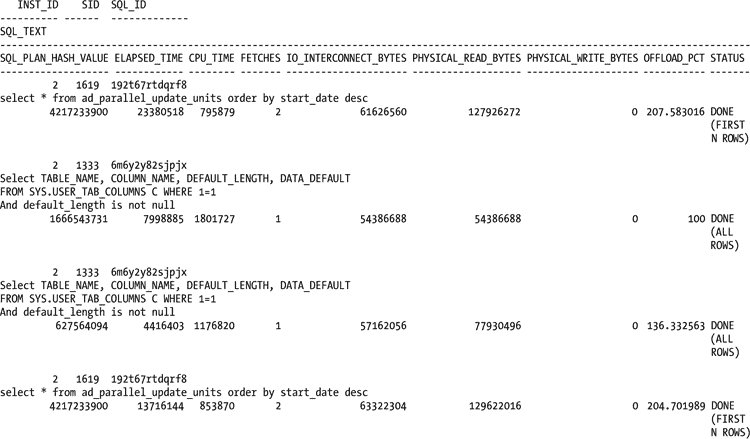

索引访问也可能导致 `PHYSICAL_READ_BYTES` 的值高于 `IO_INTERCONNECT_BYTES`。`SQL_ID 6m6y2y82sjpjx` 就是这种情况，执行计划显示了这一点。

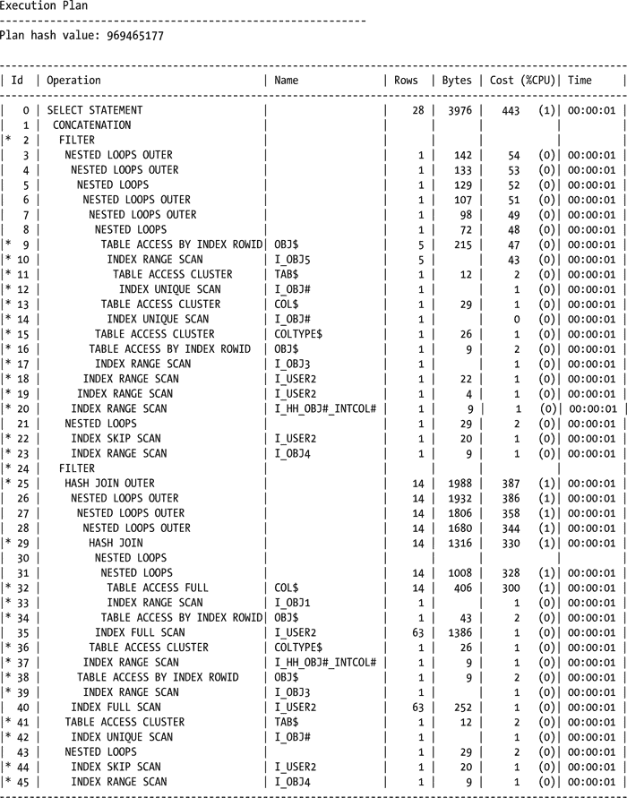

由于索引访问路径不符合智能扫描的条件，它们增加了 `PHYSICAL_READ_BYTES`，但没有为 `IO_INTERCONNECT_BYTES` 增加相同的量。

### 使用 DBMS_SQLTUNE.REPORT_SQL_MONITOR
在 Oracle 11.2 中，另一种生成监控数据的方法是使用 `DBMS_SQLTUNE.REPORT_SQL_MONITOR` 函数。

```
select dbms_sqltune.report_sql_monitor(session_id=>&sessid, report_level=>'ALL',type=>'HTML') from dual;
```

`TYPE` 参数可以是 `TEXT` 或 `HTML`。我们通常生成 `HTML` 报告，因为它们在 Web 浏览器中更易于导航和阅读，并且保留了可以通过右键单击数据项访问的上下文（钻取）信息。其中一份 `HTML` 报告的示例输出如图 10-6a、10-6b 和 10-6c 所示。

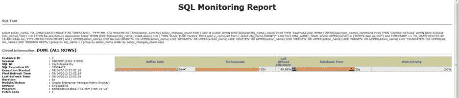
图 10-6a. 来自 DBMS_SQLTUNE.REPORT_SQL_MONITOR 的全局信息输出

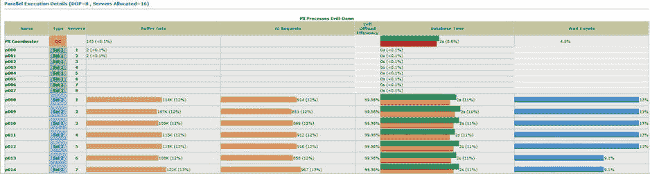
图 10-6b. HTML 报告中的并行执行信息

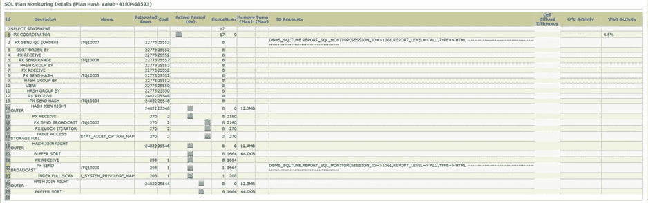
图 10-6c. HTML 报告中的 SQL 计划窗口

相同 SID 的文本报告提供相同的信息。

```
SQL Monitoring Report

SQL Text

select policy_name, TO_CHAR(CAST(SYSDATE AS TIMESTAMP) , 'YYYY-MM-DD HH24:MI:SS'
) timestamp, sum(cnt) policy_changes_count from ( select (CASE WHEN (INSTR(lower
(obj_name),'realm')!=0) THEN 'Realms' WHEN (INSTR(lower(obj_name),'command')!=0)
 THEN 'Command Rules' WHEN (INSTR(lower(obj_name),'role') !=0 ) THEN 'Secure App
lication Roles' WHEN (INSTR(lower(obj_name),'rule') !=0 ) THEN 'Rules' ELSE 'Fac
tors' END) policy_name,cnt from ( select obj_name,COUNT(*) cnt from DBA_AUDIT_TR
AIL where
UPPER(owner) in ('DVSYS','DVF') and TIMESTAMP >= TO_DATE('2013-07-22 16:40:12','
YYYY-MM-DD HH24:MI:SS') and ( UPPER(action_name) LIKE 'INSERT%' OR UPPER(action_
name) LIKE 'UPDATE%' OR UPPER(action_name) LIKE 'DELETE%' OR UPPER(action_name)
LIKE 'MERGE%' OR UPPER(action_name) LIKE 'PURGE%' OR UPPER(action_name) LIKE 'TR
UNCATE%' OR UPPER(action_name) LIKE 'SESSION REC%') group by obj_name ) ) group
by policy_name order by policy_changes_count desc

Global Information
```


状态：已完成（所有行）
实例 ID：2
会话：DBSNMP (1061:17835)
SQL ID：2sy0yfzam41hy
SQL 执行 ID：33554477
开始执行时间：2013 年 9 月 14 日 22:52:18
首次刷新时间：2013 年 9 月 14 日 22:52:18
最后刷新时间：2013 年 9 月 14 日 22:52:24
持续时间：6 秒
模块/操作：Oracle Enterprise Manager.Metric Engine/-
服务：SYS$USERS
程序：perl@odevx1db02.7-11.com (TNS V1-V3)
获取调用次数：1

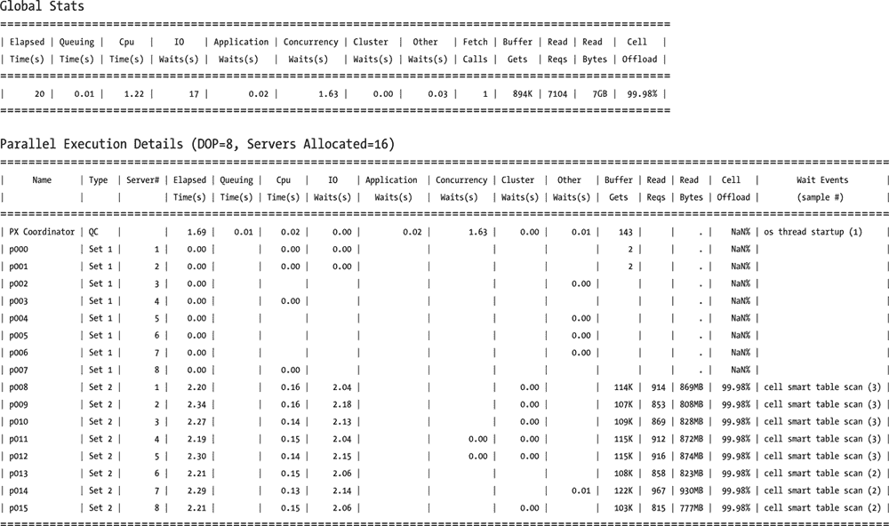

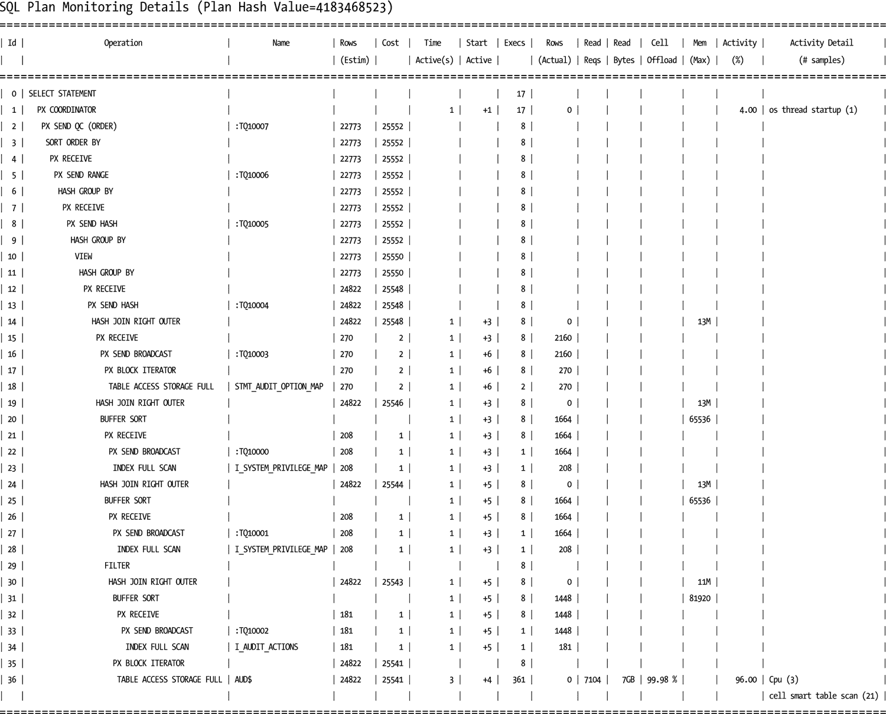

与我们之前讨论的 OEM 报告类似，`HTML`版本允许您将鼠标指针悬停在数据条上，查看 I/O 请求、数据库时间和等待活动的细分情况，如图 10-7 所示。

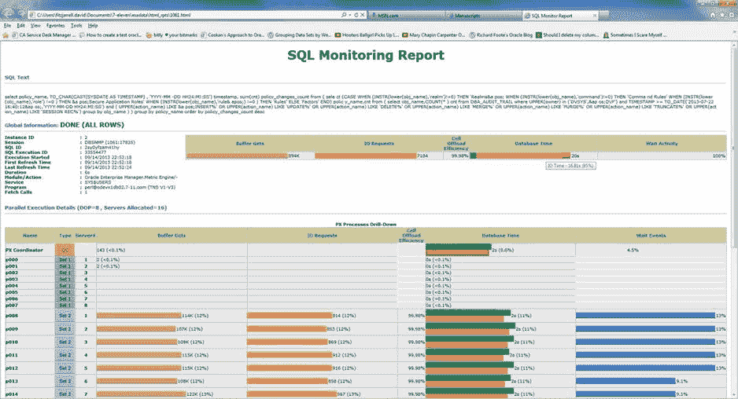

图 10-7. `DBMS_SQLTUNE.REPORT_SQL_MONITOR` HTML 报告中的时间细分

如果您的 Exadata 系统可以访问互联网，并且您正在运行 Oracle 11.2.0.x，那么您可以为`type`参数使用第三个选项，即`'ACTIVE'`，它会生成一个带有活动内容的 HTML 类型报告，其外观类似于 OEM 的屏幕界面。图 10-8 展示了这种报告的显示效果。

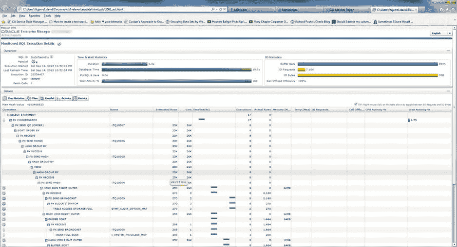

图 10-8. 活动的`DBMS_SQLTUNE.REPORT_SQL_MONITOR`报告

尽管通过 SQL 监控、AWR、ASH（活动会话历史）和`DBMS_SQLTUNE`生成的报告功能强大，但其有效性存在局限。根据设计，SQL 监控仅在 I/O 时间、CPU 时间或两者合计超过五秒的限制后才开始记录数据；这通常意味着只有运行时间较长的查询和语句才会被监控，即使您使用了`/*+ MONITOR */`提示。这又回到了数据库的监控脚本和操作，在那些场景下，AWR、Statspack 和 ASH 并不可用。这些脚本和查询在 Exadata 环境中仍然可能很有用，特别是在检查短时间运行的查询时，这些查询通常使用`V$SQL`，以及在较新的实现中使用`V$SQLSTATS`。

多年来，DBA 们一直依赖`V$SQL`来报告诸如执行次数、缓冲区获取、磁盘读取或解析调用等数据。查看`V$SQL`的定义，我们可以发现其中包含了大量可用数据。

```
SQL> desc v$sql
 Name                                      Null?    Type
 ----------------------------------------- -------- -----------------------
 SQL_TEXT                                           VARCHAR2(1000)
 SQL_FULLTEXT                                       CLOB
 SQL_ID                                             VARCHAR2(13)
 SHARABLE_MEM                                       NUMBER
 PERSISTENT_MEM                                     NUMBER
 RUNTIME_MEM                                        NUMBER
 SORTS                                              NUMBER
 LOADED_VERSIONS                                    NUMBER
 OPEN_VERSIONS                                      NUMBER
 USERS_OPENING                                      NUMBER
 FETCHES                                            NUMBER
 EXECUTIONS                                         NUMBER
 PX_SERVERS_EXECUTIONS                              NUMBER
 END_OF_FETCH_COUNT                                 NUMBER
 USERS_EXECUTING                                    NUMBER
 LOADS                                              NUMBER
 FIRST_LOAD_TIME                                    VARCHAR2(76)
 INVALIDATIONS                                      NUMBER
 PARSE_CALLS                                        NUMBER
 DISK_READS                                         NUMBER
 DIRECT_WRITES                                      NUMBER
 BUFFER_GETS                                        NUMBER
 APPLICATION_WAIT_TIME                              NUMBER
 CONCURRENCY_WAIT_TIME                              NUMBER
 CLUSTER_WAIT_TIME                                  NUMBER
 USER_IO_WAIT_TIME                                  NUMBER
 PLSQL_EXEC_TIME                                    NUMBER
 JAVA_EXEC_TIME                                     NUMBER
 ROWS_PROCESSED                                     NUMBER
 COMMAND_TYPE                                       NUMBER
 OPTIMIZER_MODE                                     VARCHAR2(10)
 OPTIMIZER_COST                                     NUMBER
 OPTIMIZER_ENV                                      RAW(2000)
 OPTIMIZER_ENV_HASH_VALUE                           NUMBER
 PARSING_USER_ID                                    NUMBER
 PARSING_SCHEMA_ID                                  NUMBER
 PARSING_SCHEMA_NAME                                VARCHAR2(30)
 KEPT_VERSIONS                                      NUMBER
 ADDRESS                                            RAW(8)
 TYPE_CHK_HEAP                                      RAW(8)
 HASH_VALUE                                         NUMBER
 OLD_HASH_VALUE                                     NUMBER
 PLAN_HASH_VALUE                                    NUMBER
 CHILD_NUMBER                                       NUMBER
 SERVICE                                            VARCHAR2(64)
 SERVICE_HASH                                       NUMBER
 MODULE                                             VARCHAR2(64)
 MODULE_HASH                                        NUMBER
 ACTION                                             VARCHAR2(64)
 ACTION_HASH                                        NUMBER
 SERIALIZABLE_ABORTS                                NUMBER
 OUTLINE_CATEGORY                                   VARCHAR2(64)
 CPU_TIME                                           NUMBER
 ELAPSED_TIME                                       NUMBER
 OUTLINE_SID                                        NUMBER
 CHILD_ADDRESS                                      RAW(8)
 SQLTYPE                                            NUMBER
 REMOTE                                             VARCHAR2(1)
 OBJECT_STATUS                                      VARCHAR2(19)
 LITERAL_HASH_VALUE                                 NUMBER
 LAST_LOAD_TIME                                     VARCHAR2(76)
 IS_OBSOLETE                                        VARCHAR2(1)
 IS_BIND_SENSITIVE                                  VARCHAR2(1)
 IS_BIND_AWARE                                      VARCHAR2(1)
 IS_SHAREABLE                                       VARCHAR2(1)
 CHILD_LATCH                                        NUMBER
 SQL_PROFILE                                        VARCHAR2(64)
 SQL_PATCH                                          VARCHAR2(30)
 SQL_PLAN_BASELINE                                  VARCHAR2(30)
 PROGRAM_ID                                         NUMBER
 PROGRAM_LINE#                                      NUMBER
 EXACT_MATCHING_SIGNATURE                           NUMBER
 FORCE_MATCHING_SIGNATURE                           NUMBER
 LAST_ACTIVE_TIME                                   DATE
 BIND_DATA                                          RAW(2000)
 TYPECHECK_MEM                                      NUMBER
 IO_CELL_OFFLOAD_ELIGIBLE_BYTES                     NUMBER
 IO_INTERCONNECT_BYTES                              NUMBER
 PHYSICAL_READ_REQUESTS                             NUMBER
 PHYSICAL_READ_BYTES                                NUMBER
 PHYSICAL_WRITE_REQUESTS                            NUMBER
 PHYSICAL_WRITE_BYTES                               NUMBER
 OPTIMIZED_PHY_READ_REQUESTS                        NUMBER
 LOCKED_TOTAL                                       NUMBER
 PINNED_TOTAL                                       NUMBER
 IO_CELL_UNCOMPRESSED_BYTES                         NUMBER
 IO_CELL_OFFLOAD_RETURNED_BYTES                     NUMBER
```


## V$SQLSTATS 视图

不幸的是，在查询`V$SQL`视图时，如果不提供`SQL_ID`，会遇到 latch 争用问题。因此，如果同时有多个查询活动于此视图，性能可能会很慢。在 10gR2 版本中，引入了`V$SQLSTATS`视图，它记录了与`V$SQL`大致相同的信息，但存储在不会与未限定查询产生 latch 争用的内存位置和格式中。既然`V$SQLSTATS`视图在我们看来是更佳的选择，我们将在此讨论它。请记住，应用于`V$SQLSTATS`的基本查询类型同样可以应用于`V$SQL`。

在第 2 章中，我们讨论了智能扫描以及如何验证其是否生效，并使用了`V$SQL`视图。现在，我们将使用`V$SQLSTATS`来返回类似的信息。

查看`V$SQLSTATS`的定义，我们看到其包含的信息与`V$SQL`中可用的大部分相同。

```
SQL> desc v$sqlstats
 Name                                              Null?    Type
 ------------------------------------------------- -------- ------------------
 SQL_TEXT                                                   VARCHAR2(1000)
 SQL_FULLTEXT                                               CLOB
 SQL_ID                                                     VARCHAR2(13)
 LAST_ACTIVE_TIME                                           DATE
 LAST_ACTIVE_CHILD_ADDRESS                                  RAW(8)
 PLAN_HASH_VALUE                                            NUMBER
 PARSE_CALLS                                                NUMBER
 DISK_READS                                                 NUMBER
 DIRECT_WRITES                                              NUMBER
 BUFFER_GETS                                                NUMBER
 ROWS_PROCESSED                                             NUMBER
 SERIALIZABLE_ABORTS                                        NUMBER
 FETCHES                                                    NUMBER
 EXECUTIONS                                                 NUMBER
 END_OF_FETCH_COUNT                                         NUMBER
 LOADS                                                      NUMBER
 VERSION_COUNT                                              NUMBER
 INVALIDATIONS                                              NUMBER
 PX_SERVERS_EXECUTIONS                                      NUMBER
 CPU_TIME                                                   NUMBER
 ELAPSED_TIME                                               NUMBER
 AVG_HARD_PARSE_TIME                                        NUMBER
 APPLICATION_WAIT_TIME                                      NUMBER
 CONCURRENCY_WAIT_TIME                                      NUMBER
 CLUSTER_WAIT_TIME                                          NUMBER
 USER_IO_WAIT_TIME                                          NUMBER
 PLSQL_EXEC_TIME                                            NUMBER
 JAVA_EXEC_TIME                                             NUMBER
 SORTS                                                      NUMBER
 SHARABLE_MEM                                               NUMBER
 TOTAL_SHARABLE_MEM                                         NUMBER
 TYPECHECK_MEM                                              NUMBER
 IO_CELL_OFFLOAD_ELIGIBLE_BYTES                             NUMBER
 IO_INTERCONNECT_BYTES                                      NUMBER
 PHYSICAL_READ_REQUESTS                                     NUMBER
 PHYSICAL_READ_BYTES                                        NUMBER
 PHYSICAL_WRITE_REQUESTS                                    NUMBER
 PHYSICAL_WRITE_BYTES                                       NUMBER
 EXACT_MATCHING_SIGNATURE                                   NUMBER
 FORCE_MATCHING_SIGNATURE                                   NUMBER
 IO_CELL_UNCOMPRESSED_BYTES                                 NUMBER
 IO_CELL_OFFLOAD_RETURNED_BYTES                             NUMBER

SQL>
```

`V$SQLSTATS`不包含解析用户 ID，因此你需要使用其他方法来隔离你想查看的信息。以下是对第 2 章中使用的`V$SQL`查询可能的一个改写。

```
SQL> select       sql_id,
  2          io_cell_offload_eligible_bytes qualifying,
  3          io_cell_offload_eligible_bytes -
io_cell_offload_returned_bytes actual,
  4          round(((io_cell_offload_eligible_bytes - io_cell_offload_returned_bytes)/io_cell_offload_eligible_bytes)*100, 2) io_saved_pct,
  5          sql_text
  6          from v$sqlstats
  7          where io_cell_offload_returned_bytes > 0
  8          and io_cell_offload_eligible_bytes > 0
  9          and instr(sql_text, 'emp') > 0;

SQL_ID        QUALIFYING     ACTUAL IO_SAVED_PCT SQL_TEXT
------------- ---------- ---------- ------------ ---------------------------------------------
gfjb8dpxvpuv6  185081856  185053096        99.98 select * from emp where empid = 7934
dayy30naa1z2p  184819712     948048          .51 select /*+ cache */ * from emp

SQL>
```

由于可能有许多查询以“emp”作为子字符串，其中一些并不符合智能扫描的条件，因此有必要包含一个条件，即`io_cell_offload_eligible_bytes`大于 0。如果没有这个条件，查询会产生“除数为 0”的错误，这在`V$SQL`版本的查询中不会发生。

`V$SQLSTATS`中缺少一些`V$SQL`所提供的信息片段。


## 数据库视图与监控

### 数据库视图 `V$SQL` 的列信息

```
COLUMN_NAME                     DATA_TYPE                       DATA_LENGTH
------------------------------ -------------------------------- -----------
PERSISTENT_MEM                 NUMBER                                  22
RUNTIME_MEM                    NUMBER                                  22
LOADED_VERSIONS                NUMBER                                  22
OPEN_VERSIONS                  NUMBER                                  22
USERS_OPENING                  NUMBER                                  22
USERS_EXECUTING                NUMBER                                  22
FIRST_LOAD_TIME                VARCHAR2                                76
COMMAND_TYPE                   NUMBER                                  22
OPTIMIZER_MODE                 VARCHAR2                                10
OPTIMIZER_COST                 NUMBER                                  22
OPTIMIZER_ENV                  RAW                                   2000
OPTIMIZER_ENV_HASH_VALUE       NUMBER                                  22
PARSING_USER_ID                NUMBER                                  22
PARSING_SCHEMA_ID              NUMBER                                  22
PARSING_SCHEMA_NAME            VARCHAR2                                30
KEPT_VERSIONS                  NUMBER                                  22
ADDRESS                        RAW                                      8
TYPE_CHK_HEAP                  RAW                                      8
HASH_VALUE                     NUMBER                                  22
OLD_HASH_VALUE                 NUMBER                                  22
CHILD_NUMBER                   NUMBER                                  22
SERVICE                        VARCHAR2                                64
SERVICE_HASH                   NUMBER                                  22
MODULE                         VARCHAR2                                64
MODULE_HASH                    NUMBER                                  22
ACTION                         VARCHAR2                                64
ACTION_HASH                    NUMBER                                  22
OUTLINE_CATEGORY               VARCHAR2                                64
OUTLINE_SID                    NUMBER                                  22
CHILD_ADDRESS                  RAW                                      8
SQLTYPE                        NUMBER                                  22
REMOTE                         VARCHAR2                                 1
OBJECT_STATUS                  VARCHAR2                                19
LITERAL_HASH_VALUE             NUMBER                                  22
LAST_LOAD_TIME                 VARCHAR2                                76
IS_OBSOLETE                    VARCHAR2                                 1
IS_BIND_SENSITIVE              VARCHAR2                                 1
IS_BIND_AWARE                  VARCHAR2                                 1
IS_SHAREABLE                   VARCHAR2                                 1
CHILD_LATCH                    NUMBER                                  22
SQL_PROFILE                    VARCHAR2                                64
SQL_PATCH                      VARCHAR2                                30
SQL_PLAN_BASELINE              VARCHAR2                                30
PROGRAM_ID                     NUMBER                                  22
PROGRAM_LINE#                  NUMBER                                  22
BIND_DATA                      RAW                                   2000
OPTIMIZED_PHY_READ_REQUESTS    NUMBER                                  22
LOCKED_TOTAL                   NUMBER                                  22
PINNED_TOTAL                   NUMBER                                  22
```

对于常规监控任务，这些列并非必需。如果您确实需要深入排查问题，则可能需要使用 `V$SQL` 来访问查询相关的内存、闩锁或优化器数据。我们发现 `V$SQLSTATS` 在对 SQL 语句进行基础、例行的监控方面表现出色，并且在数据库活动繁忙期间提供的开销较低。

## 存储单元

存储单元管理已在第 9 章中介绍，但我们将在此回顾其中的部分信息。

### 命令行

我们认为在这里回顾一下命令行接口是个好主意。请记住，存储单元提供了 `CellCLI` 和 `cellsrvstat` 来监控存储单元，并有两个账户 `cellmonitor` 和 `celladmin` 来执行这些任务。对于常规监控，通过 `CellCLI` 接口，`cellmonitor` 账户应能提供您所需的信息。

Exadata 的一个常见监控区域是智能闪存缓存。要全面监控此区域，必须连接到每个可用的存储单元并生成报告。可以通过脚本将此操作发送到存储单元，并将输出记录到数据库服务器，这在第 9 章中有说明。以下是针对存储单元 4 的此类报告示例。

```
CellCLI> list flashlog detail
         name:                   myexa1cel04_FLASHLOG
         cellDisk:               FD_14_myexa1cel04,FD_05_myexa1cel04,FD_00_myexa1cel04,FD_01_myexa1cel04,FD_04_myexa1cel04,
                                 FD_07_myexa1cel04,FD_09_myexa1cel04,FD_02_myexa1cel04,FD_08_myexa1cel04,FD_03_myexa1cel04,
                                 FD_15_myexa1cel04,FD_12_myexa1cel04,FD_11_myexa1cel04,FD_06_myexa1cel04,FD_10_myexa1cel04,
                                 FD_13_myexa1cel04
         creationTime:           2013-07-09T17:33:31-05:00
         degradedCelldisks:
         effectiveSize:          512M
         efficiency:             100.0
         id:                     7eb480f9-b94a-4493-bfca-3ba00b6618bb
         size:                   512M
         status:                 normal

CellCLI>
```

以下是一个在存储单元上运行的命令行示例，列出了相同的输出，但避免了使用命令行界面。

```
[celladmin@myexa1cel05 ∼]$ cellcli -e "list flashcache detail"
         name:                   myexa1cel05_FLASHCACHE
         cellDisk:               FD_11_myexa1cel05,FD_03_myexa1cel05,FD_15_myexa1cel05,FD_13_myexa1cel05,FD_08_myexa1cel05,
                                 FD_10_myexa1cel05,FD_00_myexa1cel05,FD_14_myexa1cel05,FD_04_myexa1cel05,FD_06_myexa1cel05,
                                 FD_07_myexa1cel05,FD_05_myexa1cel05,FD_12_myexa1cel05,FD_09_myexa1cel05,FD_02_myexa1cel05,
                                 FD_01_myexa1cel05
         creationTime:           2013-07-09T17:33:53-05:00
         degradedCelldisks:
         effectiveCacheSize:     1488.75G
         id:                     8a380bf9-06c3-445e-8081-cff72d49bfe6
         size:                   1488.75G
         status:                 normal
[celladmin@myexa1cel05 ∼]$
```

如第 9 章所述，如果您在数据库服务器和存储单元之间设置了无密码 `ssh` 连接，您可以从数据库服务器命令提示符运行这些命令，并将结果写入本地日志文件。

一个值得注意的实用 `CellCLI` 命令是 `LIST METRICHISTORY`。顾名思义，此命令列出存储单元中所有已知指标的指标历史记录，以及收集值的时间戳。输出列表可能会非常长，正如您在以下简化的输出中所见。


CellCLI> list metrichistory attributes name, collectionTime, metricType, metricValue, metricValueAvg where metricObjectName = 'DBFS_DG_CD_02_myexa1cel04'
...
GD_BY_FC_DIRTY          2013-08-24T19:50:42-05:00       瞬时值          0.000 MB
GD_IO_BY_R_LG           2013-08-24T19:50:42-05:00       累积值          2,656 MB
GD_IO_BY_R_LG_SEC       2013-08-24T19:50:42-05:00       速率            0.000 MB/秒
GD_IO_BY_R_SM           2013-08-24T19:50:42-05:00       累积值          207 MB
GD_IO_BY_R_SM_SEC       2013-08-24T19:50:42-05:00       速率            0.000 MB/秒
GD_IO_BY_W_LG           2013-08-24T19:50:42-05:00       累积值          8,378 MB
GD_IO_BY_W_LG_SEC       2013-08-24T19:50:42-05:00       速率            0.000 MB/秒
GD_IO_BY_W_SM           2013-08-24T19:50:42-05:00       累积值          60.191 MB
GD_IO_BY_W_SM_SEC       2013-08-24T19:50:42-05:00       速率            0.000 MB/秒
GD_IO_ERRS              2013-08-24T19:50:42-05:00       累积值          0
GD_IO_ERRS_MIN          2013-08-24T19:50:42-05:00       速率            0.0 /分钟
GD_IO_RQ_R_LG           2013-08-24T19:50:42-05:00       累积值          2,656 次 IO 请求
GD_IO_RQ_R_LG_SEC       2013-08-24T19:50:42-05:00       速率            0.0 次 IO/秒
GD_IO_RQ_R_SM           2013-08-24T19:50:42-05:00       累积值          4,086 次 IO 请求
GD_IO_RQ_R_SM_SEC       2013-08-24T19:50:42-05:00       速率            0.0 次 IO/秒
GD_IO_RQ_W_LG           2013-08-24T19:50:42-05:00       累积值          8,781 次 IO 请求
GD_IO_RQ_W_LG_SEC       2013-08-24T19:50:42-05:00       速率            0.0 次 IO/秒
GD_IO_RQ_W_SM           2013-08-24T19:50:42-05:00       累积值          1,326 次 IO 请求
GD_IO_RQ_W_SM_SEC       2013-08-24T19:50:42-05:00       速率            0.0 次 IO/秒
...

上表所列的指标可能仅凭名称中的缩写并不完全清晰。以下是每个名称及其含义的列表。

GD_BY_FC_DIRTY          网格磁盘缓存的脏数据 MB 数
GD_IO_BY_R_LG           网格磁盘大读取产生的 I/O，单位为 MB
GD_IO_BY_R_LG_SEC       网格磁盘大读取产生的每秒 I/O，单位为 MB
GD_IO_BY_R_SM           网格磁盘小读取产生的 I/O，单位为 MB
GD_IO_BY_R_SM_SEC       网格磁盘小读取产生的每秒 I/O，单位为 MB
GD_IO_BY_W_LG           网格磁盘大写入产生的 I/O，单位为 MB
GD_IO_BY_W_LG_SEC       网格磁盘大写入产生的每秒 I/O，单位为 MB
GD_IO_BY_W_SM           网格磁盘小写入产生的 I/O，单位为 MB
GD_IO_BY_W_SM_SEC       网格磁盘小写入产生的每秒 I/O，单位为 MB
GD_IO_ERRS              网格磁盘 I/O 错误数
GD_IO_ERRS_MIN          网格磁盘每分钟 I/O 错误数
GD_IO_RQ_R_LG           网格磁盘大 I/O 读取请求数
GD_IO_RQ_R_LG_SEC       网格磁盘大 I/O 读取请求每秒数
GD_IO_RQ_R_SM           网格磁盘小 I/O 读取请求数
GD_IO_RQ_R_SM_SEC       网格磁盘小 I/O 读取请求每秒数
GD_IO_RQ_W_LG           网格磁盘大 I/O 写入请求数
GD_IO_RQ_W_LG_SEC       网格磁盘大 I/O 写入请求每秒数
GD_IO_RQ_W_SM           网格磁盘小 I/O 写入请求数
GD_IO_RQ_W_SM_SEC       网格磁盘小 I/O 写入请求每秒数

在该列表中，唯一报告为瞬时值的是 `GD_BY_FC_DIRTY`，它报告了网格磁盘当前缓存脏数据块的 MB 数。以下指标报告自 `cellsrv` 启动以来的累积值：

`GD_IO_BY_R_LG`
`GD_IO_BY_R_SM`
`GD_IO_BY_W_LG`
`GD_IO_BY_W_SM`
`GD_IO_ERRS`
`GD_IO_RQ_R_LG`
`GD_IO_RQ_R_SM`
`GD_IO_RQ_W_LG`
`GD_IO_RQ_W_SM`

前四个指标以 MB 为单位报告；其余指标仅为所列指标的简单累积计数。此外，还有报告速率的指标，如下所示：

`GD_IO_BY_R_LG_SEC`
`GD_IO_BY_R_SM_SEC`
`GD_IO_BY_W_LG_SEC`
`GD_IO_BY_W_SM_SEC`
`GD_IO_ERRS_MIN`
`GD_IO_RQ_R_LG_SEC`
`GD_IO_RQ_R_SM_SEC`
`GD_IO_RQ_W_LG_SEC`
`GD_IO_RQ_W_SM_SEC`

除了报告每分钟 I/O 错误生成速率的 `GD_IO_ERRS_MIN` 外，这些指标均报告每秒速率。这些是当前速率，在指标报告时更新。读取和写入请求以及实际产生的 I/O 都将以每秒为基础发生。如果系统运行正常，产生 I/O 错误应该是不寻常的。请注意，这个特定单元的错误指标报告总错误数为 0，每分钟错误数为 0.0。即将发生的磁盘故障或固件不匹配可能会导致 I/O 错误，但你应该通过监控告警历史（我们在第 9 章已介绍）被告知此类即将发生的故障。

采集间隔为一分钟，使得长期运行后的数据量非常庞大。通配符语法在 `collectionTime` 属性上不起作用，因此你无法为特定的时间窗口生成报告。不过，如果你愿意，可以限制输出到特定的某一分钟，如下所示：

CellCLI> list metrichistory attributes name, collectionTime, metricType, metricValue, metricValueAvg where metricObjectName = 'DBFS_DG_CD_02_myexa1cel04' and collectionTime like
'2013-08-24T19:57:42-05:00'
GD_BY_FC_DIRTY          2013-08-24T19:57:42-05:00       瞬时值          0.000 MB
GD_IO_BY_R_LG           2013-08-24T19:57:42-05:00       累积值          2,656 MB
GD_IO_BY_R_LG_SEC       2013-08-24T19:57:42-05:00       速率            0.000 MB/秒
GD_IO_BY_R_SM           2013-08-24T19:57:42-05:00       累积值          207 MB
GD_IO_BY_R_SM_SEC       2013-08-24T19:57:42-05:00       速率            0.000 MB/秒
GD_IO_BY_W_LG           2013-08-24T19:57:42-05:00       累积值          8,378 MB
GD_IO_BY_W_LG_SEC       2013-08-24T19:57:42-05:00       速率            0.000 MB/秒
GD_IO_BY_W_SM           2013-08-24T19:57:42-05:00       累积值          60.191 MB
GD_IO_BY_W_SM_SEC       2013-08-24T19:57:42-05:00       速率            0.000 MB/秒
GD_IO_ERRS              2013-08-24T19:57:42-05:00       累积值          0
GD_IO_ERRS_MIN          2013-08-24T19:57:42-05:00       速率            0.0 /分钟
GD_IO_RQ_R_LG           2013-08-24T19:57:42-05:00       累积值          2,656 次 IO 请求
GD_IO_RQ_R_LG_SEC       2013-08-24T19:57:42-05:00       速率            0.0 次 IO/秒
GD_IO_RQ_R_SM           2013-08-24T19:57:42-05:00       累积值          4,086 次 IO 请求
GD_IO_RQ_R_SM_SEC       2013-08-24T19:57:42-05:00       速率            0.0 次 IO/秒
GD_IO_RQ_W_LG           2013-08-24T19:57:42-05:00       累积值          8,781 次 IO 请求
GD_IO_RQ_W_LG_SEC       2013-08-24T19:57:42-05:00       速率            0.0 次 IO/秒
GD_IO_RQ_W_SM           2013-08-24T19:57:42-05:00       累积值          1,326 次 IO 请求
GD_IO_RQ_W_SM_SEC       2013-08-24T19:57:42-05:00       速率            0.0 次 IO/秒

CellCLI>

你可以编写一个脚本来按分钟生成一段时间窗口的数据，如下所示：


### 执行 `cellcli_metrichistory_window.sh` 脚本

```
[oracle@myexa1db01 dbm1 bin]$ cellcli_metrichistory_window.sh
=========================================================================================="
======================================= Cell 4 ==========================================="
=========================================================================================="
```

### Cell 4 指标历史记录

`GD_BY_FC_DIRTY` `2013-08-24T19:50:42-05:00` `瞬时值` `0.000 MB`
`GD_IO_BY_R_LG` `2013-08-24T19:50:42-05:00` `累计值` `2,656 MB`
`GD_IO_BY_R_LG_SEC` `2013-08-24T19:50:42-05:00` `速率` `0.000 MB/sec`
`GD_IO_BY_R_SM` `2013-08-24T19:50:42-05:00` `累计值` `207 MB`
`GD_IO_BY_R_SM_SEC` `2013-08-24T19:50:42-05:00` `速率` `0.000 MB/sec`
`GD_IO_BY_W_LG` `2013-08-24T19:50:42-05:00` `累计值` `8,378 MB`
`GD_IO_BY_W_LG_SEC` `2013-08-24T19:50:42-05:00` `速率` `0.000 MB/sec`
`GD_IO_BY_W_SM` `2013-08-24T19:50:42-05:00` `累计值` `60.191 MB`
`GD_IO_BY_W_SM_SEC` `2013-08-24T19:50:42-05:00` `速率` `0.000 MB/sec`
`GD_IO_ERRS` `2013-08-24T19:50:42-05:00` `累计值` `0`
`GD_IO_ERRS_MIN` `2013-08-24T19:50:42-05:00` `速率` `0.0 /min`
`GD_IO_RQ_R_LG` `2013-08-24T19:50:42-05:00` `累计值` `2,656 IO 请求`
`GD_IO_RQ_R_LG_SEC` `2013-08-24T19:50:42-05:00` `速率` `0.0 IO/sec`
`GD_IO_RQ_R_SM` `2013-08-24T19:50:42-05:00` `累计值` `4,086 IO 请求`
`GD_IO_RQ_R_SM_SEC` `2013-08-24T19:50:42-05:00` `速率` `0.0 IO/sec`
`GD_IO_RQ_W_LG` `2013-08-24T19:50:42-05:00` `累计值` `8,781 IO 请求`
`GD_IO_RQ_W_LG_SEC` `2013-08-24T19:50:42-05:00` `速率` `0.0 IO/sec`
`GD_IO_RQ_W_SM` `2013-08-24T19:50:42-05:00` `累计值` `1,326 IO 请求`
`GD_IO_RQ_W_SM_SEC` `2013-08-24T19:50:42-05:00` `速率` `0.0 IO/sec`
`GD_BY_FC_DIRTY` `2013-08-24T19:51:42-05:00` `瞬时值` `0.000 MB`
`GD_IO_BY_R_LG` `2013-08-24T19:51:42-05:00` `累计值` `2,656 MB`
`GD_IO_BY_R_LG_SEC` `2013-08-24T19:51:42-05:00` `速率` `0.000 MB/sec`
`GD_IO_BY_R_SM` `2013-08-24T19:51:42-05:00` `累计值` `207 MB`
`GD_IO_BY_R_SM_SEC` `2013-08-24T19:51:42-05:00` `速率` `0.000 MB/sec`
`GD_IO_BY_W_LG` `2013-08-24T19:51:42-05:00` `累计值` `8,378 MB`
`GD_IO_BY_W_LG_SEC` `2013-08-24T19:51:42-05:00` `速率` `0.000 MB/sec`
`GD_IO_BY_W_SM` `2013-08-24T19:51:42-05:00` `累计值` `60.191 MB`
`GD_IO_BY_W_SM_SEC` `2013-08-24T19:51:42-05:00` `速率` `0.000 MB/sec`
`GD_IO_ERRS` `2013-08-24T19:51:42-05:00` `累计值` `0`
`GD_IO_ERRS_MIN` `2013-08-24T19:51:42-05:00` `速率` `0.0 /min`
`GD_IO_RQ_R_LG` `2013-08-24T19:51:42-05:00` `累计值` `2,656 IO 请求`
`GD_IO_RQ_R_LG_SEC` `2013-08-24T19:51:42-05:00` `速率` `0.0 IO/sec`
`GD_IO_RQ_R_SM` `2013-08-24T19:51:42-05:00` `累计值` `4,086 IO 请求`
`GD_IO_RQ_R_SM_SEC` `2013-08-24T19:51:42-05:00` `速率` `0.0 IO/sec`
`GD_IO_RQ_W_LG` `2013-08-24T19:51:42-05:00` `累计值` `8,781 IO 请求`
`GD_IO_RQ_W_LG_SEC` `2013-08-24T19:51:42-05:00` `速率` `0.0 IO/sec`
`GD_IO_RQ_W_SM` `2013-08-24T19:51:42-05:00` `累计值` `1,326 IO 请求`
`GD_IO_RQ_W_SM_SEC` `2013-08-24T19:51:42-05:00` `速率` `0.0 IO/sec`
`GD_BY_FC_DIRTY` `2013-08-24T19:52:42-05:00` `瞬时值` `0.000 MB`
`GD_IO_BY_R_LG` `2013-08-24T19:52:42-05:00` `累计值` `2,656 MB`
`GD_IO_BY_R_LG_SEC` `2013-08-24T19:52:42-05:00` `速率` `0.000 MB/sec`
`GD_IO_BY_R_SM` `2013-08-24T19:52:42-05:00` `累计值` `207 MB`
`GD_IO_BY_R_SM_SEC` `2013-08-24T19:52:42-05:00` `速率` `0.000 MB/sec`
`GD_IO_BY_W_LG` `2013-08-24T19:52:42-05:00` `累计值` `8,378 MB`
`GD_IO_BY_W_LG_SEC` `2013-08-24T19:52:42-05:00` `速率` `0.000 MB/sec`
`GD_IO_BY_W_SM` `2013-08-24T19:52:42-05:00` `累计值` `60.191 MB`
`GD_IO_BY_W_SM_SEC` `2013-08-24T19:52:42-05:00` `速率` `0.000 MB/sec`
`GD_IO_ERRS` `2013-08-24T19:52:42-05:00` `累计值` `0`
`GD_IO_ERRS_MIN` `2013-08-24T19:52:42-05:00` `速率` `0.0 /min`
`GD_IO_RQ_R_LG` `2013-08-24T19:52:42-05:00` `累计值` `2,656 IO 请求`
`GD_IO_RQ_R_LG_SEC` `2013-08-24T19:52:42-05:00` `速率` `0.0 IO/sec`
`GD_IO_RQ_R_SM` `2013-08-24T19:52:42-05:00` `累计值` `4,086 IO 请求`
`GD_IO_RQ_R_SM_SEC` `2013-08-24T19:52:42-05:00` `速率` `0.0 IO/sec`
`GD_IO_RQ_W_LG` `2013-08-24T19:52:42-05:00` `累计值` `8,781 IO 请求`
`GD_IO_RQ_W_LG_SEC` `2013-08-24T19:52:42-05:00` `速率` `0.0 IO/sec`
`GD_IO_RQ_W_SM` `2013-08-24T19:52:42-05:00` `累计值` `1,326 IO 请求`
`GD_IO_RQ_W_SM_SEC` `2013-08-24T19:52:42-05:00` `速率` `0.0 IO/sec`
`GD_BY_FC_DIRTY` `2013-08-24T19:53:42-05:00` `瞬时值` `0.000 MB`
`GD_IO_BY_R_LG` `2013-08-24T19:53:42-05:00` `累计值` `2,656 MB`
`GD_IO_BY_R_LG_SEC` `2013-08-24T19:53:42-05:00` `速率` `0.000 MB/sec`
`GD_IO_BY_R_SM` `2013-08-24T19:53:42-05:00` `累计值` `207 MB`
`GD_IO_BY_R_SM_SEC` `2013-08-24T19:53:42-05:00` `速率` `0.000 MB/sec`
`GD_IO_BY_W_LG` `2013-08-24T19:53:42-05:00` `累计值` `8,378 MB`
`GD_IO_BY_W_LG_SEC` `2013-08-24T19:53:42-05:00` `速率` `0.000 MB/sec`
`GD_IO_BY_W_SM` `2013-08-24T19:53:42-05:00` `累计值` `60.191 MB`
`GD_IO_BY_W_SM_SEC` `2013-08-24T19:53:42-05:00` `速率` `0.000 MB/sec`
`GD_IO_ERRS` `2013-08-24T19:53:42-05:00` `累计值` `0`
`GD_IO_ERRS_MIN` `2013-08-24T19:53:42-05:00` `速率` `0.0 /min`
`GD_IO_RQ_R_LG` `2013-08-24T19:53:42-05:00` `累计值` `2,656 IO 请求`
`GD_IO_RQ_R_LG_SEC` `2013-08-24T19:53:42-05:00` `速率` `0.0 IO/sec`
`GD_IO_RQ_R_SM` `2013-08-24T19:53:42-05:00` `累计值` `4,086 IO 请求`
`GD_IO_RQ_R_SM_SEC` `2013-08-24T19:53:42-05:00` `速率` `0.0 IO/sec`
`GD_IO_RQ_W_LG` `2013-08-24T19:53:42-05:00` `累计值` `8,781 IO 请求`
`GD_IO_RQ_W_LG_SEC` `2013-08-24T19:53:42-05:00` `速率` `0.0 IO/sec`
`GD_IO_RQ_W_SM` `2013-08-24T19:53:42-05:00` `累计值` `1,326 IO 请求`
`GD_IO_RQ_W_SM_SEC` `2013-08-24T19:53:42-05:00` `速率` `0.0 IO/sec`
`GD_BY_FC_DIRTY` `2013-08-24T19:54:42-05:00` `瞬时值` `0.000 MB`
`GD_IO_BY_R_LG` `2013-08-24T19:54:42-05:00` `累计值` `2,656 MB`
`GD_IO_BY_R_LG_SEC` `2013-08-24T19:54:42-05:00` `速率` `0.000 MB/sec`
`GD_IO_BY_R_SM` `2013-08-24T19:54:42-05:00` `累计值` `207 MB`
`GD_IO_BY_R_SM_SEC` `2013-08-24T19:54:42-05:00` `速率` `0.000 MB/sec`
`GD_IO_BY_W_LG` `2013-08-24T19:54:42-05:00` `累计值` `8,378 MB`


```
GD_IO_BY_W_LG_SEC       2013-08-24T19:54:42-05:00       速率            0.000 MB/秒

GD_IO_BY_W_SM           2013-08-24T19:54:42-05:00       累计值      60.191 MB

GD_IO_BY_W_SM_SEC       2013-08-24T19:54:42-05:00       速率            0.000 MB/秒

GD_IO_ERRS              2013-08-24T19:54:42-05:00       累计值      0

GD_IO_ERRS_MIN          2013-08-24T19:54:42-05:00       速率            0.0 /分钟

GD_IO_RQ_R_LG           2013-08-24T19:54:42-05:00       累计值      2,656 IO 请求

GD_IO_RQ_R_LG_SEC       2013-08-24T19:54:42-05:00       速率            0.0 IO/秒

GD_IO_RQ_R_SM           2013-08-24T19:54:42-05:00       累计值      4,086 IO 请求

GD_IO_RQ_R_SM_SEC       2013-08-24T19:54:42-05:00       速率            0.0 IO/秒

GD_IO_RQ_W_LG           2013-08-24T19:54:42-05:00       累计值      8,781 IO 请求

GD_IO_RQ_W_LG_SEC       2013-08-24T19:54:42-05:00       速率            0.0 IO/秒

GD_IO_RQ_W_SM           2013-08-24T19:54:42-05:00       累计值      1,326 IO 请求

GD_IO_RQ_W_SM_SEC       2013-08-24T19:54:42-05:00       速率            0.0 IO/秒

GD_BY_FC_DIRTY          2013-08-24T19:55:42-05:00       瞬时值   0.000 MB

GD_IO_BY_R_LG           2013-08-24T19:55:42-05:00       累计值      2,656 MB

GD_IO_BY_R_LG_SEC       2013-08-24T19:55:42-05:00       速率            0.000 MB/秒

GD_IO_BY_R_SM           2013-08-24T19:55:42-05:00       累计值      207 MB

GD_IO_BY_R_SM_SEC       2013-08-24T19:55:42-05:00       速率            0.000 MB/秒

GD_IO_BY_W_LG           2013-08-24T19:55:42-05:00       累计值      8,378 MB

GD_IO_BY_W_LG_SEC       2013-08-24T19:55:42-05:00       速率            0.000 MB/秒

GD_IO_BY_W_SM           2013-08-24T19:55:42-05:00       累计值      60.191 MB

GD_IO_BY_W_SM_SEC       2013-08-24T19:55:42-05:00       速率            0.000 MB/秒

GD_IO_ERRS              2013-08-24T19:55:42-05:00       累计值      0

GD_IO_ERRS_MIN          2013-08-24T19:55:42-05:00       速率            0.0 /分钟

GD_IO_RQ_R_LG           2013-08-24T19:55:42-05:00       累计值      2,656 IO 请求

GD_IO_RQ_R_LG_SEC       2013-08-24T19:55:42-05:00       速率            0.0 IO/秒

GD_IO_RQ_R_SM           2013-08-24T19:55:42-05:00       累计值      4,086 IO 请求

GD_IO_RQ_R_SM_SEC       2013-08-24T19:55:42-05:00       速率            0.0 IO/秒

GD_IO_RQ_W_LG           2013-08-24T19:55:42-05:00       累计值      8,781 IO 请求

GD_IO_RQ_W_LG_SEC       2013-08-24T19:55:42-05:00       速率            0.0 IO/秒

GD_IO_RQ_W_SM           2013-08-24T19:55:42-05:00       累计值      1,326 IO 请求

GD_IO_RQ_W_SM_SEC       2013-08-24T19:55:42-05:00       速率            0.0 IO/秒

GD_BY_FC_DIRTY          2013-08-24T19:56:42-05:00       瞬时值   0.000 MB

GD_IO_BY_R_LG           2013-08-24T19:56:42-05:00       累计值      2,656 MB

GD_IO_BY_R_LG_SEC       2013-08-24T19:56:42-05:00       速率            0.000 MB/秒

GD_IO_BY_R_SM           2013-08-24T19:56:42-05:00       累计值      207 MB

GD_IO_BY_R_SM_SEC       2013-08-24T19:56:42-05:00       速率            0.000 MB/秒

GD_IO_BY_W_LG           2013-08-24T19:56:42-05:00       累计值      8,378 MB

GD_IO_BY_W_LG_SEC       2013-08-24T19:56:42-05:00       速率            0.000 MB/秒

GD_IO_BY_W_SM           2013-08-24T19:56:42-05:00       累计值      60.191 MB

GD_IO_BY_W_SM_SEC       2013-08-24T19:56:42-05:00       速率            0.000 MB/秒

GD_IO_ERRS              2013-08-24T19:56:42-05:00       累计值      0

GD_IO_ERRS_MIN          2013-08-24T19:56:42-05:00       速率            0.0 /分钟

GD_IO_RQ_R_LG           2013-08-24T19:56:42-05:00       累计值      2,656 IO 请求

GD_IO_RQ_R_LG_SEC       2013-08-24T19:56:42-05:00       速率            0.0 IO/秒

GD_IO_RQ_R_SM           2013-08-24T19:56:42-05:00       累计值      4,086 IO 请求

GD_IO_RQ_R_SM_SEC       2013-08-24T19:56:42-05:00       速率            0.0 IO/秒

GD_IO_RQ_W_LG           2013-08-24T19:56:42-05:00       累计值      8,781 IO 请求

GD_IO_RQ_W_LG_SEC       2013-08-24T19:56:42-05:00       速率            0.0 IO/秒

GD_IO_RQ_W_SM           2013-08-24T19:56:42-05:00       累计值      1,326 IO 请求

GD_IO_RQ_W_SM_SEC       2013-08-24T19:56:42-05:00       速率            0.0 IO/秒

GD_BY_FC_DIRTY          2013-08-24T19:57:42-05:00       瞬时值   0.000 MB

GD_IO_BY_R_LG           2013-08-24T19:57:42-05:00       累计值      2,656 MB

GD_IO_BY_R_LG_SEC       2013-08-24T19:57:42-05:00       速率            0.000 MB/秒

GD_IO_BY_R_SM           2013-08-24T19:57:42-05:00       累计值      207 MB

GD_IO_BY_R_SM_SEC       2013-08-24T19:57:42-05:00       速率            0.000 MB/秒

GD_IO_BY_W_LG           2013-08-24T19:57:42-05:00       累计值      8,378 MB

GD_IO_BY_W_LG_SEC       2013-08-24T19:57:42-05:00       速率            0.000 MB/秒

GD_IO_BY_W_SM           2013-08-24T19:57:42-05:00       累计值      60.191 MB

GD_IO_BY_W_SM_SEC       2013-08-24T19:57:42-05:00       速率            0.000 MB/秒

GD_IO_ERRS              2013-08-24T19:57:42-05:00       累计值      0

GD_IO_ERRS_MIN          2013-08-24T19:57:42-05:00       速率            0.0 /分钟

GD_IO_RQ_R_LG           2013-08-24T19:57:42-05:00       累计值      2,656 IO 请求

GD_IO_RQ_R_LG_SEC       2013-08-24T19:57:42-05:00       速率            0.0 IO/秒

GD_IO_RQ_R_SM           2013-08-24T19:57:42-05:00       累计值      4,086 IO 请求

GD_IO_RQ_R_SM_SEC       2013-08-24T19:57:42-05:00       速率            0.0 IO/秒

GD_IO_RQ_W_LG           2013-08-24T19:57:42-05:00       累计值      8,781 IO 请求

GD_IO_RQ_W_LG_SEC       2013-08-24T19:57:42-05:00       速率            0.0 IO/秒

GD_IO_RQ_W_SM           2013-08-24T19:57:42-05:00       累计值      1,326 IO 请求

GD_IO_RQ_W_SM_SEC       2013-08-24T19:57:42-05:00       速率            0.0 IO/秒

GD_BY_FC_DIRTY          2013-08-24T19:58:42-05:00       瞬时值   0.000 MB

GD_IO_BY_R_LG           2013-08-24T19:58:42-05:00       累计值      2,656 MB

GD_IO_BY_R_LG_SEC       2013-08-24T19:58:42-05:00       速率            0.000 MB/秒

GD_IO_BY_R_SM           2013-08-24T19:58:42-05:00       累计值      207 MB

GD_IO_BY_R_SM_SEC       2013-08-24T19:58:42-05:00       速率            0.000 MB/秒

GD_IO_BY_W_LG           2013-08-24T19:58:42-05:00       累计值      8,378 MB

GD_IO_BY_W_LG_SEC       2013-08-24T19:58:42-05:00       速率            0.000 MB/秒

GD_IO_BY_W_SM           2013-08-24T19:58:42-05:00       累计值      60.191 MB

GD_IO_BY_W_SM_SEC       2013-08-24T19:58:42-05:00       速率            0.000 MB/秒

GD_IO_ERRS              2013-08-24T19:58:42-05:00       累计值      0

GD_IO_ERRS_MIN          2013-08-24T19:58:42-05:00       速率            0.0 /分钟

GD_IO_RQ_R_LG           2013-08-24T19:58:42-05:00       累计值      2,656 IO 请求

GD_IO_RQ_R_LG_SEC       2013-08-24T19:58:42-05:00       速率            0.0 IO/秒

GD_IO_RQ_R_SM           2013-08-24T19:58:42-05:00       累计值      4,086 IO 请求

GD_IO_RQ_R_SM_SEC       2013-08-24T19:58:42-05:00       速率            0.0 IO/秒
```


```
GD_IO_RQ_W_LG           2013-08-24T19:58:42-05:00       累计值          8,781 次 IO 请求
         GD_IO_RQ_W_LG_SEC       2013-08-24T19:58:42-05:00       速率            0.0 次/秒
         GD_IO_RQ_W_SM           2013-08-24T19:58:42-05:00       累计值          1,326 次 IO 请求
         GD_IO_RQ_W_SM_SEC       2013-08-24T19:58:42-05:00       速率            0.0 次/秒
         GD_BY_FC_DIRTY          2013-08-24T19:59:42-05:00       瞬时值          0.000 MB
         GD_IO_BY_R_LG           2013-08-24T19:59:42-05:00       累计值          2,656 MB
         GD_IO_BY_R_LG_SEC       2013-08-24T19:59:42-05:00       速率            0.000 MB/秒
         GD_IO_BY_R_SM           2013-08-24T19:59:42-05:00       累计值          207 MB
         GD_IO_BY_R_SM_SEC       2013-08-24T19:59:42-05:00       速率            0.000 MB/秒
         GD_IO_BY_W_LG           2013-08-24T19:59:42-05:00       累计值          8,378 MB
         GD_IO_BY_W_LG_SEC       2013-08-24T19:59:42-05:00       速率            0.000 MB/秒
         GD_IO_BY_W_SM           2013-08-24T19:59:42-05:00       累计值          60.191 MB
         GD_IO_BY_W_SM_SEC       2013-08-24T19:59:42-05:00       速率            0.000 MB/秒
         GD_IO_ERRS              2013-08-24T19:59:42-05:00       累计值          0
         GD_IO_ERRS_MIN          2013-08-24T19:59:42-05:00       速率            0.0 /分钟
         GD_IO_RQ_R_LG           2013-08-24T19:59:42-05:00       累计值          2,656 次 IO 请求
         GD_IO_RQ_R_LG_SEC       2013-08-24T19:59:42-05:00       速率            0.0 次/秒
         GD_IO_RQ_R_SM           2013-08-24T19:59:42-05:00       累计值          4,086 次 IO 请求
         GD_IO_RQ_R_SM_SEC       2013-08-24T19:59:42-05:00       速率            0.0 次/秒
         GD_IO_RQ_W_LG           2013-08-24T19:59:42-05:00       累计值          8,781 次 IO 请求
         GD_IO_RQ_W_LG_SEC       2013-08-24T19:59:42-05:00       速率            0.0 次/秒
         GD_IO_RQ_W_SM           2013-08-24T19:59:42-05:00       累计值          1,326 次 IO 请求
         GD_IO_RQ_W_SM_SEC       2013-08-24T19:59:42-05:00       速率            0.0 次/秒
[oracle@myexa1db01 dbm1 bin]$
```

## OEM

只要安装了用于 Exadata 存储服务器的系统监控插件，也可以使用 OEM 12c 来监控存储单元。虽然它可能不提供命令行界面报告的所有指标，但它能以图形化的方式展示指标值随时间变化的情况。遗憾的是，我们无法访问安装了此插件的 OEM 环境。

 **注意** 由于我们无法使用该插件，我们的“选择”是命令行界面。其他人可能会选择 OEM 以获得其提供的图形化展示。最终的选择权在您手中。作为老派的 DBA，我们更喜欢脚本而非“花哨”的图形工具。

## 添加操作系统指标

Oracle 在收集性能统计信息和指标方面做得相当不错，但有时，尤其是在遇到 Bug 情况时，Oracle 也可能出错。它在收集和报告底层 I/O 数据（例如操作系统层面提供的数据）方面也存在一些问题。在这些情况下，我们会求助于 `iostat`，这是一个操作系统级别的实用程序，可以报告 I/O 请求的等待时间和服务时间，而这是 Oracle 无法做到的。

`iostat` 实用程序可以生成两种类型的报告，一种是关于 CPU 利用率的，另一种是关于设备利用率的。当不带参数调用 `iostat` 时，这两种类型会合并到一个输出块中，示例如下。

```
[celladmin@myexa1cel04 ∼]$ iostat
Linux 2.6.32-400.11.1.el5uek ( myexa1cel04.mydomain.com )     08/29/2013

avg-cpu:  %user   %nice %system %iowait  %steal   %idle
           1.69    0.00    1.00    0.76    0.00   96.55

Device:            tps   Blk_read/s   Blk_wrtn/s   Blk_read   Blk_wrtn
sda              43.34     17678.69      2536.11 76052113157 10910095951
sda1              0.00         0.40         0.00    1724104       3566
sda2              0.00         0.00         0.00       6682          0
sda3             37.19     17595.97      2398.88 75696251195 10319754897
sda4              0.00         0.00         0.00       5598          0
sda5              5.17         1.14       128.00    4898908  550629320
sda6              0.26        34.13         0.00  146813324       3688
sda7              0.32        10.30         8.97   44302234   38601648
sda8              0.08        10.24         0.00   44052706       3568
sda9              0.05         6.83         0.00   29372810       3504
sda10             0.02         2.33         0.00   10020082       3504
sda11             0.17        17.28         0.25   74333114    1092256
sdb              40.52     14599.59      2521.14 62806099223 10845728471
sdb1              0.00         0.40         0.00    1722690       3566
sdb2              0.00         0.00         0.00       6674          0
sdb3             34.50     14517.86      2383.92 62454489703 10255387417
sdb4              0.00         0.00         0.00       5598          0
sdb5              5.05         0.19       128.00     802666  550629320
sdb6              0.26        34.13         0.00  146811502       3688
sdb7              0.32        10.26         8.97   44156132   38601648
sdb8              0.08        10.24         0.00   44051066       3568
sdb9              0.05         6.83         0.00   29371066       3504
sdb10             0.02         2.33         0.00   10018098       3504
sdb11             0.17        17.28         0.25   74331628    1092256
sdc              35.50     15621.93      2358.42 67204113857 10145702504
sdd              43.31     18238.75      2411.67 78461434439 10374796825
sde              37.45     16292.94      2347.21 70090743919 10097464073
sdf              42.67     15401.76      2390.05 66256976848 10281761045
sdg              38.74     14337.09      2400.82 61676859523 10328104921
sdh              41.19     15494.96      2350.70 66657914894 10112485534
sdi              36.14     15339.71      2385.90 65990024896 10263942048
sdj              44.92     14766.18      2368.01 63522769026 10186958174
sdk              48.80     19425.04      2366.34 83564757833 10179786802
sdl              34.74     16006.00      2356.02 68856369043 10135375323
sdm               0.25        12.18         0.05   52388804     196296
sdm1              0.25        12.18         0.05   52385100     196296
md1               0.00         0.00         0.00      12560          0
md11              0.06         0.43         0.22    1854994     946160
md2               0.00         0.00         0.00      12848          0
md8               0.00         0.00         0.00      12616         48
md7               1.06         0.09         8.43     367218   36269392
md6               0.00         0.00         0.00      12774        120
md5              15.14         0.36       120.89    1551674  520072952
md4               0.00         0.01         0.00      57062         14
sdn              29.66       367.66       286.28 1581624255 1231530696
sdq              29.43       355.56       287.35 1529580431 1236147912
sdo              30.37       392.50       287.97 1688497023 1238832936
sdt              29.78       368.98       286.39 1587326255 1232021696
sdp              29.39       355.41       286.29 1528946047 1231606520
sdu              29.96       375.48       286.70 1615302159 1233365976
sds              29.72       368.07       286.62 1583404543 1233007976
sdr              33.92       493.72       286.80 2123954599 1233773728
sdy              29.20       352.04       291.22 1514424727 1252820440
sdx              29.23       359.17       286.09 1545115295 1230741224
sdw              30.19       373.09       291.
```


报告可以通过 `-c` 选项（用于生成仅含 CPU 的报告）或 `-d` 选项（用于生成仅含设备的报告）来隔离。对于设备报告，还可以指定 `-x` 选项以生成包含扩展统计信息的报告。通过查看 `iostat` 设备报告的这两种形式，你可以看到报告了哪些额外的统计信息。首先是“常规的” `iostat` 设备报告。

```
[celladmin@myexa1cel04 ∼]$ iostat -d
Linux 2.6.32-400.11.1.el5uek ( myexa1cel04.mydomain.com )     08/29/2013

Device:            tps   Blk_read/s   Blk_wrtn/s   Blk_read   Blk_wrtn
sda              43.34     17677.25      2539.27 76057415661 10925374425
sda1              0.00         0.40         0.00    1724104       3566
sda2              0.00         0.00         0.00       6682          0
sda3             37.19     17594.54      2402.04 75701552203 10334934195
sda4              0.00         0.00         0.00       5598          0
sda5              5.17         1.14       128.00    4899732  550719152
sda6              0.26        34.12         0.00  146813324       3688
sda7              0.32        10.30         8.97   44302242   38610304
sda8              0.08        10.24         0.00   44052706       3568
sda9              0.05         6.83         0.00   29372810       3504
sda10             0.02         2.33         0.00   10020082       3504
sda11             0.17        17.28         0.25   74333778    1092944
sdb              40.52     14602.81      2524.33 62829441959 10861093803
sdb1              0.00         0.40         0.00    1722690       3566
sdb2              0.00         0.00         0.00       6674          0
sdb3             34.50     14521.09      2387.10 62477831559 10270653573
sdb4              0.00         0.00         0.00       5598          0
sdb5              5.05         0.19       128.00     802690  550719152
sdb6              0.26        34.12         0.00  146811502       3688
sdb7              0.32        10.26         8.97   44156132   38610304
sdb8              0.08        10.24         0.00   44051066       3568
sdb9              0.05         6.83         0.00   29371066       3504
sdb10             0.02         2.33         0.00   10018098       3504
sdb11             0.17        17.28         0.25   74332484    1092944
sdc              35.50     15623.32      2361.59 67220250345 10160892333
sdd              43.31     18239.34      2414.85 78475828335 10390026084
sde              37.46     16293.08      2350.37 70101955031 10112591593
sdf              42.68     15402.36      2393.21 66269586024 10296925275
sdg              38.74     14336.90      2403.96 61685381083 10343176536
sdh              41.20     15502.49      2353.87 66700399494 10127677980
sdi              36.14     15339.68      2389.08 65999899736 10279157674
sdj              44.92     14769.30      2371.17 63545804314 10202104613
sdk              48.81     19432.90      2369.51 83611198593 10194961456
sdl              34.75     16010.29      2359.19 68885217579 10150542364
sdm               0.25        12.18         0.05   52399172     196296
sdm1              0.25        12.18         0.05   52395468     196296
md1               0.00         0.00         0.00      12560          0
md11              0.06         0.43         0.22    1856514     946768
md2               0.00         0.00         0.00      12848          0
md8               0.00         0.00         0.00      12616         48
md7               1.06         0.09         8.43     367226   36277680
md6               0.00         0.00         0.00      12774        120
md5              15.14         0.36       120.89    1551714  520157664
md4               0.00         0.01         0.00      57062         14
sdn              29.66       367.70       286.26 1582041391 1231643376
sdq              29.44       355.59       287.33 1529927871 1236264000
sdo              30.38       392.53       287.96 1688884367 1238948184
sdt              29.78       369.01       286.37 1587689215 1232138712
sdp              29.39       355.44       286.28 1529296303 1231728176
sdu              29.97       375.53       286.68 1615731519 1233479056
sds              29.73       368.09       286.60 1583739183 1233122872
sdr              33.92       493.76       286.78 2124413863 1233898648
sdy              29.20       352.06       291.21 1514777647 1252946168
sdx              29.24       359.20       286.08 1545466895 1230858064
sdw              30.19       373.12       291.29 1605375927 1253298360
sdv              29.80       368.37       288.10 1584924095 1239580568
sdac             29.00       347.59       287.41 1495543487 1236597160
sdab             28.98       349.64       288.34 1504346895 1240616544
sdz              34.75       540.47       286.26 2325399199 1231644472
sdaa             30.65       396.09       286.84 1704198463 1234166016
```

接下来是扩展报告。

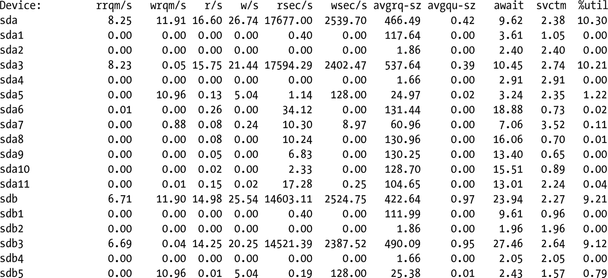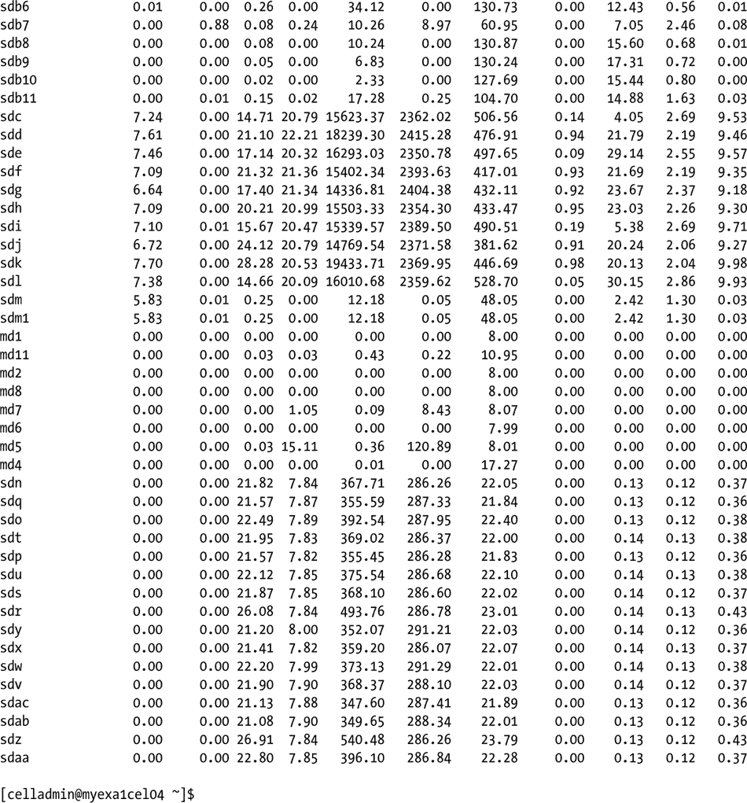

这两份报告都很有用，因为它们报告了不同的监控数据集，在深入排查某些性能问题或错误时可能非常有用。

CPU 报告的格式、显示的列及其含义，请参见表 10-1。

表 10-1. `Iostat` 在 CPU 格式中报告的值

| %user | 显示在用户级别（应用程序）执行时发生的 CPU 利用率百分比。 |
| %nice | 显示在用户级别以 nice 优先级执行时发生的 CPU 利用率百分比。 |
| %system | 显示在系统级别（内核）执行时发生的 CPU 利用率百分比。 |
| %iowait | 显示 CPU 或 CPU 空闲且系统有待处理的磁盘 I/O 请求的时间百分比。 |
| %steal | 显示虚拟 CPU 或 CPU 在虚拟机管理程序为其他虚拟处理器提供服务时处于非自愿等待状态的时间百分比。 |
| %idle | 显示 CPU 或 CPU 空闲且系统没有待处理的磁盘 I/O 请求的时间百分比。 |

设备报告格式如表 10-2 所示。

表 10-2. `Iostat` 在设备格式中报告的值


| 设备： | 此列给出设备（或分区）名称。在 2.2 内核中显示为 `hdiskn`，其中 n 是设备序号。在 2.4 内核中显示为 `devm-n`，其中 m 是设备的主编号，n 是一个区分编号。在更新的内核中，显示为 `/dev` 目录下列出的设备名称。 |
| --- | --- |
| `tps` | 表示每秒向设备发出的传输（transfer）次数。一次传输是针对设备的一个 I/O 请求。多个逻辑请求可以组合成一个针对设备的单次 I/O 请求。传输的大小是不确定的。 |
| `Blk_read/s` | 表示从设备读取的数据量，以每秒块数为单位。在 2.4 及更新的内核中，块（block）等同于扇区（sector），因此大小为 512 字节。在旧内核中，块的大小是不确定的。 |
| `Blk_wrtn/s` | 表示写入设备的数据量，以每秒块数为单位。 |
| `Blk_read` | 读取的总块数。 |
| `Blk_wrtn` | 写入的总块数。 |
| `kB_read/s` | 表示从设备读取的数据量，以每秒千字节数为单位。 |
| `kB_wrtn/s` | 表示写入设备的数据量，以每秒千字节数为单位。 |
| `kB_read` | 读取的总千字节数。 |
| `kB_wrtn` | 写入的总千字节数。 |
| `MB_read/s` | 表示从设备读取的数据量，以每秒兆字节数为单位。 |
| `MB_wrtn/s` | 表示写入设备的数据量，以每秒兆字节数为单位。 |
| `MB_read` | 读取的总兆字节数。 |
| `MB_wrtn` | 写入的总兆字节数。 |
| `rrqm/s` | 每秒合并到设备队列中的读请求数量。 |
| `wrqm/s` | 每秒合并到设备队列中的写请求数量。 |
| `r/s` | 每秒向设备发出的读请求数量。 |
| `w/s` | 每秒向设备发出的写请求数量。 |
| `rsec/s` | 每秒从设备读取的扇区数量。 |
| `wsec/s` | 每秒写入设备的扇区数量。 |
| `rkB/s` | 每秒从设备读取的千字节数。 |
| `wkB/s` | 每秒写入设备的千字节数。 |
| `rMB/s` | 每秒从设备读取的兆字节数。 |
| `wMB/s` | 每秒写入设备的兆字节数。 |
| `avgrq-sz` | 向设备发出的请求的平均大小（以扇区为单位）。 |
| `avgqu-sz` | 向设备发出的请求的平均队列长度。 |
| `await` | 向设备发出的 I/O 请求的平均服务时间（以毫秒为单位）。这包括请求在队列中等待的时间和服务所花费的时间。 |
| `svctm` | 向设备发出的 I/O 请求的平均服务时间（以毫秒为单位）。 |
| `%util` | 发出设备 I/O 请求的 CPU 时间百分比（设备的带宽利用率）。当此值接近 100% 时，表明设备达到饱和。 |
| `ops/s` | 表示每秒向挂载点发出的操作数。 |
| `rops/s` | 表示每秒向挂载点发出的读操作数。 |
| `wops/s` | 表示每秒向挂载点发出的写操作数。 |

基础的设备报告提供 `tps`、`Blk_read/s`、`Blk_wrtn/s`、`Blk_read` 和 `Blk_wrtn` 值。表 10-2 中的其余列表项显示在扩展设备报告中。对于正常运行的 Exadata 系统，您不应该看到很大的 `await` 时间。在我们管理的系统上，对于物理磁盘，看到的最大 `await` 时间大约是 20 到 25 毫秒，对于闪存磁盘则小于 1 毫秒。如果您在某个磁盘上经常看到数百毫秒或更长的 `await` 时间，则需要进行进一步调查，因为该单元可能存在固件不匹配或设备即将故障的问题。

由于数据库服务器不直接访问存储介质，运行 `iostat` 设备报告来诊断磁盘读/写问题不会提供有关 ASM 存储的任何有用信息。但是，不要忘记数据库服务器为所有事务利用 CPU，因此在为存储单元生成 CPU 报告时，也应生成 `iostat` CPU 报告。这样做可以最大程度地减少错过可能仅在数据库服务器上发生的 CPU 相关问题的风险。

`iostat` 报告的设备名称是在被监控服务器的 `/dev` 目录层次结构中找到的名称。哪个单元磁盘映射到哪个设备由 CellCLI 命令 `list celldisk` 报告，该命令指定 `name` 和 `deviceName` 属性，如下所示：

```
CellCLI> list celldisk attributes name, deviceName
         CD_00_myexa1cel04       /dev/sda
         CD_01_myexa1cel04       /dev/sdb
         CD_02_myexa1cel04       /dev/sdc
         CD_03_myexa1cel04       /dev/sdd
         CD_04_myexa1cel04       /dev/sde
         CD_05_myexa1cel04       /dev/sdf
         CD_06_myexa1cel04       /dev/sdg
         CD_07_myexa1cel04       /dev/sdh
         CD_08_myexa1cel04       /dev/sdi
         CD_09_myexa1cel04       /dev/sdj
         CD_10_myexa1cel04       /dev/sdk
         CD_11_myexa1cel04       /dev/sdl
         FD_00_myexa1cel04       /dev/sdv
         FD_01_myexa1cel04       /dev/sdw
         FD_02_myexa1cel04       /dev/sdx
         FD_03_myexa1cel04       /dev/sdy
         FD_04_myexa1cel04       /dev/sdz
         FD_05_myexa1cel04       /dev/sdaa
         FD_06_myexa1cel04       /dev/sdab
         FD_07_myexa1cel04       /dev/sdac
         FD_08_myexa1cel04       /dev/sdr
         FD_09_myexa1cel04       /dev/sds
         FD_10_myexa1cel04       /dev/sdt
         FD_11_myexa1cel04       /dev/sdu
         FD_12_myexa1cel04       /dev/sdn
         FD_13_myexa1cel04       /dev/sdo
         FD_14_myexa1cel04       /dev/sdp
         FD_15_myexa1cel04       /dev/sdq

CellCLI>
```

所示的报告应该在 Exadata 系统上的每个存储单元运行一次，前提是您不将其升级到下一个可用配置，或者您的 Exadata 系统是全机架（Full Rack）。从四分之一机架（Quarter Rack）升级到半机架（Half Rack）或从半机架升级到全机架的系统升级将要求您再次运行该报告，以便可以看到新的设备映射。

了解这些信息可以更轻松地将 `iostat -d` 报告的设备统计信息与 ASM 磁盘和闪存磁盘关联起来。您可能遇到的底层 I/O 问题现在可以通过结合两个实用程序的输出来进行跟踪和诊断。

## 注意事项

Exadata 在数据库层和存储层都提供了良好的监控，提供了大量可用指标，报告系统的许多方面。选择报告哪些指标是一项重要的任务，可以防止您在数据洪流中迷失方向。

为了使监控有效，必须建立一个基线，这样您就有了一个已知的参考点来与后续的监控运行进行比较。与基线进行比较提供了一个坚实的起点，用于衡量性能改进和问题。没有这样的基线，每次分析都是针对一个移动的目标，使得任务比原本需要的更加困难。


Oracle Enterprise Manager 可用于生成报表和图表，以展示随时间变化的性能指标。您仍然需要一个起始基线，而这个基线并非必须是完美性能的状态。请记住：您衡量的是相对于此基线的性能变化。您可能会发现，当性能提升时，您会将那个提升点作为新的基线。

如果安装了 Exadata 存储服务器的系统监控插件，OEM 还能监控存储单元。此插件可能不提供命令行工具的所有指标，但它可以展示存储统计信息和指标随时间的变化情况。

监控也可以通过 Oracle Enterprise Manager 之外的脚本和命令行实用程序来执行，以返回所需数据。存储单元提供了 `cellcli` 和 `cellsrvadmin` 实用程序，可报告存储单元的各个区域。

无论 Oracle 的监测机制多么完善，它都不会报告低级别的 I/O 统计信息，因此需要到操作系统层面去获取这些信息。`iostat` 实用程序可以提供对这种低级别 CPU 和设备活动的洞察。可以生成两份独立的报告，一份针对 CPU，一份针对设备；或者通过调用不带任何命令行参数的 `iostat` 将两份报告合并输出。

`cellcli` 实用程序可以通过 `celldisk` 命令报告哪个单元磁盘映射到哪个硬件设备。值得关注的属性是 name 和 deviceName。了解此映射关系后，您就可以“翻译” `iostat` 设备报告的输出，从而监控 ASM 磁盘，并查看哪些磁盘（如果有的话）可能出现问题。

