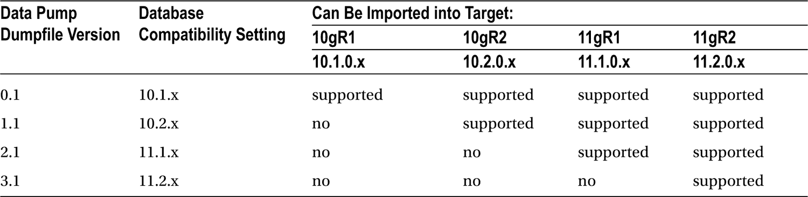

# 数据库迁移至 Exadata：方法、字节序与实践

## 内存存储与字节序基础

如果对这些概念不熟悉，可以思考数据在内存中是如何存储的。存储的最小单位是比特（bit），其值只能是 0 或 1。字节（Byte）是下一个更大的存储单位，由 8 个比特组成。每个数据字节既可以用组成它的比特的二进制值表示，也可以用代表相同值的十六进制数字表示。因此，字符 “w” 可以用十六进制数字 `6F` 或二进制值 `01101111` 表示。在当今大多数通用计算机中，字（word）的长度为 4 字节（32 位），尽管有些硬件架构使用不同长度的字（例如 64 位）。

每个内存地址可以存储 1 字节，因此每个 32 位的字被划分为四个单字节值。操作系统的**字节序**（endian-ness）决定了字节写入内存的顺序。只有两种顺序可选：大端序（big-endian）或小端序（little-endian）。为了说明这一行为，单词 `word` 由以下十六进制数字组成，按字母出现的顺序列出：

```
6F 77 64 72
```

在大端序系统中，字节将按如下顺序写入：

```
6F 77 64 72
```

在小端序系统中，字节顺序将被反转，如下所示：

```
72 64 77 6F
```

如果源系统是大端序，那么将数据文件直接复制到小端序系统将导致数据无法读取，因为目标操作系统会以“错误”的顺序读取字节。Exadata 运行的是 Linux，这是一个小端序操作系统。从大端序操作系统（例如 AIX 或 Solaris）迁移是可能的，但需要使用 RMAN，无论是作为主要迁移工具还是额外实用程序，来将数据文件从大端序格式转换为小端序格式。

## 迁移方法概述

无论源系统的字节序如何，RMAN 都是一个极佳的迁移工具选择，特别是因为可以利用已有的数据库备份过程来生成迁移所需的备份集。将数据库从大端序系统迁移到 Exadata 需要进行一些流程上的更改，以便 RMAN 能够将数据文件转换为小端序格式。这些步骤将在本章后面提供。使用 RMAN 在 Exadata 上实质上克隆源数据库相对较快，并且会迁移所有内部数据库对象，而不考虑数据类型。可能会有一些 RMAN 无法传输的对象，例如 `BFILES` 和目录（directories），并且有办法报告这些对象。可以执行本章后面讨论的附加步骤，以确保这些对象也能被迁移。

当只需要迁移特定模式时，可传输表空间（Transportable tablespaces）也是一个选项。其流程为：确定表空间依赖关系；准备所需和依赖的表空间；导出元数据；传输表空间文件；将表空间元数据导入 Exadata。使用此方法需要在 Exadata 上创建一个空数据库，数据库配置助手（Database Configuration Assistant）可以执行此任务。这些通用步骤将在另一节中详细讨论。

物理备用数据库也可用于将源数据库迁移到 Exadata。基本上使用与标准 RMAN 数据库克隆相同的过程，但需要执行一些用于备用配置和操作的额外步骤。此方法允许您将数据库迁移到 Exadata，并使其与源数据库保持同步，直到期望的切换日期，届时备用数据库将转换为主数据库，所有用户流量将被重定向到 Exadata。此方法也将在本章后面更详细地介绍。

根据要迁移的表空间数量，使用可传输表空间可能不是合适的方法。在我们看来，RMAN 将是物理迁移方法的首选，而数据泵（data pump）则是用于逻辑数据传输的方法。为了辅助此次迁移，Oracle 提供了一个视图 `V$TRANSPORTABLE_PLATFORM`，它列出了 RMAN 可以转换数据文件的操作系统及其字节序。在下一节中，我们将介绍此视图以及如何使用它，通过 RMAN 将数据库从具有不同字节序的系统迁移到运行 Linux 的 Exadata。

## 使用备份进行迁移

可能最简单的方法是利用现有的数据库备份将数据库重新定位到 Exadata，因为备份策略已经就位，并且经过测试可提供可靠的结果。这与使用 RMAN 克隆数据库的过程相同，因此它是可靠且可重复的。

> **注意** 我们发现有必要为备份片（backup pieces）提供外部存储。特别是当您将数据库从大端序平台迁移到 Exadata（一个小端序平台）并使用可传输表空间或 RMAN 时。

查看使用 RMAN 备份将数据库迁移到 Exadata 所涉及的步骤，该过程是直接的。如果源服务器和 Exadata 目标之间可以共用一个通用存储设备，则会更容易，因为无需传输备份片。由于我们为了测试和开发目的克隆数据库，因此可以访问一个外部存储阵列，我们用它来备份所需的数据库。我们将基于此配置进行讨论，除了必须将备份片从源机器复制到 Exadata 之外，其余步骤是相同的。

> **注意** 本节概述的步骤将把数据库迁移到 Exadata 上的单实例数据库。如果您希望迁移后的数据库是集群数据库，则需要执行额外的步骤。这些步骤将在本节末尾介绍，并适用于所描述的两种 RMAN 方法。

在开始之前，需要源数据库的近期备份。此过程还应备份控制文件，并在数据库备份完成后进行。这是必要的，以便在备份后恢复的控制文件中能找到刚进行的备份。您将使用这些控制文件来启动在 Exadata 上的数据库恢复和还原。此外，还需要源数据库的 `init.ora` 或 spfile 的当前副本，以及任何必要的目录组件，例如为源数据库定义的诊断目标（diagnostic destination）。对于正在迁移的 RAC 数据库，必须将每个节点的 `init.ora` 或 spfile 复制到其在 Exadata 系统上的相应位置。我们建议您使用 `tar` 或 `cpio` 来归档源数据库的诊断目标，并将该归档文件传输到 Exadata 进行恢复。可能在某些情况下，无法在 Exadata 系统上复制诊断目标的完整路径。在这种情况下，更改为 `init.ora` 文件中列为 `diagnostic_dest` 的目录，并从该点开始归档。以下是一个名为 TEST 的数据库使用 `tar` 的示例：

```
$ cd /u01/oracle/11.2.0.3
$ tar cvf /obkups/diag_dest.tar ./diag/rdbms/test
```

创建的 `tar` 归档文件将被传输到 Exadata 系统。更改为 DBM 数据库（因为这很可能是您用于传输数据库的 `ORACLE_HOME`）所列出的 `diagnostic_dest`，并恢复 `tar` 归档文件，如下所示：

```
$ cd /u01/oracle/11.2.0
$ tar xvf /obkups/diag_dest.tar
```


### Oracle 数据库迁移至 Exadata：诊断目录与恢复方法

#### 诊断目录结构恢复
此步骤将恢复迁移数据库的`diag`目录结构至 Exadata 系统。剩余工作是将已复制的`init.ora`或 spfile 中的`diagnostic_dest`、`background_dump_dest`、`core_dump_dest`和`user_dump_dest`值更改为新创建的路径。在此过程中，还必须创建本地归档日志目标，并且对该位置字符串的任何必要更改也必须在`init.ora`或 spfile 中完成。

如果迁移的是 RAC 数据库，这些步骤必须在该数据库将运行实例的所有节点上执行。为了更好地说明，假设此 TEST 数据库是一个双节点 RAC 数据库。在数据库节点 1 和数据库节点 2 上，都必须归档`diag`目标。然后，节点 1 的`tar`归档文件将被复制到 Exadata 数据库节点 1，节点 2 的`tar`归档文件将被复制到 Exadata 数据库节点 2。每个节点都需要运行恢复步骤，并且每个`init.ora`或 spfile 副本都必须修改以反映任何位置变更。

#### 恢复至 Exadata 的两种方式
恢复数据库至 Exadata 可以通过两种方式完成：一是使用最近备份的备份片进行简单的还原与恢复会话；二是使用`duplicate database`命令，这需要作为辅助实例连接到源数据库。我们假设，如果您能将备份片从源服务器复制到 Exadata，那么您也拥有一个有效的 SQL*Net 连接到源数据库。我们将从一个基本的还原与恢复场景开始。

##### 方法一：备份还原与恢复
如前所述，第一步是确保备份片的可用性。假设它们已在 Exadata 系统上可用。准备好`init.ora`或 spfile 后，有必要从当前备份中还原控制文件。记下控制文件备份片的名称，然后执行以下命令：

```sql
RMAN> restore controlfile from '<backup piece name>';
```

您应看到以下输出：

```
Starting restore at 27-JUL-13
 using channel ORA_DISK_1

channel ORA_DISK_1: restoring control file
 channel ORA_DISK_1: restore complete, elapsed time: 00:00:02
 Finished restore at 27-JUL-13
```

现在，您可以启动并装载数据库，为还原和恢复做准备。如果源数据库是 RAC 数据库，则需要在开始还原和恢复之前将`cluster_database`参数设置为`false`。这是因为数据库必须以独占模式装载才能成功还原。从这一步开始，就是一个标准的还原与恢复场景，假设`init.ora`或 spfile 中的所有配置参数都列出了 Exadata 系统上的正确位置，那么应该可以顺利完成。如果您在迁移前将`cluster_database`设置为`false`，那么在恢复完成后需要将其设置回`true`。

##### 方法二：从源库克隆
您可以选择从源数据库克隆数据库。`init.ora`或 spfile 必须从源数据库复制，以便数据库可以在 Exadata 系统上以`nomount`模式启动。同样，如果迁移的是 RAC 数据库，`cluster_database`参数必须在开始克隆前设置为`false`。

克隆过程使用 RMAN 的`duplicate database`命令。以下示例命令展示了如何将远程服务器上的 mytest 数据库复制到 Exadata 上名为 test 的数据库（两个数据库都使用 ASM）：

```sql
connect target sys/<password>@mytest
connect auxiliary /
run {
  sql 'alter session set optimizer_mode=rule';
  allocate auxiliary channel c1 type disk ;
  allocate auxiliary channel c2 type disk ;
  allocate auxiliary channel c3 type disk ;
  allocate auxiliary channel c4 type disk ;
  allocate auxiliary channel c5 type disk ;
  allocate auxiliary channel c6 type disk ;
  duplicate target database to 'test'
        db_file_name_convert=('+DATA','+DATA_MYEXA1')
        logfile
           GROUP 11 ( '+DATA_MYEXA1','+RECO_MYEXA1' ) SIZE 512M,
           GROUP 12 ( '+DATA_MYEXA1','+RECO_MYEXA1' ) SIZE 512M,
           GROUP 13 ( '+DATA_MYEXA1','+RECO_MYEXA1' ) SIZE 512M,
           GROUP 14 ( '+DATA_MYEXA1','+RECO_MYEXA1' ) SIZE 512M ;
}
```

#### 监控与进度查看
也可以编写一个 Shell 脚本来完成此操作，使其更容易从单个会话中运行和监控进度。Shell 脚本示例如下：

```bash
export NLS_DATE_FORMAT='Mon DD YYYY HH24:MI:SS'
DATESTAMP=`date '+%y%m%d%H%M'`
MSGLOG=/home/oracle/clone/logs/dup_mytest_${DATESTAMP}.log

$ORACLE_HOME/bin/rman msglog $MSGLOG append << EOF
connect target sys/<password>@mytest
connect auxiliary /
run {
  sql 'alter session set optimizer_mode=rule';
  allocate auxiliary channel c1 type disk ;
  allocate auxiliary channel c2 type disk ;
  allocate auxiliary channel c3 type disk ;
  allocate auxiliary channel c4 type disk ;
  allocate auxiliary channel c5 type disk ;
  allocate auxiliary channel c6 type disk ;
  duplicate target database to 'test'
        db_file_name_convert=('+DATA','+DATA_MYEXA1')
        logfile
           GROUP 11 ( '+DATA_MYEXA1','+RECO_MYEXA1' ) SIZE 512M,
           GROUP 12 ( '+DATA_MYEXA1','+RECO_MYEXA1' ) SIZE 512M,
           GROUP 13 ( '+DATA_MYEXA1','+RECO_MYEXA1' ) SIZE 512M,
           GROUP 14 ( '+DATA_MYEXA1','+RECO_MYEXA1' ) SIZE 512M ;
}
EOF
```

此脚本将在目标数据库已启动至`nomount`状态后运行，并以后台的“不挂断”模式运行。如果此脚本被命名为`clone_test_from_mytest.sh`并位于`/home/oracle/clone`目录中，那么运行它的命令如下：

```bash
$ nohup $HOME/clone/clone_test_from_mytest.sh &
```

克隆过程现在将在后台运行，控制权将返回到 Shell 提示符，因此您可以通过生成的日志文件监控进度。可以通过以下命令完成：

```bash
$ cd $HOME/clone/logs
$ ls -ltr *mytest*
...
dup_mytest_201307271343.log
$ tail -f dup_mytest_201307271343.log
```

`tail -f`命令用于持续读取正在被写入的文件内容，以便您可以实时查看新条目。所说明的脚本也可用于刷新现有的目标数据库。如果使用 Oracle 托管文件（在 Exadata 上即如此），则需要在开始克隆之前删除目标数据库的现有文件，因为复制过程不会覆盖数据文件。所有其他步骤将如本节前面所述执行。

#### 使用 RMAN 迁移的优势
使用 RMAN 将数据库迁移至 Exadata 的一个很好的理由是，您可以在需要时更改数据文件的“字节序”。Exadata 使用 Linux，一个小端操作系统，但您可能正从 AIX（一个大端系统）迁移。这将要求更改数据文件格式，而 RMAN 可以为您完成此任务。您将需要可用的外部存储来存放从源数据库转换出的数据文件，因为 Exadata 上没有足够的文件系统存储空间。此过程的第一步是查看支持哪些平台，`V$TRANSPORTABLE_PLATFORM`视图提供了此信息，如下所示：

```sql
SQL> select platform_name, endian_format
  2  from v$transportable_platform;
```


### 数据库跨平台迁移操作指南

#### 支持平台与字节序格式

下表列出了 `RMAN` 支持的数据文件传输平台及其字节序格式。

平台名称                                 字节序格式
--------------------------------------------- --------------
Solaris[tm] OE (32 位)                       大端
Solaris[tm] OE (64 位)                       大端
Microsoft Windows IA (32 位)                 小端
Linux IA (32 位)                             小端
AIX-Based Systems (64 位)                    大端
HP-UX (64 位)                                大端
HP Tru64 UNIX                               小端
HP-UX IA (64 位)                             大端
Linux IA (64 位)                             小端
HP Open VMS                                 小端
Microsoft Windows IA (64 位)                 小端

平台名称                                 字节序格式
--------------------------------------------- --------------
IBM zSeries Based Linux                     大端
Linux x86 64 位                              小端
Apple Mac OS                                大端
Microsoft Windows x86 64 位                  小端
Solaris Operating System (x86)              小端
IBM Power Based Linux                       大端
HP IA Open VMS                              小端
Solaris Operating System (x86-64)           小端
Apple Mac OS (x86-64)                       小端

已选择 20 行。

SQL>

#### 检查无法传输的对象

`RMAN` 可以在列表中的任意平台之间传输数据文件，从 `AIX` 迁移到 `Linux` 是可行的。下一步是检查 `RMAN` 无法传输的数据库对象，例如目录、`BFILES` 和外部表。以下 `PL/SQL` 块将显示这些对象：

```sql
SQL> set serveroutput on
SQL> declare
  2    x boolean;
  3  begin
  4    x := sys.dbms_tdb.check_external;
  5  end;
  6  /
The following directories exist in the database:
SYS.ADMIN_BAD_DIR, SYS.ADMIN_LOG_DIR, SYS.ADMIN_DAT_DIR, SYS.XMLDIR, SYS.DATA_PUMP_DIR, SYS.ORACLE_OCM_CONFIG_DIR

PL/SQL procedure successfully completed.

SQL>
```

注意，此 `PL/SQL` 报告了六个目录，这些目录在数据库迁移到 `Exadata` 后必须重新创建。这些目录在迁移到 `Exadata` 后很可能有新的位置，因此不仅数据库中的目录位置需要更改，目录本身也必须在 `Exadata` 系统上创建。一个简单的查询可以生成必要的 `CREATE DIRECTORY` 语句，如下所示：

```sql
SQL> column cr_dir format a132
SQL>
SQL> select 'create or replace directory '||directory_name||' as '''||directory_path||''';' cr_dir
  2  from dba_directories;

CR_DIR

create or replace directory ADMIN_LOG_DIR as '/u01/oracle/directories/log';
create or replace directory ADMIN_BAD_DIR as '/u01/oracle/directories/bad';
create or replace directory XMLDIR as '/u01/oracle/directories/rdbms/xml';
create or replace directory ADMIN_DAT_DIR as '/u01/oracle/directories/dat';
create or replace directory DATA_PUMP_DIR as '/u01/oracle/admin/mydb/dpdump/';
create or replace directory ORACLE_OCM_CONFIG_DIR as '/u01/oracle/directories/ccr/state';

已选择 6 行。

SQL>
```

将此输出假脱机到一个文件，并编辑目标文本以指向 `Exadata` 上新创建的位置。然后，在迁移后的数据库中运行生成的脚本来重新创建这些目录就是一项简单的任务。

#### 转换数据库文件

你必须在可用的外部存储上为转换后的数据库文件创建一个目标位置。在本例中，我们将使用 `/obkups/db_convert` 作为这些文件的目标目录。获取源数据库的当前备份，然后关闭源数据库并以只读模式启动。将 `RMAN` 连接到目标数据库并执行 `CONVERT DATABASE` 命令，如下所示：

```
CONVERT DATABASE NEW DATABASE 'mydb'
          TRANSPORT SCRIPT '/obkups/db_convert/migratedb.sql'
          TO PLATFORM 'Linux IA (64-bit)'
          DB_FILE_NAME_CONVERT = ('/home/oracle/dbs','/obkups/db_convert');
```

`RMAN` 将转换数据库文件并将其放置在 `/obkups/db_convert` 目录中，同时生成一个 `pfile` 副本和迁移脚本。如果外部存储并非两台服务器共享，则必须将这些文件传输到 `Exadata` 系统。一旦所有生成的文件传输完毕，你将需要编辑迁移脚本以启用受限会话。一个包含编辑内容的示例迁移脚本如下：

```
-- 以下命令将创建一个控制文件并用它
-- 来打开数据库。
-- 恢复管理器使用的数据将丢失。
-- 联机日志的内容将丢失，所有备份将
-- 失效。仅当联机日志损坏时使用此脚本。

-- 挂载创建的控制文件后，以下 SQL
-- 语句将数据库置于适当的
-- 保护模式：
--  ALTER DATABASE SET STANDBY DATABASE TO MAXIMIZE PERFORMANCE

STARTUP NOMOUNT PFILE='init_00bz4glk_1_0.ora'
CREATE CONTROLFILE REUSE SET DATABASE "MYDB" RESETLOGS  NOARCHIVELOG
    MAXLOGFILES 32
    MAXLOGMEMBERS 2
    MAXDATAFILES 32
    MAXINSTANCES 1
    MAXLOGHISTORY 226
LOGFILE
  GROUP 1 '/obkups/db_convert/archlog1'  SIZE 25M,
  GROUP 2 '/obkups/db_convert/archlog2'  SIZE 25M
DATAFILE
  '/obkups/db_convert/system01.dbf',
  '/obkups/db_convert/sysaux01.dbf',
  '/obkups/db_convert/mydatatbs01.dbf',
  '/obkups/db_convert/mydatatbs02.dbf',
  '/obkups/db_convert/mydatatbs03.dbf'
CHARACTER SET AL32UTF8
;

-- 添加了 ALTER SYSTEM 语句以启用受限会话。

ALTER SYSTEM ENABLE RESTRICTED SESSION;

-- 现在可以通过清零联机日志来打开数据库。
ALTER DATABASE OPEN RESETLOGS;

-- 未找到要添加的临时文件条目。
--

set echo off
prompt ∼∼∼∼∼∼∼∼∼∼∼∼∼∼∼∼∼∼∼∼∼∼∼∼∼∼∼∼∼∼∼∼∼∼∼∼∼∼∼∼∼∼∼∼∼∼∼∼∼∼∼∼∼∼∼∼∼∼∼∼∼∼∼∼∼∼∼
prompt * 你的数据库已成功创建！
prompt * 对于新数据库有许多需要考虑的事项。以下
prompt * 是一份检查清单，帮助你保持正轨：
prompt * 1. 你可能需要重新定义目录对象的位置。
prompt * 2. 你可能需要更改此数据库的内部数据库标识符 (DBID)
prompt *    或全局数据库名称。请使用
prompt *    NEWDBID 实用程序 (nid)。
prompt ∼∼∼∼∼∼∼∼∼∼∼∼∼∼∼∼∼∼∼∼∼∼∼∼∼∼∼∼∼∼∼∼∼∼∼∼∼∼∼∼∼∼∼∼∼∼∼∼∼∼∼∼∼∼∼∼∼∼∼∼∼∼∼∼∼∼∼

SHUTDOWN IMMEDIATE
-- UPGRADE 选项设置受限会话
STARTUP UPGRADE PFILE='init_00bz4glk_1_0.ora'
@@ ?/rdbms/admin/utlirp.sql
SHUTDOWN IMMEDIATE
-- 注意：下面的启动命令生成时没有 RESTRICT 子句。
-- 添加 RESTRICT 子句。
STARTUP RESTRICT PFILE='init_00bz4glk_1_0.ora'
-- 以下步骤将重新编译所有 PL/SQL 模块。
-- 可能需要几个小时才能完成。
@@ ?/rdbms/admin/utlrp.sql
set feedback 6;
```

#### 将数据文件移动到 ASM 磁盘组

此时数据库应使用文件系统创建，而非 `ASM`，因此现在需要将数据文件移动到正确的 `ASM` 磁盘组中。复制由前述 `RMAN CONVERT` 过程生成的 `pfile`。使用 `RMAN`，你将需要进行另一次备份，这次使用类似于以下示例的脚本：

```
RUN
{
  ALLOCATE CHANNEL dev1 DEVICE TYPE DISK;
  ALLOCATE CHANNEL dev2 DEVICE TYPE DISK;
  ALLOCATE CHANNEL dev3 DEVICE TYPE DISK;
  ALLOCATE CHANNEL dev4 DEVICE TYPE DISK;
  BACKUP AS COPY
    INCREMENTAL LEVEL 0
    DATABASE
    FORMAT '+DATA_MYEXA1'
    TAG 'ASM_DB_MIG';
}
```

这将把文件系统的数据库文件放入 `+DATA_MYEXA1` 磁盘组。通过 `RMAN` 归档当前日志，如下所示：

```sql
SQL "ALTER SYSTEM ARCHIVE LOG CURRENT";
```

你正在使用 `pfile`，因此有必要在 `ASM` 磁盘组中创建一个 `spfile`。使用以下示例创建新的 `spfile`：

```
CREATE SPFILE='+DATA_MYEXA1/spfile<sid>.ora'
FROM PFILE='/obkups/db_convert/'init_00bz4glk_1_0.ora';
```

现在可以干净地关闭数据库了。在 `$ORACLE_HOME/dbs` 目录中创建一个新的 `init<sid>.ora` 文件，内容如下：

```
SPFILE='+DATA_MYEXA1/spfile<sid>.ora'
```


您需要将以下示例中列出的 `spfile` 参数设置为 ASM 位置，如下所示：

```
STARTUP FORCE NOMOUNT;
ALTER SYSTEM SET DB_CREATE_FILE_DEST='+DATA_MYEXA1' SID='*';
ALTER SYSTEM SET DB_RECOVERY_FILE_DEST_SIZE=100G SID='*';
ALTER SYSTEM SET DB_RECOVERY_FILE_DEST='+RECO_MYEXA1' SID='*';
ALTER SYSTEM SET CONTROL_FILES='+DATA_MYEXA1','+RECO_MYEXA1' SCOPE=SPFILE SID='*';
```

现在您可以切换到 RMAN，将控制文件迁移到 ASM 中（如下所示），并挂载数据库。

```
RMAN> STARTUP FORCE NOMOUNT;
RMAN> RESTORE CONTROLFILE FROM '<original control file name and path>';
RMAN> ALTER DATABASE MOUNT;
```

使用 RMAN，切换到已迁移的数据文件（如下所示），并恢复数据库。

```
SWITCH DATABASE TO COPY;
RUN
{
  ALLOCATE CHANNEL dev1 DEVICE TYPE DISK;
  ALLOCATE CHANNEL dev2 DEVICE TYPE DISK;
  ALLOCATE CHANNEL dev3 DEVICE TYPE DISK;
  ALLOCATE CHANNEL dev4 DEVICE TYPE DISK;
  RECOVER DATABASE;
}
```

数据库恢复完成后，您可以退出 RMAN，使用 `SQL*Plus` 连接，并打开数据库。此时，您的数据库应已成功迁移到 Exadata 和 ASM。接下来的步骤是删除旧的临时文件并在 ASM 中重新创建它们，如下所示：

```
SQL> ALTER DATABASE TEMPFILE '<existing tempfile name>' DROP;
SQL> ALTER TABLESPACE temp_tbs_name ADD TEMPFILE;
```

您必须逐个删除每个临时文件。如果您愿意，可以编写脚本来自动生成用于删除所有临时文件的 `ALTER DATABASE` 语句。新的临时文件将是 Oracle 托管文件，这使得 `ADD TEMPFILE` 语句成为一条您可以根据需要执行任意多次的单一命令，以提供所需的临时空间。最后，您必须将重做日志组迁移到 ASM 并删除旧的重做日志组。完成后，干净地关闭并重新启动数据库，以确保存储或 ASM 没有问题。

Exadata 在设计时就考虑了 RAC。此时，您迁移的数据库（无论是通过直接从备份克隆还是从不同平台迁移而来）是一个单实例数据库。可以通过以下步骤将其转换为 RAC。要开始此过程，需要对 `spfile` 进行一些更改。必须设置 `cluster_database`、`cluster_database_instances` 和 `instance_number` 参数，如下所示：

```
ALTER SYSTEM SET CLUSTER_DATABASE='TRUE' SID='*' SCOPE=SPFILE;
ALTER SYSTEM SET CLUSTER_DATABASE_INSTANCES=<number of instances> SID='*' SCOPE=SPFILE;
```

以下语句需要针对集群中的每个实例进行编辑和运行：

```
ALTER SYSTEM SET INSTANCE_NUMBER=<instance number> SID='<instance_name>' SCOPE=SPFILE;
```

干净地关闭本地实例。在所有将运行此数据库实例的节点上，您必须放置一份您刚刚创建的 `init.ora` 文件副本，并修改文件名以反映本地实例的 `SID`。下一步是使用 `srvctl` 实用程序向集群服务注册数据库。`db_unique_name`、Oracle 主目录、实例名称和 `spfile` 是必需的参数。以下示例演示了为数据库节点 `myexa1db01` 添加数据库 `mydb` 和实例 `mydb1`：

```
srvctl add database -d mydb -i mydb1 -o /u01/oracle/product/11.2.0/dbhome_1 -p /u01/oracle/product/11.2.0/dbhome_1/dbs/initmydb1.ora
```

对于集群中将运行此数据库实例的每个节点，都需要重复上述步骤，并相应地更改实例名称和 `pfile` 文件名。接下来，需要启用数据库，如下所示：

```
srvctl enable database -d mydb
```

现在，您应该能够使用 `srvctl` 启动集群数据库，如下所示：

```
srvctl start database -d mydb
```

数据库应成功在所有节点上启动。您现在已将数据库迁移到 Exadata 并将其转换为 RAC。通过使用 `lsnrctl status` 命令，确保监听器和 SCAN 监听器已注册这个新数据库，该命令可以报告常规 `TNS` 监听器和本地 `SCAN` 地址的可用状态和服务。以下示例展示了如何返回在双节点 `RAC` 集群数据库上注册到 `SCAN` 监听器地址 `LISTENER_SCAN2` 的数据库服务。

```
$ lsnrctl status listener_scan2

LSNRCTL for Linux: Version 11.2.0.3.0 - Production on 04-OCT-2013 14:58:55

Copyright (c) 1991, 2011, Oracle.  All rights reserved.

Connecting to (DESCRIPTION=(ADDRESS=(PROTOCOL=IPC)(KEY=LISTENER_SCAN2)))
STATUS of the LISTENER

Alias                     LISTENER_SCAN2
Version                   TNSLSNR for Linux: Version 11.2.0.3.0 - Production
Start Date                03-OCT-2013 15:25:02
Uptime                    0 days 23 hr. 33 min. 53 sec
Trace Level               off
Security                  ON: Local OS Authentication
SNMP                      OFF
Listener Parameter File   /u01/11.2.0/grid/network/admin/listener.ora
Listener Log File         /u01/11.2.0/grid/log/diag/tnslsnr/myexa1db01/listener_scan2/alert/log.xml
Listening Endpoints Summary...
  (DESCRIPTION=(ADDRESS=(PROTOCOL=ipc)(KEY=LISTENER_SCAN2)))
  (DESCRIPTION=(ADDRESS=(PROTOCOL=tcp)(HOST=XXX.XXX.XXX.XXX)(PORT=1523)))
Services Summary...
Service "dbm" has 2 instance(s).
  Instance "dbm1", status READY, has 2 handler(s) for this service...
  Instance "dbm2", status READY, has 1 handler(s) for this service...
Service "mydb" has 2 instance(s).
  Instance "mydb1", status READY, has 1 handler(s) for this service...
  Instance "mydb2", status READY, has 1 handler(s) for this service...
The command completed successfully
$
```

`mydb` 集群数据库已成功注册到 `SCAN` 监听器，并且可以远程访问。

**传输表空间**

可传输表空间对于迁移特定模式或数据子集的数据非常有用，甚至可以跨不同的操作系统平台。但是，要跨平台迁移，还必须使用 RMAN 将数据文件转换为正确的字节序格式。

可传输表空间的过程并不复杂，但在移动之前确实涉及几项检查。第一项检查确定目标表空间中的对象是否是自包含的，意思是说在其他未被考虑为目标表空间中不存在依赖关系。Oracle 提供了一个打包过程 `DBMS_TTS.TRANSPORT_SET_CHECK` 来报告此信息。例如，`RETAIL_1` 和 `RETAIL_2` 表空间需要迁移到 Exadata。要确定此表空间集是否存在任何其他依赖关系，您需要执行以下语句：

```
EXECUTE DBMS_TTS.TRANSPORT_SET_CHECK('retail_1,retail_2', TRUE);
```

查询 `TRANSPORT_SET_VIOLATIONS` 视图将报告此表空间集的任何问题。

```
SQL> SELECT * FROM TRANSPORT_SET_VIOLATIONS;

VIOLATIONS

Constraint SALES_FK between table STORES.SALES in tablespace RETAIL_1 and table
STORES.UNIT in tablespace UNITLOC
Partitioned table STORES.MON_SALES is partialy contained in the transportable set
```

输出报告指出 `UNITLOC` 表空间也必须包含在表空间集中，并且需要进行一些调查以找到包含 `STORES.MON_SALES` 表分区的所有表空间。第二次尝试，在传输集中包含了 `UNITLOC` 以及 `SALESPART_1`、`SALESPART_2` 和 `SALESPART_3` 表空间，成功了，如下例所示：

```
EXEC DBMS_TTS.TRANSPORT_SET_CHECK('retail_1,retail_2,unitloc,salespart_1,salespart_2,salespart_3', TRUE);

PL/SQL procedure successfully completed.

SQL> SELECT * FROM TRANSPORT_SET_VIOLATIONS;

no rows selected
```


### 数据库迁移至 Exadata 的步骤与注意事项

#### 可传输表空间设置与导出

现在您拥有一个完整的可传输表空间集，确保所有数据和约束都将被传输到目标数据库。下一步是确保无法再针对源数据执行事务，方法是通过以下语句将所需的表空间设置为只读：

```
alter tablespace retail_1 read only;
alter tablespace retail_2 read only;
alter tablespace unitloc read only;
alter tablespace salespart_1 read only;
alter tablespace salespart_2 read only;
alter tablespace salespart_3 read only;
```

现在可以导出表空间元数据以备导入目标数据库。在源系统上使用`expdp`生成此元数据导出，并使用`TRANSPORT_TABLESPACES`选项，如下所示：

```
expdp system/password DUMPFILE=retail_data.dmp DIRECTORY=tstrans_dir
transport_tablespaces = retail_1,retail_2,unitloc,salespart_1,salespart_2,salespart_3
transport_full_check=y
```

使用`TRANSPORT_FULL_CHECK=Y`选项会验证您之前进行的表空间检查。如果可传输表空间检查因任何原因失败，导出将终止并不成功。尽管如果您没有从`DBMS_TTS.TRANSPORT_SET_CHECK`过程获得任何输出，这不应该发生，但这是在传输表空间时执行的非常好的二次检查，以确保表空间迁移到 Exadata 后不会出现问题。对于本示例，`TSTRANS_DIR`位置指向`/obkups/tablespaces`，该目录将用作文件传输到 Exadata 的源目录。

#### 复制表空间文件到 Exadata

如果源系统和目标系统具有相同的字节顺序（endian-ness），那么就可以将表空间文件和元数据导出文件复制到 Exadata 了。如果源表空间使用 ASM，则必须将它们从 ASM 复制到文件系统以便传输。这与我们之前提供的将数据迁入 ASM 的步骤相反。示例如下：

```
RUN
{
  ALLOCATE CHANNEL dev1 DEVICE TYPE DISK;
  ALLOCATE CHANNEL dev2 DEVICE TYPE DISK;
  ALLOCATE CHANNEL dev3 DEVICE TYPE DISK;
  ALLOCATE CHANNEL dev4 DEVICE TYPE DISK;
  BACKUP AS COPY
    INCREMENTAL LEVEL 0
    DATAFILE file1,file2,...
    FORMAT '/obkups/tablespaces/'
    TAG 'FS_TBLSPC_MIG';
}
```

您需要生成所需数据文件的列表，以便修改提供的示例来复制所需的数据文件。执行修改后的语句以将 ASM 数据文件复制到所需目录。在本示例中，用于传输的目录是`/obkups/tablespaces`。现在，您应该拥有将表空间传输到 Exadata 所需的所有文件。使用`scp`将`/obkups/tablespaces`的内容复制到连接到 Exadata 系统的外部位置。使用与您将数据文件移出 ASM 时相同的基本命令，将传输过来的数据文件复制到 ASM 中，但将目标更改为您想要的 Exadata ASM 磁盘组。您需要一份刚刚复制到 ASM 的数据文件的当前列表，以便元数据导入能够成功完成。获得该列表后，修改以下示例，并使用`impdp`导入元数据：

```
impdp system/password DUMPFILE=retail_data.dmp DIRECTORY=tstrans_dir
TRANSPORT_DATAFILES=
   +DATA_MYEXA1/file1,
   +DATA_MYEXA1/file2,
...
```

期望的情况是，您已在目标数据库中创建了源数据库的必要用户账户，包括所有必要的权限。`impdp`实用程序不会创建这些账户，因此在执行导入之前它们必须存在。导入成功完成后，您需要将表空间设置回读/写模式，如下所示：

```
alter tablespace retail_1 read write;
alter tablespace retail_2 read write;
alter tablespace unitloc read write;
alter tablespace salespart_1 read write;
alter tablespace salespart_2 read write;
alter tablespace salespart_3 read write;
```

### 使用物理备数据库进行迁移

物理备数据库是一个很好的迁移策略选择，如果数据库需要在应用程序迁移日期之前迁移到新系统。使用备数据库可以在旧生产系统和新生产系统之间保持数据同步，并允许在最终迁移之前进行连接测试。创建备数据库的过程基本上与本章前面提供的使用 RMAN 的过程相同。需要额外的步骤来配置辅助归档日志目的地、备用重做日志和重做传输。这些步骤在此不作讨论，因为它们在[Oracle 在线文档](https://docs.oracle.com)中可用。

使用 Oracle 11.2.0.3，可以通过执行切换（switchover）来测试新数据库而不影响备数据库配置。这暂时允许备数据库承担主数据库的角色，提供了一个测试配置并在最终迁移发生前对环境进行必要调整的机会。这还允许您切换回主数据库而无需重建数据库。

在切换日期，将需要故障转移（failover）到备用位置，将备用数据库转换为主数据库。这将是一个“单向”移动，因为源数据库将不再使用，并且不需要重建。

## 迁移后任务

包、过程和视图可能因迁移而失效，因此需要重新编译这些对象并纠正可能出现的任何问题。最好在迁移之前生成源数据库中无效对象的列表。这将使您更容易知道何时成功从源数据库还原了所有有效的已迁移对象。以下脚本将生成该列表：

```
select owner, object_name, object_type, status
from dba_objects
where status <> 'VALID';
```

将输出假脱机到文件以供稍后参考，并将该文件传输到 Exadata。在迁移后的数据库上再次运行相同的查询，并执行`$ORACLE_HOME/rdbms/admin/utlrp.sql`以重新编译数据库对象，纠正任何问题，直到最终的`INVALID`对象列表与从源数据库生成的列表匹配。

如果您使用物理备数据库将数据库迁移到 Exadata，则必须删除为建立备数据库所必需的`spfile`参数，并可能调整控制文件位置以引用多个副本。（通常，备数据库使用单个备用控制文件。）将现有控制文件复制到这些附加位置。

已弃用的`init.ora`参数也可能是个问题，因为源数据库可能是 11.2.0.3 之前的版本（Exadata 上的当前版本）。警报日志是查找此类参数的好地方，以便可以相应地处理它们。

尽管`BFILE`列将被复制，但它们指向的源文件不会被复制。这些文件将必须复制到 Exadata 系统，并且一旦数据库可以访问它们，`BFILE`定位器将必须根据新位置重新分配。

您可能会发现可能需要其他管理任务，例如调整 extent 大小、对大表进行分区或压缩表（例如存档表或存档分区）。这些任务也是迁移后列表的一部分。调整 extent 大小和创建分区可能需要相当长的时间，特别是对于大型数据库。在规划数据库迁移到 Exadata 时，请考虑此类任务，以便最终用户能够意识到在实际物理迁移之后，数据库可用之前可能仍存在一些任务。

## 逻辑迁移选项

逻辑迁移也是迁移至 Exadata 的一种选择。此类迁移将涉及导出和导入、复制或数据库链接。以下部分将介绍这些选项。

### 导出和导入


### Oracle 数据库迁移至 Exadata：逻辑迁移方法

#### 导出与导入工具的选择

可用的导出和导入工具取决于您迁移的 Oracle 版本。对于 10.1 之前的版本，可以使用传统的导出和导入实用程序（`exp` 和 `imp`）。这些工具在所有当前的 Oracle 版本中都提供，以保持向后兼容性。对于 10.1 及之后的版本，应使用较新的数据泵实用程序（`expdp` 和 `impdp`）。

采用导出-导入策略需要在 Exadata 系统上创建一个空数据库。这可以通过数据库配置助手（`DBCA`）来完成，该工具可以创建单实例和集群数据库。我们建议创建一个新的集群数据库，因为 Exadata 是为`RAC`构建的。我们不会详细介绍如何使用`DBCA`创建数据库，因为过程很直接，且图形用户界面（`GUI`）很直观。

当使用 `exp` 和 `imp` 工具迁移较旧的数据库时，必须在导入任何表和数据之前，在新的 Exadata 数据库中创建用户账户。如果您能使用 `expdp` 和 `impdp` 工具，则不需要此步骤，因为导出用户时会导出创建该用户的命令，这些命令将在导入过程中执行。

旧版导出-导入工具的兼容性矩阵如 表 12-1 所示。

**表 12-1。`exp` 和 `imp` 工具的兼容性矩阵**

| 目标版本 | 源版本 |
| --- | --- |
|  | &#124;  7 &#124; 8i &#124; 9i &#124; 10g &#124; 11g |
| 7 | &#124;yes &#124; no &#124; no &#124; no  &#124; no |
| 8i | &#124;yes &#124;yes &#124; no &#124; no  &#124; no |
| 9i | &#124;yes &#124;yes &#124;yes &#124; no  &#124; no |
| 10g | &#124;yes &#124;yes &#124;yes &#124; yes &#124; no |
| 11g | &#124;yes &#124;yes &#124;yes &#124; yes &#124; yes |

正如预期的那样，旧版本不具备向前兼容性，因此无法将 8i 数据库的导出文件导入到使用版本 7 的数据库中。但是，您始终可以使用最旧版本的 `exp` 和 `imp` 工具，后续版本将能够读取和处理生成的转储文件。

表 12-2 列出了 `expdp` 和 `impdp` 工具的兼容性矩阵。

**表 12-2。`expdp` 和 `impdp` 工具的兼容性矩阵**



在规划使用导出和导入工具进行逻辑迁移时，请参考这些矩阵，以避免导出和导入过程中出现问题。

#### 导出策略与注意事项

如果您使用导出-导入策略，很可能只传输数据库数据和表的一个子集。建议按模式或用户导出，而不是按表名导出，因为导出特定用户会捕获该账户拥有的所有内部对象。正如本章前面讨论的，可能需要重新创建目录并将`BFILES`传输到 Exadata 系统，因为这些对象不会在导入时创建。对于目录，创建目录的`DDL`语句*会被捕获*。但该`DDL`中引用的位置在 Exadata 上将不存在，这些位置必须在导入完成后创建。如果您无法在 Exadata 上创建与源服务器相同的位置，则必须创建新位置，然后重新创建这些目录以指向新目录。

对于给定的用户账户，可能存在跨模式依赖关系。如果是这种情况，某些对象（如视图和完整性约束）将无法编译并变为无效。`DBA_DEPENDENCIES`视图对于查找此类依赖关系非常有用，这样您就可以导出必要的用户，以保持迁移后模式中对象的有效性。可以通过以下查询生成被给定用户引用的对象的所有者列表：

```sql
select distinct referenced_owner
from dba_dependencies
where owner = '<user account>'
and referenced_owner <> '<user account>';
```

如果您更希望获得对象列表以减小导出文件的大小，可以使用以下查询：

```sql
select referenced_owner, referenced_name, referenced_type
from dba_dependencies
where owner = '<user account>'
and referenced_owner <> '<user account>';
```

这将生成对象名称、对象类型和所有者的列表，因此只有这些对象会包含在导出文件中。请记住，如果您只导出选定的对象列表，则必须在原始用户导出之后执行额外的导出操作，以将应用程序表和数据传输到 Exadata。以下示例针对 11.2.0.3 数据库说明了这一概念：

```bash
#
##### 导出应用程序用户
#
expdp directory=dbmig_dir schemas=$1 dumpfile="$1"_mig.dmp logfile="$1"_mig.log

#
##### 导出不被应用程序用户拥有的依赖对象
#
expdp directory=dbmig.dir dumpfile="$1"_"$2".dmp logfile="$1"_"$2".log tables="$3"
```

此示例接受三个参数：两个用户名和一个逗号分隔的表列表，并假定该表列表相当短。例如，如果只需要排除少量表，命令可以这样编写：

```bash
expdp directory=dbmig.dir schemas=$2 dumpfile="$1"_"$2".dmp logfile="$1"_"$2".log exclude="$3"
```

现在，表列表是一个排除列表，参数 2 中指定用户的所有表都将被导出，除了提供的列表中的表。转储文件应按相反顺序导入，即先导入依赖表所属的用户，再导入应用程序用户。这将允许导入过程为应用程序用户创建并验证约束和视图，而不会出错。

### 复制

复制是将数据库逻辑迁移到 Exadata 的另一种方法，我们推荐使用`Streams`或`Golden Gate`进行此类迁移。由于`Golden Gate`内置了所有`Streams`功能，它是更健壮的工具。我们不会详细介绍`Golden Gate`迁移场景，但会提及这种迁移类型需要注意的几个方面。

`Golden Gate`和`Streams`都对可复制到目标服务器的数据类型施加了限制。以下类型将不会被复制：

```text
BFILE
ROWID
用户定义的类型（包括对象类型、REF、varrays 和嵌套表）
以关系形式或二进制 XML 存储的 XMLType
以下 Oracle 提供的类型：Any 类型、URI 类型、空间类型和媒体类型
```

如果您的数据包含此类类型，使用物理迁移方法可能更好，这样无论何种数据类型都能被复制。如前所述，`BFILE`定位器引用的文件不会被复制，在源文件复制完成后，必须修改这些定位器。

在 Exadata 系统上也必须重新创建目录。如果目录引用的位置发生变化，则必须替换目录条目。这在介绍物理迁移方法时已经提到，但我们认为它非常重要，值得在此重复强调。

### 使用数据库链接

数据库链接可以在两个数据库之间传输数据，如果网络带宽充足，这种方式相当高效。您无法获得物理迁移的速度（数据库恢复可以相对快速地运行），但您不需要外部存储来存放传输的文件。

我们建议使用以下两种方法之一通过数据库链接传输数据：

```sql
INSERT
COPY
```


## 引言

由于通过 `CREATE TABLE ... AS SELECT ...` 语句无法在远程数据库上执行 DDL 操作，因此在数据迁移之前，目标表必须在 Exadata 数据库中预先创建。此外，无法通过数据库链接访问 LOB 数据。包含 LOB 列的表不适合通过 `COPY` 命令迁移，可能更适合通过物理方法进行迁移。

迁移完成后，需要执行“迁移后事项”部分以解决因数据缺失（如 BFILES 和目录）导致的任何问题。

## 需知事项

可以使用物理和逻辑方法将数据库迁移到 Exadata。具体使用哪种方法取决于外部存储的可用性以及必须迁移的数据类型。

包含 LOB 数据或 BFILE 的数据库最好使用物理方法迁移，因为 Golden Gate 和 Streams 等逻辑方法对其可以复制的数据类型有限制。此外，物理方法提供了从大端平台（如 AIX 或 Solaris）迁移到 Linux（一个小端平台）的可能性。

大端平台在字符串中先写入最高有效字节，而小端平台先写入最低有效字节。例如，单词 `word` 的十六进制字符将以 `w` 作为第一个字节写入。小端平台会以相反的顺序存储该单词，将 `d` 放在首字节位置。

描述了三种物理方法：RMAN 备份、可传输表空间和物理备用数据库。每种方法都有其优点，选择特定方法的决定应基于迁移时间表和需要迁移的数据量。

RMAN 备份会将整个数据库迁移到 Exadata。RMAN 还可用于通过将源数据文件转换为与 Linux 兼容的 endian 格式，来促进从不同平台的迁移。

可传输表空间可用于迁移源数据库的数据子集。必须在 Exadata 系统上存在一个空数据库。如果表空间来自大端系统，则还需要使用 RMAN 将数据文件转换为小端格式。

物理备用数据库使得在应用程序迁移之前就可以迁移数据库。使用备用数据库可在应用程序迁移进行期间，使目标数据库与源数据库保持同步。最终切换时，必须执行故障切换以将备用数据库转换为主数据库。

也可以使用逻辑方法，包括使用导出和导入、通过 Streams 或 Golden Gate 进行复制以及数据库链接。所有逻辑方法都对无法迁移的数据类型有限制，如果被迁移的数据库使用了无法复制的数据类型，建议采用其中一种物理方法。

导出和导入依赖于源数据库的版本。必须使用最低 Oracle 版本的导出实用程序才能成功执行逻辑迁移。

使用 Golden Gate 或 Streams 进行复制不会复制 BFILE、用户定义类型或 `rowid` 列等。在选择方法之前，您应该了解被迁移数据库中使用的数据类型。

可以使用数据库链接。`COPY` 命令是此类迁移的首选实用程序，但 LOB 无法通过数据库链接传输。选择最终迁移策略前，请仔细考虑源数据。

无论选择何种方法，诸如 BFILE 和目录之类的对象都必须在初始迁移完成后进行处理。源 BFILE 定位符引用的文件必须复制到 Exadata，并且必须使用新的文件位置重新创建 BFILE 定位符。必须在操作系统级别创建目录，并且必须使用新的目录位置替换 Oracle 中的目录对象。

迁移可能导致对象失效，因此在检查目标数据库中因迁移而失效的对象时，最好生成源数据库中失效对象的列表作为参考。迁移后应运行 `$ORACLE_HOME/rdbms/admin/utlrp.sql` 脚本以编译失效的对象。

---

