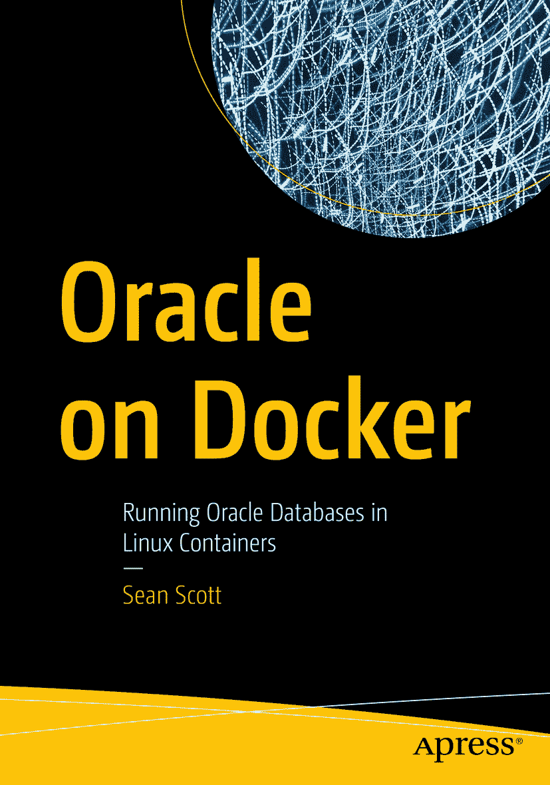

ISBN 978-1-4842-9032-3 e-ISBN 978-1-4842-9033-0 [`doi.org/10.1007/978-1-4842-9033-0`](https://doi.org/10.1007/978-1-4842-9033-0) © Sean Scott 2023
本作品受版权保护。出版商拥有所有权利，无论是全部还是部分材料，特别是翻译权、转载权、插图重用权、朗诵权、广播权、缩微胶片或其他任何物理方式的复制权，以及信息存储与检索、电子改编、计算机软件传播权，或任何目前已知或未来开发的类似或不同的方法。
本出版物中使用的通用描述性名称、注册商标、服务标记等，即使未作具体说明，也不意味着这些名称可免受相关保护性法律法规的约束而可供自由使用。
出版商、作者和编辑可以安全地认为本书中的建议和信息在出版时是真实准确的。出版商、作者或编辑均不对本作品所含材料或其中可能存在的任何错误或遗漏提供明示或暗示的保证。对于已出版地图中的辖区主张和机构从属关系，出版商保持中立。

本 Apress 印记由 Springer Nature 旗下的注册公司 APress Media, LLC 出版。

注册公司地址为：1 New York Plaza, New York, NY 10004, U.S.A.

## 引言

2013 年，Docker 将一个在 Linux 中存在多年的概念——`容器化`——封装成一个便捷的接口，使其为广大受众所用。自那时起，容器的采用便蓬勃发展。Web 的大部分内容运行在容器上。Google 的一切，从搜索、Gmail 到 YouTube，都在容器中运行。容器无处不在！

无处不在，但企业中有一个角落除外——那就是数据库。

数据库是特殊的。数据是组织中最有价值的商品，对于许多人来说，他们将最珍贵的数据——企业的**王冠明珠**——托付给 Oracle 数据库。一个故障的 Web 服务器可以快速重建或更换。重建数据则不那么容易，而数据的珍贵地位常常被投射到数据库上，错误地断言保管库与其内容一样无价。

客观地说，数据库主机只不过是计算和存储资源。正如 Laine Campbell 和 Charity Majors 在 `Database Reliability Engineering`（O'Reilly，2017）一书中所写：“数据库并非**特殊的雪花**”。随着企业向整合的、容器化的平台迁移，压力便落在了数据库身上，要求它们也跟上。尽管如此，数据库（尤其是 Oracle）是*不同的*。它们不能（或者更准确地说，*不应该*）像其他容器那样运行！

这正是本书的用武之地。它是一本指南，指导如何在 Docker 上运行 Oracle 数据库，并获得与传统平台相同的信心、可靠性和安全性。这不是一本关于 Oracle 数据库管理或 Docker 与容器的书，而是涵盖了这两种技术的非凡结合。无论您是正在调研 Docker 解决方案的 Oracle 数据库管理员，还是探索基础设施整合的系统工程师，亦或是为开发团队寻找可靠方式托管 Oracle 数据库的用户，我都试图将我在 2014 年开始 Docker 之旅时希望了解的知识倾注于此书。

## 致谢

没有以下人士的帮助，本书将无法完成，在此谨表谢忱：

感谢我的朋友 Reece 和 Ligernaut 团队，他们向我介绍了 DevOps 的美妙之处，并在我 Docker 学习的初期给予了引导。

感谢 Maggie，感谢你多年来的爱与支持，以及在本书撰写期间你无尽的耐心与理解。

## 关于作者 关于技术审阅者

