# 第一部分 容器简介

## 容器简介

我将本书分为两部分。第一部分涵盖容器的基础知识。您将（或下载）一个 Oracle 数据库作为一个包，然后在您的系统上运行它。这些包可在所有流行的操作系统——Windows、Mac 和 Linux——上移植，并且是 Docker 为开发带来速度和简单性的基石。


## 1. Docker 与 Oracle 简介

在过去的十年里，我们见证了基础设施构建、部署和运行方式的根本性转变。可靠性工程的兴起是对系统日益复杂和规模不断扩大的回应。若没有其工具和方法，管理和监控成百上千台主机与服务的环境将是一项难以想象、不可能完成的任务。

在传统组织中，部署基础设施是一个缓慢、手动的过程，依赖于运维团队及其专业技能。当开发团队等“消费者”需要新环境时，他们依赖运维团队来完成工作。管理员是流程中的瓶颈。

`DevOps` 是一套实践、工具和组织理念，旨在推动 `开发` 与 `运维` 团队之间的合作与协作。成功的 DevOps 组织的关键在于自动化。自动化流程可以委派给用户，使他们能够按需配置基础设施，从而消除对运维团队的依赖。

DevOps 通过观察和度量来强调质量和性能。只有当测试环境准确反映被观测系统时，对性能指标做出响应才成为可能。基于自动化可靠地复制系统，远比手动构建和管理的系统容易得多。

DevOps 远不止是一种组织方法。它是一种影响利润的商业模式。DevOps 的协作框架使团队能够更快、更有信心地交付新功能，从而在市场上获得竞争优势。监控应用性能让客户满意。追踪用户行为则能洞察如何改进用户体验，并可能揭露攻击者对组织使用的方法！

然而，尽管 `DevOps` 实践已被组织接受并采纳，数据库（以及数据库管理员）在很大程度上仍未受影响。数据层似乎对自动化、配置管理、基础设施即代码和版本控制具有抵抗力。我常听到的论点是，数据太宝贵了，不能托付给这些流程——由此及彼，数据库也是如此。数据库是稳定、持久且独特的。它们只占企业的一小部分，将时间浪费在为生命周期短的动态组件大规模生产而设计的概念上，没有意义。

是的，数据是无价的。数据库是特殊的。但数据库是数据的载体。银行保险箱的价值取决于其运作方式。它们的价值不因其内容而改变，无论里面装的是希望之星钻石还是家庭文件，都无关紧要。保险箱保护物品，而受控流程使制造商能够保证每个保险箱都能抵御威胁并保护内部物品，正如经过认证机构和独立实验室测试的那些一样。增加定制或手动步骤会引入可变性以及错误或不一致的可能性。

数据库也不例外。数据的价值使得一致、可重复的流程至关重要，或许比“不那么重要”的基础设施更为关键。在配置管理下构建和管理的数据库主机可以被精确、快速地重建。通过版本控制应用和跟踪的更改，可以为响应性能问题而回滚，并可以从低级环境提升到生产环境。可靠性工程的核心就是 `信心`——相信测试中的更改在生产环境中表现相同；一个环境中的问题可以在其他地方复现；我们可以随意重建堆栈中的任何或每个组件。

`Docker`（或更广义地说，`Linux 容器`^(¹)）是可靠性工程难题中的一个关键部分。Docker 使我们能够有信心地为服务——应用程序、Web 主机、监控，甚至数据库——构建、部署和运行多个相同的容器！

### 为何选择 Docker？

关于在 Docker 中运行 Oracle 数据库，人们首先会问的问题之一是“为什么？”回答这个问题需要客观审视我们目前的工作方式，并询问是否有更好的工具或方法来完成这项工作。然后，确定新方法是否引人注目。它将如何改进现状？改变所付出的努力和风险值得吗？投资回报率如何？

当在 Docker 上运行 Oracle 时，我们可以将这些动机归纳为几个机会：简单性、速度、可移植性、可靠性和成本。

#### 简单性

Docker 是 `基础设施即代码`。^(²) Docker 自动化了操作系统准备、安装和修补 Oracle 软件以及配置数据库的过程。用户不需要理解或记住详细的步骤。只需调用 Docker 并提供可选参数来自定义环境即可。不熟悉或不习惯安装数据库的用户不再依赖数据库管理员来创建新的工作环境。

对于数据库管理员而言，Docker 提供的可能性远不止自动化数据库安装。考虑一下在 `Data Guard` 中设置主数据库和备用数据库所需的工作量。概括来说：

*   配置主机
*   安装软件
*   配置网络
*   创建并配置主数据库
*   准备并恢复备用数据库
*   设置监听器
*   测试和验证

这是一个非常线性且耗时的过程：在构建主库之前设置环境；等待主数据库创建完成后再恢复备用库；等待备用库上线后才能设置监听器。步骤繁多，增加了遗漏命令和出错的机会。早期一个错误或被忽视的参数可能会导致后续状态存疑。

设置 `Data Guard` 的成本和复杂性使得许多数据库管理员很少进行此操作，从而难以熟悉该技术。大多数公司很少拥有专用于测试的 `Data Guard` 环境——运维团队可以在其中进行破坏、修复并探索其工作原理。^(³) 根据我的经验，大多数运行 `Data Guard` 的公司对待这些系统都小心翼翼。由于重建所需的工作量，他们不愿意对其进行极限测试。当 `Data Guard` 仅存在于生产环境中时，情况尤其如此！

如果数据库团队对于构建和修复 `Data Guard` 感到不自在，那么当它出现故障时，他们又能有多高效？他们是否有诊断和解决问题的实践经验？他们能否识别并恰当地应对各种情况？

使用 Docker，构建测试环境的工作量显著下降，随之而来的是对重建（先前）脆弱系统的担忧也减少了。假设员工能够在短短几分钟内，在笔记本电脑上创建（并重建）模仿生产拓扑的完整 `Data Guard` 环境。那么，他们就有机会练习和完善自己的技能，并在危机中自信地应对。

有限或不充分的测试平台不仅限于 `Data Guard`——它适用于任何复杂的环境或功能。打补丁、升级、加固、恢复——任何可能棘手或耗时恢复的变更。

这是一个奇怪的矛盾：我们常常因为担心破坏低级别环境而不愿练习和测试某些活动，其中一些对业务连续性和安全性至关重要。然而，不这样做反而会增加风险。流程得到的关注和练习更少。当团队最终在生产环境中执行时，他们对流程的熟悉程度和把握也会降低。


#### 自包含性

要理解 Docker 的价值，或许需要我们重新审视对企业级应用的认知。应用软件是安装在主机上用于执行特定任务的规则集合。例如，微软 Word 就是用来管理和编辑文档的程序。

拥有 Word 和运行 Word 是两回事。安装它意味着我拥有了 Word——一个定义了其行为的静态文件集合。而运行 Word 则让软件进入活动状态：它启动一个进程来执行软件预设的规则，并分配内存和 CPU 等资源。一个活跃的 Word 进程可以使用现有文件或创建新文件，并在运行时捕获配置和元数据，但已安装的软件——即那些规则——本身并不会改变。

在思考 Oracle 数据库时，这一点很容易被忽略。我们通常将数据库视为硬件、软件、数据和配置的集合体，而不是去识别其中的独立组件，但它们本质上仍然是应用程序。图 1-1 展示了 Word 与 Oracle 数据库之间的相似之处。`ORACLE_HOME`中的软件定义了处理数据的规则。启动一个数据库实例就是创建进程、分配资源，并将数据和配置读写到磁盘上的文件中。

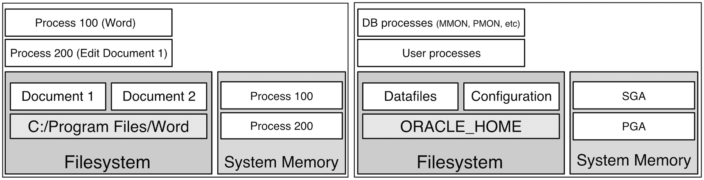

一张示意图展示了微软 Word 与 Oracle 数据库之间的相似性。

**图 1-1**

Oracle 数据库是一种应用程序，其组件与其他应用程序（包括微软 Word）类似。

应用程序就是完成某项任务所需的所有规则和依赖项，它们被打包在一起。“启动”这个包就是运行应用程序并执行工作。

在 Docker 中，`镜像`是包含运行特定应用程序所需的所有软件和依赖项的包。镜像是软件安装包——即规定了功能的文件和元数据。`运行`一个镜像会创建一个用于提供服务的`容器`。

在物理或虚拟主机上原生运行的数据库，与在容器中运行的数据库，其最显著的区别在于文件的位置。在传统系统中，必要的库和包直接安装到操作系统中。更新操作系统可能会改变这些依赖项，许多机构因此会推迟或限制打补丁，以免危及数据库的稳定性和性能。

然而，在容器中运行的系统则宽容得多。依赖项被构建到镜像中，底层主机操作系统的更改不再是问题。^[⁴] 这种管理主机操作系统的灵活性，以及对数据库兼容性担忧的减少，为及时应用最新的安全更新提供了更大的自由。

打补丁和升级数据库的方式也不同。容器镜像是完整的、自包含的数据库软件集合，完全与数据和配置分离。在 Docker 中，无需更新活动的 Oracle Home，只需停止运行旧版本的容器，然后使用新的、已更新的镜像启动一个新容器即可！

#### 速度

Docker 的速度优势远不止于快速构建基础设施。让我们将 Docker 与另一种常用于在桌面环境中配置数据库的技术`Vagrant`进行比较。和 Docker 一样，`Vagrant`也是一种“基础设施即代码”工具。Docker 创建和管理容器，而`Vagrant`则为虚拟机（或称为`客户机`）执行同样的任务。容器和虚拟机扮演着相似的角色，经常被拿来比较。Oracle 为每种技术都维护着用于部署 Oracle 数据库的官方仓库，这为我们对比它们执行类似任务的性能提供了机会。

我对两项活动进行了简单测试。第一项是创建一个数据库所需的时间，包括配置环境、安装前提条件和数据库软件，然后创建一个新的数据库。第二项是启动（或重启）系统。

我使用 Oracle 的 Vagrant 项目（`https://github.com/oracle/vagrant-projects`）来创建虚拟机，使用 Oracle 的 Docker 镜像构建（`https://github.com/oracle/docker-images`）来创建镜像。我使用相同的归档文件来安装 Oracle 19c 企业版，并创建了一个 19.3 的容器数据库和一个可插拔数据库。所有资源都已提前下载到本地，以消除对网络下载的依赖。两项测试都在同一台机器上进行，这是一台运行着最新版`Vagrant`和`Docker Desktop`的 MacBook Pro。我将每项操作运行了五次，记录时间并计算了平均值。在构建新数据库方面，Docker 比`Vagrant`快了略超过 25%；在启动速度上，Docker 比恢复一个虚拟机快了 37%。

为什么 Docker 能快这么多？归结于虚拟机和容器工作方式的差异。虚拟机依赖于`虚拟机管理程序`来模拟硬件，然后启动一个操作系统。其中存在一个抽象层，用于将客户操作系统的调用转换到主机，再返回结果。

Docker 容器是在主机上原生运行的进程。没有操作系统需要初始化，也没有任何东西需要引导。容器（通常）只包含运行其目标服务所必需的依赖项——可执行文件、库和其他文件，这使得它们比同等规模的虚拟机要小。

图 1-2 展示了虚拟机和容器之间的差异。两种系统都有主机操作系统和一个支持虚拟化的解释层。并且在两种环境中，都存在软件依赖项——二进制文件、库和应用程序代码。但虚拟机包含了一个容器中没有的客户操作系统。为什么没有？因为容器利用了主机操作系统中已有的文件和资源！


一张示意图展示了虚拟机和容器之间的差异。虚拟机包含一个容器中没有的客户操作系统。

**图 1-2**

在虚拟机和容器中运行相同的应用程序需要相同的应用程序代码和依赖项。区别在于支持应用程序所需的操作系统位于何处。在虚拟机中，每个客户机都有自己的操作系统。容器则共享主机的操作系统。

在图 1-2 中，虚拟机彼此隔离。即使应用程序文件和依赖项完全相同，它们也会在每个虚拟客户机中单独占用空间。在 Docker 中，三个（或三百个、三千个）相同的容器都从同一个镜像启动，其占用的空间远小于三个虚拟客户机中的对应物。^[⁵]


##### 可移植性

Microsoft Word 以标准格式保存文件。我可以与在不同操作系统或架构上运行 Word 的其他人共享文档，甚至可以与使用识别该标准的各种文字处理程序的人共享。

使用 `Docker`（及类似技术）构建的容器 `镜像` 遵循 `开放容器倡议` 或 `OCI`^(⁶) ([`https://opencontainers.org`](https://opencontainers.org))。它们可在不同硬件和操作系统之间**可移植**，并且在所有符合 `OCI` 标准的环境中可互换。在 Windows 上用 `Docker` 构建的镜像在 Mac 或 Linux 系统上运行效果相同，反之亦然。实际上，几乎每个云供应商也支持 `OCI` 标准。一个单一的标准数据库镜像在任何云上运行效果相同，并且可以在云之间**可移植**。为什么可移植性是可取的，甚至是必不可少的？

想象一下，我们需要将几个数据库从本地系统迁移到云中。每个数据库运行在专用硬件上，具有独特版本的 Linux 和不同版本的数据库软件。我们的云供应商提供预构建的计算镜像，但没有一个完全符合我们的需求。

一种选择是在云中重新创建每个数据库环境，管理和维护多个发行版和配置，遵循单独的更新和打补丁周期，开发独特的测试和质量保证流程等等——所有这些都增加了运营开销。

另一种选择是为每个数据库主机使用默认的计算镜像，并在容器中运行数据库。标准计算可以在所有基础设施中保持一致地维护。为主机打补丁不会影响数据库容器——它们是隔离的，使用自己的软件。容器提供的抽象和隔离有助于并简化更换云供应商、运行多云环境以及混合云/本地拓扑。

#### 可靠性

讨论可靠性时，我们通常考虑的是系统有多稳定，如果组件耐用，系统对故障的弹性如何，以及关键方面是否具有冗余。这描述的是系统、基础设施或硬件的可靠性。可靠性还有另一个方面常常被忽视，但同样重要：`流程可靠性`。

构建可靠的流程意味着确保从低层环境提升到生产的变更在每一步都能可预测地运行。它还旨在保证生产系统中的问题行为可以在其他地方重现并有信心地修复。

自动化、版本控制和配置管理是实现流程可靠性的最佳手段。不幸的是，数据库环境往往避免采用这些方法，而更倾向于手动管理。其理由是，当数据库只占资产的少数时，应用于非数据库基础设施的开销和纪律性是不合理的，而且数据库和主机变更频率太低，无法从中受益。取而代之的是，一个记录在案的安装和配置流程被用来保证整个企业内数据库的一致性。

仅仅依赖文档是有风险的。文档是**描述性的**。它是作者在编写时认为合理的一组指令，但读者可能会有不同的解释或理解。它可能不完整，特别是如果作者期望读者理解某些事情。读者甚至可能跳过或遗漏步骤。文档也只有在是最新的情况下才有效或正确。

`Docker`（和其他自动化工具）是基础设施即代码，天然适合像 `git` 这样的集中式版本控制工具。代码是**程序性的**和**指令性的**，不易产生误解。不完整的流程和不正确的语法会导致失败。编码的流程也更可靠，更容易测试。

由 `Docker` 生成的镜像是**不可变的**，这意味着它们不能被更改，并且提供了更大的确定性，确保从同一镜像运行的多个数据库容器是相同的。从流程管理的角度来看，它消除了可能混淆故障排除工作并对调查结果产生怀疑的变量。使在容器中运行的数据库保持一致和相同并实现流程可靠性变得更容易。

#### 成本

容器中的服务比虚拟化或裸机解决方案占用更小的空间。这就是容器吸引人的原因——它们用更少的资源做更多的事情。虽然底线（成本）无疑很重要，但这并不是 `Docker` 和容器帮助降低成本的唯一领域。

我把成本放在最后讨论，是因为之前的每个论点都包含或暗示了更难量化的成本节约。构建更简单、更快的解决方案加速了开发流程。数据库团队不再花费那么多时间执行数据刷新。开发人员和质量保证团队对自己的环境有更大的自主权。双方在 DBA 和开发人员的战争中都赢了！

运营团队使用自动化、配置管理和版本控制来确保一致性并简化他们的环境。它们有助于实现效率。数据库通常存在于这个范畴之外，回避标准，并使用不同或专用的工具进行监控和管理。`Docker` 引入了一种将数据库团队纳入运营体系并减少与多种技术相关的开销的方法。

容器的可移植性创造了利用性能较低的硬件和低成本的云服务来承载专用于数据库测试的非生产数据库环境的机会。恢复和灾难恢复测试的主要障碍是准备困难和硬件可用性。容器解决了这两个问题，自动化了设置过程，并降低了可接受测试环境的门槛。

最后，`Docker` 创造了可预测、可靠的结果。我们通过减少和消除疑虑，更自信地解决问题，并花费更少的时间进行测试。当两个系统行为不同时，我们通常开始寻找可能归咎的差异。对于手动构建的数据库，我们不能排除错误或遗漏步骤的可能性。从同一个镜像启动的两个系统具有相同的来源，更容易定位到一个系统偏离常规的地方。

### 用例

让我们先明确一点：My Oracle Support 说明 `2216342.1` 概述了 Oracle 对 `Docker` 的支持。Oracle 认证 `Docker` 用于在运行以下系统的主机上使用 `12.1.0.2` 及更高版本的单实例数据库：

*   `Oracle Linux 7 UEK4` 及更高版本
*   `Red Hat Enterprise Linux 7`

2021 年 10 月，Oracle 在 My Oracle Support 说明 `2488326.1` 下宣布了生产环境支持运行 `Oracle Database 21c` 的 `RAC` 数据库。

在这些限制范围内，`Docker` 是现有在裸机、虚拟机或云中运行的数据库的一个选项。

`Docker` 占用空间小、资源需求低、速度快，使其成为在笔记本电脑等有限硬件上进行沙盒和原型设计的自然解决方案。但其架构带来了以不同且令人兴奋的方式与 Oracle 合作的潜力。

一个有趣的特点是能够轻松地将数据库和操作系统软件与数据和配置分开。很容易将数据库的内容保存为参考数据，然后仅使用基本的 OS 命令——不需要 Recovery Manager 或 Data Pump——就能在几秒钟内共享、恢复或配置新的数据库。让我们研究一下利用这一点的几种方法。


#### 数据交换

要为超过几个学生的规模运行 Oracle 数据库课程或实验，需要强大的硬件支持。Docker 的轻量级特性使得硬件能够容纳比虚拟机解决方案更多的学生。它还加快并简化了实验室环境的准备工作。

在这两种情况下，讲师都会创建一个所有学生将使用的数据库黄金镜像。Vagrant 解决方案将黄金镜像保存为一个自定义盒（box），其中包含操作系统、数据库和数据。学生在从这个自定义盒启动的独立虚拟机上进行操作。

在 Docker 中，整个数据库可以作为新镜像提交并分发。另一种方法是创建两个组件：操作系统和数据库软件（主机），以及数据和配置（数据）。在这种场景下，主机和数据可以一起或分开地共享或复制。^(⁷) 这种方法的优势可能不会立即显现。

如果此示例中的“主机”部分是 19.10 数据库，它将与*任何*19.10“数据”配合工作。不同的实验，使用其他数据，都可以使用同一个“主机”。只有引用数据会变化。

类似的方法也适用于刷新质量保证（QA）和开发环境中的数据。每当引用数据发生变化时，将更新的、自包含的数据版本和数据库配置复制到容器的数据卷中，然后重新启动容器。同样的技术对于数据版本管理也很有用。应用场景包括在应用或参数更改前后进行 A/B 测试以及功能和性能的并排比较。

#### 模块化软件

Docker 镜像由一组文件组成，这些文件呈现为一个常规的 Linux 文件系统。一个 Oracle 数据库的镜像将包含`ORACLE_BASE`、`ORACLE_HOME`、清单文件等目录。这些文件作为典型目录结构的一部分出现在镜像中。Docker 可以读取并复制现有镜像的部分或全部内容来构建新镜像，从而节省时间和精力（以及空间！）。

我们可以将镜像和镜像的部分用作构建块，以构建更复杂的系统，而无需重复劳动。GoldenGate 和数据库升级提供了两个场景，说明如何利用模块化方法。

对于 GoldenGate，通过添加和配置 GoldenGate 软件及其依赖项来扩展现有的数据库镜像。原始数据库镜像提供了一个基础。Docker 向数据库镜像添加`层`^(⁸)，但保持原始镜像不变。原始镜像未被修改，Docker 可以重用其文件系统的相同部分，以减少最终 GoldenGate 镜像的大小。

构建用于测试数据库升级的镜像*可以*用同样的方式完成，即向现有数据库镜像添加一个新的数据库主目录（Oracle Home）。但也有另一种方法可用。如果我已经拥有源版本和目标版本的数据库镜像，我可以从源数据库镜像开始；*复制*目标版本的`ORACLE_HOME`；将新的`ORACLE_HOME`附加或克隆到现有的清单中。最终的镜像包含源和目标`ORACLE_HOME`目录以及一个完整的清单。无需安装二进制文件，并且 Docker 的存储会去重共享内容。

数据库补丁和升级是其他应用，其工作方式类似于 Oracle 的`Rapid Home Provisioning`。不是在现有容器上修补软件，而是在目标版本上创建一个新镜像。该镜像生成一致的数据库容器，消除了手动流程引入的差异。要修补数据库，请停止正在运行的容器，使用更新后的镜像启动一个新容器，并运行任何修补后的步骤来修改数据库元数据。

#### 编排

Docker 自带其编排解决方案，`Docker Compose`。Docker Compose（或简称 Compose）通常用于协调两个或多个容器，管理跨容器的依赖关系，并促进网络和其他共享资源的使用。我们可以使用 Compose 来运行使用多个数据库的环境，例如 Data Guard。

Compose 使用`YAML`（*YAML 不是一个标记语言*），一种纯文本标记语言，来定义编排中的参与成员或*服务*。除了描述成员之外，通过 Compose 规范传递给每个服务的信息可以触发条件活动。在以下示例中，Compose 启动了两个 Oracle 19.10 企业版数据库：`DENVER`和`DALLAS`。每个数据库被分配了名为`ROLE`和`DB_UNQNAME`的环境变量。数据库镜像中的一个脚本从每个数据库容器的环境中读取这些值，并使用它们来执行适合每个角色的操作。

如果您不熟悉 YAML 或类似的标记语言，请不要担心。您应该注意的是配置的简洁性。这个编排只需要几条信息就能自动配置 Data Guard 中的两个数据库！

```
version: '3'
services:
DENVER:
image: oracledb:19.10-ee
container_name: DENVER
environment:
ORACLE_SID: ORCL
DB_UNQNAME: DENVER
ROLE: PRIMARY
DALLAS:
image: oracledb:19.10-ee
container_name: DALLAS
environment:
ORACLE_SID: ORCL
DB_UNQNAME: DALLAS
ROLE: STANDBY
```

Compose 简化了复杂环境的设置，并减少了让一组完全配置的、相互依赖的数据库上线所需的工作量和时间。降低的启动成本使得构建用于测试复制和灾难恢复系统的模型变得容易。它也消除了任何不愿意修改或拆解这些系统的顾虑。一旦自动化就位，创建全新的模型就非常简单了。

#### 其他用途

当您使用 Docker 中的 Oracle 时，您无疑会认识到新的应用场景。当我需要进行故障排除时，Docker 是我的首选，我的同事们也因此常和我开些善意的玩笑。以下是一些值得考虑的其他想法：

*   **故障排除：** 当环境受限或不允许更改时，在生产环境中隔离一个错误可能很困难。在 Docker 中重现问题，提供了调整和测试场景的自由，从而更好地进行隔离和识别，并最终实现更快的解决。
*   **练习操作流程：** Docker 为关键活动（如升级、迁移、数据库恢复和灾难恢复）提供了一个极佳的练习场。它是熟悉流程、完善和记录操作程序及运行手册的理想场所。
*   **监控系统：** 在 Docker 中创建一个自包含、可移植的监控仓库，并将其部署到任何基础设施中。
*   **性能调优：** 将生产数据库中的统计信息和元数据导出到在 Docker 中运行的数据库中，以模拟和调优优化器行为。
*   **黑客与渗透测试：** 一个本地的、隔离的系统是探索漏洞和练习黑客技能的绝佳试验台。
*   **功能评估：** Oracle 的每一个新版本都会引入大量新功能和新能力。Docker 提供了一个无风险的环境，用户可以在其中了解新增内容并为认证考试做准备。

这绝非详尽无遗的列表——希望它能激发您的想象力！


### 对 Docker 的反对意见

多年来，我听到了许多关于将 Docker 用于数据库的担忧，尤其是 Oracle 数据库。当我最初开始将数据放入容器时，我自己也曾有过许多类似的疑虑。Oracle 官方支持将 Docker 用于生产数据库，但这并不意味着 Docker 就是一种合适的解决方案。为了解决这个问题，让我们来探讨一些关于容器，特别是在数据库领域中，仍然存在的迷思、误解和错误认识：

*   **我会丢失数据：** 容器是宿主机上的进程，访问与非容器进程相同的存储。采取与保护非容器数据库相同的预防措施来保护容器数据库即可。

*   **容器是临时的：** 容器被启动以执行某项服务或功能，并在完成后被销毁，这种情况并不少见。然而，这并无时间限制，容器会一直存在，直到被特意移除。它们可以被停止和启动，其数据在系统重启后仍然存在。

*   **镜像是不可变的：** 是的，这是好事！镜像是启动新容器的模板。它们无法被更改，这确保了每个新容器都是原始镜像的可靠副本。一个现有镜像是不可变的，但这并不妨碍我们更改它并将其保存为一个*新*镜像！

我认为，从历史角度审视一些对 Docker 的反对意见很重要。在我漫长的技术职业生涯中，我见证了许多创新，包括 `RMAN`、`Enterprise Manager`、虚拟化和云计算的引入。每一次都遇到了阻力，而这些阻力并非总是理性的。人类不擅长应对变革，很容易将新技术斥为噱头或营销噱头。

冒着暴露年龄的风险，我记得自动撤销管理刚被引入时的情景。我当时认识的每个人都对其不屑一顾，认为撤销管理过于复杂，无法实现自动化。而今天，我无法想象手动调整回滚段。这想法太原始了！

### 总结

容器是新的做事方式，一些规模最大、最成功的企业已全身心投入。基础设施整合能节省成本并提升可管理性。尽管数据库管理员可能会试图抵制，但数据库成为唯一未容器化的东西只是时间问题，到那时，总有人会问：“为什么不呢？”要回答这个问题，需要理解容器与数据库如何共存和运作，以及它们与其他替代方案相比有何优劣。

在接下来的章节中，我将为你介绍与数据库和 Oracle 相关的容器概念，并引导你完成在 Docker 中构建数据库的步骤。我们将从简单的示例开始，让 Oracle 在笔记本电脑或台式机上运行起来，以建立信心和熟悉度。在每一步，我都会提供实用的方法，你可以在自己的环境中应用、定制并加以扩展！

脚注 1   2   3   4   5   6   7   8

## 2. 理解容器全景

容器有其自己的语言，对于刚接触 Docker 的人来说，在深入之前需要理解一些基本概念和术语。本章将介绍导航此领域所需的词汇，以及容器工作原理的高层概览。让我们首先将容器置于读者可能已经熟悉的另一种类似解决方案的背景下来看：虚拟机。

如果你已经自信能区分 `镜像` 和 `容器`，并且了解容器与虚拟机的不同之处，可以随意跳至第 3 章。

### 容器与虚拟机

让一组 IT 专业人士描述 Docker 容器，很可能至少有一半人会回答它们“像轻量级虚拟机”。有些人甚至可能会进行如下比较：

*   虚拟机像房子；容器像公寓。
*   虚拟机像半挂卡车；容器像皮卡车。
*   虚拟机像超市；容器像便利店。
*   虚拟机是面包店；容器是一片蛋糕。

虚拟机和容器都是应对成本、效率、规模、隔离性和可移植性挑战的有效解决方案，因此进行比较是很自然的。这些类比的误区在于将容器框定为一种更次要、更轻量或微不足道的替代方案。这延续了容器不足以胜任生产工作负载的迷思。^(⁹)

我想为 Oracle 数据库受众重新构建这个视角，将虚拟机和容器视为*执行相似任务的不同方式*。让我们暂时把 Docker 放在一边，戴上我们的 Oracle 帽子，考虑在企业中托管三个新数据库应用的方法。有以下三种可能的方案：

*   **三个家目录，三个数据库：** 每个应用一个数据库，每个数据库有自己的 `ORACLE_HOME`。独立的 Oracle 软件安装为每个应用的数据库版本提供了更大的控制权，但代价是开销增加。每个 `ORACLE_HOME` 占用空间，且必须单独管理、打补丁和支持。
*   **一个家目录，三个数据库：** 每个应用一个数据库，全部运行于单一的 `ORACLE_HOME` 之下，这降低了维护多个软件安装的复杂性，同时将每个应用分离开来。每个数据库都有与之关联的内存结构、进程和元数据（`SYSTEM`、`SYSAUX`、`TEMP` 和 `UNDO` 表空间）开销。
*   **一个数据库，三个方案：** 最有效的方法是单个数据库，每个应用使用独立的方案。所有三个方案共享一套内存结构、后台进程和元数据。更小、成本更低的硬件就能提供同等的性能。

这些解决方案没有绝对的对错好坏，在某些场景下，每一种都可能是更好或更合理的选择。让我们排除第一个选项^(¹⁰)，聚焦于第二和第三种。它们都运行于单一的 `ORACLE_HOME` 之下，因此受限于在单一主机上运行。`图 2-1` 对这些选项进行了并排比较。

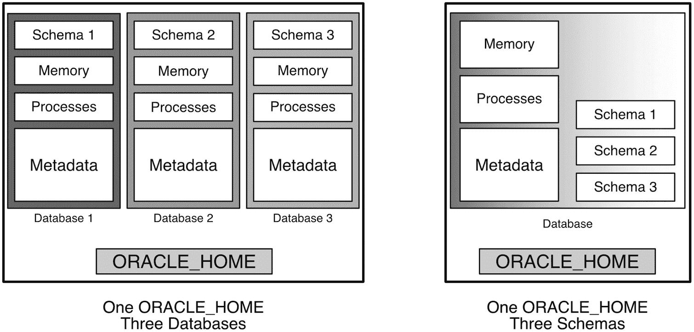

`图 2-1` 在单一 `ORACLE_HOME` 上托管三个应用的替代方案——独立数据库 vs. 独立方案

从客户端的角度来看，这没有*功能*上的差异。选择纯粹是操作性的。独立的数据库实例提供了更大的灵活性，但需要更多的资源和管理工作（成本也更高）。

将方案分散到多个数据库中*可能*看起来具有安全效益并提供隔离性。但在单一的 `ORACLE_HOME` 下，在一个数据库中被利用的漏洞，其他数据库也同样面临风险。更多的数据库意味着更大的攻击面。安全性取决于基础设施和方案被保护的完善程度。

大多数关于容器的著作和解释都使用类似于 `图 2-2` 的示意图来比较容器和虚拟机的资源布局。

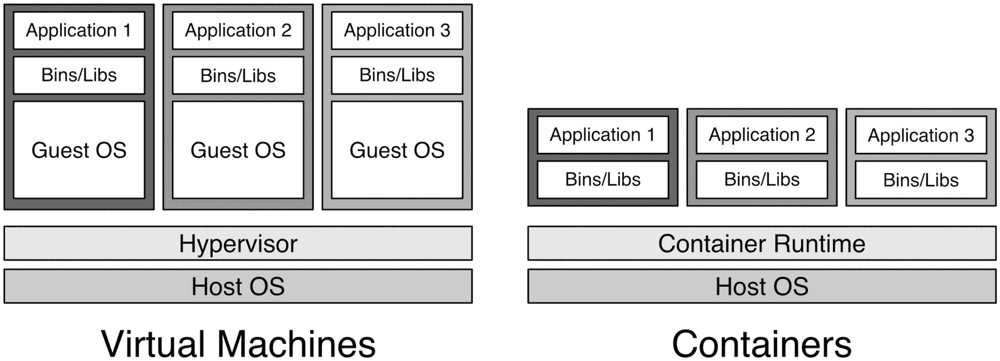

`图 2-2`


#### 虚拟机和容器的资源放置比较

两者都在主机上运行并拥有主机操作系统。[¹¹] 各自添加了一个抽象层：对于虚拟机是**虚拟机管理程序**；对于容器是**运行时**。虚拟机管理程序允许每个虚拟机客户操作系统访问主机资源并将虚拟机彼此隔离。容器运行时执行类似的功能。图[2-2]的主要结论是容器没有客户操作系统。

#### 专用 vs. 共享

注意图[2-1]与图[2-2]之间的相似之处。三个数据库意味着三组重复的元数据，每组都有其进程和内存需求。虚拟机也是如此。客户操作系统不是共享的。独立的虚拟机需要主机资源来管理其环境，就像它们原生运行一样。

相比之下，单个数据库中的多个模式共享一个数据字典。添加模式不会增加后台进程的数量或使用的内存量。添加模式时，唯一受影响的系统资源是元数据和新对象所需的存储空间。类似地，容器共享主机内核和环境中的资源。通过减少或消除重复文件并与主机操作系统共享管理进程，容器享有更小的占用空间。

#### 性能

还有其他的比较点。为分配给各个数据库的模式添加或启动需要更多的时间和精力。虚拟机也是如此。创建和启动数据库，以及在独立虚拟机中安装和启动操作系统，都是时间和资源密集型的活动。

在单个数据库中添加模式要简单得多，这仅仅是为应用程序创建专用数据库的一个有限子集。在数据库实例中也没有“启动”模式的概念。如果数据库已启动，那么模式也可用。访问模式的开销仅仅是建立数据库连接所需的开销。

我们可以用同样的方式看待容器。没有先决的安装要求，而且由于容器没有操作系统，它们也不需要启动。如果主机正在运行，启动容器只是创建一个进程的问题。

#### 容量和能力

然而，图[2-2]中的表示并没有提供完整的图景。两者都在主机级别运行软件——一个操作系统和一些支持客户交互和隔离的软件抽象或模拟层。两种解决方案都容纳了三个应用程序。除了操作系统的存在与否，它们*可能看起来*是相对相似的方法。

容器和虚拟机有时分别被称为“轻量”和“重量”。虚拟机额外的“重量”来自于客户操作系统。相同的应用程序（即具有相同二进制文件、库和应用程序层的应用程序）在虚拟客户机之间重复组件。在虚拟环境中，运行并行操作系统的开销也增加了系统负载。

让我们通过添加一个边界来捕获主机的相对*容量*，从而修正原始的虚拟机与容器比较，如图[2-3]所示。更容易理解的是，容器解决方案中的应用程序有增长空间，或者可以用更小、功能更弱（且更便宜）的硬件替代，而不牺牲能力。

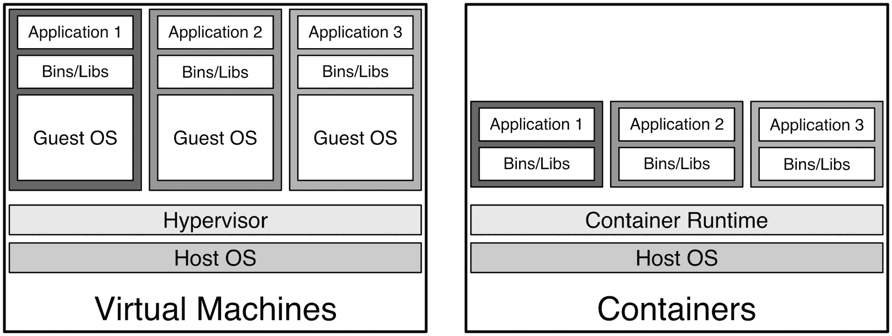

一个图表比较了虚拟机和容器基础设施的容量需求。它描述了容器解决方案中的应用程序有增长空间，或者可以用更小、功能更弱（且更便宜）的硬件替代，而不牺牲能力。

图 2-3

虚拟机和容器基础设施的容量需求比较

虚拟机相当于在 Oracle 中为应用程序中的每个模式运行独立数据库，每个数据库都有自己的管理、撤消和临时表空间、内存结构、后台进程等。

将容器与运行具有多个模式的单个数据库实例进行比较。每个模式只包含其唯一对象。公共功能被集中共享和管理，减少了开销和重复，并提高了能力和性能。[¹²]

### 概念和术语

现在您知道了容器是什么以及它们在企业中的位置，让我们深入了解一些容器概念和术语。

#### 镜像

一个*镜像*是一个用于启动和运行容器的文件包。镜像在功能上类似于*Vagrant boxes*和*VirtualBox 镜像*，熟悉 Oracle 多租户架构的人甚至可以将其视为*种子数据库*。从根本上说，这些都是使用技术和提供可靠、相同的起点的起点。

当 Docker 从镜像启动一个新容器时，它会读取镜像元数据并向容器呈现一个*文件系统*（包括我们之前讨论过的二进制文件、库和应用程序文件）。下一章将更详细地介绍容器如何使用文件系统。同时，让我们看看镜像的一些属性：*标签*、*可移植性*、*不可变性*和*无状态性*。

##### 标签

一个*标签*（通常）标识*仓库*中镜像的*版本*。仓库是镜像的集合，通常相关，例如 Linux 或 Python。标记镜像可以区分每个版本，并更容易找到和使用特定版本。标签与仓库名称结合，形成人类可读或友好的镜像名称，形式为`repository-name:tag`。

仓库名称和标签为人类处理镜像提供了一种便捷的方式。甚至还有一个特殊的标签`latest`，可以在不知道其详细信息的情况下引用镜像的当前工作版本。这突显了一个重要的考虑因素：标签是任意的约定，而不是绝对的标识符。

构建镜像会创建一个唯一的*SHA256 哈希*值。镜像可以存在于具有不同标签的多个仓库中。该哈希（有时称为其*摘要*）用于标识镜像是否相同，并在考虑不可变性时发挥作用。

#### 可移植

Docker 镜像是*可移植的*，因为它们可以在任何运行 Docker 的系统上运行——或者，实际上，任何具有兼容容器运行时的系统。这包括 Docker 替代品，如*Podman*和*LXC*，以及云供应商提供的容器服务。

此处的可移植性不仅仅是*兼容性*。它保证用户在每个平台上都有*相同的体验*，而无需更改镜像或担心它将在哪里运行。如果它在一台机器上有效，那么它将在*每台机器*上有效。

可移植性降低了应对各种日常挑战的门槛，包括（但不限于）构建实验室、教学和实验、演示新功能、测试安全性、验证补丁和修复以及验证流程。

[¹¹]: 此处原文为脚注标记，内容未提供。
[¹²]: 此处原文为脚注标记，内容未提供。


#### 不可变与无状态

镜像是`不可变`的——它们无法被更改。一个镜像可以被修改并保存为一个新镜像，甚至可以更新以替换使用相同标签的镜像，但其哈希值会改变。
不可变性与镜像的`无状态`特性密不可分。关于镜像状况或`状态`的信息无法保存`到镜像中`。^(¹³) 镜像总是从同一个已知的起点启动。
虽然标签提供了一种友好的操作镜像的机制，而可移植性让我们可以在任何地方运行镜像，但不可变性保证了跨多个环境共享的镜像是相同的。无状态性确保了每个镜像都从相同的起点开始，并交付一致的结果。
可移植性和不可变性是共享镜像的关键，哈希值唯一地标识其版本。Docker 和容器技术是构建`基础设施即代码`的一种方式。基础设施即代码通过版本控制和自动化来产生可靠的环境，并减少或消除了手动配置。
我最近帮助排查了一个 Data Guard 问题。添加到现有环境中的新备用数据库未能按预期工作。DBA 团队遵循了有文档记录的操作流程，并确信故障系统与正常运行的那个是相同的。几小时后，发现并修复了`sqlnet.ora`配置中的一个微小差异。从代码构建可以避免疏漏，节省时间和金钱（以及挫折感）！

### 容器

`容器`是通过“运行”一个镜像创建的。容器执行工作。从主机的角度来看，容器就像是系统上的一个单一进程。而在容器“内部”，情况则大不相同！一旦连接到容器，环境看起来就像一个完整的主机，拥有文件系统、进程、用户和网络。就像虚拟机一样，根据你是在“内部”还是“外部”，事物的外观和行为会有所不同。
容器是镜像的`有状态`且`短暂`的调用实例。这些特性常常被误解，尤其是在数据库领域。

##### 有状态

容器的状况或`状态`是被保留的。当容器（或其主机）停止并重新启动时，任何东西都不会丢失。在容器文件系统上添加和修改的文件与内容会在停止-启动周期中持续存在。从容器中删除的目录和文件不会重新出现。
很容易混淆镜像和容器管理状态的方式。请记住，镜像就像模板或种子数据库。它们的无状态性提供了一个可靠的工作起点。而这项工作是在有状态的容器中发生（并被保存）的。在使用数据库时，理解数据的更改会像在虚拟机或裸机环境中一样在容器中持续存在，这一点至关重要。

##### 短暂

容器通常执行一些工作，然后就消失了。一般来说，容器被认为是`短暂的`，或临时的进程。基于此，很容易得出结论认为容器不适合托管像数据库这样的长期运行的应用程序。然而，容器不会自动过期，也没有任何因素阻止它们运行数天、数月或数年。
容器也不会自行消失。它们与虚拟机相比，在持久性上并无优劣之分，但在数据库领域存在一种错误的观念，认为容器是放置数据的危险之地。^(¹⁴) 你能移除一个容器吗？绝对可以。你也可以移除一个虚拟机或从主机删除其磁盘。需要明确的是，这些是操作性问题，与技术本身无关。

#### 资源

与系统上运行的其他进程一样，容器使用主机的 CPU、内存和存储。Docker 提供了管理及限制单个容器和 Docker 运行时资源使用的方法。第 16 章将更详细地介绍这一点。但容器还可以通过其他方式与主机交互。最常见的包括访问本地存储和暴露网络连接。

#### 卷

`卷`是一种将本地主机的文件系统与容器共享并将数据与软件分离的机制。从概念上讲，卷就像是主机和容器都可见的 `NFS` 文件系统，允许访问高性能、弹性强的设备以及共享数据。它们简化了在其他平台上运行 Oracle 数据库时困难或不切实际的操作活动，包括：
*   **打补丁和升级：** 停止并移除正在运行的容器，用升级版本的容器替换它，运行任何升级后步骤，然后启动数据库。
*   **迁移和转移：** 容器具有可移植性，可以在任何兼容的环境中运行。无论是迁移到更新、更强大的本地主机，还是“提升并转移”到云端，容器都提供了一种一致且可控的机制来传输数据和数据库。
*   **克隆数据库：** 将数据与软件分离使得克隆数据库变成了复制数据卷并启动一个引用该数据位置的新容器这么简单。
*   **创建参考数据集：** 创建数据的黄金镜像，分发给 QA 和开发团队。停止一个容器，换出其数据，然后重新启动它。或者删除并使用新数据集重新创建容器，以确保团队使用干净、一致的数据进行测试。
移除容器会删除其数据——除非数据位于卷上。将数据和配置文件存储在卷上，使数据能够在容器生命周期之外持续存在，这是实现这些技术的关键。Oracle 官方的 Docker 镜像仓库脚本将此功能构建到镜像中，并且在创建容器时可以通过 Docker API 轻松访问。

### 网络

默认情况下，容器在隔离环境中运行，连接仅限于主机上的特权用户。这对大多数应用程序来说用处不大。幸运的是，Docker 可以向本地主机暴露和映射端口。应用程序、用户甚至其他容器都可以使用主机上的映射端口来访问容器。只有镜像中特意打开的端口才是可映射的。Oracle 的 Docker 镜像暴露了端口 1521 和 5500。
图 2-4 展示了将 Oracle SQL Developer 连接到在容器中运行的 Oracle 数据库的示例。数据库的监听端口 1521 被映射到本地主机的端口 10000。主机名是 `localhost`（或 Docker 主机的主机名或 IP 地址）。
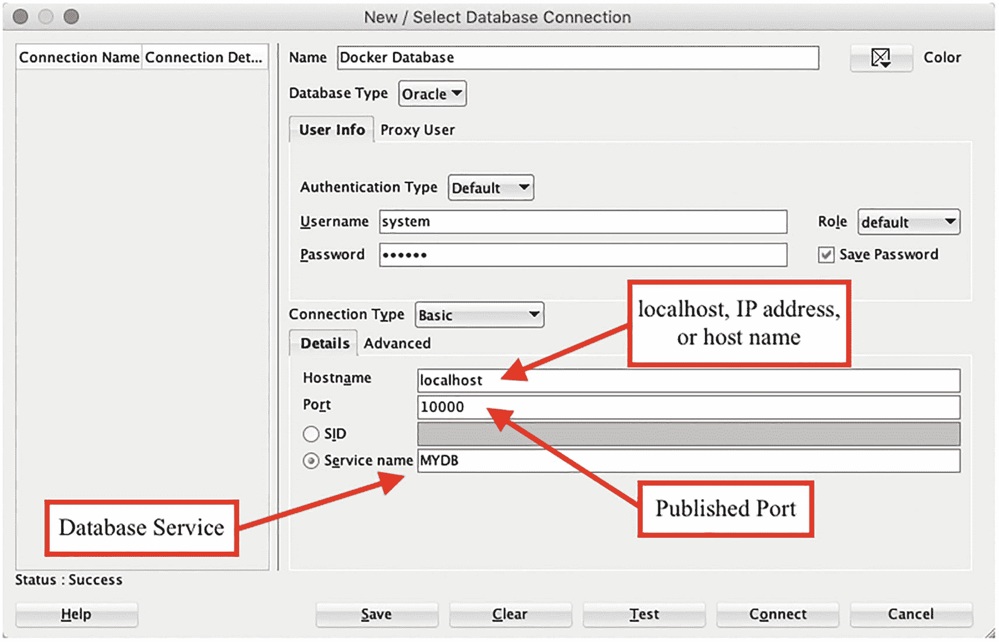
```
一张截图展示了将 Oracle SQL Developer 连接到在容器中运行的 Oracle 数据库的示例。主机名标记为 localhost、IP 地址或主机的主机名，端口 10000 标记为已发布端口，服务名 MYDB 标记为数据库服务。
```
图 2-4
将 SQL Developer 连接到 Docker 容器中的 Oracle 数据库
本书涵盖的大部分网络内容为了简便都使用了端口映射。也有更健壮、更适合生产环境的可扩展解决方案。第 9 章介绍了一种 Docker 原生解决方案。像 `Docker Compose` 和 `Kubernetes` 这样的工具提供了管理和保护到容器（及数据库）连接的功能。

#### 附加术语

读者需要了解一些额外的术语和概念，以完成对 Docker 的基本理解。


##### 运行时

容器运行时（`runtimes`）包含了一套用于构建、管理和运行容器的功能。适用于 Windows 和 Mac 用户的 `Docker Desktop` 以及适用于 Linux 用户的 `Docker Engine` 是流行且可免费在 [www.docker.com](http://www.docker.com) 下载的工具，它们为刚接触容器的用户提供了直接且文档完善的途径。

运行时包含一组用于管理和使用容器的命令集。不必为选择运行时而过度担忧。与 Docker 类似，运行时遵循一个标准，该标准别名化了 `Docker Desktop` 的命令和语法，消除了日后切换的风险。简而言之，几乎任何在 `Docker Desktop` 中运行的东西在其他地方也能工作。

大多数 Docker 命令以 `docker` 开头，后跟一个关键字和一个或多个用于设置或定义选项的标志。例如，`docker run ubuntu` 使用 Ubuntu Linux 镜像运行一个容器。

它如何知道从哪里获取 Ubuntu 镜像？像 `Docker Desktop` 这样的运行时会连接到一个中心（hub）或仓库（repository）。当用户调用 `docker run ubuntu` 时，运行时会搜索其仓库中名为 `ubuntu` 的认证镜像，并自动*拉取*（`pulls`）或下载它。

##### Dockerfiles

回想一下，镜像是文件和目录的集合。`Dockerfile` 是用于填充镜像文件的一组指令或代码。`Dockerfile` 运行命令并调用脚本以安装和配置最终镜像。它们还定义了运行该镜像的容器的环境，包括变量、端口以及映射到主机资源的目录。`Dockerfile` 还决定了容器启动时运行哪些脚本，并定义了用于报告容器健康的检查。

##### 构建

*构建*（`building`）镜像是执行 `Dockerfile` 中指令的过程。构建过程会顺序执行 `Dockerfile` 中的步骤。构建总是从拉取一个基础镜像（`base image`）开始。基础镜像作为一个容器运行，更改会以*层*（`layer`）的形式应用（请记住，镜像不能被更改）。每一层都是后续步骤的基础，直到最终镜像完成。^(¹⁵)

### 总结

现在，您已经理解了 Docker 和容器的语言与概念，并认识到容器与虚拟机的比较方式。对于数据库管理员来说，将虚拟机视为数据库，将容器视为模式（`schema`），可能有助于理解。为新的应用程序添加一个模式，其成本远低于创建一个新的专用数据库。容器或模式中也没有需要启动的东西。

您可以区分镜像和容器，并理解它们可以移植到任何容器环境以提供可靠、相同的结果。您了解到容器可以共享主机资源，包括网络和存储。最重要的是，卷（`volumes`）允许数据（包括 Oracle 数据库）独立于容器持久存在。

接下来，我们将揭开面纱，通过构建一个容器——不是用 Docker，而是在命令行中使用 Linux 命令——来探索容器如何工作。这有助于理解后续章节中使用的概念，但最重要的是，可以消除您在将 Docker 用作数据库平台时可能产生的一些神秘感和顾虑！

脚注 1   2   3   4   5   6   7

## 3. 容器基础

在上一章中，我介绍了一些 Docker 术语和概念。本章将以此为基础，通过更多实用、动手操作的示例，帮助您直观地理解 Docker、它如何工作以及为何如此流行。

除了介绍基本的 Docker 命令外，我还想介绍镜像和容器的基本概念。镜像是*不可变的*（`immutable`），容器是*短暂的*（`ephemeral`）和*持久的*（`persistent`）。我犹豫是否要打出这些词，因为我知道它们听起来多么学术和枯燥！在我开始容器之旅时，我承认我曾努力去理解这些想法或欣赏其重要性。大约一年后，我看到了它们的演示，其中的方式和原因立刻变得显而易见！我将尽力重现那些“啊哈！”时刻，并（希望）让您免于重复我的挣扎！

如果您已经熟悉容器和这些概念，请随时转到第 4 章。如果没有，我鼓励您额外花点时间，在您的环境中跟随本章的示例操作，因为有一件事您无法从印刷页面上获取。

*速度。*

我可以告诉您容器很快，或者大峡谷很大，但有些事情最好通过*亲眼所见*来体会。

如果您尚未安装 `Docker Desktop`，请从 [www.docker.com/products/docker-desktop](http://www.docker.com/products/docker-desktop) 下载并安装。下一章详细介绍了如何在 Mac 和 Windows 上安装 `Docker Desktop`，以及如何在 Linux 系统上配置 Docker。

### Docker 命令行概览

Docker 命令行指令以 `docker` 关键字开头。命令列表相对简短，而且在很大程度上，它们是简单明了的，即使对于新手也是如此。`docker start` 启动一个容器；`docker logs` 显示容器日志；`docker run` 运行容器；依此类推。

Docker 有一些同义命令。例如，`docker container run` 和 `docker run` 是同一个命令，`docker image ls`^(¹⁶) 和 `docker images` 也是。Docker 社区倾向于在有同义词时使用较短的那个选项。我在本书中也将这样做。

Docker 的替代品，如 Podman，包含别名指向其对应 Docker 命令的命令。我曾在安装了 Podman 而非 Docker 的环境中工作过，一些用户（包括系统管理员）多年都没有注意到！

您总是可以通过在提示符下输入 `docker --help`（或仅 `docker`）来列出所有命令，并通过键入 `docker <COMMAND> --help` 获取单个命令的详细信息。（附录包含一组常用命令，以及运行 Docker 和 Oracle 的示例和配方。）

### 运行您的第一个容器

在开始运行 Oracle 数据库之前，让我们使用流行的 Linux 发行版 Ubuntu 来介绍一些基础知识。这提供了一个机会，让您实际操作 Docker，探索镜像和容器背后的一些概念，熟悉 Docker 命令，并展示容器环境的基本属性。

#### 列出镜像

在您安装了 `Docker Desktop` 的计算机上打开一个 shell 会话，并通过运行 `docker images` 显示系统上可用的镜像。您的输出将显示一个标题但没有容器：

```
> docker images
REPOSITORY   TAG       IMAGE ID   CREATED   SIZE
```

没有任何列表，表明系统上没有镜像。回想一下，镜像类似于模板，容器是运行镜像的产物。在运行容器之前，我们需要一个镜像。


##### 运行容器

即使系统中没有镜像，我们能运行一个容器吗？让我们来检查一下！在 shell 提示符下发出以下命令以运行一个 Ubuntu Linux 容器：

```
docker run -it ubuntu
```

这会运行一个 Ubuntu Linux 镜像。这些标志告诉 Docker 使用标准输入以*交互*模式运行容器，并分配一个*TTY*。或者更简单地说，“启动一个容器并给我一个提示符”。`-it` 标志或修饰符是 `--interactive` 和 `--tty` 的快捷方式（而且打字快得多）。

即使系统上原来没有镜像，该命令也已成功完成。你应该会看到类似这样的输出：

```
> docker run -it ubuntu
Unable to find image 'ubuntu:latest' locally
latest: Pulling from library/ubuntu
7b1a6ab2e44d: Pull complete
Digest: sha256:626ffe58f6e7566e00254b638eb7e0f3b11d4da9675088f4781a50ae288f3322
Status: Downloaded newer image for ubuntu:latest
root@4a9ddd43e0e2:/#
```

让我们分解一下输出，看看 Docker 做了什么：

*   正如预期，Docker 在本地找不到 Ubuntu 镜像。
*   由于没有本地镜像源，它“拉取”（*pulled*）或下载了一个镜像（我稍后会说明它来自哪里）。
*   Docker 报告了它拉取的镜像的哈希值及其状态。
*   它显示了一个提示符。

所有这些只花了一小会儿时间。

最后一行是 `root` 用户的 Linux 提示符，以及我们请求的交互式 TTY 会话，显示 `root` 用户已登录到主机 `4a9ddd43e0e2`，并显示了当前目录。

#### 探索容器

命令提示符看起来像是登录到了物理 Linux 主机或虚拟机。让我们通过运行一些命令来查询环境以确认这一点：

```
whoami
id
echo $$
head -2 /etc/os-release
```

`whoami` 和 `id` 的输出确认我们是 `root` 用户。`echo $$` 的结果（显示当前会话的进程 ID 或 PID）表明我们的 PID 是 1。最后，`os-release` 文件的内容显示我们登录到了一个 Ubuntu 主机。你的输出（除了提示符中的主机名和 Ubuntu 版本外）应该与此匹配：

```
root@4a9ddd43e0e2:/# whoami
root
root@4a9ddd43e0e2:/# id
uid=0(root) gid=0(root) groups=0(root)
root@4a9ddd43e0e2:/# echo $$

root@4a9ddd43e0e2:/# head -2 /etc/os-release
NAME="Ubuntu"
VERSION="20.04.3 LTS (Focal Fossa)"
```

保持这个会话打开，在你的计算机上启动一个新的 shell。重新运行之前的 `docker images` 命令。结果现在显示一个 Ubuntu 镜像已存在：

```
> docker images
REPOSITORY   TAG       IMAGE ID       CREATED       SIZE
ubuntu       latest    ba6acccedd29   4 weeks ago   72.8MB
```

这个镜像就是 Docker 为了运行之前请求的 Ubuntu 容器而拉取的。它从哪里来的呢？

#### 镜像注册表

Ubuntu 镜像并不是 Docker Desktop 的一部分。Docker 是从 *Docker Hub* 请求的它，这是一个由 Docker 社区构建和共享的镜像注册中心。Docker Hub 包括由 Docker 发布的*官方镜像*（*Official Images*），由商业第三方（包括 Oracle）生产和维护的*验证镜像*（*Verified Images*），以及其他所有镜像。

在我撰写本文时，Docker Hub 上有近 850 万个公开可用的镜像，大部分由个人和公司添加。官方和验证镜像会经过漏洞扫描和测试。不能保证其他镜像是编写良好的甚至是安全的。我们如何知道我们使用的 Ubuntu 镜像是好的呢？

当我们执行 `docker run` 时，我们请求了一个 Ubuntu 镜像但没有指定仓库。Docker 从它的官方镜像库中拉取。我将在第 16 章更详细地介绍注册中心。现在，知道 Docker 并非随机拉取某些东西就足够了！

你可能还会注意到，在 `docker run` 和 `docker images` 的输出中，镜像标签或版本都显示为 `latest`。这是最近版本的简写，如果你没有为镜像（当有多个版本时）请求特定标签，这是默认值。这通常不重要——你通常想要 Ubuntu 或 Oracle Enterprise Linux 7 的最新版本，以确保包含最新的更新和错误修复。对于依赖关系和版本相关的应用程序，你需要指定版本。例如，要获取 Node.js 的特定构建，你可能会调用 `docker run node:16` 或 `docker run node:17.1.0`，其中镜像标签跟在冒号后面。

### 精简性

从清单 3-5 中关于 Ubuntu 镜像的信息显示，该镜像仅有 72.8MB。考虑到从 [`www.ubuntu.com`](http://www.ubuntu.com) 下载的 ISO 有 1.2GB，这似乎很小。Ubuntu 的 Docker 镜像大小不到其已安装对应物的 6%。为什么？

镜像（通常）只包含执行其功能所*绝对必需*的内容。通过排除*不*需要的内容来减少镜像占用空间有许多好处：

*   跨网络传输的内容更少。
*   实际上增加了基础设施容量。
*   更小的镜像具有更小的攻击面。
*   更少的依赖关系减少了错误和漏洞的可能性。

编辑器通常是镜像中被排除的事物之一。容器通常自主运行，生命周期以小时或分钟计。在生产环境中登录容器是罕见的（甚至是不鼓励的）。编辑器根本没必要，而且会带来安全风险。

回到你之前使用的容器提示符，尝试运行 `vi test.txt` 来编辑一个新文件。它找不到这个命令。`vi` 和 `nano` 没有安装：

```
root@4a9ddd43e0e2:/# vi /etc/os-release
bash: vi: command not found
root@4a9ddd43e0e2:/# nano test.txt
bash: nano: command not found
```

还有其他迹象表明 Ubuntu 镜像已被精简，并非设计用于交互。尝试运行 `man ls` 来显示*手册页*（*manpage*），即 Linux 的内置文档。操作系统会响应一条消息，提醒我们这不是一个完整的操作系统：

```
root@ebb592e975f0:/# man ls
This system has been minimized by removing packages and content that are
not required on a system that users do not log into.
To restore this content, including manpages, you can run the 'unminimize'
command. You will still need to ensure the 'man-db' package is installed.
```

#### 修改容器

容器是用于执行一系列狭窄任务的精简功能系统，而不是运行交互式环境。Docker 和其他发布者提供的基础镜像是精简版本，没有我们习惯在物理和虚拟系统中找到的那些额外功能。

一些发布者为常见发行版提供“slim”变体。虽然没有标准定义什么是或不是非 slim 版本的一部分，但“slim”通常包含工作系统所需的最小内容。相比之下，非 slim 版本可能包含额外的标准或便利功能。

在第 12 章中，我们将看到 Oracle 数据库的容器镜像是从 Oracle Enterprise Linux 的“slim”版本构建的。

没有什么能阻止我们更新容器操作系统来添加功能。让我们通过运行命令将 `vi`（或者如果你喜欢，`nano`）添加到你的容器中来做到这一点。清单 3-1 显示了在 Ubuntu 上安装 `vim-tiny` 的命令，这是一个不需要 Python 支持的发行版。

```
apt-get update
apt-get install -y vim-tiny
```

> **清单 3-1** 在 Ubuntu 上安装 vim-tiny 包的命令

请注意，你需要运行 `apt-get update` 来更新仓库以包含 `vim`。如果不更新，`apt-get` 就不知道这个包存在！

再次尝试使用 `vi test.txt` 创建文件。这次，成功了！你成功修改了容器，添加了原始镜像中没有的功能。在文件中添加一些内容并保存——你将在下一节中再次用到它！

### 持久性

多年来，我在讲授 Oracle 和 Docker 相关知识时，遇到最经久不衰（或者说最顽固，这里双关！）的误解是 `容器不持久化数据` 和 `不能可靠地保存其内容`——尤其是在重启之后。让我们来测试一下！在提示符处输入 `exit` 来退出你的 Ubuntu 容器，就像你登录或通过 SSH 连接到主机后执行退出操作一样。

#### 检查容器状态

我们使用 `docker run` 命令和 `-it` 选项启动了容器。这创建了一个*交互式*容器，其状态与会话绑定。退出容器会停止它。我们可以使用 `docker ps` 命令查看系统上存在的容器及其状态。一开始，`ps` 可能看起来不那么直观，但 Unix 和 Linux 用户应该能认出这是一个用于报告系统上运行进程的命令。

回想一下，容器只是进程，这就说得通了。在你的 Shell 中输入 `docker ps -a` 并检查结果：

```
> docker ps -a
CONTAINER ID IMAGE   COMMAND CREATED     STATUS                   PORTS        NAMES
4a9ddd43e0e2 ubuntu  "bash"  2 hours ago Exited (0) 17 seconds ago       fervent_mendeleev
```

`-a` 标志是 `--all` 的简写，显示系统上所有进程（或容器），无论其处于活动还是停止状态。如果不使用此选项，`docker ps` 只报告正在运行的容器。输出中还需要注意其他几点：

*   `CONTAINER ID` 是一个随机字符串，与我们在容器 Shell 提示符中看到的主机名相匹配。
*   `COMMAND`，即 `bash`，是容器启动时我们使用的 Shell。容器的默认命令在其 *Dockerfile* 中定义，并在第 12 和 13 章中介绍。
*   `STATUS` 显示容器正常退出，错误代码为 0。（从技术上讲，任何非 0 的代码都表示异常，尽管并非总是严重问题。）
*   随机生成的 `NAME`，旨在对用户友好，是可自定义的。我稍后会介绍这一点。

要确认容器已停止，运行不带 `-a` 选项的 `docker ps`，只查看活动容器。

#### 启动容器

要启动容器，请输入 `docker start`，后跟系统中的 `NAME` 或 `CONTAINER ID`，然后通过重复 `docker ps -a` 命令检查状态：

```
> docker start fervent_mendeleev
fervent_mendeleev
> docker ps -a
CONTAINER ID   IMAGE   COMMAND  CREATED      STATUS              PORTS          NAMES
4a9ddd43e0e2   ubuntu  "bash"   2 hours ago  Up 3 seconds             fervent_mendeleev
```

#### 交互模式与分离模式

注意，这次你没有重新连接到容器。以此方式启动时，容器进程作为*分离的*或后台进程运行。分离的容器在用户注销时不会停止，因为它们的状态不与交互式会话绑定。

要在启动时以分离模式运行容器，请将 `docker run` 中的 `-it` 选项替换为 `-d` 或 `--detach`。

### 连接到容器

现在容器已激活，重新连接到提示符。有不同方式可以做到这一点：*附加*或*执行命令*。

*   **附加** 通过 `docker attach <CONTAINER NAME>` 命令访问容器正在运行的进程。在我们的例子中，该命令是 bash，如 `docker ps` 的 `COMMAND` 列所示。在任何给定时间只能有一个会话附加。像之前那样以交互模式运行容器，就是附加到该容器。
*   **执行** 一个命令类似于通过 `ssh` 登录到远程主机。运行 `docker exec <CONTAINER NAME> <COMMAND>` 允许你指定一个命令或脚本。执行命令可以交互式运行，也可以在后台运行，并可设置用户、工作目录和环境。多个会话可以使用 `docker exec` 同时连接。

在使用 Docker 和 Oracle 时，我很少需要用到 `docker attach`。在实践和本书中，我几乎只使用 `docker exec`。

运行 `docker exec` 并带上首次运行容器时使用的相同 `-it` 选项来连接到你的容器。后跟容器名称和我们想要运行的命令 `bash` 以启动一个 Shell：

```
> docker exec -it fervent_mendeleev bash
root@4a9ddd43e0e2:/#
```

#### 验证持久性

重新连接到容器后，列出你创建文件 `test.txt` 的目录内容。文件仍然存在，其内容也得以保留，即使在重启容器之后也是如此。

文件系统的更改并不是 Docker 中唯一持久存在的东西。会话状态也会保留。在容器提示符处使用键盘上箭头键滚动查看命令历史。停止容器之前发出的命令会出现。

#### 移除容器

微服务架构会创建容器来执行某些工作，然后销毁它们（稍后会详细介绍）。你创建的容器已经达到了目的：你学会了如何运行和修改容器、检查其状态、启动和停止它以及进行连接。现在，我们将移除它。

像之前一样输入 `exit` 退出容器提示符。在主机提示符处运行 `docker rm -f <CONTAINER NAME>` 来移除容器，替换为系统中容器的名称：

```
> docker rm -f fervent_mendeleev
fervent_mendeleev
```

`-f` 标志强制 Docker 移除正在运行的容器。不使用此选项，则必须在移除前停止容器。

### 镜像是不可变的

你通过安装 `vi` 和添加文件修改了容器，但这并没有改变镜像。镜像*是不可变的*，无法被更改。每个镜像都有一个摘要或哈希值，作为保证镜像内容的签名。从给定镜像启动的每个容器都是相同的。这是一个理想的属性，是运行可靠性和可重复性的基础，我们将在后面的章节中利用这一点。

不过，这确实引出了一个明显的问题。如果不能更改镜像，Docker Hub 中怎么会有如此多种类的镜像？说镜像是不可变的并不是全部事实。镜像不能被更改，但对容器所做的更改可以*另存为新的镜像*。构建镜像只是一系列操作：启动一个镜像，运行命令以修改正在运行的容器，并将结果保存为新的镜像。

#### 启动一个新容器

为了演示，启动一个新的 Ubuntu 容器，这次使用 `--name` 选项为其指定一个名称，而不是让 Docker 生成一个“友好”的名称：

```
> docker run -it --name my_container ubuntu
root@cadf21663737:/#
```

注意它完成得多快！没有像第一次运行 Ubuntu 容器时看到的那些额外消息。Docker 不需要拉取镜像，因为它已经存在于系统上。它只需要在本地主机上启动一个新的 Linux 进程——请记住，在 Docker 中，没有初始化或启动周期！


#### 保存新镜像

我们正在使用的 Ubuntu 镜像不包含 `vi` 命令。但如果我们想要一个包含 `vi` 的 Ubuntu 镜像怎么办？在每个新的 Ubuntu 容器上安装 `vi` 并不实际。相反，让我们创建一个新镜像来包含 `vi`。

在新容器中安装 `vi`（或 `nano`），使用清单 3-1 中的命令。退出容器，在主机命令提示符下，使用 `docker commit` 命令将容器保存为新镜像。你需要提供要保存的容器的名称和新镜像的名称：

```
> docker commit my_container ubuntu_editor
sha256:be90b42f8ef0c5b8e343c7fd5d7aaa5d99f1e7e65dfac9020c4f362dade0410f
```

Docker 会返回新镜像的哈希值。重新运行 `docker images` 以确认它创建了一个新镜像，代码如清单 3-2 所示。

```
> docker images
REPOSITORY       TAG       IMAGE ID       CREATED         SIZE
ubuntu_editor    latest    be90b42f8ef0   3 seconds ago   107MB
ubuntu           latest    ba6acccedd29   4 weeks ago     72.8MB
清单 3-2
将修改后的容器提交为新镜像
```

新镜像 `ubuntu_editor` 现在已可用。

注意新镜像与原始镜像相比的大小。`vi` 那么大吗？不！这是镜像和 `层` 工作方式的副产品，本章稍后将讨论。

#### 运行新镜像

使用这个新镜像启动另一个容器，命令为 `docker run -it ubuntu_editor`，并确认 `vi` 存在，如清单 3-3 所示。

```
> docker run -it ubuntu_editor
root@d3f700a3aae2:/# which vi
/usr/bin/vi
清单 3-3
从新提交的镜像创建容器并验证 vi 是否存在
```

### 联合文件系统

清单 3-2 展示了两个镜像。原始的 Ubuntu 镜像是 72.8MB。安装了 `vi` 的修改版本是 107MB。安装一个简单的编辑器使大小增加了 45% 以上。为什么？

Docker 非常高效，它利用操作系统特性来提高速度并减少占用空间。其中一个特性，`联合文件系统`（有时称为 `覆盖文件系统`），对容器内容进行“去重”。

逻辑上，一个从 200MB 单镜像启动的运行五个容器的系统应该使用 1000MB——每个容器 200MB。有了 `联合文件系统`，实际存储需求与容器数量无关。在这个例子中，无论主机运行十个还是一千个容器，存储需求可能低至 200MB。

镜像提供了容器所需的所有文件和依赖项，但它们不是从镜像复制的。`容器就是镜像。`

如果镜像不能被修改，容器如何在其文件系统中使用镜像？

启动新容器时，Docker 会创建一个由多层组成的 `联合文件系统`：`lower`（下层）、`upper`（上层）和 `working`（工作层）。

*   `下层`：Docker 将镜像映射到下层。每个共享镜像的容器在其下层引用相同的不可变文件集。
*   `上层`：Docker 为每个容器创建一个唯一的上层。创建和编辑文件会将其添加到容器的上层，而不改变下层中的原始副本。
*   `工作层`：工作层是下层和上层的联合（因此得名）。它将下层中未更改的文件与保存在上层的新文件和修改过的文件合并。`联合文件系统` 将已删除文件作为一种特殊文件类型处理，告诉工作层将其从视图中屏蔽。

为了形象化这一点，想象一个用于模拟井字棋游戏场景的镜像，如图 3-1 所示。镜像——即下层——包含游戏棋盘和游戏的前几步。起始步骤是镜像的一部分，每当容器启动时就会出现在游戏棋盘上。将上层想象为一个透明的薄片，玩家在上面标记他们的走法。工作层是玩家看到的视图，就像他们向下看时，将透明的上层叠加在下面的图像上。工作层显示了完整的棋盘——下层和上层的合并。

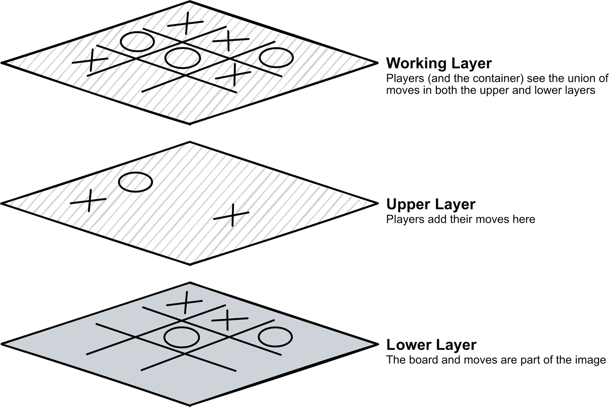
一个井字棋走法的示意图，从下到上说明了 3 层：下层、上层和工作层。
图 3-1
下层中的井字棋走法是镜像的一部分，在每个容器启动时就存在。在运行的容器中添加的走法仅存在于上层。玩家从工作层的视角“向下看”时，会看到所有的走法。

图 3-2 展示了这如何应用于文件系统。同样，镜像提供了包含预填充文件的下层。容器获得它们自己的上层，在其中保存本地更改。在容器中运行的进程从工作层读取合并后的结果。

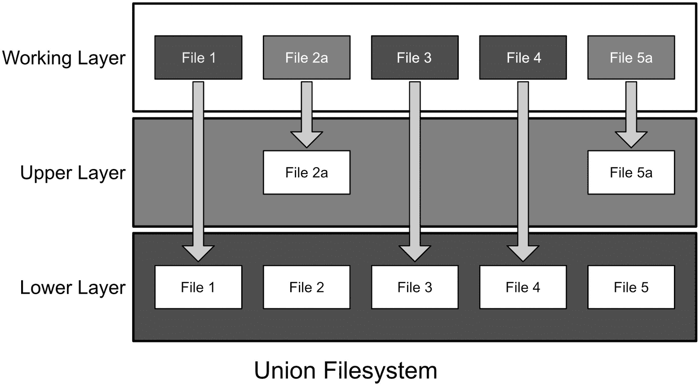
一个示意图展示了联合文件系统中的各层。从上到下的层依次为：工作层、上层和下层。文件名标记为文件 1、文件 2a、文件 3、文件 4 和文件 5。
图 3-2
`联合文件系统` 中的层。

在图 3-2 的工作层中，文件 2 和 5 的更改版本覆盖（或屏蔽）了它们的原始版本。文件 1、3 和 4 未被遮挡，通过上层“可见”。

在正常情况下，镜像的大部分——二进制文件、库和可执行文件——是静态的，不会在容器的上层有副本。^(¹⁸) 容器中进行的更改越少，其上层就越小。

当你之前移除 Ubuntu 容器时，Docker 删除了分配给该容器的 `联合文件系统` 的上层。^(¹⁹) 容器中所做的更改丢失了，但底层镜像没有受到影响。

从同一个镜像启动的数十或数百个容器共享一个下层，与物理机或虚拟机相比，在规模上带来了效率和成本效益的显著提升。我们可以通过运行带有 `-s` 或 `--size` 选项的 `docker ps` 命令看到这一点。以下截断的输出报告了这些容器的实际大小和虚拟大小：^(²⁰)

*   第一个容器不使用额外空间。由于容器中没有进行任何更改，其上层为空，容器的虚拟大小 72.8MB 与原始 Ubuntu 镜像相匹配。
*   第二个容器的上层是 33.9MB。它包括更新文件系统和安装 `vi` 所需的修改。
*   第三个容器，从新创建的镜像运行，不包括对其环境的任何更改。和第一个容器一样，这个容器的上层是空的。

```
> docker ps -as
CONTAINER ID   IMAGE         SIZE
a5bf2c163d07   ubuntu        0B (virtual 72.8MB)
cadf21663737   ubuntu        33.9MB (virtual 107MB)
d3f700a3aae2   ubuntu_editor 0B (virtual 107MB)
```


#### 提交与构建

这解释了为什么提交的镜像更大，但差异的幅度却不成比例。这是因为当 `apt-get update` 和 `apt-get install` 命令运行时，容器的层发生了多大程度的变化。这些命令获取了软件包列表、解压了归档文件，并对存在于底层的文件进行了增量更改。每个操作都向容器的上层写入了一些内容。

创建镜像还有另一种方式。`dockerfile` 是一套从零开始构建镜像的指令集。`docker commit` 是一种便捷但（有点）暴力的方法。从零开始构建镜像则能提供更大的控制权，并产生更小、更高效的镜像。

清单 3-4 展示了一个“内嵌”了 `vi` 编辑器的 Ubuntu 镜像的 Dockerfile。清单 3-5 展示了使用此文件构建镜像的命令以及操作的结果。

```
> docker build --tag ubuntu_vi .
[+] Building 7.1s (6/6) FINISHED
=> [internal] load build definition from Dockerfile
=> => transferring dockerfile: 179B
=> [internal] load .dockerignore
=> => transferring context: 2B
=> [internal] load metadata for docker.io/library/ubuntu:latest
=> [1/2] FROM docker.io/library/ubuntu:latest
=> [2/2] RUN apt-get update && apt-get install -y vim-tiny && apt-get clean && rm -rf /var/lib/apt/lists/*
=> exporting to image
=> => exporting layers
=> => writing image sha256:03545fa76800a4ed39a11c9e25aa184d1a60a2b1cb889730961d47d8c8dde554
=> => naming to docker.io/library/ubuntu_vi
清单 3-5
镜像构建及结果
```

```
FROM ubuntu:latest AS base
RUN apt-get update \
&& apt-get install -y vim-tiny \
&& apt-get clean \
&& rm -rf /var/lib/apt/lists/*
CMD bash
清单 3-4
一个用于创建带 vi 功能的 Ubuntu 镜像的 Dockerfile
```

现在不必担心语法——我们将在第 12 到 14 章深入讲解。但请注意从 Dockerfile 构建的新镜像的大小差异：

```
> docker images
REPOSITORY       TAG       IMAGE ID       CREATED          SIZE
ubuntu_vi        latest    03545fa76800   15 seconds ago   75.1MB
ubuntu           latest    ba6acccedd29   4 weeks ago      72.8MB
```

从零开始构建的版本仅大了 2.3MB。这个差异合理得多！

### 总结

当我与人谈论在 Docker 中运行 Oracle 时，我首先会演示它的速度。这是一个引人入胜的开场论点，并将容器与竞争技术区分开来。与数据库管理员的对话很自然地会转向对持久性和可靠性的担忧。人们听说容器是临时性的，就想到了最坏的情况，从而在没有花时间去理解的情况下就摒弃了这项技术。我也未能免俗——这些误解也曾影响了我对 Docker 的初次体验。

容器“临时性”的标签源于其 `典型` 的用例，这些用例的生命周期较短。然而，何为“短”是相对的；细想之下，一切都是暂时的！没有任何东西能阻止长寿命的应用程序（包括数据库）在容器中运行。

在本章中，你发现了容器与其物理和虚拟机（VM）对应物之间的更多区别。这些差异大多源于不同的用例。物理和虚拟主机承担广泛的、多用途的角色，需要各种功能和库。它们的操作系统通常较大，额外的功能也增加了潜在的漏洞。容器则是更精简的系统，针对特定任务定制，其文件系统只包含必要的内容。它们较小的占用空间非常适合在网络上共享，正如你在创建第一个容器时所见证的那样！

你还应该能够熟练使用 Docker 的命令行界面来运行基本命令，报告系统中存在的镜像和容器，并创建、移除、停止和启动容器。你连接到了一个正在运行的容器并更新了环境，添加了一个编辑器。

Docker 速度和效率的基础在于它如何使用联合文件系统。层（Layer）将用于启动容器的原始镜像与其生命周期内的更改隔离开来。层为在系统上运行的容器实现了持久性，并有助于容器基础设施的可扩展性，同时似乎还挑战了常识性的数学！你将在本书的第二部分，在涵盖 Dockerfile、镜像和构建的章节中再次看到层的应用。深入理解层对于欣赏这些主题并非必需，但这是我后悔在 Docker 学习之旅中没有更早掌握的一个领域。

现在你已经熟悉了 Docker 的语法和工作流程，可以开始使用数据库容器了。我们将在下一章做这件事，通过一个快速入门教程，介绍在容器中运行你的第一个 Oracle 数据库的步骤！让我们开始吧！

## 4. Oracle 数据库快速入门

每当我举办关于在 Docker 上运行 Oracle 的网络研讨会和演示时，与会者最常要求的就是一套循序渐进的指导，以便在容器中启动并运行数据库。本章是一个独立的教程集合，涵盖构建镜像和运行数据库容器的步骤。

正如一本披萨食谱可能会提供制作面团的说明，而不解释酵母如何使面团发酵一样，本章侧重于“如何做”，而较少涉及“为什么”或“原理”。它涵盖了下载和构建镜像、创建一个基本的容器数据库、允许来自容器外部应用程序（如 SQL Developer）的客户端连接、访问 Shell，以及在主机上持久化数据。首先，我们必须准备好我们的系统并理解几个基本术语。

### 访问 Docker 环境

延续烹饪的主题，Docker Desktop 是我们准备镜像和容器的厨房。Docker Desktop 可以从 [`www.docker.com`](http://www.docker.com) 免费下载。附录 A 涵盖了安装和配置。

### 术语

要在 Docker 中启动并运行数据库，需要理解 Docker 环境中使用的一些术语。如果你是跳读到本章，并且不熟悉什么是 `镜像`、`容器` 和 `构建`，如何在系统上访问命令行，或者如何运行基本的 Docker 命令，请花点时间回顾一下本节内容。如果你已经熟悉这些概念，可以直接跳到下一节 “`获取镜像。`”


#### Docker 命令

Docker 命令以 `docker` 开头，后跟一个动词，例如 `run`、`build`、`exec` 或 `attach`，然后是标志、对象和选项。本教程中会用到一些命令。在使用 Docker 时，你可能会最常使用这些命令。即使在我接触容器化技术多年之后，我所做的大部分工作仍然围绕着这些核心命令：

-   `docker images`：显示系统上可用的镜像，包括其名称、镜像 ID、来源、大小和创建时间。
-   `docker ps`：列出正在运行的容器，包括名称、状态、来源镜像和创建时间。容器是系统上的进程，Linux 和 Docker 都使用 `ps` 来列出进程。添加 `-a` 标志可显示所有容器，包括正在运行和已停止的。
-   `docker run`：根据一个镜像创建并启动一个容器。
-   `docker start`：启动一个已存在的容器。
-   `docker stop`：停止一个正在运行的容器。
-   `docker logs`：显示来自容器的日志输出。对于我们即将使用的 Oracle 数据库镜像，它会显示启动操作的输出，包括首次运行容器时启动监听器、数据库和数据库配置助手的输出。之后，它会显示来自数据库警报日志的输出。
-   `docker exec`：在容器内部执行命令。

这些命令将在本书其他章节有更详细的解释。

#### 镜像与容器

一个 `镜像` 包含运行应用程序或服务所需的所有文件。一个 Oracle 数据库镜像包括其文件系统、操作系统库和可执行文件、必备软件包、设置、二进制文件和配置文件。

`容器` 是在主机上从镜像启动的进程。可以使用同一个镜像启动许多容器，每个容器可以独立于其他容器执行工作并对其初始状态进行更改。容器可以停止和启动，其内容会在重启后持续存在。

#### 构建与运行

镜像是使用一组称为 `Dockerfile` 的指令来 `构建` 的。Dockerfile 是 Docker 用来收集食材（包括文件和其他镜像）并将其制备成最终镜像的配方。容器从镜像中 `运行`。

对于这个快速入门来说，理解这两个过程的细节并非至关重要。但认识到操作和对象之间的关系非常重要，因为本教程的一部分内容就是指导你构建一个镜像并运行一个容器。

#### Docker 命令行

与 Docker Desktop 的大多数交互都通过命令行进行。Windows 用户应使用 `Windows Terminal`。在 Mac 和 Linux 环境中，请打开原生的终端应用程序。

### 获取镜像

在运行数据库容器之前，我们需要一个镜像。就像烘烤披萨一样，Oracle 数据库镜像有几种选择可供使用，包括：

-   **预构建镜像：** 这相当于冷冻披萨的选项。在预构建的镜像中，所有的准备工作都已为你完成。你只需要烘烤（或微波加热）并享受成果即可！在容器世界中，“烘烤”镜像就是运行容器。预构建镜像可能并不完全符合你的需求。它们的配置满足常见或通用需求，并且只有一家公司提供预构建镜像——Oracle。Oracle 的预构建镜像包含数据库软件，用户必须接受许可协议才能下载它们。
-   **从仓库构建：** 如果你想对镜像有更多控制权，可以考虑使用 `仓库`。仓库是用于构建镜像的脚本集合。这类似于用现成的饼底、一罐酱料和你自己提供的食材（包括 Oracle 数据库软件和许可证）来组装披萨。Oracle 维护着一个优秀的仓库，不仅可以构建数据库，还能构建多种其他产品。由于仓库不包含获得许可的软件，因此组织和社区成员可以创建和共享仓库。从仓库构建会更耗时一些，但并不困难，远比从头创建镜像要简单。
-   **从自定义 Dockerfile 或仓库构建：** 完全的控制和灵活性来自于自定义的 Dockerfile 或仓库。这相当于从头开始准备酱料和手工揉制面团来制作披萨。编写自定义 Dockerfile 的内容将在第 13 章介绍。
-   **数据库即服务：** 云供应商可能会提供数据库即服务或 `DBaaS` 的选项。DBaaS 类似于在餐厅点餐，云供应商负责完成所有工作，而客户则消费成果。

让我们从最直接的选项开始：使用预构建镜像。

#### 预构建镜像

预构建镜像是最简单、最快捷的入门方式。但它们在版本和版本可用性方面也最受限制。Oracle 在其自己的 Oracle 容器注册表站点 `https://container-registry.oracle.com` 上维护这些镜像。它们更新不频繁，你可能会遇到功能有限的情况。

截至撰写本文时，可用的选项有：

-   版本 19.3.0.0 企业版、标准版
-   版本 12.2.0.1 企业版、标准版 2 (SE2)
-   版本 12.1.0.2 企业版

如果其中某个选项符合你的需求，请访问 `container-registry.oracle.com` 并导航至 `Database` 仓库。图 4-1 展示了 Oracle 容器注册表以及存放预构建数据库镜像的 Database 仓库。

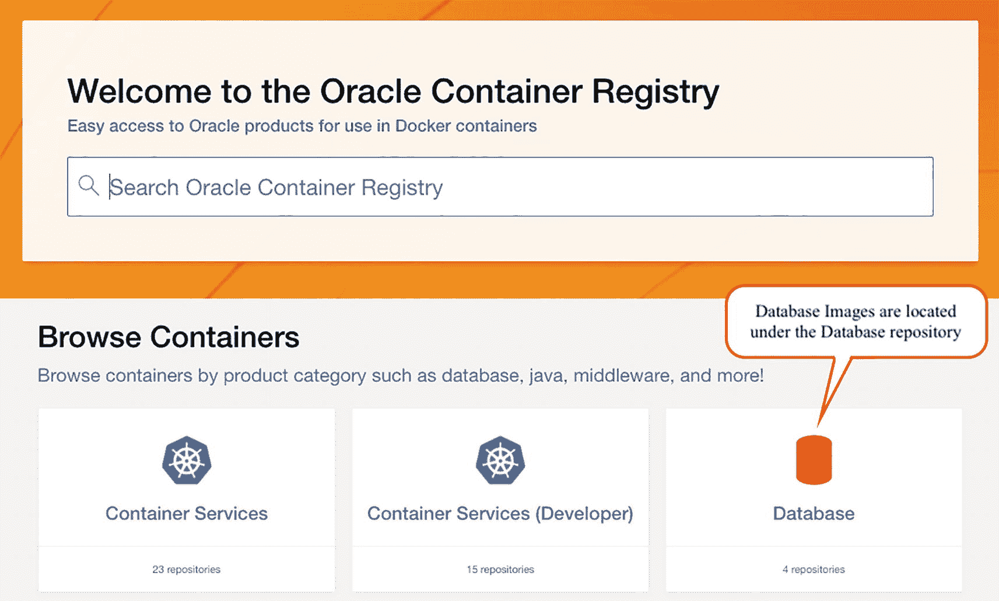

图 4-1: Oracle 容器注册表与 Database 仓库

企业版和标准版有单独的数据库仓库（此外还有 Oracle Instant Client 和 RAC）。选择一个版本以进入文档和下载页面。在本例中，我选择了企业版。图 4-2 显示了 Oracle 19c Docker 镜像的文档页面。

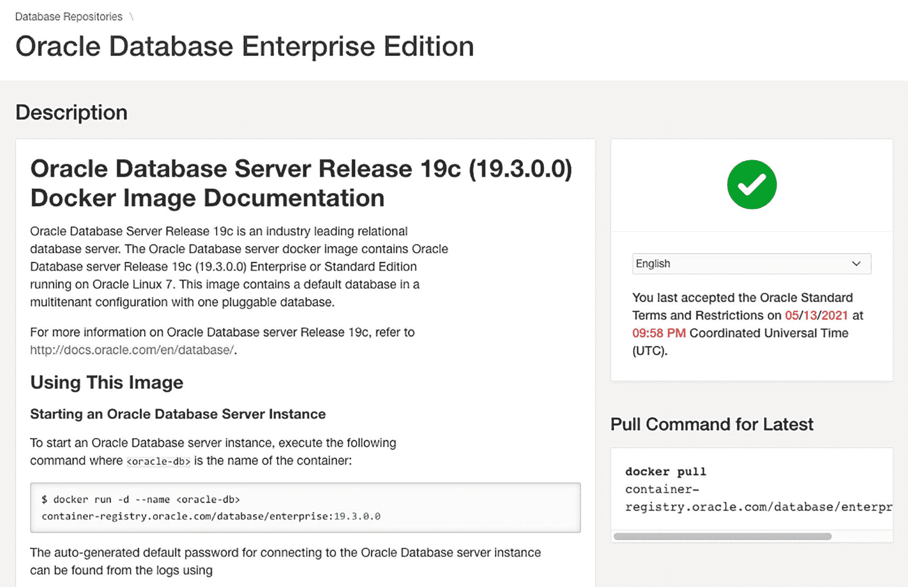

图 4-2: Oracle Database 19c Docker 镜像文档与下载

此页面包含了运行和使用镜像的完整说明，因此没有理由在这里重复它们。不过，关于如何将镜像获取到本地机器，文档记录得并不完善！


#### 下载镜像

首先，使用您的 My Oracle Support (MOS) 单点登录 (SSO) 凭证登录网站并接受许可协议。您应该会在图 4-2 的右上角看到一条消息，表明您已接受许可。

在 Docker 中，下载镜像是通过 `pull` 命令完成的，右侧栏有一个看起来很有希望的元素——“最新版本的拉取命令”。不幸的是，复制粘贴会导致认证错误：
```
unauthorized: authentication required
```

我们尚未对 Oracle 的仓库进行认证。使用以下命令登录：
```
docker login container-registry.oracle.com
```

Docker 会要求输入用户名和密码；这些就是您的 Oracle SSO 凭证。从注册表页面复制 `docker pull` 命令并将其粘贴到您的 shell 中。Docker 将把镜像的各层下载到您的系统。清单 4-1 展示了 `pull` 命令的简化输出。
```
> docker pull container-registry.oracle.com/database/enterprise:19.3.0.0
19.3.0.0: Pulling from database/enterprise
86607bb85307: Pull complete
...
5c2969cb34b8: Pull complete
Digest: sha256:ea9cd805ec49368fd288323e3f41d6c6e45698813e2ae89fd5d097c026ab5aa6
Status: Downloaded newer image for container-registry.oracle.com/database/enterprise:19.3.0.0
container-registry.oracle.com/database/enterprise:19.3.0.0
清单 4-1
运行 docker pull 拉取 19c 企业版镜像
```

就是这样！您已成功将 Docker 镜像下载到您的主机！使用 `docker images` 命令检查系统上的镜像。您将看到与清单 4-2 输出类似的内容。
```
> docker images
REPOSITORY                                          TAG                     IMAGE ID            CREATED             SIZE
container-registry.oracle.com/database/enterprise   19.3.0.0                6ee1b2e4403f        6 months ago        7.87GB
清单 4-2
拉取 19c 企业版镜像后运行 docker images
```

“仓库”列反映了镜像的来源。`tag` 是其版本。

#### 下载标签

之前，我列出了企业版有三个可用版本。其他的在哪里？图 4-3 显示了企业版仓库页面的底部，那里列出了此仓库的标签。

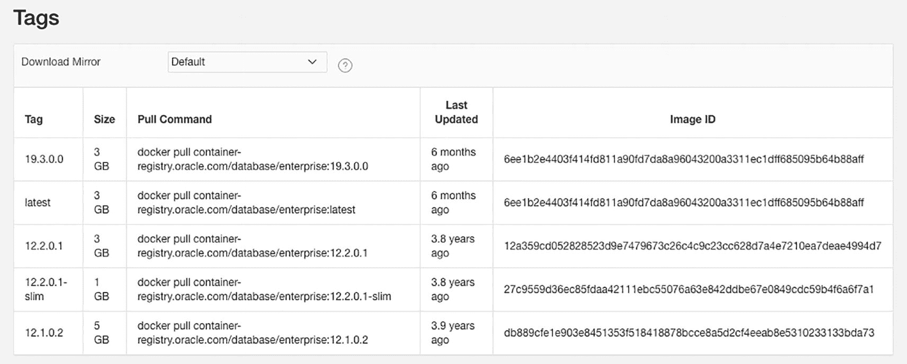

图 4-3
企业版仓库中所有可用版本的标签列表

每个标签代表一个不同的版本，并有各自独立的 `docker pull` 命令。

请注意，版本 12.2.0.1 有两个标签。第二个带有 `-slim` 后缀，是经过精简至最低功能的版本。这在容器镜像中很常见。将镜像精简到最低限度可以节省空间并减小容器的受攻击面——您无法攻击不存在的软件和功能。如果您只需要基本功能，标记为 `-slim` 的标签值得考虑。

最后需要注意的是大小。图 4-3 显示 19.3.0.0 标签的镜像为 3GB，但那是压缩后的下载大小。清单 4-2 报告了 19c 镜像的实际大小，为 7.87GB。

#### 运行预构建镜像

下载完成后，按照文档页面的说明操作，或者直接跳转到“运行容器”一节。此注册表中的镜像使用了下一节讨论的相同脚本，相同的功能*应该*能够工作。容器注册表镜像不经常更新。Oracle 的 Docker 仓库则持续更新着新特性和功能。虽然可能性不大，但从当前脚本仓库构建的镜像有可能会有不同的行为。

#### 预构建镜像的限制

Oracle 容器注册表提供的镜像虽便捷，但牺牲了多样性和功能。就像冷冻披萨，您无法更改配料。对于预构建镜像，您无法更改镜像中内置的某些功能。为了说明预构建镜像为何可能无法满足您的需求，让我们看两个限制：编辑器和多租户。

在桌面或笔记本电脑系统上通过 Docker 运行 Oracle 非常方便。拥有一个可用于开发、测试和实验的“一次性”数据库很方便，对大多数人来说，这包括能够查看和编辑文件。

用户可能会惊讶地发现，Oracle 的数据库镜像不包含文本编辑器，唯一的内置文件查看器是 `more`。这是有意为之——请记住，容器通常运行服务而非交互式会话，不需要编辑器或文件查看器。省略不必要的软件可以使容器更小，并减小其受攻击面。

在构建镜像时，编辑器（和其他实用程序）被排除在外。我们无法更改镜像；手动安装额外的软件是唯一的选择。手动更新容器并不困难，也不耗时，直到您发现自己每次运行新容器时都要这么做！采用容器的原因之一是其能够提供已包含依赖项的自包含环境。手动更新每个容器与此目的背道而驰。

虽然您可能认为添加编辑器并不是一个构建自己镜像的充分理由，但在容器中创建的数据库类型可能是一个理由。

当 Oracle 数据库容器启动时，它会检查是否已有一个数据库。如果没有，它会运行 `数据库配置助手` (`DBCA`) 并创建一个新的 `容器数据库` (CDB)，其中包含一个 `可插拔数据库` (PDB)。CDB 和 PDB 至今仍未被广泛采用，对于那些想要传统的、非 CDB 数据库的用户来说，替代方案是删除 DBCA 创建的数据库并手动创建一个。

然而，从脚本构建镜像可以修改 Docker 的指令以包含编辑器、编辑用于创建数据库的响应文件等。您可能会发现，这种增加的控制权值得花费额外几分钟来构建自己的镜像。

#### 从仓库构建镜像

Oracle 脚本仓库的作者们使其脚本仓库的镜像构建变得简单。一个封装脚本处理了繁重的工作。用户只需下载仓库，将 Oracle 数据库安装文件放入一个目录，然后运行脚本。

该仓库包含用于构建以下版本镜像的脚本：

*   Oracle 11.2.0.2 快捷版
*   Oracle 12.1.0.2 企业版、标准版 2
*   Oracle 12.2.0.1 企业版、标准版 2
*   Oracle 18.3.0 企业版、标准版 2
*   Oracle 18.4.0 快捷版
*   Oracle 19.3.0 企业版、标准版 2

以下示例使用 Oracle 19c。步骤与其他版本类似。

#### Oracle Docker GitHub 仓库

*GitHub* 是一个基于 `git` 的流行版本控制、管理和代码分发平台。Oracle 在 GitHub 上维护了一个用于构建容器镜像的官方脚本仓库，地址为 `github.com/oracle/docker-images`。除了数据库镜像，您还会在这里找到许多其他 Oracle 产品的目录，从 Instant Client 到 GoldenGate 再到 REST Data Services。我们需要在运行 Docker Desktop 的本地机器上获取这些文件。有两种方法可以做到这一点：直接下载或使用 `git`。图 4-4 显示了点击 `Code` 按钮后的对话框窗口。

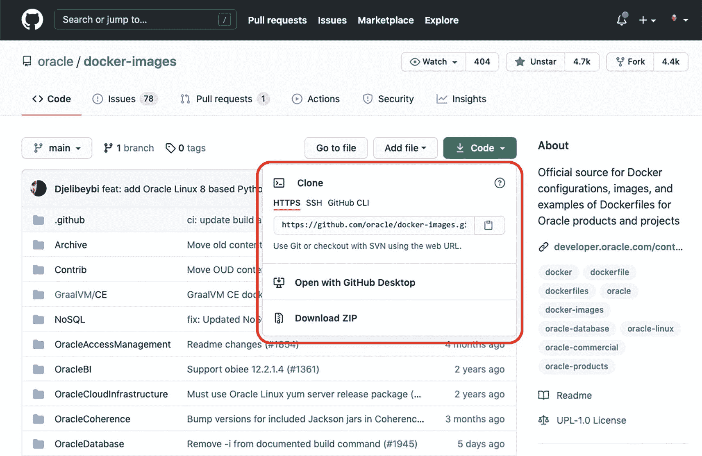

Oracle Docker 镜像页面的截图显示了点击代码按钮后的对话框窗口。

图 4-4

GitHub 上克隆和下载仓库的选项

通过 `git` 或 `GitHub Desktop` 克隆或下载仓库的详细信息超出了本书的范围。如果您使用 `git`，这些操作应该很熟悉。

对于不熟悉 `git` 或不想在仓库中维护这些文件的读者，请点击对话框底部的 `下载 ZIP` 选项。下载完成后，在本地机器上解压该文件。

**提示**

仓库中每个子目录下的路径可能很长。仓库脚本可以放在您计算机上的任何位置，但我更喜欢保持路径简短，并将它们放在靠近根目录的目录中。本书中的大多数示例使用 `$HOME/docker-images` 或 `$HOME/docker`。当您使用容器时，您可能会发现自己经常需要导航到该仓库，并且会感激通过提前规划所节省的击键次数！

花点时间导航到数据库子目录 `OracleDatabase/SingleInstance/dockerfiles` 下的一个文件夹，然后列出其内容。您将看到类似于清单 4-3 的结果。

```
~/docker-images/OracleDatabase/SingleInstance/dockerfiles
> ls -l
total 32
drwxrwxr-x 2 lab lab 4096 Mar 31 14:18 11.2.0.2
drwxrwxr-x 2 lab lab 4096 Mar 31 14:18 12.1.0.2
drwxrwxr-x 2 lab lab 4096 Mar 31 14:18 12.2.0.1
drwxrwxr-x 2 lab lab 4096 Mar 31 14:18 18.3.0
drwxrwxr-x 2 lab lab 4096 Mar 31 14:18 18.4.0
drwxrwxr-x 2 lab lab 4096 Mar 31 14:18 19.3.0
-rwxrwxr-x 1 lab lab 6575 Mar 31 14:18 buildContainerImage.sh
```

清单 4-3
OracleDatabase/SingleInstance/dockerfiles 目录中的文件夹

以下步骤在此目录或针对不同数据库版本的子目录之一中执行。

#### Oracle 数据库软件

为了让 Docker 在镜像中安装 Oracle 数据库，它需要数据库软件安装文件。对于 Oracle 19c，该文件可从 [`www.oracle.com/database/technologies/oracle-database-software-downloads.html`](http://www.oracle.com/database/technologies/oracle-database-software-downloads.html) 获取。其他版本^(²⁵) 可从 My Oracle Support (`support.oracle.com`) 或 Oracle Software Delivery Cloud (`edelivery.oracle.com`) 获取。

无论您选择哪个版本，*务必下载适用于 Linux x86-64 的安装程序*。主机操作系统无关紧要——无论是在 Windows 还是 Mac 上运行，Docker Desktop 都使用 Linux VM，容器在 Linux 中运行。如果存在，请务必下载 ZIP 文件而不是 RPM 文件。图 4-5 显示了下载页面的相关部分，突出显示了选择 Oracle Database 19c 的操作系统和下载选项。

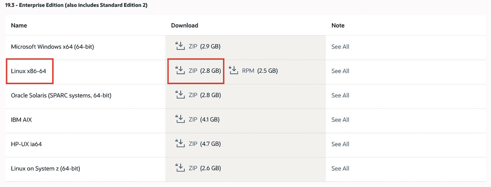

19.3 企业版窗口的截图显示了下载页面的相关部分，突出显示了选择 Oracle Database 19c 的操作系统和下载选项。

图 4-5

Oracle 19c Database 安装程序的 Linux x86-64 ZIP 文件下载

下载文件或将其复制到仓库中与数据库版本匹配的子目录中。对于 Oracle Database 19.3.0，安装文件需要复制到 `OracleDatabase/SingleInstance/dockerfiles/19.3.0`。^(²⁶)

**注意**

*不要解压安装文件！* Docker 的构建过程会查找 ZIP 文件并将其复制到其*构建上下文*中。构建会运行中间容器来完成工作，包括解压安装文件。

现在仓库和安装文件都已就绪，我们可以构建数据库镜像了！

#### 构建镜像

`OracleDatabase/SingleInstance/dockerfiles` 目录中的 `buildContainerImage.sh`^(²⁷) 脚本负责主要工作，并接受参数，如清单 4-4 所示。

```
Usage: buildContainerImage.sh -v [version] [-e | -s | -x] [-i] [-o] [container build option]
Builds a container image for Oracle Database.
Parameters:
-v: version to build
Choose one of: 11.2.0.2  12.1.0.2  12.2.0.1  18.3.0  18.4.0  19.3.0
-e: creates image based on 'Enterprise Edition'
-s: creates image based on 'Standard Edition 2'
-x: creates image based on 'Express Edition'
-i: ignores the MD5 checksums
-o: passes on container build option
* select one edition only: -e, -s, or -x
```

清单 4-4
调用 buildContainerImage.sh 时可用的选项

目前，我们只需要关注版本和版本（edition）的选项。在此示例中，我将通过使用 `-e` 标志调用脚本并将 `19.3.0` 传递给版本标志 `-v` 来构建一个 19c 企业版数据库的镜像：

```
./buildContainerImage.sh -e -v 19.3.0
```

这将启动构建过程，在大多数笔记本电脑上通常需要 8-15 分钟。Docker 会显示每个步骤的输出，当它使用先决条件更新文件系统并安装 Oracle 软件时，您可能会看到一些熟悉的消息。完成后，您应该会看到一条指示镜像名称、标签和总构建时间的消息。运行 `docker images` 并验证您的输出是否类似于以下内容：

```
> docker images
REPOSITORY       TAG         IMAGE ID      CREATED      SIZE
oracle/database  19.3.0-ee   c0d1669287ad  2 hours ago  6.68GB
```

现在我们有了一个用于运行数据库容器的镜像！

##### 运行容器

恭喜！您已经创建了一个镜像，距离享受劳动成果只有几分钟之遥！运行容器就像烤我们的披萨——无论它是新鲜的还是冷冻的，步骤都是一样的！就像我们的披萨一样，无论镜像来源如何（Oracle 容器注册中心、Oracle 的仓库脚本还是自定义镜像），运行容器的命令都是相同的。

#### 容器属性

`docker run` 首次启动一个容器。它还会设置容器的属性，这些属性以后无法更改，包括它如何与其环境交互。这个第一个数据库容器的基本要素是环境变量、端口发布、卷挂载和名称。

### 端口发布

容器是主机上的隔离进程；容器内部发生的事情通常对主机上的其他应用程序是不可见的。有时，我们希望与容器交互，一个主要的例子是连接到 Oracle 数据库侦听器，通常通过端口 1521。将此端口映射或*发布*到主机上的一个端口，允许主机环境中的其他进程与容器内的数据库进行通信。^(²⁸)

端口映射由 `-p` 或 `--publish` 标志控制，后跟主机和容器端口。例如，`-p 10000:1521` 将容器中的端口 1521 映射到主机上的端口 10000。

#### 卷映射

正如我们可能希望通过端口映射在主机与容器的边界上进行通信一样，在某些情况下，我们需要允许主机和容器共享文件或目录。卷映射通过将容器内的文件系统映射到本地主机上的一个卷或目录来实现这一点。现在，可以将映射后的卷视为一个 NFS 挂载点。

在 Oracle 数据库镜像中，数据库配置和数据文件位于 `/opt/oracle/oradata` 目录下。将此目录映射到本地机器，可以允许数据库利用高性能存储、外部冗余和持久性。

删除容器会删除其内容，但映射到主机目录的绑定挂载卷的内容仍然保留在容器外部。我们希望在删除容器时保留数据的场景有很多，包括数据库克隆、补丁应用和升级^²⁹。

卷挂载或绑定挂载通过 `-v` 或 `--volume` 标志处理，后跟将主机目录映射到容器目录的参数。例如，`-v $HOME/my_container:/opt/oracle/oradata` 将容器的 `oradata` 目录映射到主机用户主目录下名为 `my_container` 的目录。

#### Linux 和 Windows WSL 环境中的权限问题

在 Linux 和 Windows WSL 环境中的 Linux 客户机上，主机上的目标目录必须由 `oracle` 用户拥有，或者具有允许 `oracle` 用户写入该目录的权限。

这可能会让 Windows 用户感到困惑，因为 Linux 和 Windows 环境中的权限结构不同。在 Docker Desktop、PowerShell 或命令提示符中创建的容器在 Windows 文件系统下运行。Windows 用户同时拥有文件和进程的所有权，当 Docker 在本地文件系统上创建文件时不会发生冲突。

`docker run` 的 `--volume` 或 `-v` 选项会在主机上创建映射的目录（如果它们不存在）。在 Linux 环境中——包括 Windows 上的 WSL——它们是由调用进程创建并继承其所有权的。Docker 守护进程以 `root` 用户身份运行（并创建目录），如图 4-6 所示。这是在运行以下命令后在 Windows WSL 系统上捕获的：

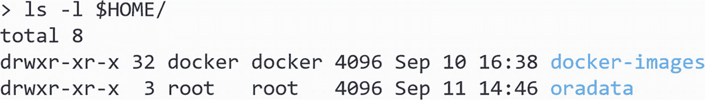

一张截图显示 docker 守护进程以 root 身份运行并创建目录。

**图 4-6**

在 Linux 系统上，`docker run` 创建的目录从 Docker 守护进程 `root` 继承所有权。

```
docker run -d --name MYDB \
-v $HOME/oradata/MYDB:/opt/oracle/oradata \
oracle\database:19.3.0-ee
```

`$HOME/oradata` 目录路径不存在，因此 Docker 以 `root` 用户身份创建了它。但是，当数据库配置助手（DBCA）在容器内以 `oracle` 用户身份运行时^³⁰，它尝试向容器卷上的目录写入文件。然而，该卷映射到本地文件系统上的一个目录，而 `oracle` 用户无法访问该目录。如图 4-7 所示，由于无法创建必要的目录或写入文件，DBCA 失败。

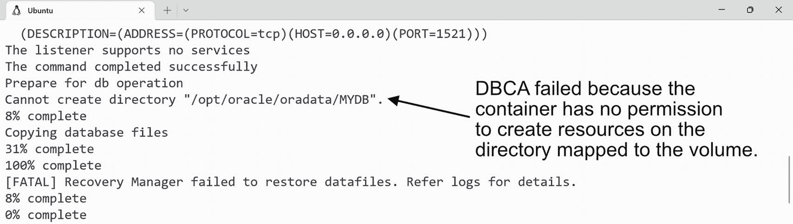

一张 Ubuntu 网页截图显示了 DBCA 命令。一个标签写着：DBCA 失败，因为容器无权在映射到卷的目录上创建资源。

**图 4-7**

容器中的 `/opt/oracle/oradata` 目录被映射到一个不存在的目录。Docker 守护进程以 root 用户身份在主机上创建了该目录。容器没有在那里写入文件的权限，因此 DBCA 失败。

有多种方法可以避免此问题。最简单的方法可能是在 Linux 系统中添加 `oracle` 用户和 `oinstall` 组：

```
sudo groupadd -g 54321 oinstall
sudo useradd -u 54321 -g oinstall oracle
```

预先创建要映射到卷的目录并将其所有权设置为 `oracle:oinstall`：

```
sudo mkdir -p $HOME/oradata/MYDB
sudo chown -R oracle:oinstall $HOME/oradata/MYDB
```

每当我在 Windows 或 Linux 系统上看到失败的 Oracle 数据库容器时，我首先检查日志中是否包含 “Cannot create directory” 错误。这通常可以追溯到权限问题，即映射卷上的所有权与容器内请求资源的用户不兼容。

#### 环境变量

容器从父镜像继承默认的环境设置，包括数据库和可插拔数据库名称，通常是 `ORCLCDB` 和 `ORCLPDB1`。当容器首次运行时，启动脚本会检查是否存在数据库，如果不存在，则基于这些值创建一个。我们可以使用 `-e` 或 `--env` 标志后跟变量-值对来覆盖默认值以自定义数据库名称。例如，`-e ORACLE_SID=TEST -e ORACLE_PDB=TESTPDB` 覆盖了默认数据库名称，并创建一个名为 `TEST` 的数据库，其可插拔数据库名为 `TESTPDB`。

这说明了如何使用单独的 `-e` 标志设置多个环境变量。同样的模式适用于多个端口和卷映射。

#### 容器名称

`--name` 标志为容器设置一个“友好”的名称。如果未指定，Docker 会生成一个随机名称，如“*quirky_elbakyan*”或“*nifty_buck*”。定义名称是一个好习惯。您无需查询 Docker 来查找容器的名称，并且当容器具有有意义的名称时，您更有可能记住其用途。

> **注意**
>
> 容器名称区分大小写。

#### 一个完整的运行命令

让我们使用清单 4-5 中的命令运行一个新容器。

```
docker run -d --name MYDB  \
-p 10000:1521  \
-v $HOME/oradata/mydb/data:/opt/oracle/oradata \
-v $HOME/oradata/mydb/diag:/opt/oracle/diag \
-e ORACLE_SID=MYDB \
-e ORACLE_PDB=MYPDB \
oracle/database:19.3.0-ee
```

**清单 4-5**
一个用于基本 Oracle 数据库容器的实用 `docker run` 命令

这里有一个我们尚未涵盖的新标志 `-d`。它告诉 Docker 将容器作为分离的后台进程运行。如果没有此标志，容器将在本地会话中以交互方式运行。退出容器会导致其停止。

命令以 Docker 应使用的用于启动容器的镜像结束。该镜像组合了 `docker images` 报告的 `repository` 和 `tag` 字段，并用冒号连接。

提交此命令会使 Docker 启动容器并运行镜像中嵌入的启动脚本。没有现有数据库，因此启动脚本调用 DBCA 创建一个名为 `MYDB` 的数据库，其可插拔数据库名为 `MYPDB`。数据文件和配置被写入用户主目录下的目录中。我们可以通过本地主机上的端口 `10000` 连接到数据库监听器。

在 Linux 系统或 Windows WSL 主机的 Linux shell 中运行此命令时，请务必首先创建必要的目录：

```
sudo mkdir -p $HOME/oradata/mydb/{data,diag}
sudo chown -R oracle:oinstall $HOME/oradata/mydb
```

花括号内的值 `{data,diag}` 告诉 Linux 在 `$HOME/oradata/mydb` 下创建两个子目录。我将它们分配给容器中的两个卷。第一个映射到 `/opt/oracle/oradata`，是数据库数据文件和配置的目标。第二个映射到 `/opt/oracle/diag`，接收数据库诊断目录。

映射 Oracle 的诊断目录有两个好处。首先，这是一个易失性目录。如果没有卷，Oracle 会将这些文件写入容器的联合文件系统，导致其增长。容器层在 Docker 的私有文件系统内管理。增长该文件系统可能很麻烦，因此将文件保存在容器层外部有助于防止以后出现问题。其次，将它们保存在卷上可以在容器被删除时保留它们，并且更便于查看。


#### 查看容器日志

创建数据库需要几分钟时间。我们可以使用 `docker logs` 命令来监控容器内的进度。使用 `-f` 标志来跟踪刚刚创建的 `MYDB` 容器的日志活动：

```
docker logs -f MYDB
```

初始输出显示了数据库创建过程。完成后，启动脚本会报告数据库已准备就绪，然后内容切换为显示警报日志的内容，如代码清单 4-6 所示。

```
#########################
DATABASE IS READY TO USE!
#########################
Datafiles are already patched. Skipping datapatch run.
The following output is now a tail of the alert.log:
ORCLPDB1(3):
ORCLPDB1(3):XDB initialized.
2021-03-01T17:32:38.353181+00:00
ALTER SYSTEM SET control_files='/opt/oracle/oradata/MYDB/control01.ctl' SCOPE=SPFILE;
代码清单 4-6
报告数据库可用性的日志输出
```

数据库创建完成了！我们可以通过容器 shell 交互式地使用数据库，也可以通过主机应用程序（如 SQL Developer）进行连接。

### 访问和使用容器

让我们探索访问和使用数据库及容器环境的方法。我们可以交互式地连接到容器 shell、运行脚本，以及使用映射端口从远程客户端连接。

#### 访问容器 Shell

`docker exec` 在容器环境中执行命令，可以是交互式的，也可以在后台运行。使用以下命令在刚刚创建的 `MYDB` 容器中启动一个交互式 shell：

```
docker exec --interactive --tty MYDB bash
```

`--interactive` 标志指示 `docker exec` 以交互方式运行；`--tty` 标志打开一个 TTY 会话。这些标志有简写选项，分别是 `-i` 和 `-t`，并且可以组合成更短的等效命令：

```
docker exec -it MYDB bash
```

运行任一命令都会在容器中执行（打开）一个 bash shell。可以将其理解为通过 `ssh` 登录到远程服务器——我们现在处于容器环境中。我们运行的任何命令都会在容器中执行，就像我们连接到了另一台主机一样，直到我们退出连接。

一旦连接上，我们就相当于在另一台机器上——一台 Oracle 数据库服务器。为了证明这一点，在容器提示符下运行 `sqlplus / as sysdba` 并执行一些查询。结果将如代码清单 4-7 所示。

```
[oracle@9fc6a7a36152 ~]$ sqlplus / as sysdba
SQL*Plus: Release 19.0.0.0.0 - Production on Mon Mar 1 19:51:55 2021
Version 19.3.0.0.0
Copyright (c) 1982, 2019, Oracle.  All rights reserved.
Connected to:
Oracle Database 19c Enterprise Edition Release 19.0.0.0.0 - Production
Version 19.3.0.0.0
SQL> select name from v$database;
NAME

MYDB
SQL>
代码清单 4-7
在数据库容器中启动 SQL*Plus
```

需要明确的是，这是一个功能齐全的 Oracle 数据库，仅受其主机资源的限制。所有“常规”数据库安装中的命令在容器数据库中都存在（除非为减小镜像大小而被移除）。

#### 运行 SQL*Plus

`SQL*Plus` 和 `bash` 一样，是一个可执行文件，可以通过 `docker exec` 命令以相同的方式调用。代码清单 4-8 演示了如何直接打开一个 `SQL*Plus` 会话。

```
> docker exec -it MYDB sqlplus / as sysdba
SQL*Plus: Release 19.0.0.0.0 - Production on Mon Mar 1 20:09:25 2021
Version 19.3.0.0.0
Copyright (c) 1982, 2019, Oracle.  All rights reserved.
Connected to:
Oracle Database 19c Enterprise Edition Release 19.0.0.0.0 - Production
Version 19.3.0.0.0
SQL> select name from v$database;
NAME

MYDB
SQL>
代码清单 4-8
在容器中执行 SQL*Plus
```

在容器中运行其他命令也遵循相同的模式。

#### 运行脚本

调用不带 `-it` 标志的 `docker exec` 会运行命令并报告输出。代码清单 4-9 说明了如何列出容器中某个目录的文件。

```
> docker exec MYDB ls /opt/oracle/oradata/MYDB
MYPDB
control01.ctl
control02.ctl
pdbseed
redo01.log
redo02.log
redo03.log
sysaux01.dbf
system01.dbf
temp01.dbf
undotbs01.dbf
users01.dbf
代码清单 4-9
列出 MYDB 容器中 /opt/oracle/oradata/MYDB 目录的内容
```

Oracle 镜像包含用于在容器环境中管理数据库的脚本。其中之一是 `setPassword.sh`，用于更改 `SYS`、`SYSTEM` 和 `PDBADMIN` 用户的密码。代码清单 4-10 展示了如何调用 `setPassword.sh` 脚本来更新这些用户密码。

```
> docker exec MYDB ./setPassword.sh NewPassword1
The Oracle base remains unchanged with value /opt/oracle
SQL*Plus: Release 19.0.0.0.0 - Production on Mon Mar 1 20:25:55 2021
Version 19.3.0.0.0
Copyright (c) 1982, 2019, Oracle.  All rights reserved.
Connected to:
Oracle Database 19c Enterprise Edition Release 19.0.0.0.0 - Production
Version 19.3.0.0.0
SQL>
User altered.
SQL>
User altered.
SQL>
Session altered.
SQL>
User altered.
SQL> Disconnected from Oracle Database 19c Enterprise Edition Release 19.0.0.0.0 - Production
Version 19.3.0.0.0
代码清单 4-10
在 MYDB 容器上运行 setPassword.sh 以更改密码
```

这些示例应该足以让您入门。

#### 从主机应用程序连接

如果容器的侦听器端口已发布，本地主机上的数据库客户端可以使用这些端口映射来访问容器数据库。这包括 `SQL Developer` 和 `SQLcl` ([`www.oracle.com/tools/downloads/sqldev-downloads.html`](http://www.oracle.com/tools/downloads/sqldev-downloads.html))、`Oracle Instant Client` ([`www.oracle.com/database/technologies/instant-client.html`](http://www.oracle.com/database/technologies/instant-client.html)) 以及第三方工具如 Quest Toad ([`www.quest.com/products/toad-for-oracle/software-downloads.aspx`](http://www.quest.com/products/toad-for-oracle/software-downloads.aspx))。连接到在容器中运行的数据库时，唯一不同的是端口。连接本地机器上的容器时使用 `localhost`，连接到容器运行所在系统时使用其 IP 地址或主机名。

图 4-8 显示了 `SQL Developer` 中的数据库连接对话框，其中为主机、端口和服务名填写了 `MYDB` 数据库的信息。

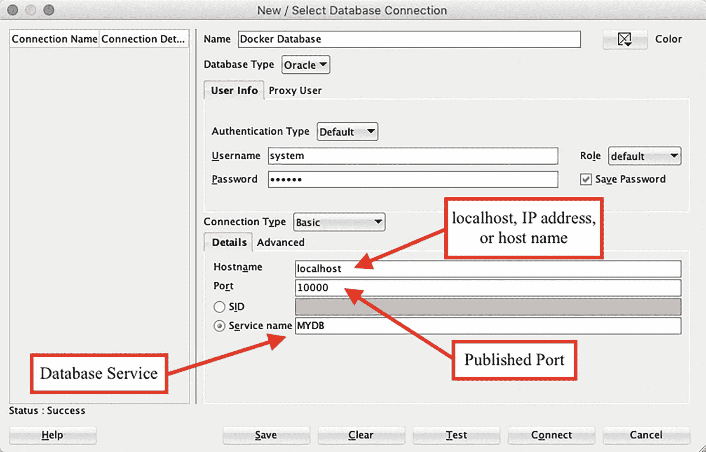

新建或选择数据库连接窗口的屏幕截图，其中显示了 S Q L Developer 的数据库连接对话框，主机名、端口和服务名的条目已填充。本地主机标记为 I P 地址或主机名，端口 1000 标记为已发布端口，服务名 M Y D B 标记为数据库服务。

图 4-8
在 SQL Developer 中添加对在 Docker 容器中运行的数据库的连接

如果您不知道或忘记了端口映射，`docker container ports` 命令会报告此信息（它也是 `docker ps` 输出的一部分）：

```
> docker container port MYDB
1521/tcp -> 0.0.0.0:10000
```

### 管理容器

当涉及到管理新的容器数据库时，其实没什么太多可做的。从 Oracle 的仓库和容器注册表镜像创建的数据库默认设置为 `NOARCHIVELOG` 模式，因此没有归档日志需要管理。在关闭或重启主机时，无需停止容器或其数据库。如果主机或 Docker Desktop 重启，请在系统启动后启动容器。数据库和侦听器将作为该过程的一部分自动启动。

`docker start` 和 `docker stop` 管理容器的状态：

```
> docker stop MYDB
MYDB
> docker start MYDB
MYDB
```


### 摘要

这是一份快速入门指南，介绍如何启动并运行一个包含 Oracle 数据库的容器。这是一个“配方”，没有解释“如何”或“为何”背后的原理或理由。您可以在需要快速创建数据库、回忆常用命令，或作为构建新镜像的复习参考时使用它。并且，就像配方一样，您可以随意调整它以符合您的喜好。

既然您已经了解到构建数据库如此快速便捷，您几乎已准备好开始定制镜像和容器，并探索利用 Docker 功能的方法。下一章将探讨运行 Oracle 容器时您将遇到的本质差异。第 6 章将介绍如何修改我们刚刚创建的基础容器以满足不同需求。

脚注 1   2   3   4   5   6   7   8   9   10

## 5. 数据库容器的差异

我年纪足够大，还记得 Oracle 数据库管理员手动管理回滚段的日子。当 Oracle 引入自动撤销保留时，人们（包括我自己）对此表示怀疑，确信它无法妥善管理回滚。多年后，我无法想象没有这个功能的世界！

多年来，数据库管理员对其他新功能和进步也表示过怀疑，包括恢复管理器、自动共享内存管理和虚拟机。每一项都引入了新的、与熟悉方法不同的工作方式。随着时间的推移，我们的理解和接受度逐渐提高，直到这些（以及其他新功能）成为我们现在习以为常的常规。

改变并非易事。主流最初会拒绝进步，常常没有理由或理解，仅仅因为我们不习惯它们。然而，它们被称为*进步*是有原因的；容器也不例外。例如，谷歌夸口说他们在容器中运行一切，如图 5-1 中来自 [*https://cloud.google.com/containers*](https://cloud.google.com/containers) 的屏幕截图所示。

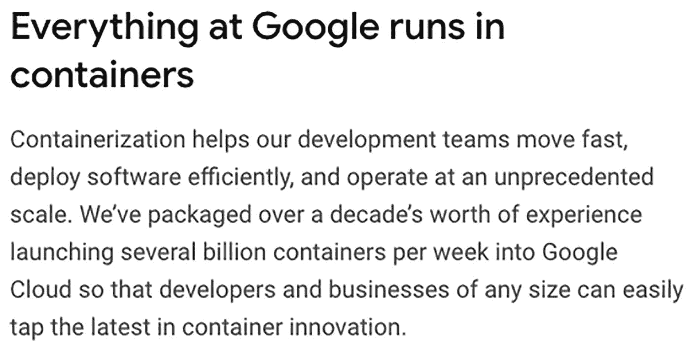

一幅文本图像，标题是“谷歌的一切都在容器中运行”。它提到了容器化如何帮助开发团队提高效率。

图 5-1

谷歌在容器中运行一切

改变可能令人不适，但对于想要进步或改进的组织和个人来说，这是必要且至关重要的。到目前为止，我们已经介绍了 Docker 的基本概念，并演示了如何开始构建和运行 Oracle 数据库镜像。如果您的目标仅限于在本地环境中运行一个简单的数据库，这些已经足够了。在本章中，我将介绍容器与传统数据库平台的一些不同之处。理解这些概念对于将容器集成到您的实践中，并使其适应和定制以满足您当前和未来的需求至关重要。

在我们开始修改之前，了解 Oracle 容器中的环境与在 Linux 系统上原生运行的“普通”数据库环境有何不同至关重要。为此，我们将检查从 Oracle 仓库构建的默认容器，并探索使其与众不同的独特方面和特性。

已经熟悉容器但尚未运行容器化 Oracle 数据库的读者应从本节开始。有些概念可能很熟悉，但了解 Oracle 数据库如何在容器中适配和实现是很有价值的。

### 启动一个 Oracle 数据库容器

我们将从一个使用 Oracle 的 GitHub 脚本 ([`https://github.com/oracle/docker-images`](https://github.com/oracle/docker-images)) 构建的基础容器开始，使用一个非常基础的命令：

```
> docker run -d --name ORCL oracle/database:19.3.0-ee
```

让我们分解这个命令以便更好地理解：

*   `docker run`：指示 Docker “运行”一个镜像
*   `-d` 标志：通知 Docker 我们希望在后台*分离*（非交互式）运行容器
*   `--name` 标志：为容器分配一个名称 *ORCL*
*   `oracle/database:19.3.0-ee`：指定 Docker 将使用的镜像

Docker 会返回一个标识该容器的唯一哈希值：

```
> docker run -d --name ORCL oracle/database:19.3.0-ee
8facfd649aa4fcdbf27ae6908a573c2a16db0be7cba73c3093593507ac12b93f
```

这并没有告诉我们太多信息！`docker logs` 命令报告容器内部发生的情况。在清单 5-1 中，我运行了 `docker logs`，传递了容器名称以及一个可选标志 `-f`，以主动“跟踪”进度并查看实时发生的事件。如果没有这个标志，Docker 将仅报告日志中最近的几行。

```
> docker logs -f ORCL
ORACLE EDITION: ENTERPRISE
ORACLE PASSWORD FOR SYS, SYSTEM AND PDBADMIN: 2Fy7ZqtWS9U=1
LSNRCTL for Linux: Version 19.0.0.0.0 - Production on 06-MAR-2022 22:04:37
Copyright (c) 1991, 2019, Oracle.  All rights reserved.
Starting /opt/oracle/product/19c/dbhome_1/bin/tnslsnr: please wait...
TNSLSNR for Linux: Version 19.0.0.0.0 - Production
System parameter file is /opt/oracle/product/19c/dbhome_1/network/admin/listener.ora
Log messages written to /opt/oracle/diag/tnslsnr/8facfd649aa4/listener/alert/log.xml
Listening on: (DESCRIPTION=(ADDRESS=(PROTOCOL=ipc)(KEY=EXTPROC1)))
Listening on: (DESCRIPTION=(ADDRESS=(PROTOCOL=tcp)(HOST=0.0.0.0)(PORT=1521)))
Connecting to (DESCRIPTION=(ADDRESS=(PROTOCOL=IPC)(KEY=EXTPROC1)))
STATUS of the LISTENER

Alias                     LISTENER
Version                   TNSLSNR for Linux: Version 19.0.0.0.0 - Production
Start Date                06-MAR-2022 22:04:46
Uptime                    0 days 0 hr. 0 min. 8 sec
Trace Level               off
Security                  ON: Local OS Authentication
SNMP                      OFF
Listener Parameter File   /opt/oracle/product/19c/dbhome_1/network/admin/listener.ora
Listener Log File         /opt/oracle/diag/tnslsnr/8facfd649aa4/listener/alert/log.xml
Listening Endpoints Summary...
(DESCRIPTION=(ADDRESS=(PROTOCOL=ipc)(KEY=EXTPROC1)))
(DESCRIPTION=(ADDRESS=(PROTOCOL=tcp)(HOST=0.0.0.0)(PORT=1521)))
The listener supports no services
The command completed successfully
Prepare for db operation
8% complete
Copying database files
Creating and starting Oracle instance
32% complete
...
46% complete
Completing Database Creation
54% complete
Creating Pluggable Databases
```

**清单 5-1**
使用 `docker logs` 命令跟踪或“追踪”容器日志。当使用 `-f` 选项运行时，`docker logs` 会持续运行——键入 `ctrl-c` 可退出日志会话

仓库作者体贴地在容器脚本中包含了详尽的日志输出！前两行显示了数据库版本（此处为 Enterprise 版）以及特权数据库账户的（随机生成的）密码。回想一下，我提到过这些并非生产就绪的镜像；这是一个例子——凭证显示在日志输出中！任何有权访问主机或容器的人都可以查看此信息！

容器接下来启动监听器，之后启动脚本（下一章讨论）会检查是否存在数据库。如果存在，则启动数据库。如果不存在，它会调用 Oracle *数据库配置助手*，即 *DBCA*，来创建一个新数据库。这是我们第一次运行此容器，所以 `DBCA` 开始构建数据库。


### 创建数据库并连接到容器

创建数据库是耗时且耗费资源的。根据主机的能力，这可能需要几分钟到一小时不等。在本书后面，我们将讨论绕过数据库创建的方法——即使对于新容器——这些方法允许快速、近乎即时地提供数据库。现在，请监控日志，观察 Oracle 创建数据库的过程，直到你在日志中看到如代码清单 5-2 所示的消息“`DATABASE IS READY TO USE`”，这表明 `DBCA` 已成功完成。

```
77% complete
Executing Post Configuration Actions
100% complete
Database creation complete. For details check the logfiles at:
/opt/oracle/cfgtoollogs/dbca/ORCLCDB.
Database Information:
Global Database Name:ORCLCDB
System Identifier(SID):ORCLCDB
Look at the log file "/opt/oracle/cfgtoollogs/dbca/ORCLCDB/ORCLCDB.log" for further details.
...
#########################
DATABASE IS READY TO USE!
#########################
The following output is now a tail of the alert.log:
ORCLPDB1(3):
ORCLPDB1(3):XDB initialized.
Listing 5-2
Docker 日志的输出显示 DBCA 已完成，数据库已准备就绪
```

太好了！数据库已就绪。现在呢？是时候连接到容器，看看容器“内部”是什么样子了！

### 连接到容器

连接到容器就像建立到远程主机的 `SSH` 连接一样。一旦连接建立，我们就可以使用熟悉的 shell 命令在容器的操作系统中导航，就像连接到外部机器一样。在容器中运行的命令不会影响本地环境。

我们将使用 `docker exec` 命令连接到容器。`docker exec` 中的 `exec` 代表执行，其基本语法是：

```
docker exec
```

容器名称是目标容器，命令是容器中存在的任何可执行脚本或命令。为了在容器中启动一个交互式会话，我们将执行一个 shell——在本例中是 `bash`：

```
> docker exec -it ORCL bash
[oracle@8facfd649aa4 ~]$
```

让我们分解一下这个命令：

*   `-it` 标志是向 Docker 传递多个标志的简写方式。它们代表 `--interactive` (`-i`) 和 `--tty` (`-t`)，组合使用以保持 `STDIN` 打开，同时为容器分配一个 `pseudo-TTY` 或类似终端的会话。简单来说，这意味着你获得了一个交互式会话。（标志的顺序无关紧要。它们可以单独出现或组合出现，并且你可以混合使用长短标志。）

*   `ORCL` 是容器的名称。

*   `bash` 是 Docker 在容器中运行的命令。`bash`，即 `Bourne Again SHell`，是许多 Linux 操作系统（包括 Oracle Enterprise Linux）的默认 shell。

Docker 的响应提示符是 `[oracle@8facfd649aa4 ~]$`。默认提示符显示了用户（`oracle`）、主机名（`8facfd649aa4`）和当前工作目录（`~`，一个代表用户主目录的特殊简写字符）。

容器名称是 `ORCL`，那么主机名不也应该是 `ORCL` 吗？`8facfd649aa4` 是从哪里来的？

如果你在主机上打开一个新会话，并使用 `docker ps` 命令查看正在运行的容器，你会看到主机名 `8facfd649aa4` 同时也是容器 ID：

```
> docker ps
CONTAINER ID   IMAGE                       NAMES
8facfd649aa4   oracle/database:19.3.0-ee   ORCL
```

Docker 仍然能识别我们分配的“友好”容器名称，并且在调用命令时，我们可以同时使用容器 ID 和容器名称来引用容器。Docker 为容器创建唯一标识符并用作主机名，以避免用户分配的名称可能违反主机命名约定而引发的问题。

你可以使用不同的 shell 登录容器，只要它们是镜像的一部分，例如，用 `sh` 代替 `bash`：

```
> docker exec -it ORCL sh
sh-4.2$
```

`docker exec` 是本书中我们将用于连接到容器并在容器中运行命令的主要方法。

### 探索 Oracle 数据库容器

现在你已经连接到数据库容器，让我们看看环境。乍一看，它似乎与在 Linux 中原生运行的典型数据库主机没有什么不同。代码清单 5-3 展示了一些用于查询环境的基本命令的结果。它们似乎表明这是一台运行 RHEL 7.8 的 Linux 机器。`oracle` 用户存在，Oracle 的 `PMON` 进程也在运行。数据库条目在 `/etc/oratab` 文件中。一切看起来都很正常！

```
[oracle@8facfd649aa4 ~]$ id
uid=54321(oracle) gid=54321(oinstall) groups=54321(oinstall),54322(dba),54323(oper),54324(backupdba),54325(dgdba),54326(kmdba),54330(racdba)
[oracle@8facfd649aa4 ~]$ cat /etc/redhat-release
Red Hat Enterprise Linux Server release 7.8 (Maipo)
[oracle@8facfd649aa4 ~]$ ps -ef | grep pmon | grep -v grep
oracle      2464       1  0 22:42 ?        00:00:00 ora_pmon_ORCLCDB
[oracle@8facfd649aa4 ~]$ egrep -v "^$|^#" /etc/oratab
ORCLCDB:/opt/oracle/product/19c/dbhome_1:N
Listing 5-3
查看有关容器用户、操作系统和数据库的基本信息
```

确实，大多数事情看起来都很普通。这正是容器的魔力所在——对于所有（或大多数）目的而言，它们与成熟的原生主机难以区分。如果不是这样，我们就必须绕过这些差异才能让应用程序（如 Oracle 数据库）按预期工作！

### 容器差异

我们已经看到了一个差异的暗示——主机名。让我们更深入地看看这个以及其他差异。

#### 主机名

代码清单 5-4 深入探讨了我们之前看到的主机命名。在显示容器内 `/etc/hosts` 文件的内容后，我尝试（但失败了）将主机名更改为更用户友好的名称。

```
[oracle@8facfd649aa4 ~]$ hostname
8facfd649aa4
[oracle@8facfd649aa4 ~]$ cat /etc/hosts
127.0.0.1     localhost
::1     localhost ip6-localhost ip6-loopback
fe00::0    ip6-localnet
ff00::0     ip6-mcastprefix
ff02::1     ip6-allnodes
ff02::2     ip6-allrouters
172.17.0.7     8facfd649aa4
[oracle@8facfd649aa4 ~]$ hostname ORCL
hostname: you must be root to change the host name
Listing 5-4
Oracle 用户无法更改主机名
```

当然，`oracle` 用户无法更改主机名！但事实证明，`root` 用户也无法在容器中更改主机名，如代码清单 5-5 所示。我使用 `docker exec` 登录容器，并添加了 `-u`（或 `--user`）标志将用户定义为 `root`。在确认以 `root` 身份登录后，我仍然无法更改主机名。（稍后我会展示一个解决方法。现在，请将此视为在容器中工作时需要牢记的几个差异中的第一个！）

```
> docker exec -it -u root ORCL bash
bash-4.2# whoami
root
bash-4.2# hostname ORCL
hostname: you must be root to change the hostname
Listing 5-5
root 用户也无法更改主机名！
```


#### cron

容器通常也不包含 `cron`，即 Linux 的任务调度系统。虽然容器拥有操作系统，^(³¹) 但它们并非完整的系统。容器会调用二进制文件并引用该目录结构中的库，但依赖宿主机来执行系统级操作。宿主内核像处理任何进程一样处理 CPU、存储和网络交互。让应用进程去重复这些任务是没有意义的！

容器也不例外，`cron` 就是这样一个系统管理的进程。查看清单 5-6 看看我的容器中包含“system”文本的进程。与之对比的是清单 5-7 的输出，它显示了在我的运行完整 Ubuntu Linux 操作系统的宿主机上的系统进程。

```
> ps -ef | grep system
root         486       1  0 Feb14 ?        00:00:10 /lib/systemd/systemd-journald
root         520       1  0 Feb14 ?        00:00:14 /lib/systemd/systemd-udevd
systemd+     741       1  0 Feb14 ?        00:00:05 /lib/systemd/systemd-timesyncd
systemd+     750       1  0 Feb14 ?        00:00:10 /lib/systemd/systemd-networkd
systemd+     753       1  0 Feb14 ?        00:00:11 /lib/systemd/systemd-resolved
message+     792       1  0 Feb14 ?        00:00:32 /usr/bin/dbus-daemon--system --address=systemd: --nofork --nopidfile --systemd-activation --syslog-only
root         809       1  0 Feb14 ?        00:00:14 /lib/systemd/systemd-logind
root         812       1  0 Feb14 ?        00:04:09 /usr/sbin/thermald--systemd --dbus-enable--adaptive
lab       744954       1  0 Feb26 ?        00:01:05 /lib/systemd/systemd --user
lab      2348206 2334483  0 23:56 pts/6    00:00:00 grep --color=auto system
清单 5-7
宿主机上包含“system”的进程
```

```
[oracle@8facfd649aa4 ~]$ ps -ef | grep system
oracle     6486    4347  0 23:56 pts/0   00:00:00 grep --color=auto system
清单 5-6
容器中包含“system”的进程
```

容器中没有系统进程。这包括调度和运行 `cron` 所需的任何进程。然而，用于管理 `cron` 作业的 `crontab` 命令是存在的，`oracle` 用户可以运行它：

```
[oracle@8facfd649aa4 ~]$ ls -l /bin/crontab
-rwsr-xr-x 1 root root 57656 Jun  9  2019 /bin/crontab
[oracle@8facfd649aa4 ~]$ crontab -l
no crontab for oracle
```

让我们尝试通过添加一个条目来编辑 `crontab`：

```
[oracle@8facfd649aa4 ~]$ crontab -e
no crontab for oracle - using an empty one
/bin/sh: /usr/bin/vi: No such file or directory
crontab: "/usr/bin/vi" exited with status 127
[oracle@8facfd649aa4 ~]$
```

它失败了——但原因可能出乎你的意料！`crontab -e`（用于编辑）会调用 `vi`（*visual*）编辑器，但 *vi 不存在*！为了解决这个问题，我使用 `-u root` 选项登录到一个新会话，并用 `yum` 安装了 `vi`：

```
> docker exec -it -u root ORCL bash
bash-4.2# yum install -y vi
Loaded plugins: ovl
ol7_latest                            | 3.6 kB  00:00:00
(1/3): ol7_latest/x86_64/group_gz     | 136 kB  00:00:00
(2/3): ol7_latest/x86_64/updateinfo   | 3.4 MB  00:00:03
(3/3): ol7_latest/x86_64/primary_db   |  39 MB  00:00:08
Resolving Dependencies
--> Running transaction check
---> Package vim-minimal.x86_64 2:7.4.629-8.0.1.el7_9 will be installed
--> Finished Dependency Resolution
...
Install  1 Package
Total download size: 443 k
...
Installed:
vim-minimal.x86_64 2:7.4.629-8.0.1.el7_9
Complete!
```

既然 `vi` 已经存在，我应该可以返回到我原来的会话，并为 `oracle` 用户的 crontab 添加一个条目。我添加了这一行：

```
* * * * * touch /home/oracle/added_by_cron
```

对于那些不熟悉 `cron` 语法的人，这个作业将在每天的每小时每分钟运行，并“`touch`”（或创建）一个名为 `/home/oracle/added_by_cron` 的空文件。如果文件不存在，`cron` 将创建它。当我检查 `oracle` 用户的 `crontab` 时，这一行是存在的：

```
[oracle@8facfd649aa4 ~]$ crontab -l
* * * * * touch /home/oracle/added_by_cron
```

或者说，`cron` 应该创建它，但它没有。清单 5-8 显示，即使过了 30 分钟，文件仍然不在那里！

```
[oracle@8facfd649aa4 ~]$ date
Mon Jan  7 00:10:01 UTC 2022
[oracle@8facfd649aa4 ~]$ ls -l /home/oracle
total 0
lrwxrwxrwx 1 root root 26 Apr 10  2021 setPassword.sh -> /opt/oracle/setPassword.sh
[oracle@8facfd649aa4 ~]$ date
Mon Jan  7 00:44:26 UTC 2022
[oracle@8facfd649aa4 ~]$ ls -l /home/oracle
total 0
lrwxrwxrwx 1 root root 26 Apr 10  2021 setPassword.sh -> /opt/oracle/setPassword.sh
清单 5-8
容器内的 cron 行为不符合预期！
```

有趣！也许 `cron` 服务没有运行。在清单 5-9 中，我回到了之前启动的 `root` 会话，检查了状态，并尝试启动该服务。

```
bash-4.2# service crond status
Redirecting to /bin/systemctl status crond.service
Failed to get D-Bus connection: Operation not permitted
bash-4.2# service crond start
Redirecting to /bin/systemctl start crond.service
Failed to get D-Bus connection: Operation not permitted
清单 5-9
root 用户无法在容器内启动 cron
```

这是有意为之的。`cron` 是一个系统进程，而容器期望宿主机操作系统来处理它们。虽然二进制文件存在于容器文件系统中——甚至是可执行的——但容器内没有运行的系统进程来识别和执行作业。

容器中缺乏运行的 `init.d` 或 `system.d` 进程引发了合理的担忧，特别是对于 Oracle 数据库。我们如何在容器中安排备份？更进一步，像 *Oracle Grid Infrastructure*、*Oracle Real Application Clusters* 和 *Oracle Restart* 这些严重依赖 `init.d` 或 `system.d` 的产品，在容器中如何工作？幸运的是，有办法为容器添加此功能。

现在让我们重新审视之前遇到的 `vi` 编辑器问题，看看它为什么缺失！


#### 二进制文件

容器通常被大规模部署。较小的容器能最大化基础设施容量，并减少跨网络复制的时间。构建容器镜像的目标是剔除任何不必要的组件。像`vi`这样的编辑器并非必需。

没有编辑器，如何在容器中更改文件？简单的答案是，在*大多数*容器中并不这样做。与虚拟和物理主机不同，镜像提供了即用型文件系统，用于执行特定的服务或功能。它们并非多用途的交互式系统。如果需要编辑某些内容，这将在构建过程中完成并固化到镜像中，而不是在容器运行之后。如果需要修改容器中的文件，像`sed`这样对自动化友好的编辑器是更合适的选择。

你在第[3]章中了解到，在容器中所做的更改会写入联合文件系统的一个层中。联合文件系统评估上下层之间的差异，并将结果投射到容器中。除了在容器层中增加空间外，计算这些差异还需要 CPU，而在容器中限制更改会影响性能。

这不仅仅关乎空间和性能。你会发现，容器镜像中缺少的二进制文件和工具远不止编辑器。任何不必要的东西都会增加一个*攻击面*，恶意行为者可能加以利用。攻击者无法利用不存在的东西。

系统的攻击面是未经授权的用户可能用来获取系统访问权限的潜在向量或点的集合。限制安装在容器上的软件可以减少攻击者可用的资源，并凸显了容器与物理或虚拟主机之间的另一个区别。完整的操作系统往往包含用户*可能*需要的工具和实用程序。容器镜像的范围更有限，只包含必需的内容。

用于 Docker 的 Linux 发行版通常提供“*-slim*”选项，表示精简版发行版。没有约定明确界定精简版包含或不包含（或更准确地说，排除）什么，这在供应商和版本之间各不相同。面向生产的镜像通常从一个精简版开始，然后添加必要的内容。正如我们将在第[12]章中看到的，Oracle 的数据库镜像也遵循这一做法，使用 Oracle Enterprise Linux 7 的“slim”发行版作为基础。

对我们大多数人来说，将数据库放入容器的第一个用例涉及一些交互，这意味着需要编辑器和诊断工具。幸运的是，修改构建脚本以包含二进制文件很容易，这将在下一章中讨论。

#### Oracle 目录

Oracle 容器注册表镜像的另一个独特之处在于某些 Oracle 特定文件的位置。在[清单 5-10]中，我导航到`ORACLE_BASE`目录并列出了其内容。

```bash
[oracle@8facfd649aa4 opt]$ cd $ORACLE_BASE
[oracle@8facfd649aa4 oracle]$ pwd
/opt/oracle
[oracle@8facfd649aa4 oracle]$ ls -l
total 92
drwxr-x--- 3 oracle oinstall 4096 Mar  6 22:04 admin
drwxr-x--- 2 oracle oinstall 4096 Mar  6 22:04 audit
drwxr-x--- 4 oracle oinstall 4096 Mar  6 22:15 cfgtoollogs
-rwxrwxr-x 1 oracle dba      1040 Mar 31  2021 checkDBStatus.sh
drwxr-xr-x 2 oracle dba      4096 Apr 10  2021 checkpoints
-rwxrwxr-x 1 oracle dba      4121 Mar 31  2021 createDB.sh
-rw-rw-r-- 1 oracle dba      9204 Oct 11  2020 dbca.rsp.tmpl
drwxrwxr-x 1 oracle dba      4096 Apr 10  2021 diag
drwxrwx--- 1 oracle dba      4096 Mar  6 23:32 oraInventory
drwxrwxr-x 1 oracle dba      4096 Mar  6 23:33 oradata
drwxrwxr-x 1 oracle dba      4096 Apr 10  2021 product
-rwxrwxr-- 1 oracle dba      1941 Oct 11  2020 relinkOracleBinary.sh
-rwxrwxr-x 1 oracle dba      6488 Mar 31  2021 runOracle.sh
-rwxrwxr-x 1 oracle dba      1015 Oct 11  2020 runUserScripts.sh
drwxrwxr-x 1 oracle dba      4096 Apr 10  2021 scripts
-rwxrwxr-x 1 oracle dba       758 Oct 11  2020 setPassword.sh
-rwxrwxr-x 1 oracle dba       678 Oct 11  2020 startDB.sh
```
**清单 5-10** Oracle 数据库容器中`ORACLE_BASE`的内容

暂时忽略那些 shell 脚本。我希望你仔细查看那些*目录*。这里大部分内容都是我们期望看到的。Admin、audit 和 diagnostic 目录——确认！构成系统上安装的`ORACLE_HOME`根目录的 product 目录——确认！Oracle 存储数据库文件的`oradata`目录——确认！但是，`oraInventory`？

Oracle 的数据库清单是主机上安装的不同 Oracle 产品的元数据集合，Oracle 并不建议在`ORACLE_BASE`内或之下安装，但它却在这里。为什么？

这与容器使用联合文件系统以提高效率的方式有关。关于这一点，让我们看看`oradata`目录。

#### 配置文件

进一步深入 `ORACLE_BASE/oradata` 目录，你会注意到两个子目录：`ORCLCDB` 和 `dbconfig`：

```
[oracle@8facfd649aa4 oradata]$ pwd
/opt/oracle/oradata
[oracle@8facfd649aa4 oradata]$ ls -l
total 8
drwxr-x--- 4 oracle oinstall 4096 Mar  6 22:15 ORCLCDB
drwxr-xr-x 3 oracle oinstall 4096 Mar  6 23:33 dbconfig
```

这里的 `ORCLCDB` 目录是预期之中的。它是*最优灵活架构*（*Optimal Flexible Architecture*,^(³²) 或 *OFA*）的一部分，并构成了根目录，其中包含属于主机上运行的 `ORCLCDB` 数据库实例的*控制文件*、*数据文件*和*重做日志文件*。

在清单 5-11 中，我列出了 `ORCLCDB` 子目录的内容。正如预期的那样，这里包含了数据库文件以及用于可插拔数据库 `ORCLPDB1` 和 PDB 种子文件的子目录。这与非容器环境中的 Oracle 数据库安装是一致的。

```
[oracle@8facfd649aa4 oradata]$ ls -l ORCLCDB
total 2341684
drwxr-x--- 2 oracle oinstall      4096 Mar  6 23:32 ORCLPDB1
-rw-r----- 1 oracle oinstall  18726912 Mar  7 01:44 control01.ctl
-rw-r----- 1 oracle oinstall  18726912 Mar  7 01:44 control02.ctl
drwxr-x--- 2 oracle oinstall      4096 Mar  6 22:37 pdbseed
-rw-r----- 1 oracle oinstall 209715712 Mar  7 00:38 redo01.log
-rw-r----- 1 oracle oinstall 209715712 Mar  7 01:44 redo02.log
-rw-r----- 1 oracle oinstall 209715712 Mar  6 23:32 redo03.log
-rw-r----- 1 oracle oinstall 545267712 Mar  7 01:41 sysaux01.dbf
-rw-r----- 1 oracle oinstall 933240832 Mar  7 01:41 system01.dbf
-rw-r----- 1 oracle oinstall  33562624 Mar  6 22:44 temp01.dbf
-rw-r----- 1 oracle oinstall 246423552 Mar  7 01:43 undotbs01.dbf
-rw-r----- 1 oracle oinstall   5251072 Mar  7 00:43 users01.dbf
```
*清单 5-11*
容器中 `$ORACLE_BASE/oradata/$ORACLE_SID` 的内容

然而，*dbconfig* 目录却出乎意料。清单 5-12 显示了 `dbconfig` 目录的内容。这里有一个对应 `ORACLE_SID` 的子目录，并且在其下方，存在一些意外的文件！

```
[oracle@8facfd649aa4 oradata]$ ls -l dbconfig
total 4
drwxr-xr-x 2 oracle oinstall 4096 Mar  6 23:33 ORCLCDB
[oracle@8facfd649aa4 oradata]$ ls -l dbconfig/ORCLCDB
total 24
-rw-r--r-- 1 oracle oinstall  234 Mar  6 22:04 listener.ora
-rw-r----- 1 oracle oinstall 2048 Mar  6 22:15 orapwORCLCDB
-rw-r--r-- 1 oracle oinstall  784 Mar  6 23:33 oratab
-rw-r----- 1 oracle oinstall 3584 Mar  6 23:33 spfileORCLCDB.ora
-rw-r--r-- 1 oracle oinstall   53 Mar  6 22:04 sqlnet.ora
-rw-r----- 1 oracle oinstall  211 Mar  6 23:33 tnsnames.ora
```
*清单 5-12*
`$ORACLE_BASE/oradata/dbconfig/$ORACLE_SID` 的内容

这些配置文件通常保存在 `ORACLE_HOME` 或 `/etc` 下。它们为什么会在这里？

要回答这个问题，首先看看三个网络文件——`listener.ora`、`sqlnet.ora` 和 `tnsnames.ora`——在清单 5-13 中的默认位置，即 `ORACLE_HOME/network/admin` 目录。这些网络配置文件*链接*到了 `ORACLE_BASE/oradata/dbconfig/ORCLCDB` 中的文件！

```
[oracle@8facfd649aa4 oradata]$ ls -l $ORACLE_HOME/network/admin
total 8
lrwxrwxrwx 1 oracle oinstall   49 Mar  6 23:33 listener.ora -> /opt/oracle/oradata/dbconfig/ORCLCDB/listener.ora
drwxr-xr-x 2 oracle dba      4096 Apr 17  2019 samples
-rw-r--r-- 1 oracle dba      1536 Feb 14  2018 shrept.lst
lrwxrwxrwx 1 oracle oinstall   47 Mar  6 23:33 sqlnet.ora -> /opt/oracle/oradata/dbconfig/ORCLCDB/sqlnet.ora
lrwxrwxrwx 1 oracle oinstall   49 Mar  6 23:33 tnsnames.ora -> /opt/oracle/oradata/dbconfig/ORCLCDB/tnsnames.ora
```
*清单 5-13*
容器中 `$ORACLE_HOME/network/admin` 的内容。监听器、SQL*Net 和 TNS 配置链接到 dbconfig 目录下的文件

清单 5-14 显示了*密码文件* (`orapwORCLCDB`) 和*服务器参数文件*（或 *spfile*）(`spfileORCLCDB.ora`) 在其“正确”位置 `ORACLE_HOME/dbs` 中，也同样链接到了 `ORACLE_BASE/oradata/dbconfig/ORCLCDB`！

```
[oracle@8facfd649aa4 oradata]$ ls -l $ORACLE_HOME/dbs
total 12
-rw-rw---- 1 oracle oinstall 1544 Mar  6 23:32 hc_ORCLCDB.dat
-rw-r--r-- 1 oracle dba      3079 May 14  2015 init.ora
-rw-r----- 1 oracle oinstall   24 Mar  6 22:10 lkORCLCDB
lrwxrwxrwx 1 oracle oinstall   49 Mar  6 23:33 orapwORCLCDB -> /opt/oracle/oradata/dbconfig/ORCLCDB/orapwORCLCDB
lrwxrwxrwx 1 oracle oinstall   54 Mar  6 23:33 spfileORCLCDB.ora -> /opt/oracle/oradata/dbconfig/ORCLCDB/spfileORCLCDB.ora
```
*清单 5-14*
`$ORACLE_HOME/dbs` 中的数据库配置文件链接到 dbconfig 中的对应文件

最后，在清单 5-15 中，我们看到 `oratab` 文件，即 `/etc/oratab`，没有被链接，而是与特殊 `dbconfig` 目录中的神秘文件完全相同。

```
[oracle@8facfd649aa4 oradata]$ ls -l /etc/oratab
-rw-rw-r-- 1 oracle oinstall 784 Mar  6 23:33 /etc/oratab
[oracle@8facfd649aa4 oradata]$ md5sum /etc/oratab
31f3633542a9883ebd7f0eaac771ec7b  /etc/oratab
[oracle@8facfd649aa4 oradata]$ md5sum $ORACLE_BASE/oradata/dbconfig/ORCLCDB/oratab
31f3633542a9883ebd7f0eaac771ec7b  /opt/oracle/oradata/dbconfig/ORCLCDB/oratab
```
*清单 5-15*
`/etc/oratab` 和 `/opt/oracle/oradata/dbconfig/ORCLCDB/oratab` 文件是相同的

对此作何解释？答案在于层和卷。


#### 卷

在第 3 章中，你学习了容器如何使用联合文件系统来存储本地数据。联合文件系统允许从同一镜像启动的多个容器使用相同的文件。两个容器不会占用两倍空间，因为两者共享原始镜像。这就是为什么容器启动如此迅速，并且每个容器的行为都相同。创建容器并不会复制或更改镜像的内容。每个容器都使用（并重用）来自镜像本身的目录结构！

镜像提供了联合文件系统的下层。在它“之上”的一层保存了在每个容器中所做的更改。通过“向下”查看这些层，每个容器要么看到下层（即镜像）中未更改的文件，要么看到保存在上层的本地更改。（请回顾第 3 章中关于层和联合文件系统的讨论。）

这种安排对于写入数据不多的短生命周期应用非常有效。在生命周期更长的更持久系统上——比如数据库——容器中的活动可能会显著增加各个容器的层。图 5-2 显示了 Oracle 数据库容器的情况。左侧的图显示了启动两个数据库容器后的系统状态。Docker 添加了专用于每个容器的层。它们位于镜像之上，最初是空的。但很快，Oracle 开始在容器中创建数据库。在此步骤中添加的数据文件不是镜像的一部分，因此它们被写入容器的层中。（即使它们原本在镜像中，容器层也会捕获对镜像文件的更改。）右侧的图显示了容器层如何增长以容纳额外的内容。

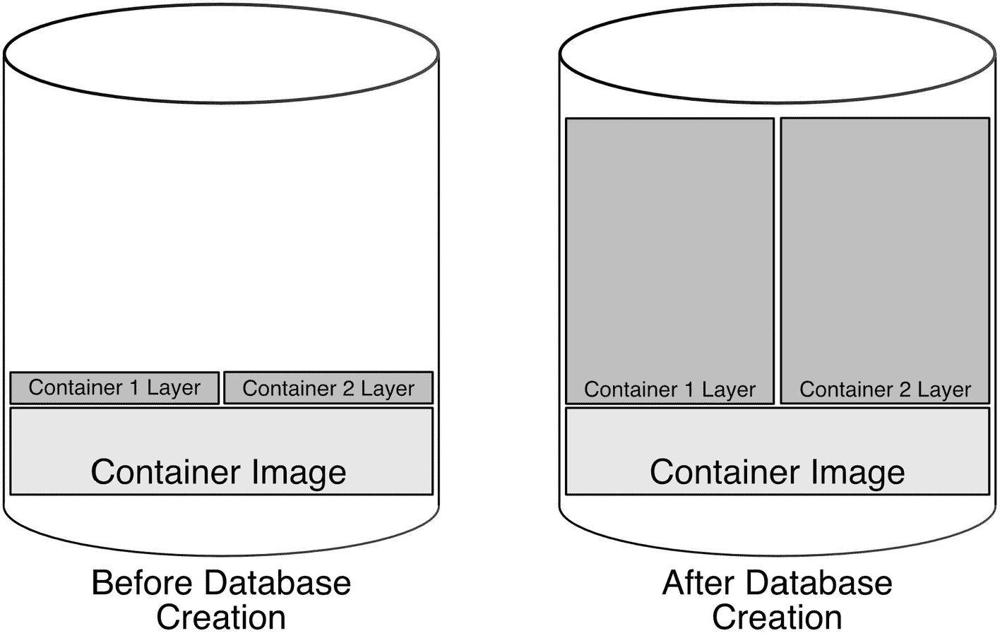

两个数据库容器的示意图。左侧容器在数据库创建前有 2 个空层，右侧容器在数据库创建后层被填满。

图 5-2

运行两个数据库容器的主机表示。左侧的图像代表容器刚启动时的情况。这些层是空的。右侧的图像显示了数据库创建完成后的结果。层大幅增长以容纳在数据库配置期间添加和更改的文件。

这并非理想情况，原因有几个。计算联合文件系统上层和下层之间的差异会加载主机 CPU。数据库也受到限制——容器层位于主机文件系统上，该系统可能不够大，无法容纳不断增长的数据库，或者不够快，无法满足数据库的性能要求。

在容器层中保存数据还有另一个缺点：持久性。分配给容器的上层就是容器本身。删除容器会移除该层——随之消失的还有数据库！

幸运的是，Docker 提供了一种称为卷的解决方案。容器卷将容器内的目录分配给本地主机上分层文件系统之外的存储。当容器将数据保存到挂载目录时，实际上是在将其写入本地主机上的持久存储。

图 5-3 显示了相同的数据库容器，现在为 `/opt/oracle/oradata` 目录使用卷。现在，写入此目录的容器操作将保存到主机文件系统，而不是容器层。容器内的所有其他目录的行为与之前相同。

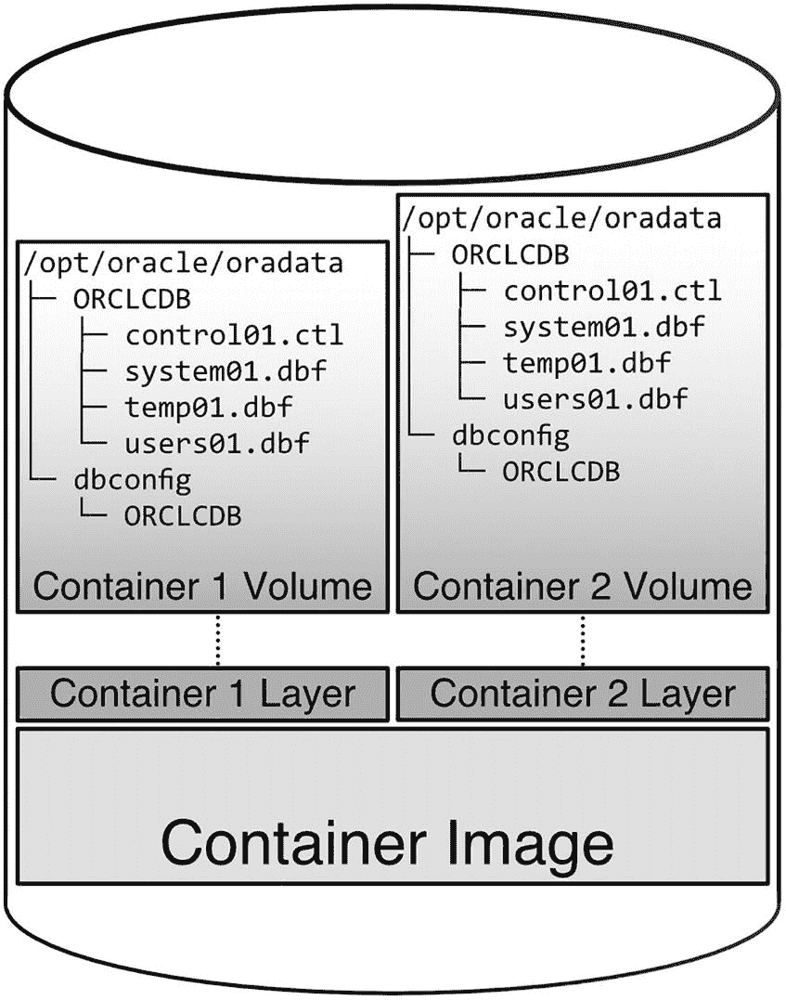

数据库容器的示意图。它展示了两个容器层中内容的卷。

图 5-3

数据库容器使用卷将 `/opt/oracle/oradata` 目录的内容存储到本地文件系统

删除容器会移除上层和工作层，并随之移除它们保存的所有更改。一旦层消失，就无法恢复或重新创建。卷独立于容器，删除其父容器时不受影响。卷也可以像网络文件系统一样工作，在容器和主机之间甚至在容器之间共享文件。它们也可以利用高性能存储来存放数据。

这让我们回到 `oradata` 目录以及 Oracle 数据库配置文件位置背后的谜团。

将 `oradata` 目录挂载为卷，使 Oracle 的易失性数据文件脱离联合文件系统，避免了性能损失。但配置文件的更改频率不足以影响性能。还有另一种解释。

当数据库容器首次启动时，会检查是否存在数据库，如图 5-4 所示。如果检查发现数据库，接下来它会在 `dbconfig` 目录中查找，将其找到的配置文件链接到预期位置，然后启动数据库。否则，它会创建一个新的数据库。完成后，它会将配置文件复制到 `dbconfig` 目录，并用指向这些副本的链接替换它们通常位置上的文件。

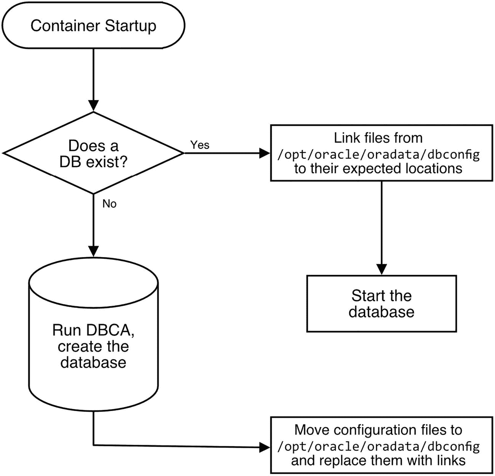

一个流程图，从容器启动开始。如果数据库存在，则链接文件并启动数据库；如果不存在，则运行 D B C A，创建数据库，移动配置文件，并用链接替换它们。

图 5-4

启动 Oracle 数据库容器时执行的操作。无论数据库是旧的还是新的，它都会将配置文件保存在 `dbconfig` 目录中

使用卷时，`/opt/oracle/oradata` 目录中的数据被写入本地主机。位于 `ORACLE_BASE` 和 `ORACLE_HOME` 下的配置文件、`/etc/oratab` 文件以及数据库清单——保存在容器的临时层中——在删除容器时会丢失。在这种情况下，它删除的是指向这些文件的*链接*^(³³)，而不是文件本身。数据库配置文件安全地保存在卷上，如图 5-5 所示。

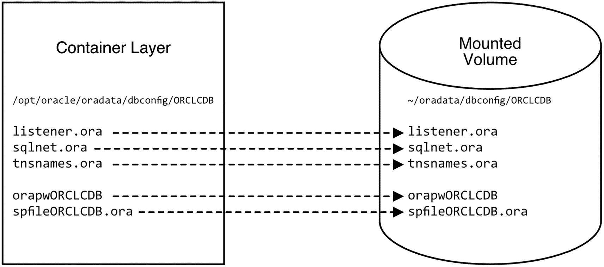

数据库配置文件位置的示意图。左侧的容器层有指向文件的链接，右侧挂载的卷存储实际的配置文件。

图 5-5

容器中 ORACLE_HOME 下的数据库配置文件并非物理存在。它们是指向 `/opt/oracle/oradata/dbconfig` 下文件的链接。

该卷是重建数据库所需一切的快照。当我删除容器时，卷会保留下来。当我启动一个新容器并将其 `oradata` 卷映射到先前容器留下的目录时，会发生什么？^(³⁴)

启动脚本检查是否存在数据库，并且——尽管它是全新的——*它发现了来自现有数据库的文件*！^(³⁵) 容器不知道这些文件来自一个现已删除的容器。它只看到数据库所需的文件。它没有创建新数据库，而是启动了它发现的那个。

每次启动脚本运行时，它都会检查是否存在数据库，如果发现，则在必要时重新创建链接，从其预期位置指向 `/opt/oracle/oradata/dbconfig/$ORACLE_SID` 目录中的文件。


我们可以利用这一特性来**极其快速**地配置数据库克隆。卷上的数据与特定容器之间没有绑定关系。复制一份现有的 `oradata` 目录并将其用于新容器，就能让 Oracle 完全跳过数据库创建过程！只要在容器创建时传递的 `ORACLE_SID` 及其他数据库特定环境变量与卷上数据库使用的值相匹配，`oradata` 卷的内容就可用于在同系统上克隆数据库、将数据复制到不同机器，甚至跨主机操作系统共享——而无需任何修改！

卷的真正威力体现在故障排查和练习/优化复杂流程时。最近，我与 Oracle 支持团队进行了一次屏幕共享会话，以诊断一个发生在数据库升级深处的问题。在演示了问题后，他们建议更改一个配置，然后重新运行升级。分析人员预计我需要几个小时才能将数据库恢复到升级前状态并重新运行该过程。然而，由于我在容器中工作，并且拥有故障发生前数据库的一份副本，因此仅用了几分钟就停止了容器、恢复了快照副本并重启了容器！

卷是容器化运行的数据库所独有的强大特性。在 Docker 中恢复和克隆数据库**不需要** DBA 或 `RMAN` 知识。这只是简单的目录复制。将数据视为卷上一套自包含的文件，与容器中的数据库软件分离开来，这改变了开发团队的工作方式。将数据视为独立资产意味着组织可以对数据进行版本控制和共享，几乎不依赖或完全无需依赖专门的数据库技能。

### 总结

不同并无好坏之分，只是不同而已。关键在于我们如何拥抱这种“不同”。这可能简单到尝试菜单上的新菜品，或者对技术演进带来的可能性持开放态度！

在本章中，你学习了启动容器和监控活动的基本命令，以及如何连接和浏览数据库容器。登录到容器系统后，你探索了一些使容器区别于传统系统的特性，包括某些二进制文件和功能（如 `cron`）的缺失。请记住，容器并非我们习惯的完备环境，可能迫使我们重新思考如何完成特定任务。然而，这些差异并非没有回报。使用最小化或精简的文件系统可提高性能并减少容器的受攻击面。

你还发现了如何使用卷将数据持久化在容器外部，使其独立于容器的生命周期。卷还使得持久、高性能的网络附加存储能够被容器中托管的数据库访问。

本章最重要的概念或许是 Oracle 在容器数据库中重定位数据库配置文件的方法。将这些文件与数据库的控制文件、数据文件和重做日志文件一起保存到卷上，可将数据库软件与数据库本身分离开来。这些清晰的边界对于独立管理每个组件至关重要。运行容器化数据库的组织可以将数据作为可版本化、可移植的资产进行管理，将数据集成到 DevOps 流程中，并加速开发生命周期。

在对 Docker 的某些内部机制有了更深的理解后，你已准备好进入下一章，开始定制容器！

脚注 1   2   3   4   5

## 6. 定制容器环境

运行容器类似于调用一个复杂的 Shell 脚本。容器和 Shell 脚本都执行一个特定范围的任务。脚本可以是显式的，带有硬编码的值，但增加一些灵活性可以使它们更具可移植性和价值。这可能意味着从环境中获取特定值，或在运行时解释传递给脚本的参数。以一个 `RMAN` 备份脚本为例。硬编码数据库名称会阻止它在其他数据库上使用。将数据库名称作为变量传递，同一个脚本就可以在整个企业中使用。为备份目的地、并行度和增量级别增加更多选项，使该脚本在各种实现中变得灵活和有价值得多。

`Docker` 在这方面类似，在本章中，我们将深入探讨 `docker run` 命令的一个选项，该选项将变量和值传递到容器的私有环境。这些环境变量就像 Shell 脚本的参数，允许一个镜像动态工作，支持各种需求或应用。当 Oracle 数据库容器启动时，它会评估容器环境——如同备份脚本读取参数——并应用更改到容器中，以创建和运行一个匹配的数据库。

其背后的魔法是一个特殊的指令，每当容器启动时，`Docker` 会自动运行它。

### 启动过程

之前我提到过启动过程。从高层次来看，它会检查数据库是否存在，如果找到，则启动它。如果没有，则运行 `数据库配置助手 (DBCA)` 在容器中创建一个新数据库。我们正在使用的 Oracle 容器仓库镜像的启动指令^(³⁶)是一个名为 `runOracle.sh` 的 `bash` Shell 脚本。（供参考，本章所有示例均基于使用 Oracle 官方仓库 [`https://github.com/oracle/docker-images`](https://github.com/oracle/docker-images) 构建的默认 Oracle Database 19c 镜像，但也适用于其他数据库版本。）图 6-1 详细展示了 Oracle 数据库容器的启动过程。

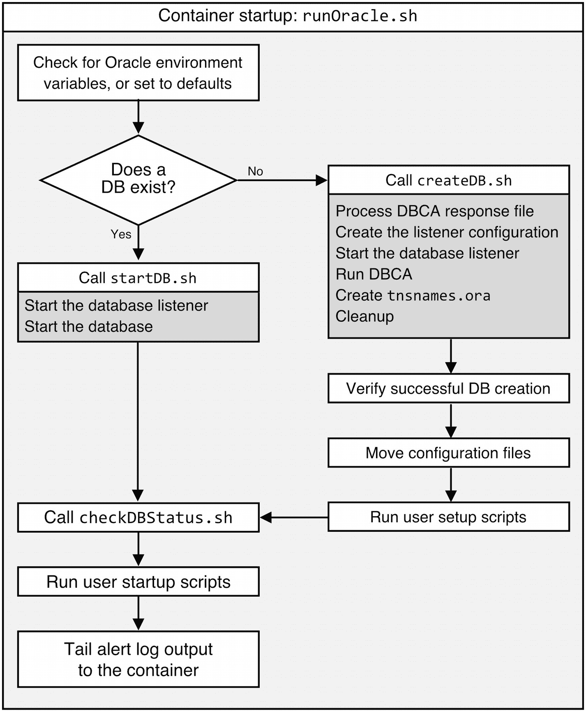

```
一个运行 Oracle 数据库的容器启动流程图。它始于检查 Oracle 环境。如果数据库存在，则启动数据库。如果不存在，则运行 D B C A 并移动配置文件。
```

图 6-1

```
Oracle 数据库容器启动过程的流程图
```

`runOracle.sh` 脚本从环境中读取值，它首先查找的内容之一就是 `ORACLE_SID` 和 `ORACLE_PDB`。如果它们未定义，则分配默认值。只有这样，它才会检查是否存在匹配该 SID 的数据库。


### 查看环境值

让我们查看上一章创建的容器，看看其环境中有哪些值。提醒一下，我使用了以下命令：

```
docker run -d --name ORCL oracle/database:19.3.0-ee
```

如果我登录容器，运行 `env` 命令，并用 `grep` 将结果限制为仅包含 `ORACLE` 的项，如代码清单 6-1 所示，出现的唯一值只有 `ORACLE_BASE` 和 `ORACLE_HOME`。没有 `ORACLE_SID` 或 `ORACLE_PDB` 的值。然而，如果我搜索活动进程并用 `grep` 将输出限制为 Oracle 数据库的 `pmon` 进程，则会发现一个 SID 为 ORCLCDB 的数据库正在运行。

```
docker exec -it ORCL bash
[oracle@8facfd649aa4 ~]$ env | grep ORACLE
ORACLE_BASE=/opt/oracle
ORACLE_HOME=/opt/oracle/product/19c/dbhome_1
[oracle@8facfd649aa4 ~]$ ps -ef | grep pmon | grep -v grep
oracle        88       1  0 Jan1 ?        00:00:16 ora_pmon_ORCLCDB
```

**代码清单 6-1**
默认数据库容器中 oracle 用户的环境变量

也许 `env` 命令并不是检查容器环境的正确方法。启动终端会话会调用用户和 shell 的登录及配置脚本，可能会改变结果。我想要的是能看到容器启动时启动脚本所看到的相同环境的方法。为了实现这一点，我将使用 `docker inspect` 命令来查看容器元数据：³⁷

```
docker container inspect ORCL
```

对我的容器执行 `docker inspect` 会产生近 300 行的 JSON 输出，并不是很用户友好。仅仅为了查看环境设置就需要翻阅大量内容！幸运的是，`inspect` 命令（以及许多其他命令）有一个有用的 `--format` 选项，我们可以用它来限制和结构化其输出。在代码清单 6-2 中，我添加了格式化以将结果限制为配置输出中的环境值，即 `--format='{{.Config.Env}}'`。不幸的是，它为了清晰度牺牲了简洁性。它将所有内容都放到了单行上，而不是一个清晰、干净的变量列表！

```
> docker container inspect --format='{{json .Config.Env}}' ORCL
[PATH=/opt/oracle/product/19c/dbhome_1/bin:/opt/oracle/product/19c/dbhome_1/OPatch/:/usr/sbin:/usr/local/sbin:/usr/local/bin:/usr/sbin:/usr/bin:/sbin:/bin ORACLE_BASE=/opt/oracle ORACLE_HOME=/opt/oracle/product/19c/dbhome_1 INSTALL_DIR=/opt/install INSTALL_FILE_1=LINUX.X64_193000_db_home.zip INSTALL_RSP=db_inst.rsp CONFIG_RSP=dbca.rsp.tmpl PWD_FILE=setPassword.sh RUN_FILE=runOracle.sh START_FILE=startDB.sh CREATE_DB_FILE=createDB.sh SETUP_LINUX_FILE=setupLinuxEnv.sh CHECK_SPACE_FILE=checkSpace.sh CHECK_DB_FILE=checkDBStatus.sh USER_SCRIPTS_FILE=runUserScripts.sh INSTALL_DB_BINARIES_FILE=installDBBinaries.sh RELINK_BINARY_FILE=relinkOracleBinary.sh SLIMMING=true LD_LIBRARY_PATH=/opt/oracle/product/19c/dbhome_1/lib:/usr/lib CLASSPATH=/opt/oracle/product/19c/dbhome_1/jlib:/opt/oracle/product/19c/dbhome_1/rdbms/jlib]
```

**代码清单 6-2**
使用 `--format` 选项限制结果会将所有输出放在一行上且没有格式

为了获得更人性化的输出，在代码清单 6-3 中，我将结果通过 `jq` ³⁸ 工具发送，以将 JSON 块解析为更易读的格式。我在代码清单 6-4 中使用了额外的格式化选项，将条目打印在不同的行上。我喜欢第二个示例的格式化输出。我发现它更具可读性，但这个命令比将结果通过 `jq` 管道传输更冗长且更难记住。³⁹

```
> docker container inspect --format '{{range .Config.Env}}{{printf "%s\n" .}}{{end}}' ORCL
PATH=/opt/oracle/product/19c/dbhome_1/bin:/opt/oracle/product/19c/dbhome_1/OPatch/:/usr/sbin:/usr/local/sbin:/usr/local/bin:/usr/sbin:/usr/bin:/sbin:/bin
ORACLE_BASE=/opt/oracle
ORACLE_HOME=/opt/oracle/product/19c/dbhome_1
INSTALL_DIR=/opt/install
INSTALL_FILE_1=LINUX.X64_193000_db_home.zip
INSTALL_RSP=db_inst.rsp
CONFIG_RSP=dbca.rsp.tmpl
PWD_FILE=setPassword.sh
RUN_FILE=runOracle.sh
START_FILE=startDB.sh
CREATE_DB_FILE=createDB.sh
SETUP_LINUX_FILE=setupLinuxEnv.sh
CHECK_SPACE_FILE=checkSpace.sh
CHECK_DB_FILE=checkDBStatus.sh
USER_SCRIPTS_FILE=runUserScripts.sh
INSTALL_DB_BINARIES_FILE=installDBBinaries.sh
RELINK_BINARY_FILE=relinkOracleBinary.sh
SLIMMING=true
LD_LIBRARY_PATH=/opt/oracle/product/19c/dbhome_1/lib:/usr/lib
CLASSPATH=/opt/oracle/product/19c/dbhome_1/jlib:/opt/oracle/product/19c/dbhome_1/rdbms/jlib
```

**代码清单 6-4**
使用扩展格式化命令对环境信息进行“美化打印”

```
> docker container inspect --format='{{json .Config.Env}}' ORCL | jq
[
"PATH=/opt/oracle/product/19c/dbhome_1/bin:/opt/oracle/product/19c/dbhome_1/OPatch/:/usr/sbin:/usr/local/sbin:/usr/local/bin:/usr/sbin:/usr/bin:/sbin:/bin",
"ORACLE_BASE=/opt/oracle",
"ORACLE_HOME=/opt/oracle/product/19c/dbhome_1",
"INSTALL_DIR=/opt/install",
"INSTALL_FILE_1=LINUX.X64_193000_db_home.zip",
"INSTALL_RSP=db_inst.rsp",
"CONFIG_RSP=dbca.rsp.tmpl",
"PWD_FILE=setPassword.sh",
"RUN_FILE=runOracle.sh",
"START_FILE=startDB.sh",
"CREATE_DB_FILE=createDB.sh",
"SETUP_LINUX_FILE=setupLinuxEnv.sh",
"CHECK_SPACE_FILE=checkSpace.sh",
"CHECK_DB_FILE=checkDBStatus.sh",
"USER_SCRIPTS_FILE=runUserScripts.sh",
"INSTALL_DB_BINARIES_FILE=installDBBinaries.sh",
"RELINK_BINARY_FILE=relinkOracleBinary.sh",
"SLIMMING=true",
"LD_LIBRARY_PATH=/opt/oracle/product/19c/dbhome_1/lib:/usr/lib",
"CLASSPATH=/opt/oracle/product/19c/dbhome_1/jlib:/opt/oracle/product/19c/dbhome_1/rdbms/jlib"
]
```

**代码清单 6-3**
使用 `jq` 解析环境信息

无论格式如何，仍然没有 `ORACLE_SID` 或 `ORACLE_PDB`。

通过导航到 Docker Desktop 中的容器详细信息并选择检查选项卡，如图 6-2 所示，我会看到类似的结果。屏幕列出了容器的环境变量（但缺少对结果的排序和筛选）。

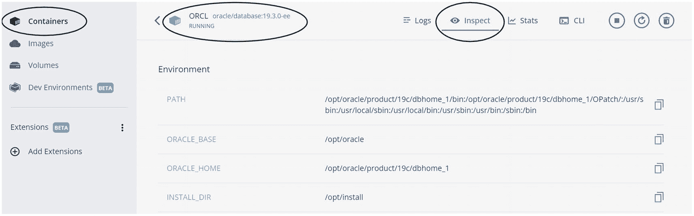

容器页面上检查选项卡的屏幕截图。`ORCL` 容器的检查选项卡显示环境详细信息。它包含指向路径、Oracle 主目录、基础和目录安装的链接。

**图 6-2**
Docker Desktop 容器详细信息页面中的检查选项卡列出了容器中设置的所有环境变量。但创建时未指定 `ORACLE_SID` 或 `ORACLE_PDB` 值的 `ORCL` 容器，其环境中不会报告这两个变量

有几个在“常规”数据库环境中看不到的附加变量，比如 `SLIMMING` 以及标识目录、文件和脚本的变量。注意我们的启动脚本也在那里：

```
RUN_FILE=runOracle.sh
```

这些值来自父镜像，代表了从该镜像启动的任何容器的基线配置。报告容器和镜像环境配置的以下命令的结果是相同的：

```
docker container inspect --format '{{range .Config.Env}}{{printf "%s\n" .}}{{end}}' ORCL
docker image inspect --format '{{range .Config.Env}}{{printf "%s\n" .}}{{end}}' oracle/database:19.3.0-ee
```

容器从其父镜像继承环境设置。就像 RMAN 备份脚本在未被覆盖时可能设置默认值一样，数据库容器在通过 `docker run` 创建容器时，如果未提供，则会为 `ORACLE_SID` 和 `ORACLE_PDB` 分配默认值。


