# docker run

到目前为止，示例中用于创建 ORCL 数据库容器的命令是：

```bash
docker run -d --name ORCL oracle/database:19.3.0-ee
```

一旦创建，它的环境就是静态的，至少从自动化的角度来看是这样。我可以在容器中打开一个会话并设置环境变量，但这些变量不会改变元数据中的环境值。正是这个元数据，是启动脚本每次容器启动时都会看到和读取的。改变元数据的唯一机会（可能覆盖镜像中存在的默认值）是在容器创建期间。（这对于卷和网络等其他容器属性也是如此，我们将在后面的章节中看到。）

有几种方法可以将环境变量^(⁴⁰)传递给 `docker run` 命令：通过命令行、宿主环境或文件。每种方法都将一个值传递给容器的元数据，使其可供脚本（包括启动命令）和进程使用。

## 命令行选项

使用 `-e` 标志或其长格式 `--env` 标志，后跟一个 `key=value` 对，例如：

```bash
docker run ... -e ORACLE_SID=TEST ...
docker run ... --env ORACLE_PDB=TESTPDB1 ...
```

为每个值分别使用 `-e` 标志来传递多个值：

```bash
docker run ... -e ORACLE_SID=TEST -e ORACLE_PDB=TESTPDB1 ...
```

值（等号后的部分）也可以是来自本地环境的变量。这对于配置多个容器很有用。列表 6-5 展示了一个在 Linux 环境中使用 `for 循环` 从值列表（DEV、TEST 和 STAGE）部署多个容器的示例——为每个容器从循环变量分配一个不同的数据库名称。

```bash
for dbname in DEV TEST STAGE
do docker run -d --name $dbname -e ORACLE_SID=$dbname oracle/database:19.3.0-ee
done
```
*列表 6-5. 自动部署三个 Oracle 19c 数据库容器，从环境为每个容器传递 ORACLE_SID。*

### 来自文件的值

环境文件是文本文件，每个 `key=value` 对占一行，这样更容易与 `docker run` 共享多个值。Docker 将以井号 (`#`) 开头的行视为注释而忽略。调用 `docker run` 时，使用 `--env-file` 选项和文件名。列表 6-6 展示了一个 Oracle 数据库的示例环境文件，名为 `db.env`，以及在 `docker run` 命令中使用 `--env-file` 选项的示例。

```dockerfile
ORACLE_SID=TEST
ORACLE_PDB=TESTPDB1
ORACLE_EDITION=EE
ENABLE_ARCHIVELOG=true
```
*列表 6-6. 用于向 docker run 传递多个键值对的环境文件示例。*

将该文件传递给 `docker run` 的 `--env-file` 选项，会将文件中列出的变量填充到容器环境中：

```bash
> docker run ... --env-file db.env ...
```

### 来自主机环境的值

有一种特殊情况是共享来自主机的环境变量到容器。如果主机上存在一个变量，其名称与容器中的变量相同，则只需提供变量名（不带等号或值）。这对于命令行和环境文件选项都适用。

在列表 6-7 中，我通过将循环变量从 `dbname` 更改为 `ORACLE_SID` 修改了之前的循环示例。因为容器有一个匹配的变量，所以我可以单独使用该变量名。Docker 会为我解释该变量和值^(⁴¹)。

```bash
for ORACLE_SID in DEV TEST STAGE
do docker run -d --name $ORACLE_SID -e ORACLE_SID oracle/database:19.3.0-ee
done
```
*列表 6-7. 使用主机变量对容器进行隐式变量赋值。*

在这种情况下，不需要写成 `ORACLE_SID=$ORACLE_SID`。要在环境文件中使用主机变量，请在单独一行中包含该变量，不带等号或值。Docker 会从主机环境中读取该值。

### 覆盖和创建变量

使用 `docker run` 赋值变量会覆盖来自镜像的值。参考列表 6-3 和 6-4，其中列出了示例容器从其父容器继承的变量和值。如果我发出一个略有不同的命令并创建一个新容器，如列表 6-8 所示，这次更改了 `ORACLE_HOME`，当启动脚本找不到必要的文件时，容器就会崩溃。

```bash
> docker run -d -e ORACLE_HOME=/home/oracle --name OOPS oracle/database:19.3.0-ee
1c32eb9d016e723256e47199e5801d3bcd4cc64c87099cc40057028cd0177eba
> docker logs -f OOPS
/opt/oracle/relinkOracleBinary.sh: line 13: /home/oracle/bin/oraversion: No such file or directory
/usr/bin/ar: /home/oracle/lib/libedtn.a: No such file or directory
ORACLE EDITION:
touch: cannot touch '/home/oracle/install/.docker_': No such file or directory
ORACLE PASSWORD FOR SYS, SYSTEM AND PDBADMIN: vXy8JX7aiE4=1
LSNRCTL for Linux: Version 19.0.0.0.0 - Production on 11-JAN-2022 21:52:59
Copyright (c) 1991, 2019, Oracle.  All rights reserved.
Message 1070 not found; No message file for product=network, facility=TNS
TNS-12545: Message 12545 not found; No message file for product=network, facility=TNS
TNS-12560: Message 12560 not found; No message file for product=network, facility=TNS
TNS-00515: Message 515 not found; No message file for product=network, facility=TNS
Linux Error: 2: No such file or directory
cat: /opt/oracle/cfgtoollogs/dbca/ORCLCDB/ORCLCDB.log: No such file or directory
cat: /opt/oracle/cfgtoollogs/dbca/ORCLCDB.log: No such file or directory
```
*列表 6-8. 在容器中覆盖 ORACLE_HOME 会导致问题！*

如果 `docker run` 中给出的变量/值不是镜像的一部分，Docker 会将其添加到容器环境（及其元数据）中。列表 6-9 展示了不是在更改 `ORACLE_HOME`，而是在创建容器时为 `ORACLE_SID` 和 `ORACLE_PDB` 分配非默认值时发生的情况。

```bash
> docker run -d -e ORACLE_SID=ORA19C -e ORACLE_PDB=PDB1 --name ORA19C oracle/database:19.3.0-ee
aba0514d7fb36e70777c69ca4a6b619e3fbdca1f8a13a95935fed8e48c7722c3
> docker container inspect --format '{{range .Config.Env}}{{printf "%s\n" .}}{{end}}' ORA19C | grep ORACLE
ORACLE_BASE=/opt/oracle
ORACLE_HOME=/opt/oracle/product/19c/dbhome_1
ORACLE_PDB=PDB1
ORACLE_SID=ORA19C
> docker exec -it ORA19C bash
[oracle@aba0514d7fb3 ~]$ env | grep ORACLE
ORACLE_SID=ORA19C
ORACLE_BASE=/opt/oracle
ORACLE_PDB=PDB1
ORACLE_HOME=/opt/oracle/product/19c/dbhome_1
[oracle@aba0514d7fb3 ~]$ ps -ef | grep pmon
oracle      5072       1  0 21:21 ?        00:00:00 ora_pmon_ORA19C
```
*列表 6-9. 当使用 ORACLE_SID 和 ORACLE_PDB 的非默认值时的容器环境。*

原始容器的环境中没有 `ORACLE_SID` 或 `ORACLE_PDB`，这些变量也没有在父镜像中包含或分配。当启动脚本 `runOracle.sh` 运行时，它会检查环境，如果这些变量未设置，则分配一个默认值。`docker run` 将新的变量和值添加到了新创建的容器中。`docker inspect` 在容器元数据中显示了它们，并且它们也存在于 `oracle` 用户环境中。而且——最后但同样重要的是——启动脚本创建了一个 `ORACLE_SID` 为 `ORA19C` 的数据库。

`ORACLE_SID` 在 Oracle 数据库设置中无处不在，`ORACLE_PDB` 是多租户安装的一部分。由于它们在传统的 Oracle 数据库环境中很常见，我们可以有根据地猜测它们对容器环境是有意义的，尽管它们在预定义的数据库镜像环境中不存在。但是，是否存在其他不那么明显或非传统的容器环境值呢？


### Oracle 镜像中的环境选项

Oracle 的容器镜像仓库在[`https://github.com/oracle/docker-images/tree/main/OracleDatabase/SingleInstance`](https://github.com/oracle/docker-images/tree/main/OracleDatabase/SingleInstance)有详尽的文档，包括用于自定义数据库启动和创建的环境选项。

用于在容器中自定义 Oracle 数据库创建的环境选项（默认值显示在方括号[]内）：

*   `ORACLE_SID`：Oracle 数据库的 SID [`ORCLCDB`]
*   `ORACLE_PDB`：Oracle 数据库的 PDB 名称 [`ORCLPDB1`]
*   `ORACLE_EDITION`：Oracle 数据库版本^(⁴²,⁴³)
*   `ORACLE_CHARACTERSET`：数据库字符集 [`AL32UTF8`]
*   `ORACLE_PWD`：Oracle 数据库 SYS、SYSTEM 和 PDB_ADMIN 的密码 [在数据库创建时随机生成]
*   `ENABLE_ARCHIVELOG`：启用归档日志 [False]⁷

可用于管理 Oracle 数据库容器内存的可选环境选项：

*   `INIT_SGA_SIZE`：SGA 组件的总内存（MB）。⁷
*   `INIT_PGA_SIZE`：PGA 的目标聚合大小（MB）。⁷
*   `AUTO_MEM_CALCULATION`：在数据库创建期间，基于容器可用内存计算总内存分配。当设置为 false 时，总内存分配为 2GB。如果设置了`INIT_SGA_SIZE`或`INIT_PGA_SIZE`，则忽略此选项。[True]⁷

这些选项涵盖了创建数据库时最常见的修改。第 13 章提供了更多自定义的示例和思路，进一步扩展了可能性！

### 总结

在本章中，你了解到容器从其父镜像继承环境设置，并将这些设置存储为元数据。每次 Oracle 数据库容器启动时，`runOracle.sh`脚本会自动运行，管理容器及其数据库中的活动。启动脚本通过评估环境变量来定制数据库的创建和启动——这就像 shell 脚本接受命令行参数以改变其默认行为一样。

你学习了向容器传递环境变量的不同方法，现在可以使用`docker inspect`来报告和格式化来自容器的元数据。最后，你发现了如何在 Docker 容器中使用自定义的 CDB 和 PDB 名称创建 Oracle 数据库，并了解了用于调整数据库内存分配、数据库版本和归档日志状态的其他选项。

在接下来的两章中，你将探索`docker run`命令的其他选项，这些选项允许主机和容器之间进行交互。第 7 章介绍了将主机存储与容器共享的技术，以及其对性能、数据持久性和效率的影响。第 8 章涵盖了主机与容器之间的通信，以及如何配置容器以为客户端（无论是在主机上还是在其他容器中）提供服务。

脚注 1 2 3 4 5 6 7 8

## 7. 持久化

当我在 2014 年开始寻找关于在容器中运行 Oracle 的信息时，Oracle 专家们的共识并不乐观。大多数数据库管理员认为 Docker 不过是开发人员中的最新*技术潮流*，不足以应对数据库的需求。他们引用了关于不稳定、性能差和数据丢失的严厉警告。同行们分享了各种根源于 Docker 不成熟或脆弱性的灾难故事。

这些批评有一个共同的主题。每一个都是涉及某个模糊的“朋友的朋友”的轶事，回响着多年来针对其他新技术的警告——这些技术如今我们已习以为常，比如恢复管理器（RMAN）、自动撤销管理^(⁴⁴)，甚至虚拟机。同样令人好奇的是，这些灾难都被归咎于在生产环境中使用的、当时仍属新兴的技术，这似乎不太可能。那时我明白了，这些故事是对未知事物忧虑的副产品，甚至是对容器可能改变我们做事方式的恐惧。

如果说有一个首当其冲的反对意见，那就是数据持久性。人们（错误地）认为，由于容器是短暂的，与容器相关的任何东西也是如此。的确，容器的文件系统与容器本身绑定。删除容器会永久移除其数据。

除非这些数据是*外部*挂载的。

Docker 可以使用挂载存储在容器外部保存（并持久化！）数据，因为它与容器是分离的。删除容器不会影响外部存储的数据。深思熟虑地使用数据库挂载点能提供更强的控制力和可见性，并为运行高效、可靠、一致且模块化的数据库环境奠定基础。而挂载正是 Linux 容器强大功能背后的关键组件。

### 容器存储

我们已经看到容器如何利用联合文件系统来提供可靠、一致的结果。人们很容易说，从一个给定镜像启动的每个容器都始于相同的文件系统。但容器使用的并非精确的*副本*。在整个生命周期中，它们都共享*同一个*文件系统——即镜像本身。启动容器会创建一个专用的*联合文件系统*（有时称为*覆盖文件系统*），以父镜像为基础。图 7-1 展示了容器层在玩井字游戏时的工作原理。该镜像包含游戏棋盘和开局走法，填充了顶行和中心方格。每个容器都使用该镜像作为*下层*，但无法“触碰”或更改其内容。相反，Docker 将容器的更改写入每个容器私有的*上层*。图 7-1 中的两个容器起始于相同的棋盘、走法和一个空的上层。随着每个容器中游戏的进行，Docker 将新的走法添加到各自的上层。从容器内部视角（由*工作层*提供）看到的视图，是下层和上层的复合体或合并体。从容器的角度“向下”看这些层，文件系统看起来是“扁平”的。

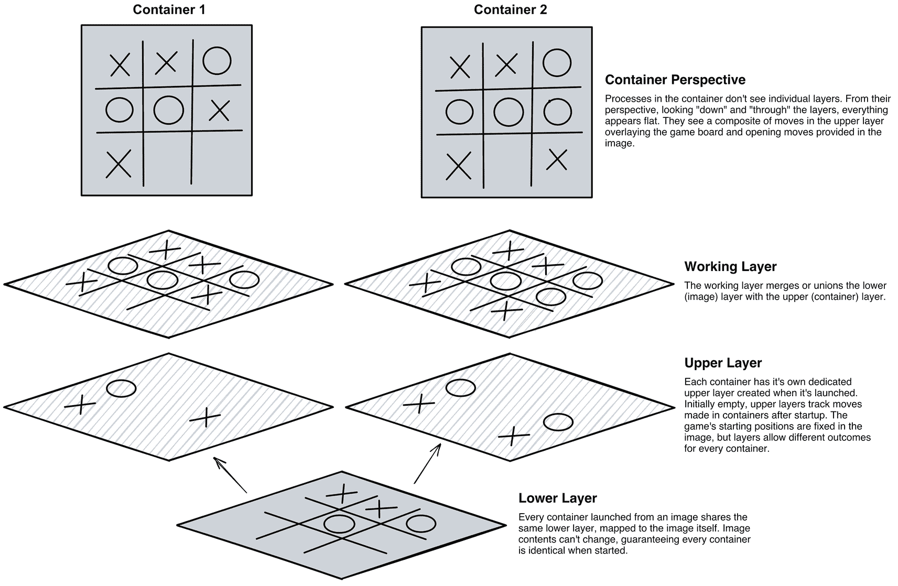

*图 7-1：容器使用联合文件系统将本地更改投射到其父镜像提供的基础文件系统上*

联合文件系统使容器快速而高效。无论镜像是几兆字节还是几千兆字节大小，都不重要，因为容器在启动时不会复制它们。它们只是初始化一个新的联合文件系统，并在现有镜像之上添加一个最初为空的层。从一个 1GB 镜像运行十个容器不需要 10GB 的空间。它们都使用相同的 1GB 镜像，因此它们的存储需求只是每个容器私有层中更改所占用空间的总和。


### Docker 冕部存储

这些镜像和层仍然在磁盘上占用空间，位于 Docker 的 `/var/lib/docker` 目录中。该目录是运行 Docker Desktop 的 Windows 和 Mac 系统底层 Linux 虚拟机的一部分。在 Linux 系统上，它是 Docker 安装的默认位置。^(⁴⁵) 无论哪种情况，只有特权 (`root`) 用户可以浏览该目录，这是有充分理由的。其内容需要受到保护，以确保容器生态系统的健康。

查看 `/var/lib/docker` 目录信息和内容的唯一实用方法是间接进行，要么通过 Docker CLI 命令报告元数据，要么连接到容器并检查其文件系统。这并非总是最方便的方式，尤其是在主机与容器之间共享信息时。

考虑一个使用运行 Oracle 数据库的 Docker 容器来隔离潜在软件故障的故障排除场景。在某些时候，我需要从容器中获取文件与 Oracle 共享。怎么办？

假设配置了 SMTP，我可以将文件通过电子邮件发送，或者从容器 shell 复制粘贴到本地主机的文件中。这两种方式都不太实用。我可以使用 `sudo` 进入 `/var/lib/docker` 目录，并尝试在它们的层中定位文件，然后复制到我的主目录——这同样，可能也不是最佳解决方案。

一个更现实的选择是 `docker cp` 命令。就像它的 Linux 同名命令 `cp` 一样，`docker cp` 允许我在主机和容器之间复制文件。我将容器视为主机，并将 `docker cp` 视为等同于 `scp` 或 `sftp`。`docker cp` 的结构与 `scp` 命令类似：

```
scp [source file] [destination]
docker cp [source file] [destination]
```

约定也很相似。远程组件是主机或容器，后跟冒号，最后是路径或文件名：

```
scp [host or IP address]:[source file] [destination]
docker cp [container name]:[source file] [destination]
```

这无疑是一种更易用、更好的文件传输方式，但有一点例外。`docker cp` 不支持通配符。使用 `docker cp` 时，操作仅限于整个目录或单个文件。在主机和容器之间移动文件充其量是不方便的。联合文件系统还有其他限制，特别是对于数据库。

#### 联合文件系统的缺点

联合文件系统是容器背后的重要魔法组成部分，但它们并不是数据库的理想存储机制：

*   **它们是临时的**。写入容器私有层的任何数据在移除容器时都会丢失。如果我删除图 7-1 中所示的一个容器，我就是在移除它的联合文件系统以及上层和工作层。
*   **随着容器私有层变化的增长，联合文件系统的效率会下降**。对属于父镜像的文件进行的每一次修改都会增加宿主系统为生成容器看到的视图而必须执行的工作量。获取最终结果需要读取基础目录和中间目录中的文件，然后计算差异。当容器保持与原始镜像接近时，开销并不显著。写入大量数据的应用程序——如数据库——会增加容器的上层，消耗资源来计算结果。
*   **`/var/lib/docker` 中的层默认仅限于单个文件系统，即启动卷**。数据库的容量、性能和冗余性仅限于这一个磁盘的能力，没有选项可以跨多个设备分散活动。

用 Oracle 的视角来看，这就像使用主机的启动卷来运行 Oracle 数据库作为 `ORACLE_HOME` 和数据。磁盘性能对于数据库软件并不关键——二进制文件在启动后缓存在内存中后，活动就很有限。数据库主目录的大小在其生命周期内保持相当稳定，因此容量也不是问题。

然而，将数据文件和归档日志文件放在同一个磁盘上是一个问题。数据库只能增长到单个磁盘的物理极限。为保护数据库文件而添加 RAID 保护适用于磁盘上的所有内容，无论是否需要该保护。幸运的是，Oracle 允许我们控制这些数据库文件的放置，而 Docker 中的挂载点对容器有类似的目的：挂载存储。


### 挂载概念

挂载扩展了容器的存储空间，使其超出了联合文件系统的限制。您可以将它们视为网络附加存储或共享文件系统（容器同样可以使用网络存储）。它们是独立的对象，与容器及其生命周期无关。通过挂载，容器可以：

*   使用主机上的本地存储来实现持久化、提升性能并增加容量
*   与主机或其他容器共享文件
*   避免为易变目录承担联合文件系统的开销
*   访问不属于其父镜像的文件和目录
*   将数据库文件分布到多个磁盘上，从而提升性能、增加容量并控制冗余

当您使用挂载，尤其是在数据库场景下，您会看到它们如何暴露软件、配置和数据之间的差异。图 7-2 中的容器使用挂载将 Oracle 数据库中相对静态的组件与其数据、配置、日志和脚本分离。这种方法的优势非常显著：

*   数据库软件及其依赖项被构建到一个镜像中。数据库软件变化不大，不可变的镜像是最合适、最高效的供应方式。任何从该镜像启动的数据库都保证包含相同的版本和已打包的补丁。^(⁴⁶) 这些目录中可能出现的少量更改对容器联合文件系统的性能影响不大。
*   构成数据库实例的文件——数据文件、临时文件、控制文件、重做日志文件和归档日志文件——存在于专用存储上，利用了高性能和冗余磁盘。启动和操作数据库所需的配置文件——包括密码文件、参数文件、`oratab` 文件和网络配置——与软件和数据分离。这些以及数据是 Oracle 数据库最必要的部分。克隆或复制这些文件即可创建一个完全相同的数据库副本。得益于 Docker 的可移植性，这个副本可以位于同一系统、运行不同操作系统的同事机器上或云端。
*   将诊断目录保存到磁盘，使其对主机上的进程可见，并且即使数据库容器停止后仍然可用。日志监控和轮转可以从容器主机运行，而无需在数据库内部运行。
*   用于共享支持脚本的挂载比将其添加到父镜像中更合理。虽然这些脚本可能保持不变，但通过挂载在容器间共享它们是更好的选择。将它们排除在镜像之外可以得到更小的镜像，无需为包含修改后的脚本而更新镜像，这些更改也无需传播到正在运行的容器。

Oracle 在 Oracle Database 18c 中引入的 `Read-Only Homes`（只读主目录）功能采用了类似的方法。原本混杂在软件目录中的配置文件，如密码文件、参数文件和网络配置，现在与 `ORACLE_HOME` 分开存储。这使得克隆和恢复数据库更加容易，并增强了数据库实例与数据库软件之间的区分。

`Read-Only Homes` 和挂载有助于以一种更模块化的方式思考数据库组件。观察图 7-2，注意不同类型的文件如何在容器的联合文件系统和挂载之间进行划分。

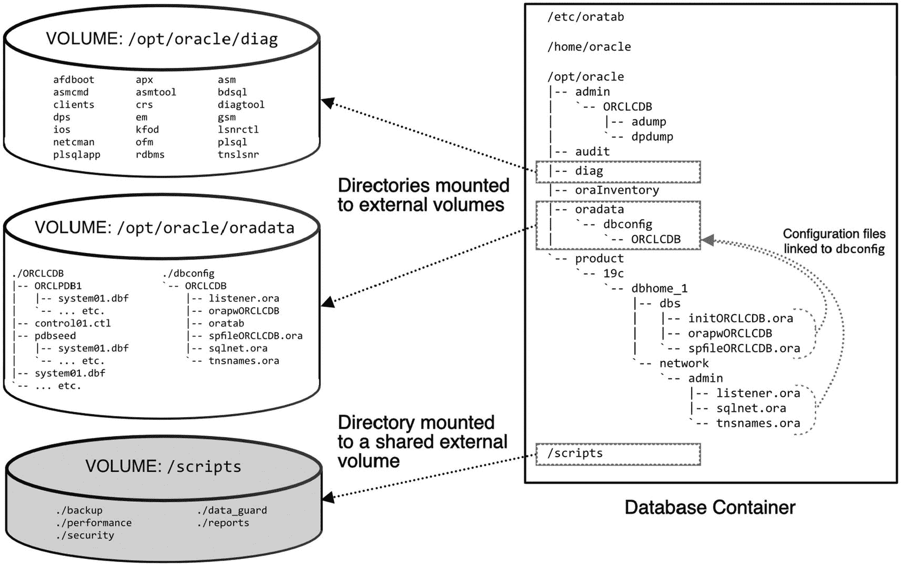

示意图展示了一个数据库容器及其不同目录。左侧有三个圆柱形结构，代表外部和共享的外部卷。

图 7-2

一个在容器中运行的 Oracle 数据库，其相对静态的内容被构建到镜像中。数据、日志和配置文件被分离到专为容器中运行的数据库设置的挂载上。脚本目录挂载到一个与多个容器共享的文件系统上。

请注意，相对静态的内容，包括数据库软件主目录和清单目录，位于容器的文件系统中。易变的内容，如 Oracle 诊断目录 `/opt/oracle/diag` 下的数据文件和日志，则被分离到卷上。`$ORACLE_HOME/dbs` 和 `$ORACLE_HOME/network/admin` 下的配置文件也从它们的预期位置链接到 `/opt/oracle/oradata` 下的一个子目录，这反过来又将它们保存到数据库卷中。

挂载不仅限于数据和配置。此示例中的 `/scripts` 目录挂载到一个共享文件系统，使每个容器都能访问一个公共的脚本和实用程序库。

### 卷与卷

在深入之前，我想澄清一些术语。在 Docker 中，`volume`（卷）有多个含义，并且经常被随意地用来描述或引用任何挂载到容器的外部存储。官方来说，Docker 中的“卷”描述两件事：

*   在 `Dockerfile` 中定义的目录，可能与容器主机资源相关联。卷的路径是镜像元数据的一部分。在创建新容器时，可以为卷分配持久化存储。Oracle 的容器仓库镜像在 `/opt/oracle/oradata` 定义了一个卷。
*   一个用作持久化容器数据目标的 Docker 对象。

一个 `Docker Volume`（后者，对象定义）可以作为卷目录（前者，镜像元数据中的路径）的来源。但“卷”经常被非正式地（且不正确地）用来描述*任何*挂载在容器联合文件系统之外的存储类型，无论它是否真的是一个 `Docker Volume`。

如果这还不够令人困惑的话，`docker run` 命令有一个 `-v` 或 `--volume` 选项，用于将存储映射到容器。所以，我们在创建容器时使用 `--volume` 选项将 `Docker Volumes` 映射到 `volumes`（卷目录）！

让我们分解一下存储挂接的不同方法，以帮助理清这些重叠的术语。

### 挂载类型

将存储挂载到容器的唯一时机是在初始创建时，使用 `docker run` 命令中的选项。之后无法返回编辑或添加，因此务必一次性做对！这意味着需要理解存储类型、其用途以及其优势或限制。我们数据库最常用的两种类型是 `bind mounts`（绑定挂载）和 `volumes`（卷）。另外两种类型 `tmpfs` 和特例 `secrets` 则不太常见。

#### 绑定挂载

您已经看到 `bind mounts` 被用于将数据持久化到本地文件系统。绑定挂载将容器中的文件和目录映射到主机上的文件和目录。对于任何刚接触 Docker 和容器的人来说，这种方法可能更熟悉和舒适，也是 Oracle 在其容器仓库文档中演示的方法。绑定挂载的优势在于便利性和表面上的可见性。以 Oracle 数据库容器的 `/opt/oracle/oradata` 卷目录为例，我可以导航到本地机器上的该目录来查看和管理其内容：

```
~/oradata> du -sh ./*
1.5G     ./ORA11G
2.0G     ./ORA12C
2.9G     ./ORA19C
4.8G     ./ORA21C
```

我将多个容器映射到 `$HOME/oradata` 下的单独子目录，并且可以使用标准的 Linux 命令来查看和管理这些目录。使用 `du` 命令可以轻松查看它们的空间占用情况。

在 `docker run` 时为容器分配绑定挂载很简单，甚至主机目录都不必事先存在！该目录是主机文件系统的一部分，^(⁴⁷) 在 Docker 主机上其他地方使用的相同熟悉的 Linux 命令在映射目录中同样适用。使用绑定挂载无需额外的命令或先决条件。这有什么不喜欢的呢？


#### Docker 卷

`Docker` `卷`在某些方面与绑定挂载类似：两者都将数据持久化在容器联合文件系统之外。区别在于功能和管理方式。绑定挂载是主机文件系统上的目录，而 `Docker` `卷`是 `Docker` 对象，必须提前创建，^(⁴⁸) 这为容器创建增加了一个步骤。`Docker` `卷`的*默认*位置是主机私有的 `/var/lib/docker` 区域。

不过，使用 `/var/lib/docker` 进行存储曾是对联合文件系统的一项指控！如果卷使用这个位置，我们又回到了同样的境地，将数据放在一个有限的目的地！但这仅仅是*默认*位置。我们有机会在本地文件系统上创建卷，就像绑定挂载一样。卷也可以引用绑定挂载无法访问的存储，包括云源上的对象存储桶。

`Docker` `卷`是 `Docker` 环境中的*对象*，通过 `Docker` `CLI`（主要是 `docker volume` 命令）进行管理。在某些方面，`Docker` `卷`类似于 *Oracle 自动存储管理* (ASM)——两者都提供集成的、应用感知的存储以及扩展的功能和能力，但额外提供了专用命令。卷必须在映射到容器之前存在，就像 DBA 需要在将 `ASM` 磁盘分配给数据库之前创建它们一样。清单 7-1 提供了创建卷、列出系统上的卷、检查卷元数据以及删除卷的示例。^(⁴⁹) `Docker` `Desktop` 也提供卷管理功能。图 7-3 展示了 `Docker` `Desktop` 中此示例的 `oradata` 卷的卷管理选项卡。

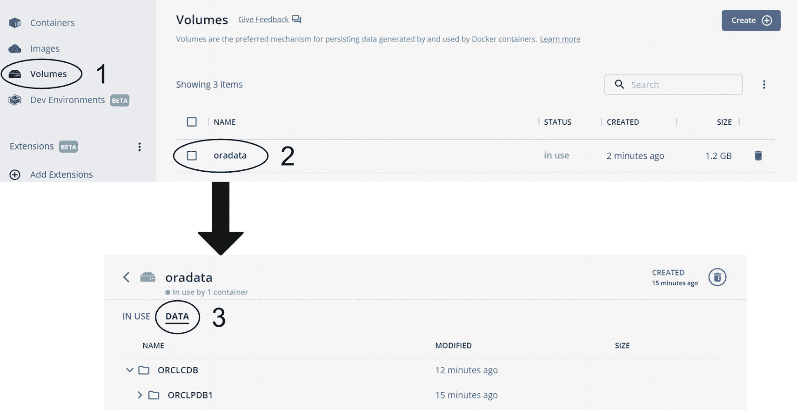

一个 Docker 截图。顶部面板有标记为 1 的卷选项，以及标记为 2 的卷下的 oradata。底部显示 oradata 下标记为 3 的数据。

图 7-3

`Docker` `Desktop` 中 oradata 卷的视图。在“卷”视图下 (1)，我选择了 oradata 卷 (2) 以导航到卷详细信息页面。在“数据”选项卡下 (3)，我可以看到卷的文件和目录

```
> docker volume create oradata
oradata
> docker volume ls
DRIVER    VOLUME NAME
local     oradata
> docker volume inspect oradata
[
{
"CreatedAt": "2022-01-01T12:00:00Z",
"Driver": "local",
"Labels": {},
"Mountpoint": "/var/lib/docker/volumes/oradata/_data",
"Name": "oradata",
"Options": {},
"Scope": "local"
}
]
> docker volume rm oradata
oradata
```
清单 7-1
用于创建卷、列出系统上的卷、显示卷元数据和删除卷的 Docker 命令示例

#### tmpfs 和机密

剩余的挂载类型用途更为有限和特定。

*tmpfs* 类型将数据保存到内存，但从不写入主机文件系统。它们适用于容器运行时使用的、不需要持久化的应用或会话数据。`tmpfs` 挂载可以与容器共享敏感信息，例如密钥和密码。

*运行时机密*^(⁵⁰) 是 *Podman*（一种替代容器引擎）中可用的一种特殊挂载类型。运行时机密提供了一种更好、更安全的方式与容器共享凭据。如果没有运行时机密，向容器传递密码和其他敏感信息的选项可能会留下威胁参与者可以利用的可见痕迹。

#### 卷 vs 绑定挂载

根据 `Docker` 的说法，`Docker` `卷`是持久化数据的首选方式，并且相比绑定挂载具有 several 优势，包括：

*   **为 Docker Desktop 用户提升性能：** `Docker` `卷`是 `Docker` 原生对象，在 `Docker` `Desktop` 上的性能优于绑定挂载。
*   **远程主机和云集成：** `Docker` `卷`可以使用绑定挂载无法访问的专用、远程和云存储。
*   **更高的安全性：** 插件和驱动程序允许卷加密和访问控制。
*   **更好的所有权和权限管理：** Linux 系统（包括在 Windows Subsystem for Linux 下运行的系统）中的绑定挂载需要额外步骤来修复目录所有权。卷则不需要。
*   **备份和共享：** 卷更易于备份和迁移，并且在多个容器之间共享更安全。

对于容器新手来说，很容易忘记管理卷资源。删除容器会使其卷成为孤儿。随着时间的推移，在不清理卷的情况下启动和丢弃数据库容器会增加主机上的空间压力。对于位于 `Docker` 私有 `/var/lib/docker` 目录中的卷尤其如此，这些卷很容易被忽视。在 Linux 系统上，只有特权用户才能识别空间使用情况。对于 `Docker` `Desktop` 用户来说，该空间隐藏在虚拟机中。

一旦卷^(⁵¹) 填满磁盘会发生什么，取决于环境。对于 `Docker` `Desktop` 用户，当 `Docker` `VM` 空间不足时，它会停止工作或报告错误。在 Linux 系统上，用户可能会观察到从异常行为到故障的任何情况。

绑定挂载的吸引力和明显优势在于可以从主机访问。它们是常规目录，发现其空间使用情况很简单。但卷也可以是绑定挂载！清单 7-2 展示了我如何创建一个名为 `oradata_ORA11G` 的卷，然后列出并检查其元数据。`volume create` 命令使用了额外的选项，指示 `Docker` 将卷绑定到我本地文件系统上的一个目录。最终，我得到了一个使用本地目录的卷，就像绑定挂载一样！

```
> docker volume create --opt type=none --opt o=bind --opt device=/oradata/ORA11G oradata_ORA11G
oracle_data
> docker volume ls
DRIVER              VOLUME NAME
local               oradata_ORA11G
> docker volume inspect oradata_ORA11G
[
{
"Driver": "local",
"Mountpoint": "/var/lib/docker/volumes/oradata_ORA11G/_data",
"Name": "oradata_ORA11G",
"Options": {
"device": "/oradata/ORA11G",
"o": "bind",
"type": "none"
},
"Scope": "local"
}
]
```
清单 7-2
创建一个绑定到本地主机目录的卷

现在我两全其美！我的卷可以通过 `Docker` 的 `CLI` 看到，并且使用了我可以使用常规 Linux 命令导航的主机上的一个目录！^(⁵²) 下一步是使用这个卷在名为 *ORA11G* 的新容器中挂载 `oradata` 卷。

容器与外部数据之间存在关系。`Docker` 通过卷更好地理解了这种关系。在一个只有几个容器和卷的简单环境中，这并不那么重要。随着复杂性的增加，了解使用了什么以及在哪里使用就变得更为关键。

当我第一次开始在容器中运行 `Oracle` 数据库时，我使用一个名为 `oradata` 的目录作为所有容器的根目录。每个容器都绑定挂载到自己的子目录，我手动管理一切。如果我有一个名为 `TEST123` 的子目录但没有匹配的容器，我就知道可以安全地删除该子目录以回收空间。

不久之后，我将多个目录挂载到一个容器，或在多个容器之间共享目录。跟踪变得更加困难，删除目录的后果也更严重。


在生产环境中运行的 Oracle 数据库面临类似的问题。每个容器可能不止使用一个卷——一个用于诊断目录，其他用于配置文件和共享脚本，还有一个或多个用于数据。当 Docker 自身能理解哪些卷在何处使用时，跟踪这些关联关系就会更容易。

创建卷稍微麻烦一些。这是一个额外的步骤，带有一些额外的复杂性。在您使用 Docker 的早期就养成这个习惯，会使其成为自然而然的操作，当容器项目开始对存储提出更高要求时，您就能享受到卷带来的好处。

如果您仍然不信服，那么绑定挂载有一些根本无法完成的事情，例如访问云存储。列表 7-3 展示了一个为 Oracle Cloud Infrastructure 中的对象存储桶创建的 Docker 卷示例。

```
docker volume inspect docker_bucket
[
{
"CreatedAt": "0001-01-01T00:00:00Z",
"Driver": "s3fs:latest",
"Mountpoint": "",
"Name": "docker_bucket",
"Options": {},
"Scope": "local",
"Status": {
"args": [
"-o",                "nomultipart,use_path_request_style,url=https://ocid1.tenancy.oc1..XXXXX.compat.objectstorage.XXXXX-1.oraclecloud.com/,bucket=docker_bucket"
],
"mounted": false
}
}
]
列表 7-3
由 Oracle Cloud Infrastructure 对象存储桶支持的卷
```

Oracle 的容器注册表文档对 `/opt/oracle/oradata` 目录使用了绑定挂载（而非卷）。我建议在您的 Oracle 容器中额外挂载两个目录用于诊断和审计数据。这两个目录都有可能随着时间推移而增长。当保存在容器的联合文件系统中时，它们会增加到 `/var/lib/docker` 文件系统中。

Docker 推荐使用卷而不是绑定挂载，因为它们更灵活且功能更强。因此，后续章节中的示例除非另有说明，否则都使用卷。

#### 挂载存储

理解了在容器中挂载存储的不同方法后，我们准备深入探讨其语法。Oracle 容器仓库中的镜像使用 `/opt/oracle/oradata` 目录作为一个卷。该目录是数据文件的默认根目录，我将以它为例来说明将挂载映射到容器的选项。（为简洁起见，这些初始示例中未包含诊断和审计目录。）

将存储映射到容器发生在容器创建期间，通过 `docker run` 命令中的选项进行。Oracle 的容器仓库文档在其示例中使用了旧的 `-v`（长格式：`--volume`）选项，但 Docker 建议使用 `--mount` 选项。一般来说，`--mount` 和 `-v` 选项提供相同的功能。^(⁵³) 显著差异在于定义每个组件的表达方式。`-v` 使用有序格式，而 `--mount` 将元素分隔为带名称的组件。

两种方法共享两个要点：

*   宿主机上的一个 `source` 目录或卷
*   容器内的一个 `target` 路径

## 使用 -v 或 --volume

最终，我们要将容器内的 `target` 路径映射到宿主机的 `source` 来写入数据。对于 `-v` 或 `--volume` 选项，它们作为一个有序对传递，以冒号分隔，先是 `source`，然后是 `target`。对于绑定挂载，`source` 是一个*目录*：

```
docker run ... \
-v /oradata/ORA19C:/opt/oracle/oradata \
...
docker run ... \
--volume /oradata/ORA19C:/opt/oracle/oradata \
...
```

对于卷，`source` 是*卷名*：

```
docker run ... \
-v oradata_ORA19C:/opt/oracle/oradata \
...
docker run ... \
--volume oradata_ORA19C:/opt/oracle/oradata \
...
```

## 使用 --mount

`--mount` 选项将元素分隔为带名称的、以逗号分隔的列表。元素的顺序无关紧要。用于绑定挂载目录的 `--mount` 等效形式是：

```
docker run ... \
--mount type=bind,source=/oradata/ORA19C,target=/opt/oracle/oradata \
...
```

对于挂载卷：

```
docker run ... \
--mount type=volume,target=/opt/oracle/oradata,source=oradata_ORA19C \
...
```

注意 `--mount` 语法中的额外字段 `type`。它告诉 Docker 我们使用的是卷还是绑定挂载。在 `-v` 选项中，根据 `source` 是 Docker 卷还是目录来理解类型。第一条命令使用了与 `-v` 选项相同的顺序——先 `source`，然后 `target`。第二条命令通过颠倒元素顺序表明了顺序无关紧要。

`-v` 和 `--mount` 的另一个区别是 Docker 如何处理不存在的 `source` 目录。如果这些示例中的 `source` 目录，即 `/oradata/ORA19C`，在宿主机上不存在，`-v` 会在 `docker run` 期间创建该目录。^(⁵⁴) 而 `--mount` 选项不会创建，并会报错失败。

根据 Docker 的研究，`--mount` 中的字段名称 `source` 和 `target` 使命令更易于理解，^(⁵⁵) 因此他们推荐使用 `--mount` 选项。Oracle 的容器注册表在其文档中使用了 `-v` 标志。使用 `-v` 还是 `--mount` 取决于您。

##### 未定义的卷

到目前为止，我介绍了将存储挂载到容器中已知的卷，即 `/opt/oracle/oradata` 目录。该目录在 Dockerfile 中被定义为卷，镜像元数据知道它很特殊。这是一个*可以*与宿主机资源（无论是绑定挂载还是 Docker 卷）关联的目录。^(⁵⁶)

如果我尝试将宿主机目录映射到容器中不存在的东西会怎样？Docker 会如何处理不存在的卷？如列表 7-4 所示，Docker 会在容器中创建该目录。这是在 Docker 宿主机和容器之间共享文件的一种便捷方式！

```
> docker run --rm -it \
>        -v $HOME:/not/a/real/directory alpine
/ # ls -l /not/a/real/directory/
total 8302776
drwx------    7 sean.scott  staff       224 Mar 26 11:44 Applications
drwx------@  88 sean.scott  staff      2816 Apr  8 16:57 Desktop
drwx------+  49 sean.scott  staff      1568 Mar 16 08:31 Documents
...
列表 7-4
当将本地目录挂载到容器中不存在的路径时，Docker 会在容器中创建该目录并将其映射到宿主机！
```

在此示例中，Docker 在容器内创建了一个新目录。您也可以将目录挂载到容器中现有的路径。如果容器路径包含文件，Docker 会隐藏容器 `target` 目录的内容，将 `source` 目录的内容投射到上面。这是替换镜像内容进行测试的一个巧妙技巧。例如，我可以将更新或修补过的 `ORACLE_HOME` 副本或脚本挂载到容器中用于测试目的——而无需重建镜像！

不过需要提醒一句：挂载容器中现有的非空目录，如果 `source` 目录缺少容器所需的文件，可能会导致意外和不理想的结果。在前面的示例中，将一个空的宿主机目录挂载到容器的 `ORACLE_HOME` 会阻止 Oracle 在容器中启动。


###### 入口点目录

镜像定义了`启动命令`，类似于物理或虚拟主机上的启动或初始化过程。启动命令在创建和启动容器时运行，指导它们执行预定义的工作。（如果需要回顾，请查阅第 5 章和第 6 章中关于 Oracle 数据库镜像启动过程的描述。）当 Oracle 数据库容器启动时，它会调用一个脚本来发现数据库是否存在。如果找到了数据库，它就启动监听器和数据库。如果没有，它就创建一个新数据库。

一个`入口点目录`（不要与第 12 章讨论的`容器入口点`混淆）是一种特殊类型的空目录。启动命令扫描该目录以查找额外的脚本，并以编程方式处理它们。目录的位置以及启动命令如何评估其内容完全取决于启动命令或脚本本身。

我们使用的 Oracle 数据库镜像中的启动脚本会在`/docker-entrypoint-initdb.d`^(⁵⁷)或`/opt/oracle/scripts`中查找这些脚本，它期望在那里找到两个子目录：`setup`和`startup`。它在初始数据库创建之后运行`setup`目录中的 shell（`.sh`）和 SQL（`.sql`）脚本；在每次容器启动时（包括数据库创建之后）运行`startup`目录中的脚本。

将一个卷或本地目录挂载到入口点目录，并用自定义脚本填充它，可以实现对容器数据库的更大控制。然而，需要提醒一点：由于此目录存在于容器之外，对其内容的更改会影响未来的启动，可能导致意想不到的结果。

清单 7-5 展示了如何将本地目录挂载到入口点目录。它使用了一个包含现有`setup`和`startup`子目录的单一路径。当 Docker 将此目录挂载到容器时，这些目录与启动脚本期望的目录相匹配。

```
docker run ... \
--mount type=bind,source=$HOME/dbscripts,target=/docker-entrypoint-initdb.d \
...
```
**清单 7-5** 将入口点目录挂载到 Oracle 数据库容器

清单 7-6 中的示例将两个独立的目录（一个用于 setup，另一个用于 startup）分别挂载到它们各自的目标位置。

```
docker run ... \
--mount type=bind,source=$HOME/dbstartup,target=/opt/oracle/scripts/startup \
--mount type=bind,source=$HOME/dbsetup,target=/opt/oracle/scripts/setup \
...
```
**清单 7-6** 将独立的 startup 和 setup 入口点挂载到容器

当这些目录中存在多个脚本时，Oracle 建议添加数字前缀以确保执行顺序，例如：
```
01_first_step.sql
02_second_step.sh
03_last_step.sql
```

#### 管理空间

要查看系统上哪些 Docker 对象占用了空间，请运行`docker system df`命令：
```
> docker system df
TYPE           TOTAL  ACTIVE  SIZE     RECLAIMABLE
Images         29     2       157.3GB  143.7GB (91%)
Containers     2      2       540.6MB  0B (0%)
Local Volumes  8      0       15.42GB  15.42GB (100%)
Build Cache    138    0       41.05MB  41.05MB
```

该输出报告了在 Docker 的私有目录`/var/lib/docker`中占用空间的对象类型摘要。`Images`就是字面意思——在此系统上构建或下载的镜像。`Containers`行显示了容器`上层`所使用的空间。最后一行`Build Cache`列出了由构建活动缓存的内容大小。

第三行报告了八个`本地卷`，占用了 15GB 的空间。没有一个是活动的。请记住，本地卷是那些创建时`没有`指定驱动程序，并将数据保存在 Docker 的私有目录`/var/lib/docker`中的卷。这`不`包括与系统上的绑定挂载相关联的卷，这些卷是通过`--opt o=bind`或类似选项创建的。

##### 修剪卷

很容易将`本地卷`与`使用本地驱动程序`的卷混淆，正如`docker volume ls`的输出所示：
```
> docker volume ls
DRIVER  VOLUME NAME
local   2ac7d7486083a10a4ed313699e06eba017e63ba
local   4efabdab067033c973d00e73de9a05121e0cb70
local   9fc0fdc81eabd71a07f28a8d79fd2c1a5606747
local   84c91dc6a3f0cb354243cb9ee2ca5a79933ca67
local   ORA216_data
local   ORA216_diag
local   ORA216_audit
local   ORA1915_data
local   ORA1915_diag
local   ORA1915_audit
local   oradata_ORCL1_data
local   oradata_ORCL1_diag
local   oradata_ORCL1_audit
local   b26d713b83be8ac8f549f825d19cc2b6e6f19a6
```

所有卷都使用`local`驱动程序。以“`ORA`”开头的六个卷被绑定挂载到主机上的目录。我可以通过检查卷并查找设备的存在来确认这一点。`ORA216_data`卷的输出在`Options`部分显示了设备：
```
> docker volume inspect ORA216_data
[
    {
        "Driver": "local",
        "Mountpoint": "/var/lib/docker/volumes/ORA216_data/_data",
        "Name": "ORA216_data",
        "Options": {
            "device": "/oradata/ORA216_data",
            "o": "bind",
            "type": "none"
        },
        "Scope": "local"
    }
]
```

`oradata_ORCL1_data`卷的`Options`部分是空的：
```
> docker volume inspect oradata_ORCL1_data
[
    {
        "Driver": "local",
        "Mountpoint": "/var/lib/docker/volumes/oradata_ORCL1_data/_data",
        "Name": "oradata_ORCL1_data",
        "Options": {},
        "Scope": "local"
    }
]
```

根据“`ACTIVE`”列下的零值，我知道这八个本地卷都是孤儿卷。由于它们未被任何容器使用，可以安全地使用`docker volume prune`命令删除它们：
```
> docker volume prune
WARNING! This will remove all local volumes not used by at least one container.
Are you sure you want to continue? [y/N] y
Deleted Volumes:
84c91dc6a3f0cb354243cb9ee2ca5a79933ca67
oradata_ORCL1_data
oradata_ORCL1_diag
4efabdab067033c973d00e73de9a05121e0cb70
9fc0fdc81eabd71a07f28a8d79fd2c1a5606747
oradata_ORCL1_audit
b26d713b83be8ac8f549f825d19cc2b6e6f19a6
2ac7d7486083a10a4ed313699e06eba017e63ba
```

知道 Docker 不会删除由容器（无论是运行中还是已停止）使用的卷，这很让人安心！

运行 prune 命令后，我第二次检查了空间使用情况：
```
> docker system df
TYPE           TOTAL  ACTIVE  SIZE     RECLAIMABLE
Images         29     2       157.3GB  143.7GB (91%)
Containers     2      2       540.6MB  0B (0%)
Local Volumes  0      0       0B       0B
Build Cache    138    0       41.05MB  41.05MB
```

Docker 删除了非活动卷并回收了空间。`docker volume ls`确认 prune 操作没有影响到主机上的绑定挂载卷：
```
> docker volume ls
DRIVER  VOLUME NAME
local   ORA216_data
local   ORA216_diag
local   ORA216_audit
local   ORA1915_data
local   ORA1915_diag
local   ORA1915_audit
```


##### 清理镜像

镜像也有对应的清理选项：

```
docker image prune
```

`image prune` 命令会移除“悬空”的镜像——即未被任何容器使用且没有标签名的镜像：

```
> docker image prune
WARNING! This will remove all dangling images.
Are you sure you want to continue? [y/N] y
Total reclaimed space: 0B
```

悬空镜像通常是由于重新构建现有镜像并使用了相同的标签而产生的。如果有任何容器仍在使用旧镜像，Docker 会将其取消标签。这个 `docker ps` 的简化输出显示了两个容器，一个使用旧的（未加标签的）镜像（仅通过其镜像 ID 标识），另一个使用更新的、已加标签的版本：

```
> docker ps
NAMES        IMAGE
ORA19c_old   f53962475832
ORA19c_new   oracle/database:19.3.0-ee
```

在 `docker images` 的输出中，悬空镜像没有仓库或标签：

```
# docker images
REPOSITORY       TAG        IMAGE ID      CREATED       SIZE
oracle/database  19.3.0-ee  94d27a821d52  4 weeks ago   6.67GB
                f53962475832  4 months ago  6.53GB
```

`docker image prune` 不会移除悬空的镜像——前提是仍有容器在使用它。在移除对悬空镜像的所有依赖后，`docker image prune` 会将其删除。

##### 清理容器

清理镜像相对安全。然而，你应该谨慎使用 `docker container prune`！清理容器会从系统中移除所有已停止的容器：

```
> docker container prune
WARNING! This will remove all stopped containers.
Are you sure you want to continue? [y/N] y
Total reclaimed space: 0B
```

已停止的容器不一定就是废弃的！请小心使用此命令！

##### 清理系统

如果你真想用一条命令清理系统上的所有内容，可以使用 `docker system prune`。它会移除已停止的容器、悬空的镜像、未使用的网络以及构建缓存：

```
> docker system prune
WARNING! This will remove:
- all stopped containers
- all networks not used by at least one container
- all dangling images
- all dangling build cache
Are you sure you want to continue? [y/N] y
Total reclaimed space: 0B
```

`docker container prune` 所提出的同样警告也适用于系统清理命令。

### 哪种卷类型最佳？

你已经了解了几种在容器外部保存和维护数据库内容的方法，但哪种最好呢？有几个标准会影响容器存储的选择：

*   **访问与导航：** 容器数据保存到卷后，是否对本地操作系统上的用户可见？
*   **Docker 管理：** Docker 是否将存储作为对象进行管理，将其与容器关联，并报告卷是否被使用？
*   **目录创建：** Docker 是否会自动在主机上创建不存在的目录路径？
*   **目录所有权：** 对于自动创建的目录，所有权设置是否正确？
*   **备份与保存数据：** 有哪些可用的机制来复制和保存数据？
*   **跨平台一致性：** 该解决方案在所有平台（Windows、Mac 和 Linux）上的行为是否一致？

让我们看看每种存储选项如何处理这些场景。我想重点讨论对 Oracle 数据库和用户的影响，包括创建容器和支持对象所需的步骤，以及备份或复制数据库 `oradata` 卷内容的难易程度。

#### 未使用卷

未使用卷创建的容器将其数据存储在其联合文件系统的上层。容器创建很简单。没有与目录创建或所有权相关的问题，并且它在每个操作系统上的工作方式都相同。但是，用户无法实际访问数据库的 `oradata` 卷。

运行时不使用卷选项的容器将数据保留在 Docker 的私有存储中。随着数据库的增长，增加空间并非易事，而且它是单一存储桶，可能无法满足性能要求。该空间还与主机上的所有容器共享，因此除了本地实现和 I/O 性能要求较低的环境外，它不适合作为其他任何用途的方法。

#### 绑定挂载

绑定挂载通过将容器目录映射到主机上的存储，大大改善了情况。保存到主机操作系统的文件对用户可见，并且我们可以备份和复制 `oradata` 卷的内容。然而，绑定挂载在之前概述的四个测试标准上都失败了。

##### 容器关联与孤立目录

绑定挂载目录并不会明确地将它们与容器关联起来。运行 `docker container inspect` 会显示绑定挂载的源和目标，如下例所示（已格式化，仅显示挂载信息）：

```
> docker inspect -f "{{ .Mounts }}" ORCL
[{bind  /oradata/ORCL /opt/oracle/oradata   true rprivate}]
```

然而，除了检查系统上的所有容器外，没有好的方法来确定 `/oradata/ORCL` 是否正被任何容器使用。绑定挂载很容易让人失去对孤立目录的追踪。

##### 挂载方法

挂载方法会影响 Docker 是否自动创建不存在的目录。当我使用 `--volume` 或 `-v` 选项时，Docker 会创建该目录。在这里，我创建一个 Alpine 容器，挂载一个名为 `$HOME/test_volume` 的、尚不存在的目录，并列出其内容：

```
> docker run \
--volume $HOME/test_volume:/test_volume \
alpine ls -l /test_volume
total 0
> ls -l $HOME
drwxr-xr-x  2 root root       4096 Sep 18 19:36  test_volume
```

但是，如果我运行相同的命令，这次使用 `--mount` 选项来挂载另一个不存在的目录 `$HOME/test_mount`，它会失败：

```
> docker run \
--mount type=bind,source=$HOME/test_mount,target=/test_mount \
alpine ls -l /test_mount
docker: Error response from daemon: invalid mount config for type "bind": bind source path does not exist: /home/sean/test_mount.
See 'docker run --help'.
```


##### 目录所有权

前面的 `--volume` 示例是在一台 Linux 机器上运行的，并为用户创建了 `$HOME/test_volume` 目录。但是，在运行容器后，看看我的 `$HOME` 文件夹内容：

```
> ls -l $HOME
drwxrwxr-x 32 sean sean       4096 Aug 20 17:06  docker-images
drwxr-xr-x  2 root root       4096 Sep 18 19:36  test_volume
```

注意到有什么奇怪的地方了吗？

新创建的目录 `test_volume` 的所有者是 `root`。

我作为一个非 `root` 用户调用了 `docker run` 命令，并且没有使用 `sudo`。那么，我是如何在我的主目录下创建了一个属于 `root` 的新目录呢？

Docker 在其守护进程内部创建不存在的目录，这些目录继承自运行守护进程的用户的权限。在 Linux 系统上，守护进程以 `root` 用户身份运行。因此，`root` 就拥有了新创建的目录。

这给 Linux 系统上的 Oracle 数据库容器以及那些在 Windows Subsystem for Linux 中从 Linux 命令行启动的容器带来了问题。Docker 将目录创建为 `root`。在容器内运行的 Oracle 进程无法写入该目录，而如果该目录恰好是 `/opt/oracle/oradata` 的挂载点，数据库配置助手就会失败！

###### Mac 和 Windows

对于 Mac 或 Windows 来说，这不是问题，前提是你是在原生 Windows 操作系统中运行的会话内发出 `docker run` 命令。在这些情况下，守护进程以本地用户身份运行，容器中的 Oracle 进程就有权限在新创建的目录中添加文件。从 Docker Desktop 启动容器也可以规避这个问题。图 7-4 中的“运行新容器”对话框允许用户创建挂载，将主机目录分配给容器目标。（尽管看起来可能不是这样，但在对话框的“卷”部分定义主机路径并**不会**创建 Docker 卷。）

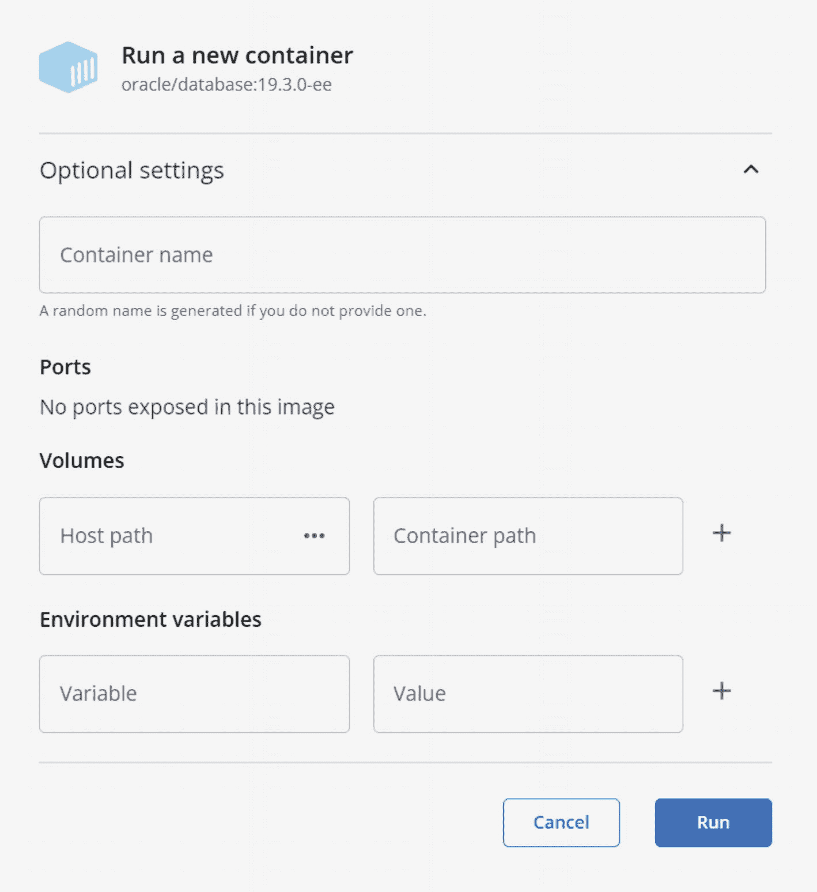

一个运行新容器的截图，包含可选设置、端口、卷和环境变量的选项。右下角有取消和运行按钮。

图 7-4

Docker Desktop 的“运行新容器”对话框允许用户将本地目录分配给新容器中的目标。

###### Linux 和 WSL 的解决方法

Linux 和 WSL 环境中的用户可以通过预先创建目录并设置目录所有权来解决此问题：

```
sudo mkdir -p /oradata/ORCL
sudo chown oracle:oinstall /oradata/ORCL
```

将所有权设置为 `oracle:oinstall` 意味着该用户和组必须存在，并且与容器中通过 Linux 预安装 RPM 指定的用户和组 ID 相同：

```
sudo groupadd -g 54321 oinstall
sudo useradd -u 54321 -g oinstall
```

或者，你可以将目录所有权分配给 Docker 进程 ID（1000）：

```
sudo chown 1000 /oradata/ORCL
```

绑定挂载对于数据库存储来说是一个不错但并非完美的解决方案，尤其是在使用 Mac 或完全从 Docker Desktop 运行所有内容时。在多个操作系统或环境中工作的用户很可能会遇到限制以及奇怪或烦人的行为。

#### 本地卷

使用本地卷，用户升级到完全由 Docker 管理的对象。无论是在 Docker Desktop 还是在命令行，容器及其卷在视觉上是关联的，这使得关系更易于管理。

回顾关于卷修剪的部分，本地卷是在创建时不指定任何类型的，并且在 `docker volume inspect` 的选项输出中不显示任何内容。

本地卷是 Docker 对象，在所有操作系统上行为一致。Docker 提供了在卷上保存目录和文件以及在容器之间共享卷内容的工具。

但是，由于本地卷将数据保存在 Docker 的私有目录内，它们遭受了与不使用挂载或卷保存数据相同的许多缺点。本地卷中的数据从本地操作系统不可见，并且它们受到与性能和空间相同的限制。

#### 绑定挂载卷

绑定挂载卷结合了绑定挂载的最佳特性和 Docker 管理对象的优势。保存到主机文件系统的文件对用户和进程（包括备份）都是可见的。Docker Desktop 或 Docker CLI 管理容器和绑定挂载卷之间的关系，就像本地卷一样。

不幸的是，Docker Desktop 目前没有提供使用绑定挂载创建卷的选项，这迫使我们至少要从命令行执行这一步。

让我们比较一下普通绑定挂载和使用绑定挂载的卷的行为。

##### 目录创建

我将首先使用目录 `$HOME/test_bind` 创建一个绑定挂载：

```
> docker volume create --opt type=none --opt o=bind \
--opt device=$HOME/test_bind test_bind
test_bind
```

到目前为止，一切顺利。现在我尝试运行一个类似于之前执行的测试，这次将容器中的一个目录映射到该卷：

```
> docker run \
>         --volume test_bind:/test_bind \
>         alpine ls -l /test_bind
docker: Error response from daemon: error while mounting volume '/docker/volumes/test_bind/_data': failed to mount local volume: mount /home/docker/test_bind:/docker/volumes/test_bind/_data, flags: 0x1000: no such file or directory.
ERRO[0000] error waiting for container: context canceled
```

创建绑定挂载卷并没有创建目录！让我们先创建它然后再试一次：

```
> mkdir -p $HOME/test_bind
> docker run \
>        --volume test_bind:/test_bind \
>        alpine ls -l /test_bind
total 0
```

这次成功了！我作为系统上的本地用户创建了目录，这意味着它不属于 root 所有。但这将如何影响我们的数据库容器呢？

##### 目录所有权和权限

还记得前面的绑定挂载示例吗？在 Linux 系统上运行在容器内的 Oracle 数据库进程需要主机目录上的特定权限。否则，数据库配置助手会在创建数据库时因“权限被拒绝”错误而失败。我将为此进行测试，为 Oracle 数据库容器创建一个新目录和卷：

```
> docker volume create --opt type=none --opt o=bind \
>        --opt device=$HOME/oracle_bind oracle_bind
oracle_bind
> mkdir -p $HOME/oracle_bind
```

新目录的所有权并无异常：

```
> ls -l $HOME
total 7386868
drwxrwxr-x 32 sean sean       4096 Aug 20 17:06  docker-images
drwxr-xr-x  3 sean sean         21 Sep 18 22:11  oracle_bind
```

我没有对新创建的 `$HOME/oracle_bind` 目录做任何特殊处理，就启动了一个容器，将 oradata 目录映射到该卷：

```
> docker run -d --name bind_test \
>        -v oracle_bind:/opt/oracle/oradata \
>        oracle/database:19.3.0-ee
d2b25b1f661d7f243984fdcbd77177beb14dc61be9525d421426e0d609917f31
```

然而，一旦 DBCA 在容器中启动，这个目录就发生了不寻常的变化：

```
> ls -l $HOME
total 7386868
drwxrwxr-x 32   sean   sean       4096 Aug 20 17:06  docker-images
drwxr-xr-x  4 oracle  54322        61 Sep 18 22:26  oracle_bind
```

Docker 更改了目录所有权！虽然 Docker 守护进程以 root 身份运行，但容器内的进程将预期的所有权传播给守护进程，后者在容器主机上做出必要的更改。


##### 挂载方法

对于常规的绑定挂载，`--volume`和`--mount`选项对不存在的目录的处理方式不同。由于绑定挂载卷所使用的目录必须预先创建，因此`--volume`和`--mount`选项都是有效的。

尽管在运行容器之前需要额外创建卷和源目录，但绑定挂载卷是数据库的最佳选择。卷上的数据可以从操作系统访问，并且我们可以使用操作系统命令或 Docker 的卷管理工具来备份数据。我们能在不同平台上看到一致的行为和操作，并且无需担心设置权限或所有权！

### 总结

可以说，理解存储是在容器中实施数据库基础设施时最重要的概念之一。在本章中，你发现了容器联合文件系统的优势和局限，以及外部挂载存储如何扩展能力并提升容器性能。

你了解了绑定挂载和卷之间的区别。你现在明白了 *卷* 在 Docker 圈子里的多重含义：既可以指镜像中的目标目录，也可以指存储数据的对象，还被不准确地用来泛指任何连接到容器的存储。最后，你认识到了不同存储方法的差异和好处，并且知道如何创建卷以及将存储挂载到新容器上。

探索容器存储让我们得以一窥，精心规划的镜像如何带来高度模块化、高效且可移植的实现。在下一章中，你将学习如何在主机和容器之间建立通信。这是拼图的另一半，将主机资源与容器连接起来。

脚注 1   2   3   4   5   6   7   8   9   10   11   12   13   14

## 8. 基础网络

在 Unix 的早期，计算资源非常昂贵。从这些昂贵的系统中获取最大价值，意味着要找到支持大量并发连接的方法。来自不同公司的用户以及处理敏感信息的用户需要确信他们的进程和数据是安全的。这推动了 Unix 分时系统（UTS）的发展，它提供了会话隔离和安全性，这也是现代容器实现的基础。

隔离和保护容器是现代高密度基础设施的支柱。基于服务和云原生的计算将数十个或数百个独立系统的工作集中到单个服务器上。每个系统仍然不知道自己在共享资源。但是，当你 *希望* 容器之间进行交互时，会发生什么？企业并非与世隔绝的孤岛系统，因此必须有一种机制来描述和管理访问权限。

容器网络建立在“常规”网络概念之上。容器边界——数据包从容器内部穿越到外部的地方——是一个网络接口。它遵循相同的规则，我们可以使用相同的技术来控制和操纵流量。在容器环境中，虚拟网络处理容器与其主机、其他本地容器以及远程资源（包括不同机器上的容器）之间的通信。你会发现，创建网络资源与你上一章学到的定义卷非常相似。有一种快速、简单但功能有限的方法，还有一种更复杂但提供更大灵活性的方法。

如果你在本地系统上运行少量数据库容器，并且只计划通过命令行或像 `SQL Developer` 这样的数据库客户端连接，那么快速简便的方法可能就足够了。编排和共享环境则受益于更结构化的方法，这些方法提供了更高级的网络功能，如 DNS。为更复杂的多容器项目（例如 RAC、GoldenGate 和 Data Guard）规划网络拓扑所花费的额外精力，在它们投入使用后，其带来的便利和时间节省是非常值得的。

考虑到这一点，本章将介绍快速、简便的方法——*端口发布*——并演示如何将客户端连接到容器数据库。下一章将深入探讨更正式的主题——*容器网络*——及其优势，提供一些创建和管理不同网络资源的实用示例，以及如何将容器添加到网络中。

### 端口发布

*端口发布* 是与容器建立通信的最简单方式。它完全适用于本地桌面系统，但缺乏容器网络的可扩展性、灵活性和控制能力。然而，如果你只是想用像 `SQL Developer` 这样的客户端连接到桌面或笔记本电脑上的 Oracle 数据库，那么创建专用网络所付出的额外时间和精力就显得多余了。端口发布就是你所需要的一切。

对于 Oracle 数据库，我们通常关注端口 1521，这是数据库监听器处理 `SQL*Net` 流量的默认端口。在接下来的示例中，我将使用端口 1521 来介绍端口映射（以及容器网络）。

端口发布将本地主机上的一个端口绑定到容器上的一个端口。对于运行 Oracle 数据库的容器，进出容器端口 1521 的流量会被重定向到主机上的某个端口，反之亦然。我将使用端口 51521 作为主机端口（原因稍后说明）。因此，从容器端口 1521 发出的数据包会被映射并显示在主机的端口 51521 上。任何我们想要连接到容器内监听器的流量都应该访问主机的端口 51521，如图 8-1 所示。

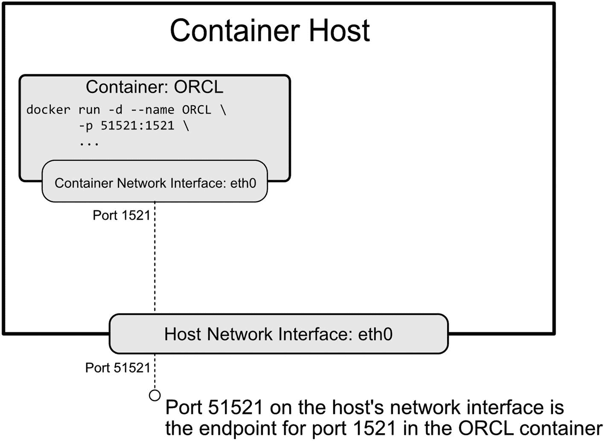

容器主机的模型图包含容器 ORCL、容器网络接口、端口 1521、主机网络接口和端口 51521。

图 8-1

容器内端口 1521 的流量通过主机网络接口的端口 51521 被重定向

`docker run` 命令的 `-p`（长格式 `--publish`）选项定义了映射。其语法，如清单 8-1 所示，遵循与上一章映射卷相同的模式：

*   本地资源在前
*   然后是容器资源，用冒号分隔

```bash
docker run --name <container_name> \
-p <host_port>:<container_port> \
...

docker run --name <container_name> \
--publish <host_port>:<container_port> \
...
```

**清单 8-1**
使用 `-p` 和 `--publish` 标志发布端口的 `docker run` 语法

就像你使用多个 `-v` 标志来映射多个卷一样，使用独立的 `-p`（或 `--publish`）声明来创建多个端口映射：

```bash
docker run --name <container_name> \
-p <host_port1>:<container_port1> \
-p <host_port2>:<container_port2> \
...
```

这里，我在创建一个新的 Oracle 19c 数据库时，将主机上的端口 51521 映射到容器内的端口 1521：

```bash
docker run --name ORCL \
-p 51521:1521 \
...
oracle/database:19.3.0-ee
```

当流量是本地的时候——客户端和容器都在同一台主机上——端口映射就是全部所需。除了 `localhost` 或其等效地址外，不需要主机名（或其他任何东西）。容器“看到”传入的流量到达端口 1521。通常连接到数据库端口 1521 的客户端，将改用 `localhost` 上的端口 51521。


#### 发布容器端口

发布端口的唯一机会是在容器创建时。你无法在之后为已存在的容器添加端口映射。^(^58^)

遵循前一章的建议，我将创建一个卷来存放我的数据库文件。然后，我将启动一个容器，为其命名，挂载该卷，并将容器端口 `1521` 映射到主机端口 `51521`。清单 8-2 展示了这些命令及其结果。

```
> docker volume create \
>      --opt type=none \
>      --opt o=bind \
>      --opt device=/Users/sean.scott/oradata/ORCL \
>      oradata_ORCL
oradata_ORCL
> docker run -d \
>      --name ORCL \
>      --mount type=volume,target=/opt/oracle/oradata,source=oradata_ORCL \
>      -p 51521:1521 \
>      oracle/database:19.3.0-ee
f502c53c3c272463f6b40860784c95f0c2f0cbf9893e503a7cce83bf2ccd35e6
```
*清单 8-2. 创建新的卷和容器，用于演示客户端连接性。*

容器启动后，我在 `docker ps` 的输出中看到了端口映射：

```
NAMES  IMAGE                       PORTS                     STATUS
ORCL   oracle/database:19.3.0-ee   0.0.0.0:51521->1521/tcp   Up 6 minutes (healthy)
```

发布端口的作用不仅仅是重定向流量。映射 `0.0.0.0:51521->1521/tcp` 就像一条防火墙规则，它打开了容器上的端口 `1521`，并允许流量通过。未发布的端口是无法访问的。既然你无法回溯并为现有容器添加端口，这就强化了在创建容器时预见网络需求的重要性！

#### 容器端口映射的局限

我的容器正在运行，并在主机端口 `51521` 上监听数据库流量。让我们看看当我尝试使用相同的端口映射添加第二个容器时会发生什么：

```
> docker run -d \
>      --name ORCL1 \
>      -p 51521:1521 \
>      oracle/database:19.3.0-ee
8ab4c0a09137cebcd99fda61a20942aa4c45350070d5af8d69f3dc2605b6ae9d
docker: Error response from daemon: driver failed programming external connectivity on endpoint ORCL1: Bind for 0.0.0.0:51521 failed: port is already allocated.
```

端口 `51521` 已被占用！启动第二个容器失败了，因为容器-端口组合必须在主机上使用唯一的、未被分配的端口。

前面的输出显示该容器已被*创建*（由其哈希值，即错误消息前以 `8ab4…` 开头的字符串所证明）。使用 `docker ps` 列出我系统上的容器证实了这一点，并显示没有映射端口：

```
NAMES  IMAGE                       PORTS                     STATUS
ORCL1  oracle/database:19.3.0-ee                             Created
ORCL   oracle/database:19.3.0-ee   0.0.0.0:51521->1521/tcp   Up 23 minutes (healthy)
```

在为此容器重新运行修正后的 `docker run` 命令之前，我需要先将其移除。

在小型环境中，比如那些在笔记本电脑上运行用于实验的环境，跟踪端口并不困难。随着容器数量（或映射到主机的端口数量）增加，端口映射变得不切实际。端口是有限的资源，最终，主机上的容量会耗尽。

跟踪哪个端口对应哪个容器也更加复杂。在分配主机端口时，我通常在容器的端口前加一个数字前缀，例如，一个容器使用端口 `51521` 和 `55500`，下一个容器使用 `61521` 和 `65500`，依此类推。

低于 `1024` 的端口是*周知*端口，通常分配给标准的系统或由 root 拥有的进程。将容器端口映射到低于 `1024` 的任何端口，都有与这些已注册进程冲突的风险，并可能阻止主机服务（或系统）正常运行。

将端口分配在 `1024` 到 `49151` 的范围内也并非总是安全。这些是*注册*端口，虽然并非严格控制，但注册减少了供应商之间重复使用的可能性。Oracle 网络使用端口 `1521` 就是一个例子。其他供应商和服务*可能*使用它，但这会在同样运行 Oracle 数据库监听器的系统上造成冲突。

`49152` 到 `65535` 范围内的*动态*或*非保留*端口未被分配、控制或注册，通常被认为是私有或临时使用的安全范围。这就是为什么我之前选择了端口 `51521`。理想情况下，仅在动态端口范围内使用端口进行发布。

#### 自动端口发布

除了定义单独的、显式的主机到容器端口映射外，还有一种选项可以*暴露*容器中的端口，并让 Docker 通过使用 `docker run` 的 `-P`（或 `--publish-all`）选项将它们映射到动态范围内的未分配端口。

`docker run` 的帮助菜单说明 `--publish-all` 标志将“*将所有已暴露的端口发布到随机端口*”。我们尚未介绍 Dockerfile，但它们包含一个在镜像元数据中*暴露*端口的选项。对 Oracle 数据库容器镜像的*旧*版本运行 `docker inspect` 显示它暴露了端口 `1521` 和 `5500`：

```
> docker inspect -f '{{.Config.ExposedPorts}}' oracle/database:19.3.0-ee
map[1521/tcp:{} 5500/tcp:{}]
```

使用 `-P` 标志运行该镜像会将已暴露的端口随机分配给主机动态范围内的可用端口：

```
> docker run -d \
--name TEST \
-P oracle/database:19.3.0-ee
639c6770dacd207f1d9b0a5fa301c9a9d1dc6dac420047ca6c0a41598b9a0203
```

容器启动后，使用 `docker ps` 显示 Docker 为镜像已暴露端口所做的端口分配：

```
> docker ps -a \
--format "table {{.Names}}\t{{.Ports}}"
NAMES    PORTS
TEST     0.0.0.0:32771->1521/tcp, 0.0.0.0:32770->5500/tcp
```

我注意到这来自一个旧镜像。`-P` 选项仅在端口在镜像中*明确*暴露时才有效，例如从旧版本的 Oracle 容器仓库脚本创建的镜像。在某个时候，他们从镜像中移除了这个：

```
> docker inspect -f '{{.Config.ExposedPorts}}' oracle/database:19.3.0-ee
map[]
```

如果镜像中没有暴露端口，`-P` 选项就没有可映射的对象。

然而，在镜像中显式暴露端口并非必要。该功能可通过 `docker run` 的 `--expose` 标志获得。它在容器级别上做 Dockerfile 中 `EXPOSE` 选项为镜像所做的事，并提供了更大的灵活性，可以在运行时定义一组暴露的端口，而不是将它们固定在镜像中。向 `--expose` 传递一个端口列表或范围，会告诉 Docker 在容器上打开哪些端口。当与 `-P` 选项一起使用时，Docker 会像端口在镜像中被暴露那样分配端口。

清单 8-3 展示了如何使用当前的 Oracle 数据库镜像，通过 `--expose` 和 `-P` 打开并分配端口 `1521` 和 `5500`。

```
> docker run -d \
--name TEST \
--expose 1521 \
--expose 5500 \
-P oracle/database:19.3.0-ee
0d34bb1d59f85b67b90f19db16d0ab09b91ee000c81187f8847c4fe2f6c186eb
> docker ps -a \
--format "table {{.Names}}\t{{.Ports}}"
NAMES     PORTS
TEST      0.0.0.0:49157->1521/tcp, 0.0.0.0:49156->5500/tcp
```
*清单 8-3. 使用 `--expose` 和 `-P` 运行镜像，即使镜像中没有定义端口，也能打开并发布端口 1521 和 5500。*

现在你已经了解如何打开并将端口从容器映射到主机，让我们将这些知识付诸实践，将客户端连接到容器内的数据库吧！


### 在容器中连接数据库

无论是在 SQL Developer 中添加新的数据库连接、构建 `EZConnect` 字符串，还是创建 `tnsnames.ora` 条目，我们都需要相同的基本信息：

*   **主机名：** 本地客户端将使用主机 `localhost` 或 IP 地址 `0.0.0.0`。
*   **监听器端口：** 在这些示例中，我将切换回在上一节开头创建的 `ORCL` 容器。如果还记得，我将容器的监听器端口 `1521` 映射到了我主机上的端口 `51521`。
*   **数据库服务或 SID：** 我之前运行的 Oracle 19c 数据库镜像创建的默认服务名为 `ORCLCDB`（用于 CDB 或容器数据库——不要与在 Docker 容器中运行的数据库混淆！）和 `ORCLPDB1`（用于 PDB，即可插拔数据库）。
*   **用户名和密码：** 为了演示，我已将 `system` 用户的密码更改为 `oracle`。

#### 在 SQL Developer 中设置连接

SQL Developer 是 Oracle 提供的多功能、流行且易于使用的图形化开发工具。您可以从 [www.oracle.com/tools/downloads/sqldev-downloads.html](https://www.oracle.com/tools/downloads/sqldev-downloads.html) 免费下载。还有许多其他与 Oracle 数据库兼容的开发工具，但添加新连接的步骤是类似的。它们都需要相同的四项信息，此处展示的内容也适用于其他产品。

打开 SQL Developer 后，导航到左上角的连接面板，点击绿色加号以打开如图 8-2 所示的“新建连接”对话框。

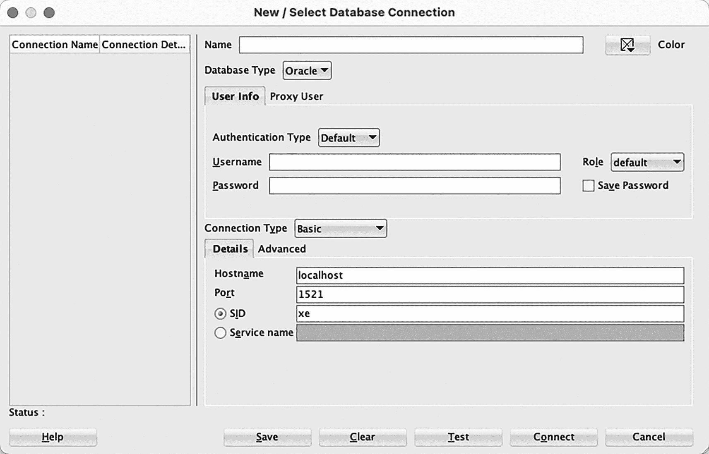
新建或选择数据库连接的屏幕截图，包含名称、数据库类型、用户信息和连接类型详细信息等选项。底部有帮助、保存、清除、测试、连接和取消等选项。
图 8-2：Oracle SQL Developer “新建连接”对话框

为新连接命名并输入用户名和密码，如图 8-3 所示。可选择勾选“保存密码”复选框。

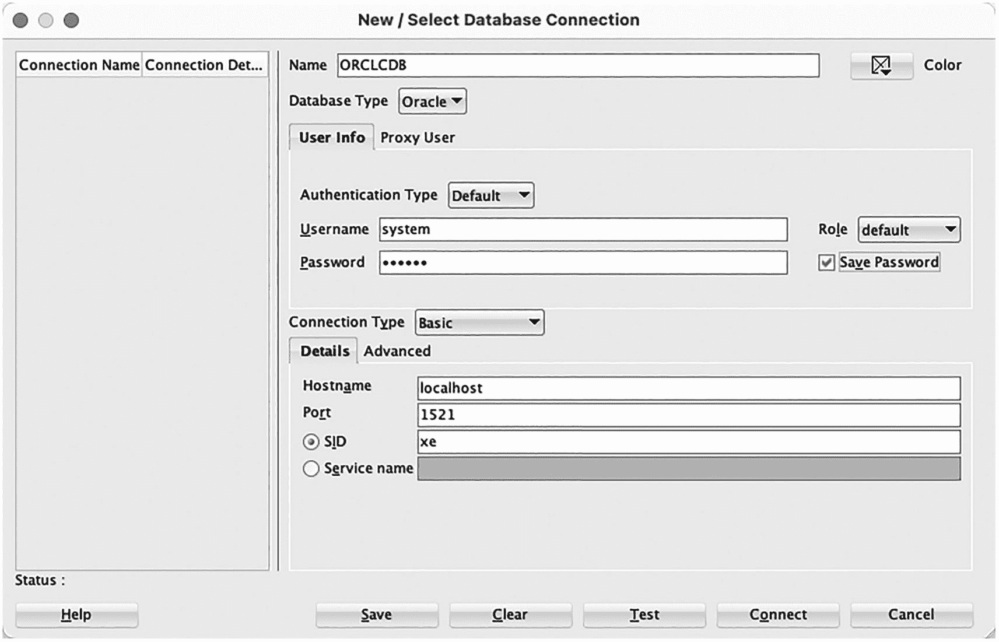
新建或选择数据库连接的屏幕截图，名称为 O R C L C D B，数据库类型为 oracle，包含用户信息和连接类型详细信息。
图 8-3：输入连接名称和数据库用户的用户名与密码

在“详细信息”选项卡中，将连接类型保持为“基本”，“主机名”保持为默认的 `localhost`。将“端口”更改为映射到该容器的主机端口。在我的系统上使用的是 `51521`，但您的可能不同，特别是如果您选择使用 `-P` 选项让 Docker 自动分配端口。

接下来，选中“服务名”的单选按钮，并输入在容器中运行的数据库的服务名。在图 8-4 中，我提供了默认的 CDB 服务 `ORCLCDB`。最后，点击对话框底部的“测试”按钮，并确认左下角显示的“状态”为“成功”。

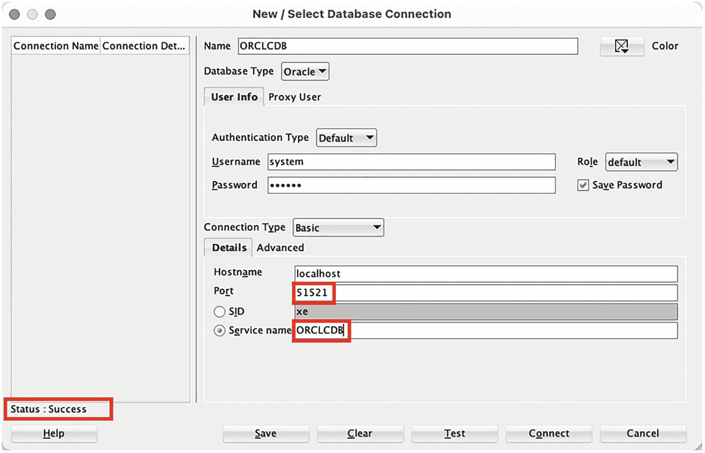
新建或选择数据库连接的屏幕截图，包含名称、数据库类型、用户信息和连接类型详细信息，其中端口和服务名已标记。左侧状态显示为成功。
图 8-4：更改端口和服务名，然后测试连接

最后，点击对话框底部的“保存”按钮以保存连接设置。

恭喜！您已成功创建到 Docker 容器中数据库的连接！您可以自由花几分钟时间探索环境，或者也连接到可插拔数据库中的一个用户！

#### EZConnect

Oracle 的 `EZConnect` 或 `Easy Connect` 是一种简化的方法，无需在传统的 `tnsnames.ora` 文件中执行服务查找即可连接到 Oracle 数据库。基本语法是：

```
username/password@//host:port/service_name
```

使用与之前构建 SQL Developer 连接相同的信息，我可以得到一个有效的连接字符串：

```
system/oracle@//localhost:51521/ORCLCDB
```

我可以使用此字符串从像 Oracle 的 `SQLcl` 这样的命令行客户端连接到数据库，`SQLcl` 是一个类似于 SQL*Plus 的命令行工具，但具有更多开发者友好的功能。您可以从 [www.oracle.com/tools/downloads/sqlcl-downloads.html](https://www.oracle.com/tools/downloads/sqlcl-downloads.html) 免费下载它。

此连接字符串在*我的本地环境*中的任何客户端都有效，因为它告诉客户端连接到在 `localhost` 上监听端口 `51521` 的数据库。它在*容器内部*将无法工作。为什么呢？

监听器在容器内的端口 `1521` 上运行，并不了解外部世界。它也看不到 Docker 添加的在容器与主机之间的端口映射。在容器内部，我使用一个包含主机、端口和服务的 `EZConnect` 字符串“正常地”连接到数据库。`EZConnect` 默认假定端口是 `1521`，这意味着我也可以只使用主机和服务：

```
SQL> conn system/oracle@//localhost:1521/ORCLCDB
Connected.
SQL> conn system/oracle@//localhost/ORCLCDB
Connected.
```

从容器主机（在本例中是我的笔记本电脑）和容器内部的客户端（这里是在 `ORCL` 容器中运行的 SQL*Plus）发起的连接都使用 `localhost` 作为主机。`localhost` 是“我的本地主机”的别名，但它在容器和主机中并不代表*同一个主机*！

为了说明这一点，我在容器中运行了 Linux 的 `hostname` 命令（如清单 8-4 所示），然后退出容器环境，并在主机上重新运行了它。

```
[oracle@f502c53c3c27 ~]$ hostname
f502c53c3c27
[oracle@f502c53c3c27 ~]$ exit
exit
> hostname
SSCOTT-C02QP2DJG8WN
```
清单 8-4：`localhost` 在容器环境内外引用的是不同的主机

我自己也曾混淆过，有一次花了比我愿意承认的更多时间来推理，为什么一个在容器*外部*使用转换后的端口可以工作的 `EZConnect` 字符串，在容器*内部*从 SQL*Plus 使用却不行！在设置连接时，请小心不要搞混了哪个 `localhost` 是哪个！

#### 创建 tnsnames.ora 配置

正如您可能从前面两节猜到的，设置 TNS 连接需要将正确的主机、端口和服务名应用于连接别名。在本地计算机的 `tnsnames.ora` 文件中为容器数据库添加别名，需要使用映射到该容器的主机名和端口。清单 8-5 提供了 `tnsnames.ora` 文件中条目的示例，定义了到我的 `ORCL` 容器中 `ORCLPDB1` 服务的连接。请记住，我主机上的端口 `51521` 映射到了数据库监听器的端口 `1521`。

```
ORCLPDB1 =
(DESCRIPTION =
(ADDRESS = (PROTOCOL = TCP)(HOST = localhost)(PORT = 51521))
(CONNECT_DATA =
(SERVER = DEDICATED)
(SERVICE_NAME = ORCLPDB1)
)
)
```
清单 8-5：用于从主机连接到容器内数据库的 `ORCLPDB1` 服务的 `tnsnames.ora` 条目。使用开放并映射到容器的端口将流量定向到数据库监听器。

它看起来与容器内的 `tnsnames.ora` 文件（位于 `$ORACLE_HOME/network/admin` 下，如清单 8-6 所示）非常相似。唯一的区别是主机和端口。请记住，容器内的数据库和软件不受容器-主机网络接口上发生的变化影响（甚至不知道这些变化）。

```
ORCLPDB1=
(DESCRIPTION =
(ADDRESS = (PROTOCOL = TCP)(HOST = 0.0.0.0)(PORT = 1521))
(CONNECT_DATA =
(SERVER = DEDICATED)
(SERVICE_NAME = ORCLPDB1)
)
)
```
清单 8-6：数据库容器内部的 `ORCLPDB1` 服务的 `tnsnames.ora` 条目不会遇到任何端口更改，因为其流量完全在容器内部。


### 连接到远程主机上的容器

这些示例展示了同一主机上容器与客户端之间的连接。但情况并非总是如此。我有一个专门用于容器构建的本地实验室环境，并在各种云计算资源上操作额外的容器。访问远程主机上的 Oracle 数据库，无论是您网络内的另一台机器，还是云中的某个虚拟主机，其过程与您看到的几乎完全相同。

连接设置的唯一改变在于主机名。将 `localhost` 替换为远程资源的名称或 IP 地址。例如，我本地 Docker 实验室的主机名是 `lab01`。到远程机器上容器的连接会引用该主机名，但端口保持不变。只要我的网络允许通过该端口进行连接，远程主机就能识别并将流量路由到相应的容器。

这就引出了连接到远程 Docker 主机时的另一个考虑因素。在我的家庭实验室中，所有东西都在私有网络内，因此防火墙规则不是问题。但是连接到云上的容器则需要安全规则来允许流量进入云网络，以及各个主机上的防火墙和路由规则。

### 设置容器主机名

在 `docker run` 时可用的最后一个选项是 `--hostname` 标志，它能让使用容器的感觉更加“正常”。

Docker 在创建容器时会分配唯一的字母数字字符串作为主机名，如清单 8-7 所示。对于非交互式环境来说，这不是问题。但随机的字符串对于在命令行工作的人来说可读性很差！默认的提示符虽然包含了主机名，但并不提供任何有意义的信息。配置依赖于名称解析的连接——例如两个数据库之间——会很繁琐。谁愿意反复输入（或复制/粘贴）“f502c53c3c27”呢？

```
> docker exec -it ORCL bash
[oracle@f502c53c3c27 ~]$ hostname
f502c53c3c27
[oracle@f502c53c3c27 ~]$ cat /etc/hosts
127.0.0.1     localhost
::1     localhost ip6-localhost ip6-loopback
fe00::0    ip6-localnet
ff00::0     ip6-mcastprefix
ff02::1     ip6-allnodes
ff02::2     ip6-allrouters
172.17.0.2     f502c53c3c27
清单 8-7
在未设置主机名的容器中查看主机名和主机信息
```

`docker run` 的 `--hostname` 选项用于设置容器内的主机名。清单 8-8 是在创建时为主机名分配主机名的示例，随后在新容器内使用与清单 8-7 相同的命令进行了验证。

```
> docker run -d \
>      --name TEST \
>      --hostname TEST \
>      -p 51521:1521 \
>      oracle/database:19.3.0-ee
78f62ede3f889b3805d51428385b5d56826164c2517951019cf5f612c608b8be
> docker exec -it TEST bash
[oracle@TEST ~]$ hostname
TEST
[oracle@TEST ~]$ cat /etc/hosts
127.0.0.1     localhost
::1     localhost ip6-localhost ip6-loopback
fe00::0     ip6-localnet
ff00::0     ip6-mcastprefix
ff02::1     ip6-allnodes
ff02::2     ip6-allrouters
172.17.0.5     TEST
[oracle@TEST ~]$
清单 8-8
使用 docker run --hostname 标志设置并确认容器内的主机名
```

比较一下两个容器的输出。第二个容器由于在 shell 提示符处显示了有意义的名称，因此更容易识别。它也有助于在环境中按照标准实践保持一致的命名。而且，借助 DNS，容器内部的网络连接对于人类读者来说也更加直接明了。唉，容器网络中的 DNS 是下一章的主题！

### 向现有容器添加端口

在介绍端口发布时，我说过唯一在容器中打开端口的时机是在创建时。我也提到了一个变通方法，虽然没有什么魔法可以绕过 Docker 的网络行为，但有一种方法可以实现结果——只有一个注意事项！

在第 7 章中，您了解到 Docker 如何将数据与软件分离，以及保存在卷上的数据和配置在移除容器后仍然保留。卷上的数据和配置可以被回收利用——例如克隆数据库——或用于重新创建数据库。通过将 `/opt/oracle/oradata` 目录映射到现有卷，新容器并不知道它是一个新容器。它只是启动了现有的数据库。

同样的技巧允许您向现有容器添加端口映射。只要数据被持久化到卷中，您就可以停止、移除，然后使用相同的数据库特定设置（例如 `ORACLE_SID` 和 `ORACLE_PDB`）以及相同的卷映射重新创建容器。将被遗漏的端口映射（或其他配置）添加到新的 `docker run` 命令中。

### 本章小结

本章介绍了容器网络背后的基础知识，并描述了如何使用端口发布在主机与其容器之间打开通信。您了解到端口无法在容器创建后添加，但删除并重新创建容器可以绕过这个疏忽——前提是其数据已持久化到卷中！

使用 `-p` 或 `--publish` 选项在主机和容器之间映射资源，其模式与使用 `-v` 或 `--volume` 分配卷相同，但这是一种有限的方法。端口数量是有限的，并且并非所有端口都适合作为转换流量的目标。只能使用非保留或动态范围（从 49152 到 65535）内的端口，否则可能与其他服务发生冲突。为避免使用已被分配的端口，可以同时使用 `--expose` 和 `-P`（或 `--publish-all`）标志来分配网络映射。

创建到运行在容器中的数据库的连接，与在非容器环境中的过程几乎完全相同。关键区别在于理解使用哪个主机和端口以及在哪里使用。在容器内部运行的进程不使用端口映射，而从主机（或远程主机上的容器）连接的客户端将使用映射的端口。

最后，您学习了如何设置容器的主机名，使环境感觉更“正常”和友好。设置主机名是下一章的铺垫，在下一章中，容器网络和 DNS 功能将使编排和多个数据库系统变得更加流畅和自然。

端口发布对于小型系统，尤其是在笔记本电脑或台式机等本地化环境中运行的系统来说是足够的。通过添加容器网络来使事情复杂化是没有意义的。如果您在 Linux 容器中运行 Oracle 数据库的动机是个人用途，拥有一些用于实验的数据库，那么您可以直接跳到第 10 章。要了解更多关于容器网络的知识，以及如何构建更健壮和灵活的网络，或使容器表现为“常规”网络资源（而无需记住哪个容器使用什么端口），您可以在第 9 章找到答案！

脚注 1


## 9. 容器网络

我得坦白：网络技术让我感到畏惧。我曾在设有专职网络管理员的环境中工作了多年，除了基础之外，并未花时间深入学习。直到我加入一个运维团队，我才意识到自己技能上的这一空白。从我听到的其他数据库管理员的反馈来看，有这种感觉的并非我一个人。

在使用 Docker 的头几年，我主要依靠端口发布来处理连接。由于我只需要本地访问少数几个容器，因此觉得没必要额外费心去创建专用网络。而且，当时大家也都是这么做的。

随着我对容器的使用和依赖日益增加，我逐渐认识到端口映射带来的负担和局限性。它是一个手动过程，扩展性差，且无法与自动化流程集成。我必须手动跟踪和分配开放端口。如果让 Docker 分配端口，我又需要去识别这些映射关系。而且，如果我忘记设置端口，就不得不重新创建容器！在端口映射下，网络配置也不直观。连接字符串和主机标识会根据连接来源的不同而变化。容器网络消除了这些问题，它简化了访问和使用，将容器与现有的观测平台集成，并降低了运维开销。

本章并非对网络概念的深入探讨，而是聚焦于在容器中部署 Oracle 数据库服务时所面临网络问题的实用解决方案。希望这能让那些与我一样对网络技术感到焦虑的人觉得这个主题不那么可怕！

### 容器网络

我们已经了解了 Docker 如何隔离容器资源，无论是在容器中添加主机上不存在的用户，还是创建仅容器可见的私有文件系统。但容器并不能完全与主机隔绝。它们仍然需要共享主机资源，如 CPU、内存、存储以及通过`容器网络`提供的网络。

容器网络通常无需过多关注。它们作为 Docker 引擎启动的一部分自动启动。每个网络都有一个默认网关和 DNS 功能，Docker 守护进程提供 DHCP 服务和 IP 分配。并且，启动、停止、创建或移除容器等操作不会影响网络。

Docker 守护进程使用 DHCP 为容器分配 IP 地址。每当主机、容器引擎或容器网络重启时，地址会被重新分配（并且可能会改变）。请将容器 IP 地址视为临时地址，不要将它们用于`tnsnames.ora`文件等网络配置中！

人们很容易将 Docker 网络视为理所当然。许多容器操作都需要网络，包括连接到容器的命令行或数据库，以及构建镜像（这会调用`yum`通过主机的互联网连接获取操作系统更新）。然而，我们并不需要创建或配置任何网络，因为 Docker 在安装时添加了三个默认网络：`bridge`、`host`和`none`。

#### Docker 网络类型

容器网络是`虚拟`或`软件定义的网络`。它们不是由电缆和物理网卡定义，而是由规则和配置来定义网络设备和路由。它们的操作方式与“普通”网络非常相似，但每种容器网络类型都针对特定需求而设计。

##### 桥接网络

顾名思义，桥接网络跨越了网络设备之间的间隙。在容器环境中，桥接网络所覆盖的间隙位于主机和容器网络之间。位于同一桥接网络上的容器可以在网络`内部`相互通信，同时可以`跨越`桥接与主机交互。然而，桥接驱动程序中的规则阻止了不同桥接网络之间的通信。虽然分配到一个桥接网络的容器可以看见并与彼此通信，但它们无法看到或访问其他桥接网络上的容器。桥接网络仅限于单个主机，或者更准确地说，仅限于运行在该主机上的 Docker 守护进程，但单个主机上可以有多个桥接网络。

由于桥接网络将容器暴露给彼此，因此它最适用于托管多个相互依赖服务的实验环境和本地环境。到目前为止你所见到的所有操作，都是通过类似图 9-1 所示的桥接网络进行的——具体来说，是 Docker 的`默认桥接网络`。虽然默认桥接网络使用与用户自定义桥接相同的桥接驱动程序，但用户自定义的桥接网络具有更多功能和特性，使其在除最基本环境之外的所有场景中更具吸引力。

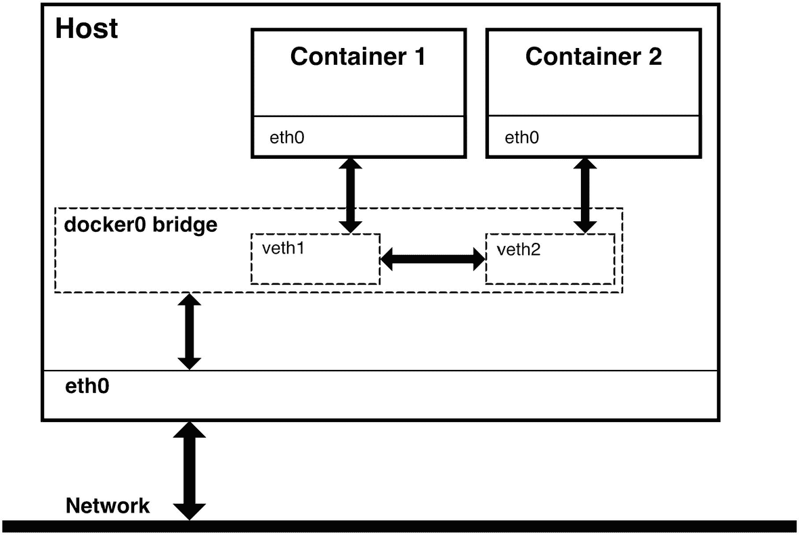

图 9-1
连接到桥接网络的容器可以看见并与同一网络上的其他容器通信，同时“桥接”跨越了容器网络与主机之间的间隙。

##### 主机网络

主机网络将容器端口直接映射到主机。实际上，主机网络使得容器服务看起来像是在本地运行，而不是在容器中运行。对于使用容器主机网络的 Oracle 数据库容器，外部客户端通过主机的 1521 端口而非映射端口访问监听器。

主机网络的一个优势是 DNS 透明性。外部网络上的客户端可以解析容器主机，而无需处理 Docker 创建的任何抽象层。两个缺点是：主机网络仅在 Linux 上可用，并且一个 Docker 主机无法运行多个容器。

如图 9-2 所示的容器主机网络对于专用于单一服务的容器主机非常有用。它们结合了容器的优势，如隔离和基础设施即代码，而不会使网络环境复杂化。在运行 Oracle 数据库时，特别是当性能或容量需求要求为单个数据库分配专用资源和基础设施时，主机网络可以降低复杂性和配置开销。

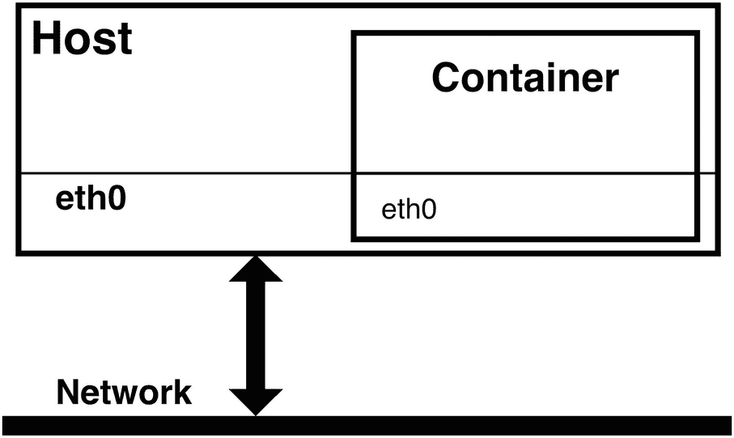

图 9-2
主机网络将容器直接连接到主机网络接口。

##### 其他网络类型

Docker 提供了其他网络类型，包括：

*   `MACVLAN 网络`：通过为网络上的每个容器创建唯一的 MAC 地址，使容器看起来更像物理主机。Docker 根据 MAC 地址将流量路由到容器。当将传统应用程序迁移到虚拟机（或物理主机）上的容器时，它们很有用。
*   `IPVLAN 网络`：提供对分配给容器的 IPv4 和 IPv6 地址的细粒度控制。它们通常需要更多的关注和专门的网络设计。
*   `“无”网络`：正如其名——没有网络。将容器连接到 none 网络会禁用网络功能。它最常与自定义网络驱动程序结合使用。
*   `覆盖网络`：将在多个 Docker 守护进程上运行的网络连接成一个单一网络，透明地链接运行在各个主机上的服务，而不侵入现有的（非容器）企业网络。

在你开始 Docker 之旅时，不太可能遇到这些特殊类型的网络。本章的剩余部分将集中讨论桥接网络，包括默认桥接网络及其端口映射的局限性，以及为多容器和多数据库环境创建和配置用户自定义的桥接网络。为了更好地理解这些概念，让我们创建一个由两个 Oracle 数据库容器组成的测试环境。


### 演示桥接网络

Oracle 数据库最常见的网络场景如下：

*   将客户端连接到本地数据库：此处的客户端通常是像 SQL*Plus 这样的命令行工具。
*   将客户端连接到远程主机上的数据库：客户端可能是 SQL*Plus 或像 Oracle 的 SQL Developer 或 Quest Software 的 TOAD 这样的图形界面开发套件。
*   在两个数据库之间创建数据库链接：实际上，这只是连接到远程主机的一种特定情况，其中本地数据库充当数据库客户端。
*   支持服务、复制和高可用性：这看起来可能只是另一个本地或远程客户端连接，但有一个转折点。前面的例子都是通过数据库监听器在已知端口上发起数据库连接。而 Oracle GoldenGate 使用的是不同的端口范围。

托管在 Docker 容器中的数据库引入了一个额外的场景：将主机上的客户端连接到容器。这似乎属于第二个例子——客户端连接到远程数据库——但增加了一个穿越主机与容器网络之间鸿沟的需求。

理想的网络解决方案不需要独特的配置或不合理的努力。相同的连接字符串和 `tnsnames.ora` 文件应该在任何地方都能工作——无论是在容器内还是在容器主机上。DNS 应该能够通过网络上的主机名解析容器。为了探索和测试这些场景，请使用表 9-1 中列出的参数创建两个 Oracle 数据库容器。

**表 9-1**
分配给两个数据库容器 `ORCL1` 和 `ORCL2` 的属性

|                    | `容器 ORCL1` | `容器 ORCL2` |
| ------------------ | ------------ | ------------ |
| 容器名称           | `DB1`        | `DB2`        |
| 主机名             | `dbhost1`    | `dbhost2`    |
| 数据库 SID         | `ORA1`       | `ORA2`       |
| PDB 名称           | `PDB1`       | `PDB2`       |
| 监听器端口         | 1521         | 1521         |
| oradata 的卷路径   | `/oradata/ORCL1` | `/oradata/ORCL2` |
| 映射的监听器端口   | 51521        | 61521        |
| `SYSTEM` 密码      | `oracle123`  | `oracle123`  |

代码清单 9-1 展示了用于创建这两个容器的 `docker run` 命令。`ORACLE_SID` 和 PDB 名称是使用环境变量设置的，监听器端口也如前一章所示进行了映射。请注意 `--hostname` 选项。Docker 在执行 `docker run` 时会向容器的 `/etc/hosts` 文件添加一个主机名条目。默认情况下是容器名称，但 `--hostname` 允许我们指定自定义值。

**代码清单 9-1**
用于创建两个 Oracle 数据库容器 `ORCL1` 和 `ORCL2` 的命令

```
> docker run -d --name ORCL1 \
>        --hostname dbhost1 \
>        -e ORACLE_SID=ORA1 \
>        -e ORACLE_PDB=PDB1 \
>        -v /oradata/ORCL1:/opt/oracle/oradata \
>        -p 51521:1521 oracle/database:19.3.0-ee
3a15e84cd484b98f4c2437f4b0eabe10ebeb6c965dc992c09eb1d20d96b3589e
> docker run -d --name ORCL2 \
>        --hostname dbhost2 \
>        -e ORACLE_SID=ORA2 \
>        -e ORACLE_PDB=PDB2 \
>        -v /oradata/ORCL2:/opt/oracle/oradata \
>        -p 61521:1521 oracle/database:19.3.0-ee
e05023316788349978c96414e2c57bb489cd0d2d54d2168e2c2db2d5221af9d3
```

连接到这些数据库需要它们的主机名或 IP 地址、监听器端口和一个服务名（或目标数据库 SID）。如果表 9-1 中描述的数据库不是运行在容器中，我们可以通过 SQL*Plus 使用 EZConnect 连接语法连接它们，例如：

```
$ORACLE_HOME/bin/sqlplus system/oracle123@//dbhost1:1521/ORA1
```

以下任一连接字符串^(⁵⁹) 都适用于 `dbhost1`：

```
system/oracle123@//dbhost1:1521/ORA1
system/oracle123@//dbhost1/ORA1
system/oracle123@//dbhost1:1521/PDB1
system/oracle123@//dbhost1/PDB1
```

类似的一组连接字符串也适用于 `dbhost2`：

```
system/oracle123@//dbhost2:1521/ORA2
system/oracle123@//dbhost2/ORA2
system/oracle123@//dbhost2:1521/PDB2
system/oracle123@//dbhost2/PDB2
```

一旦数据库创建完成，我们就可以开始探索 Docker 的网络环境了。

### 显示网络信息

正如您可能预期的那样，Docker 中的网络管理使用一组 `docker network` 命令。代码清单 9-2 使用 `docker network --help` 对其进行了总结。通读这些选项，请注意 Docker 允许我们创建和删除网络、列出和检查网络，以及将容器连接到网络（或从网络断开连接）。

**代码清单 9-2**
`docker network` 的选项包括创建、删除、列出和检查网络以及将容器连接到网络和从网络断开连接的命令

```
> docker network --help
Usage:  docker network COMMAND
Manage networks
Commands:
connect     Connect a container to a network
create      Create a network
disconnect  Disconnect a container from a network
inspect     Display detailed information on one or more networks
ls          List networks
prune       Remove all unused networks
rm          Remove one or more networks
Run 'docker network COMMAND --help' for more information on a command.
```

Docker Desktop 系统在 Windows 和 Mac 的虚拟机中运行，其中许多主机网络组件和接口不易从主机看到。本章中的示例来自运行 Docker 引擎的 Oracle Enterprise Linux 系统，以简化问题并更好地说明 Docker 网络的工作原理（没有虚拟机引入的额外抽象层）。

#### 列出网络

使用 `docker network ls` 显示系统上的网络：

```
> docker network ls
NETWORK ID     NAME      DRIVER    SCOPE
0201c1b85336   bridge    bridge    local
8e74549be878   host      host      local
d0ce1f7bd49f   none      null      local
```

这三个网络 `bridge`、`host` 和 `none` 是 Docker 在安装期间创建的默认网络。在主机上启动 Docker 引擎也会启动其容器网络。无需任何额外努力即可在 Docker 中启用网络功能！

#### 检查网络

让我们使用 `docker network inspect bridge` 进一步查看 `bridge`^(⁶⁰) 网络。我的系统上的简化输出（如代码清单 9-3 所示）包含了容器 `ORCL1` 和 `ORCL2` 的信息，包括它们的 IP 地址。在底部附近，它显示这是一个默认的桥接网络（`com.docker.network.bridge.default_bridge` 为 `true`），绑定到主机 IP 0.0.0.0，网络名称为 `docker0`。

**代码清单 9-3**
`docker network inspect bridge` 的示例输出，显示了 `bridge` 网络的详细信息。注意之前创建的两个容器 `ORCL1` 和 `ORCL2` 已连接到此网络。

```
> docker network inspect bridge
[
{
"Name": "bridge",
"Id": "0201c1b85336336a...",
"Scope": "local",
"Driver": "bridge",
"IPAM": {
"Driver": "default",
"Config": [
{
"Subnet": "172.17.0.0/16",
"Gateway": "172.17.0.1"
}
]
},
"Containers": {
"3a15e84cd484b98f...": {
"Name": "ORCL1",
"IPv4Address": "172.17.0.2/16"
},
"e050233167883499...": {
"Name": "ORCL2",
"IPv4Address": "172.17.0.3/16"
}
},
"Options": {
"com.docker.network.bridge.default_bridge": "true",
"com.docker.network.bridge.enable_icc": "true",
"com.docker.network.bridge.enable_ip_masquerade": "true",
"com.docker.network.bridge.host_binding_ipv4": "0.0.0.0",
"com.docker.network.bridge.name": "docker0"
},
}
]
```

### 检查容器的网络条目

您刚刚看到的 `docker network inspect` 输出报告了连接到网络的容器。我们也可以使用 `docker container inspect` 来显示单个容器的网络信息。容器的输出通常包含更详细的内容，因此检查容器的 JSON 输出可能相当冗长。为了过滤和精简输出，可以使用 `docker inspect` 的 `--format` 选项来仅显示网络设置的 JSON，然后用 `jq` 解析它：

```
docker container inspect \
--format '{{json .NetworkSettings}}' \
 | jq
```

在我的系统上，容器 ORCL1 的精简网络信息如清单 9-4 所示。我裁剪了一些信息以聚焦于相关的内容。请注意，除了显示容器的 IP 地址外，我们还可以看到容器端口 1521 与主机上端口 51521 之间的映射。

```
> docker container inspect \
>        --format '{{json .NetworkSettings}}' \
>        ORCL1 | jq
{
"Bridge": "",
"Ports": {
"1521/tcp": [
{
"HostIp": "0.0.0.0",
"HostPort": "51521"
}
]
},
"EndpointID": "c3a9bbde24705f37516...",
"Gateway": "172.17.0.1",
"IPAddress": "172.17.0.2",
"Networks": {
"bridge": {
"Aliases": null,
"NetworkID": "0201c1b85336336a...",
"EndpointID": "c3a9bbde24705f37...",
"Gateway": "172.17.0.1",
"IPAddress": "172.17.0.2"
}
}
}
清单 9-4
由 docker container inspect 命令生成的容器 ORCL1 的精简网络信息输出
```

### 查看容器网络上的虚拟设备

在清单 9-3 中 `docker network inspect bridge` 输出的末尾附近，它报告了一个名为 `docker0`^(⁶¹) 的接口上的网络连接，该接口对应于一个虚拟（而非物理）的主机接口。`ifconfig` 命令显示了关于此接口的附加信息，包括一个匹配的 IP 地址范围：

```
> ifconfig -a docker0
docker0: flags=4163  mtu 1500
inet 172.17.0.1  netmask 255.255.0.0  broadcast 172.17.255.255
inet6 fe80::42:ebff:fe95:f6aa  prefixlen 64  scopeid 0x20
ether 02:42:eb:95:f6:aa  txqueuelen 0  (Ethernet)
RX packets 158  bytes 8256 (8.2 KB)
RX errors 0  dropped 0  overruns 0  frame 0
TX packets 113  bytes 13510 (13.5 KB)
TX errors 0  dropped 0 overruns 0  carrier 0  collisions 0
```

可以将其想象为一个网络交换机。桥接网络上的容器通过接口“插入”到该交换机上。使用 Linux 命令 `ip link show type bridge` 列出系统上的桥接网络：

```
> ip link show type bridge
4: docker0:  mtu 1500 qdisc noqueue state UP mode DEFAULT group default
link/ether 02:42:eb:95:f6:aa brd ff:ff:ff:ff:ff:ff
```

每个桥接的接口记录在 `/sys/class/net/<BRIDGE NAME>/brif` 中。桥接 `docker0` 有两个列出的接口：

```
> ls /sys/class/net/docker0/brif
veth7d17f7f  veth8c9057e
```

这些虚拟接口对应于两个容器。这些接口也可以通过主机上的 `ifconfig` 看到：

```
> ifconfig veth7d17f7f
veth7d17f7f: flags=4163  mtu 1500
inet6 fe80::3cf4:90ff:fe19:17f5  prefixlen 64  scopeid 0x20
ether 3e:f4:90:19:17:f5  txqueuelen 0  (Ethernet)
RX packets 104  bytes 6888 (6.8 KB)
RX errors 0  dropped 0  overruns 0  frame 0
TX packets 135  bytes 15226 (15.2 KB)
TX errors 0  dropped 0 overruns 0  carrier 0  collisions 0
> ifconfig veth8c9057e
veth8c9057e: flags=4163  mtu 1500
inet6 fe80::3845:f5ff:fed4:49c  prefixlen 64  scopeid 0x20
ether 3a:45:f5:d4:04:9c  txqueuelen 0  (Ethernet)
RX packets 21  bytes 1394 (1.3 KB)
RX errors 0  dropped 0  overruns 0  frame 0
TX packets 47  bytes 3218 (3.2 KB)
TX errors 0  dropped 0 overruns 0  carrier 0  collisions 0
```

这就是插入到 `docker0` 接口的“线缆”的末端。接下来，连接到 ORCL1 容器：

```
> docker exec -it ORCL1 bash
```

然后，通过在容器 ORCL1 上运行 `ifconfig` 来显示连接的另一端，该连接附着在容器内的 `eth0` 接口上：

```
[oracle@dbhost1 ~]$ ifconfig eth0
eth0: flags=4163  mtu 1500
inet 172.17.0.2  netmask 255.255.0.0  broadcast 172.17.255.255
ether 02:42:ac:11:00:02  txqueuelen 0  (Ethernet)
RX packets 134  bytes 15156 (14.8 KiB)
RX errors 0  dropped 0  overruns 0  frame 0
TX packets 104  bytes 6888 (6.7 KiB)
TX errors 0  dropped 0 overruns 0  carrier 0  collisions 0
```

在连接到容器时，显示其 `/etc/hosts` 文件的内容，如清单 9-5 所示。通过 `docker run` 的 `--hostname` 选项提供的主机名与 IP 地址匹配。Docker 在容器创建期间添加了此条目。它还会在容器每次启动时更新该文件，因此即使容器的地址发生变化，其 `/etc/hosts` 文件也包含当前的 IP。主机名通常是唯一的、随机生成的容器名称；为 `docker run` 命令指定一个主机会覆盖该行为。

```
[oracle@dbhost1 ~]$ cat /etc/hosts
127.0.0.1     localhost
::1     localhost ip6-localhost ip6-loopback
fe00::0     ip6-localnet
ff00::0     ip6-mcastprefix
ff02::1     ip6-allnodes
ff02::2     ip6-allrouters
172.17.0.2     dbhost1
清单 9-5
ORCL1 容器上的 /etc/hosts 文件包含一个由 Docker 在容器创建期间为主机名创建的条目
```

容器上的 Linux `/etc/resolv.conf` 文件控制 DNS 解析，与主机的文件匹配：

```
[oracle@dbhost1 ~]$ cat /etc/resolv.conf
# This file is managed by man:systemd-resolved(8). Do not edit.
#
# This is a dynamic resolv.conf file for connecting local clients directly to
# all known uplink DNS servers. This file lists all configured search domains.
#
# Third-party programs must not access this file directly, but only through the
# symlink at /etc/resolv.conf. To manage man:resolv.conf(5) in a different way,
# replace this symlink by a static file or a different symlink.
#
# See man:systemd-resolved.service(8) for details about the supported modes of
# operation for /etc/resolv.conf.
nameserver 192.168.1.1
search Home
```

它们匹配，因为它们是同一个文件：

```
> md5sum /etc/resolv.conf
c5dd1676e12d6ca9f7c6d03c5ca9b258  /etc/resolv.conf
> docker exec -it ORCL1 bash -c "md5sum /etc/resolv.conf"
c5dd1676e12d6ca9f7c6d03c5ca9b258  /etc/resolv.conf
```

Docker 将主机 DNS 配置作为容器覆盖网络中的一个层映射到容器中，使容器能够访问主机上存在的相同名称解析能力。

图 9-3 可视化了默认桥接网络上的网络连接，并为测试网络连接提供了一个起点。我们将在后面重新审视本节中的命令，以演示每种网络配置中的差异。

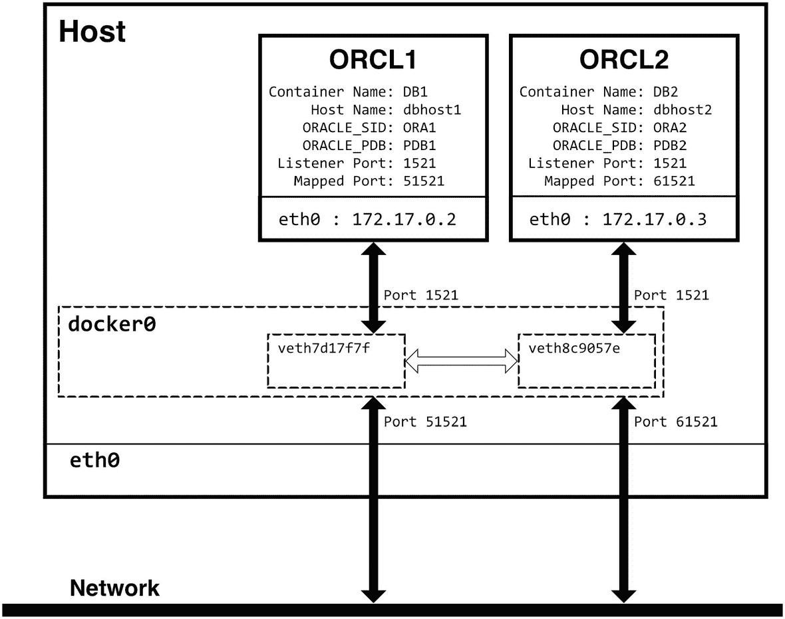

一幅展示通过默认 docker 桥接进行主机-网络通信的示意图。主机容器 O R C L 1 和 2 与 docker 桥接通信，而后者又与主机网络通信。

图 9-3
默认桥接网络上两个容器 ORCL1 和 ORCL2 的接口和端点


### 默认桥接网络的局限性

默认和用户定义的桥接网络都使用 Docker 的桥接网络驱动程序，而默认桥接网络本身就是一种桥接网络，对吗？实际上并非如此。默认桥接是 Docker 的一个**遗留特性**，缺乏用户定义桥接网络所具备的功能，通常认为不适合在生产环境中使用。为了了解它们的差异，请连接到 `ORCL1` 容器，并使用前面展示的连接字符串测试与数据库的连接。提醒一下，`dbhost1` 的连接字符串是：

```
system/oracle123@//dbhost1:1521/ORA1
system/oracle123@//dbhost1/ORA1
system/oracle123@//dbhost1:1521/PDB1
system/oracle123@//dbhost1/PDB1
```

`dbhost2` 的连接字符串是：

```
system/oracle123@//dbhost2:1521/ORA2
system/oracle123@//dbhost2/ORA2
system/oracle123@//dbhost2:1521/PDB2
system/oracle123@//dbhost2/PDB2
```

#### 本地连接正常工作

登录到 `ORCL1` 容器后，使用我们分配给容器的主机名 (`dbhost1`) 和默认监听器端口 `1521`，连接到本地数据库可按预期工作：

```
SQL> conn system/oracle123@//dbhost1:1521/ORA1
Connected.
SQL> conn system/oracle123@//dbhost1/ORA1
Connected.
SQL> conn system/oracle123@//dbhost1:1521/PDB1
Connected.
SQL> conn system/oracle123@//dbhost1/PDB1
Connected.
```

使用容器 ID 的本地连接也同样有效。到目前为止，一切正常：

```
SQL> conn system/oracle123@//3a15e84cd484:1521/ORA1
Connected.
```

然而，容器无法识别容器名称 `ORCL1`：

```
SQL> conn system/oracle123@//ORCL1:1521/ORA1
ERROR:
ORA-12154: TNS:could not resolve the connect identifier specified
```

#### 远程连接失败

然而，连接到容器 `ORCL2` 上的远程数据库，无论是使用默认端口还是映射端口，都**无法**工作：

```
SQL> conn system/oracle123@//dbhost2:1521/ORA2
ERROR:
ORA-12154: TNS:could not resolve the connect identifier specified
Warning: You are no longer connected to ORACLE.
SQL> conn system/oracle123@//dbhost2:61521/ORA2
ERROR:
ORA-12154: TNS:could not resolve the connect identifier specified
```

原因是什么？容器不知道任何名为 `dbhost2` 的主机。请记住，`ORCL1` 上的 `/etc/hosts` 文件只有本地主机 `dbhost1` 的条目。但是，如果我尝试使用容器 `ORCL2` 的 IP 地址进行连接，它成功了：

```
SQL> conn system/oracle123@//172.17.0.3:1521/ORA2
Connected.
```

为什么？默认桥接网络**缺乏 DNS 功能**。网络上的容器可以相互访问，但只能通过 IP 地址，而不能通过主机名。我们可以为每个主机在 `/etc/hosts` 中添加条目，但请记住 Docker 分配的 IP 地址在主机或 Docker 资源重启后无法保证仍然有效。而且，虽然 Docker 会更新*本地*主机的 `/etc/hosts` 条目，但它并不知晓自定义条目。

### 用户自定义桥接网络

让我们通过创建一个新网络，使用 `bridge` 驱动程序，附加两个数据库容器并测试连通性，来比较一下这种行为与用户自定义桥接网络。

#### 创建网络

使用以下命令创建一个新的、用户定义的名为 `database-bridge` 的桥接网络：

```
docker network create database-bridge --attachable --driver bridge
```

`--attachable` 标志告诉 Docker 我们希望有能力手动将容器附加到网络，而 `--driver`（或简写 `-d`）选项则指定了桥接驱动程序。创建后，使用相同的 `docker network ls` 和 `docker network inspect` 命令来获取新网络的信息，如清单 9-6 所示。新网络使用了与默认桥接相同的桥接驱动程序，Docker 分配了一个新的、唯一的 IP 地址范围 `172.18.0.0/16`。该网络目前还不支持任何容器，并且与清单 9-3 相比，没有主机绑定或桥接名称。

```
> docker network ls
NETWORK ID     NAME              DRIVER    SCOPE
0201c1b85336   bridge            bridge    local
9dfba096bf9a   database-bridge   bridge    local
8e74549be878   host              host      local
d0ce1f7bd49f   none              null      local
> docker network inspect database-bridge
[
{
"Name": "database-bridge",
"Id": "9dfba096bf9a740e...",
"Scope": "local",
"Driver": "bridge",
"IPAM": {
"Driver": "default",
"Options": {},
"Config": [
{
"Subnet": "172.18.0.0/16",
"Gateway": "172.18.0.1"
}
]
},
"Internal": false,
"Attachable": true,
"Ingress": false,
"ConfigFrom": {
"Network": ""
},
"ConfigOnly": false,
"Containers": {},
"Options": {},
"Labels": {}
}
]
清单 9-6
新创建的 `database-bridge` 网络运行在唯一的 IP 地址范围上，但缺乏默认桥接网络中存在的选项
```

在 `ip link show type bridge` 的输出中也出现了一个新的桥接：

```
> ip link show type bridge
4: docker0:  mtu 1500 qdisc noqueue state UP mode DEFAULT group default
link/ether 02:42:eb:95:f6:aa brd ff:ff:ff:ff:ff:ff
20: br-9dfba096bf9a:  mtu 1500 qdisc noqueue state UP mode DEFAULT group default
link/ether 02:42:14:53:e0:c8 brd ff:ff:ff:ff:ff:ff
```

但是，在 `/sys/class/net/br-9dfba096bf9a/brif` 中没有新网络的接口：

```
> ls /sys/class/net/br-9dfba096bf9a/brif
```


#### 连接容器

目前没有任何接口，因为还没有任何东西连接到网络。让我们来解决这个问题！使用 `docker network connect <网络名> <容器名>` 连接容器，并如清单 9-7 所示重新检查新的网络。

```bash
> docker network connect database-bridge ORCL1
> docker network connect database-bridge ORCL2
> docker network inspect database-bridge
[
{
"Name": "database-bridge",
"Id": "9dfba096bf9a740e...",
"Scope": "local",
"Driver": "bridge",
"IPAM": {
"Driver": "default",
"Options": {},
"Config": [
{
"Subnet": "172.18.0.0/16",
"Gateway": "172.18.0.1"
}
]
},
"Internal": false,
"Attachable": true,
"Ingress": false,
"ConfigFrom": {
"Network": ""
},
"ConfigOnly": false,
"Containers": {
"3a15e84cd484b98f...": {
"Name": "ORCL1",
"EndpointID": "e4cb8fea4b119625...",
"IPv4Address": "172.18.0.2/16"
},
"e050233167883499...": {
"Name": "ORCL2",
"EndpointID": "a6d9108c93c9b376...",
"IPv4Address": "172.18.0.3/16"
}
},
"Options": {},
"Labels": {}
}
]
```
清单 9-7
将容器 `ORCL1` 和 `ORCL2` 连接到新的 `database-bridge` 网络，并重新检查输出。容器已加入网络，并在 `172.18.0.0` 子网内拥有唯一的 IP 地址。

在清单 9-8 中，我们看到将容器连接到 `database-bridge` 网络更新了它们的网络配置。每个容器都在新网络上获得了一个新的 IP 地址、一个新的接口 `eth1` 以及 `/etc/hosts` 文件中相应的条目。这些新 IP 地址是`额外于`默认桥接网络上的地址的，这从 `/etc/hosts` 中独立的主机条目（每个子网一个）可以得到证明。

```bash
[oracle@dbhost1 ~]$ ifconfig
eth0: flags=4163  mtu 1500
inet 172.17.0.2  netmask 255.255.0.0  broadcast 172.17.255.255
ether 02:42:ac:11:00:02  txqueuelen 0  (Ethernet)
RX packets 135  bytes 15226 (14.8 KiB)
RX errors 0  dropped 0  overruns 0  frame 0
TX packets 104  bytes 6888 (6.7 KiB)
TX errors 0  dropped 0 overruns 0  carrier 0  collisions 0
eth1: flags=4163  mtu 1500
inet 172.18.0.2  netmask 255.255.0.0  broadcast 172.18.255.255
ether 02:42:ac:12:00:02  txqueuelen 0  (Ethernet)
RX packets 17  bytes 1462 (1.4 KiB)
RX errors 0  dropped 0  overruns 0  frame 0
TX packets 0  bytes 0 (0.0 B)
TX errors 0  dropped 0 overruns 0  carrier 0  collisions 0
[oracle@dbhost1 ~]$ cat /etc/hosts
127.0.0.1     localhost
::1     localhost ip6-localhost ip6-loopback
fe00::0     ip6-localnet
ff00::0     ip6-mcastprefix
ff02::1     ip6-allnodes
ff02::2     ip6-allrouters
172.17.0.2     dbhost1
172.18.0.2     dbhost1
```
清单 9-8
将 `ORCL1` 容器连接到网络后，在容器内部添加了一个新的网络接口，并使用新 IP 地址更新了其 `/etc/hosts` 文件。

将容器连接到 `database-bridge` 网络会在主机上创建与容器内接口对应的虚拟接口，可以通过列出 `/sys/class/net/br-9dfba096bf9a/brif` 的内容来查看：

```bash
> ls /sys/class/net/br-9dfba096bf9a/brif
veth9e1e709  vetheb94b3f
```

对这些新创建的虚拟接口运行 `ifconfig` 会产生清单 9-9 中的输出。

```bash
> ifconfig veth9e1e709
veth9e1e709: flags=4163  mtu 1500
inet6 fe80::f412:9dff:fed8:b8c2  prefixlen 64  scopeid 0x20
ether f6:12:9d:d8:b8:c2  txqueuelen 0  (Ethernet)
RX packets 0  bytes 0 (0.0 B)
RX errors 0  dropped 0  overruns 0  frame 0
TX packets 18  bytes 1532 (1.5 KB)
TX errors 0  dropped 0 overruns 0  carrier 0  collisions 0
> ifconfig vetheb94b3f
vetheb94b3f: flags=4163  mtu 1500
inet6 fe80::705e:8aff:fe63:8d14  prefixlen 64  scopeid 0x20
ether 72:5e:8a:63:8d:14  txqueuelen 0  (Ethernet)
RX packets 0  bytes 0 (0.0 B)
RX errors 0  dropped 0  overruns 0  frame 0
TX packets 13  bytes 1006 (1.0 KB)
TX errors 0  dropped 0 overruns 0  carrier 0  collisions 0
```
清单 9-9
将容器连接到新的桥接网络后，Docker 在 Docker 主机上为每个容器添加了虚拟接口。

#### DNS 情况如何？

在默认的桥接网络下，没有 DNS 服务，容器无法解析其他容器的主机名。在用户定义的桥接网络下，Docker 提供了内部 DNS 服务，如下运行 `nslookup` 所示。

```sql
[oracle@dbhost1 ~]$ nslookup dbhost1
Server:          127.0.0.11
Address:     127.0.0.11#53
Non-authoritative answer:
Name:     dbhost1
Address: 172.18.0.2
[oracle@dbhost1 ~]$ nslookup dbhost2
Server:          127.0.0.11
Address:     127.0.0.11#53
Non-authoritative answer:
Name:     dbhost2
Address:  172.18.0.3
```

`/etc/resolv.conf` 文件揭示了 Docker 提供的 DNS 服务：

```bash
[oracle@dbhost1 ~]$ cat /etc/resolv.conf
search Home
nameserver 127.0.0.11
options ndots:0
```

将此文件内容与容器仅连接到默认桥接网络时的内容进行比较。随着容器 DNS 的加入，本地和远程连接都按预期工作：

```sql
SQL> conn system/oracle123@//dbhost1:1521/ORA1
Connected.
SQL> conn system/oracle123@//dbhost1/ORA1
Connected.
SQL> select host_name from v$instance;
HOST_NAME
--------------------------------------------------------------------------------
dbhost1
SQL> conn system/oracle123@//dbhost2:1521/ORA2
Connected.
SQL> conn system/oracle123@//dbhost2/ORA2
Connected.
SQL> select host_name from v$instance;
HOST_NAME
--------------------------------------------------------------------------------
dbhost2
```

请记住，默认的桥接网络只识别在容器创建时使用 `--hostname` 选项分配的主机名，而不识别容器名称。在用户定义的桥接网络下，DNS 也认可容器名称：

```sql
SQL> conn system/oracle123@//ORCL1:1521/ORA1
Connected.
SQL> conn system/oracle123@//ORCL2:1521/ORA2
Connected.
```

最后，我可以在运行在不同容器上的数据库之间创建数据库链接：

```sql
SQL> create database link DB2 connect to system identified by oracle123 using 'dbhost2:1521/ORA2';
Database link created.
SQL> select host_name from v$instance;
HOST_NAME
--------------------------------------------------------------------------------
dbhost1
SQL> select host_name from v$instance@DB2;
HOST_NAME
--------------------------------------------------------------------------------
dbhost2
```

用户定义的桥接网络满足了本章开头设定的目标：

*   **将客户端连接到本地数据库：** 来自本地客户端的连接按预期工作，并能识别所有类型的主机名：自定义主机名、容器名称和容器 ID。
*   **将客户端连接到远程主机上的数据库：** 容器上的客户端可以通过传统的侦听器端口，按主机名访问远程数据库。
*   **在两个数据库之间创建数据库链接：** 该网络支持在独立容器上的数据库之间创建数据库链接。
*   **支持服务、复制和高可用性：** 桥接网络上的容器可以通过任何端口相互访问。

### 主机连接

想象一下，如果我们必须记住并输入我们访问的每个网站的 IP 地址和端口号，浏览网页将会有多么不同！幸运的是，DNS 在后台将人类可读的域名解析为 IP 地址，而浏览器默认连接到端口 80，除非另有指定。在本章开头，我们力求为数据库连接复制这种体验，无论是从容器到容器，还是从主机到容器。

在用户定义的桥接网络下，容器之间的连接达到了这个目标，并按预期工作，使用默认端口和标准连接语法。遗憾的是，无论是默认还是用户定义的桥接网络，从主机到容器的连接都无法以这种方式工作。


#### 端口映射的问题

图 9-4 展示了部分原因。默认的桥接网络是虚拟的，由 Docker 定义，并将容器环境与主机隔离。在容器启动时定义的端口映射会穿过主机与容器之间这道类似防火墙的屏障。然而，与常规防火墙不同，这里没有机会添加或更改端口映射。更重要的是，暴露映射端口的接口是 Docker 主机——而不是容器或容器网络。

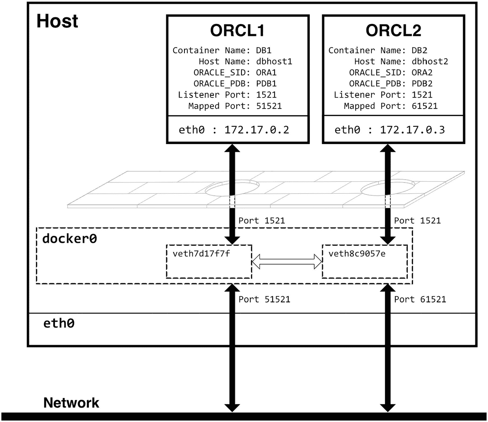

*图 9-4：默认桥接网络中的端口映射示意图。主机容器通过一个桥接网络与网络通信，同时存在像屏障一样的端口映射。*

Docker 的默认桥接网络管理来自容器的流量，将其映射到主机的端口。Docker 只允许使用容器创建时映射的端口来建立主机与容器之间的连接。

从主机连接到容器 ORCL1 中的数据库的字符串更改为以下内容：

```
system/oracle123@//lab1:51521/ORA1
system/oracle123@//localhost:51521/ORA1
system/oracle123@//lab1:51521/PDB1
system/oracle123@//localhost:51521/PDB1
```

我们还需要更新容器 ORCL2 中运行的数据库的连接字符串：

```
system/oracle123@//lab1:61521/ORA2
system/oracle123@//localhost:61521/ORA2
system/oracle123@//lab1:61521/PDB2
system/oracle123@//localhost:61521/PDB2
```

端口映射是一个手动过程，扩展性差，且与自动化集成不佳。我必须查找和分配开放端口，即使让 Docker 为我做这件事，我也必须识别分配给每个容器的端口。在端口映射下构建网络配置也不直观。连接字符串使用 `localhost` 或 Docker 主机的主机名以及一个非默认端口，而不是有意义的主机名。识别数据库连接不遵循标准模式。

为了实现本章开头设定的从主机客户端连接到容器的目标，我们需要两个额外的能力：动态添加端口的灵活性，以及主机上将容器名称映射到 DNS 的组件。

#### 主机上的容器 DNS 解析

幸运的是，有多种方法可以将 Linux 容器名称映射到 DNS。我个人最喜欢的是一个简单的基于 Docker 的工具，名为 `docker-hoster` ([`github.com/dvddarias/docker-hoster`](https://github.com/dvddarias/docker-hoster))。它作为一个容器运行，并侦听 Docker 守护进程上的事件。当容器被添加、移除、停止或启动时，它会捕获相关的网络信息并更新 Docker 主机上的 `/etc/hosts` 文件。我在我的实验室环境中使用默认推荐的设置来运行 `docker-hoster`：

```
docker run -d \
-v /var/run/docker.sock:/tmp/docker.sock \
-v /etc/hosts:/tmp/hosts \
dvdarias/docker-hoster
```

启动 `docker-hoster` 后，更新后的 hosts 文件包含了在我的系统上运行的容器的条目：

```
> cat /etc/hosts
127.0.0.1 localhost
127.0.1.1 lab01
#-----------Docker-Hoster-Domains----------
172.18.0.3    dbhost2   ORCL2   e05023316788
172.17.0.3    ORCL2   dbhost2
172.18.0.2    3a15e84cd484   ORCL1   dbhost1
172.17.0.2    ORCL1   dbhost1
172.17.0.4    docker-hoster   0d6f558aa6c0
#-----Do-not-add-hosts-after-this-line-----
```

通过这些条目出现在我的 Docker 主机的 `/etc/hosts` 文件中，我可以使用像 SQLcl（可从 Oracle 免费获取，网址为 [www.oracle.com/database/sqldeveloper/technologies/sqlcl/download](https://www.oracle.com/database/sqldeveloper/technologies/sqlcl/download/)）这样的数据库客户端从主机访问容器数据库：

```
> sql system/oracle123@ORCL1:1521/ORA1
SQLcl: Release 22.2 Production on Mon Jul 18 14:32:40 2022
Copyright (c) 1982, 2022, Oracle.  All rights reserved.
Last Successful login time: Mon Jul 18 2022 14:32:41 +00:00
Connected to:
Oracle Database 19c Enterprise Edition Release 19.0.0.0.0 - Production
Version 19.3.0.0.0
SQL> select host_name from v$instance;
HOST_NAME
____________
dbhost1
SQL> conn system/oracle123@//dbhost2:1521/ORA2
Connected.
SQL> select host_name from v$instance;
HOST_NAME
____________
dbhost2
```

*容器现在看起来就像是网络上的“真实”数据库服务器！*

#### 你不需要端口映射

在前面的例子中可能没有立即显现出来的是，数据库是通过默认的监听端口 `1521` 访问的。这些端口没有被映射。主机将容器识别为分配给桥接网络的虚拟接口上的端点，并将其视为通过一系列端口进行通信的“普通”主机。同样的技术在默认桥接网络上也有效，这通过使用容器 IP 地址（请记住，默认桥接网络使用 `172.17.0.0/16` 地址范围）得到证明：

```
SQL> conn system/oracle123@//172.17.0.2:1521/ORA1
Connected.
SQL> conn system/oracle123@//172.17.0.3:1521/ORA2
Connected.
```

只要存在一个将容器名称解析到主机的机制，就*不需要*映射端口。容器仍然可以通过映射到 Docker 主机默认桥接网络上的端口来访问：

```
SQL> conn system/oracle123@//lab1:51521/ORA1
Connected.
SQL> conn system/oracle123@//lab1:61521/ORA2
Connected.
```

然而，通过端口映射可见的*唯一*服务是容器创建时指定的那些。并且将端口映射到主机偏离了我们建立的标准——即在环境中任何地方都能使用一个适用于每个数据库的连接字符串。

你已经了解了如何创建具有内置 DNS 服务的自定义桥接网络，以及如何添加在主机上工作的 DNS 注册。有了这些连接到用户定义桥接网络的容器，就没有理由让它们继续连接到默认桥接网络上了！


### 从默认桥接网络断开

将容器从默认桥接网络中分离是一个简单的命令：`docker network disconnect <网络名称> <容器名称>`。断开容器（包括 `docker-hoster`）的连接会顺利完成，无需多余操作：

```
> docker network disconnect bridge ORCL1
> docker network disconnect bridge ORCL2
> docker network disconnect bridge docker-hoster
```

命令执行完成后，清单 9-10 中的桥接网络配置显示没有已连接的容器。

```
> docker network inspect bridge
[
{
"Name": "bridge",
"Id": "0201c1b85336336a...",
"Scope": "local",
"Driver": "bridge",
"IPAM": {
"Driver": "default",
"Options": null,
"Config": [
{
"Subnet": "172.17.0.0/16",
"Gateway": "172.17.0.1"
}
]
},
"Internal": false,
"Attachable": false,
"Ingress": false,
"ConfigFrom": {
"Network": ""
},
"ConfigOnly": false,
"Containers": {},
"Options": {
"com.docker.network.bridge.default_bridge": "true",
"com.docker.network.bridge.enable_icc": "true",
"com.docker.network.bridge.enable_ip_masquerade": "true",
"com.docker.network.bridge.host_binding_ipv4": "0.0.0.0",
"com.docker.network.bridge.name": "docker0",
"com.docker.network.driver.mtu": "1500"
},
"Labels": {}
}
]
```
清单 9-10：断开容器连接后默认桥接网络的配置详情（精简版）。请将其与清单 9-3 中的原始输出进行比较。

检查 `/sys/class/net/docker0/brif` 下的虚拟接口可确认它们已被移除：

```
> ls /sys/class/net/docker0/brif
```

在 `ifconfig` 的输出中，该适配器仍然存在，因为这是一个默认网络，所有新创建的容器都会被分配至此。而在容器内部，原来的 `eth0` 接口已经消失，与 172.17.0.0/16 网段关联的 `/etc/hosts` 条目也已不复存在：

```
[oracle@dbhost1 ~]$ ifconfig
eth1: flags=4163  mtu 1500
inet 172.18.0.2  netmask 255.255.0.0  broadcast 172.18.255.255
ether 02:42:ac:12:00:02  txqueuelen 0  (Ethernet)
RX packets 298  bytes 57915 (56.5 KiB)
RX errors 0  dropped 0  overruns 0  frame 0
TX packets 221  bytes 55308 (54.0 KiB)
TX errors 0  dropped 0 overruns 0  carrier 0  collisions 0
[oracle@dbhost1 ~]$ cat /etc/hosts
127.0.0.1     localhost
::1     localhost ip6-localhost ip6-loopback
fe00::0     ip6-localnet
ff00::0     ip6-mcastprefix
ff02::1     ip6-allnodes
ff02::2     ip6-allrouters
172.18.0.2     dbhost1
```

每当网络拓扑发生变化时，Docker 都会自动处理这些更新。

随着用户定义的桥接网络就位，并且容器已从默认桥接网络断开，图 9-5 展示了新的网络拓扑，其中桥接网络上的虚拟接口跨越了主机-容器界面。

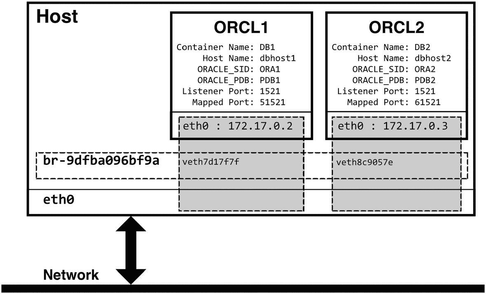

图 9-5：主机网络通信中用户定义桥接网络的示意图。主机容器通过用户定义的桥接网络与主机网络进行虚拟通信。

用户定义的桥接网络提供了一个更自然、集成的容器网络环境，不受端口映射的限制。

### 在容器创建时分配网络

希望用户定义桥接网络的好处已经很清楚了，但连接和断开容器有点费力。`docker run` 命令包含一个在创建容器时分配网络的选项，让我们可以跳过从默认网络“拔插”的额外工作。

`--network` 或 `--net` 选项将容器附加到一个或多个现有网络。`--network-alias` 标志分配一个网络别名，该别名可由 Docker 的 DNS 服务识别，提供了另一种在网络上识别容器的方法。清单 9-11 展示了先前命令的更新版本，用于创建两个数据库容器，添加网络分配和别名，并移除端口映射。

```
> docker run -d --name ORCL1 \
>        --hostname dbhost1 \
>        -e ORACLE_SID=ORA1 \
>        -e ORACLE_PDB=PDB1 \
>        -v /oradata/ORCL1:/opt/oracle/oradata \
>        --network database-bridge \
>        --network-alias db-alias1 \
>        oracle/database:19.3.0-ee
d6e027dee0a65bc4dfccd7eb43bb6143e2a54803d3b6a699bb26dc645cc814e5
> docker run -d --name ORCL2 \
>        --hostname dbhost2 \
>        -e ORACLE_SID=ORA2 \
>        -e ORACLE_PDB=PDB2 \
>        -v /oradata/ORCL2:/opt/oracle/oradata \
>        --network database-bridge \
>        --network-alias db-alias2 \
>        oracle/database:19.3.0-ee
c3c1168cdb986f0a284a46eda67c41c1d4d7bfc3c8112db1920dd8be85b99889
```
清单 9-11：两个数据库容器更新后的 docker run 命令。容器被分配到之前创建的 `database-bridge` 网络，赋予了网络别名，并且不再向主机映射端口。

在容器内部，网络识别以下所有网络身份：

*   容器名称：`ORCL1`、`ORCL2`
*   它们分配的主机名：`dbhost1`、`dbhost2`
*   网络别名：`db-alias1`、`db-alias2`
*   容器 ID 和 IP 地址

借助 `docker-hoster` 容器（或类似配置）将容器名称转换为主机条目，相同的名称从 Docker 主机上也同样有效！

### 总结

前面的几页深入探讨了 Linux 容器环境中网络这个有时不那么愉快、可能有些吓人但又必不可少的主题！Docker 中的网络通过隔离容器，使其彼此、与主机以及更广阔的网络环境隔离开来，发挥着至关重要的作用。无需成为专家，但扎实的容器网络基础对于在 Docker 环境中工作的 Oracle 数据库管理员来说是一项宝贵的技能。

第 8 章讨论了通过端口映射实现连接。在本章中，我们更深入地探讨了端口映射的一些局限性，并介绍了容器网络作为替代方案。对于较小的、本地化的实现，端口映射是一个合理的解决方案，但容器网络是更好、更具可扩展性的替代方案，尤其是在处理多个数据库容器时。

我们讨论了不同网络类型之间的差异，回顾了报告和管理网络对象的命令，然后深入研究了桥接网络的细节。接着，我们介绍了桥接网络与虚拟设备之间的关系，以及它们如何支持跨接口的连接。我们审视了默认桥接网络与用户定义桥接网络之间的区别——包括 Docker 默认桥接网络固有的限制。最后，我们讨论了容器网络中的 DNS 以及将 DNS 扩展到主机的解决方案。

你现在对容器及其功能有了扎实的理解和认识。在过去的几章中，你学习了如何管理存储和网络——这可以说是运行数据库最关键的考虑因素。下一章将结合本书前半部分的概念，形成一个命令参考，将经验和建议融合成可操作的步骤，助你开始并构建在 Docker 上使用 Oracle 的旅程！

脚注 1   2   3   4


## 10. 容器创建快速参考

本书第一部分涵盖了在 Linux 容器中运行 Oracle 数据库的基本要素，并强调了 `docker run` 命令的重要性。预先考虑容器将如何创建数据库、存储数据以及通过网络进行交互，可以避免后续的挫折感，并节省修改或重建容器的时间。前面的章节分别阐述了这些概念，解释了每项建议背后的原因。

在学习新技术时，我喜欢一份涵盖如何操作事物的总结。第一部分的最后一章正是如此——一份快速参考，将迄今为止涵盖的所有内容提炼成一套方法和模式，供您在容器之旅中应用。

本章包含四个部分：创建存储和网络、运行容器，以及与容器交互的各种杂项命令。虽然不是必需的，但如果您打算将数据持久化到容器主机，并利用第 9 章中描述的用户定义网络，那么存储和网络是先决条件。创建后，在容器创建时引用这些资源。

### 约定

为清晰起见，较长的命令使用 Linux 续行符（反斜杠 `\`）拆分到多行。各个选项也分别显示在单独的行上，以突出每个选项：

```
docker run --name  \
-e ORACLE_SID= \
...
```

示例中，当有多个可用选项时，使用较短的标志，例如，使用 `-e` 设置环境变量，而不是 `--env`。尖括号 `<` 和 `>` 之间的文本表示需要根据您的要求替换的信息。

### 存储

#### 创建卷

有两种方法可以将数据持久化到容器主机：

*   将主机上的目录映射到容器中的路径。
*   创建一个称为 Docker 卷的专用对象。

前者不需要任何特殊设置，但挂载 Docker 卷需要预先创建该卷。绑定挂载卷所使用的目录在分配给容器之前必须存在。

要创建一个默认卷（数据将存储在 Docker 的虚拟机中，路径为 `/var/lib/docker`）：

```
docker volume create 
```

要在本地文件系统上创建具有用户定义位置的绑定挂载卷：

```
docker volume create --opt type=none --opt o=bind \
--opt device= \
```

#### Oracle 数据库容器中的预定义卷

ORADATA 卷在 Oracle 容器镜像的 `/opt/oracle/oradata` 目录下保存数据库配置和数据文件。其高级目录结构如下：

```
.
├── dbconfig
│   └── 
├── fast_recovery_area
│   └── 
│       └── archivelog
└── 
├── controlfile
├── datafile
└── onlinelog
```

特殊的 `dbconfig` 子目录存放数据库和网络的配置文件，在这里您可以找到数据库的 `init.ora` 和 `spfile`、密码文件和 `oratab` 文件，以及网络配置，包括 `tnsnames.ora` 和 `listener.ora`：

```
$ ls -l $ORACLE_BASE/oradata/dbconfig/$ORACLE_SID
total 24
-rw-r--r-- 1 oracle oinstall  234 Mar  6 22:04 listener.ora
-rw-r----- 1 oracle oinstall 2048 Mar  6 22:15 orapwORCLCDB
-rw-r--r-- 1 oracle oinstall  784 Mar  6 23:33 oratab
-rw-r----- 1 oracle oinstall 3584 Mar  6 23:33 spfileORCLCDB.ora
-rw-r--r-- 1 oracle oinstall   53 Mar  6 22:04 sqlnet.ora
-rw-r----- 1 oracle oinstall  211 Mar  6 23:33 tnsnames.ora
```

这些文件从其典型位置软链接而来，这意味着 ORADATA 卷是一个自包含的目录，包含了数据库所需的一切。

#### 为 Oracle 数据库准备卷

卷将数据写入 Docker 环境之外，并满足两个非常相似但不同的目的：

*   将数据保存到本地或附加存储
*   将数据从容器文件系统中移除

第一个示例涉及保护和持久化数据及配置。在生产环境中，这扩展到选择快速、持久的存储，以满足组织对性能和可用性的目标。

第二种情况，乍一看可能相同——将文件放在容器之外的某个地方——但有细微差别。这里，重要性在于管理容器外部的易变目录。在 Oracle 数据库中，这些是日志和审计目录。将它们留在容器的文件系统中，如果需要重新创建容器，它们将面临风险，同时也会导致容器层的增长。

### 网络

#### 创建用户定义的桥接网络

某些功能，包括 DNS，在 Docker 安装时创建的默认桥接网络中是缺失的。用户定义的桥接网络提供了更强大的功能集。要创建桥接网络：

```
docker network create  --attachable --driver bridge
```

#### 将容器连接到网络/从网络断开连接

容器在其生命周期中的任何时候都可以连接到网络。将没有端口映射的容器添加到网络中，允许主机使用原生端口进行连接。要将容器添加到网络：

```
docker network connect  
```

要从网络断开连接：

```
docker network disconnect  
```

#### 专用 DNS

有多种解决方案可以为容器主机添加 DNS 解析，允许主机上的客户端通过容器 ID、容器名称、分配的主机名或网络别名来引用容器。`dvdarias/docker-hoster` 就是其中一个选项。它读取 Docker 的事件服务，并在容器启动或停止时向主机的 `/etc/hosts` 文件中添加或移除容器条目。使用推荐的默认值运行它：

```
docker run -d \
-v /var/run/docker.sock:/tmp/docker.sock \
-v /etc/hosts:/tmp/hosts \
dvdarias/docker-hoster
```

### 容器

#### 基本容器创建

创建数据库容器的最简命令：

```
docker run -d 
```

`-d` 标志将容器作为后台进程运行。

以下命令片段说明了 `docker run` 命令选项的用法。

#### 命名

必须在创建时为容器分配名称、主机名和网络别名。如果未指定名称，Docker 会在创建时生成一个随机的容器名称。

##### 分配容器名称

容器名称是一个便于人类识别的名称，在 `docker start`、`docker logs` 或 `docker exec` 等容器命令中被引用。使用 `--name` 标志设置容器名称：

```
docker run -d \
--name  \
...
```

##### 分配主机名

主机名是一个可选的、与容器名称分开的标识。如果未设置，主机名默认为容器名称：

```
docker run -d \
--hostname  \
...
```


#### 定义环境变量

数据库创建和管理脚本从容器环境中读取变量，并利用它们来构建和启动数据库。若未手动设置，容器将依赖其默认设置。最常用的变量（方括号内为默认值）如下：

*   `ORACLE_SID`：Oracle 数据库的 SID [ORCLCDB]
*   `ORACLE_PDB`：Oracle 数据库的 PDB 名称 [ORCLPDB1]
*   `ORACLE_PWD`：Oracle 数据库 SYS、SYSTEM 和 PDB_ADMIN 的密码 [数据库创建时随机生成]
*   `ENABLE_ARCHIVELOG`：启用归档日志 [False]

要显示镜像中所有可用的环境变量：
```bash
docker image inspect \
--format '{{range .Config.Env}}{{printf "%s\n" .}}{{end}}' \
 | sort
```

要在命令行设置单个变量（此示例中为 `ORACLE_SID`），请使用 `-e` 选项：
```bash
docker run -d \
-e ORACLE_SID=ORCLDB \
...
```

使用单独的 `-e` 标志为每个变量设置多个值。此处，`ORACLE_SID` 和 `ORACLE_PDB` 在容器中设置：
```bash
docker run -d \
-e ORACLE_SID=ORCLDB \
-e ORACLE_PDB=PDB1 \
...
```

`docker run` 命令可以从主机环境读取值。此处，`ORACLE_SID` 使用本地主机环境中定义的 `$dbname` 变量值来设置：
```bash
docker run -d \
-e ORACLE_SID=$dbname \
...
```

Docker 可以从文件中读取值，每个 `VARIABLE=VALUE` 对占一行。名为 `db.env` 的环境文件内容示例如下：
```
> cat db.env
ORACLE_SID=TEST
ORACLE_PDB=TESTPDB1
ORACLE_EDITION=EE
ENABLE_ARCHIVELOG=true
```

在 `docker run` 命令中使用 `--env-file` 选项引用该文件：
```bash
docker run -d \
--env-file db.env \
...
```

#### 分配存储

通过映射或挂载存储来持久化来自容器数据库的数据。

##### 使用 `-v` 绑定挂载目录

绑定挂载将主机上的一个目录映射到容器内的一个路径。容器中的文件被写入（并保存）到容器主机的文件系统，并在本地持久化，即使容器被删除。

Oracle 数据库镜像中的 `/opt/oracle/oradata` 目录包含所有数据库配置和数据文件。要将其映射到主机上的一个目录：
```bash
docker run -d \
-v :/opt/oracle/oradata
...
```

##### 使用 `--mount` 绑定挂载目录

`--mount` 的语法更详细且具体，Docker 推荐使用它而非 `-v` 选项。`--mount` 中元素的顺序不重要。要使用 `--mount` 绑定挂载目录，请使用 `type=bind` 选项：
```bash
docker run -d \
--mount type=bind,source=,target=/opt/oracle/oradata
...
```

请记住为每个容器使用唯一的目录，以避免多个数据库写入相同的路径和文件！

##### 使用 `-v` 附加预定义卷

Docker 卷是由 Docker 管理的命名对象。它们必须在通过 `docker run` 引用之前预先创建。要将容器中的 `/opt/oracle/oradata` 目录映射到现有卷：
```bash
docker run -d \
-v :/opt/oracle/oradata
...
```

##### 使用 `--mount` 附加预定义卷

与使用 `--mount` 绑定目录的示例类似，元素的顺序不重要。要使用 `--mount` 将预定义卷映射到 `/opt/oracle/oradata` 目录，请使用 `type=volume` 选项：
```bash
docker run -d \
--mount type=volume,source=,target=/opt/oracle/oradata
...
```

#### 入口点

入口点是容器中的特殊目录，脚本会在创建和启动期间搜索并执行这些目录中的脚本。在 Oracle 容器镜像中，入口点是：

*   `入口点根目录：` `/docker-entrypoint-initdb.d` 或 `/opt/oracle/scripts`
*   `启动脚本：` `/opt/oracle/scripts/startup`
*   `设置脚本：` `/opt/oracle/scripts/setup`

将目录映射到入口点根路径时，本地映射的目录中必须存在 `startup` 和 `setup` 目录。否则，管理脚本将找不到任何可运行的内容。要将单个目录挂载到根入口点：
```bash
docker run -d \
--mount type=bind,source=,target=/docker-entrypoint-initdb.d \
...
```

要将目录挂载到启动和设置入口点：
```bash
docker run -d \
--mount type=bind,source=,target=/opt/oracle/scripts/startup \
--mount type=bind,source=,target=/opt/oracle/scripts/setup \
...
```

##### 网络配置

##### 映射端口到主机

端口映射将网络流量从容器上的原生端口路由到主机上的一个端口。它允许主机（或主机网络）上的客户端访问容器资源。要将容器上运行的 Oracle 监听器映射到端口 1521：
```bash
docker run -d \
-p :1521 \
...
```

使用单独的声明映射多个端口：
```bash
docker run -d \
-p :1521 \
-p :5500 \
...
```

##### 加入网络

要在启动时将容器附加到特定网络：
```bash
docker run -d \
--network  \
...
```

容器可以随意添加到网络（或从网络移除），甚至可以属于多个网络。

#### 完整容器示例

代码清单 10-1 中的命令为 Oracle 数据库创建了一个简单的容器，它：

*   定义了自定义容器名称
*   为数据库 CDB 和 PDB 名称定义了用户自定义的值
*   将数据库监听器映射到容器主机上的一个端口
*   将数据库的数据目录绑定挂载到本地存储以实现持久化

由此产生的容器提供了在本地环境（如笔记本电脑或小型实验室）中运行数据库所需的所有功能，而无需创建卷或网络对象。

```bash
docker run -d \
--name  \
-e ORACLE_SID= \
-e ORACLE_PDB= \
-p :1521 \
--mount type=bind,source=,target=/opt/oracle/oradata \

```
**代码清单 10-1**  
创建一个命名容器的示例，包含自定义容器名称、用户定义的 CDB 和 PDB 名称、到主机的端口映射，以及持久化到主机目录的数据库文件和配置

代码清单 10-2 中的示例在先前命令的基础上进行了增强，提供了更多功能，包括一个绑定挂载到主机本地目录的 Docker 管理卷，以及一个包含 DNS 功能的用户自定义桥接网络。在创建了先决对象后，`docker run` 命令：

*   为容器命名
*   分配自定义主机名
*   定义在容器中创建的 CDB 和 PDB 数据库
*   挂载预定义的卷
*   附加到自定义网络

此配置非常适用于数据库需要与其他容器服务（包括其他数据库）交互的中等和高级部署场景。

```bash
docker volume create --opt type=none --opt o=bind \
--opt device= \

docker network create  --attachable --driver bridge
docker run -d \
--name  \
--hostname  \
-e ORACLE_SID= \
-e ORACLE_PDB= \
--mount type=volume,source=,target=/opt/oracle/oradata \
--network  \

```
**代码清单 10-2**  
一个利用 Docker 的网络和卷管理功能来构建更健壮容器环境的示例

最后，代码清单 10-3 的示例在先前的 `docker run` 命令基础上增加了容器入口点的映射。每当容器启动时，Docker 将运行它在 `startup` 子目录下发现的任何脚本。`setup` 子目录中的脚本会在容器中数据库创建后立即运行。

```bash
docker run -d \
--name  \
--hostname  \
-e ORACLE_SID= \
-e ORACLE_PDB= \
--mount type=volume,source=,target=/opt/oracle/oradata \
--mount type=bind,source=,target=/docker-entrypoint-initdb.d \
--network  \

```
**代码清单 10-3**  
来自代码清单 10-2 的 docker run 命令，附加了入口点定义

### 与容器交互


### 在 Docker 中运行 Oracle 数据库的指南

#### 打开 Shell

要访问容器内的命令行，类似于通过 SSH 连接到远程主机：

```
docker exec -it <container_name> bash
```

`-it` 标志指示 Docker 打开一个交互式会话。您可以通过将 `bash` 替换为其他 shell 或命令名称来指定不同的 shell 或命令。请记住，不属于容器 `PATH` 变量一部分的命令需要提供完整路径。

#### 运行 SQL*Plus

要在容器中直接运行 SQL*Plus：

```
docker exec -it <container_name> sqlplus / as sysdba
```

#### 运行脚本

要在容器后台远程运行脚本，请省略 `-it` 标志并传递*容器中存在的*路径和脚本名称：

```
docker exec <container_name> /path/to/script.sh
```

脚本必须能被容器的默认用户（对于我们处理的容器是 `oracle` 用户）执行。

#### 以 Root 用户连接

要以默认用户以外的其他用户（包括 `root` 用户）连接到容器，请通过 `-u` 标志传递用户名：

```
docker exec -it -u <username> <container_name> bash
```

#### 管理密码

要设置（或重置）容器数据库的特权数据库密码，请使用 `docker exec` 运行容器中的 `/opt/oracle/setPassword.sh` 脚本，并将新密码作为参数提供：

```
docker exec <container_name> /opt/oracle/setPassword.sh <new_password>
```

这里，我将容器 `ORCL1` 的密码更改为 `oracle123`：

```
> docker exec ORCL1 /opt/oracle/setPassword.sh oracle123
The Oracle base remains unchanged with value /opt/oracle
SQL*Plus: Release 19.0.0.0.0 - Production on Tue Mar 29 00:44:36 2022
Version 19.3.0.0.0
Copyright (c) 1982, 2019, Oracle.  All rights reserved.
Connected to:
Oracle Database 19c Enterprise Edition Release 19.0.0.0.0 - Production
Version 19.3.0.0.0
SQL>
User altered.
SQL>
User altered.
SQL>
Session altered.
SQL>
User altered.
SQL> Disconnected from Oracle Database 19c Enterprise Edition Release 19.0.0.0.0 - Production
Version 19.3.0.0.0
```

#### Docker 部署示例

在过去的几页中，我提供了一些代码片段，但我想通过从 Linux 或 WSL 命令行运行的实际示例来展示我典型的 Docker 工作流程。

##### 新环境设置

如果我在一个新的容器环境中工作，我的第一步是添加运行 Oracle in Docker 所需的目录和用户。在 Linux 系统上，我将存储分成两个分区，一个用于数据库，另一个用于 Docker 相关文件：

```
sudo mkdir /oradata /docker
sudo chown $(id -un):$(id -gn) /docker
```

第二个命令将 `/docker` 目录的所有者和组更改为我的本地用户，以便稍后无需调用 `sudo` 即可添加文件。

`/oradata` 挂载点用作数据库卷和挂载的根目录。为了避免 Linux 上的绑定挂载问题，我创建一个 `oracle` 用户和 `oinstall` 组，其 ID 值与 Oracle 预安装 RPM 中的值匹配，然后设置 `/oradata` 目录的所有权：

```
sudo groupadd -g 54321 oinstall
sudo useradd -u 54321 -g oinstall
sudo chown oracle:oinstall /oradata
```

默认情况下，Docker 将其数据保存在 `/var/lib/docker` 目录中。Linux 系统，尤其是在云服务中运行的系统，通常具有与启动卷分离的块存储，可为容器操作提供更快或更大的分区。如果是这样，我将 `/var/lib/docker` 重新定位到一个新分区。在这里，我将其移动到 `/docker` 分区下：

```
systemctl stop docker.service
systemctl stop docker.socket
sed -i 's|ExecStart=/usr/bin/dockerd|ExecStart=/usr/bin/dockerd -g /docker|g' /lib/systemd/system/docker.service
rsync -aqxP /var/lib/docker/ /docker/.docker 2>/dev/null
systemctl daemon-reload
systemctl start --no-block docker.service
```

##### 添加 Oracle 仓库

新系统需要 Oracle 的 Docker 仓库副本。假设已安装 `git`，我可以将仓库克隆到 `/docker` 路径下：

```
git clone https://github.com/oracle/docker-images /docker
```

将相应的安装介质复制到 `/docker/OracleDatabase/SingleInstance/dockerfiles/` 下的版本目录后，我就可以开始构建镜像：

```
cd /docker/OracleDatabase/SingleInstance/dockerfiles/
./buildContainerImage.sh -v 19.3.0 -e
./buildContainerImage.sh -v 21.3.0 -e
```

##### 网络配置

接下来，我将注意力转向网络，添加一个新的桥接网络，我通常将其命名为 `oracle-db`：

```
docker network create oracle-db --attachable --driver bridge
```

更正式的环境可能需要多个网络以实现更好的隔离。如果是这样，我将重新进行此步骤。

如果我预计需要 DNS，我还会启动一个 `docker-hoster` 容器：

```
docker run -d \
--name oracle-db-dns \
-v /var/run/docker.sock:/tmp/docker.sock \
-v /etc/hosts:/tmp/hosts \
dvdarias/docker-hoster
```

##### 运行容器

我创建容器时遵循的步骤取决于我计划如何使用它们。通常分为两类：不打算保留很长时间的“一次性”数据库，以及生产或类似生产的数据库。

###### 一次性环境

我为*每个*数据库容器持久化 `/opt/oracle/oradata` 卷，但对于生命周期短的一次性数据库，我很少做更多。在清单 10-4 中的示例中，我设置了容器、数据库和 PDB 名称的环境变量。脚本使用这些变量，添加一个目录并将其绑定挂载到卷，然后创建一个 Oracle 19c 数据库容器。我还将本地目录 `/oradata/scripts` 挂载到容器上的一个新挂载点，称为 `/scripts`。这是一个常见的、共享的目录，包含——您猜对了——脚本、工具和实用程序，在我工作时可能需要在容器中使用。

```
CONTAINER_NAME=test
ORACLE_SID=ORCLCDB
ORACLE_PDB=ORCLPDB1
mkdir -p /oradata/${CONTAINER_NAME}
docker volume create --opt type=none --opt o=bind \
--opt device=/oradata/${CONTAINER_NAME} \
${CONTAINER_NAME}_data
docker run -d \
--name ${CONTAINER_NAME} \
-e ORACLE_SID=${ORACLE_SID} \
-e ORACLE_PDB={ORACLE_PDB} \
--volume ${CONTAINER_NAME}_data:/opt/oracle/oradata \
--volume /oradata/scripts:/scripts \
--network oracle-db \
oracle/database:19.3.0-ee
```
清单 10-4
展示创建资源和运行“一次性”Oracle 19c 数据库容器步骤的示例代码

###### 持久化环境

关键数据库需要更严格的管理和更多资源，包括用于诊断和审计目录的额外卷。清单 10-5 是一个脚本示例，用于自动化创建目录、分配卷和运行容器的步骤。

```
CONTAINER_NAME=prod
ORACLE_SID=ORCLCDB
ORACLE_PDB=ORCLPDB1
for dir in audit data diag
do mkdir -p /oradata/${CONTAINER_NAME}/${dir}
docker volume create --opt type=none --opt o=bind \
--opt device=/oradata/${CONTAINER_NAME}/${dir} \
${CONTAINER_NAME}_${dir}
done
mkdir -p /oradata/${CONTAINER_NAME}_entry/{setup,startup}
docker run -d \
--name ${CONTAINER_NAME} \
-e ORACLE_SID=${ORACLE_SID} \
-e ORACLE_PDB={ORACLE_PDB} \
--volume ${CONTAINER_NAME}_data:/opt/oracle/oradata \
--volume ${CONTAINER_NAME}_diag:/opt/oracle/diag \
--volume ${CONTAINER_NAME}_audit:/opt/oracle/admin \
--volume /oradata/${CONTAINER_NAME}_entry:/opt/oracle/scripts \
--volume /oradata/scripts:/scripts \
--network oracle-db \
oracle/database:19.3.0-ee
```
清单 10-5
用于自动化创建数据库审计、数据和诊断目录的多个目录及绑定挂载卷的脚本

请注意，我为每个容器创建了专用的入口点目录。这是我放置任何用于修改容器设置和启动操作的脚本的地方。拥有专用目录可以实现更多控制，根据需要创建到全局副本的链接或编写自定义脚本。


### 总结

本章是关于创建和运行容器时最常用命令和选项的快速参考，并结束了本书关于容器的第一部分内容。我们涵盖了容器基础，重点介绍了它们如何应用于 Oracle 数据库。现在，您应该能够自如地编写和使用`docker run`命令；停止、启动和管理容器；以及从 Docker 获取有关镜像和容器的信息。

第一部分的一个关键要点与持久化相关，这将在第 7 章中详细讨论。理解将容器中的易失性目录数据映射到本地主机存储的好处至关重要。容器使用分层（或覆盖）文件系统来提高速度和节省空间。分层文件系统在文件稳定时效率很高，但随着更改数量的增加，性能会下降。将经历大量更改的目录（特别是包含数据库文件的目录）映射到容器外的存储，可以提高性能并独立于容器的生命周期持久化数据。

对于 Oracle 数据库，克隆或重新创建数据库所需的一切都位于`/opt/oracle/oradata`目录下。将此目录路径保存到容器主机，让我们可以在几秒钟内克隆或重新创建数据库！

我们提到了容器的一些独特之处——比如缺少文本编辑器——并接受或绕过了它们作为其基础镜像的产物。在下一节中，我们的重点将从运行容器转向修改这些镜像，以更好地满足我们的需求。这始于对镜像构建的探索以及几个控制镜像和数据库创建的脚本。

