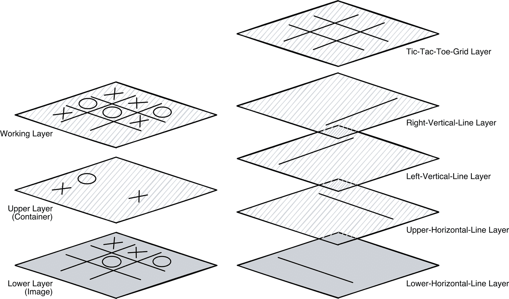
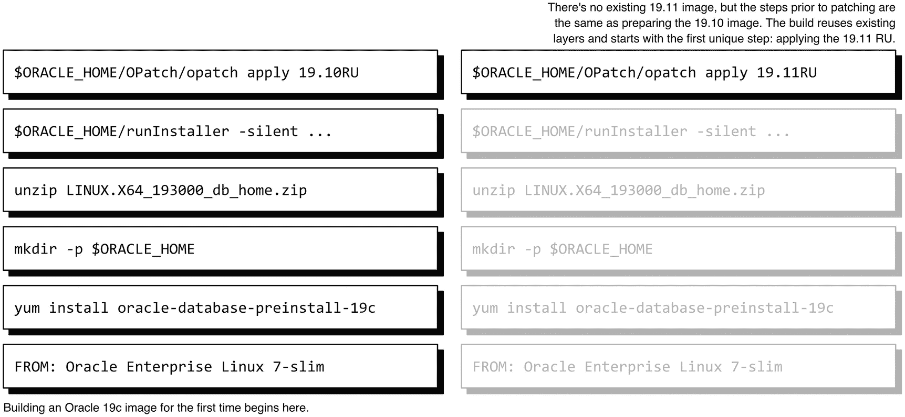

# 第二部分 构建和定制镜像

您现在已精通运行容器，在第二部分中，我们的注意力转向构建和定制镜像。我们首先演示对第 4 章介绍的现有 Oracle 容器仓库的修改，深入探讨编写和调试 Dockerfile 的艺术，最后讨论将镜像保存到仓库。

## 11. 定制镜像

我喜欢与 Oracle（以及一般的数据库）工作的一个原因是其多样性。每天都会带来新的事物，问题通常有多种解决方案。每个机构都有自己的工作方式，解决方案根据行业实践、安全性和惯例而因客户而异。

Docker（和其他自动化工具）补充并有助于强制执行这些标准。容器镜像是基础设施模板。容器镜像不是手工构建并引入人为错误的可能，而是提供了一个有保证的起点，预先配置以满足特定要求。

但模板很少是一刀切的，容器镜像也是如此。在我们使用过的镜像中，Oracle 决定了如何配置环境以及包含什么内容。第 3 章提出了这个问题，当时我们发现默认的 Ubuntu 镜像缺少 vi 编辑器。在大规模运行时，容器不需要编辑器，但在测试或实验室系统中，它们可能是一个要求，而满足这一需求需要不同的模板。我们可以手动添加编辑器，但这违背了自动化以及容器的整体理念：拥有一个包含我们所需一切的、随时可运行的镜像。

当涉及到构建满足特定需求的 Oracle 数据库镜像时，有两种选择。第一种是编写*Dockerfiles*，即 Docker 用于构建镜像的配方，如第 12 和 13 章所述。本章涵盖的第二种技术是扩展现有脚本以定制生成的模板。

请记住，我们使用的容器运行的是 Oracle Enterprise Linux。容器环境中的所有命令，无论是运行容器还是构建镜像，都必须适合容器的操作系统。对于运行不同发行版版本的 Linux 用户，请记住主机上使用的命令可能与容器中所需的命令不同。例如，Ubuntu 用户使用`apt-get`更新其系统上的软件包，但在 Oracle 数据库容器中使用`yum`。

### 脚本修改

除了 Dockerfile 和两个响应文件外，本章回顾的文件都是`bash` shell 脚本。此处的目的不是深入探讨脚本本身，而是指出如何以及在哪里更新它们以实现对最终镜像的各种修改。好消息是，您不需要成为脚本专家就能理解这些更改！

我们将在本章中使用的文件是 Docker 仓库的一部分，该仓库在第 4 章中介绍。回想一下，将仓库复制到您的系统后，您沿着一条（相当长的）路径导航以构建您的第一个镜像：`docker-images/OracleDatabase/SingleInstance/dockerfiles`。在该目录下有几个子目录，每个数据库版本一个：

```
drwxr-xr-x   8 seanscott  staff   256 May 27 20:51 11.2.0.2
drwxr-xr-x  18 seanscott  staff   576 May 27 20:51 12.1.0.2
drwxr-xr-x  16 seanscott  staff   512 May 27 20:51 12.2.0.1
drwxr-xr-x  16 seanscott  staff   512 May 27 20:51 18.3.0
drwxr-xr-x   8 seanscott  staff   256 May 27 20:51 18.4.0
drwxr-xr-x  19 seanscott  staff   608 May 27 21:00 19.3.0
drwxr-xr-x  21 seanscott  staff   672 May 27 21:00 21.3.0
-rwxr-xr-x   1 seanscott  staff  7091 May 27 20:51 buildContainerImage.sh
```

这些特定于版本的子目录都包含多个脚本，这些脚本执行四个类别的常规设置和配置操作：

- 操作系统安装和配置
- Oracle 数据库软件安装
- 数据库创建
- 容器启动，包括启动 Oracle 监听器和数据库

本章中的示例基于 19c 脚本，但适用于任何版本。您将导航到与您要使用的数据库版本匹配的子目录，在那里您会发现文件具有相同的名称和用途。由于这些文件在您的本地系统上，您可以使用您喜欢的文本编辑器执行更改。

在进行任何更改之前，最好为每个文件创建一个备份。但是，如果出现问题，请记住您总是可以从原始 GitHub 仓库重新下载或复制文件。

### 操作系统安装和配置

在生产环境中运行的容器被设计得尽可能精简，原因有很多，其中节省空间和安全性是首要的。用作更复杂或专业化应用程序（包括 Oracle 数据库）基线的容器镜像通常省略任何非必需的内容。添加所需内容比记住删除不需要的内容更快、更容易，也更安全。攻击者无法利用容器中不存在的程序和软件包中的软件漏洞！

一种通常从镜像中排除的功能是编辑器。所有必要的文件都已预安装在生产部署中，并且环境已预先配置。无需手动编辑任何内容，而默认的数据库镜像也反映了这种思路。

另一方面，如果您将容器用作交互式或实验性平台，拥有编辑器和用于导航环境的工具是有意义的。对于用于安全或渗透测试、评估新功能以及验证补丁或程序的容器也是如此。


### `setupLinuxEnv.sh`

在 Linux 中，软件包通过**包管理器**提供这些功能和特性。不同的 Linux "发行版" 使用不同的包管理器。Oracle Enterprise Linux 7 使用一个名为 `yum` 的包管理器，它是 *Yellowdog Updater, Modified* 的缩写。

导航到你的仓库中 `docker-images/OracleDatabase/SingleInstance/dockerfiles` 目录下你喜欢的版本子目录，你会找到一个名为 `setupLinuxEnv.sh` 的文件。在你喜欢的编辑器中打开该文件，查找以 `yum -y install` 开头的一行。在 19.3.0 版本中该行是：

```
yum -y install oracle-database-preinstall-19c openssl && \
```

对于那些不熟悉 Linux 或 `yum` 的人，这一行中各个元素的含义如下：

*   `yum`：调用 `yum`。
*   `-y`：这个标志是简短的确认，告诉 `yum` 无需用户输入即可执行任何操作。它允许脚本化或自动化的命令在没有人工交互的情况下完成。
*   `install`：`yum` 有多个可用选项，正如你可能猜测的那样，`install` 告诉包管理器要安装某些东西。
*   `oracle-database-preinstall-19c` 和 `openssl`：这些是 `yum` 将要安装的软件包。第一个是 Oracle 预安装包（本身也是一个包集合），包含了安装和运行 Oracle 数据库所需的一切。每个数据库版本都有自己的包，所以你看到的版本可能不同。`openssl` 是一个加密包。（12cR1 脚本也会安装 `tar`。）
*   `&&` 和 `\`：双和号（`&&`）是一个逻辑运算符，指示 Linux 如果当前命令成功完成，则执行后续命令。反斜杠（`\`）是一个续行符，告诉 Linux 这不是命令的结尾，要继续在下一行读取更多内容。

请注意，单个 `yum` 命令可以安装多个包，在 `install` 操作后逐一列出每个包。`yum`（以及其他包管理器）会解析给定包列表中的（大多数）依赖关系。包的顺序无关紧要。我们可以向现有的 `yum` 命令添加包——比如编辑器之类的包！

我通常安装的、能改善我在 Oracle 容器镜像中交互体验的包有：

*   `oracle-epel-release-el7`：EPEL，即 *Extra Packages for Enterprise Linux*，是一个开发包集合，提供额外的特性和功能。
*   `bash-completion`：一组用于自动补全 Linux 命令的辅助函数。
*   `git`：添加了与基于 `git` 的仓库交互所需的库。
*   `less`：一个文件查看器，类似于 `more`，用于在 Linux 系统上阅读和搜索文本文件。
*   `strace`：一个调试和诊断工具，用于检查信号和系统调用。`strace` 对于调查数据库内核中的潜在问题非常宝贵。
*   `tree`：以具有父子关系的层次化"树"结构可视化显示目录结构。
*   `vi`：我选择的编辑器！
*   `which`：一个有用的工具，用于显示用户 `PATH` 中可执行文件的位置。

要更新 `yum install` 命令以包含其他包，请将它们添加在 `install` 关键字和标记 `yum` 命令结尾的双和号 `&&` 之间的任何位置。例如，要添加 `less`、`strace`、`tree` 和 `vi`，将命令更改为：

```
yum -y install oracle-database-preinstall-19c openssl less strace tree vi && \
```

使用更新后的脚本构建新镜像后，从该新镜像运行的所有容器都将包含添加的命令。

### `Dockerfile`

有一个可能的修改可以改进或定制容器中的交互。这个修改位于默认的 `Dockerfile` 中，它创建了一个 `.bashrc` 文件。这个文件在每次交互式 `bash` 会话开始时运行，可用于设置 shell 提示符、环境变量、别名，甚至执行命令。

接下来的两章会深入讨论 Dockerfile，但并非每个人都需要从定制镜像中获得的额外控制权。这个技巧有更广泛的应用，因此我将其放在这里。

打开你仓库中的 `Dockerfile`，导航到文件末尾。在 19c 和 21c 版本中，你会找到一行：

```
# Add a bashrc file to capitalize ORACLE_SID in the environment
RUN echo 'ORACLE_SID=${ORACLE_SID:-ORCLCDB}; export ORACLE_SID=${ORACLE_SID^^}' > .bashrc
```

如果你的版本没有这一行，你可以在以 `HEALTHCHECK` 开头的那一行之前添加一个。

要理解这个命令，让我们分解它的各个部分：

*   `RUN`：`Dockerfile` 中的 `RUN` 命令告诉构建过程运行一个或多个命令。不要将其与 `docker run` 混淆！前者是镜像构建过程中的一个步骤，后者是用于创建新容器。`RUN` 后面是 Docker 用于构建镜像的命令。
*   `echo 'ORACLE_SID=` 到 `${ORACLE_SID^^}'`：这是 Docker 在镜像中运行的命令。`echo` 将输出显示到 `stdout` 或**标准输出**，通常是终端。它打印的文本是单引号（`'`）之间的所有内容。
*   `> .bashrc`：单个右尖括号（`>`）是一个**输出重定向**，它将 `echo` 语句的输出发送到一个文件。单个尖括号会覆盖文件内容；两个尖括号（`>>`）则将输出追加到文件末尾。接收结果的文件是 `.bashrc`。

我想提请注意 `echo` 命令中单引号的使用。单引号按字面意义处理其内容，不解释或替换引号字符串中的任何内容。如果字符串用双引号包围，`bash` 将使用环境中的值替换 `$ORACLE_SID`。比较使用单引号和双引号产生的不同结果：

```
echo 'ORACLE_SID=${ORACLE_SID:-ORCLCDB}; export ORACLE_SID=${ORACLE_SID^^}'
ORACLE_SID=${ORACLE_SID:-ORCLCDB}; export ORACLE_SID=${ORACLE_SID^^}
echo "ORACLE_SID=${ORACLE_SID:-ORCLCDB}; export ORACLE_SID=${ORACLE_SID^^}"
ORACLE_SID=ORCLCDB; export ORACLE_SID=
```

在第二个使用双引号的例子中，替换是空的，因为 `$ORACLE_SID` 没有设置。这个命令预期一个定义了 `$ORACLE_SID` 的环境，但它在镜像构建过程中运行，*在设置变量之前*！

这个 `RUN` 命令在 `oracle` 用户的主目录中创建一个新的 `.bashrc` 文件，并在 `oracle` 用户每次登录时运行。第一部分将 `ORACLE_SID` 设置为环境中的任何值。如果启动容器的 `docker run` 命令包含了 `-e` 标志和 `ORACLE_SID` 的值，则使用该值。如果没有值，`bash` 的操作符 `:-ORCLCDB` 会给出一个默认值 `ORCLCDB`：

```
ORACLE_SID=${ORACLE_SID:-ORCLCDB}
```

下一部分使用 `^^` 操作符将 `ORACLE_SID` 转换为大写，并将其导出到环境中：

```
export ORACLE_SID=${ORACLE_SID^^}
```

我们可以在 19c 和 21c `Dockerfile` 中现有的 `RUN` 命令（或在其他版本的 `Dockerfile` 中添加类似的行）的基础上构建，该命令将条目写入 `.bashrc` 文件。这种模式也便于对容器环境进行其他更改。两个例子是修改 shell 提示符和为 SQL*Plus 创建一个 `login.sql` 文件。


#### 修改默认 Shell 提示符

特殊的`PS1`变量控制着 shell 提示符的外观，它拥有一个特殊字符库，可用于显示（包括但不限于）日期、当前目录，甚至设置颜色。以下语法将提示符设置为显示用户（`\u`）、`ORACLE_SID`和当前目录（`\w`），后跟新行上的井号提示符（`\n#`）：

```
export PS1="[\u - ${ORACLE_SID}] \w\n# "
```

要将此添加到现有的`RUN`命令中：

```
RUN echo 'ORACLE_SID=${ORACLE_SID:-ORCLCDB}; export ORACLE_SID=${ORACLE_SID^^}; export PS1="[\u - ${ORACLE_SID}] \w\n# "' > .bashrc
```

`PS1`变量中的方括号是特殊字符，必须包含在引号内。

#### 添加 login.sql 文件

Oracle 在启动 SQL*Plus 时会读取两个文件：位于`$ORACLE_HOME/sqlplus/admin`下的`glogin.sql` *全局登录*文件，以及位于`$ORACLE_PATH`下的可选`login.sql` *登录*文件。这些文件可以包含任何在 SQL*Plus 会话启动时运行的 SQL 或 SQL*Plus 语句或命令。全局登录文件对所有用户生效，但个别用户可以配置自定义登录文件，并在其本地环境中设置路径。

要理解您可能为何需要登录文件，请打开 SQL*Plus 并运行以下语句：

```
select * from v$database;
```

该表只有一行，但输出分散在重复的标题之间。它既不美观也难以阅读。根本原因是 Oracle 默认的`pagesize`设置，它控制每页显示的文本行数：

```
SQL> show pages
pagesize 14
```

要使输出呈现得更易于理解，可将`pagesize`更改为更大的值，例如 9999：

```
set pages 9999
```

如果您希望看到不同的格式，可以*每次登录时*手动运行此 set 命令。或者，将其添加到`login.sql`文件中，让 Oracle 自动为您完成。要将后一种自动化解决方案整合到 Docker 镜像中，我们需要在镜像的`.bashrc`文件中设置`$ORACLE_PATH`变量，并在`$ORACLE_PATH`目录中创建一个新的`login.sql`文件。

这是一组相对复杂的指令。我们可以在 Dockerfile 中添加多个`RUN`行，但是（原因在第 12 章中介绍），将`RUN`命令的数量保持在最低限度是可取的。相反，我将利用之前见过的双与号（`&&`）和反斜杠（`\`）将多个命令跨多行串联起来，全部作为一个`RUN`指令的一部分：

```
RUN echo 'ORACLE_SID=${ORACLE_SID:-ORCLCDB}; export ORACLE_SID=${ORACLE_SID^^}' > .bashrc && \
echo 'export ${ORACLE_PATH}=/home/oracle' >> .bashrc && \
echo 'set pages 9999' > /home/oracle/login.sql
```

请注意，第二行上的重定向使用两个大于号（`>>`）来将文本追加到`.bashrc`文件，而不是覆盖它。

**避免更改`glogin.sql`文件！** 它适用于所有 SQL*Plus 活动，包括任何自动化或后台进程。运行 SQL 或更改环境可能会对您的数据库产生奇怪或灾难性的影响！

希望这些示例能激发您的想象力，并为您提供一个扩展和增强容器的工具！

### 数据库安装

在为 Oracle 准备好操作系统之后，自动化的数据库安装就开始了。软件安装过程本身并没有太多内容；这是一个由`installDBBinaries.sh`脚本控制的相当通用的过程。令人兴奋的部分是安装脚本如何与`db_inst.rsp`响应文件协同工作。

#### installDBBinaries.sh

如前所述，我们通常尝试使容器尽可能小，数据库安装也不例外。在 19c 和 21c 脚本的末尾附近，有一部分专门用于此目的：

```
if $SLIMMING; then
# 移除不需要的组件
# APEX
rm -rf "$ORACLE_HOME"/apex && \
# ORDS
rm -rf "$ORACLE_HOME"/ords && \
# SQL Developer
rm -rf "$ORACLE_HOME"/sqldeveloper && \
# UCP 连接池
rm -rf "$ORACLE_HOME"/ucp && \
# 所有安装程序文件
rm -rf "$ORACLE_HOME"/lib/*.zip && \
# OUI 备份
rm -rf "$ORACLE_HOME"/inventory/backup/* && \
# 网络工具帮助
rm -rf "$ORACLE_HOME"/network/tools/help && \
# 数据库升级助手
rm -rf "$ORACLE_HOME"/assistants/dbua && \
# 数据库迁移助手
rm -rf "$ORACLE_HOME"/dmu && \
# 移除试点工作流安装程序
rm -rf "$ORACLE_HOME"/install/pilot && \
# 支持工具
rm -rf "$ORACLE_HOME"/suptools && \
# 临时位置
rm -rf /tmp/* && \
# 数据库文件目录
rm -rf "$INSTALL_DIR"/database
fi
```

在撰写本文时，这些语句在 19c 之前的版本中没有包裹在`if`语句中，但为了保持一致性，可能会为这些版本添加类似的逻辑。

此`if`语句检查一个构建参数`SLIMMING`的值，在安装后删除数据库主目录中的多个目录。要防止脚本删除这些目录，请将`SLIMMING`变量设置为`false`。实现此目的的一种方法是编辑 Dockerfile 并将以下行中的`true`更改为`false`：

```
ARG SLIMMING=true
```

目前，`buildContainerImage.sh`脚本中没有选项可以影响构建并保留这些目录。同样，该功能可能会在以后添加。

我强调脚本的这一部分的真正原因与从早期版本的 Oracle 升级到 19c 有关。Docker 的一个强大用途是规划和准备数据库升级。在将旧版本的 Oracle 升级到 19c 之前，您需要删除旧的 APEX 安装。删除 APEX 的脚本位于`$ORACLE_HOME/apex`下。

但看看`installDBBinaries.sh`脚本对于每个版本是如何处理 APEX 的：

```
rm -rf "$ORACLE_HOME"/apex
```

如果用于删除 APEX 的脚本所在的目录都不存在了，您又如何能删除 APEX 呢？

替代方案不是在 Dockerfile 中更改`SLIMMING`的值，而是用井号（`#`）注释掉单行：

```
#rm -rf "$ORACLE_HOME"/apex
```

关键点是记住，默认情况下，数据库安装脚本会“精简”数据库主目录。如果您对 Docker 的计划涉及被删除目录中的任何内容，请务必相应地更新`installDBBinaries.sh`脚本，以节省自己的麻烦！


### db_inst.rsp

我之前提到过，`installDBBinaries.sh`脚本使用了第二个文件，即`db_inst.rsp`响应文件。对于以前没接触过响应文件的人来说，响应文件存储了在基于 GUI 的安装过程中通常需要回答的所有问题的答案。这些答案包括从`ORACLE_BASE`和`ORACLE_HOME`的设置，一直到接近尾声时“是否希望接收 Oracle 安全更新”的问题。没有响应文件，我们就无法在 Docker（或其他自动化平台如 Vagrant、Ansible 或 Terraform）中执行无人值守的安装。

Oracle 为每个数据库版本提供了默认的响应文件，其中预填了所有可用选项。大多数条目用井号（`#`）注释掉了，并包含一些描述性或信息性文本。以这个来自 19c 响应文件的条目为例，它说明了`oracle.install.option`参数的用途和可选选项：

```
#-----------------------------------
# Specify the installation option.
# It can be one of the following:
#   - INSTALL_DB_SWONLY
#   - INSTALL_DB_AND_CONFIG
#   - UPGRADE_DB
#-----------------------------------
oracle.install.option=INSTALL_DB_SWONLY
```

`db_inst.rsp`文件是 Docker 用来安装数据库的响应文件。再次以 19c 版本的仓库为例，我只选择了安装程序在安装过程中读取的那些“未注释”的行。这些就是数据库安装所需每个“问题”的“答案”：

```
oracle.install.responseFileVersion=/oracle/install/rspfmt_dbinstall_response_schema_v19.0.0
oracle.install.option=INSTALL_DB_SWONLY
UNIX_GROUP_NAME=dba
INVENTORY_LOCATION=###ORACLE_BASE###/oraInventory
ORACLE_HOME=###ORACLE_HOME###
ORACLE_BASE=###ORACLE_BASE###
oracle.install.db.InstallEdition=###ORACLE_EDITION###
oracle.install.db.OSDBA_GROUP=dba
oracle.install.db.OSOPER_GROUP=dba
oracle.install.db.OSBACKUPDBA_GROUP=dba
oracle.install.db.OSDGDBA_GROUP=dba
oracle.install.db.OSKMDBA_GROUP=dba
oracle.install.db.OSRACDBA_GROUP=dba
SECURITY_UPDATES_VIA_MYORACLESUPPORT=false
DECLINE_SECURITY_UPDATES=true
```

其中几行——那些“答案”部分被`###`包围的——可能比较显眼。你认为这里的`###ORACLE_HOME###`和`###ORACLE_BASE###`是什么意思？它们是占位符，`installDBBinaries.sh`脚本会用以下这组命令将它们替换为实际的值：

```
# Replace place holders
# ---------------------
sed -i -e "s|###ORACLE_EDITION###|$EDITION|g" "$INSTALL_DIR"/"$INSTALL_RSP" && \
sed -i -e "s|###ORACLE_BASE###|$ORACLE_BASE|g" "$INSTALL_DIR"/"$INSTALL_RSP" && \
sed -i -e "s|###ORACLE_HOME###|$ORACLE_HOME|g" "$INSTALL_DIR"/"$INSTALL_RSP"
```

Linux 中的`sed`命令代表流编辑器，这是一个强大的（有时是难以理解的）工具，用于以编程方式修改文本文件。安装脚本中的这三个命令对响应文件（此处标识为`"$INSTALL_DIR"/$INSTALL_RSP"`）执行查找和替换操作。它用环境变量中的值替换了占位符。（请记住这段代码，下一节关于数据库创建的部分会用到它，那时它在定制数据库方面扮演着更有价值的角色。）

默认的响应文件会产生通用的数据库安装。如果你的需求超出了默认响应文件的范围，请在`db_inst.rsp`文件中进行这些更改。

### 数据库创建

与数据库安装类似，数据库创建脚本也有一个配套的响应文件。需要记住的重要一点是，这些文件——`createDB.sh`和`dbca.rsp.tmpl`——是在*镜像构建期间*添加到镜像中的，但在`docker run`时被*调用*。在新容器识别到这些脚本的更改之前，你需要重新构建镜像。

正如`db_inst.rsp`包含了完成数据库安装所需的答案一样，`dbca.rsp.tmpl`文件包含了数据库创建过程中被问及的答案。你甚至可能从上次运行数据库配置助手（DBCA）GUI 时认出一些条目！而且，和安装响应文件一样，该文件包含由三个井号（`###`）标识的占位符。再次从 19c 目录看，非注释的条目是：

```
responseFileVersion=/oracle/assistants/rspfmt_dbca_response_schema_v19.0.0
gdbName=###ORACLE_SID###
sid=###ORACLE_SID###
createAsContainerDatabase=true
numberOfPDBs=1
pdbName=###ORACLE_PDB###
pdbAdminPassword=###ORACLE_PWD###
templateName=General_Purpose.dbc
sysPassword=###ORACLE_PWD###
systemPassword=###ORACLE_PWD###
emConfiguration=DBEXPRESS
emExpressPort=5500
dbsnmpPassword=###ORACLE_PWD###
characterSet=###ORACLE_CHARACTERSET###
nationalCharacterSet=AL16UTF16
initParams=audit_trail=none,audit_sys_operations=false
automaticMemoryManagement=FALSE
totalMemory=2048
```

数据库创建脚本`createDB.sh`有类似的`sed`命令：

```
# Replace place holders in response file
cp "$ORACLE_BASE"/"$CONFIG_RSP" "$ORACLE_BASE"/dbca.rsp
# Reverting umask to original value
umask 022
sed -i -e "s|###ORACLE_SID###|$ORACLE_SID|g" "$ORACLE_BASE"/dbca.rsp
sed -i -e "s|###ORACLE_PDB###|$ORACLE_PDB|g" "$ORACLE_BASE"/dbca.rsp
```


### 添加非 CDB 选项

软件安装响应文件没有提供太多有趣的选项，但 DBCA 响应文件有更多令人兴奋的可能性。例如：
```
createAsContainerDatabase=true
```
也许你更想要一个*不是*容器数据库的 19c 数据库。你可以将该值改为 `false`，但请记住这个文件是写入镜像中的。一旦你将容器数据库选项从 `true` 改为 `false`，*每一个*从*这个镜像*创建的数据库都将必然是一个非容器数据库，这反而颠倒了最初的问题。如果你需要两者，你可以为每种情况维护单独的镜像，或者创建一个两者兼有的镜像！怎么做？

使用这种技术，你可以对你想要添加到数据库创建过程中的几乎所有选项引入变量驱动的控制。

首先，更新响应文件模板为：
```
createAsContainerDatabase=###CREATE_CDB###
```
然后，为与占位符 `CREATE_CDB` 匹配的新环境变量添加一个默认值，以及一个执行替换的 `sed` 命令。我选择在现有脚本的第一个 `sed` 命令之前添加代码：
```
[ "$CREATE_CDB" == "false" ] || CREATE_CDB=true
sed -i -e "s|###CREATE_CDB###|$CREATE_CDB|g" "$ORACLE_BASE"/dbca.rsp
```
第一行检查 `CREATE_CDB` 的值是否为 `false`。双竖线 (`||`) 是一个逻辑表达式，指示 `bash` 当语句为假时执行后面的命令。用通俗的英语说，它的意思是：“如果 `CREATE_CDB` 是 `false`，就保持原样；否则，将其设为 `true`。”下一行的 `sed` 表达式执行替换。

那么，条件中的 `CREATE_CDB` 值从何而来呢？它将存在于容器环境中，我们可以通过 `docker run` 命令的 `-e` 标志传递一个值：
```
docker run -d \
-e CREATE_CDB=false
...
```
任何传递给 `CREATE_CDB` 且不是 `false` 的值（包括完全没有值）默认为 `true`，脚本将创建一个 CDB 和 PDB。只有当 `CREATE_CDB` 显式设置为 `false` 时，容器才创建非 CDB 数据库。

我们还需要做一处修改。19c 数据库创建脚本包含特定于 CDB 和 PDB 的命令，这些命令在构建为非 CDB 的数据库中会产生错误。为了使这些命令适应非 CDB 环境，使用与前面相同的逻辑。在脚本末尾附近，你会找到一个 `sqlplus` 命令块：
```
sqlplus / as sysdba << EOF
ALTER SYSTEM SET control_files='$ORACLE_BASE/oradata/$ORACLE_SID/control01.ctl' scope=spfile;
ALTER SYSTEM SET local_listener='';
ALTER PLUGGABLE DATABASE $ORACLE_PDB SAVE STATE;
EXEC DBMS_XDB_CONFIG.SETGLOBALPORTENABLED (TRUE);
ALTER SESSION SET "_oracle_script" = true;
CREATE USER OPS\$oracle IDENTIFIED EXTERNALLY;
GRANT CREATE SESSION TO OPS\$oracle;
GRANT SELECT ON sys.v_\$pdbs TO OPS\$oracle;
GRANT SELECT ON sys.v_\$database TO OPS\$oracle;
ALTER USER OPS\$oracle SET container_data=all for sys.v_\$pdbs container = current;
exit;
EOF
```
我们需要为非 CDB 数据库移除三个特定于 CDB 和 PDB 的命令：
```
ALTER PLUGGABLE DATABASE $ORACLE_PDB SAVE STATE;
GRANT SELECT ON sys.v_\$pdbs TO OPS\$oracle;
ALTER USER OPS\$oracle SET container_data=all for sys.v_\$pdbs container = current;
```
以下代码检查相同的 `CREATE_CDB` 环境变量，并将这些命令分配给三个变量 `PDB_CMD1`、`PDB_CMD2` 和 `PDB_CMD3`：
```
[ "$CREATE_CDB" == "false" ] || PDB_CMD1="ALTER PLUGGABLE DATABASE $ORACLE_PDB SAVE STATE;"
[ "$CREATE_CDB" == "false" ] || PDB_CMD2='GRANT SELECT ON sys.v_$pdbs TO OPS$oracle;'
[ "$CREATE_CDB" == "false" ] || PDB_CMD3='ALTER USER OPS$oracle SET container_data=all for sys.v_$pdbs container = current;'
```
注意引号！第一个变量使用双引号，因此 `bash` 会将 `$ORACLE_PDB` 的值代入命令。第二和第三个使用单引号，阻止 `bash` 将美元符号 (`$`) 解释为环境变量的一部分。原始命令用反斜杠 (`\`) 前缀美元符号以转义，因为它们是 `here document` 的一部分。`here document` 将 `<< EOF` 之后、`sqlplus` 登录之后以及结束标签 `EOF` 之间的所有内容传递，就像直接输入到 SQL*Plus 中一样。

现在，将这些变量代入原始代码：
```
sqlplus / as sysdba << EOF
ALTER SYSTEM SET control_files='$ORACLE_BASE/oradata/$ORACLE_SID/contro01.ctl' scope=spfile;
ALTER SYSTEM SET local_listener='';
$PDB_CMD1
EXEC DBMS_XDB_CONFIG.SETGLOBALPORTENABLED (TRUE);
ALTER SESSION SET "_oracle_script" = true;
CREATE USER OPS\$oracle IDENTIFIED EXTERNALLY;
GRANT CREATE SESSION TO OPS\$oracle;
$PDB_CMD2
GRANT SELECT ON sys.v_\$database TO OPS\$oracle;
$PDB_CMD3
exit;
EOF
```
当创建 CDB 时，这些变量等同于原始命令，它们在 here document 中被解释并传递给 SQL*Plus。对于非 CDB 数据库，它们将是未定义的，在脚本中创建空行！

数据库健康检查还有一处修改要做。Docker 使用健康检查来报告容器的状态。如果我们省略这一步，任何运行非 CDB 数据库的容器都将报告“不健康”状态。运行数据库的脚本依赖相同的检查来确定数据库创建是否正确完成。如果不做修改，我们会在数据库日志中看到错误，在 `docker ps` 输出中看到不健康状态，并可能破坏仅在“健康”数据库中运行的功能。

`checkDBStatus.sh` 脚本执行数据库和容器健康检查。我们将使用相同的方法修改位于文件顶部附近的以下部分：
```
checkPDBOpen() {
# Obtain OPEN_MODE for PDB using SQLPlus
PDB_OPEN_MODE=$(sqlplus -s / << EOF
set heading off;
set pagesize 0;
SELECT DISTINCT open_mode FROM v\$pdbs;
exit;
EOF
```
该脚本假设它正在与 CDB 一起工作。对于非 CDB 数据库，将对 `pdbs` 的引用改为 `database`：
```
[ "$CREATE_CDB" == "false" ] && PDB_CMD=database || PDB_CMD=pdbs
```
逻辑检查与之前使用的类似，增加了由双和符号 (`&&`) 表示的逻辑与。这意味着“如果 `CREATE_CDB` 为 false，将 `PDB_CMD` 设为 `database`；否则，设为 `pdbs`。”

最后，在 `checkDBHealth.sh` 脚本的 `SELECT DISTINCT` 行中代入变量：
```
SELECT DISTINCT open_mode FROM v\$$PDB_CMD;
```
注意反斜杠和两个美元符号 (`\$$`) 的序列。反斜杠“转义”第一个美元符号，但允许 `$PDB_CMD` 的替换。健康检查根据 `CREATE_PDB` 的值，对 `v$database` 或 `v$pdbs` 运行其 `SELECT`。

恭喜！你扩展了一个数据库镜像，仅通过向 `docker run` 命令传递一个变量，就能创建 CDB 和非 CDB 数据库，运行适当的创建后命令，并调用正确的健康检查命令！

调整数据库创建脚本以适应 CDB 和非 CDB 数据库是一个复杂的变更，因为它涉及多个变动部分：响应文件、替换占位符、在 `createDB.sh` 中有条件地更新 SQL 语句，以及更改数据库健康检查。并非每个变更都如此复杂。通过采用全部或部分此技术，你将能够为镜像增加额外的灵活性。


### 启动和运行数据库

最终需要检查的脚本负责管理容器启动时容器和数据库的行为。回想一下，在执行 `docker start` 和 `docker run` 时，触发“启动”事件是至关重要的。回顾第 7 章，克隆数据库之所以可能，是因为容器并不知道自己是否首次启动。启动脚本会检查特定文件是否存在，如果存在，*假定*这不是一个新容器，然后继续启动数据库。否则，它会从头创建一个新的数据库。

同一个脚本 `runOracle.sh` 处理这两种场景，并提供了多个引入特性设置的机会。它设置多个环境变量的默认值，调用 `createDB.sh` 脚本，调用入口点脚本，并通过调用 `startDB.sh` 来启动数据库和监听器。当容器从 `docker stop` 接收到关闭信号时，它还负责控制数据库和监听器的关闭。

### 总结

在本章中，你学习了 Docker 如何使用脚本来构建镜像，并发现了更新 Oracle 仓库中现有脚本的方法，以改变和增加镜像及容器的功能。你看到了容器操作系统配置发生的位置。你可以向容器镜像添加额外的软件包，并修改 Dockerfile 来自定义环境，向镜像写入文件。我们还介绍了数据库安装期间执行的步骤，以及响应文件如何辅助 Oracle 软件安装和数据库创建。

我们探讨了向数据库容器添加新特性的技术，以及如何通过环境变量来驱动其使用。你应该也对容器内部工作机制有了更深入的理解，并认识到哪些脚本在启动时被调用。你还应该对健康检查在内部和外部报告数据库和容器状态方面所扮演的角色有一个总体的认识。

对于许多人来说，本章涵盖的概念足以根据你的需要更好地定制容器。如果你仅将 Docker 用于非关键工作，那么你不太可能需要编写自定义的 Dockerfile。如果是这样，请随意跳到第 14 章。

但是，如果你打算将容器用于更具体或关键的应用，或者只是想更多地了解 Docker 的内部工作原理，请继续阅读接下来的三章，从第 12 章开始。

## 12. Dockerfile 语法

我最喜欢的活动之一是烹饪，就像任何创造性的工作一样，最好的结果来自于你懂得如何运用这门手艺的工具。了解规则会很有帮助，有些规则是铁律（不要往热油里加水），有些则具有灵活性（多少大蒜才算“太多！”）。其他人可能享受成果，但只有厨师懂得欣赏过程！

我在烹饪和编码之间看到了许多相似之处，并发现两者都是创造性的出口。对于某些事情，存在公认的、“正确”的方式，但在大多数情况下，两者都允许从业者自由地将自己的风格烙印在成果上。有时，我审查代码时会遇到一块我不立即理解的部分。在仔细研究后，我意识到它在功能上与我使用多年的技术完全相同，只是方法完全不同。两位背景、经历、影响和习惯不同的作者，仍然产出了相同的结果。我经常把这些方法纳入我的“很酷的做事方式”库中。

在接下来几章关于 Dockerfile 的内容中，请牢记这个想法。这不是权威或决定性的指南，而是对你需要用来*调制*镜像配方——Dockerfile——的规则和工具的介绍，Docker 的构建过程使用这些配方来构建镜像。从核心上讲，这就是 Dockerfile：

*   **配料：** 镜像所需的文件和对象。在 Docker 中，这被称为 `构建上下文`。
*   **准备：** 组合元素的顺序和方法。一个食谱可以有一个步骤或多个步骤。例如，烘焙蛋糕的第一步是混合干性配料，如面粉、糖和小苏打；第二步是混合鸡蛋和牛奶；第三步是将第二步的湿性配料加入第一步的干性配料中。Dockerfile 中的步骤称为 `阶段`，一个 `多阶段` 构建的工作原理与蛋糕食谱类似。早期的阶段进行中间准备工作，在后期阶段组合起来，产出一个成品。
*   **烹饪：** 如何构建和交付镜像。这就是 `元数据`。在食谱中，它是计量、温度和烘焙时间。在 Docker 中，元数据设置环境，定义容器启动时调用的运行时命令，以及报告状态的健康检查。

数据库有独特的需求，其处理方式不同于普通的容器镜像，接下来的几章将更集中地探讨构建良好数据库镜像的技术和考虑因素。现在我们暂且搁置对“良好”数据库镜像的定义，专注于 Dockerfile 的工作原理吧！

好消息是，Dockerfile 指令集中需要学习的命令并不多！元素相对简单直接，Dockerfile 从上到下读取，每一行都是一个单独的指令，告诉 `构建过程` 如何构建一个新镜像。它们归结为：

*   从哪个镜像开始
*   如何通过添加环境变量、复制文件和运行命令来修改起始镜像
*   最后，成品在作为容器运行时应该如何表现

本章假设读者对 Linux 和编写 bash shell 脚本有一定熟悉度。


### 层在构建过程中的作用

在幕后，构建过程是一系列类似脚本化 `docker run` 的操作。这些操作启动一个容器（使用现有镜像），对容器进行一些修改，然后将结果保存为一个新镜像。在构建中，Docker 并不会将多个更改混为一谈。每一步都会生成自己的镜像。Docker 将这些单独的镜像**层叠**在一起，以构成最终的镜像。

Docker 镜像中的层，类似于我们在第 7 章中探讨的叠加文件系统中的层。请记住，一层会在基础层之上叠加更改。还记得我们的分层文件系统示例，俯视一局井字棋游戏吗？

### 容器 vs. 镜像：从层的视角看

容器拥有一个中间层，用于存储其生命周期内累积的所有更改。所有更改都被归并在一起，因为个别更改不太可能被重用。然而，Docker 处理镜像的方式则不同。容器将所有更改放在一个单一的上层，而镜像构建中的每一步都会添加自己的“玻璃隔板”，如图 12-1 所示，为层堆栈增加了深度。



**图 12-1**

容器（左）将所有更改捕获到一个单一的上层中。容器视图是上层和下层合并后的结果，投射到工作层中。镜像（右）为每个操作添加新层。最终镜像是多个层的联合体。

### 可重用性的力量

这种多层方法背后的原因是可重用性。想一想“构建”一个井字棋棋盘所涉及的步骤——你每次都画相同的四条线。这是一个可预测、可重复的过程。但画线是构建其他游戏所用网格的基础。图 12-2 展示了一个井字棋游戏和一个“*数字加总网格*”（Grid of Sums），后者于 2013 年在法国的《世界报》（*Le Monde*）上首次介绍。


**图 12-2**

在井字棋棋盘（左）上添加四条线，就形成了一个用于玩“数字加总网格”游戏的 3x3 网格。

如果你不知道“数字加总网格”游戏，我可以这样描述构建游戏棋盘的步骤：
*   “画一条三英寸长的水平线。”
*   “在第一条线上方一英寸处，画另一条长度相同的水平线。”
*   “画一条三英寸长的竖线，在距离水平线左端一英寸处与它们相交。”
*   以此类推。

或者，我可以直接要求你：“画一个井字棋棋盘，并在周围加一个边框。”

当你学会如何构建井字棋棋盘时，你已经将这些步骤作为“层”缓存到了记忆中。这些层是可重用的基础，你可以用它们来构建新的、可能更复杂的游戏。引用已知的操作集合——画一个井字棋棋盘——远比重新描述整个流程要高效得多。

Docker 构建镜像的方式与之相同。镜像中的每一层都是可重用的，并且可供其他构建使用，从“底部水平线”一直到“井字棋棋盘”。在我们构建数据库镜像时，你会看到这种效率。如果我需要两个 Oracle Database 19c 的镜像，一个包含 19.10 发布更新，另一个包含 19.11 发布更新，那么如图 12-3 所示，在*应用补丁之前的一切*都是完全相同的：配置操作系统和环境；添加先决条件；安装 Oracle 19c 软件。之后我就有了一个 19.3.0 数据库，可以将其补丁更新到所需级别。



**图 12-3**

为应用了 19.10 和 19.11 发布更新的 Oracle 19c 数据库创建镜像遵循相同的初始步骤。Docker 不会重复现有层中已完成的工作。相反，它会从最新的、最顶层的可回收层开始构建。

### 使用 `docker image history` 检查层

代码清单 12-1 展示了为 Oracle 19c 数据库镜像运行 `docker image history` 命令的简化输出，以查看它在 Docker 镜像中的样子。`docker image history` 显示了构成最终镜像的复合层以及创建它们的命令。

```bash
> docker image history -H oracle/database:19.3.0-ee
IMAGE         CREATED BY                                      SIZE
f53962475832  /bin/sh -c #(nop)  CMD ["/bin/sh" "-c" "exec…   0B
dceea9dcf380  /bin/sh -c #(nop)  HEALTHCHECK &{["CMD-SHELL…   0B
e6a7408b308b  /bin/sh -c #(nop) WORKDIR /home/oracle          0B
f94cd312d82e  /bin/sh -c #(nop)  USER oracle                  0B
1664ac9ff6d4  /bin/sh -c $ORACLE_BASE/oraInventory/orainst…   21.8MB
6688786dc411  /bin/sh -c #(nop)  USER root                    0B
b6fb885c6988  /bin/sh -c #(nop) COPY --chown=oracle:dbadir…   6.19GB
0dfd2be6867c  /bin/sh -c #(nop)  USER oracle                  0B
64bee30fc72f  /bin/sh -c chmod ug+x $INSTALL_DIR/*.sh &&  …   184MB
53ce8dbf2fe1  /bin/sh -c #(nop) COPY multi:db377117e0d23af…   36.8kB
74619cb4eafe  /bin/sh -c #(nop) COPY multi:08c35eebd2349e6…   1.96kB
bd4c7a72aa97  /bin/sh -c #(nop)  ENV PATH=/opt/oracle/prod…   0B
167ee23df373  /bin/sh -c #(nop)  ENV ORACLE_BASE=/opt/orac…   0B
0e43108d92e1  /bin/sh -c #(nop)  ARG INSTALL_FILE_1=LINUX.…   0B
0de06b15c6b1  /bin/sh -c #(nop)  ARG SLIMMING=true            0B
d1215483892c  /bin/sh -c #(nop)  LABEL provider=Oracle iss…   0B
9ec0d85eaed0  /bin/sh -c #(nop)  CMD ["/bin/bash"]            0B
     /bin/sh -c #(nop) ADD file:b0df42f2bb614be48…   133MB
> docker images
REPOSITORY          TAG                 IMAGE ID            SIZE
oracle/database     19.3.0-ee           f53962475832        6.53GB
oraclelinux         7-slim              9ec0d85eaed0        133MB
```
**代码清单 12-1**

第一条命令显示了一个 Oracle 19c 数据库镜像的历史记录。从下往上阅读输出，可以看到用于创建最终镜像每一层的命令，以及它如何从起点演变到最终形式。第二条命令列出了最终数据库和 Oracle Enterprise Linux 7-slim 镜像的信息，包括它们的唯一标识符和大小。

### 解读层大小

最后一行是起始镜像。它上面的每一行都是一个层，或称为“玻璃隔板”，它们引入了一个修改。通过从下往上阅读输出，你可以看到最终镜像是如何通过一系列操作演变而来的，从起始镜像（底部的 `ADD file:` 条目）一直到完成。每个镜像层在第一列都有一个唯一的 ID，在最后一列有其大小。

虽然我们还没有介绍不同的 Dockerfile 命令，但请看大小列。那些*不是*零字节的层有一个共同点。大多数 `ADD` 或 `COPY` 操作正如其名——向组合中添加或复制了某些东西。剩余两个命令的输出被截断了，但如果完整打印出来，你会看到它们正在运行脚本或命令。这些非零字节的层就像上面放了东西的玻璃隔板。层的大小与每个隔板上所包含的更改量相匹配。


那些零字节层又是什么呢？它们是 Docker 用来运行镜像的元数据指令，不占用镜像空间。沿用烹饪主题来打比方，镜像元数据就像是准备和完成一道食谱所需的信息。比如烤箱温度和烘烤时间，并不是蛋糕里的实体原料，但对制作过程仍然至关重要。在 Dockerfile 中，`USER root` 和 `USER oracle` 这类指令就扮演着这个角色，告诉 Docker 后续的一个或多个命令要以特定用户身份运行。如果你熟悉 Oracle 数据库的安装，甚至可能在这里认出一个熟悉的模式：

```
1664ac9ff6d4  /bin/sh -c $ORACLE_BASE/oraInventory/orainst…   21.8MB
6688786dc411  /bin/sh -c #(nop)  USER root                    0B
```

同样，从下往上读，Docker 将用户设置为 `root`，然后在 `$ORACLE_BASE/oraInventory/orasinst...` 中执行某些操作。那一行的完整命令是：

```
$ORACLE_BASE/oraInventory/orainstRoot.sh && $ORACLE_HOME/root.sh
```

这就是 Docker 在运行 Oracle 的安装后 root 脚本！更改用户是一项元数据操作。运行安装后 root 脚本在下方的层中造成了 21.8MB 的变更。

层的强大之处在于其可复用性。我们不会仅仅为了添加一个微小改动就完全重写文档，也不会重新构建包含相同步骤的镜像。假设我修改了用于构建前面所示数据库镜像的 Dockerfile。在这种情况下，Docker 会理解到我的编辑之前的所有内容都是相同的，并会复用现有的镜像层，而不是重新执行那些步骤。假设这里出现的这一层：

```
b6fb885c6988  /bin/sh -c #(nop) COPY --chown=oracle:dbadir…   6.19GB
```

最后一列显示该层占用了 6.19GB 磁盘空间。Docker 可以在有后续步骤变更的新镜像中回收该层（以及它之前的所有层）。那样的话，这个 6.19GB 的层就不会被复制——所有镜像共享同一份副本！

### FROM

你已经了解到，构建镜像的过程是运行一个容器、进行更改，然后将结果保存为一个新镜像。第一步——运行容器——需要一个镜像，而 `FROM` 命令告诉 Docker 这个镜像的名称。格式非常直接：`FROM <镜像名称>`：

```
FROM oraclelinux:7-slim
```

构建镜像需要一个镜像。那么第一个镜像又是从哪里来的呢？这不是一个鸡生蛋、蛋生鸡的悖论吗？并非如此！一个名为 `scratch` 的特殊镜像可以创建一个空的文件系统。使用现有镜像的优势在于它们是预先构建好的、经过测试的、可复用的，能让我们免于从“零”（字面意义上的）开始的费时费力。

请注意，数据库镜像的第一层（记录为图像 ID 是 `<missing>` 的那一项）与清单 12-1 中的 Oracle Enterprise Linux 7-slim 镜像的大小都是 133MB。Docker 在第一步中添加了该镜像（`ADD file:b0df42f2bb614be48…`），作为后续修改的基础。

#### 构建阶段

`FROM` 命令还有一个额外的功能，可以保存步骤的结果，以便在同一个构建过程的后期本地使用。这是多阶段构建的基础。多阶段构建的每个阶段都是一系列命令的集合——相当于食谱中单个步骤的各个部分。虽然别名出现在标记阶段开始的 `FROM` 命令中，但它引用的是该阶段所有操作完成后的结果。要创建别名，请在 `FROM` 引用的镜像后添加 `AS` 关键字：

```
FROM oraclelinux:7-slim AS base
```

从功能上讲，这等同于食谱中写道：

*步骤 1. 将面粉、糖、小苏打和盐放入碗中混合。放置备用。*

别名就是阶段的名称，在后续的 `FROM` 命令中可以使用该别名来引用该阶段的结果：

```
FROM base
```

这在食谱中的等价表述是：

*步骤 3. 取回步骤 1 中准备好的那碗干性材料，然后...*

在复杂的构建中，对阶段的调用可以拥有自己的别名，给构建过程带来一种模块化的感觉：

```
FROM base AS builder
```

阶段是局部和临时的，构建过程并不知道在其他 Dockerfile 中创建的阶段。^(^(⁶⁴))

`base` 和 `builder` 是 Dockerfile 中阶段常用的别名。`base` 通常代表一个在整个构建过程中反复使用的基础结果。例如，Oracle 数据库的 `base` 镜像通常以一个操作系统镜像（`oraclelinux:7-slim`）开始，然后添加标准环境变量、`oracle` 用户和必备软件包。

`builder` 通常是一个中间或临时阶段，用于创建或处理供后续使用的内容。你将在接下来的两章中看到这方面的例子。

### 配置环境：ARG 和 ENV

使用起始镜像启动构建过程后，就该开始定制了！最常见的下一步是设置环境变量。在常规的 Linux 主机上，`.login`、`.bash_login`、`.bashrc` 或类似脚本会在登录时设置环境。

`FROM` 命令中的镜像并不包含我们需要的信息。这些信息需要被添加进去。`ENV`（环境）命令是设置环境变量最直接、最简单的方式。它按照与在 Linux 中导出变量到本地环境相同的模式，为变量赋值：

```
ENV ORACLE_HOME=/opt/oracle/product/19c/dbhome_1
```

很简单，对吧？


#### 扩展镜像

前面的命令存在一个问题。它将 `ORACLE_HOME` 设置为静态的硬编码值。理想情况下，镜像应具备一定的灵活性。如果用户希望将 Oracle 安装到不同的目录结构下，就必须编辑 Dockerfile 中的 `ENV` 命令，并将 `ORACLE_HOME` 的赋值改为其所需位置。

`ARG`（或称“构建参数”）命令提供了一种替代 `ENV` 赋予静态值的方式。这两个命令的格式相同：

```
ARG ORACLE_HOME=/opt/oracle/product/19c/dbhome_1
```

我们仍然需要为 `ORACLE_HOME` 配置环境，但不再是硬编码值，而是通过参数的值来赋值，表示为 Shell 变量 (`$ORACLE_HOME`)：

```
ENV ORACLE_HOME=$ORACLE_HOME
```

乍一看，这似乎完成了相同的事情，反而增加了工作量！这里仍然有一个静态值，并且用了两条命令而不是一条：

```
ARG ORACLE_HOME=/opt/oracle/product/19c/dbhome_1
ENV ORACLE_HOME=$ORACLE_HOME
```

为什么这样更好？

回想一下，我们可以使用 `docker run` 命令的 `-e` 选项来覆盖环境变量的默认值。这使得数据库镜像比锁定在预定义设置中灵活得多。`docker build` 命令有一个类似的功能 `--build-arg`，用于覆盖 Dockerfile 中设置的参数。（我们将在第 14 章详细探讨 `docker build`。）

关于 `ARG` 和 `ENV` 存在一些混淆。简要来说：

*   `ARG` 为变量设置默认值。构建参数仅对构建过程可见，并且仅在其定义的阶段内可见。它们不会被写入镜像，也不会持续到后续的构建阶段。在构建过程中，`--build-arg` 选项可以覆盖这些默认值。
*   `ENV` 为变量赋值，并将值保留在镜像中。由于环境变量是镜像的一部分，在一个阶段设置的环境变量会延续到后续阶段。环境变量在构建期间无法更改。

任何不需要灵活性的变量都可以用 `ENV` 定义。任何可能在构建过程中需要调整的变量则应同时使用 `ARG` 和 `ENV`。

将空值赋给 `ARG` 会初始化一个变量并使其可用作构建参数：

```
ARG INSTALL_OPTIONS=
ENV INSTALL_OPTIONS=$INSTALL_OPTIONS
```

这里，`ARG` 初始化了一个变量 `INSTALL_OPTIONS` 并将其设置为空值。`ENV` 将该参数的值赋给环境中的一个变量。在镜像中它保持为空，除非构建时给它赋值。

我们可以使用 `docker run -e` 标志在容器中动态创建新变量，但构建镜像时不存在相同的功能。`--build-arg` 选项只能引用 Dockerfile 中存在的参数。

`ARG` 和 `ENV` 之间的关系不必是一一对应的。以以下示例为例，它使用参数来设置数据库版本和 `ORACLE_BASE`，并构造 `ORACLE_HOME` 路径：

```
ARG DB_VERSION=19c
ARG ORACLE_BASE=/opt/oracle
ENV ORACLE_HOME=$ORACLE_BASE/product/$DB_VERSION/dbhome_1
ENV ORACLE_BASE=$ORACLE_BASE
```

#### 构建期间的参数和环境变量作用域

我之前提到过，用 `ARG` 设置的变量仅对构建过程可见，而用 `ENV` 设置的变量会传递到镜像中。我们可以利用参数的作用域来隐藏构建过程的某些方面。

连接到 Oracle 数据库容器并运行 `env | sort` 来打印排序后的环境变量列表，如清单 12-2 所示。它显示了 Oracle 数据库主机上预期的条目以及一些来自构建过程的残留信息。

```
bash-4.2$ env | sort
ARCHIVELOG_DIR_NAME=archive_logs
CHECKPOINT_FILE_EXTN=.created
CHECK_DB_FILE=checkDBStatus.sh
CHECK_SPACE_FILE=checkSpace.sh
CLASSPATH=/opt/oracle/product/19c/dbhome_1/jlib:/opt/oracle/product/19c/dbhome_1/rdbms/jlib
CLONE_DB=false
CONFIG_RSP=dbca.rsp.tmpl
CREATE_DB_FILE=createDB.sh
CREATE_OBSERVER_FILE=createObserver.sh
DG_OBSERVER_NAME=
DG_OBSERVER_ONLY=false
ENABLE_ARCHIVELOG=false
HOME=/home/oracle
HOSTNAME=59ae22d8ed19
INSTALL_DB_BINARIES_FILE=installDBBinaries.sh
INSTALL_DIR=/opt/install
INSTALL_FILE_1=LINUX.X64_193000_db_home.zip
INSTALL_RSP=db_inst.rsp
LD_LIBRARY_PATH=/opt/oracle/product/19c/dbhome_1/lib:/usr/lib
ORACLE_BASE=/opt/oracle
ORACLE_HOME=/opt/oracle/product/19c/dbhome_1
ORACLE_SID=ORCLCDB
PATH=/opt/oracle/product/19c/dbhome_1/bin:/opt/oracle/product/19c/dbhome_1/OPatch/:/usr/sbin:/usr/local/sbin:/usr/local/bin:/usr/sbin:/usr/bin:/sbin:/bin
PRIMARY_DB_CONN_STR=
PWD=/home/oracle
PWD_FILE=setPassword.sh
RELINK_BINARY_FILE=relinkOracleBinary.sh
RUN_FILE=runOracle.sh
SETUP_LINUX_FILE=setupLinuxEnv.sh
SHLVL=1
SLIMMING=true
STANDBY_DB=false
START_FILE=startDB.sh
TERM=xterm
USER_SCRIPTS_FILE=runUserScripts.sh
WALLET_DIR=
_=/usr/bin/env
清单 12-2
Oracle 数据库容器中设置的默认环境变量
```

其中一些环境变量（包括以 `INSTALL` 开头的）不应该出现在这里。这些变量都指向在 Oracle 数据库软件安装步骤的 Dockerfile 中使用的文件和目录。它们指向的工件在最终镜像中并不存在——它们被移除（或更准确地说，未包含在）`docker run` 使用的最终镜像中：

```
bash-4.2$ ls -l $INSTALL_DIR
ls: cannot access /opt/install: No such file or directory
bash-4.2$ find / -name $INSTALL_DB_BINARIES_FILE 2>/dev/null
bash-4.2$ find / -name $INSTALL_FILE_1 2>/dev/null
bash-4.2$ find / -name $INSTALL_RSP 2>/dev/null
bash-4.2$
```

对于那些不熟悉 `2>/dev/null` 语法的人：它将错误信息发送到“虚空”！数字 `2` 是 `stderr`（标准错误）的简写，即我们通常看到的打印到终端的消息。脱字符 `>` 将这些错误重定向到 Linux 的空设备文件 `/dev/null`。这个技巧可以防止因 `oracle` 用户无权读取的目录而产生的“权限被拒绝”错误扰乱输出。

数据库软件安装脚本需要这些信息，但容器本身不需要。严格来说，它们不需要在容器环境中持久存在。请不要误会——我非常尊重维护 Oracle 容器仓库的作者和贡献者，他们多年的工作非常出色且富有洞察力。我并不是说这些变量出现在最终镜像中是错误的，只是我的编码风格和偏好不同。但是，它们的存在有助于说明如何利用 `ARG` 和 `ENV` 的差异！

如果通过参数传递这些值，而不是将它们添加到环境中，就会将它们定义为构建过程的一部分。它们对构建过程中调用的软件安装脚本可见，但在最终的镜像中不存在。我支持这种方法的理由如下：

*   它能产生一个更“干净”、更整洁的环境。
*   它使得数据库运行在 Linux 容器中这一点不那么明显。
*   它限制了攻击者可能用来获取有关构建镜像方法的信息。

再次强调，这里没有对错之分，只是不同的做事方式。

另一种在不设置环境变量的情况下将变量传递给脚本的方法是将它们定义为命令字符串的一部分。本章稍后介绍的 `RUN` 指令可以在其命令中包含局部作用域的变量定义：

```
RUN INSTALL_DIR=/opt/install && \
INSTALL_DB_BINARIES_FILE=installDBBinaries.sh && \
$INSTALL_DIR/$INSTALL_DB_BINARIES_FILE
```

这里的变量仅在需要它们的 `RUN` 命令的作用域内设置。


#### 使用参数构建 Dockerfile 模板

`FROM` 命令必须是 Dockerfile 中的第一条命令。这很合理——没有起始镜像就几乎无法进行任何操作！唯一的例外情况是 `ARG` 命令。

Dockerfile 可以将参数作为首条指令，并在 `FROM` 命令中使用这些参数。这对于编写能增加构建灵活性的 Dockerfile 模板很有帮助。例如，到目前为止我们使用过的所有数据库镜像都以 Oracle Enterprise Linux 7-slim 作为基础镜像。该镜像名称是硬编码在 `FROM` 语句中的。但如果我们想使用不同版本怎么办？重写 Dockerfile 并更改镜像是一个选项。另一个选项是使用基于参数的镜像：

```dockerfile
ARG IMAGE_TAG=7-slim
FROM oraclelinux:$IMAGE_TAG
```

以这种方式编写的 Dockerfile 更加灵活，并可能具有前瞻性。

#### 赋值多个变量

`ARG` 和 `ENV` 的另一个区别在于，参数必须单独设置，但单个 `ENV` 命令可以设置多个变量：

```dockerfile
ARG VAR1=VALUE1
ARG VAR2=VALUE2
ARG VAR3=VALUE3
ENV VAR1=VALUE1 \
    VAR2=VALUE2 \
    VAR3=VALUE3
```

反斜杠 (`\`) 是一个续行符，它告诉 Linux 后续行中还有命令。上面的 `ENV` 命令也可以写作：

```dockerfile
ENV VAR1=VALUE1 VAR2=VALUE2 VAR3=VALUE3
```

第一种方法的优势在于清晰。每个变量也可以在单独的 `ENV` 命令中定义，但由于 Dockerfile 中的每条指令都会创建一个新层，因此将命令合并到尽可能少的行中可以减少开销。

#### 变量与秘密

不要使用变量向镜像或容器传递秘密！如你所见，构建期间设置的环境变量会持久存在于最终镜像中，并被容器继承！相反，请使用本章稍后关于 `RUN` 一节中讨论的 Docker secrets。

### LABEL（标签）

标签是用于设置镜像元数据的可选指令。为镜像添加标签被认为是良好的实践，尤其是注入用户可能发现对运行你的镜像有用的使用信息。

与 `ENV` 类似，标签是键值对，单个 `LABEL` 指令可以设置多个标签。标签的值应使用双引号括起来。构建期间设置并包含在标签中的任何参数或环境变量都会反映在镜像元数据中。考虑一个包含一些参数、环境变量和标签的 Dockerfile 部分内容：

```dockerfile
ARG ORACLE_BASE=/opt/oracle
ENV ORACLE_BASE=$ORACLE_BASE \
    ORACLE_HOME=$ORACLE_HOME \
    PATH=$PATH:$ORACLE_HOME/bin
LABEL "oracle_home"="$ORACLE_HOME" \
      "oracle_base"="$ORACLE_BASE" \
      "description"="This is a database image"
```

最终镜像的元数据包含三个标签（假设 `ORACLE_BASE` 的参数在构建期间未被覆盖）：

```json
"Labels": {
    "description" = "This is a database image"
    "oracle_base"="/opt/oracle"
    "oracle_home"=/opt/oracle/product/19c/dbhome_1"
}
```

标签是非结构化的，并且没有严格规定什么应该标记、什么不应该标记。它们通常捕获镜像的属性，如卷、端口和联系信息。在这种情况下，标签名称的惯例是用点分隔元素，例如 `function.name`。Oracle Dockerfile 中有很好的例子。它设置了以下标签：

```dockerfile
LABEL "provider"="Oracle"                                       \
      "issues"="https://github.com/oracle/docker-images/issues" \
      "volume.data"="/opt/oracle/oradata"                       \
      "volume.setup.location1"="/opt/oracle/scripts/setup"      \
      "volume.setup.location2"="/docker-entrypoint-initdb.d/setup" \
      "volume.startup.location1"="/opt/oracle/scripts/startup"  \
      "volume.startup.location2"="/docker-entrypoint-initdb.d/startup" \
      "port.listener"="1521"                                    \
      "port.oemexpress"="5500"
```

要查看镜像的标签元数据，运行 `inspect` 命令并查看 `Labels` 部分：

```json
"Labels": {
    "issues": "https://github.com/oracle/docker-images/issues",
    "port.listener": "1521",
    "port.oemexpress": "5500",
    "provider": "Oracle",
    "volume.data": "/opt/oracle/oradata",
    "volume.setup.location1": "/opt/oracle/scripts/setup",
    "volume.setup.location2": "/docker-entrypoint-initdb.d/setup",
    "volume.startup.location1": "/opt/oracle/scripts/startup",
    "volume.startup.location2": "/docker-entrypoint-initdb.d/startup"
}
```

要限制并格式化 `docker inspect` 的输出，仅显示标签：

```bash
docker inspect \
    --format='{{range $p,$i:=.Config.Labels}}{{printf "%s = %s\n" $p $i}}{{end}}' \
    <image_name>
```

结果：

```text
issues = https://github.com/oracle/docker-images/issues
port.listener = 1521
port.oemexpress = 5500
provider = Oracle
volume.data = /opt/oracle/oradata
volume.setup.location1 = /opt/oracle/scripts/setup
volume.setup.location2 = /docker-entrypoint-initdb.d/setup
volume.startup.location1 = /opt/oracle/scripts/startup
volume.startup.location2 = /docker-entrypoint-initdb.d/startup
```

### USER（用户）

在关于层的部分，你看到了 `USER` 指令设置运行命令的登录用户。Docker 默认以 `root` 用户身份运行命令，但在你的 Dockerfile 中显式设置用户是良好的实践。

Dockerfile 中的构建阶段不限于单个用户。完全允许设置一个用户，运行一条命令，设置一个新用户，运行另一条命令，依此类推。你在清单 12-1 中看到了这一点，其中用户从 `oracle` 切换到 `root`，然后又切换回 `oracle`。当你考虑在 Oracle 数据库软件安装过程中发生的事情时，它与手动步骤是类似的：

*   以 `oracle` 用户身份，准备环境，复制并解压安装文件，然后运行安装。
*   以 `root` 用户身份，运行安装后的 root 脚本。
*   以 `oracle` 用户身份，完成安装。

`USER` 命令是一条“烹饪指令”，影响其后的命令。它设置活动用户（以及随之的组）ID，其规则与你直接登录系统时所经历的并无不同。活动用户必须对文件和目录拥有适当的权限，才能成功复制或执行文件。结果继承权限，正如在典型环境中一样。

### COPY（复制）

`COPY` 指令将“原料”添加到镜像中，将源文件从本地系统复制到镜像内部的目标位置。它遵循与 Linux `cp` 命令相同的一般规则，包括源文件后跟目标的顺序语法，以及它如何解释通配符和正则表达式。

Oracle 容器仓库中的 Dockerfile 包含一些实际使用 `COPY` 的示例：^(⁶⁵)

```dockerfile
COPY $SETUP_LINUX_FILE $CHECK_SPACE_FILE $INSTALL_DIR/
```

单个 `COPY` 指令可以将多个源文件添加到单个目录中，如此处所见，其中 `$SETUP_LINUX_FILE` 和 `$CHECK_SPACE_FILE` 被复制到 `$INSTALL_DIR` 目录。最后一个参数是目标，而之前的所有内容都被解释为源。


#### 设置所有权

文件在复制到镜像时，其所有者被设为当前阶段设置的用户。如果后续需要由其他用户修改或执行这些文件，则必须更改其所有权。我们可以通过两步完成该操作——先复制文件，然后更改所有权——但 `COPY` 指令提供了一个同时完成这两件事的便捷选项：`--chown` 标志。使用 `--chown=<USER>:<GROUP>`，可以在 `COPY` 命令本身中设置用户（以及可选的组）所有权：

```dockerfile
COPY --chown=oracle:dba $INSTALL_FILE_1 $INSTALL_RSP $INSTALL_DB_BINARIES_FILE $INSTALL_DIR/
```

此示例来自 Oracle 容器仓库，它复制三个文件：数据库安装 zip 文件（`$INSTALL_FILE_1`）以及软件安装和响应文件（`$INSTALL_DB_BINARIES_FILE` 和 `$INSTALL_RSP`，在第 11 章讨论）到安装目录路径，并将其所有权设置为 `oracle` 用户和 `dba` 组。这样，`oracle` 用户随后就拥有在构建后期更新和运行文件所需的必要权限。

#### 构建过程中的上下文

回顾这些 `COPY` 命令的示例，注意它们使用*相对路径*引用文件。*绝对路径*是相对于文件系统根目录完全限定的，例如 `/etc/oratab`。绝对路径以斜杠开头，而相对路径则基于当前工作目录引用文件系统上的位置。如果我的当前工作目录是 `/etc`，那么指向 `oratab` 文件的相对路径就是 `oratab`。绝对路径是精确的——它明确指代了哪个文件或目录。而相对路径，顾名思义，是相对的。它们需要某种*上下文*。

在 Docker 中，这个*构建上下文*就是运行构建的目录。如果 `Dockerfile` 是我们的食谱，那么上下文就是厨房，而 `COPY` 就是寻找每种食材的说明。我设置上下文（导航到厨房），并在开始前收集所有食材。（如果你曾经在别人的厨房里做饭，可以把 `COPY` 命令想象成询问盐放在哪里！）

上下文不仅对构建的成功至关重要。它也会影响构建的速度和大小。如何影响？列表 12-3 展示了一个虚构的目录树，我将数据库安装文件整合到了一个子目录 `db_files` 中。用于构建镜像的脚本在第二个子目录 `scripts` 中。

```bash
> tree .
.
├── db_files
│   ├── linuxamd64_12102_database_1of2.zip
│   ├── linuxamd64_12102_database_2of2.zip
│   ├── linuxamd64_12102_database_se2_1of2.zip
│   ├── linuxamd64_12102_database_se2_2of2.zip
│   ├── linuxx64_12201_database.zip
│   ├── LINUX.X64_180000_db_home.zip
│   ├── LINUX.X64_193000_db_home.zip
│   └── LINUX.X64_213000_db_home.zip
└── scripts
    ├── checkDBStatus.sh
    ├── checkSpace.sh
    ├── createDB.sh
    ├── dbca.rsp.tmpl
    ├── db_inst.rsp
    ├── installDBBinaries.sh
    ├── runOracle.sh
    ├── runUserScripts.sh
    ├── setPassword.sh
    ├── setupLinuxEnv.sh
    └── startDB.sh
```

**列表 12-3** 一个虚构的替代目录结构，将安装介质和管理脚本整合到各自的目录中

当从此目录开始构建时，Docker 会对上下文——即运行构建的目录*及其所有子目录*——进行清点。它会编目*所有*可用的食材，无论它们是否在食谱中用到。`db_files` 目录下的数据库安装介质每个版本大约有 3GB 到 4GB。Docker 将*所有这些文件*（将近 19GB）读入其上下文中。这不仅不必要地耗时，而且浪费了 Docker 引擎的内存和存储空间。

回想一下第 4 章。你将数据库安装文件复制到了一个特定于版本的目录中。将每个版本的文件分开保存在各自的目录中，可以减少构建上下文。每个目录都是它自己的厨房，只包含准备单个数据库版本所需的工具和食材。

上下文也会影响镜像大小。`COPY` 接受目录作为源，并支持通配符和正则表达式。但要小心！基于列表 12-3 中的目录结构，以下命令对构建上下文同样不利，但第二个命令会增大镜像大小：

```dockerfile
COPY db_files/LINUX.X64_193000_db_home.zip /opt/install
COPY db_files/LINUX* /opt/install
```

在每种情况下，上下文都包括整个 19GB 的 `db_files` 目录，但是：
*   第一个命令只复制单个文件 `LINUX.X64_193000_db_home.zip` 到镜像中。
*   第二个命令使用通配符将所有以 `LINUX` 开头的文件复制到 `/opt/install` 目录，为镜像增加了 7.2GB！

基于通配符和完整目录的复制操作很方便，但可能会将机密信息引入镜像。我可以复制整个 `scripts` 目录：

```dockerfile
COPY scripts /home/oracle
```

这会将 `scripts` 目录的内容（相对于运行构建的目录）复制到镜像的 `/home/oracle` 目录。如果 `scripts` 目录中存在密钥、证书或其他敏感信息，它们现在就成了镜像的一部分！任何能够访问该镜像（或使用该镜像的容器）的人都可以看到并读取该信息！请将 Docker 构建所需的脚本和文件保存在单独的专用目录中。这不仅会缩短构建时间并节省资源，还减少了共享私有信息的可能性^(⁶⁶)。


#### 从镜像复制与构建阶段

Docker 采用高度模块化的方法来构建基础设施。从容器和镜像中的层到镜像本身，都体现出一种可复用的趋势，这种趋势也延伸到了 `COPY` 指令。除了本地主机上的文件，`COPY` 指令的源还可以是现有镜像中的文件和目录——包括由构建阶段创建的别名镜像。

要从现有镜像复制，可以使用 `--from=<镜像名>` 选项，例如下面这个 Oracle Dockerfile 中的例子：
```
COPY --chown=oracle:dba --from=builder $ORACLE_BASE $ORACLE_BASE
```

让我们回顾一下蛋糕食谱的例子：

*步骤 3. 取回步骤 1 中的干配料碗，并拌入步骤 2 中的湿配料。*

在上面的命令中，整个 `$ORACLE_BASE` 目录是从一个名为 `builder` 的镜像（多阶段构建的一部分）复制到目标镜像的 `$ORACLE_BASE` 目录中，并将目录所有者设置为 `oracle:dba`。表面上看，这可能显得浪费或冗余。`builder` 阶段是同一构建的一部分，我们完全可以假设 `$ORACLE_BASE` 目录已经存在。将其从一个地方复制到另一个地方并没有改变目录中的任何内容，那为何要费这个事呢？

我们将在接下来的两章中更深入地讨论这一点，但简而言之，其背后的原因（再次）是镜像大小和层。创建 `$ORACLE_BASE` 的阶段 `builder` 包含了一些安装介质和脚本，而这些在最终的数据库镜像中并不需要。还记得我们之前查找那些以 `INSTALL` 开头的环境变量所列出的文件和目录吗？它们都是在 `builder` 阶段，在 `ORACLE_BASE` 之外的目录中创建的。该阶段创建了 `ORACLE_BASE` 目录，其中包含数据库软件和清册文件。^(⁶⁷)

软件安装涉及的其他步骤是在镜像的其他位置创建和修改文件。在“正常”环境中，我们只需删除不再需要的文件。但在覆盖文件系统中，删除文件并不会真正删除它们。它只是添加了一个不透明层来隐藏下面的内容。原始文件仍然存在，仍然占用空间。

为了解决这个问题，我们将文件复制到 `builder` 阶段并执行安装，然后只将我们需要的部分——`ORACLE_BASE`——复制到一个全新的、干净的镜像中！

从现有镜像复制对于 Oracle 数据库还有其他应用，包括打补丁和数据库升级。

#### 打补丁

Oracle 的季度数据库补丁是**累积性**的。新版本的补丁适用于任何之前的版本。如果我要用 19.15 版本更新（RU）补丁为 19c 数据库打补丁，以下所有路径*应该*都会产生相同的结果：

- 基础数据库版本 19.3；应用 19.15 RU
- 基础数据库版本 19.3；应用 19.14 RU；应用 19.15 RU
- 基础数据库版本 19.3；应用 19.7 RU；应用 19.14 RU；应用 19.15 RU
- 基础数据库版本 19.3；应用 19.7 RU；应用 19.10 RU；回滚到 19.7 RU；应用 19.14 RU；应用 19.15 RU

虽然它们*应该*都同样有效，但我敢打赌第一种最不可能遇到问题，并且反映了图 12-3 中的结构。那是一个单独的补丁。很可能它是一条经过充分测试（即使不是*测试最充分*）的路径。其他路径引入了复杂性，并随之带来了不确定性。你猜 Oracle 测试了多少次最后一种场景？其他人采取相同步骤、发现问题并报告给 Oracle 的可能性有多大？现在再想想你的环境中可能使测试和验证复杂化的不同数据库特性、选项和配置。将这个乘以每一个可能的版本更新。难道你不更愿意每次都从 19.3 升级吗？

这些场景都有一个共同点：它们都始于一个基础版本。一个用 19.3 数据库主目录构建的 Docker 镜像——一个`参考`或`黄金`镜像——支持任何 19c 补丁，使用的是最简单、最直接且可能是最安全的路径：
```
COPY --chown=oracle:dba --from=oracle/database:19.3.0-ee $ORACLE_BASE $ORACLE_BASE
COPY --chown=oracle:dba  /opt/install
```
唯一的区别是补丁 ID。过程和 `opatch` 命令是相同的。一个以补丁 ID 为参数的自动化流程可以处理任何补丁。最终的镜像，每个版本更新一个，本身就是参考镜像。^(⁶⁸)

#### 数据库升级

数据库升级需要两个数据库主目录：一个用于源，一个用于目标。你可以编写一个 Dockerfile 来从头开始安装源和目标数据库主目录，或者从现有的数据库镜像复制已配置好的主目录。例如，从 12.2.0.1 升级到 19.3.0：
```
ENV ORACLE_19C_HOME=$ORACLE_BASE/product/19c/dbhome_1
COPY --chown=oracle:dba --from=oracle/database:12.2.0.1-ee $ORACLE_BASE     $ORACLE_BASE
COPY --chown=oracle:dba --from=oracle/database:19.3.0-ee   $ORACLE_19C_HOME $ORACLE_19C_HOME
```
注意被复制的文件和环境变量的值！第一个 `COPY` 将整个源数据库安装添加到 `$ORACLE_BASE`，其中包括数据库清册文件——第二个只将新的 19c 数据库主目录的内容复制到新的目标位置。使用 `ORACLE_BASE` 会覆盖 12c 结构下同名的文件和目录，而 `ORACLE_HOME` 则替换了 12c 数据库主目录。^(⁶⁹)

### RUN

`RUN` 指令是实际构建镜像工作发生的地方。我将重点介绍它在构建数据库镜像中的应用：运行命令、执行脚本和调用机密。

#### 运行命令和脚本

`RUN` 调用脚本和 shell 命令，就像在普通命令提示符下一样。与到目前为止介绍的许多指令一样，`RUN` 可以包含多个命令并跨越多行，使用两个 `&&` 作为指令之间的逻辑连接符，并使用反斜杠 `\` 来续行。再次参考 Oracle 的 19c Dockerfile，以下片段将文件复制到镜像中，使 `$INSTALL_DIR` 中所有 `*.sh` 脚本变为可执行，并运行两个脚本：
```
COPY $SETUP_LINUX_FILE $CHECK_SPACE_FILE $INSTALL_DIR/
RUN chmod ug+x $INSTALL_DIR/*.sh && \
$INSTALL_DIR/$CHECK_SPACE_FILE && \
$INSTALL_DIR/$SETUP_LINUX_FILE
```
将命令串联在一个 `RUN` 指令中，可以将它们合并为一个层，从而产生更小、更高效的镜像。


#### 命令还是脚本？

我们在第 11 章中查看了 `setupLinuxEnv.sh` 文件。清单 12-4 中的命令是该脚本的一部分，用于为 Oracle 安装准备操作系统。

```
mkdir -p "$ORACLE_BASE"/scripts/setup && \
mkdir "$ORACLE_BASE"/scripts/startup && \
mkdir -p "$ORACLE_BASE"/scripts/extensions/setup && \
mkdir "$ORACLE_BASE"/scripts/extensions/startup && \
ln -s "$ORACLE_BASE"/scripts /docker-entrypoint-initdb.d && \
mkdir "$ORACLE_BASE"/oradata && \
mkdir -p "$ORACLE_HOME" && \
chmod ug+x "$ORACLE_BASE"/*.sh && \
yum -y install oracle-database-preinstall-19c openssl && \
rm -rf /var/cache/yum && \
ln -s "$ORACLE_BASE"/"$PWD_FILE" /home/oracle/ && \
echo oracle:oracle | chpasswd && \
chown -R oracle:dba "$ORACLE_BASE"
清单 12-4
setupLinuxEnv.sh 脚本为 19.3.0 数据库执行的命令
```

这些命令可以作为 Dockerfile 的 `RUN` 指令的一部分：

```
RUN chmod ug+x $INSTALL_DIR/*.sh && \
$INSTALL_DIR/$CHECK_SPACE_FILE && \
mkdir -p "$ORACLE_BASE"/scripts/setup && \
mkdir "$ORACLE_BASE"/scripts/startup && \
mkdir -p "$ORACLE_BASE"/scripts/extensions/setup && \
mkdir "$ORACLE_BASE"/scripts/extensions/startup && \
ln -s "$ORACLE_BASE"/scripts /docker-entrypoint-initdb.d && \
mkdir "$ORACLE_BASE"/oradata && \
mkdir -p "$ORACLE_HOME" && \
chmod ug+x "$ORACLE_BASE"/*.sh && \
yum -y install oracle-database-preinstall-19c openssl && \
rm -rf /var/cache/yum && \
ln -s "$ORACLE_BASE"/"$PWD_FILE" /home/oracle/ && \
echo oracle:oracle | chpasswd && \
chown -R oracle:dba "$ORACLE_BASE"
```

哪种方式更好？两者各有支持的理由。这归结于编码风格、需求以及对你和你的团队来说最易于测试和管理的方案。

### EXPOSE 和 VOLUME

使用 `EXPOSE` 指令来定义镜像作为容器运行时默认可用的特定端口（和协议）。第 8 章讨论了镜像**暴露**的网络端口可以映射到主机上的端口。镜像中未明确暴露的端口可以在 `docker run` 时通过 `--expose` 标志添加。第 9 章介绍的将容器添加到网络，通常是比端口映射更好的选择。

`VOLUME` 指令设置容器内部的目录，这些目录在运行镜像时可作为**卷**使用。

这些指令提供的功能并非无法通过 `docker run` 获得，因此似乎已不那么受青睐。

### WORKDIR

`WORKDIR`，即工作目录，设置后续特定指令（包括 `CMD`）使用的默认目录。就我们的目的而言，它是登录数据库容器的用户环境设置的一部分：

```
USER oracle
WORKDIR /home/oracle
```

除非另有定义，用户将以 `oracle` 用户身份登录，其会话从 `/home/oracle` 开始。

### CMD

`CMD` 或**命令**指令是 Docker 在容器启动时运行的默认命令。对于 Oracle 的数据库容器，它是 `runOracle.sh` 脚本。你可能还记得第 11 章，该脚本包含了 Docker 用于启动数据库（如果存在）的逻辑。否则，它会根据通过 `docker run` 命令在环境中设置或传递的值创建一个新数据库。

### HEALTHCHECK

`HEALTHCHECK` 是 Docker 用于报告运行中的容器是否健康的一组规则。有时，一个简单的命令就足以检查状态。但对于数据库，通常需要一套更条件化的规则，而健康检查是一个脚本。对于 Oracle 数据库镜像，它是 `checkDBStatus.sh` 脚本。

`HEALTHCHECK` 需要一个命令（或脚本），该命令生成退出代码 0 表示健康状态，或生成退出代码 1 表示容器不健康。检查的频率和其他特征通过可选标志控制：

*   `--interval=<检查间隔>`：每次健康检查之间的秒数。默认为 30 秒，第一次健康检查在启动后或启动期（见下文）结束后运行 `interval` 秒。
*   `--timeout=<超时时间>`：Docker 等待检查完成然后报告失败的秒数。默认为 30 秒。
*   `--start-period=<启动超时>`：Docker 在尝试第一次健康检查前等待的时间。在启动期间，Docker 报告容器状态为“正在启动”。默认值为零，表示容器在初始间隔期间显示为“正在启动”。

在为数据库容器选择启动超时和查看状态时，请记住它执行的不同操作。启动一个现有数据库需要几秒钟，而创建一个数据库可能需要几分钟，对不健康容器发出警报的环境必须找到一个合理的平衡点。一个为适应新数据库创建而设置的较长启动时间，将无法立即识别出未成功启动的现有数据库。一个较短的启动时间能捕获失败的数据库启动，但会错误地报告正在创建新数据库的容器为不健康。

### 小结

理解 Dockerfile 是构建满足自身需求定制镜像的关键。你所获得的知识将你的镜像“烹饪”技能从加热预制冷冻食品提升到了准备美味健康的佳肴！这一章信息量很大，你在此次烹饪课上表现得非常棒！我们在本章中涵盖的、将帮助你理解和编写 Dockerfile 的核心概念是：**层**、**可扩展性**和**上下文**。

镜像层，类似于容器的覆盖文件系统中的层，是层层叠加投影的添加和修改，以产生最终结果。Dockerfile 中的每条指令创建一个层，并可能与其他类似镜像共享。重用层减少了 Docker 在主机上的占用空间，并提高了整体速度和效率。从远程仓库复制镜像时，会跳过主机上已有的层，而不是重新复制现有数据。

可扩展性更像是一门艺术而非科学，因为它涉及预测未来可能想做的事情，然后将这种灵活性集成到你的 Dockerfile 中。`ARG` 指令将这种适应性引入构建过程。使用它来设置默认值，同时提供在构建时更改镜像某些方面的选项。

上下文对性能、资源使用和安全性有影响。识别哪些目录和文件是构建上下文的一部分至关重要，以避免将不必要的内容添加到镜像中或意外暴露敏感信息。请谨慎行事，避免使用可能包含无关文件的过于宽泛的 `COPY` 命令！

Dockerfile 远不止是一组汇编指令。它也是 Docker 用来管理容器的元数据。元数据在镜像中以零字节层的形式出现，告诉 Docker 应调用哪个用户、在启动时运行哪些命令或脚本，以及用于报告容器健康状态和状态的规则。

在下一章中，我们将查看 Dockerfile 的示例，并在为 Oracle 数据库调整或开发 Dockerfile 时提供一些需要考虑的机会和解决方案。如果从头编写自定义 Dockerfile 超出了你的需求，请直接跳转到第 14 章，该章介绍了 `docker build` 中可用的命令和选项。

脚注 1   2   3   4   5   6   7


## 13. Oracle Dockerfile 示例集锦

我 13 岁那年，看了一部叫《*破网而出*》（Breaking Away）的电影，这是一个讲述四个高中毕业生试图寻找人生方向的成长故事。主角是个迷恋自行车赛的年轻人，他甚至假装自己是意大利车手。第二天，我偶然参加了一场本地自行车赛。这两件事给了我双重冲击，当天下午我就冲到本地车店，对所有愿意听的人宣布：我要成为一名自行车手！那时的我是个天真、易受影响的青少年，如饥似渴地从当地自行车俱乐部成员、车店常客以及杂志的文章和图片中汲取建议和见解。镇上的一家车店里有一辆漂亮的意大利 Colnago。它是黑色的，带有金色装饰和镀金的 Campagnolo 组件。它堪称意大利自行车装备的典范，像艺术品一样陈列在收银台后面的墙上！

我和车店里的一位先生成了朋友，^(⁷⁰) 他成了我这项运动的导师。他将我的注意力从我的梦想之车——以及任何 Colnago 上——移开，推荐了一辆不那么优雅的 Campania。它有难看的灰色漆面，重量似乎是其他车的两倍。但为其说句公道话，它有一个意大利名字，贴花上用金色手写体宣称自己是“Professional”，这在一定程度上中和了它那不如我梦想之车那般吸引眼球的外观！

真正重要的是：事实证明，这辆 Campania 近乎坚不可摧，对像我这样笨拙的新手非常宽容，而且对于一个靠兼职打工的高中生来说价格也负担得起。（车店里卖的任何 Colnago——镀金与否——可都不敢这么说！）那辆车为我服务得很好，挺过了我学习曲线中遭遇的种种意外和摔车。它是我当时合适的自行车。它帮助我度过了这项运动的入门阶段，到了需要更换它时，我已经学到了足够的知识，知道尽管 Colnago 很美，但它并不适合我。

回想一个你喜欢的爱好或活动，以及你是如何开始的。很可能你当时也不确定从何开始或需要什么装备。在那些初学的摸索阶段，你可能会做研究或加入俱乐部，以获取关于购买什么和如何磨练技能的建议。你大概不会买最昂贵的装备，而是从更基础的东西开始。花时间用入门级装备提升技能，能为你下一步做好准备，并有助于证明投资更好（也可能更贵）的装备是合理的。

Oracle GitHub 仓库是进入 Linux 容器世界的绝佳起点。它充满了现成的配方，消除了探索容器平台的风险和成本。对于任何好奇想将容器用作 Oracle 技术平台的人来说，没有比这更好的入门介绍了。事实上，我就是从这里开始使用 Docker 的，它陪伴我度过了最初几年。没有它，你可能就不会读到这本书了！然而，它终究是一个入门资源，总会有那么一刻，你会需要更贴合你需求和计划的、更合适的方案——特别是如果你打算将容器用作 Oracle 数据库的生产平台。

本章首先会强调你在公共仓库中可能遇到的现成、多功能镜像的局限性。我们将介绍一些额外的 Dockerfile 特性，这些特性拓宽了仓库设计的可能性，并讨论专用目录结构与一体化目录结构的优缺点。然后，在演示了为 Dockerfile 增加可扩展性以及构建模板的技术之后，我将提供一些模式，用于解决你在设计和编写自己的 Dockerfile 库时会遇到的挑战。读者应熟悉 shell 脚本编写，并了解基本的 Dockerfile 指令和概念。可以将本章看作一份指南，指导你在骑行了一些里程、熟悉了马鞍、了解了容器工作原理并确定了下一步方向后，如何选择一辆“第二辆自行车”！

### 多功能镜像的局限性

早年我在有现场数据中心的实体办公室工作时，腰带上总挂着一把多功能工具（基本上就是瑞士军刀）。它有钳子、十字和一字螺丝刀、剥线钳和几把刀片。当需要在数据中心处理事情时，我需要的大部分工具都方便地别在我腰间。这些工具的质量对于快速工作——比如更换硬盘或网卡、在机架中固定服务器，或者撬开一个顽固、不合适的零件——是完全足够的。但我会用多功能刀来切菜吗？不会。

现成的多功能镜像满足了类似的需求。它们可靠、方便，并为进入容器世界提供了轻松的入门途径。但尽管它们适应性强且用途广泛，你最终会遇到需要更精确工具的情况。在某些情况下，你将能够利用现有脚本，通过修改或重写来增加功能或修改行为。我们在第[11]章中识别出了负责实现基本功能的脚本。对这些脚本稍作修改，就能解决多功能镜像构建中的局限性和怪异之处。

### 固定的目录路径

容器通常向客户端提供服务。它们是接受输入并产生结果的端点。对于我们容器化的数据库来说，如果结果是正确的，那么容器内`ORACLE_HOME`和`ORACLE_BASE`目录的具体路径值并不重要。这与传统环境没什么不同。连接到物理主机或虚拟机上的数据库的客户端并不关心实现细节。

然而，这些路径对于一致性和监控至关重要。如果你引入容器来模拟或测试现有系统，只有当目录结构匹配时，脚本和流程才能在不同系统间移植。监控系统和工具也是如此。跨环境共享标准配置可以简化管理和维护。

根据对灵活性的需求，用户有两种选择来调整现有的 Dockerfile 和脚本。第一种是简单地通过编辑 Dockerfile 中的`ENV`赋值来将硬编码的值更改为匹配标准。路径仍然是硬编码的，只是设置为与其他地方使用的相同值。

第二种选择利用参数，引入一个默认值，但增加了在构建时覆盖该默认值的选项：
```
# 为 ORACLE_BASE 设置一个默认值：
ARG ORACLE_BASE=/u01/opt/oracle
# 将 ORACLE_BASE 赋值给镜像中的环境变量：
ENV ORACLE_BASE=$ORACLE_BASE
ENV ORACLE_HOME=$ORACLE_BASE/product/19c/dbhome_1
```
这对于在多环境中工作的用户更为合适，并且是构建更具适应性镜像的基础。

