# Docker 构建上下文详解

### 构建路径与上下文

Docker 构建示例中的构建上下文是运行构建的当前目录。然而，构建上下文不一定非要是*当前*目录。Docker 期望的是一个路径。^(⁷⁸) 用目录路径替代点号（`.`）可以控制构建的运行位置以及哪些文件被包含在上下文中。在之前的命令中，点号代表构建上下文的路径，可以更通用地写作：

```
docker build <PATH>
```

Docker 会在 `<PATH>` 中寻找一个名为 `Dockerfile` 的文件，并将 `<PATH>` 处及以下的所有内容作为其上下文。为了说明其工作原理，我在目录树中向上导航一级，并重新运行 `docker build`，这次将相对目录路径 `./demo` 作为构建上下文传递：

```
> cd ..
> docker build ./demo
Sending build context to Docker daemon  2.048kB
Step 1/3 : FROM alpine
---> 9c6f07244728
Step 2/3 : COPY * /
---> Using cache
---> 1d5ae09bcac7
Step 3/3 : CMD ls -l /
---> Using cache
---> 8cf63acc1f17
Successfully built 8cf63acc1f17
```

注意到这个结果有什么有趣之处吗？它没有拉取 `alpine` 镜像，跳过了中间容器，但报告的层 ID 却与原始构建完全相同！这些“使用缓存”的消息表明，在将其上下文传递给守护进程后，Docker 识别出无需进行任何更改，并且这些层已经存在于其构建缓存中！

Dockerfile 中的 `COPY` 和 `ADD` 操作不是直接从主机读取文件或目录。它们是从构建过程开始时构建的*上下文*中读取它们的。这是一个微妙但至关重要的区别。

#### 选择 Dockerfile

我们已经看到，Docker 会在其上下文（即运行构建的目录）中寻找一个名为 `Dockerfile` 的文件。我们可以使用 `-f` 标志指定一个位于构建上下文之外的 Dockerfile 来覆盖此行为：

```
docker build -f <DOCKERFILE_PATH> <CONTEXT_PATH>
```

`docker build` 默认期望使用名为 `Dockerfile` 的文件，但并不限于此。`Dockerfile` 是默认值，但 Docker 也接受 `-f` 选项中不同的文件名。

我将基于前面的示例进行构建，将 Dockerfile 移出 `demo` 目录，并将我的 `/etc/passwd` 文件复制到 `demo` 目录中。这为 Docker 提供了需要消耗到其上下文中并复制到镜像里的内容：

```
> mv demo/Dockerfile .
> cp /etc/passwd ./demo
> ls -l ./demo
-rw-r--r--  1 seanscott  staff  7868 Aug 25 13:30 passwd
> ls -l
-rw-r--r--  1 seanscott  staff    34 Aug 25 10:57 Dockerfile
drwxr-xr-x  3 seanscott  staff    96 Aug 25 13:31 demo
```

新的构建目标目录是我当前目录下的 `demo`。Docker 需要构建路径，并且因为 `demo` 目录中没有 `Dockerfile`，我的构建命令需要通过 `-f` 选项指定 `Dockerfile` 的位置：

```
docker build -f ./Dockerfile ./demo
```

注意输出中的一些差异：

```
> docker build -f ./Dockerfile ./demo
Sending build context to Docker daemon  10.27kB
Step 1/3 : FROM alpine
---> 9c6f07244728
Step 2/3 : COPY * /
---> 37b005627fc0
Step 3/3 : CMD ls -l /
---> Running in 8188378b8894
Removing intermediate container 8188378b8894
---> 70b49717401f
Successfully built 70b49717401f
```

首先，由于我添加到 `demo` 目录中的文件，发送到 Docker 守护进程的信息更多了。基础镜像没有改变，Docker 报告的镜像 ID 相同，这意味着它重用了缓存内容。然而，其余层都是新的。`demo` 目录的内容不同，这改变了在步骤 2 中复制到镜像的文件。此外，虽然两个镜像中 `CMD` 指令运行的命令相同，但它们并不共享，因为底层的层是不同的。

运行新镜像会产生相似但不完全相同的输出，这反映了构建上下文的变化。两个镜像（和容器）中来自 `alpine` 镜像层的文件系统是相同的。向 `demo` 目录添加一个文件，改变了 `COPY` 命令在步骤 2 创建的层中添加的文件：

```
> docker run 70b49717401f
total 64
drwxr-xr-x    2 root     root          4096 Aug  9 08:47 bin
drwxr-xr-x    5 root     root           340 Aug 25 23:16 dev
drwxr-xr-x    1 root     root          4096 Aug 25 23:16 etc
drwxr-xr-x    2 root     root          4096 Aug  9 08:47 home
drwxr-xr-x    7 root     root          4096 Aug  9 08:47 lib
drwxr-xr-x    5 root     root          4096 Aug  9 08:47 media
drwxr-xr-x    2 root     root          4096 Aug  9 08:47 mnt
drwxr-xr-x    2 root     root          4096 Aug  9 08:47 opt
-rw-r--r--    1 root     root          7868 Aug 25 19:30 passwd
dr-xr-xr-x  345 root     root             0 Aug 25 23:16 proc
drwx------    2 root     root          4096 Aug  9 08:47 root
drwxr-xr-x    2 root     root          4096 Aug  9 08:47 run
drwxr-xr-x    2 root     root          4096 Aug  9 08:47 sbin
drwxr-xr-x    2 root     root          4096 Aug  9 08:47 srv
dr-xr-xr-x   13 root     root             0 Aug 25 23:16 sys
drwxrwxrwt    2 root     root          4096 Aug  9 08:47 tmp
drwxr-xr-x    7 root     root          4096 Aug  9 08:47 usr
drwxr-xr-x   12 root     root          4096 Aug  9 08:47 var
```


#### 构建上下文中不允许存在符号链接或快捷方式

在第 4 章中，你已将 Oracle 数据库安装介质添加到了一个特定于版本的目录中，例如 `$HOME/docker-images/OracleDatabase/SingleInstance/dockerfiles/19.3.0`。当你运行 `buildContainerImage.sh` 脚本时，Docker 会处理该目录中的文件以构建其上下文。Docker 不会读取相邻目录中的文件。它们在构建路径之外，无论如何对构建也没有用处——Oracle 19c 的镜像不需要 21c 的安装介质，反之亦然。资源不共享，将文件整理到不同的目录中是合理的。

当版本完全不同时确实如此，但处理小版本发布时，情况就变得模糊了。19.15 和 19.16 发布更新（RU）使用相同的基本资源——安装介质和 OPatch——但补丁本身不同。将它们拆分到带版本号的目录中意味着需要复制部分（而非全部）文件：

```
19c
├── 19.15
│   ├── LINUX.X64_193000_db_home.zip
|   ├── p6880880_190000_Linux-x86-64.zip
│   └── patch-for-1915-RU.zip
└── 19.16
    ├── LINUX.X64_193000_db_home.zip
    ├── p6880880_190000_Linux-x86-64.zip
    └── patch-for-1916-RU.zip
```

每个版本发布都会增加更多的重复，占用更多空间，甚至可能导致文件不匹配。在上面的目录结构中，以 `p6880880` 开头的 OPatch 文件名称相同，但这并不能保证它们是同一个文件或最新版本。理想情况下，两个目录都应该使用同一个集中管理的文件。

我们能否向 Docker 的上下文添加一个链接或快捷方式，从而避免在两个地方复制 `LINUX.X64_193000_db_home.zip` 文件？为了测试这一点，我向我们一直在使用的镜像上下文添加了一个链接，并重新运行了相同的构建：

```
> ln -s /etc/passwd demo/linked_file
> ls -l ./demo
total 16
lrwxr-xr-x  1 seanscott  staff    11 Aug 25 17:28 linked_file -> /etc/passwd
-rw-r--r--  1 seanscott  staff  7868 Aug 25 13:30 passwd
> docker build -f ./Dockerfile ./demo
Sending build context to Docker daemon   10.8kB
Step 1/3 : FROM alpine
---> 9c6f07244728
Step 2/3 : COPY * /
COPY failed: file not found in build context or excluded by .dockerignore: stat linked_file: file does not exist
```

不幸的是，Docker 只识别其上下文中的物理文件。由于 `linked_file` 物理上不在 Docker 的构建目录中，它未被添加到上下文。`COPY` 命令理解该文件在目录中存在并尝试复制它，但当它在上下文中找不到时失败了。

Docker 不会跟随指向文件系统中其他位置存储的文件的符号链接^(⁷⁹)，以保持一致性。当上下文（生成镜像所需的介质和脚本）是自包含时，可以保证跨主机的构建产生相同的结果。链接到上下文之外的文件或目录可能会破坏这一保证。在上面的例子中，该文件不仅是唯一的，它在另一台机器上可能位于不同的路径，甚至可能根本不存在！

这并没有解决我们试图解决的问题——减少文件重复。但失败构建中的错误消息提到了一个名为 `.dockerignore` 的东西，事实证明，它可以帮助我们实现这个目标！

#### 忽略文件

在将信息发送给守护进程之前，Docker 会在其上下文目录中查找 `.dockerignore` 文件。`.dockerignore` 文件告知构建过程需要排除哪些文件或目录，并防止构建过程向守护进程发送不必要的或可能敏感的内容。被忽略的文件无法用于 `COPY` 或 `ADD` 操作，因为尽管它们可能在文件系统上，但它们不在构建早期阶段发送给 Docker 引擎的构建上下文中。

`.dockerignore` 文件通过名称或模式匹配文件和目录。许多资源提供了模式匹配的详细信息，为了避免重复这些信息，我将只介绍基本选项：

*   以井号（`#`）开头的行表示注释，会被忽略。
*   星号（`*`）匹配文件名或目录名中的一个或多个字符。
*   两个连续的星号（`**`）匹配文件路径中的任意数量的目录。
*   问号（`?`）匹配单个字符。
*   感叹号（`!`）创建一个例外。

忽略文件中的路径是相对于*上下文的根目录*进行评估的——即使忽略文件中的路径以斜杠开头，看起来像是引用了绝对路径。一些示例：

```
# 一条注释
# 忽略构建上下文根目录中的 Dockerfile：
Dockerfile
# 忽略名为 test 的目录中的所有文件：
test/*
# 忽略以 "patch" 开头后跟单个字符的任何目录中的文件：
patch?/*
# 忽略以后缀 ".key" 结尾的任何目录中的文件
**/*.key
# 忽略根目录下任意直接子目录中以后缀 ".zip" 结尾的文件：
*/*.zip
# 覆盖先前对名为 "LINUX.X64_193000_db_home.zip" 文件的排除：
!*/LINUX.X64_193000_db_home.zip
```

请记住，Docker 按顺序读取忽略文件。最后一个条件优先。在以下示例中，第一条规则忽略 `software` 目录中的所有文件。第二条规则为 `LINUX.X64_193000_db_home.zip` 文件创建了一个例外。第三条规则随后忽略任何以 `.zip` 结尾的目录中的文件，排除了 `LINUX.X64_193000_db_home.zip`：

```
# 忽略 "software" 目录中的文件：
software/*
# 包含 "software/LINUX.X64_193000_db_home.zip" 文件：
!software/LINUX.X64_193000_db_home.zip
# 忽略任何以 ".zip" 结尾的目录中的文件
**/*.zip
```

调换这些规则的顺序，将 `LINUX.X64_193000_db_home.zip` 的例外放在最后，则允许其包含在上下文中：

```
# 忽略 "software" 目录中的文件：
software/*
# 忽略任何以 ".zip" 结尾的目录中的文件
**/*.zip
# 包含 "software/LINUX.X64_193000_db_home.zip" 文件：
!software/LINUX.X64_193000_db_home.zip
```

基于当前或预期目录内容进行过滤，尤其是使用通配符时，不能保证结果。与其基于模式允许文件，不如考虑一种最小权限模型，排除所有内容，并仅对*应该*是构建一部分的特定文件创建例外。此示例中的第一条模式排除了所有内容。后续行为 `file1` 和 `file2` 添加了例外：

```
*
!file1
!file2
```

构建目录中的所有其他内容都被省略，对 `ADD` 或 `COPY` 命令不可用——即使那些使用通配符的命令也不行！

没有单独的选项（类似于为命名 Dockerfile 使用的 `-f` 标志）来指定忽略文件。Docker 在与 Dockerfile 本身相同的目录中查找名为 `.dockerignore` 的忽略文件：

```
docker build -f Dockerfile_test .
```


#### 标记镜像

在前面章节中运行的构建命令创建了镜像，但其命名方式有待改进。`docker images` 命令会报告镜像 ID，但没有一个便于人类理解的名称：

```
> docker images
REPOSITORY        TAG         IMAGE ID       CREATED          SIZE
                  8cf63acc1f17   21 seconds ago   5.54MB
alpine            latest      9c6f07244728   2 weeks ago      5.54MB
```

现在这应该感觉正常了——Docker 似乎不太愿意给事物赋予有用的或有意义的名称——但公平地说，我没有告诉它如何，甚至是否要为镜像命名。幸运的是，我们有补救措施，可以在事后或构建过程中为镜像命名，甚至为一个镜像分配多个名称！

**仓库、镜像名称、标签与标记**

这些术语很容易混淆。镜像名称由一个（可选的）**仓库命名空间**、一个**镜像名称或仓库**，以及一个可选的**标签**组成。如果存在仓库命名空间，它与镜像名称之间用斜杠分隔。如果存在标签，它与镜像名称之间用冒号分隔：

`[<命名空间>/]<镜像名称>[:<标签>]`

以本书通篇使用的 `oracle/database:19.3.0-ee` 镜像为例，`oracle` 是命名空间；`database` 是镜像名称；`19.3.0-ee` 是标签，常用于区分同一镜像的不同版本。

`docker images` 的输出将命名空间和镜像名称合并显示在 `REPOSITORY` 列下。

术语 `image name`（镜像名称）和 `tag`（标签）经常被互换使用，以指代仓库命名空间、镜像名称和标签的组合。

`Repository`（仓库）、`image name`（镜像名称）和 `tag`（标签）是标识镜像 `来源`、`名称` 和 `版本` 的名词。`Tagging`（标记）是 `命名镜像` 的动作。

#### 为镜像添加标签

让我们使用 `docker tag` 命令为这个镜像命名。`docker tag` 接受两个参数——一个镜像 ID 或名称，以及一个新的标签。我的镜像（目前）还没有名字。我需要通过它的 ID 来引用它：

```
> docker tag 8cf63acc1f17 alpine-demo
> docker images
REPOSITORY        TAG         IMAGE ID       CREATED          SIZE
alpine-demo       latest      8cf63acc1f17   24 minutes ago   5.54MB
alpine            latest      9c6f07244728   2 weeks ago      5.54MB
```

为镜像打上标签后，它会以新名称出现在 `docker images` 的输出中，列在 `REPOSITORY` 列下，且 `TAG` 为 `latest`。它替换了镜像列表中原来的、未命名的条目。

我可以为这个镜像创建一个额外的标签，这次通过它新的名称 `alpine-demo` 来引用：

```
> docker tag alpine-demo alpine-new
> docker images
REPOSITORY        TAG         IMAGE ID       CREATED          SIZE
alpine-new        latest      8cf63acc1f17   26 minutes ago   5.54MB
alpine-demo       latest      8cf63acc1f17   26 minutes ago   5.54MB
alpine            latest      9c6f07244728   2 weeks ago      5.54MB
```

它为同一个镜像 ID 值添加了第二个条目。Docker 并没有创建一个新镜像。标签是别名，使人类能够更容易地识别、分类和操作镜像。

为这个镜像指定一个标识其**用途或版本**的 `tag`（标签），可能比给一个新名称更合适。我将再次为其打标签，这次使用 `alpine` 名称，标签为 `demo`：

```
> docker tag alpine-demo alpine:demo
> docker images
REPOSITORY        TAG         IMAGE ID       CREATED          SIZE
alpine-new        latest      8cf63acc1f17   27 minutes ago   5.54MB
alpine            demo        8cf63acc1f17   27 minutes ago   5.54MB
alpine-demo       latest      8cf63acc1f17   27 minutes ago   5.54MB
alpine            latest      9c6f07244728   2 weeks ago      5.54MB
```

这相当混乱——同一个镜像有三个别名！让我们使用 `docker rmi` 来清理重复的镜像 `alpine-demo` 和 `alpine-new`：

```
> docker rmi alpine-demo
Untagged: alpine-demo:latest
> docker rmi alpine-new
Untagged: alpine-new:latest
```

注意 Docker 的响应。它 `取消标记`（Untagged）了镜像，但并未删除它们。`docker images` 显示该镜像只有一个条目，使用 `alpine:demo` 的名称/标签组合：

```
> docker images
REPOSITORY        TAG         IMAGE ID       CREATED          SIZE
alpine            demo        8cf63acc1f17   29 minutes ago   5.54MB
alpine            latest      9c6f07244728   2 weeks ago      5.54MB
```

当这个镜像只剩下一个别名时，运行 `docker rmi alpine:demo` 会将其从系统中完全删除：^(⁸⁰)

```
> docker rmi alpine:demo
Untagged: alpine:demo
Deleted: sha256:8cf63acc1f17c28d78ce7efac26f19f428847e895db81182ec1063e41b4246b4
Deleted: sha256:1d5ae09bcac7b79cb3dea2209118be4199b2cc91050968aca0037daea0a4728c
```

#### 在构建时标记镜像

`tag` 命令为命名现有镜像和添加别名提供了一种方式。在构建过程本身中分配名称和标签要容易得多。`docker build` 的 `-t` 选项正是做这个的：

```
docker build ...
-t [/][:]
...
```

我们在本书通篇使用的镜像中见过这种模式：

```
oracle/database:19.3.0-ee
oraclelinux:7-slim
```

以及在 `docker images` 命令的输出中：

```
REPOSITORY       TAG         IMAGE ID       CREATED        SIZE
oracle/database  19.3.0-ee   1b588736c8c1   2 months ago   6.67GB
oraclelinux      7-slim      9ec0d85eaed0   4 months ago   133MB
```

**解读镜像名称**

*   最后一个斜杠^(⁸¹)之前的部分是仓库命名空间 `oracle`。Oracle Linux 镜像与一个命名空间无关。
*   镜像名称是 `database` 和 `oraclelinux`。
*   前面带冒号的标签，通常代表版本信息，用于区分原本相似的镜像，例如 `19.3.0-ee` 和 `7-slim`。

我严重依赖标签和一致的镜像命名来组织和理解我的镜像。当你开始构建镜像时，花点时间考虑一下最适合你或你团队的模式！

你可以为一个 `build`（构建）分配多个标签：

```
docker build ...
-t oracledb:19.15-ee \
-t my_namespace/oracledb:19.15-ee \
...
```

这在具有本地和远程仓库的环境中节省了时间。此示例中的镜像有两个别名：`oracledb:19.15-ee` 和 `my_namespace/oracledb:19.15-ee`。第二个别名引用了一个远程仓库，一旦构建完成，成品镜像就已经被标记好，可以上传或 `push`（推送到）目标位置。第 16 章将详细讨论这一点。

### 参数

第 12 章中关于参数的部分介绍了它们在 Dockerfile 中的实现。提醒一下，参数用于初始化变量并（可选地）设置其默认值：

```
ARG ORACLE_HOME=/opt/oracle/product/19c/dbhome_1
ENV ORACLE_HOME=$ORACLE_HOME
```

在构建过程中，使用 `--build-arg` 选项将自定义值传递给参数：

```
docker build ...
--build-arg ORACLE_HOME=/u01/oracle/product/19.3.0/dbhome_1
...
```

构建过程会覆盖 Dockerfile 中 `ORACLE_HOME` 参数的值，进而将环境值分配到镜像中。

在第 12 章中，你了解到 `ARG` 是唯一可以出现在 `FROM` 语句之前的 Dockerfile 命令。该参数仅对紧随其后的 `FROM` 语句可用，并允许操作构建所使用的基础镜像：

```
ARG IMAGE_NAME=oraclelinux:7-slim
FROM $IMAGE_NAME
...
```

使用 `--build-arg` 会改变上述示例中 Dockerfile 所使用的基础镜像：

```
docker build ...
--build-arg IMAGE_NAME=oraclelinux:7
...
```

用多个 `--build-arg` 来定义多个参数，每个参数对应一个。


### 清理工作

Dockerfile 中的每一步都是基于前一步生成的镜像或 `FROM` 语句中引用的镜像来运行一个容器。这是合理的——毕竟镜像是不可变的——而 Dockerfile 中的命令本质上是运行一系列镜像作为容器、进行一些更改并保存结果的脚本。回顾清单 14-2 时，这一点清晰可见。注意，构建过程在完成镜像之前创建了两个中间容器。

有句俗话：“想找到做某事的最简单方法，就去问一个懒人。”从这个意义上说，Docker *极其*“懒惰”，它会尽其所能地限制自己需要做的工作！在构建过程中，这意味着缓存层并保存中间容器，以防它*可能*以后需要它们！

当我刚开始探索 Docker 和构建镜像时，并没有意识到这一点。作为一个喜欢动手实验的学习者，我进行了大量的试错，对 Dockerfile 进行微小的更改并检查结果。每一次更改、每一次实验、以及沿途的每一个错误，都会产生新的中间容器，而 Docker 会贴心地将它们缓存起来，以防我以后需要。直到有一天，Docker 突然……停止了。我的构建缓存增长到了几个 GB，占满了 Docker 虚拟机中的所有空间！幸运的是，有应对这种情况的补救性和预防性解决方案。

#### 清理

补救性的解决方法是清除 Docker 的构建缓存。我们可以使用 `docker system df` 查看构建缓存占用的空间，以及其他对象（如镜像、容器和卷）的使用情况：

```
> docker system df
TYPE            TOTAL     ACTIVE    SIZE      RECLAIMABLE
Images          12        10        21.89GB   11.13MB (0%)
Containers      12        7         24.87GB   434.1MB (1%)
Local Volumes   6         4         853.6MB   1.53kB (0%)
Build Cache     19        0         48.38MB   48.38MB
```

你会注意到我构建缓存中有 19 个对象，占用了略多于 48MB 的空间。Docker 将所有这些空间都标识为可回收的。使用 `docker builder prune` 清理这些空间：

```
> docker builder prune
WARNING! This will remove all dangling build cache. Are you sure you want to continue? [y/N]
```

Docker 要求确认，并报告从系统中删除的缓存：

```
> docker builder prune
WARNING! This will remove all dangling build cache. Are you sure you want to continue? [y/N] y
Deleted build cache objects:
h5x3svswlc8ju3p6kpfp3kfxq
zq3ddt7nkeurbb7dw9wh87yfv
vhxgyd4wznuu43d8petp2byq0
7xesrmsi56gium8iir4e3wdey
krhuiazatl6wovkvljxnicdyr
s6p7a4olr4ioaj8rjo0klbehr
vxc9v14ogunwqi2see58xmj35
fm2kxjek8n93c91sczhp4ld3z
wodldqvqsfgtd40s8ulo3nkb2
b1ua49rpznnz4t1wk4c16zzqr
ssz3lpns9rxxp2agb2011kvwl
Total reclaimed space: 48.38MB
```

完成后，重新运行 `docker system df` 并验证空间是否已回收：

```
> docker system df
TYPE            TOTAL     ACTIVE    SIZE      RECLAIMABLE
Images          12        10        21.89GB   11.13MB (0%)
Containers      12        7         24.87GB   434.1MB (1%)
Local Volumes   6         4         853.6MB   1.53kB (0%)
Build Cache     8         0         0B        0B
```

另一个命令 `docker system prune` 采取更彻底的方式，它会移除构建缓存、未使用的网络、已停止的容器和悬空镜像：

```
> docker system prune
WARNING! This will remove:
- all stopped containers
- all networks not used by at least one container
- all dangling images
- all dangling build cache
Are you sure you want to continue? [y/N] n
```

这等同于运行以下四个独立命令：

```
docker container prune
docker network prune
docker image prune
docker builder prune
```

请谨慎使用！^(⁸²) 清理 Docker 对象是不可逆的！

#### 缓存管理

如果你宁愿避免“东西不工作”的神秘感和不愉快，可以在构建时采取一点预防措施，使用构建的缓存管理选项 `--rm`、`--force-rm` 和 `--no-cache` 来移除或完全绕过缓存。

*   `--rm=true` 在构建成功后移除中间容器（即清单 14-2 中步骤 1 和 2 创建的那些）。这是默认设置。如果你经常构建具有相同或相似层次结构的镜像，而只有最后几个步骤不同，将其设置为 `false` 可能会提高构建性能。允许 Docker 保留中间镜像增加了后续相似构建找到匹配层并绕过一些工作的机会。
*   `--force-rm=true` 无论构建是否成功，都删除中间容器。强制删除（即使是失败的镜像）会限制故障排除的选择（如第 15 章所述）。
*   `--no-cache=true` 阻止 Docker 使用（或创建）缓存。除了节省系统空间外，`--no-cache=true` 选项还有一个不太明显的好处——强制 Docker 拉取最新的基础镜像。`--no-cache=true` 选项实际上会导致 Docker 从头开始构建每个镜像。

在构建中加入缓存管理，并结合监控空间消耗的检查，有助于保持系统健康且精简。这些设置对单个构建活动中的缓存应用了细粒度控制。对于测试和故障排除，`--rm=false` 可以保留有助于诊断失败的构建产物。`--force-rm=true` 或 `--no-cache=true` 选项适用于不太可能共享内容的独特镜像。而通过 `--no-cache=true` 完全防止缓存则保证镜像读取资产的最新版本。

`--no-cache=true` 的缺点是基础镜像的更改可能破坏构建的风险。例如，使用不带任何版本或标签的 `FROM centos`，实际上意味着 `centos:latest`。^(⁸³) CentOS 的“最新”版本是一个移动的目标，随着时间推移从 `centos:6` 变为 `centos:7` 再到 `centos:8`，期间还经过了许多小版本。一个在“最新”版本是 CentOS 7 时能工作的镜像，可能因为移动到 CentOS 8 而损坏——这说明了为什么始终为你所依赖的资产指定具体版本是个好主意！^(⁸⁴)

注意

Oracle 提供的 `buildContainerImage.sh` 脚本使用硬编码的 `--force-rm=true` 和 `--no-cache=true` 值来管理缓存。

### BuildKit

*BuildKit* 是一个高级镜像构建器，它为现有的构建活动增加了安全特性、更好的缓存效率和速度。自 Docker 18.06 版本以来，它一直是 Docker 的一部分。它支持在 Windows、Mac 和 Linux 系统上构建基于 Linux 的容器镜像。

BuildKit 是对旧版构建引擎的改进，并且是较新 Docker 版本中的默认构建器。要验证它是否是 Docker Desktop 环境中的默认设置（如图 14-1 所示），可以导航到设置窗格并确认存在以下内容：

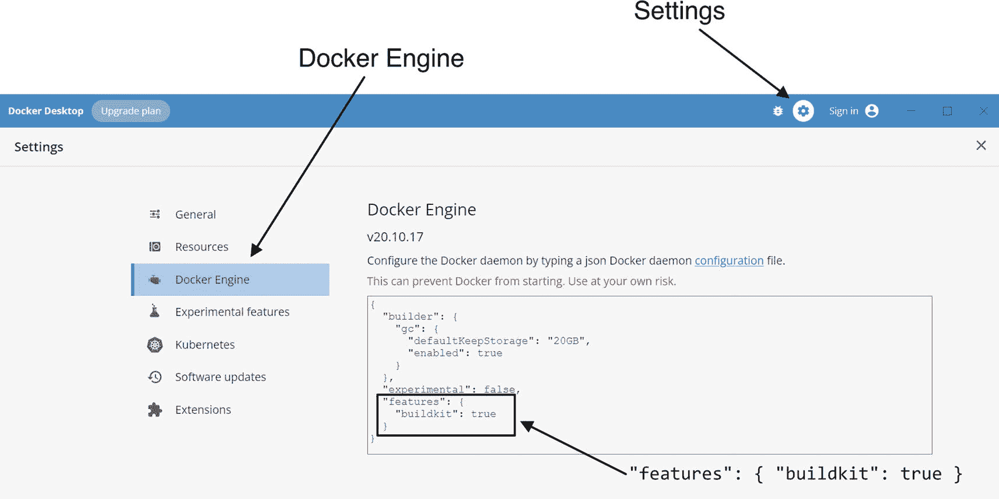

Docker Desktop 的快照，显示 Docker Engine、设置和特性：花括号内为 `buildkit : true`，并有标签。

图 14-1

在 Docker Desktop 中，导航到设置窗格，在 Docker Engine 部分下查找 BuildKit 特性条目

```
"features": { "buildkit": true }
```

如果 BuildKit 未启用而你希望尝试一下，可以在任何构建命令的开头添加 BuildKit 标志 `DOCKER_BUILDKIT=1`：

```
DOCKER_BUILDKIT=1 docker build ...
```

注意，在这个例子中，环境设置和 `docker build` 命令本身之间没有任何内容，此语法仅为当前构建启用 BuildKit。你也可以在环境中导出该值：

```
export DOCKER_BUILDKIT=1
```

或者，通过将 `DOCKER_BUILDKIT` 变量设置为零来禁用 BuildKit。


#### 进度

BuildKit 与传统引擎之间最显著的差异在于输出格式。如清单 14-3 所示，传统引擎的默认输出是一个连续的活动日志。

```
Building image 'oracle/database:19.3.0-ee' ...
Sending build context to Docker daemon   3.06GB
Step 1/24 : FROM oraclelinux:7-slim as base
---> 03c22334cf5a
Step 2/24 : LABEL "provider"="Oracle"                                     "issues"="https://github.com/oracle/docker-images/issues"               "volume.data"="/opt/oracle/oradata"                                     "volume.setup.location1"="/opt/oracle/scripts/setup"                    "volume.setup.location2"="/docker-entrypoint-initdb.d/setup"            "volume.startup.location1"="/opt/oracle/scripts/startup"                "volume.startup.location2"="/docker-entrypoint-initdb.d/startup"        "port.listener"="1521"                                                  "port.oemexpress"="5500"
---> Running in 82a69d6a2ffc
Removing intermediate container 82a69d6a2ffc
---> d3e64e2a7cad
Listing 14-3
传统引擎在命令行生成一个连续、冗长的输出流
```

如清单 14-4 所示，BuildKit 的输出则更为紧凑。

```
Building image 'oracle/database:19.3.0-ee' ...
[+] Building 63.7s (7/14)
=> [internal] load build definition from Dockerfile                    2.5s
=> => transferring dockerfile: 5.11kB                                  0.2s
=> [internal] load .dockerignore                                       4.0s
=> => transferring context: 2B                                         0.1s
=> [internal] load metadata for docker.io/library/oraclelinux:7-slim   0.0s
=> CACHED [base 1/4] FROM docker.io/library/oraclelinux:7-slim         0.0s
=> [internal] load build context                                      13.5s
=> => transferring context: 3.06GB                                    11.2s
=> [base 2/4] COPY setupLinuxEnv.sh checkSpace.sh /opt/install/       29.1s
清单 14-4
BuildKit 在构建过程中产生更紧凑的输出
```

`docker build` 的 `--progress` 选项控制着输出格式。设置 `--progress=plain` 可以生成如清单 14-3 所示的输出，而设置 `--progress=tty` 则可以得到类似清单 14-4 的结果。

我更喜欢 BuildKit 的 TTY 风格输出，原因有几个。首先，Oracle 数据库的构建过程很长，使用 `--progress=plain` 会向终端发送数千行内容。但它不仅仅是简洁。如清单 14-5 所示，TTY 方法的进度报告更加细粒度和信息丰富。

```
Building image 'oracle/database:19.3.0-ee' ...
[+] Building 1045.0s (15/15) FINISHED
=> [internal] load build definition from Dockerfile     2.5s
=> => transferring dockerfile: 5.11kB                   0.2s
=> [internal] load .dockerignore                        4.0s
=> => transferring context: 2B                          0.1s
=> [internal] load metadata for docker.io/library/or    0.0s
=> CACHED [base 1/4] FROM docker.io/library/oracleli    0.0s
=> [internal] load build context                       13.5s
=> => transferring context: 3.06GB                     11.2s
=> [base 2/4] COPY setupLinuxEnv.sh checkSpace.sh /o   29.1s
=> [base 3/4] COPY runOracle.sh startDB.sh createDB.    4.2s
=> [base 4/4] RUN echo "INSTALL_DIR = /opt/install"   393.8s
=> [builder 1/2] COPY --chown=oracle:dba LINUX.X64_1   43.8s
=> [builder 2/2] RUN chmod ug+x /opt/install/*.sh &&  329.0s
=> [stage-2 1/4] COPY --chown=oracle:dba --from=buil  157.2s
=> [stage-2 2/4] RUN /opt/oracle/oraInventory/orains    9.3s
=> [stage-2 3/4] WORKDIR /home/oracle                   4.4s
=> [stage-2 4/4] RUN echo 'ORACLE_SID=${ORACLE_SID:-    2.9s
=> exporting to image                                  28.0s
=> => exporting layers                                 27.9s
=> => writing image sha256:b0be5db0705d826560d064522    0.0s
=> => naming to docker.io/oracle/database:19.3.0-ee     0.0s
清单 14-5
使用 BuildKit 构建 Oracle Database 19c 镜像的完整输出
```

结果中有几点值得注意：

*   第二行显示了耗时、当前步骤及其状态。
*   BuildKit 以不同的方式计算 Dockerfile 中的步骤，并按阶段进行分解。清单 14-3 中的纯文本输出显示总步骤数为 24。而 TTY 输出则分别在 `base`、`builder` 和 `stage-2` 阶段内报告进度。步骤运行时，右侧的计时会持续更新以显示进度。完成后，它会显示该操作的耗时。
*   当步骤处于活动状态时，TTY 输出会在屏幕底部的窗口区域滚动显示活动内容。

阶段和步骤的计时与标签清楚地显示了构建过程在哪些地方花费了时间。这有点像 Docker 构建的 **AWR 报告**！如果我想加快这个构建速度，我会查看 `base` 阶段的第 4 步、`builder` 阶段的第 2 步，以及可能 `stage-2` 的第 1 步。^(⁸⁵)

#### 忽略文件

我们之前讨论过分离上下文，探索了一种用于构建相似镜像的目录结构：

```
19c
├── 19.15
│   ├── Dockerfile
│   ├── LINUX.X64_193000_db_home.zip
│   ├── p6880880_190000_Linux-x86-64.zip
│   └── patch-for-1915-RU.zip
└── 19.16
    ├── Dockerfile
    ├── LINUX.X64_193000_db_home.zip
    ├── p6880880_190000_Linux-x86-64.zip
    └── patch-for-1916-RU.zip
```

每个子目录中的前两个文件是相同的。Docker 不允许在构建上下文中使用链接或别名，除了将所有文件放在一个目录下之外，似乎没有好的办法来避免文件重复：

```
19c
├── Dockerfile
├── LINUX.X64_193000_db_home.zip
├── p6880880_190000_Linux-x86-64.zip
├── patch-for-1915-RU.zip
└── patch-for-1916-RU.zip
```

现在我们有了软件介质和 OPatch 文件的单一副本，但不知道 `Dockerfile` 属于哪个版本！幸运的是，你之前已经了解到，我们可以使用 `-f` 选项指定自定义的 Dockerfile，这意味着我们可以为每个数据库版本编写不同的 `Dockerfile` 配方：

```
19c
├── Dockerfile.19.15
├── Dockerfile.19.16
├── LINUX.X64_193000_db_home.zip
├── p6880880_190000_Linux-x86-64.zip
├── patch-for-1915-RU.zip
└── patch-for-1916-RU.zip
```

然后，通过调用相应的 `Dockerfile` 来构建任一版本：

```
docker build -f Dockerfile.19.15 .
docker build -f Dockerfile.19.16 .
```

这消除了重复的文件，但现在两个补丁文件都在上下文中。当构建一个使用 19.15 版本补丁的数据库时，`docker build` 会同时读取 19.15 和 19.16 的补丁。如果只有几个小补丁，这可能无关紧要，但实际上，我们更可能遇到的是 Oracle 每季度更新时添加的补丁数量不断增加。

一个忽略文件可以解决这个问题，它告诉构建过程忽略除所需补丁之外的所有文件：

```
# 忽略所有文件：
*
# 为 LINUX.X64_193000_db_home.zip 添加例外：
!LINUX.X64_193000_db_home.zip
# 为 p6880880_190000_Linux-x86-64.zip 添加例外：
!p6880880_190000_Linux-x86-64.zip
# 为 19.15 的补丁添加例外：
!patch-for-1915-RU.zip
```

这个忽略文件将 Docker 的上下文限制在用于构建 19.15 版本数据库的三个文件。然而，它破坏了 19.16 版本的构建！`docker build` 没有引用自定义忽略文件的功能，只认默认的 `.dockerignore`。

**BuildKit** 解决了这个问题。它没有引入选择忽略文件的开关，而是增加了对自定义忽略文件的支持，其名称源自自定义的 Dockerfile。

通常，构建会在与 `Dockerfile` 相同的目录中查找名为 `.dockerignore` 的文件。当启用 **BuildKit** 功能时，它首先查找与 `Dockerfile` 同名、但以 “`.dockerignore`” 为后缀的忽略文件。如果找不到自定义忽略文件，它接下来会查找默认名称的文件。

现在，每个 `Dockerfile` 版本都可以有自己的忽略文件：

```
19c
├── Dockerfile.19.15
├── Dockerfile.19.15.dockerignore
├── Dockerfile.19.16
├── Dockerfile.19.16.dockerignore
├── LINUX.X64_193000_db_home.zip
├── p6880880_190000_Linux-x86-64.zip
├── patch-for-1915-RU.zip
└── patch-for-1916-RU.zip
```

与特定版本 Dockerfile 绑定的自定义忽略文件，解决了因将重复或公共文件合并到单一目录而产生的构建上下文问题！

#### BuildKit 语法

某些 **BuildKit** 功能必须在 `Dockerfile` 顶部作为注释启用，以标识前端构建器的版本。例如：

```
# syntax=docker/dockerfile:1.4
```

语法指令可以启用新的构建功能和错误修复，而无需更新 Docker 守护进程，并允许用户测试实验性功能。这些指令通常启用高级组件。如果未启用 **BuildKit**，注释后的语法指令将被忽略。

### 总结

镜像及其包含的自动化流程，起初可能看起来神秘甚至神奇。但揭开帷幕后，显然其中并无异常或特别之处，只是 shell 脚本和普通的 Linux 命令！

凭借你对 Docker 构建语法的新理解，你可以构建镜像并为其命名。你已经看到了镜像中构建参数与容器中环境变量的相似之处，并学习了如何通过使用构建参数动态添加功能和灵活性来扩展 Dockerfile。

我们讨论了用于控制构建缓存的特性，以及用于查看和管理构建过程中遗留产物的工具。随着容器使用的增长，我保证我们介绍的清理命令将证明它们的价值！

我在构建数据库镜像时遇到的一个挑战是管理源文件——每个版本所需的数据库安装介质和补丁。通过将文件集中存放在一个专用的清单目录中，可以更容易地防止重复和跟踪文件版本。通过将所有内容压缩到一个位置来节省空间是有代价的，每个文件都对潜在的构建上下文有贡献。采用命名的 Dockerfile，并结合通过 **BuildKit** 启用的自定义忽略文件，避免了在上下文和控制之间做出任何牺牲。

有了这些知识，构建镜像应该不再那么令人生畏，我希望你会考虑拼凑几个自己的镜像！像任何事情一样，这有一个学习曲线，但别让它阻止你！在下一章中，我将分享一些我发现的、在处理镜像和容器时很有帮助的故障排除和调试技巧，虽然你肯定会遇到一些波折！

脚注 1 2 3 4 5 6 7 8 9

## 15. 调试与故障排除

“新”和“不同”常常令人望而生畏。我们被迫为熟悉或舒适的任务学习或发明新方法，甚至可能改变我们的认知和理解。久经考验的方法是稳定的，甚至是安全的。

然而，我们所做的一切，尤其是在 IT 领域，都曾经是新颖和不同的。我从 Oracle 7 开始，那远在 RMAN、真正应用集群或数据卫士出现之前。云计算？还不成形。Exadata 仍是一个梦想。如今，我在日常的 Oracle 工作中视它们为理所当然，但我必须在某个时候学习掌握每一项技术。

Docker 也不例外。当我开始使用容器时，我并未完全理解镜像与容器之间的关系，也没有意识到构建是一系列“在容器中运行镜像、执行操作、将结果保存为镜像、重复”的操作。理解了这一点，就更容易看清在何处以及如何对流程进行故障排除。

我最近读了一位新开发者的文章，他说工作中第二糟糕的部分是不明白代码为什么不工作。（最糟糕的是？不明白为什么他们的代码*能*工作！）本章讨论的方法和技巧将帮助你驾驭容器这个新颖而不同的世界！我将介绍从失败的镜像和容器中提取信息的方法，这些信息有助于理解发生了什么、为什么发生以及如何修复！

这些方法本身大多并不新——从脚本中回显变量的做法至少可以追溯到几十年前。但这些方法在容器中的应用和工作方式并非总是显而易见或直观的。

### 查看与操作输出

如果您使用 `buildContainerImage.sh` 脚本构建过 Oracle 数据库，您可能已经看到过类似清单 15-1 和 15-2 中显示的输出信息。

```
Launching Oracle Database Setup Wizard...
[WARNING] [INS-32055] The Central Inventory is located in the Oracle base.
ACTION: Oracle recommends placing this Central Inventory in a location outside the Oracle base directory.
[WARNING] [INS-13014] Target environment does not meet some optional requirements.
CAUSE: Some of the optional prerequisites are not met. See logs for details. installActions2022-09-24_10-13-19PM.log
ACTION: Identify the list of failed prerequisite checks from the log: installActions2022-09-24_10-13-19PM.log. Then either from the log file or from installation manual find the appropriate configuration to meet the prerequisites and fix it manually.
The response file for this session can be found at:
/opt/oracle/product/19c/dbhome_1/install/response/db_2022-09-24_10-13-19PM.rsp
You can find the log of this install session at:
/tmp/InstallActions2022-09-24_10-13-19PM/installActions2022-09-24_10-13-19PM.log
As a root user, execute the following script(s):
1\. /opt/oracle/oraInventory/orainstRoot.sh
2\. /opt/oracle/product/19c/dbhome_1/root.sh
Execute /opt/oracle/oraInventory/orainstRoot.sh on the following nodes:
[331db970408a]
Execute /opt/oracle/product/19c/dbhome_1/root.sh on the following nodes:
[331db970408a]
Removing intermediate container 331db970408a
Listing 15-2
Part of an image build for an Oracle 19c database, showing part of the database software installation step
```

```
---> f33a827c1bc8
Step 6/24 : ENV PATH=$ORACLE_HOME/bin:$ORACLE_HOME/OPatch/:/usr/sbin:$PATH     LD_LIBRARY_PATH=$ORACLE_HOME/lib:/usr/lib     CLASSPATH=$ORACLE_HOME/jlib:$ORACLE_HOME/rdbms/jlib
---> Running in d64a3700b791
Removing intermediate container d64a3700b791
---> bb272db209e2
Step 7/24 : COPY $SETUP_LINUX_FILE $CHECK_SPACE_FILE $INSTALL_DIR/
---> 18dc49d4a53b
Step 8/24 : COPY $RUN_FILE $START_FILE $CREATE_DB_FILE $CREATE_OBSERVER_FILE $CONFIG_RSP $PWD_FILE $CHECK_DB_FILE $USER_SCRIPTS_FILE $RELINK_BINARY_FILE $CONFIG_TCPS_FILE $ORACLE_BASE/
---> 183467ad6373
Step 9/24 : RUN chmod ug+x $INSTALL_DIR/*.sh &&     sync &&     $INSTALL_DIR/$CHECK_SPACE_FILE &&     $INSTALL_DIR/$SETUP_LINUX_FILE &&     rm -rf $INSTALL_DIR
---> Running in 5367f8d86861
Listing 15-1
A portion of the output generated while building an Oracle database image. Note the ID values identified with “--->,” the step tracking, and the list of commands executed in each step
```

构建过程中的这份 `进度输出` 应该是查找故障原因线索的首选之地。这份输出并无特殊之处，与您手动执行命令所看到的输出别无二致。这使得我们可以运用与“常规”系统中类似的技巧。

如果日志输出没有显示任何明显问题，下一步就是添加输出，以报告诊断情况所需的信息和详细内容。

#### 回显信息

清单 15-1 中展示的第 9 步运行了一系列命令：

```
RUN chmod ug+x $INSTALL_DIR/*.sh &&     sync &&     $INSTALL_DIR/$CHECK_SPACE_FILE &&     $INSTALL_DIR/$SETUP_LINUX_FILE &&     rm -rf $INSTALL_DIR
```

这些命令对应于 Dockerfile 中的一个 `RUN` 代码块：

```
RUN chmod ug+x $INSTALL_DIR/*.sh && \
sync && \
$INSTALL_DIR/$INSTALL_DB_BINARIES_FILE $DB_EDITION
```

如果此代码块中的一个或多个变量设置错误，我通过查看输出是无法得知的。所有内容都引用了环境变量。但是，我可以向此代码块添加命令，在构建输出中显示变量设置：

```
RUN echo "INSTALL_DIR = $INSTALL_DIR" && \
echo "INSTALL_DB_BINARIES_FILE = $INSTALL_DB_BINARIES_FILE" && \
echo "DB_EDITION = $DB_EDITION" && \
chmod ug+x $INSTALL_DIR/*.sh && \
sync && \
$INSTALL_DIR/$INSTALL_DB_BINARIES_FILE $DB_EDITION
```

当我重新运行构建时，我会看到这些值被打印到构建输出中：

```
Step 9/24 : RUN echo "INSTALL_DIR = $INSTALL_DIR" && echo "INSTALL_DB_BINARIES_FILE = $INSTALL_DB_BINARIES_FILE" && echo "DB_EDITION = $DB_EDITION" && chmod ug+x $INSTALL_DIR/*.sh && sync && $INSTALL_DIR/$CHECK_SPACE_FILE && $INSTALL_DIR/$SETUP_LINUX_FILE && rm -rf $INSTALL_DIR
---> Running in e5331bac34fc
INSTALL_DIR = /opt/install
INSTALL_DB_BINARIES_FILE = installDBBinaries.sh
DB_EDITION =
```

请注意，诊断检查的位置可能会影响结果。在此示例中，我是作为 Dockerfile 中现有步骤的一部分来回显这些值的。如果我将它们添加到一个单独的 `RUN` 代码块中，无论是在之前还是之后，它们都会在自己的容器中运行。其值可能无法反映在相关步骤中的设置。

回显值不仅限于 Dockerfile。Docker 用来完成每个构建任务的脚本会与进程输出交互，如清单 15-2 所示，同样的技术也适用。

#### 添加调试选项

使用 `bash -x` 调用 bash 脚本可以启用调试输出，打印出脚本内执行的命令和参数。如果您在上一个示例的第 9 步遇到问题，并想查看数据库二进制文件安装所做一切的详细信息，您可以修改 Dockerfile 为：

```
RUN chmod ug+x $INSTALL_DIR/*.sh && \
sync && \
bash -x $INSTALL_DIR/$INSTALL_DB_BINARIES_FILE $DB_EDITION
```

在最后一行的脚本执行前添加 `bash -x`，可以在不改变结果的情况下，增加对脚本操作的可见性。缺点在于需要在 Dockerfile 中添加和删除调试命令所需的工作量。但是，有我们的好帮手 `ARG` 帮忙，这就不是问题了！

在 Dockerfile 顶部添加一个新的、名为 `DEBUG` 的空参数：

```
ARG DEBUG=
```

然后在 Dockerfile 中执行的每个脚本前加上 `$DEBUG`：

```
RUN chmod ug+x $INSTALL_DIR/*.sh && \
sync && \
$DEBUG $INSTALL_DIR/$INSTALL_DB_BINARIES_FILE $DB_EDITION
```

在常规调用 `docker build` 时，脚本执行前会无害地替换为空的 `DEBUG` 参数。然而，向该参数传递一个值即可开启调试：

```
docker build ...
--build-arg DEBUG="bash -x" \
...
```

这个技巧在调试容器方面还有另一个应用。记住，容器执行的是由脚本定义的服务，对于我们的数据库容器，这些活动的根源是 `runOracle.sh`。正如您在第 6 章所发现的，`runOracle.sh` 会调用其他脚本来执行启动和创建数据库等功能。使用类似的 `$DEBUG` 变量修改这些调用，可以为容器添加运行时调试功能，如清单 15-3 所示。

```
# Start database
$DEBUG "$ORACLE_BASE"/"$START_FILE";
Listing 15-3
Adding a `$DEBUG` option to the individual script executions, such as this call to the database startup script, enables runtime debugging in containers through an environment variable
```

在这种情况下，`DEBUG` 变量不是在构建过程中解释的参数。它是被复制到镜像中的脚本的一部分。`DEBUG` 变量在容器中是可见的，如果未定义，则为空值。和之前一样，它不会向脚本添加任何内容，也不会改变容器的行为或功能。在 `docker run` 命令中作为环境变量为 `DEBUG` 定义一个值即可激活调试：

```
docker run ...
-e DEBUG="bash -x" \
...
```

**不要在生产镜像中实现此类内置调试——这简直就是命令注入**——但在开发镜像中包含它已经为我节省了无数小时。如果调试功能已经内置，就无需更新 Dockerfile 或脚本，也无需重新构建包含调试功能的镜像了！


#### 查看容器日志

当容器失败时，通常发生在启动阶段，由自动化脚本中的错误引起。对于数据库，最有可能失败的事件是新容器中的数据库创建和现有容器上的数据库启动。错误信息几乎总是可以在容器日志中看到。

要查看容器的日志，请运行：

```
docker logs <container_id_or_name>
```

这会将日志的全部内容转储到命令行，通过将命令输出通过管道传递给文件阅读器（如 `less` 或 `more`）可能更容易阅读，同时也增加了搜索能力：

```
docker logs <container_id_or_name> | less
```

无论容器是否正在运行，日志在 Docker 中都是可用的，并且由于大多数错误发生在启动后不久，你很有可能在开头几行就发现问题！

#### 覆盖容器启动

仅仅因为一个镜像构建成功，并不意味着它能正常工作。当容器失败或行为异常时，根本原因在于镜像。修复这些问题最终意味着在整合必要的修复后重新构建镜像。你如何、在哪里识别、开发和测试这些修复至关重要。如果你无法在容器中尝试和测试东西，你唯一的办法就是更新 `Dockerfile` 及其自动化脚本，然后重新构建镜像。这可能是一个耗时的循环。

当容器在启动时失败，你可能会觉得走进了死胡同。如果你无法登录并且容器无法运行，还有任何选择吗？当然有！

以下技术会在启动期间改变容器行为。它们本身并不是诊断构建过程问题的方法，但它们可以帮助让失败的镜像启动并运行足够长的时间，以发现损坏的地方！

在本书的大部分内容中，我展示了如何使用 `-d` 标志运行容器，将它们创建为后台的分离进程：

```
docker run -d ...
```

你可以将其视为在后台运行数据库服务或守护进程——容器启动并准备为客户端请求提供服务。运行什么——并由此提供服务——是由 `Dockerfile` 中的 `CMD` 指令定义的。

`docker run` 读取镜像元数据并在容器中启动该命令。如果命令失败，容器通常会停止，因为它无法执行维持其服务所必需的操作。作为用户，你通常只会在启动后看到命令提示符处报告的容器名称，而没有迹象表明它已失败。直到有东西试图 *消费* 容器的服务时，你才会开始发现有些不对劲！

如果 `docker ps -a` 显示的容器状态报告非零退出代码，那么它对 `docker start` 作出积极反应的可能性也不大。以分离进程运行容器会调用启动命令，但你可以通过向容器传递不同的命令（例如一个 shell）在交互模式下绕过这种行为：

```
docker run -it oracle/database:19.3.0-ee bash
```

这看起来像是使用 `docker exec` 连接到容器，只是用镜像名代替了容器名。给容器一些不同的事情做，会中断启动过程。即使过了几分钟，容器中也没有数据库进程在运行：

```
> docker run -it oracle/database:19.3.0-ee bash
bash-4.2$ ps -ef | grep oracle
oracle         1       0  0 21:07 pts/0    00:00:00 bash
oracle       132       1  0 21:12 pts/0    00:00:00 ps -ef
oracle       133       1  0 21:12 pts/0    00:00:00 grep oracle
```

在单独的会话中检查容器日志只显示我在命令提示符下运行的命令！

```
> docker logs -f adoring_colden
bash-4.2$ ps -ef | grep oracle
oracle         1       0  0 21:07 pts/0    00:00:00 bash
oracle       132       1  0 21:12 pts/0    00:00:00 ps -ef
oracle       133       1  0 21:12 pts/0    00:00:00 grep oracle
```

有了一个正在运行的容器，我就可以查询环境、运行脚本，甚至逐步执行失败的启动命令。

此示例中的容器与我的会话绑定，当我退出时，容器就会停止。然而，通常在启动时调用的命令已被 `bash` 替换。此后的每一次 `docker start` 都会如此，在容器中启动 bash。从这一点出发，我可以停止和启动容器，虽然它不 *做* 预期的事情，但我可以通过运行“正常”的启动命令来重现故障！

#### 中间容器

构建中的每一步都包括运行一个容器、做一些工作，然后将容器保存为镜像以用于后续步骤。一个单一的镜像可能有几十个步骤，每个步骤都建立在最后一个步骤之上并为最终结果做出贡献。这也意味着多个层可能共同导致一个问题，使得找出损坏之处不那么直观。

有些问题最好通过部分构建镜像来解决，构建到失败点，然后将其作为容器运行，并手动逐步执行自动化脚本。构建过程中生成的每个中间镜像都是 `Dockerfile` 中定义的工作目标。

如果 Docker 可以运行这些镜像，我们也可以——唯一的技巧是识别要运行的正确镜像！通过了解每个时间点的系统状态和日志，以及要运行的命令清单，我们可以在与 Docker 在构建期间经历的相同条件下，在中间容器中手动应用和测试更改。

#### 构建到目标阶段

达到这种“部分”状态的一个途径是通过注释掉或删除行来修剪 `Dockerfile`。对于多阶段构建，有一个更直接的内置选项：`--target` 选项。在 Dockerfile 中定位一个命名的阶段会在该阶段完成后停止构建：

```
docker build ...
--target stage-name \
...
```

在下面的 `Dockerfile` 中，我移除了除 `FROM` 语句之外的所有内容，突出了它的三个阶段：`base`、`builder` 和一个最终的、未命名的阶段：

```
FROM oraclelinux:7-slim as base

FROM base AS builder

FROM base

```

使用 `--target`，我可以告诉 Docker 构建通过 `builder` 阶段，在执行最终阶段之前停止：

```
docker build \
--target builder \
-t builder-stage \
-f Dockerfile .
```

用一个新名称 `builder-stage` 标记镜像来标识它。构建完成后，以交互方式运行该镜像，启动一个 bash shell：

```
docker run -it builder-stage bash
```

该镜像没有启动命令是不完整的，所以我们需要一种类似于用于覆盖容器中默认操作的方法，即给容器一个要运行的命令。在这里，我使用 `-it` 标志运行容器，这启动了一个交互式会话并打开了一个 bash shell。


#### 运行缓存层

我可以采用类似的方法来处理 Docker 构建缓存中的层——假设它们仍然存在！`buildContainerImage.sh`脚本在构建镜像时使用了`--force-rm=true`和`--no-cache=true`选项。`--force-rm=true`开关会移除中间镜像，即使构建失败也是如此，因此在脚本更改此选项之前，中间镜像不可用：^(⁸⁶)

```
"${CONTAINER_RUNTIME}" build --force-rm=false --no-cache=false \
"${BUILD_OPTS[@]}" "${PROXY_SETTINGS[@]}" --build-arg DB_EDITION=${EDITION} \
-t "${IMAGE_NAME}" -f "${DOCKERFILE}" . || {
echo ""
echo "ERROR: Oracle Database 容器镜像未成功创建。"
echo "ERROR: 请检查输出并纠正构建操作中报告的任何问题。"
exit 1
}
```

同样，请注释掉构建命令后出现的`prune`指令：

```
# 移除悬空镜像（带标签的中间镜像）
#yes | "${CONTAINER_RUNTIME}" image prune > /dev/null
```

应用这些更改后，构建报告的进度（如清单 15-4 所示）与之前在清单 15-1 中看到的略有不同。`Removing intermediate container`的消息消失了，取而代之的是`Using cache`。

```
Step 6/24 : ENV PATH=$ORACLE_HOME/bin:$ORACLE_HOME/OPatch/:/usr/sbin:$PATH     LD_LIBRARY_PATH=$ORACLE_HOME/lib:/usr/lib     CLASSPATH=$ORACLE_HOME/jlib:$ORACLE_HOME/rdbms/jlib
---> 使用缓存
---> 2d1f2466fe4f
Step 7/24 : COPY $SETUP_LINUX_FILE $CHECK_SPACE_FILE $INSTALL_DIR/
---> 使用缓存
---> 2e6a13841ca5
Step 8/24 : COPY $RUN_FILE $START_FILE $CREATE_DB_FILE $CREATE_OBSERVER_FILE $CONFIG_RSP $PWD_FILE $CHECK_DB_FILE $USER_SCRIPTS_FILE $RELINK_BINARY_FILE $CONFIG_TCPS_FILE $ORACLE_BASE/
---> 使用缓存
---> bd581e634499
Step 9/24 : RUN echo "INSTALL_DIR = $INSTALL_DIR" &&     echo "INSTALL_DB_BINARIES_FILE = $INSTALL_DB_BINARIES_FILE" &&     echo "DB_EDITION = $DB_EDITION" &&     chmod ug+x $INSTALL_DIR/*.sh &&     sync &&     $INSTALL_DIR/$CHECK_SPACE_FILE &&     $INSTALL_DIR/$SETUP_LINUX_FILE &&     rm -rf $INSTALL_DIR
---> 在 3ea3d1739ebb 中运行
清单 15-4
在 buildContainerImage.sh 脚本中禁用缓存管理后的部分构建输出
```

构建中处理的每个镜像的 ID 值在输出中可见。在 BuildKit 和使用`--progress=tty`的构建下，不会打印镜像 ID。在这些情况下，或者如果原始构建输出不可用，中间镜像仍然在镜像的历史记录中可用：

```
> docker history oracle/database:19.3.0-ee
镜像 ID          创建时间          创建命令                            大小      注释
bdbb8b83217b   3 分钟前    /bin/sh -c #(nop)  CMD ["/bin/sh" "-c" "exec...   0B
fa9ccf999db3   3 分钟前    /bin/sh -c #(nop)  HEALTHCHECK &{["CMD-SHELL...   0B
a6382dfde8a3   3 分钟前    /bin/sh -c echo 'ORACLE_SID=${ORACLE_SID:-OR...   69B
8b9a86303988   3 分钟前    /bin/sh -c #(nop) WORKDIR /home/oracle          0B
2a63bb2ba0e2   3 分钟前    /bin/sh -c #(nop)  USER oracle                  0B
3dc4a02582f5   3 分钟前    /bin/sh -c $ORACLE_BASE/oraInventory/orainst...   21.8MB
b8ad822c9f7b   3 分钟前    /bin/sh -c #(nop)  USER root                    0B
a51c124a4630   4 分钟前    /bin/sh -c #(nop) COPY --chown=oracle:dbadir...   6.19GB
80165c9dd6e6   6 分钟前    /bin/sh -c #(nop)  USER oracle                  0B
7df11e1c33c2   13 分钟前   /bin/sh -c echo "INSTALL_DIR = $INSTALL_DIR"...   332MB
bd581e634499   5 周前      /bin/sh -c #(nop) COPY multi:267aa3de5580180...   43kB
2e6a13841ca5   5 周前      /bin/sh -c #(nop) COPY multi:08c35eebd2349e6...   1.96kB
2d1f2466fe4f   5 周前      /bin/sh -c #(nop)  ENV PATH=/opt/oracle/prod...   0B
6f7b027f7ba1   5 周前      /bin/sh -c #(nop)  ENV ORACLE_BASE=/opt/orac...   0B
bfa620b5677f   5 周前      /bin/sh -c #(nop)  ARG INSTALL_FILE_1=LINUX....   0B
6fbdf293ec56   5 周前      /bin/sh -c #(nop)  ARG SLIMMING=true            0B
e930d325050c   5 周前      /bin/sh -c #(nop)  LABEL provider=Oracle iss...   0B
03c22334cf5a   2 年前      /bin/sh -c #(nop)  CMD ["/bin/bash"]            0B
      2 年前      /bin/sh -c #(nop) ADD file:0846801b1ef59a751...   131MB
      2 年前      /bin/sh -c #(nop)  LABEL org.opencontainers....   0B
```

`docker image history`的输出首先显示最新的操作，并标识了每个命令运行的镜像。现在，通过运行关联的镜像并提供一个命令（如 bash）来执行，检查一个步骤：

```
docker run --name test -it 3dc4a02582f5 bash
```

你也可以使用`-d`标志在后台运行中间镜像：

```
docker run --name test -d 3dc4a02582f5 bash
```

运行中间镜像时，关键要记住镜像不会有内置指令。如果不为容器提供要执行的操作（如打开 shell），它会立即退出！

将中间镜像作为容器启动后，它们的行为与我们本书中一直使用的“常规”镜像完全相同。用于管理和连接的相同命令仍然有效。对于前面的两个示例，你可以使用`docker exec`打开一个 bash 终端：

```
docker exec -it test bash
```

在中间镜像中排查故障时，通常不需要添加环境变量、分配网络或映射端口。但是，你可能需要考虑映射一个绑定卷。

### 访问容器文件

假设你已经编写了一个 Dockerfile 并用它构建了一个镜像。当你运行该镜像时，出现了问题。你遵循了本章中的一些推荐方法，得以启动容器并修改了一些脚本。如何从容器中访问更改后的文件？

你可以将文件内容从容器的 shell 复制粘贴到本地主机上的一个文件中。我无法计算自己这样做过多少次，在某种程度上，这是一个完全合理的解决方案。

对于较大而不便复制粘贴的文件，请使用 Docker 的复制工具`docker cp`。它接受两个参数，从第一个（源）复制到第二个（目标）。通过添加容器名称前缀后跟冒号来标识容器中的位置：

```
docker cp my_container:/source_path/filename /destination_path/
```

这将把容器“my_container”中的`/source_path/filename`复制到主机上的`/destination_path`。

遗憾的是，`docker cp`不支持通配符：

```
> docker cp ORCL:/home/oracle/* $HOME/
错误：没有这样的容器路径：ORCL:/home/oracle/*
```

它也不复制目录内容。复制几个文件是可行的，但复制几十个可能会变得很繁琐！

在故障排除期间管理多个文件，最好通过附加卷来解决。我建议将一个绑定卷映射到容器中不存在的挂载点，并将其关联到本地主机上的一个目录：

```
docker run -it \
-v $HOME:/debug \
3dc4a02582f5 bash
```

这对于将文件共享*到*容器中也很有用。大多数数据库管理员都有一套他们用得顺手的诊断脚本。预见需求并使其在容器环境中可用，对你自己会有很大帮助！


### 总结

在我年轻的时候，我发现了自己对数学和逻辑的热爱。我记得在图书馆偶然发现一本逻辑谜题书，`Aha! Insight`，作者是《`Scientific American`》的专栏作家马丁·加德纳。每个问题似乎都只差一块拼图就能获得足够的信息来解决悖论。然而，结果常常是他通过包含一个**干扰项**——某个“事实”或随机数字——给出了过多的数据，我会为之苦思冥想，直到意识到（有时只是在翻阅了书后的答案后）那是个干扰！大多数谜题都有着简单、优雅的解决方案，能带来“Aha! 领悟时刻！”

我在故障排查和调试代码时也看到了同样的模式。很多时候，一个简单的答案就隐藏在令人困惑、使场景变得杂乱的无意义信息之中。关键在于理解如何从系统中提取数据，以及应该将搜索解决方案的重点放在哪里。

最显而易见的起点是日志。在镜像构建过程中，Docker 会将脚本输出和消息中继到控制台，在本章中，你学习了向现有输出中添加补充性调试信息的策略。也许我最喜欢的方法，即在脚本调用前添加 `DEBUG` 参数，已经为我节省了数小时。只需记住，这是一个潜在的攻击向量，不应在生产代码中使用！

你还发现了通过绕过初始化并在 shell 提示符下启动容器来规避容器启动失败的方法。然后，你可以逐步检查自动化代码，并（希望如此）找到并修复任何干扰容器运行的问题。同样的技术应用于中间镜像，对于识别构建过程中的小问题也很有价值。

将这些方法加入你的工具箱后，你就已经做好了充分准备，能够自信地构建和排查容器镜像的问题，并尽可能快速、无痛地达到你的“Aha! 领悟时刻”！

脚注 1

## 16. Docker Hub 与镜像仓库

Docker 是一种基础设施即代码工具，或称 IaC。`Dockerfile` 就是代码，是一组指导 Docker 完成创建（或重新创建）镜像步骤的指令。由于 Docker 是平台无关的，同一个 `Dockerfile` 在 Windows、Mac 和 Linux 上，在私有机器或在云端都能生成完全相同的镜像！

不过，有一个注意事项。你已经看到 `Dockerfile` 中的参数如何为构建增添了灵活性和多样性。我维护一个仓库，其中仅用一个 `Dockerfile` 就能构建从 11g 到 21c 的 Oracle 版本，并对最终镜像应用一个或多个补丁。单独来看，`Dockerfile` 只是一个模板，就像 Word 模板为新文档提供了基础，但倾注到每个文件中的思考和内容使其独一无二。`Dockerfile` 也是如此。配套的脚本和资源对结果有着重要影响。

数据库镜像严重依赖第三方内容——数据库安装文件和补丁。让数据库管理员告诉开发者，“从 Oracle 下载文件，放到正确的目录里，然后按照某些说明用这个 `Dockerfile` 构建你的镜像”是没有意义的。虽然这比单独处理数据库镜像请求要快，但无法保证每个人使用的都是同一个镜像。

镜像仓库正是为了解决这一确切需求而生的。作者运行一个构建并产出一个资产——镜像——然后将其“推送”到一个中央镜像仓库。任何有仓库访问权限的人都可以“拉取”特定的镜像，根据需要随时使用。你在本书练习中调用 `docker run ... alpine` 或编写并构建带有 `FROM` 子句（引用如 Oracle Linux 等现有镜像内容）的 `Dockerfile` 时，不知不觉已经在使用一个名为 `Docker Hub` 的仓库了。

本章的主要焦点是 `Docker Hub`，但其他供应商也提供了类似的容器注册中心，供个人和企业使用。个人和组织可以转向云供应商（如 `Oracle Cloud Infrastructure`，或 `OCI`）的容器注册中心服务来管理和托管他们的内容。

### Docker Hub

我提到你一直以来都在使用 `Docker Hub`。即使没有登录或注册账户，存储在 `Docker Hub` 中的近一千万个镜像也对用户开放！导航到 [*https://hub.docker.com*](https://hub.docker.com)（如图 16-1 所示），然后点击右上角的“Explore”链接。

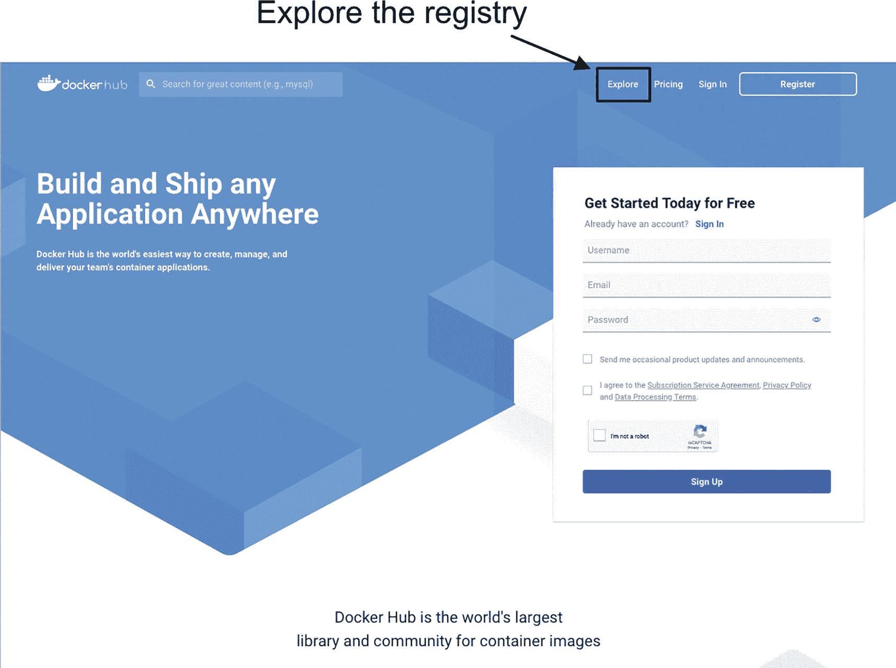

Docker Hub 注册页面的截图，其中“Explore”标签页被突出显示并标注为“探索注册中心”。

图 16-1

从 Docker Hub 主页点击“Explore”链接以浏览仓库镜像

如图 16-2 所示的注册中心浏览器，列出了所有公共镜像，并在左侧包含用于缩小内容范围的筛选功能。请注意，“可信内容”部分有 Docker 官方镜像、已验证发布者和赞助的 OSS 选项。

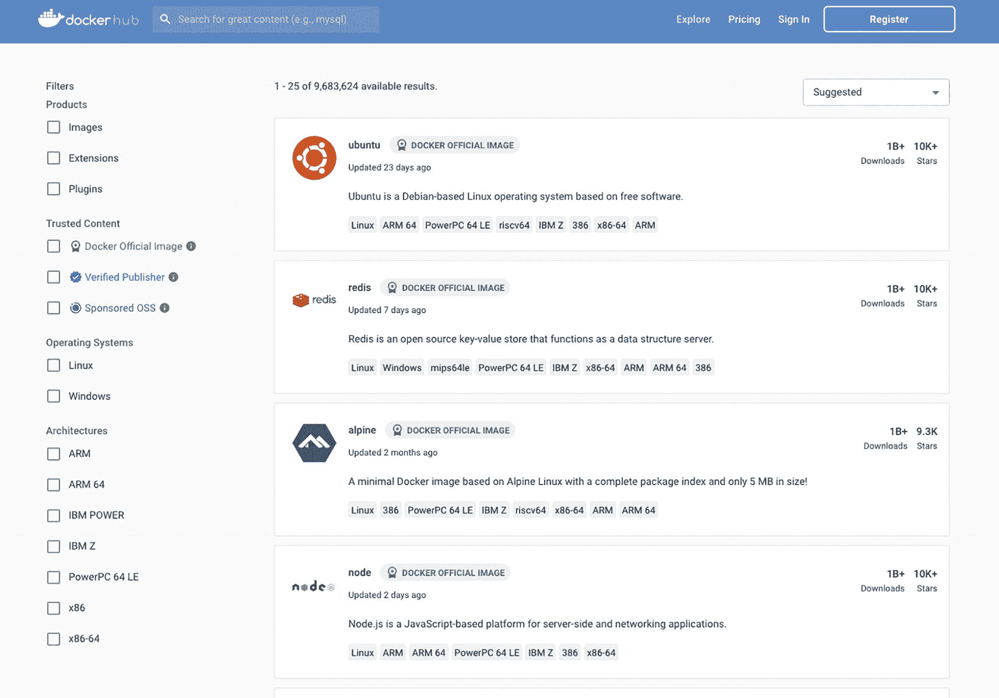

注册中心浏览器的截图，列出了所有公共镜像，并在左侧包含用于缩小内容范围的筛选功能。“可信内容”部分包含 Docker 官方镜像、已验证发布者和赞助的 O S S 选项。

图 16-2

Docker Hub 镜像仓库搜索的主界面。请注意左侧的筛选选项，尤其是用于仅选择“可信内容”的选项

#### 可信内容

`Docker Hub` 有点像是一个自由市场！注册用户可以上传和分享几乎任何东西，包括恶意内容！恶意行为者会利用任何机会来危害毫无戒心的用户。Docker 将内容标记为“可信”，以确保这些镜像作者是信誉良好的，他们的镜像不含恶意软件。“信任”分为几个等级：

*   **Docker 官方镜像**是使软件开发和部署更容易的标准解决方案。它们通常是最受欢迎的镜像，经过漏洞扫描，由积极参与开源软件开发的可信赖组织维护，并经过大量使用该内容的用户社区的审查。
*   **已验证发布者**是经过 Docker 验证的生态系统中的商业合作伙伴。已验证发布者直接负责维护其内容，并且通常遵循与官方镜像相同的严格实践^(⁸⁷)。
*   **Docker 赞助的开源软件**（简称 `OSS`）是由 Docker 赞助的开源项目发布的镜像。虽然这些不是公司项目，但其内容会经过严格的恶意软件和漏洞审查。

然后，就是其他所有内容。


#### 不可信镜像

查看不可信的公共镜像时需格外谨慎。容器在 Docker 中运行时拥有提升的权限。利用这一点的方式不胜枚举，从窃取系统敏感信息到在后台进行加密货币挖矿。请记住，镜像就像提供某种服务的应用程序。你不会从未知来源下载并运行应用程序，对待公共镜像也应保持同样的怀疑态度！

这并不是说每个镜像都故意包含恶意代码！Docker 与多家第三方机构合作，包括 Snyk（[www.snyk.io](http://www.snyk.io)），他们提供扫描服务（甚至提供修复方案）。已扫描的镜像会显示已识别漏洞的摘要。图 16-3 展示了扫描 Oracle 11.2.0.4 数据库镜像所识别漏洞的示例。图 16-4 则显示了每个问题的详细列表及其相关的通用漏洞披露（CVE）说明。

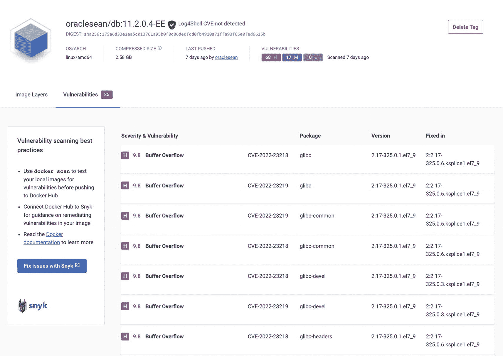

一个 oraclesean 标签的截图，描述了每个问题的详细列表及其相关的通用漏洞披露（CVE）说明。

**图 16-4**

针对 Oracle 11.2.0.4 企业版镜像的 Snyk 扫描结果。它详细列出了漏洞及其严重性分数、描述问题的 CVE 说明、源软件包和版本，以及修复该问题的软件包版本。

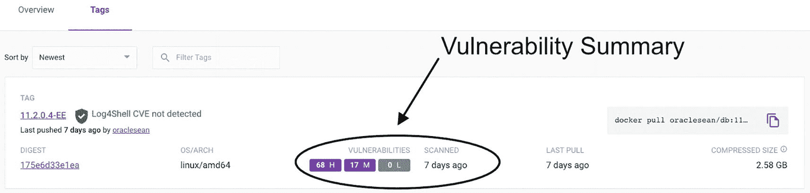

一个标签页的截图，展示了扫描 Oracle 11.2.0.4 数据库镜像所识别漏洞的示例。

**图 16-3**

来自私有仓库的 Oracle 11.2.0.4 企业版镜像摘要。扫描是镜像作者上传镜像到 Docker Hub 时可请求的一项可选功能。此处，镜像显示了其最后扫描时间以及镜像中存在的高、中、低严重性漏洞的摘要。

#### 漏洞扫描

你可以使用 `docker scan` 命令在从公共仓库拉取镜像之前对其进行扫描。该命令会调用 Snyk 的第三方扫描服务，并生成在镜像中检测到的问题列表。清单 16-1 展示了对 `ubuntu` 镜像进行扫描的示例。

```
> docker scan ubuntu
Docker Scan relies upon access to Snyk, a third party provider, do you consent to proceed using Snyk? (y/N)
y
Testing ubuntu...
✗ Low severity vulnerability found in shadow/passwd
Description: Time-of-check Time-of-use (TOCTOU)
Info: https://snyk.io/vuln/SNYK-UBUNTU2204-SHADOW-2801886
Introduced through: shadow/passwd@1:4.8.1-2ubuntu2, adduser@3.118ubuntu5, shadow/login@1:4.8.1-2ubuntu2
From: shadow/passwd@1:4.8.1-2ubuntu2
From: adduser@3.118ubuntu5 > shadow/passwd@1:4.8.1-2ubuntu2
From: shadow/login@1:4.8.1-2ubuntu2
✗ Low severity vulnerability found in gmp/libgmp10
Description: Integer Overflow or Wraparound
Info: https://snyk.io/vuln/SNYK-UBUNTU2204-GMP-2775169
Introduced through: gmp/libgmp10@2:6.2.1+dfsg-3ubuntu1, coreutils@8.32-4.1ubuntu1, apt@2.4.7
From: gmp/libgmp10@2:6.2.1+dfsg-3ubuntu1
From: coreutils@8.32-4.1ubuntu1 > gmp/libgmp10@2:6.2.1+dfsg-3ubuntu1
From: apt@2.4.7 > gnutls28/libgnutls30@3.7.3-4ubuntu1.1 > gmp/libgmp10@2:6.2.1+dfsg-3ubuntu1
and 1 more...
✗ Medium severity vulnerability found in zlib/zlib1g
Description: Out-of-bounds Write
Info: https://snyk.io/vuln/SNYK-UBUNTU2204-ZLIB-2975633
Introduced through: meta-common-packages@meta
From: meta-common-packages@meta > zlib/zlib1g@1:1.2.11.dfsg-2ubuntu9
✗ Medium severity vulnerability found in perl/perl-base
Description: Improper Verification of Cryptographic Signature
Info: https://snyk.io/vuln/SNYK-UBUNTU2204-PERL-2789081
Introduced through: meta-common-packages@meta
From: meta-common-packages@meta > perl/perl-base@5.34.0-3ubuntu1
Package manager:   deb
Project name:      docker-image|ubuntu
Docker image:      ubuntu
Platform:          linux/amd64
Base image:        ubuntu:22.04
Tested 102 dependencies for known vulnerabilities, found 12 vulnerabilities.
According to our scan, you are currently using the most secure version of the selected base image
For more free scans that keep your images secure, sign up to Snyk at https://dockr.ly/3ePqVcp
```

**清单 16-1**
对 Ubuntu 镜像进行 Snyk 扫描的简略输出，显示了低危和中危漏洞。

对于不可信的公共镜像，请避开未知或匿名贡献者，做好调研，并善用免费的扫描服务！

#### 许可

从 Docker Hub 下载公共镜像前还需考虑一点：许可证。Oracle 禁止用户分发其数据库内容，任何下载 Oracle 软件的人都必须同意其许可协议。任何通过公共仓库分发包含 Oracle 数据库软件镜像的行为，都可能违反该许可证。下载此类镜像也可能让你面临风险。


### Docker Hub 账户

Docker Hub 为用户提供了丰富的免费内容，无需注册或登录。创建账户后，您可以在四个计划中享受额外服务：个人版（Personal）、专业版（Pro）、团队版（Team）和商业版（Business）。我重点说明了个人版和专业版账户之间的主要功能差异，它们最适合想要利用 Docker Hub 优势的个人用户：

*   **个人订阅**是免费的，包括使用 Docker Desktop、无限数量的公共仓库和一个私人仓库。它还包括每月 200 次由 Snyk 提供的本地漏洞扫描。这可能满足大多数人的所有需求——除非你打算维护多个 Oracle 数据库镜像的私有仓库！

*   **专业订阅**每月 7 美元或每年 60 美元。^(⁸⁸) 它包含个人版提供的所有功能，此外还有无限私有仓库；自动化测试和构建；与 GitHub、Bitbucket 和 Slack 的集成；以及商业支持。（我订阅了专业版以利用无限私有仓库的优势。）

创建账户并登录 Docker Hub 后，通过点击右上角的“Repository”菜单项，然后点击最右边的“Create repository”按钮来创建一个仓库，如图 16-5 所示。

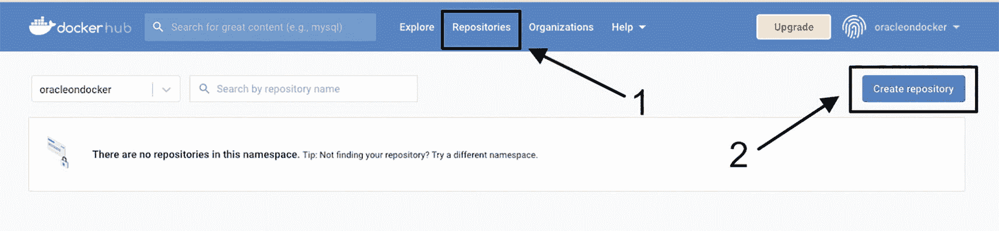

带有标记为 1 和 2 的 “Repositories” 选项卡和 “Create repository” 选项卡的预览页面截图。

图 16-5

在 Docker Hub 中创建新仓库。点击菜单中的“Repository”项（1），然后点击“Create repository”按钮（2）

这将带你进入图 16-6 中的屏幕，在这里你为新仓库命名，选择内容是公开还是私有，最后创建仓库。此示例来自个人订阅，我创建了一个名为 “database” 的私有仓库。

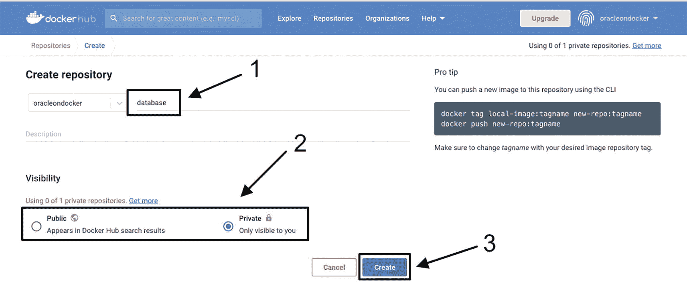

带有 3 个高亮并标记的选项卡的页面截图：1、数据库名称，2、公开和私有选项，以及 3、创建按钮。

图 16-6

要创建一个仓库，请为其命名（1），选择 Public 或 Private 可见性（2），然后点击“Create”按钮（3）

创建仓库后，你会进入图 16-7 中的仓库详情屏幕。在这里，你可以添加描述性信息并管理内容。

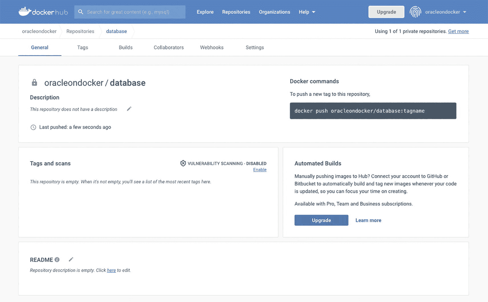

仓库详情屏幕的截图，用户可以添加描述性信息并管理内容。

图 16-7

Docker Hub 中新创建仓库的详情屏幕

点击仓库的“Settings”选项卡，如图 16-8 所示，你可以访问并启用漏洞扫描（在付费订阅中可用），以及将仓库的可见性从公开更改为私有，反之亦然的选项。

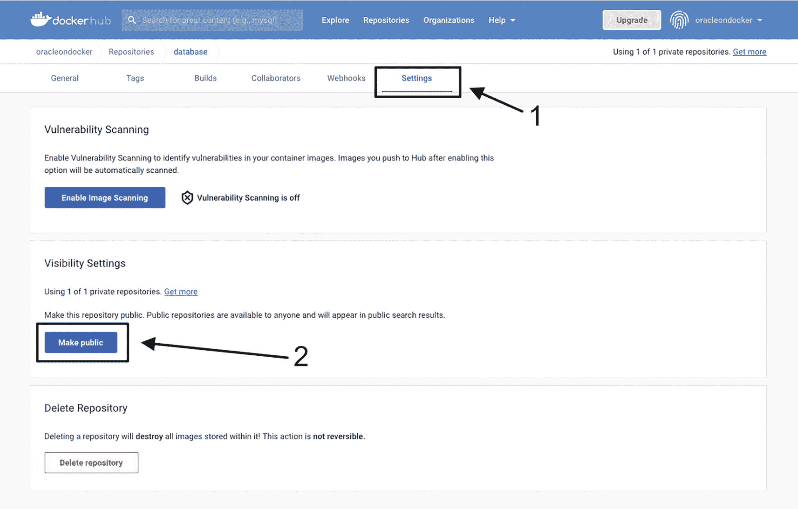

仓库设置选项卡的截图，用户可以访问并启用漏洞扫描（在付费订阅中可用），以及将仓库可见性从公开更改为私有，反之亦然的选项。

图 16-8

通过“Settings”选项管理仓库（1）。此屏幕用于管理仓库的可见性（2）并在付费订阅中启用镜像扫描

现在我有了一个仓库，我可以开始标记镜像并将其上传到 Docker Hub！

### 镜像管理

无论你使用的是 Docker Hub 还是其他公共或私有容器镜像仓库，上传和管理镜像的步骤都是相同的——登录并提供凭据，然后标记并推送镜像。

#### 仓库登录

通过命令行或 Docker Desktop 登录以访问你的仓库。在这里，我使用我之前创建的用户名和密码，通过 `docker login` 命令登录到我新创建的账户：

```
> docker login
Login with your Docker ID to push and pull images from Docker Hub. If you don't have
a Docker ID, head over to https://hub.docker.com to create one.
Username: oracleondocker
Password:
Login Succeeded
Logging in with your password grants your terminal complete access to your account.
For better security, log in with a limited-privilege personal access token. Learn
more at https://docs.docker.com/go/access-tokens/
```

一旦你登录到一个仓库，Docker 会保存你的凭据以供将来使用，并且没有需要重复登录的持久状态。^(⁸⁹) 但是，如果你登录了一个账户并希望删除存储的凭据，请使用 `docker logout`：

```
> docker logout
Removing login credentials for https://index.docker.io/v1/
```

登录后，我就可以标记和推送镜像了。

#### 标记镜像

第 14 章介绍了标签的组成部分以及如何使用 `docker tag` 为镜像分配命名空间、镜像或仓库名称和标签。既然我们已经创建了一个仓库账户，命名空间的目的应该更加明显——它是仓库账户的名称。

列出我系统上的镜像时，我看到一个从 Oracle 的 GitHub 仓库构建的镜像，标记为 `oracle/database:19.3.0-ee`，后面还有四个属于我的命名空间 `oraclesean`、保存在名为 `db` 的仓库中的数据库镜像：

```
> docker images
REPOSITORY              TAG           IMAGE ID       CREATED         SIZE
oracle/database         19.3.0-ee     bdbb8b83217b   3 days ago      6.68GB
oraclesean/db           11.2.0.4-EE   c1015174e910   6 months ago    6.72GB
oraclesean/db           12.1-EE       1db44c287b80   6 months ago    6.9GB
oraclesean/db           19.13.1-EE    27fdf297483b   5 months ago    7.81GB
oraclesean/db           21.5-EE       656c63dad153   5 months ago    8.69GB
```

在上一节的示例中，我在 Docker Hub 中创建了一个新用户和仓库，用户名为 `oracleondocker`，以及一个名为 `database` 的私有仓库。我想将其中一个镜像的副本推送到我的新账户，但我首先需要给它打标签。^(⁹⁰)

我可以使用以下任一命令分享 `oraclesean/db:11.2.0.4-EE` 镜像，通过现有标签或其镜像 ID 值来引用镜像：

```
docker tag oraclesean/db:11.2.0.4-EE oracleondocker/database:11.2.0.4-EE
docker tag c1015174e910 oracleondocker/database:11.2.0.4-EE
```

当我再次列出系统上的镜像时，我在第二行看到了新标签：

```
> docker tag oraclesean/db:11.2.0.4-EE oracleondocker/database:11.2.0.4-EE
> docker images
REPOSITORY               TAG           IMAGE ID       CREATED        SIZE
oracle/database          19.3.0-ee     bdbb8b83217b   3 days ago     6.68GB
oracleondocker/database  11.2.0.4-EE   c1015174e910   6 months ago   6.72GB
oraclesean/db            11.2.0.4-EE   c1015174e910   6 months ago   6.72GB
oraclesean/db            12.1-EE       1db44c287b80   6 months ago   6.9GB
oraclesean/db            19.13.1-EE    27fdf297483b   5 months ago   7.81GB
oraclesean/db            21.5-EE       656c63dad153   5 months ago   8.69GB
```

两个镜像的 Image ID 是相同的。只有标签不同。


### 推送镜像

标记镜像并不会实际将其添加到仓库。如果我导航到 Docker Hub 并搜索仓库，它仍然是空的。我需要上传，或*推送*，该镜像：

```
docker push oracleondocker/database:11.2.0.4-EE
```

推送意味着一个远程注册表，我不能为此操作使用镜像 ID——我必须指定标签。该标签告诉 Docker 我希望将已标记的镜像 `11.2.0.4-EE` 上传到我的 `oracleondocker` 命名空间，并将其放置在 `database` 仓库中。Docker 报告上传进度：

```
> docker push oracleondocker/database:11.2.0.4-EE
The push refers to repository [docker.io/oracleondocker/database]
5f70bf18a086: Pushed
d67ad3eaa615: Pushing [=>                                ]  40.07MB/1.094GB
fb92f0f7e7a1: Pushed
8741e0584bcd: Pushing [>                                ]  32.31MB/4.875GB
b9cd4d53c8a0: Pushed
0c7211f52f51: Pushed
59e93d414d42: Pushed
4fa651f55709: Pushing [>                                ]  2.146MB/619.3MB
4d82e938e5ad: Pushed
d7d3f0b240dc: Mounted from library/oraclelinux
```

注意它在推送多个项目——正如你可能猜到的，这些是镜像层。当不同的镜像共享层时，Docker 在上传（推送）和下载（拉取）操作期间通过跳过系统上已存在的任何层来节省时间和带宽！

完成的 `push` 命令报告镜像的摘要，这是一个唯一标识镜像的哈希值：

```
> docker push oracleondocker/database:11.2.0.4-EE
The push refers to repository [docker.io/oracleondocker/database]
5f70bf18a086: Pushed
d67ad3eaa615: Pushed
fb92f0f7e7a1: Pushed
8741e0584bcd: Pushed
b9cd4d53c8a0: Pushed
0c7211f52f51: Pushed
59e93d414d42: Pushed
4fa651f55709: Pushed
4d82e938e5ad: Pushed
d7d3f0b240dc: Mounted from library/oraclelinux
11.2.0.4-EE: digest: sha256:e94665072e69fa398181a9d852d193beee5ca3fedfe65c26c8684762b90c710f size: 2417
```

一旦镜像被推送到注册表，它在 Docker Hub 的控制台中就可见了，如图 16-9 所示。

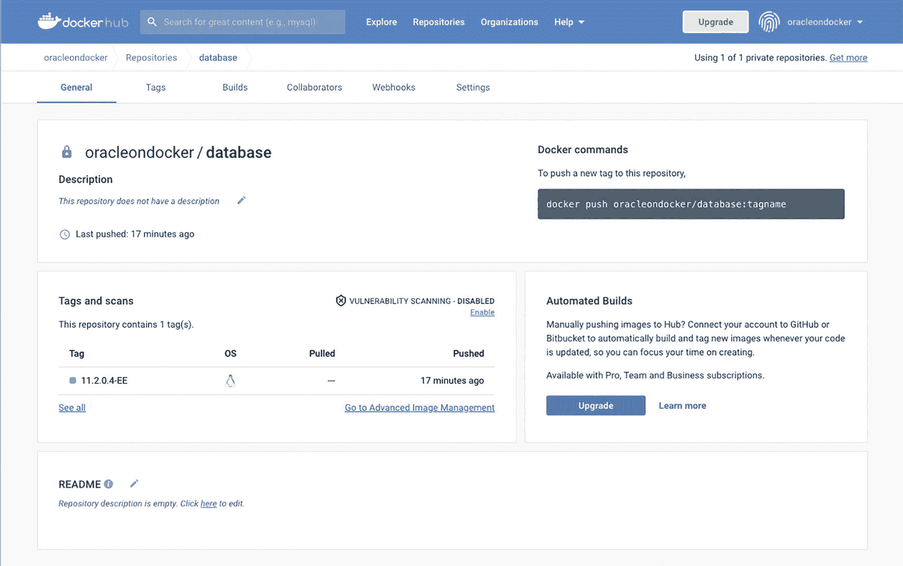

显示推送到注册表的镜像在 docker hub 控制台中可见的屏幕截图。

**图 16-9**

在成功将镜像推送到我的新账户后，该标签在在线的 Docker Hub 控制台中可见

如果我重新构建此镜像，无论是在本地还是在不同的仓库中，新版本都不会传播或替换 `oracleondocker/database:11.2.0.4-EE` 中的镜像。哈希（和镜像 ID）元数据为镜像提供了唯一标识，这对于跟踪跨多个位置存储和共享的镜像版本非常有用。

### CLI 注册表搜索

Docker 命令行界面，或 CLI，包含一个功能用于在注册表中搜索仓库和镜像：

```
docker search 
```

我发现 CLI 搜索功能有限。它默认显示 25 个结果，可扩展到 100，并且不具备列出标签的功能。因此，除非你知道所需的标签（或者你对“最新”版本感到满意），否则它可能没有帮助。

列表 16-2 显示了在 Docker Hub 中搜索 `oracle` 时的顶部结果。你会注意到输出按 Stars 排序，表示将该仓库标记为收藏的人数。还有一个“Official”列，正如你可能预期的，表示这是一个官方仓库。

```
> docker search oracle
NAME              DESCRIPTION                     STARS     OFFICIAL   AUTOMATED
oraclelinux        Official Docker builds of Oracle Linux.          928        [OK]
oracleinanutshell/oracle-xe-11g                                  237
gvenzl/oracle-xe  Oracle Database XE (21c, 18c, 11g) for every...   115
Listing 16-2
搜索 Docker Hub 中包含关键字“oracle”的仓库的截断输出
```

有一些选项可用于优化搜索结果：

*   `is-official=true:` 设置为 *true* 仅显示官方仓库。
*   `is-automated=true:` 仅显示自动化镜像构建。自动化构建是一项付费订阅功能，可根据源代码构建镜像，并自动推送到 Docker Hub。
*   `stars=n:` 将结果限制为至少拥有 *n* 个星标的仓库，其中 *n* 是一个整数值。

将这些选项与 `-f` 或 `--filter` 标志配对使用。例如，要在 Docker Hub 中搜索包含 oracle 关键字的官方镜像：

```
> docker search -f is-official=true oracle
NAME          DESCRIPTION                    STARS     OFFICIAL   AUTOMATED
oraclelinux   Official Docker builds of Oracle Linux.       928        [OK]
```

执行对至少拥有 100 个星标的镜像的搜索：

```
> docker search -f stars=100 oracle
NAME          DESCRIPTION                         STARS      OFFICIAL   AUTOMATED
oraclelinux   Official Docker builds of Oracle Linux.             928        [OK]
oracleinanutshell/oracle-xe-11g                                        237
gvenzl/oracle-xe  Oracle Database XE (21c, 18c, 11g) for every... 115
```

使用单独的 `-f` 标志应用多个搜索条件。这里，我搜索了至少拥有 100 个星标的官方仓库：

```
> docker search -f stars=100 -f is-official=true oracle
NAME          DESCRIPTION                     STARS    OFFICIAL   AUTOMATED
oraclelinux   Official Docker builds of Oracle Linux.       928        [OK]
```


#### 拉取镜像

在本书中，我们一直在*拉取*像 `alpine`、`ubuntu` 和 `oraclelinux` 这样的镜像，而没有使用命名空间（即之前 `docker push` 命令中 `/` 前面的部分）。这些都是 Docker Hub 中的**官方镜像**，存在于注册表的“根”目录下。它们不属于任何个人或组织拥有的命名空间。

然而，当我们说“拉取”了这些镜像时，我们并非显式地执行了拉取操作。对系统上尚不存在的镜像执行 `docker run` 会在后台自动执行 `docker pull`。也许你已经注意到了：

```
> docker run alpine
Unable to find image 'alpine:latest' locally
latest: Pulling from library/alpine
213ec9aee27d: Pull complete
Digest: sha256:bc41182d7ef5ffc53a40b044e725193bc10142a1243f395ee852a8d9730fc2ad
Status: Downloaded newer image for alpine:latest
```

从公共仓库拉取或运行镜像，需要使用与之前 `docker push` 示例相同的完全限定的注册表格式——一个命名空间、一个注册表或镜像名称，以及一个标签（如果存在的话）。在图 16-10 中，我浏览了 Docker Hub 并找到了一个 Bitnami 的已验证发布者镜像 `bitnami/mariadb`。

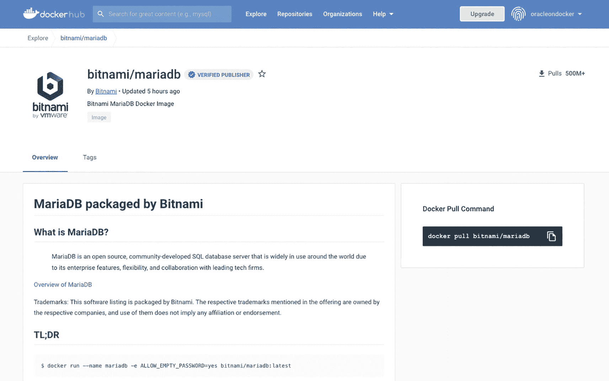

**图 16-10: Bitnami MariaDB 发行版的主仓库页面**

MariaDB 是一个流行的 MySQL 分支，因此可以推断也应该有一个官方镜像。如果我没有任何命名空间地执行 `docker pull mariadb`，会得到这样一个结果：

```
> docker pull mariadb
Using default tag: latest
latest: Pulling from library/mariadb
2b55860d4c66: Pull complete
4bf944e49ffa: Pull complete
020ff2b6bb0b: Pull complete
977397ae9bc6: Pull complete
b361cf449d40: Pull complete
21d261950157: Pull complete
296a47dd9435: Pull complete
bbe841bf5cfe: Pull complete
758db05dd921: Pull complete
9c2c0a21c9e6: Pull complete
4bc311b9359a: Pull complete
Digest: sha256:05b53c3f7ebf1884f37fe9efd02da0b7faa0d03e86d724863f3591f963de632c
Status: Downloaded newer image for mariadb:latest
docker.io/library/mariadb:latest
```

但这是 Bitnami 的版本吗？不是。要获取 Bitnami 版本，我需要添加 Bitnami 命名空间：

```
> docker pull bitnami/mariadb
Using default tag: latest
latest: Pulling from bitnami/mariadb
1d8866550bdd: Pull complete
cfd1823a275f: Pull complete
Digest: sha256:320745f11755f950a6ffa80a7e16dca108b3fe6df76873e2ec22fa3900fecb20
Status: Downloaded newer image for bitnami/mariadb:latest
docker.io/bitnami/mariadb:latest
```

在这两种情况下，Docker 都为我获取了“latest”版本，因为我没有指定标签。如果我查看图 16-11 中 Bitnami 镜像的“标签”部分，会看到各种各样的标签。要获取“latest”以外的版本，我必须使用其标签，这里是 `10.5.17`：

```
> docker pull bitnami/mariadb:10.5.17
10.5.17: Pulling from bitnami/mariadb
1d8866550bdd: Already exists
0f5b0c3c18cf: Pull complete
Digest: sha256:ec6bb285c67d5b66a6ee1fca667e9d73906d767b02cc5dbb2bff1159d97e7fbe
Status: Downloaded newer image for bitnami/mariadb:10.5.17
docker.io/bitnami/mariadb:10.5.17
```

注意 Docker 没有下载镜像的第一层 `1d8866550bdd`。它与“latest”镜像的第一层完全相同，这表明它很可能是许多 Bitnami MariaDB 镜像的基础底层。特定版本的内容仅限于第二层。

在这两个 MariaDB 镜像中，还有一点值得注意。Bitnami 镜像只有两层，而官方镜像有十一层。这反映了它们构建方式的差异。官方的、受信任的 MariaDB 镜像将构建过程中的每一步都暴露为层。Bitnami 镜像则减少了层内容以提高安全性。你可以自己拉取这些镜像并运行以下 `docker history` 命令（`--no-trunc` 标志可防止 Docker 截断原始 Dockerfile 的输出）：

```
docker image history --no-trunc bitnami/mariadb
docker image history --no-trunc mariadb
```

对比输出，查找诸如默认密码和配置等攻击者可能利用的信息。教训是什么？仅仅因为镜像是“官方”或“受信任”的，并不一定意味着它们适合生产环境！

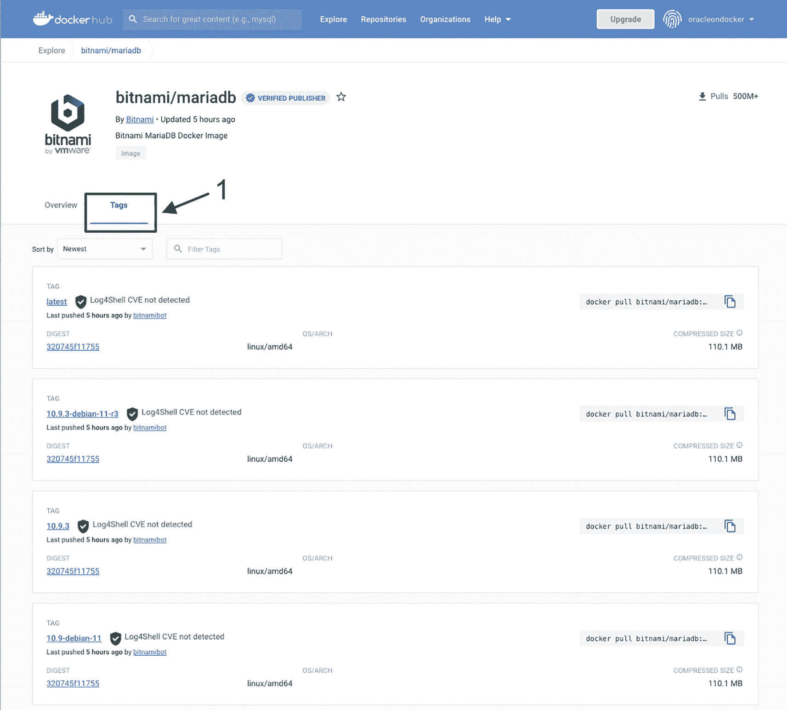

**图 16-11: Bitnami MariaDB 仓库包含多个不同版本的镜像，每个版本通过其标签标识**

如果我在我的系统上运行 `docker images`，会看到这三个镜像都不同：

```
REPOSITORY       TAG           IMAGE ID       CREATED         SIZE
bitnami/mariadb  10.5.17       0470be367c25   9 hours ago     341MB
bitnami/mariadb  latest        ca73fbad9ff3   5 hours ago     344MB
mariadb          latest        11aee66fdc31   6 days ago      384MB
```

通过引用 Bitnami 命名空间下的 MariaDB 镜像并使用离散版本的标签，我获得了稍有不同的 MariaDB 版本。

拉取私有镜像遵循相同的模式，但有一个额外要求：用户必须登录到正确的命名空间（或拥有授予对该仓库访问权限的安全令牌）。


### Oracle Container Registry

Oracle 曾将官方数据库镜像存放在 Docker Hub 上，但出于之前提到的许可问题而将其移除。任何人都可以在不接受 Oracle 许可协议的情况下下载其内容。

然而，Oracle 数据库镜像仍然可在 *Oracle 容器注册表* 中获取，地址为 [`https://container-registry.oracle.com`](https://container-registry.oracle.com)。在访问其镜像之前，您必须先使用 My Oracle Support 凭据登录并接受标准条款与限制。好消息是，一旦您接受了条款，注册表会识别该状态并允许您在未来无需“反复提醒”即可访问您的账户。

从 Oracle 的注册表拉取镜像前，请使用注册表地址 `container-registry.oracle.com` 从终端会话登录：

```bash
> docker login container-registry.oracle.com
Authenticating with existing credentials...
Login Succeeded
```

登录后，您将可以访问注册表，并能够像在 Docker Hub 上那样搜索和拉取镜像。不幸的是，命令行的搜索功能比较难用。登录容器注册表后，如果我搜索匹配 "oracle" 的官方镜像，结果看起来和之前没什么不同：

```bash
> docker search -f is-official=true oracle
INDEX               NAME                DESCRIPTION                       STARS               OFFICIAL            AUTOMATED
docker.io           oraclelinux         Official Docker builds of Oracle Linux.   928                 [OK]
```

然而，如果我将搜索字符串更改为容器注册表的命名空间，我就能得到预期的结果。在此示例中，我将搜索范围缩小到命名空间内的数据库注册表 `container-registry.oracle.com/database`：

```bash
> docker search -f is-official=true container-registry.oracle.com/database
INDEX   NAME   DESCRIPTION             STARS    OFFICIAL   AUTOMATED
oracle.com   database/enterprise  Oracle Database Enterprise Edition  0 [OK]
oracle.com   database/express     Oracle Database Express Edition     0 [OK]
oracle.com   database/gsm         Oracle Global Service Manager       0 [OK]
oracle.com   database/instantclient Oracle Instant Client             0 [OK]
oracle.com   database/observability-exporter   Oracle Database Observability Exporter (Metr...                                        0 [OK]
oracle.com   database/operator   This image is part of and for use with the O...                             0 [OK]
oracle.com   database/ords       Oracle REST Data Services (ORDS) with Applic...                            0 [OK]
oracle.com   database/otmm       Oracle Transaction Manager for Microservice                         0 [OK]
oracle.com   database/rac        Oracle Real Application Clusters     0 [OK]
oracle.com   database/sqlcl      Oracle SQLDeveloper Command Line (SQLcl)                              0 [OK]
oracle.com   database/standard   Oracle Database Standard Edition  2  0 [OK]
```

输出显示了标准版和企业版数据库镜像的选项，但未提供它们如何被标记的详细信息。为此，最好返回到图 16-12 中的容器注册表页面。

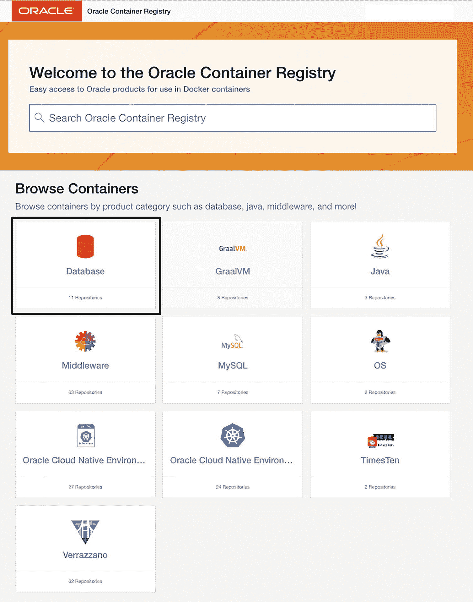

Oracle 容器注册表页面的屏幕截图包含一个功能，即浏览容器，用户可以按产品类别（如数据库、Java、中间件等）浏览容器。

**图 16-12**

Oracle 容器注册表主页显示了可用的仓库。左上角的数据库仓库被高亮显示。

点击数据库仓库后，您将看到图 16-13 中其子仓库的列表，这与之前执行的 `docker search` 输出相匹配。

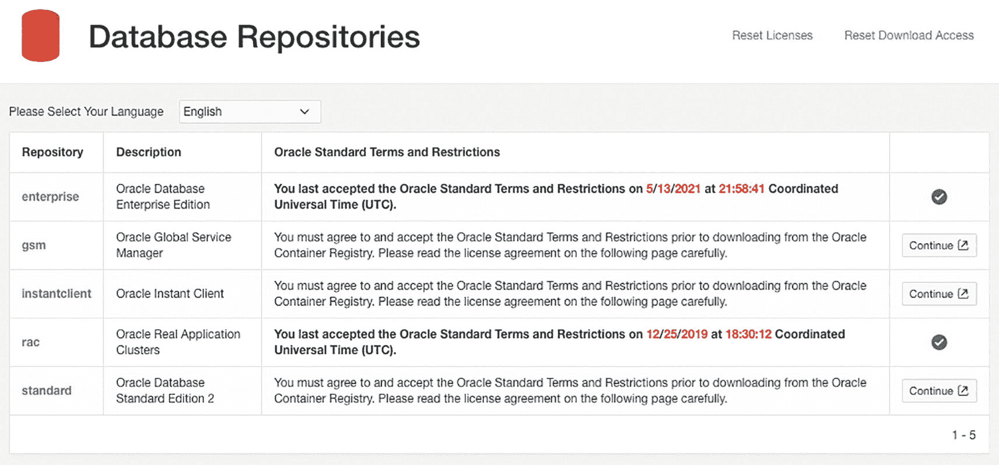

数据库仓库的屏幕截图包含仓库类型、描述以及 Oracle 标准条款和限制等数据。

**图 16-13**

Oracle 容器注册表中的前五个数据库仓库。请注意最右边的列，绿色的勾选标记表示用户是否接受了许可协议。

选择 “enterprise” 仓库将带我进入图 16-14 中的仓库页面。在这里，您会找到有关使用该镜像的信息，以及在最右侧的 `docker pull` 命令。但是，这是用于 `latest` 镜像标签的命令。要查看所有可用的标签，请滚动到页面底部，如图 16-15 所示。

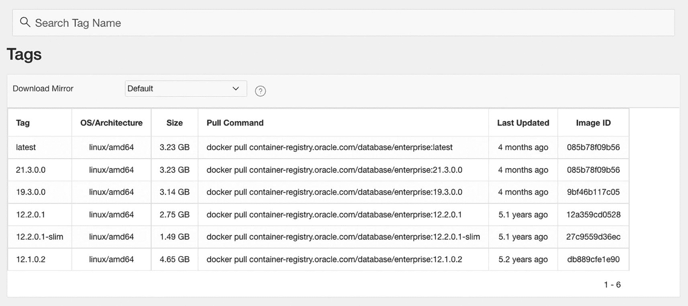

标签选项卡的屏幕截图列出了所有可用的标签。

**图 16-15**

每个仓库页面的底部是所有可用标签的摘要，每个标签都列出了镜像信息以及相应的 `docker pull` 命令。

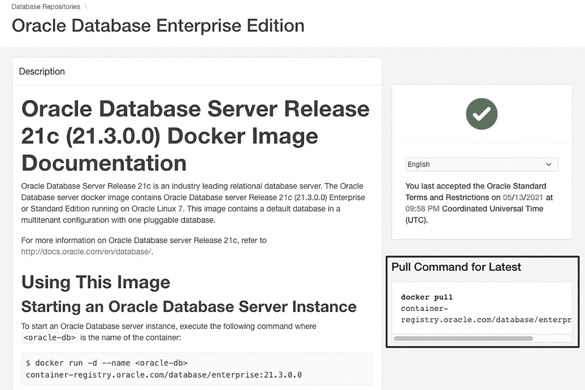

Oracle Database Server Release 21c Docker 镜像文档的屏幕截图提供了关于如何使用该镜像以及一个 `docker pull` 命令的信息。

**图 16-14**

企业版仓库页面包含使用镜像的说明，以及右侧高亮的用于下载最新版本镜像的 `docker pull` 命令。

Oracle 容器注册表中的镜像是用于在 Docker 中运行 Oracle 数据库的现成解决方案。虽然方便，但它们缺乏通过构建自己的镜像所提供的定制化能力。

### 总结

在投入了所有努力构建完美的数据库镜像之后，不分享它真是太可惜了！Docker Hub 是一个免费且流行的解决方案，可以做到这一点。但请记住，公开分享包含 Oracle 数据库软件的镜像是违反许可协议的。Docker Hub 免费的个人层级允许您创建一个私有仓库用于此目的。

请记住，Docker 以提升的权限集运行容器。请谨慎对待从公共仓库下载的内容，尽可能坚持使用可信内容。如果必须使用不受信任的镜像，请利用 Docker Hub 的免费扫描服务。

Docker Hub 并不是您唯一的仓库选择。包括 Oracle 在内的云供应商提供易于设置且通常免费的容器管理服务。组织可以部署与现有开发工作流集成的自有仓库。

脚注 1   2   3   4


## 17. 结论

在本书的第一部分，你探索了容器的工作原理，以及如何在 Docker 中运行 Oracle 数据库。你学习了将重要的数据库内容——数据文件和配置——持久化存储在容器限制之外的方法。你也熟练掌握了容器网络的概念，能够将运行在主机上的客户端应用程序（如 SQL Developer）连接到容器内的数据库。你还可以利用容器网络在运行容器的数据库之间进行通信。

第二部分涵盖了镜像及其构建配方：Dockerfile。你发现了如何定制 Oracle 容器仓库中提供的标准镜像，并深入了解了扩展 Dockerfile 以满足你需求的技术。当然，并非每个镜像一开始都能顺利运行！幸运的是，我们介绍了多种故障排除镜像和容器的方法与途径。一旦一切运行顺畅，你便学会了如何在仓库中添加和管理镜像。

我初次接触在容器中运行 Oracle 数据库的体验并不积极。我当时确信这是徒劳无功之事，注定会惨淡收场。此后的几年里，我亲身见证了容器的力量与潜力。它们已成为我日常工作中不可或缺的一部分。在本书中，我试图记录我对 Linux 容器背后技术的欣赏，并与你分享我在 Docker 体验中希望更早了解的那些事情。我真诚地希望你觉得本书对你有所帮助，并希望它能激励你开启或深化你的 Docker 之旅！

