# 第三部分 附录

#### 安装 Docker Desktop

#### 安装 Docker Desktop

Docker Desktop 可从 [`www.docker.com`](http://www.docker.com) 免费下载。Linux 用户可以安装 Docker Desktop 或 Docker Engine（运行 Docker 容器的原生环境）。

### Windows 10 和 11

在幕后，Windows 上的 Docker Desktop 在 Hyper-V 虚拟机中运行 Linux。早期版本的 Docker Desktop 因 Hyper-V 与 VirtualBox 之间的冲突而声名狼藉，性能也常常不尽如人意。

`Windows Subsystem for Linux version 2`，或称 `WSL 2`^(⁹¹)，在 Windows 10 上可用，它标志着 Docker Desktop 在 Windows 上的一次重大改进。在 WSL 2 下运行的 Docker Desktop 拥有改进的系统资源管理、更好的性能以及与主机操作系统更强大的集成。

WSL 在 Windows 操作系统内部提供了功能完整的 Linux 体验。本书中使用的命令示例在 WSL 环境中的运行方式，与在 Linux 或 Mac 系统中完全相同。

#### 设置 Windows Subsystem for Linux

按照 Microsoft 的说明在 [`https://docs.microsoft.com/en-us/windows/wsl/install`](https://docs.microsoft.com/en-us/windows/wsl/install) 设置 Windows Subsystem for Linux。在我的系统（Windows 10）上，我以管理员身份打开一个 PowerShell 会话，然后运行 `wsl --install`，如图 A-1 所示。这会执行 WSL 的默认安装并安装 Ubuntu Linux。命令完成后，请重启计算机。

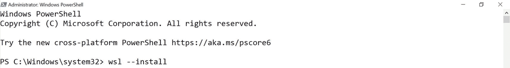

一个管理员 - windows powershell 选项卡的截图，其中包含用于安装 WSL 2 的命令。

图 A-1

从以管理员身份运行的 PowerShell 会话中安装 WSL 2

默认情况下，WSL 会下载 Ubuntu Linux 并需要重启，如图 A-2 所示。重启计算机以完成 WSL 的设置并开始 Linux 安装。

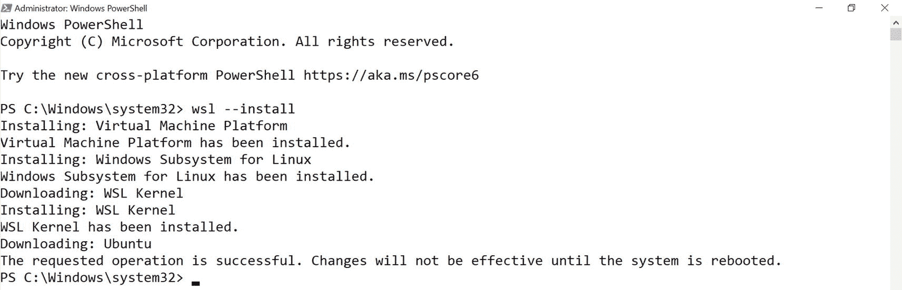

一个管理员 - windows powershell 选项卡的截图，显示了 WSL 2 安装后的信息。

图 A-2

WSL 安装完成后，重启计算机

#### 配置和更新 Linux

计算机重启后，WSL 将安装 Linux 发行版。这需要几分钟时间。安装完成后，你需要创建一个 Linux 用户，如图 A-3 所示。我在我的系统上使用了 `docker` 作为用户名。

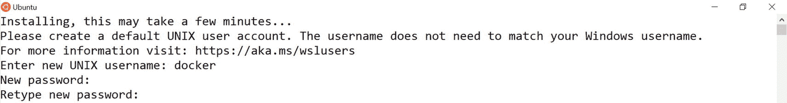

安装完成后出现的选项卡截图。安装后，用户必须创建一个 linux 用户。

图 A-3

安装完成后，创建一个要在 Linux 子系统中使用的用户

务必更新你的 Linux 发行版。对于 Ubuntu 系统，在终端窗口中运行以下命令：

```
sudo apt update && sudo apt upgrade
```

现在也是从 Windows 应用商店安装 Windows Terminal 的绝佳时机。有关安装 Windows Terminal 的详细信息，请参阅“终端环境”部分。

#### 安装 Docker Desktop

WSL 设置完成后，请参考 Docker 的安装指南 [`https://docs.microsoft.com/en-us/windows/wsl/install-manual`](https://docs.microsoft.com/en-us/windows/wsl/install-manual) 并按照最新的说明操作，完成所有先决条件，然后从 [`www.docker.com`](http://www.docker.com) 下载并安装 Docker Desktop。

双击安装文件以打开安装向导。请确保选中“`使用 WSL 2 代替 Hyper-V（推荐）`”的复选框，如图 A-4 所示。

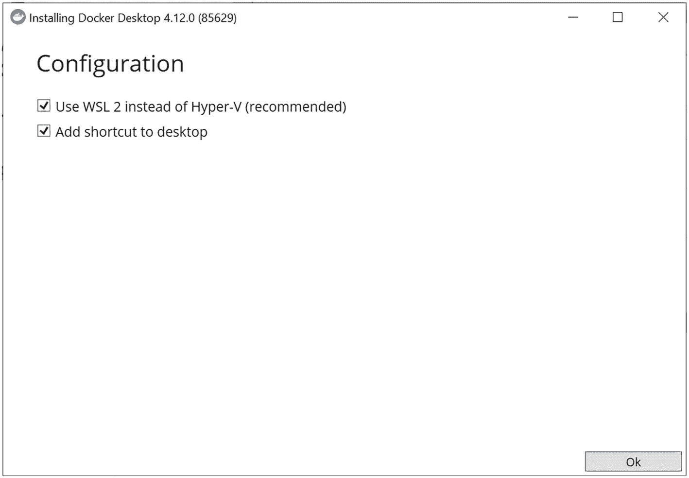

一个安装 docker desktop 选项卡的截图，显示了“使用 WSL 2 代替 Hyper-V（推荐）”和“添加快捷方式到桌面”选项框中的标记。

图 A-4

在 Docker Desktop 安装向导中，标记“使用 WSL 2 代替 Hyper-V”选项

导航到开始菜单并从应用程序列表中选择 Docker Desktop。接受许可协议后，Docker Desktop 将启动并打开一个简短的教程。

#### 配置 Docker Desktop

单击右上角的齿轮图标进入“设置”菜单，访问如图 A-5 所示的“常规”设置。确保选中“使用基于 WSL 2 的引擎”复选框。

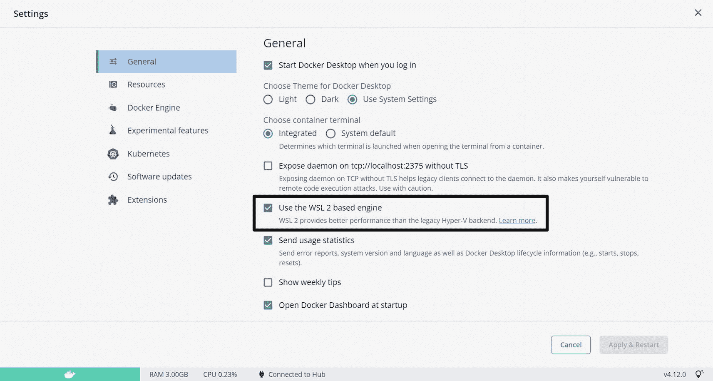

一个 docker desktop 常规设置面板的截图，高亮显示了常规设置中的“使用基于 WSL 2 的引擎”选项。

图 A-5

在 Docker Desktop 的“常规”设置面板下，勾选“使用基于 WSL 2 的引擎”选项

接下来，单击“资源”选项并选择“WSL 集成”。确认“启用与默认 WSL 发行版的集成”已启用，如图 A-6 所示。对于你将在 Docker 中使用的、出现在“启用与其他发行版的集成”部分下的发行版，将滑块设置为“开”。如果右下角的“应用并重启”按钮高亮显示，请单击它以提交你的更改。

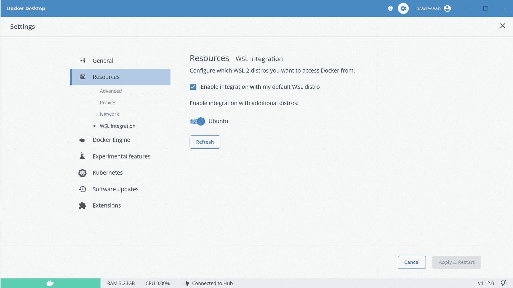

一个 docker desktop 设置面板的截图，显示了“资源”设置中“启用与默认 WSL 发行版的集成”选项框的标记。

图 A-6

确认默认发行版的 WSL 集成已开启，并且为任何其他需要 Docker Desktop 集成的发行版启用该功能


#### 设置 WSL 资源

在 WSL 下分配给 Docker Desktop 的默认资源通常是足够的。如果您遇到问题并需要调整 CPU、内存或其他设置，可以通过用户主目录中的 `.wslconfig` 文件（通常为 `C:\Users\<用户名>\.wslconfig`）进行配置。

在编辑或添加 `.wslconfig` 文件之前，请以管理员身份从终端会话中停止 WSL：

```
wsl --shutdown
```

然后编辑该文件：

```
notepad "$env:USERPROFILE/.wslconfig"
```

清单 A-1 展示了一个用于限制 WSL 可用内存和处理器的 `.wslconfig` 文件示例。有关 `.wslconfig` 文件中可用选项的完整信息，请参阅 [*https://docs.microsoft.com/en-us/windows/wsl/wsl-config*](https://docs.microsoft.com/en-us/windows/wsl/wsl-config)。

```
[wsl2]
processors=4 # 为 WSL 限制为 4 个处理器。
memory=8GB   # 将 WSL 限制为 8GB 内存。
清单 A-1
用于限制 Windows Subsystem for Linux 的 CPU 和内存消耗的 .wslconfig 文件示例
```

### Mac (Intel)

在为 Mac 安装 Docker Desktop 之前，请审阅并完成 [*https://docs.docker.com/desktop/install/mac-install/*](https://docs.docker.com/desktop/install/mac-install/) 上的先决条件，然后从 [`www.docker.com`](http://www.docker.com) 下载 Docker Desktop。导航到下载目录并双击 `Docker.dmg` 文件以打开图 A-7 中所示的安装程序。将 `Docker.app` 文件拖放到 *Applications* 文件夹中。

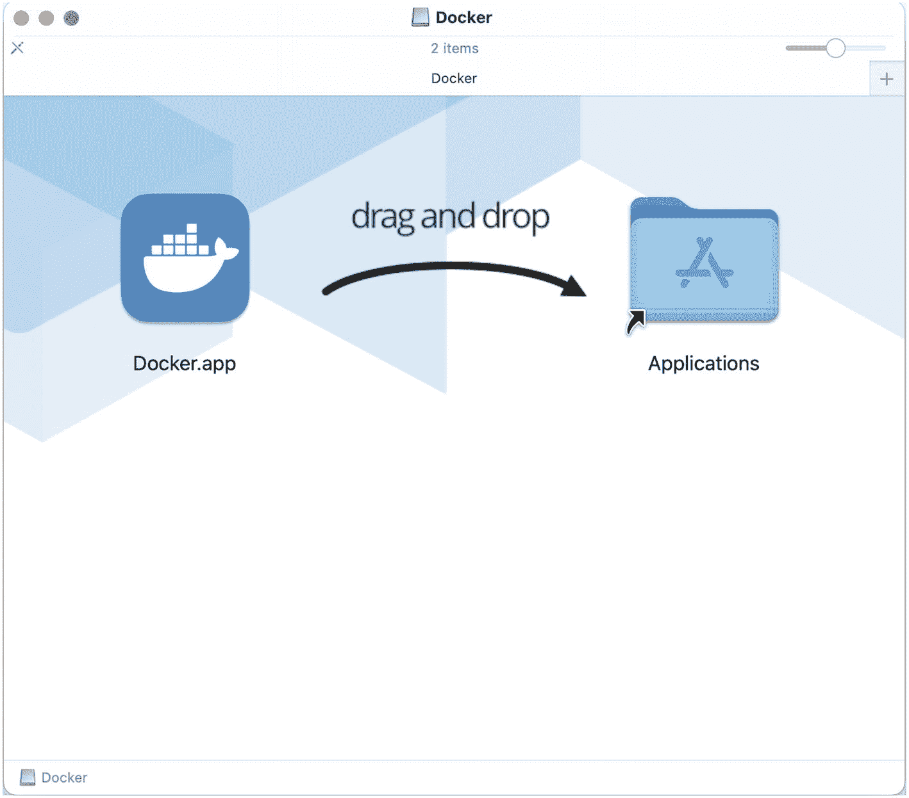

一张 Docker Desktop 应用程序文件的屏幕截图，指示用户将 Docker 应用程序文件拖放到 applications 文件夹中。

图 A-7

将 `Docker.app` 文件拖放到 Applications 文件夹

文件复制完成后，导航到 *Applications* 文件夹，滚动到 `Docker.app` 应用程序，然后双击启动 Docker Desktop。接受许可条款并继续到 Docker Desktop 的主屏幕。

#### 配置资源

单击右上角的齿轮图标，或同时按下 Command 和逗号键（⌘ + ,）以访问 Docker Desktop 的设置和首选项。图 A-8 中所示的通用首选项窗格中的默认值是合适的。

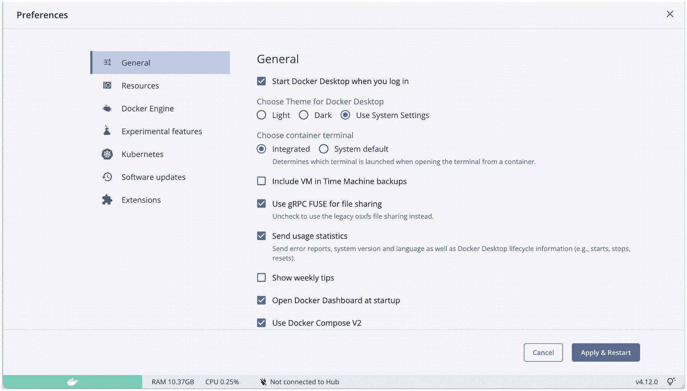

默认通用首选项面板的屏幕截图。

图 A-8

Mac 的默认通用首选项对于运行 Oracle 容器是可以接受的

接下来，单击左侧菜单中的 *Resources* 选项卡，并选择 *Advanced*，如图 A-9 所示。要运行 Oracle 数据库容器，请至少分配 4GB 内存。Oracle 是内存密集型应用，您能分配的内存越多，其性能就越好。CPU 的情况也是如此。磁盘空间 10–20GB 是一个合理的起点。如果需要，您以后可以无害地增加 Docker Desktop 的磁盘空间。但是，缩小磁盘空间会删除所有镜像、容器和卷。

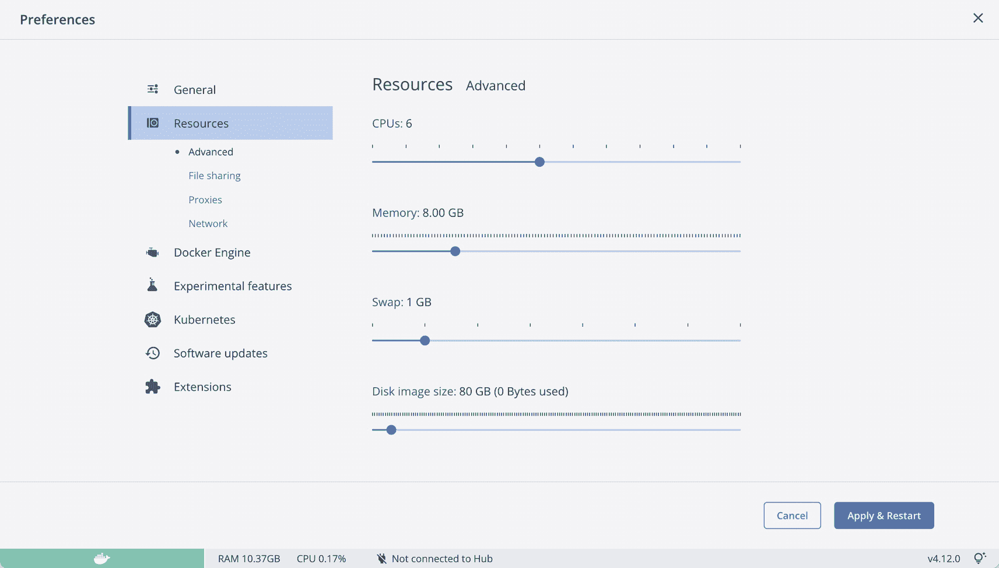

一个首选项面板的屏幕截图，左侧菜单中显示了标记的资源选项。它显示所选资源类型为高级。

图 A-9

为 Docker 环境配置资源

### Mac (Apple 芯片)

截至本文撰写时，架构差异导致 Oracle 数据库镜像无法在配备 Apple 芯片的 Mac 上的 Docker 中运行。社区正在积极解决此问题，并已取得有希望的进展。

### Linux 的 Docker Desktop 和 Docker Engine

请参阅 Docker 网站以获取有关为不同 Linux 发行版安装 Docker Desktop 和 Docker Engine 的信息。Docker Desktop 的说明位于 [*https://docs.docker.com/desktop/install/linux-install*](https://docs.docker.com/desktop/install/linux-install)，而 Docker Engine 的说明位于 [*https://docs.docker.com/engine/install*](https://docs.docker.com/engine/install)。

## 终端环境

与 Docker 的大多数交互都发生在命令行或 Shell 中。您需要一个 *终端程序* 来访问主机上的命令行，而每个操作系统上都有很多选择。

### Windows

Windows 操作系统包含 PowerShell 和熟悉的 Windows 命令提示符。来自 Microsoft 的第三个选项，Windows Terminal，结合了这两个工具，并增加了对 Windows Subsystem for Linux 的集成。我最近开始使用它，非常满意——它现在是我在 Windows 系统上最喜欢的新 Shell，取代了 PuTTY 和 MobaXterm！本书中的所有 Windows Shell 示例都是从 Windows Terminal 截取的。

本书中给出的命令行示例在通过 Windows Terminal 访问的 Linux Shell 中可以无缝运行。命令提示符、PowerShell、PuTTY 和 MobaXterm 等工具解释环境变量的方式，以及本地配置的差异，可能会导致异常或错误结果。如果您正在使用这些应用程序之一并遇到任何困难，请尝试在运行于 WSL Linux 环境上的 Windows Terminal Shell 中再次操作。

要安装 Windows Terminal，请打开 Windows 开始菜单并选择 Microsoft Store 应用。搜索并安装 Windows Terminal，如图 A-10 所示。

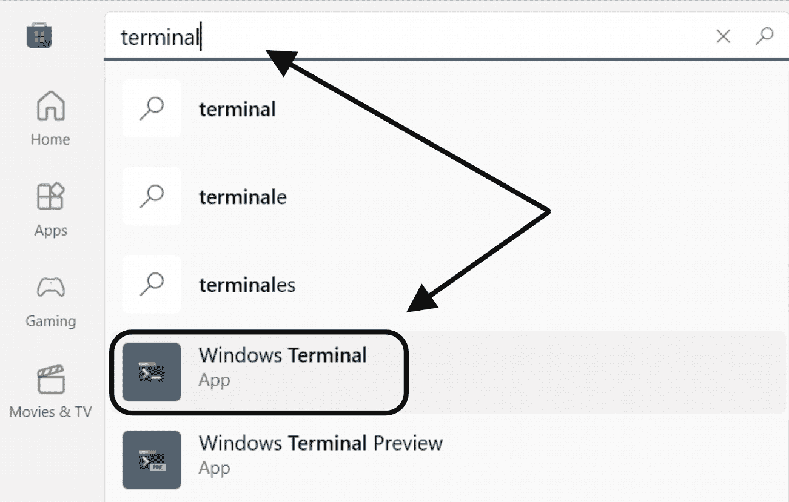

Windows 开始菜单的屏幕截图，显示了搜索选项，文本为 "terminal"，并标记了 Windows Terminal 应用程序。

图 A-10

在 Windows 应用商店中搜索 "terminal" 并安装 Windows Terminal 应用程序

这会将 Windows Terminal 添加到系统中。转到开始菜单并打开新的 Terminal 应用程序。图 A-11 中的终端会话显示了打开新标签页的选项。单击标签页右侧的“加号”图标将打开一个新的默认会话。单击向下箭头会打开一个对话框，其中包含打开命令提示符、PowerShell 会话、Linux（Ubuntu）会话或 Azure Cloud Shell 的选项。

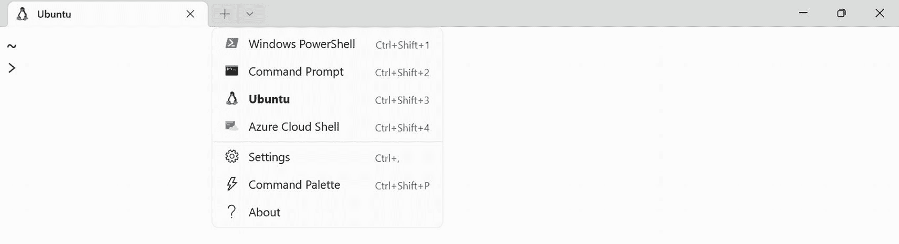

一个 Windows 终端的屏幕截图，显示了打开新标签页的选项。

图 A-11

Windows Terminal 支持多种 Shell 类型，并自动集成在 Windows Subsystem for Linux 下运行的任何虚拟环境

Ubuntu 选项得益于 Windows Terminal 与 Windows Subsystem for Linux 的集成。它会检测在 WSL 中运行的虚拟环境，并为每个环境包含 Shell 选项。图 A-12 展示了不同 Shell 环境的示例：Ubuntu Linux、命令提示符和 PowerShell。

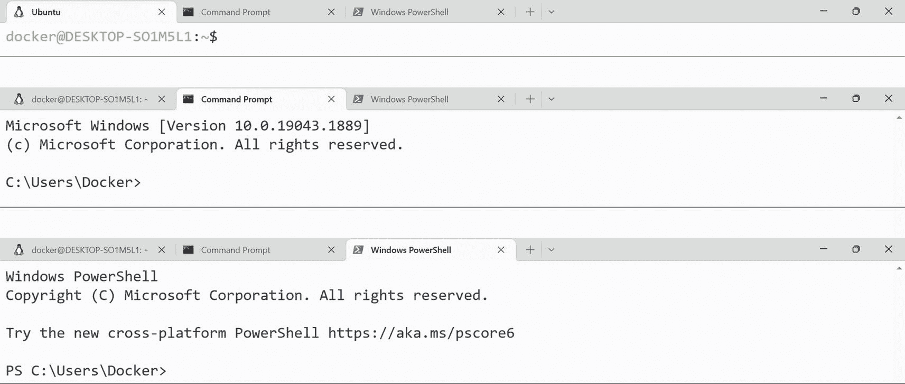

一个图像预览的屏幕截图，显示了不同 Shell 环境的示例，即 Ubuntu Linux、命令提示符和 PowerShell。

图 A-12

作为标签页在 Windows Terminal 中运行的 Ubuntu Linux Shell（顶部）、Windows 命令提示符（中部）和 PowerShell 会话（底部）的示例


### Mac 终端

OS-X 操作系统内置了终端应用程序。请导航至系统的 `/Applications/Utilities` 目录，然后双击图 A-13 中所示的终端应用。


截图显示以下应用：AirPort 实用工具、音频 MIDI 设置、蓝牙文件交换、ColorSync 实用工具、磁盘工具、Grapher、钥匙串访问、迁移助理、系统信息、终端、旁白实用工具和 XQuartz。

**图 A-13**

终端应用程序内置于 OS-X 系统的 `/Applications/Utilities` 文件夹中。

终端是一个原生的 Linux Shell。安装 Docker Desktop 会将 `docker` 命令添加到用户的 Shell 路径中，所有 Docker 功能都可以在命令行中使用。

## Docker Desktop 功能

用户可以通过 Docker Desktop 检查和管理容器、镜像和卷，并可以创建新的卷和容器。

### 容器管理

容器菜单列出了系统上的所有容器，并包含用于启动、停止、暂停和删除容器的控件。用户还可以导航到单个容器，访问日志、检查环境和容器统计信息，并进入容器内部的命令行。

#### 容器终端

Docker 最近更新了 Docker Desktop，添加了一个集成的命令行 Shell。您可以通过 Docker Desktop 访问主机上任何正在运行的容器的 CLI，并且在任何操作系统上的结果都相同。

要使用集成 Shell，首先确保其已启用。点击屏幕右上角（如图 A-14 所示）的齿轮图标，打开 Docker Desktop 的设置菜单。然后，确保“选择容器终端”下的“集成”选项被勾选。

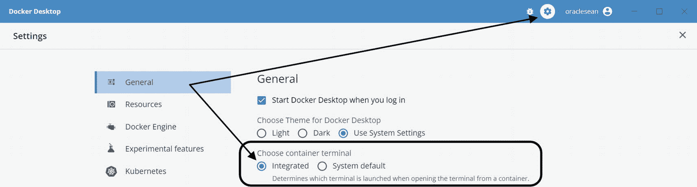
设置面板的截图，齿轮图标位于屏幕右上角，“选择容器终端”下选中了“集成”选项。

**图 A-14**

选择 Docker Desktop 右上角的齿轮图标以访问设置页面。然后，在常规选项窗格中，选择“集成”作为容器终端。

从 Docker Desktop 中，选择左侧菜单中的“容器”以查看系统上正在运行的容器列表。选择一个容器；然后点击最右侧的三个垂直点以访问“显示容器操作”选项。从出现的下拉框中，选择“在终端中打开”，如图 A-15 所示。

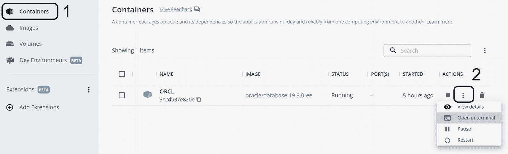
Docker Desktop 的截图高亮显示了左侧菜单中的容器选项，以及显示容器操作选项下的在终端中打开。

**图 A-15**

要访问容器的 Shell，请选择容器菜单 (1)，点击三个点访问“显示容器操作”下拉菜单 (2)，然后选择“在终端中打开”选项。

这将在容器上打开一个 `/bin/sh` 终端会话（不是 `/bin/bash`），如图 A-16 所示。终端窗口功能齐全，支持复制/粘贴和滚动功能。它也是持久化的——如果您离开 CLI 会话，它会在后台保持活动状态。可以通过容器页面右上角的 CLI 标签页重新访问它。

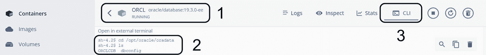
Docker Desktop 中容器页面的截图有 3 个标签：1、Oracle 数据库，2、在外部终端中打开，和 3、CLI。

**图 A-16**

Docker Desktop 中的容器页面在标题栏显示容器 (1)，并显示命令行环境 (2)。会话是持久的——如果您离开窗口，可以通过右上角的 CLI 标签页重新访问 (3)。

#### 容器日志和统计信息

从容器视图中的日志标签页查看容器日志，如图 A-17 所示。

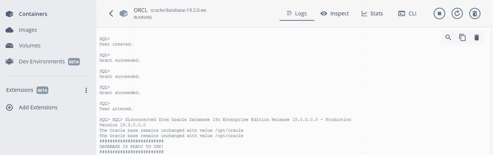
容器视图中的日志标签页截图显示了容器日志。

**图 A-17**

日志标签页显示容器的日志输出。

#### 容器统计信息

图 A-18 中的统计信息标签页显示了容器当前的 CPU、内存、I/O 和网络使用情况。

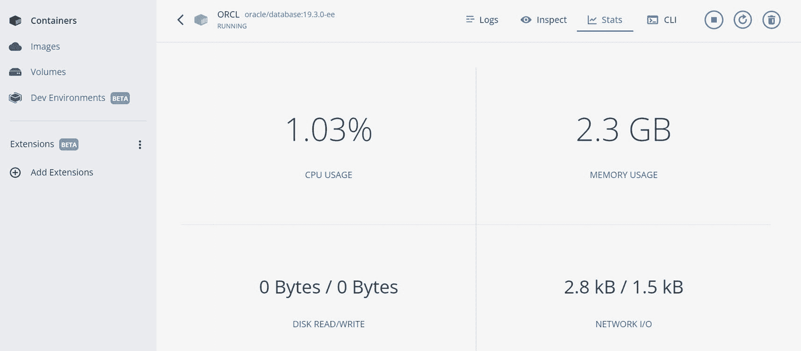
统计信息标签页的截图显示了容器当前的 CPU、内存、输入输出和网络使用情况。

**图 A-18**

来自统计信息标签页的容器资源消耗情况。

### 镜像管理

Docker Desktop 中的镜像页面列出了系统上的镜像，并提供了一个交互式服务，用于从镜像创建新容器。

要从镜像创建新容器，请将鼠标悬停在镜像上，此时会显示图 A-19 中的 `运行` 选项。点击 `运行` 按钮，这将启动容器创建对话框。

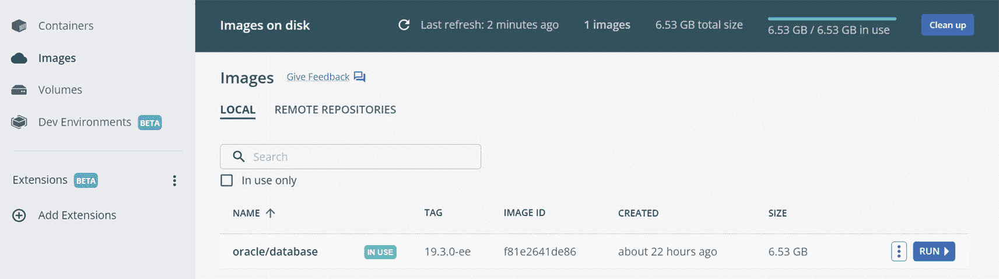
将鼠标悬停在镜像上的截图显示了用于从镜像创建新容器的运行选项。

**图 A-19**

将鼠标悬停在镜像上以访问创建新容器的选项。

这将打开图 A-20 中的对话框。点击右侧的箭头展开“可选设置”。

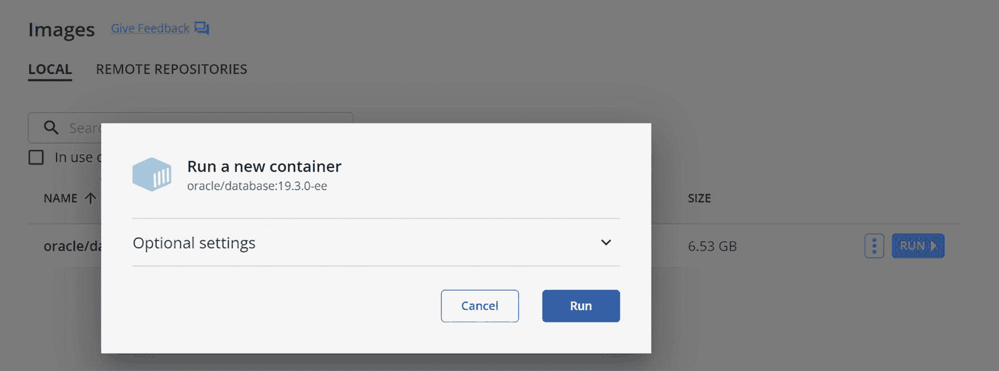
对话框截图显示了可选设置，以及取消和运行选项。

**图 A-20**

容器创建对话框。

命令行中的一些选项也出现在图 A-21 所示的对话框中，包括分配名称、挂载卷和设置环境变量。但是，由于镜像在其元数据中没有暴露端口，用户没有映射端口的选项。

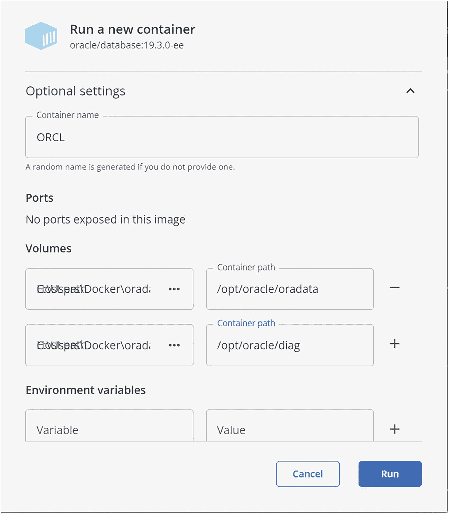
运行新容器面板的截图列出了可选设置的选项，例如容器名称、端口、卷、容器路径和环境变量。

**图 A-21**

“运行新容器”对话框仅包含基本的容器创建选项。

### 卷管理

Docker Desktop 中的卷管理功能有限。用户可以列出系统上的卷（但不能列出绑定挂载），但只能创建内部存储的卷。

脚注 1

## 别名和函数

别名和函数可以简化和加速命令行任务。通过将它们添加到 Shell 登录配置文件中，它们会在您每次登录时加载到您的环境中。以下是我多年来采用的一些别名和函数，以使使用 Docker 更快、更容易。

### 别名

别名是长或复杂命令的快捷方式。它们甚至可以从环境中提取值！即使您不熟悉别名，您也可能在不知不觉中使用过它们——许多 Linux 安装都包含默认别名。

要查看会话中定义的别名，只需在命令提示符下输入 `alias`：

```
$ alias
alias egrep='egrep --color=auto'
alias fgrep='fgrep --color=auto'
alias grep='grep --color=auto'
alias l.='ls -d .* --color=auto'
alias ll='ls -l --color=auto'
alias ls='ls --color=auto'
alias vi='vim'
alias which='alias | /usr/bin/which --tty-only --read-alias --show-dot --show-tilde'
```

这些是 Oracle Linux 7.9 上 Bash 中包含的别名。

我广泛使用别名来对 Docker 命令应用 `--format` 选项，重新排序和自定义其输出，有时称为“美化打印”。


#### 报告容器信息

这是我创建的第一个 Docker 别名。起初，在演示和现场展示中，我用它来使 `docker ps -a` 的输出更紧凑易读：

```
alias dps='docker ps -a --format "table {{.Names}}\t{{.Image}}\t{{.Ports}}\t{{.Status}}"'
```

`docker ps` 的默认输出包含一些我不感兴趣的列，并且结果对于某些显示器来说太宽了。这个别名重新排列了字段位置，将每个容器更易读的名称放在最左侧，并省略了我不常用字段：

```
> dps
NAMES     IMAGE                       PORTS     STATUS
ORA19C    oracle/database:19.3.0-ee             Up 13 days (healthy)
ORCL      oracle/database:19.3.0-ee             Up 2 weeks (healthy)
```

#### 扩展的容器信息

`docker ps` 显示端口分配，但不显示挂载点或容器大小。我偶尔需要这些信息，但频率不足以让我记住 `-s=true` 这个参数！

```
alias dpm='docker ps -a -s=true --no-trunc=true --format "table {{.Names}}\t{{.Image}}\t{{.Ports}}\t{{.Size}}\t{{.Mounts}}\t{{.Status}}"'
```

该命令可能需要运行片刻，因为它必须收集所有容器的大小信息：

```
> dpm
NAMES     IMAGE           PORTS      SIZE                 MOUNTS    STATUS
ORA19C    oracle/database:19.3.0-ee  5.04GB (virtual 11.7GB)  Up 13 days (healthy)
ORCL      oracle/database:19.3.0-ee  5.35GB (virtual 12GB) Up 2 weeks (healthy)
```

#### 排序的镜像列表

`docker images` 的默认排序依据是创建日期。如果你更希望按镜像名称排序，可以试试这个：

```
alias images="docker images | awk 'NR<2{print \$0; next}{print \$0 | \"sort\"}'"
```

它将 `docker images` 的输出通过 `awk` 处理以保留标题行（`NR<2{ print \$0; next }` 打印行号 `RN` 小于 2 的行），然后对剩余的输出进行排序。

#### 列出悬空的卷

“悬空”卷——即未被任何容器引用的卷——可能未被使用，却在主机上占用空间。要找到它们，可以检查 `docker volume` 的 `dangling` 标志：

```
alias dangvol='docker volume ls -f dangling=true'
```

#### 列出悬空的镜像

与卷类似，未使用或“悬空”的镜像可能会占用系统空间。用以下命令找到它们：

```
alias dangimg='docker images -f dangling=true'
```

### 函数

函数和别名一样，使得调用重复或冗长的命令更加容易。别名支持固定或被动的操作，但函数更强大。它们本身是独立的 shell 脚本，可以接受并处理输入变量，执行更广泛或更复杂的任务。

#### 启动容器 Shell

毫无疑问，我在 Docker 中执行最多的操作就是连接到容器。与其每次都输入完整的命令：

```
docker exec -it  bash
```

我创建了这个函数。它将容器名称作为输入，并将其代入 `docker exec` 来启动一个 shell 会话：

```
dbash(){
docker exec -it $1 bash
}
```

#### 检查函数

`docker inspect` 命令以 JSON 格式报告 Docker 对象（容器、镜像、卷等）的元数据信息。我通常运行 `docker inspect` 只是为了查看其总输出中的某一部分，而对于镜像和容器，总输出可能非常长。

与其他 Docker CLI 命令一样，`docker inspect` 接受 `--format` 选项，并带有用于过滤出单个元数据部分的额外语法。当然，这意味着你需要知道 Docker 如何标识你想要的部分，并记住用于格式化结果的表达式。

我对这些语法的使用频率都不够高，无法牢记在心，所以我创建了一个函数来替我完成！

我包含这段代码是为了展示函数的功能，并希望能激发你的想象力。你可以根据自己的需求调整它：

```
di() {
case $1 in
env)   docker inspect --format '{{range .Config.Env}} {{printf "%s\n" .}} {{end}}' $2 | sort ;;
ip)    docker inspect --format '{{range.NetworkSettings.Networks}} {{.IPAddress}} {{end}}' $2 ;;
ports) docker inspect --format '{{range $p,$i := .NetworkSettings.Networks}} {{$p}} -> {{(index $i 0).HostPort}} {{end}}' $2 ;;
mount) docker inspect --format '{{.Name}} {{.Options.o}}:{{.Options.device}}' $2 ;;
*) ;;
esac
}
```

这样调用它：

```
di  
```

`case` 语句处理第一个值（要执行的检查类型），然后调用 `docker inspect` 对指定对象进行操作，并对输出应用相应的模板。

这里包含的检查类型如下：

*   `env`：报告容器的环境变量
*   `ip`：显示容器的 IP 地址
*   `ports`：列出映射到容器的所有端口
*   `mount`：显示卷的挂载选项和设备名称或目录
*   `*`：当没有匹配的类型时退出

请务必经常回顾和更新你的函数！随着你使用 Docker 并了解更多功能，你会遇到新的机会来添加或构建你的函数库，而最后一个例子就是一个很好的示范！


## 索引

### A
ADD 指令 参见 Dockerfiles  
别名 扩展的容器信息报告 容器排序 Ansible  
应用软件  
ARG 指令 参见 Dockerfiles  
攻击面 自动化流程  
自动共享内存管理  
自动化  

### B
.bash_login 文件 `.bash_login`  
.bashrc 文件 `.bashrc`  
桥接网络  
构建缓存 报告大小 `buildContainerImage.sh` `buildDockerImage.sh`  
构建上下文 忽略文件  
另请参见 Dockerfiles 以及 镜像大小 链接和快捷方式 不允许  
构建镜像 构建缓存  
另请参见 缓存管理 层 故障排除  
另请参见 Dockerfiles  
BuildKit 启用、禁用 特性 入口 忽略文件  
另请参见 Dockerfiles 限制 上下文 进度 语法  
业务连续性  

### C
缓存管理 构建缓存，修剪 报告大小  
`checkDBStatus.sh` 非 CDB 选项，添加  
CMD 指令 参见 Dockerfiles  
常见漏洞和披露 (CVE)  
配置管理  
容器 优势 自主性 信心 一致性 成本 依赖关系 效率 灵活性 占用空间 自由 补丁和升级 可移植性 可预测性 可靠性 自包含 简单性 大小 软件模块化 速度 培训标准  
容器数据库 (CDB)  
另请参见 多租户架构  
容器环境 创建变量 自定义 Oracle 容器 默认值 主机名 继承 `vs.` 传统，用于 Oracle 在镜像中列出变量 极简主义 在运行时设置 数据库版本 设置 来自主机变量 在文件中设置 用户  
容器文件系统 参见 联合文件系统  
容器镜像 参见 镜像  
容器层 参见 联合文件系统  
容器日志 警报日志 数据库 安装 跟踪/查看活动  
另请参见 Docker 日志  
容器网络 桥接网络 默认 默认 `vs.` 用户定义 用户定义 概念 配置 自定义驱动程序 DNS docker-hoster 主机网络 接口 IP 地址 IPVLAN 网络 MACVLAN 网络 网络接口 “无”网络 叠加网络 未使用的，移除 虚拟接口  
容器注册表  
另请参见 Docker Hub  
容器运行时  
在 Google 的容器 连接 容器哈希 环境变量 格式化 健康检查 主机应用程序 主机名 隔离和安全 交互式 `vs.` 分离 轻量级虚拟机 日志  
参见 容器日志 管理 命名 导航 网络别名 移除  
另请参见 `docker rm` 运行脚本  
另请参见 `docker exec` 保存更改  
另请参见 `docker commit` 空间管理 修剪容器 系统修剪 虚拟大小 `vs.` 虚拟机  
参见 容器 `vs.` 虚拟机  
容器启动配置 目录 检查 入口点  
另请参见 入口点 覆盖启动  
另请参见 `startOracle.sh`  
容器存储 参见 存储  
容器 `vs.` 虚拟机 抽象能力 容量 数据库 `vs.` 模式 隔离 性能 资源放置 资源共享 安全 启动过程  
容器卷 参见 卷  
COPY 指令 参见 Dockerfiles  
`cp` 命令  
`CREATE_CDB`  
`createDB.sh` 添加对只读 Oracle 主目录的支持 非 CDB 选项，添加 响应文件 占位符  
cron `crontab` 命令  
自定义镜像 追加值 条件文件复制 条件操作  

### D
数据即代码 数据版本控制 可移植性 参考数据  
数据库管理员  
数据库即服务 (DBaaS)  
数据库客户端  
数据库配置助手 (DBCA) 监控进度 “权限被拒绝”错误 响应文件  
数据库是特殊的  
数据库 `vs.` 数据 参考数据  
数据库团队  
Data Guard  
Data Pump  
`dbca` 命令 参见 数据库配置助手 (DBCA)  
DevOps  
灾难恢复  
一次性环境  
Docker 编排 参见 编排 投资回报率 卷  
`docker attach`  
`docker build` 在构建时分配参数 分配多个标签 `--build-arg` `--target` 标志 `-t` 标志  
`docker builder`  
Docker 命令行标志和修饰符 格式化输出 在线帮助  
`docker commit`  
Docker Compose  
`docker container inspect` 端口 修剪 运行  
另请参见 `docker run`  
Docker 容器 参见 容器  
`docker cp` 通配符  
Docker 守护进程  
Docker Desktop 命令行 配置 容器管理 日志 启动容器 统计信息  
Docker Engine, Linux 下载 镜像管理 检查容器 安装 Mac (Apple Silicon) Mac (Intel) 卷管理  
`docker exec` 别名 以 root 身份连接 交互式，tty 在容器中运行命令 在容器中运行 `sqlplus` 设置容器用户 shells 以启动 shell `-u/--user` 标志  
Dockerfiles ADD ARG 扩展镜像 用于模板化 Dockerfiles ARG `vs.` ENV 从外部上下文构建 CMD COPY 绝对 `vs.` 相对路径 从别名阶段 构建过程 文件所有权 `.dockerignore` 文件 ENV 参数和环境作用域 用于 secrets 设置多个变量 FROM 基础 构建器 多阶段构建  
另请参见 多阶段构建 scratch 阶段别名 HEALTHCHECK LABEL 示例 读取镜像元数据 层 RUN 本地作用域变量 多个命令 阶段 USER WORKDIR  
`docker history` `--no-trunc` 标志  
另请参见 `docker image history`  
Docker Hub 账户 镜像扫描 个人订阅 专业订阅 仓库 Docker 赞助的 OSS 主页 集成 Bitbucket GitHub Slack 许可 官方镜像 Oracle 数据库镜像 仓库 创建 公共/私有 可见性 扫描 扫描镜像 搜索 支持 受信任内容 警告 不受信任镜像 验证镜像 验证发布者  
`docker image` 别名 历史记录，输出，读取  
另请参见 `docker history` 列表 悬空镜像 ls  
另请参见 `docker images` 修剪  
`docker inspect` `--format` 标志 格式化函数  
`docker login` Oracle 容器注册表  
`docker logout`  
`docker logs` 退出 `-f` 标志  
`docker network` 连接 创建 断开连接 检查 ls  
另请参见 容器网络  
`docker ps` `-a/--all` 标志 别名 列表 端口分配  
`docker pull` 指定命名空间  
`docker push`  
`docker rm` 强制移除容器  
`docker rmi`  
`docker run` 分配主机名 定义卷 `-d` 标志 `-e/--env` 标志 `--env-file` 标志 Oracle 数据库容器示例 `--expose` 标志 在运行时暴露端口 `--hostname` 标志 交互式，tty `--mount` 标志 `--mount` `vs.` `--volume` 标志 `--name` 标志 `--net/--network` 标志 `--network-alias` `--network` 标志 `-P/--publish-all` 标志 `-p/--publish` 标志 发布暴露的端口 `-v/--volume` 标志  
`docker scan`  
`docker search` 限制  
Docker 的事件服务  
`docker start`  
`docker stop`  
`docker system` df 修剪  
`docker tag`  
`docker volume` create 检查 列表 悬空卷 ls 修剪 rm  
Docker 卷 参见 卷  

### E
`echo` 命令  
`ENABLE_ARCHIVELOG`  
入口点 脚本执行 日志 提示和注意事项  
`env` 命令  
ENV 指令 参见 Dockerfiles  
临时 `/etc/hosts` `/etc/oratab` `/etc/resolv.conf`  
Exadata  
EXPOSE 指令 参见 Dockerfiles  
EZConnect/简单连接  
另请参见 Oracle 数据库网络  

### F
FROM 指令 参见 Dockerfiles  
函数 容器 shell 检查  

### G
`git clone`  
另请参见 版本控制  
GitHub  
全局服务管理器 (GSM)  
GoldenGate  
和之网格游戏  

### H
HEALTHCHECK 指令 参见 Dockerfiles  
主机网络  
Hyper-V  

### I
`ifconfig` 命令  
镜像构建  
镜像层 重用  
镜像管理 摘要 镜像哈希 命名空间 从仓库拉取 推送到仓库 注册表登录 搜索 标记镜像别名  
镜像 悬空 移除  
另请参见 `docker image`  
Dockerfiles 参见 Dockerfiles  
镜像哈希 可移植性 端口暴露 预构建 Oracle 未许可 (非 Oracle) 仓库 空间管理 修剪镜像 标签 最新 精简  
不可变性  
基础设施即代码  
`init.d/system.d`  
`installDBBinaries.sh` 响应文件 占位符 精简  
中间容器 构建目标 运行 缓存层  

### J
JSON，使用 `jq` 格式化  

### K
Kubernetes  

### L
LABEL 指令 参见 Dockerfiles  
传统系统 依赖关系 规范 文档 脆弱性 不一致性 限制 开销 补丁和升级 性能风险 稳定性 测试  
《世界报》  
Linux 容器 参见 容器  
监听器 参见 Oracle 监听器  
`.login` 文件  
LXC  

### M
元数据 零字节层  
Microsoft Store  
MobaXterm  
挂载 审计目录的优势 绑定挂载 便利性 目录创建 目录所有权 挂载方法 孤儿 预创建目录 诊断目录可见性 目录所有权 添加 oracle 用户、组 分配 UID 1000 Docker 卷 入口点 `/docker-entrypoint-initdb.d` `/opt/oracle/scripts` 设置，启动 用于文件共享 方法 覆盖容器目录 运行时 secrets `tmpfs` 未定义的卷  
另请参见 卷  
多功能镜像 矛盾 限制  
多阶段构建 构建到阶段 减少镜像大小  
多租户架构 非 CDB 数据库 作为选项启用 可插拔数据库 多个 PDB 选项  
另请参见 可插拔数据库 (PDB)  
My Oracle Support (MOS)  

### N
网络身份  
网络 动态/非保留端口 防火墙 注册端口 知名端口  

### O
开放容器计划 (OCI)  
运维团队  
最佳灵活架构 (OFA) 目录结构  
Oracle 自动存储管理 (ASM) `ORACLE_BASE` 多个 `ORACLE_CHARACTERSET`  
Oracle 云基础设施 (OCI) 对象存储  
Oracle 容器注册表 命令行登录 数据库仓库 下载 版本 镜像 限制 限制 拉取镜像 搜索  
Oracle 在 GitHub 上的容器仓库 添加数据库软件 数据库目录  
Oracle 数据库网络 EZConnect 字符串 Oracle Wallet SQL*Net  
Oracle 数据库 归档日志 审计目录 数据文件和配置目录  
另请参见 ORADATA 目录 诊断目录 版本 安装 无法创建目录错误 实例 `vs.` 软件 补丁 设置数据库属性 SGA, PGA 管理 启动和停止 升级  
Oracle 数据库软件 `ORACLE_EDITION`  
Oracle Enterprise Linux  
Oracle Enterprise Manager  
Oracle Express Edition  
Oracle Grid Infrastructure  
`ORACLE_HOME`  
Oracle Instant Client  
Oracle 清单 `oraInventory` 目录 位置 更改 `ORACLE_INVENTORY`  
Oracle 监听器 配置文件 启动和停止  
另请参见 Oracle 数据库网络  
`ORACLE_PATH`  
`ORACLE_PDB`  
`ORACLE_PWD`  
Oracle Restart  
Oracle 在 GitHub 上的容器仓库  
Oracle 在 GitHub 上的容器仓库  
`ORACLE_SID`  
Oracle Software Delivery Cloud  
Oracle 对 Docker 和容器的支持  
ORADATA 目录 `dbconfig` 目录 模块化  
`ORADATA` 卷  
编排  
操作系统安装和配置 功能  
叠加文件系统 参见 联合文件系统  

### P, Q
包管理器  
密码文件  
密码管理  
另请参见 `setPassword.sh`  
补丁和升级  
另请参见 Oracle 数据库  
性能调优  
持久性  
可插拔数据库 (PDB)  
另请参见 多租户架构  
Podman  
端口映射  
另请参见 端口发布  
端口发布 自动端口发布 绑定 创建卷/容器 限制 解决方法 未发布的端口  
PowerShell  
原型设计  
PuTTY  

### R
快速主目录配置  
只读 Oracle 主目录 配置文件 禁用 `orabaseconfig` `orabasehome` `orabasetab` `ORACLE_BASE_CONFIG` `ORACLE_BASE_HOME` `roohctl` 命令，转换现有主目录 脚本调整  
真正应用集群 (RAC)  
恢复管理器 (RMAN)  
流程和程序的可靠性  
可靠性工程  
REST  
可重用性  
RUN 指令 参见 Dockerfiles  
`runOracle.sh` 添加对只读 Oracle 主目录的支持 检查现有数据库 `runUserScripts.sh`  

### S
沙盒  
`scp` 命令  
安全  
`sed` 命令  
基于服务和云原生计算  
`setPassword.sh`  
`setupLinuxEnv.sh` 修改  
Snyk  
`spfile`，参数文件  
SQLcl 下载  
SQL Developer 下载 新建连接对话框 测试  
SQL*Plus `glogin.sql`, `login.sql` 文件 here document  
`startDB.sh`  
`startOracle.sh`  
有状态  
无状态  
存储 绑定挂载 空间管理  
另请参见 挂载  
绑定挂载 `vs.` 卷 选项 secrets  
另请参见 挂载  
空间管理 `tmpfs`  
另请参见 挂载  
`/var/lib/docker` 卷  
另请参见 卷  

### T
标签 参见 镜像管理  
终端程序 Mac Windows OS  
Terraform  
测试系统 参见 故障排除和测试  
井字棋游戏  
`tnsnames.ora` 使用容器 IP 地址  
另请参见 Oracle 数据库网络  
Toad by Quest Software  
故障排除和测试 使用 `bash -x` 调试 `DEBUG` 变量 `echo` 脚本信息 错误重定向 失败的数据库容器 挂载和日志可用性 覆盖启动进程 运行使用卷的缓存层  

### U
Ubuntu 镜像 更新  
联合文件系统 提交 `vs.` 构建 默认位置 层 限制 性能 井字棋游戏  
Unix 时间共享系统 (UTS)  
USER 指令 参见 Dockerfiles  

### V
Vagrant Oracle Vagrant 项目  
版本控制  
VirtualBox  
虚拟机 管理程序  
虚拟网络 参见 容器网络  
VOLUME 指令 参见 Dockerfiles  
卷 匿名卷 绑定挂载 卷 `vs.` 绑定挂载 克隆和复制数据库 用于调试 文件共享的默认位置 独立性 本地卷 识别孤儿 限制 多个定义 用于 `/opt/oracle/oradata` 修剪卷 安全 空间管理  

### W, X
Windows 命令提示符  
Windows Store 参见 Microsoft Store  
Windows Subsystem for Linux (WSL) 绑定挂载，权限 配置和更新 Linux 配置资源 安装 设置 设置 Docker Desktop WSL 1 `vs.` WSL 2  
Windows Terminal  
WORKDIR 指令 参见 Dockerfiles  

### Y, Z
Yet Another Markup Language (YAML)  
`yum` 命令  
