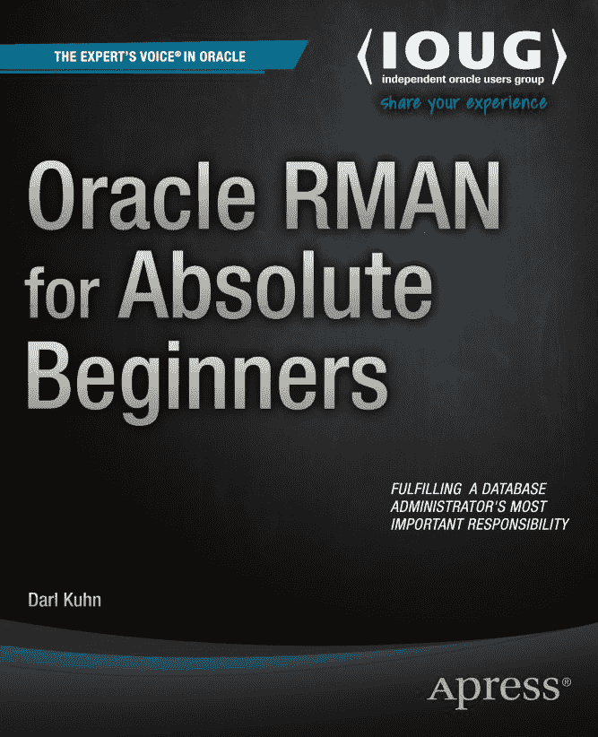
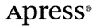

# Oracle RMAN 完全初学者指南

Darl Kuhn

## 版权声明

**Oracle RMAN 完全初学者指南**

版权所有 © 2014 Darl Kuhn

本作品受版权法保护。无论涉及材料的全部或部分，出版商保留所有权利，特别是翻译、重印、插图再利用、朗诵、广播、缩微胶片或其他任何物理方式进行的复制，以及信息存储和检索、电子改编、计算机软件，或现在已知或未来开发的类似或不同方法的权利。此法律保留的例外情况是与评论或学术分析相关的简短摘录，或专门为输入和执行于计算机系统而提供的材料，仅供该作品的购买者独家使用。只有在出版商所在地版权法现行版本的规定下，才允许复制本出版物或其部分。必须始终从 Springer 获得使用许可。使用许可可通过版权结算中心的 RightsLink 获取。违规行为将根据相应的版权法承担法律责任。

ISBN-13（平装）：978-1-4842-0764-2

ISBN-13（电子）：978-1-4842-0763-5

本书中可能出现商标名称、标识和图像。我们并非在每次出现商标名称、标识或图像时都使用商标符号，而是仅以编辑方式使用这些名称、标识和图像，旨在为商标所有者带来益处，并无侵犯商标权的意图。

本书中对商品名称、商标、服务标记和类似术语的使用，即使未特别标识，也不应被视为表达其是否受专有权约束的意见。

尽管本书中的建议和信息在出版时被认为是真实和准确的，但作者、编辑或出版商对可能存在的任何错误或遗漏不承担任何法律责任。出版商对本出版物所含材料不作任何明示或暗示的保证。

## 致谢

执行董事：Welmoed Spahr

主编：Jonathan Gennick

编辑委员会：Steve Anglin, Mark Beckner, Ewan Buckingham, Gary Cornell, Louise Corrigan, Jim DeWolf, Jonathan Gennick, Robert Hutchinson, Michelle Lowman, James Markham, Matthew Moodie, Jeff Olson, Jeffrey Pepper, Douglas Pundick, Ben Renow-Clarke, Dominic Shakeshaft, Gwenan Spearing, Matt Wade, Steve Weiss

协调编辑：Jill Balzano

排版：SPi Global

索引：SPi Global

美术：SPi Global

封面设计：Anna Ishchenko

## 发行

本书通过 Springer Science+Business Media New York (地址：233 Spring Street, 6th Floor, New York, NY 10013，电话：1-800-SPRINGER，传真：(201) 348-4505，邮箱：`orders-ny@springer-sbm.com`，或访问 `www.springeronline.com`) 向全球图书贸易发行。Apress Media, LLC 是一家位于加利福尼亚州的有限责任公司，其唯一成员（所有者）是 Springer Science + Business Media Finance Inc (SSBM Finance Inc)。SSBM Finance Inc 是一家特拉华州公司。

如需翻译信息，请发送电子邮件至 `rights@apress.com`，或访问 `www.apress.com`。

Apress 和 friends of ED 的书籍可批量购买用于学术、企业或推广用途。大多数图书也提供电子书版本和许可。有关更多信息，请参考我们的批量销售-电子书许可网页：`www.apress.com/bulk-sales`。

作者在正文中引用的任何源代码或其他补充材料，读者均可访问 `www.apress.com` 获取。有关如何查找图书源代码的详细信息，请访问 `www.apress.com/source-code/`。

## 献词

献给我的母亲，她已两次中风，也献给她的孩子们，他们的行为促成了这一切。

## 目录速览

关于作者

