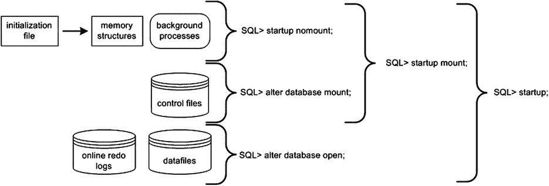

# 使用密码文件与数据库连接

使用密码文件的一个重要方面是，该机制允许你通过网络使用 `sqlplus` 或 `rman` 以 `sys*` 特权连接到远程数据库。例如，如果你想以 `sysdba` 特权，使用用户名 `chaya` 和密码 `heera` 连接到名为 `HATHI` 的远程数据库，你将按如下操作：

```
$ sqlplus chaya/heera@HATHI as sysdba
```

Oracle 将核实该用户名密码组合是否存在远程服务器上与 `HATHI` 网络服务名所定义的数据库相关联的密码文件中。在此示例中，Oracle 使用本地 `tnsnames.ora` 文件中的信息来确定数据库在网络上的位置（主机、端口和数据库）。

 **提示** 使用本地 `tnsnames.ora` 文件被称为*本地命名*连接方法。还有其他远程数据库名称解析方法，例如简易连接、目录命名和外部命名。有关如何实现这些方法的详细信息，请参阅 *Oracle Database Net Services Administrator’s Guide*。

## 简易连接

简易连接方法允许你连接到远程数据库，而无需 `tnsnames.ora` 文件（或其他解析数据库位置的方法）。如果你知道主机名、服务器端口和服务名，可以直接在命令行中输入这些信息。语法如下：

`sqlplus username@[//]host[:port][/service_name][:server][/instance_name]`

例如，假设主机名为 `hesta`，端口为 1521，服务名为 `O12C`，那么你可以按如下方式连接：

`$ sqlplus user/pass@hesta:1521/O12C`

简易连接方法在排除连接问题故障或当没有可用的 `tnsnames.ora` 文件（或其他解析远程连接的方法）时非常方便。

#### 启动数据库

启动和停止数据库是你将频繁执行的任务。要启动/停止数据库，请使用具有 `SYSDBA` 或 `SYSOPER` 特权的用户帐户连接，并发出 `STARTUP` 和 `SHUTDOWN` 语句。以下示例使用操作系统认证连接到数据库：

```
$ sqlplus / as sysdba
```

以特权帐户连接后，你可以启动数据库，如下所示：

```
SQL> startup;
```

 **注意** 要使上述命令生效，`ORACLE_HOME/dbs` 目录中需要有一个 `spfile` 或 `init.ora` 文件。

当你的实例成功启动时，你应该会看到来自 Oracle 的消息，表明系统全局区（SGA）已分配。数据库已装载然后打开：

```
ORACLE instance started.

Total System Global Area 2137886720 bytes
Fixed Size                  2290416 bytes
Variable Size            1207962896 bytes
Database Buffers          922746880 bytes
Redo Buffers                4886528 bytes
Database mounted.
Database opened.
```

从以上输出可以看出，打开 Oracle 数据库的启动操作经历了三个不同的阶段：

1.  启动实例
2.  装载数据库
3.  打开数据库

启动数据库时，你可以逐步执行这些阶段。首先，启动 Oracle 实例（后台进程和内存结构）：

```
SQL> startup nomount;
```

接下来，装载数据库。此时，Oracle 读取控制文件：

```
SQL> alter database mount;
```

最后，打开数据文件和联机重做日志文件：

```
SQL> alter database open;
```

 **提示** 正如你将在本书后面看到的，在执行 RMAN 备份和恢复任务时，理解这些启动阶段尤为重要。例如，在某些场景下，你可能需要数据库处于装载模式。在该模式下，重要的是要理解控制文件已打开，但数据文件和联机重做日志尚未打开。

此启动过程在图 1-1 中以图形方式描述。



图 1-1. Oracle 启动阶段

当你发出不带任何参数的 `STARTUP` 语句时，Oracle 会自动逐步执行三个启动阶段（nomount、mount、open）。在大多数情况下，你将发出不带参数的 `STARTUP` 语句来启动数据库。在许多 RMAN 备份和恢复场景中，你会发出 `STARTUP MOUNT` 来将数据库置于装载模式（实例已启动，控制文件已打开）。表 1-2 描述了可与数据库 `STARTUP` 语句一起使用的参数含义。

表 1-2. STARTUP 命令可用参数

| 参数 | 含义 |
| --- | --- |
| `FORCE` | 在重新启动前使用 `ABORT` 关闭实例；对于排除启动问题故障很有用 |
| `RESTRICT` | 仅允许具有 `RESTRICTED SESSION` 特权的用户连接到数据库 |
| `PFILE` | 指定启动实例时要使用的客户端参数文件 |
| `QUIET` | 在启动实例时抑制显示 SGA 信息 |
| `NOMOUNT` | 启动后台进程并分配内存；不读取控制文件 |
| `MOUNT` | 启动后台进程，分配内存，并读取控制文件 |
| `OPEN` | 启动后台进程，分配内存，读取控制文件，并打开联机重做日志和数据文件 |
| `OPEN RECOVER` | 在打开数据库前尝试进行介质恢复 |
| `OPEN READ ONLY` | 以只读模式打开数据库 |
| `UPGRADE` | 在升级数据库时使用 |
| `DOWNGRADE` | 在降级数据库时使用 |

### 停止数据库

通常，你使用 `SHUTDOWN IMMEDIATE` 语句来停止数据库。`IMMEDIATE` 参数指示 Oracle 停止数据库活动并回滚任何打开的事务，例如：

```
SQL> shutdown immediate;
Database closed.
Database dismounted.
ORACLE instance shut down.
```

表 1-3 详细定义了 `SHUTDOWN` 语句可用的参数。在大多数情况下，`SHUTDOWN IMMEDIATE` 是关闭数据库的可接受方法。如果你发出不带参数的 `SHUTDOWN` 命令，则等同于发出 `SHUTDOWN NORMAL`。

表 1-3. SHUTDOWN 命令可用参数

| 参数 | 含义 |
| --- | --- |
| `NORMAL` | 等待用户退出活动会话后再关闭。 |
| `TRANSACTIONAL` | 等待事务完成，然后终止会话。 |
| `TRANSACTIONAL LOCAL` | 仅对本地实例执行事务性关闭。 |
| `IMMEDIATE` | 立即终止活动会话。打开的事务将被回滚。 |
| `ABORT` | 立即终止实例。事务被终止且不会被回滚。 |

你很少需要使用 `SHUTDOWN ABORT` 语句。通常，`SHUTDOWN IMMEDIATE` 就足够了。话虽如此，使用 `SHUTDOWN ABORT` 也没有问题。如果 `SHUTDOWN IMMEDIATE` 因任何原因不工作，那么就使用 `SHUTDOWN ABORT`。

 **注意** 快速连续停止和重新启动数据库在俗称“弹跳数据库”。

启动和停止数据库是一个相当简单的过程。如果环境设置正确，你应该能够以特权用户身份连接到数据库，并发出适当的启动和关闭语句。

## 启动力

有时在开发环境中，我需要快速停止并启动数据库。例如，我可能想这样做是因为我修改了一个需要数据库重新启动的初始化参数。你可以用一个命令停止/启动数据库：

`SQL> startup force;`


如果您的实例当前正在运行，`STARTUP FORCE`命令将会关闭实例（中止模式）并重新启动它。在生产环境中，这种行为可能并非您所期望的，但对于测试/开发数据库，这通常是可以的。

### 总结

本章涵盖的任务包括设置操作系统变量、连接到数据库以及启动/停止数据库。这些操作是许多 DBA 任务的前提条件，特别是备份与恢复。在启动数据库时，了解 Oracle 经历的各个阶段以及在哪个时间点访问控制文件、打开数据文件和联机重做日志非常重要。现在您已理解这些基础概念，我们准备继续描述执行备份与恢复操作时使用的 Oracle 文件。

## 第二章


## 支持备份与恢复操作的文件

Oracle 数据库由三种必需文件组成：控制文件、联机重做日志和数据文件。本章将探讨管理这些关键文件的基础知识。本章还将讨论如何实现归档（这会生成归档重做日志文件）以及如何启用快速恢复区（FRA）。理解如何启用归档以及如何管理归档重做日志是数据库管理和备份恢复的关键部分。了解基本的 FRA 概念也很重要，因为 RMAN（除非另有指示）默认会将备份文件写入 FRA。

使用 RMAN 时，理解构成数据库的文件至关重要。熟悉数据库的物理特性是理解 RMAN 如何执行备份和恢复操作的基础。这些知识将使您能更好地理解底层机制，并在出现问题时提供故障排除所需的基础信息。首先是管理控制文件。

### 管理控制文件

控制文件是一个小的二进制文件，存储诸如数据库名称、数据文件的名称和位置、联机重做日志文件的名称和位置、当前联机重做日志序列号、检查点信息以及 RMAN 备份文件的名称和位置（如果使用）等信息。您可以从数据字典视图查询存储在控制文件中的许多信息。以下示例通过查询`V$CONTROLFILE_RECORD_SECTION`来显示存储在控制文件中的信息类型：

```
SQL> select distinct type from v$controlfile_record_section;

TYPE
------------------
FILENAME
TABLESPACE
RMAN CONFIGURATION
BACKUP CORRUPTION
PROXY COPY
FLASHBACK LOG
...
```

您可以通过`V$DATABASE`视图查看存储在控制文件中的数据库相关信息：

```
SQL> select name, open_mode, created, current_scn from v$database;

NAME      OPEN_MODE            CREATED   CURRENT_SCN
--------- -------------------- --------- -----------
O12C      READ WRITE           27-SEP-14      319781
```

每个 Oracle 数据库必须至少有一个控制文件。当您以 nomount 模式启动数据库时，实例会从`spfile`或`init.ora`文件中的`CONTROL_FILES`初始化参数得知控制文件的位置。当您发出`STARTUP NOMOUNT`命令时，Oracle 会读取参数文件，启动后台进程并分配内存结构：

```
-- 实例已知晓控制文件的位置
SQL> startup nomount;
```

此时，控制文件尚未被任何进程访问。当您将数据库切换到 mount 模式时，控制文件会被读取并打开以供使用：

```
-- 控制文件已打开
SQL> alter database mount;
```

如果`CONTROL_FILES`初始化参数中列出的任何控制文件不可用，则无法挂载数据库。

成功挂载数据库后，实例便知晓数据文件和联机重做日志的位置，但尚未打开它们。当您将数据库切换到 open 模式后，数据文件和联机重做日志将被打开：

```
-- 数据文件和联机重做日志已打开
SQL> alter database open;
```

 **请注意**，当您发出`STARTUP`命令（不带选项）时，会自动按此顺序执行前述三个阶段：nomount、mount、open。当您发出`SHUTDOWN`命令时，阶段则相反：关闭数据库、卸载控制文件并停止实例。

控制文件在数据库创建时创建。如果可能，您应该将多个控制文件存储在由单独控制器控制的独立存储设备上。

数据库打开后，Oracle 会频繁地向控制文件写入信息，例如当您进行任何物理修改时（例如，创建表空间、添加/删除/调整数据文件大小）。Oracle 会向`CONTROL_FILES`初始化参数指定的所有控制文件写入。如果 Oracle 无法写入某个控制文件，则会抛出错误：

```
ORA-00210: cannot open the specified control file
```

如果您的某个控制文件变得不可用，请关闭数据库并在重新启动前解决问题（有关使用 RMAN 还原控制文件，请参见第 6 章）。解决问题可能意味着解决存储设备故障，或修改`CONTROL_FILES`初始化参数以移除不可用控制文件的条目。

### 显示控制文件的内容

您可以使用`ALTER SESSION`语句显示控制文件的物理内容；例如，

```
SQL> oradebug setmypid
SQL> oradebug unlimit
SQL> alter session set events 'immediate trace name controlf level 9';
SQL> oradebug tracefile_name
```

前面的代码行将显示以下跟踪文件名：

```
/orahome/app/oracle/diag/rdbms/o12c/O12C/trace/O12C_ora_15545.trc
```

在 Oracle 11g 及更高版本中，跟踪文件写入到`$ADR_HOME/trace`目录。您也可以通过此查询查看跟踪目录名称：

```
SQL> select value from v$diag_info where name='Diag Trace';
```

在 Oracle 10g 及更低版本中，跟踪目录由`USER_DUMP_DEST`初始化参数定义。在排查问题或试图更好地理解 Oracle 内部机制时，您可以检查控制文件的内容。

### 查看控制文件名称和位置

如果您的数据库处于 nomount、mounted 或 open 状态，您可以按如下方式查看控制文件的名称和位置：

```
SQL> show parameter control_files
```

您也可以通过查询`V$CONTROLFILE`视图来查看控制文件的位置和名称信息。此查询在数据库处于 mounted 或 open 状态时有效：

```
SQL> select name from v$controlfile;
```

如果由于某种原因您根本无法启动数据库，并且需要知道控制文件的名称和位置，您可以检查初始化（参数）文件的内容以查看它们的位置。如果您使用的是`spfile`，尽管它是二进制文件，您仍然可以用文本编辑器打开它。最安全的方法是复制一份`spfile`，然后使用操作系统编辑器检查其内容：

```
$ cp $ORACLE_HOME/dbs/spfileO12C.ora $ORACLE_HOME/dbs/spfileO12C.copy
$ vi $ORACLE_HOME/dbs/spfileO12C.copy
```

您也可以使用`strings`命令在二进制文件中搜索值：

```
$ strings $ORACLE_HOME/dbs/spfileO12C.ora | grep -i control_files
```

如果您使用的是基于文本的初始化文件，您可以直接使用操作系统编辑器查看该文件，或使用`grep`命令：

```
$ grep -i control_files $ORACLE_HOME/dbs/initO12C.ora
```

#### 添加控制文件


