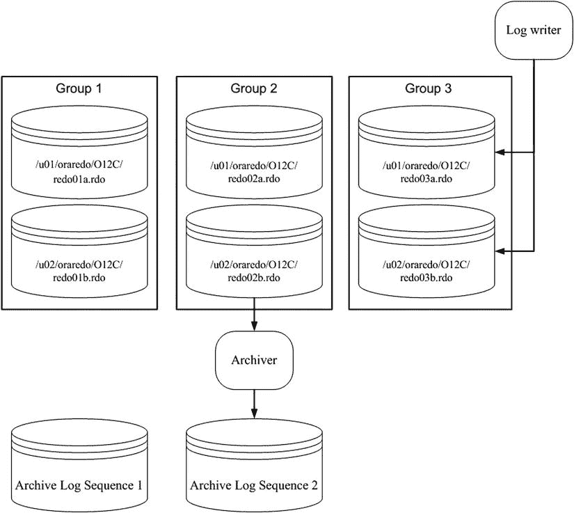

# 添加 Oracle 数据库控制文件指南

添加控制文件意味着复制一个现有的控制文件，并通过修改`CONTROL_FILES`参数让数据库感知到这个副本。此操作必须在数据库关闭时执行。此过程仅在你拥有一个可供复制的良好现有控制文件时才有效。添加控制文件不同于创建或恢复控制文件。

如果你的数据库只使用一个控制文件，而该控制文件损坏，你需要从备份中恢复一个控制文件（如果有）并执行恢复，或者重新创建控制文件。如果你正在使用两个或更多控制文件，其中一个损坏，你可以使用剩余的良好控制文件快速将数据库恢复到可运行状态。

如果数据库只使用一个控制文件，添加控制文件的基本过程如下：

1.  修改初始化文件中的`CONTROL_FILES`参数，以包含新控制文件的位置和名称。
2.  关闭数据库。
3.  使用操作系统命令将现有的控制文件复制到新的位置和名称。
4.  重启数据库。

根据你使用的是`spfile`还是`init.ora`文件，上述步骤会略有不同。接下来的两个部分将详细说明这些不同的场景。

## Spfile 场景

如果你的数据库已打开，可以使用以下 SQL 语句快速确定你是否在使用`spfile`：

```sql
SQL> show parameter spfile
```

以下是一些示例输出：

```
NAME      TYPE        VALUE
--------- ----------- ------------------------------
spfile    string      /orahome/app/oracle/product/12
                      .1.0.1/db_1/dbs/spfileO12C.ora
```

确定你正在使用`spfile`后，请使用以下步骤添加控制文件：

### 步骤 1：确定`CONTROL_FILES`参数的当前值

```sql
SQL> show parameter control_files
```

输出显示此数据库仅使用一个控制文件：

```
NAME              TYPE        VALUE
----------------- ----------- ------------------------------
control_files     string      /u01/dbfile/O12C/control01.ctl
```

### 步骤 2：修改`CONTROL_FILES`参数

修改你的`CONTROL_FILES`参数以包含要添加的新控制文件，但将操作范围限制为`spfile`（你无法在内存中修改此参数）。确保也包含步骤 1 中列出的所有控制文件：

```sql
SQL> alter system set control_files='/u01/dbfile/O12C/control01.ctl',
'/u01/dbfile/O12C/control02.ctl' scope=spfile;
```

### 步骤 3：关闭数据库

```sql
SQL> shutdown immediate;
```

### 步骤 4：复制现有控制文件

将现有的控制文件复制到新的位置和名称。在此示例中，通过操作系统`cp`命令创建了一个名为`control02.ctl`的新控制文件：

```bash
$ cp /u01/dbfile/O12C/control01.ctl /u01/dbfile/O12C/control02.ctl
```

### 步骤 5：启动数据库

```sql
SQL> startup;
```

你可以通过显示`CONTROL_FILES`参数来验证新控制文件是否正在被使用：

```sql
SQL> show parameter control_files
```

此示例的输出如下：

```
NAME            TYPE        VALUE
--------------- ----------- ------------------------------
control_files   string      /u01/dbfile/O12C/control01.ctl
                            ,/u01/dbfile/O12C/control02.ctl
```

## Init.ora 场景

运行以下语句以验证你是否在使用`init.ora`文件。如果你没有使用`spfile`，`VALUE`列将为空：

```sql
SQL> show parameter spfile
NAME       TYPE        VALUE
---------- ----------- ------------------------------
spfile     string
```

要使用文本`init.ora`文件添加控制文件，请执行以下步骤：

### 步骤 1：关闭数据库

```sql
SQL> shutdown immediate;
```

### 步骤 2：编辑`init.ora`文件

使用操作系统实用程序（如`vi`）编辑你的`init.ora`文件，并将新的控制文件位置和名称添加到`CONTROL_FILES`参数中。此示例使用`vi`打开`init.ora`文件，并将`control02.ctl`添加到`CONTROL_FILES`参数：


#### 添加控制文件

1.  在`$ vi $ORACLE_HOME/dbs/initO12C.ora`中编辑初始化参数文件。

    添加后，`CONTROL_FILES`参数如下所示：

    ```sql
    control_files='/u01/dbfile/O12C/control01.ctl', 
                  '/u01/dbfile/O12C/control02.ctl'
    ```

2.  在操作系统中，将现有的控制文件复制到要添加的控制文件的目录和名称：

    ```bash
    $ cp /u01/dbfile/O12C/control01.ctl /u01/dbfile/O12C/control02.ctl
    ```

3.  启动数据库：

    ```sql
    SQL> startup;
    ```

    通过显示`CONTROL_FILES`参数，可以查看正在使用的控制文件：

    ```sql
    SQL> show parameter control_files
    ```

    对于本示例，输出如下：

    ```
    NAME             TYPE        VALUE
    ---------------- ----------- ------------------------------
    control_files    string      /u01/dbfile/O12C/control01.ctl
                                 ,/u01/dbfile/O12C/control02.ctl
    ```

#### 移动控制文件

有时可能需要将控制文件从一个位置移动到另一个位置。例如，如果为数据库服务器添加了新存储，可能希望将现有控制文件移动到新位置。

移动控制文件的步骤与添加控制文件非常相似。唯一的区别是重命名而不是复制控制文件。此示例展示了在使用`spfile`时如何移动控制文件：

1.  确定`CONTROL_FILES`参数的当前值：

    ```sql
    SQL> show parameter control_files

    NAME              TYPE        VALUE
    ----------------- ----------- ------------------------------
    control_files     string      /u01/dbfile/O12C/control01.ctl
    ```

2.  修改`CONTROL_FILES`参数以反映正在移动控制文件。在此示例中，控制文件当前位置是：

    ```
    /u01/dbfile/O12C/control01.ctl
    ```

    将控制文件移动到此位置：

    ```
    /u02/dbfile/O12C/control01.ctl
    ```

    修改`spfile`以反映控制文件的新位置。必须指定`SCOPE=SPFILE`，因为`CONTROL_FILES`参数无法在内存中修改：

    ```sql
    SQL> alter system set
         control_files='/u02/dbfile/O12C/control01.ctl' scope=spfile;
    ```

3.  关闭数据库：

    ```sql
    SQL> shutdown immediate;
    ```

4.  在操作系统提示符下，将控制文件移动到新位置。此示例使用操作系统`mv`命令：

    ```bash
    $ mv /u01/dbfile/O12C/control01.ctl /u02/dbfile/O12C/control01.ctl
    ```

5.  启动数据库：

    ```sql
    SQL> startup;
    ```

    可以通过显示`CONTROL_FILES`参数来验证是否正在使用新的控制文件：

    ```sql
    SQL> show parameter control_files
    ```

    此示例的输出如下：

    ```
    NAME             TYPE        VALUE
    ---------------- ----------- ------------------------------
    control_files    string      /u02/dbfile/O12C/control01.ctl
    ```

## 删除控制文件

可能会遇到包含一个多路复用控制文件的存储设备发生介质故障的情况：

```
ORA-00205: error in identifying control file, check alert log for more info
```

在此场景中，您仍然至少有一个完好的控制文件。要删除控制文件，请遵循以下步骤：

1.  通过检查`alert.log`获取信息来确定哪个控制文件发生了介质故障：

    ```
    ORA-00210: cannot open the specified control file
    ORA-00202: control file: '/u01/dbfile/O12C/control02.ctl'
    ```

2.  从`CONTROL_FILES`参数中移除不可用的控制文件名。如果使用的是`init.ora`文件，请使用操作系统编辑器（如`vi`）直接修改该文件。如果使用的是`spfile`，请使用`ALTER SYSTEM`语句修改`CONTROL_FILES`参数。在此`spfile`示例中，从`CONTROL_FILES`参数中移除了`control02.ctl`控制文件：

    ```sql
    SQL> alter system set control_files='/u01/dbfile/O12C/control01.ctl'
         scope=spfile;
    ```


### 管理在线重做日志

此数据库当前仅关联了一个控制文件。您绝不应只用一个控制文件来运行生产数据库。有关如何向数据库添加更多控制文件的详细信息，请参阅本章前面的“添加控制文件”部分。

3.  停止并启动数据库：

```sql
SQL> shutdown immediate;
SQL> startup;
```

## 在线重做日志的用途

在线重做日志存储了数据库中发生事务的记录。这些日志具有以下用途：

*   提供一种记录数据库更改的机制，以便在发生介质故障时，您有一种恢复事务的方法。
*   确保在发生实例完全故障时，即使已提交的数据更改尚未写入数据文件，已提交的事务也可以被恢复（崩溃恢复）。
*   允许管理员通过 Oracle LogMiner 实用程序检查历史数据库事务。
*   它们被 Oracle 工具（如 GoldenGate 或 Streams）读取以复制数据。

您的数据库中必须至少有两个在线重做日志组。每个在线重做日志组必须至少包含一个在线重做日志成员。成员是磁盘上存在的物理文件。您可以在每个重做日志组中创建多个成员，这称为对在线重做日志组进行**多路复用**。

 **提示** 我强烈建议您对在线重做日志组进行多路复用，如果可能，让每个成员位于由独立控制器管理的独立物理设备上。

## 日志写入器进程

日志写入器是一个后台进程，负责将事务信息从重做日志缓冲区（在 SGA 中）写入在线重做日志文件（在磁盘上）。在以下任一情况发生时，日志写入器会刷新重做日志缓冲区的内容：

*   发出 `COMMIT` 或 `ROLLBACK`。
*   发生日志切换。
*   三秒钟过去。
*   重做日志缓冲区已满三分之一。
*   重做日志缓冲区填满到一兆字节。

## 当前在线重做日志组与日志切换

日志写入器正在主动写入的在线重做日志组是 `当前在线重做日志组`。日志写入器同时写入重做日志组的所有成员。日志写入器只需成功写入一个成员，数据库即可继续运行。如果日志写入器无法成功写入当前组中的至少一个成员，数据库将停止运行。

当当前在线重做日志组填满时，会发生日志切换，日志写入器开始写入下一个在线重做日志组。日志写入器以轮询方式写入在线重做日志组。因为在线重做日志组的数量是有限的，最终每个在线重做日志组的内容将被覆盖。如果您想保存事务信息的历史记录，必须将数据库置于归档日志模式（请参阅本章后面的“实现归档日志模式”部分）。

当数据库处于归档日志模式时，每次日志切换后，归档器后台进程会将在线重做日志文件的内容复制到归档重做日志文件。在发生故障时，归档重做日志文件允许您还原自上次数据库备份以来发生的所有事务的完整历史记录。

图 2-1 展示了一个典型的在线重做日志文件设置。此图显示了三个在线重做日志组，每组包含两个成员。数据库处于归档日志模式。图中，第 2 组已因事务填满，发生了日志切换，日志写入器现在正在写入第 3 组。归档器进程正在将第 2 组的内容复制到归档重做日志文件。当第 3 组填满时，将再次发生日志切换，日志写入器将开始写入第 1 组。同时，归档器进程会将第 3 组的内容复制到归档日志序列 3（依此类推）。



**图 2-1.** 在线重做日志配置

在线重做日志文件不用于备份。这些文件仅包含数据库生成的最新重做事务信息。当您启用归档时，归档重做日志文件是保护数据库事务历史的机制。

 **注意** 在 Oracle 真应用集群（RAC）数据库中，每个实例都有自己的一组在线重做日志。这被称为一个重做 `线程`。每个 RAC 实例写入自己的在线重做日志，并生成自己线程的归档重做日志文件。此外，每个实例必须能够读取任何其他实例的在线重做日志。这一点很重要，因为如果一个实例崩溃，其他幸存的实例可以通过读取崩溃实例的在线重做日志来启动实例恢复。

## 保护在线重做日志文件

当前在线重做日志文件的内容在发生日志切换之前不会被归档。这意味着如果您丢失了当前在线重做日志文件的所有成员，您将丢失事务。下面列出了几种您可以实施的机制，以最大限度地降低在线重做日志文件故障的可能性：

*   对组进行多路复用。
*   如果可能，切勿让同一组的两个成员共享同一个控制器。
*   如果可能，切勿将同一组的两个成员放在同一个物理磁盘上。
*   确保操作系统文件权限设置得当（限制性，只有 Oracle 二进制文件的所有者具有读写权限）。
*   使用冗余的物理存储设备（例如，RAID [廉价磁盘冗余阵列]）。
*   合理设置日志文件大小，以便它们定期切换和归档。
*   考虑设置 `ARCHIVE_LAG_TARGET` 初始化参数，以确保在线重做日志定期切换。

 **注意** Oracle 提供的唯一能在您丢失当前在线重做日志组所有成员时保护您并保留所有已提交事务的工具是 Oracle Data Guard，需以最大保护模式实施。有关 Oracle Data Guard 保护模式的更多详细信息，请参阅 MOS 说明 239100.1。

## 在线重做日志与备份

在线重做日志文件绝不会被 RMAN 备份或用户管理的热备份所备份。如果您确实备份了在线重做日志文件，那么还原它们也是没有意义的。在线重做日志文件包含数据库生成的最新重做信息。您不会希望用备份中包含旧重做信息的文件来覆盖它们。对于处于归档日志模式的数据库，其中的在线重做日志文件包含执行完全恢复所需的最新生成的事务。

#### 显示在线重做日志信息

使用 `V$LOG` 和 `V$LOGFILE` 视图显示有关在线重做日志组及相应成员的信息：

```sql
COL group#     FORM 99999
COL thread#    FORM 99999
COL grp_status FORM a10
COL member     FORM a30
COL mem_status FORM a10
COL mbytes     FORM 999999
--
SELECT
 a.group#
,a.thread#
,a.status grp_status
,b.member member
,b.status mem_status
,a.bytes/1024/1024 mbytes
FROM v$log     a,
     v$logfile b
WHERE a.group# = b.group#
ORDER BY a.group#, b.member;

GROUP# THREAD# GRP_STATUS MEMBER                         MEM_STATUS  MBYTES
------ ------- ---------- ------------------------------ ---------- -------
     1       1 CURRENT    /u01/oraredo/O12C/redo01a.rdo            50
     1       1 CURRENT    /u02/oraredo/O12C/redo01b.rdo            50
     2       1 INACTIVE   /u01/oraredo/O12C/redo02a.rdo            50
     2       1 INACTIVE   /u02/oraredo/O12C/redo02b.rdo            50
     3       1 INACTIVE   /u01/oraredo/O12C/redo03a.rdo            50
     3       1 INACTIVE   /u02/oraredo/O12C/redo03b.rdo            50
```


