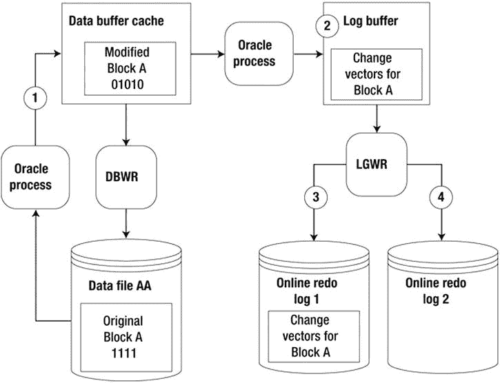
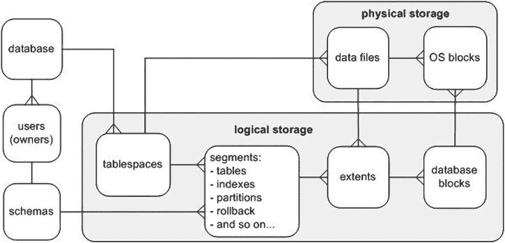
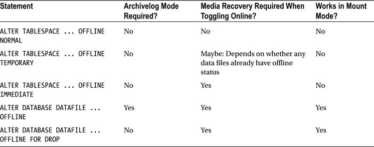
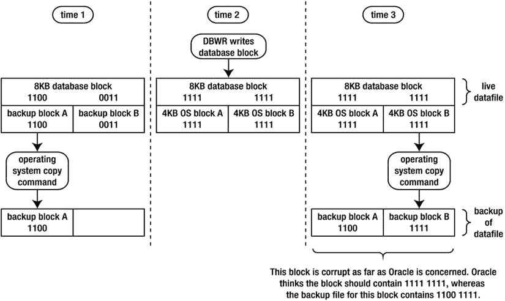
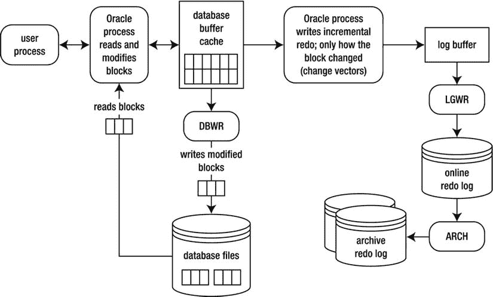
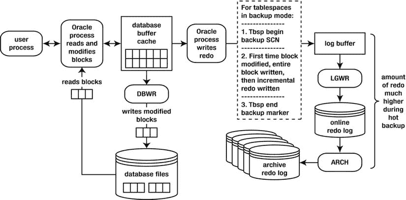
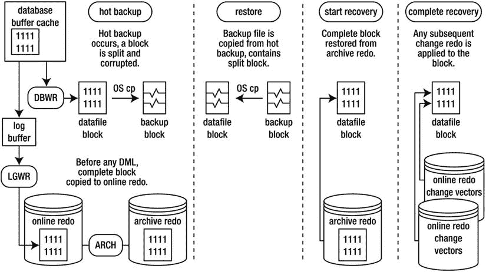
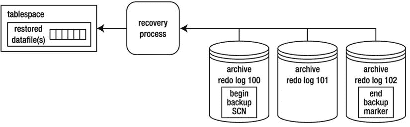
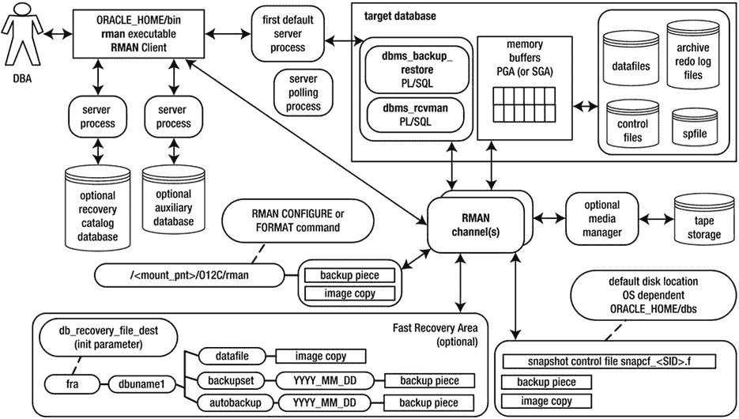
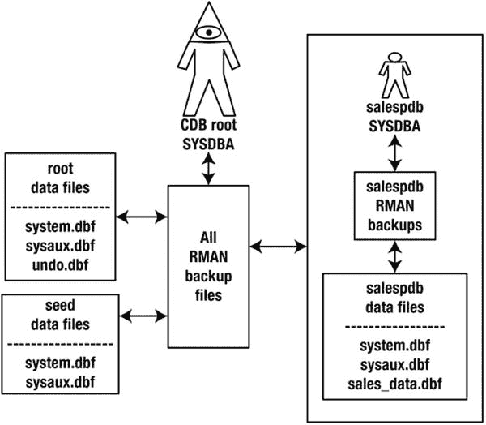

# Oracle 在线重做日志诊断与优化

当你正在诊断在线重做日志问题时，`V$LOG` 和 `V$LOGFILE` 视图特别有用。在数据库处于已挂载或打开状态时，你都可以查询这些视图。

#### 确定在线重做日志组的最佳大小

尝试将在线重做日志的大小调整为每小时切换 2 到 6 次。`V$LOG_HISTORY` 视图包含在线重做日志切换频率的历史记录。执行以下查询可以查看每小时的日志切换次数：

```
select count(*)
,to_char(first_time,'YYYY:MM:DD:HH24')
from v$log_history
group by to_char(first_time,'YYYY:MM:DD:HH24')
order by 2;

COUNT(*) TO_CHAR(FIRST
---------- -------------
         2 2014:09:24:04
        80 2014:09:24:05
        44 2014:09:24:06
        10 2014:09:24:12
```

从上面的输出可以看到，大约在凌晨 4:00 到 6:00 发生了大量的日志切换活动。这可能是由于夜间批处理作业或不同时区的用户更新数据所致。对于这个数据库，应增加在线重做日志的大小。你应该尝试调整在线重做日志的大小，以适应数据库的峰值事务负载。

`V$LOG_HISTORY` 视图的数据来源于控制文件。每次发生日志切换时，该视图中会记录一条详细信息，如切换时间和系统变更号 (SCN)。如前所述，一个经验法则是，你应该将在线重做日志文件的大小调整为大约每小时切换 2 到 6 次。你不希望它们切换得太频繁，因为日志切换本身有开销。Oracle 会将检查点作为日志切换的一部分来启动。在检查点期间，数据库写入器后台进程将已修改（也称为脏）的数据块写入磁盘，这是资源密集型的操作。

另一方面，你也不希望在线重做日志文件从不切换，因为当前的在线重做日志包含在恢复事件中你可能需要的事务。如果灾难导致当前在线重做日志发生介质故障，你可能会丢失那些尚未归档的事务。

`` `提示` 使用 `ARCHIVE_LAG_TARGET` 初始化参数来设置日志切换之间的最大时间（以秒为单位）。此参数的典型设置是 1800 秒（30 分钟）。值为 0（默认值）会禁用此功能。此参数通常用于 Oracle Data Guard 环境中，以在指定的时间过后强制进行日志切换。

你也可以查询 `V$INSTANCE_RECOVERY` 视图中的 `OPTIMAL_LOGFILE_SIZE` 列，以确定你的在线重做日志文件大小是否设置正确：

```
SQL> select optimal_logfile_size from v$instance_recovery;
```

此列报告了被认为是“最优”的重做日志文件大小（以兆字节为单位），该大小是基于初始化参数 `FAST_START_MTTR_TARGET` 的设置。Oracle 建议你将所有在线重做日志配置为至少达到 `OPTIMAL_LOGFILE_SIZE` 的值。然而，在调整在线重做日志大小时，你必须考虑你的环境信息（例如切换频率）。

#### 确定重做日志组的最佳数量

Oracle 至少需要两个重做日志组才能运行。但是，只有两个组有时是不够的。要理解原因，请记住每次日志切换发生时，都会启动一个检查点。作为检查点的一部分，数据库写入器会将所有已修改（脏）的数据块从 SGA 写入磁盘上的数据文件。同时回想一下，在线重做日志是按轮询方式写入的，最终给定日志中的信息会被覆盖。在日志写入器可以开始覆盖在线重做日志中的信息之前，必须先将 SGA 中与该重做日志关联的所有已修改块写入数据文件。如果并非所有已修改块都已写入数据文件，你会在 `alert.log` 文件中看到此消息：

```
Thread 1 cannot allocate new log, sequence <sequence number>
Checkpoint not complete
```

解释此问题的另一种方式是，Oracle 需要在在线重做日志中存储任何可能用于执行崩溃恢复的信息。为了帮助你可视化这一点，请参见 图 2-2。



图 2-2. 在修改的（脏）缓冲区写入磁盘之前，重做受保护。

在时间 1，块 A 从数据文件 AA 读入缓冲区高速缓存并被修改。在时间 2，重做更改向量信息（块如何更改）被写入日志缓冲区。在时间 3，日志写入器进程将块 A 的更改向量信息写入在线重做日志 1。在时间 4，发生日志切换，在线重做日志 2 成为当前的在线重做日志。

现在，假设在线重做日志 2 很快填满并发生另一次日志切换，此时日志写入器尝试写入在线重做日志 1。在数据库块写入器将块 A 写入数据文件 AA 之前，日志写入器不被允许覆盖在线重做日志 1 中的信息。在块 A 被写入数据文件 AA 之前，如果发生电源故障或 `shutdown abort`，Oracle 需要在线重做日志中的信息来恢复此块。在覆盖在线重做日志中的信息之前，Oracle 会确保受重做保护的数据块已写入磁盘。如果这些修改的块尚未写入磁盘，Oracle 会暂时挂起处理，直到写入完成。有几种方法可以解决此问题：

*   添加更多的重做日志组。
*   降低 `FAST_START_MTTR_TARGET` 的值。这样做会使数据库写入器进程在更短的时间内将较旧的修改块写入磁盘。
*   调优数据库写入器进程（修改 `DB_WRITER_PROCESSES`）。

如果你注意到 `Checkpoint not complete` 消息经常出现（比如一天多次），我建议你添加一个或多个日志组来解决此问题。添加一个额外的重做日志为数据库写入器提供了更多时间，在关联的重做信息被覆盖之前，将数据库缓冲区高速缓存中的修改块写入数据文件。添加更多的重做日志组几乎没有缺点。主要的问题是，你可能会遇到创建数据库时使用的 `MAXLOGFILES` 值的限制。如果你需要添加更多的组并且已经超出了 `MAXLOGFILES` 的值，那么你必须重新创建控制文件并为此参数指定一个更高的值。

如果添加更多的重做日志组不能解决问题，你应该仔细考虑降低 `FAST_START_MTTR_TARGET` 的值。当你降低此值时，可能会看到更多的 I/O，因为数据库写入器进程更积极地将修改块写入数据文件。理想情况下，最好在生产环境进行更改之前，在测试环境中验证修改 `FAST_START_MTTR_TARGET` 的影响。你可以在实例运行时修改此参数；这意味着如果出现不可预见的副作用，你可以快速将其修改回原始设置。

最后，考虑增加 `DB_WRITER_PROCESSES` 参数的值。在生产环境应用此更改之前，请仔细分析在测试环境中修改此参数的影响。此值的修改需要停止并启动数据库；因此，如果产生不利影响，则需要停机才能将此值更改回原始设置。

#### 添加在线重做日志组

如果你确定需要添加在线重做日志组，请使用 `ADD LOGFILE GROUP` 语句。在此示例中，数据库已包含两个大小各为 50M 的在线重做日志组。添加了一个额外的日志组，该组有两个成员，大小为 50MB：

```
alter database add logfile group 3
('/u01/oraredo/O12C/redo03a.rdo',
 '/u02/oraredo/O12C/redo03b.rdo') SIZE 50M;
```


在此场景下，我强烈建议你添加的日志组应与现有的在线重做日志大小相同，并且包含相同数量的成员。如果新添加的组与现有组的物理特性不一致，将更难准确判断性能问题。

例如，如果你有两个大小为 50MB 的日志组，而你添加了一个大小为 500MB 的新日志组，这很可能会产生前一节描述的`Checkpoint not complete`（检查点未完成）问题。这是因为，从 SGA 中刷出由 500MB 日志文件保护的所有已修改数据块，所需时间可能远比刷出由 50MB 日志文件保护的已修改数据块长得多。

## 调整大小与删除在线重做日志组

你可能需要更改在线重做日志的大小（参见本章前面的“确定在线重做日志组的最佳大小”一节）。你无法直接修改现有在线重做日志的大小。要调整在线重做日志的大小，必须先添加符合你目标大小的在线重做日志组，然后删除旧大小的日志。

假设你想将每个在线重做日志的大小调整为 200MB。首先，使用`ADD LOGFILE GROUP`语句添加大小为 200MB 的新组。以下示例添加了日志组 4，包含两个大小为 200MB 的成员：

```
alter database add logfile group 4
('/u01/oraredo/O12C/redo04a.rdo',
 '/u02/oraredo/O12C/redo04b.rdo') SIZE 200M;
```

 **注意** 你可以指定日志文件的大小，单位可以是字节、千字节、兆字节或千兆字节。

添加了新大小的日志文件后，就可以删除旧的在线重做日志了。一个日志组必须处于`INACTIVE`（非活动）状态才能被删除。你可以检查日志组的状态，如下所示：

```
SQL> select group#, status, archived, thread#, sequence# from v$log;
```

你可以使用`ALTER DATABASE DROP LOGFILE GROUP`语句删除一个非活动的日志组：

```
SQL> alter database drop logfile group <group #>;
```

如果你尝试删除当前的在线日志组，Oracle 会返回一个`ORA-01623`错误，提示你不能删除当前组。使用`ALTER SYSTEM SWITCH LOGFILE`语句切换日志，使下一个组成为当前组：

```
SQL> alter system switch logfile;
```

日志切换后，先前作为当前组的日志组，只要其中包含 Oracle 执行崩溃恢复所需的重做信息，就会保持活动状态。如果你尝试删除一个状态为活动的日志组，Oracle 会抛出一个`ORA-01624`错误，指出该日志组是崩溃恢复所必需的。执行`ALTER SYSTEM CHECKPOINT`命令使日志组变为非活动状态：

```
SQL> alter system checkpoint;
```

此外，如果删除一个在线重做日志组会导致你的数据库只剩下最后一个日志组，那么你不能删除它。如果你尝试这样做，Oracle 会抛出`ORA-01567`错误，并告知你删除该日志组不被允许，因为这会使你的数据库少于两个日志组（如前所述，Oracle 至少需要两个重做日志组才能运行）。

删除一个在线重做日志组并不会从操作系统中删除日志文件。你必须使用操作系统命令（例如 Linux/Unix 命令`rm`）来删除文件。在从操作系统中删除文件之前，请确保该文件未在使用，并且你删除的不是活动的在线重做日志文件。针对服务器上的每个数据库，执行此查询以查看哪些在线重做日志文件正在使用中：

```
SQL> select member from v$logfile;
```

在物理删除日志文件之前，先执行足够多次的日志切换，确保所有在线重做日志组最近都已被切换过；这样做会使操作系统写入该文件，从而为其更新时间戳。例如，如果你有三个组，请确保执行至少三次日志切换：

```
SQL> alter system switch logfile;
SQL> /
SQL> /
```

现在，在操作系统提示符下验证你打算删除的日志文件是否没有新的时间戳。首先，进入包含在线重做日志文件的目录：

```
$ cd  /u01/oraredo/O12C
```

然后，列出文件以查看最新的修改日期：

```
$ ls -altr
```

当你完全确定该文件未被使用时，才可以删除它。删除文件的风险在于，如果它恰好是一个正在使用的在线重做日志，并且是某个组的唯一成员，则可能对你的数据库造成严重损害。确保你拥有数据库的良好备份，并且要删除的文件未被服务器上的任何数据库使用。

#### 向组中添加在线重做日志文件

你可能偶尔需要向现有组中添加一个日志文件。例如，如果你有一个仅包含一个成员的在线重做日志组，你应该考虑添加一个日志文件（以提供更高级别的保护，防止单一日志文件成员故障）。使用`ALTER DATABASE ADD LOGFILE MEMBER`语句向现有的在线重做日志组添加一个成员文件。你需要指定新成员文件的位置、名称以及要添加到的组：

```
SQL> alter database add logfile member '/u02/oraredo/O12C/redo01b.rdo' to group 1;
```

请确保你遵循关于任何新添加的重做日志文件的位置和命名的标准。

#### 从组中移除在线重做日志文件

偶尔，你可能需要从一个组中移除一个在线重做日志文件。例如，你的数据库可能经历了一个多路复用组中某个成员的故障，而你希望移除这个失效的成员。首先，确保你要删除的日志文件不在当前组中：

```
SELECT a.group#, a.member, b.status, b.archived, SUM(b.bytes)/1024/1024 mbytes
FROM v$logfile a, v$log b
WHERE a.group# = b.group#
GROUP BY a.group#, a.member, b.status, b.archived
ORDER BY 1, 2;
```

如果你尝试删除状态为`CURRENT`（当前）的组中的日志文件，你会收到以下错误：

```
ORA-01623: log 2 is current log for instance O12C (thread 1) - cannot drop
```

如果你正在尝试从当前的在线重做日志组中删除一个成员，则强制进行一次切换，如下所示：

```
SQL> alter system switch logfile;
```

使用`ALTER DATABASE DROP LOGFILE MEMBER`语句从现有的在线重做日志组中移除一个成员文件。你不需要指定组号，因为你是在移除一个特定的文件：

```
SQL> alter database drop logfile member '/u01/oraredo/O12C/redo04a.rdo';
```

你也不能删除一个组中最后一个剩余的日志文件。一个组必须至少包含一个日志文件。如果你尝试删除一个组中最后一个剩余的日志文件，你会收到以下错误：

```
ORA-00361: cannot remove last log member ...
```

#### 移动或重命名重做日志文件

有时，你需要移动或重命名在线重做日志文件。例如，你可能向系统添加了一些新的挂载点，并希望将在线重做日志移动到新的存储设备上。你可以使用两种方法来完成此任务：

*   在新位置添加新的日志文件，然后删除旧的日志文件。
*   在操作系统层面物理重命名文件。

如果你无法承担任何停机时间，请考虑在新位置添加新的日志文件，然后删除旧的日志文件。有关如何添加日志组的详细信息，请参阅本章前面的“添加在线重做日志组”一节。另请参阅本章前面的“调整大小与删除在线重做日志组”一节，了解如何删除日志组。


## 移动在线重做日志文件

或者，您可以从操作系统层面物理移动文件。您可以在数据库打开或关闭的状态下执行此操作。如果您的数据库是打开的，请确保您移动的文件不属于当前的在线重做日志组（因为这些文件正被日志写入器后台进程写入）。在数据库打开时尝试执行此任务是危险的，因为在活动系统中，在线重做日志可能正在快速切换，这会导致您有可能在文件被切换为当前在线重做日志时尝试移动它。因此，我强烈建议您仅在数据库关闭时执行此操作。

下一个示例展示了如何在数据库关闭时移动在线重做日志文件。步骤如下：

1.  关闭数据库：

    ```
    SQL> shutdown immediate;
    ```

2.  在操作系统提示符下，移动文件。此示例使用 `mv` 命令完成此任务：

    ```
    $ mv /u02/oraredo/O12C/redo02b.rdo /u01/oraredo/O12C/redo02b.rdo
    ```

3.  以 `mount` 模式启动数据库：

    ```
    SQL> startup mount;
    ```

4.  用新的文件位置和名称更新控制文件：

    ```
    SQL> alter database rename file '/u02/oraredo/O12C/redo02b.rdo'
         to '/u01/oraredo/O12C/redo02b.rdo';
    ```

5.  打开数据库：

    ```
    SQL> alter database open;
    ```

您可以通过查询 `V$LOGFILE` 视图来验证您的在线重做日志是否已位于新位置。我还建议您切换几次在线重做日志，然后从操作系统验证这些文件是否具有最近的时间戳。同时检查 `alert.log` 文件是否有任何相关错误。

## 实现归档日志模式

回顾本章前面的讨论，只有当您的数据库处于归档日志模式时，才会创建归档重做日志。如果您希望保留数据库事务历史以支持时间点恢复和其他类型的恢复，就需要启用该模式。

在正常操作中，对数据的更改会在数据库重做日志文件中生成条目。当每个在线重做日志组填满时，会启动日志切换。当发生日志切换时，日志写入器进程停止向最近填满的在线重做日志组写入，并开始向一个新的在线重做日志组写入。在线重做日志组以轮转方式被写入——这意味着任何给定的在线重做日志组的内容最终将被覆盖。归档日志模式通过使用归档器后台进程将已填满的在线重做日志的内容复制到所谓的 `archive redo log file` 中，从而长期保留重做数据。归档重做日志文件的轨迹对于您能够恢复数据库并保留所有更改直至故障发生的确切时刻至关重要。

#### 做出架构决策

当您实现归档日志模式时，您还需要一个管理归档日志文件的策略。归档重做日志会消耗磁盘空间。如果置之不理，这些文件最终将用完分配给它们的所有空间。如果发生这种情况，归档器就无法将新的归档重做日志文件写入磁盘，而您的数据库将停止处理事务。那时，您将面对一个挂起的数据库。然后您需要手动干预，为归档器创建空间以恢复工作。由于这些原因，在启用归档之前，您必须仔细考虑几个架构决策：

*   将归档重做日志放置在何处，以及是否使用 `FRA` 来存储它们
*   如何命名归档重做日志
*   为归档重做日志位置分配多少空间
*   多久备份一次归档重做日志
*   何时可以从磁盘永久删除归档重做日志
*   如何删除归档重做日志（例如，让 `RMAN` 根据保留策略删除日志）
*   是否应启用多个归档重做日志位置
*   （何时安排所需的少量停机时间（如果是生产数据库）

作为一般经验法则，您的主要归档重做位置应有足够的空间来容纳至少一天的归档重做日志。这允许您每天备份它们，并在备份后从磁盘中删除它们。

如果您决定使用 `FRA` 作为归档重做日志位置，您必须确保它包含足够的空间来容纳备份之间生成的归档重做日志数量。请记住，`FRA` 通常包含其他类型的文件，例如 `RMAN` 备份文件、闪回日志等。如果您使用 `FRA`，请注意其他类型文件的生成可能会潜在地影响归档重做日志文件所需的空间。

您需要一个自动化备份和删除归档重做日志文件的策略。对于用户管理的备份，可以通过一个 shell 脚本来实现，该脚本定期将归档重做日志复制到备份位置，然后从主要位置删除它们。正如您将在后续章节中看到的，`RMAN` 可以自动化归档重做日志文件的备份和删除。

如果您的业务要求是必须具备一定程度的高可用性和冗余，那么您应该考虑将归档重做日志写入多个位置。一些机构设置作业，定期将归档重做日志复制到磁盘上的不同位置，甚至是不同的服务器。

#### 设置归档重做文件位置

在将数据库模式设置为归档之前，您应明确指示 `Oracle` 您希望归档重做日志放置的位置。您可以使用以下技术设置归档重做日志文件目标：

*   设置 `LOG_ARCHIVE_DEST_N` 数据库初始化参数。
*   实现 `FRA`。

这两种方法将在以下部分详细讨论。

`images/sq.jpg` **提示** 如果您未通过初始化参数或启用 `FRA` 明确设置归档重做日志位置，那么归档重做日志将被写入默认位置。对于 `Linux/Unix`，默认位置是 `ORACLE_HOME/dbs`。对于 `Windows`，默认位置是 `ORACLE_HOME\database`。对于活动的生产数据库系统，默认的归档重做日志位置通常不合适。

### 设置归档位置到用户定义的磁盘位置（非 FRA）

如果您使用的是 `init<SID>.ora` 文件，请使用操作系统实用程序（例如 `vi`）修改该文件。在此示例中，归档重做日志位置设置为 `/u01/oraarch/O12C`：

```
log_archive_dest_1='location=/u01/oraarch/O12C'
log_archive_format='O12C_%t_%s_%r.arc'
```

在之前的代码行中，我命名归档重做日志文件的标准包括 `ORACLE_SID`（在此示例中，以 `O12C` 开始字符串）；强制参数 `%t`、`%s` 和 `%r`；以及字符串 `.arc` 作为结尾。我喜欢在字符串中嵌入 `ORACLE_SID` 的名称，以避免在一台服务器上托管多个数据库时产生混淆。我喜欢使用扩展名 `.arc` 来将这些文件与其他类型的数据库文件区分开来。

`images/sq.jpg` **提示** 如果您没有为 `LOG_ARCHIVE_FORMAT` 指定值，`Oracle` 会使用默认值，例如 `%t_%s_%r.dbf`。默认格式的一个我不喜欢的方面是它以扩展名 `.dbf` 结尾，该扩展名广泛用于数据文件。这可能会引起关于某个特定文件是否可以安全删除的混淆，因为它是一个旧的归档重做日志文件，还是不应该触动的实时数据文件。大多数 `DBA` 不愿意发出诸如 `rm *.dbf` 之类的命令，因为担心意外删除实时数据文件。

如果您使用的是 `spfile`，请使用 `ALTER SYSTEM` 修改相应的初始化变量：

```
SQL> alter system set log_archive_dest_1='location=/u01/oraarch/O12C' scope=both;
SQL> alter system set log_archive_format='O12C_%t_%s_%r.arc' scope=spfile;
```


你可以在数据库打开时动态更改 `LOG_ARCHIVE_DEST_n` 参数。然而，要让 `LOG_ARCHIVE_FORMAT` 参数生效，你必须停止并重新启动数据库。

## 从设置错误的 SPFILE 参数中恢复

注意不要将 `LOG_ARCHIVE_FORMAT` 设置为无效值；例如，

```sql
SQL> alter system set log_archive_format='%r_%y_%dk.arc' scope=spfile;
```

如果你这样做了，当你试图停止并重启数据库时，你甚至无法进入 `nomount` 阶段（因为 `spfile` 包含无效参数）：

```sql
SQL> startup nomount;
ORA-19905: log_archive_format must contain %s, %t and %r
```

在这种情况下，如果你使用的是 `spfile`，你将无法启动实例。此时最简单的做法是从 `spfile` 的内容创建一个基于文本的 `init.ora` 文件。你可以使用 Linux/Unix 的 `strings` 命令来完成此操作：

```bash
$ cd $ORACLE_HOME/dbs
$ strings spfile$ORACLE_SID.ora
```

前面的命令将从二进制的 `spfile` 中提取文本并将其显示在屏幕上。然后你可以将这些文本剪切并粘贴到 `init.ora` 文件中，并用它来启动数据库。如果你使用的是 Windows，可以使用像 `write.exe` 这样的实用程序来显示二进制文件中的文本。

当你指定 `LOG_ARCHIVE_FORMAT` 时，必须在格式字符串中包含 `%t`（或 `%T`）、`%s`（或 `%S`）和 `%r`。表 2-1 列出了可以与 `LOG_ARCHIVE_FORMAT` 初始化参数一起使用的有效变量。

表 2-1. 日志归档格式字符串的有效变量

| 格式字符串 | 含义 |
| --- | --- |
| `%s` | 日志序列号 |
| `%S` | 左侧补零的日志序列号 |
| `%t` | 线程号 |
| `%T` | 左侧补零的线程号 |
| `%a` | 激活 ID |
| `%d` | 数据库 ID |
| `%r` | `Resetlogs` ID，用于确保跨数据库多个化身的唯一性 |

你可以通过运行以下命令查看 `LOG_ARCHIVE_DEST_N` 参数的值：

```sql
SQL> show parameter log_archive_dest
```

以下是部分输出列表：

```
NAME                   TYPE        VALUE
---------------------- ----------- --------------------------
log_archive_dest       string
log_archive_dest_1     string      location=/u01/oraarch/O12C
log_archive_dest_10    string
```

对于 Oracle 11g 及更高版本，你可以启用最多 31 个不同的归档重做日志文件目标位置。对于大多数生产系统，一个归档重做日志目标位置通常就足够了。如果你需要更高级别的保护，可以启用多个目标位置。请记住，当你使用多个目标位置时，归档器必须能够成功写入至少一个位置。如果你启用了多个强制位置并将 `LOG_ARCHIVE_MIN_SUCCEED_DEST` 设置为大于 1，那么如果归档器无法写入所有强制位置，你的数据库可能会挂起。

你可以通过以下查询检查有关归档重做日志位置状态的详细信息：

```sql
SQL> select dest_name, destination, status, binding from v$archive_dest;

DEST_NAME            DESTINATION          STATUS    BINDING
-------------------- -------------------- --------- ---------
LOG_ARCHIVE_DEST_1   /u01/archive/O12C    VALID     OPTIONAL
LOG_ARCHIVE_DEST_2                       INACTIVE  OPTIONAL
...
```

## 使用 FRA 存放归档日志文件

快速恢复区 (FRA) 是磁盘上的一个区域——通过数据库初始化参数指定——可用于存储文件，如归档重做日志、RMAN 备份文件、闪回日志以及多路复用的控制文件和联机重做日志。要启用 FRA，你必须按顺序设置两个初始化参数：

*   `DB_RECOVERY_FILE_DEST_SIZE` 指定可用于存储在 FRA 中的所有文件的最大空间。
*   `DB_RECOVERY_FILE_DEST` 指定 FRA 的基本目录。

当你创建 FRA 时，你并不是真的在创建什么——你是在告诉 Oracle 在存储属于 FRA 的文件时使用哪个目录。例如，假设在挂载点上预留了 200GB 的空间，并且你希望 FRA 的基本目录是 `/u01/fra`。要启用 FRA，首先设置 `DB_RECOVERY_FILE_DEST_SIZE`：

```sql
SQL> alter system set db_recovery_file_dest_size=200g scope=both;
```

接下来，设置 `DB_RECOVERY_FILE_DEST` 参数：

```sql
SQL> alter system set db_recovery_file_dest='/u01/fra' scope=both;
```

如果你使用的是 `init.ora` 文件，请使用操作系统实用程序（如 `vi`）修改它，添加适当的条目。

启用 FRA 后，默认情况下，Oracle 会将归档重做日志写入 FRA 中的子目录。

> **注意：** 如果你已将 `LOG_ARCHIVE_DEST_N` 参数设置为磁盘上的某个位置，则归档重做日志不会写入 FRA。

你可以验证归档位置是否使用了 FRA：

```sql
SQL> archive log list;
```

如果归档文件正在写入 FRA，你应该会看到类似以下的输出：

```
Database log mode              Archive Mode
Automatic archival             Enabled
Archive destination            USE_DB_RECOVERY_FILE_DEST
```

你可以像这样显示与 FRA 关联的目录：

```sql
SQL> show parameter db_recovery_file_dest
```

当你首次实现 FRA 时，基本 FRA 目录（由 `DB_RECOVERY_FILE_DEST` 指定）下没有子目录。当 Oracle 首次需要向 FRA 写入文件时，它会在基本目录下创建任何必需的目录。例如，实现 FRA 后，如果为数据库启用了归档，那么在第一次发生日志切换时，Oracle 会在基本 FRA 目录下创建以下目录：

```
<SID>/archivelog/<YYYY_MM_DD>
```

每天生成的归档重做日志都会在 FRA 中创建一个新目录，使用目录名格式 `YYYY_MM_DD`。写入 FRA 的归档重做日志使用 OMF 格式命名约定（无论你是否设置了 `LOG_ARCHIVE_FORMAT` 参数）。

如果你希望归档重做日志同时写入 FRA 和非 FRA 位置，可以按如下方式启用：

```sql
SQL> alter system set log_archive_dest_1='location=/u01/oraarch/O12C';
SQL> alter system set log_archive_dest_2='location=USE_DB_RECOVERY_FILE_DEST';
```

`USE_DB_RECOVERY_FILE_DEST` 的归档目标表示正在使用 FRA。如果你想禁用 FRA，只需将 `db_recovery_file_dest` 参数设置为空字符串：

```sql
SQL> alter system set db_recovery_file_dest='';
``

我不会讨论启用和管理 FRA 的所有方面。只需注意，一旦启用，在发出 RMAN 备份命令时需要小心，并确保你有定期删除旧备份的策略。第 4 章 包含有关使用 FRA 和 RMAN 备份的更多详细信息。

#### 启用归档日志模式

设置归档重做日志文件的位置后，你可以启用归档。要启用归档，你需要以 `SYS`（或具有 `SYSDBA` 权限的用户）身份连接到数据库，并执行以下操作：

```sql
SQL> shutdown immediate;
SQL> startup mount;
SQL> alter database archivelog;
SQL> alter database open;
```

你可以通过此查询确认归档日志模式：

```sql
SQL> archive log list;
```

你也可以通过以下方式确认：

```sql
SQL> select log_mode from v$database;

LOG_MODE
------------
ARCHIVELOG
```

#### 禁用归档日志模式

通常，你不会为生产数据库禁用归档日志模式。然而，你可能正在进行大数据加载，并希望减少与归档过程相关的任何开销，因此你希望在加载开始前关闭归档日志模式，然后在加载后重新启用。如果你这样做，请务必在重新启用归档后尽快进行备份。

要禁用归档，请以 `SYS`（或具有 `SYSDBA` 权限的用户）身份执行以下操作：


# 处理归档日志目标空间不足的情况

```
SQL> shutdown immediate;
SQL> startup mount;
SQL> alter database noarchivelog;
SQL> alter database open;
```

归档器后台进程会将归档重做日志写入您指定的位置。如果由于任何原因，归档器进程无法写入归档位置，您的数据库就会挂起。任何尝试连接的用户都会收到此错误：

```
ORA-00257: archiver error. Connect internal only, until freed.
```

作为生产支持 DBA，您绝不能让数据库进入那种状态。有时，不可预测的事件会发生，您必须处理这些未预料到的问题。


**注意** 支持生产数据库的 DBA 与架构师 DBA 的思维方式完全不同，后者从花哨的演示或重复的文档中获取新想法。

在这种情况下，您的数据库等同于宕机并完全不可用。要解决此问题，您必须迅速采取行动：
*   将文件移动到其他位置。
*   压缩归档重做日志位置中的旧文件。
*   永久删除旧文件。
*   将归档重做日志目标切换到其他位置（可以在数据库启动并运行时动态更改）。

移动文件通常是解决归档器错误最快、最安全的方法。您可以使用诸如 `mv` 之类的操作系统实用程序，将旧的归档重做日志移动到其他位置。如果后续的还原和恢复需要它们，您可以告知恢复过程新位置。注意不要移动正在写入的归档重做日志。如果某个归档重做日志文件出现在 `V$ARCHIVED_LOG` 中，这意味着它已被完全归档。

您可以使用诸如 `gzip` 之类的操作系统实用程序来压缩当前归档目标中的归档重做日志文件。如果您这样做，则必须记住解压缩任何以后可能需要用于还原和恢复的文件。注意不要压缩正在写入的归档重做日志。

另一个选择是使用诸如 `rm` 之类的操作系统实用程序从磁盘永久删除归档重做日志。这种方法很危险，因为后续恢复可能需要那些归档重做日志。如果您确实删除了归档重做日志文件，并且您没有它们的备份，那么您应尽快对数据库进行完整备份。同样，这种方法有风险，只应作为最后手段使用；如果您删除了尚未备份的归档重做日志，那么您可能无法执行完全恢复。

如果您的服务器上的另一个位置有充足的空间，您可以考虑更改归档重做日志的写入位置。您可以在数据库启动并运行时执行此操作；例如，

```
SQL> alter system set log_archive_dest_1='location=/u02/oraarch/O12C';
```

在您解决主位置的问题后，可以切换回原始位置。

对于大多数数据库，将归档重做日志写入一个位置就足够了。但是，如果您有任何类型的灾难恢复或高可用性要求，那么您应该写入多个位置。有时，DBA 会设置一个作业，每小时备份归档重做日志，并将它们复制到备用位置甚至备用服务器。

#### 备份归档重做日志文件

根据您的业务要求，您可能需要一个备份归档重做日志文件的策略。至少，您应该备份在备份处于归档日志模式的数据库期间生成的任何归档重做日志。其他策略可能包括
*   定期将归档重做日志复制到备用位置，然后从主目标中删除它们
*   将归档重做日志复制到磁带，然后从磁盘删除它们
*   使用两个归档重做日志位置
*   使用 Data Guard 实现稳健的灾难恢复解决方案

请记住，您需要自上次良好备份的开始时间以来生成的所有归档重做日志，以确保能够完全恢复数据库。只有在确定拥有良好的数据库备份后，才应考虑删除该备份之前生成的归档重做日志。

如果您使用 RMAN 作为备份和恢复策略，那么您应该使用 RMAN 来备份归档重做日志。此外，您应该为这些文件指定 RMAN 保留策略，并仅在满足保留策略要求后（例如，在从磁盘删除前至少备份一次文件）让 RMAN 删除归档重做日志（有关使用 RMAN 的详细信息，请参见第 5 章）。

### 管理表空间和数据文件

术语 `tablespace` 有点用词不当，因为它不仅仅是表的空间。相反，`tablespace` 是一个逻辑容器，允许您管理磁盘上的物理文件——数据文件——的组。创建表空间后，您就可以在表空间内创建数据库对象（表和索引），这会导致在关联的数据文件中分配磁盘空间。

`tablespace` 是逻辑的，意味着它仅通过数据字典视图（如 `DBA_TABLESPACES`）可见；您通过 SQL*Plus 或图形工具（如 Enterprise Manager）或两者来管理表空间。表空间仅在数据库启动并运行时存在。

`Data files` 也可以通过数据字典视图（如 `DBA_DATA_FILES`）查看，但还具有物理存在，因为可以通过操作系统实用程序（如 `ls`）在数据库外部查看它们。无论数据库是打开还是关闭，数据文件都持续存在。

Oracle 数据库通常包含多个表空间。一个表空间可以有一个或多个与之关联的数据文件，但一个数据文件只能与一个表空间关联。换句话说，一个数据文件不能在两个（或多个）表空间之间共享。

对象（如表和索引）由用户拥有并在表空间内创建。对象在逻辑上实例化为 `segment`（段）。一个 `segment` 由表空间内的 `extents`（区）组成。一个 `extent` 由一组数据库块组成。图 2-3 展示了这些用于管理 Oracle 数据库内部空间的逻辑和物理结构之间的关系。


图 2-3 逻辑存储对象与物理存储的关系

创建数据库时，执行 `CREATE DATABASE` 语句通常会创建五个表空间：`SYSTEM`、`SYSAUX`、`UNDO`、`TEMP` 和 `USERS`。

这五个表空间是运行数据库所需的最小存储容器集合（不过有人可能会说您不需要 `USERS` 表空间；更多内容将在下一节介绍）。在打开数据库使用时，您应迅速创建额外的表空间来存储应用程序数据。本章将讨论标准表空间集的用途、对额外表空间的需求，以及如何管理这些关键的数据库存储容器。本章重点介绍与创建和维护表空间及数据文件相关的最常见和最关键的任务，进而介绍更高级的主题，如移动和重命名数据文件。

## 理解前五个表空间

`SYSTEM` 表空间为 Oracle 数据字典对象提供存储。这是所有 `SYS` 用户拥有的对象的存储位置。`SYS` 用户应是在 `SYSTEM` 表空间中创建对象的唯一用户。

从 Oracle 10g 开始，创建数据库时会创建 `SYSAUX`（系统辅助）表空间。这是一个辅助表空间，用作 Oracle 数据库工具（如 Enterprise Manager、Statspack、LogMiner、Logical Standby 等）的数据存储库。

# Oracle 表空间概述

## 不同类型的表空间

### UNDO 表空间

`UNDO` 表空间存储了撤销事务（`insert`、`update`、`delete` 或 `merge`）效果所需的信息。这些信息在事务被有意回滚（通过 `ROLLBACK` 语句）时是必需的。Undo 信息也被 Oracle 用于从意外实例崩溃中恢复，并为 SQL 语句提供读一致性。此外，一些数据库功能（如闪回查询）也会使用 undo 信息。

### TEMP 表空间

某些 Oracle SQL 语句需要排序区，无论是在内存中还是在磁盘上。例如，查询结果在返回给用户之前可能需要排序。Oracle 首先使用内存对查询结果进行排序，当内存不足时，`TEMP` 表空间就被用作磁盘上的排序区。在创建或重建索引时也可能需要额外的临时存储空间。当你创建数据库时，通常会创建 `TEMP` 表空间，并将其指定为你所创建的任何用户的默认临时表空间。

### USERS 表空间

`USERS` 表空间并非绝对必需，但它通常被用作用户表和索引数据的默认永久表空间。这意味着当用户尝试创建表或索引时，如果在创建对象时没有指定表空间，那么该对象默认会在默认永久表空间中创建。

## 理解更多需求

虽然你可以将所有数据库用户的数据都放在 `USERS` 表空间中，但对于任何类型的专业数据库应用程序来说，这通常不具备可扩展性或可维护性。相反，为应用程序用户创建额外的表空间更为高效。你通常会为使用数据库的每个应用程序创建至少两个特定的表空间：一个用于应用程序表数据，另一个用于应用程序索引数据。例如，对于 `APP` 用户，你可以创建名为 `APP_DATA` 和 `APP_INDEX` 的表空间，分别用于存储表和索引数据。

过去，DBA 出于性能原因会将表数据和索引数据分开存储。当时的思路是，将表数据与索引数据分开可以减少输入/输出（I/O）争用。这是因为（每个表空间的）数据文件可以放置在不同的磁盘上，并使用独立的控制器。

在现代存储配置中，应用程序与底层物理存储设备之间存在多层抽象，通过创建多个独立的表空间是否能实现任何性能提升是有争议的。但是，为表和索引数据创建多个表空间仍然有一些合理的理由：
*   表和索引的备份与恢复要求可能不同。
*   索引的存储要求可能与表数据的存储要求不同。
*   你可能使用 `BLOB` 和 `CLOB` 数据类型，这些类型通常与非 LOB 数据在空间大小上有显著不同的要求。因此，DBA 倾向于将 LOB 数据单独存放在自己的表空间中。

根据你的需求，你应该考虑为使用数据库的每个应用程序创建独立的表空间。例如，为库存应用程序创建 `INV_DATA` 和 `INV_INDEX`；为人力资源应用程序创建 `HR_DATA` 和 `HR_INDEX`。以下是考虑为每个应用程序创建独立表空间的一些原因：
*   应用程序可能有不同的可用性要求。独立的表空间允许你将一个应用程序的表空间离线，而不影响另一个应用程序。
*   应用程序可能有不同的备份和恢复要求。独立的表空间允许表空间被独立地备份和恢复。
*   应用程序可能有不同的存储要求。独立的表空间允许为不同的空间配额、扩展大小和段管理设置不同的参数。
*   你可能有一些纯粹是只读的数据。独立的表空间允许你将包含只读数据的表空间设置为只读模式。

下一节将讨论创建表空间。

#### 创建表空间

你使用 `CREATE TABLESPACE` 语句来创建表空间。*Oracle SQL 参考手册* 包含超过十几页的创建表空间的语法和示例。在大多数场景下，你只需要使用其中少数几个可用功能，即本地管理的扩展分配和自动段空间管理。以下代码片段演示了如何创建一个采用最常见功能的表空间：

```sql
create tablespace tools datafile '/u01/dbfile/O12C/tools01.dbf'
  size 100m
  segment space management auto;
```

你需要根据你的环境修改此脚本。默认情况下，表空间将被创建为本地管理的。本地管理的表空间使用数据文件中的位图来高效地确定一个扩展区是否正在使用中。存储参数 `NEXT`、`PCTINCREASE`、`MINEXTENTS`、`MAXEXTENTS` 和 `DEFAULT` 在本地管理的表空间中对于扩展区选项是无效的。

`SEGMENT SPACE MANAGEMENT AUTO` 子句指示 Oracle 管理块内的空间。使用此子句时，无需指定诸如 `PCTUSED`、`FREELISTS` 和 `FREELIST GROUPS` 之类的参数。`AUTO` 空间管理的替代方案是 `MANUAL`。当你使用 `MANUAL` 时，可以根据应用程序的要求调整参数。我建议你使用 `AUTO` 而不是 `MANUAL`。使用 `AUTO` 大大减少了你需要配置和管理的参数数量。

当你在表空间中创建表和索引时，Oracle 会根据需要在表空间的数据文件中自动为段分配空间。默认的分配类型是自动分配。你可以通过 `AUTOALLOCATE` 子句明确指示 Oracle 使用自动分配。Oracle 会分配 64KB、1MB、8MB 或 64MB 的扩展区大小。当你认为一个表空间中的对象大小不一（通常是这种情况）时，使用 `AUTOALLOCATE` 是合适的。我通常使用默认值，允许 Oracle 自动确定扩展区大小。

`AUTOALLOCATE` 的替代方案是统一扩展区大小。你可以通过 `UNIFORM SIZE [size]` 子句指示 Oracle 为每个扩展区分配统一的大小。如果你不指定大小，则默认的统一扩展区大小为 1MB。你使用的统一扩展区大小取决于表和索引的存储要求。在某些场景下，我会为给定的应用程序创建几个表空间。例如，你可以创建一个用于小对象的表空间（统一扩展区大小为 512KB），一个用于中等大小对象的表空间（统一扩展区大小为 4MB），一个用于大对象的表空间（统一扩展区大小为 16MB），等等。

当数据文件填满时，你可以通过 `AUTOEXTEND` 功能指示 Oracle 自动增大数据文件的大小。我不建议你使用此功能。相反，你应该监控表空间的增长并在必要时手动添加空间。手动添加空间优于让一个失控的 SQL 过程意外增长表空间，直到它消耗了挂载点上的所有空间。如果你不小心填满了包含控制文件或 Oracle 二进制文件的挂载点，可能会导致数据库挂起。

如果你确实使用了 `AUTOEXTEND` 功能，我建议你始终指定一个对应的 `MAXSIZE`，这样失控的 SQL 过程就不会意外地填满一个表空间，进而填满挂载点。以下是一个创建自动扩展表空间并设置其最大大小上限的示例：

```sql
create tablespace tools datafile '/u01/dbfile/O12C/tools01.dbf'
  size 100m
  autoextend on maxsize 1000m
  segment space management auto;
```

# 使用&变量参数化 CREATE TABLESPACE 脚本

在不同的环境中使用`CREATE TABLESPACE`脚本时，能够参数化脚本的部分内容是非常有用的。例如，在开发环境中，你可能将数据文件大小设置为 100MB，而在生产环境中，数据文件可能是 100GB。使用`&`变量可以使`CREATE TABLESPACE`脚本在不同环境之间更便于移植。

以下列表在脚本顶部定义了`&`变量，这些变量决定了为表空间创建的数据文件的大小：

```
define tbsp_large=5G
define tbsp_med=500M
--
create tablespace reg_data datafile '/u01/dbfile/O12C/reg_data01.dbf'
  size &&tbsp_large segment space management auto;
--
create tablespace reg_index datafile '/u01/dbfile/O12C/reg_index01.dbf'
  size &&tbsp_med segment space management auto;
```

使用`&`变量允许你修改一次脚本，然后在整个脚本中重用这些变量。你可以参数化脚本的所有方面，包括数据文件挂载点和区大小。

你还可以从 SQL*Plus 命令行将`&`变量的值传递到`CREATE TABLESPACE`脚本中。这样可以避免在脚本中硬编码特定大小，而是在运行时提供大小。为此，首先在脚本顶部定义`&`变量以接收传入的值：

```
define tbsp_large=&1
define tbsp_med=&2
--
create tablespace reg_data datafile '/u01/dbfile/O12C/reg_data01.dbf'
  size &&tbsp_large segment space management auto;
--
create tablespace reg_index datafile '/u01/dbfile/O12C/reg_index01.dbf'
  size &&tbsp_med segment space management auto;
```

现在，你可以从 SQL*Plus 命令行将变量传递到脚本中。以下示例执行名为`cretbsp.sql`的脚本，并传入两个值，分别将`&`变量设置为`5G`和`500M`：

```
SQL> @cretbsp  5G  500M
```

表 2-2 总结了创建和管理表空间的最佳实践。

表 2-2. 创建和管理表空间的最佳实践

| 最佳实践 | 推理 |
| --- | --- |
| 为使用同一数据库的不同应用程序创建独立的表空间。 | 如果需要将某个表空间脱机，它只会影响一个应用程序。 |
| 对于一个应用程序，将表数据与索引数据分离到不同的表空间中。 | 表和索引数据可能有不同的存储需求。 |
| 不要对数据文件使用`AUTOEXTEND`特性。如果确实使用`AUTOEXTEND`，请指定最大大小。 | 指定最大大小可以防止失控的 SQL 语句填满存储设备。 |
| 创建本地管理的表空间。不应创建字典管理的表空间。 | 这提供了更好的性能和可管理性。 |
| 对于表空间的数据文件命名约定，使用包含表空间名称后跟一个在该表空间数据文件中唯一的两位数的名称。 | 这样做可以轻松识别哪些数据文件与哪些表空间关联。 |
| 尽量减少与表空间关联的数据文件数量。 | 你需要管理的数据文件更少。 |
| 在表空间`CREATE`脚本中，使用`&`变量来定义诸如存储特性等方面。 | 这使得脚本在各种环境中更易于重用。 |

如果你需要验证重新创建现有表空间所需的 SQL，可以使用`DBMS_METADATA`包来完成。首先，将`LONG`变量设置为一个较大的值：

```
SQL> set long 1000000
```

接下来，使用`DBMS_METADATA`包显示数据库中所有表空间的`CREATE TABLESPACE`数据定义语言（DDL）：

```
SQL> select dbms_metadata.get_ddl('TABLESPACE',tablespace_name) from dba_tablespaces;
```

 **提示**  你也可以使用 Data Pump 来提取数据库对象的 DDL。详见第 8 章。

#### 重命名表空间

有时，你需要重命名一个表空间。你可能想这样做是因为表空间最初被错误命名，或者你希望表空间名称更好地符合你的数据库命名标准。使用`ALTER TABLESPACE`语句来重命名表空间。此示例将表空间从`TOOLS`重命名为`TOOLS_DEV`：

```
SQL> alter tablespace tools rename to tools_dev;
```

当你重命名一个表空间时，Oracle 会在数据字典、控制文件和数据文件头中更新表空间的名称。请记住，重命名表空间不会重命名任何关联的数据文件。有关重命名数据文件的信息，请参阅本章后面的“重命名或重新定位数据文件”部分。

 **注意**  你不能重命名`SYSTEM`表空间或`SYSAUX`表空间。

## 控制重做生成

对于某些类型的应用程序，你可能事先知道可以轻松地重新创建数据。一个例子可能是数据仓库环境，你在其中执行直接路径插入或使用 SQL*Loader 加载数据。在这些场景中，你可以关闭直接路径加载的重做生成。你使用`NOLOGGING`子句来实现这一点：

```
create tablespace inv_mgmt_data
  datafile '/u01/dbfile/O12C/inv_mgmt_data01.dbf' size 100m
  segment space management auto
  nologging;
```

如果你有一个现有表空间并希望更改其日志记录模式，请使用`ALTER TABLESPACE`语句：

```
SQL> alter tablespace inv_mgmt_data nologging;
```

你可以通过查询`DBA_TABLESPACES`视图来确认表空间的日志记录模式：

```
SQL> select tablespace_name, logging from dba_tablespaces;
```

重做日志生成无法为常规的`INSERT`、`UPDATE`和`DELETE`语句抑制。对于常规的数据操作语言（DML）语句，`NOLOGGING`子句将被忽略。然而，`NOLOGGING`子句适用于以下类型的 DML：

* 直接路径`INSERT`语句
* 直接路径 SQL*Loader

`NOLOGGING`子句也适用于以下类型的 DDL 语句：

* `CREATE TABLE ... AS SELECT`（`NOLOGGING`仅影响初始创建，不影响随后对表的常规 DML 语句）
* `ALTER TABLE ... MOVE`
* `ALTER TABLE ... ADD/MERGE/SPLIT/MOVE/MODIFY PARTITION`
* `CREATE INDEX`
* `ALTER INDEX ... REBUILD`
* `CREATE MATERIALIZED VIEW`
* `ALTER MATERIALIZED VIEW ... MOVE`
* `CREATE MATERIALIZED VIEW LOG`
* `ALTER MATERIALIZED VIEW LOG ... MOVE`

请注意，如果表或索引的重做没有被记录，并且在对象备份之前发生了介质故障，那么你将无法恢复数据；你会收到一个`ORA-01578`错误，指出数据存在逻辑损坏。

 **注意**  你也可以在对象级别覆盖表空间级别的日志记录设置。例如，即使表空间被指定为`NOLOGGING`，你也可以使用`LOGGING`子句创建表。

#### 更改表空间的写入模式

在数据仓库等环境中，你可能需要将数据加载到表中，然后永远不再修改这些数据。为了强制表空间中的对象不能被修改，你可以将表空间更改为只读。为此，请使用`ALTER TABLESPACE`语句：

```
SQL> alter tablespace inv_mgmt_rep read only;
```

只读表空间的一个优点是，你只需要备份它一次。无论备份是多久以前进行的，你都应该能够从只读表空间恢复数据文件。

如果你需要将表空间从只读模式修改回来，可以按如下方式进行：

```
SQL> alter tablespace inv_mgmt_rep read write;
```

在将表空间置于读/写模式后，请确保重新启用该表空间的备份。


 `注意` 你不能将一个包含活动回滚段的表空间设置为只读。因此，`SYSTEM`表空间不能设为只读，因为它包含了`SYSTEM`回滚段。

需要注意的是，在 Oracle 11g 及更高版本中，你可以将单个表修改为只读。这允许你在比表空间级别更细的粒度上控制只读状态；例如，

```
SQL> alter table my_tab read only;
```

在只读模式下，你不能对表执行任何`insert`、`update`或`delete`语句。在进行维护操作（如数据迁移）并希望确保用户不更新数据时，将单个表设为只读可能是有益的。

此示例将表修改回读写模式：

```
SQL> alter table my_tab read write;
```

#### 删除表空间

如果你有一个未使用的表空间，最好将其删除，这样它就不会使你的数据库变得杂乱、消耗不必要的资源，并可能让不熟悉数据库的 DBA 感到困惑。在删除表空间之前，最好先将其脱机：

```
SQL> alter tablespace inv_data offline;
```

你可能希望等待看看是否有人抱怨应用程序因为无法写入要删除的表空间中的表或索引而中断。当你确定不再需要该表空间时，删除它并删除其数据文件：

```
SQL> drop tablespace inv_data including contents and datafiles;
```

 `提示` 无论表空间是在线还是离线，你都可以删除它。例外是`SYSTEM`表空间，它不能被删除。在删除表空间之前，最好先将其脱机。通过这样做，你可以更好地确定是否有应用程序正在使用该表空间中的任何对象。如果你尝试查询离线表空间中的表，你会收到此错误：ORA-00376: 此时无法读取文件。

使用`INCLUDING CONTENTS AND DATAFILES`删除表空间会永久移除该表空间及其所有数据文件。在删除之前，请确保该表空间不包含你想要保留的任何数据。

如果你尝试删除一个包含被外键引用的主键的表空间，且该外键关联的表位于另一个不同于你尝试删除的表空间中，你会收到此错误：

```
ORA-02449: 表中的唯一/主键被外键引用
```

首先运行此查询以确定是否有任何外键约束会受到影响：

```
select p.owner,
       p.table_name,
       p.constraint_name,
       f.table_name referencing_table,
       f.constraint_name foreign_key_name,
       f.status fk_status
from   dba_constraints p,
       dba_constraints f,
       dba_tables      t
where  p.constraint_name = f.r_constraint_name
and    f.constraint_type = 'R'
and    p.table_name = t.table_name
and    t.tablespace_name = UPPER('&tablespace_name')
order by 1,2,3,4,5;
```

如果存在被引用的约束，你需要首先删除这些约束，或者使用`DROP TABLESPACE`语句的`CASCADE CONSTRAINTS`子句。此语句使用`CASCADE CONSTRAINTS`自动删除任何受影响的约束：

```
SQL> drop tablespace inv_data including contents and data files cascade constraints;
```

此语句从被删除表空间外部的、引用被删除表空间内表的表中删除任何引用完整性约束。

如果你删除了一个在生产系统中包含必需对象的表空间，后果可能是灾难性的。你必须执行某种恢复操作来使表空间及其对象恢复。不用说，删除表空间时要非常小心。表 2-3 列出了执行此操作时要考虑的建议。

表 2-3. 删除表空间的最佳实践

| 最佳实践 | 原因 |
| --- | --- |
| 在删除表空间之前，运行类似这样的脚本来确定表空间中是否存在任何对象： 
```
select owner, segment_name, segment_type
from dba_segments
where tablespace_name=upper('&&tbsp_name');
```
 | 这样做可确保在删除表空间之前，其中不存在任何表或索引。 |
| 考虑在删除表空间之前重命名其中的表。 | 如果任何应用程序正在使用要删除的表空间中的表，当所需的表被重命名时，应用程序会抛出错误。 |
| 如果表空间中没有对象，则将相关数据文件的大小调整为一个非常小的数字，例如 10MB。 | 将数据文件大小缩减到极小的空间量可以快速显示是否有任何应用程序试图访问需要该表空间中空间的对象。 |
| 在删除表空间之前备份你的数据库。 | 这确保了你有办法恢复在删除表空间后才发现正在使用的对象。 |
| 在删除表空间之前，将表空间和数据文件脱机。使用`ALTER TABLESPACE`语句使表空间脱机。 | 这有助于确定是否有任何应用程序或用户正在使用表空间中的对象。如果表空间和数据文件脱机，他们就无法访问这些对象。 |
| 当你确定一个表空间未被使用时，使用`DROP TABLESPACE ... INCLUDING CONTENTS AND DATAFILES`语句。 | 这将移除表空间并物理删除与其关联的任何数据文件。一些 DBA 不喜欢这种方法，但如果你已经采取了必要的预防措施，你应该没问题。 |

#### 使用 Oracle 托管文件

Oracle 托管文件（OMF）功能自动化了表空间管理的许多方面，例如文件放置、命名和大小调整。你通过设置以下初始化参数来控制 OMF：

*   `DB_CREATE_FILE_DEST`
*   `DB_CREATE_ONLINE_LOG_DEST_N`
*   `DB_RECOVERY_FILE_DEST`

如果你在创建数据库之前设置了这些参数，Oracle 会将它们用于数据文件、控制文件和联机重做日志的放置。你也可以在数据库创建后启用 OMF。Oracle 使用初始化参数的值来确定任何新添加文件的位置。Oracle 还会确定新添加文件的名称。

使用 OMF 的优势在于简化了创建表空间的过程。例如，`CREATE TABLESPACE`语句除了表空间名称外不需要指定任何内容。首先，通过设置`DB_CREATE_FILE_DEST`参数启用 OMF 功能：

```
SQL> alter system set db_create_file_dest='/u01';
```

现在，发出`CREATE TABLESPACE`语句：

```
SQL> create tablespace inv1;
```

此语句创建一个名为`INV1`的表空间，默认数据文件大小为 100MB。请记住，你可以通过指定大小来覆盖默认的 100MB 大小：

```
SQL> create tablespace inv2 datafile size 20m;
```

要查看关联数据文件的详细信息，请查询`V$DATAFILE`视图，并注意 Oracle 已在`/u01`目录下创建了子目录，并使用 OMF 格式命名了文件：

```
SQL> select name from v$datafile where name like '%inv%';
NAME

/u01/O12C/datafile/o1_mf_inv1_8b5l63q6_.dbf
/u01/O12C/datafile/o1_mf_inv2_8b5lflfc_.dbf
```

OMF 的一个限制是，你仅限于一个目录用于放置数据文件。如果你想将数据文件添加到不同的目录，可以动态更改位置：

```
SQL> alter system set db_create_file_dest='/u02';
```


虽然这个过程并非至关重要，但我发现不使用 OMF（Oracle Managed Files）会更加简便。我工作过的大多数环境都为数据库用途分配了许多挂载点。如果数据文件需要添加到一个不在当前 `DB_CREATE_FILE_DEST` 参数定义范围内的目录中，你肯定不希望每次都去修改初始化参数。更简单的方法是直接在脚本中使用带有文件位置和存储参数的 `CREATE TABLESPACE` 或 `ALTER TABLESPACE` 语句。向表空间管理语句提供目录名和文件名并不繁琐。

#### 创建大文件表空间

大文件（bigfile）特性允许你创建一个关联了超大数据文件的表空间。使用大文件特性的优势在于它具备创建极大型文件的潜力。在 8KB 块大小下，你可以创建最大 32TB 的数据文件。在 32KB 块大小下，你可以创建最大 128TB 的数据文件。

使用 `BIGFILE` 子句创建大文件表空间：

```sql
create bigfile tablespace inv_big_data
datafile '/u01/dbfile/O12C/inv_big_data01.dbf'
  size 10g
  segment space management auto;
```

只要支持大文件表空间数据文件的文件系统有充足的空间，你就可以在表空间中存储海量数据。

使用大文件表空间的一个潜在缺点是，如果由于任何原因，支持该大文件关联数据文件的文件系统空间耗尽，你将无法扩展表空间的大小（除非你能为文件系统增加空间）。你无法将更多的数据文件添加到大文件表空间，即使这些文件放在不同的挂载点上。大文件表空间只允许关联一个数据文件。

你可以使用 `ALTER DATABASE SET DEFAULT BIGFILE TABLESPACE` 语句，使大文件表空间成为数据库的默认表空间类型。但是，我不建议这样做。你可能会在不知情的情况下创建了一个大文件表空间（因为你忘了它是默认类型，或者因为你是项目的新 DBA 没有意识到），并在某个挂载点上创建了该表空间。之后，当你发现需要更多空间时，你将不知道无法为这个表空间在另一个挂载点上添加另一个数据文件。

#### 在表空间内启用默认表压缩

处理大型数据库时，你可能需要考虑压缩数据。压缩数据可以减少磁盘空间、内存占用和 I/O 操作。读取压缩数据的查询执行速度可能更快，因为满足查询结果所需的数据块更少。但是，压缩确实有代价；它在读写过程中压缩和解压数据，需要更多的 CPU 资源。

在创建表空间时，你可以启用数据压缩功能。这样做并不会压缩表空间本身。相反，你在该表空间内创建的任何表都将继承表空间的压缩特性。以下示例创建了一个使用 `ROW STORE COMPRESS ADVANCED` 的表空间：

```sql
CREATE TABLESPACE tools_comp
  DATAFILE '/u01/dbfile/O12C/tools_comp01.dbf'
  SIZE 100m
  SEGMENT SPACE MANAGEMENT AUTO
  DEFAULT ROW STORE COMPRESS ADVANCED;
```

 **注意** 如果你使用的是 Oracle 11g，请使用 `COMPRESS FOR OLTP` 子句代替 `ROW STORE COMPRESS ADVANCED`。

现在，当在该表空间内创建表时，表将自动启用 `ROW STORE COMPRESS ADVANCED` 功能。你可以通过以下查询验证表空间的压缩特性：

```sql
SQL> select tablespace_name, def_tab_compression, compress_for from dba_tablespaces;
```

如果表空间已经创建，你可以更改其压缩特性，如下所示：

```sql
SQL> alter tablespace tools_comp default row store compress advanced;
```

下面是一个将表空间默认压缩更改为 `BASIC` 的示例：

```sql
SQL> alter tablespace tools_comp default compress basic;
```

你可以通过 `NOCOMPRESS` 子句禁用表空间压缩：

```sql
SQL> alter tablespace tools_comp default nocompress;
```

 **注意** 大多数压缩功能需要企业版和高级压缩选项。

#### 显示表空间大小

DBA 通常使用监控脚本，在需要增加分配给表空间的空间时收到警报。根据你是否处于可插拔数据库环境，用于确定空间使用情况的 SQL 会有所不同。对于常规数据库（非可插拔），你可以使用常规的 DBA 级别视图来确定空间使用情况。以下脚本显示表空间和数据文件的剩余空闲空间百分比：

```sql
SET PAGESIZE 100 LINES 132 ECHO OFF VERIFY OFF FEEDB OFF SPACE 1 TRIMSP ON
COMPUTE SUM OF a_byt t_byt f_byt ON REPORT
BREAK ON REPORT ON tablespace_name ON pf
COL tablespace_name FOR A17   TRU HEAD 'Tablespace|Name'
COL file_name       FOR A40   TRU HEAD 'Filename'
COL a_byt           FOR 9,990.999 HEAD 'Allocated|GB'
COL t_byt           FOR 9,990.999 HEAD 'Current|Used GB'
COL f_byt           FOR 9,990.999 HEAD 'Current|Free GB'
COL pct_free        FOR 990.0     HEAD 'File %|Free'
COL pf              FOR 990.0     HEAD 'Tbsp %|Free'
COL seq NOPRINT
DEFINE b_div=1073741824
--
SELECT 1 seq, b.tablespace_name, nvl(x.fs,0)/y.ap*100 pf, b.file_name file_name,
  b.bytes/&&b_div a_byt, NVL((b.bytes-SUM(f.bytes))/&&b_div,b.bytes/&&b_div) t_byt,
  NVL(SUM(f.bytes)/&&b_div,0) f_byt, NVL(SUM(f.bytes)/b.bytes*100,0) pct_free
FROM dba_free_space f, dba_data_files b
 ,(SELECT y.tablespace_name, SUM(y.bytes) fs
   FROM dba_free_space y GROUP BY y.tablespace_name) x
 ,(SELECT x.tablespace_name, SUM(x.bytes) ap
   FROM dba_data_files x GROUP BY x.tablespace_name) y
WHERE f.file_id(+) = b.file_id
AND   x.tablespace_name(+) = y.tablespace_name
and   y.tablespace_name =  b.tablespace_name
AND   f.tablespace_name(+) = b.tablespace_name
GROUP BY b.tablespace_name, nvl(x.fs,0)/y.ap*100, b.file_name, b.bytes
UNION
SELECT 2 seq, tablespace_name,
  j.bf/k.bb*100 pf, b.name file_name, b.bytes/&&b_div a_byt,
  a.bytes_used/&&b_div t_byt, a.bytes_free/&&b_div f_byt,
  a.bytes_free/b.bytes*100 pct_free
FROM v$temp_space_header a, v$tempfile b
  ,(SELECT SUM(bytes_free) bf FROM v$temp_space_header) j
  ,(SELECT SUM(bytes) bb FROM v$tempfile) k
WHERE a.file_id = b.file#
ORDER BY 1,2,4,3;
```

如果你没有任何监控措施，那么当尝试执行插入或更新操作的 SQL 语句因表空间需要更多空间但无法分配而失败时，你会收到警报。此时，会抛出 `ORA-01653` 错误，指示对象无法扩展。

确定表空间需要更多空间后，你需要增大某个数据文件的大小或向表空间添加一个数据文件。有关这些主题的讨论，请参阅本章后面的“更改表空间大小”部分。

## 显示 Oracle 错误消息和操作

你可以使用 `oerr` 工具快速显示错误原因以及应采取的简单操作说明；例如，`$ oerr ora 01653`

以下是此示例的输出：

```
01653, 00000, "unable to extend table %s.%s by %s in tablespace %s"
// *Cause:  Failed to allocate an extent of the required number of blocks for
//          a table segment in the tablespace indicated.
// *Action: Use ALTER TABLESPACE ADD DATAFILE statement to add one or more
//          files to the tablespace indicated.
```

`oerr` 工具的输出为你提供了一种快速、简便的问题排查方法。如果提供的信息不足，那么谷歌是一个很好的备选方案。

#### 更改表空间大小

当你确定了要调整大小的数据文件后，首先确保数据文件所在挂载点有足够的磁盘空间来增加数据文件的大小：

```bash
$ df -h | sort
```


使用 `ALTER DATABASE DATAFILE ... RESIZE` 命令来增加数据文件的大小。此示例将数据文件大小调整为 1GB：

```
SQL> alter database datafile '/u01/dbfile/O12C/users01.dbf' resize 1g;
```

如果现有挂载点上没有空间来增加数据文件的大小，则必须添加一个数据文件。要向现有表空间添加数据文件，请使用 `ALTER TABLESPACE ... ADD DATAFILE` 语句：

```
SQL> alter tablespace users add datafile '/u02/dbfile/O12C/users02.dbf' size 100m;
```

对于大文件表空间，您可以选择使用 `ALTER TABLESPACE` 语句来调整数据文件的大小。这样做是可行的，因为一个大文件表空间只能关联一个数据文件：

```
SQL> alter tablespace inv_big_data resize 1P;
```

当管理具有高事务负载的数据库时，调整数据文件大小可能是一项日常任务。增加现有数据文件的大小允许您在不添加更多数据文件的情况下为表空间增加空间。如果包含现有数据文件的存储设备上没有足够的磁盘空间，您可以向现有表空间添加一个位于不同位置的数据文件。

要向临时表空间添加空间，首先查询 `V$TEMPFILE` 视图以验证当前临时数据文件的大小和位置：

```
SQL> select name, bytes from v$tempfile;
```

然后，使用 `ALTER DATABASE` 语句的 `TEMPFILE` 选项：

```
SQL> alter database tempfile '/u01/dbfile/O12C/temp01.dbf' resize 500m;
```

您也可以通过 `ALTER TABLESPACE` 语句向临时表空间添加文件：

```
SQL> alter tablespace temp add tempfile '/u01/dbfile/O12C/temp02.dbf' size 5000m;
```

## 将数据文件脱机和联机

有时，在执行维护操作（例如重命名数据文件）时，您可能需要先将数据文件脱机。您可以使用 `ALTER TABLESPACE` 或 `ALTER DATABASE DATAFILE` 语句来切换数据文件的脱机和联机状态。

 **提示**  自 Oracle 12c 起，您可以在数据文件联机并打开使用时移动和重命名它们。有关此的讨论，请参阅本章后面的“重命名或重新定位数据文件”。

使用 `ALTER TABLESPACE ... OFFLINE NORMAL` 语句将表空间及其关联的数据文件脱机。您无需指定 `NORMAL`，因为它是默认值：

```
SQL> alter tablespace users offline;
```

当您以正常模式将表空间脱机时，Oracle 会对与该表空间关联的数据文件执行一个检查点。这确保与表空间关联的所有内存中已修改块都被刷新并写入数据文件。当您将表空间及其关联的数据文件重新联机时，无需执行介质恢复。

当数据库处于装载模式时，不能使用 `ALTER TABLESPACE` 语句将表空间脱机。如果您尝试在数据库已装载（但未打开）时将表空间脱机，将收到以下错误：

```
ORA-01109: database not open
```

 **注意**  在装载模式下，必须使用 `ALTER DATABASE DATAFILE` 语句将数据文件脱机。

在将表空间脱机时，您还可以指定 `ALTER TABLESPACE ... OFFLINE TEMPORARY`。在这种情况下，Oracle 会对与该表空间关联的所有联机数据文件启动一个检查点。Oracle 不会对与该表空间关联的脱机数据文件启动检查点。

在将表空间脱机时，可以指定 `ALTER TABLESPACE ... OFFLINE IMMEDIATE`。在这种情况下，您的数据库必须处于归档日志模式，否则会抛出以下错误：

```
ORA-01145: offline immediate disallowed unless media recovery enabled
```

当使用 `OFFLINE IMMEDIATE` 时，Oracle 不会对数据文件发出检查点。在将表空间重新联机之前，您必须对其执行介质恢复。

 **注意**  当数据库打开时，不能将 `SYSTEM` 或 `UNDO` 表空间脱机。

您也可以使用 `ALTER DATABASE DATAFILE` 语句将数据文件脱机。如果您的数据库已打开供使用，则它必须处于归档日志模式，才能使用 `ALTER DATABASE DATAFILE` 语句将数据文件脱机。如果您尝试使用 `ALTER DATABASE DATAFILE` 语句将数据文件脱机，而您的数据库不在归档日志模式，则会抛出 `ORA-01145` 错误。

如果您的数据库不在归档日志模式，则在将数据文件脱机时必须指定 `ALTER DATABASE DATAFILE ... OFFLINE FOR DROP`。您可以指定完整的文件名或提供文件编号。在此示例中，数据文件 4 被脱机：

```
SQL> alter database datafile 4 offline for drop;
```

现在，如果您尝试将脱机的数据文件联机，会收到以下错误：

```
SQL> alter database datafile 4 online;
ORA-01113: file 4 needs media recovery
```

当您使用 `OFFLINE FOR DROP` 子句时，不会对数据文件执行检查点。这意味着在将数据文件联机之前，您需要对其执行介质恢复。执行介质恢复会将在线重做日志中记录但数据文件本身没有的所有更改应用到数据文件。在您可以将使用 `OFFLINE FOR DROP` 子句脱机的数据文件联机之前，必须对其执行介质恢复。您可以指定完整的文件名或文件编号：

```
SQL> recover datafile 4;
```

如果 Oracle 所需的重做信息包含在在线重做日志中，您应该会看到此消息：

```
Media recovery complete.
```

如果您的数据库不在归档日志模式，并且如果 Oracle 需要包含在在线重做日志之外的重做信息来恢复数据文件，那么您将无法恢复该数据文件并将其放回联机状态。

如果您的数据库处于归档日志模式，您可以在不带 `FOR DROP` 子句的情况下将其脱机。在这种情况下，Oracle 会忽略 `FOR DROP` 子句。即使您的数据库处于归档日志模式，对于已使用 `ALTER DATABASE DATAFILE` 语句脱机的数据文件，您仍需要执行介质恢复。表 2-4 总结了在将表空间/数据文件脱机时必须考虑的选项。

表 2-4. 将表空间/数据文件脱机的选项



 **注意**  当数据库处于装载模式（且未打开）时，您可以使用 `ALTER DATABASE DATAFILE` 命令将任何数据文件脱机，包括 `SYSTEM` 和 `UNDO`。

### 重命名或重新定位数据文件

您可能偶尔需要移动或重命名数据文件。例如，您可能因为存储设备的变更，或者因为文件是在错误的位置创建的或使用了非标准名称而需要移动数据文件。自 Oracle 12c 起，您可以选择在数据文件联机时重命名或移动数据文件，或两者同时进行。否则，您将不得不为了维护操作而将数据文件脱机。

### 执行联机数据文件操作

从 Oracle 12c 开始，引入了 `ALTER DATABASE MOVE DATAFILE` 命令。此命令允许您在不产生任何停机时间的情况下重命名或移动数据文件。这极大地简化了移动或重命名数据文件的任务，因为无需手动将数据文件脱机/联机，也无需使用操作系统命令来物理移动文件。这个曾经手动密集（且容易出错）的操作，现在已简化为单个 SQL 命令。

数据文件必须处于联机状态，联机移动或重命名才能生效。以下是一个重命名联机数据文件的示例：

```
SQL> alter database move datafile '/u01/dbfile/O12C/users01.dbf' to
     '/u01/dbfile/O12C/users_dev01.dbf';
```

以下是一个将数据文件移动到新挂载点的示例：


# Oracle 数据文件移动操作指南

在 Oracle 数据库管理中，移动数据文件是一项常见操作。以下将介绍在线和离线移动数据文件的方法。

## 在线操作

可以直接使用 `ALTER DATABASE MOVE DATAFILE` 命令来移动或重命名数据文件。

例如，将数据文件移动到新位置：
```sql
SQL> alter database move datafile '/u01/dbfile/O12C/system01.dbf' to
    '/u02/dbfile/O12C/system01.dbf';
```

也可以通过文件编号来指定要移动的数据文件：
```sql
SQL> alter database move datafile 2 to '/u02/dbfile/O12C/sysuax01.dbf';
```

在上面的例子中，指定移动数据文件 `2`。

如果想在移动数据文件时保留原始文件的副本，可以使用 `KEEP` 选项：
```sql
SQL> alter database move datafile 4 to '/u02/dbfile/O12C/users01.dbf' keep;
```

使用 `REUSE` 子句可以覆盖已存在的文件：
```sql
SQL> alter database move datafile 4 to '/u01/dbfile/O12C/users01.dbf' reuse;
```

Oracle 不允许覆盖（重用）数据库当前正在使用的数据文件。这是一项安全措施。

## 离线操作

如果使用的是 Oracle 11g 或更低版本，在重命名或移动数据文件之前，必须先将其下线。移动和重命名离线数据文件有两种不同的方法：

*   结合使用 SQL 命令和操作系统命令。
*   结合使用重建控制文件和操作系统命令。

这两种技术将在接下来的两节中讨论。

### 使用 SQL 和操作系统命令

以下是使用 SQL 命令和操作系统命令重命名数据文件的步骤：

1.  使用以下查询确定现有数据文件的名称：
    ```sql
    SQL> select name from v$datafile;
    ```

2.  将数据文件下线，使用 `ALTER TABLESPACE` 或 `ALTER DATABASE DATAFILE` 语句（有关如何执行此操作的详细信息，请参阅前面的“离线数据文件操作”部分）。您也可以关闭数据库，然后以装载模式启动它；在此模式下可以移动数据文件，因为它们没有被打开使用。
3.  使用操作系统命令（如 `mv` 或 `cp`）或内置 PL/SQL 包 `DBMS_FILE_TRANSFER` 的 `COPY_FILE` 过程，将数据文件物理移动到新位置。
4.  使用 `ALTER TABLESPACE ... RENAME DATAFILE ... TO` 语句或 `ALTER DATABASE RENAME FILE ... TO` 语句，用新的数据文件名更新控制文件。
5.  将数据文件上线。

> **注意**：如果需要重命名与 `SYSTEM` 或 `UNDO` 表空间关联的数据文件，必须关闭数据库并以装载模式启动。当数据库处于装载模式时，可以通过 `ALTER DATABASE RENAME FILE` 语句重命名这些数据文件。

以下示例演示了如何移动与单个表空间关联的数据文件。首先，使用 `ALTER TABLESPACE` 语句将数据文件下线：
```sql
SQL> alter tablespace users offline;
```

现在，在操作系统提示符下，使用 Linux/Unix 的 `mv` 命令将数据文件移动到新位置：
```bash
$ mv /u01/dbfile/O12C/users01.dbf /u02/dbfile/O12C/users01.dbf
```

使用 `ALTER TABLESPACE` 语句更新控制文件：
```sql
alter tablespace users
rename datafile
'/u01/dbfile/O12C/users01.dbf'
to
'/u02/dbfile/O12C/users01.dbf';
```

最后，将表空间内的数据文件重新上线：
```sql
SQL> alter tablespace users online;
```

如果想在一次操作中重命名多个表空间的数据文件，可以使用 `ALTER DATABASE RENAME FILE` 语句（而不是 `ALTER TABLESPACE...RENAME DATAFILE` 语句）。以下示例重命名数据库中的几个数据文件。因为移动的是 `SYSTEM` 和 `UNDO` 表空间的数据文件，所以必须先关闭数据库，然后将其置于装载模式：
```sql
SQL> conn / as sysdba
SQL> shutdown immediate;
SQL> startup mount;
```

由于数据库处于装载模式，数据文件没有打开使用，因此无需将它们下线。接下来，通过 Linux/Unix 的 `mv` 命令物理移动文件：
```bash
$ mv /u01/dbfile/O12C/system01.dbf /u02/dbfile/O12C/system01.dbf
$ mv /u01/dbfile/O12C/sysaux01.dbf /u02/dbfile/O12C/sysaux01.dbf
$ mv /u01/dbfile/O12C/undotbs01.dbf /u02/dbfile/O12C/undotbs01.dbf
```

> **注意**：必须在更新控制文件之前移动文件。`ALTER DATABASE RENAME FILE` 命令期望文件已处于重命名后的位置。如果文件不在那里，将抛出错误：`ORA-27037: unable to obtain file status`。

现在，可以更新控制文件以使其知晓新的文件名：
```sql
alter database rename file
'/u01/dbfile/O12C/system01.dbf',
'/u01/dbfile/O12C/sysaux01.dbf',
'/u01/dbfile/O12C/undotbs01.dbf'
to
'/u02/dbfile/O12C/system01.dbf',
'/u02/dbfile/O12C/sysaux01.dbf',
'/u02/dbfile/O12C/undotbs01.dbf';
```

此时，您应该可以打开数据库：
```sql
SQL> alter database open;
```

### 重建控制文件和操作系统命令

重新定位数据库中所有数据文件的另一种方法是结合使用重建控制文件和操作系统命令。此操作的步骤如下：

1.  创建一个包含 `CREATE CONTROLFILE` 语句的跟踪文件。
2.  修改跟踪文件以显示数据文件的新位置。
3.  关闭数据库。
4.  使用操作系统命令物理移动数据文件。
5.  以 `NOMOUNT` 模式启动数据库。
6.  运行 `CREATE CONTROLFILE` 命令。

> **注意**：重建控制文件时，请注意文件中包含的任何 RMAN 信息将会丢失。如果您没有使用恢复目录，可以使用 RMAN 的 `CATALOG` 命令将 RMAN 备份信息重新填充到控制文件中。

以下示例逐步执行上述步骤。首先，通过 `ALTER DATABASE BACKUP CONTROLFILE TO TRACE` 语句将 `CREATE CONTROLFILE` 语句写入跟踪文件：
```sql
SQL> alter database backup controlfile to trace as '/tmp/mv.sql' noresetlogs;
```

关于前面的语句有几点需要注意。首先，在 `/tmp` 目录下创建了一个名为 `mv.sql` 的文件；该文件包含一个 `CREATE CONTROLFILE` 语句。其次，前面的语句使用了 `NORESETLOGS` 子句；这指示 Oracle 只向跟踪文件写入一个 SQL 语句。如果未指定 `NORESETLOGS`，Oracle 会向跟踪文件写入两个 SQL 语句：一个使用 `NORESETLOGS` 选项重建控制文件，另一个使用 `RESETLOGS` 选项重建控制文件。通常，您会知道是否要在重建控制文件时重置联机重做日志。在这个例子中，您知道在重建控制文件时不需要重置联机重做日志（因为联机重做日志没有损坏，并且仍在数据库的正常位置）。

接下来，编辑 `/tmp/mv.sql` 文件，将目录路径的名称更改为新位置。以下是此示例的 `CREATE CONTROLFILE` 语句：
```sql
CREATE CONTROLFILE REUSE DATABASE "O12C" NORESETLOGS  NOARCHIVELOG
    MAXLOGFILES 16
    MAXLOGMEMBERS 4
    MAXDATAFILES 1024
    MAXINSTANCES 1
    MAXLOGHISTORY 876
LOGFILE
  GROUP 1 (
    '/u01/oraredo/O12C/redo01a.rdo',
    '/u02/oraredo/O12C/redo01b.rdo'
  ) SIZE 50M BLOCKSIZE 512,
  GROUP 2 (
    '/u01/oraredo/O12C/redo02a.rdo',
    '/u02/oraredo/O12C/redo02b.rdo'
  ) SIZE 50M BLOCKSIZE 512,
  GROUP 3 (
    '/u01/oraredo/O12C/redo03a.rdo',
    '/u02/oraredo/O12C/redo03b.rdo'
  ) SIZE 50M BLOCKSIZE 512
DATAFILE
  '/u01/dbfile/O12C/system01.dbf',
  '/u01/dbfile/O12C/sysaux01.dbf',
  '/u01/dbfile/O12C/undotbs01.dbf',
  '/u01/dbfile/O12C/users01.dbf'
CHARACTER SET AL32UTF8;
```

现在，关闭数据库：
```sql
SQL> shutdown immediate;
```

在操作系统提示符下物理移动文件。此示例使用 Linux/Unix 的 `mv` 命令移动文件。

# 第三章
## 用户管理的备份与恢复

所有数据库管理员（DBA）都应该知道如何备份数据库。更为关键的是，DBA 必须能够恢复和还原数据库。当发生介质故障时，所有人的目光都会投向 DBA，期望他能让数据库重新启动并运行。Oracle 有两种常见但截然不同的备份与恢复方法：

-   用户管理的方法
-   RMAN 方法

用户管理的备份名副其实，因为与备份或恢复（或两者）相关的所有步骤都由你手动执行。用户管理的备份有两种类型：冷备份和热备份。冷备份有时也称为离线备份，因为在备份过程中数据库会被关闭。热备份也称为在线备份，因为在备份过程中数据库是可用的。

RMAN 是 Oracle 的旗舰备份与恢复工具。它自动化并管理了备份与恢复的大部分工作。对于 Oracle 的备份与恢复，你应该使用 RMAN。那么，既然这种方法已经尘封了十多年，为什么还要设一章来讲解用户管理的备份呢？请考虑理解用户管理备份与恢复的以下原因：

-   你仍然会发现有些地方在使用用户管理的备份与恢复技术。因此，你需要通晓这项技术。
-   手动执行用户管理的备份、还原和恢复操作，能巩固你对 Oracle 备份与恢复架构的理解。这对你使用任何备份与恢复工具进行问题排查时有巨大帮助，并为掌握 Oracle 关键工具（如 `RMAN` 和 `Data Guard`）的核心知识奠定基础。
-   你会更充分地领略 `RMAN` 及其功能的价值。
-   资深 DBA 讲述的那些噩梦般的数据库恢复故事，现在也就有迹可循了。

基于这些原因，你应该熟悉用户管理的备份与恢复技术。手动演练本章中的场景，将极大地加深你对哪些文件需要备份以及它们如何在恢复中使用的理解。你将能更好地使用 `RMAN`。`RMAN` 将备份与恢复的大部分工作变得自动化和一键完成。然而，了解如何手动备份和恢复数据库，能帮助你深入思考并排查任何备份技术的问题。

本章从冷备份开始。这类备份被视为用户管理备份中最简单的形式，因为即使系统管理员也能实现。接着，本章讨论热备份。你还将研究几个常见的还原与恢复场景。这些示例将为你构建关于 Oracle 备份与恢复内部机制的基础知识。

 `提示` 在 Oracle 12c 中，你可以对可插拔数据库执行用户管理的热备份和冷备份；用户管理的备份与恢复技术运行良好。但是，我强烈建议你在可插拔环境中使用 `RMAN` 来管理备份与恢复。当连接到根容器或可插拔容器时，`RMAN` 会自动确定需要备份哪些数据文件、它们的位置以及如何还原与恢复。对于用户管理的备份，这项任务很快就会变得难以处理，因为 DBA 必须为根容器以及可能的众多可插拔数据库管理这些信息。

## 为非归档模式数据库实施冷备份策略

通过在数据库关闭后复制文件来执行用户管理的冷备份。这种类型的备份也称为离线备份。执行冷备份时，你的数据库可以处于 `noarchivelog`（非归档）模式或 `archivelog`（归档）模式。

DBA 倾向于认为冷备份等同于对处于 `noarchivelog` 模式的数据库进行备份。这并不正确。你可以对处于 `archivelog` 模式的数据库进行冷备份，这是许多地方采用的一种备份策略。数据库处于 `noarchivelog` 模式和 `archivelog` 模式下进行冷备份的区别，将在以下各节中详述。

## 制作非归档模式数据库的冷备份

对 `noarchivelog` 模式的数据库进行冷备份的一个主要原因，是让你能够将数据库恢复到过去的某个时间点。仅当你不需要恢复备份之后发生的事务时，才应使用此类型的备份。仅当你的业务要求允许数据丢失和停机时，这种备份和恢复策略才是可接受的。你几乎不会为生产业务数据库实施此类备份与恢复解决方案。

```
$ mv /u02/dbfile/O12C/system01.dbf /u01/dbfile/O12C/system01.dbf
$ mv /u02/dbfile/O12C/sysaux01.dbf /u01/dbfile/O12C/sysaux01.dbf
$ mv /u02/dbfile/O12C/undotbs01.dbf /u01/dbfile/O12C/undotbs01.dbf
$ mv /u02/dbfile/O12C/users01.dbf /u01/dbfile/O12C/users01.dbf
```

以 `nomount` 模式启动数据库：

```
SQL> startup nomount;
```

然后，执行包含 `CREATE CONTROLFILE` 语句的文件（本例中为 `mv.sql`）：

```
SQL> @/tmp/mv.sql
```

如果语句成功，你将看到以下消息：

```
Control file created.
```

最后，打开你的数据库：

```
SQL> alter database open;
```

### 总结

本章描述了如何配置和管理控制文件、在线重做日志文件、启用归档模式，以及管理表空间和数据文件。控制文件、在线重做日志和数据文件是关键的数据库文件；正常运行的数据库缺少它们就无法运作。

控制文件是包含数据库结构信息的小型二进制文件。参数文件中指定的任何控制文件都必须可用，才能加载数据库。如果一个控制文件变得不可用，那么你的数据库将停止运行，直到你解决问题。我强烈建议你为数据库配置至少三个控制文件。如果一个控制文件变得不可用，你可以用一个完好的现有控制文件副本替换它。至关重要的是，你要知道如何配置、添加和删除这些文件。

在线重做日志是记录数据库事务历史的关键文件。如果你有多个实例连接到一个数据库，那么每个实例都会生成自己的重做线程。每个数据库创建时都必须有两个或更多的在线重做日志组。你可以仅使用每组一个在线重做日志成员来运行数据库。但是，我强烈建议你为每个在线重做日志组创建两个成员。如果一个在线重做日志至少有一个成员可以写入，你的数据库就能继续运行。如果一个在线重做日志组的所有成员都不可用，那么你的数据库将停止运行。作为 DBA，你必须极其精通创建、添加、移动和删除这些关键的数据库文件。

归档是确保你拥有恢复数据库所需的所有事务的机制。一旦启用，归档进程需要在日志切换发生后成功复制在线重做日志。如果归档进程无法写入主要归档目标，那么你的数据库将挂起。因此，你需要仔细规划所需的磁盘空间量，以及备份和随后删除这些文件的频率。

表空间和数据文件是你的数据存储的地方。它们通常构成任何备份与恢复操作的大部分。因此，理解如何操作和管理数据文件至关重要。

到目前为止，本书前面的章节涵盖了连接到 Oracle、执行常规 DBA 任务以及管理关键文件。接下来的几章将集中讨论备份与恢复操作。


话虽如此，实施此类备份也有一些充分的理由。一个常见的用途是为开发/测试/培训数据库制作冷备份，并定期将数据库重置回基线状态。这为你提供了一种方式，可以使用数据库的同一时间点快照来重启性能测试或培训课程。

 **提示** 考虑使用闪回数据库功能将你的数据库设置回过去的某个时间点（详见第 6 章）。

本节示例向你展示如何备份数据库中的每个关键文件：所有控制文件、数据文件、临时数据文件和联机重做日志文件。使用此类备份，你可以轻松地将数据库恢复到进行备份时的时间点。这种方法的主要优点是概念简单且易于实现。以下是数据库在`noarchivelog`模式下进行冷备份所需的步骤：

1.  确定将备份文件复制到何处以及需要多少空间。
2.  确认要复制的数据库文件的位置和名称。
3.  使用`IMMEDIATE`、`TRANSACTIONAL`或`NORMAL`子句关闭数据库。
4.  将文件（步骤 2 中确认的）复制到备份位置（步骤 1 中确定的）。
5.  重新启动数据库。

以下各节将详细阐述这些步骤。

### 步骤 1：确定备份文件的复制位置及所需空间

理想情况下，备份位置应位于与你的活动数据文件位置不同的一组磁盘上。然而，在许多工作环境中，你可能没有选择权，并且可能会被告知数据库应使用哪些挂载点。在此示例中，备份位置是目录`/u01/cbackup/O12C`。为了大致了解存储备份的一个副本需要多少空间，你可以运行此查询：

```sql
select sum(sum_bytes)/1024/1024 m_bytes
from(
select sum(bytes) sum_bytes from v$datafile
union
select sum(bytes) sum_bytes from v$tempfile
union
select (sum(bytes) * members) sum_bytes from v$log
group by members);
```

你可以使用 Linux/Unix 的`df`（磁盘空闲）命令来验证操作系统有多少可用磁盘空间。确保操作系统上可用的磁盘空间量大于前一个查询返回的总和：

```bash
$ df -h
```

### 步骤 2：识别要复制的数据库文件的位置和名称

运行此查询以列出包含在`noarchivelog`模式数据库冷备份中的文件的名称（和路径）：

```sql
select name from v$datafile
union
select name from v$controlfile
union
select name from v$tempfile
union
select member from v$logfile;
```

**备份联机重做日志（或不备份）**

你需要备份联机重做日志吗？不需要；你永远不需要作为任何类型备份的一部分来备份联机重做日志。那么，为什么 DBA 们会在冷备份中备份联机重做日志呢？一个原因是它可以使`noarchivelog`模式场景下的恢复过程稍微容易一些。联机重做日志是正常打开数据库所必需的。

如果你备份了所有文件（包括联机重做日志），那么要使你的数据库恢复到备份时的状态，你需要还原所有文件（包括联机重做日志）并启动数据库。

### 步骤 3：关闭数据库

以`SYS`用户（或具有`SYSDBA`权限的用户）连接到你的数据库，并使用`IMMEDIATE`、`TRANSACTIONAL`或`NORMAL`关闭数据库。在几乎所有情况下，使用`IMMEDIATE`是首选方法。此模式会断开用户连接、回滚未完成的事务并关闭数据库：

```bash
$ sqlplus / as sysdba
SQL> shutdown immediate;
```

### 步骤 4：创建文件的备份副本

对于步骤 2 中确认的每个文件，使用操作系统实用程序将文件复制到备份目录（步骤 1 中确认的）。在这个简单的示例中，所有数据文件、控制文件、临时数据库文件和联机重做日志都在同一个目录中。在生产环境中，你很可能将文件分布在几个不同的目录中。此示例使用 Linux/Unix 的`cp`命令将数据库文件从`/u01/dbfile/O12C`复制到`/u01/cbackup/O12C`目录：

```bash
$ cp /u01/dbfile/O12C/*.*  /u01/cbackup/O12C
```

### 步骤 5：重启数据库

所有文件复制完成后，你可以启动数据库：

```bash
$ sqlplus / as sysdba
SQL> startup;
```

## 在有在线重做日志的情况下恢复无归档日志模式的冷备份

下一个示例解释如何从`noarchivelog`模式数据库的冷备份中恢复。如果你在冷备份中包含了联机重做日志，则可以在恢复文件时包含它们。此过程涉及以下步骤：

1.  关闭实例。
2.  将数据文件、联机重做日志、临时文件和控制文件从备份复制回活动数据库数据文件位置。
3.  启动数据库。

这些步骤在以下各节中详述。

### 步骤 1：关闭实例

如果实例正在运行，请将其关闭。在此场景中，关闭数据库的方式无关紧要，因为你是恢复到过去的一个时间点（不恢复事务）。当备份文件被复制回来时，活动数据库目录位置中的任何文件都将被覆盖。如果你的实例正在运行，你可以强行中止它。以具有`SYSDBA`权限的用户身份执行以下操作：

```bash
$ sqlplus / as sysdba
SQL> shutdown abort;
```

### 步骤 2：从备份中复制文件回来

此步骤执行与备份相反的操作：你正在将文件从备份位置复制到活动数据库文件位置。在此示例中，所有备份文件都位于`/u01/cbackup/O12C`目录中，并且所有文件都被复制到`/u01/dbfile/O12C`目录：

```bash
$ cp /u01/cbackup/O12C/*.*  /u01/dbfile/O12C
```

### 步骤 3：启动数据库

以`SYS`用户（或具有`SYSDBA`权限的用户）连接到你的数据库，并启动数据库：

```bash
$ sqlplus / as sysdba
SQL> startup;
```

完成这些步骤后，你应该拥有与你进行冷备份时完全相同的数据库副本。这就像你将数据库设置回进行备份时的时间点一样。

## 在没有在线重做日志的情况下恢复无归档日志模式的冷备份

如前所述，在从冷备份恢复时，你永远不需要联机重做日志。如果你对`noarchivelog`模式下的数据库进行了冷备份，并且没有将联机重做日志作为备份的一部分包含在内，则恢复步骤与前一节中的步骤几乎相同。主要区别在于最后一步需要你使用`OPEN RESETLOGS`子句打开数据库。步骤如下：

1.  关闭实例。
2.  从备份复制控制文件和数据文件回来。
3.  以挂载模式启动数据库。
4.  使用`OPEN RESETLOGS`子句打开数据库。

### 步骤 1：关闭实例

如果实例正在运行，请将其关闭。在此场景中，关闭数据库的方式无关紧要，因为你是恢复到过去的一个时间点。当备份文件被复制回来时，活动数据库目录位置中的任何文件都将被覆盖。如果你的实例正在运行，你可以强行中止它。以具有`SYSDBA`权限的用户身份执行以下操作：

```bash
$ sqlplus / as sysdba
SQL> shutdown abort;
```

### 步骤 2：从备份中复制文件回来

将控制文件和数据文件从备份位置复制到活动数据文件位置：

```bash
$ cp <backup directory>/*.*  <live database file directory>
```

### 步骤 3：以挂载模式启动数据库

以`SYS`用户或具有`SYSDBA`权限的用户连接到你的数据库，并以挂载模式启动数据库：


# 使用 OPEN RESETLOGS 子句打开数据库

进入`/path/to/xxx`目录，找到`xxx.json`。

```
$ sqlplus / as sysdba
SQL> startup mount
```

## 步骤 4. 使用 OPEN RESETLOGS 子句打开数据库

使用`OPEN RESETLOGS`子句打开数据库以供使用：

```
SQL> alter database open resetlogs;
```

如果看到`Database altered`消息，则命令成功。但是，您可能会看到此错误：

```
ORA-01139: RESETLOGS option only valid after an incomplete database recovery
```

这种情况下，请发出以下命令：

```
SQL> recover database until cancel;
```

您应该会看到此消息：

```
Media recovery complete.
```

现在，尝试使用`OPEN RESETLOGS`子句打开数据库：

```
SQL> alter database open resetlogs;
```

此语句指示 Oracle 重新创建联机重做日志。Oracle 使用控制文件中的信息来确定重做日志的位置、名称和大小。如果那些位置有旧的联机重做日志文件，它们将被覆盖。

如果您在此过程中监控`alert.log`，可能会看到`ORA-00312`和`ORA-00313`。这意味着 Oracle 找不到联机重做日志文件；这是正常的，因为这些文件在被`OPEN RESETLOGS`命令重新创建之前是物理不可用的。

# 脚本化冷备份与恢复

了解如何编写冷备份脚本具有指导意义。基本思想是动态查询数据字典以确定要备份的文件的位置和名称。这比在脚本中硬编码目录位置和文件名更可取。动态生成的脚本不易出错和出现意外情况（例如，向数据库添加了新数据文件，但未更新到旧的硬编码备份脚本中）。

`Note`：本节中的脚本并非用于生产强度的备份和恢复脚本。相反，它们说明了脚本化冷备份和后续恢复的基本概念。

本节的第一个脚本创建数据库的冷备份。在使用冷备份脚本之前，您需要修改脚本中的这些变量以匹配您的数据库环境：

*   `ORACLE_SID`
*   `ORACLE_HOME`
*   `cbdir`

`cbdir`变量指定备份目录位置的名称。该脚本创建一个名为`coldback.sql`的文件，该文件从 SQL*Plus 执行以启动数据库的冷备份：

```
#!/bin/bash
ORACLE_SID=O12C
ORACLE_HOME=/u01/app/oracle/product/12.1.0.1/db_1
PATH=$PATH:$ORACLE_HOME/bin
#
sqlplus -s <<EOF
/ as sysdba
set head off pages0 lines 132 verify off feed off trimsp on
define cbdir=/u01/cbackup/O12C
spo coldback.sql
select 'shutdown immediate;' from dual;
select '!cp ' || name   || ' ' || '&&cbdir'   from v\$datafile;
select '!cp ' || name   || ' ' || '&&cbdir'   from v\$tempfile;
select '!cp ' || member || ' ' || '&&cbdir' from v\$logfile;
select '!cp ' || name   || ' ' || '&&cbdir'   from v\$controlfile;
select 'startup;' from dual;
spo off;
@@coldback.sql
EOF
exit 0
```

此文件生成的命令将从 SQL*Plus 脚本执行，以对数据库进行冷备份。您在 Unix`cp`命令前放置一个感叹号（`!`），以指示 SQL*Plus 主机退出到操作系统以运行`cp`命令。在引用`v$`数据字典视图时，您还需要在每个美元符号（`$`）前放置一个反斜杠（`\`）；这在 Linux/Unix shell 脚本中是必需的。`\`转义了`$`，并告诉 shell 脚本不要将`$`视为特殊字符（`$`通常表示 shell 变量）。

运行此脚本后，写入`coldback.sql`脚本的复制命令示例如下：

```
shutdown immediate;
!cp /u01/dbfile/O12C/system01.dbf /u01/cbackup/O12C
!cp /u01/dbfile/O12C/sysaux01.dbf /u01/cbackup/O12C
!cp /u01/dbfile/O12C/undotbs01.dbf /u01/cbackup/O12C
!cp /u01/dbfile/O12C/users01.dbf /u01/cbackup/O12C
!cp /u01/dbfile/O12C/tools01.dbf /u01/cbackup/O12C
!cp /u01/dbfile/O12C/temp01.dbf /u01/cbackup/O12C
!cp /u01/oraredo/O12C/redo02a.rdo /u01/cbackup/O12C
!cp /u02/oraredo/O12C/redo02b.rdo /u01/cbackup/O12C
!cp /u01/oraredo/O12C/redo01a.rdo /u01/cbackup/O12C
!cp /u02/oraredo/O12C/redo01b.rdo /u01/cbackup/O12C
!cp /u01/oraredo/O12C/redo03a.rdo /u01/cbackup/O12C
!cp /u02/oraredo/O12C/redo03b.rdo /u01/cbackup/O12C
!cp /u01/dbfile/O12C/control01.ctl /u01/cbackup/O12C
!cp /u01/dbfile/O12C/control02.ctl /u01/cbackup/O12C
startup;
```

进行冷备份时，您还应该生成一个脚本，该脚本提供将数据文件、临时文件、日志文件和控制文件复制回其原始位置的命令。您可以使用此脚本从冷备份中恢复。本节的下一个脚本动态创建`coldrest.sql`脚本，该脚本将文件从备份位置复制到原始数据文件位置。您需要以修改冷备份脚本的相同方式修改此脚本（即，更改`ORACLE_SID`、`ORACLE_HOME`和`cbdir`变量以匹配您的环境）：

```
#!/bin/bash
ORACLE_SID=O12C
ORACLE_HOME=/u01/app/oracle/product/12.1.0.1/db_1
PATH=$PATH:$ORACLE_HOME/bin
#
sqlplus -s <<EOF
/ as sysdba
set head off pages0 lines 132 verify off feed off trimsp on
define cbdir=/u01/cbackup/O12C
define dbname=$ORACLE_SID
spo coldrest.sql
select 'shutdown abort;' from dual;
select '!cp ' || '&&cbdir/' || substr(name, instr(name,'/',-1,1)+1) ||
       ' ' || name   from v\$datafile;
select '!cp ' || '&&cbdir/' || substr(name, instr(name,'/',-1,1)+1) ||
       ' ' || name   from v\$tempfile;
select '!cp ' || '&&cbdir/' || substr(member, instr(member,'/',-1,1)+1) ||
       ' ' || member from v\$logfile;
select '!cp ' || '&&cbdir/' || substr(name, instr(name,'/',-1,1)+1) ||
       ' ' || name   from v\$controlfile;
select 'startup;' from dual;
spo off;
EOF
exit 0
```

此脚本创建一个名为`coldrest.sql`的脚本，该脚本生成将数据文件、临时文件、日志文件和控制文件复制回其原始位置的命令。运行此 shell 脚本后，`coldrest.sql`文件中的代码片段如下：

```
shutdown abort;
!cp /u01/cbackup/O12C/system01.dbf /u01/dbfile/O12C/system01.dbf
!cp /u01/cbackup/O12C/sysaux01.dbf /u01/dbfile/O12C/sysaux01.dbf
!cp /u01/cbackup/O12C/undotbs01.dbf /u01/dbfile/O12C/undotbs01.dbf
!cp /u01/cbackup/O12C/users01.dbf /u01/dbfile/O12C/users01.dbf
!cp /u01/cbackup/O12C/tools01.dbf /u01/dbfile/O12C/tools01.dbf

...
!cp /u01/cbackup/O12C/redo03b.rdo /u02/oraredo/O12C/redo03b.rdo
!cp /u01/cbackup/O12C/control01.ctl /u01/dbfile/O12C/control01.ctl
!cp /u01/cbackup/O12C/control02.ctl /u01/dbfile/O12C/control02.ctl
startup;
```

如果需要使用此脚本从冷备份中恢复，请以`SYS`身份登录 SQL*Plus 并执行脚本：

```
$ sqlplus / as sysdba
SQL> @coldrest.sql
```

## 制作归档日志模式数据库的冷备份

您可以使用归档日志模式数据库的备份来恢复和恢复到故障发生前最后一次提交的事务。因此，与无归档日志模式数据库的备份不同，此类备份不一定用于将数据库重置到过去某个无法应用恢复的时间点。归档日志模式数据库备份的目的通常是恢复数据库，并前滚和应用事务以完全恢复数据库。


这对备份操作有重要影响。回顾一下，对于`NOARCHIVELOG`（非归档日志）模式的数据库，数据库管理员有时会将在线重做日志包含在备份中。而对于`ARCHIVELOG`（归档日志）模式数据库的备份，**绝对不应**将在线重做日志包含在备份中。在线重做日志包含数据库当前最新生成的重做事务信息。任何尚未归档的、位于当前在线重做日志中的事务，都是进行完整恢复所必需的。一旦发生故障，你肯定不希望用从过去某个时间点获取的在线重做日志备份来覆盖当前的在线重做日志；这将导致无法执行完整恢复。

在归档日志模式下执行数据库冷备份的高级步骤，与非归档日志模式数据库的步骤完全相同：
1.  确定备份文件的复制位置以及所需空间大小。
2.  确定要复制的数据库文件的位置和名称。
3.  使用`IMMEDIATE`、`TRANSACTIONAL`或`NORMAL`子句关闭数据库。
4.  将文件（步骤 2 中确定的）复制到备份位置（步骤 1 中确定的）。
5.  重新启动数据库。

归档日志模式冷备份与非归档日志模式冷备份的主要区别在于步骤 2：你需要运行此查询来确定要备份的文件：
```
select name from v$datafile
union
select name from v$controlfile;
```
此外，你不需要备份与`TEMP`（临时）表空间关联的数据文件。从 Oracle 10g 开始，当数据库启动时，Oracle 会自动尝试为本地管理的临时表空间创建缺失的关联数据文件。

使用归档日志模式数据库的冷备份进行恢复和修复，与使用热备份进行的恢复几乎完全相同。有关如何恢复和修复归档日志模式数据库的讨论，请参阅本章后面的“执行归档日志模式数据库的完整恢复”和“执行归档日志模式数据库的不完整恢复”两节。

## 理解机制确实至关重要
了解热备份的工作原理也有助于理清和应对棘手的`RMAN`场景。`RMAN`是一个复杂且高度自动化的工具。只需几条命令，你就可以备份、恢复和修复数据库。然而，如果任何`RMAN`命令或步骤出现故障，理解 Oracle 底层内部的恢复与修复架构将带来巨大回报。详细掌握如何从热备份中恢复和修复，能帮助你逻辑清晰地应对任何`RMAN`场景。

当你骑自行车时，了解变速器、齿轮和换挡的工作原理会大有帮助。通常你能分辨出，一个骑手是只知道按一个按钮减速、另一个按钮加速，还是更详细地了解链条在齿轮间移动的原理。后者换挡总会更加顺畅。我的编辑乔纳森·詹尼克（Jonathan Gennick）在阅读本章的初稿时，讲述了以下轶事：
“前几周我把自行车借给一个人，并和他一起骑了一趟。你真该听听他骑我的变速器和传动系统时发出的可怕噪音。我以为他会把车弄坏。几分钟后，他骑到我面前，告诉我我的前变速器工作不正常。
“变速器其实没问题。他只是那种只知道按按钮，却对按钮下面发生了什么毫无理解的人。”
同样，你投入到了解备份和恢复实现机制的努力，长远来看会得到回报。实际上你需要记忆的东西反而更少——因为你对底层操作的理解，使你能够思考问题并以清单无法提供的方**解决问题**。

### 实施热备份策略
如前所述，`RMAN`应该是你进行任何类型 Oracle 数据库备份（联机或脱机）的首选工具。`RMAN`比用户管理的备份更高效，并能自动化大多数任务。话虽如此，理解 Oracle 备份与恢复内部机制的最佳方法之一，就是进行一次热备份，然后使用该备份来恢复和修复你的数据库。手动发出热备份所涉及的命令，然后进行恢复和修复，有助于你理解每种文件（控制文件、数据文件、归档重做日志、在线重做日志）在恢复和修复场景中的作用。

以下章节首先向你展示如何实施热备份。它们还提供了可用于自动化热备份过程的基本脚本。后面的部分解释了热备份的一些内部机制，并阐明了为何在进行热备份前必须将表空间置于备份模式。

### 进行热备份
热备份需要以下步骤：
1.  确保数据库处于`ARCHIVELOG`（归档日志）模式。
2.  确定备份文件的复制位置。
3.  确定需要备份哪些文件。
4.  记录在线重做日志的最大序列号。
5.  将数据库/表空间切换到备份模式。
6.  使用操作系统实用程序将数据文件复制到步骤 2 确定的位置。
7.  将数据库/表空间切换出备份模式。
8.  归档当前的在线重做日志，并记录在线重做日志的最大序列号。
9.  备份控制文件。
10. 备份在备份期间生成的任何归档重做日志。

这些步骤将在以下各节中详细说明。

### 步骤 1：确保数据库处于归档日志模式
运行以下命令检查数据库的`ARCHIVELOG`模式状态：
```
SQL> archive log list;
```
输出显示此数据库处于`ARCHIVELOG`模式：
```
Database log mode              Archive Mode
Automatic archival             Enabled
Archive destination            /u01/oraarch/O12C
```
如果你不确定如何启用归档，请参阅第 2 章了解详情。

### 步骤 2：确定备份文件的复制位置
现在，确定备份位置。本例中，备份位置是目录`/u01/hbackup/O12C`。要大致了解所需空间，你可以运行此查询：
```
SQL> select sum(bytes) from dba_data_files;
```
理想情况下，备份位置应该位于与你的活动数据文件分开的一组磁盘上。但在实践中，很多时候你被分配的是`SAN`（存储区域网络）上的一块空间，对底层磁盘布局一无所知。在这些情况下，你依赖于`SAN`硬件中内置的冗余（`RAID`磁盘、多个控制器等）来确保高可用性和可恢复性。

### 步骤 3：确定需要备份哪些文件
对于此步骤，你只需要知道数据文件的位置：
```
SQL> select name from v$datafile;
```
当进行到步骤 5 时，你可能需要考虑一次只将一个表空间切换到备份模式。如果采取这种方法，你需要知道哪些数据文件属于哪个表空间：
```
select tablespace_name, file_name
from dba_data_files
order by 1,2;
```

### 步骤 4：记录在线重做日志的最大序列号
要成功使用热备份进行恢复，你至少需要备份期间生成的所有归档重做日志。因此，你需要在开始热备份前记录当前的`ARCHIVELOG`序列号：
```
select thread#, max(sequence#)
from v$log
group by thread#
order by thread#;
```

### 步骤 5：将数据库/表空间切换到备份模式
你可以使用`ALTER DATABASE BEGIN BACKUP`语句将所有表空间同时置于备份模式：
```
SQL> alter database begin backup;
```


如果是一个活跃的 OLTP 数据库，执行此操作会**严重降低性能**。这是因为当表空间处于备份模式时，Oracle 会将任何数据块（在首次修改时）的完整映像复制到重做流中（有关更多详细信息，请参阅本章后面的“理解拆分块问题”部分）。

另一种方法是**每次只将一个表空间**切换到备份模式。将表空间切换到备份模式后，您可以复制相关的数据文件（步骤 6），然后将表空间切换出备份模式（步骤 7）。您必须对每个表空间重复此过程：

```sql
SQL> alter tablespace <tablespace_name> begin backup;
```

## 步骤 6. 使用操作系统工具复制数据文件

使用操作系统工具（Linux/Unix 的 `cp` 命令）将数据文件复制到备份位置。在此示例中，所有数据文件都在一个目录中，并且它们都被复制到同一个备份目录：

```bash
$ cp /u01/dbfile/O12C/*.dbf  /u01/hbackup/O12C
```

## 步骤 7. 将数据库/表空间切换出备份模式

将所有数据文件复制到备份目录后，您需要将表空间切换出备份模式。此示例将所有表空间同时切换出备份模式：

```sql
SQL> alter database end backup;
```

如果您是逐个将表空间切换到备份模式的，则需要在复制完每个表空间的数据文件后，将其切换出备份模式：

```sql
SQL> alter tablespace <tablespace_name> end backup;
```

如果您没有将表空间切换出备份模式，可能会**严重降低性能并危及数据库恢复能力**。您可以使用以下查询来验证没有数据文件处于 `ACTIVE` 状态：

```sql
SQL> alter session set nls_date_format = 'DD-MON-RRRR HH24:MI:SS';
SQL> select * from v$backup where status='ACTIVE';
```

 **注意** 正确设置 `NLS_DATE_FORMAT` 参数可以让您看到数据文件进入备份模式的准确日期/时间。这对于在需要恢复数据文件时确定所需归档日志的起始序列号非常有用。

## 步骤 8. 归档当前的在线重做日志，并记录在线重做日志的最大序列号

以下语句指示 Oracle 归档所有未归档的在线重做日志并启动日志切换。这确保将备份结束标记写入归档重做日志：

```sql
SQL> alter system archive log current;
```

此外，请记录最大的在线重做日志序列号。如果在热备份后立即发生故障，您将需要热备份期间生成的所有归档重做日志才能完全恢复数据库：

```sql
select thread#, max(sequence#)
from v$log
group by thread#
order by thread#;
```

## 步骤 9. 备份控制文件

对于热备份，您**不能**使用操作系统复制命令来备份控制文件。Oracle 的热备份过程规定您必须使用 `ALTER DATABASE BACKUP CONTROLFILE` 语句。此示例创建控制文件的备份并将其放置在数据库备份文件所在的同一位置：

```sql
SQL> alter database backup controlfile
     to '/u01/hbackup/O12C/controlbk.ctl' reuse;
```

`REUSE` 子句指示 Oracle，如果备份位置已存在同名文件，则覆盖它。

## 步骤 10. 备份备份期间产生的任何归档重做日志

备份热备份期间产生的归档重做日志。您可以使用操作系统复制命令来完成此操作：

```bash
$ cp <备份期间产生的归档重做日志>  <备份目录>
```

此过程可确保您拥有这些日志，即使在热备份完成后不久发生故障。请确保不要备份当前正由归档进程写入的归档重做日志——这样做会导致该文件副本不完整。有时，DBA 会通过检查 `V$ARCHIVED_LOG` 视图中的最大 `SEQUENCE#` 和最大 `RESETLOGS_ID` 来编写此过程的脚本。Oracle 在完成归档重做日志到磁盘的复制后会更新该视图。因此，出现在 `V$ARCHIVED_LOG` 视图中的任何归档重做日志文件都应该是可以安全复制的。

### 编写热备份脚本

本节中的脚本涵盖了与热备份相关的**最基本任务**。对于生产环境，热备份脚本可能相当复杂。这里提供的脚本为您提供了应在热备份脚本中包含内容的基线。您需要修改脚本中的以下变量，使其在您的环境中生效：

*   `ORACLE_SID`
*   `ORACLE_HOME`
*   `hbdir`

`ORACLE_SID` 操作系统变量定义了您的数据库名称。`ORACLE_HOME` 操作系统变量定义了您安装 Oracle 软件的位置。SQL*Plus 中的 `hbdir` 变量指向热备份存放的目录。

```bash
#!/bin/bash
ORACLE_SID=O12C
ORACLE_HOME=/u01/app/oracle/product/12.1.0.1/db_1
PATH=$PATH:$ORACLE_HOME/bin
#
sqlplus -s <<EOF
/ as sysdba
set head off pages0 lines 132 verify off feed off trimsp on
define hbdir=/u01/hbackup/O12C
spo hotback.sql
select 'spo &&hbdir/hotlog.txt' from dual;
select 'select max(sequence#) from v\$log;' from dual;
select 'alter database begin backup;' from dual;
select '!cp ' || name || ' ' || '&&hbdir' from v\$datafile;
select 'alter database end backup;' from dual;
select 'alter database backup controlfile to ' || '''' || '&&hbdir'
       || '/controlbk.ctl'  || '''' || ' reuse;' from dual;
select 'alter system archive log current;' from dual;
select 'select max(sequence#) from v\$log;' from dual;
select 'select member from v\$logfile;' from dual;
select 'spo off;' from dual;
spo off;
@@hotback.sql
EOF
```

该脚本会生成一个 `hotback.sql` 脚本。此脚本包含执行热备份的命令。以下是一个测试数据库的 `hotback.sql` 脚本列表：

```sql
spo /u01/hbackup/O12C/hotlog.txt
select max(sequence#) from v$log;
alter database begin backup;
!cp /u01/dbfile/O12C/system01.dbf /u01/hbackup/O12C
!cp /u01/dbfile/O12C/sysaux01.dbf /u01/hbackup/O12C
!cp /u01/dbfile/O12C/undotbs01.dbf /u01/hbackup/O12C
!cp /u01/dbfile/O12C/users01.dbf /u01/hbackup/O12C
!cp /u01/dbfile/O12C/tools01.dbf /u01/hbackup/O12C
alter database end backup;
alter database backup controlfile to '/u01/hbackup/O12C/controlbk.ctl' reuse;
alter system archive log current;
select max(sequence#) from v$log;
select member from v$logfile;
spo off;
```

您可以从 SQL*Plus 手动运行此脚本，如下所示：

```sql
SQL> @hotback.sql
```

 **警告** 如果前面的脚本在执行 `ALTER DATABASE END BACKUP` 之前的某条语句上失败，您必须手动从 SQL*Plus（以 `SYS` 用户身份）运行 `ALTER DATABASE END BACKUP` 来将数据库（表空间）切换出备份模式。

在生成热备份脚本时，同时生成一个可用于从备份目录复制数据文件的脚本是**审慎的做法**。您需要修改此脚本中的 `hbdir` 变量以匹配您环境中热备份的位置。以下是一个生成复制命令的脚本：

```bash
#!/bin/bash
ORACLE_SID=O12C
ORACLE_HOME=/u01/app/oracle/product/12.1.0.1/db_1
PATH=$PATH:$ORACLE_HOME/bin
#
sqlplus -s <<EOF
/ as sysdba
set head off pages0 lines 132 verify off feed off trimsp on
define hbdir=/u01/hbackup/O12C/
define dbname=$ORACLE_SID
spo hotrest.sql
select '!cp ' || '&&hbdir' || substr(name,instr(name,'/',-1,1)+1)
       || ' ' || name from v\$datafile;
spo off;
EOF
#
exit 0
```


以下是根据我的环境生成的代码，可以在 SQL*Plus 中执行，以便在发生故障时将数据文件从备份目录复制回来：

```
!cp /u01/hbackup/O12C/system01.dbf /u01/dbfile/O12C/system01.dbf
!cp /u01/hbackup/O12C/sysaux01.dbf /u01/dbfile/O12C/sysaux01.dbf
!cp /u01/hbackup/O12C/undotbs01.dbf /u01/dbfile/O12C/undotbs01.dbf
!cp /u01/hbackup/O12C/users01.dbf /u01/dbfile/O12C/users01.dbf
!cp /u01/hbackup/O12C/tools01.dbf /u01/dbfile/O12C/tools01.dbf
```

在此输出中，如果您更愿意从操作系统提示符运行这些命令，可以删除每行开头的感叹号（`!`）。核心思想是，这些命令可在发生故障时使用，因此您可以知道哪些文件已备份到哪个位置以及如何将它们复制回来。

 **提示** 对于联机备份，不要使用用户管理的热备份技术；请使用 `RMAN`。`RMAN` 不需要将表空间置于备份模式，并且几乎自动化了所有与备份和恢复相关的操作。

## 理解分裂块问题

执行热备份时，一个关键步骤是在使用操作系统实用程序复制与表空间关联的任何数据文件之前，先将该表空间更改为备份模式。要理解为何必须将表空间更改为备份模式，您必须熟悉有时被称为分裂块（或断裂块）的问题。

回想一下，数据库块的大小通常与操作系统块的大小不同。例如，数据库块的大小可能为 8KB，而操作系统块的大小为 4KB。作为热备份的一部分，您使用操作系统实用程序复制正在使用的数据文件。在操作系统实用程序复制数据文件的过程中，有可能数据库写入器正在同时写入某个块。由于 Oracle 块和操作系统块的大小不同，可能会发生以下情况：

1.  操作系统实用程序复制了 Oracle 块的一部分。
2.  片刻之后，数据库写入器更新了整个块。
3.  紧接着，操作系统实用程序复制了 Oracle 块的后半部分。

这可能导致操作系统复制的块与 Oracle 写入操作系统的内容不一致。图 3-1 说明了这个概念。



图 3-1. 热备份中的分裂（或断裂）块问题

查看图 3-1，在时间点 3 复制到磁盘的块，就 Oracle 而言是损坏的。块的前半部分来自时间点 1，后半部分在时间点 3 复制。当您进行热备份时，您就是在保证数据文件的备份中存在块级别的损坏。

要理解 Oracle 如何解决分裂块问题，首先考虑一个处于正常模式（而非备份模式）的数据库。写入联机重做日志的重做信息仅仅是 Oracle 重新应用事务所需的内容。重做流不包含完整的数据块。Oracle 只在重做流中记录一个更改向量，指定哪个块被更改以及如何更改。图 3-2 显示了 Oracle 在正常条件下的操作。



图 3-2. Oracle 通常只将更改向量写入重做流

现在，考虑在热备份期间发生的情况。对于热备份，在复制与表空间关联的数据文件之前，必须先将表空间更改为备份模式。在此模式下，在 Oracle 修改一个块之前，会将整个块复制到重做流中。对该块的任何后续更改只需要将正常的重做更改向量写入重做流。图 3-3 对此进行了说明。



图 3-3. 整个块被写入重做流

要理解为何 Oracle 将整个块记录到重做流中，考虑在还原和恢复期间发生的情况。首先，从热备份中还原备份文件。如前所述，这些备份文件包含损坏的块，这是由于分裂块问题造成的。但这没关系，因为一旦 Oracle 恢复了数据文件，对于在热备份期间被修改的任何块，Oracle 都拥有该块在被修改前的映像副本。Oracle 使用其在重做流中拥有的该块副本作为恢复（该块）的起点。图 3-4 说明了这个过程。



图 3-4. 分裂块的还原和恢复

这样，热备份文件中是否存在损坏的块就无关紧要了。Oracle 总是从重做流中该块的副本（修改前的状态）开始块的恢复过程。

## 理解备份期间生成重做日志的必要性

如果您在完成热备份后不久就发生故障，会发生什么？Oracle 知道表空间何时被置于备份模式（`begin backup` 系统 `SCN` 写入重做流），也知道表空间何时退出备份模式（`end-of-backup` 标记写入重做流）。Oracle 需要该时间范围内生成的所有归档重做日志才能成功恢复数据文件。

图 3-5 显示，至少需要序列号从 100 到 102 的归档重做日志来恢复该表空间。这些归档重做日志是在热备份期间生成的。



图 3-5. 恢复已应用

如果您尝试在开始标记和结束标记之间的所有重做日志都应用到数据文件之前停止恢复过程，Oracle 会抛出此错误：

```
ORA-01195: online backup of file 1 needs more recovery to be consistent
```

表空间热备份期间生成的所有重做日志都必须应用到数据文件，然后才能打开它们。Oracle 至少需要应用 `begin-backup` `SCN` 标记和 `end-backup` 标记之间的所有内容，以考虑表空间处于备份模式期间被修改的每个块。这些重做日志位于归档重做日志文件中；或者，如果故障正好发生在备份结束后，部分重做日志可能尚未归档，可能还存在于联机重做日志中。因此，您必须指示 Oracle 应用联机重做日志中的内容。

### 理解数据文件会被更新

请注意，在图 3-2 和 图 3-3 中，数据库写入器的行为在整个备份过程中基本上保持不变。无论数据库处于何种备份模式，数据库写入器都会继续将块写入数据文件。数据库写入器不关心是否正在进行热备份；它的工作是将块从缓冲区高速缓存写入数据文件。

偶尔，您会遇到声称在用户管理的热备份期间数据库写入器不会写入数据文件的 DBA。这是一种普遍存在的误解。请运用一些常识：如果数据库写入器在热备份期间不写入数据文件，那么更改被写入到哪里？如果事务被写入到数据文件以外的地方，备份后这些数据文件将如何重新同步？这根本说不通。


一些数据库管理员会说：“数据文件头被冻结了，这意味着数据文件不能更改。” Oracle 确实会冻结数据文件头中的 `SCN`（系统变更号）来表示热备份的开始，并且直到该表空间退出备份模式才会更新那个 `SCN`。这种“冻结的 `SCN`”并不意味着在备份期间数据块没有被写入数据文件。你可以通过以下操作轻松证明在备份模式下数据文件有写入操作：

1.  将一个表空间置于备份模式：

```
SQL> alter tablespace users begin backup;
```

2.  创建一个包含字符字段的表：

```
SQL> create table cc(cc varchar2(20)) tablespace users;
```

3.  向该表中插入一个字符串：

```
SQL> insert into cc values('DBWR does write');
```

4.  强制执行一个检查点（确保所有被修改的缓冲区都写入磁盘）：

```
SQL> alter system checkpoint;
```

5.  在操作系统中，使用 `strings` 和 `grep` 命令在数据文件中搜索该字符串：

```
$ strings /u01/dbfile/O12C/users01.dbf | grep "DBWR does write"
```

6.  以下是输出结果，证明数据库写入器（DBWR）确实将数据写入了磁盘：

```
DBWR does write
```

7.  别忘了将表空间退出备份模式：

```
SQL> alter tablespace users end backup;
```

# 执行归档日志模式数据库的完全恢复

术语 `完全恢复` 意味着你可以恢复在故障发生之前已提交的所有事务。`完全恢复` 并不意味着你必须完全还原和恢复整个数据库。例如，如果只有一个数据文件经历了介质故障，你只需要还原和恢复那个受损的数据文件即可执行完全恢复。

 `提示` 如果你有权访问测试或开发数据库，请花时间逐步演练下面每个示例中的每一步。亲身实践这些步骤，比阅读任何文档都能学到更多关于备份和恢复的知识。

这里概述的步骤适用于任何在归档日志模式下备份的数据库。无论你进行的是冷备份还是热备份都无关紧要。只要数据库在备份时处于归档日志模式，还原和恢复数据文件的步骤都是相同的。对于完全恢复，你需要：

*   能够还原那些经历了介质故障的数据文件
*   能够访问自上次备份开始以来生成的所有归档重做日志
*   完好的联机重做日志

以下是完全恢复的基本过程：

1.  将数据库置于装载（`MOUNT`）模式；这可以防止正常的用户事务处理读取/写入正在还原的数据文件。（如果你还原的不是 `SYSTEM` 或 `UNDO` 表空间，你也可以选择打开数据库，但在还原数据文件之前手动将其脱机。如果这样做，请确保在恢复完成后将数据文件重新联机。）
2.  使用操作系统复制实用程序还原受损的数据文件。
3.  执行相应的 SQL*Plus `RECOVER` 命令，以应用归档重做日志和联机重做日志中所需的任何信息。
4.  将数据库打开。

接下来的几个部分将演示一些常见的完全还原和恢复场景。你应该能够应用这些基本场景，来诊断并从你遇到的任何复杂情况中恢复。

## 在数据库离线时进行还原和恢复

本节详细描述了一个简单的还原和恢复场景。接下来描述的是模拟一个故障，然后执行完全还原和恢复的步骤。请在开发数据库中尝试此场景。确保你有一个良好的备份，并且不是在包含关键业务数据的数据库中尝试这个实验。

在开始此示例之前，请创建一个表并插入一些数据。在完全恢复过程结束时会选择此表和数据，以演示成功的恢复：

```
SQL> create table foo(foo number) tablespace users;
SQL> insert into foo values(1);
SQL> commit;
```

现在，多次切换联机日志。这样做可以确保你必须在恢复过程中应用归档重做日志：

```
SQL> alter system switch logfile;
```

前斜杠 (`/`) 会重新执行最近执行的 SQL 语句：

```
SQL> /
SQL> /
SQL> /
```

接下来，通过重命名与 `USERS` 表空间关联的数据文件来模拟介质故障。你可以通过此查询来确定该文件的名称：

```
SQL> select file_name from dba_data_files where tablespace_name='USERS';

FILE_NAME

/u01/dbfile/O12C/users01.dbf
```

在操作系统中，重命名该文件：

```
$ mv /u01/dbfile/O12C/users01.dbf /u01/dbfile/O12C/users01.dbf.old
```

然后，尝试停止你的数据库：

```
$ sqlplus / as sysdba
SQL> shutdown immediate;
```

你应该会看到类似这样的错误：

```
ORA-01116: error in opening database file ...
```

如果这是一场真实的灾难，明智的做法是导航到数据文件目录，列出文件，并查看有问题的文件是否在其正确的位置。你还应该检查 `alert.log` 文件，看看 Oracle 是否在那里记录了任何相关信息。

既然你已经模拟了一个介质故障，接下来的几个步骤将引导你完成还原和完全恢复。

### 步骤 1. 将数据库置于装载模式

在将数据库置于装载模式之前，你可能需要先使用 `ABORT` 选项关闭它：

```
$ sqlplus / as sysdba
SQL> shutdown abort;
SQL> startup mount;
```

### 步骤 2. 从备份中还原数据文件

下一步是将备份中对应于故障文件的文件复制回来：

```
$ cp /u01/hbackup/O12C/users01.dbf /u01/dbfile/O12C/users01.dbf
```

此时，思考一下如果你尝试启动数据库，Oracle 会做什么，这很有启发性。当你发出 `ALTER DATABASE OPEN` 语句时，Oracle 会检查控制文件中每个数据文件的 `SCN`。你可以通过查询 `V$DATAFILE` 来检查这个 `SCN`：

```
SQL> select checkpoint_change# from v$datafile where file#=4;

CHECKPOINT_CHANGE#
```

Oracle 将控制文件中的 `SCN` 与数据文件头中的 `SCN` 进行比较。你可以通过查询 `V$DATAFILE_HEADER` 来检查数据文件头中的 `SCN`；例如：

```
select file#, fuzzy, checkpoint_change#
from v$datafile_header
where file#=4;

FILE# FUZ CHECKPOINT_CHANGE#
---------- --- ------------------
         4 YES            3502285
```

请注意，对于同一个数据文件，`V$DATAFILE_HEADER` 中记录的 `SCN` 小于 `V$DATAFILE` 中的 `SCN`。如果你尝试打开数据库，Oracle 会抛出一个错误，指出需要介质恢复（意味着你需要应用重做）来同步数据文件中的 `SCN` 和控制文件中的 `SCN`。`FUZZY` 列被设置为 `YES`。这表明在打开数据文件供使用之前，必须对其应用重做。以下是你此时尝试打开数据库时会发生的情况：

```
SQL> alter database open;

alter database open;
alter database open
*
ERROR at line 1:
ORA-01113: file 4 needs media recovery...
```

在所有数据文件头中的 `SCN` 与控制文件中相应的 `SCN` 匹配之前，Oracle 不会让你打开数据库。

### 步骤 3. 执行相应的 `RECOVER` 语句

归档重做日志和联机重做日志拥有将数据文件 `SCN` 追赶到控制文件 `SCN` 所需的信息。你可以通过执行以下 SQL*Plus 语句之一来将重做应用到需要介质恢复的数据文件上：

*   `RECOVER DATAFILE`
*   `RECOVER TABLESPACE`
*   `RECOVER DATABASE`


因为在本例中仅需恢复一个数据文件，所以使用 `RECOVER DATAFILE` 语句是合适的。不过请记住，你可以运行前面列出的任何 `RECOVER` 语句，Oracle 会自行判断需要恢复什么。在这种特定场景下，你可能会发现记住包含已恢复数据文件的表空间名称比记住数据文件名称更容易。接下来，恢复 `USERS` 表空间中所有需要恢复的数据文件：

```
SQL> recover tablespace users;
```

此时，Oracle 会使用数据文件头部的 `SCN` 来确定从哪个归档重做日志或联机重做日志开始应用重做数据。你可以通过以下查询查看 `RMAN` 将用于开始恢复过程的起始日志序列号：

```
select
 HXFNM file_name
,HXFIL file_num
,FHTNM tablespace_name
,FHRBA_SEQ sequence
from X$KCVFH
where FHTNM = 'USERS';
```

如果所有需要的重做数据都存在于联机重做日志中，Oracle 会应用该重做数据并显示此消息：

```
Media recovery complete.
```

如果 Oracle 需要应用仅存在于归档重做日志中的重做数据（这意味着包含相应重做数据的联机重做日志已被覆盖），系统会提示你一条 Oracle 的建议，告知首先应用哪个归档重做日志：

```
ORA-00279: change 3502285 generated at 11/02/2012 10:49:39 needed for thread 1
ORA-00289: suggestion : /u01/oraarch/O12C/1_1_798283209.dbf
ORA-00280: change 3502285 for thread 1 is in sequence #1

Specify log: {<RET>=suggested | filename | AUTO | CANCEL}
```

你可以按回车键 (`<RET>`) 让 Oracle 应用建议的归档重做日志文件，指定一个文件名，指定 `AUTO` 指示 Oracle 自动应用所有建议的文件，或者输入 `CANCEL` 取消恢复操作。

在此示例中，指定 `AUTO`。Oracle 将应用所有归档重做日志文件和联机重做日志文件中的重做数据以完成完全恢复：

```
AUTO
```

当所有需要的归档重做和联机重做都应用完毕后，最后显示的消息是：

```
Log applied.
Media recovery complete.
```

## 步骤 4. 打开数据库

介质恢复完成后，你可以打开数据库：

```
SQL> alter database open;
```

你现在可以验证在介质故障之前提交的事务是否已恢复并完成恢复：

```
SQL> select * from foo;

FOO
```

## 在数据库联机状态下恢复与修复

如果你丢失了与 `SYSTEM` 和 `UNDO` 以外的表空间关联的数据文件，可以在数据库保持联机状态的同时恢复并修复损坏的数据文件。为此，任何正在被恢复和修复的数据文件必须先被脱机。你可能会收到关于数据文件问题的警报，例如有用户尝试更新表时看到如下错误：

```
SQL> insert into foo values(2);

ORA-01116: error in opening database file ...
```

你导航到包含该数据文件的操作系统目录，并确认它已被系统管理员错误地删除。

在此示例中，与 `USERS` 表空间关联的数据文件被脱机，随后在数据库其余部分保持联机的状态下进行恢复和修复。首先，将数据文件脱机：

```
SQL> alter database datafile '/u01/dbfile/O12C/users01.dbf' offline;
```

现在，从备份位置恢复相应的数据文件：

```
$ cp /u01/hbackup/O12C/users01.dbf /u01/dbfile/O12C/users01.dbf
```

在此情况下，你不能使用 `RECOVER DATABASE`。`RECOVER DATABASE` 语句尝试恢复数据库中的所有数据文件，而 `SYSTEM` 表空间是其中的一部分。`SYSTEM` 表空间在数据库联机时无法被恢复。如果你使用 `RECOVER TABLESPACE`，则与该表空间关联的所有数据文件都必须处于脱机状态。在这种情况下，更合适的做法是在数据文件级别进行恢复：


### 恢复数据文件

执行以下命令：
```
SQL> recover datafile '/u01/dbfile/O12C/users01.dbf';
```

Oracle 会检查数据文件头中的 SCN，以确定需要使用哪个归档重做日志或在线重做日志来开始应用重做。如果所有需要的重做都已存在于在线重做日志中，你将看到此消息：
```
Media recovery complete.
```

如果重做的起始点只存在于归档重做日志文件中，Oracle 会建议从哪个文件开始：
```
ORA-00279: change 3502285 generated at 11/02/2012 10:49:39 needed for thread 1
ORA-00289: suggestion : /u01/oraarch/O12C/1_1_798283209.dbf
ORA-00280: change 3502285 for thread 1 is in sequence #1

Specify log: {<RET>=suggested | filename | AUTO | CANCEL}
```

你可以输入 `AUTO`，让 Oracle 应用所有归档重做日志文件和在线重做日志文件中需要的重做：
```
AUTO
```

如果成功，你应该会看到此消息：
```
Log applied.
Media recovery complete.
```

现在，你可以将数据文件重新联机：
```
SQL> alter database datafile '/u01/dbfile/O12C/users01.dbf' online;
```

如果成功，你会看到：
```
Database altered.
```

### 恢复控制文件

在用户管理的备份操作中，通常会在以下情况下恢复控制文件：

*   控制文件损坏，且该文件是多路复用的。
*   所有控制文件都损坏。

以下部分将介绍这两种情况。

### 多路复用时恢复损坏的控制文件

如果你为数据库配置了多个控制文件，可以关闭数据库并使用操作系统命令将现有的控制文件复制到丢失控制文件的位置。例如，从初始化参数文件中，你得知此数据库使用了两个控制文件：
```
SQL> show parameter control_files

NAME                     TYPE        VALUE
---------------------------- ----------- ------------------------------
control_files            string      /u01/dbfile/O12C/control01.ctl
                                     ,/u02/dbfile/O12C/control02.ctl
```

假设 `control02.ctl` 文件已损坏。查询数据字典时 Oracle 会抛出此错误：
```
ORA-00210: cannot open the specified control file...
```

当有完好的控制文件可用时，你可以关闭数据库，移动旧的/损坏的控制文件（这可以保留它，以备日后进行根本原因分析），然后将现有的完好控制文件复制到损坏控制文件的名称和位置：
```
SQL> shutdown abort;

$ mv /u02/dbfile/O12C/control02.ctl /u02/dbfile/O12C/control02.ctl.old
$ cp /u01/dbfile/O12C/control01.ctl /u02/dbfile/O12C/control02.ctl
```

现在，重新启动数据库：
```
SQL> startup;
```

通过这种方式，你可以从现有的控制文件恢复一个控制文件。

### 所有控制文件都损坏时的恢复

如果丢失了所有控制文件，你可以从备份中恢复一个，或者重新创建控制文件。只要你拥有所有的数据文件和任何需要的重做（归档重做和在线重做），就应该能够完全恢复数据库。此场景的步骤如下：

1.  关闭数据库。
2.  从备份中恢复一个控制文件。
3.  以 `MOUNT` 模式启动数据库，并使用 `RECOVER DATABASE USING BACKUP CONTROLFILE` 子句启动数据库恢复。
4.  对于完全恢复，手动应用在线重做日志中包含的重做。
5.  使用 `OPEN RESETLOGS` 子句打开数据库。

在此示例中，数据库的所有控制文件都被意外删除，随后 Oracle 报告此错误：
```
ORA-00210: cannot open the specified control file...
```

#### 第 1 步：关闭数据库

首先，关闭数据库：
```
SQL> shutdown abort;
```

#### 第 2 步：从备份中恢复控制文件

此数据库配置为只有一个控制文件，你可以将其从备份位置复制回来，如下所示：
```
$ cp /u01/hbackup/O12C/controlbk.ctl /u01/dbfile/O12C/control01.ctl
```


## 步骤 3：在挂载模式下启动数据库并启动数据库恢复

接下来，在挂载模式下启动数据库：
```sql
SQL> startup mount;
```

控制文件和数据文件复制回去之后，你就可以执行恢复操作。Oracle 知道控制文件来自备份（因为它是通过 `ALTER DATABASE BACKUP CONTROLFILE` 语句创建的），因此恢复必须使用 `USING BACKUP CONTROLFILE` 子句来执行：
```sql
SQL> recover database using backup controlfile;
```

此时，系统会提示你应用归档重做日志文件：
```text
ORA-00279: change 3584431 generated at 11/02/2012 11:48:46 needed for thread 1
ORA-00289: suggestion : /u01/oraarch/O12C/1_8_798283209.dbf
ORA-00280: change 3584431 for thread 1 is in sequence #8

Specify log: {<RET>=suggested | filename | AUTO | CANCEL}
```

输入 `AUTO` 指示恢复过程自动应用所有归档重做日志：
```text
AUTO
```

恢复过程会应用所有可用的归档重做日志。恢复过程无法单方面确定归档重做流在哪里结束，因此会尝试应用一个不存在的归档重做日志，导致出现如下消息：
```text
ORA-00308: cannot open archived log '/u01/oraarch/O12C/1_10_798283209.dbf'
ORA-27037: unable to obtain file status
```

出现前面这条消息是预料之中的。现在，尝试打开数据库：
```sql
SQL> alter database open resetlogs;
```

在这种情况下，Oracle 会抛出以下错误：
```text
ORA-01113: file 1 needs media recovery
ORA-01110: data file 1: '/u01/dbfile/O12C/system01.dbf'
```

## 步骤 4：应用联机重做日志中包含的重做数据

Oracle 需要应用更多重做数据以使控制文件中的 SCN 与数据文件头中的 SCN 同步。在此场景中，联机重做日志仍然完好无损，并包含所需的重做数据。要应用联机重做日志中包含的重做数据，首先识别联机重做日志文件的位置和名称：
```sql
select a.sequence#, a.status, a.first_change#, b.member
from v$log a, v$logfile b
where a.group# = b.group#
order by a.sequence#;
```

以下是此示例的部分输出：
```text
SEQUENCE#  STATUS           FIRST_CHANGE# MEMBER
---------- ---------------- ------------- ------------------------------
         6 INACTIVE               3543960 /u01/oraredo/O12C/redo03a.rdo
         6 INACTIVE               3543960 /u02/oraredo/O12C/redo03b.rdo
         7 INACTIVE               3543963 /u02/oraredo/O12C/redo01b.rdo
         7 INACTIVE               3543963 /u01/oraredo/O12C/redo01a.rdo
         8 CURRENT                3583986 /u02/oraredo/O12C/redo02b.rdo
         8 CURRENT                3583986 /u01/oraredo/O12C/redo02a.rdo
```

现在，重新启动恢复过程：
```sql
SQL> recover database using backup controlfile;
```

恢复过程会提示一个不存在的归档重做日志：
```text
ORA-00279: change 3584513 generated at 11/02/2012 11:50:50 needed for thread 1
ORA-00289: suggestion : /u01/oraarch/O12C/1_10_798283209.dbf
ORA-00280: change 3584513 for thread 1 is in sequence #10

Specify log: {<RET>=suggested | filename | AUTO | CANCEL}
```

不要向恢复过程提供归档重做日志文件，而是输入一个当前联机重做日志文件的名称（可能需要尝试每个联机重做日志，直到找到 Oracle 需要的那个）。这将指示恢复过程应用联机重做日志中的任何重做数据：
```text
/u01/oraredo/O12C/redo01a.rdo
```

当应用了正确的联机重做日志时，你应该看到这条消息：
```text
Log applied.
Media recovery complete.
```

## 步骤 5：使用 RESETLOGS 打开数据库

此时数据库已完全恢复。然而，因为恢复过程使用了备份控制文件，所以必须使用 `RESETLOGS` 子句打开数据库：
```sql
SQL> alter database open resetlogs;
```

成功后，你将看到：
```text
Database altered.
```

## 执行归档日志模式数据库的不完全恢复

不完全恢复意味着你不会还原在故障发生前已提交的所有事务。使用这种恢复类型时，你是恢复到过去的某个时间点，事务会丢失。这就是为什么不完全恢复也被称为数据库时间点恢复。

不完全恢复并不意味着你只还原和恢复数据文件的一个子集。事实上，在大多数不完全恢复场景中，你必须作为过程的一部分从备份中还原所有数据文件。如果你不想恢复所有数据文件，首先需要将任何你不打算参与不完全恢复过程的数据文件脱机。当你启动恢复时，Oracle 将只恢复那些在 `V$DATAFILE_HEADER` 的 `STATUS` 列中值为 `ONLINE` 的数据文件。

你可能出于许多不同原因需要执行不完全恢复：

*   你尝试执行完全恢复，但缺少所需的归档重做日志或未归档的联机重做日志信息。
*   你希望将数据库还原到过去某个错误用户操作（删除数据、删除表等）发生之前的时点。
*   你有一个测试环境，其中包含数据库的基线副本。测试完成后，你希望将数据库重置回基线以进行另一轮测试。

你可以通过三种方式执行用户管理的不完全恢复：

*   基于取消
*   基于 SCN
*   基于时间

基于取消允许你应用归档重做数据，并根据归档重做日志文件在边界处停止过程。例如，假设你正在尝试还原和恢复数据库，并且意识到你缺少一个归档重做日志。你必须在你最后一个完好的归档重做日志处停止恢复过程。你使用 `RECOVER DATABASE` 语句的 `CANCEL` 子句来启动基于取消的不完全恢复：
```sql
SQL> recover database until cancel;
```

如果你想恢复到并包含某个 SCN 号，请使用基于 SCN 的不完全恢复。你可能从告警日志或 LogMiner 的输出中知道你想要还原到的某个 SCN 点。使用 `UNTIL CHANGE` 子句执行这种类型的不完全恢复：
```sql
SQL> recover database until change 12345;
```

如果你知道希望停止恢复过程的时间，请使用基于时间的不完全恢复。例如，你可能知道某个表在特定时间被删除，并希望将数据库还原和恢复到指定时间。基于时间的恢复格式始终如下：`YYYY-MM-DD:HH24:MI:SS`。以下是一个示例：
```sql
SQL> recover database until time '2012-10-21:02:00:00';
```

执行不完全恢复时，你必须还原所有计划在完全恢复完成后保持联机的数据文件。以下是进行不完全恢复的步骤：

1.  关闭数据库。
2.  从备份中还原所有数据文件。
3.  在挂载模式下启动数据库。
4.  应用重做数据（前滚）到所需的点，并停止恢复过程（使用基于取消、SCN 或时间的恢复）。
5.  使用 `OPEN RESETLOGS` 子句打开数据库。

以下示例执行基于取消的不完全恢复。如果数据库是打开的，请将其关闭：
```bash
$ sqlplus / as sysdba
SQL> shutdown abort;
```

接下来，从备份中复制所有数据文件（冷备份或热备份均可）。此示例从热备份中还原所有数据文件。在此示例中，当前控制文件是完好的，无需还原。以下是用于还原数据库的 OS 复制命令片段：


```
cp /u01/hbackup/O12C/system01.dbf /u01/dbfile/O12C/system01.dbf
cp /u01/hbackup/O12C/sysaux01.dbf /u01/dbfile/O12C/sysaux01.dbf
cp /u01/hbackup/O12C/undotbs01.dbf /u01/dbfile/O12C/undotbs01.dbf
cp /u01/hbackup/O12C/users01.dbf /u01/dbfile/O12C/users01.dbf
cp /u01/hbackup/O12C/tools01.dbf /u01/dbfile/O12C/tools01.dbf
```

数据文件复制回去之后，你就可以开始恢复过程。此示例执行的是基于取消的不完全恢复：

```
$ sqlplus / as sysdba
SQL> startup mount;
SQL> recover database until cancel;
```

此时，Oracle 恢复过程会建议应用一个归档重做日志：

```
ORA-00279: change 3584872 generated at 11/02/2012 12:02:32 needed for thread 1
ORA-00289: suggestion : /u01/oraarch/O12C/1_1_798292887.dbf
ORA-00280: change 3584872 for thread 1 is in sequence #1

Specify log: {<RET>=suggested | filename | AUTO | CANCEL}
```

应用日志直到你想要停止的点，然后输入 `CANCEL`：

```
CANCEL
```

这会停止恢复过程。现在，你可以使用 `RESETLOGS` 子句打开数据库：

```
SQL> alter database open resetlogs;
```

数据库已被打开到过去的某个时间点。恢复被认为是不完全的，因为并非所有重做日志都已应用。

 **提示** 现在正是为数据库做一个良好备份的好时机。这将为你提供一个干净的恢复点，万一在你打开数据库后不久发生故障，可以从这个点启动还原和恢复。

## OPEN RESETLOGS 的目的

有时，你可能被要求使用 `OPEN RESETLOGS` 子句打开数据库。你可能在重建控制文件、使用备份控制文件执行还原和恢复、或者执行不完全恢复时这样做。当你使用 `OPEN RESETLOGS` 子句打开数据库时，它要么会清除任何现有的联机重做日志文件，要么（如果文件不存在）重新创建它们。你可以查询 `V$LOGFILE` 的 `MEMBER` 列，以查看哪些文件涉及 `OPEN RESETLOGS` 操作。

为什么你想清除联机重做日志中的内容呢？以不完全恢复为例，其中数据库被故意打开到过去的某个时间点。在这种情况下，联机重做日志中的 `SCN` 信息包含了永远不会被恢复的事务数据。Oracle 强制你使用 `OPEN RESETLOGS` 打开数据库，以故意清除这些信息。

当你使用 `OPEN RESETLOGS` 打开数据库时，你创建了数据库的一个新化身，并将日志序列号重置回 1。Oracle 要求一个新化身，以避免在需要另一次还原和恢复时，意外使用任何旧的归档重做日志（与数据库的独立化身相关联）。

### 总结

一些研究表明，过度依赖自动驾驶技术的飞机飞行员，在应对灾难性飞行中问题方面的能力，不如那些花了大量时间在无自动驾驶辅助下飞行的飞行员。过度依赖自动驾驶的飞行员在出现严重问题时往往会忘记关键程序，而不太依赖自动驾驶的飞行员则更擅长诊断和解决令人紧张的飞行故障。

同样，理解如何使用用户管理技术手动备份、还原和恢复数据库的 DBA，在故障排除和解决严重的备份与恢复问题方面，比那些仅通过屏幕操作备份和恢复技术的 DBA 更为熟练。这就是我在本书中包含本章的原因。理解每一步发生了什么以及为什么需要这一步，对于完全掌握 Oracle 备份和恢复架构至关重要。这种意识会转化为在使用 Oracle 工具（如 `RMAN`（备份和恢复）、`Enterprise Manager` 和 `Data Guard`（灾难恢复、高可用性和复制）时的关键故障排除技能。

本章介绍的用户管理备份和恢复技术如今已很少被教授或使用。大多数 DBA 正在（并且应该）使用 `RMAN` 来满足其 Oracle 备份和恢复需求。然而，理解冷备份和热备份的工作原理至关重要。你可能会发现自己受雇于一个实施了旧技术的单位，并且需要还原和恢复数据库、进行故障排除，或协助迁移到 `RMAN`。在这些场景中，你必须完全理解旧的备份技术。

现在你已经对 Oracle 备份和恢复机制有了深入的理解，准备好研究 `RMAN` 了。接下来的几章将探讨如何配置和使用 `RMAN` 进行备份和恢复。

# 第 4 章


## 配置 RMAN

如本书前面所述，`RMAN` 是 Oracle 的旗舰级 `B&R` 工具。当你安装 Oracle 软件时（标准版和企业版），默认就会提供 `RMAN`。`RMAN` 提供了一套强大而灵活的 `B&R` 功能。以下列表突出了一些最显著的特点：

*   易于使用的备份、还原和恢复命令。
*   能够跟踪哪些文件已被备份以及备份位置。管理过时备份和归档重做日志的删除。
*   并行化：可以使用多个进程进行备份、还原和恢复。
*   仅备份自上次备份以来更改的增量备份。
*   在数据库、表空间、数据文件、表或块级别进行恢复。
*   高级压缩和加密功能。
*   与介质管理器集成以进行磁带备份。
*   备份验证和测试。
*   跨平台数据转换。
*   数据恢复顾问，可协助诊断故障并提出解决方案。
*   能够检测数据文件中的损坏块。
*   从 `RMAN` 命令行进行高级报告。

本章的目标是提供足够的关于 `RMAN` 的信息，使你能够就如何实施可靠的备份策略做出合理的决策。首先描述基本的 `RMAN` 组件，然后你将逐步了解实施 `RMAN` 过程中涉及的许多决策点。

## 理解 RMAN

`RMAN` 由许多不同的组件组成。图 4-1 展示了主要 `RMAN` 组件的交互。在阅读本节时请参考此图。



图 4-1. `RMAN` 架构组件

以下列表描述了 `RMAN` 架构组件：


*   `DBA`：在图中看起来有些秃顶，这与事实相去不远（就我而言）。
*   `目标数据库`：由 RMAN 执行备份的数据库。你可以通过 RMAN 命令行的 `TARGET` 参数连接到目标数据库（更多详情请参见下一节）。
*   `RMAN 客户端`：发出 `BACKUP`、`RESTORE` 和 `RECOVER` 命令的 `rman` 工具。在大多数数据库服务器上，`rman` 工具位于 `ORACLE_HOME/bin` 目录中（与其他所有 Oracle 实用程序一起，例如 `sqlplus` 和 `expdp`）。
*   `Oracle 服务器进程`：当你执行 `rman` 客户端并连接到目标数据库时，会启动两个 Oracle 服务器后台进程。第一个默认的服务器进程与 PL/SQL 包交互以协调备份活动。次要的轮询进程偶尔会更新 Oracle 数据字典结构。
*   `通道`：用于处理正在备份（或还原）的文件与备份设备（磁盘或磁带）之间 I/O 的 Oracle 服务器进程。
*   `PL/SQL 包`：RMAN 使用两个内部 PL/SQL 包（由 `SYS` 拥有）来执行 B&R 任务：`DBMS_RCVMAN` 和 `DBMS_BACKUP_RESTORE`。`DBMS_RCVMAN` 访问控制文件中的信息，并将其传递给 RMAN 服务器进程。`DBMS_BACKUP_RESTORE` 包执行 RMAN 的大部分工作。例如，该包创建系统调用，指导通道进程执行 B&R 操作。
*   `内存缓冲区（PGA 或 SGA）`：RMAN 在从数据文件读取并将后续块复制到备份文件时，使用 PGA（有时也使用 SGA）中的一个内存区域作为缓冲区。
*   `辅助数据库`：RMAN 为克隆数据库、创建 Data Guard 备用数据库或执行 DBPITR 而将目标数据库数据文件还原到的数据库。
*   `备份`：既可以是名词，也可以是动词。指存储已备份文件的物理文件（备份）；或者，指复制和归档（备份）文件的操作。备份可以由备份集和备份片段或映像副本组成。
*   `备份集`：当你运行 RMAN `BACKUP` 命令时，默认情况下会创建一个或多个备份集。备份集是一个逻辑 RMAN 构造，用于分组备份片段文件。你可以将备份集与备份片段的关系，视为类似于表空间与数据文件的关系：一个是逻辑构造，另一个是物理文件。
*   `备份片段文件`：RMAN 的二进制备份文件。每个逻辑备份集由一个或多个备份片段文件组成。这些是 RMAN 在磁盘或磁带上创建的物理文件。它们是二进制、专有格式的文件，只有 RMAN 能够读取或写入。一个备份片段可以包含来自许多不同数据文件的块。备份片段文件通常比数据文件小，因为备份片段只包含数据文件中已使用的块。
*   `映像副本`：使用 `BACKUP AS COPY` 命令启动。一种备份类型，其中 RMAN 创建数据文件、归档重做日志文件或控制文件的完全相同的副本。映像副本可以由操作系统实用程序（如 Linux 的 `cp` 和 `mv` 命令）操作。映像副本用作增量更新映像备份的一部分。有时，如果你需要能够快速恢复，使用映像副本比使用备份集更可取。
*   `恢复目录`：一个可选的数据库模式，包含用于存储有关 RMAN 备份操作的元数据信息的表。Oracle 强烈建议使用恢复目录，因为它为 B&R 提供了更多选项。
*   `介质管理器`：允许 RMAN 直接将文件备份到磁带的第三方软件。当你没有足够空间直接备份到磁盘，或者灾难恢复要求必须备份到可以轻松运送到异地的存储时，备份到磁带是理想的。
*   `FRA`：RMAN 可用于备份的可选磁盘区域。你还可以使用 FRA 来多路复用控制文件和联机重做日志。你通过数据库初始化参数 `DB_RECOVERY_FILE_DEST_SIZE` 和 `DB_RECOVERY_FILE_DEST` 来实例化一个快速恢复区。
*   `快照控制文件`：当备份控制文件或与恢复目录（如果正在使用）同步时，RMAN 需要控制文件的一致性视图。在这些情况下，RMAN 首先创建控制文件的临时副本（快照）。这使得 RMAN 能够使用一个保证在备份控制文件或与恢复目录同步期间不会更改的控制文件版本。


# RMAN 备份类型

您可以使用 RMAN 创建多种类型的备份：

*   **完整备份：**备份与数据文件关联的所有已修改块。完整备份并非整个数据库的备份。例如，您可以对单个数据文件进行完整备份。
*   **增量级别 0 备份：**备份与完整备份相同的块。级别 0 备份与完整备份的唯一区别在于，级别 0 备份可与其他增量备份结合使用，而完整备份则不能。
*   **增量级别 1 备份：**仅备份自上次备份以来已修改的块。级别 1 增量备份可以是差异备份或累积备份。差异级别 1 备份是默认类型，备份自上次级别 0 或级别 1 备份以来所有已修改的块。累积级别 1 备份则备份自上次级别 0 备份以来所有已更改的块。
*   **增量更新备份：**首先创建数据文件的映像副本，随后的增量备份会与该映像副本合并。这是一种利用映像副本进行备份的高效方式。使用增量更新备份进行介质恢复速度很快，因为在还原过程中直接使用数据文件的映像副本。
*   **块变化跟踪：**数据库功能，用于跟踪数据库中已更改的块。更改块的记录保存在一个二进制文件中。RMAN 可以利用该二进制文件的内容来提高增量备份的性能：无需扫描数据文件中所有已修改的块，RMAN 可以通过二进制块变化跟踪来快速确定哪些块已发生变化。

现在您已经了解了 RMAN 的架构组件和可以创建的备份类型，可以准备启动 RMAN 并为其配置环境。

# 启动 RMAN

在启动 RMAN 并连接到您的数据库之前，您需要确保已设置正确的操作系统变量，并且拥有具备`sys*`权限的账户访问权限。一旦这些条件就绪，您就可以通过`rman`命令行实用程序启动 RMAN 并连接到目标数据库。连接到数据库所需的这些相同条件，如前面第 1 章所述。如果您不熟悉这些条件，现在可能需要回顾一下第 1 章。

您可以通过操作系统命令行界面或企业管理器（EM）连接到 RMAN。使用 EM 进行备份和恢复超出了本书的范围。本书的示例侧重于命令行界面。

 即使您使用基于屏幕的企业管理器工具，了解用于备份和恢复操作的 RMAN 命令也很有用。这种知识是无论使用何种界面使用 RMAN 的基础。在调试和排除问题时，这种认识尤其有价值。

以下示例假设您已使用分配到特权组（如`dba`）的`oracle`操作系统账户登录到 Linux/Unix 服务器，并建立了所需的 OS 变量。然后您可以按如下方式调用 RMAN 并连接到目标数据库：

```
$ rman target /
```

输出片段如下：

```
connected to target database: O12C (DBID=3458744089)
```

如果您使用的是密码文件，则需要指定已被授予适当系统权限的用户名和密码：

```
$ rman target <user>/<password>
```

如果您通过 Oracle Net 远程访问目标数据库，则需要在目标服务器上有一个密码文件，并且还需要指定连接字符串，如下所示：

```
$ rman target <user with sys* priv>/<password>@<database connection string>
```

您也可以先调用 RMAN，然后从 RMAN 提示符连接到目标数据库，作为第二步操作：

```
$ rman
RMAN> connect target /
```


要退出 RMAN，请输入如下 `exit` 命令：

```
RMAN> exit
```

 **提示** 在 Linux 系统上，当从操作系统提示符下键入 `rman` 命令时，如果出现类似 “rman: can’t open target” 的错误，请确保您的 `PATH` 变量在 `/usr/X11R6/bin` 目录之前包含了 `ORACLE_HOME/bin` 目录。

## 不要从 SQL*PLUS 中调用 RMAN

我在当地一所高等教育学院教授 Oracle B&R 课程。几乎每个学期，都会有一个学生问为什么下面的 RMAN 命令不起作用：

```
SQL> rman
SP2-0042: unknown command "rman" - rest of line ignored.
```

答案很简单：`rman` 客户端是一个操作系统实用程序，而不是 SQL*Plus 的功能。您必须从操作系统提示符调用 `rman` 客户端。

请注意，连接到 RMAN 时，您不必像通过 SQL*Plus 以 `SYSDBA` 特权用户连接时那样指定 `sys*` 子句。这是因为 RMAN 总是要求您以具有 `sys*` 权限的用户身份连接。因此，您必须使用操作系统验证的用户或具有 `sys*` 权限的用户名/密码（因此存在于口令文件中）连接到 RMAN。这与 SQL*Plus 不同，在 SQL*Plus 中您可以选择以非特权用户身份连接。在 SQL*Plus 中，如果您想以具有 `sys*` 权限的用户身份连接，则必须在连接时指定 `sys*` 子句。

如果您尝试以不适当的权限连接到 RMAN，您会收到以下错误：

```
ORA-01031: insufficient privileges
```

诊断 `ORA-01031` 错误根本原因的一个有用方法是，尝试使用与尝试通过 RMAN 连接时相同的验证信息登录到 SQL*Plus。这将有助于验证您是使用操作系统验证的账户，还是用户名和密码正确。如果操作系统验证有效，您应该能够像这样登录到 SQL*Plus：

```
$ sqlplus / as sysdba
```

如果您正在使用口令文件，可以通过如下登录来验证用户名和密码是否正确（并且该用户具有 `sysdba` 权限）：

```
$ sqlplus <username>/<password> as sysdba
```

如果您在尝试登录 SQL*Plus 时收到 `ORA-01031` 错误，那么要么您没有使用操作系统验证的账户，要么您的用户名和密码组合与存储在口令文件中的不匹配（对于尝试以 `sys*` 权限连接的用户）。

一旦连接到 RMAN，您就可以发出管理命令，如 `startup`、`shutdown`、`backup`、`restore` 和 `recover`。例如，如果您想要启动和停止数据库，可以在 RMAN 中这样做：

```
$ rman target /
RMAN> startup;
RMAN> shutdown immediate;
```

这省去了您在发出管理命令时必须在 SQL*Plus 和 RMAN 之间来回切换的麻烦。

## 从 RMAN 中运行 SQL 命令

从 Oracle 12c 开始，您可以直接从 RMAN 命令行运行许多 SQL 命令。在 Oracle 的早期版本中，当在 RMAN 中运行某些 SQL 命令时，您必须指定 `sql` 子句。例如，假设您想运行 `alter system switch logfile` 命令。在 Oracle 12c 之前，您必须按如下方式指定该命令：

```
RMAN> sql 'alter system switch logfile';
```

在 Oracle 12c 中，您可以直接运行 SQL：

```
RMAN> alter system switch logfile;
```

这是一个很好的易用性增强，因为它消除了对额外子句和命令周围引号的需要。

## RMAN 架构决策

如果为您的数据库启用了归档（有关归档的详细信息，请参见 第 2 章），您可以开箱即用地使用 RMAN 来运行以下命令备份整个目标数据库：

```
$ rman target /
RMAN> backup database;
```

如果遇到介质故障，您可以恢复所有数据文件，如下所示：

```
RMAN> shutdown immediate;
RMAN> startup mount;
RMAN> restore database;
```

数据库恢复后，您可以完全恢复它：

```
RMAN> recover database;
RMAN> alter database open;
```

这样就大功告成了，对吗？不，还不完全是。RMAN 的默认属性对于简单的备份需求设置得相当合理。RMAN 的开箱即用设置可能适用于小型开发或测试数据库。但是，对于任何类型的业务关键型数据库，您都需要仔细考虑备份存储的位置、在磁盘或磁带上存储备份的时间长短、哪些 RMAN 功能适用于该数据库等等。本章接下来的几节将指导您完成在生产环境中实施 RMAN 所需的许多 B&R 架构决策。RMAN 有丰富多样的选项可用于定制 B&R；通常，您不需要实施 RMAN 的许多功能。但是，每次实施 RMAN 来备份生产数据库时，您都应该仔细考虑每个决策点，并决定是否需要某个属性。

表 4-1 总结了 RMAN 的实施决策和建议。表中的每个决策点将在后续章节中详细阐述。许多 DBA 对其中一些建议会有不同的看法；这没关系。关键在于您需要考虑每个架构方面，并确定什么符合您的业务需求。

表 4-1. 架构决策与建议概述


# RMAN 备份关键决策点建议

## 决策与推荐配置

| 决策点 | 建议 |
| --- | --- |
| 1. 远程还是本地运行 `RMAN` 客户端 | 在目标数据库服务器上本地运行客户端。 |
| 2. 指定备份用户 | 除非有特定安全要求，否则使用 `SYS` 用户。 |
| 3. 使用联机备份还是脱机备份 | 取决于您的业务需求。大多数生产数据库需要联机备份，这意味着您必须启用归档。 |
| 4. 设置归档重做日志目标位置和文件格式 | 如果使用快速恢复区，归档日志将以默认格式写入其中。我更倾向于使用 `LOG_ARCHIVE_DEST_N` 初始化参数来明确设置快速恢复区之外的位置。 |
| 5. 配置 `RMAN` 备份位置和文件格式 | 取决于您的业务需求。有些环境需要磁带备份。如果使用磁盘，将备份放在快速恢复区中，或者通过通道设置指定位置。我更倾向于不使用快速恢复区，而是通过 `CONFIGURE` 命令显式指定位置和文件格式。 |
| 6. 设置控制文件的自动备份 | 始终启用控制文件的自动备份。 |
| 7. 指定控制文件自动备份的位置 | 将其放在快速恢复区中，或配置一个特定位置。我倾向于将控制文件的自动备份写入与数据库备份相同的位置。 |
| 8. 备份归档重做日志 | 取决于您的业务需求。对于许多环境，我会每天备份归档重做日志，使用与备份数据库相同的命令。 |
| 9. 确定快照控制文件的位置 | 使用默认位置。 |
| 10. 使用恢复目录 | 取决于您的业务需求。对于许多环境，我不使用恢复目录。Oracle 建议使用恢复目录。如果 `RMAN` 保留策略大于 `CONTROL_FILE_RECORD_KEEP_TIME`，则建议使用恢复目录。 |
| 11. 使用介质管理器 | 这是直接备份到磁带所必需的。 |
| 12. 设置 `CONTROL_FILE_RECORD_KEEP_TIME` 初始化参数 | 通常，默认的 7 天就足够了。 |
| 13. 配置 `RMAN` 的备份保留策略 | 取决于您的数据库和业务需求。对于许多环境，我使用 1 或 2 的备份保留冗余度。 |
| 14. 配置归档重做日志的删除策略 | 取决于您的数据库和业务需求。在许多场景中，将备份保留策略应用于归档重做日志就足够了（这是默认行为）。 |
| 15. 设置并行度 | 取决于可用的硬件资源和业务需求。对于大多数具有多个 `CPU` 的生产服务器，我配置并行度为 2 或更高。 |
| 16. 使用备份集还是映像副本 | 我更喜欢备份集。备份集通常比映像副本更小且更易于管理。 |
| 17. 使用增量备份 | 当备份之间数据库变化百分比很小且希望节省磁盘空间时，对大型数据库使用增量备份。我经常在数据仓库类型的数据库中使用增量备份。 |
| 18. 使用增量更新备份 | 如果需要数据文件的映像副本，请使用此方法。 |
| 19. 使用块更改跟踪 | 使用此功能来提高增量备份的性能。对于大型数据仓库类型的数据库，块更改跟踪可以显著节省备份时间。 |
| 20. 配置二进制压缩 | 取决于您的业务需求。压缩备份占用空间更少，但备份和恢复操作需要更多的 `CPU` 资源（和时间）。 |
| 21. 配置加密 | 取决于您的业务需求。 |
| 22. 配置其他设置 | 您可以设置许多通道相关属性，例如备份集大小和备份片大小。根据需要进行配置。 |
| 23. 配置信息输出 | 配置操作系统变量 `NLS_DATE_FORMAT` 以显示日期和时间。使用 `SET ECHO ON` 和 `SHOW ALL` 来显示 `RMAN` 命令和设置。 |


# 1. 远程或本地运行 RMAN 客户端

可以从远程服务器运行 `rman` 实用程序，并通过 Oracle Net 连接到目标数据库：

```bash
$ rman target sys/foo@remote_db
```

这使您可以从一个中央位置在不同的远程服务器上运行 RMAN 备份。当您远程运行 RMAN 时，备份文件总是在目标数据库服务器上创建。

只要可能，我更倾向于在目标服务器上本地运行 `rman` 客户端并进行连接，如下所示：

```bash
$ rman target /
```

这种方法简单且能满足大多数需求。您无需担心网络问题或密码文件，并且 `rman` 客户端与目标数据库之间永远不会存在兼容性问题。如果您远程运行 RMAN，则需要确保远程的 `rman` 可执行文件与目标数据库兼容。例如，您可能需要确认您运行的远程 `rman` 可执行文件是 Oracle 12c 版本的 RMAN 客户端，并需要确定是否可以将该客户端连接到远程的 Oracle 9i 目标数据库。如果您在目标服务器上本地运行 `rman` 客户端，则永远不会出现兼容性问题，因为 `rman` 客户端始终与目标数据库版本相同。

#### 2. 指定备份用户

如前所述，RMAN 要求您使用具有 `SYSDBA` 权限的数据库用户。无论我是从命令行运行 RMAN 还是在脚本中调用 RMAN，在大多数场景下，我都直接以 `SYS` 身份连接到目标数据库。例如，以下是我如何从命令行连接到 RMAN：

```bash
$ rman target /
```

有些 DBA 不使用这种方法；他们选择建立一个独立于 `SYS` 的用户，并以安全问题作为这样做的理由。

我更喜欢直接使用 `SYS` 帐户，因为当在服务器上本地连接到 RMAN 时，无需指定用户名和密码。这意味着您永远不必在任何备份脚本中硬编码用户名和密码，也不必在命令行上指定可能被恶意开发人员或旁观的管理员看到的用户名和密码。

#### 3. 使用联机或脱机备份

大多数生产数据库都有 7x24 小时的可用性要求。因此，您唯一的选择是联机 RMAN 备份。要进行联机备份，您的数据库必须处于归档日志模式。您需要仔细考虑归档重做日志的存放位置、格式、备份频率以及删除前的保留时间。这些主题将在后续章节中讨论。

 **注意** 如果您进行脱机备份，必须使用 `IMMEDIATE`、`NORMAL` 或 `TRANSACTIONAL` 选项关闭数据库，然后将其置于加载（mount）模式。RMAN 需要数据库处于加载模式，以便它可以读写控制文件。

# 4. 设置归档重做日志目标位置和文件格式

启用归档重做日志模式是进行联机备份的先决条件（有关归档重做日志目标位置和格式的架构决策以及如何启用/禁用归档日志模式的完整讨论，请参见第 2 章）。

启用归档日志模式后，Oracle 会将归档重做日志写入以下一个或多个位置（您可以配置将归档重做日志写入 FRA 以及通过初始化参数手动设置的其他几个位置）：

*   默认位置
*   FRA
*   通过 `LOG_ARCHIVE_DEST_N` 初始化参数指定的位置

如果您不使用 FRA，并且也没有通过 `LOG_ARCHIVE_DEST_N` 初始化参数显式设置归档重做日志目标位置，那么默认情况下，归档重做日志将写入一个依赖于操作系统的位罝。在许多 Linux/Unix 系统上，默认位置是 `ORACLE_HOME/dbs` 目录。归档重做日志的默认文件名格式为 `%t_%s_%r.dbf`。

如果您启用了 FRA（并且没有设置 `LOG_ARCHIVE_DEST_N`），那么默认情况下，归档重做日志将写入 FRA 中的一个目录。在 FRA 中创建的归档重做日志文件的默认文件名格式是 OMF 格式。文件存储在与数据库唯一名相同的子目录中；例如：

```text
/<fra>/<dbuname>/archivelog/<YYYY_MM_DD>/o1_mf_1_1078_68dx5dyj_.arc
```

Oracle 建议使用 FRA。我倾向于不使用 FRA，因为当 FRA 空间已满且旧文件清除不够及时导致数据库挂起时，我不喜欢被这种意外情况困扰。相反，我使用 `LOG_ARCHIVE_DEST_N` 参数来设置归档重做日志文件的位置。以下是一个示例：

```sql
log_archive_dest_1='LOCATION=/oraarch1/CHNPRD'
```

我也倾向于对归档日志文件名使用以下格式：

```sql
log_archive_format='%t_%s_%r.arc'
```

 **提示** 有时，DBA 对数据文件和归档重做日志文件都使用 `.dbf` 作为扩展名。我倾向于对归档重做日志文件使用 `.arc`。`.arc` 扩展名可以避免将文件识别为归档重做日志文件还是活动数据库数据文件时可能引起的混淆。

# 5. 配置 RMAN 备份位置和文件格式

当您为基于磁盘的备份运行 `BACKUP` 命令时，RMAN 会在以下位置之一创建备份片：

*   默认位置
*   FRA
*   通过 `BACKUP...FORMAT` 命令指定的位置
*   通过 `CONFIGURE CHANNEL...FORMAT` 命令指定的位置

在这些选项中，我倾向于最后一种；我更喜欢通过备份通道来指定目标位置。

## 默认位置

如果您没有配置任何 RMAN 变量也没有设置 FRA，默认情况下，RMAN 会分配一个基于磁盘的通道，并将备份文件写入默认位置。例如，您可以运行以下命令而无需配置任何 RMAN 参数：

```sql
RMAN> backup database;
```

默认位置因操作系统而异。在许多 Linux/Unix 环境中，默认位置是 `ORACLE_HOME/dbs`。创建的备份文件的默认名称格式是 OMF 格式；例如：

```text
<ORACLE_HOME>/dbs/01ln9g7e_1_1
```

 **提示** 默认位置对于小型开发数据库来说是可以的。然而，对于大多数其他环境（尤其是生产环境），您需要提前规划备份所需的磁盘空间，并通过其他方法之一（如实施 FRA 或 `CONFIGURE CHANNEL`）显式设置备份位置。

## FRA

备份到磁盘时，如果您没有明确指示 RMAN 将备份写入特定位置（通过 `FORMAT` 或 `CONFIGURE` 命令），并且您正在使用 FRA，RMAN 会自动将备份文件写入 FRA 中的目录。文件存储在与数据库唯一名相同的子目录中。此外，在 FRA 中创建的备份文件的默认名称格式是 OMF 格式；例如：

```text
/<fra>/<dbuname>/backupset/<YYYY_MM_DD>/o1_mf_nnndf_TAG20100907T025402_68czfbdf_.bkp
```

我通常不使用 FRA 来放置 RMAN 备份。在我工作的许多环境中，单个挂载点上没有足够的磁盘空间来容纳整个数据库的备份。在这种情况下，您需要分配两个或多个指向不同挂载点的通道。在这些环境中使用 FRA 有些笨拙。

此外，出于性能原因，您可能希望指示 RMAN 写入多个磁盘位置。如果您能确保不同的挂载点基于不同的物理磁盘并由独立的控制器写入，那么通过分配指向不同挂载点的多个通道可以减少 I/O 争用。


当您使用快速恢复区（FRA）时，RMAN 会在给定日期首次备份数据库时自动创建独立的目录。我倾向于将备份写入一个目录，而不是按日期分隔目录和备份。我发现，如果为每个服务器上的每个数据库使用一个标准目录，备份的管理、维护和故障排除会更容易。

## BACKUP...FORMAT

如果您已配置了 FRA，但又不想让 RMAN 备份文件自动放入 FRA，您可以在执行 `BACKUP` 命令时直接指定备份的存放位置；例如：

```
RMAN> backup database format '/u01/O12C/rman/rman_%U.bkp';
```

这是由 RMAN 生成的对应文件：

```
/u01/O12C/rman/rman_0jnv0557_1_1.bkp
```

`%U` 指示 RMAN 为备份文件名动态构建一个唯一的字符串。在大多数情况下都需要唯一的名称，因为 RMAN 不会覆盖已存在的文件。这一点很重要，因为如果您指示 RMAN 并行写入，它需要为每个通道创建唯一的文件名；例如：

```
RMAN> configure device type disk parallelism 2;
```

现在，当您运行 `BACKUP` 命令时，您会看到这条消息：

```
RMAN> backup database format '/u01/O12C/rman/rman_%U.bkp';
```

RMAN 分配多个通道，并并行写入两个不同的备份文件。格式字符串中的 `%U` 确保了创建的文件名是唯一的。

## CONFIGURE CHANNEL...FORMAT

我通常不使用 `BACKUP...FORMAT` 语法来指定 RMAN 备份的位置。我更喜欢使用 `CONFIGURE CHANNEL...FORMAT` 命令。这是因为我经常需要写入多个磁盘位置，并且需要灵活指定位于不同挂载点的目录。以下是一个指定 `CONFIGURE CHANNEL...FORMAT` 的典型配置：

```
RMAN> configure device type disk parallelism 3;
RMAN> configure channel 1 device type disk format '/u01/O12C/rman/rman1_%U.bk';
RMAN> configure channel 2 device type disk format '/u02/O12C/rman/rman2_%U.bk';
RMAN> configure channel 3 device type disk format '/u03/O12C/rman/rman3_%U.bk';
```

在这些代码行中，您应该将设备类型的并行度配置为与您分配的通道数相匹配。RMAN 仅分配由并行度指定的通道数；其他已配置的通道将被忽略。例如，如果您指定并行度为 2，那么无论您通过 `CONFIGURE CHANNEL` 命令配置了多少通道，RMAN 都只分配两个通道。

在此配置三个通道的示例中，假设发出了如下 `BACKUP` 命令：

```
RMAN> backup database;
```

RMAN 将分配三个通道，全部位于不同的挂载点（`/u01`, `/u02`, `/u03`），并并行写入指定位置。RMAN 会在三个位置创建它认为必要的尽可能多的备份片来完成数据库备份。

如果您需要取消配置某个通道，请按以下方式操作：

```
RMAN> configure channel 3 device type disk clear;
```

 `注意` 另外，请考虑如果您配置的并行度高于预配置通道数会发生什么。RMAN 将为每个并行度打开一个通道，如果打开的通道数大于预配置的通道数，对于未配置的通道，RMAN 会将备份文件写入 FRA（如果已配置）或默认位置。

## 设置控制文件的自动备份

您应该始终配置 RMAN，使其在运行任何 RMAN `BACKUP` 或 `COPY` 命令后，或者在您对数据库进行导致控制文件更新的物理更改（例如添加/删除数据文件）后自动备份控制文件。使用 `SHOW` 命令显示控制文件自动备份的当前设置：

```
RMAN> show controlfile autobackup;
```

以下是一些示例输出：


```
针对 db_unique_name 为 O12C 的数据库，其 RMAN 配置参数为：
CONFIGURE CONTROLFILE AUTOBACKUP ON;
```

以下代码行展示了如何启用控制文件自动备份功能：

```
RMAN> configure controlfile autobackup on;
```

控制文件的自动备份始终会存放在其独立的备份集中。当启用控制文件的自动备份时，如果你正在使用 `spfile`，它会与控制文件一起被自动备份。

如果出于任何原因，你想要禁用控制文件的自动备份，可以按如下操作：

```
RMAN> configure controlfile autobackup off;
```

> **注意**
> 如果控制文件的自动备份处于关闭状态，那么每次你备份数据文件 1（`SYSTEM` 表空间数据文件）时，RMAN 都会自动备份控制文件。

#### 7. 指定控制文件自动备份的位置

当你启用控制文件的自动备份时，RMAN 会在以下位置之一创建控制文件的备份：

*   默认位置
*   FRA
*   通过 `CONFIGURE CONTROLFILE AUTOBACKUP FORMAT` 命令指定的位置

如果你没有使用 FRA，或者你没有为控制文件自动备份指定位置，那么控制文件自动备份会被写入一个依赖于操作系统的默认位置。在 Linux/Unix 环境中，默认位置是 `ORACLE_HOME/dbs`；例如：

```
/u01/app/oracle/product/12.1.0.1/db_1/dbs/c-3423216220-20130109-01
```

如果你启用了 FRA，那么 RMAN 会自动将控制文件自动备份文件写入 FRA 中的目录，文件名使用 OMF 格式；例如：

```
/<fra>/<dbuname>/autobackup/<YYYY_MM_DD>/o1_mf_s_729103049_68fho9z2_.bkp
```

我通常不会为控制文件自动备份使用默认位置或 FRA。我更倾向于将这些备份放在与数据库备份相同的目录中。以下是一个示例：

```
RMAN> configure controlfile autobackup format for device type disk to
'/u01/ORA12C/rman/rman_ctl_%F.bk';
```

如果你想将自动备份格式重置回默认值，可以按如下方式操作：

```
RMAN> configure controlfile autobackup format for device type disk clear;
```

#### 8. 备份归档重做日志

你应该定期备份你的归档重做日志。在备份至少一次之前，归档日志文件不应该从磁盘中删除。我通常喜欢保留自上次成功的 RMAN 备份以来生成的所有归档重做日志。

通常，我指示 RMAN 在备份数据文件的同时备份归档重做日志。这在大多数情况下是一个足够的策略。以下是在备份数据文件的同时备份归档重做日志的命令：

```
RMAN> backup database plus archivelog;
```

有时，如果你的数据库生成大量重做日志，你可能需要以不同于数据文件备份的频率来备份你的归档重做日志。DBA 可能一天备份两到三次归档重做日志；在日志备份之后，DBA 会删除它们以为更当前的归档日志文件腾出空间。

在大多数情况下，你不需要最后一次成功备份之前生成的任何归档重做日志。例如，如果一个数据文件经历了介质故障，你需要从备份中恢复该数据文件，然后应用在该数据文件备份期间及之后生成的任何归档重做日志。

在某些情况下，你可能需要上次备份之前生成的归档重做日志。例如，你可能遇到介质故障，尝试从上次成功的备份恢复数据库，发现该备份已损坏，因此需要从更早的备份进行恢复。那时，你需要自那个更早备份制作以来生成的所有归档重做日志的副本。

#### 9. 确定快照控制文件的位置

RMAN 在执行以下任务时需要一个读一致的控制文件视图：

*   与恢复目录同步
*   备份当前控制文件

RMAN 会创建当前控制文件的一个快照副本，在执行这些任务时使用它作为读一致的副本。这确保 RMAN 正在处理一个未被修改的控制文件副本。

快照控制文件的默认位置取决于操作系统。在 Linux 平台上，默认位置/格式是 `ORACLE_HOME/dbs/snapcf_@.f`。请注意，默认位置不在 FRA 中（即使你已经实施了 FRA）。

你可以使用 `SHOW` 命令显示当前快照控制文件的详细信息：

```
RMAN> show snapshot controlfile name;
```

以下是一些示例输出：

```
CONFIGURE SNAPSHOT CONTROLFILE NAME TO
 '/ora01/app/oracle/product/12.1.0.1/db_1/dbs/snapcf_o12c.f'; # default
```

对于大多数情况，快照控制文件的默认位置和格式是足够的。这个文件不会占用太多空间，也没有密集的 I/O 要求。我建议你使用默认设置。

如果你有充分的理由需要将快照控制文件配置到非默认位置，可以按如下方式操作：

```
RMAN> configure snapshot controlfile name to '/u01/O12C/rman/snapcf.ctl';
```

如果你不小心将快照控制文件位置配置到了一个不存在的目录，那么在运行 `BACKUP` 或 `COPY` 命令时，控制文件的自动备份将失败，并出现以下错误：

```
ORA-01580: error creating control backup file...
```

你可以将快照控制文件设置回默认值，如下所示：

```
RMAN> configure snapshot controlfile name clear;
```

#### 10. 使用恢复目录

RMAN 始终将其最新的备份操作存储在目标数据库控制文件中。你可以设置一个可选的恢复目录来存储有关 RMAN 备份的元数据。恢复目录是一个独立的模式（通常位于与目标数据库不同的数据库中），它包含存储 RMAN 备份信息的数据库对象（表、索引等）。恢复目录不存储 RMAN 备份片——只存储备份元数据。

使用恢复目录的主要优势如下：

*   为 RMAN 元数据提供了一个辅助存储库。如果你丢失了所有控制文件及其备份，你仍然可以从恢复目录中检索 RMAN 元数据。
*   可以将 RMAN 元数据存储比仅使用控制文件作为存储库时更长的周期。
*   提供对所有 RMAN 功能的访问。使用恢复目录时，某些恢复和修复功能会更简单。

使用恢复目录的缺点是，这是另一个你需要设置、维护和备份的数据库。此外，当你启动备份并尝试连接到恢复目录时，如果恢复目录因任何原因（服务器宕机、网络问题等）不可用，你必须决定是否在没有恢复目录的情况下继续备份。

在使用恢复目录时，你还必须注意版本兼容性问题。你需要确保存储恢复目录的数据库版本与目标数据库的版本兼容。当你升级目标数据库时，请确保恢复目录也已升级（如果需要）。

> **注意**
> 有关如何实施恢复目录的详细信息，请参见第 5 章。

无论是否使用恢复目录，RMAN 都能正常工作。对于我维护的几个数据库，我没有使用恢复目录；这样就免去了设置和维护它的麻烦。对我来说，简单性优先于恢复目录所提供的功能。

但是，如果你有充分的业务理由使用恢复目录，那么就实施并使用它。恢复目录的设置和维护并不那么困难，Oracle 建议你使用它。

#### 11. 使用介质管理器


# RMAN 的媒体管理器

RMAN 需要媒体管理器才能直接备份到磁带。多个供应商提供此功能（需付费）。媒体管理器用于大型数据库环境，例如数据仓库，这类环境中可能没有足够的空间将数据库备份到磁盘。您可能还有灾难恢复要求，需要直接备份到磁带。

如果您有此类要求，则应购买并实施媒体管理软件包。如果不需要直接备份到磁带，则无需实施媒体管理器。RMAN 直接备份到磁盘运行良好。

请记住，许多机构使用 RMAN 直接备份到磁带，然后让系统管理员随后将 RMAN 备份复制到磁带。如果这样做，必须确保 RMAN 备份在磁带备份运行时未在进行（因为可能会导致部分文件备份到磁带）。

## 设置 `CONTROL_FILE_RECORD_KEEP_TIME` 初始化参数

`CONTROL_FILE_RECORD_KEEP_TIME` 初始化参数指定控制文件中可重用记录在被覆盖前保留的最少天数。RMAN 元数据存储在控制文件的可重用部分中，因此最终会被覆盖。

如果您使用恢复目录，则无需担心此参数，因为 RMAN 元数据会无限期存储在恢复目录中。因此，使用恢复目录时，您可以访问任何历史 RMAN 元数据。

如果您仅使用控制文件作为 RMAN 元数据存储库，则其中存储的信息最终将被覆盖。`CONTROL_FILE_RECORD_KEEP_TIME` 的默认值为 7 天：

```sql
SQL> show parameter control_file_record_keep_time

NAME                                 TYPE        VALUE
------------------------------------ ----------- ---------
control_file_record_keep_time        integer     7
```

您可以将该值设置为 0 到 365 天之间的任意值。将值设置为 0 意味着 RMAN 元数据信息可能随时被覆盖。

`CONTROL_FILE_RECORD_KEEP_TIME` 参数在早期版本的 Oracle 中更为关键，因为那时如果元数据被覆盖，重新填充控制文件中的 RMAN 信息并不容易。从 Oracle 10g 开始，您可以使用 `CATALOG` 命令快速使控制文件知晓 RMAN 备份文件。

如果您执行每日备份，建议将此参数保留为 7 天。但是，如果您每月仅备份数据库一次，或者由于某种原因，您的保留策略大于 7 天，并且您未使用恢复目录，则可能需要考虑增加该值。增加此参数的缺点是，如果您有大量 RMAN 备份活动，这可能会增加控制文件的大小。

## 配置 RMAN 的备份保留策略

RMAN 保留策略允许您指定希望保留备份的时长。RMAN 有两种互斥的方法来指定保留策略：

*   恢复窗口
*   备份数量（冗余度）

### 恢复窗口

使用恢复窗口，您可以指定过去的天数，以便能够恢复到该窗口内的任意时间点。例如，如果您指定保留策略窗口为 5 天，则 RMAN 不会将恢复到该 5 天窗口内任意时间点所需的数据文件和归档重做日志备份标记为过时：

```rman
RMAN> configure retention policy to recovery window of 5 days;
```

对于指定的恢复，RMAN 可能需要比 5 天窗口更早的备份，因为它可能需要一个更早的备份作为起点，才能恢复到指定的恢复点。例如，假设您上次完好的备份是 6 天前制作的，而您现在想要恢复到 4 天前。对于此恢复窗口，RMAN 需要 6 天前的备份来还原并恢复到指定时间点。

### 冗余度


你还可以指定 RMAN 保留最少数量的备份。例如，如果将 `redundancy`（冗余度）设置为 2，那么 RMAN 不会将数据文件和归档重做日志文件的最新两个备份标记为过时：

```
RMAN> configure retention policy to redundancy 2;
```

我发现，基于冗余度的保留策略更易于使用，并且在备份保留时间方面更具可预测性。如果我将 `redundancy` 设置为 2，我知道 RMAN 不会将最新的两个备份标记为过时。相比之下，恢复窗口保留策略则依赖于备份的频率和窗口长度来确定备份是否过时。

### 基于保留策略删除备份

你可以报告 RMAN 根据保留策略确定为过时的备份，如下所示：

```
RMAN> report obsolete;
```

要删除过时的备份，请运行 `DELETE OBSOLETE` 命令：

```
RMAN> delete obsolete;
```

系统会提示你：

```
Do you really want to delete the above objects (enter YES or NO)?
```

如果你在编写脚本来执行此过程，可以指定删除操作不提示输入：

```
RMAN> delete noprompt obsolete;
```

我通常将 `DELETE NOPROMPT OBSOLETE` 命令编码到备份数据库的 shell 脚本中。这会指示 RMAN 删除保留策略指定的任何过时备份和过时归档重做日志（有关如何使用 shell 脚本自动删除过时备份的示例，请参阅本章后面的“从决策到行动的过渡”部分）。

### 清除保留策略

默认的保留策略是冗余度为 1。你可以通过 `TO NONE` 命令完全禁用 RMAN 保留策略。

```
RMAN> configure retention policy to none;
```

当策略设置为 `NONE` 时，不会有任何备份被视为过时，因此无法通过 `DELETE OBSOLETE` 命令删除。这通常不是你想要的行为。你希望让 RMAN 根据基于窗口或备份数量的保留策略删除备份。

要将保留策略设置回默认值，请使用 `CLEAR` 命令：

```
RMAN> configure retention policy clear;
```

#### 14. 配置归档重做日志的删除策略

在大多数情况下，我让 RMAN 根据数据库备份的保留策略删除归档重做日志。这是默认行为。你可以使用 `SHOW` 命令查看数据库保留策略：

```
RMAN> show retention policy;
CONFIGURE RETENTION POLICY TO REDUNDANCY 1; # default
```

要根据数据库保留策略删除归档重做日志（和备份片），请运行以下命令：

```
RMAN> delete obsolete;
```

从 Oracle 11g 开始，你可以指定一个独立于数据库备份的归档重做日志删除策略。此删除策略适用于 FRA（快速恢复区）之外和之内的归档重做日志。

**注意** 在 Oracle 11g 之前，归档删除策略仅适用于与备用数据库关联的归档重做日志。

要配置归档重做日志删除策略，请使用 `CONFIGURE ARCHIVELOG DELETION` 命令。以下命令配置归档重做删除策略，使得归档重做日志在备份到磁盘两次之前不会被删除：

```
RMAN> configure archivelog deletion policy to backed up 2 times to device type disk;
```

要让 RMAN 删除由 `archivelog deletion policy` 定义的过时归档重做日志，请发出以下命令：

```
RMAN> delete archivelog all;
```

**提示** 在运行 `DELETE` 命令之前，先运行 `CROSSCHECK` 命令。这样做可以确保 RMAN 知晓文件是否在磁盘上。

要查看是否为归档重做日志文件专门设置了保留策略，请使用此命令：

```
RMAN> show archivelog deletion policy;
```

要清除归档删除策略，请执行以下操作：

```
RMAN> configure archivelog deletion policy clear;
```

#### 15. 设置并行度

如果你的数据库服务器配备了支持多通道的硬件，你可以显著提高 RMAN 备份和恢复操作的性能。如果你的服务器有多个 CPU 和多个存储设备（磁盘或磁带设备），那么可以通过启用多个备份通道来提高性能。

如果你需要从备份和恢复操作中获得更好的性能，并且拥有支持并行操作的硬件，则应启用并行度并进行测试以确定最佳程度。如果你的硬件能够利用并行 RMAN 通道，那么启用并行度几乎没有缺点。

如果你有多个 CPU，但只有一个存储设备位置，你可以启用多个通道向一个位置写入和读取。例如，如果你要备份到 FRA，仍然可以通过启用并行度来利用多通道。假设服务器上有四个 CPU 并希望启用相应的并行度：

```
RMAN> configure device type disk parallelism 4;
```

你也可以通过配置与不同挂载点关联的多个通道来并行写入单独的位置；例如，

```
RMAN> configure device type disk parallelism 4;
RMAN> configure channel 1 device type disk format '/u01/O12C/rman/rman1_%U.bk';
RMAN> configure channel 2 device type disk format '/u02/O12C/rman/rman2_%U.bk';
RMAN> configure channel 3 device type disk format '/u03/O12C/rman/rman3_%U.bk';
RMAN> configure channel 4 device type disk format '/u04/O12C/rman/rman4_%U.bk';
```

此代码配置了四个通道，分别写入磁盘上的不同位置。当你为不同位置配置单独的通道时，请确保启用的并行度与配置的设备通道数匹配。如果你分配的通道数超过指定的并行度，RMAN 只会写入并行度指定的通道数，并忽略其他通道。

如果需要清除并行度，可以按如下方式操作：

```
RMAN> configure device type disk clear;
```

同样，要清除通道设备类型，请使用 `CLEAR` 命令。此示例清除通道 4：

```
RMAN> configure channel 4 device type disk clear;
```

#### 16. 使用备份集或映像副本

当你发出 RMAN `BACKUP` 命令时，可以指定备份为以下类型之一：

*   备份集
*   映像副本

备份集是 RMAN 备份的默认类型。备份集包含备份片，这些是只有 RMAN 才能写入或读取的二进制文件。备份集是可取的，因为它们通常比被备份的数据文件要小。如果你使用的是 Oracle 10g Release 2 或更高版本，RMAN 会自动尝试创建使用未使用块压缩的备份片。在此模式下，RMAN 读取位图以确定哪些块已分配，并且仅从数据文件中读取这些块。此功能仅适用于基于磁盘的备份集和 Oracle Secure Backup 磁带备份。

如果你使用的数据库版本早于 Oracle 10g Release 2，默认情况下，使用空块压缩（有时更恰当地称为块跳过）创建备份集。在此模式下，RMAN 检查数据文件中的块；如果块未被使用，则不会备份。

**注意** RMAN 也可以使用真正的二进制压缩创建备份集。这是你从操作系统压缩实用程序（如 `zip`）获得的那种压缩。Oracle 支持多个级别的二进制压缩。`BASIC` 压缩算法无需额外许可即可使用。Oracle 通过 Oracle Advanced Compression 选项提供了进一步的压缩功能（有关如何启用二进制压缩的详细信息，请参阅本章后面的“配置二进制压缩”部分）。


当你创建备份集时，二进制备份片文件只能由 RMAN 进程操作。一些数据库管理员认为这是一个缺点，因为他们必须使用 RMAN 来备份和恢复这些文件（你无法直接访问或控制备份片）。但是，这些看法是没有根据的。除非你遇到了罕见的缺陷，否则 RMAN 是可靠的，并且在所有备份和恢复场景中都能稳定工作。

将备份集与映像副本进行对比。映像副本创建每个数据文件的逐字节相同副本。创建映像副本的优点是，（如果需要）你可以不使用 RMAN 来操作映像副本（就像使用操作系统复制工具一样）。此外，在发生介质故障时，映像副本是恢复数据文件的快速方法，因为 RMAN 只需将文件从备份位置复制回来（无需重建数据文件，因为它是一个精确的副本）。

我几乎总是使用备份集进行数据库备份，而不是映像副本。通常，我需要某种形式的 RMAN 压缩（块跳过）。备份到磁盘的大小几乎总是需要关注的问题。备份集在磁盘空间消耗方面更高效。因为备份集可以利用 RMAN 压缩，与映像副本相比，涉及的 I/O 也更少。在许多环境中，减少 I/O 以避免影响其他应用程序是一个需要考虑的问题。

但是，如果你觉得需要直接控制 RMAN 创建的备份文件，或者你处于恢复过程速度至关重要的环境中，请考虑使用映像副本。

#### 17. 使用增量备份

对于我负责的大多数数据库，我每天运行一次 0 级备份。我通常不实施任何类型的增量备份策略。

增量备份策略适用于大型数据库，这些数据库中只有一小部分数据块在备份之间发生变化。如果你处于数据仓库环境中，你可能需要考虑增量备份策略，因为它可以大大减少备份的大小。例如，你可能希望每周运行一次 0 级备份，然后每天运行一次 1 级增量备份。

 `Note` 有关如何使用增量备份备份数据库的详细信息，请参阅第 5 章。

## 18. 使用增量更新备份

增量更新备份是实现映像副本备份策略的一种高效方法。该技术指示 RMAN 首先创建数据文件的映像副本；然后，下次运行备份时，RMAN 不是创建一组新的映像副本，而是进行增量备份（自创建映像副本以来发生变化的数据块），并将该增量备份应用到映像副本上。

如果你有可用的磁盘空间来存放数据库的完整映像副本，并且希望在发生介质故障时能够直接使用映像副本的灵活性，请考虑这种备份策略。

这种方法的一个潜在缺点是，如果你需要恢复并恢复到过去的某个时间点，你只能恢复并恢复到映像副本最后一次用增量备份更新的那个时间点。

 `Note` 有关如何使用增量更新备份备份数据库的详细信息，请参阅第 5 章。

#### 19. 使用块变化跟踪

此功能跟踪数据库块发生变化的时间。其思路是，如果你正在使用增量备份策略，你可以提升性能，因为通过实施此功能，RMAN 不必扫描数据文件中的每个块（在高水位线下）来确定是否需要备份。相反，RMAN 只需访问块变化跟踪文件，找出自上次备份以来哪些块发生了变化，并直接访问这些块。如果你在大型数据仓库环境中工作并使用增量备份策略，请考虑启用块变化跟踪以提升性能。

 `Note` 有关如何实施块变化跟踪的详细信息，请参阅第 5 章。

#### 20. 配置二进制压缩

你可以配置 RMAN 在生成备份集时使用真正的二进制压缩。你可以通过以下两种方式之一启用压缩：

*   在 `BACKUP` 命令中指定 `AS COMPRESSED BACKUPSET`。
*   使用一次性的 `CONFIGURE` 命令。

以下是在发出 `BACKUP` 命令时使用压缩进行备份的示例：

```
RMAN> backup as compressed backupset database;
```

在此示例中，为磁盘设备配置了压缩：

```
RMAN> configure device type disk backup type to compressed backupset;
```

如果需要清除设备类型的压缩配置，请发出此命令：

```
RMAN> configure device type disk clear;
```

我发现默认的压缩算法非常高效。对于典型的数据库，备份大小通常比常规备份小大约四到五倍。当然，你的压缩结果可能会因数据而异。

为什么不压缩所有备份？压缩备份消耗更多的 CPU 资源，并且创建和恢复所需的时间更长，但它们导致的 I/O 更少，并且分散在更长的时间段内。如果你有多个 CPU，并且备份速度不是问题，那么你应该考虑压缩备份。

你可以使用 `SHOW` 命令查看启用的压缩类型：

```
RMAN> show compression algorithm;
```

这是一些示例输出：

```
CONFIGURE COMPRESSION ALGORITHM 'BASIC' AS OF RELEASE 'DEFAULT'
OPTIMIZE FOR LOAD TRUE ; # default
```

基本压缩算法不需要 Oracle 的额外许可。如果你使用的是 Oracle 11g Release 2 或更高版本，并且你拥有 Advanced Compression 选项的许可证，那么你还可以使用三个额外可配置的二进制压缩级别；例如，

```
RMAN> configure compression algorithm 'HIGH';
RMAN> configure compression algorithm 'MEDIUM';
RMAN> configure compression algorithm 'LOW';
```

根据我的经验，这些先前的压缩算法在压缩比和创建备份所需时间方面都非常高效。

你可以查询 `V$RMAN_COMPRESSION_ALGORITHM` 来查看适用于你的数据库版本的压缩算法的详细信息。要将当前压缩算法重置为默认的 `BASIC`，请使用 `CLEAR` 命令：

```
RMAN> configure compression algorithm clear;
```

#### 21. 配置加密

你可能需要对备份进行加密。一些机构特别要求对包含敏感数据且存储在异地的备份进行加密。要在备份时使用加密，你必须使用 Oracle 企业版，拥有 Advanced Security 选项的许可证，并且使用 Oracle 10g Release 2 或更高版本。

如果你已经配置了安全钱包（有关详细信息，请参阅可以从 Oracle 网站 (`http://otn.oracle.com`) 的 Technology Network 区域免费下载的《Oracle Advanced Security 管理员指南》），你可以为备份配置透明加密，如下所示：

```
RMAN> configure encryption for database on;
```


你现在所做的任何备份都将被加密。如果需要从备份中恢复，它将自动解密（假设加密备份时使用的安全钱包仍然存在）。要禁用加密，请使用 `CONFIGURE` 命令：

```
RMAN> configure encryption for database off;
```

你也可以使用 `CLEAR` 来清除加密设置：

```
RMAN> configure encryption for database clear;
```

你可以查询 `V$RMAN_ENCRYPTION_ALGORITHMS` 以查看当前数据库版本可用的加密算法详细信息。

### 在 RMAN 内部运行 SQL

从 Oracle 12c 开始，你可以直接在 RMAN 内部运行 SQL 语句（并查看结果）：

```
RMAN> select * from v$rman_encryption_algorithms;
```

在 12c 之前，你可以使用 RMAN 的 `sql` 命令来执行上述 SQL 语句，但不会显示结果：

```
RMAN> sql 'select * from v$rman_encryption_algorithms';
```

RMAN 的 `sql` 命令更多地用于运行诸如 `ALTER SYSTEM` 之类的命令：

```
RMAN> sql 'alter system switch logfile';
```

现在，在 12c 中，你可以直接运行 SQL：

```
RMAN> alter system switch logfile;
```

这种在 RMAN 内部运行 SQL 的能力是一个非常好的增强；它允许你查看 SQL 查询的结果，并消除了指定 `sql` 关键字以及在 SQL 命令本身周围加上引号的需要。

## 22. 配置杂项设置

RMAN 提供了灵活的通道配置命令。根据特殊情况和数据库要求，你偶尔需要使用它们。以下是一些选项：

*   最大备份集大小
*   最大备份片大小
*   最大速率
*   最大打开文件数

默认情况下，最大备份集大小是无限制的。你可以使用 `CONFIGURE` 或 `BACKUP` 命令中的 `MAXSETSIZE` 参数来指定整体最大备份集大小。请确保此参数的值至少与 RMAN 正在备份的最大数据文件一样大。以下是一个示例：

```
RMAN> configure maxsetsize to 2g;
```

有时，由于存储设备的物理限制，你可能想要限制备份片的总体大小。使用 `CONFIGURE CHANNEL` 或 `ALLOCATE CHANNEL` 命令的 `MAXPIECESIZE` 参数来实现；例如，

```
RMAN> configure channel device type disk maxpiecesize = 2g;
```

如果你需要设置 RMAN 每秒在通道上读取的最大字节数，你可以使用 `RATE` 参数来做到。这将通道 1 的最大读取速率配置为每秒 200MB：

```
configure channel 1 device type disk rate 200M;
```

如果你对可以同时打开的文件数量有限制，你可以通过 `MAXOPENFILES` 参数指定一个最大打开文件数：

```
RMAN> configure channel 1 device type disk maxopenfiles 32;
```

当你需要让 RMAN 感知到某些操作系统或硬件限制时，你可能需要配置这些设置中的任何一个。你很少需要使用这些参数，但应该了解它们。

#### 23. 配置信息输出

一个好的做法是始终设置操作系统的 `NLS_DATE_FORMAT` 变量（在运行 RMAN 之前），这样 RMAN 日志中就会同时显示日期和时间信息，而不仅仅是默认的日期：

```
export NLS_DATE_FORMAT='dd-mon-yyyy hh24:mi:ss'
```

这在故障排除时很有用，尤其是在 RMAN 失败时，因为我们可以使用 RMAN 错误发生时的确切日期/时间信息，并与 `alert.log` 以及操作系统/MML 日志进行比较，以验证数据库/服务器中发生的其他事件。

另外，考虑执行 `SET ECHO ON` 以确保 RMAN 命令在执行前显示在日志中。同时执行 `SHOW ALL` 以显示 RMAN 变量的当前设置。这些设置在故障排除和调优时非常有用。

### 清除所有 RMAN 配置

没有用于将所有 RMAN 配置重置为默认值的 `CLEAR ALL` 命令。但是，你可以通过运行一个包含 `CONFIGURE...CLEAR` 命令的脚本来轻松地模拟：

```
CONFIGURE RETENTION POLICY clear;
CONFIGURE BACKUP OPTIMIZATION clear;
CONFIGURE DEFAULT DEVICE TYPE clear;
CONFIGURE CONTROLFILE AUTOBACKUP clear;
CONFIGURE CONTROLFILE AUTOBACKUP FORMAT FOR DEVICE TYPE DISK clear;
CONFIGURE DEVICE TYPE DISK clear;
CONFIGURE DATAFILE BACKUP COPIES FOR DEVICE TYPE DISK clear;
CONFIGURE CHANNEL 1 DEVICE TYPE DISK clear;
CONFIGURE CHANNEL 2 DEVICE TYPE DISK clear;
CONFIGURE CHANNEL 3 DEVICE TYPE DISK clear;
CONFIGURE ARCHIVELOG BACKUP COPIES FOR DEVICE TYPE DISK clear;
CONFIGURE MAXSETSIZE clear;
CONFIGURE ENCRYPTION FOR DATABASE clear;
CONFIGURE ENCRYPTION ALGORITHM clear;
CONFIGURE COMPRESSION ALGORITHM clear;
CONFIGURE RMAN OUTPUT clear; # 12c
CONFIGURE ARCHIVELOG DELETION POLICY clear;
CONFIGURE SNAPSHOT CONTROLFILE NAME clear;
```

根据你的设置（以及数据库的版本），你可能需要设置额外的配置。

### 从决策到行动的过渡

既然你已经很好地理解了在实施 RMAN 之前应该做出哪些类型的决策，那么查看一个实现了其中一些组件的脚本是很有指导意义的。我主要使用 Linux/Unix 服务器。在这些环境中，我使用 shell 脚本来自动化 RMAN 备份。这些 shell 脚本通过 `cron` 等调度工具实现自动化。

本节包含一个用于 RMAN 备份的典型 shell 脚本。该 shell 脚本在输出中带有行号，以便在讨论编写脚本时所做的架构决策时参考。（如果你复制脚本，请在运行前删除行号。）

以下是该脚本。表 4-2 详细列出了本章涉及的每个 RMAN 架构决策点、它在 shell 脚本中的实现方式（或未实现），以及 shell 脚本中对应的行号。该脚本并未涵盖如何使用 RMAN 的所有方面。如果你使用该脚本，请务必修改它以满足你自己的环境要求和 RMAN 标准：

```
#!/bin/bash
#----------------------------------------------
PRG=`basename $0`
USAGE="Usage: ${PRG}"
if [ $# -gt 0 ]; then
   echo "${USAGE}"
   exit 1
fi
export ORACLE_SID=O12C
export ORACLE_HOME=/orahome/app/oracle/product/12.1.0.1/db_1
export PATH=$PATH:$ORACLE_HOME/bin
BOX=`uname -a | awk '{print$2}'`
MAILX='/bin/mailx'
MAIL_LIST='dkuhn@gmail.com'
export NLS_DATE_FORMAT='dd-mon-yyyy hh24:mi:ss'
date
#----------------------------------------------
LOCKFILE=/tmp/$PRG.lock
if [ -f $LOCKFILE ]; then
  echo "lock file exists, exiting..."
  exit 1
else
  echo "DO NOT REMOVE, $LOCKFILE" > $LOCKFILE
fi
#----------------------------------------------
rman nocatalog <<EOF
connect target /
set echo on;
show all;
crosscheck backup;
crosscheck copy;
configure controlfile autobackup on;
configure controlfile autobackup format for device type disk to
   '/u01/O12C/rman/O12C_ctl_%F.bk';
configure retention policy to redundancy 1;
configure           device type disk parallelism 2;
configure channel 1 device type disk format '/u01/O12C/rman/O12C_%U.bk';
configure channel 2 device type disk format '/u02/O12C/rman/O12C_%U.bk';
backup as compressed backupset incremental level=0 database plus archivelog;
delete noprompt obsolete;
EOF
#----------------------------------------------
if [ $? -ne 0 ]; then
  echo "RMAN problem..."
  echo "Check RMAN backups" | $MAILX -s "RMAN issue: $ORACLE_SID on $BOX" $MAIL_LIST
else
  echo "RMAN ran okay..."
fi
#----------------------------------------------
if [ -f $LOCKFILE ]; then
  rm $LOCKFILE
fi
#----------------------------------------------
date
exit 0
```


表 4-2. 架构决策的实现

| 决策点 | 在脚本中的实现 | 脚本中的行号 |
| --- | --- | --- |
| 1\. 远程或本地运行 RMAN 客户端 | 在数据库服务器上本地运行脚本 | 第 26 行，本地连接（非网络连接） |
| 2\. 指定备份用户 | 使用 `SYS` 进行连接 | 第 27 行，启动 `rman` 并使用斜杠 (`/`) 连接 |
| 3\. 使用联机或脱机备份 | 联机备份 | 不适用。假设备份期间数据库处于运行状态 |
| 4\. 设置归档重做日志目的地和文件格式 | 在脚本外的数据库参数文件中设置 `LOG_ARCHIVE_DEST_N` 和 `LOG_ARCHIVE_FORMAT` 初始化参数 | 不适用；在脚本外设置 |
| 5\. 配置 RMAN 备份位置和文件格式 | 在脚本中直接使用 `CONFIGURE` 命令 | 第 33–37 行 |
| 6\. 设置控制文件的自动备份 | 在脚本中启用 | 第 32 行 |
| 7\. 指定控制文件自动备份的位置 | 放置在与备份相同的目录中 | 第 33 行 |
| 8\. 备份归档重做日志 | 与数据库的其余部分一起备份；具体来说，使用 `PLUS ARCHIVELOG` 子句 | 第 38 行 |
| 9\. 确定快照控制文件的位置 | 使用默认位置 | 不适用 |
| 10\. 使用恢复目录 | 不使用 | 第 26 行，以 `nocatalog` 方式连接 |
| 11\. 使用介质管理器 | 不使用 | 第 35–37 行，`device type disk` |
| 12\. 设置 `CONTROL_FILE_RECORD_KEEP_TIME` 初始化参数 | 使用默认值 | 不适用 |
| 13\. 配置 RMAN 的备份保留策略 | 配置为冗余度 1，进行交叉检查，并删除过时的备份和归档重做日志文件 | 第 34 行，配置；第 30 和 31 行交叉检查；第 39 行，使用 RMAN 删除旧文件 |
| 14\. 配置归档重做日志的删除策略 | 使用与备份相同的保留策略 | 不适用 |
| 15\. 设置并行度 | 设置并行度为 2 | 第 35–37 行 |
| 16\. 使用备份集或映像副本 | 使用备份集 | 第 38 行 |
| 17\. 使用增量备份 | 增量级别 0，与完整备份相同 | 第 38 行 |
| 18\. 使用增量更新备份 | 不使用 | 不适用 |
| 19\. 使用块变更跟踪 | 不使用 | 不适用 |
| 20\. 配置二进制压缩 | 使用基本压缩 | 第 38 行 |
| 21\. 配置加密 | 不使用 | 不适用 |
| 22\. 配置杂项设置 | 不使用 | 不适用 |
| 23\. 配置信息输出 | 设置 | 第 15、28 和 29 行 |

这个脚本有几个方面需要进一步讨论。第 9、10 和 11 行通过将所需的 OS 变量硬编码到脚本中来设置它们（有关 sourcing OS 变量的详细信息，请参阅第 1 章）。我通常不倾向于像这样在脚本中硬编码变量，但这里这样做是为了提供一个关于如何编写 RMAN 脚本来备份数据库的简单示例。你会发现许多 DBA 确实会将这些变量硬编码到脚本中。

第 15 行将 `NLS_DATE_FORMAT` OS 变量设置为一个包含小时、分钟和秒的值。这确保了当 RMAN 运行适当的命令时，它显示的日期输出带有时间成分。这在调试和诊断问题时非常有价值。默认情况下，RMAN 只显示日期部分。只知道命令运行的日期通常不足以确定命令执行的时机。至少，你需要看到小时和分钟（以及日期）。

第 18–24 行检查锁文件是否存在。如果脚本已经在运行，你就不希望再次运行它。脚本检查锁文件，如果存在，脚本就退出。备份完成后，锁文件被删除（第 49–51 行）。

第 28 行将 `ECHO` 参数设置为 `on`。这指示 RMAN 在运行命令前在输出中显示该命令。这对于调试问题非常有价值。第 29 行显示所有可配置的变量。这对于故障排除也很有用，因为你可以看到在执行任何命令之前 RMAN 变量被设置为什么。

第 32–37 行使用 `CONFIGURE` 命令。这些命令在每次执行脚本时都会运行。为什么要这样做？`CONFIGURE` 命令只需要运行一次，它会存储在控制文件中——你不必再次运行它，对吗？这是正确的。然而，我偶尔会因为一个习惯不好的 DBA 为数据库配置了一个设置却没有告诉任何人，而我直到尝试进行另一次备份时才发现这个错误配置而吃过亏。我强烈倾向于将 `CONFIGURE` 命令放在脚本中，这样无论其他 DBA 在脚本外做了什么，行为都是一致的。脚本中的 `CONFIGURE` 设置也起到一种文档的作用：我可以轻松地查看脚本并确定设置是如何配置的。

第 30 和 31 行运行 `CROSSCHECK` 命令。为什么要这样做？有时，文件会丢失，或者一个鲁莽的 DBA 可能会在 RMAN 之外使用操作系统命令从磁盘删除归档重做日志文件。当 RMAN 运行时，如果它找不到它认为应该存在的文件，就会抛出错误并停止备份。我倾向于运行 `CROSSCHECK` 命令，让 RMAN 调和它认为应该在磁盘上的文件与实际在磁盘上的文件。这使得 RMAN 能够平稳运行。

你在第 39 行运行 `DELETE NOPROMPT OBSOLETE`。这会删除所有被 RMAN 根据保留策略标记为 `OBSOLETE` 的备份文件和归档重做日志文件。这让 RMAN 管理哪些文件应该保留在磁盘上。我倾向于在备份完成后运行 `DELETE` 命令（而不是在备份之前运行）。保留策略定义为 1，因此如果你在备份后运行 `DELETE`，RMAN 会在磁盘上保留一份备份副本。如果你在备份之前运行 `DELETE`，RMAN 会在磁盘上保留一份备份副本。备份运行后，磁盘上会有两份备份副本，而我这台服务器上没有足够的空间。

你可以从 Linux/Unix 调度工具 `cron` 执行 shell 脚本，如下所示：

```
0 16 * * * $HOME/bin/rmanback.bsh >$HOME/bin/log/INVPRDRMAN.log 2>&1
```

该脚本在数据库服务器上于每天 1600 时（军用时间）运行。会创建一个日志文件 (`INVPRDRMAN.log`) 来捕获与 RMAN 作业相关的任何输出和错误。

再次说明，本节中的脚本是基础的；你无疑会想要增强和修改它以满足你的需求。这个脚本为你提供了一个起点，包含具体的 RMAN 建议以及如何实现它们。

### 总结

RMAN 是 Oracle 的旗舰级 B&R（备份与恢复）工具。如果你仍在使用较旧的、用户管理的备份技术，那么我强烈建议你切换到 RMAN。RMAN 包含一套强大的功能，是其他任何备份工具都无法比拟的。RMAN 易于使用和配置。在实施稳固的 B&R 策略时，它将为你节省时间和精力，并让你高枕无忧。

如果你是 RMAN 的新手，可能不清楚哪些功能应该始终启用和实现，同样，哪些方面你很少需要。本章包含一个检查清单，引导你了解每个架构决策点。你可能不同意我的一些结论，或者某些推荐可能无法满足你的业务需求——这没关系。关键在于你应该仔细考虑每个组件以及如何实现有意义的功能。

本章以一个在生产环境中用于实现 RMAN 的脚本的实际示例结束。现在你对 RMAN 的功能及其使用方法有了很好的了解，可以开始进行备份了。下一章将介绍 RMAN 备份场景。

## 第 5 章


# RMAN 备份与报告

第 4 章详细介绍了如何配置 RMAN 以及使用专用功能来控制 RMAN 的行为。在确定所需功能后，您就可以开始创建备份了。RMAN 可以备份以下类型的文件：

*   数据文件
*   控制文件
*   已归档重做日志文件
*   `spfile`文件
*   备份片文件

在大多数场景中，您将使用 RMAN 来备份数据文件、控制文件和归档重做日志文件。如果您启用了控制文件自动备份功能，那么在发出`BACKUP`或`COPY`命令时，RMAN 会自动备份控制文件和`spfile`文件（如果您正在使用它）。您也可以备份 RMAN 已创建的备份片文件。

RMAN 不备份 Oracle Net 文件、口令文件、块更改跟踪文件、闪回日志或 Oracle 二进制文件（安装 Oracle 时创建的文件）。如果需要，您应设置包含这些文件的操作系统备份。

另请注意，RMAN 不备份在线重做日志文件。即使备份了在线重做日志文件，恢复它们也是没有意义的。在线重做日志文件包含数据库生成的最新重做信息。您肯定不希望用备份中的旧重写信息来覆盖它们。当数据库处于归档日志模式时，在线重做日志文件包含执行完全恢复所需的最近生成的事务。

本章详细介绍了与运行 RMAN `BACKUP`命令相关的许多功能。同时涵盖了创建恢复目录以及记录输出和报告 RMAN 备份操作的技术。本章首先讨论一些常见的实践，这些实践用于增强运行命令时 RMAN 输出的显示内容。

## 准备运行 RMAN 备份命令

在运行 RMAN 备份之前，我通常会设置一些东西，以增强输出中显示的信息。您不需要每次登录和运行 RMAN 命令时都设置这些变量。然而，在故障排除或调试问题时，执行以下任务几乎总是一个好主意：

*   设置`NLS_DATE_FORMAT`操作系统变量
*   设置`ECHO`
*   显示 RMAN 变量

以下各节将讨论这些要点。

### 设置 NLS_DATE_FORMAT

在运行任何 RMAN 作业之前，我会将操作系统变量`NLS_DATE_FORMAT`设置为包含时间（时、分、秒）部分；例如，

```
$ export NLS_DATE_FORMAT='dd-mon-yyyy hh24:mi:ss'
```

此外，如果我有一个调用 RMAN 的 shell 脚本，我会将上述行直接放在 shell 脚本中（有关示例，请参见第 4 章末尾的 shell 脚本）：

```
NLS_DATE_FORMAT='dd-mon-yyyy hh24:mi:ss'
```

这确保了当 RMAN 显示日期时，输出中始终包含小时、分钟和秒作为一部分。默认情况下，RMAN 输出中只包含日期部分（`DD-MON-YY`）。例如，未设置`NLS_DATE_FORMAT`时，启动备份时 RMAN 显示如下：

```
Starting backup at 04-SEP-14
```

当您设置`NLS_DATE_FORMAT`操作系统变量以包含时间部分时，输出将变为如下所示：

```
Starting backup at 04-sep-2014 16:43:04
```

在故障排除时，拥有时间部分至关重要，这样您才能确定一个命令运行了多久，或者一个命令在失败前运行了多长时间。Oracle 支持人员几乎总是会要求您在捕获输出并发送给他们之前，将此变量设置为包含时间部分。

设置`NLS_DATE_FORMAT`的唯一缺点是，如果您将其设置为 RMAN 无法识别的值，可能会导致连接问题。例如，这里`NLS_DATE_FORMAT`被设置为一个无效值：

```
$ export NLS_DATE_FORMAT='dd-mon-yyyy hh24:mi:sd'
$ rman target /
```

当设置为无效值时，登录 RMAN 时会收到此错误：

```
RMAN-03999: Oracle error occurred while converting a date: ORA-01821:
```


### 执行备份

## 设置 NLS_DATE_FORMAT 变量

要取消设置 `NLS_DATE_FORMAT` 变量，可以将其设为空值，如下所示：

```
$ export NLS_DATE_FORMAT=''
```

## 设置 ECHO

另一个我总是在任何 RMAN 脚本中设置的值是 `ECHO` 命令，如下所示：

```
RMAN> set echo on;
```

这会指示 RMAN 在输出中显示它正在运行的命令，这样你就可以看到正在运行的是哪个 RMAN 命令，以及与该命令相关的任何错误或输出信息。当你在脚本中运行 RMAN 命令时，这一点尤其重要，因为你不是在直接输入命令（并且可能不知道在 shell 脚本中发出了什么命令）。

例如，如果没有 `SET ECHO ON`，命令的输出显示如下：

```
Starting backup at...
```

使用 `SET ECHO ON` 后，此输出会显示实际运行的命令：

```
backup datafile 4;
Starting backup at...
```

从上面的输出中，你可以看到正在运行哪个命令、何时开始等等。

### 显示变量

另一个好习惯是在任何脚本中运行 `SHOW ALL` 命令，如下所示：

```
RMAN> show all;
```

这会显示所有可配置的 RMAN 变量。在进行故障排除时，你可能不知道其他数据库管理员（DBA）配置了什么。这能让你看到 RMAN 会话执行时的配置快照。

## 执行备份之前

在运行 RMAN 备份之前，请务必阅读第 4 章，了解如何为生产环境配置 RMAN。对于生产数据库，我主要从一个类似于第 4 章末尾所示的 shell 脚本来运行 RMAN。在 shell 脚本中，我会配置我想为特定数据库使用的 RMAN 的各个方面。如果使用开箱即用的默认设置运行 RMAN，你虽然能够备份数据库，但这些设置对于大多数生产数据库应用来说是不够的。

#### 备份整个数据库

如果你不确定 RMAN 会将数据库文件备份到哪里，你需要阅读第 4 章，因为它描述了如何配置 RMAN 在你选择的位置创建备份文件。以下是我通常如何配置 RMAN 将文件写入磁盘的特定位置（请注意，`CONFIGURE` 命令必须在运行 `BACKUP` 命令之前执行）：

```
RMAN> configure channel 1 device type disk format '/u01/O12C/rman/rman1_%U.bk';
```

配置好备份位置后，我几乎总是使用类似下面的命令来备份整个数据库：

```
RMAN> backup incremental level=0 database plus archivelog;
```

这个命令确保 RMAN 将备份数据库中的所有数据文件、备份前生成的所有可用归档重做日志，以及备份期间生成的所有归档重做日志。该命令还确保你拥有恢复和还原数据库所需的所有数据文件和归档重做日志。

如果你启用了控制文件的自动备份功能，接着运行此命令：

```
RMAN> configure controlfile autobackup on;
```

作为备份的一部分，RMAN 执行的最后一项任务是生成一个包含控制文件备份的备份集。这个控制文件将包含有关已执行的备份以及备份期间生成的任何归档重做日志的所有信息。

 **提示**：务必启用控制文件的自动备份功能。

## BACKUP 命令的细微差别

RMAN 的 `BACKUP` 命令有许多细微之处。对于生产数据库，我通常使用 `BACKUP INCREMENTAL LEVEL=0 DATABASE PLUS ARCHIVELOG` 命令备份数据库，这通常是足够的。然而，你会遇到许多情况，需要运行使用特定 RMAN 功能的备份，或者你可能在解决一个问题时，需要了解调用 RMAN 备份的其他方式。这些方面将在接下来的几个部分中讨论。

## 完全备份与增量级别=0


# RMAN 备份概念详解

## RMAN 完整备份与增量 0 级备份

术语 *RMAN 完整备份* 有时会引起混淆。更贴切地描述此任务的方式是 *RMAN 备份一个或多个数据文件中所有已修改的块*。术语 *完整* 并不意味着备份所有块或所有数据文件。它仅表示正在备份在故障事件中重建数据文件所需的所有块。你可以对单个数据文件进行完整备份，而该备份片的内容可能比数据文件本身小得多。

术语 *RMAN 增量 0 级备份* 本身也描述得不够准确。增量 0 级备份所备份的块与完整备份相同。换句话说，以下两条命令备份数据库中的相同块：

```
RMAN> backup as backupset full database;
RMAN> backup as backupset incremental level=0 database;
```

前述两条命令的唯一区别在于，增量 0 级备份可以与其他增量备份结合使用，而完整备份不能参与增量备份策略。因此，我几乎总是更喜欢使用 `INCREMENTAL LEVEL=0` 语法（而不是完整备份）；它让我可以灵活地将 0 级增量备份与后续的 1 级增量备份一起使用。

## 备份集与映像副本

RMAN 默认的备份模式指示其仅备份数据文件中已使用的块；这些称为备份集。RMAN 也可以对数据文件进行逐字节的复制；这些称为映像副本。创建备份集是 RMAN 创建的默认备份类型。以下命令创建数据库的备份集备份：

```
RMAN> backup database;
```

如果愿意，你可以在创建备份时显式指定 `AS BACKUPSET` 命令：

```
RMAN> backup as backupset database;
```

你可以通过使用 `AS COPY` 命令指示 RMAN 创建映像副本。此命令为数据库中的每个数据文件创建映像副本：

```
RMAN> backup as copy database;
```

由于映像副本是数据文件的完全相同的副本，DBA 可以通过操作系统命令直接访问它们。例如，假设你遇到了媒体故障，并且不想使用 RMAN 来还原映像副本。你可以使用操作系统命令将数据文件的映像副本复制到数据库可以使用的位置。相比之下，备份集由二进制文件组成，只有 RMAN 工具可以写入或读取。

我在使用 RMAN 时更喜欢使用备份集。备份集往往比数据文件小，并且可以应用真正的二进制压缩。此外，我并不觉得使用 RMAN 作为只能由 RMAN 还原的备份文件的创建机制有什么不便。使用 RMAN 和备份集既高效又非常可靠。

## 备份表空间与数据文件

RMAN 能够在数据库级别（如前一节所示）、表空间级别，或者更精细地在数据文件级别进行备份。当你备份表空间时，RMAN 会备份你所指定的表空间关联的所有数据文件。例如，以下命令将备份与 `SYSTEM` 和 `SYSAUX` 表空间关联的所有数据文件：

```
RMAN> backup tablespace system, sysaux;
```

我进行表空间级别备份的一种情况是，如果我最近创建了一个新表空间，并希望仅备份与新增表空间关联的数据文件。请注意，在遇到备份与恢复问题时，使用一个表空间通常更高效（因为备份一个表空间通常比备份整个数据库快得多）。

你可能偶尔需要备份单个数据文件。例如，在排查备份问题时，尝试成功备份一个数据文件通常很有帮助。你可以按文件名或文件号指定数据文件，如下所示：


#### 备份数据文件

```
RMAN> backup datafile '/u01/dbfile/O12C/system01.dbf';
```

在此示例中，指定了文件编号：

```
RMAN> backup datafile 1,4;
```

以下是一些使用不同特性备份数据文件的其他示例：

```
RMAN> backup as copy datafile 4;
RMAN> backup incremental level 1 datafile 4;
```

 **提示** 使用`RMAN`的`REPORT SCHEMA`命令可以列出表空间、数据文件名和数据文件编号信息。

#### 备份控制文件

备份控制文件最可靠的方法是配置自动备份功能：

```
RMAN> configure controlfile autobackup on;
```

此命令确保在发出`BACKUP`或`COPY`命令时自动备份控制文件。我通常启用控制文件的自动备份功能，这样就永远不必担心需要显式发出单独的命令来备份控制文件。在此模式下，控制文件总是在数据文件备份片段创建后，在其自身的备份集和备份片段中创建。

如果需要手动备份控制文件，可以这样做：

```
RMAN> backup current controlfile;
```

备份的位置可以是默认的操作系统位置、快速恢复区（如果使用的话）或手动配置的位置。如第 4 章所示，我更喜欢将控制文件备份片段的位置设置为与数据文件备份相同的位置：

```
RMAN> configure controlfile autobackup format for device type disk to
'/u01/O12C/rman/rman_ctl_%F.bk';
```

## 备份 spfile

如果启用了控制文件的自动备份功能，则在发出任何`BACKUP`或`COPY`命令时，`spfile`（连同控制文件）都会被自动备份。如果需要手动备份`spfile`，请使用以下命令：

```
RMAN> backup spfile;
```

包含`spfile`备份的文件位置取决于您为控制文件自动备份配置的内容（有关示例，请参阅上一节）。默认情况下，如果您没有使用快速恢复区，并且没有通过通道显式配置位置，那么在 Linux/Unix 服务器上，备份会转到`ORACLE_HOME/dbs`目录。

 **注意** 只有实例是使用`spfile`启动时，`RMAN`才能备份`spfile`。

#### 备份归档重做日志

我通常不会将归档重做日志与数据库备份分开备份。如前所述，我通常使用以下命令备份数据库文件和归档重做日志文件：

```
RMAN> backup incremental level=0 database plus archivelog;
```

然而，您偶尔会遇到需要特殊、一次性备份归档重做日志的情况。您可以发出以下命令来备份归档重做日志文件：

```
RMAN> backup archivelog all;
```

如果您有一个几乎已满的挂载点，并且您确定要备份归档重做日志（以便它们存在于备份文件中），但随后又希望立即将刚备份的文件从磁盘上删除，则可以使用以下语法备份归档重做日志，然后让`RMAN`从存储介质中删除它们：

```
RMAN> backup archivelog all delete input;
```

下面列出了备份归档重做日志文件的其他一些方法：

```
RMAN> backup archivelog sequence 300;
RMAN> backup archivelog sequence between 300 and 400 thread 1;
RMAN> backup archivelog from time "sysdate-7" until time "sysdate-1";
```

如果某个归档重做日志已通过操作系统删除命令从磁盘上手动删除，则在尝试备份不存在的归档重做日志文件时，`RMAN`将抛出以下错误：

```
RMAN-06059: expected archived log not found, loss of archived log compromises recoverability
```

在这种情况下，首先运行`CROSSCHECK`命令，让`RMAN`知道磁盘上哪些文件是物理可用的：

```
RMAN> crosscheck archivelog all;
```


# 备份快速恢复区

如果您使用了快速恢复区，RMAN 有一个很方便的功能：只需一条命令即可备份该位置的所有文件。如果您使用了介质管理器并启用了磁带备份通道，您可以将快速恢复区中的所有内容备份到磁带，如下所示：

```
RMAN> backup device type sbt_tape recovery area;
```

您也可以将快速恢复区备份到磁盘上的某个位置。使用 `TO DESTINATION` 命令来完成此操作：

```
RMAN> backup recovery area to destination '/u01/O12C/fra_back';
```

RMAN 会在 `TO DESTINATION` 命令指定的目录下，根据需要自动创建子目录。

 **注意**  `TO_DESTINATION` 目录下的子目录格式为 `db_unique_name/backupset/YYYY_MM_DD`。

RMAN 将备份完整备份、增量备份、控制文件自动备份以及归档重做日志文件。请记住，闪回日志、在线重做日志文件和当前控制文件**不会**被备份。

#### 从备份中排除表空间

假设您有一个包含非关键数据的表空间，并且您永远不想备份它。RMAN 可以配置为在备份时排除此类表空间。要确定 RMAN 当前是否配置为排除任何表空间，请运行以下命令：

```
RMAN> show exclude;
RMAN configuration parameters for database with db_unique_name O12C are:
RMAN configuration has no stored or default parameters
```

使用 `EXCLUDE` 命令来指示 RMAN 不备份哪些表空间：

```
RMAN> configure exclude for tablespace users;
```

现在，对于任何数据库级别的备份，RMAN 都将排除与 `USERS` 表空间关联的数据文件。您可以通过以下命令指示 RMAN 备份所有数据文件以及任何被排除的表空间：

```
RMAN> backup database noexclude;
```

您可以通过以下命令清除排除设置：

```
RMAN> configure exclude for tablespace users clear;
```

# 备份尚未备份的数据文件

假设您刚刚向数据库添加了几个数据文件，并且您希望确保已对它们进行了备份。您可以发出以下命令来指示 Oracle 备份那些尚未备份的数据文件：

```
RMAN> backup database not backed up;
```

您还可以为这些尚未备份的文件指定时间范围。假设您发现备份已停止运行数天，并且希望备份过去 24 小时内所有尚未备份的内容。以下命令备份过去一天内所有尚未备份的数据文件：

```
RMAN> backup database not backed up since time='sysdate-1';
```

如果由于任何原因（数据中心断电、备份目录在备份期间变满等等）导致您的备份中止，前面的命令也很有用。在您解决了导致备份作业失败的问题后，您可以发出前面的命令，RMAN 将仅备份在指定时间段内尚未备份的数据文件。

#### 跳过只读表空间

因为只读表空间中的数据无法更改，您可能希望只备份只读表空间一次，然后在后续备份中跳过它们。使用 `SKIP READONLY` 命令来实现此目的：

```
RMAN> backup database skip readonly;
```

请记住，当您跳过只读表空间时，您需要保留一个包含这些表空间的可用备份。只要您只发出 RMAN 命令 `DELETE OBSOLETE`，包含只读表空间的 RMAN 备份集就会被保留而不会被删除，即使该 RMAN 备份集还包含其他可读写的表空间。

#### 跳过离线或不可访问的文件

假设您有一个数据文件丢失或损坏，并且您没有它的备份，因此无法还原和恢复它。在这种情况下，您无法启动数据库：

```
SQL> startup;
ORA-01157: cannot identify/lock data file 6 - see DBWR trace file
ORA-01110: data file 6: '/u01/dbfile/ O12C/reg_data01.dbf'
```


在此场景中，您必须先将数据文件脱机，然后才能启动数据库：

```
SQL> alter database datafile '/u01/dbfile/O12C/reg_data01.dbf' offline for drop;
```

现在，您可以打开数据库了：

```
SQL> alter database open;
```

假设您随后尝试执行 RMAN 备份：

```
RMAN> backup database;
```

当 RMAN 遇到无法备份的数据文件时，会抛出以下错误：

```
RMAN-03002: failure of backup command at ...
RMAN-06056: could not access datafile 6
```

在这种情况下，您需要指示 RMAN 从备份中排除该离线数据文件。`SKIP OFFLINE` 命令指示 RMAN 忽略状态为离线的数据文件：

```
RMAN> backup database skip offline;
```

如果文件已完全丢失，请使用 `SKIP INACCESSIBLE` 指示 RMAN 忽略磁盘上不可用的文件。如果数据文件是通过操作系统命令删除的，就可能发生这种情况。以下是从 RMAN 备份中排除不可访问数据文件的示例：

```
RMAN> backup database skip inaccessible;
```

您可以使用一条命令跳过只读、离线和不可访问的数据文件：

```
RMAN> backup database skip readonly skip offline skip inaccessible;
```

在处理离线和不可访问的文件时，您应查明文件离线或不可访问的原因，并尝试解决任何问题。

#### 并行备份大文件

通常，RMAN 仅使用一个通道来备份单个数据文件。当您启用并行性时，它允许 RMAN 生成多个进程来备份多个文件。然而，即使启用了并行性，RMAN 也不会同时使用并行通道来备份一个数据文件。

从 Oracle 11g 开始，您可以指示 RMAN 使用多个通道并行备份一个数据文件。这称为多节备份。此功能可以加快超大文件的备份速度。使用 `SECTION SIZE` 参数进行多节备份。以下示例配置两个并行通道来备份一个文件：

```
RMAN> configure device type disk parallelism 2;
RMAN> configure channel 1 device type disk format '/u01/O12C/rman/r1%U.bk';
RMAN> configure channel 2 device type disk format '/u02/O12C/rman/r2%U.bk';
RMAN> backup section size 2500M datafile 10;
```

当此代码运行时，RMAN 将分配两个通道来并行备份指定的数据文件。

`注意` 如果您指定的节大小大于数据文件的大小，RMAN 将不会并行备份该文件。

## 将 RMAN 备份信息添加到存储库

假设您不得不重新创建控制文件。重新创建控制文件的过程会清除所有有关 RMAN 备份的信息。但是，您希望新创建的控制文件知晓磁盘上现有的 RMAN 备份。在这种情况下，请使用 `CATALOG` 命令将 RMAN 元数据填充到控制文件中。例如，如果所有 RMAN 备份文件都保存在 `/u01/O12C/rman` 目录中，您可以按如下方式使控制文件知晓该目录中的这些备份文件：

```
RMAN> catalog start with '/u01/O12C/rman';
```

这会指示 RMAN 在指定目录中查找所有备份片、映像副本、控制文件副本和归档重做日志，如果找到，则将相应的元数据填充到控制文件中。对于此示例，在给定目录中找到了两个备份片文件：

```
searching for all files that match the pattern /u01/O12C/rman

List of Files Unknown to the Database
=====================================
File Name: /u01/O12C/rman/r1otlns90o_1_1.bk
File Name: /u01/ O12C/rman/r1xyklnrveg_1_1.bk

Do you really want to catalog the above files (enter YES or NO)?
```

如果您输入 `YES`，则有关备份文件的元数据将被添加到控制文件中。这样，`CATALOG` 命令就允许您让 RMAN 存储库（控制文件和恢复目录）知晓 RMAN 可用于备份与恢复的文件。


您还可以指示 RMAN 编录恢复区（FRA）中控制文件当前未知的任何文件，如下所示：

```
RMAN> catalog recovery area;
```

此外，您可以编录特定文件。此示例指示 RMAN 为特定的备份片文件向控制文件添加元数据：

```
RMAN> catalog backuppiece '/u01/O12C/rman/r159nv562v_1_1.bk';
```

## 备份可插拔数据库

从 Oracle 12c 开始，您可以在根容器数据库中创建可插拔数据库。如果使用此选项，关于备份需要了解几个特性：

*   当连接到根容器时，您可以备份数据库内的所有数据文件，或仅备份根数据库数据文件；特定的可插拔数据库；或特定的表空间或数据文件，或这些的组合。
*   当连接到可插拔数据库时，您只能备份与该数据库关联的数据文件。

项目符号项的详细说明见以下两个部分。

### 连接到根容器时

假设您以 `SYS` 身份连接到根容器，并希望备份所有数据文件（包括任何有关联的可插拔数据库的数据文件）。首先，验证您确实是以 `SYS` 身份连接到根容器：

```
RMAN> SELECT SYS_CONTEXT('USERENV', 'CON_ID')   AS con_id,
       SYS_CONTEXT('USERENV', 'CON_NAME')       AS cur_container,
       SYS_CONTEXT('USERENV', 'CURRENT_SCHEMA') AS cur_user
       FROM DUAL;
```

以下是一些示例输出：

```
CON_ID               CUR_CONTAINER        CUR_USER
-------------------- -------------------- --------------------
1                    CDB$ROOT             SYS
```

现在，要备份所有数据文件，包括根容器和任何关联的可插拔数据库中的，请按如下方式操作：

```
RMAN> backup database;
```

如果您只想备份与根容器关联的数据文件，则指定 `ROOT`：

```
RMAN> backup database root;
```

您也可以备份特定的可插拔数据库：

```
RMAN> backup pluggable database salespdb;
```

此外，您可以备份可插拔数据库内的特定表空间：

```
RMAN> backup tablespace SALESPDB:SALES;
```

并且，您可以指定文件名来备份根容器或关联的可插拔数据库中的任何数据文件：

```
RMAN> backup datafile '/ora01/app/oracle/oradata/CDB/salespdb/sales01.dbf';
```

### 连接到可插拔数据库时

首先，启动 RMAN，并连接到您想要备份的可插拔数据库。您必须以具有 `SYSDBA` 或 `SYSBACKUP` 权限的用户身份连接。此外，必须有侦听器正在运行并存在口令文件。此示例连接到 `SALESPDB` 可插拔数据库：

```
$ rman target sys/foo@salespdb
```

一旦连接到可插拔数据库，您只能备份特定于该数据库的数据文件。因此，对于此示例，以下命令仅备份与 `SALESPDB` 可插拔数据库关联的数据文件：

```
RMAN> backup database;
```

此示例备份与可插拔数据库 `SYSTEM` 表空间关联的数据文件：

```
RMAN> backup tablespace system;
```

我需要再次强调，当您直接连接到可插拔数据库时，您只能备份与该数据库关联的数据文件。您无法备份与根容器关联或容器内任何其他可插拔数据库关联的数据文件。图 5-1 说明了这一概念。以 `SYSDBA` 身份连接到 `SALESPDB` 可插拔数据库只能备份和查看与该数据库相关的数据文件。该 `SYSDBA` 连接在数据文件和 RMAN 数据文件备份方面无法看到其可插拔“盒子”之外的内容。相比之下，到根容器的 `SYSDBA` 连接可以备份所有数据文件（根、种子和所有可插拔数据库），以及访问从连接到可插拔数据库发起的 RMAN 备份。



图 5-1. `SYSDBA` 连接到根容器与 `SYSDBA` 连接到可插拔数据库的权限范围

#### 创建增量备份

RMAN 有三个独立且不同的增量备份特性：

*   增量级别备份
*   增量更新备份
*   块更改跟踪

使用增量级别备份，RMAN 仅备份自上次备份以来已修改的块。增量备份可应用于整个数据库、表空间或数据文件。增量级别备份是 RMAN 中最常用的增量特性。

增量更新备份是与增量级别备份分开的一个特性。这些备份获取数据文件的映像副本，然后使用增量备份来更新这些映像副本。这为您提供了一种在备份策略中实施和维护映像副本的高效方式。您只需进行一次映像副本备份，然后使用增量备份使映像副本保持最新事务的更新。

块更改跟踪是另一个旨在加速增量备份性能的特性。其思路是使用一个操作系统文件来记录自上次备份以来哪些块已更改。RMAN 可以使用块更改跟踪文件在执行增量备份时快速识别需要备份的块。此特性可以极大地提高增量备份的性能。

#### 执行增量级别备份

RMAN 通过级别实现增量备份。从 Oracle 10g 开始，只有两个有文档记载的增量备份级别：级别 0 和级别 1。Oracle 的早期版本提供五个级别（0-4）。这些级别（0-4）仍然可用，但未在 Oracle 文档中指定。您必须首先执行级别 0 增量备份以建立基线，之后才能执行级别 1 增量备份。

 > **注意** > 完全备份备份与级别 0 备份相同的块。但是，您不能将完全备份与增量备份一起使用。此外，您必须从级别 0 备份开始增量备份策略。如果您尝试执行级别 1 备份，但不存在级别 0 备份，RMAN 将自动执行级别 0 备份。

以下是执行增量级别 0 备份的示例：

```
RMAN> backup incremental level=0 database;
```

假设在接下来的几次备份中，您只想备份自上次增量备份以来已更改的块。以下代码执行级别 1 备份：

```
RMAN> backup incremental level=1 database;
```

增量备份有两种不同的类型：差异备份和累积备份。您使用哪种类型取决于您的需求。差异备份（默认）较小，但恢复需要更多时间。累积备份比差异备份大，但需要的恢复时间更少。

差异增量级别 1 备份指示 RMAN 备份自上次级别 1 或级别 0 备份以来已更改的块，而累积增量级别 1 备份指示 RMAN 备份自上次级别 0 备份以来已更改的块。累积增量备份实际上会忽略任何级别 1 增量备份。

 > **注意** > RMAN 增量级别 0 备份用于还原数据文件，而 RMAN 增量级别 1 备份用于恢复数据文件。

当使用增量备份时，我几乎总是使用默认的差异备份。通常，我不太担心差异备份和累积备份之间的区别。如果您需要累积备份，则必须指定关键字 `CUMULATIVE`。以下是执行累积级别 1 备份的示例：

```
RMAN> backup incremental level=1 cumulative database;
```

以下是一些在比数据库更细粒度的级别上执行增量备份的示例：


```
RMAN> backup incremental level=0 tablespace sysaux;
RMAN> backup incremental level=1 tablespace sysaux plus archivelog;
RMAN> backup incremental from scn 4343352 datafile 3;
```

## 制作增量更新备份

增量更新备份的基本思路是创建数据文件的映像副本，然后使用增量备份来更新这些映像副本。这样，你就能拥有一个基本保持最新的数据库映像副本。这是一种将映像副本备份与增量备份高效结合的方法。

要理解这种备份技术的工作原理，你需要查看执行增量更新备份所需的命令。启用此功能需要以下 RMAN 代码行：

```
run{recover copy of database with tag 'incupdate';
backup incremental level 1 for recover of copy with tag 'incupdate' database;}
```

第一行指定了一个标签（本例使用 `incupdate`）。标签名可以任意设置；它让 RMAN 能够关联每次运行命令时所使用的备份文件。这段代码在你首次运行脚本时将执行如下操作：

*   `RECOVER COPY` 会生成一条消息，说明无需执行任何操作。
*   如果不存在映像副本，`BACKUP INCREMENTAL` 将创建数据库数据文件的映像副本。

首次运行 `RECOVER COPY` 和 `BACKUP INCREMENTAL` 命令时，输出中应会看到类似以下的消息：

```
no copy of datafile 1 found to recover
...
no parent backup or copy of datafile 1 found
...
```

第二次运行增量更新备份时，它将执行以下操作：

*   `RECOVER COPY` 再次生成一条消息，说明无需执行任何操作。
*   `BACKUP INCREMENTAL` 创建一个增量级别 1 的备份，并为其分配指定的标签名；此备份随后将被 `RECOVER COPY` 命令使用。

第三次运行增量更新备份时，它将执行以下操作：

*   此时增量备份已创建，`RECOVER COPY` 会将此增量备份应用到映像副本上。
*   `BACKUP INCREMENTAL` 创建一个增量级别 1 的备份，并为其分配指定的标签名；此备份随后将被 `RECOVER COPY` 命令使用。

今后，每次运行这两行代码时，你都将遵循一个定期重复的备份模式。如果你使用映像副本进行备份，可以考虑采用增量更新备份策略，因为通过它，你可以避免在每次备份运行时都创建完整的映像副本。每次备份运行时，映像副本都会根据前一次备份的增量变化进行更新。

## 使用块更改跟踪

块更改跟踪是一个使用二进制文件记录数据库数据文件块更改的过程。其理念是改进增量备份的性能，因为 RMAN 可以使用块更改跟踪文件来精确定位自上次备份以来哪些块发生了更改。这节省了大量时间，因为否则 RMAN 将不得不扫描所有已备份的块以确定它们是否自上次备份以来发生了更改。

启用块更改跟踪的步骤如下：

1.  如果尚未启用，请将 `DB_CREATE_FILE_DEST` 参数设置为磁盘上已存在的一个位置；例如，

    ```
    SQL> alter system set db_create_file_dest='/u01/O12C/bct' scope=both;
    ```

2.  通过 `ALTER DATABASE` 命令启用块更改跟踪：

    ```
    SQL> alter database enable block change tracking;
    ```

此示例在 `DB_CREATE_FILE_DEST` 指定的目录中创建一个具有 OMF 名称的文件。本例中创建的文件被赋予此名称：

```
/u01/O12C/bct/O12C/changetracking/o1_mf_8h0wmng1_.chg
```

你也可以通过直接指定文件名来启用块更改跟踪，这不需要设置 `DB_CREATE_FILE_DEST`；例如，

```
SQL> alter database enable block change tracking using file '/u01/O12C/bct/btc.bt';
```

你可以通过运行以下查询来验证块更改跟踪的详细信息：

```
SQL> select * from v$block_change_tracking;
```

出于空间规划目的，块更改跟踪文件的大小大约是被跟踪的数据库块总大小的 1/30,000。因此，块更改跟踪文件的大小与数据库的大小成正比，而与生成的重做量无关。

要禁用块更改跟踪，请运行此命令：

```
SQL> alter database disable block change tracking;
```

`注意` 当你禁用块更改跟踪时，Oracle 会自动删除块更改跟踪文件。

#### 检查数据文件和备份中的损坏

你可以使用 RMAN 来检查数据文件、归档重做日志和控制文件中的损坏情况。你还可以验证备份集是否可恢复。RMAN `VALIDATE` 命令用于执行这些类型的完整性检查。运行 `VALIDATE` 命令有三种方式：

*   `VALIDATE`
*   `BACKUP...VALIDATE`
*   `RESTORE...VALIDATE`

`注意` 独立的 `VALIDATE` 命令在 Oracle 11g 及更高版本中可用。`BACKUP...VALIDATE` 和 `RESTORE...VALIDATE` 命令在 Oracle 10g 及更高版本中可用。

### 使用 VALIDATE

`VALIDATE` 命令可独立使用，用于检查数据库数据文件、归档重做日志文件、控制文件、`spfile` 和备份集片段中是否存在缺失文件或物理损坏。例如，此命令将验证所有数据文件和控制文件：

```
RMAN> validate database;
```

你也可以只验证控制文件，如下所示：

```
RMAN> validate current controlfile;
```

你可以像这样验证归档重做日志文件：

```
RMAN> validate archivelog all;
```

你可能希望将所有先前的完整性检查合并为一个命令，如下所示：

```
RMAN> validate database include current controlfile plus archivelog;
```

在正常情况下，`VALIDATE` 命令仅检查物理损坏。你可以通过使用 `CHECK LOGICAL` 子句来指定你还想检查逻辑损坏：

```
RMAN> validate check logical database include current controlfile plus archivelog;
```

`VALIDATE` 有多种用途。以下是另外一些示例：

```
RMAN> validate database skip offline;
RMAN> validate copy of database;
RMAN> validate tablespace system;
RMAN> validate datafile 3 block 20 to 30;
RMAN> validate spfile;
RMAN> validate backupset <primary_key_value>;
RMAN> validate recovery area;
```

如果你使用的是 Oracle 12c 的可插拔数据库功能，你可以验证容器中的特定数据库。以 `SYS` 身份连接到根容器后，验证任何关联的可插拔数据库：

```
RMAN> validate pluggable database salespdb;
```

如果 RMAN 检测到任何损坏的块，`V$DATABASE_BLOCK_CORRUPTION` 视图将被填充。此视图包含有关文件号、块号和受影响块数的信息。你可以使用此信息来执行块级别的恢复（详情请参见 第 6 章）。

`注意` 物理损坏是指块的更改导致其内容与 Oracle 预期的物理格式不匹配。默认情况下，RMAN 在备份、恢复和验证数据文件时会检查物理损坏。对于逻辑损坏，块的格式正确，但其内容与 Oracle 预期的不一致，例如在行片或索引条目中。

### 使用 BACKUP...VALIDATE

`BACKUP...VALIDATE` 命令与 `VALIDATE` 命令非常相似，它可以检查数据文件是否可用以及数据文件是否包含任何损坏的块；例如，

```
RMAN> backup validate database;
```


# RMAN 备份与恢复目录管理

## 使用 `BACKUP...VALIDATE` 命令

此命令实际上不会创建任何备份文件；它仅读取数据文件并检查是否损坏。与 `VALIDATE` 命令类似，`BACKUP VALIDATE` 默认只检查物理损坏。你也可以指示它同时检查逻辑损坏，如下所示：

```
RMAN> backup validate check logical database;
```

以下是 `BACKUP...VALIDATE` 命令的一些变体：

```
RMAN> backup validate database current controlfile;
RMAN> backup validate check logical database current controlfile plus archivelog;
```

同样，与 `VALIDATE` 命令类似，`BACKUP...VALIDATE` 如果检测到任何损坏的数据块，将会填充 `V$DATABASE_BLOCK_CORRUPTION` 视图。该视图中的信息可用于确定哪些块可能通过块级恢复进行修复（详见第 6 章）。

## 使用 `RESTORE...VALIDATE` 命令

`RESTORE...VALIDATE` 命令用于验证恢复操作中将使用的备份文件。此命令验证备份集、数据文件副本和归档重做日志文件：

```
RMAN> restore validate database;
```

使用 `RESTORE...VALIDATE` 时不会实际恢复任何文件。这意味着你可以在数据库处于联机可用状态时运行该命令。

### 使用恢复目录

当你使用恢复目录时，可以在与目标数据库相同的数据库、同一台服务器上创建恢复目录用户。但是，不建议采用这种方法，因为你肯定不希望目标数据库或其所在服务器的可用性影响到恢复目录。因此，你应该在与目标数据库不同的服务器上创建恢复目录数据库。

#### 创建恢复目录

当我使用恢复目录时，我倾向于拥有一个专用的、仅用于恢复目录的数据库。这确保了恢复目录不会受到其他应用程序所需的维护或停机的影响（反之亦然）。

以下是创建恢复目录的步骤：

1.  在与目标数据库不同的服务器上创建一个用于恢复目录的数据库。确保数据库大小足够。我发现 Oracle 推荐的大小通常都太小。以下是一些合适的建议：

    `SYSTEM` 表空间：500MB
    `SYSAUX` 表空间：500MB
    `TEMP` 表空间：500MB
    `UNDO` 表空间：500MB
    在线重做日志：每个 25MB；三组，每组两个成员（多路复用）
    `RECCAT` 表空间：500MB

2.  创建一个供恢复目录用户使用的表空间。我建议给表空间起一个诸如 `RECCAT` 这样的名字，以便它能被轻松识别为包含恢复目录元数据的表空间：

    ```
    CREATE TABLESPACE reccat
      DATAFILE '/u01/dbfile/O12C/reccat01.dbf' SIZE 500M
      EXTENT MANAGEMENT LOCAL UNIFORM SIZE 128k
      SEGMENT SPACE MANAGEMENT AUTO;
    ```

3.  创建一个用户，该用户将拥有用于存储目标数据库元数据的表和其他对象。我建议给恢复目录用户起一个诸如 `RCAT` 这样的名字，以便它能被轻松识别为拥有恢复目录对象的用户。此外，向 `RCAT` 用户授予 `RECOVERY_CATALOG_OWNER` 角色以及 `CREATE SESSION` 权限：

    ```
    CREATE USER rcat IDENTIFIED BY foo
    TEMPORARY TABLESPACE temp
    DEFAULT TABLESPACE reccat
    QUOTA UNLIMITED ON reccat;
    --
    GRANT RECOVERY_CATALOG_OWNER TO rcat;
    GRANT CREATE SESSION TO rcat;
    ```

4.  通过 RMAN 以 `RCAT` 用户身份连接，并创建恢复目录对象：

    ```
    $ rman catalog rcat/foo
    ```

5.  现在，运行 `CREATE CATALOG` 命令：

    ```
    RMAN> create catalog;
    RMAN> exit;
    ```

6.  此命令可能需要几分钟才能运行完成。完成后，你可以通过以下查询验证表是否已创建：

    ```
    $ sqlplus rcat/foo
    SQL> select table_name from user_tables;
    ```

7.  以下是部分输出示例：


# Oracle RMAN 恢复目录操作指南

#### 注册目标数据库

现在，您可以将目标数据库注册到恢复目录。登录到目标数据库服务器。确保您可以建立到恢复目录数据库的 Oracle Net 连接。例如，一种方法是在 `TNS_ADMIN/tnsnames.ora` 文件中填充一个指向远程数据库的条目。

在目标数据库服务器上，按如下方式注册恢复目录：

```
$ rman target / catalog rcat/foo@rcat
```

连接时，您应该会看到验证信息，表明您同时连接到了目标数据库和恢复目录：

```
connected to target database: O12C (DBID=3423216220)
connected to recovery catalog database
```

接下来，运行 `REGISTER DATABASE` 命令：

```
RMAN> register database;
```

现在，您可以运行备份操作，有关备份任务的元数据将被写入控制文件和恢复目录。确保每次运行 RMAN 命令时都连接到恢复目录以及目标数据库：

```
$ rman target / catalog rcat/foo@rcat
RMAN> backup database;
```

#### 备份恢复目录

请确保您包含了备份和恢复恢复目录数据库的策略。为了获得最大程度的保护，请确保恢复目录数据库处于归档日志模式，并使用 RMAN 来备份该数据库。

您也可以使用诸如 Data Pump 之类的工具来获取数据库的快照。使用 Data Pump 的缺点是，您可能会丢失在 Data Pump 导出之后创建的恢复目录中的部分信息。

请记住，如果您在恢复目录数据库服务器上遇到完全故障，您仍然可以使用 RMAN 来备份您的目标数据库；只是无法连接到恢复目录。因此，任何指示 RMAN 连接到目标和恢复目录的脚本都必须进行修改。

此外，如果您完全丢失了恢复目录且没有备份，一个选择是从头重新创建它。一旦重新创建，您需要将目标数据库重新注册到恢复目录。您会丢失任何长期的历史恢复目录元数据。

#### 同步恢复目录

您可能遇到网络问题，导致恢复目录无法访问。在此期间，您连接到目标数据库并执行备份操作。一段时间后，网络问题得到解决，您可以再次连接到恢复目录。

在这种情况下，您需要将恢复目录与目标数据库重新同步，以便恢复目录知晓那些未存储在其中的备份操作。运行以下命令以确保恢复目录拥有最新的备份信息：

```
$ rman target / catalog rcat/foo@rcat
RMAN> resync catalog;
```

请记住，仅当您因某种原因在未连接到目录的情况下执行备份操作时，才需要重新同步目录。在正常情况下，您无需运行 `RESYNC` 命令。

#### 恢复目录版本

我建议您为您正在备份的每个目标数据库版本创建一个恢复目录。这样做可以避免兼容性和升级方面的一些麻烦。我发现，当 `rman` 客户端的数据库版本与创建目录时使用的版本相同时，使用恢复目录会更容易。

是的，拥有多个版本的恢复目录可能会引起一些混淆。但是，如果您所在的环境中包含多个不同版本的 Oracle 数据库，那么使用多个恢复目录可能更方便。

#### 删除恢复目录

如果您确定不使用恢复目录并且不再需要其中的数据，可以将其删除。为此，以目录所有者身份连接到恢复目录数据库，并发出 `DROP CATALOG` 命令：

```
$ rman catalog rcat/foo
RMAN> drop catalog;
```

# RMAN 恢复目录管理与输出日志记录

#### 删除恢复目录

系统会提示如下信息：

```
recovery catalog owner is RCAT
enter DROP CATALOG command again to confirm catalog removal
```

如果再次输入 `DROP CATALOG` 命令，恢复目录中的所有对象都将从恢复目录数据库中删除。

另一种删除目录的方式是删除其所有者。为此，需使用具有 `DBA` 权限的用户连接到恢复目录，并执行 `DROP USER` 语句：

```
$ sqlplus system/manager
SQL> drop user rcat cascade;
```

SQL*Plus 不会再次提示；它会按照您的指示直接删除用户及其对象。再次强调，执行此操作的前提是您确信不再需要恢复目录或其数据。删除用户或恢复目录时请谨慎操作：建议在删除之前，对恢复目录所有者进行 Data Pump 导出。

## 记录 RMAN 输出

在排查 RMAN 输出问题或检查备份作业状态时，记录 RMAN 的执行内容及每个命令的状态至关重要。有几种记录 RMAN 输出的方法，有些是 Linux/Unix 操作系统的内置功能，有些是 RMAN 特有的功能：

*   Linux/Unix 重定向输出到文件
*   Linux/Unix 日志记录命令
*   RMAN `SPOOL LOG` 命令
*   `V$RMAN_OUTPUT` 视图

这些日志功能将在接下来的章节中讨论。

### 重定向输出到文件

我几乎所有的 RMAN 备份作业都从 shell 脚本运行。这些脚本通常由 `cron` 等调度工具自动运行。以此方式运行 RMAN 命令时，我总是通过指示 shell 命令将标准输出消息和标准错误消息重定向到一个日志文件来捕获输出。这是通过重定向（`>`）字符完成的。此示例运行一个 shell 脚本（`rmanback.bsh`），并将标准输出和标准错误输出都重定向到名为 `rmanback.log` 的日志文件：

```
$ rmanback.bsh 1>/home/oracle/bin/log/rmanback.log 2>&1
```

这里，`1>` 指示将标准输出重定向到指定文件。`2>&1` 指示 shell 脚本将标准错误输出发送到与标准输出相同的位置。


> **提示**：有关 DBA 如何使用 shell 脚本和 Linux 功能的更多详细信息，请参阅 Darl Kuhn 所著的《Linux Recipes for Oracle DBAs》（Apress，2008 年）。

### 使用 Linux/Unix 日志记录命令捕获输出

您可以指示 Linux/Unix 创建一个日志文件，以捕获同时显示在屏幕上的任何输出。这可以通过以下两种方式之一完成：

*   `tee`
*   `script`

#### 使用 `tee` 捕获输出

启动 RMAN 时，可以使用 `tee` 命令将您在屏幕上看到的输出发送到操作系统文本文件：

```
$ rman | tee /tmp/rman.log
```

现在，您可以连接到目标数据库并运行命令。所有在屏幕上看到的输出都将被记录到 `/tmp/rman.log` 文件中：

```
RMAN> connect target /
RMAN> backup database;
RMAN> exit;
```

当您退出 RMAN 时，`tee` 会话将停止写入日志文件。

#### 使用 `script` 捕获输出

`script` 命令非常有用，因为它指示操作系统将终端上出现的任何输出记录到日志文件。要捕获所有输出，请在连接到 RMAN 之前运行 `script` 命令：

```
$ script /tmp/rman.log
Script started, file is /tmp/rman.log
$ rman target /
RMAN> backup database;
RMAN> exit;
```

要结束 `script` 会话，请按 Ctrl+D 或输入 `exit`。`/tmp/rman.log` 文件将包含在屏幕上显示的所有输出。当您需要捕获特定时间范围内的所有输出时，`script` 命令非常有用。例如，您可能正在运行 RMAN 命令、退出 RMAN、运行 SQL*Plus 命令等等。`script` 会话从您启动 `script` 开始，直到您按 Ctrl+D 结束。

### 记录输出到文件

捕获 RMAN 输出的一种简单方法是使用 `SPOOL LOG` 命令将输出发送到文件。此示例从 RMAN 内部开始记录日志文件：


## SPOOL LOG
通过 `SPOOL LOG` 命令，可以将 RMAN 的输出记录到日志文件中。

```
RMAN> spool log to '/tmp/rmanout.log'
RMAN> set echo on;
RMAN> <run RMAN commands>
RMAN> spool log off;
```

默认情况下，`SPOOL LOG` 命令会覆盖已有的文件。若想追加到日志文件末尾，请使用 `APPEND` 关键字：

```
RMAN> spool log to '/tmp/rmanout.log' append
```

在命令行启动 RMAN 时，也可以直接将输出定向到日志文件（此方式会覆盖已有文件）：

```
$ rman target / log /tmp/rmanout.log
```

同样，也可以选择追加到日志文件：

```
$ rman target / log /tmp/rmanout.log append
```

当你使用上述 `SPOOL LOG` 示例时，输出会进入文件，而不会显示在终端上。因此，我在交互式运行 RMAN 时几乎从不使用 `SPOOL LOG`。该命令主要用于从脚本运行 RMAN 时捕获输出。

## 查询输出
即使没有捕获任何 RMAN 输出，你仍然可以通过查询数据字典来查看最近的 RMAN 输出。`V$RMAN_OUTPUT` 视图包含了 RMAN 最近报告的消息：

```
select sid, recid, output
from v$rman_output
order by recid;
```

`V$RMAN_OUTPUT` 是一个内存中的对象，最多可容纳 32,768 行。数据库停止并重启后，此视图中的信息会被清除。当你使用 RMAN 的 `SPOOL LOG` 命令将输出假脱机到文件而无法在终端上查看进度时，这个视图非常方便。

# RMAN 报告
有几种不同的方法可以报告 RMAN 环境：

*   `LIST` 命令
*   `REPORT` 命令
*   通过数据字典视图查询元数据

初次学习 RMAN 时，`LIST` 和 `REPORT` 命令的区别可能令人困惑，因为两者之间的界限并不清晰。一般来说，我使用 `LIST` 命令查看现有备份的信息，使用 `REPORT` 命令确定哪些文件需要备份，或显示关于过期或失效备份的信息。

对于特殊报告（`LIST` 或 `REPORT` 无法提供）或自动化报告，我会使用 SQL 查询。例如，我通常会通过一个 Shell 脚本和 SQL 来实现自动化检查，报告 RMAN 备份在过去一天内是否运行过。

## 使用 LIST
在调查 RMAN 备份问题时，我通常首先连接到目标数据库并运行 `LIST BACKUP` 命令。此命令允许你查看备份集、备份片以及备份中包含的文件：

```
RMAN> list backup;
```

该命令显示存储库中记录的所有 RMAN 备份。你可能希望将备份列表输出到一个文件，以便保存输出，然后使用操作系统编辑器在其中搜索特定字符串。

要获取备份信息的汇总视图，请使用 `LIST BACKUP SUMMARY` 命令：

```
RMAN> list backup summary;
```

你也可以使用 `LIST` 命令仅报告映像副本信息：

```
RMAN> list copy;
```

要列出所有已备份的文件及相关的备份集，请执行以下命令：

```
RMAN> list backup by file;
```

以下命令显示磁盘上的归档重做日志：

```
RMAN> list archivelog all;
RMAN> list copy of archivelog all;
```

而以下命令列出了归档重做日志的备份（以及哪些归档重做日志包含在哪个备份片中）：

```
RMAN> list backup of archivelog all;
```

运行 `LIST` 命令（同样，也适用于下一节将要介绍的 `REPORT` 命令）的方式有很多种。前面提到的方法是最常用的。有关选项的完整列表，请参阅 Oracle 网站技术网络区 (`http://otn.oracle.com`) 提供的《Oracle Database Backup and Recovery Reference Guide》。

## 使用 REPORT
RMAN 的 `REPORT` 命令可用于报告各种详细信息。你可以快速查看与数据库关联的所有数据文件，如下所示：

```
RMAN> report schema;
```

`REPORT` 命令提供有关通过 RMAN 保留策略标记为过时的备份的详细信息；例如：

```
RMAN> report obsolete;
```

你可以根据保留策略报告需要备份的数据文件，像这样：

```
RMAN> report need backup;
```

报告需要备份的数据文件有多种方式。以下是一些其他示例：

```
RMAN> report need backup redundancy 2;
RMAN> report need backup redundancy 2 datafile 2;
```

`REPORT` 命令还可用于报告从未备份过或可能包含由 `NOLOGGING` 操作创建的数据的数据文件。例如，假设你直接路径加载数据到一个表中，而该表所在的数据文件尚未备份。以下命令将检测这些情况：

```
RMAN> report unrecoverable;
```

## 使用 SQL
有许多数据字典视图可用于查询备份信息。表 5-1 描述了与 RMAN 相关的数据字典视图。无论你是否使用恢复目录，这些视图都是可用的（这些视图中的信息源自控制文件）。

表 5-1 RMAN 备份数据字典视图描述

| 视图名称 | 提供的信息 |
| --- | --- |
| `V$RMAN_BACKUP_JOB_DETAILS` | RMAN 备份作业 |
| `V$BACKUP` | 处于备份模式的联机数据文件的备份状态（用于热备份） |
| `V$BACKUP_ARCHIVELOG_DETAILS` | 已备份的归档日志 |
| `V$BACKUP_CONTROLFILE_DETAILS` | 已备份的控制文件 |
| `V$BACKUP_COPY_DETAILS` | 控制文件和数据文件副本 |
| `V$BACKUP_DATAFILE` | 已备份的控制文件和数据文件 |
| `V$BACKUP_DATAFILE_DETAILS` | 在备份集、映像副本和代理副本中备份的数据文件 |
| `V$BACKUP_FILES` | 已备份的数据文件、控制文件、`spfile` 和归档重做日志 |
| `V$BACKUP_PIECE` | 备份片文件 |
| `V$BACKUP_PIECE_DETAILS` | 备份片详细信息 |
| `V$BACKUP_SET` | 备份集 |
| `V$BACKUP_SET_DETAILS` | 备份集详细信息 |

有时，刚接触 RMAN 的 DBA 很难理解备份、备份集、备份片和数据文件的概念以及它们之间的关系。在讨论 RMAN 备份组件时，我发现以下查询很有用。此查询将显示备份集、备份集内的备份片以及备份片内备份的数据文件：

```
SET LINES 132 PAGESIZE 100
BREAK ON REPORT ON bs_key ON completion_time ON bp_name ON file_name
COL bs_key    FORM 99999 HEAD "BS Key"
COL bp_name   FORM a40   HEAD "BP Name"
COL file_name FORM a40   HEAD "Datafile"
--
SELECT
 s.recid                  bs_key
,TRUNC(s.completion_time) completion_time
,p.handle                 bp_name
,f.name                   file_name
FROM v$backup_set      s
    ,v$backup_piece    p
    ,v$backup_datafile d
    ,v$datafile        f
WHERE p.set_stamp = s.set_stamp
AND   p.set_count = s.set_count
AND   d.set_stamp = s.set_stamp
AND   d.set_count = s.set_count
AND   d.file#     = f.file#
ORDER BY
 s.recid
,p.handle
,f.name;
```

这里的输出已缩短以适应页面：

```
S Key COMPLETIO BP Name                                    Datafile
------ --------- ------------------------------------------ ------------------------------------
    11 28-SEP-14 /u01/O12C/rman/O12C_0cpjkl6h_1_1.bk        /u01/dbfile/O12C/inv_mgmt_data01.dbf
                                                      /u01/dbfile/O12C/reg_index01.dbf
                                                      /u01/dbfile/O12C/tools01.dbf
                                                      /u01/dbfile/O12C/undotbs01.dbf
                                                      /u01/dbfile/O12C/users01.dbf
```

有时，报告 RMAN 备份的性能很有用。以下查询报告了每个会话执行 RMAN 备份所花费的时间。


# RMAN 备份与恢复

以下是 SQL\*Plus 中用于格式化 RMAN 备份报告查询输出的命令：

```
COL hours              FORM 9999.99
COL time_taken_display FORM a20
SET LINESIZE 132
--
SELECT
 session_recid
,compression_ratio
,time_taken_display
,(end_time - start_time) * 24 as hours
,TO_CHAR(end_time,'dd-mon-yy hh24:mi') as end_time
FROM v$rman_backup_job_details
ORDER BY end_time;
```

以下是一些示例输出：

```
SESSION_RECID COMPRESSION_RATIO TIME_TAKEN_DISPLAY      HOURS END_TIME
------------- ----------------- -------------------- -------- ------------------------
            3        2.03556203 00:00:18                  .00 28-sep-14 11:03
            6        7.81358269 00:00:25                  .01 28-sep-14 11:06
           14        10.7638918 00:00:19                  .01 28-sep-14 11:07
```

`V$RMAN_BACKUP_JOB_DETAILS` 的内容是按 RMAN 的会话连接进行汇总的。因此，如果你连接到 RMAN（建立一个会话），然后在备份作业完成后退出 RMAN，报告输出会更准确。如果你在运行多个备份作业时保持连接到 RMAN，查询输出会报告该会话连接期间的所有备份活动。

你应该有一个自动化的方法来检测 RMAN 备份是否正在运行以及数据文件是否正在被备份。自动化此类任务的一个可靠方法是将 SQL 嵌入到 shell 脚本中，然后使用像 `cron` 这样的调度工具定期运行该脚本。

关于 RMAN 备份，我通常进行两种基本类型的检查：

*   RMAN 备份最近运行过吗？
*   是否有任何数据文件最近没有被备份？

以下 shell 脚本检查这些情况。你需要修改脚本，为其提供一个能够查询脚本中引用的数据字典对象的用户的用户名和密码，并更改消息发送到的电子邮件地址。运行脚本时，你需要传入两个变量：Oracle SID 和你想检查的备份上次运行或数据文件被备份的天数阈值。

```
#!/bin/bash
#
if [ $# -ne 2 ]; then
  echo "Usage: $0 SID threshold"
  exit 1
fi
