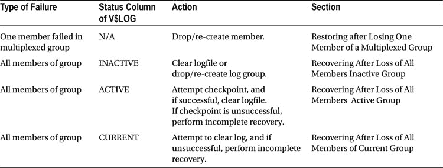

# restore and recover datafile
restore ( datafile 1 );
recover datafile 1;
sql 'alter database datafile 1 online';
```

检查脚本后，您可以决定手动运行建议的命令，也可以让数据恢复顾问通过 `REPAIR` 命令运行脚本（详见下一节）。

**修复故障**

如果您已识别故障并查看了建议，则可以继续进行修复工作。如果您想在不实际运行命令的情况下检查 `REPAIR FAILURE` 命令将执行的操作，请使用 `PREVIEW` 子句：

```
RMAN> repair failure preview;
```

在运行 `REPAIR FAILURE` 命令之前，请确保您首先在同一连接会话中运行了 `LIST FAILURE` 和 `ADVISE FAILURE` 命令。换句话说，您所在的 RMAN 会话必须在运行 `REPAIR` 命令之前，在同一会话中运行过 `LIST` 和 `ADVISE` 命令。

如果您对修复建议满意，则运行 `REPAIR FAILURE` 命令：

```
RMAN> repair failure;
```

此时系统将提示您确认：

```
Do you really want to execute the above repair (enter YES or NO)?
```

输入 `YES` 以继续：

```
YES
```

如果一切顺利，您应该在输出中看到类似以下的最终消息：

```
repair failure complete
```

 **注意** 您可以从 RMAN 命令提示符或 Enterprise Manager 运行数据恢复顾问命令。

通过这种方式，您可以使用 RMAN 命令 `LIST FAILURE`、`ADVISE FAILURE` 和 `REPAIR FAILURE` 来解决介质故障。

**更改故障状态**

关于数据恢复顾问的最后一点说明：如果您知道有一个故障，并且它不是关键性的（例如，从一个不再使用的表空间中丢失了数据文件），那么可以使用 `CHANGE FAILURE` 命令来更改故障的优先级。在此示例中，有一个属于非关键表空间的丢失数据文件。首先，通过 `LIST FAILURE` 命令获取故障优先级：

```
RMAN> list failure;
```

以下是一些示例输出：

```
Failure ID Priority Status    Time Detected Summary
---------- -------- --------- ------------- -------
5          HIGH     OPEN      12-JAN-14     One or more non-system datafiles
                                            are missing
```

接下来，使用 `CHANGE FAILURE` 命令将优先级从 `HIGH` 更改为 `LOW`：

```
RMAN> change failure 5 priority low;
```

系统将提示您确认是否确实要更改优先级：

```
Do you really want to change the above failures (enter YES or NO)?
```

如果您确实要更改优先级，请键入 `YES`，然后按回车键。如果再次运行 `LIST FAILURE` 命令，您将看到优先级现已更改为 `LOW`：

```
RMAN> list failure low;
```

**使用 RMAN 停止/启动 Oracle**

您可以使用 RMAN 以几乎与 SQL*Plus 相同的方法来停止和启动数据库。在执行恢复和修复操作时，从 RMAN 内部停止和启动数据库通常更为方便。以下 RMAN 命令可用于停止和启动数据库：

*   `SHUTDOWN`
*   `STARTUP`
*   `ALTER DATABASE`

**关闭数据库**

`SHUTDOWN` 命令在 RMAN 中的工作方式与在 SQL*Plus 中相同。有四种关闭类型：`ABORT`、`IMMEDIATE`、`NORMAL` 和 `TRANSACTIONAL`。我通常首先尝试使用 `SHUTDOWN IMMEDIATE` 来停止数据库；如果这不起作用，请毫不犹豫地使用 `SHUTDOWN ABORT`。以下是一些示例：

```
RMAN> shutdown immediate;
RMAN> shutdown abort;
```

如果不指定关闭选项，则 `NORMAL` 是默认值。使用 `NORMAL` 关闭数据库很少可行，因为此模式会等待当前连接的用户在闲暇时断开连接。我从不使用 `NORMAL` 来关闭数据库。

**启动数据库**

与 SQL*Plus 一样，您可以组合使用 RMAN 中的 `STARTUP` 和 `ALTER DATABASE` 命令，使数据库逐步完成启动阶段，如下所示：

```
RMAN> startup nomount;
RMAN> alter database mount;
RMAN> alter database open;
```

这是另一个示例：

```
RMAN> startup mount;
RMAN> alter database open;
```

如果要以受限访问方式启动数据库，请使用 DBA 选项：

```
RMAN> startup dba;
```

 **提示** 从 Oracle 12c 开始，您可以直接从 RMAN 内部运行所有 SQL 语句，而无需指定 RMAN `sql` 命令。

**完全恢复**

如第 3 章所述，术语 *完全恢复* 表示您可以恢复在故障发生之前已提交的所有事务。*完全恢复* 并不意味着您正在恢复和修复数据库中的所有数据文件。例如，如果您有一个数据文件发生介质故障，并且您恢复和修复了该数据文件，那么您就是在执行完全恢复。对于完全恢复，必须满足以下条件：

*   您的数据库处于归档日志模式（archivelog mode）。
*   您拥有发生介质故障的数据文件的良好基线备份。
*   您拥有自上次备份以来生成的任何必需重做日志。
*   所有归档重做日志从上次备份开始时即存在。
*   RMAN 可用于恢复的任何增量备份都可用（如果使用）。
*   包含尚未归档的事务的联机重做日志可用。

如果您遇到了介质故障，并且拥有执行完全恢复所需的文件，则可以恢复和修复数据库。

**测试恢复与修复**


## 预览用于恢复的备份

在实际执行还原和恢复操作之前，你可以确定 `RMAN` 将使用哪些文件进行还原和恢复。你还可以指示 `RMAN` 验证将用于还原和恢复的备份文件的完整性。

使用 `RESTORE...PREVIEW` 命令可列出 `RMAN` 将用于还原和恢复数据库数据文件的备份和归档重做日志文件。`RESTORE...PREVIEW` 命令实际上并不还原任何文件，而是列出将用于还原操作的备份文件。此示例详细预览了整个数据库还原和恢复所需的备份：

```
RMAN> restore database preview;
```

你还可以在汇总详细信息级别预览所需的备份文件：

```
RMAN> restore database preview summary;
```

以下是输出内容的片段：

```
备份列表
===============
密钥     类型 LVL S  设备类型 完成时间       份数  副本数 压缩  标签
------- -- -- -  --------- --------------- ------- ------- -------- ---
12      B  0  A DISK        28-9 月 -14      1       1       是      TAG20140928T110657
11      B  0  A DISK        28-9 月 -14      1       1       是      TAG20140928T110657
```

以下是如何预览还原和恢复所需备份的更多示例：

```
RMAN> restore tablespace system preview;
RMAN> restore archivelog from time 'sysdate -1' preview;
RMAN> restore datafile 1, 2, 3 preview;
```

## 在还原前验证备份文件

你可以在不实际还原任何内容的情况下，对备份文件执行多个级别的验证。如果你只想让 `RMAN` 验证文件是否存在并检查文件头，请使用 `RESTORE...VALIDATE HEADER` 命令，如下所示：

```
RMAN> restore database validate header;
```

此命令仅验证备份文件的存在性并检查文件头。你可以通过 `RESTORE...VALIDATE` 命令（不带 `HEADER` 子句）进一步指示 `RMAN` 验证还原数据库数据文件所需的备份文件内的块的完整性。同样，在此模式下 `RMAN` 不会还原任何数据文件：

```
RMAN> restore database validate;
```

此命令仅检查备份文件内的物理损坏。你也可以同时检查逻辑损坏（和物理损坏），如下所示：

```
RMAN> restore database validate check logical;
```

以下是使用 `RESTORE...VALIDATE` 的其他一些示例：

```
RMAN> restore datafile 1,2,3 validate;
RMAN> restore archivelog all validate;
RMAN> restore controlfile validate;
RMAN> restore tablespace system validate;
```

## 测试介质恢复

前面的部分涵盖了报告和验证还原操作。你还可以通过 `RECOVER...TEST` 命令指示 `RMAN` 验证恢复过程。在执行测试恢复之前，你需要确保正在恢复的数据文件处于脱机状态。Oracle 会对任何在测试模式下恢复的联机数据文件抛出错误。

在此示例中，首先还原了 `USERS` 表空间，然后执行了试运行恢复：

```
RMAN> connect target /
RMAN> startup mount;
RMAN> restore tablespace users;
RMAN> recover tablespace users test;
```

如果恢复所需的任何归档重做日志缺失，则会抛出以下错误：

```
RMAN-06053: 由于缺少日志，无法执行介质恢复
RMAN-06025: 没有序列号为 6 的线程 1 的归档日志备份...
```

如果恢复测试成功，你将看到类似以下的消息，表明重做应用已被测试但未实际应用：

```
ORA-10574: 测试恢复未损坏任何数据块
ORA-10573: 测试恢复测试了从更改 4586939 到 4588462 的重做
ORA-10572: 由于错误，测试恢复已取消
ORA-10585: 测试恢复无法应用可能修改控制文件的重做
```

以下是测试恢复过程的一些其他示例：

```
RMAN> recover database test;
RMAN> recover tablespace users, tools test;
RMAN> recover datafile 1,2,3 test;
```

## 还原和恢复整个数据库

`RESTORE DATABASE` 命令将还原数据库中的每个数据文件。例外情况是当 `RMAN` 检测到数据文件已被还原时；在这种情况下，它不会再次还原它们。如果你想覆盖该行为，请使用 `FORCE` 命令。

当你发出 `RECOVER DATABASE` 命令时，`RMAN` 会自动将重做应用到任何需要恢复的数据文件。恢复过程包括应用在以下文件中发现的更改：
*   增量备份片（仅在使用增量备份时适用）
*   自上次备份或应用的增量备份以来生成的归档重做日志文件
*   联机重做日志文件（当前且未归档）

在还原和恢复过程完成后，你可以打开数据库。完整的数据库恢复仅在你拥有数据库的良好备份以及对备份后生成的所有重做的访问权限时才有效。你需要所有恢复数据库数据文件所需的重做。如果你没有所有必需的重做，那么你很可能必须执行不完全恢复（请参阅本章后面的“不完全恢复”部分）。

 **注意** 你的数据库必须至少处于装载状态才能使用 `RMAN` 还原数据文件。这是因为在还原和恢复过程中，`RMAN` 从控制文件中读取信息。

你可以使用当前控制文件或备份控制文件执行完整的数据库级恢复。

### 使用当前控制文件

你必须首先将数据库置于装载模式以执行数据库范围的还原和恢复。这是因为当与 `SYSTEM` 表空间关联的数据文件正在被还原和恢复时，Oracle 不允许你在打开模式下操作数据库。在此情况下，以装载模式启动数据库，发出 `RESTORE` 和 `RECOVER` 命令，然后打开数据库，如下所示：

```
$ rman target /
RMAN> startup mount;
RMAN> restore database;
RMAN> recover database;
RMAN> alter database open;
```

如果一切按预期进行，你应该看到的最后一条消息是：

```
语句已处理
```

### 使用备份控制文件

此技术使用从 `FRA` 检索到的控制文件的自动备份（有关如何还原控制文件的更多示例，请参阅本章后面的“还原控制文件”部分）。在此场景中，首先从备份中检索控制文件，然后再还原和恢复数据库：

```
$ rman target /
RMAN> startup nomount;
RMAN> restore controlfile from autobackup;
RMAN> alter database mount;
RMAN> restore database;
RMAN> recover database;
RMAN> alter database open resetlogs;
```

如果成功，你应该看到的最后一条消息是：

```
语句已处理
```

## 还原和恢复表空间

有时你会遇到局限于特定表空间或一组表空间的介质故障。在这种情况下，在表空间级别的粒度上进行还原和恢复是合适的。`RMAN` 的 `RESTORE TABLESPACE` 和 `RECOVER TABLESPACE` 命令将还原和恢复与指定表空间关联的所有数据文件。

### 在数据库打开时还原表空间

如果你的数据库处于打开状态，那么你必须将要还原和恢复的表空间脱机。除了 `SYSTEM` 和 `UNDO` 之外，你可以对任何表空间执行此操作。此示例在数据库打开时还原并恢复 `USERS` 表空间：

```
$ rman target /
RMAN> sql 'alter tablespace users offline immediate';
RMAN> restore tablespace users;
RMAN> recover tablespace users;
RMAN> sql 'alter tablespace users online';
```

在表空间联机后，你应该会看到类似这样的消息：

```
sql 语句: alter tablespace users online
```


# 在 RMAN 中执行恢复操作

从 Oracle 12c 开始，您可以直接运行 SQL 语句，无需使用 RMAN 的 `sql` 命令和相关的引号；例如，
```
$ rman target /
RMAN> alter tablespace users offline immediate;
RMAN> restore tablespace users;
RMAN> recover tablespace users;
RMAN> alter tablespace users online;
```

## 在数据库处于装载（MOUNT）模式时恢复表空间

通常，在执行恢复时，DBA 会关闭数据库并将其重新启动到装载模式，为执行恢复做准备。将数据库置于装载模式可确保没有用户连接到数据库，并且没有事务正在进行。

此外，如果您要恢复的是 `SYSTEM` 表空间，那么您必须以装载模式启动数据库。Oracle 不允许在数据库打开时恢复 `SYSTEM` 表空间的数据文件。下面的示例在数据库处于装载模式时恢复 `SYSTEM` 表空间：
```
$ rman target /
RMAN> shutdown immediate;
RMAN> startup mount;
RMAN> restore tablespace system;
RMAN> recover tablespace system;
RMAN> alter database open;
```
如果成功，您应该看到的最后一条消息是：
```
Statement processed
```

### 恢复只读表空间

当您发出 `RESTORE DATDABASE` 命令时，RMAN 会随数据库的其余部分一起恢复只读表空间。例如，以下命令将恢复所有数据文件（包括处于只读模式的数据文件）：
```
RMAN> restore database;
```
在 Oracle 11g 之前，您需要发出 `RESTORE DATABASE CHECK READONLY` 来指示 RMAN 一起恢复只读表空间和读写模式的表空间。在 Oracle 11g 及更高版本中，这不再是必需的。

 `Note` 如果您使用的是在只读表空间被置于只读模式之后创建的备份，那么只读数据文件不需要恢复。在这种情况下，自备份以来没有为只读表空间生成重做日志。

### 恢复临时表空间

从 Oracle 10g 开始，您不必恢复或重新创建丢失的本地管理临时表空间临时文件。当您打开数据库供使用时，Oracle 会自动检测并重新创建本地管理临时表空间的临时文件。

当 Oracle 自动重新创建临时表空间时，它会向您的目标数据库的 `alert.log` 中记录如下消息：
```
Re-creating tempfile <your temporary tablespace filename>
```
如果由于任何原因，您的临时表空间变得不可用，您也可以自己重新创建它。因为临时表空间中永远不会有永久对象，您可以根据需要简单地重新创建它们。以下是如何创建本地管理临时表空间的示例：
```
CREATE TEMPORARY TABLESPACE temp TEMPFILE
'/u01/dbfile/O12C/temp01.dbf' SIZE 1000M
EXTENT MANAGEMENT
LOCAL UNIFORM SIZE 512K;
```
如果您的临时表空间存在，但临时数据文件丢失了，您可以直接添加它们，如下所示：
```
alter tablespace temp
add tempfile '/u01/dbfile/O12C/temp02.dbf' SIZE 5000M REUSE;
```

## 恢复和恢复数据文件

数据文件级别的恢复和恢复适用于媒体故障仅限于一小部分数据文件的情况。对于数据文件级别的恢复，您可以指示 RMAN 使用数据文件名或数据文件号进行恢复和恢复。对于不与 `SYSTEM` 或 `UNDO` 表空间关联的数据文件，您可以选择在数据库保持打开状态时进行恢复和恢复。但是，在数据库打开时，您必须首先将任何要恢复和恢复的数据文件脱机。

### 在数据库打开时恢复和恢复数据文件

使用 `RESTORE DATAFILE` 和 `RECOVER DATAFILE` 命令在数据文件级别进行恢复和恢复。当您的数据库处于打开状态时，您需要将任何尝试恢复和恢复的数据文件脱机。此示例在数据库打开时恢复和恢复数据文件：
```
RMAN> sql 'alter database datafile 4, 5 offline';
RMAN> restore datafile 4, 5;
RMAN> recover datafile 4, 5;
RMAN> sql 'alter database datafile 4, 5 online';
```
 `Tip` 使用 RMAN 的 `REPORT SCHEMA` 命令列出数据文件名和文件号。您也可以查询 `V$DATAFILE` 的 `NAME` 和 `FILE#` 列来获取名称和编号。

您也可以指定要恢复和恢复的数据文件的名称；例如，
```
RMAN> sql "alter database datafile ''/u01/dbfile/O12C/users01.dbf'' offline";
RMAN> restore datafile '/u01/dbfile/O12C/users01.dbf';
RMAN> recover datafile '/u01/dbfile/O12C/users01.dbf';
RMAN> sql "alter database datafile ''/u01/dbfile/O12C/users01.dbf'' online";
```
 `Note` 当使用 RMAN 的 `sql` 命令时，如果 SQL 语句内部有单引号，则需要使用双引号包裹整个 SQL 语句，并且在原本使用单引号的地方使用两个单引号。

如前所述，从 Oracle 12c 开始，您可以直接运行 SQL 命令，无需 RMAN 的 `sql` 命令和相关的引号；例如，
```
RMAN> alter database datafile 4 offline;
RMAN> restore datafile 4;
RMAN> recover datafile 4;
RMAN> alter database datafile 4 online;
```
以下是相应的 12c 示例，使用数据文件名：
```
RMAN> alter database datafile '/u01/dbfile/O12C/users01.dbf' offline;
RMAN> restore datafile '/u01/dbfile/O12C/users01.dbf';
RMAN> recover datafile '/u01/dbfile/O12C/users01.dbf';
RMAN> alter database datafile '/u01/dbfile/O12C/users01.dbf' online;
```

### 在数据库未打开时恢复和恢复数据文件

在这种情况下，数据库首先被关闭，然后以装载模式启动。在数据库未打开时，您可以恢复和恢复数据库中的任何数据文件。此示例显示了恢复数据文件 1（与 `SYSTEM` 表空间关联）的过程：
```
$ rman target /
RMAN> shutdown abort;
RMAN> startup mount;
RMAN> restore datafile 1;
RMAN> recover datafile 1;
RMAN> alter database open;
```
在执行数据文件恢复时，您也可以指定文件名：
```
$ rman target /
RMAN> shutdown abort;
RMAN> startup mount;
RMAN> restore datafile '/u01/dbfile/O12C/system01.dbf';
RMAN> recover datafile '/u01/dbfile/O12C/system01.dbf';
RMAN> alter database open;
```

### 将数据文件恢复到非默认位置

有时会发生故障，导致与挂载点关联的磁盘无法操作。在这些情况下，您需要将数据文件恢复并恢复到与它们原始位置不同的位置。另一个需要将数据文件恢复到非默认位置的典型情况是，您正在恢复到一个不同的数据库服务器，该服务器的挂载点与备份来源的服务器的挂载点完全不同。

使用 `SET NEWNAME` 和 `SWITCH` 命令将数据文件恢复到非默认位置。这两个命令都必须在 RMAN 的 `run{}` 块内运行。您可以将使用 `SET NEWNAME` 和 `SWITCH` 视为重命名数据文件的一种方式（类似于 SQL*Plus 的 `ALTER DATABASE RENAME FILE` 语句）。

此示例在恢复和恢复时更改数据文件的位置。首先，将数据库置于装载模式：
```
$ rman target /
RMAN> startup mount;
```
然后，运行以下 RMAN 代码块：


# RMAN 数据文件恢复与块级恢复

## RMAN 数据文件恢复操作

以下是一个 RMAN 恢复脚本示例：

```
run{
set newname for datafile 4 to '/u02/dbfile/O12C/users01.dbf';
set newname for datafile 5 to '/u02/dbfile/O12C/users02.dbf';
restore datafile 4, 5;
switch datafile all; # 使用新数据文件位置更新存储库。
recover datafile 4, 5;
alter database open;
}
```

这是部分输出信息：

```
datafile 4 switched to datafile copy
input datafile copy RECID=79 STAMP=804533148 file name=/u02/dbfile/O12C/users01.dbf
datafile 5 switched to datafile copy
input datafile copy RECID=80 STAMP=804533148 file name=/u02/dbfile/O12C/users02.dbf
```

如果数据库处于打开状态，可以先将数据文件离线，然后为其设置新名称以进行恢复，如下所示：

```
run{
sql 'alter database datafile 4, 5 offline';
set newname for datafile 4 to '/u02/dbfile/O12C/users01.dbf';
set newname for datafile 5 to '/u02/dbfile/O12C/users02.dbf';
restore datafile 4, 5;
switch datafile all; # 使用新数据文件位置更新存储库。
recover datafile 4, 5;
sql 'alter database datafile 4, 5 online';
}
```

从 Oracle 12c 开始，运行 SQL 语句（例如`ALTER DATABASE`）时不再需要指定 RMAN `sql`命令；例如：

```
run{
alter database datafile 4, 5 offline;
set newname for datafile 4 to '/u02/dbfile/O12C/users01.dbf';
set newname for datafile 5 to '/u02/dbfile/O12C/users02.dbf';
restore datafile 4, 5;
switch datafile all; # 使用新数据文件位置更新存储库。
recover datafile 4, 5;
alter database datafile 4, 5 online;
}
```

## 块级恢复

块级损坏很少见，通常由某种 I/O 错误引起。但是，如果在大型数据文件中确实存在孤立的损坏块，能够执行块级恢复是一个很好的选择。当数据文件中只有少量块损坏时，块级恢复非常有用。如果整个数据文件都需要介质恢复，则块恢复不合适。

每当运行`BACKUP`、`VALIDATE`或`BACKUP VALIDATE`命令时，RMAN 会自动检测损坏块。关于损坏块的详细信息可以在`V$DATABASE_BLOCK_CORRUPTION`视图中查看。在以下示例中，常规备份作业在输出中报告了损坏块：

```
ORA-19566: exceeded limit of 0 corrupt blocks for file...
```

查询`V$DATABASE_BLOCK_CORRUPTION`视图可以指示哪个文件包含损坏：

```
SQL> select * from v$database_block_corruption;

FILE#     BLOCK#     BLOCKS CORRUPTION_CHANGE# CORRUPTIO     CON_ID
---------- ---------- ---------- ------------------ --------- ----------
         4         20          1                  0 ALL ZERO           0
```

执行块级恢复时，数据库可以处于装载或打开状态。无需将正在恢复的数据文件离线。可以指示 RMAN 恢复在`V$DATABASE_BLOCK_CORRUPTION`中报告的所有块，如下所示：

```
RMAN> recover corruption list;
```

如果成功，将显示以下消息：

```
media recovery complete...
```

另一种恢复块的方法是指定数据文件和块号，如下所示：

```
RMAN> recover datafile 4 block 20;
```

最好使用`RECOVER CORRUPTION LIST`语法，因为它会从`V$DATABASE_BLOCK_CORRUPTION`视图中清除所有已恢复的块。

**注意：** RMAN 无法对数据文件头（块 1）执行块级恢复。

块级介质恢复允许您保持数据库可用，并减少平均恢复时间，因为在恢复期间只有损坏块处于离线状态。执行块级恢复时，数据库必须处于归档日志模式。从 Oracle 11g 开始，RMAN 可以从闪回日志中还原块（如果可用）。如果闪回日志不可用，则 RMAN 将尝试从完整备份、0 级备份或由`BACKUP AS COPY`命令生成的映像副本备份中还原块。块还原后，任何所需的归档重做日志必须可用才能恢复该块。RMAN 无法使用增量 1 级（或更高级别）备份执行块介质恢复。

**注意：** 如果您使用的是 Oracle 10g 或 Oracle9i，请使用`BLOCKRECOVER`命令执行块介质恢复。

## 恢复容器数据库及其关联的可插拔数据库

从 Oracle 12c 开始，您可以在一个容器数据库中创建可插拔数据库。在处理容器及其关联的可插拔数据库时，有三种基本场景：

*   所有数据文件都经历了介质故障（容器根数据文件以及所有关联的可插拔数据库数据文件）。
*   仅与容器根数据库关联的数据文件经历了介质故障。
*   仅与某个可插拔数据库关联的数据文件经历了介质故障。

以下部分涵盖了上述场景。

### 恢复和还原所有数据文件

要恢复和还原与容器数据库关联的所有数据文件（包括根容器、种子容器和所有关联的可插拔数据库），请使用具有`sysdba`或`sysbackup`权限的用户通过 RMAN 连接到容器数据库。因为正在还原与根系统表空间关联的数据文件，所以数据库必须以装载模式启动（而非打开）：

```
$ rman target /
RMAN> startup mount;
RMAN> restore database;
RMAN> recover database;
RMAN> alter database open;
```

请记住，当您打开容器数据库时，默认情况下不会打开关联的可插拔数据库。您可以从根容器中打开它们，如下所示：

```
RMAN> alter pluggable database all open;
```

### 恢复和还原根容器数据文件

如果仅与根容器关联的数据文件损坏，则可以在根级别进行恢复和还原。在此示例中，正在还原根容器的系统数据文件，因此数据库不能处于打开状态。以下命令指示 RMAN 仅还原与根容器数据库关联的数据文件，通过关键字`root`实现：

```
$ rman target /
RMAN> startup mount;
RMAN> restore database root;
RMAN> recover database root;
RMAN> alter database open;
```

在之前的代码中，`restore database root`命令指示 RMAN 仅还原与根容器数据库关联的数据文件。容器数据库打开后，您必须打开任何关联的可插拔数据库。您可以从根容器中执行此操作，如下所示：

```
RMAN> alter pluggable database all open;
```

您可以通过以下查询检查可插拔数据库的状态：

```
SQL> select name, open_mode from v$pdbs;
```

### 恢复和还原可插拔数据库

您有两种选项来恢复和还原可插拔数据库：

*   以容器根用户身份连接，并指定要恢复和还原的可插拔数据库。
*   直接以特权可插拔级别用户身份连接到可插拔数据库，并发出`RESTORE`和`RECOVER`命令。

第一个示例连接到根容器，并恢复和还原与`salespdb`可插拔数据库关联的数据文件。为此，可插拔数据库不能处于打开状态（因为可插拔数据库的系统数据文件也将被恢复和还原）：


## 恢复可插拔数据库

您可以使用 RMAN 连接到根容器数据库来恢复整个可插拔数据库。

```
$ rman target /
RMAN> alter pluggable database salespdb close;
RMAN> restore pluggable database salespdb;
RMAN> recover pluggable database salespdb;
RMAN> alter pluggable database salespdb open;
```

您也可以直接连接到一个可插拔数据库并执行恢复操作。当直接连接到可插拔数据库时，用户只能访问与该可插拔数据库关联的数据文件：

```
$ rman target sys/foo@salespdb
RMAN> shutdown immediate;
RMAN> restore database;
RMAN> recover database;
RMAN> alter database open;
```

 `注意` 当您直接连接到可插拔数据库时，不能在 `RESTORE` 和 `RECOVER` 命令中指定可插拔数据库的名称。在这种情况下，您会收到 `RMAN-07536: command not allowed when connected to a Pluggable Database` 错误。

前面的代码只影响与您所连接的可插拔数据库关联的数据文件。可插拔数据库需要关闭才能进行此操作。但是，根容器数据库可以是打开或挂载状态。此外，您必须使用在连接到可插拔数据库时以特权用户身份进行的备份。特权可插拔数据库用户无法访问由根容器数据库特权用户启动的数据文件备份。

## 恢复归档重做日志文件

RMAN 会在恢复过程中自动恢复它需要的任何归档重做日志文件。通常您不需要手动恢复归档重做日志文件。但是，在以下任何情况适用时，您可能希望这样做：

*   您需要恢复归档重做日志文件，以便稍后执行恢复；其思路是，如果归档重做日志文件已经恢复，将加快恢复操作。
*   您需要将归档重做日志文件恢复到非默认位置，无论是由于介质故障还是存储空间问题。
*   您需要恢复特定的归档重做日志文件，以便通过 LogMiner 进行检查。

如果您启用了 FRA，那么 RMAN 默认会将归档重做日志文件恢复到由初始化参数 `DB_RECOVERY_FILE_DEST` 定义的目标位置。否则，RMAN 使用 `LOG_ARCHIVE_DEST_N` 初始化参数（其中 `N` 通常为 1）来确定恢复归档重做日志文件的位置。

如果您将归档重做日志文件恢复到非默认位置，RMAN 知道它们被恢复到的位置，并会在您发出任何后续 `RECOVER` 命令时自动找到这些文件。RMAN 不会恢复它认为已经存在于磁盘上的归档重做日志文件。即使您指定了非默认位置，如果文件已存在，RMAN 也不会将归档重做日志文件恢复到磁盘。在这种情况下，RMAN 仅返回一条消息，说明该归档重做日志文件已被恢复。使用 `FORCE` 选项可以覆盖此行为。

如果您不确定在恢复日志文件时要使用的序列号，可以查询 `V$LOG_HISTORY` 视图。

 `提示` 请记住，您无法恢复从未备份过的归档重做日志。此外，如果包含该归档重做日志的备份文件不再可用，您也无法恢复它。运行 `LIST ARCHIVELOG ALL` 命令可以查看磁盘上当前的归档重做日志，运行 `LIST BACKUP OF ARCHIVELOG ALL` 可以验证哪些归档重做日志文件在可用的 RMAN 备份中。

### 恢复到默认位置

以下命令将恢复 RMAN 已备份的所有归档重做日志文件：

```
RMAN> restore archivelog all;
```

如果您想从指定的序列开始恢复，请使用 `FROM SEQUENCE` 子句。您可能需要先运行此查询以确定已生成的最新日志文件和序列号：

```
SQL> select sequence#, first_time from v$log_history order by 2;
```

此示例从序列 68 开始恢复所有归档重做日志文件：

```
RMAN> restore archivelog from sequence 68;
```

如果您想恢复一定范围的归档重做日志文件，请使用 `FROM SEQUENCE` 和 `UNTIL SEQUENCE` 子句或 `SEQUENCE BETWEEN` 子句，如下所示。以下命令恢复从序列 68 到序列 78 的归档重做日志文件，使用线程 1：

```
RMAN> restore archivelog from sequence 68 until sequence 78 thread 1;
RMAN> restore archivelog sequence between 68 and 78 thread 1;
```

默认情况下，如果归档重做日志文件已在磁盘上，RMAN 不会恢复它。如果您使用 `FORCE`，则可以覆盖此行为，如下所示：

```
RMAN> restore archivelog from sequence 1 force;
```

### 恢复到非默认位置

如果您想将归档重做日志文件恢复到与默认位置不同的位置，请使用 `SET ARCHIVELOG DESTINATION` 子句。以下示例恢复到非默认位置 `/u01/archtemp`。`SET` 命令的此选项必须在 RMAN `run{}` 块内执行。

```
run{
set archivelog destination to '/u01/archtemp';
restore archivelog from sequence 8 force;
}
```

### 恢复控制文件

如果您丢失了一个控制文件，并且您有多个副本，那么您可以关闭数据库，并通过将一个好的控制文件复制到丢失控制文件的正确位置和名称来简单地恢复丢失或损坏的控制文件（有关详细信息，请参见 第 2 章）。

下面列出了恢复控制文件时的三种典型场景：

*   使用恢复目录
*   使用自动备份
*   指定备份文件名

### 使用恢复目录

当您连接到恢复目录时，即使目标数据库处于 nomount 模式，您也可以查看有关控制文件的备份信息。要列出控制文件的备份，请使用 `LIST` 命令，如下所示：

```
$ rman target / catalog rcat/foo@rcat
RMAN> startup nomount;
RMAN> list backup of controlfile;
```

如果您丢失了所有控制文件，并且正在使用恢复目录，那么请发出 `STARTUP NOMOUNT` 和 `RESTORE CONTROLFILE` 命令：

```
RMAN> startup nomount;
RMAN> restore controlfile;
```

RMAN 将控制文件恢复到由您的 `CONTROL_FILES` 初始化参数定义的位置。您应该会看到一条消息，指示您的控制文件已成功从 RMAN 备份片复制回来。您现在可以将数据库更改为 mount 模式，并执行数据库所需的任何其他恢复和恢复命令。

 `注意` 当您从备份恢复控制文件时，需要对整个数据库执行介质恢复，并使用 `OPEN RESETLOGS` 命令打开数据库，即使您没有恢复任何数据文件。您可以通过查询 `V$DATABASE` 视图的 `CONTROLFILE_TYPE` 列来确定您的控制文件是否是备份。

### 使用自动备份

当您启用控制文件的自动备份并使用 FRA 时，恢复控制文件相当简单。首先，连接到您的目标数据库，然后发出 `STARTUP NOMOUNT` 命令，接着是 `RESTORE CONTROLFILE FROM AUTOBACKUP` 命令，如下所示：

```
$ rman target /
RMAN> startup nomount;
RMAN> restore controlfile from autobackup;
```

RMAN 将控制文件恢复到由您的 `CONTROL_FILES` 初始化参数定义的位置。您应该会看到一条消息，指示您的控制文件已成功从 RMAN 备份片复制回来。以下是输出片段：

```
channel ORA_DISK_1: control file restore from AUTOBACKUP complete
```

您现在可以将数据库更改为 mount 模式，并执行数据库所需的任何其他恢复和恢复命令。

### 指定备份文件名

（注：原文在此处结束，未提供后续内容。）


### 恢复控制文件

当将数据库恢复到不同服务器时，通常的最初步骤包括：对目标数据库进行备份、复制到远程服务器，然后从 RMAN 备份中恢复控制文件。在这些场景中，我通常知道包含控制文件的备份片名称。以下是一个示例，展示如何指示 RMAN 从特定的备份片文件恢复控制文件：

```
RMAN> startup nomount;
RMAN> restore controlfile from
'/u01/O12C/rman/rman_ctl_c-3423216220-20130113-01.bk';
```

控制文件将被恢复到由`CONTROL_FILES`初始化参数定义的位置。

## 恢复 spfile

出于以下几个不同原因，您可能需要恢复`spfile`：
*   您不小心在`spfile`中设置了一个导致实例无法启动的值。
*   您不小心删除了`spfile`。
*   您需要查看`spfile`在过去某个时间点的状态。

一个（我遇到过不止一次）场景是：您正在使用`spfile`，而团队中的一位 DBA 执行了一些令人费解的操作，例如：

```
SQL> alter system set processes=1000000 scope=spfile;
```

该参数在磁盘上的`spfile`中被更改，但在内存中未更改。一段时间后，数据库因维护而停止。当尝试启动数据库时，您甚至无法让实例处于`nomount`状态。这是因为某个参数被设置为一个过大的值，会消耗服务器上的所有内存。在这种情况下，实例可能会挂起，或者您可能会看到以下一条或多条信息：

```
ORA-01078: failure in processing system parameters
ORA-00838: Specified value of ... is too small
```

如果您有一个包含修改前`spfile`副本的 RMAN 备份，您可以直接恢复`spfile`。如果您使用恢复目录，以下是恢复`spfile`的步骤：

```
$ rman target / catalog rcat/foo@rcat
RMAN> startup nomount;
RMAN> restore spfile;
```

*   如果您不使用恢复目录，有多种方法可以恢复`spfile`。您采取的方法取决于几个变量，例如：
    *   您是否使用了 FRA
    *   您是否为自动备份配置了通道备份位置
    *   您是否使用了自动备份的默认位置

我不会展示这些场景的每个细节。通常，我会确定包含`spfile`备份的备份片位置并执行恢复，像这样：

```
RMAN> startup nomount force;
RMAN> restore spfile to '/tmp/spfile.ora'
      from '/u01/O12C/rman/rman_ctl_c-3423216220-20130113-00.bk';
```

您应该会看到类似这样的消息：

```
channel ORA_DISK_1: SPFILE restore from AUTOBACKUP complete
```

在此示例中，`spfile`被恢复到`/tmp`目录。恢复后，您可以使用正确的名称将`spfile`复制到`ORACLE_HOME/dbs`。对于我的环境（数据库名：`O12C`），操作如下：

```
$ cp /tmp/spfile.ora $ORACLE_HOME/dbs/spfileo12c.ora
```

 **注意**  有关所有可能的`spfile`和控制文件恢复场景的完整描述，请参阅*RMAN Recipes for Oracle Database 12c*。

## 不完全恢复

术语*不完全数据库恢复*意味着您无法恢复所有已提交的事务。*不完全*意味着您不应用所有重做日志来恢复到最后一个已提交事务发生的时间点。换句话说，您是将数据库恢复并恢复到过去的某个时间点。因此，不完全数据库恢复也称为数据库时间点恢复（DBPITR）。通常，您出于以下原因之一执行不完全数据库恢复：
*   您没有执行完整恢复所需的所有重做日志。您缺少归档重做日志文件或联机重做日志文件。这种情况可能是因为所需的重做文件损坏或丢失。
*   您有意将数据库回滚到过去的某个时间点。例如，如果有人意外截断了表，而您希望将数据库回滚到发出截断表命令之前，就需要这样做。

不完全数据库恢复包括两个步骤：恢复和恢复。恢复步骤重新创建数据文件，恢复步骤应用重做日志直到指定的时间点。恢复过程可以通过 RMAN 以几种不同的方式启动：
*   `RESTORE DATABASE UNTIL`
*   `FLASHBACK DATABASE`

对于大多数不完全数据库恢复的情况，您使用`RESTORE DATABASE UNTIL`命令指示 RMAN 从 RMAN 备份文件中检索数据文件。这种类型的不完全数据库恢复是本章此部分的主要重点。Flashback Database 功能将在本章后面的“闪回数据库”部分介绍。

`RESTORE DATABASE`命令的`UNTIL`部分指示 RMAN 基于以下方法之一从过去的某个时间点检索数据文件：
*   时间
*   SCN
*   日志序列号
*   还原点

RMAN 的`RESTORE DATABASE UNTIL`命令将从最新的备份集或映像副本中检索所有数据文件。RMAN 会根据`UNTIL`子句自动确定哪个备份集包含所需的数据文件。如果您省略`RESTORE DATABASE`命令的`UNTIL`子句，RMAN 将从最新可用的备份集或映像副本中检索数据文件。在某些情况下，这可能是您期望的行为。我建议您使用`UNTIL`子句以确保 RMAN 从正确的备份集中恢复。当您发出`RESTORE DATABASE UNTIL`命令时，RMAN 将确定如何从以下任何类型的备份中提取数据文件：
*   完整数据库备份
*   增量 0 级备份
*   由`BACKUP AS COPY`命令生成的映像副本备份

您不能在数据库联机数据文件的子集上执行不完全数据库恢复。执行不完全恢复时，在使用`ALTER DATABASE OPEN RESETLOGS`命令打开数据库之前，所有联机数据文件的检查点 SCN 必须同步。您可以通过此 SQL 查询查看数据文件头 SCN 和每个数据文件的状态：

```
select file#, status, fuzzy,
error, checkpoint_change#,
to_char(checkpoint_time,'dd-mon-rrrr hh24:mi:ss') as checkpoint_time
from v$datafile_header;
```

 **注意**  `V$DATAFILE_HEADER`中的`FUZZY`列包含一个或多个数据块的 SCN 值大于或等于数据文件头中检查点 SCN 的数据文件。如果数据文件已恢复并且`FUZZY`值为`YES`，则需要进行介质恢复。

不在数据库联机文件的子集上执行不完全恢复规则的唯一例外是表空间时间点恢复（TSPITR），它使用`RECOVER TABLESPACE UNTIL`命令。TSPITR 在罕见情况下使用；它仅恢复和恢复您指定的表空间。有关 TSPITR 的更多详细信息，请参阅*RMAN Recipes for Oracle Database 12c*。

不完全数据库恢复的恢复部分总是通过`RECOVER DATABASE UNTIL`命令启动。RMAN 将自动恢复您的数据库，直到使用`UNTIL`子句指定的点。与`RESTORE`命令类似，您可以按时间、变更/SCN、日志序列号或还原点进行恢复。当 RMAN 达到指定点时，它将自动终止恢复过程。


 **注意** 无论您在 `UNTIL` 子句中指定了什么，RMAN 都会将其转换为相应的 `UNTIL SCN` 子句并分配适当的 SCN。这是为了避免任何时间问题，特别是由夏令时引起的问题。

在恢复期间，RMAN 会自动确定如何应用重做。首先，RMAN 会应用任何可用的增量备份。接下来，将应用磁盘上的任何归档重做日志文件。如果归档重做日志文件不存在于磁盘上，那么 RMAN 将尝试从备份集中检索它们。如果您想将重做应用作为不完整数据库恢复的一部分，则必须满足以下条件：

*   您的数据库处于归档日志模式。
*   您拥有所有数据文件的良好备份。
*   您拥有恢复到指定点所需的所有重做。

 **提示** 从 Oracle 10g 开始，您可以使用 `RECOVER DATABASE PARALLEL` 命令执行并行介质恢复。

在使用 RMAN 执行不完整的数据库恢复时，必须将数据库置于装载（mount）模式。RMAN 需要数据库处于装载模式才能读写控制文件。此外，对于不完整的数据库恢复，任何 `SYSTEM` 表空间的数据文件总是会被恢复。Oracle 不允许您在恢复 `SYSTEM` 表空间数据文件时打开数据库。

 **注意** 执行完不完整的数据库恢复后，您需要使用 `ALTER DATABASE OPEN RESETLOGS` 命令打开数据库。

根据具体情况，您可以使用 RMAN 执行各种不完整的恢复方法。下一节将讨论如何确定要执行哪种类型的不完全恢复。

## 确定不完全恢复的类型

当您知道要恢复数据库的大致日期和时间时，通常使用基于时间的还原和恢复。例如，您可能知道希望停止恢复过程的大致时间，但不知道特定的 SCN。

基于日志序列和基于取消的恢复在您有丢失或损坏的日志文件的情况下效果很好。在这种情况下，您只能恢复到最后一个完好的归档重做日志文件。

如果您能精确定位希望停止恢复过程的 SCN，那么基于 SCN 的恢复效果很好。您可以从 `V$LOG` 和 `V$LOG_HISTORY` 等视图中检索 SCN 信息。您还可以使用 LogMiner 等工具来检索特定 SQL 语句的 SCN。

还原点恢复仅在您已建立还原点的情况下有效。在这些情况下，您可以还原并恢复到与指定还原点关联的 SCN。

TSPITR 用于只需要还原和恢复少数几个表空间的情况。您可以使用 RMAN 来自动化与此类不完整恢复相关的许多任务。

## 执行基于时间的恢复

要将数据库还原并恢复到过去的某个时间点，您可以使用 `RESTORE` 和 `RECOVER` 命令的 `UNTIL TIME` 子句，或者在 `run{}` 块中使用 `SET UNTIL TIME` 子句。RMAN 将还原并恢复数据库到指定时间之前，但不包括该时间。换句话说，RMAN 将还原在指定时间之前提交的所有事务。RMAN 会在达到您指定的时间时自动停止恢复过程。

RMAN 期望的默认日期格式是 `YYYY-MM-DD:HH24:MI:SS`。但是，我建议使用 `TO_DATE` 函数并指定格式掩码。这可以消除不同国家日期格式的歧义，也不必设置操作系统 `NLS_DATE_FORMAT` 变量。以下示例在发出 `restore` 和 `recover` 命令时指定了时间：

```bash
$ rman target /
RMAN> startup mount;
RMAN> restore database until time
      "to_date('15-jan-2015 12:20:00', 'dd-mon-rrrr hh24:mi:ss')";
RMAN> recover database until time
      "to_date('15-jan-2015 12:20:00', 'dd-mon-rrrr hh24:mi:ss')";
RMAN> alter database open resetlogs;
```

如果一切顺利，您应该看到类似这样的输出：

```
Statement processed
```

## 执行基于日志序列的恢复

通常，这种类型的不完整数据库恢复是因为您丢失或损坏了归档重做日志文件而启动的。如果是这种情况，您只能恢复到最后一个完好的归档重做日志文件，因为您无法跳过丢失的归档重做日志。

您如何确定要恢复到（但不包括）哪个归档重做日志文件会有所不同。例如，如果您物理上丢失了一个归档重做日志文件，并且 RMAN 无法在备份集中找到它，那么在尝试应用丢失的文件时，您会收到类似这样的消息：

```
RMAN-06053: unable to perform media recovery because of missing log
RMAN-06025: no backup of archived log for thread 1 with sequence 19...
```

根据之前的错误消息，您将恢复到（但不包括）日志序列 19。

```bash
$ rman target /
RMAN> startup mount;
RMAN> restore database until sequence 19;
RMAN> recover database until sequence 19;
RMAN> alter database open resetlogs;
```

如果成功，您应该看到类似这样的输出：

```
Statement processed
```

 **注意** 基于日志序列的恢复类似于用户管理的基于取消的恢复。有关用户管理的基于取消的恢复的详细信息，请参阅第 3 章。

## 执行基于 SCN 的恢复

当您知道希望结束还原和恢复会话的 SCN 值时，基于 SCN 的不完整数据库恢复非常有效。RMAN 将恢复到指定 SCN 之前，但不包括该 SCN。RMAN 会在达到指定的 SCN 时自动终止还原过程。

您可以通过多种方式查看数据库的 SCN 信息：

*   使用 LogMiner 确定与 DDL 或 DML 语句关联的 SCN
*   查看 `alert.log` 文件
*   查看跟踪文件
*   查询 `V$LOG`、`V$LOG_HISTORY` 和 `V$ARCHIVED_LOG` 的 `FIRST_CHANGE#` 列

确定要还原到的 SCN 后，使用 `UNTIL SCN` 子句还原到指定 SCN 之前，但不包括该 SCN。以下示例还原所有 SCN 小于 95019865425 的事务：

```bash
$ rman target /
RMAN> startup mount;
RMAN> restore database until scn 95019865425;
RMAN> recover database until scn 95019865425;
RMAN> alter database open resetlogs;
```

如果一切顺利，您应该看到类似这样的输出：

```
Statement processed
```

## 还原到还原点

有两种类型的还原点：普通还原点和保证还原点。保证还原点和普通还原点之间的主要区别在于，保证还原点最终不会从控制文件中老化清除；保证还原点将一直保留，直到您将其删除。保证还原点确实需要一个 FRA。但是，对于使用保证还原点的不完整恢复，您不必启用闪回数据库。

您可以使用 SQL*Plus 创建普通还原点，如下所示：

```sql
SQL> create restore point MY_RP;
```

此命令创建一个名为 `MY_RP` 的还原点，它与发出命令时数据库的 SCN 相关联。您可以查看数据库的当前 SCN，如下所示：

```sql
SQL> select current_scn from v$database;
```

您可以查看 `V$RESTORE_POINT` 视图中的还原点信息，如下所示：

```sql
SQL> select name, scn from v$restore_point;
```

还原点就像特定 SCN 的同义词。还原点允许您还原并恢复到某个 SCN，而无需指定一个数字。RMAN 将还原并恢复到与还原点关联的 SCN 之前，但不包括该 SCN。


# RMAN 与闪回技术详解

## 使用 RMAN 恢复到还原点

此示例演示了如何恢复数据库到 `MY_RP` 还原点：

```sql
$ rman target /
RMAN> startup mount;
RMAN> restore database until restore point MY_RP;
RMAN> recover database until restore point MY_RP;
RMAN> alter database open resetlogs;
```

## 将表恢复到先前时间点

从 Oracle 12c 开始，你可以通过 `RECOVER TABLE` 命令从 RMAN 备份中恢复单个表。这使你能够将表恢复到过去的某个时间点。

表级恢复功能使用临时辅助实例和 Data Pump 实用程序。在恢复表时，辅助实例和 Data Pump 都会创建临时文件。在启动表级恢复之前，首先创建两个目录：一个用于存放辅助实例使用的文件，另一个用于存储 Data Pump 转储文件：

```bash
$ mkdir /tmp/oracle
$ mkdir /tmp/recover
```

上面的两个目录在 `RECOVER TABLE` 命令中通过 `AUXILIARY DESTINATION` 和 `DATAPUMP DESTINATION` 子句引用。在以下代码片段中，由 `MV_MAINT` 拥有的 `INV` 表被恢复到之前的某个 SCN：

```sql
recover table mv_maint.inv
until scn 4689805
auxiliary destination '/tmp/oracle'
datapump destination '/tmp/recover';
```

前提是存在包含该表在指定 SCN 时状态的 RMAN 备份，这样表级恢复和恢复操作才能执行。

> 注意：你还可以将表恢复到 SCN、时间点或日志序列号。

当 RMAN 执行表级恢复时，它会自动创建一个临时辅助数据库，使用 Data Pump 导出该表，然后将表作为它在指定还原点时的状态导入回目标数据库。恢复完成后，辅助数据库会被删除，Data Pump 转储文件也会被移除。

> 提示：尽管 `RECOVER TABLE` 命令是一个很好的增强功能，但建议，如果不小心删除了表，首先探索使用闪回到删除前（Flashback Table to Before Drop）功能来恢复表。或者，如果表被错误地删除了数据，则使用闪回表（Flashback Table）功能将表闪回到过去的某个时间点。如果以上选项都不可行，再考虑使用 RMAN 恢复表功能。

## 闪回表

在 Oracle 10g 之前，如果不小心删除了表，你必须执行以下步骤来恢复表：

1.  将数据库备份恢复到测试数据库。
2.  执行不完全恢复，直到删除表的时间点。
3.  导出该表。
4.  将表导入到生产数据库。

这个过程可能非常耗时且资源密集。它需要额外的服务器资源，以及 DBA 的时间和精力。

为了简化意外删除表的恢复，Oracle 引入了闪回表（Flashback Table）功能。Oracle 提供了两种不同类型的闪回表操作：

*   `FLASHBACK TABLE TO BEFORE DROP` 可以快速撤消之前删除的表。此功能使用一个名为回收站的逻辑容器。
*   `FLASHBACK TABLE` 可闪回到最近的某个时间点，以撤消不期望的 DML 语句的影响。你可以闪回到 SCN、时间戳或还原点。

Oracle 引入 `FLASHBACK TABLE TO BEFORE DROP` 是为了让你能够快速恢复已删除的表。从 Oracle 10g 开始，当你删除一个表时，如果没有指定 `PURGE` 子句，Oracle 不会真正删除该表——而是将其重命名。任何被你删除（由 Oracle 重命名）的表都会被放入回收站。回收站为你提供了一种高效的方式来查看和管理已删除的对象。

> 注意：要使用闪回表功能，你不需要实施 FRA（快速恢复区），也不需要启用闪回数据库。

`FLASHBACK TABLE TO BEFORE DROP` 操作仅在你的数据库启用了回收站功能时有效（默认是启用的）。你可以按如下方式检查回收站的状态：

```sql
SQL> show parameter recyclebin

NAME                                 TYPE        VALUE
------------------------------------ ----------- -------
recyclebin                           string      on
```

### FLASHBACK TABLE TO BEFORE DROP

当你删除一个表时，如果没有指定 `PURGE` 子句，Oracle 会用一个系统生成的名称重命名该表。因为表并非真正被删除，你可以使用 `FLASHBACK TABLE TO BEFORE DROP` 来指示 Oracle 用其原始名称重命名表。下面是一个例子。假设 `INV` 表被意外删除：

```sql
SQL> drop table inv;
```

通过查看回收站的内容来验证表已被重命名：

```sql
SQL> show recyclebin;
ORIGINAL NAME    RECYCLEBIN NAME                OBJECT TYPE  DROP TIME
---------------- ------------------------------ ------------ -----------
INV      BIN$BCRjF6KSbi/gU7fQTwrP+Q==$0 TABLE    2014-09-28:11:26:15
```

`SHOW RECYCLEBIN` 语句只显示已删除的表。要获得更完整的重命名对象视图，请查询 `RECYCLEBIN` 视图：

```sql
SQL> select object_name, original_name, type from recyclebin;
```

输出如下：

```
OBJECT_NAME                              ORIGINAL_NAME        TYPE
---------------------------------------- -------------------- ----------
BIN$BCRjF6KSbi/gU7fQTwrP+Q==$0           INV                  TABLE
BIN$BCRjF6KRbi/gU7fQTwrP+Q==$0           INV_TRIG             TRIGGER
BIN$BCRjF6KQbi/gU7fQTwrP+Q==$0           INV_PK               INDEX
```

在此输出中，该表还有一个在对象删除时被重命名的主键。要恢复（取消删除）该表，请执行：

```sql
SQL> flashback table inv to before drop;
```

前面的命令将表恢复为其原始名称。但是，此语句不会将索引恢复为其原始名称：

```sql
SQL> select index_name from user_indexes where table_name='INV';

INDEX_NAME
----------------------------------------
BIN$BCRjF6KQbi/gU7fQTwrP+Q==$0
```

在这种情况下，你必须重命名索引：

```sql
SQL> alter index "BIN$BCRjF6KQbi/gU7fQTwrP+Q==$0" rename to inv_pk;
```

你还必须以同样的方式重命名任何触发器对象。如果在删除表之前存在引用约束，你必须手动重新创建它们。

如果由于某些原因，你需要将表闪回到一个与原始名称不同的名称，可以按如下方式操作：

```sql
SQL> flashback table inv to before drop rename to inv_bef;
```

### 将表闪回到之前的时点

如果表被错误地删除了数据，你可以选择将表闪回到之前的某个时间点。闪回表功能使用回滚表空间中的信息来恢复表。过去的那个时间点取决于你的回滚表空间保留期，它指定了回滚信息保留的最短时间。

如果所需的闪回信息不在回滚表空间中，你会收到类似以下的错误：

```
ORA-01555: snapshot too old
```

换句话说，要能够闪回到过去的某个时间点，回滚表空间中所需的信息不能被覆盖。

### FLASHBACK TABLE TO SCN

假设你正在测试一个应用程序功能，并希望快速将表恢复到某个特定的 SCN。作为应用程序测试的一部分，你在测试开始前记录了 SCN：

```sql
SQL> select current_scn from v$database;

CURRENT_SCN
-----------
    4760089
```

你执行了一些测试，然后希望将表闪回到之前记录的 SCN。首先，确保为表启用了行移动：

```sql
SQL> alter table inv enable row movement;
SQL> flashback table inv to scn 4760089;
```

该表现在应该反映截至在 `FLASHBACK` 语句中指定的历史 SCN 值时已提交的事务。

### FLASHBACK TABLE TO TIMESTAMP

（此处原文内容不完整，故保留原有标题）


你也可以将表闪回到之前的某个时间点。例如，要将表闪回到 15 分钟前，首先启用行移动，然后使用 `FLASHBACK TABLE`：

```
SQL> alter table inv enable row movement;
SQL> flashback table inv to timestamp(sysdate-1/96);
```

你提供的时间戳必须能解析为有效的 Oracle 时间戳格式。你也可以显式指定一个时间，如下所示：

```
SQL> flashback table inv to timestamp
     to_timestamp('14-jan-15 12:07:33','dd-mon-yy hh24:mi:ss');
```

## FLASHBACK TABLE TO RESTORE POINT（闪回表到还原点）

还原点（restore point）是数据库中与时间戳或 SCN 关联的一个名称。你可以创建一个包含数据库当前 SCN 的还原点，如下所示：

```
SQL> create restore point point_a;
```

之后，如果你决定将表闪回到该还原点，同样需要先启用行移动：

```
SQL> alter table inv enable row movement;
SQL> flashback table inv to restore point point_a;
```

此时，表中的数据应恢复到与指定还原点所关联的 SCN 时相同的事务状态。

## Flashback Database（闪回数据库）

闪回数据库（Flashback Database）功能允许你执行不完全恢复，回退到过去的某个时间点。闪回数据库使用存储在闪回日志中的信息；它不依赖于还原数据库文件（如冷备份、热备份和 RMAN 那样）。

`提示`：闪回数据库并不能替代你的数据库备份。如果遇到数据文件介质故障，你无法使用闪回数据库闪回到故障发生之前。如果数据文件损坏，你必须使用物理备份（热备、冷备或 RMAN）进行还原和恢复。

在需要将数据库一致地重置到过去某个时间点的场景下，闪回数据库功能可能非常有用。例如，你可能需要定期将测试或培训数据库重置回已知基线。或者，在升级应用程序时，在对应用程序数据库对象进行大规模更改之前标记一个起始点。升级后，如果情况不顺利，你希望能够快速将数据库重置回升级前的时间点。

启用闪回数据库有几个先决条件：

*   数据库必须处于归档日志模式（archivelog mode）。
*   你必须使用闪回恢复区（FRA）。
*   闪回数据库功能必须已启用。

关于启用归档日志模式和/或启用 FRA 的详细信息，请参见第 2 章。你可以使用以下 SQL*Plus 语句验证这些功能的状态：

```
SQL> archive log list;
SQL> show parameter db_recovery_file_dest;
```

要启用闪回数据库功能，需将数据库切换到闪回模式，如下所示：

```
SQL> alter database flashback on;
```

`注意`：在 Oracle 10g 中，数据库必须处于装载（mount）模式才能启用闪回数据库。

你可以通过以下方式验证闪回状态：

```
SQL> select flashback_on from v$database;
```

启用闪回数据库后，你可以使用以下查询查看 FRA 中的闪回日志：

```
select name, log#, thread#, sequence#, bytes
from v$flashback_database_logfile;
```

你可以闪回的时间范围由 `DB_FLASHBACK_RETENTION_TARGET` 参数决定。该参数指定了数据库可以闪回的最大时间上限（以分钟计）。

你可以通过运行以下 SQL 来查看可以闪回数据库到的最早 SCN 和时间：

```
select
 oldest_flashback_scn
,to_char(oldest_flashback_time,'dd-mon-yy hh24:mi:ss')
from v$flashback_database_log;
```

如果因任何原因需要禁用闪回数据库，你可以将其关闭，如下所示：

```
SQL> alter database flashback off;
```

你可以使用 RMAN 或 SQL*Plus 来闪回数据库。你可以使用以下方式之一指定过去的时间点：

*   SCN
*   时间戳（Timestamp）
*   还原点（Restore point）
*   上次 `RESETLOGS` 操作（仅适用于 RMAN）

此示例创建一个还原点：

```
SQL> create restore point flash_1;
```

接着，应用程序执行一些测试，之后将数据库闪回到该还原点，以便开始新一轮测试：

```
SQL> shutdown immediate;
SQL> startup mount;
SQL> flashback database to restore point flash_1;
SQL> alter database open resetlogs;
```

至此，你的数据库在事务一致性方面应与该还原点所关联的 SCN 时的状态相同。

## Restoring and Recovering to Different Server（还原和恢复到不同的服务器）

在规划备份策略时，作为该过程的一部分，你还必须考虑如何进行还原和恢复。你的备份的有效性取决于你上次测试还原和恢复的时间。没有一个好的还原恢复策略，备份策略可能变得毫无价值。最糟糕的情况莫过于发生介质故障后，去还原数据库时，才发现缺少关键部分、没有足够的空间进行还原、某些文件已损坏等等。

测试 RMAN 备份的最佳方法之一是将其还原和恢复到不同的数据库服务器上。这将全面锻炼你的备份、还原和恢复 DBA 技能。如果你能在不同的服务器上成功还原和恢复 RMAN 备份，那么当真正的灾难来袭时，这将给你带来信心。你可以将本书之前的所有内容视为执行这些技术挑战性任务的基础。使用 RMAN 备份将数据库从一个服务器迁移到另一个服务器，需要对 Oracle 架构以及备份与恢复（B&R）的工作原理有专家级的理解。

`注意`：RMAN 确实有一个 `DUPLICATE DATABASE` 命令，非常适合将数据库从一个服务器复制到另一个。如果你经常执行此类任务，我建议你使用 RMAN 的复制数据库功能。然而，有时你可能仍需要手动将数据库备份从一台服务器复制到另一台，尤其是在安全策略禁止直接连接生产服务器到开发环境的情况下。我接触过许多生产数据库，它们无法直接访问生产服务器，因此复制数据库的唯一方法就是手动将 RMAN 备份从生产环境复制到测试环境。从 Oracle 11g Release 2 开始，你可以使用 RMAN 基于从目标服务器复制到辅助服务器的备份来复制数据库。有关无目标（targetless）复制的详细信息，请参见 MOS 注释 874352.1。

在此示例中，源服务器和目标服务器具有不同的挂载点。以下是使用 RMAN 备份在单独的服务器上重建数据库所需的高级步骤：

1.  在源数据库上创建 RMAN 备份。
2.  将 RMAN 备份复制到目标服务器。以下所有步骤均在目标数据库服务器上执行。
3.  确保已安装 Oracle 软件。
4.  设置所需的 OS 环境变量。
5.  为要还原的数据库创建 `init.ora` 文件。
6.  为数据文件、控制文件和转储/跟踪文件创建任何必需的目录。
7.  在 `nomount` 模式下启动数据库。
8.  从 RMAN 备份中还原控制文件。
9.  在 `mount` 模式下启动数据库。
10. 使控制文件知晓 RMAN 备份的位置。
11. 重命名并还原数据文件以反映新的目录位置。
12. 恢复数据库。
13. 设置联机重做日志的新位置。
14. 打开数据库。
15. 添加临时文件（temp file）。
16. 重命名数据库（可选）。

以上每个步骤都将在接下来的章节中详细说明。步骤 1 和 2 在源数据库服务器上执行。所有剩余步骤在目标服务器上执行。在本示例中，源数据库名为 `O12C`，目标数据库将命名为 `DEVDB`。


## 使用 RMAN 跨平台/跨版本迁移数据库

此外，源服务器与目标服务器的挂载点名称不同。源数据库的数据文件和控制文件位于：

```
/u01/dbfile/O12C
```

在目标数据库上，数据文件和控制文件将被重命名并恢复到此目录：

```
/ora01/dbfile/DEVDB
```

目标数据库的在线重做日志将放置在此目录：

```
/ora01/oraredo/DEVDB
```

目标数据库的归档重做日志文件位置将设置如下：

```
/ora01/arc/DEVDB
```

请记住，这些是我测试环境中服务器使用的目录。您需要调整这些目录名称，以反映您数据库服务器上的实际目录结构。

## 步骤 1. 在源数据库上创建 RMAN 备份

备份数据库时，请确保已开启控制文件自动备份功能。同时，将归档重做日志作为备份的一部分包含进来，如下所示：

```
RMAN> backup database plus archivelog;
```

您可以通过 `LIST BACKUP` 命令验证备份片的名称和位置。例如，源数据库的备份片如下所示：

```
rman1_bonvb2js_1_1.bk
rman1_bqnvb2k5_1_1.bk
rman1_bsnvb2p3_1_1.bk
rman_ctl_c-3423216220-20130113-06.bk
```

在上面的输出中，名称中包含 `c-3423216220` 字符串的文件是包含控制文件的备份片。您需要检查 `LIST BACKUP` 命令的输出，以确定哪个备份片包含控制文件。在步骤 8 中，您将需要引用该备份片。

## 步骤 2. 将 RMAN 备份复制到目标服务器

在此步骤中，使用 `rsync` 或 `scp` 等工具将备份片从一台服务器复制到另一台。此示例使用 `scp` 命令复制备份片：

```
$ scp rman*  oracle@DEVBOX:/ora01/rman/DEVDB
```

在此示例中，复制备份文件之前，必须在目标服务器上创建 `/ora01/rman/DEVDB` 目录。根据您的环境，此步骤可能需要复制两次 RMAN 备份：一次从生产服务器到安全服务器，另一次从安全服务器到测试服务器。

 注意 如果 RMAN 备份在磁带上而非磁盘上，则目标服务器必须安装/配置相同的介质管理器软件。此外，该服务器必须能够直接访问磁带上的 RMAN 备份。

## 步骤 3. 确保已安装 Oracle

确保在目标服务器上安装了与源数据库相同版本的 Oracle 二进制文件。

## 步骤 4. 设置所需的 OS 变量

您需要设置操作系统变量，例如 `ORACLE_SID`、`ORACLE_HOME` 和 `PATH`。通常，`ORACLE_SID` 变量最初设置为与原始数据库上的名称一致。作为本配方最后一步（可选）的一部分，数据库名称将被更改。以下是目标服务器上 `ORACLE_SID` 和 `ORACLE_HOME` 的设置：

```
$ echo $ORACLE_SID
O12C

$ echo $ORACLE_HOME
/ora01/app/oracle/product/12.1.0.1/db_1
```

此时，也请考虑将 Oracle SID 添加到 `oratab` 文件中。如果您计划在复制后使用此数据库，则应具备设置所需 OS 变量的自动化方法。有关结合 `oratab` 文件设置 OS 变量的详细信息，请参阅第 1 章。

## 步骤 5. 为要还原的数据库创建 init.ora 文件

将 `init.ora` 文件从原始服务器复制到目标服务器，并修改它，使其在目录路径方面与目标机器匹配。确保更改参数，例如 `CONTROL_FILES`，以反映目标服务器上的新路径目录（在此示例中为 `/ora01/dbfile/DEVDB`）。

最初，`init.ora` 文件名为 `ORACLE_HOME/dbs/inito12c.ora`，数据库名称为 `O12C`。两者都将在后续步骤中重命名。以下是 `init.ora` 文件的内容：

```
control_files='/ora01/dbfile/DEVDB/control01.ctl',
              '/ora01/dbfile/DEVDB/control02.ctl'
db_block_size=8192
db_name='O12C'
log_archive_dest_1='location=/ora01/arc/DEVDB'
job_queue_processes=10
memory_max_target=300000000
memory_target=300000000
open_cursors=100
os_authent_prefix=''
processes=100
remote_login_passwordfile='EXCLUSIVE'
resource_limit=true
shared_pool_size=80M
sql92_security=TRUE
undo_management='AUTO'
undo_tablespace='UNDOTBS1'
workarea_size_policy='AUTO'
```

 注意 如果这是一个 Oracle 10g 示例，您将需要设置参数 `background_dump_dest`、`user_dump_dest`、`core_dump_dest`。

## 步骤 6. 为数据文件、控制文件以及转储/跟踪文件创建任何必需的目录

在此示例中，创建目录 `/ora01/dbfile/DEVDB` 和 `/ora01/oraredo/DEVDB`：

```
$ mkdir -p /ora01/dbfile/DEVDB
$ mkdir -p /ora01/oraredo/DEVDB
$ mkdir -p /ora01/arc/DEVDB
```

## 步骤 7. 以 NOMOUNT 模式启动数据库

您现在应该能够以 nomount 模式启动数据库：

```
$ rman target /
RMAN> startup nomount;
```

## 步骤 8. 从 RMAN 备份还原控制文件

接下来，从先前复制的备份中还原控制文件；例如，

```
RMAN> restore controlfile from
'/ora01/rman/DEVDB/rman_ctl_c-3423216220-20130113-06.bk';
```

控制文件将被还原到 `CONTROL_FILES` 初始化参数指定的所有位置。以下是一些示例输出：

```
channel ORA_DISK_1: restore complete, elapsed time: 00:00:03
output file name=/ora01/dbfile/DEVDB/control01.ctl
output file name=/ora01/dbfile/DEVDB/control02.ctl
```

## 步骤 9. 以 MOUNT 模式启动数据库

您现在应该能够以 mount 模式启动数据库：

```
RMAN> alter database mount;
```

此时，您的控制文件已存在并已打开，但任何数据文件或在线重做日志都还不存在。

## 步骤 10. 让控制文件知晓 RMAN 备份的位置

首先，使用 `CROSSCHECK` 命令让控制文件知道，没有任何备份或归档重做日志位于它们在原始服务器上的同一位置：

```
RMAN> crosscheck backup; # 交叉检查备份
RMAN> crosscheck copy;   # 交叉检查映像副本和归档日志
```

然后，使用 `CATALOG` 命令让控制文件知晓复制到目标服务器的备份片的位置和名称。

 注意 不要将 `CATALOG` 命令与恢复目录模式混淆。`CATALOG` 命令将 RMAN 元数据添加到控制文件，而恢复目录模式是一个用户（通常在单独的数据库中创建），可用于存储 RMAN 元数据。

在此示例中，位于 `/ora01/rman/DEVDB` 目录中的任何 RMAN 文件都将在控制文件中编目：

```
RMAN> catalog start with '/ora01/rman/DEVDB';
```

以下是一些示例输出：

```
List of Files Unknown to the Database
=====================================
File Name: /ora01/rman/DEVDB/rman1_bqnvb2k5_1_1.bk
File Name: /ora01/rman/DEVDB/rman1_bonvb2js_1_1.bk
File Name: /ora01/rman/DEVDB/rman_ctl_c-3423216220-20130113-06.bk
File Name: /ora01/rman/DEVDB/rman1_bsnvb2p3_1_1.bk

Do you really want to catalog the above files (enter YES or NO)?
```

现在，键入 `YES`（如果一切看起来正常）。然后，您应该能够使用 RMAN 的 `LIST BACKUP` 命令来查看新编目的备份片：

```
RMAN> list backup;
```

## 步骤 11. 重命名并还原数据文件以反映新的目录位置

如果您的目标服务器具有与原始服务器目录完全相同的目录结构，您可以直接发出 `RESTORE` 命令：

```
RMAN> restore database;
```


# 将数据库文件恢复到不同目录

然而，当将数据文件恢复到与原始目录不同的位置时，必须使用`SET NEWNAME`命令。创建一个文件，该文件包含一个 RMAN `run{}`块，其中有适当的`SET NEWNAME`和`RESTORE`命令。我喜欢使用一个 SQL 脚本来生成 SQL，作为我的起点。以下是一个示例脚本：

```
set head off feed off verify off echo off pages 0 trimspool on
set lines 132 pagesize 0
spo newname.sql
--
select 'run{' from dual;
--
select
'set newname for datafile ' || file# || ' to ' || '''' || name || '''' || ';'
from v$datafile;
--
select
'restore database;' || chr(10) ||
'switch datafile all;' || chr(10) ||
'}'
from dual;
--
spo off;
```

运行脚本后，生成的`newname.sql`脚本内容如下：

```
run{
set newname for datafile 1 to '/u01/dbfile/O12C/system01.dbf';
set newname for datafile 2 to '/u01/dbfile/O12C/sysaux01.dbf';
set newname for datafile 3 to '/u01/dbfile/O12C/undotbs01.dbf';
set newname for datafile 4 to '/u01/dbfile/O12C/users01.dbf';
restore database;
switch datafile all;
}
```

然后，修改`newname.sql`脚本的内容，以反映目标数据库服务器上的目录。本例中最终的`newname.sql`脚本如下所示：

```
run{
set newname for datafile 1 to '/ora01/dbfile/DEVDB/system01.dbf';
set newname for datafile 2 to '/ora01/dbfile/DEVDB/sysaux01.dbf';
set newname for datafile 3 to '/ora01/dbfile/DEVDB/undotbs01.dbf';
set newname for datafile 4 to '/ora01/dbfile/DEVDB/users01.dbf';
restore database;
switch datafile all;
}
```

现在，连接到 RMAN，并运行前面的脚本以将数据文件恢复到新位置：

```
$ rman target /
RMAN> @newname.sql
```

以下是输出的片段：

```
datafile 1 switched to datafile copy
input datafile copy RECID=5 STAMP=790357985 file name=/ora01/dbfile/DEVDB/system01.dbf
```

所有数据文件都已恢复到新的数据库服务器。你可以使用 RMAN 的`REPORT SCHEMA`命令来验证文件是否已恢复且位置正确：

```
RMAN> report schema;
```

以下是部分示例输出：

```
RMAN-06139: WARNING: control file is not current for REPORT SCHEMA
Report of database schema for database with db_unique_name O12C
List of Permanent Datafiles
===========================
File Size(MB) Tablespace           RB segs Datafile Name
---- -------- -------------------- ------- ------------------------
1    500      SYSTEM               ***     /ora01/dbfile/DEVDB/system01.dbf
2    500      SYSAUX               ***     /ora01/dbfile/DEVDB/sysaux01.dbf
3    800      UNDOTBS1             ***     /ora01/dbfile/DEVDB/undotbs01.dbf
4    50       USERS                ***     /ora01/dbfile/DEVDB/users01.dbf

List of Temporary Files
=======================
File Size(MB) Tablespace           Maxsize(MB) Tempfile Name
---- -------- -------------------- ----------- --------------------
1    500      TEMP                 500         /u01/dbfile/O12C/temp01.dbf
```

从上述输出中可以看到，数据库名称和临时表空间数据文件仍未反映目标数据库（`DEVDB`）。这些将在后续步骤中进行修改。

### 步骤 12：恢复数据库

接下来，你需要应用备份期间生成的所有归档重做文件。这些文件应包含在备份中，因为使用了`ARCHIVELOG ALL`子句来执行备份。通过`RECOVER DATABASE`命令启动重做的应用：

```
RMAN> recover database;
```

RMAN 将恢复并应用备份集中它拥有的尽可能多的归档重做日志，然后在遇到一个不存在的归档重做日志时可能会抛出错误；例如，

```
RMAN-06054: media recovery requesting unknown archived log for...
```

那个错误信息是正常的。恢复过程将恢复并应用备份中包含的归档重做日志，这应该足以打开数据库。恢复过程不知道应该在何处停止应用归档重做日志，因此将继续尝试，直到找不到下一个日志为止。话虽如此，现在是验证你的数据文件是否在线且不处于模糊状态的好时机：

```
select file#, status, fuzzy, error, checkpoint_change#,
to_char(checkpoint_time,'dd-mon-rrrr hh24:mi:ss') as checkpoint_time
from v$datafile_header;
```

### 步骤 13：设置联机重做日志的新位置

如果你的源服务器和目标服务器具有完全相同的目录结构，那么你不需要为联机重做日志设置新位置（因此可以跳过此步骤）。

然而，如果目录结构不同，那么你将需要更新控制文件以反映联机重做日志的新目录。我有时使用一个生成 SQL 的 SQL 脚本来协助完成此步骤：

```
set head off feed off verify off echo off pages 0 trimspool on
set lines 132 pagesize 0
spo renlog.sql
select
'alter database rename file ' || chr(10)
|| '''' || member || '''' || ' to ' || chr(10) || '''' || member || '''' ||';'
from v$logfile;
spo off;
```

对于本例，以下是生成的`renlog.sql`文件的片段：

```
alter database rename file
'/u01/oraredo/O12C/redo01a.rdo' to
'/u01/oraredo/O12C/redo01a.rdo';
...
alter database rename file
'/u02/oraredo/O12C/redo03b.rdo' to
'/u02/oraredo/O12C/redo03b.rdo';
```

`renlog.sql`的内容需要进行修改，以反映目标服务器上的目录结构。以下是编辑后的`renlog.sql`：

```
alter database rename file
'/u01/oraredo/O12C/redo01a.rdo' to
'/ora01/oraredo/DEVDB/redo01a.rdo';
...
alter database rename file
'/u02/oraredo/O12C/redo03b.rdo' to
'/ora01/oraredo/DEVDB/redo03b.rdo';
```

通过运行`renlog.sql`脚本来更新控制文件：

```
SQL> @renlog.sql
```

你可以从`V$LOGFILE`中查询以验证联机重做日志名称是否正确：

```
SQL> select member from v$logfile;
```

以下是本例的输出：

```
/ora01/oraredo/DEVDB/redo01a.rdo
/ora01/oraredo/DEVDB/redo02a.rdo
/ora01/oraredo/DEVDB/redo03a.rdo
/ora01/oraredo/DEVDB/redo01b.rdo
/ora01/oraredo/DEVDB/redo02b.rdo
/ora01/oraredo/DEVDB/redo03b.rdo
```

确保新服务器上包含联机重做日志的目录存在。对于本例，`mkdir`命令如下：

```
$ mkdir -p /ora01/oraredo/DEVDB
```

### 步骤 14：打开数据库

你必须使用`OPEN RESETLOGS`命令打开数据库（因为此时没有重做日志，必须重新创建）：

```
SQL> alter database open resetlogs;
```

如果成功，你应该会看到此消息：

```
Statement processed
```

`Note` 请记住，新恢复副本的所有密码都与源数据库中的一样。你可能希望在复制的数据库中更改密码，特别是如果它是从生产环境复制的。

### 步骤 15：添加临时文件

当你启动数据库时，Oracle 会自动尝试向数据库添加任何缺失的临时文件。如果目标服务器上的目录结构与源服务器不同，Oracle 将无法做到这一点。在这种情况下，你将必须手动添加任何缺失的临时文件。为此，首先将临时表空间的临时文件脱机。来自源数据库的文件定义像这样脱机：

```
SQL> alter database tempfile '/u01/dbfile/O12C/temp01.dbf' offline;
SQL> alter database tempfile '/u01/dbfile/O12C/temp01.dbf' drop;
```

接下来，向`TEMP`表空间添加一个临时表空间文件，该文件匹配目标数据库服务器的目录结构：

```
SQL> alter tablespace temp add tempfile '/ora01/dbfile/DEVDB/temp01.dbf'
     size 100m;
```


你可以运行 `REPORT SCHEMA` 命令来验证所有文件是否位于正确的位置。

## 步骤 16. 重命名数据库

此步骤是可选的。如果你需要重命名数据库以反映开发或测试数据库的名称，请创建一个包含 `CREATE CONTROLFILE` 语句的跟踪文件，并用它来重命名你的数据库。

 `提示` 如果你不重命名数据库，请注意对同一恢复目录执行的连接和重新同步操作（该目录由原始/源数据库使用）。这会导致恢复目录混淆哪个是真正的源数据库，并可能危及你恢复和还原真正源数据库的能力。

重命名数据库的步骤如下：

### 1. 生成跟踪文件

生成一个包含重新创建控制文件的 SQL 命令的跟踪文件：

```sql
SQL> alter database backup controlfile to trace as '/tmp/cf.sql' resetlogs;
```

### 2. 关闭数据库

关闭数据库：

```sql
SQL> shutdown immediate;
```

### 3. 修改跟踪文件

修改 `/tmp/cf.sql` 跟踪文件；确保在输出的开头一行中指定 `SET DATABASE "<新数据库名称>"`：

```sql
CREATE CONTROLFILE REUSE SET DATABASE "DEVDB" RESETLOGS ARCHIVELOG
    MAXLOGFILES 16
    MAXLOGMEMBERS 4
    MAXDATAFILES 1024
    MAXINSTANCES 1
    MAXLOGHISTORY 876
LOGFILE
  GROUP 1 (
    '/ora01/oraredo/DEVDB/redo01a.rdo',
    '/ora01/oraredo/DEVDB/redo01b.rdo'
  ) SIZE 50M BLOCKSIZE 512,
  GROUP 2 (
    '/ora01/oraredo/DEVDB/redo02a.rdo',
    '/ora01/oraredo/DEVDB/redo02b.rdo'
  ) SIZE 50M BLOCKSIZE 512,
  GROUP 3 (
    '/ora01/oraredo/DEVDB/redo03a.rdo',
    '/ora01/oraredo/DEVDB/redo03b.rdo'
  ) SIZE 50M BLOCKSIZE 512
DATAFILE
  '/ora01/dbfile/DEVDB/system01.dbf',
  '/ora01/dbfile/DEVDB/sysaux01.dbf',
  '/ora01/dbfile/DEVDB/undotbs01.dbf',
  '/ora01/dbfile/DEVDB/users01.dbf'
CHARACTER SET AL32UTF8;
```

 `注意` 如果你在前面的脚本开头没有指定 `SET DATABASE`，那么当你运行该脚本时（如本示例后面所示），你会收到类似这样的错误：`ORA-01161: database name ... in file header does not match`。

### 4. 创建新的 init.ora 文件

创建一个与新数据库名称匹配的 `init.ora` 文件：

```bash
$ cd $ORACLE_HOME/dbs
$ cp init<旧 _sid>.ora init<新 _sid>.ora
$ cp inito12c.ora initDEVDB.ora
```

### 5. 修改 DB_NAME 变量

在新的 `init.ora` 文件中修改 `DB_NAME` 变量（在本示例中，它被设置为 `DEVDB`）：

```bash
db_name='DEVDB'
```

### 6. 设置 ORACLE_SID 变量

设置 `ORACLE_SID` 操作系统变量以反映新的 `SID` 名称（在本示例中，它被设置为 `DEVDB`）：

```bash
$ echo $ORACLE_SID
DEVDB
```

### 7. 启动实例

以 nomount 模式启动实例：

```sql
SQL> startup nomount;
```

### 8. 运行跟踪文件

运行跟踪文件（来自步骤 2）以重新创建控制文件：

```sql
SQL> @/tmp/cf.sql
```

 `注意` 在本示例中，控制文件已存在于 `CONTROL_FILES` 初始化参数指定的位置；因此，在 `CREATE CONTROL FILE` 语句中使用了 `REUSE` 参数。

### 9. 打开数据库

使用 `OPEN RESETLOGS` 打开数据库：

```sql
SQL> alter database open resetlogs;
```

如果成功，你将拥有一个原始数据库的副本数据库。所有的数据文件、控制文件、归档重做日志和联机重做日志都位于新位置，并且数据库具有新的名称。

### 10. 确保临时表空间存在

作为最后一步，确保你的临时表空间存在：

```sql
ALTER TABLESPACE TEMP ADD TEMPFILE '/ora01/dbfile/DEVDB/temp01.dbf'
     SIZE 104857600  REUSE AUTOEXTEND OFF;
```

 `提示` 你也可以使用 `NID` 工具来更改数据库名称和数据库标识符 (DBID)。更多详情请参阅 MOS 笔记 863800.1。

### 总结

RMAN 是 Recovery Manager（恢复管理器）的首字母缩写。值得注意的是，Oracle 并未将此工具命名为 Backup Manager（备份管理器）。Oracle 团队认识到，尽管备份很重要，但 B&R（备份与恢复）工具的真正价值在于其恢复和还原数据库的能力。能够管理恢复过程是关键技能。当数据库损坏需要还原时，所有人都会指望 DBA 来执行平稳快速的数据库恢复。Oracle DBA 应该使用 RMAN 来保护、确保公司数据资产的安全和可用性。

还原和恢复过程类似于骨折后的愈合过程。从备份还原数据文件并将其放回原始目录，可以比作将骨头复位到原始位置。恢复数据文件类似于骨折的愈合——将骨头恢复到断裂前的状态。当你恢复数据文件时，你应用事务（从归档重做和联机重做中获取）将还原的数据文件转换回介质故障发生前的状态。

RMAN 可用于任何类型的还原和恢复场景。根据具体情况，RMAN 可用于还原整个数据库、特定数据文件、控制文件、服务器参数文件、归档重做日志，或仅还原特定的数据块。你可以指示 RMAN 执行完全恢复或不完全恢复。

本章最后一节详细介绍了如何使用 RMAN 将数据库还原和恢复到远程服务器。我建议你定期尝试这种类型的恢复，以演练你的 B&R 策略。一旦你能够成功地将数据库还原到与原始服务器不同的服务器上，你将获得极大的信心并完全理解 B&R 的内部机制。

# 第 7 章


## 处理联机重做日志故障

我曾为一家公司工作，该公司刚刚实施了一台昂贵的数据库服务器，其每个组件都内置了冗余，至少我是这么认为的。服务器配置了用于所有数据库文件和联机重做日志组的 RAID 磁盘。团队确信这些磁盘的故障风险极小。

因此，我决定不对联机重做日志组进行多路复用。几天后，一个用于维持磁盘控制器缓存的廉价电池失效了。这导致当前的联机重做日志组损坏。结果，公司丢失了数据，经历了代价高昂的停机时间，并且不得不执行不完全恢复。

如第 2 章所述，联机重做日志是关键的数据库文件，记录了数据库中发生的所有事务。由于 RMAN 不备份联机重做日志文件，你无法使用 RMAN 来还原这些关键文件。考虑到它们的重要性，我认为有必要专门用一章来讨论如何处理联机重做日志文件的故障。

联机重做日志的介质故障通常在以下情况下被发现：数据库停止工作（某个组的所有成员都经历了介质故障），或者你在 `alert.log` 中注意到指示问题的错误，例如：

```
ORA-00312: online log 3 thread 1: '/u01/oraredo/O12C/redo02b.rdo'
```

一旦发现问题，第一步就是确定如何从此故障中恢复。

 `提示` 使用 RMAN 的 `backup database plus archivelog` 命令，确保在备份数据库之前和之后，你当前的联机重做日志文件（所有线程的）都已切换并归档。

### 确定行动方案

如果你遇到了联机重做日志文件的问题，并需要确定它们的状况以及采取什么行动。处理联机重做日志文件故障时，请遵循以下步骤：


# 重做日志故障诊断

## 故障诊断步骤

1.  检查 `alert.log` 文件，以确定哪些联机重做日志文件经历了介质故障。
2.  查询 `V$LOG` 和 `V$LOGFILE` 以确定日志组的状态和镜像程度。
3.  如果镜像组中仍有一个正常运行的成员，请参阅本章中关于“丢失镜像组中一个成员后的恢复”部分，了解如何修复故障成员的详细信息。
4.  根据日志组的状态，使用 表 7-1 来确定应采取的操作。

表 7-1. 确定应采取的操作



检查目标数据库的 `alert.log` 文件，以确定哪个联机重做日志文件成员不可用。与联机重做日志文件故障相关的 Oracle 错误消息是 `ORA-00312` 和 `ORA-00313`。以下是在联机重做日志文件出现问题时写入 `alert.log` 文件的错误示例：

```
ORA-00313: open failed for members of log group 2 of thread 1
ORA-00312: online log 2 thread 1: '/u02/oraredo/O12C/redo02b.rdo'
```

查询 `V$LOG` 和 `V$LOGFILE` 视图以确定日志组的状态以及每组中的成员文件：

```
SELECT
 a.group#
,a.thread#
,a.status grp_status
,b.member member
,b.status mem_status
,a.bytes/1024/1024 mbytes
FROM v$log     a,
     v$logfile b
WHERE a.group# = b.group#
ORDER BY a.group#, b.member;
```

以下是一些示例输出：

```
GROUP#  THREAD# GRP_STATUS MEMBER                         MEM_STA   MBYTES
------ -------- ---------- ------------------------------ ------- --------
     1        1 INACTIVE   /u01/oraredo/O12C/redo01a.rdo                50
     1        1 INACTIVE   /u02/oraredo/O12C/redo01b.rdo                50
     2        1 CURRENT    /u01/oraredo/O12C/redo02a.rdo                50
     2        1 CURRENT    /u02/oraredo/O12C/redo02b.rdo                50
     3        1 INACTIVE   /u01/oraredo/O12C/redo03a.rdo                50
     3        1 INACTIVE   /u02/oraredo/O12C/redo03b.rdo                50
```

如果镜像组中只有一个成员经历了故障，那么请继续阅读“丢失镜像组中一个成员后的恢复”部分。如果重做日志组的所有成员都经历了故障，并且您的数据库是打开的，那么一旦后台归档进程无法成功复制故障的联机重做日志文件成员，它就会挂起（停止处理事务）。如果您的数据库是关闭的，并且所有成员中有一个联机重做日志组的所有成员都经历了介质故障，Oracle 将不允许您打开它。当您尝试打开数据库时，您会看到类似以下消息：

```
ORA-00313: open failed for members of log group...
```

根据为故障组在 `V$LOG` 中报告的状态，使用 表 7-1 来确定应采取的操作。

目标数据库的 `alert.log` 文件包含确定发生了何种类型故障的最佳信息。如果镜像组中只有一个成员故障，那么您只能通过检查 alert.log 文件来检测到这一点。您也可以尝试停止并启动数据库。如果一个组的所有成员都经历了介质故障，那么 Oracle 将不允许您打开数据库，并会显示 ORA-00313 错误消息。

`alert.log` 文件还会告知您其他错误消息已写入跟踪文件的位置：

```
Additional information: 3
Checker run found 1 new persistent data failures
Errors in file /u01/app/oracle/diag/rdbms/o12C/O12C/trace/O12C_lgwr_10531.trc:
```

在诊断联机重做日志问题时，`V$LOG`、`V$LOGFILE` 和 `V$LOG_HISTORY` 视图特别有用。您可以在数据库已装载或打开时查询这些视图。表 7-2 简要描述了每个视图。

表 7-2. 与联机重做日志相关的有用视图


# V$LOG、V$LOGFILE 和 V$LOG_HISTORY 视图
| 视图 | 描述 |
| --- | --- |
| `V$LOG` | 显示存储在控制文件中的在线重做日志组信息。 |
| `V$LOGFILE` | 显示在线重做日志文件成员信息。 |
| `V$LOG_HISTORY` | 控制文件中在线重做日志信息的历史记录。 |

`V$LOG` 视图的 `STATUS` 列在使用在线重做日志组时特别有用。表 7-3 描述了 `V$LOG` 视图中的每个状态及其含义。

## 表 7-3. `V$LOG` 视图中的在线重做日志组状态

| 状态 | 含义 |
| --- | --- |
| `CURRENT` | 日志写入器当前正在写入的日志组。 |
| `ACTIVE` | 崩溃恢复需要该日志组，并且可能已归档，也可能未归档。 |
| `CLEARING` | 正在通过 `alter database clear logfile` 命令清除该日志组。 |
| `CLEARING_CURRENT` | 正在清除一个已关闭线程的当前日志组。 |
| `INACTIVE` | 崩溃恢复不需要该日志组，并且可能已归档，也可能未归档。 |
| `UNUSED` | 该日志组从未被写入；它是最近创建的。 |

`V$LOGFILE` 视图的 `STATUS` 列也包含有用的信息。此视图包含有关日志组中每个物理在线重做日志文件成员的信息。表 7-4 提供了每个日志文件成员状态的描述。

## 表 7-4. `V$LOGFILE` 视图中的在线重做日志文件成员状态

| 状态 | 含义 |
| --- | --- |
| `INVALID` | 该日志文件成员不可访问，或是最近创建的。 |
| `DELETED` | 该日志文件成员不再使用。 |
| `STALE` | 该日志文件成员的内容不完整。 |
| `NULL` | 该日志文件成员正被数据库使用。 |

区分 `V$LOG` 中的 `STATUS` 列和 `V$LOGFILE` 中的 `STATUS` 列很重要。`V$LOG` 中的 `STATUS` 列反映的是日志组的状态。`V$LOGFILE` 中的 `STATUS` 列报告的是物理在线重做日志文件成员的状态。

# 在丢失多路复用组的一个成员后进行恢复

假设你在 `alert.log` 文件中看到此消息：
```
ORA-00312: online log 2 thread 1: '/u02/oraredo/O12C/redo02b.rdo'
```

你知道此组是多路复用的，但只看到其中一个成员出错。如果你的在线重做日志文件成员是多路复用的，只要日志写入器能够成功写入当前日志组的一个成员，它就会继续运行。如果问题是暂时的，那么一旦在线重做日志文件变得可用，日志写入器就会开始写入该文件，就像从未发生过问题一样。

如果介质故障是永久性的（例如磁盘损坏），那么你需要更换磁盘并删除并重新创建损坏的成员到其原始位置。如果你没有更换损坏磁盘的选项，那么你需要删除损坏的成员并在替代位置重新创建它。

对于永久性介质故障，请按照以下说明删除并重新创建在线重做日志组的一个成员：
1.  识别发生介质故障的在线重做日志文件（检查 `alert.log`）。
2.  确保该在线重做日志文件不是当前在线日志组的一部分。
3.  删除损坏的成员。
4.  向该组添加一个新成员。

首先，打开你的 `alert.log` 文件，查找标识日志组中哪个成员发生介质故障的 `ORA-00312` 消息。你应该在 `alert.log` 文件中看到类似以下的内容：
```
ORA-00312: online log 2 thread 1: '/u02/oraredo/O12C/redo02b.rdo'
Errors in file
/u01/app/oracle/diag/rdbms/o12C/O12C/trace/O12C_lgwr_10531.trc:
```

此消息告诉你哪个日志成员已失效。`alert.log` 文件输出还指定了已生成一个跟踪文件。你将在指定的跟踪文件中找到有关损坏成员的更多信息：
```
ORA-00313: open failed for members of log group 2 of thread 1
ORA-00312: online log 2 thread 1: '/u02/oraredo/O12C/redo02b.rdo'
ORA-27037: unable to obtain file status
Linux-x86_64 Error: 2: No such file or directory
ORA-00321: log 2 of thread 1, cannot update log file header
ORA-00312: online log 2 thread 1: '/u02/oraredo/O12C/redo02b.rdo'
```

从前面的输出可以看出，在线重做日志组 2 的一个成员出现问题。一旦识别出损坏的在线重做日志文件，请执行以下查询以检查该在线重做日志文件的组是否具有 `CURRENT` 状态（在此示例中，我们关注组 2）：
```
SELECT group#, status, archived, thread#, sequence#
FROM v$log;
```

以下是一些示例输出，表明组 2 不是当前日志：
```
    GROUP# STATUS           ARC    THREAD#  SEQUENCE#
---------- ---------------- --- ---------- ----------
         1 CURRENT          NO           1         25
         3 INACTIVE         NO           1         24
         2 INACTIVE         NO           1         23
```

`注意` 如果你尝试删除当前日志组的成员，Oracle 将抛出 ORA-01609 错误，指明该日志是当前的，你不能删除其成员。

如果失效的成员位于当前日志组中，则使用 `alter system switch logfile` 命令使下一个组成为当前组。然后按如下方式删除失效的成员：
```
SQL> alter database drop logfile member '/u02/oraredo/O12C/redo02b.rdo';
```

然后重新创建在线重做日志文件成员：
```
SQL> alter database add logfile member '/u02/oraredo/O12C/redo02b.rdo'
     to group 2;
```

请记住，前面的命令是示例，你必须为你的环境指定目录、日志文件成员文件和组号。

如果目标位置已经存在一个未使用的日志文件，你可以使用 `reuse` 参数来覆盖并重用该日志文件。该日志文件必须与组中的其他日志文件大小相同：
```
SQL> alter database add logfile member '</directory/file_name>' reuse
     to group <group#>;
```

如前所述，只要 Oracle 能够写入多路复用重做日志组的至少一个成员，它就会继续运行。当日志写入器无法写入当前在线重做日志文件时，错误消息将写入 `alert.log` 文件。

你应该定期检查你的 `alert.log` 文件中的 Oracle 错误。这可能是你发现组成员发生介质故障的唯一方式。我建议你运行一个定期批处理作业，搜索 `alert.log` 文件中的任何错误，并在发现潜在问题时自动通知你。

一旦识别出在线重做日志组中的损坏成员，你就可以删除并重新创建在线重做日志文件。新创建的在线重做日志文件在 `V$LOGFILE` 中可能显示 `INVALID` 状态，直到它成为 `CURRENT` 日志组的一部分。一旦新创建的成员成为 `CURRENT` 日志组的一部分，其状态应更改为 `NULL`。`NULL` 成员状态（如 表 7-4 所述）表示数据库正在使用该在线重做日志文件。

你可以在数据库处于挂载（`MOUNTED`）状态或打开（`OPEN`）状态时删除和添加在线重做日志文件成员。我建议在删除和重新创建日志成员时，让数据库处于挂载状态。这将确保在删除和重新创建成员期间，日志组的状态不会改变。你无法删除属于 `CURRENT` 组的在线重做日志文件成员。

**注意** 使用`alter database drop logfile member`命令时，系统不允许从重做日志组中删除最后一个剩余的在线重做日志文件成员。如果尝试这样做，Oracle 将抛出 ORA-00361 错误，指出无法删除最后一个日志成员。如果需要删除日志组的所有成员，请使用`alter database drop logfile group`命令。

## 搜索告警日志中的错误

这是一个简单的 Bash shell 脚本，用于确定`alert.log`的位置，然后在其中搜索错误字符串。您可以使用类似的方法自动检测`alert.log`中的错误。

```bash
#!/bin/bash
export DBS="ENGDEV STAGE OTEST"
export MAILLIST="larry@support.com"
export BOX=`uname -a | awk '{print$2}'`
#-----------------------------------------------------------
for instance in $DBS
do
