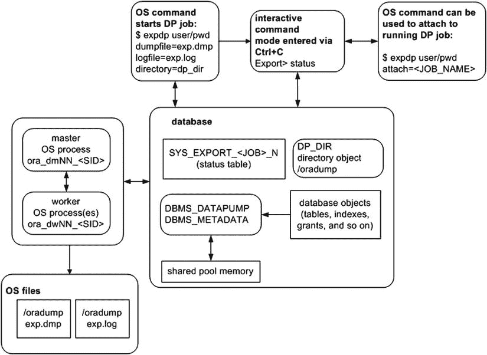
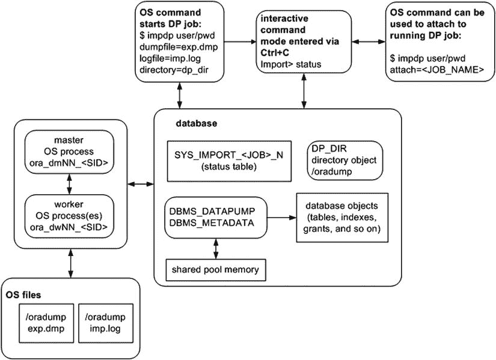

# 数据泵

数据泵通常被描述为旧版 `exp`/`imp` 实用程序的升级版本。这种描述并不准确；这有点像把现代智能手机称为老式转盘拨号座机的替代品。虽然旧版实用程序可靠且运行良好，但数据泵不仅涵盖了那些功能，还为数据在环境之间的抽取和移动增添了全新的维度。本章将帮助解释数据泵如何使您当前的数据传输任务更轻松，并将展示如何以您未曾想过的方式移动信息和解决问题。

数据泵使您能够高效地备份、复制、保护和转换大量数据和元数据。您可以通过多种方式使用数据泵：

*   对整个数据库或部分数据执行时间点逻辑备份
*   为测试或开发复制整个数据库或部分数据
*   快速生成重新创建对象所需的 DDL
*   通过从旧版本导出并导入到新版本来升级数据库


有时，数据库管理员（DBA）会表现出类似卢德分子那样对 `exp`/`imp` 工具的执着，因为 DBA 们熟悉这些工具的语法，并且它们能快速完成任务。即便这些传统工具易于使用，您也应考虑未来使用 **Data Pump**。Data Pump 相较于旧的 `exp`/`imp` 工具提供了**显著增强的功能**：

*   针对大数据集的高性能，支持高效导出和导入千兆字节的数据
*   交互式命令行实用程序，允许您断开连接并在之后重新连接到正在运行的 Data Pump 作业
*   能够从远程数据库导出大量数据并直接导入本地数据库，无需创建转储文件
*   能够在从导出到导入的过程中，对模式、表空间、数据文件和存储设置进行**即时更改**
*   对对象和数据进行**精细过滤**
*   通过（数据库）目录对象实现安全控制
*   高级功能，例如压缩和加密

本章首先讨论 Data Pump 的架构。后续主题包括基本的导出和导入任务、跨网络移动数据、过滤数据以及在遗留模式下运行 Data Pump。

## Data Pump 架构

Data Pump 由以下组件组成：

*   `expdp`（Data Pump 导出实用程序）
*   `impdp`（Data Pump 导入实用程序）
*   `DBMS_DATAPUMP` PL/SQL 包（Data Pump 应用程序编程接口 [API]）
*   `DBMS_METADATA` PL/SQL 包（Data Pump 元数据 API）

`expdp` 和 `impdp` 实用程序在导出和导入数据及元数据时，会使用内置的 `DBMS_DATAPUMP` 和 `DBMS_METADATA` PL/SQL 包。`DBMS_DATAPUMP` 包用于在数据库环境之间移动整个数据库或数据子集。`DBMS_METADATA` 包则用于导出和导入关于数据库对象的信息。

 注意：您可以从 SQL*Plus 中独立（在 `expdp` 和 `impdp` 之外）调用 `DBMS_DATAPUMP` 和 `DBMS_METADATA` 包。我很少直接从 SQL*Plus 调用这些包，但您可能有特定场景需要直接与它们交互。更多详情请参阅 *Oracle Database PL/SQL Packages and Types Reference Guide*，该指南可从 Oracle 网站 (`http://otn.oracle.com`) 的 Technology Network 区域下载。

### 主进程和工作进程

当您启动 Data Pump 导出或导入作业时，会在数据库服务器上初始化一个主操作系统进程。此主进程的名称格式为 `ora_dmNN_<SID>`。在 Linux/Unix 系统上，您可以使用 `ps` 命令从操作系统提示符查看此进程：
```
$ ps -ef | grep -v grep | grep ora_dm
oracle   14602      1  4 08:59 ?        00:00:03 ora_dm00_O12C
```
根据并行度和指定的工作量，还会启动若干个工作进程。如果未指定并行度，则仅启动一个工作进程。主进程协调主进程和工作进程之间的工作。工作进程的名称格式为 `ora_dwNN_<SID>`。

### 状态表

当用户启动导出或导入作业时，会创建一个数据库状态表（由启动作业的用户拥有）。该表仅在 Data Pump 作业期间存在。状态表的名称取决于您运行的作业类型。表的名称格式为 `SYS_<OPERATION>_<JOB_MODE>_NN`，其中 `OPERATION` 为 `EXPORT` 或 `IMPORT`。`JOB_MODE` 可以是以下类型之一：

*   `FULL`
*   `SCHEMA`
*   `TABLE`
*   `TABLESPACE`
*   `TRANSPORTABLE`

例如，如果您正在导出一个模式，则会在您的账户中创建一个名为 `SYS_EXPORT_SCHEMA_NN` 的表，其中 `NN` 是一个数字，用于确保该表名在用户模式中是唯一的。此状态表包含诸如导出/导入的对象、开始时间、耗时、行数和错误计数等信息。该状态表包含超过 80 个列。

 提示：Data Pump 状态表创建在执行导出/导入的用户的默认永久表空间中。因此，如果用户没有在默认表空间中创建表的权限，Data Pump 作业将失败，并出现 `ORA-31633` 错误。

状态表在导出或导入作业成功完成后会被 Data Pump 删除。如果您使用 `KILL_JOB` 交互式命令，主表也会被删除。如果您使用 `STOP_JOB` 交互式命令停止作业，该表不会被移除，并可在您重新启动作业时使用。

如果您的作业异常终止，主表将被保留。如果您不打算重新启动作业，可以删除该状态表。

### 目录对象

当 Data Pump 运行时，它使用数据库目录对象来确定写入和读取转储文件及日志文件的位置。通常，您需要指定希望 Data Pump 使用的目录对象。如果您未指定目录对象，则会使用一个默认目录。默认目录路径由名为 `DATA_PUMP_DIR` 的数据目录对象定义。该目录对象在数据库首次创建时自动创建。在 Linux/Unix 系统上，此目录对象映射到 `ORACLE_HOME/rdbms/log` 目录。

Data Pump 导出会创建一个导出文件和一个日志文件。导出文件包含要导出的对象。日志文件包含作业活动的记录。图 8-1 显示了与 Data Pump 导出作业相关的架构组件。



图 8-1. Data Pump 导出作业组件

类似地，图 8-2 展示了 Data Pump 导入作业的架构组件。导出与导入之间的主要区别在于数据流的方向。导出将数据从数据库中写出，而导入则将信息带入数据库。在学习本章中有关 Data Pump 的示例和概念时，请回头参考这些图表。



图 8-2. Data Pump 导入作业组件

对于每个 Data Pump 作业，您必须确保有权访问一个目录对象。导出和导入的基础知识将在接下来的几节中描述。


Image **提示** 由于数据泵内部使用 PL/SQL 来执行其工作，因此需要在共享池中有一些可用内存来保存 PL/SQL 包。如果共享池中的空间不足，数据泵将抛出 `ORA-04031: unable to allocate bytes of shared memory...` 错误并中止。如果您收到此错误，请将数据库参数 `SHARED_POOL_SIZE` 设置为至少 50M。更多详情请参阅 MOS note 396940.1。

### 开始使用

既然您已经了解了数据泵的架构，接下来是一个简单的示例，展示了导出表、删除表然后将表重新导入数据库所需的导出设置步骤。这将为本章涵盖的所有其他数据泵任务奠定基础。

#### 执行导出

运行数据泵导出作业时，需要进行少量设置。步骤如下：
1.  创建一个数据库目录对象，该对象指向您希望写入/读取数据泵文件的操作系统目录。
2.  为运行导出的数据库用户授予对该目录对象的读写权限。
3.  在操作系统提示符下，运行 `expdp` 实用程序。

#### 步骤 1. 创建数据库目录对象

在运行数据泵作业之前，首先创建一个与磁盘上物理位置相对应的数据库目录对象。此位置将用于保存导出文件和日志文件，并且应该是一个您知道有足够磁盘空间来容纳导出数据量的位置。

使用 `CREATE DIRECTORY` 命令来完成此任务。此示例创建一个名为 `dp_dir` 的目录，并指定它映射到磁盘上的 `/oradump` 物理位置：
``` SQL
SQL> create directory dp_dir as '/oradump';
```
要查看新创建目录的详细信息，请发出以下查询：
``` SQL
SQL> select owner, directory_name, directory_path from dba_directories;
```
以下是一些示例输出：
```
OWNER      DIRECTORY_NAME  DIRECTORY_PATH
---------- ---------------
SYS        DP_DIR          /oradump
```
请记住，指定的目录路径必须在数据库服务器上物理存在。此外，该目录必须是 `oracle` 操作系统用户具有读/写访问权限的目录。最后，执行数据泵操作的用户需要被授予对该目录对象的读/写访问权限（参见步骤 2）。

如果在导出或导入时未指定 `DIRECTORY` 参数，数据泵将尝试使用默认的数据库目录对象（如前所述，这映射到 `ORACLE_HOME/rdbms/log`）。我不建议使用默认目录，原因有二：
*   如果您要导出大量数据，最好有一个您知道有足够空间来满足磁盘空间需求的首选磁盘位置。如果使用默认目录，您可能会无意中填满与 `ORACLE_HOME` 相关联的挂载点，从而可能导致数据库挂起。
*   如果您向非 DBA 用户授予导出权限，您不希望他们在与 `ORACLE_HOME` 相关的位置创建大型转储文件。同样，您不希望与 `ORACLE_HOME` 相关联的挂载点变满，从而损害您的数据库。

#### 步骤 2. 授予目录访问权限

您需要向想要使用数据泵的用户授予对数据库目录对象的权限。使用 `GRANT` 语句分配适当的权限。如果您希望一个用户能够从目录读取和写入目录，则必须授予安全访问权限。此示例向名为 `MV_MAINT` 的用户授予对目录对象的访问权限：
``` SQL
SQL> grant read, write on directory dp_dir to mv_maint;
```
所有目录对象都归 `SYS` 用户所有。如果您使用的用户账户被授予了 DBA 角色，那么您就拥有了对任何目录对象的必要读/写权限。我通常使用被授予了 DBA 的用户来执行数据泵作业（这样我就不需要费心授予权限了）。

**旧版 EXP 实用程序的安全问题**

创建目录对象然后向物理存储位置授予特定 I/O 访问权限的理念是，您可以更安全地管理哪些用户有能力执行通常他们没有权限的读写活动。使用传统的 `exp` 实用程序，任何有权访问该工具的用户默认都有权限将文件写入或读取到 Oracle 二进制文件所有者（通常是 `oracle`）有权访问的位置。可以想象，恶意的非 `oracle` 操作系统用户可以尝试运行 `exp` 实用程序，故意覆盖关键的数据库文件。例如，以下命令可以由任何具有 `exp` 实用程序执行权限的非 `oracle` 操作系统用户运行：
`$ exp heera/foo file=/oradata04/SCRKDV12/users01.dbf`
`exp` 进程以 `oracle` 操作系统用户身份运行，因此对任何 `oracle` 拥有的数据文件具有读写操作系统权限。在这个 `exp` 示例中，如果 `users01.dbf` 文件是一个活动的数据库数据文件，它会被覆盖并变得毫无用处。这可能对您的数据库造成灾难性的损害。

为了防止此类问题，使用 Oracle 数据泵，您必须首先创建一个映射到特定目录的数据库对象目录，然后另外为每个用户分配对该目录的读写权限。因此，数据泵不存在旧版 `exp` 实用程序的安全问题。

#### 步骤 3. 执行导出

当目录对象和权限设置就位后，您就可以使用数据泵从数据库导出信息。本节中的一个简单示例展示了如何导出一个表。本章后面的章节将详细描述导出数据的各种方式。这里的重点是完成一个示例，为理解后续更复杂的主题奠定基础。

作为非 `SYS` 用户，创建一个表并填充一些数据：
``` SQL
SQL> create table inv(inv_id number);
SQL> insert into inv values (123);
```
接下来，作为非 `SYS` 用户，导出该表。此示例使用先前创建的名为 `DP_DIR` 的目录。数据泵使用目录对象指定的目录路径作为磁盘上写入转储文件和日志文件的位置：
``` $ expdp mv_maint/foo directory=dp_dir tables=inv dumpfile=exp.dmp logfile=exp.log
```
`expdp` 实用程序在 `/oradump` 目录中创建一个名为 `exp.dmp` 的文件，其中包含重新创建 `INV` 表并填充导出时数据所需的信息。此外，在 `/oradump` 目录中创建一个名为 `exp.log` 的日志文件，其中包含与此导出作业相关的日志信息。

如果您未指定转储文件名，数据泵会创建一个名为 `expdat.dmp` 的文件。如果目录中已存在名为 `expdat.dmp` 的文件，则数据泵会抛出错误。如果您未指定日志文件名，则数据泵会创建一个名为 `export.log` 的文件。如果名为 `export.log` 的日志文件已存在，则数据泵会覆盖它。

Image **提示** 尽管可以作为 `SYS` 用户执行数据泵，但我不建议这样做，原因有几个。首先，`SYS` 需要使用 `AS SYSDBA` 子句连接到数据库。这需要一个带有 `USERID` 参数和连接字符串引号的数据泵参数文件。这很不方便。其次，`SYS` 拥有的大多数表无法导出（少数例外，如 `AUD$`）。如果您尝试导出 `SYS` 拥有的表，数据泵将抛出 `ORA-39166` 错误并指出该表不存在。这令人困惑。

#### 导入表

导出数据的关键原因之一是为了能够重新创建数据库对象。


你可能希望将此作为备份策略的一部分，或将数据复制到不同的数据库。数据泵导入使用导出转储文件作为其输入，并重新创建导出文件中包含的数据库对象。导入的过程与导出类似：
1.  创建一个数据库目录对象，指向你希望从中读/写数据泵文件的操作系统目录。
2.  授予执行导出或导入的数据库用户对该目录对象的读写权限。
3.  在操作系统提示符下，运行 `impdp` 命令。

第 1 步和第 2 步已在前面的章节“执行导出”中介绍过，因此这里不再重复。

在运行导入作业之前，请先删除之前创建的 `INV` 表。
```
SQL> drop table inv purge;
```

接下来，根据之前的导出重新创建 `INV` 表：
```
$ impdp mv_maint/foo directory=dp_dir dumpfile=exp.dmp logfile=imp.log
```

现在，你应该已经重新创建了 `INV` 表，并填充了导出时的数据。现在是再次查看图 8-1 和图 8-2 的好时机。确保你理解哪些文件是由 `expdp` 创建的，哪些文件是由 `impdp` 使用的。

#### 使用参数文件

与其在命令行上键入命令，在许多情况下，更好的做法是将命令存储在文件中，然后在执行数据泵导出或导入时引用该文件。使用参数文件使任务更具可重复性，且不易出错。你可以将命令放在文件中一次，然后多次引用该文件。

此外，一些数据泵命令（如 `FLASHBACK_TIME`）需要使用引号；在这些情况下，有时很难预测操作系统将如何解释这些引号。每当命令需要引号时，强烈建议使用参数文件。

要使用参数文件，首先创建一个包含你希望用于控制作业行为的命令的操作系统文本文件。此示例使用 Linux/Unix 的 `vi` 命令创建一个名为 `exp.par` 的文本文件：
```
$ vi exp.par
```

现在，将以下命令放入 `exp.par` 文件：
```
userid=mv_maint/foo
directory=dp_dir
dumpfile=exp.dmp
logfile=exp.log
tables=inv
reuse_dumpfiles=y
```

接下来，导出操作通过 `PARFILE` 命令行选项引用参数文件：
```
$ expdp parfile=exp.par
```

数据泵处理文件中的参数，就像它们是在命令行上键入的一样。如果你发现自己在重复键入相同的命令，或者在使用需要引号的命令，或者两者兼有，那么考虑使用参数文件来提高效率。

`提示` 不要将数据泵参数文件与数据库初始化参数文件混淆。数据泵参数文件指示数据泵以哪个用户身份连接到数据库、从哪些目录位置读/写文件、在操作中包含哪些对象，等等。相比之下，数据库参数文件在数据库启动时确立实例的特性。

### 以精细度进行导出和导入

回顾本章前面的“数据泵体系结构”一节，你可以通过几种不同的模式调用导出/导入实用程序。例如，你可以指示数据泵以以下模式进行导出/导入：
*   整个数据库
*   方案级别
*   表级别
*   表空间级别
*   可传输表空间级别

在深入研究数据泵的众多功能之前，讨论这些模式并确保你了解每种模式的运作方式很有用。这将为理解本章后面介绍的概念进一步奠定基础。

#### 导出和导入整个数据库

当你导出整个数据库时，这有时被称为完整导出。

在此模式下，生成的导出文件包含制作数据库副本所需的一切。除非受过滤参数限制（见本章后面的“过滤数据和对象”一节），完整导出包括：
*   重新创建表空间、用户、用户表、索引、约束、触发器、序列、存储的 PL/SQL 等所需的所有 DDL。
*   所有表数据（`SYS` 用户的表除外）

通过将 `FULL` 参数设置为 `Y` 来启动完整导出，并且必须由具有 DBA 权限或被授予 `DATAPUMP_EXP_FULL_DATABASE` 角色的用户来执行。以下是对数据库执行完整导出的示例：
```
$ expdp mv_maint/foo directory=dp_dir dumpfile=full.dmp logfile=full.log full=y
```

在导出执行时，你应该在输出中看到此文本，表明正在进行完整级别的导出：
```
Starting "MV_MAINT"."SYS_EXPORT_FULL_01":
```

请注意，完整导出并不会导出数据库中的所有内容：
*   不导出 `SYS` 方案的内容（有少数例外，例如 `AUD$` 表）。试想一下，如果你能够将一个数据库中 `SYS` 方案的内容导出并导入到另一个数据库中会发生什么。`SYS` 方案的内容将覆盖内部数据字典表/视图，从而损坏数据库。因此，数据泵从不导出由 `SYS` 拥有的对象。
*   不导出索引数据，而是导出包含在后续导入期间重新创建索引所需 SQL 的索引 DDL。

一旦你有了完整导出，你就可以使用其内容在原始数据库中重新创建对象（例如，在表意外删除的情况下），或者将整个数据库或用户/表的子集复制到不同的数据库。下一个示例假定转储文件已被复制到不同的数据库服务器，现在用于将所有对象导入到目标数据库：
```
$ impdp mv_maint/foo directory=dp_dir dumpfile=full.dmp logfile=fullimp.log full=y
```

`提示` 要启动完整数据库导入，你必须具有 DBA 权限或被分配 `DATAPUMP_IMP_FULL_DATABASE` 角色。

在屏幕上显示的输出中，你应该看到正在进行完整导入的指示：
```
Starting "MV_MAINT"."SYS_IMPORT_FULL_01":
```

运行完整导入数据库作业有一些需要注意的影响：
*   导入作业将首先尝试重新创建任何表空间。如果表空间已存在，或者表空间所依赖的目录路径不存在，那么表空间创建语句将失败，导入作业将移动到下一个任务。
*   接下来，导入作业将修改 `SYS` 和 `SYSTEM` 用户账户，使其包含与导出时相同的密码。因此，从生产系统导入后，为了反映新环境，修改 `SYS` 和 `SYSTEM` 的密码是谨慎的做法。
*   此外，导入作业随后将尝试创建导出文件中的任何用户。如果用户已存在，则会抛出错误，导入作业移动到下一个任务。
*   用户将以与原始数据库相同的密码导入。根据你的安全标准，你可能希望更改密码。
*   表将被重新创建。如果表已存在并包含数据，你必须指定你希望导入作业如何处理此情况。你可以让导入作业跳过、追加、替换或截断该表（请参见本章后面的“当对象已存在时导入”一节）。
*   在每个表创建并填充后，将创建关联的索引。
*   如果可用，导入作业还将尝试导入统计信息。此外，对象授权将被实例化。


如果一切运行顺利，最终结果将是一个在表空间、用户、对象等方面与源数据库逻辑上完全相同的数据库。

#### 模式级别

当你启动导出时，除非另有说明，数据泵会为运行导出作业的用户启动一个模式级别导出。用户级别导出常用于将一个或多个模式从一个环境复制到另一个环境。以下命令为 `MV_MAINT` 用户启动一个模式级别导出：

```
$ expdp mv_maint/foo directory=dp_dir dumpfile=mv_maint.dmp logfile=mv_maint.log
```

在屏幕上显示的输出中，你应该会看到一些表明已启动模式级别导出的文本：

```
Starting "MV_MAINT"."SYS_EXPORT_SCHEMA_01"...
```

你也可以使用 `SCHEMAS` 参数，为运行导出作业之外的其他用户启动模式级别导出。以下命令展示了为多个用户进行模式级别导出：

```
$ expdp mv_maint/foo directory=dp_dir dumpfile=user.dmp  schemas=heera,chaya
```

你可以通过引用一个使用模式级别导出生成的转储文件来启动模式级别导入：

```
$ impdp mv_maint/foo directory=dp_dir dumpfile=user.dmp
```

当你启动模式级别导入时，有一些细节需要注意：

*   模式级别导出不包含任何表空间。
*   导入作业会尝试重新创建转储文件中的任何用户。如果用户已存在，则会报错，然后导入作业继续执行。
*   导入作业将根据导出的密码重置用户的密码。
*   用户所属的表将被导入并填充数据。如果表已存在，你必须通过 `TABLE_EXISTS_ACTION` 参数指示数据泵如何处理这种情况。

你也可以在使用完全导出转储文件时启动模式级别导入。为此，请指定你想从完全导出中提取哪些模式：

```
$ impdp mv_maint/foo directory=dp_dir dumpfile=full.dmp schemas=heera,chaya
```

#### 表级别

你可以通过 `TABLES` 参数指示数据泵操作特定的表。例如，假设你想导出

```
$ expdp mv_maint/foo directory=dp_dir dumpfile=tab.dmp \
tables=heera.inv,heera.inv_items
```

你应该在输出中看到一些文本，表明正在进行表级别导出：

```
Starting "MV_MAINT"."SYS_EXPORT_TABLE_01...
```

类似地，你可以通过指定表级别创建的转储文件来启动表级别导入：

```
$ impdp mv_maint/foo directory=dp_dir dumpfile=tab.dmp
```

表级别导入仅尝试导入指定的表及其数据。如果表已存在，则会报错，然后导入作业继续执行。如果表已存在且包含数据，你必须指定导出作业应如何处理这种情况。你可以通过 `TABLE_EXISTS_ACTION` 参数让导入作业跳过、追加、替换或截断该表。

你也可以在使用完全导出转储文件或模式级别导出时启动表级别导入。为此，请指定你想从完全或模式级别导出中提取哪些表：

```
$ impdp mv_maint/foo directory=dp_dir dumpfile=full.dmp tables=heera.inv
```

#### 表空间级别

表空间级别导出/导入操作包含在特定表空间中的对象。此示例导出 `USERS` 表空间中包含的所有对象：

```
$ expdp mv_maint/foo directory=dp_dir dumpfile=tbsp.dmp tablespaces=users
```

输出中显示的文本应表明正在进行表空间级别导出：

```
Starting "MV_MAINT"."SYS_EXPORT_TABLESPACE_01"...
```

你可以通过指定使用表空间级别导出创建的导出文件来启动表空间级别导入：

```
$ impdp mv_maint/foo directory=dp_dir dumpfile=tbsp.dmp
```

你也可以通过使用完全导出但指定 `TABLESPACES` 参数来启动表空间级别导入：

```
$ impdp mv_maint/foo directory=dp_dir dumpfile=full.dmp tablespaces=users
```

表空间级别导入将尝试创建表空间内的任何表和索引。导入不会尝试重新创建表空间本身。

 `注意` 还有一种可传输表空间模式导出。请参阅本章后面的“复制数据文件”一节。

### 传输数据

数据泵的主要用途之一是将数据从一个数据库复制到另一个数据库。通常，源数据库和目标数据库位于相距数千英里的数据中心。数据泵提供了几个强大的功能来高效复制数据：

*   网络链接
*   复制数据文件（可传输表空间）
*   外部表

使用网络链接允许你执行导出并将其直接导入目标数据库，而无需创建转储文件。这是一种非常高效的数据移动方式。

Oracle 还提供了可传输表空间功能，让你可以将数据文件从源数据库复制到目标数据库，然后使用数据泵传输相关的元数据。这两种技术将在以下章节中描述。

#### 直接通过网络导出和导入

假设你有两个数据库环境——一个运行在 Solaris 服务器上的生产数据库和一个运行在 Linux 服务器上的测试数据库。你的老板向你提出以下要求：

*   在 Solaris 服务器上制作生产数据库的副本。
*   将该副本导入 Linux 服务器上的测试数据库。
*   在导入时更改模式名称以满足测试数据库的命名标准。

首先，考虑一下使用旧的 `exp`/`imp` 实用程序将数据从一个数据库传输到另一个数据库所需的步骤。步骤大致如下：

1.  导出生产数据库（这会在数据库服务器上创建一个转储文件）。
2.  将转储文件复制到测试数据库服务器。
3.  将转储文件导入测试数据库。

你可以使用数据泵执行相同的步骤。然而，数据泵提供了一种更高效、更透明的方法来执行这些步骤。如果你的生产数据库服务器和测试数据库服务器之间有直接的网络连接，你可以执行导出并直接导入目标数据库，而无需创建或复制任何转储文件。此外，你可以在执行导入时动态重命名模式。另外，源数据库是否运行在与目标数据库不同的操作系统上并不重要。

一个示例将有助于说明这是如何工作的。在此示例中，生产数据库用户是 `STAR2`、`CIA_APP` 和 `CIA_SEL`。你想将这些用户移动到测试数据库，并将它们重命名为 `STAR_JUL`、`CIA_APP_JUL` 和 `CIA_SEL_JUL`。此任务需要以下步骤：

1.  在要导入的测试数据库中创建用户。以下是一个在测试数据库中创建用户的示例脚本：

    ```
    define star_user=star_jul
    define star_user_pwd=star_jul_pwd
    define cia_app_user=cia_app_jul
    define cia_app_user_pwd=cia_app_jul_pwd
    define cia_sel_user=cia_sel_jul
    define cia_sel_user_pwd=cia_sel_jul_pwd
    --
    create user &&star_user identified by &&star_user_pwd;
    grant connect,resource to &&star_user;
    alter user &&star_user default tablespace dim_data;
    --
    create user &&cia_app_user identified by &&cia_app_user_pwd;
    grant connect,resource to &&cia_app_user;
    alter user &&cia_app_user default tablespace cia_data;
    --
    create user &&cia_sel_user identified by &&cia_app_user_pwd;
    grant connect,resource to &&cia_app_user;
    alter user &&cia_sel_user default tablespace cia_data;
    ```

2.


## 使用数据库链接和网络链接导入数据

在测试数据库中，创建一个指向生产数据库的数据库链接。`CREATE DATABASE LINK`语句中引用的远程用户必须在生产数据库中被授予`DBA`角色。以下是一个`CREATE DATABASE LINK`脚本示例：

```sql
create database link dk
connect to darl identified by foobar
using 'dwdb1:1522/dwrep1';
```

在测试数据库中，创建一个目录对象，指向你希望日志文件存放的位置：

```sql
SQL> create or replace directory engdev as '/orahome/oracle/ddl/engdev';
```

在测试服务器上运行导入命令。此命令通过`NETWORK_LINK`参数引用远程数据库。该命令还指示 Data Pump 将生产数据库用户名映射到测试数据库中新建的用户。

```bash
$ impdp darl/engdev directory=engdev network_link=dk \
schemas='STAR2,CIA_APP,CIA_SEL' \
remap_schema=STAR2:STAR_JUL,CIA_APP:CIA_APP_JUL,CIA_SEL:CIA_SEL_JUL
```

此技术允许你在不同的数据库之间移动大量数据，而无需创建或复制任何转储文件或数据文件。你还可以通过`REMAP_SCHEMA`参数动态重命名模式。这是一个非常强大的 Data Pump 功能，可以让你快速高效地传输数据。

 **提示**：在复制整个数据库时，也可以考虑使用 RMAN 的 duplicate database 功能。

### DATABASE LINK 与 NETWORK_LINK

不要将通过数据库链接连接到远程数据库时进行的导出，与使用`NETWORK_LINK`参数进行的导出混淆。当通过数据库链接连接到远程数据库进行导出时，被导出的对象存在于远程数据库中，转储文件和日志文件根据`DIRECTORY`参数指定的目录在远程服务器上创建。例如，以下命令导出远程数据库中的对象并在远程服务器上创建文件：

```bash
$ expdp mv_maint/foo@shrek2 directory=dp_dir dumpfile=sales.dmp
```

相反，当你使用`NETWORK_LINK`参数导出时，你是在本地创建转储文件和日志文件，而被导出的数据库对象存在于远程数据库中；例如：

```bash
$ expdp mv_maint/foo network_link=shrek2 directory=dp_dir dumpfile=sales.dmp
```

#### 复制数据文件

Oracle 提供了一种将数据文件从一个数据库复制到另一个数据库的机制，结合使用 Data Pump 来传输相关的元数据。这被称为可传输表空间功能。此任务所需的时间取决于将数据文件复制到目标服务器所需的时间。此技术适用于在 DSS 和数据仓库环境中移动数据。

 **提示**：可传输表空间还可以与 RMAN 的`CONVERT TABLESPACE`命令结合使用，将表空间移动到与主机平台不同的目标服务器。

### 传输表空间的步骤

1.  确保表空间是自包含的。以下是一些常见的违反自包含规则的情况：
    *   一个表空间中的索引不能指向不属于正在传输的表空间集合中的另一个表空间中的表。
    *   在一个表空间中的表上定义的外键约束，引用了不属于正在传输的表空间集合中的另一个表空间中的表上的主键约束。
    运行以下检查，查看正在传输的表空间集合是否违反了任何自包含规则：
    ```sql
    SQL> exec dbms_tts.transport_set_check('INV_DATA,INV_INDEX', TRUE);
    ```
    现在，查看 Oracle 是否检测到任何违规：
    ```sql
    SQL> select * from transport_set_violations;
    ```
    如果没有违规，你应该看到：
    ```
    no rows selected
    ```
    如果有违规，例如索引建立在未被传输的表空间中的表上，那么你将不得不在正在被传输的表空间中重建该索引。

2.  将要传输的表空间设置为只读：
    ```sql
    SQL> alter tablespace inv_data read only;
    SQL> alter tablespace inv_index read only;
    ```

3.  使用 Data Pump 导出要传输的表空间的元数据：
    ```bash
    $ expdp mv_maint/foo directory=dp_dir dumpfile=trans.dmp \
    transport_tablespaces=INV_DATA,INV_INDEX
    ```

4.  将 Data Pump 导出转储文件复制到目标服务器。
5.  将数据文件复制到目标数据库。将文件放在目标数据库服务器中你希望它们位于的目录中。文件名和目录路径必须与下一步中使用的导入命令匹配。
6.  将元数据导入到目标数据库。使用以下参数文件来导入被传输数据文件的元数据：
    ```
    userid=mv_maint/foo
    directory=dp_dir
    dumpfile=trans.dmp
    transport_datafiles=/ora01/dbfile/rcat/inv_data01.dbf,
    /ora01/dbfile/rcat/inv_index01.dbf
    ```
    如果一切顺利，你应该会看到一些指示成功的输出：
    ```text
    Job "MV_MAINT"."SYS_IMPORT_TRANSPORTABLE_01" successfully completed...
    ```
    如果被传输的数据块的块大小与目标数据库的不同，那么你必须修改你的初始化文件（或使用`ALTER SYSTEM`命令）并添加一个包含源数据库块大小的缓冲池。例如，要添加一个 16KB 的缓冲区高速缓存，请在初始化文件中放置以下内容：
    ```
    db_16k_cache_size=200M
    ```
    你可以通过此查询检查表空间的块大小：
    ```sql
    SQL> select tablespace_name, block_size from dba_tablespaces;
    ```
    可传输表空间机制允许你在数据库之间快速移动数据文件，即使数据库使用不同的块大小或不同的 endian 格式。本节并未讨论与可传输表空间相关的所有细节；本章的重点是展示如何使用 Data Pump 来传输数据。有关可传输表空间的完整细节，请参阅可从 Oracle 网站技术网络区域（`http://otn.oracle.com`）免费下载的《Oracle Database Administrator’s Guide》。

 **注意**：要生成可传输表空间，你必须使用 Oracle 企业版。你可以使用其他版本的 Oracle 来导入可传输表空间。

### 操作存储的特性

Data Pump 包含许多灵活的特性，用于在导出和导入时操作表空间和数据文件。以下各节展示了在处理这些重要数据库对象时有用的 Data Pump 技术。

### 导出表空间元数据

有时，你可能需要复制一个环境——例如，将生产环境复制到测试环境中。首要任务之一是复制表空间。为此，你可以使用 Data Pump 提取仅用于重新创建环境表空间所需的 DDL：

```bash
$ expdp mv_maint/foo directory=dp_dir dumpfile=inv.dmp \
full=y include=tablespace
```

`FULL`参数指示 Data Pump 导出数据库中的所有内容。然而，当与`INCLUDE`一起使用时，Data Pump 仅导出该命令指定的对象。


## 在此组合中，仅导出关于表空间的元数据；导出的内容中不包含数据文件内的数据。您可以向 `INCLUDE` 命令添加参数和值 `CONTENT=METADATA_ONLY`，但这将是多余的。

现在，您可以使用 `SQLFILE` 参数来查看与已导出表空间关联的 DDL：
```bash
$ impdp mv_maint/foo directory=dp_dir dumpfile=inv.dmp sqlfile=tbsp.sql
```
当您使用 `SQLFILE` 参数时，不会导入任何内容。在此示例中，上述命令仅会创建一个名为 `tbsp.sql` 的文件，其中包含与表空间相关的 SQL 语句。您可以修改 DDL 并在目标数据库环境中运行；或者，如果无需更改，您可以通过将表空间导入目标数据库来直接使用转储文件。

## 指定不同的数据文件路径和名称

如前所述，您可以使用 `FULL` 和 `INCLUDE` 参数的组合来仅导出表空间元数据信息：
```bash
$ expdp mv_maint/foo directory=dp_dir dumpfile=inv.dmp \
full=y include=tablespace
```
如果您想使用转储文件在具有不同目录结构的单独数据库服务器上创建表空间，该怎么办？Data Pump 允许您在导入步骤中使用 `REMAP_DATAFILE` 参数来更改数据文件目录路径和文件名。

例如，假设源数据文件位于名为 `/ora03` 的挂载点上，但在要导入到的数据库上，挂载点命名为 `/ora01`。以下是一个参数文件，它指定仅应导入表空间名称以字符串 `INV` 开头的表空间，并将它们对应的数据文件名更改为反映新环境的名称：
```
userid=mv_maint/foo directory=dp_dir dumpfile=inv.dmp full=y include=tablespace:"like 'INV%'" remap_datafile="'/ora03/dbfile/O12C/inv_data01.dbf':'/ora01/dbfile/O12C/tb1.dbf'" remap_datafile="'/ora03/dbfile/O12C/inv_index01.dbf':'/ora01/dbfile/O12C/tb2.dbf'"
```
当 Data Pump 创建表空间时，对于任何与字符串第一部分（冒号 [`:`] 左侧）匹配的路径，该字符串将被字符串下一部分（冒号右侧）中的文本替换。

### 提示
 当使用需要同时使用单引号和双引号的参数时，使用参数文件会得到可预测的行为。相反，如果您尝试在命令行上输入各种必需的引号，操作系统可能会进行解释并传递给 Data Pump 与您预期不符的内容。

## 导入到与原始表空间不同的表空间中

您偶尔可能需要导出一个表，然后将其导入到不同的用户和不同的表空间中。源数据库可能与目标数据库不同，或者您可能只是尝试在同一数据库内的两个用户之间移动数据。您可以使用 `REMAP_SCHEMA` 和 `REMAP_TABLESPACE` 参数轻松处理此需求。

此示例重新映射用户以及表空间。原始用户和表空间是 `HEERA` 和 `INV_DATA`。此命令将 `INV` 表导入到用户 `CHAYA` 和表空间 `DIM_DATA` 中：
```bash
$ impdp mv_maint/foo directory=dp_dir dumpfile=inv.dmp remap_schema=HEERA:CHAYA \
remap_tablespace=INV_DATA:DIM_DATA tables=heera.inv
```
`REMAP_TABLESPACE` 功能不会重新创建表空间。它只是指示 Data Pump 将对象放置在与其导出时不同的表空间中。导入时，如果您放置对象的表空间不存在，Data Pump 会抛出错误。

## 更改数据文件的大小

您可以在导入时使用带有 `PCTSPACE` 选项的 `TRANSFORM` 参数来更改数据文件的大小。假设您已经创建了一个仅包含表空间元数据的导出：
```bash
$ expdp mv_maint/foo directory=dp_dir dumpfile=inv.dmp full=y include=tablespace
```
现在，您希望在开发数据库中创建表空间名称包含字符串 `DATA` 的表空间，但没有足够的磁盘空间来按照源数据库中的方式创建这些表空间。在这种情况下，您可以使用 `TRANSFORM` 参数来指定表空间按照原始大小的百分比创建。

例如，如果您希望表空间以原始大小的 20% 创建，请发出以下命令：
```
userid=mv_maint/foo directory=dp_dir dumpfile=inv.dmp full=y include=tablespace:"like '%DATA%'" transform=pctspace:20
```
表空间将使用相当于其原始大小 20% 的数据文件创建。区的分配大小也是其原始定义的 20%。这一点很重要，因为 Data Pump 不会检查存储属性是否满足数据文件的最小大小限制。这意味着，如果计算出的较小尺寸违反了 Oracle 的最小大小（例如，统一区大小为五个块），则在导入期间将抛出错误。

当用于导出生产数据然后导入到较小的数据库中时，此功能非常有用。在这些场景中，您可能正在通过 `SAMPLE` 参数或 `QUERY` 参数（参见本章后面的“过滤数据和对象”部分）过滤掉部分生产数据。

## 更改段和存储属性

导入时，您可以使用 `TRANSFORM` 参数来更改表的存储属性。此参数的通用语法为
```
TRANSFORM=transform_name:value[:object_type]
```
当您使用 `SEGMENT_ATTRIBUTES:N` 作为转换名称时，可以在导入过程中删除以下段属性：
* 物理属性
* 存储属性
* 表空间
* 日志记录

当您导入到开发环境并且不希望表带有其在生产数据库中的所有存储属性时，您可能需要此功能。例如，在开发中，您可能只有一个表空间来存储所有表和索引，而在生产中，您将表和索引分布在多个表空间中。

以下是一个删除段属性的示例：
```bash
$ impdp mv_maint/foo directory=dp_dir  dumpfile=inv.dmp \
transform=segment_attributes:n
```
您可以使用 `STORAGE:N` 仅删除存储子句：
```bash
$ impdp mv_maint/foo directory=dp_dir dumpfile=inv.dmp \
transform=storage:n
```

### 过滤数据和对象

Data Pump 提供了大量用于过滤数据和元数据的机制。您可以通过以下方式影响在 Data Pump 导出或导入中排除或包含的内容：
* 使用 `QUERY` 参数来导出或导入数据的子集。
* 使用 `SAMPLE` 参数来导出表中一定百分比的行。
* 使用 `CONTENT` 参数来排除或包含数据和元数据。
* 使用 `EXCLUDE` 参数来具体命名要排除的项。
* 使用 `INCLUDE` 参数来命名要包含的项（从而排除列表中未包含的其他非依赖项）。
* 使用诸如 `SCHEMAS` 之类的参数来指定您只需要数据库对象的子集（属于指定用户或用户的对象）。

以下各节将描述这些技术的示例。

### 注意
 您不能同时使用 `EXCLUDE` 和 `INCLUDE`。这些参数是互斥的。

## 指定查询

您可以使用 `QUERY` 参数指示 Data Pump 仅将满足特定条件的行写入转储文件。如果您正在重新创建测试环境并且只需要数据的子集，可能需要这样做。


