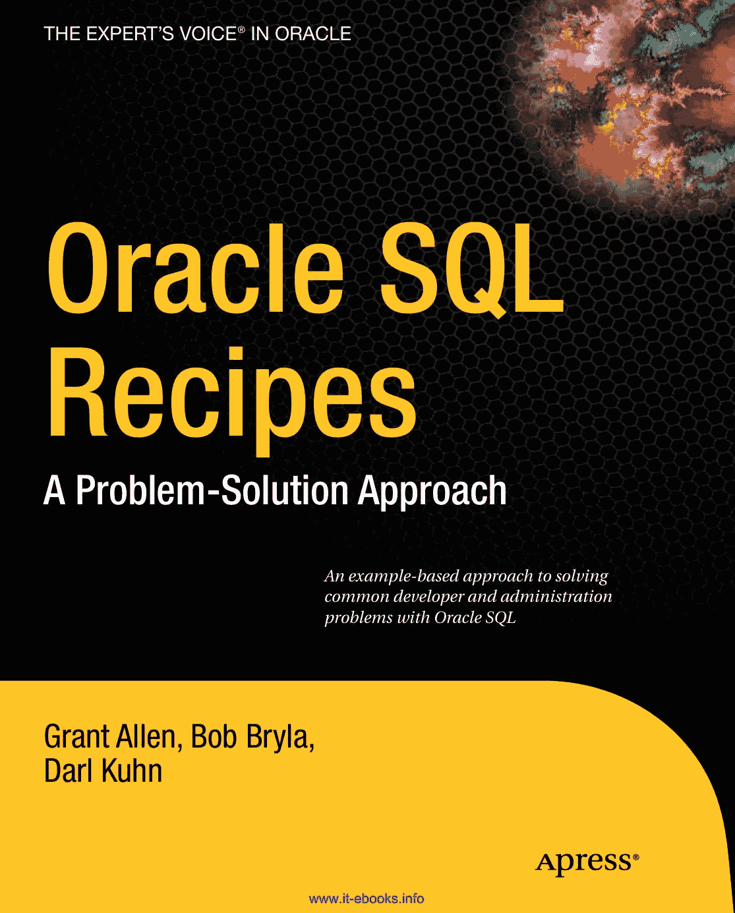

# Oracle SQL 食谱：问题-解决方案方法

青 品红 黄 黑 PanTOne 123 c

专业人士为专业人士打造的图书®
Oracle 领域的专家之声®

**Oracle SQL 食谱：问题-解决方案方法**
附赠电子书可供下载

《*DB2 入门*》作者 Grant Allen

亲爱的读者：

*Oracle SQL 食谱*旨在满足您对解决 Oracle 中各种数据查询问题的解决方案的渴望。如果您曾经仅使用 SQL 艰难地编写数据报表，或者惊叹于某些人为 Oracle 编写 SQL 以解决看似棘手问题的优雅与技巧，那么您会想深入研读本书，因为它将向您展示像专业人士一样创建查询的技术。

通过本书，您将学习 Oracle 中 SQL 的诸多精妙之处，以及您可以驾驭的、用于解决从统计建模、多级财务报表到甚至仅用 SQL 直接从数据库动态生成网页等各类问题的强大力量和功能。我们探讨的每个 Oracle SQL 问题都以“问题/解决方案”的格式呈现。首先，我们陈述需要解决的问题。然后，我们展示 SQL 解决方案。最后，我们详细讨论您需要了解的任何注意事项，以及为什么该解决方案有效。

*Oracle SQL 食谱*适合任何 SQL 熟练程度的读者，其中的“食谱”旨在拓展从初学者一直到资深专家的 SQL 爱好者的技能。

无论您是 Oracle 数据库数据的用户、应用程序开发人员还是数据库管理员，本书都有满足您需求的主题。我们很高兴为您呈现这本食谱集。作为作者，我们撰写本书是为了突显 SQL 在 Oracle 中的强大功能和能力，以及它如何解决许多通常被认为难以在应用程序代码之外编写的难题。掌握了本书中的知识，您将精通最新、最强大的 Oracle 数据库功能，并能很快即兴创作您自己的食谱。我们希望这些食谱能解决您在使用 Oracle 和 SQL 的日常工作中遇到的许多实际问题，并期待看到您基于此灵感所创建的食谱。

《*PHP 和 Oracle 入门*》作者 Bob Bryla
《*Oracle DBA 的 Linux 食谱*》作者 Darl Kuhn

*基于示例解决常见开发和管理问题的 Oracle SQL 方法*

附赠电子书

APRESS 出版路线图
Oracle SQL 入门
Oracle 性能故障排除
Oracle SQL 食谱

详见末页关于 10 美元电子书版本的信息

Grant Allen, Bob Bryla, Darl Kuhn
www.apress.com

).3".yla
Darl Kuhn

**美国定价：49.99 美元**
分类于 数据库/Oracle
用户级别：初学者–高级

[www.it-ebooks.info](http://www.it-ebooks.info/)

**此印刷仅供内容预览——尺寸与颜色不准确**
**书脊 = x.xxx"  xxx 页**

青 品红 黄 黑 PanTOne 123 c

专业人士为专业人士打造的图书®
Oracle 领域的专家之声®

**Oracle SQL 食谱：问题-解决方案方法**
附赠电子书可供下载

《*DB2 入门*》作者 Grant Allen

亲爱的读者：

acle SQL 食谱

*Oracle SQL 食谱*旨在满足您对解决 Oracle 中各种数据查询问题的解决方案的渴望。如果您曾经仅使用 SQL 艰难地编写数据报表，或者惊叹于某些人为 Oracle 编写 SQL 以解决看似棘手问题的优雅与技巧，那么您会想深入研读本书，因为它将向您展示像专业人士一样创建查询的技术。

