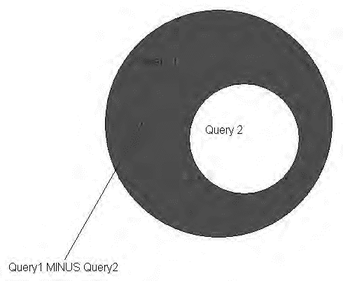
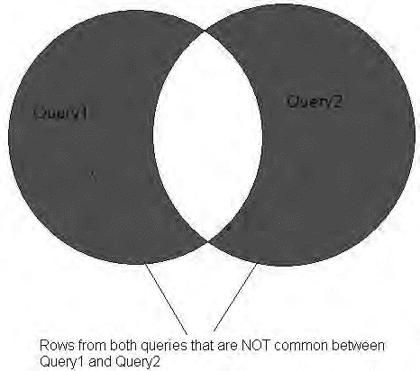

# 第三章：多表查询

##### 3-2. 垂直堆叠查询结果

### 问题
你希望将两个 `SELECT` 语句的结果合并为一个结果集。

### 解决方案
使用 `UNION` 操作符。`UNION` 将两个或多个查询的结果合并，并会去除整个结果集中的重复行。在 Oracle 的神话公司中，`EMPLOYEES_ACT` 表中的员工需要与最近一次公司收购而来的员工合并。新近收购公司的员工表 `EMPLOYEES_NEW` 与现有的 `EMPLOYEES_ACT` 表格式完全相同，因此使用 `UNION` 将两个表合并为一个结果集应该很容易，如下所示：

```sql
select employee_id, first_name, last_name from employees_act;
```

```
EMPLOYEE_ID FIRST_NAME LAST_NAME
---------------------- -------------------- -------------------------
102 Lex De Haan
105 David Austin
112 Jose Manuel Urman
118 Guy Himuro
119 Karen Colmenares
205 Shelley Higgins
6 rows selected
```

```sql
select employee_id, first_name, last_name from employees_new;
```

```
EMPLOYEE_ID FIRST_NAME LAST_NAME
---------------------- -------------------- -------------------------
101 Neena Kochhar
105 David Austin
112 Jose Manuel Urman
171 William Smith
201 Michael Hartstein
5 rows selected
```

```sql
select employee_id, first_name, last_name from employees_act
union
select employee_id, first_name, last_name from employees_new
order by employee_id;
```

```
EMPLOYEE_ID FIRST_NAME LAST_NAME
---------------------- -------------------- -------------------------
101 Neena Kochhar
102 Lex De Haan
105 David Austin
112 Jose Manuel Urman
118 Guy Himuro
119 Karen Colmenares
171 William Smith
201 Michael Hartstein
205 Shelley Higgins
9 rows selected
```

使用 `UNION` 会删除重复的行。你可以在查询末尾使用一个 `ORDER BY` 来对结果排序。在这个例子中，两张员工表有两行数据是相同的（有些人需要打两三份工才能维持生计！），因此 `UNION` 查询返回九行，而不是十一行。

### 工作原理
请注意，为了让 `UNION` 操作符去除重复行，给定行中的所有列必须与一个或多个其他行中的相同列相等。当 Oracle 处理 `UNION` 时，它必须执行排序/合并操作以确定哪些行是重复的。因此，你的执行时间可能会比单独运行每个 `SELECT` 语句要长。如果你知道每个 `SELECT` 语句内部及语句之间都没有重复项，你可以使用 `UNION ALL` 来合并结果，而无需检查重复项。

如果存在重复项，不会导致错误；你只是会在结果集中得到重复的行。

##### 3-3. 编写可选连接

### 问题
你正在通过一个或多个公共列连接两个表，但你希望确保返回第一个表中的所有行，无论第二个表中是否有匹配行。例如，你正在连接员工表和部门表，但有些员工没有分配部门。

### 解决方案
使用外连接。在 Oracle 的示例数据库中，`HR` 用户维护着 `EMPLOYEES` 和 `DEPARTMENTS` 表；为员工分配部门是可选的。`EMPLOYEES` 表中有 107 名员工。然而，在 `EMPLOYEES` 和 `DEPARTMENTS` 之间使用标准连接只返回 106 行，因为有一名员工没有被分配部门。为了返回 `EMPLOYEES` 表中的所有行，你可以使用 `LEFT OUTER JOIN`，它会包含 `EMPLOYEES` 表中的所有行以及 `DEPARTMENTS` 表中的匹配行（如果有的话）：

```sql
select employee_id, last_name, first_name, department_id, department_name
from employees
left outer join departments using(department_id);
```

```
EMPLOYEE_ID LAST_NAME FIRST_NAME DEPARTMENT_ID DEPARTMENT_NAME
------------ --------------- --------------- ----------------- -------------------
200 Whalen Jennifer 10 Administration
202 Fay Pat 20 Marketing
201 Hartstein Michael 20 Marketing
119 Colmenares Karen 30 Purchasing
. . .
206 Gietz William 110 Accounting
205 Higgins Shelley 110 Accounting
178 Grant Kimberely
107 rows selected
```

现在结果集中有 107 行，而不是 106 行；`Kimberely Grant` 被包含在内，即使她目前没有被分配部门。

### 工作原理
当使用 `LEFT OUTER JOIN` 连接两个表时，如你所料，查询会返回 `LEFT OUTER JOIN` 子句左侧表中的所有行。`LEFT OUTER JOIN` 子句右侧表中的行会在可能时进行匹配。如果没有匹配，右侧表中的列在结果中将包含 `NULL` 值。

如你所料，也有一个 `RIGHT OUTER JOIN`（在两种情况下，`OUTER` 关键字都是可选的）。你可以将解决方案重写如下：

```sql
select employee_id, last_name, first_name, department_id, department_name
from departments
right outer join employees using(department_id);
```

结果是相同的，使用哪种格式取决于可读性和风格。

该查询也可以使用 `ON` 子句来编写，就像等值连接（内连接）一样。对于 Oracle 9*i* 之前的版本，你必须使用 Oracle 有点晦涩且专有的外连接语法，在缺少行的那一侧加上 `(+)` 字符，如下例所示：

```sql
select employee_id, last_name, first_name, e.department_id, department_name
from employees e, departments d
where e.department_id = d.department_id (+);
```

不用说，如果你可以使用 ANSI SQL-99 语法，为了清晰和易于维护，请务必使用它。

##### 3-4. 使连接在两个方向上都成为可选

### 问题
你查询中的所有表都至少有几行与其他表中的行不匹配，但你仍然希望返回所有表中的所有行，并在结果中显示不匹配项。例如，你想通过包含来自两张表的不匹配项来减少报告数量，而不是为每种情况都制作一份报告。

### 解决方案


使用 `FULL OUTER JOIN`。正如您所预料的那样，两个或多个表之间的全外连接将返回查询中每个表的所有行，并在可能的情况下进行匹配。您可以对 `EMPLOYEES` 和 `DEPARTMENTS` 表使用 `FULL OUTER JOIN`，如下所示：

## 第 3 章 ■ 从多表查询

```sql
select employee_id, last_name, first_name, department_id, department_name
from employees
full outer join departments
using(department_id)
;
```

```
EMPLOYEE_ID LAST_NAME FIRST_NAME DEPARTMENT_ID DEPARTMENT_NAME
------------ ----------------- ------------- ---------------- --------------------
100 King Steven 90 Executive
101 Kochhar Neena 90 Executive
102 De Haan Lex 90 Executive
. . .
177 Livingston Jack 80 Sales
178 Grant Kimberely
179 Johnson Charles 80 Sales
. . .
206 Gietz William 110 Accounting
180 Construction
190 Contracting
230 IT Helpdesk
123 rows selected
```

`注意`：在使用 `FULL`、`LEFT` 或 `RIGHT` 连接时，`OUTER` 关键字是可选的。它确实能为您的查询增加文档价值，清楚地表明来自一个或两个表的不匹配行将包含在结果中。

使用 `FULL OUTER JOIN` 是快速查看两个表之间不匹配情况的好方法。在上面的输出中，您可以看到一个没有部门的员工，以及几个没有员工的部门。

### 工作原理

在 Oracle9i 之前，实现全外连接有点不雅观：您必须使用 Oracle 专有语法，对两个外连接（左外连接和右外连接）执行 `UNION`，如下所示：

```sql
select employee_id, last_name, first_name, e.department_id, department_name
from employees e, departments d
where e.department_id = d.department_id (+)
union
select employee_id, last_name, first_name, e.department_id, department_name
from employees e, departments d
where e.department_id (+) = d.department_id
;
```

运行两个独立的查询，然后去重，比使用 `FULL OUTER JOIN` 语法执行时间更长，因为后者只需要对每个表进行一次扫描。

您可以调整 `FULL OUTER JOIN` 以仅生成不匹配的记录，如下所示：

```sql
select employee_id, last_name, first_name, department_id, department_name
from employees
full outer join departments
using(department_id)
where employee_id is null or department_name is null
;
```

##### 3-5. 根据其他表中的数据删除行

### 问题

您想从一个表中删除行，前提是这些行在第二个表中存在对应行。例如，您想从 `EMPLOYEES_RETIRED` 表中删除任何在 `EMPLOYEES` 表中存在的员工对应的行。

### 解决方案

使用带有子查询的 `IN` 或 `EXISTS` 子句。您有一个名为 `EMPLOYEES_RETIRED` 的表，它应该只包含——您猜对了——退休员工。然而，`EMPLOYEES_RETIRED` 表错误地包含了一些在职员工，因此您想从 `EMPLOYEES_RETIRED` 表中移除这些在职员工。您可以这样做：

```sql
delete from employees_retired
where employee_id
in (select employee_id from employees)
;
```

### 工作原理

当使用 `SELECT` 时，您可以相对奢侈地使用连接条件来返回结果。但在删除行时，除非连接条件在子查询中，或者您使用内联视图，否则无法执行显式连接，如下所示：

```sql
delete (
  select employee_id
  from employees_retired join employees using(employee_id)
);
```

SQL 标准将视图视为与表类似，不仅可以对视图运行 `SELECT` 语句，还可以在特定情况下进行 `INSERT`、`UPDATE` 和 `DELETE`。如果满足这些情况（例如，您有一个键保留表，没有聚合等），`DELETE` 将只删除 `FROM` 子句中的第一个表。请注意：如果您的 `DELETE` 语句如下所示，您将无法得到预期的结果：

```sql
delete (
  select employee_id
  from employees join employees_retired using(employee_id)
);
```


相应的行将从 `EMPLOYEES` 表中删除，而这并非期望的结果！

解决此问题的另一种潜在方法是使用 `EXISTS` 子句来确定要删除的行：
```sql
delete from employees_retired er
where exists (
    select 1 from employees e
    where er.employee_id = e.employee_id
);
```
这种方法不如第一种解决方案优雅，但可能效率更高。它看起来有些刻意为之，事实也的确如此，因为 Oracle 在任何地方都不会使用该查询的结果。它仅使用子查询来验证是否存在匹配项，然后删除相应的行。你可以使用 “1”、“X” 甚至 `NULL`；在内部，Oracle 会将结果转换为零并且不使用它。

你使用 `IN` 还是 `EXISTS` 取决于驱动表（在 `SELECT`、`UPDATE` 或 `DELETE` 中引用的外部表）的大小以及子查询结果集的大小。如果子查询的结果集很小或是一个常量列表，那么使用 `IN` 很可能更好。然而，使用 `EXISTS` 可能运行效率更高，因为隐式的 `JOIN` 可以利用索引。归根结底，这要视情况而定。查看每种方法（`IN` 与 `EXISTS`）的执行计划，如果每次运行查询时相关的行数保持稳定，那么你可以使用速度更快的那个方法。

##### 3-6. 跨表查找匹配数据

### 问题
你想要在两个或多个表或查询之间找出共有的行。

### 解决方案
使用 `INTERSECT` 操作符。当你使用 `INTERSECT` 时，结果行集仅包含两个表或查询共有的行：
```sql
select count(*) from employees_act;
COUNT(*)
select count(*) from employees_new;
COUNT(*)
select * from employees_act
intersect
select * from employees_new;
EMPLOYEE_ID FIRST_NAME LAST_NAME
---------------------- -------------------- -------------------------
105        David      Austin
112        Jose Manuel Urman
2 rows selected
```

### 工作原理
`INTERSECT` 操作符与 `UNION`、`UNION ALL` 和 `MINUS` 一起，用于连接两个或多个查询。截至 Oracle Database 11g，这些操作符具有相同的优先级，除非你用括号覆盖它们，否则它们按从左到右的顺序求值。或者更直观地说，因为你通常不会在一行中写两个查询，所以是按从上到下的顺序求值！

**提示** 未来的 ANSI SQL 标准赋予 `INTERSECT` 操作符比其他操作符更高的优先级。因此，为了让你的 SQL 代码“万无一失”，在将 `INTERSECT` 与其他集合操作符一起使用的地方，请使用括号显式指定求值顺序。

为了更好地理解 `INTERSECT` 的工作原理，图 3-1 展示了在两个查询上执行 `INTERSECT` 操作的韦恩图表示。

**图 3-1.** Oracle `INTERSECT` 操作

最后，要使 `INTERSECT` 操作返回预期的结果，`INTERSECT` 操作中每个查询的对应列的数据类型应属于同一类别：数字、字符或日期/时间。例如，一个 `NUMBER` 列和一个 `BINARY_DOUBLE` 列，如果 `NUMBER` 列值转换为 `BINARY_DOUBLE` 后产生相同的结果，则可以正确比较。因此，包含值 250 的 `NUMBER(3)` 列将与值为 `2.5E2` 的 `BINARY_DOUBLE` 完全匹配。

使用集合操作符是少数几种情况之一，即一列中的 `NULL` 值被认为等于另一列中包含的 `NULL`。因此，运行此查询会返回一行：
```sql
select 'X' C1, NULL C2 from DUAL
intersect
select 'X' C1, NULL C2 from DUAL;
```

##### 3-7. 基于聚合值进行连接

### 问题
你想要将单个行中的值与从同一表计算出的聚合值进行比较；你还想要过滤用于聚合的行。例如：你想要找出所有薪资比公司平均薪资低 20% 的员工，但执行部门的员工除外。

### 解决方案


## 第 3 章 ■ 从多表查询

使用带有聚合函数的子查询，并将员工工资与聚合结果中检索到的平均工资进行比较。例如，此查询使用子查询计算部门 90 以外员工的平均工资，并将每位员工的工资与该子查询结果的 80%进行比较：

```sql
select employee_id, last_name, first_name, salary
from employees
where salary < 0.8 * (
    select avg(salary)
    from employees
    where department_id != 90
);
```

EMPLOYEE_ID LAST_NAME FIRST_NAME SALARY
----------------- ------------------- -------------------- ----------------
105 Austin David 4800
106 Pataballa Valli 4800
107 Lorentz Diana 4200
115 Khoo Alexander 3100
. . .
198 OConnell Donald 2600
199 Grant Douglas 2600
200 Whalen Jennifer 4400
49 rows selected

[www.it-ebooks.info](http://www.it-ebooks.info/)

### 工作原理

上述解决方案在子查询中返回一行。Oracle 优化器计算一次平均工资，乘以`0.8`，然后将其与`EMPLOYEE`表中除部门`90`（高管组）以外的所有其他员工的工资进行比较。

如果你的子查询返回多行，主查询将返回错误，因为你使用的是`<`运算符；像`<`、`>`、`=`、`>=`、`<=`和`!=`这样的运算符会将列或表达式的值与另一个单一值进行比较。要将主查询中的值与子查询中的一个或多个值列表进行比较，可以在`WHERE`子句中使用`ANY`或`SOM`E 运算符（它们是等价的）。例如，如果你想返回工资与高管部门中任何员工匹配的所有员工，可以这样做：

```sql
select employee_id, last_name, first_name, salary
from employees
where salary = any (
    select salary
    from employees
    where department_id = 90
);
```

你也可以在使用聚合函数的查询的`HAVING`子句中使用子查询。在这个例子中，你可以检索所有平均工资高于 IT 部门平均工资的部门及其平均工资：

```sql
select department_id, avg(salary) avg_salary
from employees
group by department_id
having avg(salary) > (
    select avg(salary)
    from employees
    where department_id = 60
);
```

##### 3-8. 查找缺失行

## 问题

你有两个表，必须找出第一个表中存在但第二个表中不存在的行。你想比较每个表中的所有行，而不仅仅是列的子集。

## 解决方案

使用`MINUS`集合运算符。`MINUS`运算符将返回存在于第一个查询但不存在于第二个查询中的所有行。`EMPLOYEES_BONUS`表包含过去获得过奖金的员工，你需要找出`EMPLOYEES`表中尚未获得奖金的员工。使用`MINUS`运算符如下，比较两个表中的三个选定列：

```sql
select employee_id, last_name, first_name
from employees
minus
select employee_id, last_name, first_name
from employees_bonus;
```

EMPLOYEE_ID LAST_NAME FIRST_NAME
---------------------- ------------------------- --------------------
100 King Steven
109 Faviet Daniel
110 Chen John
120 Weiss Matthew
140 Patel Joshua
5 rows selected

## 工作原理

请注意，与`INTERSECT`和`UNION`运算符不同，`MINUS`集合运算符是不可交换的：操作数（查询）的顺序很重要！改变解决方案中查询的顺序会产生截然不同的结果。

如果你想记录整个行的变化，可以改用此查询：

```sql
select * from employees
minus
select * from employees_bonus;
```

维恩图可能有助于展示`MINUS`运算符的工作方式。图 3-2 显示了 Query1 MINUS Query2 的结果。Query1 和 Query2 之间重叠的任何行，以及 Query2 中不与 Query1 重叠的任何行，都会从结果集中移除。换句话说，只返回 Query1 中的行，但会剔除 Query1 中存在于 Query2 中的行。

***图 3-2.** Oracle MINUS 操作*



Query2 中存在但 Query1 中不存在的行，可以通过反转查询中操作数的顺序来识别：

```sql
select * from employees_bonus
minus
select * from employees;
```

如果 Query2 是 Query1 的真子集会怎样？换句话说，Query2 中的所有行都已经存在于 Query1 中？查询仍然按预期工作；`MINUS`只会移除 Query1 中与 Query2 共有的行，并且永远不会返回任何不在 Query1 中的 Query2 行。图 3-3 展示了 Query2 是 Query1 的真子集时的维恩图。

***图 3-3.** 包含真子集的 Oracle MINUS 操作*

你可能会问，为什么外连接或`IN`/`EXISTS`查询可能解决大多数类似问题。对于具有单一主键的表集合，使用连接可能效率更高。然而，对于返回大量列的查询结果，或者即使主键匹配也要比较整行数据时，`MINUS`是更合适的运算符。

##### 3-9. 查找两个表共有的行中不存在的行

## 问题

你想找出来自两个查询或表的行，而这些行是这两个查询或表所**不**共有的。

分析人员已经为你提供了用于检索所需数据的维恩图和集合表示法，因此你必须使用 Oracle 集合运算符的组合来检索期望的结果。

## 解决方案

在复合查询中结合使用聚合函数和`UNION ALL`运算符，并用括号括起来以确保清晰和正确。例如，你想找出在`EMPLOYEES_ACT`表中但不在`EMPLOYEES_NEW`表中的员工列表，反之亦然。执行以下查询以显示每个表的内容，并使用 Oracle 集合运算符查找每个表中的唯一行：

```sql
select employee_id, first_name, last_name
from employees_act
order by employee_id;
```

EMPLOYEE_ID FIRST_NAME LAST_NAME
---------------------- -------------------- -------------------------
102 Lex De Haan
105 David Austin
112 Jose Manuel Urman
118 Guy Himuro
119 Karen Colmenares
205 Shelley Higgins
6 rows selected

```sql
select employee_id, first_name, last_name
from employees_new
order by employee_id;
```

EMPLOYEE_ID FIRST_NAME LAST_NAME
---------------------- -------------------- -------------------------
101 Neena Kochhar
105 David Austin
112 Jose Manuel Urman
171 William Smith
201 Michael Hartstein
5 rows selected

```sql
select employee_id, first_name, last_name,
       count(act_emp_src) act_emp_row_count,
       count(new_emp_src) new_emp_row_count
from
(
    select ea.*, 1 act_emp_src, to_number(NULL) new_emp_src
    from employees_act ea
    union all
    select en.*, to_number(NULL) act_emp_src, 1 new_emp_src
    from employees_new en
)
group by employee_id, first_name, last_name
having count(act_emp_src) != count(new_emp_src);
```



EMPLOYEE_ID FIRST_NAME LAST_NAME ACT_EMP_ROW_COUNT NEW_EMP_ROW_COUNT
----------- ----------- --------------- ----------------- -----------------
101 Neena Kochhar 0 1
205 Shelley Higgins 1 0
102 Lex De Haan 1 0
171 William Smith 0 1
201 Michael Hartstein 0 1
118 Guy Himuro 1 0
119 Karen Colmenares 1 0
7 rows selected

## 工作原理

要获得正确的结果，你必须首先在子查询中使用`UNION ALL`组合两个结果集，并分配一个“标签”列来指示行来自哪个表——第一个表或第二个表。这里我们使用“1”，但使用“2”或“X”也可以。


