# 第 4 章 创建与衍生数据

请注意，您需要在`IN`子句中包含`DISTINCT`关键字，以确保透视列上的值是唯一的。否则，透视操作将返回错误。

##### 4-5. 将列转换为行

### 问题

您有一个包含多个列的表，这些列中的数据来自同一个域，您希望将这些列转换为具有更规范化设计的表的行。

### 解决方案

在`FROM`子句之后使用`UNPIVOT`操作符将列转换为行。

在下面的示例中，一个 Web 表单允许注册账户用户为最多三位朋友报名参加免费度假。正如您所料，直销部门也想将这些电子邮件地址用于其他促销活动。该表的格式（由数据库设计技能有限的分析师设计！）如下：

```
create table email_signup
(user_account varchar2(100),
signup_date date,
user_email varchar2(100),
friend1_email varchar2(100),
friend2_email varchar2(100),
friend3_email varchar2(100))
;
```

表中前两行的注册数据如下所示：`USER_ACCOUNT` `SIGNUP_DATE` `USER_EMAIL` `FRIEND1_EMAIL` `FRIEND2_EMAIL` `FRIEND3_EMAIL`
```


## 使用 UNPIVOT 语法转换数据行

```
------------ ----------- ------------- -------------- -------------- --------------
rjbryla      21-AUG-09   rjbryla@      rjbdba@        pensivepenman@ unclebob@
             example.com example.com   example.com    example.com
johndoe      22-AUG-09   janedoe@      dog@
             example.com example.com

2 rows selected
```

不幸的是，直销应用程序需要更规范化的电子邮件地址列表格式，如下所示：
```
REQUEST_ACCOUNT | REQUEST_DATE | EMAIL_ADDRESS
```

要生成直销部门所需格式的电子邮件列表，您可以使用 `UNPIVOT` 命令，如下所示：
```sql
select user_account, signup_date, src_col_name, friend_email
from email_signup
unpivot (
    (friend_email) for src_col_name
    in (user_email, friend1_email, friend2_email, friend3_email)
)
;
```
```
USER_ACCOUNT  SIGNUP_DATE  SRC_COL_NAME    FRIEND_EMAIL
------------  -----------  --------------  -------------------------
rjbryla       21-AUG-09    USER_EMAIL      rjbryla@example.com
rjbryla       21-AUG-09    FRIEND1_EMAIL   rjbdba@example.com
rjbryla       21-AUG-09    FRIEND2_EMAIL   pensivepenman@example.com
rjbryla       21-AUG-09    FRIEND3_EMAIL   unclebob@example.com
johndoe       22-AUG-09    USER_EMAIL      janedoe@example.com
johndoe       22-AUG-09    FRIEND2_EMAIL   dog@example.com

6 rows selected.
```

### 工作原理

与 `PIVOT` 运算符相反，`UNPIVOT` 运算符将列转换为多行，尽管在没有原始数据的情况下，您无法逆向工程任何聚合列总计——而如果您拥有原始数据，您就不需要 `UNPIVOT`！`UNPIVOT` 有许多用途，例如将非规范化表或电子表格中的数据转换为每个列或列集的单独行。

直销部门不需要 `SRC_COL_NAME` 列，但当您想查明电子邮件地址来自哪个源列时，它会派上用场。您也可以使用 `UNPIVOT` 来创建多个目标列；例如，网络表单可能除了每个朋友的电子邮件地址外，还包括一个朋友姓名的字段：
```sql
select user_account, signup_date, src_col_names, friend_email, friend_name
from email_signup
unpivot (
    (friend_email, friend_name) for src_col_names
    in ((user_email, user_name),
        (friend1_email, friend1_name),
        (friend2_email, friend2_name),
        (friend3_email, friend3_name))
)
;
```

### 在 Oracle 引入 PIVOT 和 UNPIVOT 之前

在 Oracle Database 11 *g* 之前，您的选择有些有限且痛苦，因为 `PIVOT` 和 `UNPIVOT` 子句不存在！要执行 `PIVOT` 查询，您必须使用一系列 `DECODE` 语句，或者非常复杂地使用 `MODEL` 分析子句。

在 Oracle Database 11 *g* 之前执行 `UNPIVOT` 操作几乎同样痛苦。以下是一个针对前面部分中的电子邮件地址列表处理表在 Oracle Database 11 *g* 之前的 `UNPIVOT` 操作：
```sql
select user_account, signup_date,
       'USER_EMAIL' as src_col_name, user_email as friend_email
from email_signup
where user_email is not null
union
select user_account, signup_date, 'FRIEND1_EMAIL', friend1_email
from email_signup
where friend1_email is not null
union
select user_account, signup_date, 'FRIEND2_EMAIL', friend2_email
from email_signup
where friend2_email is not null
union
select user_account, signup_date, 'FRIEND3_EMAIL', friend3_email
from email_signup
where friend3_email is not null
;
```

由于需要通过一系列 `UNION` 语句以及对同一张表的多次扫描进行排序和合并，此查询的维护成本要高得多，执行时间也长得多。

##### 4-6. 为提高可读性拼接数据

问题

出于报告和可读性目的，您希望将多个列合并为单个输出列，消除多余的空格并在必要时添加标点符号。

解决方案


## 第四章 ■ 创建与派生数据

使用 Oracle 字符串拼接函数或运算符可以节省报表空间，并让输出更易读。例如，在`EMPLOYEES`表中，你可以使用`||`（两个竖线）运算符或`CONCAT`函数来组合员工的姓氏和名字：

```sql
select employee_id, last_name || ', ' || first_name full_name, email
from employees
;
```

```
EMPLOYEE_ID FULL_NAME EMAIL
---------------- -------------------------------- ------------------
100 King, Steven SKING
101 Kochhar, Neena NKOCHHAR
102 De Haan, Lex LDEHAAN
103 Hunold, Alexander AHUNOLD
104 Ernst, Bruce BERNST
105 Austin, David DAUSTIN
. . .
204 Baer, Hermann HBAER
205 Higgins, Shelley SHIGGINS
206 Gietz, William WGIETZ
107 行已选择
```

该查询将姓氏、逗号和名字拼接成一个字符串，在结果中别名为`FULL_NAME`。如果你平台的字符集不支持使用`||`作为拼接运算符（某些 IBM 大型机字符集确实如此），或者你可能很快将 SQL 迁移到这样的平台，那么使用`CONCAT`函数可以让代码更具平台独立性：

```sql
select employee_id, concat(concat(last_name,', '),first_name) full_name, email
from employees
;
```

由于截至 Oracle 数据库`11g`，`CONCAT`函数仅支持两个操作数，拼接超过两个字符串会很快让代码变得难以阅读！

### 工作原理

你可以应用多种不同的 Oracle 内置函数使输出更易读；我曾工作过的一些 Oracle 场所完全依赖`SQL*Plus`进行报表制作。应用合适的函数并使用正确的`SQL*Plus`命令，即使查询返回 Oracle 对象、货币列和长字符串，也能使输出极其易读。

如果你的文本列有前导或尾随空格（当然，这些本应在导入时或由 GUI 表单清理掉），或者该列是定长`CHAR`列，你可以使用`TRIM`函数去掉前导和尾随空格，如本例所示：

```sql
select employee_id, trim(last_name) || ', ' || trim(first_name) full_name, email
from employees
;
```

如果你只想去掉前导或尾随空格，可以分别使用`LTRIM`或`RTRIM`。如果你的某些员工没有名字（或姓氏），使用前述任何一种解决方案的输出看起来会有点奇怪：

```sql
select employee_id, last_name || ', ' || first_name full_name, email
from celebrity_employees
;
```

```
EMPLOYEE_ID FULL_NAME EMAIL
---------------- -------------------------------- ------------------
1001 Cher, CHER
1021 Kajol, KAJOL
1032 Madonna, MADONNA
2033 Bono, BONO
1990 Yanni, YANNI
5 行已选择
```

为了补救这种情况，你可以在`SELECT`语句中加入`NVL2`函数：

```sql
select employee_id,
trim(last_name) ||
nvl2(trim(first_name),', ','') ||
trim(first_name) full_name,
email
from employees
;
```

`NVL2`函数会判断第一个参数`TRIM(FIRST_NAME)`。如果它不为`NULL`，则返回`', '`，否则返回`NULL`（空字符串），这样我们的名人员工名字后面就不会出现一个幽灵逗号了：

```
EMPLOYEE_ID FULL_NAME EMAIL
---------------- -------------------------------- ------------------
1001 Cher CHER
1021 Kajol KAJOL
1032 Madonna MADONNA
2033 Bono BONO
1990 Yanni YANNI
5 行已选择
```

最后，你还可以利用`INITCAP`函数来修正那些可能以全大写输入或大小写混杂的字符串。如果你的`EMPLOYEES`表中有一些行缺少姓氏和名字，你可以通过组合使用`SUBSTR`、`UPPER`和`INITCAP`函数，从电子邮件地址派生出大部分员工姓名，如下例所示：

```sql
select employee_id, email,
upper(substr(email,1,1)) || ' ' || initcap(substr(email,2)) name
from employees
;
```

```
EMPLOYEE_ID EMAIL NAME
---------------------- ------------------------- --------------------------
```

[www.it-ebooks.info](http://www.it-ebooks.info/)


100 SKING S·金
101 NKOCHHAR N·科卡尔
102 LDEHAAN L·德赫安
103 AHUNOLD A·亨诺德
104 BERNST B·恩斯特
105 DAUSTIN D·奥斯汀
106 VPATABAL V·帕塔巴尔
. . .

如果电子邮件地址不包含完整的员工姓名，或者员工的姓氏由两部分组成（如 McDonald、DeVry 或 DeHaan），那么这个解决方案就不太理想。

[IT 电子书网站](http://www.it-ebooks.info/)

# 第 4 章 ■ 创建与衍生数据

##### 4-7. 将字符串转换为数字等价物

### 问题

为了集中管理你的领域代码并进一步规范化数据库表的结构，你想清理并转换一些文本格式的业务属性为数字等价物。这将增强报告能力，并减少未来数据录入的错误。

### 解决方案

使用 `CASE` 函数将业务键或其他智能数字键，转换为集中存储在领域代码表中的数字代码。例如，`OE` 模式下的 `ORDERS` 表包含一个 `ORDER_MODE` 列，该列当前有四个可能的值，如表 4-1 所示。

**表 4-1.** 将 `ORDER_MODE` 列中的文本映射到数字值

| 文本（源列） | 数字（目标列） |
|----------------------|-------------------------------|
| 直销                 | 1                             |
| 在线                 | 2                             |
| 沃尔玛               | 3                             |
| 亚马逊               | 4                             |

表 4-1 的第二列包含了我们希望为 `ORDER_MODE` 列中每个可能值映射到的数字。以下是你用于向表中添加新列的 SQL：

```sql
alter table orders add (order_mode_num number);
```

Oracle 9 `i` 及更高版本包含了 `CASE` 语句，它本质上是在通常非过程化的 `SQL` 命令语言中，更轻松地执行过程化代码的一种方式。

`CASE` 语句有两种形式：一种用于较简单的场景，其中单个表达式与一个常量或表达式列表进行比较；第二种形式支持对任何列和表达式的组合进行求值。在这两种形式中，`CASE` 都返回一个结果，该结果被赋值给 `SELECT` 查询或 `DML` 语句中的一个列。

使用较简单的 `CASE` 语句形式的解决方案如下：

```sql
update orders
set order_mode_num =
  case order_mode
    when 'direct' then 1
    when 'online' then 2
    when 'walmart' then 3
    when 'amazon' then 4
    else 0
  end;
```

一旦你运行了 `UPDATE` 语句，在验证没有其他现有的 `SQL` 引用它之后，就可以删除 `ORDER_MODE` 列。

[IT 电子书网站](http://www.it-ebooks.info/)

# 第 4 章 ■ 创建与衍生数据

### 工作原理

`CASE` 语句执行与较旧的（但在某些场景下仍然有用的）`DECODE` 函数相同的功能，并且可读性更高一些。对于更复杂的比较，例如评估多个表达式或列的情况，你可以使用第二种形式的 `CASE` 语句。在第二种形式中，`CASE` 子句不包含列或表达式；相反，每个 `WHEN` 子句包含所需的比较操作。以下是一个示例，当订单是员工订单（`CUSTOMER_ID` 小于 102）时，我们希望分配一个特殊代码 5：

```sql
update orders
set order_mode_num =
  case
    when order_mode = 'direct' and customer_id < 102 then 5
    when order_mode = 'direct' then 1
    when order_mode = 'online' then 2
    when order_mode = 'walmart' then 3
    when order_mode = 'amazon' then 4
    else 0
  end;
```

请注意，在此场景中，你需要在 `WHEN` 子句列表中首先检查员工订单，否则 `ORDER_MODE` 列将被设置为 1，并且不会标记任何客户订单，因为两个条件都检查 `ORDER_MODE = 'direct'`。对于 `DECODE` 和 `CASE`，一旦 Oracle 找到第一个计算结果为 `TRUE` 的表达式，评估和赋值就会停止。

在解决方案中，字符串 `'direct'` 被转换为 1，`'online'` 被转换为 2，依此类推。如果 `ORDER_MODE` 列不包含列表中的任何字符串，则 `ORDER_MODE_NUM` 列被赋值为 0。


最后，为了报告目的，在`SELECT`语句中反转映射非常直接：我们可以使用`CASE`或`DECODE`，并将文本和数值反转。以下是一个示例：

```sql
select order_id, customer_id, order_mode_num,
case order_mode_num
when 1 then 'Direct, non-employee'
when 2 then 'Online'
when 3 then 'WalMart'
when 4 then 'Amazon'
when 5 then 'Direct, employee'
else 'unknown'
end order_mode_text
from orders
where order_id in (2458,2397,2355,2356)
;
```

ORDER_ID CUSTOMER_ID ORDER_MODE_NUM ORDER_MODE_TEXT
-------------- --------------- ----------------- --------------------
2355 104 2 Online
2356 105 2 Online
2397 102 1 Direct, non-employee
2458 101 5 Direct, employee

4 rows selected

较旧的`DECODE`语句是 Oracle 函数中最基础的、用于将一组值转换为另一组值的函数；你可以将数字代码转换为人类可读的文本值，反之亦然，正如我们在前面的解决方案中所做的那样。`DECODE`自 Oracle 最早的版本起就已可用。`DECODE`具有可变数量的参数，但这些参数可分为三组：

*   要转换的列或表达式
*   一个或多个值对；第一个值是现有值，第二个是转换后的值
*   如果要转换的列或表达式与任何指定对的第一个值都不匹配时的单个默认值

以下是使用`DECODE`的`UPDATE`语句：

```sql
update orders
set order_mode_num =
decode(order_mode,
'direct',1,
'online',2,
'walmart',3,
'amazon',4,
0)
;
```

105 rows updated

`DECODE`转换`ORDER_MODE`列的方式与`CASE`相同。如果列中的值与任何常量对的第一个值都不匹配，`DECODE`将返回 0。

### 生成随机数据

**问题**

你需要生成随机数来模拟那些不遵循可辨识模式的真实世界事件。

**解决方案**

使用 Oracle 内置的 PL/SQL 包`DBMS_RANDOM`。`RANDOM`函数返回一个范围在`[-2³¹, 2³¹)`内的整数（可以返回`-2³¹`，但不会返回`2³¹`），而`VALUE`函数返回一个范围在`[0,1)`内、精度为 38 位的小数。

例如，商品销售部门希望每天对目录商品的价格进行低于标价的折扣，以刺激那些认为折扣至少低于标价 10%就是便宜的顾客的销售。然而，商品销售分析师希望将折扣在 10%到 20%之间随机变化。要做到这一点，首先在`PRODUCT_INFORMATION`表中创建一个`DAILY_PRICE`列，如下所示：

```sql
alter table product_information add (daily_price number);
```

接下来，使用`DBMS_RANDOM.VALUE`函数将`DAILY_PRICE`调整为标价的 10%到 20%折扣之间的值：

```sql
update product_information
set daily_price =
round(list_price*(0.9-(dbms_random.value*0.1)))
;
```

288 rows updated.

以下是查询计算出的每日价格的 SQL：

```sql
select product_id, list_price, daily_price
from product_information
;
```

PRODUCT_ID LIST_PRICE DAILY_PRICE
---------------------- ---------------------- ----------------------
1772 456 380
2414 454 379
2415 359 293
2395 123 99
1755 121 104
2406 223 200
2404 221 182
. . .

第二次运行`UPDATE`语句将再次随机调整价格，每个产品的折扣不同，但仍然在标价的 10%到 20%折扣范围内：

```sql
update product_information
set daily_price =
round(list_price*(0.9-(dbms_random.value*0.1)))
;

select product_id, list_price, daily_price
from product_information
;
```

PRODUCT_ID LIST_PRICE DAILY_PRICE
---------------------- ---------------------- ----------------------
1772 456 383
2414 454 378
2415 359 319
2395 123 111
1755 121 107
2406 223 193
2404 221 184
. . .


# 工作原理

大多数（如果不是全部）随机数生成器都从一个 **种子** 值开始生成结果。换句话说，随机数生成器使用该值在随机数序列中计算起始位置。`DBMS_RANDOM` 包也不例外。如果您不指定种子值，Oracle 会使用当前日期、用户 ID 和进程 ID 来计算种子。要从同一起点重现随机数序列，您可以指定自己的种子，如下例所示：

```
begin
  dbms_random.seed(40027);
end;
```

`DBMS_RANDOM.SEED` 过程也接受字符串值来初始化随机数序列：

```
begin
  dbms_random.seed('The Rain in Spain');
end;
```

`DBMS_RANDOM.VALUE` 函数甚至更加灵活：您可以指定随机数落在指定范围内。例如，如果您只需要 50 到 100 之间的随机数，可以这样做：

```
select dbms_random.value(50,100) from dual;

DBMS_RANDOM.VALUE(50,100)
-------------------------
95.2813813550075919354971754613182604395

1 rows selected
```

因此，您可以稍微修改解决方案，以利用范围规范：

```
update product_information
set daily_price =
  round(list_price*(0.9-(dbms_random.value(0.0,0.1))))
;
```

最后，`DBMS_RANDOM` 包还包含 `STRING` 函数，因此您可以检索随机字符串值。您需要指定两个参数：返回的字符串类型和长度。以下是一个示例：

```
select dbms_random.string('U',20) from dual;

DBMS_RANDOM.STRING('U',20)
--------------------------
FTFGYZPCYWNCOKYCKDJI

1 rows selected
```

第一个参数可以是以下字符串常量之一：

- 'u' 或 'U'：大写字母
- 'l' 或 'L'：小写字母
- 'a' 或 'A'：混合大小写字母
- 'x' 或 'X'：大写字母数字
- 'p' 或 'P'：任何可打印字符

因此，要生成一组非常隐蔽且随机的 25 个字符，您可以这样做：

```
select dbms_random.string('p',25) from dual;

DBMS_RANDOM.STRING('P',25)
--------------------------
n!Wuew+R$$Qhf^mbGR,2%tr@a

1 rows selected
```

##### 4-9. 创建逗号分隔值文件

### 问题

您需要将 Oracle 表或视图导出为 CSV（逗号分隔值）格式，以便导入到 Microsoft Excel 或其他可以导入 CSV 格式数据的应用程序中。

### 解决方案

使用 SQL*Plus、针对一个或多个表的自定义查询以及一组精心选择的 SQL*Plus 命令，创建一个在导入 Microsoft Excel 之前无需进一步处理的文本文件。

您用于检索数据的查询返回的第一行是列名，然后是表中的行，每列之间用逗号分隔，每个字符串用双引号括起来。以下是查询以及所需的 SQL*Plus 命令，您可以将它们存储在一个文件中，例如 `emp_sal.sql`：

```
-- 在结果中抑制 SQL 输出
set echo off
-- 消除结尾的行计数消息
set feedback off
-- 设置足够长的行宽以容纳所有行数据
set linesize 1000
-- 抑制标题和分页符
set pagesize 0
-- 从输出中消除 SQL*Plus 提示符
set sqlprompt ''
-- 消除尾随空格
set trimspool on
-- 将输出发送到文件
spool emp_sal.csv

select '"EMPLOYEE_ID","LAST_NAME","FIRST_NAME","SALARY"' from dual union all
select employee_id || ',"' ||
       last_name || '","' ||
       first_name || '",' ||
       salary
from employees
;

spool off
exit
```

运行此脚本的输出如下所示：

```
C:\>sqlplus hr/hr@recipes @emp_sal.sql

SQL*Plus: Release 11.1.0.6.0 - Production on Sun Sep 27 22:12:01 2009

Copyright (c) 1982, 2007, Oracle.  All rights reserved.

Connected to:
```


Oracle 数据库 11g 企业版 Release 11.1.0.6.0 - Production，含分区、OLAP、数据挖掘和实时应用测试选项

"EMPLOYEE_ID","LAST_NAME","FIRST_NAME","SALARY"

100,"King","Steven",21266.67

101,"Kochhar","Neena",44098.56

102,"De Haan","Lex",21266.67

. . .

203,"Mavris","Susan",7150

204,"Baer","Hermann",11000

205,"Higgins","Shelley",11165

206,"Gietz","William",11165

[www.it-ebooks.info](http://www.it-ebooks.info/)

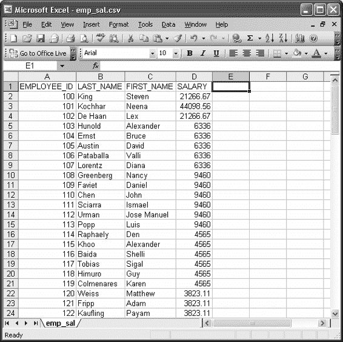

## 第 4 章 ■ 创建与导出数据

断开与 Oracle 数据库 11g 企业版 Release 11.1.0.6.0 - Production（含分区、OLAP、数据挖掘和实时应用测试选项）的连接后，命令行显示：C:\>

### 工作原理

许多 ETL（提取、转换和加载）工具都包含一个选项，可以从 Oracle 数据库读取数据并生成 CSV 格式的输出文件。如果你的数据迁移需求相当简单，且预算无法支持六位数的 ETL 工具许可证，那么`SQL*Plus`版本可能就足够了。甚至 Oracle 的免费工具`SQL*Developer`也能将查询结果或表导出为多种格式，包括 Microsoft Excel，但`SQL*Plus`更便于在批处理作业中编写脚本和调度。

`SQL*Plus`命令确保关闭默认列标题、设置足够的输出宽度等等。`SPOOL`和`SPOOL OFF`命令将输出发送到磁盘文件，该文件可被 Microsoft Excel 或其他能读取 CSV 文件的程序打开。

当你在 Microsoft Excel 中打开本解决方案生成的文件`emp_sal.csv`时，它看起来与任何电子表格都很相似，如`图 4-1`所示。

`图 4-1.` 在 Microsoft Excel 中打开的`SQL*Plus`生成的 CSV 文件 107

[www.it-ebooks.info](http://www.it-ebooks.info/)

[www.it-ebooks.info](http://www.it-ebooks.info/)

## 第 5 章

■ ■ ■

### 常见查询模式

在本章中，我们将介绍处理许多常见查询模式的方案，这些问题通常你明知应有优雅的解决方案，却不存在显而易见的 SQL 命令或运算符。无论是为了外推和规划目的而预测数据趋势，为在网站显示而对数据进行分页，还是在数据库中查找丢失的文本，你都能在本章中找到适合你的方案。

我们在此讨论的许多问题都有多种解决方案。在篇幅允许的情况下，我们尽量涵盖了尽可能多的选项。话虽如此，如果你发明或知道另一种方法，那么恭喜你，也是一位崭露头角的 SQL 大厨了！

##### 5-1. 将空值转换为实际值

**问题**

你希望用一个有意义的替代值来替换表或结果中的空值。

**解决方案**

Oracle 提供了多个函数来操作和转换空值为任意字面值，包括`NVL`、`NVL2`、`COALESCE`和基于`CASE`的测试。每个函数在处理空值时允许不同的逻辑，以不同的方式转换它们在结果中的表现。目标是将`NULL`值转换为对非数据库专业人士更有意义或更适合数据业务使用场景的内容。

我们方案的第一个`SELECT`语句使用`NVL`函数返回员工的 ID 和姓氏，以及佣金百分比，或者对于`COMMISSION_PCT`为空的员工，显示易于阅读的“无佣金”。

`select employee_id, last_name, nvl(to_char(commission_pct), 'No Commission') as COMMISSION from hr.employees;`

[www.it-ebooks.info](http://www.it-ebooks.info/)

## 第 5 章 ■ 常见查询模式

`EMPLOYEE_ID` `LAST_NAME` `COMMISSION`

----------- ----------- -------------

…

177 Livingston .2

178 Grant .15

179 Johnson .1

180 Taylor No Commission

181 Fleaur No Commission

182 Sullivan No Commission

…

我们方案的第二个版本针对相同的信息，但使用`NVL2`函数将员工分为获得佣金和未获得佣金两类。

`select employee_id, last_name, nvl2(commission_pct, 'Commission Based', 'No Commission') as COMMISSION from hr.employees;`

`EMPLOYEE_ID` `LAST_NAME` `COMMISSION`


## 第五章 ■ 常见查询模式

177 利文斯顿 基于佣金
178 格兰特 基于佣金
179 约翰逊 基于佣金
180 泰勒 无佣金
181 弗勒尔 无佣金
182 沙利文 无佣金

我们的第三种方法使用 `COALESCE` 函数，为基于佣金的员工返回 `COMMISSION_PCT` 和 `SALARY` 的乘积，或者为 `COMMISSION_PCT` 为 `NULL` 的员工返回 `SALARY` 值。

```sql
select employee_id, last_name,
       coalesce((1 + commission_pct) * salary, salary) as SAL_INC_COMM
  from hr.employees;
```

EMPLOYEE_ID LAST_NAME COMM_OR_SAL
----------- --------- -----------
…
210 King 4375
211 Sully 4375
212 McEwen 4375
100 King 24000
101 Kochhar 17000
102 De Haan 17000

[www.it-ebooks.info](http://www.it-ebooks.info/)

我们的第四种方法使用 `CASE` 特性来返回非佣金制员工的工资。

```sql
select employee_id, last_name,
       case
          when commission_pct is null then salary
          else (1 + commission_pct) * salary
       end total_pay
  from hr.employees;
```

结果与使用 `COALESCE` 函数的代码相同。

### 工作原理

`NVL`、`NVL2` 和 `COALESCE` 函数让您可以根据需求以不同方式处理 `NULL` 值。我们使用 `NVL` 的方法以基本方式选择 `EMPLOYEE_ID` 和 `LAST_NAME`，然后使用 `NVL` 来识别 `COMMISSION_PCT` 是有值还是 `NULL`。具有实际值的行返回该值，而 `NULL` 的行返回文本 "No Commission" 而不是什么都没有。

`NVL` 函数的基本形式如下：

```sql
nvl(expression, <value to return if expression is null>)
```

相比之下，第二种方法使用 `NVL2` 函数进一步处理 `NULL` 值。

`NVL2` 函数不只是为 `NULL` 替换一个占位符值，而是充当一个开关。在我们的例子中，`NVL2` 评估 `COMMISSION_PCT` 的值。如果检测到实际值，则返回第二个表达式。如果 `NVL2` 检测到 `NULL`，则返回第三个表达式。

`NVL2` 函数的一般形式如下所示：

```sql
nvl(expression,
    <value to return if expression is not null>,
    <value to return if expression is null>)
```

第三，我们使用 `COALESCE` 函数在每位员工的 `COMMISSION_PCT` 和 `SALARY` 中找到第一个非 `NULL` 值。`COALESCE` 函数可以接受任意数量的表达式，并返回解析为非 `NULL` 值的第一个表达式。一般形式是：

```sql
coalesce(expression_1, expression_2, expression_3 … expression_n)
```

最后，我们使用 `CASE` 表达式来评估 `COMMISSION_PCT` 字段，并在找到的值为 `NULL` 时切换逻辑。`CASE` 表达式的一般形式是：

```sql
case
   when <expression> then <value, expression, column>
   <optional additional when clauses>
   else <some default value, expression, column>
end
```

[www.it-ebooks.info](http://www.it-ebooks.info/)

##### 5-2. 对空值进行排序

**问题**

业务报告的结果按部门经理排序，但你需要找到一种方法来覆盖 `NULL` 值的排序，使它们出现在报告开头或结尾你想要的位置。

**解决方案**

Oracle 为 `ORDER BY` 子句提供了两个扩展，使 SQL 开发人员能够将 `NULL` 值与已知数据分开处理，允许将任何 `NULL` 条目显式地排序到结果的开头或结尾。

在我们的方法中，我们假设所需的报告基于 `HR.DEPARTMENTS` 表中的部门名称和经理标识符。此 SQL 选择此数据并使用 `NULLS FIRST` 选项来显式控制 `NULL` 处理。

```sql
select department_name, manager_id
  from hr.departments
 order by manager_id nulls first;
```

结果首先显示“无人管理”的部门，然后是按 `MANAGER_ID` 排序的有经理的部门。我们缩写了结果以节省篇幅。

DEPARTMENT_NAME MANAGER_ID
-------------------- ----------
Control And Credit
Recruiting
…
Shareholder Services
Benefits
Executive 100
IT 103
…
Public Relations 204
Accounting 205
27 rows selected.

### 工作原理

默认情况下，对于升序排序，Oracle 将 `NULL` 值排序到结果的末尾；对于降序排序，则排序到结果的开头。`NULLS FIRST ORDER BY` 选项及其补充 `NULLS LAST` 覆盖了 Oracle 对 `NULL` 值的正常排序行为，并将它们准确地放置在你指定的位置：结果的开头或结尾。

当你面对 `NULL` 值排序到数据“错误”一端的问题时，你的第一反应可能是简单地从升序切换到降序排序，或反之亦然。但如果你考虑更复杂的查询，使用 `ROWNUM` 或 `ROWID` 技巧的子查询，以及需要保留数据顺序同时移动 `NULL` 值的其他查询，你会看到 `NULLS FIRST` 和 `NULLS LAST` 具有真正的实用性。使用它们 *保证* 了 `NULL` 值出现的位置，无论数据值如何排序。

[www.it-ebooks.info](http://www.it-ebooks.info/)

##### 5-3. 对查询结果进行分页

**问题**

你需要在网页上显示查询结果，每页显示结果的一个子集。用户将能够在结果页之间前后导航。

**解决方案**

解决分页问题需要从更通用的角度思考这个过程——并结合使用几个基本的 Oracle 特性来处理像这样的问题。我们真正试图做的是找到结果集的一个 *明确的子集*，无论我们是在网页或报告上显示这个子集，还是将其输入到某个后续过程中。不需要更改你的数据来添加显式的页码或分区细节。我们的解决方案将使用 Oracle 的 `ROWNUM` 伪列和 `ROW_NUMBER` OLAP 函数来处理隐式页面计算，并使用嵌套子查询来控制我们看到的是哪一页数据。

我们将使用 `OE.PRODUCT_INFORMATION` 表作为解决方案的数据源，假设我们使用其中的数据来发布一个在线购物网站。在 Oracle 提供的示例模式中，`OE.PRODUCT_INFORMATION` 表包含 288 行。即使你技术上可以显示那么长的列表，对于单个网页来说也太多了。你的可怜客户在购买任何东西之前就会因为滚动而感到疲惫！

谢天谢地，我们可以用下一个 `SELECT` 语句来拯救我们的客户。我们将控制 `SELECT` 语句只返回 10 个结果。

```sql
select product_id, product_name, list_price from
  (select prodinfo.*, rownum r
     from
       (select product_id, product_name, list_price
          from oe.product_information
         order by product_id) prodinfo
    where rownum <= 10)
 where r >= 1;
```

这一次，我们不会缩写解决方案的结果，这样你就可以看到我们有 10 行结果可以显示在假设的网页上。

PRODUCT_ID PRODUCT_NAME LIST_PRICE
---------- -------------------- ----------
1726 LCD Monitor 11/PM 259
1729 Chemicals - RCP 80
1733 PS 220V /UK 89
1734 Cable RS232 10/AM 6
1737 Cable SCSI 10/FW/ADS 8
1738 PS 110V /US 86
1739 SDRAM - 128 MB 299
1740 TD 12GB/DAT 134
1742 CD-ROM 500/16x 101
1743 HD 18.2GB @10000 /E 800
10 rows selected.

一种替代技术是使用 `ROW_NUMBER` OLAP 函数执行等效的行编号，并类似地通过其生成的数字上的谓词进行过滤。

```sql
select product_id, product_name, list_price from
  (select product_id, product_name, list_price,
          row_number() over (order by product_id) r
     from oe.product_information)
 where r between 1 and 10
```

结果相同，包括像 18 GB 硬盘 800 美元这样的历史性产物！

那是美好的旧时光。

### 工作原理


# ROWNUM 与 ROW_NUMBER 分页技术详解

让我们首先研究一下 ROWNUM 技术。这个解决方案的核心是在子查询中使用 `ROWNUM` 来为我们真正想要的数据标记一个便于控制分页的序号。`ROWNUM` 的值并不存储在任何地方：它不是表中的列，也没有隐藏在其他地方。`ROWNUM` 是你**结果集**的一个伪列，它仅在你的结果被收集时才会产生，并且是在任何排序或聚合之前。

看看我们示例核心的子查询，你会看到格式是这样的结构。

```sql
select <columns I actually want>, rownum r
from
  (select <columns I actually want>
   from oe.product_information
   order by product_id)
where rownum <= 10
```

我们选择实际需要的数据和列，并将它们包装在另一个类似的 `SELECT` 中，该 `SELECT` 添加了 `ROWNUM` 值。我们为其指定一个别名，以便稍后在外层 `SQL` 语句中使用，我们很快会解释。

`FROM` 和 `ORDER BY` 子句是不言自明的，剩下的是 `ROWNUM` 谓词。在这个例子中，我们查找 `ROWNUM` 值小于 10 的行，因为我们最终想显示第 1 到 10 行。其一般形式是，我们真正请求的是所有匹配的结果行，其 `ROWNUM` 不超过我们想要的分页结束点。因此，如果我们想在假设的网站第 5 页显示第 41 到 50 项，这个子句应该写成 `WHERE ROWNUM <= 50`。在你的应用程序代码或存储过程中，很自然地会用一个绑定变量来替换它。

```sql
where rownum <= :page-end-row
```

这意味着子查询实际上会为直到你打算用于分页的最后一行的所有行产生结果。如果我们使用查询最终来显示第 41 到 50 项的页面，并使用了 `WHERE ROWNUM <= 50` 选项，子查询将收集 50 行的结果，而不仅仅是你打算显示的那 10 行。此时，外层查询就派上用场了。

外层查询的结构具有这种通用形式：

```sql
select <columns I actually want>
from
  (<rows upto the end-point of pagination provided by subselect>)
where r >= 1;
```

我们执行一个相当常规的子查询，在语句的 `SELECT` 部分从子查询中选取用于显示的有意义的列，并使用我们的 `WHERE` 谓词从子查询的结果中剔除任何不必要的前导行，为我们留下用于分页的完美数据集。对于针对第 41 到 50 行的示例修改，这个谓词将改为 `WHERE R >= 41`。同样地，在准备语句或存储过程中使用时，通常会使用绑定变量，给出 `WHERE` 子句的这种通用形式。

```sql
where r >= :page-start-row
```

此时，我们希望你心里存有两个疑问。为什么我们在子查询中为 `ROWNUM` 引入列别名 “r”，而不是在外层 `SELECT` 语句中再次直接使用 `ROWNUM` 特性？以及为什么不直接使用 `BETWEEN` 子句来简化整个设计？使用别名是为了将子查询中的 `ROWNUM` 值保留下来供外层查询使用。假设我们尝试像下面的 `SQL` 语句那样再次使用 `ROWNUM`。

```sql
-- 注意！这是故意错误的 rownum 逻辑
select product_id, product_name, list_price
from
  (select prodinfo.*, rownum
   from
     (select product_id, product_name, list_price
      from oe.product_information
      order by product_id) prodinfo
   where rownum <= 50)
where rownum >= 41;
```

自己试试运行它，你会惊讶地发现没有返回行。同样地，如果我们去掉子查询结构，只尝试一个 `BETWEEN` 子句，我们会构建出像下一个例子这样的 `SQL`。

```sql
-- 注意！这是故意错误的 rownum 逻辑
select product_id, product_name, list_price
from oe.product_information
where rownum between 41 and 50;
```

哎呀！再次，没有返回行。为什么这些会失败？这是因为 `ROWNUM` 机制只会在基本（非排序/聚合）条件满足后才分配一个值，并且总是从 `ROWNUM` 值 1 开始。只有在该值被分配后，它才会递增到 2，以此类推。通过去掉别名，我们最终在外层 `SELECT` 中生成了*新的* `ROWNUM` 值，然后询问第一个候选值 1 是否大于或等于 41。它不是，所以该行被丢弃，我们的 `ROWNUM` 值不会递增。后续的行都不满足相同的谓词——你最终得不到任何结果。使用 `BETWEEN` 变体也会引入同样的问题。这就是为什么我们首先使用别名，以及为什么我们在成功的示例中引用已保留的 “r” 值。

**注意** 开发者在使用这种逻辑风格时，常常未能测试非显而易见的案例。有一类数据子集会使我们有问题的示例返回结果。这会出现在第一页的数据，其起始行的 `ROWNUM` 值确实是 1。这是一个边界条件有效但所有其他可能数据范围都失败的典型案例。确保你的测试涵盖数据的自然端点以及中间范围，以避免自己陷入此类陷阱。

我们的第二个示例采用了不同的思路。使用 `ROW_NUMBER` OLAP 函数，我们可以在一次数据扫描中达成相同的结果。像所有 OLAP 函数一样，`ROW_NUMBER` 函数是在常规谓词、连接等被评估后才应用于查询的。就分页而言，这意味着子查询有效地查询了 `OE.PRODUCT_INFORMATION` 表中的所有数据，然后 `ROW_NUMBER` 按照指示的顺序（本例中按 `PRODUCT_ID`）应用一个递增的数字。

```sql
select product_id, product_name, list_price,
       row_number() over (order by product_id) r
from oe.product_information
```

如果我们单独评估这个子查询，会看到类似这样的结果（为节省纸张而缩写）。

```sql
PRODUCT_ID PRODUCT_NAME             LIST_PRICE          R
---------- -------------------- --------------- ----------
      1726 LCD Monitor 11/PM               259          1
      1729 Chemicals - RCP                  80          2
      1733 PS 220V /UK                      89          3
...
      3511 Paper - HQ Printer                9        287
      3515 Lead Replacement                  2        288

288 rows selected.
```

表的每一行都被返回，因为我们的 `SELECT` 语句没有使用任何过滤谓词来限定数据。`ROW_NUMBER` 函数已经为所有 288 行进行了编号，从 1 到 288。

此时，外层查询就派上用场了，它的作用非常直接。我们的示例使用了一个看起来像下一个 `SQL` 片段的外层查询语句。

```sql
select product_id, product_name, list_price
from
  (<subselect returning desired columns and row number “r”>)
where r between 1 and 10
```

这个外层 `SQL` 正如它看起来那样简单。从子查询中选择所需的列，其中 `r` 值（由子查询的 `ROW_NUMBER` 函数生成）在 1 到 10 之间。与我们使用 `ROWNUM` 的另一个解决方案相比，如果我们想表示不同页面的结果，比如第 41 到 50 项，外层查询的 `WHERE` 子句只需改为 `WHERE R BETWEEN 41 AND 50`。在一般形式中，我们建议对 `page-start-row` 和 `page-end-row` 进行参数化，如下面的 `SQL` 伪代码所示。

```sql
select <desired columns>
from
  (select <desired columns>,
          row_number() over (order by <ordering column>) r
   from <source table, view, etc.>)
where r between :page-start-row and :page-end-row
```


至此，你可能正在自问，在 `ROWNUM` 和 `ROW_NUMBER` 这两种方法中，应该选用哪一个。这个问题没有明确的答案。相反，最好记住这两种方案的一些特点。`ROWNUM` 方法拥有历史支持，并且在 Oracle 中内置了优化，使得由排序引发的操作比常规排序更快。`ROW_NUMBER` 方法则更为通用，它允许你以与标准 `ORDER BY` 子句产生的顺序不同的方式对行进行编号。你还可以修改方案，使用 `RANK` 和 `DENSE_RANK` 等其他 OLAP 函数来处理不同的分页需求，例如需要显示在“并列”位置的项目。

## 在数据库之外进行分页

我们的方案是在数据通常最适合处理的地方——数据库中——驱动数据分页！你可能使用过或体验过其他技术，例如基于游标的分页，甚至在应用层进行结果缓存，通过丢弃或隐藏数据来提供分页功能。

我们的建议是，在几乎所有情况下都应避免使用那些技术。应用缓存技术不可避免地需要产生过量的网络流量，并伴随相关的性能延迟和成本，而这并不会让用户欣赏。基于游标的方法确实在数据库层面工作以最小化网络问题，但使用游标技术总是容易受到“过时”分页的影响。不要有任何疑虑：让数据库为你进行分页——并收获其好处！

##### 5-4. 测试数据的存在性

### 问题

你想要比较两个相关表中的数据，以显示哪些地方存在匹配数据，同时也要显示哪些地方不存在匹配数据。

### 解决方案

Oracle 支持 `EXISTS` 和 `NOT EXISTS` 谓词，允许你将一个表或表达式中的数据与另一个表或表达式中的匹配或缺失数据关联起来。我们将使用一个假设情景：需要找出哪些部门当前有经理。为了最好地说明 `EXISTS` 解决方案，下一条 SQL 语句查找所有已知存在经理的部门。

```sql
select department_name
from hr.departments d
where exists
  (select e.employee_id
   from hr.employees e
   where d.manager_id = e.employee_id);
```

其补集，即测试不存在性的语句，在下一条语句中展示。我们要查找 `HR.DEPARTMENTS` 中所有其经理不存在于 `HR.EMPLOYEE` 表所保存数据中的部门。

```sql
select department_name
from hr.departments d
where not exists
  (select e.employee_id
   from hr.employees e
   where d.manager_id = e.employee_id);
```

### 工作原理

在任何数据库（包括 Oracle）中，`EXISTS` 谓词回答了这个问题：“两个数据项之间是否存在关系，进而，一个集合中的哪些项目与第二个集合中的项目相关？”

`NOT EXISTS` 变体则测试其反面：“基于一个给定的标准，是否可以明确地说两个数据集之间不存在关系？” 每种方法都被称为关联或关联子查询（字面意思是 co-relation，共享关系）。

有趣的是，Oracle 判断是否存在满足条件的数据完全基于这个前提：是否找到了满足子查询谓词的匹配行？这几乎太微妙了，所以我们要指出 Oracle 显然不会去寻找的东西。你在内部关联查询中选择什么并不重要——只有标准才重要。因此，你经常会看到存在性测试的不同版本，它们通过选择值 `1`、使用星号 (`*`) 选择整行、字面值、甚至 `NULL` 来形成子查询。最终，在这种方案形式中，这都无关紧要。关键点是关联表达式。在我们的例子中，就是 `WHERE D.MANAGER_ID = E.EMPLOYEE_ID`。

这也有助于解释 Oracle 在方案的后半部分做了什么，在那里我们寻找 `DEPARTMENT_NAME` 值，其行对应的 `MANAGER_ID` 不存在于 `HR.EMPLOYEES` 表中。Oracle 通过评估外部查询的每一行，内部关联查询是否返回任何行来驱动查询。Oracle 不关心关联标准之外的其他列中存在什么数据。单独使用此类 `NOT EXISTS` 子句时需要格外小心——不是因为逻辑不起作用，而是因为对于大型数据集，优化器可能会决定重复完整地扫描内部数据，这可能会影响性能。在我们的示例中，只要为一个部门列出的经理 ID 在 `HR.EMPLOYEES` 表中找不到，`NOT EXISTS` 谓词就会得到满足，该部门就会被包含在结果中。

■ **注意** 关联子查询满足了一个重要的问题解决需求，但在使用 `EXISTS` 或 `NOT EXISTS` 时，记住 `NULL` 值的性质至关重要。`NULL` 值不等同于任何其他值，包括其他 `NULL` 值。这意味着关联查询外部部分的 `NULL` 永远不会满足内部表、视图或表达式的关联标准。在实践中，这意味着你会看到与你预期可能完全相反的效果，因为即使内部和外部数据源的关联列都有 `NULL` 值，`EXISTS` 测试也将始终返回 false，而 `NOT EXISTS` 将始终返回 true。这不是普通人会预期的结果。

##### 5-5. 在一条 SQL 语句中进行条件分支

### 问题

为了在一条查询中产生简洁的结果，你需要根据另一行中的值有条件地、逐行更改返回的列。你希望避免笨拙地混合使用联合、子查询、聚合和其他不优雅的技术。

### 解决方案

对于需要有条件地分支或在源数据之间交替的情况，Oracle 提供了 `CASE` 语句。`CASE` 模仿了许多编程语言（如 C 或 Java）中的传统 switch 或 case 语句。

为了聚焦于我们的示例，我们假设问题更加具体和直接。

我们想要找出运输部门（`DEPARTMENT_ID` 为 50）的员工开始当前工作的日期。我们知道他们最初入职公司的日期记录在 `HR.EMPLOYEES` 表的 `HIRE_DATE` 列中，但如果他们曾获得晋升或改变角色，则他们开始新职位的日期可以从 `HR.JOB_HISTORY` 表中他们前一职位的 `END_DATE` 推断出来。我们需要根据情况，为运输部门的每个员工在 `HIRE_DATE` 或 `END_DATE` 之间进行分支，如下一条 SQL 语句所示。

```sql
select e.employee_id,
       case
         when old.job_id is null then e.hire_date
         else old.end_date end
       job_start_date
from hr.employees e left outer join hr.job_history old
  on e.employee_id = old.employee_id
where e.department_id = 50
order by e.employee_id;
```

我们的结果非常直接，掩盖了为选择正确的 `JOB_START_DATE` 而进行的复杂操作。

```
EMPLOYEE_ID JOB_START
----------- ---------
        120 18-JUL-96
        121 10-APR-97
        122 31-DEC-99
        123 10-OCT-97
        124 16-NOV-99
…
```

### 工作原理

我们的方案使用了 `CASE` 功能（是搜索形式而非简单形式），以在连接表的 `HIRE_DATE` 和 `END_DATE` 值之间进行切换。在某些方面，最容易将这个 `CASE` 操作视为一个结合了两个 `SELECT` 语句的操作。对于没有晋升的员工，就好像我们是这样选择的：

```sql
select e.employee_id, e.hire_date…
```

而对于有过晋升的员工，`CASE` 语句将 `SELECT` 切换为以下形式：

```sql
select e.employee_id, old.end_date…
```


# CASE 与条件逻辑之美

其精妙之处在于，你无需亲自显式编写这些语句，并且对于`CASE`更复杂的应用场景，也免去了编码数十甚至上百种语句组合的麻烦。

为了从数据的角度探究解决方案，以下`SQL`语句采用了与我们配方中相同的左外连接，来提取员工标识以及入职日期和结束日期。

```sql
select e.employee_id, e.hire_date, old.end_date end
from hr.employees e left outer join hr.job_history old
on e.employee_id = old.employee_id
where e.department_id = 50
order by e.employee_id;
```

```
EMPLOYEE_ID HIRE_DATE   END_DATE
----------- ---------   ---------
120         18-JUL-96
121         10-APR-97
122         01-MAY-95   31-DEC-99
123         10-OCT-97
124         16-NOV-99
...
```

结果显示了驱动我们配方中`CASE`函数决策的数据。粗体显示的值是我们配方返回的结果。对于所示的第一、第二、第四和第五行，来自`HR.JOB_HISTORY`表的`END_DATE`为`NULL`，因此`CASE`操作返回了`HIRE_DATE`。对于第三行，员工标识为 122，`END_DATE`有一个日期值，因此在我们的原始配方中被优先返回，而非`HIRE_DATE`。`CASE`语句有一种称为简单`CASE`的简写形式，它仅针对一个列或表达式进行操作，并为可能的值设置`THEN`子句。这对我们并不适用，因为 Oracle 以一种笨拙的方式限制了简单`CASE`中对`NULL`的使用。

##### 5-6. 条件排序与按函数排序

### 问题

在查询某些数据时，你需要按一个可选值排序，当该值不存在时，你希望将排序条件更改为另一个列。

[www.it-ebooks.info](http://www.it-ebooks.info/)

### 解决方案

Oracle 支持在其`ORDER BY`子句中使用几乎所有表达式和函数。这包括使用`CASE`语句以及像算术运算符这样简单和复杂的函数来动态控制排序。针对我们的配方，我们将处理一种情况：我们希望按从最高到最低的薪酬来显示员工。

对于那些有佣金的员工，我们想假设佣金是已赚取的，但不想实际计算并显示这个值；我们只想按隐含的结果进行排序。以下`SQL`利用`ORDER BY`子句中的`CASE`语句，为有和无`COMMISSION_PCT`值的情况进行条件分支排序逻辑。

```sql
select employee_id, last_name, salary, commission_pct
from hr.employees
order by
case
  when commission_pct is null then salary
  else salary * (1+commission_pct)
end desc;
```

从结果的前几行，我们就能看出排序时的条件分支是如何生效的。

```
EMPLOYEE_ID LAST_NAME   SALARY COMMISSION_PCT
----------- ---------   ------ --------------
100         King        24000
145         Russell     14000  .4
146         Partners    13500  .3
101         Kochhar     17000
102         De Haan     7000
...
```

尽管员工 101 和 102 的底薪更高，但使用了`CASE`的`ORDER BY`子句已根据包含的佣金百分比，正确地将员工 145 和 146 排在了前面。

### 工作原理

为我们的结果选择数据遵循 Oracle 的常规方法，因此员工标识、姓氏等是从`HR.EMPLOYEES`表中提取的。为了使用我们的`CASE`表达式对数据进行排序的目的，Oracle 执行了未在结果中显示的额外计算。所有佣金值非`NULL`的候选结果行都会计算`COMMISSION_PCT`和`SALARY`的乘积，然后与所有其他员工的`SALARY`数值进行比较以用于排序。

下一个`SELECT`语句有助于您可视化 Oracle 为排序计算而推导出的数据。

```sql
select employee_id, last_name, commission_pct, salary,
       salary * (1+commission_pct) sal_x_comm
from hr.employees;
```

[www.it-ebooks.info](http://www.it-ebooks.info/)

```
EMPLOYEE_ID LAST_NAME COMMISSION_PCT SALARY SAL_X_COMM
----------- --------- -------------- ------ ----------
100         King      24000
```


# 第五章 ■ 常见查询模式

145 Russell .4 14000 `19600`
146 Partners .3 13500 `17550`
101 Kochhar `17000`
102 De Haan `17000`
...

粗体显示的数值展示了 Oracle 在通过 `ORDER BY` 子句中的 `CASE` 表达式评估数据时用于排序的计算结果。`CASE` 表达式的一般形式可以简单表示如下。

```
case
when <表达式、列等> then <表达式、列、字面量等>
when <表达式、列等> then <表达式、列、字面量等>
…
else <未匹配情况的默认表达式>
end
```

我们不会无谓地重复 Oracle 手册中已有详尽说明的内容。简而言之，`CASE` 表达式会评估第一个 `WHEN` 子句是否匹配，如果满足条件，则执行 `THEN` 表达式。如果第一个 `WHEN` 子句不满足，则尝试第二个 `WHEN` 子句，依此类推。如果未找到匹配项，则评估 `ELSE` 默认表达式。

##### 5-7. 解决子查询返回意外多个值时的问题和错误

### 问题

在处理子查询的数据时，需要处理一些模糊情况：有时子查询会返回单个（标量）值，而有时会返回多个值。

### 解决方案

Oracle 支持三种表达式，允许基于单列结果对子查询进行比较。运算符 `ANY`、`SOME` 和 `ALL` 允许将子查询中的一个或多个单列值与外部 `SELECT` 中的数据进行比较。使用这些运算符可以处理那些希望在编码 SQL 时能够灵活处理不同大小集合比较的情况。

我们的方案侧重于使用这些表达式来解决一个具体的业务问题。订单录入系统在 `OE.PRODUCT_INFORMATION` 表中跟踪产品信息，包括 `LIST_PRICE`（标价）值。

然而，我们知道经常会提供折扣，因此希望大致了解哪些商品从未以全价销售过。为此，我们可以针对每次销售与标价进行精确的相关子查询。在此之前，可以通过一个非常快速的近似查询来查看是否存在任何 `LIST_PRICE` 值高于任何已知的商品销售价格（由 `OE.ORDER_ITEMS` 表的 `UNIT_PRICE` 列指示）。我们的 `SELECT` 语句形式如下。

```
select product_id, product_name
from oe.product_information
where list_price > ALL
(select unit_price
from oe.order_items);
```

从这个查询中，我们看到三个结果：

```
PRODUCT_ID PRODUCT_NAME
---------- ------------------------
2351 Desk - W/48/R
3003 Laptop 128/12/56/v90/110
2779 Desk - OS/O/F
```

这些结果意味着至少有三种商品——两张桌子和一台笔记本电脑——从未以全价销售过。

### 工作原理

我们的示例中使用了 `ALL` 表达式，它允许 Oracle 将每一次销售的 `UNIT_PRICE` 值进行比较，以查看是否有任何已知的销售价格大于某个商品的 `LIST_PRICE`。为了分解使这种方法有用的步骤，我们可以先看一下子查询。

```
select unit_price
from oe.order_items
```

这是一个非常简单的语句，返回一个单列结果集，包含零个或多个项目，下面以缩写形式展示。

```
UNIT_PRICE
-----------
482.9
…
665 rows selected.
```

基于这些结果，我们的外部 `SELECT` 语句将 `OE.PRODUCTION_INFORMATION` 表中的每个 `LIST_PRICE` 与列表中的每个项目进行比较，因为我们使用了 `ALL` 表达式。如果 `LIST_PRICE` 大于所有返回的值，则表达式解析为 true，该产品将被包含在结果中。即使有一个返回的 `UNIT_PRICE` 值超过了某个商品的 `LIST_PRICE`，该表达式也为 false，该行将被从进一步考虑中丢弃。

如果你回顾这个逻辑，会意识到这并不是对每个未以全价销售的商品的精确计算。相反，这只是一个快速的近似值，尽管它很好地展示了 `ALL` 技术的用法。

替代方案 `SOME` 和 `ANY`（它们实际上是同义词）仅需要子查询中有一个项目满足 `SOME`/`ANY` 条件即可解析 true/false 判定。Oracle 会欣然接受多个项目匹配 `SOME`/`ANY` 标准，但只需要确定一个值即可评估子查询。

##### 5-8. 在不同进制之间转换数字

### 问题

你需要找到一种通用方法，将 IP 地址和 MAC 地址等数字的十进制表示形式转换为十六进制、八进制、二进制和其他不常见的数字进制。

### 解决方案

Oracle 附带了少量进制转换功能，其中最著名的是 `TO_CHAR` 函数能够将十进制转换为十六进制。我们可以使用下面的 `SELECT` 语句将任意值（例如 `19452`）转换为十六进制：

```
select to_char(19452,'xxxxx')-oi-0ij
from dual;
```

我们的输出显示了正确计算出的值 `4BFC`。请自行运行该查询以确认 Oracle 十六进制转换的准确性。虽然这对特定情况很有用，但我们通常希望将十进制转换为二进制、八进制和其他不常用的进制。

■ `提示` 你可能会问，还有什么其他进制可能被使用？其中一位作者曾经参与过一个软件项目，该项目将所有数字存储在 36 进制中，使用数字 0 到 9 以及字母 A 到 Z，以应对某些只能存储字符串的硬件产品的限制。你可能会在最意想不到的时候发现自己需要转换到不常见进制！

其他进制转换并非 Oracle 开箱即用的原生功能，因此我们将创建自己的通用十进制转换函数，该函数可以接受一个给定的数字并将其转换为从 2 到 36 的任何进制！我们将使用 Oracle 附带的基本算术运算来构建我们的 `REBASE_NUMBER` 函数，如下所示。

```
create or replace function rebase_number
  (starting_value in integer, new_base in number)
  return varchar2
is
  rebased_value varchar2(4000) default NULL;
  working_remainder integer default starting_value;
  char_string varchar2(36) default '0123456789ABCDEFGHIJKLMNOPQRSTUVWXYZ';
  sign varchar2(1) default '';
begin
  if (starting_value < 0) then
    sign := '-';
    working_remainder := abs(working_remainder);
  end if;
  loop
    rebased_value := substr(char_string, mod(working_remainder,new_base)+1, 1)
                     || rebased_value;
    working_remainder := trunc(working_remainder/new_base);
    exit when (working_remainder = 0);
  end loop;
  rebased_value := sign || rebased_value;
  return rebased_value;
end rebase_number;
/
```

现在 `REBASE_NUMBER` 函数已可用，我们可以对我们最初的测试数字 `19452` 执行各种进制的转换。第一个示例展示了到十六进制的转换，以证明我们得到了与 Oracle 相同的结果。

```
select rebase_number(19452,16) as DEC_TO_HEX
from dual;
```

我们成功计算出了正确结果。

```
DEC_TO_HEX
----------
4BFC
```

将相同的数字转换为八进制同样成功。

```
select rebase_number(19452,8) as DEC_TO_OCTAL
from dual;
```

```
DEC_TO_OCTAL
------------
45374
```

最后一个转换为二进制的例子同样产生了正确的结果。

```
select rebase_number(19452,2) as DEC_TO_BINARY
from dual;
```

```
DEC_TO_BINARY
-------------
100101111111100
```

### 工作原理

我们的函数模拟了经典的离散数学，用于执行任何数字在两个进制之间的转换。基本算法形式如下：对于原始数字中的每个有效数字（千位、百位等）

• `使用新进制对该部分数字执行模除法。`
• `将结果的整数部分作为转换后数字中的新“数字”。`
• `取余数，并重复此过程，直到余数小于新进制。`
• `返回新的数字和最后的余数作为转换后的数字。`


我们实现此逻辑时，有两个不太明显的方面值得进一步解释。第一个涉及处理负数。我们的函数设置了多个局部变量（其中一些我们稍后会讨论），最后一个称为 `SIGN`。我们将其初始化为空字符串，这隐含地意味着向调用者报告正数结果，除非我们检测到有负数被传递给函数进行转换。在函数逻辑体的第一部分，我们测试 `STARTING_VALUE` 的符号，对于检测到的任何负数，将 `SIGN` 值更改为 `'-'`。

```sql
if (starting_value < 0) then
    sign := '-';
    working_remainder := abs(working_remainder);
end if;
```

检测负数并使用 `ABS` 函数将 `WORKING_NUMBER` 转换为正数，并不属于标准的十进制到十六进制转换过程。事实上，我们在算术运算中也不使用它！

它的存在纯粹是为了帮助实现我们实现中第二个不明显的方面，这是我们在函数中使用的一个技巧，我们稍后会讲到。在函数结束时，我们会恢复 `SIGN` 应有的状态，这样用户就不会注意到这个数据处理过程。

```sql
rebased_value := sign || rebased_value;
```

那么，为什么一开始要对数字的符号进行两步处理呢？这是因为我们使用了一个技巧来“查找”十进制数字（或数字组）转换到新进制的结果：通过找到我们取模除法的整数部分在字符串中的映射位置。在这个例子中，字符串就是你在函数开头看到的那个不寻常的局部变量 `CHAR_STRING`。

```sql
char_string varchar2(36) default '0123456789ABCDEFGHIJKLMNOPQRSTUVWXYZ';
```

你可能会想，为什么作者们要在书里练习打字？但我们不是！这个技巧是使用 `SUBSTR` 函数来遍历这个字符串，以找到我们转换的匹配值。它的基本工作原理如下。我们取一个源数字，比如 13，以及期望的进制，比如 16，然后将其插入到我们的 `SUBSTR` 调用中，如下一个片段所示。

```sql
substr(char_string, mod(13 /* our remainder */, 16 /* our new base */)+1, 1)
```

执行算术运算很容易。13 对 16 取模，商为 0，余数为 13。我们给这个值加一，因为我们的字符串是从零开始索引的，所以我们需要考虑到“第零个”位置，得到值 14。然后，我们从这个位置（14）开始，取 `CHAR_STRING` 的子字符串，长度为 1 个字符。字符串中的第 14 个字符是 D。瞧：我们已经将十进制数 13 转换为其十六进制等价值 D。从那里开始，只需对连续的取模除法结果重复此过程即可。

反向逻辑也可以整合到一个函数中，从而可以将任意进制的值转换为十进制。我们还可以将这些函数包装在一个辅助函数中，以实现从任意进制到其他任意进制的转换。这些函数可在 `www.oraclesqlrecipes.com` 获取。

5-9. 在不知道列名或表名的情况下搜索字符串

**问题**

你需要在数据库中查找某个特定文本值存储在哪里，但无法访问应用程序代码或逻辑，无法通过应用程序查看数据来确定这一点。你只有 Oracle 数据字典表和 SQL 来找到你想要的东西。

**解决方案**

目前没有可用的数据库包含一个全知全能的“到处搜索我想要的东西”的操作符。然而，利用 Oracle 字符串搜索 `LIKE` 操作符的基本构建块，以及将一个 `SELECT` 语句的结果作为另一个 `SELECT` 语句输出的能力，我们可以执行一系列步骤，自动追踪到保存我们所需文本数据的模式、表和列。

为了使我们的方案更具体，我们假设我们要在数据库中的某处查找文本“Greene”，但我们不知道——也找不到任何文档告诉我们——这个文本是人名、供应商或客户公司名、产品名称的一部分，还是其他文本的一部分。

我们的解决方案分两部分工作。第一个 `SELECT` 语句（如下所示）生成独立的 `SELECT` 查询作为结果，用于在所有模式的所有表的所有列中搜索我们未识别的文本“Greene”。

```sql
Select
    'select ''' || owner || ''','
    || '''' || table_name || ''','
    || '''' || column_name || ''','
    || column_name ||
    ' from ' ||
    owner ||
    '.' ||
    table_name ||
    ' where ' ||
    column_name ||
    ' like ''%Greene%'';' as Child_Select_Statements
from all_tab_columns
where owner in ('BI', 'HR', 'IX', 'OE', 'PM', 'SH')
and data_type in ('VARCHAR2','CHAR','NVARCHAR2','NCHAR')
and data_length >= length('Greene');
```

在我们的示例中，此命令的输出是一个包含 271 条 `SELECT` 语句的列表，每条语句对应 Oracle 示例模式中每个表的每个文本类列。下面显示了一个子集，并进行了格式化以便在打印页面上可读。

```
CHILD_SELECT_STATEMENTS
…
select 'HR','COUNTRIES','COUNTRY_NAME', COUNTRY_NAME
from HR.COUNTRIES
where COUNTRY_NAME like '%Greene%';

select 'HR','DEPARTMENTS','DEPARTMENT_NAME', DEPARTMENT_NAME
from HR.DEPARTMENTS
where DEPARTMENT_NAME like '%Greene%';

select 'HR','EMPLOYEES','FIRST_NAME', FIRST_NAME
from HR.EMPLOYEES
where FIRST_NAME like '%Greene%';

select 'HR','EMPLOYEES','LAST_NAME', LAST_NAME
from HR.EMPLOYEES
where LAST_NAME like '%Greene%';

select 'HR','EMPLOYEES','EMAIL', EMAIL
from HR.EMPLOYEES
where EMAIL like '%Greene%';
…
```

当你查看这些输出语句时，首先停下来思考一下，在许多（如果不是全部）表上运行这些语句是否会有性能影响。如果你的数据库大小达到数 TB，可能值得规划一下执行时间，以免影响性能。

一旦你对执行时机的安排感到满意，就可以针对数据库运行它们。它们将返回包含所查找文本的模式名、表名、列名以及列数据。部分结果如下所示。

```
select 'HR','EMPLOYEES','FIRST_NAME', FIRST_NAME
from HR.EMPLOYEES
where FIRST_NAME like '%Greene%';
no rows selected

select 'HR','EMPLOYEES','LAST_NAME', LAST_NAME
from HR.EMPLOYEES
where LAST_NAME like '%Greene%';
'H 'EMPLOYEE 'LAST_NAM LAST_NAME
-- --------- --------- -------------------------
HR EMPLOYEES LAST_NAME Greene

select 'HR','EMPLOYEES','EMAIL', EMAIL
from HR.EMPLOYEES
where EMAIL like '%Greene%';
no rows selected
```

随着第二组语句执行完毕，我们已经在 `HR.EMPLOYEES` 表的 `LAST_NAME` 列中找到了文本“Greene”。

**工作原理**

此解决方案采用两步法来解决这个问题。当你运行第一个查询时，它会搜索 `ALL_TAB_COLUMNS` 系统视图中的所有列，以查找具有文本数据类型（如 `VARCHAR2` 或 `CHAR`）的列的模式名、表名和列名。由于充斥着大量的字面量格式化和字符串拼接，逻辑有点难以看清，所以最好用以下通用结构来理解。

```sql
select
    <转义后的列名、表名和模式名，用于后续展示>,
    <实际的列名，用于后续查询>,
    <转义后的 from 子句，用于后续查询 >
    <转义后的 where 子句，用于后续查询 >
from all_tab_columns
where owner in (<我们感兴趣的模式列表>)
and data_type in ('VARCHAR2','CHAR','NVARCHAR2','NCHAR')
and data_length >= <所查找文本的长度>;
```

对于每个至少有一个相关文本数据类型的表，此查询将发出一个结果，该结果采用如下形式的 `SELECT` 语句：

```sql
select
    <字面模式名>,
    <字面表名>,
    <字面列名>,
    <列名>
from <模式.表>
where <列名> like '%<所查找的文本>%';
```

# 第 5 章 ■ 常见查询模式

## ALL_TAB_COLUMNS 与 ALL_TAB_COLS

细心的观察者会注意到，我们的解决方案是基于 `ALL_TAB_COLUMNS` 系统视图设计的。Oracle 还包含一个名为 `ALL_TAB_COLS` 的系统视图。这两个视图看起来几乎一模一样，拥有相同的字段，但行数略有不同。那么，为何在本方案中选择 `ALL_TAB_COLUMNS` 呢？

答案在于 Oracle 定义这两个视图时所使用的定义略有不同。`ALL_TAB_COLS` 系统视图包含了通常对用户或开发者不可见的隐藏列。由于我们的方案旨在查找最终用户日常使用的普通数据，我们可以合理地假设开发人员没有通过隐藏自己的列或滥用 Oracle 系统控制的隐藏列来耍花招。

到目前为止，本方案并未假设您将使用何种工具来配合解决方案工作。您可以愉快地在 `SQL*Plus`、`SQL Developer` 中运行第一条语句，或者通过可编程 API 运行，并获取需要执行的第二组语句。同样，您可以使用任何工具来执行这些语句并查看结果，揭示丢失文本的藏身之处。但还可以实现一些额外的优化。例如，您可以将大部分逻辑封装在 `PL/SQL` 函数或存储过程中，或者利用 `SQL*Plus` 等查询工具的格式化功能，使解决方案更加优雅。

##### 5-10. 预测序列结束后的数据值和趋势

### 问题

你需要从一个大型数据集中，预测信息在当前数据集范围之外的行为或趋势。

### 解决方案

基于数据中的模式（例如两个数值之间的关系）来预测趋势并推断可能性，可以通过多种方式实现。最流行的技术之一是线性回归分析，Oracle 为此提供了众多适用于当代趋势分析算法的线性回归函数。

作为 Oracle 数据库附带的示例模式的一部分，`SH` 模式下提供了一个销售历史数据仓库示例。它包含一个事实表，其中有约一百万条已售出单品的记录，并包含时间、销售渠道等维度信息，以及给定销售的商品价格。

我们的方案假设我们正在解决这样一个问题：如果我们引入比目前销售的商品更昂贵的商品，预测会发生什么情况。实际上，我们希望根据当前销量与商品价格的销售趋势，推断超出当前最昂贵商品的范围。

我们正在回答一个基本问题：如果某件商品更贵，我们真的会销售它吗？如果会，我们能卖出多少件？

以下的 `SELECT` 语句使用了三个 Oracle 线性回归函数来帮助指导我们的推断。我们在探究：如果我们开始以更高的价格销售 `Electronics` 类别的商品，可能会发生什么？我们会卖得更多还是更少？销售量会随着价格变化而变化多快？

```sql
select
s.channel_desc,
regr_intercept(s.total_sold, p.prod_list_price) total_sold_intercept, regr_slope (s.total_sold, p.prod_list_price) trend_slope,
regr_r2(s.total_sold, p.prod_list_price) r_squared_confidence
from sh.products p,
(select c.channel_desc, s.prod_id, s.time_id, sum(s.quantity_sold) total_sold from sh.sales s inner join sh.channels c
```

接下来，只需运行这些 `SELECT` 语句，并记录下哪些语句真正产生了结果。所有精心设计的字面量转义和引号用于一直保留到这个层级的对象名称，因此结果不仅包含上下文中您要查找的文本，还包含 `schema`、`table` 和 `column` 的人类可读数据，如下例所示的一行：

`HR EMPLOYEES LAST_NAME Greene`

文本“Greene”的至少一个实例可以在 `HR.EMPLOYEES` 表的 `LAST_NAME` 列中找到。

[www.it-ebooks.info](http://www.it-ebooks.info/)

# 线性回归分析

```sql
select s.channel_desc,
       regr_intercept(s.total_sold, p.list_price) intercept,
       regr_slope(s.total_sold, p.list_price) slope,
       regr_r2(s.total_sold, p.list_price) r2
from
    (select c.channel_desc, s.prod_id, s.time_id, sum(s.quantity_sold) total_sold
     from sh.sales s
     inner join sh.channels c
     on s.channel_id = c.channel_id
     group by c.channel_desc, s.prod_id, s.time_id) s,
    sh.products p
where s.prod_id = p.prod_id
    and p.prod_category = 'Electronics'
    and s.time_id between to_date('01-JAN-1998') and to_date('31-DEC-1999')
group by s.channel_desc
order by 1;
```

`CHANNEL_DESC` `TOTAL_SOLD_INTERCEPT` `TREND_SLOPE` `R_SQUARED_CONFIDENCE`
------------ ------------------- ----------- --------------------
直销 24.2609713 -.02001389 .087934647
互联网 6.30196312 -.00513654 .065673194
合作伙伴 11.738347 -.00936476 .046714001
电话销售 36.1015696 -.11700913 .595086378

对于那些不熟悉解读线性回归的人来说，外推趋势可以用以下通用形式读取：

`Y = 截距 + 斜率(X)`

在我们的数据中，`Y` 是销售物品的总数，`X` 是标价。我们可以看到，对于直销、互联网和合作伙伴渠道，随着价格上升，销售额会温和下降，而电话销售渠道的销售量随着成本增加会急剧下降。然而，我们的置信度值表明前三个预测对于这些渠道来说拟合不佳。`R` 平方置信度值表示外推拟合线与数据的契合程度（也称为拟合优度），值为 `1.0` 表示“完美拟合”，`0` 表示“绝对没有相关性”。

## 它是如何工作的

为了给我们的线性回归函数（如 `REGR_SLOPE`）提供数据，我们需要确保提供的是我们想要比较的实际值。我们的方法将销售物品的总数与物品的标价进行比较。`SH.SALES` 表跟踪每个单独物品的销售情况，每个售出物品有一条记录。

正是由于这个原因，我们使用内联视图将这些单独的销售记录汇总为特定产品、日期和渠道的总销售数量。你可以单独运行子查询，如下面的 SQL 语句所示。

```sql
select c.channel_desc, s.prod_id, s.time_id, sum(s.quantity_sold) total_sold
from sh.sales s
inner join sh.channels c
on s.channel_id = c.channel_id
group by c.channel_desc, s.prod_id, s.time_id;
```

[www.it-ebooks.info](http://www.it-ebooks.info/)

## 第 5 章 ■ 通用查询模式

这不足为奇，结果提供了一个简单的汇总，准备好用于我们的线性回归函数。

`CHANNEL_DESC` `PROD_ID` `TIME_ID` `TOTAL_SOLD`
-------------------- ---------- ---------- ----------
…
直销 30 24-OCT-01 1
互联网 32 30-NOV-01 4
直销 35 28-OCT-01 12
合作伙伴 47 09-NOV-01 1
直销 14 06-OCT-01 5
…

我们的结果为我们销售的每种物品类型提供了此汇总。我们将内联视图连接到 `SH.PRODUCTS` 表，然后通过 `PROD_CATEGORY` 为 `Electronics` 和一个两年的日期范围进行筛选，以聚焦于我们推测的问题。然后，`SELECT` 子句中的线性回归函数开始发挥作用。

这三个统计函数中的每一个都获取每个渠道的已计算的 `TOTAL_SOLD` 数量和 `LIST_PRICE` 值（感谢 `GROUP BY` 子句），并执行相关的计算。一本好的统计学教科书会告诉你这些公式是如何推导出来的，但表 5-1 向你展示了每个公式的方法。

***表 5-1.** 支持线性回归分析的 Oracle 统计方法*

`函数` `公式`
`REGR_INTERCEPT` `(Σy)/n - (Σxy - (Σx)(Σy)/n)/(Σx² - (Σx)²/n) (Σx)/n`
`REGR_SLOPE` `(Σxy - (Σx)(Σy)/n)/(Σx² - (Σx)²/n)`
`REGR_R2` `(Σxy - (Σx)(Σy)/n)²/(Σx² - (Σx)²/n)(Σy² - (Σy)²/n)`

只看那些公式就应该让你庆幸自己不必亲自编写计算代码。只需调用相应的函数，Oracle 就会为你完成繁重的工作。利用这些函数返回的数据，你就可以可视化销售量如何随价格变化。图 5-1 显示了我们的线性回归数据，以假设的外推线形式表达了销售量与标价之间的关系。

[www.it-ebooks.info](http://www.it-ebooks.info/)

## 第 5 章 ■ 通用查询模式

直销

互联网

合作伙伴

电话销售

标价 (x)

# 第 5 章 ■ 常见查询模式

***图 5-1.*** *使用线性回归对销售量和标价进行外推* 这清楚地表明了当您调整价格时，销售量可能会如何变化。但此图缺少了拟合优度的指示：具体来说，就是数据与从中提取的外推值之间的估计关系有多可靠。这是使用 `REGR_R2` 函数计算出的 R 平方值。

##### 5-11. 显式（悲观地）锁定待更新的行

### 问题

为了保护一个特别敏感和特殊的业务场景，您被要求确保对员工薪资的更新能够避免丢失更新，同时还被要求不能使用乐观锁定方法。

### 解决方案

我们的问题模拟了开发人员和数据库管理员所面临的经典问题之一。虽然 Oracle 提供了出色的并发控制和锁定机制，并支持乐观和悲观设计方法，但通常是政策或业务决策迫使您使用某一种技术。

[www.it-ebooks.info](http://www.it-ebooks.info/)

在您使用 Oracle 的某个阶段，您可能会发现您关于 Oracle 优秀并发技术的最有说服力的论点，被一位经理搁置一旁，这位经理会说：“那些都很好，但我想只授予一次加薪，而且*我不想看到*任何消息提示另一位经理更新了同一位员工的薪资，让我需要再试一次。”

面对这种威胁职业生涯的要求，您会很高兴知道 Oracle 提供了 `SELECT … FOR UPDATE` 选项来显式锁定数据并提供悲观并发控制。对于我们的方案，我们将使用以下 SELECT 语句来查找员工 200，Jennifer Whalen 的薪资数据，为后续的更新做准备。

```
select employee_id, last_name, salary
from hr.employees
where employee_id = 200
for update;
```

```
EMPLOYEE_ID LAST_NAME SALARY
----------- --------- ------
200 Whalen 4400
```

到目前为止，一切顺利。如果第二个用户（或同一用户通过不同连接）尝试对这一行执行 `SELECT`、`UPDATE` 或 `DELETE` 操作，该用户将被阻塞。尝试从另一个连接发出相同的 SELECT 语句，您会发现没有结果，因为会话正在等待与 `SELECT … FOR UPDATE` 悲观锁定相关的锁被释放。

```
select employee_id, last_name, salary
from hr.employees
where employee_id = 200
for update;
```

（尚未有结果……等待阻塞的排他锁）

从第一个会话中，我们完成更新。

```
update hr.employees
set salary = salary * 1.1
where employee_id = 200;
commit;
```

随着第一个会话的提交，第二个会话的 SELECT 语句最终运行，并返回以下结果。

```
EMPLOYEE_ID LAST_NAME SALARY
----------- --------- ------
200 Whalen 4840
```

请注意，第二个会话没有中断更新操作，并且从未看到更新前的数据。

[www.it-ebooks.info](http://www.it-ebooks.info/)

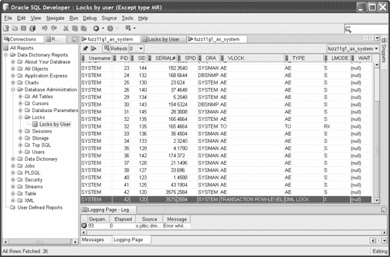

### 工作原理

`FOR UPDATE` 子句实现悲观锁定效果的关键在于它强制 Oracle 对 SELECT 查询所涵盖的数据获取锁的方式。Oracle 会尝试对满足 `SELECT … FOR UPDATE` 查询的每一行获取模式 X（排他）的事务行级锁。

当第一个连接发出 `SELECT … FOR UPDATE` 语句时，我们可以查询 `V$LOCK` 动态视图或使用 SQL Developer 等图形化工具来查看已获取的锁，如图 5-2 所示。

***图 5-2.** 在 SQL Developer 中，针对第一个会话的 Select for update 显式锁定* 高亮行显示了 `HR.EMPLOYEES` 表中 `EMPLOYEE_ID` 为 200 的行上的锁。一旦第二个连接尝试相同的语句，它就会尝试获取相同的排他锁，即使这样做通常的第一个后果仅仅是选择数据。图 5-3 展示了 Oracle 正常的“写入不会阻塞读取”行为是如何被 `FOR UPDATE` 技术所覆盖的。

[www.it-ebooks.info](http://www.it-ebooks.info/)

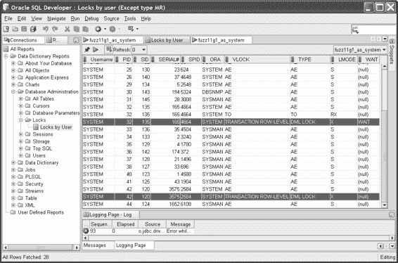

# 第 5 章 ■ 常用查询模式

***图 5-3.** 第二个选择更新被阻塞，等待会话 1*

高亮显示的行表明第二个会话处于 `WAIT` 状态，在第一个会话提交或回滚其工作之前，它被阻塞无法执行任何操作。一旦我们在会话 1 中执行更新并提交结果，阻塞条件就会清除，第二个会话获得它想要的排他行级事务锁，进而可以执行其预期的更新。图 5-4 显示了已清除的 `WAIT` 状态，以及现在持有锁的第二个会话。

[www.it-ebooks.info](http://www.it-ebooks.info/)

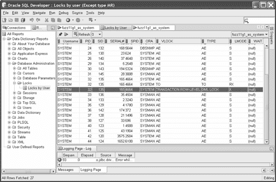

***图 5-4.** 已从等待状态清除，第二个选择更新现在持有一个排他锁*

通过这种方式，在那些无法避免锁定的特定情况下，你可以对 Oracle 中的锁定采取显式的悲观控制。

> **注意：** 虽然这种方法可能会让你的上司高兴，但你可能需要随着时间的推移，温和地向他/她普及 Oracle 的伟大技术，特别是非阻塞能力——读者不会阻塞写者，并且每个人都能获得数据的一致视图。他们第一次可能不想听，但请在交谈中不断提及，“老板，您当初选择购买一个能实现这种功能的数据库，真是太明智了。” 这样，他们的自尊心就会开始为你服务，而不是与你作对，你就可以尽可能避免使用这些悲观锁定技术了。

[www.it-ebooks.info](http://www.it-ebooks.info/)

##### 5-12. 同步两个表的内容

### 问题

你管理一个系统，其中维护着两个或多个结构相同的表，但每个表只存储了另一个表的一部分行。你需要同步这些表，使它们各自包含完整的行集合。

### 解决方案

表同步是一个有无数潜在解决方案的问题。Oracle 所有基本的 SQL 功能都可以用来比较、插入或删除行。对于我们的方案，我们将尝试使用一种更优雅的同步方法，这种方法在急于用程序化方式解决问题的喧嚣中常常被忽视。

与其在 SQL 或 PL/SQL 中编写复杂的循环、测试等逻辑，Oracle 的 `MINUS` 集合操作符可以以集合的方式确定两个数据集之间的差异。

为了说明我们的方案，我们设想公司有两个子公司，每个子公司都在结构与 `HR.EMPLOYEES` 表相同的表中跟踪一部分员工子集。我们用以下 `CREATE TABLE` 语句创建这些表 `EMPA` 和 `EMPB`。

```sql
create table hr.empa
as
select *
from hr.employees
where employee_id < 175;

create table hr.empb
as
select *
from hr.employees
where employee_id > 125;
```

选择的 `EMPLOYEE_ID` 截止值是任意的，只是为了确保两个表中不仅有一些重复的行，也有一些每个表独有的行。我们可以通过接下来的两个 SQL 语句快速证明我们的表数据不同。

```sql
select min(employee_id), max(employee_id), count(*)
from hr.empa;

MIN(EMPLOYEE_ID) MAX(EMPLOYEE_ID) COUNT(*)
---------------- ---------------- ----------
100              174              75

select min(employee_id), max(employee_id), count(*)
from hr.empb;

MIN(EMPLOYEE_ID) MAX(EMPLOYEE_ID) COUNT(*)
---------------- ---------------- ----------
126              212              84
```

[www.it-ebooks.info](http://www.it-ebooks.info/)

至此，我们已经建立了子公司表，并看到它们的数据有重叠，但在某些地方是不同的。我们的解决方案使用 `MINUS` 操作，通过下面的两个语句使表达到同步。

```sql
insert into hr.empa
select *
from hr.empb
minus
select *
from hr.empa;

insert into hr.empb
select *
from hr.empa
minus
select *
from hr.empb;
```

同步执行后，快速检查显示我们现在似乎拥有了相同的数据集。

```sql
select min(employee_id), max(employee_id), count(*)
from hr.empa;

MIN(EMPLOYEE_ID) MAX(EMPLOYEE_ID) COUNT(*)
---------------- ---------------- ----------
```


# SQL 查询示例与数据同步

```sql
select min(employee_id), max(employee_id), count(*)
from hr.empb;
```

```
MIN(EMPLOYEE_ID) MAX(EMPLOYEE_ID) COUNT(*)
---------------- ---------------- ----------
             100              212        110
```

当然，欢迎您浏览两张表中的全部数据，但您会很高兴地知道，您不会失望，所有数据都将显示为已同步。

## 工作原理

这个方法使用了两次 `MINUS` 操作，每次方向各一次。首先，我们处理表 `HR.EMPA`，使用 `INSERT INTO … SELECT` 方法。其中的 `SELECT` 是关键，如下一条语句片段所示。

```sql
select *
from hr.empb
minus
select *
from hr.empa;
```

[www.it-ebooks.info](http://www.it-ebooks.info/)

您可以单独运行此语句，以查看 `HR.EMPA` 的内容如何从 `HR.EMPB` 的内容中被“减去”，从而留下 `HR.EMPB` 中独有的行。为节省空间，这些示例结果已缩略。

```
EMPLOYEE_ID FIRST_NAME AST_NAME EMAIL …
----------- ---------- -------- --------
        175 Alyssa     Hutton   AHUTTON …
        176 Jonathon   Taylor   JTAYLOR …
        177 Jack       Livingston JLIVINGS …
        178 Kimberely  Grant    KGRANT …
        179 Charles    Johnson  CJOHNSON …
…
```

来自 `MINUS` 操作的这些结果随后被输入到 `INSERT` 语句中，然后 `HR.EMPA` 就拥有了其所有原始行，外加 `HR.EMPB` 中存在但 `HR.EMPA` 中没有的所有那些行。

然后，我们只需在第二条语句中反转数据流的顺序，使用 `MINUS` 操作来选择仅存在于 `HR.EMPA` 但缺失于 `HR.EMPB` 的行，并将它们适当地插入。这两条 `INSERT` 语句的执行顺序无关紧要，只要它们都成功完成即可。

您也可以用替代方案替换第二条 SQL 语句。因为我们知道在第一次 `INSERT` 后 `HR.EMPA` 拥有完整的数据集，所以我们可以清空 `HR.EMPB` 中的所有数据，并从 `HR.EMPA` 复制所有内容，而无需任何谓词或 union 操作符。接下来的代码展示了第二步所需的语句。

```sql
truncate table HR.EMPB;
insert into HR.EMPB select * from HR.EMPA;
```

这有时可能更快，因为它避免了使用 `MINUS` 操作符所隐含的排序。

[www.it-ebooks.info](http://www.it-ebooks.info/)

# 第二部分

## 数据类型及其问题

[www.it-ebooks.info](http://www.it-ebooks.info/)

# 第六章

## 处理日期和时间值

本章涉及日期、时间及相关时态数据类型的配方。涉及日期和时间的查询在几乎所有的数据库中都非常普遍。与其他形式的数据相比，处理日期和时间也非常奇特，这源于我们的日期、小时、分钟、秒、日、月和年概念形成的悠久历史（请原谅这个双关语）。例如，我们将分钟划分为 60 秒，小时划分为 60 分钟，天划分为两个 12 小时时段，这源于古代苏美尔和巴比伦的传统。而他们通过使用一只手四根手指（不包括拇指）的关节来计数小时和其他事物，从而得到了十二进制的概念。

世界各地的日历源于各种宗教影响、不同地区帝王和国王的兴致等等。雪上加霜的是，当您以为自己从基本层面理解了日期和时间时，只需问问天文学家的看法。他们会告诉您，一天的长度至少有三种不同的度量方式——取决于您是在测量地球的自转；地球返回到指向夜空中同一固定恒星所需的时间；以及，最奇怪的是，简单地将一天视为空间角度的方程。

因此，处理日期和时间值、执行时态运算以及回答本应简单的日期和时间问题，常常会导致非常棘手的问题——无论是否使用 Oracle，皆是如此。


# 第六章 ■ 处理日期和时间值

本章的一个关键方面，是让你以全新的视角来思考自己面临的日期和时间问题及查询，并激发你的想象力，思考 Oracle 众多各异的日期和时间函数与工具如何能够解决一些最棘手的时间序列问题。

##### 6-1. 将日期时间值转换为可读字符串

### 问题

你需要将 Oracle 默认日期格式提供的短日期转换为完整日期，以便插入到套用信函或报告中。

[www.it-ebooks.info](http://www.it-ebooks.info/)

### 解决方案

使用 Oracle 的 `TO_CHAR` 函数，以所需格式格式化日期、时间及其他时间数据。`TO_CHAR` 函数支持广泛的日期专用格式选项，可处理日/月名称、数字表示和格式化，以及类似任务。我们的示例假设你希望以完整的描述性格式显示员工被雇佣的日期。具体来说，你希望将 `1/1/2009` 报告为 `Thursday, January 1st, 2009`（星期四，2009 年 1 月 1 日）。

接下来的 SQL 语句为所有员工执行相关的计算和格式化。

```sql
select first_name, last_name,
       to_char(hire_date, 'Day, Month DDTH, YYYY') formatted_hire_date
  from hr.employees;
```

我们的 `TO_CHAR` 格式化结果会显示正确的星期名称、月份名称以及其他所需的格式。

```
FIRST_NAME   LAST_NAME   FORMATTED_HIRE_DATE
-----------  ----------  --------------------------------------
Donald       OConnell    Monday, June 21ST, 1999
Douglas      Grant       Thursday, January 13TH, 2000
Jennifer     Whalen      Thursday, September 17TH, 1987
Michael      Hartstein   Saturday, February 17TH, 1996
Pat          Fay         Sunday, August 17TH, 1997
...
```

### 工作原理

我们的示例采用了非常直接的结构来从 `HR.EMPLOYEES` 表中选取 `FIRST_NAME` 和 `LAST_NAME` 值。在选取 `HIRE_DATE` 时，我们使用了 `TO_CHAR` 函数并配合特定的格式代码，以更改数据的默认格式，指示 Oracle 输出完整的星期和月份名称、序数日期数字以及完整的年份。

用于转换日期的 `TO_CHAR` 函数通用格式如下。

```sql
to_char(<日期/时间表达式>, '<格式选项>')
```

在我们的示例中，我们使用了几个选项来格式化日期。我们以 `Day` 选项开头，它返回完整的星期名称，例如 `Monday`（星期一）。我们还使用了 `DD` 结合序数格式代码 `TH`，来返回序数日期数字，例如 `21st` 和 `17th`。`MONTH` 代码返回完整的月份名称，例如 `January`（一月）。年份由 `YYYY` 代码返回，它指示 Oracle 返回完整的四位数年份。

我们假设在未来的某个版本中（大概是在公元 10000 年之前的某个时候），Oracle 会支持这里使用五个 `Y` 格式字符。

Oracle 包含众多其他的日、月、年及其他格式选项，可以以数字、文字和区域敏感的字符串（尽管格式化命令中使用的关键字始终是英文）返回日期和时间信息。字符串中还有另外五个格式字符，尽管它们可能并不显而易见。两个逗号字符和三个空格本身也包含为格式选项。这些，连同其他常见的标点符号（如破折号和冒号），都是 `TO_CHAR` 格式字符串中的有效选项。

[www.it-ebooks.info](http://www.it-ebooks.info/)

`Note` 令人欣慰的是，Oracle 在日期和时间的 `TO_CHAR` 函数中支持各种格式代码和选项。但是，传递给 `TO_CHAR` 函数的格式选项有 22 个字符的限制。

这可能会阻碍你以精心设计的方式格式化日期和时间。如果遇到此限制，请不要绝望。你总是可以结合多次调用 `TO_CHAR` 与其他字符串函数（如第 7 章所示）来生成所需的输出。

##### 6-2. 将字符串转换为日期时间值

### 问题

你需要将文本形式提供的日期信息转换为 Oracle 的 `DATE` 格式。

### 解决方案


# 第六章 ■ 处理日期和时间值

## TO_DATE 函数

正如 Oracle 支持 `TO_CHAR` 函数将日期时间转换为文本一样，它也支持一个功能等效的函数 `TO_DATE`，来执行相反的过程，即将文本转换为日期时间。

假设你获得一个书面形式的日期，比如 `January 17, 2009`。Oracle 期望日期以一种默认格式出现，这取决于 `NLS` 区域设置。默认情况下，Oracle 期望的日期格式是 `DD-MMM-YY` 或 `DD-MMM-YYYY` 之一。你可以使用 `TO_DATE` 函数将 `January 17, 2009` 转换为这些格式之一，如下面的 SQL 语句所示。

```sql
select to_date('January 17, 2009', 'Month DD, YYYY') formatted_date
from dual;
```

```
FORMATTED_DATE
--------------
17-JAN-09
```

## 工作原理

`TO_DATE` 函数旨在解释文本和数字形式的日期时间，并使用格式模式应用转换规则，产生一个转换为 `DATE` 数据类型的结果。`TO_DATE` 函数的通用形式如下所示。

```
to_date(<string>, <format options>)
```

函数的 `string` 参数是你希望转换为 Oracle `DATE` 数据类型的文本、数字和标点符号。`format` 参数是一个由格式选项组成的字符串。

Oracle 使用格式选项以“解析并匹配”的方式解析文本字符串。成功将你的文本转换为有意义日期的关键在于找到与你需要转换的文本相匹配的格式选项。

## 表 6-1. 常用日期和时间格式选项

| 代码 | 格式 |
| :--- | :--- |
| `Day` | 星期几的完整书面形式（例如，`Wednesday`） |
| `DD` | 月份中的天数，数字形式，1 到 31 |
| `DY` | 星期几的缩写书面形式（例如，`Mon` 代表 `Monday`） |
| `HH` | 一天中的小时，数字形式，1 到 12 |
| `HH12` | 一天中的小时，数字形式，1 到 12 |
| `HH24` | 一天中的小时，24 小时制数字形式，0 到 23 |
| `MI` | 一小时中的分钟，数字形式，0 到 59 |
| `MM` | 月份，数字形式，01 到 12 |
| `Mon` | 月份的缩写书面形式（例如，`Apr` 代表 `April`） |
| `Month` | 月份的完整书面形式（例如，`September`） |
| `RR` | 来自上个（20）世纪的年份，以双字节表示法 |
| `YYYY` | 数字年份，以四位数表示。 |

Oracle 甚至包含了处理复杂情况的格式代码，例如将月份中的日期以数字序数词的书面形式（而非数字）表达。因此，如果你需要，你可以成功转换像 `January Seventeenth` 这样的字符串。

##### 6-3. 检测重叠的日期范围

### 问题

你需要找出在系统建模的一些数据中，开始日期和结束日期范围在何处重叠。

### 解决方案

Oracle 支持所有用于查询条件和谓词的典型比较运算符，适用于 `DATE`、`TIMESTAMP` 和其他时间数据类型。这意味着你可以测试日期是否大于、小于、等于其他日期，是否在给定列表中，是否不在给定列表中，等等。日期“更大”和“更小”的概念对应于时间上“更早”和“更晚”的点。

我们的示例将聚焦于 `SH.PROMOTIONS` 表，该表跟踪了诸如优惠券和折扣码等促销优惠在随时间销售过程中被记录和使用的情况。下面的 SQL 语句确定了在 `Newspaper` 促销类别下的 `Ad News` 子类别中，哪些促销是在现有促销仍在进行时开始的。

```sql
select p2.promo_name || ' started before ' || p1.promo_name || ' ended.'
as "Promotion Overlap"
from sh.promotions p1 inner join sh.promotions p2 on
(p1.promo_category = p2.promo_category and
p1.promo_subcategory = p2.promo_subcategory and
p1.promo_id != p2.promo_id)
where p1.promo_category = 'newspaper'
and p1.promo_subcategory = 'ad news'
and p2.promo_begin_date >= p1.promo_begin_date
```


## 促销重叠

并且 `p2.promo_begin_date <= p1.promo_end_date`。

结果以通俗的英文语言提供了重叠促销活动的详细信息。

### 促销重叠

报纸促销活动 #16-108 在报纸促销活动 #16-441 结束前开始。

报纸促销活动 #16-349 在报纸促销活动 #16-216 结束前开始。

报纸促销活动 #16-349 在报纸促销活动 #16-512 结束前开始。

报纸促销活动 #16-349 在报纸促销活动 #16-345 结束前开始。

报纸促销活动 #16-327 在报纸促销活动 #16-330 结束前开始。

…

计算此类重叠的一个实际用途是动态确定哪些促销代码或优惠券代码在并发运行，并防止人们同时使用多个代码。

## 工作原理

我们的方法是通过在 `SH.PROMOTIONS` 表中查找成对的行来实现的，其中第二行的 `PROMO_BEGIN_DATE` 日期落在第一行的 `PROMO_BEGIN_DATE` 和 `PROMO_END_DATE` 之间的日期窗口内。

该方法的 `SELECT` 部分很简单。我们将找到的两个重叠的促销活动 `P1.PROMO_NAME` 和 `P2.PROMO_NAME` 与文本连接起来，以便结果能显示为一份简明、人类可读的重叠促销活动摘要。`FROM` 子句是我们逻辑的关键。在这里，我们将 `SH.PROMOTIONS` 表与自身连接，并在连接中将每个副本引用为 `P1` 和 `P2`。我们基于 `PROMO_CATEGORY` 和 `PROMO_SUBCATEGORY` 进行连接，以满足我们最初在同一类别和子类别内查找重叠促销活动的条件，因此我们只连接这些字段值匹配的行。重要的是，我们包含了额外的连接条件 `P1.PROMO_ID != P2.PROMO_ID`，因为我们不想将一个促销活动与其自身连接——试图确定一个促销活动是否与自身重叠是没有意义的。

使用我们的连接条件对 `SH.PROMOTIONS` 表进行自连接后，我们的 `WHERE` 子句接着进行过滤，仅针对 Ad News 子类别中的报纸促销活动。同样，这是为了确保我们符合配方问题中概述的假设条件（这些条件本可以包含在连接条件中）。

最后两个条件用于查找第二个促销活动的开始时间发生在第一个促销活动的活动窗口期内的情况。条件 `P2.PROMO_BEGIN_DATE >= P1.PROMO_BEGIN_DATE` 找出的连接对中，第二个促销活动在第一个促销活动日期当天或之后开始。条件 `P2.PROMO_BEGIN_DATE <= P1.PROMO_END_DATE` 则会排除所有这些匹配项中，除了那些第二个促销活动的开始时间也发生在第一个促销活动结束之前的匹配项。

## 6-4. 自动跟踪数据变更的时间

### 问题

你希望出于审核目的跟踪数据何时发生变更，但你当前的表设计并未为此目的包含任何专用字段。如果可能，你希望确定历史变更的日期和时间，并提供一种机制来跟踪未来的变更。

### 解决方案

使用 Oracle 的 `ORA_ROWSCN` 伪列和 `SCN_TO_TIMESTAMP` 函数来查找行被更改的近似或确切时间。

下面的 SQL 演示了如何使用 `ORA_ROWSCN` 伪列和 `SCN_TO_TIMESTAMP` 函数来确定 `HR.EMPLOYEES` 表中行被更改时的 `TIMESTAMP` 值。

```sql
select employee_id, last_name, salary,
scn_to_timestamp(ora_rowscn) Change_Timestamp
from hr.employees;
```

```text
EMPLOYEE_ID LAST_NAME                 SALARY CHANGE_TIMESTAMP
----------- ------------------------- ------ -------------------------------
        210 King                       3510 12-SEP-09 03.54.55.000000000 PM
        211 Sully                      3510 12-SEP-09 03.54.55.000000000 PM
        212 McEwen                     3510 12-SEP-09 03.54.55.000000000 PM
        100 King                      24000 08-AUG-09 11.06.28.000000000 PM
        101 Kochhar                   17000 08-AUG-09 11.06.28.000000000 PM
        102 De Haan                   17000 08-AUG-09 11.06.28.000000000 PM
...
```

### 工作原理


# `ORA_ROWSCN` 伪列

`ORA_ROWSCN` 是一个自 Oracle 10*g* 版本起就支持的伪列。默认情况下，其取值来源于存储行所在数据块的块级系统更改号（`SCN`）。

## 第 6 章 ■ 处理日期和时间值

通过下面的 SQL 语句可以直接查看此 `SCN`，该语句返回我们 `HR.EMPLOYEES` 表中行的 `SCN`。

```sql
select employee_id, ora_rowscn
from hr.employees;

EMPLOYEE_ID ORA_ROWSCN
----------- ----------
210 7824020
211 7824020
212 7824020
100 7824148
101 7824148
102 7824148
…
```

`SCN` 值被传递给 `SCN_TO_TIMESTAMP` 函数，该函数确定相关 `SCN` 是由 Oracle 在何时生成的。此值的类型为 `TIMESTAMP`，尽管 Oracle 声明返回的 `TIMESTAMP` 仅精确到 3 秒内，而非 `TIMESTAMP` 可存储的微秒级精度。如果 `SCN` 比实例仍跟踪的最旧 `SCN` 还要老，您将收到 "`ORA-08181: specified number is not a valid system change number`" 错误消息。这意味着数月或数年前的 `SCN` 值可能无法使用此技术进行转换。

`提示`：您可以通过查询 `SYS.SMON_SCN_TIME` 表，独立于任何给定的行或数据块来查找 `TIMESTAMP` 到 `SCN` 的对应关系。

您可能已经从使用的 SQL 描述或结果中发现了我们这个方法的某个局限。我们使用 `ORA_ROWSCN` 伪列返回的是块级 `SCN`，这是 Oracle 默认的 `SCN` 跟踪级别。这意味着，对于给定数据块上的任何行进行的值更新，或插入该块的任何新行，都会将 `ORA_ROWSCN` 值设置为相关事务的 `SCN`。因此，存储在给定数据块上的所有行似乎都是在同一时间更改的。您可以在示例结果中看到这一点，其中几行似乎都在 `12-SEP-09 03.54.55.000000000 PM` 同时被更新。

Oracle 提供了一个名为 `ROWDEPENDENCIES` 的表选项，用于在行级启用 `SCN` 跟踪。此选项只能在创建表时选择——无法在表已存在后激活。启用 `ROWDEPENDENCIES` 后，Oracle 将为基于行的 `SCN` 额外使用六字节的存储空间。我们可以通过基于 `HR.EMPLOYEES` 表的内容创建一个启用了 `ROWDEPENDENCIES` 的新表来调整它，然后使用我们方法中的 `SCN_TO_TIMESTAMP` 方法，来跟踪诸如薪水之类所需数据何时发生变化。

## 6-5\. 从有间隔的数据生成无间隔的时间序列

### 问题

您希望报告每月每日的业务活动，但只存储了发生诸如启动新促销活动等动作的日期数据。您希望生成该月所有日期的数据，填补记录中的间隔，并在没有记录数据的日期显示零活动。

### 解决方案

使用 Oracle 的 `CONNECT BY LEVEL` 功能和一个 `OUTER JOIN`，将存在间隔的日期时间数据与一个代表您希望覆盖的所有日期和/或时间的引用表进行连接。

我们接下来展示的方法 SQL，使用这种方法来填补 `SH.PROMOTIONS` 表中 1998 年 6 月记录的促销活动间隔。

```sql
select Day_Source.Day_Row Promotion_Date,
       count(sh.promotions.promo_begin_date) Promotions_Launched
from
  (select to_date('01-JUN-98') + rownum - 1 as Day_Row
   from dual
   connect by level <= 30) Day_Source
left outer join sh.promotions
  on Day_Source.Day_Row = sh.promotions.promo_begin_date
group by Day_Source.Day_Row
order by Day_Source.Day_Row;
```

尽管 1998 年 6 月有 14 天在 `SH.PROMOTIONS` 表中没有记录数据，但我们的方法可以报告该月每天的完整结果，在那些“缺失”的日期显示零个促销活动。

```
PROMOTION_DATE PROMOTIONS_LAUNCHED
-------------- -------------------
01-JUN-98      3
02-JUN-98      6
03-JUN-98      7
04-JUN-98      0
05-JUN-98      0
06-JUN-98      1
07-JUN-98      0
08-JUN-98      0
09-JUN-98      0
10-JUN-98      0
```


11-JUN-98 6
12-JUN-98 0
13-JUN-98 6
14-JUN-98 0
15-JUN-98 1

[www.it-ebooks.info](http://www.it-ebooks.info/)

# 第 6 章 ■ 处理日期和时间值

16-JUN-98 1
17-JUN-98 1
18-JUN-98 0
19-JUN-98 0
20-JUN-98 6
21-JUN-98 0
22-JUN-98 1
23-JUN-98 0
24-JUN-98 1
25-JUN-98 1
26-JUN-98 0
27-JUN-98 1
28-JUN-98 1
29-JUN-98 0
30-JUN-98 1

30 rows selected.

[www.it-ebooks.info](http://www.it-ebooks.info/)

# 第 6 章 ■ 处理日期和时间值

## 工作原理

我们的方法通过创建一个名为 `DAY_SOURCE` 的内联视图来实现，该视图包含了 1998 年 6 月的每一天，并以此作为外部表与 `SH.PROMOTIONS` 表进行 `LEFT OUTER JOIN`（左外连接）。

我们可以从内到外来审视这个方法，以便更好地理解。内部的 `SELECT` 语句使用 `DUAL` 表和 `CONNECT BY LEVEL` 来创建一个非常简单的虚拟表。如果我们单独运行内部的 `SELECT` 语句，如下所示，你会立刻明白这个结构是多么简单。

```
select to_date('01-JUN-98') + rownum - 1 as Day_Row
from dual
connect by level <= 30
```

`SELECT` 子句乍看可能有些复杂，但实际上相当简单。我们使用 `TO_DATE` 函数将字符串 `'01-JUN-98'` 转换为有效的 Oracle `DATE` 数据类型。然后，我们执行简单的日期运算，将伪列 `ROWNUM` 的值加到日期上，再减去一。我们的方法这样做是为了确保生成的第一个日期不是当月的第二天。我们本可以使用 `TO_DATE('31-MAY-98') + ROWNUM`，但在日期中包含“五月（May）”的函数，粗略一看并不能立刻让人联想到是在生成六月的日期。随着 `CONNECT BY LEVEL` 为每一行执行其工作，我们构建出了一个完整的日期视图，其缩略形式如下所示。

```
DAY_ROW
01-JUN-98
02-JUN-98
03-JUN-98
…
29-JUN-98
30-JUN-98
```

这个包含给定月份所有日期的内联视图，被用来解决我们的真实数据因某些天没有活动而导致缺失多种日期的问题。报告促销活动开始的传统方法是对条目进行 `COUNT`（计数）并按日期 `GROUP BY`（分组），如下一条 SQL 语句所示。

```
select promo_begin_date, count(*)
from sh.promotions
where promo_begin_date between '01-JUN-98' and '30-JUN-98'
group by promo_begin_date
order by promo_begin_date;
```

我们的结果看起来不错，但我们看不到 6 月 4 日、5 日、7 日以及其他日期的值。

```
PROMO_BEGIN_DATE COUNT(*)
---------------- ----------
01-JUN-98 3
02-JUN-98 6
03-JUN-98 7
06-JUN-98 1
11-JUN-98 6
```

此时，我们方法中 `LEFT OUTER JOIN` 的用意就显而易见了。我们将包含所有相关日期的内联视图与 `SH.PROMOTIONS` 表中存在的日期连接起来。然后我们 `COUNT`（计数）每个 `PROMO_BEGIN_DATE`（促销开始日期）的出现次数，这会在给定日期有促销开始时返回正确的数量，而在没有促销发生时返回零。

151

[www.it-ebooks.info](http://www.it-ebooks.info/)

# 第 6 章 ■ 处理日期和时间值

## 6-6. 在不同时区之间转换日期和时间

### 问题

你需要将存储（隐式或显式）在一个时区中的日期和时间信息转换到另一个时区。例如，你希望在代码中自动将你所在位置的当前日期和时间转换为另一个位置的时间，而无需自己担心夏令时校正。

### 解决方案

使用 Oracle 的 `TIMESTAMP` 和 `TIMESTAMP WITH TIME ZONE` 数据类型来处理需要跟踪或与时区一起工作的日期和时间信息。通过 `FROM_TZ` 函数，你可以使用 `TIMESTAMP` 数据，让 Oracle 执行所有从一个时区转换到另一个时区的计算，处理夏令时变化，甚至处理时区及其夏令时开始和结束日期的历史性变更。

下一条 SQL 将给定的澳大利亚悉尼时间转换为美国洛杉矶时间。它考虑到了在 SQL 指定的时间点，美国实行夏令时而澳大利亚没有。

```
select
from_tz
(cast
(to_date
('2009-08-14 11:25:00','YYYY-MM-DD HH:MI:SS')
as timestamp)
, 'Australia/Sydney')
```


# 第 6 章 ■ 处理日期和时间值

##### 6-7. 检测闰年

### 问题
你需要判断任意给定年份是否为闰年。

### 解决方案
判断一个年份是否为闰年有许多快捷技巧。其中包括一些古怪的计算，例如确定该年是否存在 2 月 29 日，或者 3 月 1 日是该年的第 61 天还是第 62 天。下面展示的 SQL 使用的是经典（且官方）的闰年定义。

```sql
select to_number(to_char(sysdate,'YYYY')) Year,
       case
         when mod(to_number(to_char(sysdate,'YYYY')),400) = 0 then 'Leap Year'
         when mod(to_number(to_char(sysdate,'YYYY')),100) = 0 then 'Not Leap Year'
         when mod(to_number(to_char(sysdate,'YYYY')),4) = 0 then 'Leap Year'
         else 'Not Leap Year'
       end as "Leap Year?"
from dual;
```

对于本书出版年份 2009 年，我们可以看到结果符合预期。

```
YEAR Leap Year?
---- -------------
2009 Not Leap Year
```

我们也可以使用本方案的通用形式，将年份计算替换为字面年份值，例如 2000，以获得准确的结果。

```sql
select '2000' Year,
       case
         when mod(2000,400) = 0 then 'Leap Year'
         when mod(2000,100) = 0 then 'Not Leap Year'
         when mod(2000,4) = 0 then 'Leap Year'
         else 'Not Leap Year'
       end as "Leap Year?"
from dual;
```

```
YEAR Leap Year?
---- -------------
2000 Leap Year
```

### 工作原理
我们的解决方案基于从年份推导出的标准闰年定义。标准算法规定：如果一个年份能被 4 整除，则它是闰年。但是，如果该年份也能被 100 整除，则此规则优先于能被 4 整除的规则，该年不是闰年。最后，如果该年份也能被 400 整除，则此规则优先于所有其他规则，该年是闰年。

将其转换为我们的 SQL 方案，我们在`SELECT`语句中首先向调用者回显当前年份。这仅仅是为了展示我们方案的工作原理。在实际应用中，你可能会将我们方案的组件转化为函数的逻辑，而完全不必重复年份。

我们使用`CASE`语句来驱动闰年检测逻辑的主体。我们在`CASE`语句中逆序应用闰年算法，以利用`CASE`语句的行为特性。一旦找到匹配的规则，`CASE`语句就会中断。这意味着我们需要首先评估最重要的、优先于所有其他规则的规则：该年份能否被 400 整除？如果结果为假，我们接着评估下一个最严格的规则——能否被 100 整除——依此类推。

我们使用`MOD`函数执行取模运算。首先，如果年份对 400 取模没有余数，我们知道它能被 400 整除，因此是闰年。对于这种情况，我们返回字符串`Leap Year`，`CASE`语句结束。如果年份对 400 取模有余数，我们知道它不是闰年，于是继续对年份进行除以 100 的取模运算。如果没有余数，我们知道该年份能被 100 整除，因此不是闰年。我们知道这一点是因为，如果该年份也能被 400 整除，`CASE`语句本应早已终止，而不会执行到`CASE`表达式的这一部分。

类似地，如果前两次取模运算都有余数，我们会继续进行第三次取模运算，即计算年份除以 4 的余数。同样，如果没有余数，我们知道前两条规则都未匹配，因此该年是闰年。

此时，我们的`CASE`语句已执行完毕，我们知道该年份没有匹配任何明确的闰年判定规则。因此我们可以推断该年不是闰年，并返回`Not Leap Year`。最后，我们为`CASE`语句的评估结果赋予一个有意义的别名`Leap Year?`。

## 6-8. 计算月末日期

### 问题
你需要在运行时动态确定给定月份的最后一天。

### 解决方案
使用 Oracle 的`LAST_DAY`函数自动计算给定月份的最后一天的日期。我们在下面的 SQL 语句中首先对当前日期使用`LAST_DAY`，以模拟在运行时动态确定当前月份最后一天的方法。

```sql
select last_day(sysdate)
from dual;
```

```
LAST_DAY
---------
31-MAY-09
```

大多数开发人员和数据用户担心的典型边界情况是，在闰年和非闰年中正确计算二月份的最后一天。下面的 SQL 语句展示了`LAST_DAY`函数如何为一系列有趣的闰年和非闰年正确确定二月份的结束日期。

```sql
select '1900' Year,last_day('01-FEB-1900') End_Of_Feb
from dual
union
select '2000' Year,last_day('01-FEB-2000') End_Of_Feb
from dual
union
select '2010' Year,last_day('01-FEB-2010') End_Of_Feb
from dual;
```

```
YEAR END_OF_FEB
---- ---------
1900 28-FEB-00
2000 29-FEB-00
2010 28-FEB-10
```

### 工作原理
`LAST_DAY`函数正是为此计算而设计的，它使你免于对月份数字进行繁琐的算术运算，或使用查找表来确定正确值。

在我们的方案中，我们将`SYSDATE`的返回值传递给`LAST_DAY`函数。这意味着我们提供了一个日期数据类型的值，就好像我们单独运行这条 SQL 语句一样。

```sql
select sysdate
from dual;
```

```
SYSDATE
---------
21-MAY-09
```

[www.it-ebooks.info](http://www.it-ebooks.info/)


# 第 6 章 ■ 处理日期和时间值

## 6-9. 确定某月的第一个日期或星期

### 问题

你需要在运行时动态地确定给定月份的第一天日期。

[www.it-ebooks.info](http://www.it-ebooks.info/)

### 解决方案

Oracle 的 `TRUNC` 函数可用于日期，以执行周期开始计算，例如每月的第一天。

```sql
select trunc(sysdate,'mm')
from dual;
```

```
TRUNC(SYS
--------
01-MAY-09
```

我们的示例编写于 5 月 21 日。可以使用任意的日期、日期时间或时间戳表达式。

### 工作原理

乍一看，你可能认为确定某月的第一个日期并不难。它始终是第一天！但在实践中，当你对日期进行计算时，你希望能够动态地确定代表你所关注月份第一天的完整日期值。

面向日期的 `TRUNC` 函数接受任何日期、日期时间或时间戳值（在处理前会隐式转换为日期），以及一个日期格式字符串。日期格式字符串基于 Oracle 中其他地方使用的相同日期格式代码，例如 `MM` 或 `MONTH` 表示月份，`YY` 或 `YYYY` 表示年份。本章前面的表 6-1 突出显示了一些常用的日期格式字符串选项。

你可以将此方法扩展为更通用的形式，以查找动态周、季度或 Oracle 具有格式化代码的任何其他时间段的第一个“日期”。只需将代码与日期一起传递给 `TRUNC` 函数，它就会为你完成工作。下一条 SQL 语句采用我们的方法，仅将格式化选项更改为 `Q`（代表季度），以获取该季度的第一天。

```sql
select trunc(sysdate,'q')
from dual;
```

```
TRUNC(SYS
--------
01-APR-09
```

##### 6-10. 计算星期几

### 问题

你想确定星期几，并指示其被视为工作日还是周末日。

[www.it-ebooks.info](http://www.it-ebooks.info/)

### 解决方案

使用 Oracle 的 `TO_CHAR` 函数和 `DAY` 格式代码来检索星期几的文本名称。

要确定是工作日还是周末日，可使用带有 `D` 格式代码的 `TO_CHAR` 函数来检索星期编号（1 到 7），然后应用特定于地区的惯例来确定该日的状态。这是一个重要的考虑因素，因为工作周在世界各地差异很大。你的代码可能在沙特阿拉伯运行，那里的工作日通常是星期六到星期三；或者在中国不同地区，通常认为工作周是从星期一到星期六。

我们的方法在下面简洁的 SQL 语句中运用 `TO_CHAR` 来确定日期名称以及工作日/周末状态，从星期一至星期五作为工作周的基础。

```sql
select to_char(sysdate,'Day') Day_Of_Week,
       case
         when to_char(sysdate,'D') in (1,7) then 'Weekend'
         else 'Weekday'
       end Day_Type
from dual;
```

在星期一运行我们的方法，返回以下结果。

```
DAY_OF_WEEK             DAY_TYPE
----------------------- --------
Monday                  Weekday
```

相反，在星期六运行我们的方法，显示此输出。

```
DAY_OF_WEEK             DAY_TYPE
----------------------- --------
Saturday                Weekend
```

### 工作原理

Oracle 本身在此方法中承担了几乎所有的繁重工作。我们将从 `SYSDATE` 返回的当前日期传递给 `TO_CHAR` 函数时，利用了 `DAY` 格式选项。这会根据当前的区域设置自动返回日期的名称。我们通过提供别名 `DAY_OF_WEEK` 使结果更易于阅读。

请注意，`DAY` 格式化代码适用于任何提供的日期，而不仅仅是 `SYSDATE` 或 `CURRENT_DATE` 给出的日期。我们可以传递一个包含日期名称的文字日期字符串，并让 `DAY` 为我们提取它。

我们也可以传递一个返回日期的计算或表达式。这符合我们在前面表 6-1 中看到的日期格式化代码的一般规则。

确定该日是工作日还是周末日使用了一个可以调整以适应世界上任何地区的快捷方式。我们再次在日期上使用 `TO_CHAR` 函数，但这次使用格式化代码 `D` 返回星期编号，并用它来驱动 `CASE` 语句。

`D` 日期格式默认为 1 代表星期日，2 代表星期一，依此类推，直到 7 代表星期六。星期编号与名称之间的这种对应关系由你的区域设置决定，但我们使用的逻辑可以根据你所在的位置进行调整，以适应任何地点的运行。

我们查看星期编号是否在集合(1,7)中：即，星期编号是否等于 1 或 7。数字 1 和 7 分别对应星期日和星期六。

[www.it-ebooks.info](http://www.it-ebooks.info/)

```sql
when to_char(sysdate,'D') in (1,7) then 'Weekend'
```

如果星期编号不是 1 或 7，那么该日隐含是星期一到星期五，在西方世界大部分地区这被认为是工作周。我们给 `CASE` 语句的结果一个有用的列别名 `DAY_TYPE`，以完成逻辑。

**提示：** 如果你本地对周末或非工作日的定义与我们的示例不同，只需在 `CASE` 语句中更改相应的星期编号即可。

## 6-11. 按时间段进行分组和聚合

### 问题

你想按月份或年份对日期或日期时间数据进行分组。

### 解决方案

Oracle 的分组功能支持使用任何确定性函数，包括用于日期的 `TO_CHAR` 函数。我们可以用它来提取我们感兴趣的聚合级别的日期信息，并让 `GROUP BY` 子句处理必要的分组。

假设我们想报告公司按月统计的订单数量，以便我们可以看到全年中哪些月份是销售旺季，哪些是淡季，并可以运行一些促销活动来提振淡季。下一条 SQL 语句按月统计 `OE.ORDERS` 表中的订单数量。

```sql
select to_char(order_date, 'MM') Order_Month, count(*) Order_Count
from oe.orders
group by to_char(order_date, 'MM')
order by 1;
```

我们看到了订单量在一年各个月份中的波动，其中 4 月是一个明显的订单低谷月份。

```
ORDER_MONTH ORDER_COUNT
----------- -----------
01          5
02          9
03          11
04          1
05          10
06          14
07          14
08          5
09          11
10          5
11          16
12          4
```

### 工作原理

`SELECT` 和 `GROUP BY` 子句都使用 `TO_CHAR` 函数来定位 `ORDER_DATE` 字段中所需的月份部分。`MM` 代码提取日期的两位数字版本，我们选择它纯粹是为了使排序按时间月份顺序显示。

Oracle 使用这种分组来确定如何将不同的订单行（特别是计算出的月份值）捆绑在一起，以供 `COUNT` 函数使用。这遵循了第 2 章方法中强调的规则，以确保结果中所有非聚合值都包含在我们的 `GROUP BY` 子句中。

我们可以对任何能使用 `TO_CHAR` 或其他函数处理日期得到的结果进行时间段分组。我们可以执行日期算术、时间戳到日期的转换或其他数据类型转换等等。对我们方法稍作修改，可以生成按年份级别聚合的订单数量。

# 6-12. 计算两个日期或日期部分之差

## 问题
您希望计算两个日期或日期时间值之间经过的时间。

## 解决方案
Oracle 支持使用加减符号等常规运算符进行直观的日期和日期时间算术运算。将两个日期相减以求其差值是可行的，但产生的结果不一定易于理解。例如，我们可以使用下面的 SQL 语句来查找 `HR.EMPLOYEES` 表中员工的任职时长，但随后必须处理以小数表示的非整天数部分。

```sql
select employee_id, first_name, last_name, sysdate - hire_date Length_of_employment from hr.employees;
```

| EMPLOYEE_ID | FIRST_NAME | LAST_NAME | LENGTH_OF_EMPLOYMENT |
|-------------|------------|-----------|----------------------|
| 198         | Donald     | OConnell  | 3636.5341            |
| 199         | Douglas    | Grant     | 3430.5341            |
| 200         | Jennifer   | Whalen    | 7931.5341            |
| 201         | Michael    | Hartstein | 4856.5341            |
| 202         | Pat        | Fay       | 4309.5341            |
| …           |            |           |                      |

如果您在计算日期和时间差，通常希望精确到秒，甚至更小的时间单位。如果您在为一份人类可读的报告计算员工任职时长，您可能希望以年或年和月为单位表示值。在此类报告中，精确到秒的小数几乎没有必要。接下来的 SQL 语句同时输出了精确到秒的数值和人类可读的年月形式。

```sql
select employee_id, first_name, last_name,
       (sysdate - hire_date)*86400 Emp_Length_Seconds,
       extract(year from (sysdate - hire_date) year to month) || ' years, ' ||
       extract(month from (sysdate - hire_date) year to month) || ' months. '
       Emp_Length_Readable
from hr.employees;
```

| EMPLOYEE_ID | FIRST_NAME | LAST_NAME | EMP_LENGTH_SECONDS | EMP_LENGTH_READABLE  |
|-------------|------------|-----------|--------------------|----------------------|
| 198         | Donald     | OConnell  | 314198410          | 9 years, 11 months.  |
| 199         | Douglas    | Grant     | 296400010          | 9 years, 5 months.   |
| 200         | Jennifer   | Whalen    | 685286410          | 21 years, 9 months.  |
| 201         | Michael    | Hartstein | 419606410          | 13 years, 4 months.  |
| 202         | Pat        | Fay       | 372345610          | 11 years, 10 months. |
| …           |            |           |                    |                      |

## 工作原理
如果被问到“你在这里工作多久了？”，您不太可能回答“3636.5341 天”。然而，如果您确实需要那种以天和天的小数表示的值，那么我们方案中第一个 SQL 语句的默认减法运算即可实现。我们选择员工的 ID、名和姓，然后使用等式 `sysdate - hire_date` 进行简单的日期运算。我们为其指定了一个更具可读性的别名 `LENGTH_OF_EMPLOYMENT`。Oracle 在内部执行其日期差计算并返回结果。

更可能的情况是，您需要一个精确的数字，它不会显示给任何人，而是用于后续处理或计算，或者需要一个人类可读的描述来表示两个日期之间经过的时间。我们通过将计算出的以天为单位的经过时间乘以一天的秒数 `86400`，来实现任职秒数的精确计算。

`(sysdate - hire_date)*86400`

虽然我们为显示的结果提供了一个有意义的名称 `EMP_LENGTH_SECONDS`，但很可能您会将此类计算以不可见的方式用于其他语句或 PL/SQL 过程及函数中。

第二个计算是为了返回更符合英语语言习惯的响应，它更为精细，值得更深入的解释。

```sql
extract(year from (sysdate - hire_date) year to month) || ' years, ' ||
extract(month from (sysdate - hire_date) year to month) || ' months. '
Emp_Length_Readable
```

在此子句中，我们首先使用 `EXTRACT` 函数从基础计算 `SYSDATE - HIRE_DATE` 中提取年份数。我们使用 `YEAR TO MONTH` 间隔数据类型将基础算术结果准确地转换为可用于提取已过年间隔的形式。我们第二次执行相同的计算，但在第二次实例中，我们使用 `EXTRACT` 找出两个日期之间经过的间隔中剩余的月份部分。最后，我们使用 `||` 连接运算符将计算出的年和月间隔与单词 “years” 和 “months” 连接起来，并为整个结果赋予一个有意义的别名 `EMP_LENGTH_READABLE`。

# 6-13. 确定任意年份的复活节日期

## 问题
您希望动态地确定给定年份的复活节日期。

## 解决方案
Oracle 没有提供一个单一、优雅的函数来为您执行复活节计算。但 Oracle 确实拥有强大的日期算术函数，我们可以用它们来构建我们自己的复活节计算器。这就引出了一个问题，我们究竟如何确定复活节的日期？

对于格里高利历下的复活节，复活节星期日是四旬斋后第一个满月之后的星期日。现代算法将其转化为 3 月 21 日或之后第一个满月之后的第一个星期日。

以下函数返回指定年份的复活节星期日的日期。

```sql
create or replace function easter_sunday(given_year number) return date as
  golden_metonic number;
  century number;
  leap_year_fix number;
  lunar_sync number;
  sunday_date number;
  epact number;
  day_of_month number;
  easter_offset number;
begin
  golden_metonic := mod(given_year,19) + 1;
  century := (given_year / 100) + 1;
  leap_year_fix := (3 * century / 4) - 12;
  lunar_sync := ((8 * century + 5)/25) - 5;
  sunday_date := (5 * given_year / 4) - leap_year_fix - 3;
  epact := mod((11 * golden_metonic + 20 + lunar_sync - leap_year_fix),30);
  if((epact = 25 and golden_metonic < 11) or (epact = 24)) then
    epact := epact + 1;
  end if;
  day_of_month := 44 - epact;
  if(day_of_month < 21) then
    day_of_month := day_of_month + 30;
  end if;
  easter_offset := (day_of_month + 7 - mod((sunday_date + day_of_month),7)) - 1;
  return to_date('01-MAR-' || to_char(given_year),'DD-MON-YYYY') + easter_offset;
end;
/
```

我们本可以用纯 SQL 将其编写为一个相当庞大的嵌套 `IF` 和 `CASE` 语句集，但这个函数在实践中既更易于阅读，也更易于使用。我们现在可以找到任何给定年份的复活节，例如下面 SQL 语句中显示的 2000 年。

```sql
select easter_sunday(2000)
from dual;
```

| EASTER_SUNDAY |
|---------------|
| 23-APR-00     |

我们还可以动态确定当前年份的复活节星期日，而无需显式指定年份。接下来的 SQL 语句展示了这一点。

```sql
select easter_sunday(extract(year from (sysdate)))
from dual;
```

| EASTER_SUNDAY |
|---------------|
| 12-APR-09     |

## 工作原理
我们不是从“3 月 21 日之后满月后的第一个星期日”这一概念出发，从基本原理推导算法，而是将求助于计算机算法的元老，Donald Knuth。Knuth 在《*计算机编程艺术，第一卷*》（Addison-Wesley 出版社）中提供了一个极好的算法来确定复活节的星期日。

Knuth 的算法接受一个年份，计算一个黄金“默冬”周期、世纪、闰年偏移、月球同步和一个“纪龄”值，然后返回复活节星期日是在 3 月 1 日之后多少天。所有其他复活节日期都可以由此推导出来。事实上，其他日期如圣灰星期三、棕枝主日等，都可以通过固定的偏移量计算出来。

# 6-14. 计算网站的“X 日活跃”用户

## 问题
你希望追踪过去七天内有多少独立的网站访客或客户。

## 解决方案
Oracle 的日期运算结合用于处理重复项的 `DISTINCT` 操作符，是追踪诸如七日或一月活跃用户等细节的完美工具。事实上，任何时长窗口都可以被追踪。主要的考虑是使该技术适应访客或客户数据的收集和存储方式。

在我们的示例中，将使用存储在 `SH.SALES` 表中的销售历史数据。它追踪简单的数据，如客户 ID、购买发生的日期和时间，以及使用的销售渠道。这模仿了许多网站为其购物车数据收集的内容。如果你希望追踪简单的访客，这类数据类似于追踪访客 IP 地址、请求页面以及请求日期和时间的网络服务器日志。

使用以下 SQL 语句显示在 2001 年 12 月 31 日之前七天内有购买行为的客户。

```sql
select count(distinct cust_id) Seven_Day_Customers
from sh.sales
where time_id > to_date('31-DEC-2001') - 7;
```

我们的结果表明在过去七天内下过订单的独立客户数量。

```
SEVEN_DAY_CUSTOMERS
-------------------
                801
```

## 工作原理
Oracle 支持 `COUNT(DISTINCT …)` 聚合函数，使你能够统计具有数据的独立行。我们在 `SELECT` 子句中使用它来统计我们的独立客户。`WHERE` 子句中的唯一标准用于控制我们的时间窗口。我们使用 `TIME_ID > TO_DATE('31-DEC-2001') - 7` 是编写此标准的简写方式。

```sql
where time_id between to_date('24-DEC-2001') and to_date('31-DEC-2001')
```

这省去了我们编写嵌套子查询来首先查找唯一值，然后再用外部查询来统计这些唯一值的麻烦。这仍然是完全合法的 SQL，如果需要，我们可以编写我们的示例来使用嵌套子查询，如下面的 SQL 语句所示。

```sql
select count(*) Seven_Day_Customers
from
  (select distinct cust_id
   from sh.sales
   where time_id > to_date('31-DEC-2001') - 7
  );
```

如果我们只是统计了在七天时间范围内出现的所有客户 ID，我们将会包括同一客户的重复购买，这不是我们问题陈述所要寻找的结果。

```sql
select count(cust_id) Seven_Day_Sales
from sh.sales
where time_id > to_date('31-DEC-2001') - 7;
```

```
SEVEN_DAY_SALES
---------------
           4807
```

了解我们在该周内完成了 4807 笔销售是好事，但我们缺失了有多少独立客户购买了我们产品这一重要细节。

一个更通用的用于查找独立七日客户的示例版本将针对最新数据，基于使用从 `SYSDATE` 或 `CURRENT_DATE` 返回的当前日期。下一个语句展示了这种通用形式。

```sql
select count(distinct cust_id) Seven_Day_Customers
from sh.sales
where time_id between sysdate and sysdate - 7;
```

请注意，如果你在 Oracle 示例 `SH` 模式中的 `SH.SALES` 表上运行此语句，你不会看到任何返回的数据，因为该表中没有 2001 年之后的销售记录。然而，其适用性依然存在。

## 注意
因为我们使用的是 `COUNT` 聚合的 `COUNT(DISTINCT …)` 形式，我们 `不会` 统计在 `CUST_ID` 字段中遇到的 `NULL` 值。这在此时是一个有争议的问题，因为在 `SH.SALES` 表中 `CUST_ID` 字段没有这样的 `NULL` 值。然而，重要的是要记住，只有 `COUNT` 函数的 `COUNT(*)` 形式会统计 `NULL` 值。所有其他类型的 `COUNT` 都会忽略 `NULL` 值。

[www.it-ebooks.info](http://www.it-ebooks.info/)

# 第 6 章 ■ 处理日期和时间值

164

[www.it-ebooks.info](http://www.it-ebooks.info/)

[www.it-ebooks.info](http://www.it-ebooks.info/)

# 第 7 章


# 字符串

很可能，你的数据库表中至少有一些字符串类型的列，无论是 `CHAR`、`VARCHAR2`、`CLOB`，还是其等价的多字节版本。一旦表中有了这些列，通常你需要做的就不仅仅是显示或捕获这些列中的值。因此，本章中这些方法的重点在于如何搜索、拼接和拆分数据库列中的字符串值。

Oracle 提供了许多内置函数来搜索和操作字符串。`INSTR` 函数用于在第二个字符串中搜索指定的字符串。你可以从第二个字符串的任意位置开始搜索，也可以搜索第一个字符串的特定出现位置。

若要执行字符串中字符的一对一替换，你可以使用 `TRANSLATE` 函数。

`REPLACE` 函数扩展了 `TRANSLATE` 的功能，可以查找指定字符串的一个或多个出现位置，并用第二个字符串替换它们。

为了方便那些习惯于在 Unix 环境中使用正则表达式的开发人员，使字符串操作、搜索和提取更加容易，Oracle 提供了 `REGEXP_REPLACE`、`REGEXP_SUBSTR` 和 `REGEXP_INSTR` 函数。它们的功能与 `REPLACE`、`SUBSTR` 和 `INSTR` 函数相同，但允许你将搜索或替换模式指定为正则表达式。

我们将在接下来的方法中涵盖所有这些函数。然而，任何关于 Oracle 字符串使用的章节，如果缺少关于如何高效地在表的所有行中（而不仅仅是在单行的某一列中）查找字符串的技巧，都是不完整的。因此，我们将提供一个方法，以帮助加快你的查询速度——这些查询用于搜索包含字符串表达式的行，或在连接条件中使用字符串。

## 第 7 章 ■ 字符串

### 7-1. 搜索子串

#### 问题

你想要在 `VARCHAR2` 或 `CLOB` 数据库表列中搜索一个字符串，查找指定字符串的一个或多个出现位置。

[www.it-ebooks.info](http://www.it-ebooks.info/)

#### 解决方案

使用 `INSTR` 函数在表列中查找指定字符串。使用 `INSTR` 时，你可以选择性地指定目标字符串中的不同起始位置，以及查找搜索字符串的第二次、第三次或任何一次出现。

`INSTR` 函数返回搜索字符串开始的位置，否则返回 `0`。如果你想搜索由模式（即正则表达式）表示的字符串，可以改用 `REGEXP_INSTR`。

在这个例子中，你希望在 `EMPLOYEES` 表中搜索姓氏（`LAST_NAME`），条件是该姓氏在字符串的第三个位置之后包含 `ll`（两个小写字母“l”）这个字符串。以下是使用带位置参数的 `INSTR` 的解决方案：

```sql
select employee_id, last_name, first_name
from employees
where instr(last_name,'ll',4) > 0
;
```

```
EMPLOYEE_ID LAST_NAME                 FIRST_NAME
---------------------- ------------------------- --------------------
106 Pataballa              Valli
145 Russell                John
161 Sewall                 Sarath
198 OConnell               Donald
4 rows selected
```

#### 工作原理

对于表中的每一行，`INSTR` 函数检查 `LAST_NAME` 列从第四个位置开始的字符串 `ll` 的首次出现。如果 `INSTR` 的返回值是 `0`，则表示在 `LAST_NAME` 的第四个位置之后没有找到字符串 `ll`。

Oracle 通常为你提供多种解决问题的方法，字符串搜索和提取也不例外。这个问题也可以使用 `LIKE` 子句来解决，如下所示：

```sql
select employee_id, last_name, first_name
from employees
where last_name like '___%ll%' -- three underscores
;
```

`LIKE` 子句是一种非常有限的模式匹配实现。`LIKE` 支持使用两个字符进行模式匹配：`%` 和 `_`。`%` 字符代表零个或多个字符，而 `_` 代表恰好一个字符。如果你省略了下划线字符，这个解决方案会返回太多结果；那样的话，`LIKE` 子句将返回所有姓氏中任何位置包含 `ll` 的结果。


如果只想返回姓氏以 `ll` 结尾的员工，可以在 `LIKE` 子句中省略最后一个 `%`：

```sql
select employee_id, last_name, first_name
from employees
where last_name like '___%ll' -- 三个下划线
;
```

[www.it-ebooks.info](http://www.it-ebooks.info/)

## 第 7 章 ■ 字符串

```
EMPLOYEE_ID LAST_NAME FIRST_NAME
---------------------- ------------------------- --------------------
145 Russell John
161 Sewall Sarath
198 OConnell Donald
已选择 3 行
```

**提示** 如果想在字符串中搜索字符 `%` 或 `_`，可以添加 `ESCAPE` 关键字，指定一个字符，该字符会将搜索字符串中的下一个字符按字面意思解释。例如，如果想在列中搜索下划线，可以使用以下语法：

```sql
select * from products where product_name like '%\_%' escape '\';
```

如果还想搜索转义字符本身，可以在搜索字符串中指定两次该字符，或者更换转义字符！

既然在许多情况下可以使用 `INSTR` 和 `LIKE` 产生相同的结果，那么应该使用哪一个呢？这取决于具体情况。从编码风格的角度来看，`LIKE` 可能更具可读性，并且如果搜索字符串的开头没有模式匹配字符，甚至可能使用索引。除非你创建了一个基于函数的索引，其中包含你在 `WHERE` 子句中使用的确切 `INSTR` 子句，否则 `INSTR` 永远不会使用现有索引。（我们将在另一个配方中介绍基于函数的索引）。

`NOT` 前缀会反转 `LIKE` 子句的逻辑，如果搜索字符串 `not` 存在于目标字符串中，则找到匹配项。如果想列出所有姓氏中从字符串第四个字符开始不包含 `ll` 的员工，只需在 `LIKE` 子句前加上 `NOT`，如本例所示：

```sql
select employee_id, last_name, first_name
from employees
where last_name not like '___%ll%' -- 三个下划线
;
```

如果想在运行时使用替换变量来指定搜索的起始位置以及出现次数，使用 `INSTR` 是比 `LIKE` 更好的选择，如本例所示：

```sql
select employee_id, last_name, first_name
from employees
where instr(last_name,'&srch_str',&start_pos,&occ_num) > 0
;
```

在少数情况下，你可以使用 `INSTR` 完成在 `LIKE` 子句中无法完成的事情。例如，你可以为 `INSTR` 函数的最后一个参数指定一个负数，以便从字符串末尾而不是开头开始搜索出现次数。

[www.it-ebooks.info](http://www.it-ebooks.info/)

## 第 7 章 ■ 字符串

如果无法使用 `INSTR` 或 `LIKE` 构建搜索查询，那么几乎肯定可以使用 `REGEXP_INSTR` 来执行搜索，我们将在本章的另一个配方中介绍它。一个好的经验法则是：当模式简单时使用 `INSTR` 或 `LIKE`，而当复杂性可以封装到一个 `REGEXP_INSTR` 调用而不是多个 `INSTR` 和 `SUBSTR` 调用中时，则使用 `REGEXP_INSTR`。

### 7-2. 提取子串

#### 问题

你需要将字符串值拆分为两个或多个部分，或者仅提取字符串列的相关部分。例如，你想将一个包含两个属性的数据库列拆分为两个独立的列，以进一步规范化表的设计。

#### 解决方案

使用 `SUBSTR` 函数从字符串中提取子串。`SUBSTR` 函数有三个参数：源字符串、字符串中开始提取的位置以及一个可选的长度部分。

在此解决方案中，我们将使用 `EXAMPLE` 模式中包含的表，这些表在安装 Oracle 数据库软件时可以安装（如果尚未安装，可以使用 `$ORACLE_HOME/demo/schema` 目录中的脚本安装）。Oracle 示例数据库中的 `EMPLOYEES` 表有一个名为 `JOB_ID` 的列，格式如下：

```
dd_jjjjjjjjjj
```

`JOB_ID` 列的 `dd` 部分是部门的字母数字表示，`jjjjjjjjjj` 是职位名称。此 SQL 语句使用 `SUBSTR` 函数将部门标识符与职位名称分开：


# 第 7 章 ■ 字符串

## 7-2. 从字符串中提取子串

```sql
select employee_id, last_name, job_id,

substr(job_id,1,2) dept_code,

substr(job_id,4) job_code

from employees

;
```

```
EMPLOYEE_ID LAST_NAME JOB_ID DEPT_CODE JOB_CODE
---------------------- ------------------------- ---------- --------- --------
100 King AD_PRES AD PRES
101 Kochhar AD_VP AD VP
102 De Haan AD_VP AD VP
103 Hunold IT_PROG IT PROG
104 Ernst IT_PROG IT PROG
. . .
204 Baer PR_REP PR REP
205 Higgins AC_MGR AC MGR
206 Gietz AC_ACCOUNT AC ACCOUNT
107 rows selected
```

[www.it-ebooks.info](http://www.it-ebooks.info/)

### 工作原理

在本解决方案中，我们使用了两次 `SUBSTR` 函数：一次明确指定了长度，第二次仅指定了起始位置。因此，第二次 `SUBSTR` 将从字符串的第三个位置开始提取，并返回字符串的剩余部分，而不考虑其长度。

`SUBSTR` 函数与 `INSTR` 等其他函数结合使用时更为有用。在本解决方案中，我们假设下划线字符始终是 `JOB_ID` 列中的第三个字符。如果未来的 `JOB_ID` 值分配包含的部门代码是三个字符而不是两个，则该解决方案将无法返回期望的结果。

为了适应任何长度的部门代码，你可以使用 `INSTR` 函数来查找下划线，并利用结果来确定职位代码在源字符串中的起始位置以及部门代码的长度。以下是为将来扩展部门代码而修订的解决方案：

```sql
select employee_id, last_name, job_id,

substr(job_id,1,instr(job_id,'_')-1) dept_code,

substr(job_id,instr(job_id,'_')+1) job_code

from employees

;
```

```
EMPLOYEE_ID LAST_NAME JOB_ID DEPT_CODE JOB_CODE
---------------------- ------------------------- ---------- --------- --------
100 King AD_PRES AD PRES
101 Kochhar AD_VP AD VP
102 De Haan AD_VP AD VP
103 Hunold IT_PROG IT PROG
104 Ernst IT_PROG IT PROG
. . .
204 Baer PR_REP PR REP
205 Higgins AC_MGR AC MGR
206 Gietz AC_ACCOUNT AC ACCOUNT
107 rows selected
```

毫不意外，此查询返回的结果与原始解决方案相同，但它有助于使查询适应未来可能发生的列格式更改。第一个 `SUBSTR` 在字符串中第一个下划线字符之前停止提取，第二个 `SUBSTR` 则从第一个下划线之后开始提取字符串的剩余部分。

这个解决方案相当健壮。如果源字符串中没有下划线，第一个 `SUBSTR` 返回 `NULL`，第二个 `SUBSTR` 返回整个字符串。因此，其假设是任何没有下划线的 `JOB_ID` 都不包含部门代码。

在另一个解决方案中，你将看到 `REGEXP_SUBSTR` 如何通过允许你指定一个模式而不是起始位置来提取所需的字符串，从而扩展 `SUBSTR` 的功能。换句话说，你无需知道所需子串在源字符串中的起始位置，即可提取与模式匹配的源字符串的子串。

[www.it-ebooks.info](http://www.it-ebooks.info/)

##### 7-3. 单字符字符串替换

### 问题

你希望在字符串列中执行单字符替换。要替换的字符可以出现在字符串中的任何位置，所有不在替换列表中的其他字符保持不变。

### 解决方案

你可以使用内置的 `TRANSLATE` 函数在字符串内执行一对一的字符替换。在 `HR` 示例模式中，数据录入人员不小心在一些街道地址中错误地输入了方括号 "[]" 而不是圆括号 "()"，以及下划线 "_" 而不是连字符 "-"。以下是一些包含错误值的行：

```sql
select location_id, street_address

from locations

where location_id in (2100,2900)

;
```

```
LOCATION_ID STREET_ADDRESS
---------------------- ----------------------------------------
2100 1298 Vileparle [E]
2900 20 Rue des Corps_Saints
2 rows selected
```

为了在一次操作中完成所有替换，你可以使用 `TRANSLATE` 函数，指定要转换的源字符串、需要被替换的字符列表以及对应的替换字符列表。以下是可用于修复 `LOCATIONS` 表中 `STREET_ADDRESS` 列的 `UPDATE` 语句：

```sql
update locations

set street_address = translate(street_address,'[]_','()-')

where location_id in (2100,2900)

;
```

```
2 rows updated
```

### 工作原理

`TRANSLATE` 函数检查源字符串（此处为 `STREET_ADDRESS`）中的每个字符。对于源字符串中的每个单独字符，`TRANSLATE` 检查其是否在第二个参数中；如果匹配，则该字符将被第三个参数中的对应字符替换。因此，"[" 被替换为 "("，"]" 被替换为 ")"，"_" 被替换为 "-"。源字符串中未在第二个参数中找到的任何字符都不会被替换。

你也可以使用 `TRANSLATE` 来完全移除源字符串中的字符。为此，你可以在第二个参数中指定一个不会被翻译的单字符加上要移除的字符，并在第三个参数中仅指定那个不会被翻译的单字符。通过一个例子可以最好地说明这一点。在这个 `UPDATE` 语句中，你希望移除源字符串中的所有方括号字符：

```sql
update locations

set street_address = translate(street_address,'X[]','X')

where location_id in (2100,2900)

;
```

```
2 rows updated
```

所有出现的字母 "X" 都被替换为 "X"，而方括号字符被移除且未被替换。你必须至少指定一个要被替换的字符，因为如果 `TRANSLATE` 的任何参数为 `NULL`，则结果将是 `NULL`，这显然不是期望的结果！

当然，如果你想同时替换和移除源字符串中的字符，则不需要指定任何额外字符。因此，如果你想将下划线字符替换为连字符并完全移除方括号，`UPDATE` 语句将如下所示：

```sql
update locations

set street_address = translate(street_address,'[]_','-')

where location_id in (2100,2900)

;
```

```
2 rows updated
```

在执行对包含字符串的列的条件更新时，通常必须使用 `WHERE` 子句，除非表非常小。没有 `WHERE` 子句，你将产生大量不必要的 undo，因为表中的所有行都将被更新。此外，你可能会造成性能问题，并为其他想要更新那些你的 `UPDATE` 语句实际上并不需要更新的行的会话带来不必要的延迟。

最后，你可能会遇到一种情况，即你不知道哪些行需要更新。在前面的例子中，我们知道 `LOCATION_ID` 为 2100 和 2900 的行需要更新。但如果你知道有不止几个 `STREET_ADDRESS` 的值是错误的，却不知道 `LOCATION_ID` 的值是什么？在这种情况下，你可以更改 `WHERE` 子句，以检查与 `TRANSLATE` 语句中用于替换的字符相同的字符，如下面的示例：

```sql
update locations

set street_address = translate(street_address,'[]_','()-')

where instr(street_address,'[') > 0

or instr(street_address,']') > 0

or instr(street_address,'_') > 0

;
```

正如你将在本章后面的一个解决方案中发现的，你可以在 `WHERE` 子句中使用 `REGEXP_INSTR`（`INSTR` 的正则表达式等效形式）来进一步简化此代码，如下面的示例：

```sql
update locations

set street_address = translate(street_address,'[]_','()-')

where regexp_instr(street_address,'\[|\]|_') > 0

;
```

[www.it-ebooks.info](http://www.it-ebooks.info/)


当需要替换的字符数量较大时，通常更倾向于使用 `REGEXP_INSTR` 方法；否则，与 `REGEXP_INSTR` 方法相比，你的 `WHERE` 子句中 `INSTR` 函数调用的次数会使代码变得稍难维护。然而，如本例所示，正则表达式函数参数的语法可能变得晦涩难懂，特别是当你需要使用“\”字符来指定在正则表达式函数中原本具有特殊含义的字符时。

##### 7-4. 搜索模式

### 问题

你想搜索的部分字符串无法使用常量进行搜索；你的搜索条件包括将搜索锚定在行首或行尾、忽略空白字符、匹配字符或字符串出现的精确次数，或在字符列表中指定字符范围。

### 解决方案

虽然 `INSTR` 可能满足问题陈述中的某些要求，但 `REGEXP_INSTR` 为你的字符串搜索提供了最大的灵活性。在此示例中，你想查找 `EMPLOYEES` 表中所有姓氏满足以下条件的员工：

- 以字符 A、B、C 或 D 开头
- 至少包含两个不连续的小写“a”字符
- 可以包含嵌入的空格
- 以“t”字符结尾

以下是 `EMPLOYEES` 表中按字母顺序排列的前 25 个姓氏：

```sql
select employee_id, last_name, first_name
from employees
order by last_name;
```

EMPLOYEE_ID LAST_NAME FIRST_NAME
---------------------- ------------------------- --------------------
174 Abel Ellen
166 Ande Sundar
130 Atkinson Mozhe
105 Austin David
204 Baer Hermann
116 Baida Shelli
167 Banda Amit
172 Bates Elizabeth
192 Bell Sarah
151 Bernstein David
129 Bissot Laura
169 Bloom Harrison
185 Bull Alexis
187 Cabrio Anthony
154 Cambrault Nanette
148 Cambrault Gerald
110 Chen John
188 Chung Kelly
119 Colmenares Karen
142 Davies Curtis
102 De Haan Lex
186 Dellinger Julia
189 Dilly Jennifer
160 Doran Louise
104 Ernst Bruce
147 Errazuriz Alberto
. . .

为了满足解决方案的要求，你可以使用以下查询：

```sql
select employee_id, last_name, first_name
from employees
where regexp_instr(last_name,'^[A-D][[:alpha:] ]*a[^a]+a[[:alpha:] ]*t$') > 0
order by last_name, first_name
;
```

EMPLOYEE_ID LAST_NAME FIRST_NAME
------------------ ----------------- ------------------
148 Cambrault Gerald
154 Cambrault Nanette
2 rows selected

虽然 `REGEXP_INSTR` 可以执行 `INSTR` 能做的所有任务，但如果你的搜索不需要模式匹配并且你想让代码更易读，你仍然可以使用 `INSTR`。`INSTR` 的执行效率也会比 `REGEXP_INSTR` 稍高一点，但这种性能优势只应在字符串操作是应用程序主要功能、计算最密集的应用程序中才加以考虑。

### 工作原理

理解正则表达式起初可能令人生畏，直到你将其分解为各个组成部分。正则表达式（也称为 *模式*）是 Unix 或 Linux 命令行（当你使用 `egrep` 命令或编写 `PERL` 脚本时）的主力。它们由两种类型的字符组成：常规字符和特殊的 *元字符*。一个或多个常规字符匹配待搜索字符串中相同的字符。例如，`cat` 匹配字符串 `cat`、`caterer` 或 `scat`。目标字符串中的额外字符并不重要。只要目标字符串（如“caterer”）包含该模式（例如“cat”），结果就是匹配。

你将看到的最常见的正则表达式包含表 7-1 中的元字符。例如，`ca?t` 匹配 `cat` 或 `cart`，`cat|dog` 匹配字符串中的 `cat` 或 `dog`，而 `d[oi]g` 匹配 `dog` 或 `dig`。

**表 7-1.** 正则表达式元字符

| 元字符运算符 | 名称 | 描述 |
|------------------------|------|-------------|
| . (点)                | 任意字符 | |


# 第 7 章 ■ 字符串

## 正则表达式符号表

| 符号 | 名称 | 说明 |
| :--- | :--- | :--- |
| `.` | 任意字符 | 匹配数据库字符集中的任意字符。 |
| `+` | 一个或多个 | 匹配前一个字符或子表达式的一次或多次出现。 |
| `?` | 零个或一个 | 匹配前一个字符或子表达式的零次或一次出现。 |
| `*` | 零个或多个 | 匹配前一个子表达式的零次或多次出现。 |
| `{m}` | 确切计数 | 精确匹配前一个子表达式的 *m* 次出现。 |
| `{m,}` | 至少计数 | 匹配前一个子表达式的至少 *m* 次出现。 |
| `{m,n}` | 区间计数 | 匹配前一个子表达式的至少 *m* 次但不超过 *n* 次出现。 |
| `[…]` | 匹配字符 | 匹配列表中的任意单个字符，连字符 (`-`) 作为范围运算符。 |
| `[^…]` | 非匹配字符 | 匹配不在列表中的任意单个字符，连字符 (`-`) 作为范围运算符。 |
| `|` | 或 | 匹配多个备选项之一。 |
| `\` | 转义 | 将指定字符视为字面量而非元字符。 |
| `^` | 行首锚点 | 匹配字符串的开头。 |
| `$` | 行尾锚点 | 匹配字符串的结尾。 |

如果你想在模式中包含特殊字符之一，可以通过在它前面加上反斜杠 (`\`) 来*转义*它。要匹配反斜杠字符，可以指定两次 (`\\`)。为原本不需要转义的字符添加反斜杠会在正则表达式求值中提供替代含义。例如，`\d` 匹配数字字符，`\D` 匹配非数字字符。

Oracle 在字符串函数中的正则表达式支持完全符合 IEEE 可移植操作系统接口 (POSIX) 标准，并且 Oracle 对多语言数据的扩展支持超出了 POSIX 标准。Oracle 还支持不与 POSIX 标准冲突的 PERL 正则表达式扩展，例如 `\s` 表示空白字符或 `??` 表示匹配前一个模式 0 或 1 次。

## 正则表达式解析示例

让我们逐一分解这个示例中的正则表达式。详尽的正则表达式综述超出了本书的范围，但我们将在其他示例中使用它们，因此理解正则表达式具体在做什么是很有用的：

```
^: Start the pattern match at the beginning of the target string.
[A-D]: Match any single character in the range A-D.
[[:alpha:] ]*: Match zero or more alphabetic characters or spaces.
a[^a]+a: Match a single “a” character, one or more characters that is not “a”, then another “a” character.
[[:alpha:] ]*: Match zero or more alphabetic characters or spaces.
t: Match a single “t” character.
$: Finish the pattern match at the end of the target string.
```

如果我们在模式开头没有包含 `^`，就无法保证范围 A-D 中的第一个字符位于字符串的开头。类似地，在模式末尾的 “t” 之后使用 `$` 确保了你搜索的字符串末尾有一个 “t”。

将第一个字符匹配为 A-D 排除了列表中 Doran 之后的所有姓氏。匹配两个 “a” 字符且中间至少有一个非 “a” 字符，只留下了 Baida、Banda 和两位 Cambrault 员工。用末尾的 “t” 固定模式排除了 Baida 和 Banda，只剩下两位 Cambrault 员工。

## REGEXP_INSTR 参数

`REGEXP_INSTR` 在必需的 `source` 字符串和 `pattern` 参数之后，还有五个额外的可选参数：

- `position`：在目标字符串中开始搜索的位置（默认为 1）。
- `occurrence`：要查找的模式在目标字符串中的第几次出现（默认为第一次出现）。
- `return_option`：0 = 返回模式出现的第一个字符的位置（默认）；1 = 返回模式出现之后的第一个字符的位置。
- `match_parameter`：更改默认的匹配行为。
- `subexpression`：当模式包含子表达式时，指定使用哪个子表达式。


# 第 7 章 ■ 字符串

`match_parameter` 参数可以是以下一个或多个字符：

*   `i`: 不区分大小写匹配
*   `c`: 区分大小写匹配（默认，除非被 `NLS_SORT` 初始化参数覆盖）
*   `n`: 允许句点 “.” 匹配换行符
*   `m`: 将目标字符串视为多行
*   `x`: 忽略空格字符，例如空格或制表符

[www.it-ebooks.info](http://www.it-ebooks.info/)

**注意** 您可以在 `match_parameter` 中指定相互矛盾的值，但 Oracle 会忽略所有冲突值，只保留最后一个。例如，如果您同时指定 `i` 和 `c`，Oracle 只考虑最后指定的那一个。

您想要搜索所有姓氏中至少包含两个不跟在字符 `u` 后面的 “s” 字符，并且还想知道该模式在目标字符串中第二次出现的位置，因此您的 SELECT 语句如下所示：

```sql
select employee_id, last_name, first_name,
       regexp_instr(last_name,'[^u]?s',1,2,0,'i') next_char
from   employees
where  regexp_instr(last_name,'[^u]?s',1,2,0,'i') > 0
order by last_name, first_name
;
```

```
EMPLOYEE_ID LAST_NAME                 FIRST_NAME           NEXT_CHAR
------------- ------------------------- -------------------- --------------
        129 Bissot                    Laura                         4
        138 Stiles                    Stephen                       6
        120 Weiss                     Matthew                       5
3 rows selected
```

搜索模式匹配任何非 “u” 字符后跟一个 “s”。要匹配连续的 “s” 字符或字符串开头的 “s”，您在 `[^u]` 后放置一个 `?` 来指定零次或一次出现。搜索从目标字符串的第一个字符开始，您要查找搜索模式的第二次出现。该函数将返回模式在目标字符串中第二次出现的位置。`i` 指定搜索不区分大小写，因此返回了姓氏 “Stiles”。注意，姓氏 “Russell” 不会被返回，因为在其中一个 “s” 出现之前有一个 “u”。

##### 7-5. 提取模式

### 问题

`SUBSTR` 函数受限于起始位置和长度，而您希望基于模式提取子字符串。

### 解决方案

您可以使用 `REGEXP_SUBSTR` 函数，基于正则表达式从目标字符串中提取子字符串。您可以选择指定搜索的起始位置，以及其他许多在操作正则表达式的内置函数（如 `REGEXP_INSTR`）中常见的选项。

[www.it-ebooks.info](http://www.it-ebooks.info/)

例如，如果您想搜索以字符 “n” 结尾的两部分姓氏（即姓氏中内嵌空格），可以使用以下 SELECT 语句：

```sql
select employee_id, last_name, first_name,
       regexp_substr(last_name,' [a-zA-Z]+n$') second_part
from   employees
where  regexp_substr(last_name,' [a-zA-Z]+n$') is not null
order by last_name, first_name
;
```

```
EMPLOYEE_ID LAST_NAME                 FIRST_NAME           SECOND_PART
------------ -------------- -------------- --------------
        102 De Haan                    Lex                     Haan
```

对于没有内嵌空格且以 “n” 结尾的姓氏，由于它们与正则表达式不匹配，`REGEXP_SUBSTR` 返回 `NULL`。该解决方案在 `WHERE` 子句中使用 `NULL` 值来过滤结果。

### 工作原理

`REGEXP_SUBSTR` 函数与 `SUBSTR` 函数几乎没有共同之处，除了指定要搜索的字符串和搜索的起始位置。实际上，`REGEXP_SUBSTR` 与 `REGEXP_INSTR` 有更多的共同点：它们具有相同的参数，只是 `REGEXP_INSTR` 返回匹配模式的子字符串的位置，而 `REGEXP_SUBSTR` 返回子字符串本身。（唯一的另一个区别是 `REGEXP_INSTR` 返回的数字可以是子字符串的第一个字符，也可以是子字符串之后的第一个字符）。本章的另一个示例练习了 `REGEXP_INSTR` 的许多参数。

该解决方案可以使用 `INSTR` 和 `SUBSTR` 的组合重写，如下所示：

```sql
select employee_id, last_name, first_name,
       substr(last_name,instr(last_name,' ')) second_part
from   employees
where  instr(last_name,' ') > 0 and substr(last_name,-1,1) = 'n'
order by last_name, first_name
;
```

与在这种情况下使用 `REGEXP_SUBSTR` 相比，这是一个稍微不那么优雅且可读性较差的替代方案。此外，使用 `INSTR` 和 `SUBSTR` 很难或不可能处理其他更复杂的模式。

##### 7-6. 计数模式

### 问题

您想计算一个由正则表达式定义的模式在字符串中出现的次数。

[www.it-ebooks.info](http://www.it-ebooks.info/)

### 解决方案

内置函数 `REGEXP_COUNT` 计算指定目标字符串中模式出现的次数。`REGEXP_INSTR` 会告诉您模式是否出现 1 次或多次，但如果您需要确切知道模式出现的次数，请使用 `REGEXP_COUNT`。

在此示例中，您想找出有多少街道地址超过三个单词。HR 方案中包含的示例表有 `LOCATIONS` 表：

```sql
select location_id, street_address,
       city, postal_code
from   locations;
```

```
LOCATION_ID STREET_ADDRESS                                CITY                       POSTAL_CODE
------------ --------------------------------- ----------------------- ------------
        1000 1297 Via Cola di Rie                          Roma                       00989
        1100 93091 Calle della Testa                       Venice                     10934
        1200 2017 Shinjuku-ku                              Tokyo                      1689
        1300 9450 Kamiya-cho                               Hiroshima                  6823
        1400 2014 Jabberwocky Rd                           Southlake                  26192
        1500 2011 Interiors Blvd                           South San Francisco        99236
        1600 2007 Zagora St                                South Brunswick            50090
        1700 2004 Charade Rd                               Seattle                    98199
        1800 147 Spadina Ave                               Toronto                    M5V 2L7
        1900 6092 Boxwood St                               Whitehorse                 YSW 9T2
        2000 40-5-12 Laogianggen                           Beijing                    190518
        2100 1298 Vileparle (E)                            Bombay                     490231
        2200 12-98 Victoria Street                         Sydney                     2901
        2300 198 Clementi North                            Singapore                  540198
        2400 8204 Arthur St                                London
        2500 Magdalen Centre, The Oxford Science Park      Oxford                     OX9 9ZB
        2600 9702 Chester Road                             Stretford                  09629850293
        2700 Schwanthalerstr. 7031                         Munich                     80925
        2800 Rua Frei Caneca 1360                          Sao Paulo                  01307-002
        2900 20 Rue des Corps-Saints                       Geneva                     1730
        3000 Murtenstrasse 921                             Bern                       3095
        3100 Pieter Breughelstraat 837                     Utrecht                    3029SK
        3200 Mariano Escobedo 9991                         Mexico City                11932
23 rows selected
```

要找出哪些街道地址超过三个单词，请使用以下语句：

```sql
select location_id, street_address,
       city, postal_code
from   locations
where  regexp_count(street_address,'\s') >= 3
;
```

[www.it-ebooks.info](http://www.it-ebooks.info/)

```
LOCATION_ID STREET_ADDRESS                                CITY                       POSTAL_CODE
------------ --------------------------------- ----------------------- ------------
        1000 1297 Via Cola di Rie                          Roma                       00989
        1100 93091 Calle della Testa                       Venice                     10934
        2500 Magdalen Centre, The Oxford Science Park      Oxford                     OX9 9ZB
        2800 Rua Frei Caneca 1360                          Sao Paulo                  01307-002
        2900 20 Rue des Corps-Saints                       Geneva                     1730
5 rows selected
```

模式 `\s` 匹配目标字符串中的空白字符（例如空格、制表符或换行符）。因此，没有匹配的 `\s` 意味着地址是一个单词，匹配一次意味着地址是两个单词，依此类推。

### 工作原理

当您只想查明字符串是否匹配某个模式时，`REGEXP_INSTR` 甚至 `INSTR` 都可以正常工作。您甚至可以找到字符串的第 *n* 次出现。但在提取第 *n* 次出现之前，您通常想知道 *n* 是什么！一旦知道了计数，它会使您在 PL/SQL 或其他语言中的循环结构变得简单一些。它也是过滤表中行的另一种方式：例如，只包含计数超过阈值的行，如本解决方案所示。

**注意** 对于在目标字符串中计算字符串常量（而不是模式）的次数，没有等效的单一内置 Oracle 函数与 `REGEXP_COUNT` 功能相同。


# 第 7 章 ■ 字符串

##### 7-7. 替换字符串中的文本

### 问题

你需要通过将字符串末尾所有“Road”的变体都转换为字符串“RD”，来执行基本的地址标准化。

### 解决方案

要使用正则表达式更新多个数据库列中的子字符串，你可以使用 `REPLACE` 函数；然而，对于某些子字符串替换，`REPLACE` 可能不适用或不切实际，例如在那些使用 `REPLACE` 会变得繁琐、容易出错，甚至不使用编程语言就无法完成的场景中。因此，你可以使用内置的 `REGEXP_REPLACE` 函数来扩展 `REPLACE` 的功能，允许指定一个正则表达式而非常量作为要替换的字符串。此示例执行基本的地址标准化，将字符串末尾所有“Road”的变体都转换为“RD”：

```sql
update locations
set street_address =
    regexp_replace(street_address,'\s(road|rd|roade)$',' RD',1,0,'i')
where regexp_instr(street_address,'\s(road|rd|roade)$',1,1,0,'i') > 0
;
```

```
3 rows updated
```

如果你在执行更新后查询该表，可以看到已转换的街道地址（包括那些地址中已包含“RD”的街道地址）：

```sql
select location_id, street_address
from locations
where instr(street_address,'RD') > 0
;
```

```
LOCATION_ID STREET_ADDRESS
---------------------- ----------------------------------------
1400 2014 Jabberwocky RD
1700 2004 Charade RD
2600 9702 Chester RD
3 rows selected
```

`REGEXP_REPLACE` 从字符串的第一个字符开始搜索，并替换模式中任何字符串的所有出现位置。`REGEXP_REPLACE` 在执行替换时会忽略大小写。

注意，你必须在正则表达式中包含空白字符 `\s`，以确保不会匹配像“Oxford”或“Broad”这样的单词，或者任何在街道地址末尾以正则表达式中选项之一结尾的单词。

### 工作原理

该解决方案使用 `REGEXP_REPLACE` 和 `REGEXP_INSTR` 来完成任务。为了进一步简化任务，你可以将 `UPDATE` 语句简化为：

```sql
update locations
set street_address =
    regexp_replace(street_address,'\s(road|rd|roade)$',' RD',1,0,'i')
;
```

然而，这个 `UPDATE` 语句有一个显著的缺点。无论是否匹配，*每一行*的 `STREET_ADDRESS` 列都会被更新。这将导致不必要的表行锁，以及在不必要时过度使用重做日志文件。除非你预期要更新表中的所有行，否则请使用 `WHERE` 子句。对于满足 `WHERE` 子句的行，运行 `REGEXP_REPLACE` 和 `REGEXP_INSTR` 所带来的轻微额外 CPU 开销，是比降低表可用性或不必要地使用重做和回滚空间好得多的替代方案。

你可以指定 `REGEXP_REPLACE` 从目标字符串中的特定位置开始搜索，只匹配第 n 次出现，或改变匹配行为（如区分大小写）；该解决方案使用不区分大小写的方式映射了“road”的所有变体。这些功能在所有 Oracle `REGEXP_` 函数中都很常见。以下是 `REGEXP_REPLACE` 的参数列表：

*   `source_string`：要被更新的列或字符串。

### 关于 REGEXP_COUNT 的附加说明

`REGEXP_COUNT` 包含两个你在其他查找模式的 Oracle 函数中也会看到的额外参数：一个用于更改目标字符串中搜索的起始位置，另一个用于更改匹配行为。例如，你可能希望搜索从目标字符串的第五个位置开始，并执行不区分大小写的匹配：

```sql
select location_id, street_address, city
from locations
where regexp_count(street_address,'east [0-9]*',5,'i') > 0
;
```

无论你从目标字符串的哪个位置开始搜索，`REGEXP_COUNT` 都会从上一次匹配结束后的第一个字符开始查找后续匹配。


### 正则表达式替换参数

`pattern`: 一个正则表达式，用于在 `source_string` 中搜索要被替换一次或多次的模式。

`replacement_string`: 用于替换由 `pattern` 匹配到的子字符串的字符串。

`position`: 在目标字符串中开始搜索的位置（默认值为 1）。

`occurrence`: 要在目标字符串中查找的模式的第几次出现（默认为第一次出现）。

`match_parameter`: 改变默认的匹配行为。

`pattern` 之后的所有参数都是可选的，但是如果你使用了诸如 `match_parameter` 的参数，则必须指定中间参数的值。`match_parameter` 的选项与 `REGEXP_INSTR` 和 `REGEXP_COUNT` 相同。

例如，你可能只想更改正则表达式中模式的第二次出现，而不管它在字符串中的位置如何（之前的方案将搜索锚定到字符串末尾的出现）。`UPDATE` 语句看起来会像这样：

```sql
update locations
set street_address =
regexp_replace(street_address,'\s(road|rd|roade)',' RD',1, 2,'i')
where regexp_instr(street_address,'\s(road|rd|roade)',1,2,1,'i') > 0;
```

将这个解决方案再推进一步，如果你想对正则表达式的 *最后一次* 出现进行替换呢？使用 `REGEXP_COUNT`（参见本章前面关于 `REGEXP_COUNT` 的方案）找到出现次数，然后使用该函数的结果来替换最后一次出现。在这个变体中，你想将 “S” 替换为所有 “South” 或 “So” 的出现，除了在字符串的开头或结尾：

```sql
update locations
set street_address =
regexp_replace(street_address,'\s(south|so)\s',' S',1,
regexp_count(street_address,'\s(south|so)\s',1,'i'),'i')
where regexp_count(street_address,'\s(south|so)\s',1,'i') > 0;
```

这个 `UPDATE` 语句只更新那些至少出现一次模式的行，但在 `WHERE` 子句中使用 `REGEXP_COUNT` 来确定出现的次数，而不是使用 `REGEXP_INSTR`。

### 7-8. 加速字符串搜索

**问题**

你需要频繁地在 `VARCHAR2` 列的一部分上搜索一个大表。你要搜索的字符串要么是一个子字符串，要么是使用另一个返回字符串结果的 Oracle 函数对列进行转换后的结果。

**解决方案**

当你运行一个 `WHERE` 子句包含返回 `VARCHAR2` 值的 Oracle 字符串函数的 `SELECT` 查询时，即使在该字符串函数引用的列上存在索引，Oracle 也会执行全表扫描。为了使 Oracle 能够使用索引，请使用与 `WHERE` 子句中相同的表达式来创建一个基于函数的索引（FBI）。

以下 `CREATE INDEX` 语句在 `CITY` 列上创建了一个 FBI，如果 `CITY` 列中至少有两个空白字符，则该索引计算结果为非零值：

```sql
create index ie1_locations on locations(regexp_instr(city,'\s\S+\s'));
```
```
create index succeeded.
```

为了让 Oracle（可能）利用该索引，你在 `WHERE` 子句中的过滤条件需要引用用于创建索引的表达式，如下例所示：

```sql
select location_id, street_address, city, state_province
from locations
where regexp_instr(city,'\s\S+\s') > 0;
```
```
LOCATION_ID STREET_ADDRESS                 CITY                          STATE_PROVINCE
----------- ------------------------------ ----------------------------- --------------
1500        2011 Interiors Blvd            South San Francisco           California
1 rows selected
```

Oracle 可能仍然不使用基于函数的索引，这取决于表的大小和其他因素，但对于返回非常少量行的查询，FBI 通常会触发范围扫描而不是全表扫描。无论 `WHERE` 子句中的列上是否存在 FBI，你的 `SELECT` 语句的语法都是相同的。

**工作原理**

基于函数的索引是建立在表达式上的索引，它不仅适用于 `VARCHAR2`，也适用于 `NUMBER` 和 `DATE` 等数据类型。决定创建 FBI 与决定创建 B 树、位图甚至索引组织表（IOT）非常相似：`SELECT` 语句的性能提升是否能抵消索引所需的额外磁盘空间成本，以及在 `INSERT`、`DELETE`、`UPDATE` 和 `MERGE` 等 DML 语句期间维护索引的开销。如果你的环境中 `SELECT` 语句的数量和频率远远超过 DML 语句（如数据仓库或其他类型的报表应用程序），那么创建另一个索引可能是合理的。

该解决方案包含了一个基于 `REGEXP_INSTR` 函数的 FBI，但函数定义可以简单到将数据库列转换为大写，如下例所示：

```sql
create index ie1_employees on employees(upper(last_name));
```
```
create index succeeded.
```

对于员工姓氏的搜索，在 `WHERE` 子句中使用 `upper(last_name)` 将允许 Oracle 利用 FBI。

你也可以在 `CREATE INDEX` 语句的参数中对 `NUMBER` 列使用数字运算符来创建 FBI，以便在 `WHERE` 子句中出现该计算时利用索引。如果你的 `EMP_SAL_HIST` 表如下所示：

```
Name                                      Null     Type
----------------------------------------- -------- -----------------
EMPLOYEE_ID                               NOT NULL NUMBER
FISCAL_YEAR                               NOT NULL NUMBER(4)
SALARY                                    NOT NULL NUMBER
BONUS                                              NUMBER
```

你可以使用以下语句创建一个可以加速搜索总薪酬的 FBI：

```sql
create index ie1_emp_sal_hist on emp_sal_hist(salary + nvl(bonus,0));
```
```
create index succeeded.
```

因此，如果你使用以下 `SELECT` 语句搜索 2008 年总薪酬大于等于 $200,000.00，Oracle 优化器很可能会使用 FBI：

```sql
select employee_id
from emp_sal_hist
where fiscal_year = 2008
and salary+nvl(bonus,0) >= 200000;
```

然而，下面的语句将不会使用索引，因为 `WHERE` 子句中的表达式与用于创建 FBI 的表达式不完全匹配，即使 `WHERE` 子句指定了完全相同的过滤条件：

```sql
select employee_id
from emp_sal_hist
where fiscal_year = 2008
and salary+decode(bonus,null,0,bonus) >= 200000;
```

此外，前面的 `SELECT` 语句也很可能会产生不理想的结果，因为对于 `BONUS` 列为 `NULL` 的任何员工，`WHERE` 子句中的表达式将返回 `NULL` 结果。

创建和使用 FBI 有一些限制。例如，FBI 不能包含带有聚合函数的表达式。此外，为了让 Oracle 使用 FBI，包含 FBI 的表或索引必须经过分析以收集 FBI 中计算结果的统计信息。最后，任何 FBI 必须返回确定性的值。换句话说，该函数对于相同的输入值必须返回相同的值。一个违反此限制的好例子是依赖于当前日期的函数。因此，尝试创建此索引会失败：

```sql
create index ie2_employees on employees(sysdate-hire_date);
```
```
Error starting at line 1 in command:
create index ie2_employees on employees(sysdate-hire_date)
Error at Command Line:1 Column:40
Error report:
SQL Error: ORA-01743: only pure functions can be indexed
01743. 00000 - "only pure functions can be indexed"
*Cause:    The indexed function uses SYSDATE or the user environment.
*Action:   PL/SQL functions must be pure (RNDS, RNPS, WNDS, WNPS). SQL
           expressions must not use SYSDATE, USER, USERENV(), or anything
           else dependent on the session state. NLS-dependent functions
           are OK.
```

# 第 8 章：数字处理

数字何时不是数字？当然是当它是一串字符时。纵观数据库的历史，开发人员和数据库管理员一直需要处理以字符串形式呈现的数字数据，以及将文本中的数字转换为数字数据类型的需求。除了数据类型问题，数字还带来了精度和规模方面的有趣问题。当代计算机在处理极大或极小的数字方面非常出色，但在某些时候，你很可能需要处理比预期大得多或小得多的数据。处理数字时，最微妙的问题之一或许是人类使用十进制计数与计算机使用二进制之间的张力。

本章介绍了一系列处理操作数字数据、转换数据类型、处理精度与比例，以及关系型数据库特性引发的奇怪边界情况的实用方法。那么，让我们开始吧。请在 1 到 10 之间选一个数字。

## 8-1. 在字符串与数字数据类型之间转换

### 问题
用户向你提供`char`或`varchar2`数据类型的数据，而你随后需要将其转换为`number`、`integer`或其他数字类型。

### 解决方案
Oracle 提供了方便的`TO_NUMBER`函数，可将各种文本数据转换为有效的数字形式。该函数不仅能够将文本字符串中的数字转换为其等价的数字，还能处理小数标记、分隔符、分组字符、货币符号等。

在我们的示例中，我们假设`HR.EMPLOYEES`表中的员工每月获得了 100.00 的加薪。然而，系统使用文本`'100.00'`来标记这次加薪，而不是使用数字。下面的 SQL 语句使用`TO_NUMBER`函数来正确解释该字符串，并将其转换为 Oracle 可用于对底层`NUMBER`数据类型的`SALARY`列执行加法的数字类型。

```sql
update hr.employees
set salary = salary + to_number('100.00');
commit;
```

### 工作原理
这个`TO_NUMBER`示例非常直接地展示了该函数的语法。我们将想要转换的字符串或表达式传递给`TO_NUMBER`函数，函数会解析文本，尝试从中解释出一个有效的数字。

我们在`UPDATE`语句中使用了`TO_NUMBER`函数。为了确认它确实生成了数字`100`并将其加到了员工工资上，你可以运行一个`SELECT`语句并列显示现有工资和新工资，如下一个 SQL 代码块所示。

```sql
select salary "Existing salary", salary + to_number('100.00') "New Salary"
from hr.employees;
```
```
Existing salary New Salary
--------------- ----------
           2600       2700
           2600       2700
           4400       4500
          13000      13100
           6000       6100
```

到目前为止，我们已经展示了`TO_NUMBER`函数的基本形式。还可以向`TO_NUMBER`函数传递两个可选参数，总共有三种不同的函数形式。

1.  `TO_NUMBER(<表达式或字面字符串>)`：使用隐式解析、匹配和转换规则将表达式或字面字符串转换为 Oracle 数字。
2.  `TO_NUMBER(<表达式或字面字符串>, <格式掩码>)`：使用提供的格式掩码转换表达式，以匹配数字、千位分隔符和小数点。
3.  `TO_NUMBER(<表达式或字面字符串>, <格式掩码>, <'NLS 参数'>)`：使用格式掩码和显式的本地化`NLS`参数来强制匹配，尤其是在使用外来货币符号和不同标点形式的情况下。

如果未指定`NLS`参数和格式掩码，`TO_NUMBER`会参考诸如`NLS_NUMERIC_CHARACTERS`和`NLS_CURRENCY`之类的设置来确定要使用的隐式值。有关格式掩码和`NLS`参数实际应用的示例，请参见第 8-5 节。

## 8-2. 在数字数据类型之间转换

### 问题
你需要在两个 Oracle 数据类型之间转换数字数据。例如，你有数据存储为`NUMBER`，需要将其转换为`BINARY_DOUBLE`，同时控制精度的损失。

### 解决方案
Oracle 提供了显式函数以支持数字数据类型之间的转换。虽然通常可以依赖隐式转换，但显式控制转换过程可能很重要，以便处理舍入、精度损失、比例差异等问题。

为了说明这些函数，我们的示例在下一个 SQL 语句中使用`TO_BINARY_DOUBLE`函数来转换员工工资和佣金比例的乘积。

```sql
select to_binary_double(salary*commission_pct)
from hr.employees
where job_id = 'SA_REP';
```
```
TO_BINARY_DOUBLE(SALARY*COMMISSION_PCT)
---------------------------------------
8.75E+002
8.75E+002
8.75E+002
3.0E+003
2.375E+003
...
```

### 工作原理
需要进行此类精确转换的原因有很多，例如与需要二进制形式数字数据（并具有二进制精度）的金融系统交换数据。

`TO_BINARY_DOUBLE`函数与处理其他数字类型的同类函数一样，接受一个数值或表达式，并执行必要的转换以得到`BINARY_DOUBLE`数据类型。

重要的是，这种特定的转换处理的是将存储为十进制精度（用于`NUMBER`数据类型）的数据转换为二进制精度。因此，可能会出现微小的舍入误差或损失，因为某些十进制分数无法在二进制形式中精确表示。

其他相关的数字转换函数是`TO_NUMBER`和`TO_BINARY_FLOAT`。

## 二进制精度 vs 十进制精度
在 Oracle 中存储任何数字时，无论其类型如何，都存在与存储该数字所需空间相关的问题，甚至存在它能否被准确表示的问题。本质上，具有二进制精度的数字存储为各种 2 的幂的和。例如，`0.5`将存储为`2^-1`，而`0.75`将存储为`2^-1 + 2^-2`。使用十进制精度时，相同的值将存储为`5 × 10^-1`或`7 × 10^-1 + 5 × 10^-2`。结果将是相同的数字，但存储方法不同。

当数字变得难以表示为 2 的幂或 10 的幂时，这一点就变得很重要。

Oracle 实际上可能会耗尽存储空间，无法在给定的数据类型内准确表示一个数字。我们可以通过如下声明的表示例来说明这一点：

```sql
create table numbersize (
    base2number binary_double,
    base10number number);
```

插入相同的数字很容易。

```sql
Insert into numbersize values (1/3, 1/3);
```

将三分之一的值存储在每一列中后，我们可以使用`VSIZE`函数来显示，使用十进制精度存储要复杂得多，几乎需要三倍的空间。

```sql
select
    vsize(base2number) size_of_binary_double,
    vsize(base10number) size_of_number
from numbersize;
```
```
SIZE_OF_BINARY_DOUBLE SIZE_OF_NUMBER
--------------------- --------------
                    8             21
```

[IT 电子书网](http://www.it-ebooks.info/)


稍加探索，您会很快发现某些值无法用一种或另一种数据类型精确存储。

## 8-3. 选择数据类型的精度与比例

### 问题
在一个在线购物应用中，您需要存储货币信息，如价格、订单金额和销售折扣。您需要准确地跟踪美元和美分（或其他货币）。

### 解决方案
几乎所有 Oracle 的 `NUMBER` 类型数据都可以用来存储价格和销售金额。为了更好地说明精度和比例的使用，我们将直接使用 `NUMBER` 数据类型本身。

我们的示例将专注于在 `OE` 模式中为订单录入系统新建一个表。让我们创建一个表来跟踪客户折扣券。
```sql
create table oe.coupons (
  coupon_code  number(9,0)  not null,
  customer_id  number(6,0)  not null,
  coupon_value number(5,2)  not null,
  restrictions varchar2(100)
);
```
现在，我们可以使用新的 `OE.COUPONS` 表来存储精确的折扣券金额。接下来的 `INSERT` 语句演示了向表中添加新数据。
```sql
insert into oe.coupons values
(1, 150, 29.95, 'No restrictions');
commit;
```
查询该表可显示我们定义在 `CREATE TABLE` 语句中的精度和比例下存储的各个 `NUMBER` 值。
```sql
select * from oe.coupons;
```
```
COUPON_CODE CUSTOMER_ID COUPON_VALUE RESTRICTIONS
----------- ----------- ------------ ------------------------------------------
          1         150        29.95 No restrictions
```

### 工作原理
理解 `NUMBER`、`NUMERIC` 和 `DECIMAL` 数据类型格式的最佳方式是将其视为通用形式 `number(p,s)`。

在此表达式中，`number` 是数据类型名称；您可以使用 `numeric` 或 `decimal`，但要知道它们在存储时被隐式映射到 `NUMBER` 数据类型。值 `p` 是精度，它指定了数字总共可以拥有的位数，*包括*数字的小数（比例）部分。值 `s` 是比例，它指示在总精度位数中，有多少位专门用于数字的小数部分，即小数点右边的部分。

在我们的 `OE.COUPONS` 表中，您可以推断出 `COUPON_CODE` 最多可以有 9 位数字，由于比例值为零，因此不允许有小数位。同样，`CUSTOMER_ID` 作为 `OE.CUSTOMERS` 表的外键，使用最多六位数字的 `NUMBER`，且不允许有小数位。

`COUPON_VALUE` 字段引入了一个在美元计价及类似系统中常见的货币规格说明。它的精度是五，意味着总共五位数字可用于表示优惠券值的整数和小数部分。比例是二，将 `COUPON_VALUE` 限制为使用其五位数字中的两位作为小数位。这意味着，只剩下三位数字用于整数美元部分。您可以通过下一个 `INSERT` 语句自己测试这一点，该语句试图创建一个超出我们 `COUPON_VALUE` 列约束范围的优惠券值。
```sql
insert into oe.coupons values
(2, 155, 1000, 'Requires CEO approval');
```
尝试此 `INSERT` 会返回一个错误，指出 `COUPON_VALUE` 上的限制。
```
ERROR at line 2:
ORA-01438: value larger than specified precision allowed for this column
```
请注意，显示的错误指明是 `COUPON_VALUE` 字段的精度阻止了值 `1000` 的使用。因为该列被指定为 `COUPON_VALUE NUMBER(5,2) NOT NULL`，Oracle 隐式地只能存储三位精度，意味着最大到 `999`，但不包括需要四位的 `1000`。人们很容易认为，如果超过了指定的两位小数比例，同样的约束风格也适用于比例。下一个 `INSERT` 语句试图插入一个新优惠券，其比例指定得比表定义允许的要具体得多。
```sql
insert into oe.coupons values
(3, 160, 0.9950, 'We will see if anyone can spend half a cent!');
```
`1 row created.`

第 8 章 ■ 处理数字


# Oracle 数字处理与特殊值管理

## 8-4. 正确处理非数字与无限数字的计算

### 问题
您需要处理涉及异常结果和非数字值的数值数据。例如，您的计算可能返回超出存储范围的值，或者需要用非错误的方式来标记除数为零的情况。

### 解决方案
使用 Oracle 的 `BINARY_FLOAT` 和 `BINARY_DOUBLE` 数据类型来支持存储和使用无穷大（`INF`）和非数字（`NAN`）值。本方案将假设一个管理概率计算结果（例如可能用于天文计算）的需求。

下一个示例展示了使用 `BINARY_FLOAT` 数据类型安全处理除数为零的最简单显示方式。

```sql
select
    to_binary_float(42) / to_binary_float(0) Div_By_Zero
from dual;
```

与您可能预期的错误不同，Oracle 返回以下结果。
```
DIV_BY_ZERO
-----------
Inf
```

### 工作原理
`BINARY_FLOAT` 和 `BINARY_DOUBLE` 数据类型符合 IEEE 浮点计算标准。该标准强制包含了对特殊值无穷大和非数字的支持。在普通 SQL 中，可能返回错误的计算结果（如除以零）将提供弹性行为，并返回相应的特殊值。这乍看像是一个“免费逃避错误”的方案——但请记住，您的代码和应用程序仍然需要预期这种行为并做出相应处理。

在我们的方案中，我们将数字 `42` 和零转换为 `BINARY_FLOAT`，然后隐式执行了 `BINARY_FLOAT` 除法。这返回了 `INF` 值。如果我们尝试使用 `NUMBER` 或 `INTEGER` 值，结果将大不相同。下一条 SQL 语句展示了除以零时您可能预期看到的结果。

```sql
select 42 / 0
from dual;
```
```
select 42 / 0
*
ERROR at line 1:
ORA-01476: divisor is equal to zero
```

这意味着您可以定义所需数据类型的列，例如 `BINARY_DOUBLE`，从而避免为了捕获除数为零的情况而将除法包装在辅助 PL/SQL 函数或 case 语句中。

试问自己，哪个更容易：是使用 `BINARY_DOUBLE` 的方案，还是下面这段历史上可能用来避免 `ORA-01476` 错误的 PL/SQL 和 SQL？

```sql
create or replace procedure safediv (op1 number, op2 number) is
    result number;
begin
    result := op1 / op2;
    -- more logic
    -- ...
exception
    when zero_divide then
        -- throw a catchable error, or attempt some other resolution
        -- ...
end;
/

select safediv(42, 0) from dual;
```

我们知道当问题需要处理无穷大和非数字时，哪个选项更具吸引力。

然而，必须注意使用 `BINARY_FLOAT` 和 `BINARY_DOUBLE` 是有后果的。其中最主要的是它们使用二进制精度，而非十进制精度。这意味着可以在 `NUMBER` 或 `FLOAT` 中精确存储的值，可能无法在 `BINARY_FLOAT` 和 `BINARY_DOUBLE` 中精确存储。相反，有些可以精确存储的值，`NUMBER` 或 `FLOAT` 会隐式地进行舍入。

另一个主要考虑因素是您的开发环境和/或编程语言是否支持 IEEE 数据类型。如果您后续不得不因为编程语言不理解而丢弃像非数字和无穷大这样的有用特性，那么费心使用这些数据类型就没什么意义了。

**比无穷大更大？**
Oracle 实施 IEEE 标准的一个有趣结果是，非数字值 `NAN` 被认为大于无穷大 `INF`。您可以使用一些快速 SQL 自行检查哪个值最大。以下代码正是进行了这样的比较。

```sql
select
    case
        when to_binary_float('nan') > to_binary_float('inf')
        then 'Nan is greater than Inf'
        else 'Inf is greater than Nan'
    end Largest_Value
from dual;
```
```
LARGEST_VALUE
------------------------------------
Nan is greater than Inf
```

这意味着如果您使用 `BINARY_DOUBLE` 或 `BINARY_FLOAT` 数据类型，您的算术运算需要考虑 `NULL`、`NAN` 和 `INF` 值及其特性。

##### 8-5. 验证字符串中的数字

### 问题
您需要解析、验证并转换一个以完整格式文本呈现的数字。例如，您需要接收一个表示外币销售数字的字符串，验证并将其转换为 Oracle `NUMBER` 以进行进一步处理。

### 解决方案
Oracle 的 `TO_NUMBER` 函数可以将数字的文本表示形式转换为 `NUMBER` 数据类型，并包含处理区域格式偏好、货币符号和标点符号的能力。

在本方案中，我们将处理从欧洲合作伙伴、客户或供应商处接收的货币数字，该数字根据原产国的惯例进行格式化。十五个欧洲国家使用欧元，通常用自己的符号 `€` 表示。一些欧洲地区使用逗号作为小数点分隔符，句点作为千位分隔符。数字 `€12.345.687,90` 可以使用 `TO_NUMBER` 函数进行转换，如下面的 SQL 语句所示。

```sql
select to_number(
          '€12.345.687,90',
          'L99G999G999D99',
          ' nls_currency = ''€'' nls_numeric_characters = '',.'' '
       ) Profit
from dual;
```
```
PROFIT
----------
12345687.9
```
请注意，尾随零的丢失是 `NUMBER` 数据类型修剪无意义尾随零的正常行为，并非此格式化示例的特殊功能。

### 工作原理
我们的方案使用了 `TO_NUMBER` 函数的两个主要可选参数：格式掩码和 `NLS_LANGUAGE` 字符串。这些参数协同工作，使 Oracle 能够解析提供的字符串并将其正确转换为数字形式。以下是适用于此类情况的 `TO_NUMBER` 函数的通用形式：
```
to_number(
    <string representation or expression>,
    <format mask>,
    <nls_language options>
)
```

对于我们的方案，字符串是 `€12.345.687,90`。当然，这可以是一个字符串字面量、从表返回的值、视图或任何其他字符串表达式。

我们的格式掩码值为 `L99G999G999D99`。为了节省您翻阅大量 Oracle 文档的时间，记住这些值的简写方法是记住这些字母代表由 `NLS_LANGUAGE` 选项字符串提供的替换选项，如下所示：
*   `L`：本地货币符号
*   `G`：分组字符（如千位分隔符）
*   `D`：小数符号

`NLS_LANGUAGE` 是一个 `STRING`，其选项会被解析；它并不意味着传递多个参数给 `TO_NUMBER`。选项嵌入在字符串中作为一个参数发送。这是一个非常奇特的行为，可能导致令人沮丧的调试，以确定字符串格式化和转义的引号究竟需要在哪里。在我们的方案中，您会看到选项字符串用单引号括起来。
```
' nls_currency = ''€'' nls_numeric_characters = '',.'' '
```


# 第 8 章 ■ 处理数字

我们甚至添加了额外的空格，以便您能轻松查看引号和转义字符。您只需要在此字符串中指定选项，以匹配所使用的格式掩码字符。在我们的例子中，我们需要指定 `NLS_CURRENCY` 来确定什么字符将替换 `L` 以表示货币符号。在我们的例子中，那是欧元符号 `€`。然后，我们使用 `NLS_NUMERIC_CHARACTERS` 选项来指定分组分隔符 `G` 和小数字符 `D`。

Oracle 要求分组和小数符号必须按 `GD` 的顺序出现，意外颠倒这些顺序通常会导致 `ORA-01722` 无效数字错误，因为 Oracle 试图理解为什么您的数字中有多个小数"点"符号。这种转置错误可能非常难以发现，特别是当您的源数据使用小数点作为分组分隔符，而使用逗号作为小数符号时，就像我们的示例一样。这里有一个示例，供您练习发现错误。

```
select to_number
('€12.345.687,90',
'L99G999G999D99',
' nls_currency = ''€'' nls_numeric_characters = ''.,'' ') Profit from dual;
```

```
ERROR at line 2:
ORA-01722: invalid number
```

如果您只看到这条 SQL 语句而没有看到前面的描述，追踪颠倒的句点和逗号（**加粗**部分）可能是一次非常令人沮丧的经历。

##### 8-6. 生成连续数字

### 问题

您需要根据一组业务规则以连续方式生成数字。例如，您决定为主键数据使用代理键或合成键，并且需要一种可靠的方法来生成唯一递增或递减的值。

### 解决方案

Oracle 提供了序列（sequence）作为专门用于数字生成的对象，使您无需自己构建算术运算、数字跟踪和竞争管理安排。以下是基本的序列创建 SQL：

```
create sequence hr.employee_num;
```

要使用序列，在任何需要新的连续数字的地方引用伪列 `CURRVAL` 和 `NEXTVAL`。下面的语句简单地返回下一个可用的序列值。

```
select hr.employee_num.nextval
from dual;
```

相同的伪列命名也可用于 `INSERT`、`UPDATE` 和其他语句中。以下代码为假设的 `NEW_EMPLOYEE` 表自动生成一个键。

```
insert into hr.new_employee
(employee_pk, last_name, first_name)
values
(hr.employee_num.nextval, 'Green', 'Sally');
```

`CURRVAL` 伪列可以类似地引用。下一条语句检索序列提供的最后一个值。

```
select hr.employee_num.currval from dual;
```

**提示** `CURRVAL` 始终为您提供您会话中使用的序列的当前值，这意味着那些笨拙的编程方式——选择 `NEXTVAL` 并将其拼接成字符串（或使用 `INTO` 将值存储到临时变量中）——完全是不必要的。您可以依赖 `CURRVAL` 为给定序列在您的会话中提供一致的当前值。这将使您的代码更清晰、更可靠且更易于测试。

### 工作原理

Oracle 中的序列根据一些规则跟踪和分发整数。首先也是最重要的，序列保证每个请求新数字的人或应用程序都会收到一个唯一的数字，通常是根据序列规则的下一个逻辑数字。

我们的示例创建了一个名为 `HR.EMPLOYEE_NUM` 的新序列，没有可见的附加标准。然后我们立即使用该序列，通过发出下一条 SQL 命令来返回第一个可用数字。

```
select hr.employee_num.nextval
from dual;
```

我们收到了数字 `1`，然后继续测试一个插入操作，该操作（显然）收到了数字 `2`。

在底层，Oracle 采用了许多默认值来控制它生成的数字。

最明显的默认值是 Oracle 选择从数字 `1` 开始序列。我们第一次调用 `NEXTVAL` 伪列返回了 `1`，确认了 `1` 是默认的初始值。Oracle 也默认将对我们序列的后续调用递增 `1`。我们的模拟插入获取了数字 `2`，后续调用将返回 `3`，然后是 `4`，依此类推。

一些不那么明显的默认值仍然很重要，需要了解。Oracle 创建的序列对生成的数字没有上限（或下限）。这隐含地意味着我们可以基于 `HR.EMPLOYEE_NUM` 序列创建数字，直到支持的 `NUMBER` 最大值：一个 `1` 后面跟着 38 位数字！Oracle 还使用了 `NOCYCLE` 默认值，表示当达到此上限时，我们不会"回绕"并从 1 开始重新发出数字。

最后两个隐含默认值导致 Oracle 缓存 `20` 个值，并且不强制对调用 `NEXTVAL` 的请求者实施严格的先到先服务排序。这两个默认值都在高并发负载下提高了性能。Oracle 通过将下一个未缓存的值记录在 `SYS.SEQ$` 表中，并且不记录单个序列选择来实现这一点。对于我们的示例，`20` 个值被缓存在内存中，Oracle 在 `SYS.SEQ$` 中注明，当当前缓存的值用尽时，`HR.EMPLOYEE_NUM` 序列的值将是 `21`。通过这种方式，Oracle 在处理缓存序列值时避免了底层表和重做日志上的竞争。

##### 8-7. 按公式或模式生成数字

### 问题

您需要生成根据给定算法递增的数字。例如，您希望将奇数输入一个进程，将偶数输入另一个进程，以便它们可以用于作业或任务选择和控制。您希望严格控制数字提交给作业处理的顺序。

### 解决方案

Oracle 中的序列可以定义多个限定符和选项，以满足更复杂的生成要求。下一条 SQL 语句创建一个用于生成奇数的序列，并尽可能控制生成的顺序和可靠性。

```
create sequence odd_number_generator
start with 3
increment by 2
maxvalue 999999
nocycle
nocache
order;
```

使用这个序列，我们的示例可以使用 `NEXTVAL` 伪列产生奇数，输入到我们其中一个作业控制进程中。接下来的三条 SQL 语句展示了我们的序列在运行。

```
select odd_number_generator.nextval from dual;
```

```
select odd_number_generator.nextval from dual;
```

```
select odd_number_generator.nextval from dual;
```

然后，我们可以创建第二个序列，其起始位置稍有不同，仅将偶数输入到我们的另一个作业控制进程中。

```
create sequence even_number_generator
start with 2
increment by 2
maxvalue 999999
nocycle
nocache
order;
```

这为我们提供了一些简单的负载平衡，而无需外部软件或监控。

### 工作原理

我们的示例使用了 Oracle 序列的许多可选功能，以满足我们简单的作业控制和负载平衡需求。我们将第一个序列命名为 `ODD_NUMBER_GENERATOR`，这个名称很好且具有描述性。然后我们使用序列选项来控制序列行为的许多方面。

第一个选项 `START WITH 3` 表示序列生成并返回的起始值。您会注意到第一次调用 `ODD_NUMBER_GENERATOR.NEXTVAL` 返回了 `3`。

第二个选项 `INCREMENT BY 2` 指示 Oracle 每次引用该序列时都加二，因此下一个值将是 `5`，再下一个值将是 `7`，正如第二次和第三次调用 `ODD_NUMBER_GENERATOR.NEXTVAL` 所显示的那样。


# 第 8 章 ■ 处理数字

## 8-8\. 在数值计算中处理空值

### 问题
你需要对可能包含 `NULL` 值的数据执行算术和其他计算。你希望确保结果有效，不受 `NULL` 数据的影响。

### 解决方案
当任何算术或数学运算涉及 `NULL` 值时，Oracle 严格遵循三元逻辑规则。通俗地说，这意味着任何对未知值进行的计算都会返回未知结果。任何涉及 `NULL` 的加、减、乘或其他计算都将始终返回 `NULL`。当你想以另一种方式处理 `NULL` 值时，关键在于通过拦截 `NULL` 值并用你期望的替代值来替换，从而覆盖 Oracle 的默认行为。

我们的第三个选项是 `MAXVALUE 999999`。我们将其用作对将要生成的奇数的一个纯粹任意限制。使用 `MAXVALUE` 选项通常是为了满足特定的业务需求。

第四个选项是 `NOCYCLE`。它指示 Oracle 一旦达到 `MAXVALUE` 阈值，就停止发出任何新的序列值。当序列用尽且已指定 `NOCYCLE` 时，Oracle 会返回如下错误。

`ORA-08004: sequence ODD_NUMBER_GENERATOR.NEXTVAL exceeds MAXVALUE and cannot be instantiated`

这在像我们的作业控制流程这样的情况下尤其重要，因为我们不一定想重新提交相同的作业编号。

我们的倒数第二个选项是 `NOCACHE`，它指示 Oracle 不要为该序列预计算和缓存任何序列值。默认情况下，会生成并缓存 20 个这样的值，这有助于加快对序列值的并发快速访问。缓存的缺点是，如果 Oracle 崩溃，缓存的值可能会丢失或被丢弃，导致序列似乎出现间隔，并开始分发超出先前缓存块的数字。通常，你绝不应该将逻辑编码为依赖于生成的每一个序列号。毕竟，事务可能因多种原因失败或回滚，而且无论 `CACHE`/`NOCACHE` 设置如何，Oracle 都永远不会尝试回溯并使用因缓存丢失而错过的序列值。通过使用 `NOCACHE` 选项，至少我们不会因恢复过程而跳过值。

最后，我们在创建序列时使用了 `ORDER` 选项。这意味着序列值将按照调用者执行 `NEXTVAL` 伪列的顺序分配给他们。使用 `ORDER` 选项时，Oracle 可以出于处理和性能原因重新排序请求。同样，除非绝对必要，否则依赖于此是不明智的：我们在本方案中使用它，是为了表明你希望按顺序处理作业。

在我们的方案中，我们将处理试图计算 `HR.EMPLOYEES` 表中所有员工的总年薪加佣金的问题。下面的 SQL 语句覆盖了 Oracle 默认的 `NULL` 算术，提供了一个业务部门和员工都会认为正确的答案。

```sql
select employee_id, job_id, salary * (1 + nvl(commission_pct,0)) final_pay from hr.employees;
```

我们的结果对于 `JOB_ID` 为 `SA_REP` 的销售代表和非销售代表都有意义。

`EMPLOYEE_ID JOB_ID FINAL_PAY`

`----------- - --------- ----------`

`199 SH_CLERK 2600`

`200 AD_ASST 4400`

`201 MK_MAN 13000`

`...`

`210 SA_REP 4375`

`211 SA_REP 4375`

`212 SA_REP 4375`

`...`

### 工作原理
我们的方案依赖于 `NVL` 函数，在表达式或列求值为 `NULL` 时，用替代值进行替换。就我们的目的而言，我们将 `COMMISSION_PCT` 列传递给了 `NVL`，这样不拿佣金的员工就不会得到 `NULL` 的最终薪酬。用那种薪水很难支付抵押贷款或购买日用品。

如果没有我们的干预，`FINAL_PAY` 的计算将令一些员工大失所望。下面的 SQL 语句显示了如果我们不介入处理 `NULL` 值，计算的严格行为。

```sql
select employee_id, job_id, salary * (1 + commission_pct) final_pay from hr.employees;
```


[www.it-ebooks.info](http://www.it-ebooks.info/)

## 第 8 章 ■ 处理数字

```sql
select employee_id, job_id, salary * (1 + commission_pct) final_pay
from hr.employees;
```

```
EMPLOYEE_ID JOB_ID FINAL_PAY
----------- ---------- ----------
199 SH_CLERK NULL
200 AD_ASST NULL
201 MK_MAN NULL
...
210 SA_REP 4375
211 SA_REP 4375
212 SA_REP 4375
...
```

为了强化在遇到 `NULL` 值进行计算时通常会看到的严格行为，下一条 SQL 语句尝试了对我们的 `SALARY` 和 `COMMISSION_PCT` 值进行几乎所有可能的算术组合运算。

```sql
select
  employee_id,
  job_id,
  salary * commission_pct product,
  salary + commission_pct "SUM",
  salary - commission_pct difference,
  salary / commission_pct quotient
from hr.employees;
```

```
EMPLOYEE_ID JOB_ID PRODUCT SUM DIFFERENCE QUOTIENT
----------- --------- ---------- ---------- ----------- ---------
199 SH_CLERK
200 AD_ASST
201 MK_MAN
...
210 SA_REP 875 3500.25 3499.75 14000
211 SA_REP 875 3500.25 3499.75 14000
212 SA_REP 875 3500.25 3499.75 14000
...
```

如果我们将这些计算有些无意义的本质放在一边，你可以看到，`NULL` 的 `COMMISSION_PCT` 会导致任何计算结果都为 `NULL`。

### Oracle 对 `NULL` 结果的唯一例外

Oracle 对任何算术计算都遵循“与 `NULL` 的任何计算都等于 `NULL`”的规则。然而，有一个非数值函数，Oracle 放宽了这个规则：字符串连接。将字符串连接起来并不真正属于处理数字的一章内容，但这个例外值得在本章末尾提一下。

[www.it-ebooks.info](http://www.it-ebooks.info/)

## 第 8 章 ■ 处理数字

### 8-9. 自动四舍五入数字

#### 问题

你需要将传入的数据自动四舍五入到给定的位数，而无需强制用户或开发者记住使用 `ROUND`、`TRUNC` 或 `CEIL` 函数。例如，你需要跟踪千位、百万位或十亿位的预算数字，忽略更小的现金数额。

#### 解决方案

Oracle 提供了几种自动四舍五入数字的方法。有些人选择使用触发器，而另一些人则选择 PL/SQL 包装器和其他自动处理方式来强制使用 `ROUND` 函数或类似方法。然而，Oracle 自带了无需额外代码或数据拦截即可将数字四舍五入到任意精度的能力。并且 Oracle 对于 `NUMBER` 等数值数据类型的精度特性，允许我们指定负精度。这将为我们执行四舍五入。

在我们的方案中，我们将假设正在计算所有部门的薪资预算，但我们对计算“小”端的数百、数十或个位美元不感兴趣。我们的预算要求意味着我们只对以千为单位的增量感兴趣。

下面的 SQL 语句创建了我们的预算跟踪表。我们对 `SALARY_BUDGET` 使用负精度来管理自动四舍五入。

```sql
create table hr.dept_budget
(
  department_id number(4,0),
  salary_budget number(10,-3)
);
```

我们使用下面的 `INSERT` 语句，用当前薪资数字的汇总来填充我们的 `HR.DEPT_BUDGET` 表。

```sql
insert into hr.dept_budget
select department_id, sum(salary * 12)
from hr.employees
group by department_id;
```

此时，我们希望在千位上四舍五入的需求已被自动处理。比较下面两条 SQL 语句的结果。首先，我们通过选择 `HR.DEPT_BUDGET` 的内容来查看自动四舍五入的效果。

```sql
select *
from hr.dept_budget
order by department_id;
```

```
DEPARTMENT_ID SALARY_BUDGET
------------- -------------
10 53000
20 228000
30 299000
40 78000
50 1892000
...
```

针对 `HR.EMPLOYEES` 表中的基础数据执行原始计算，证实我们已经达到了预期的结果。

```sql
select department_id, sum(salary * 12)
from hr.employees
group by department_id
order by department_id;
```

```
DEPARTMENT_ID SUM(SALARY*12)
------------- -------------
10 52800
20 228000
30 298800
40 78000
50 1891800
...
```

粗体显示的项目在第一个结果集中展示了我们的自动四舍五入效果，在第二个结果集中展示了原始数据。

#### 工作原理

很容易认为为数字指定的精度意味着数字小数部分有多少有效数字。然而，Oracle 实际上完整地实现了精度的概念。它使用正精度和负精度来跟踪小数点（或您所在区域设置的十进制符号）两侧的有效数字。

思考数字精度元素的最好方式是记住这个基本格式。

```
number (<scale>, <where precision ends>)
```

然后你可以如下解释 `<where precision ends>`
- **正精度：** 精度结束位置在小数符号右侧的位数。
- **负精度：** 精度结束位置在小数符号左侧的位数。
- **零精度：** 精度在小数符号处结束。

牢记这些简单的规则，你就可以依靠 Oracle 在精度结束点对你的数字进行四舍五入，无论该点是在小数符号的左侧还是右侧。对于我们的方案，我们这样定义了 `SALARY_BUDGET` 金额：

```
salary_budget number(10,-3)
```

使用我们简单的简写形式，我们知道 Oracle 将在小数点左侧三位处结束其精度跟踪。也就是说，小数点左侧的前三位，即个位、十位和百位将被*舍弃*，数字会适当地*自动*向上或向下四舍五入。

我们的第一个部门，编号 10，原始薪资预算是 52800。但我们知道，‘800’ 部分超出了我们 `SALARY_BUDGET` 字段的精度，因此值 52800 使用典型的数学规则自动四舍五入为 53000。这对我们存储的所有值都会重复进行，并且我们不需要强制开发者或用户去构建触发器、包装函数，或者记住在代码中自己执行这个计算。

[www.it-ebooks.info](http://www.it-ebooks.info/)

## 第 8 章 ■ 处理数字

##### 8-10. 自动生成数字列表

#### 问题

你想为一次性计算或 SQL 查询生成一个数字列表。例如，你需要一个包含数字 1 到 1000 的表或视图，用于排名和位置计算，但你不想创建一个序列并调用它 1000 次来填充你的表。

#### 解决方案

Oracle 提供了多种技术来动态生成数字集。我们的方案将使用 Oracle 通过 `CONNECT BY` 子句和 `ROWNUM` 伪列提供的传统层级支持，来构建一个现成的数字列表。

下面的 SQL 语句使用针对 `dual` 表的 `CONNECT BY LEVEL`，来构建数字 1 到 1000 的列表。

```sql
select rownum as my_numbers
from dual
connect by level <= 1000;
```

结果应该是显而易见的，但以防万一你好奇，我们返回了数字 1 到 1000（此处显示的是缩写的结果，以节省空间）。

```
MY_NUMBERS
...
1000 rows selected.
```

我们可以使用这个 SQL 作为内联视图或 `CREATE TABLE AS SELECT` 语句的基础，用于解决排名、计数等问题，例如第 11 章中的 *按相对排名筛选结果* 方案。

#### 工作原理

在标准用法中，Oracle 中的 `CONNECT BY` 功能依赖于用户指定两个方面来驱动 Oracle 构建层级结构。你通常使用 `PRIOR ...` 符号告诉 Oracle 一行如何是另一行的子行或父行，然后通过指定 `START WITH` 子句告诉 Oracle 如何开始层级结构，以便它可以从那里推导出较低的层级。

我们的方案通过不执行这些操作来“作弊”！我们首先告诉 Oracle 简单地选择 `ROWNUM`...


# 第三部分

■ ■ ■

# 您的开发环境

[www.it-ebooks.info](http://www.it-ebooks.info/)

## 第九章

■ ■ ■

# 管理事务

对数据库表的单次更新或插入，通常是针对特定任务的工作单元内与其他更新、删除或插入（DML 语句）的一部分。那些必须全部成功以维护数据完整性的插入、更新或删除操作，必须作为一个数据库*事务*来执行。每个现代关系数据库管理系统（RDBMS）都通过封装一个或多个 DML 语句并将它们视为一个原子工作单元来支持事务概念。

除了确保整个操作集要么全部成功，要么全部失败外，事务还会将其内部的更改对其他可能正在读取或更改相同数据的数据库用户隐藏。一旦事务完成，其更改对于在第一个事务完成后才开始自己事务的任何其他用户会话都是可见的。请注意，单个 DML 语句也被视为一个事务——在该 DML 语句期间所做的更改，在发生`COMMIT`之前对其他会话不可见。

本章的实战方案将涵盖数据库事务的多个方面。首先，我们将向您展示一些数据字典视图，这些视图将帮助您识别您自己的事务，以及其他可能阻止您自己事务完成的活动事务。

令人畏惧的*死锁*，即两个事务在能够完成之前各自独占锁定了对方需要的资源，会被 Oracle 自动解决，它会毫不客气地回滚其中一个事务。然而，从一开始就防止死锁可以节省时间和数据库资源，因此我们也将提供一个方案来最大限度地减少死锁的发生。

最后，还有一个方案用于更改一个或多个表上的约束定义，使得在尝试发出`COMMIT`语句之前不检查该约束。当您拥有一个不感知数据库关系完整性（RI）的第三方应用程序时，或者当您在接收到父行之前就从上游流程接收到子行时，可能会出现这种情况。

从`DUAL`表中。然后`CONNECT BY`子句被故意留空，没有给 Oracle 如何在后续迭代中关联父行与子行的指令。此时，Oracle 别无选择，只能将所有先前的行连接到当前结果行。它会按照我们在`LEVEL`子句中指定的次数（在我们的方案中是 1000 次）执行此操作。

因此，首先，Oracle 将`ROWNUM`值 1 链接到第一行，然后为第 2 级链接`ROWNUM`值 2，依此类推，一直到第 1000 级。此时，我们的内联视图已生成 1000 行，值从 1 到 1000。

##### 9-1. 部分回滚事务

### 问题

您有一组 DML 语句，它们必须全部完成您的事务才能成功，但您希望有能力只回滚最近的语句，而不是回滚自事务开始以来的所有语句。

[www.it-ebooks.info](http://www.it-ebooks.info/)

### 解决方案

使用`SAVEPOINT`语句在事务内创建标记。您可以将事务内的 DML 操作回滚到自事务隐式或显式开始以来创建的任何一个`SAVEPOINT`。例如，您想在部门 100 内调整多名员工的薪资。员工 John Chen 将获得每月 1000 美元的加薪，该部门所有其他员工将获得较小的加薪，以使该部门的月总薪资不超过 60,000 美元。以下是员工列表和部门 100 的当前总薪资：

```sql
select employee_id, last_name, first_name, salary
from employees
where department_id = 100;
```

```
EMPLOYEE_ID LAST_NAME                 FIRST_NAME           SALARY
---------------------- ------------------------- -------------------- ---------
108 Greenberg                 Nancy                9460
109 Faviet                    Daniel               9460
110 Chen                      John                 9460
111 Sciarra                   Ismael               9460
112 Urman                     Jose Manuel          9460
113 Popp                      Luis                 9460
6 rows selected
```

在任何更新之前，部门 100 的总薪资如下：

```sql
select sum(salary)
from employees
where department_id = 100;
```

```
SUM(SALARY)
-----------
56760
1 rows selected
```

接下来，我们将更新 Chen 的薪资并创建一个`SAVEPOINT`：

```sql
update employees
set salary = salary + 1000
where employee_id = 110;
```

```
1 rows updated
```

```sql
savepoint chen_salary;
```

```
savepoint chen_salary succeeded.
```

接下来，我们将更新部门 100 的其余薪资，并查看我们是否仍在预算指导范围内：

```sql
update employees
set salary = salary + 450
where department_id = 100 and employee_id != 110;
```

```
5 rows updated
```

```sql
select sum(salary)
from employees
where department_id = 100;
```

```
SUM(SALARY)
-----------
64110
1 rows selected
```

总薪资超过了 60,000 美元，因此我们需要降低除 Chen 之外所有员工的薪资调整幅度。我们将回滚除 Chen 的薪资调整之外的所有`UPDATE`操作：

```sql
rollback to savepoint chen_salary;
```

```
rollback to succeeded.
```

以较低的金额（400 美元而不是 450 美元）更新部门 100 的其余员工，我们发现总薪资符合指导范围：

```sql
update employees
set salary = salary + 400
where department_id = 100 and employee_id != 110;
```

```
5 rows updated
```

```sql
select sum(salary)
from employees
where department_id = 100;
```

```
SUM(SALARY)
-----------
63760
1 rows selected
```

最后，我们将执行一个`COMMIT`并查看最终的薪资总额：

```sql
commit;
```

```
commit succeeded.
```

```sql
select employee_id, last_name, first_name, salary
from employees
where department_id = 100;
```

```
EMPLOYEE_ID LAST_NAME                 FIRST_NAME           SALARY
---------------------- ------------------------- -------------------- ---------
108 Greenberg                 Nancy                9860
109 Faviet                    Daniel               9860
110 Chen                      John                 10460
111 Sciarra                   Ismael               9860
112 Urman                     Jose Manuel          9860
113 Popp                      Luis                 9860
6 rows selected
```

请注意，Chen 的薪资更新保持不变，因为我们执行`ROLLBACK`到了一个时间点（一个系统变更号或`SCN`），该时间点就在 Chen 的更新之后。

### 工作原理

事务在以下任一情况发生时开始：

*   会话开始
*   执行了`COMMIT`
*   执行了`ROLLBACK`
*   执行了任何 DDL（数据定义语言）或 DCL（数据控制语言）命令

当执行`ROLLBACK`时，所有 DML 命令都会被回滚到事务的开头，除非您在`ROLLBACK`命令中指定了*保存点*。保存点是事务内的一个标记，可以将事务划分为更小的部分，这些部分可以逐步回滚，而无需回滚整个事务。

如解决方案中所述，`SAVEPOINT`命令为一个系统变更号（`SCN`）分配一个标签。在 Oracle 数据库中，每次对数据库进行任何更改时都会创建一个`SCN`；`SCN`在整个数据库中是唯一的。

您可以为`SAVEPOINT`指定任何符合 Oracle 对象命名约定的名称。如果您在事务内重用`SAVEPOINT`名称，则第一个同名的`SAVEPOINT`将不再能通过`ROLLBACK`命令访问。在执行`COMMIT`或没有`SAVEPOINT`名称的`ROLLBACK`之后，所有`SAVEPOINT`都会被清除并且不再可访问。

##### 9-2. 识别阻塞事务

### 问题

当您执行各种 DML 语句（如`UPDATE`和`DELETE`）时，您常常需要等待几秒或更长时间才能完成语句。您怀疑其他用户持有了行上的锁或等待了太久才执行`COMMIT`。

### 解决方案


# 9-3. 优化行与表锁定

## 问题

DML 查询完成耗时过长，数据库管理员怀疑是其他用户或应用程序事务持有锁的时间超过了必要限度。

## 解决方案

遵循 Oracle 应用程序开发的最佳实践，请使用 `NOWAIT` 子句，并尽量减少 `LOCK` 语句的使用，除非应用程序有特定需求。当一条 `DML` 语句运行时，如果所需的资源已被锁定，`NOWAIT` 子句会立即返回。例如，你想更新 `EMPLOYEES` 表中的一行，但不希望在该行（或你试图更新的那些行）已有其他活动时执行更新。示例如下：

```
update employees
set salary = salary * 1.2
where employee_id = 101
;
```

如果该行当前没有锁，`UPDATE` 语句会立即返回。如果第二个用户运行相同的 `UPDATE` 语句，该命令将等待，直到第一个用户的 `UPDATE` 被提交或回滚。为避免在第二次 `UPDATE` 尝试时发生等待，可以在所有会话中，在 `UPDATE` 语句之前的 `SELECT` 语句里使用 `NOWAIT` 子句，如下所示：

```
select * from employees e
where employee_id = 101
for update of salary nowait
;
```

如果另一个会话已经锁定了该行，你将收到以下错误消息：
```
Error starting at line 1 in command:
select * from employees e
where employee_id = 101
for update of salary nowait
Error report:
SQL Error: ORA-00054: resource busy and acquire with NOWAIT specified or timeout expired
00054. 00000 - "resource busy and acquire with NOWAIT specified"
*Cause: Resource interested is busy.
*Action: Retry if necessary.
```

## 工作原理

Oracle 表的并发访问通常无需担心，因为 Oracle 会自动获取适当级别的锁，以最小化争用并最大化吞吐量。此外，即使应用程序同时支持多个用户，这些用户通常也不会在同一时间编辑相同的行或行集。但对于那些你希望在表中的相同行发生争用时立即提醒用户的情形，可以在 `SELECT` 语句中使用 `NOWAIT` 关键字。

**注意：** 有多种方式可以指定显式锁定，例如使用 `SELECT ... FOR UPDATE`。然而，Oracle 的默认锁定机制几乎总是最高效的，它能最小化特定事务锁定的行数。但也存在例外情况，例如当你需要确保在对具有父子关系的多个表进行更改时数据一致性时。

对表的查询（`SELECT` 语句）总是会成功，即使一个或多个进程锁定了表中的部分或所有行。来自另一个会话的 `SELECT` 语句将使用撤销表空间中行的未更改版本，直到持有锁的会话执行 `COMMIT`。

你可以在应用程序循环中指定等待获取锁的秒数，而不是多次重试，即使用 `WAIT n` 子句替代 `NOWAIT`，如下例所示：

```
select * from employees e
where employee_id = 101
for update of salary wait 15
;
```

如果这些行在 15 秒内无法用于 `DML` 语句，则该语句将终止并报错，如同指定了 `NOWAIT` 一样，只是错误消息略有不同：
```
Error starting at line 1 in command:
select * from employees e
where employee_id = 101
for update of salary wait 15
Error report:
SQL Error: ORA-30006: resource busy; acquire with WAIT timeout expired
30006. 00000 - "resource busy; acquire with WAIT timeout expired"
*Cause: The requested resource is busy.
*Action: Retry the operation later.
```

如果你想为实例设置全局超时，可以设置初始化参数 `DDL_LOCK_TIMEOUT`，如下所示：
```
SQL> connect / as sysdba
Connected.
SQL> alter system set ddl_lock_timeout = 15 scope=both;
System altered.
SQL>
```

默认值为 0。即使在实例或会话级别设置了此参数，仍然可以在 `SELECT` 语句的 `WAIT` 子句中通过显式指定值来覆盖它。

两条准则有助于缓解你可能遇到的锁定问题：首先，尽可能缩短持锁时间，尤其是在事务性环境中。其次，尽可能让 Oracle 自动管理锁定。在绝大多数情况下，Oracle 会为具体情况选择最高效的锁定方法。

##### 9-4. 避免死锁场景

## 问题


# 第 9 章 ■ 事务管理

在事务处理环境中，你经常会遇到死锁。虽然 Oracle 会自动解决这些死 lock，但死锁会导致延迟并额外消耗不必要的资源——并且仍然必须在你的应用程序中处理。

## 解决方案

死锁是一种更严重的锁冲突类型，因为这种锁无法通过等待某个用户`COMMIT`或`ROLLBACK`来解决，因为每个会话都在等待对方持有的资源。

例如，请考虑**`表 9-1.`**中描述的场景。

[www.it-ebooks.info](http://www.it-ebooks.info/)

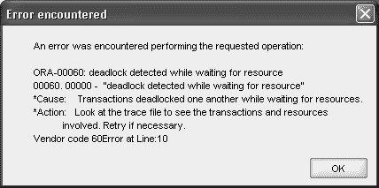

### **`表 9-1.`** 典型的死锁场景

**时间**

**会话 A DML**

**会话 B DML**

上午 9:55

`update employees set salary = salary * 1.25 where employee_id = 105;`

`update employees set job_id = 'IT_WEB' where employee_id = 110;`

上午 9:58

`update employees set salary = salary * 1.35 where employee_id = 110;`

上午 9:59

`update employees set job_id = 'IT_WEB' where employee_id = 105;`

大约在上午 9:55，两个独立的会话在`EMPLOYEES`表中对员工编号 105 和 110 运行`UPDATE`语句；它们成功完成但尚未提交。到目前为止，一切正常。上午 9:58，会话 A 对员工 110 运行一条`UPDATE`语句，该语句暂停，因为会话 B 已锁定了该行。这仍然不是主要问题。然而，到了上午 9:59，会话 B 试图更新一行（员工编号 105 的行），而该行已被会话 A 锁定。现在，两个会话都在等待对方释放所需的资源。

该问题的即时解决方案无需用户干预：Oracle 检测到死锁并自动回滚其中一个事务，释放其中一组行锁，以便另一个会话的 DML 能够完成。然而，该会话仍然在等待已存在的锁。因此，这是一个在命令行使用`NOWAIT`或在应用程序中使用类似逻辑的好场景。其语句被回滚的会话会收到如**`图 9-1.`**所示的错误消息。

### **`图 9-1.`** Oracle 死锁解析错误消息

[www.it-ebooks.info](http://www.it-ebooks.info/)

然后，用户可以尝试重试导致死锁的原始 DML 语句，因为另一个会话的 DML 语句可能已经完成并提交。

## 工作原理

虽然 Oracle 会自动回滚涉及死锁的一条语句，但当这些死 lock 发生时，你仍然会导致用户延迟并浪费数据库资源。有很多方法可以完全避免死锁。例如，对于**`表 9-1.`**中的示例，似乎是按列而非按行执行维护任务。换句话说，一个用户正在修改所有薪资，而另一个用户正在修改职位角色。如果用户改为针对单个员工维护所有列，则很可能避免这种死锁情况。

死锁的另一个常见原因是显式锁的级别设置得过高。Oracle 在分析 DML 语句后，通常会在最低级别加锁，通常不需要显式加锁。

##### 9-5. 延迟约束验证

### 问题

你的数据库中有许多外键强制实施引用完整性（RI）的依赖关系，通常称为父/子关系，并且你希望防止由于向父表和子表插入`INSERT`语句的顺序而导致事务失败。

### 解决方案

使用约束定义中的`DEFERRABLE`关键字，在事务中引用的子表上删除并重新创建约束。例如，`HR`模式中的`EMPLOYEES`表在`JOB_ID`列上有一个名为`EMP_JOB_FK`的外键（FK）约束。此约束确保在`EMPLOYEES`表的`JOB_ID`列中输入的任何职位标识符必须作为主键（PK）存在于`JOBS`表中。以下是删除并重新创建该约束的 SQL：

```sql
alter table employees drop constraint emp_job_fk;
```


# 延迟外键约束

```sql
alter table employees
add constraint emp_job_fk
foreign key (job_id)
references hr.jobs(job_id)
initially deferred deferrable
enable
;
```

对 `EMPLOYEES` 表未来的插入或更新操作，直到执行 `COMMIT` 命令时，才会验证 `JOB_ID` 列中插入的值是否在 `JOBS` 表中存在。如果约束在提交时无效，整个事务将被回滚并显示错误信息。

[www.it-ebooks.info](http://www.it-ebooks.info/)

## 第 9 章 ■ 管理事务

### 工作原理

对于 `EMPLOYEES` 表，必须提供一个部门标识符 (`JOB_ID`)，因为该列不可为空。如果员工属于一个新部门，但 `DEPARTMENTS` 表中对应的行还不存在，而你想在该部门行可用之前，就在事务中使用该员工编号进行其他操作，这就陷入了一个两难境地。你可以等到所有父表中的信息都就绪，但这可能会在员工需要她的身份徽章且员工编号必须印在徽章上时造成瓶颈。在另一种场景中，你可能从每日数据源获取所有员工和部门数据，但数据的顺序无法保证是新部门先于新员工。

如果你尝试向 `EMPLOYEES` 表插入一行，其作业标识符尚不存在，且约束未被设置为延迟，那么当你尝试执行插入时会发生以下情况：

```sql
insert into employees
(employee_id, first_name, last_name, email, hire_date, job_id)
values
(301, 'Ellen', 'Kruser', 'EKRU', '31-may-1966', 'IT_WEB')
;
```

```
Error starting at line 1 in command:
insert into employees
(employee_id, first_name, last_name, email, hire_date, job_id)
values
(301, 'Ellen', 'Kruser', 'EKRU', '31-may-1966', 'IT_WEB')
Error report:
SQL Error: ORA-02291: integrity constraint (HR.EMP_JOB_FK) violated - parent key not found
02291. 00000 - "integrity constraint (%s.%s) violated - parent key not found"
*Cause: A foreign key value has no matching primary key value.
*Action: Delete the foreign key or add a matching primary key.
```

如果约束被设置为 `DEFERRABLE`，那么 `INSERT` 会成功。然而，如果父表 `DEPARTMENTS` 中的行还不存在，执行 `COMMIT` 将导致以下结果：

```sql
insert into employees
(employee_id, first_name, last_name, email, hire_date, job_id)
values
(301, 'Ellen', 'Kruser', 'EKRU', '31-may-1966', 'IT_WEB')
;
1 rows inserted
commit;
```

```
Error starting at line 6 in command:
commit
Error report:
SQL Error: ORA-02091: transaction rolled back
ORA-02291: integrity constraint (HR.EMP_JOB_FK) violated - parent key not found
02091. 00000 - "transaction rolled back"
*Cause: Also see error 2092. If the transaction is aborted at a remote site then you will only see 2091; if aborted at host then you will see 2092 and 2091.
*Action: Add rollback segment and retry the transaction.
```

因此，你必须确保在提交前，父行（在 `DEPARTMENTS` 表中）是存在的，如下例所示：

```sql
insert into employees
(employee_id, first_name, last_name, email, hire_date, job_id)
values
(301, 'Ellen', 'Kruser', 'EKRU', '31-may-1966', 'IT_WEB')
;
1 rows inserted
insert into jobs
(job_id, job_title)
values
('IT_WEB', 'Web Developer')
;
1 rows inserted
commit;
commit succeeded.
```

请注意，对 `DEPARTMENTS` 表的 `INSERT` 发生在对 `EMPLOYEES` 表的 `INSERT` 之后。因为 `JOB_ID` 列上的约束被设置为 `DEFERRABLE`，所以插入的顺序可以是任意的，只要在执行 `COMMIT` 时数据是一致的。

当你重新创建约束时，可以将延迟约束设置为 `INITIALLY DEFERRED` 或 `INITIALLY IMMEDIATE`。换句话说，即使约束被设置为 `DEFERRABLE`，你仍然可以通过默认设置 `INITIALLY IMMEDIATE` 来最初执行即时约束检查。如果约束被创建为 `INITIALLY DEFERRED`，如本解决方案所示，你可以使用以下语句打开即时约束检查：


设置约束 `emp_job_fk` 为 `immediate`（立即）;

当然，你也可以按如下方式将其改回 `DEFERRED`（延迟）状态：设置约束 `emp_job_fk` 为 `deferred`（延迟）;

`SET CONSTRAINT`（设置约束）语句的作用范围是事务持续期间（直到发出 `COMMIT`（提交）或 `ROLLBACK`（回滚）），或者直到发出另一个 `SET CONSTRAINT` 命令。

`注意` 你可以使用 `SET CONSTRAINTS ALL DEFERRED` 命令将所有适用的约束设置为延迟。

[www.it-ebooks.info](http://www.it-ebooks.info/)

## 第九章 ■ 管理事务

正如你可能推断的那样，你不能创建一个约束为 `INITIALLY DEFERRED NOT DEFERRABLE`（初始延迟且不可延迟）。如果你胆敢尝试，会收到如下错误信息：
```
alter table employees
add constraint emp_job_fk
foreign key (job_id)
references hr.jobs(job_id)
initially deferred not deferrable
enable
```
错误报告：
SQL 错误: ORA-02447: 无法延迟一个不可延迟的约束
02447. 00000 - "cannot defer a constraint that is not deferrable"
*原因: 试图延迟一个不可延迟的约束。
*操作: 删除该约束并创建一个新的可延迟约束。
要能够重新创建约束，你必须知道要删除的约束的名称。要查找子表和父表中的约束名称，你可以查看数据字典表 `USER_CONSTRAINTS` 和 `ALL_CONS_COLUMNS` 以获取约束名称，如本例所示：
```
select uc.table_name child_table_name,
acc1.column_name child_column_name,
uc.constraint_name child_constraint_name,
acc2.table_name parent_table_name,
uc.r_constraint_name parent_constraint_name
from user_constraints uc
join all_cons_columns acc1
on uc.table_name = acc1.table_name
and uc.constraint_name = acc1.constraint_name
join all_cons_columns acc2
on uc.r_constraint_name = acc2.constraint_name
where uc.table_name = 'EMPLOYEES'
and acc1.column_name = 'JOB_ID'
and uc.constraint_type = 'R' -- 外键
;
```
```
CHILD_TABLE    CHILD_COLUMN    CHILD_CONSTRAINT    PARENT_TABLE    PARENT_CONSTRAINT
-------------  --------------  ------------------  --------------  -----------------
EMPLOYEES      JOB_ID          EMP_JOB_FK          JOBS            JOB_ID_PK
```
已选择 1 行

然而，理想情况下，你应该有一个数据模型或用于创建表的原始 DDL。这并不总是可行，特别是当你处理来自第三方软件包的表，或者你继承了一个没有文档的数据库时！

[www.it-ebooks.info](http://www.it-ebooks.info/)

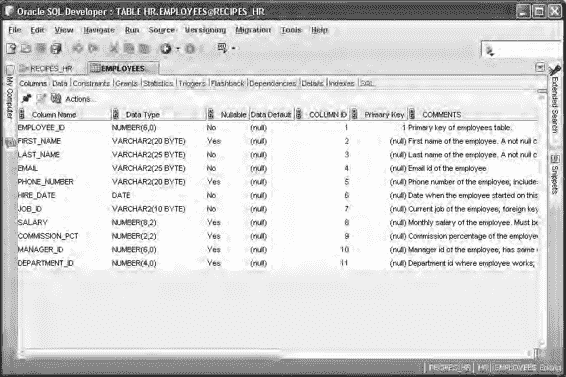

## 第九章 ■ 管理事务

还有其他方法可以找到这些信息，即使不使用昂贵的、基于 GUI 的第三方工具。你可以使用 Oracle 的企业管理器数据库控制（EM Database Control），或者如果你更像一个开发者而不是 DBA，你可以使用 Oracle 免费的 SQL Developer 工具来查询任何表的表、列、约束和 DDL。如 `图 9-2` 所示，你可以浏览表中的列，注意任何 `NOT NULL`（非空）约束和其他列属性。

`图 9-2.` SQL Developer 视图显示的 `EMPLOYEES` 表的列

在 `图 9-3` 中，你点击表的 `Constraints`（约束）选项卡，你可以确认任何检查约束——包括 `NOT NULL` 约束——以及外键约束的名称。

[www.it-ebooks.info](http://www.it-ebooks.info/)

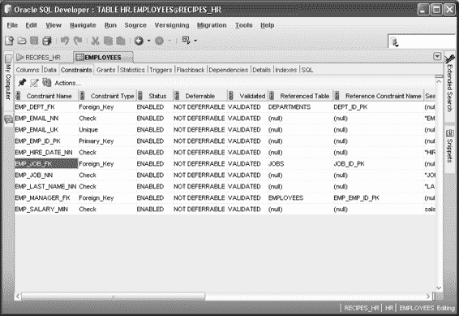

## 第九章 ■ 管理事务

`图 9-3.` SQL Developer 视图显示的 `EMPLOYEES` 表的约束

然而，你仍然无法明确地将 `JOB_ID` 列链接到父表的主键；为此，你点击 `EMPLOYEES` 表的 `SQL` 列，SQL Developer 将反向工程出 `EMPLOYEES` 表的 DDL，包括 `JOB_ID` 列上的外键约束，如 `图 9-4` 中高亮显示的那样。

[www.it-ebooks.info](http://www.it-ebooks.info/)

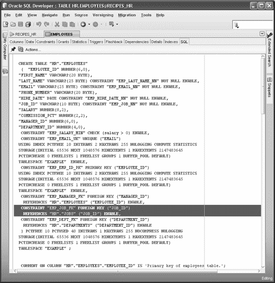

## 第九章 ■ 管理事务

`图 9-4.` SQL Developer 视图显示的 `EMPLOYEES` 表的 DDL


# 第 9 章 ■ 管理事务

对于那些害怕图形界面的用户，下面这个匿名的 PL/SQL 块将向您展示使用内置 PL/SQL 过程 `DBMS_METADATA` 存储在数据字典中的实际参照完整性约束定义：

```
declare
  v_consdef varchar2(4000);
begin
  for rec in (select constraint_name as name
              from user_constraints
              where constraint_type = 'R'
              and table_name not like 'BIN$%')
  loop
    select dbms_metadata.get_ddl('REF_CONSTRAINT', rec.name)
      into v_consdef from dual;
    dbms_output.put_line(v_consdef);
  end loop;
end;
```

## 9-6. 确保整个事务中的读一致性

### 问题
默认情况下，Oracle 为单个 `SELECT` 语句提供读一致性，但您希望确保事务内的多个查询在事务完成前都保持读一致性。

### 解决方案
使用 `SET TRANSACTION` 命令更改默认的读一致性选项。在此示例中，您希望针对 `EMPLOYEES` 表运行“假设”场景，例如下面这个您想查看在某个部门内提高或降低工资所产生的影响的示例：

```
select sum(salary+100)
from employees
where department_id = 100
;

select sum(salary-50)
from employees
where department_id = 100
;
```

但是，如果在您运行第一个 `SELECT` 之后、开始第二个查询之前，有另一位员工更改了部门 100 中的某些工资，会怎么样呢？结果很可能与您的预期不一致。因此，您可以在开始分析之前运行此命令：`set transaction read only;`

一旦运行此命令，整个事务将看到 `EMPLOYEES` 表的一个读一致的版本，直到您执行 `COMMIT` 或 `ROLLBACK`。

### 原理说明
Oracle 支持*多版本控制*，以便在存在多个并发读取器和写入器时提供表的多个视图。查询返回的行始终与单个时间点一致。写入器永远不会阻塞读取器，反之亦然；两个写入器不会相互阻塞，除非它们正在访问表中的同一行。

在上述解决方案中，您将事务环境设置为 `READ ONLY`。默认情况下，Oracle 以 `READ WRITE` 模式启动事务：查询仅在单个查询范围内保持读一致性。在长时间运行的查询期间，其他会话对表所做的任何已提交更改都不会反映在该查询结果中。但是，后续查询将看到这些更改。以下是您如何显式将事务隔离级别设置为读/写：

`set transaction read write;`

如果您在读/写事务中对表执行任何 DML 操作，对于已在另一事务中被更改但尚未提交的行，所做的任何更改将等待，直到另一个事务完成或被回滚。

##### 9-7. 管理事务隔离级别

### 问题
您希望提供事务级别的读一致性，并且能够在事务内执行 DML 语句。

### 解决方案
使用以下命令将事务隔离级别设置为可序列化：`set transaction isolation level serializable;`

在事务中执行的所有 `SELECT` 语句都将保持读一致，直到执行 `COMMIT` 或 `ROLLBACK`。只要您不尝试访问在序列化事务开始时未提交的任何表行，您就可以在事务期间执行任何 DML 语句。

### 原理说明
事务的*隔离级别*定义了包含 DML 命令的事务如何相对于其他包含 DML 命令的事务进行管理。根据隔离级别的类型，您的事务可能会使数据库处于不同的状态。以下是三种类型的现象，在特定隔离级别下可能被允许或不被允许：

- **脏读：** 一个事务中的 `SELECT` 读取了另一个事务中未提交的数据。

# 第 9 章 ■ 事务管理

*   **模糊读（不可重复读）：** 一个事务第二次读取同一行时，返回不同的数据，或没有数据（该行已被删除）。
*   **幻读：** 一个事务重新执行一个查询，会返回其他事务已提交的新行。

模糊读和幻读的区别在于，模糊读访问的是已更改或已删除的行，而幻读访问的是来自另一个事务的新行。然而，与脏读的一个关键区别在于，它们的共同点是这些新的或已更改的行已经被另一个事务提交。出于性能原因，一些数据库支持脏读；Oracle 不支持任何形式的脏读，稍后你会看到。表 9-2 显示了 ANSI SQL 标准定义的、允许这些现象的隔离级别类型。

*表 9-2. 按 ANSI SQL 隔离级别划分的读取异常*

| 隔离级别 | 脏读 | 模糊读（不可重复读） | 幻读 |
| :--- | :--- | :--- | :--- |
| 读未提交 | 允许 | 允许 | 允许 |
| 读已提交 | 不允许 | 允许 | 允许 |
| 可重复读 | 不允许 | 不允许 | 允许 |
| 可序列化 | 不允许 | 不允许 | 不允许 |

例如，如果你将事务的隔离级别设置为读已提交，在一个会话中重复执行`SELECT`语句可能会看到已更改的行或新行，但绝不会看到来自另一个事务的未提交数据。

如方案解决方案中那样，设置为可序列化的事务，对于会话来说，就好像没有其他人在对数据库进行更改。读一致性从单个`SELECT`语句扩展到整个事务。你可以在可序列化事务中执行 DML 语句，就像在读一致性事务中一样，但有一个重要区别：如果可序列化事务试图更改自其开始以来已被另一个会话更改并提交的行，你将收到此错误：

`ORA-08177: Cannot serialize access for this transaction`

如果发生这种情况，你的选择是回滚整个事务或提交到此点所做的工作。在`COMMIT`或`ROLLBACK`之后，你将能够访问其他会话所做的更改。

使用可序列化隔离级别可以避免表 9-2 中的不可重复读和幻读，但代价高昂。由于需要额外的锁定，你的事务吞吐量将会受到影响。可序列化事务也更容易发生死锁。

你可以使用以下命令将隔离级别设置为读已提交（默认值）：`set transaction isolation level read committed;`

`ALTER SESSION`命令中也提供了`ISOLATION_LEVEL`子句。

[www.it-ebooks.info](http://www.it-ebooks.info/)

如果你想在整个事务中保持读一致性，但又不打算执行任何 DML 命令，可以使用只读序列化（Oracle 对 ANSI 标准的变体），命令如下：

```sql
set transaction read only;
```

使用此方法的优点是不会收到任何`ORA-08177`错误。然而，与单个长时间运行的`SELECT`语句一样，如果你的回滚保留期设置不当，仍然可能收到`ORA-01555: snapshot too old`错误。此隔离级别在之前的方案中已介绍过。

[www.it-ebooks.info](http://www.it-ebooks.info/)

# 第 10 章 ■ 数据字典

本章重点介绍使用 SQL 显示数据库对象信息的技巧。

开发人员和 DBA 经常访问 Oracle 数据字典，以查看对象的结构、对象之间的关系、事件发生的频率等等。

一名高效的数据库工程师必须知道在解决安全性、可用性和性能问题时该去哪里查找以及如何查询数据库。将上次 Oracle 会议的数据字典海报用作办公室墙纸是不够的。当问题出现时，你需要知道去哪里查找，以及如何将元数据信息解读并转化为解决方案。

## 图形化工具 vs. SQL

有几种图形化工具可用于查看数据库的元数据。通常，可视化图像对于排查环境中的问题非常有价值。许多人更习惯于通过指点、点击来直观地诊断问题。无论是新手还是经验丰富的 DBA，都理解图形化的力量。

那么，既然有强大的图形化工具可以完成这项工作，为什么还要费心去学习如何手动使用 SQL 来查询数据库元数据呢？以下几个理由值得深思：

*   你身处一个新环境，那里没有你喜欢的图形化工具。
*   你的高速互联网接入出了问题，被迫通过缓慢的拨号连接远程诊断数据库问题，使用图形化显示会慢得令人痛苦。
*   图形化工具不显示额外信息，尽管你知道这些信息在数据字典中可用。
*   你正在面试一份工作，而守旧的 DBA 似乎痴迷于问关于数据字典视图的冷知识问题。
*   没有源代码可用，你想直接通过 SQL 查询数据字典获取信息。
*   你明白，如果知道如何直接从数据字典检索信息，你将成为一名更高效的数据库工程师。
*   你想在 Oracle OpenWorld 的 SQL 冷知识活动上吸引潜在的伴侣。
*   你在图形化工具中看到了奇怪的结果，想要寻求第二种意见。
*   有几个自定义的数据库检查你想自动化，但无法通过可视化工具实现。

[www.it-ebooks.info](http://www.it-ebooks.info/)

这些并不是要停止使用诸如 Enterprise Manager、SQL Developer、TOAD 等图形化工具的理由。我们完全理解这些实用程序的强大功能和实用性。图形化工具对于提供快速简便的查看数据库元数据的方式是无价的。此外，这些可视化实用程序已经无处不在，因此通常工作要求就是要懂得如何使用它们。然而，前面的列表确实指出了一些非常充分的理由，说明了为什么懂得如何使用 SQL 查询数据字典很重要。如果你知道哪些数据字典视图包含了解决手头问题所需的信息，你将成为一名更高效的数据库工程师。

## 数据字典架构

Oracle 数据字典视图大致分为两类：

*   静态`USER`/`ALL`/`DBA`视图
*   动态`V$`和`GV$`视图

在接下来的部分中，我们将讨论静态视图和动态视图的基本架构。

### 静态视图

Oracle 将一部分数据字典视图描述为*静态的*。Oracle 的文档指出，这些视图是静态的，因为它们只在数据库中发生某些事件（如创建表或授予权限）时才会更改。

然而，在某些情况下，“静态”这个名字可能有点用词不当。例如，`DBA_SEGMENTS`和`DBA_EXTENTS`视图会随着数据库中数据量的增长和缩减而动态变化。

尽管如此，Oracle 已经区分了静态和动态，在查询数据字典时理解这种架构上的细微差别很重要。静态视图有三种类型或级别：

*   `USER`
*   `ALL`
*   `DBA`

`USER`视图包含当前用户可用的信息。例如，`USER_TABLES`视图包含当前用户拥有的表的信息。从这些视图中选择数据不需要特殊权限。

下一个级别是`ALL`静态视图。`ALL`视图显示当前用户有权限访问的所有对象信息。例如，`ALL_TABLES`视图显示当前用户可以从中选择的所有数据库表。查询这些视图也不需要特殊权限。


# 第 10 章 ■ 数据字典

接下来是 DBA 静态视图。DBA 视图包含描述数据库中所有对象的元数据（无论其所有者或访问权限如何）。要访问 DBA 视图，必须向当前用户授予 `DBA` 角色或 `SELECT_CATALOG_ROLE`。

这些静态视图基于内部 Oracle 表（如 `USER$`、`TAB$` 和 `IND$`）。如果你拥有访问 `SYS` 模式的权限，则可以直接通过 SQL 查看底层表。在大多数情况下，你只需要访问基于这些内部表的静态视图即可。

数据字典表（如 `USER$`、`TAB$` 和 `IND$`）是在执行 `CREATE DATABASE` 命令期间创建的。作为创建数据库的一部分，会执行 `sql.bsq` 文件，该文件构建了这些内部数据字典表。`sql.bsq` 文件通常位于 `ORACLE_HOME/rdbms/admin` 目录中，可以通过操作系统编辑实用程序（如 UNIX 中的 `vi` 或 Windows 中的 `notepad`）查看。

静态视图是在你运行 `catalog.sql` 脚本时创建的（通常该脚本在 `CREATE DATABASE` 操作成功后立即运行）。`catalog.sql` 脚本位于 `ORACLE_HOME/rdbms/admin` 目录中。

**图 10-1.** 创建静态数据字典视图

诸如 `DBA_USERS`、`DBA_TABLES` 和 `DBA_INDEXES` 之类的静态视图构建于静态表（如 `USER$`、`TAB$` 和 `IND$`）之上。你可以通过查询 `DBA_VIEWS` 的 `TEXT` 列来查看这些静态视图的创建脚本。

> **注意** 运行 `catalog.sql` 脚本时，必须以 `SYS` 模式连接。`SYS` 模式是数据字典中所有对象的所有者。

## 动态性能视图

动态性能数据字典视图通常被称为 `V$` 和 `GV$` 视图。这些视图由 Oracle 持续更新，反映了实例和数据库的当前状况。

动态视图对于诊断实时性能问题至关重要。

`V$` 和 `GV$` 视图间接基于底层的 `X$` 表，这些表是在启动 Oracle 实例时实例化的内部内存结构。一些 `V$` 视图在 Oracle 实例首次启动时就可用。例如，在发出 `STARTUP NOMOUNT` 命令后，`V$PARAMETER` 就包含有意义的数据，而不需要数据库被加载或打开。其他动态视图依赖于控制文件中的信息，因此仅在数据库被加载后才包含有意义的信息（如 `V$CONTROLFILE`）。一些 `V$` 视图提供内核处理信息（如 `V$BH`），因此仅在数据库被打开后才有有用数据。

在最顶层，`V$` 视图是指向底层 `SYS.V_$` 视图的同义词。在下一层，`SYS.V_$` 对象是建立在另一层 `SYS.V$` 视图之上的视图。而 `SYS.V$` 视图又基于 `SYS.GV$` 视图。在最底层，`SYS.GV$` 视图基于 `X$` 内存结构。

> **提示** 你可以通过查询 `V$FIXED_VIEW_DEFINITION` 数据字典视图来显示 `V$` 和 `GV$` 视图的定义。

顶层的 `V$` 同义词和 `SYS.V_$` 视图是在运行 `catalog.sql` 脚本时创建的，该脚本通常由 DBA 在数据库最初创建后运行。

**图 10-2.** 创建动态 `V$` 性能数据字典视图

通过最顶层的同义词访问 `V$` 视图几乎总能满足你对动态性能信息的需求。然而，在极少数情况下，你可能需要查询无法通过 `V$` 视图获取的内部信息。在这些情况下，理解底层的 `X$` 结构至关重要。

如果你使用 Oracle Real Application Clusters，你应该熟悉 `GV$` 全局视图。这些视图提供关于集群中所有实例的全局动态性能信息（而 `V$` 视图是特定于实例的）。`GV$` 视图包含一个 `INST_ID` 列，用于标识集群环境中的特定实例。

本章并未包含用于查询数据字典对象的详尽 SQL 脚本集。相反，我们试图向你展示直接查询数据字典的常用（以及一些不那么常用）技术。你应该能够基于本章的概念进行扩展，以满足你查看数据字典元数据的任何需求。

## SYS 与 SYSTEM

Oracle 新手有时会问 “`SYS` 和 `SYSTEM` 模式之间有什么区别？” `SYS` 模式是数据库的超级用户，拥有所有内部数据字典对象，并用于执行诸如创建数据库、启动或停止实例、备份和恢复、或添加或移动数据文件等任务。这类任务通常需要 `SYSDBA` 或 `SYSOPER` 角色。这些角色的安全性通常通过控制对 Oracle 软件操作系统帐户所有者的访问来管理。此外，这些角色的安全性也可以通过密码文件进行管理，该文件允许远程客户端/服务器访问。

相比之下，`SYSTEM` 模式并不特别。它只是一个被授予了 `DBA` 角色的模式。许多机构在数据库创建后就简单地锁定 `SYSTEM` 模式并不再使用它，因为它通常是黑客尝试入侵数据库时首先尝试访问的模式。与其冒险使用一个容易猜到的数据库入口点，DBA 会创建一个单独的模式（命名为非 `SYSTEM` 的名称），并授予其 `DBA` 角色。这个 DBA 模式用于执行管理任务，例如创建用户、更改密码、授予数据库权限等。

为管理员设置单独的 DBA 模式提供了更多的安全和审计选项。

### 10-1. 显示用户信息

#### 问题

你希望显示有关数据库中模式的信息。

#### 解决方案

要快速显示你当前连接所用的模式，请使用以下语句：

```sql
SQL> show user;
```

要快速获取你当前连接用户的信息，请查询 `USER_USERS` 视图。以下查询将显示诸如你的用户名以及分配给你的模式的临时表空间和默认表空间等信息：

```sql
select * from user_users;
```

如果你想查看数据库中所有用户的信息，请使用 `DBA_USERS` 视图。以下查询将显示诸如每个帐户何时创建等信息：

```sql
select username, account_status, created, lock_date
from dba_users
order by 1;
```

#### All_Users 与安全性

任何具有 `CREATE SESSION` 系统权限的模式都可以从 `ALL_USERS` 视图中选择模式信息。例如：

```sql
select username, created
from all_users
order by username;
```

这种从 `ALL_USERS` 中查询的能力可能带来安全隐患，因为它允许任何具有最小权限（如 `CREATE SESSION`）的用户查看数据库中的所有用户名。查看所有用户信息使恶意用户能够开始猜测现有用户的密码。如果你是数据库管理员，请确保更改已知帐户的默认密码，并鼓励用户使用不易被猜到的密码。

#### 工作原理


# 第 10 章 数据字典

一个 `模式` 是数据库对象（例如表、索引等）的集合。模式由一个数据库用户所有（并且与用户同名）。一个 `数据库用户` 是一个账户，你可以通过它登录数据库并建立连接。一个 `会话` 是通过一个用户操作系统进程建立的到 Oracle 数据库的连接。有时在指代数据库用户时也会使用 `账户` 或 `用户名` 这些术语。一个账户也可以指一个操作系统用户（例如 `oracle`）。

当 DBA 创建一个用户（通过 `CREATE USER` 语句）时，会在数据字典中添加一条记录。

你可以使用像 `USER/ALL/DBA_USERS` 这样的视图来显示数据库中用户的信息。你还可以使用内置的 SQL 函数 `SYS_CONTEXT` 来显示你当前连接会话的各种详细信息。此示例显示用户、认证方法、主机和实例：

```
select
sys_context('USERENV','CURRENT_USER') usr
,sys_context('USERENV','AUTHENTICATION_METHOD') auth_mth
,sys_context('USERENV','HOST') host
,sys_context('USERENV','INSTANCE_NAME') inst
from dual;
```

**注意：** `SYS_CONTEXT` 函数可以从 SQL 或 PL/SQL 中调用。

[www.it-ebooks.info](http://www.it-ebooks.info/)

如果你想查看动态信息，例如当前登录到数据库的用户，请使用以下查询：

```
select
count(*)
,username
from v$session
group by username;
```

如果你想查看当前连接用户正在运行的 SQL 语句，请执行此查询：

```
select a.sid, a.username, b.sql_text
from v$session a
,v$sqltext_with_newlines b
where a.sql_id = b.sql_id
order by a.username, a.sid, b.piece;
```

如果你使用的是 Oracle Database 9*i* 或更早版本，之前的查询将不起作用，因为 `SQL_ID` 列不可用。以下是适用于 Oracle 旧版本的查询：

```
select a.sid, a.username, b.sql_text
from v$session a
,v$sqltext_with_newlines b
where a.sql_address = b.address
and a.sql_hash_value = b.hash_value
order by a.username, a.sid, b.piece;
```

**提示：** `V$SQLTEXT_WITH_NEWLINES` 与 `V$SQLTEXT` 完全相同，区别在于 `V$SQLTEXT_WITH_NEWLINES` 不会将制表符和换行符替换为空格。

## 10-2. 确定你可以访问的表

### 问题

你编写的应用程序需要从另一个模式获取一些参考信息，并且你想显示你可以访问哪些表。

### 解决方案

用户始终可以访问自己的表。你可以查询 `USER_TABLES` 视图来显示你的表：

```
select table_name, tablespace_name
from user_tables;
```

使用此查询来显示你的用户账户拥有 `select` 访问权限的表：

```
select table_name, tablespace_name
from all_tables;
```

运行以下查询，查看已授予你当前用户账户的表权限：

```
select grantee, table_name, privilege
from user_tab_privs
where grantee = sys_context('USERENV','CURRENT_USER')
order by table_name, privilege;
```

在之前的代码行中，`SYS_CONTEXT` 函数用于从会话中提取当前用户名。如果没有将 `GRANTEE` 限定为你的当前用户名，查询还会显示你授予的对象权限，以及由其他用户授予你的对象的权限。该查询也可以改为提示你输入当前用户名。例如：

```
select grantee, table_name, privilege
from user_tab_privs
where grantee = UPPER('&your_user_name')
order by table_name, privilege;
```

### 工作原理

查询 `USER_TABLES` 视图是确定你当前账户中存在哪些表的快速方法，而 `ALL_TABLES` 视图包含你拥有 `select` 访问权限的每张表。如果你有访问 `DBA_TABLES` 视图的权限，你还可以通过以下查询来查看某个用户有权访问的表：

```
select table_name
```


# 显示表信息

**来自 dba_tables**

**where owner = upper('&owner');**

在进行故障排查时，数据库管理员有时会检查像 `CREATED` 和 `LAST_DDL_TIME` 这样的列，这些列显示了表结构最后一次被修改的时间。使用以下查询来查看此信息：

```sql
select a.table_name, b.created, b.last_ddl_time, a.last_analyzed
from dba_tables a, dba_objects b
where a.table_name = b.object_name
and a.owner = upper('&owner');
```

如果你没有权限访问 DBA 级别的数据字典视图，可以访问 `ALL` 或 `USER` 级别的视图来显示你有权限访问的对象信息。以下查询显示与你当前连接数据库所用用户相关的表信息：

```sql
select a.table_name, b.created, b.last_ddl_time, a.last_analyzed
from user_tables a, user_objects b
where a.table_name = b.object_name;
```

## 10-3\. 显示表的磁盘空间使用情况

### 问题

你正试图预测何时需要为一个包含多个大表的表空间增加空间。你想确定这些表当前使用了多少空间。

### 解决方案

当你想查看一个表的空间消耗情况时，下面的查询非常方便：

```sql
UNDEFINE owner
UNDEFINE tab_name
SET linesize 200
COL table_name FORMAT A25
COL tablespace_name FORMAT A20
COL partition_name FORMAT A25
COL file_name FORMAT A35
COL meg_space_used FORMAT 999,999,999.999
--
SELECT
a.table_name
,b.tablespace_name
,b.partition_name
,c.file_name
,SUM(b.bytes)/1024/1024 meg_space_used
FROM dba_tables a
,dba_extents b
,dba_data_files c
WHERE a.owner = UPPER('&&owner')
AND a.table_name = UPPER('&&tab_name')
AND a.owner = b.owner
AND a.table_name = b.segment_name
AND b.file_id = c.file_id
GROUP BY
a.table_name
,b.tablespace_name
,b.partition_name
,c.file_name
ORDER BY a.table_name, b.tablespace_name;
```

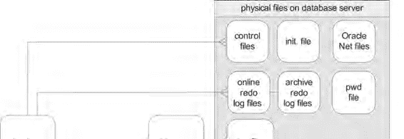

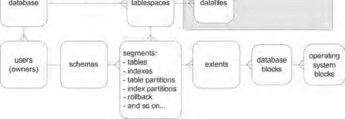

这个脚本会提示你输入用户名和表名。如果表是分区的，将显示每个分区的空间使用情况。你需要有访问 `DBA` 级视图的权限才能运行此脚本。你可以修改脚本，使其指向 `ALL` 或 `USER` 级别的表，以报告当前连接用户账户的表。此查询还使用了 SQL\*Plus 特定的命令，例如设置行大小和列格式，这些是使输出可读所必需的。

### 工作原理

数据库中的每个表都会消耗一定数量的物理磁盘空间。解决方案部分的查询将以兆字节（MB）为单位显示已使用的空间、表数据所在的物理数据文件、表空间名称以及分区名称（如果有）。

在 Oracle 中管理对象空间始于理解 Oracle 如何在内部存储有关空间使用情况的信息。创建数据库时，它包含多个称为“表空间”的逻辑空间容器。每个表空间由一个或多个物理数据文件组成。每个数据文件由许多操作系统块构成。

每个数据库还包含许多用户。每个用户都有一个“模式”（Schema），它是诸如表和索引等对象的逻辑容器。每个表或索引由一个“段”（Segment）组成。如果表或索引是分区的，那么每个分区表或分区索引将会有多个分区段。

每个段包含一个或多个“区”（Extent）。当段需要空间时，它会分配额外的区。每个区由一组数据库块组成。联机事务处理（OLTP）数据库的典型数据库块大小为 8K。每个数据库块包含一个或多个操作系统块。图 10-3 描述了 Oracle 数据库中逻辑结构与物理结构之间的关系。

**图 10-3.** Oracle 数据库逻辑与物理结构关系


# 第 10 章 ■ 数据字典

[www.it-ebooks.info](http://www.it-ebooks.info/)

表 10-1 描述了用于报告数据库物理空间管理的部分视图。这不是一个详尽的列表；此表仅包含了最常用的用于监控数据库空间的表。

**表 10-1.** 数据库空间管理视图概览

| 数据字典视图 | 用途 |
| :--- | :--- |
| `V$DATABASE` | 控制文件中的数据库信息。 |
| `DBA/ALL/USER_USERS` | 用户账户信息。 |
| `DBA/USER_TABLESPACES` | 描述表空间。 |
| `DBA_DATA_FILES` | 描述数据库数据文件。 |
| `DBA/USER_FREE_SPACE` | 表空间中的空闲区间。 |
| `V$DATAFILE` | 来自控制文件的数据文件信息。 |
| `DBA/ALL/USER_TABLES` | 描述表属性。 |
| `DBA/ALL/USER_INDEXES` | 描述索引属性。 |
| `DBA/USER_SEGMENTS` | 段的存储数据。 |
| `DBA/ALL/USER_PART_TABLES` | 分区表数据。 |
| `DBA/ALL/USER_PART_INDEXES` | 分区索引数据。 |
| `DBA/ALL/USER_TAB_PARTITIONS` | 分区表的存储信息。 |
| `DBA/ALL/USER_IND_PARTITIONS` | 分区索引的存储信息。 |
| `DBA/USER_EXTENTS` | 每个段的区间信息。 |
| `V$CONTROLFILE` | 控制文件的名称和大小。 |
| `V$LOG` | 控制文件中的在线重做日志文件信息。 |
| `V$LOG_HISTORY` | 控制文件中的在线重做日志文件历史信息。 |
| `V$ARCHIVED_LOG` | 控制文件中的归档日志文件信息。 |

## 10-4. 显示表行数

### 问题

你想运行一个报告，显示某个模式（schema）内表的行数。

### 解决方案

以具有 DBA 权限的模式运行以下 SQL 代码。请注意，此脚本包含 SQL*Plus 特有的命令，如 `UNDEFINE` 和 `SPOOL`。脚本每次都会提示你输入用户名：`UNDEFINE user`

```sql
SPOOL tabcount_&&user..sql
SET LINESIZE 132 PAGESIZE 0 TRIMSPO OFF VERIFY OFF FEED OFF TERM OFF
SELECT
'SELECT RPAD(' || '''' || table_name || '''' ||',30)'
|| ',' || ' COUNT(*) FROM &&user..' || table_name || ';'
FROM dba_tables
WHERE owner = UPPER('&&user')
ORDER BY 1;
SPO OFF;
SET TERM ON
@@tabcount_&&user..sql
SET VERIFY ON FEED ON
```

这段代码将生成一个名为 `tabcount_<user>.sql` 的文件，其中包含从指定模式内所有表中选择行数的 SQL 语句。

### 工作原理

开发人员和 DBA 经常使用 SQL 来生成 SQL 语句。当你需要将相同的 SQL 过程（重复地）应用于许多不同对象（例如一个模式内的所有表）时，这是一种非常有用的技术。解决方案部分的代码假设你有权访问 `DBA_TABLES` 视图。如果你没有访问 DBA 级别视图的权限，可以查询 `USER_TABLES` 视图。例如：

```sql
SPO tabcount.sql
SET LINESIZE 132 PAGESIZE 0 TRIMSPO OFF VERIFY OFF FEED OFF TERM OFF
SELECT
'SELECT RPAD(' || '''' || table_name || '''' ||',30)'
|| ',' || ' COUNT(*) FROM ' || table_name || ';'
FROM user_tables
ORDER BY 1;
SPO OFF;
SET TERM ON
@@tabcount.sql
SET VERIFY ON FEED ON
```

[www.it-ebooks.info](http://www.it-ebooks.info/)

如果你有准确的统计信息，可以查询 `DBA/ALL/USER_TABLES` 视图的 `NUM_ROWS` 列。如果统计信息是定期生成的，该列通常会显示接近的行数。以下查询从 `USER_TABLES` 视图中选择 `NUM_ROWS`：

```sql
select table_name, num_rows from user_tables;
```

如果你有分区表并希望按分区显示行数，请使用以下几行 SQL 和 PL/SQL 代码：

```sql
UNDEFINE user
SET SERVEROUT ON SIZE 1000000 VERIFY OFF
SPO part_count_&&user..txt
DECLARE
    counter NUMBER;
    sql_stmt VARCHAR2(1000);
    CURSOR c1 IS
        SELECT table_name, partition_name
        FROM dba_tab_partitions
        WHERE table_owner = UPPER('&&user');
BEGIN
    FOR r1 IN c1 LOOP
        sql_stmt := 'SELECT COUNT(*) FROM &&user..' || r1.table_name
            ||' PARTITION ( '||r1.partition_name ||' )';
        EXECUTE IMMEDIATE sql_stmt INTO counter;
        DBMS_OUTPUT.PUT_LINE(RPAD(r1.table_name
            ||'('||r1.partition_name||')',30) ||' '||TO_CHAR(counter));
    END LOOP;
END;
/
SPO OFF
```

## 10-5. 显示表的索引

### 问题

你遇到一些 SQL 查询性能问题。你想知道某个表是否有索引。

### 解决方案

首先确保你处理的对象是一个表（而不是同义词或视图）。运行以下查询以检查对象是否为表：

[www.it-ebooks.info](http://www.it-ebooks.info/)

```sql
select
    object_name
    ,object_type
from user_objects
where object_name=upper('&object_name');
```

之前的查询会提示你输入一个 SQL*Plus 的&变量 (`OBJECT_NAME`)。如果你没有使用 SQL*Plus，可能需要修改查询以明确查询特定对象。

一旦确认对象是表，现在查询 `USER_INDEXES` 视图以显示你用户中特定表的索引：

```sql
select
    a.index_name, a.column_name, b.status, b.index_type, a.column_position
from user_ind_columns a
    ,user_indexes b
where a.table_name = upper('&table_name')
and a.index_name = b.index_name
order by a.index_name, a.column_position;
```

之前的查询会提示你输入一个 SQL*Plus 的&变量 (`TABLE_NAME`)。如果你没有使用 SQL*Plus，可能需要修改查询以明确查询特定的表。将显示你输入的表的索引和对应的列。

### 工作原理

处理性能问题时，首先要检查的项目之一是表的哪些列建立了索引。`USER_INDEXES` 视图包含索引名称信息，`USER_IND_COLUMNS` 视图包含被索引的列。如果索引建立在多个列上，`COLUMN_POSITION` 列将提供这些列在索引中出现的顺序。

如果你使用基于函数的索引，有时显示创建这些索引所用的表达式会很方便。函数表达式包含在 `DBA/ALL/USER_IND_EXPRESSIONS` 视图的 `COLUMN_EXPRESSION` 列中。以下脚本显示该表达式以及索引和表名：

```sql
SELECT table_name, index_name, column_expression
FROM user_ind_expressions
ORDER BY table_name;
```

## 10-6. 显示未建立索引的外键列

### 问题

你有一个数据库标准，即所有外键列都必须为其创建索引。你想验证是否所有外键列都已建立索引。

[www.it-ebooks.info](http://www.it-ebooks.info/)

### 解决方案

以下查询将指出某个模式中，哪些表列定义了外键约束但没有相应的索引：

```sql
select
    a.constraint_name cons_name
    ,a.table_name tab_name
    ,b.column_name cons_column
    ,nvl(c.column_name,'***No Index***') ind_column
from user_constraints a
join
    user_cons_columns b on a.constraint_name = b.constraint_name
left outer join
    user_ind_columns c on b.column_name = c.column_name
    and b.table_name = c.table_name
where constraint_type = 'R'
order by 2,1;
```

任何具有外键约束但没有对应索引的列，都将在输出的最后一列中标注文本 `***No Index***`。以下是一些示例输出：

```text
CONS_NAME           TAB_NAME            CONS_COLUMN          IND_COLUMN
-------------------- -------------------- -------------------- ----------------
FK_DEPOSITS         DEPOSITS            BATCH_NO             ***No Index***
```

### 工作原理


# 第 10 章 ■ 数据字典

## 10-7\. 显示约束

### 问题
你想显示与表相关联的约束。

### 解决方案
查询 `DBA_CONSTRAINTS` 视图，以显示指定所有者和表名的约束信息。下面的脚本将提示你输入两个 SQL\*Plus 的 `&` 变量（`OWNER` 和 `TABLE_NAME`）。如果你不使用 SQL\*Plus，可能需要在运行脚本前修改脚本中的相应值：

```sql
select
(case constraint_type
when 'P' then 'Primary Key'
when 'R' then 'Foreign Key'
when 'C' then 'Check'
when 'U' then 'Unique'
when 'O' then 'Read Only View'
when 'V' then 'Check view'
when 'H' then 'Hash expression'
when 'F' then 'REF column'
when 'S' then 'Supplemental logging'
end) cons_type
,constraint_name cons_name
,search_condition check_cons
,status
from dba_constraints
where owner like upper('&owner')
and table_name like upper('&table_name')
order by cons_type;
```

以下是一些示例输出：

```
CONS_TYPE        CONS_NAME          CHECK_CONS                   STATUS
---------------- -------------------- ----------------------------- --------
Check            SYS_C0030642       "DOWNLOAD_COUNT" IS NOT NULL  ENABLED
Check            SYS_C0030643       "CREATE_DTT" IS NOT NULL      ENABLED
Foreign Key      F_DOWN_SKUS_FK1                                 ENABLED
Foreign Key      F_DOWN_PRODS_FK1                                ENABLED
Foreign Key      F_DOWN_PROD_DESC_FK1                            ENABLED
Foreign Key      F_DOWN_LOCS_FK1                                 ENABLED
```

从输出中可以看到，此表有两个启用的检查约束和四个外键约束。`DBA_CONSTRAINTS` 的 `SEARCH_CONDITION` 列包含了 CHECK 类型约束的搜索条件文本。

### 工作原理
`DBA`/`ALL`/`USER_CONSTRAINTS` 视图记录了数据库中为表定义的约束。

完整性约束允许你定义关于数据的规则，这些规则会在数据被成功添加或修改之前由数据库引擎进行验证。这确保了你的数据具有高质量。

`DBA`/`ALL`/`USER_CONSTRAINTS` 视图的 `CONSTRAINT_TYPE` 列是一个单字符代码。目前共有九种不同类型的约束。表 10-2 描述了可用的完整性约束。

**表 10-2.** 完整性约束
| 约束代码 | 含义 |
| :--- | :--- |
| C | 检查条件 |
| P | 主键 |
| U | 唯一键 |
| R | 参照完整性（外键） |
| V | 在视图上使用 CHECK 选项 |
| O | 在视图上使用 READ ONLY |
| H | 哈希表达式 |
| F | 带有 REF 列的约束 |
| S | 补充日志记录 |

**注意：** `H`、`F` 和 `S` 这些检查约束类型仅在 Oracle Database 11 *g* 或更高版本中可用。

## 10-8\. 显示主键和外键关系

### 问题
解决方案部分的查询联接了三个视图。`USER_CONSTRAINTS` 视图包含用户模式中所有约束的定义。它与 `USER_CONS_COLUMNS` 视图联接，后者包含用户可访问的、用于约束的列的信息。在 `USER_CONS_COLUMNS` 和 `USER_IND_COLUMNS` 之间放置了一个 `LEFT OUTER JOIN` 子句，因为可能存在联接左侧视图有行而右侧没有对应行的情况。然后，我们应用条件，即此查询报告的任何约束都是 `R` 类型（参照或外键约束）。

下面的代码清单展示了使用旧式 Oracle 语法进行外联接查询的写法。外联接通过 `(+)` 字符指定。

```sql
select
a.constraint_name cons_name
,a.table_name tab_name
,b.column_name cons_column
,nvl(c.column_name,'***No Index***') ind_column
from user_constraints a
,user_cons_columns b
,user_ind_columns c
where constraint_type = 'R'
and a.constraint_name = b.constraint_name
and b.column_name = c.column_name(+)
and b.table_name = c.table_name(+)
order by 2,1;
```


# 第 10 章 ■ 数据字典

您知道一个子表上定义了外键约束。您希望展示该子表的外键约束及其对应的父表主键约束。

## 解决方案

以下脚本查询 `DBA_CONSTRAINTS` 视图，以确定与子表外键约束相关的父表主键约束。该脚本将外键列（针对指定的表）与任何父键列约束进行关联：

```sql
select
a.constraint_type cons_type
,a.table_name child_table
,a.constraint_name child_cons
,b.table_name parent_table
,b.constraint_name parent_cons
,b.constraint_type cons_type
from dba_constraints a
,dba_constraints b
where a.owner = upper('&owner')
and a.table_name = upper('&table_name')
and a.constraint_type = 'R'
and a.r_owner = b.owner
and a.r_constraint_name = b.constraint_name;
```

前面的脚本会提示您输入两个 `SQL*Plus` 的 `&` 变量（`OWNER` 和 `TABLE_NAME`）。

如果您不使用 `SQL*Plus`，则可能需要在运行脚本前，用适当的值修改脚本。

```
C CHILD_TABLE CHILD_CONS PARENT_TABLE PARENT_CONS C
- --------------- ------------------- --------------- ------------------- -
R REG_COMPANIES REG_COMPANIES_FK2 D_COMPANIES D_COMPANIES_PK P
R REG_COMPANIES REG_COMPANIES_FK1 CLUSTER_BUCKETS CLUSTER_BUCKETS_PK P
```

此输出显示存在两个外键约束，并同时显示了父表的主键约束。

[www.it-ebooks.info](http://www.it-ebooks.info/)

## 工作原理

在排查数据完整性问题时，有时需要验证外键如何与主键相关联。这通常涉及查询 `DBA/ALL/USER_CONSTRAINTS` 视图之一。

当 `CONSTRAINT_TYPE` 列包含值 `R` 时，表明该行描述的是一个引用完整性约束，即子表约束引用了主键约束。我们使用与同一表连接两次的技术来检索主键约束信息。子约束列（`R_OWNER` 和 `R_CONSTRAINT_NAME`）将与 `DBA_CONSTRAINTS` 视图中另一行（包含主键信息）相匹配。

您也可以反向解决本配方的问题。也就是说，对于一个主键约束，找出与之关联的外键列（如果有）。下一个脚本获取主键记录，并查看它是否有任何约束类型为 `R` 的子记录。运行此脚本时，系统将提示您输入主键表的所有者和名称：

```sql
select
b.table_name primary_key_table
,a.table_name fk_child_table
,a.constraint_name fk_child_table_constraint
from dba_constraints a
,dba_constraints b
where a.r_constraint_name = b.constraint_name
and a.r_owner = b.owner
and a.constraint_type = 'R'
and b.owner = upper('&table_owner')
and b.table_name = upper('&table_name');
```

以下是一些示例输出：

```
PRIMARY_KEY_TABLE FK_CHILD_TABLE FK_CHILD_TABLE_CONSTRAINT
-------------------- -------------------- ------------------------------
CLUSTER_BUCKETS CB_AD_ASSOC CB_AD_ASSOC_FK1
CLUSTER_BUCKETS CLUSTER_CONTACTS CLUSTER_CONTACTS_FK1
CLUSTER_BUCKETS CLUSTER_NOTES CLUSTER_NOTES_FK1
CLUSTER_BUCKETS DOMAIN_NAMES DOMAIN_NAMES_FK1
CLUSTER_BUCKETS REG_COMPANIES REG_COMPANIES_FK1
CLUSTER_BUCKETS CB_MS_ASSOC CB_MS_ASSOC_FK2
```

输出表明 `CLUSTER_BUCKETS` 表有多个外键约束引用它。

## 10-9. 显示对象依赖关系

### 问题

您即将删除一个表，并想知道有哪些其他对象可能依赖于它。

[www.it-ebooks.info](http://www.it-ebooks.info/)

### 解决方案

使用 `DBA_DEPENDENCIES` 视图来显示对象依赖关系。以下查询将提示您输入用户名和对象名：

# SQL 查询依赖关系

```sql
select '+' || lpad(' ',level+2) || type || ' ' || owner || '.' || name dep_tree
from dba_dependencies

connect by prior owner = referenced_owner and prior name = referenced_name
and prior type = referenced_type

start with referenced_owner = upper('&object_owner')
and referenced_name = upper('&object_name')
and owner is not null;
```

在输出结果中，列出的每个对象都依赖于你输入的那个对象。行的缩进用于显示一个对象依赖于其前一行的对象。

**输出示例：**

```
DEP_TREE
------------------------------------------------------------
+ TRIGGER STAR2.D_COMPANIES_BU_TR1
+ MATERIALIZED VIEW CIA.CB_RAD_COUNTS
+ SYNONYM STAR1.D_COMPANIES
+ SYNONYM CIA.D_COMPANIES
+ MATERIALIZED VIEW CIA.CB_RAD_COUNTS
```

在这个例子中，被分析的对象是一个名为 `D_COMPANIES` 的表。有几个同义词、物化视图和一个触发器依赖于这个表。例如，属于 `CIA` 的物化视图 `CB_RAD_COUNTS` 依赖于属于 `CIA` 的同义词 `D_COMPANIES`，而这个同义词又反过来依赖于属于 `STAR1` 的 `D_COMPANIES` 同义词。

## 工作原理

`DBA_DEPENDENCIES` 视图对于确定哪些数据库对象依赖于其他数据库对象非常方便。例如，你可能有一个表，它被同义词、视图、物化视图、函数、过程和触发器所依赖。你可能想要删除或修改一个表，而在进行更改之前，你想查看有哪些其他对象依赖于你将要修改的对象。

`DBA_DEPENDENCIES` 视图包含了 `OWNER`、`NAME` 和 `TYPE` 列与其引用的列名 `REFERENCED_OWNER`、`REFERENCED_NAME` 和 `REFERENCED_TYPE` 之间的层次关系。Oracle 提供了许多结构来执行层次查询。例如，`START WITH` 和 `CONNECT BY` 允许你在树中识别一个起点，并沿着层次关系向上或向下遍历。

> **注意：** 关于层次查询的完整讨论，请参见第 13 章。

[www.it-ebooks.info](http://www.it-ebooks.info/)

## 第 10 章 ■ 数据字典

解决方案中的 SQL 仅对一个对象进行操作。如果你想检查某个模式（schema）中的每一个对象，可以使用 SQL 生成 SQL 来创建脚本，以显示该模式所有对象的所有依赖关系。下一节代码就实现了这一点。为了格式化和输出，我们使用了一些 `SQL*Plus` 特有的结构，例如设置页面大小和行大小，以及将输出假脱机（spool）到文件：

```sql
UNDEFINE owner
SET LINESIZE 132 PAGESIZE 0 VERIFY OFF FEEDBACK OFF TIMING OFF
SPO dep_dyn_&&owner..sql
SELECT 'SPO dep_dyn_&&owner..txt' FROM DUAL;
--
SELECT
'PROMPT ' || '_____________________________'|| CHR(10) ||
'PROMPT ' || object_type || ': ' || object_name || CHR(10) ||
'SELECT ' || '''' || '+' || '''' || ' ' || '|| LPAD(' || '''' || ' ' || '''' || ',level+3)'
|| CHR(10) || ' || type || ' || '''' || ' ' || '''' ||
' || owner || ' || '''' || '.' || '''' || ' || name' || CHR(10) ||
' FROM dba_dependencies ' || CHR(10) ||
' CONNECT BY PRIOR owner = referenced_owner AND prior name = referenced_name '
|| CHR(10) ||
' AND prior type = referenced_type ' || CHR(10) ||
' START WITH referenced_owner = ' || '''' || UPPER('&&owner') || '''' || CHR(10) ||
' AND referenced_name = ' || '''' || object_name || '''' || CHR(10) ||
' AND owner IS NOT NULL;'
FROM dba_objects
WHERE owner = UPPER('&&owner')
AND object_type NOT IN ('INDEX','INDEX PARTITION','TABLE PARTITION');
--
SELECT 'SPO OFF' FROM dual;
SPO OFF
SET VERIFY ON LINESIZE 80 FEEDBACK ON
```

现在，你应该在运行脚本的同一目录下创建了一个名为 `dep_dyn_<owner>.sql` 的脚本。此脚本包含显示你输入的所有者（owner）对象依赖关系所需的所有 SQL。运行该脚本以显示对象依赖关系。在此示例中，所有者是 `CIA`：

```sql
SQL> @dep_dyn_cia.sql
```

# 第 10 章 ■ 数据字典

当脚本运行时，它会生成一个格式为 `dep_dyn_<owner>.txt` 的转储文件。你可以使用操作系统编辑器打开该文本文件查看其内容。以下是本示例的输出样本：

**表：DOMAIN_NAMES**

**+ 函数 STAR2.GET_DERIVED_COMPANY**

**+ 触发器 STAR2.DOMAIN_NAMES_BU_TR1**

**+ 同义词 CIA_APP.DOMAIN_NAMES**

[www.it-ebooks.info](http://www.it-ebooks.info/)

前面的输出显示表 `DOMAIN_NAMES` 有三个依赖于它的对象：一个函数、一个触发器和一个同义词。

## Utldtree

Oracle 提供了一个脚本，可用于构建可显示依赖树的对象。要安装 `UTLDTREE`，请在您要分析依赖关系的模式中运行此脚本：

```sql
SQL> @?/rdbms/admin/utldtree
```

现在，您可以通过执行 `DEPTREE_FILL` 过程来构建依赖树。此过程接受三个参数：对象类型、所有者和对象名称：

```sql
SQL> exec deptree_fill('table','inv_mgmt','inv');
```

要显示依赖树，请执行此 SQL 语句：

```sql
SQL> select * from ideptree;
```

请注意，运行 `UTLDTREE` 脚本时，它将在当前连接的用户账户中删除并创建对象：因此，我们建议仅在测试或开发环境中使用此实用程序。

## 10-10. 显示同义词元数据

### 问题

您想显示有关同义词的信息。

### 解决方案

使用以下 SQL 查看用户的同义词元数据：

```sql
select
 synonym_name, table_owner, table_name, db_link
from user_synonyms
order by 1;
```

`ALL_SYNONYMS` 视图将显示所有私有同义词、所有公共同义词，以及您有权限访问基础表的其他用户拥有的私有同义词。

您可以通过查询 `DBA_SYNONYMS` 视图来显示数据库中所有私有和公共同义词的信息。

[www.it-ebooks.info](http://www.it-ebooks.info/)

### 工作原理

`DBA/ALL/USER_SYNONYMS` 视图中的 `TABLE_NAME` 列名有些误导，因为 `TABLE_NAME` 实际上可以引用多种类型的数据库对象，例如另一个同义词、视图、包、函数、过程、物化视图等。同样，`TABLE_OWNER` 指的是对象的所有者（该对象不一定是一张表）。

您还可以使用 `DBMS_METADATA` 包的 `GET_DDL` 函数来显示同义词元数据。您必须向 `GET_DDL` 函数传递对象类型、名称和模式，例如：

```sql
select
 dbms_metadata.get_ddl('SYNONYM','VDB','INV')
from dual;
```

在诊断数据完整性问题时，有时您可能首先需要确定实际访问的是哪张表或哪个对象。您可能选择了一个看起来是表的对象，但实际上它可能是一个同义词，指向一个视图，而该视图又从另一个同义词选择数据，该同义词最终指向另一个数据库中的表。

以下查询通常是确定对象是否为同义词、视图或表的起点：

```sql
select
 owner
,object_name
,object_type
,status
from dba_objects
where object_name like upper('&object_name%');
```

请注意，在此查询中使用百分号通配符 (`%`) 允许您输入对象名称的一部分。因此，该查询有可能返回部分匹配您输入的文本字符串的任何对象的信息。

## 10-11. 显示视图文本

### 问题

您想查看与视图关联的文本。

### 解决方案

使用以下脚本显示特定用户的特定视图所关联的文本：

```sql
select
 view_name
,text
from dba_views
where owner = upper('&owner')
and view_name like upper('&view_name');
```

您也可以从 `ALL_VIEWS` 视图查询您有权访问的任何视图的文本：

```sql
select text
from all_views
where owner='INV'
and view_name='INV_VIEW';
```


若要显示您模式中存在的视图文本，请使用 `USER_VIEWS` 视图：
```sql
select text from user_views where view_name=upper('&view_name');
```

## 工作原理

`DBA_VIEWS` 的 `TEXT` 列数据类型为 `LONG`。SQL*Plus 默认显示的 `LONG` 数据类型数据量为 80 个字符。如果您不将 `SET LONG` 设置为大于 `TEXT` 列中字符数的长度，则仅会显示视图列表的一部分。您可以通过查询 `DBA`/`ALL`/`USER_VIEWS` 的 `TEXT_LENGTH` 列来确定视图长度。

您也可以使用 `DBMS_METADATA` 包的 `GET_DDL` 函数来显示视图的代码。`GET_DDL` 返回的数据类型是 `CLOB`，因此如果您从 SQL*Plus 运行它，请确保首先将您的 `LONG` 变量设置为足够大的尺寸以显示所有文本。例如，以下是如何将 `LONG` 设置为 5000 个字符：
```sql
set long 5000
```

您需要分别向 `GET_DDL` 函数提供对象类型、名称和模式。您可以通过使用 `SELECT` 语句调用 `DBMS_METADATA.GET_DDL` 来显示视图代码，如下所示：
```sql
select dbms_metadata.get_ddl('VIEW','USER_VIEW','INV') from dual;
```

## Oracle 内部视图定义

您可能偶尔需要查看 Oracle 内部视图的定义。例如，在排查问题时，您可能需要了解更多关于 Oracle 如何从数据字典检索信息的细节。查询 `V$FIXED_VIEW_DEFINITION` 视图以获取 `V$` 视图的定义。此示例选择 `V$BH` 视图的文本：
```sql
select view_definition from v$fixed_view_definition where view_name='V$BH';
```

对应的输出如下：
```sql
select file#, block#, class#, status, xnc, forced_reads, forced_writes, lock_element, addr, lock_element_name, lock_element_class, dirty, temp, ping, stale, direct, new, objd, ts# from gv$bh where inst_id = USERENV('Instance')
```

显示这些定义还可以让您更好地理解 Oracle 内部的复杂性。

# 10-12. 显示数据库代码

## 问题

您希望显示与 PL/SQL 对象或触发器关联的代码。

## 解决方案

从 `USER_SOURCE` 视图中选择以查看触发器代码：
```sql
select text from user_source where name like upper('&unit_name%') and type = 'TRIGGER' order by type, name, line;
```

之所以使用 `TYPE` 列，是因为 `USER_SOURCE` 视图中可能存在不同类型的 PL/SQL，例如过程、函数和包。例如，您可能将某个触发器命名为与某个过程或函数完全相同的名称。因此，您需要使用 `TYPE` 列，否则可能会返回一些令人困惑的结果。

## 工作原理

使用本解决方案部分中的 SQL 示例，您可以输入触发器的部分名称。`LIKE` 谓词可以与通配符（例如百分号 (`%`) 和下划线 (`_`)）一起使用。百分号指示 `LIKE` 匹配您输入的任意数量的字符，而下划线符号则精确匹配一个字符。

`DBA`/`ALL`/`USER_SOURCE` 视图中的 `TEXT` 列是 `VARCHAR2` 列（而不是 `LONG`）。因此，在查询视图之前，您不需要设置 SQL*Plus 的 `LONG` 变量。

您也可以使用 `DBMS_METADATA` 包的 `GET_DDL` 函数来显示触发器代码。`GET_DDL` 返回的数据类型是 `CLOB`，因此如果您从 SQL*Plus 运行它，请确保首先将您的 `LONG` 变量设置为足够大的尺寸以显示所有文本。例如，将 `LONG` 设置为 5000 个字符：
```sql
set long 5000
```

您需要分别向 `GET_DDL` 函数提供对象类型、名称和所有者。您可以通过使用 `SELECT` 语句调用 `DBMS_METADATA.GET_DDL` 来显示触发器代码，如下所示：
```sql
select dbms_metadata.get_ddl('TRIGGER', 'INVTRIG_BU1', 'INV') from dual;
```


对于触发器，你也可以在 `DBA_TRIGGERS`、`ALL_TRIGGERS` 或 `USER_TRIGGERS` 静态视图中查看源信息。例如：

```sql
select
    trigger_name
    , triggering_event
    , trigger_type
    , table_name
    , trigger_body
from user_triggers
where trigger_name = upper('&trigger_name');
```

`TRIGGER_BODY` 列的类型是 `LONG`，因此如果你是从 SQL*Plus 中运行此代码，请务必使用 `SET LONG` 命令将大小设置得足够大，以显示所有的触发器代码。

### 10-13. 显示已授予的角色

**问题**

你想显示已授予用户的角色。

**解决方案**

使用此查询查看已授予当前连接用户的角色：
```sql
select username, granted_role
from user_role_privs;
```

下一个查询显示已授予特定用户的角色：
```sql
select
    grantee
    , granted_role
from dba_role_privs
where grantee = upper('&grantee')
order by grantee;
```

**工作原理**

角色是一种数据库对象，它允许你将系统权限和对象权限分组，然后将该分组（即角色）授予另一个用户或角色。角色有助于管理数据库安全性。例如，数据库管理员（DBA）经常在管理和维护数据库对象权限和系统权限时使用角色。

`USER_ROLE_PRIVS` 和 `DBA_ROLE_PRIVS` 视图描述了授予用户的角色。要查看授予角色的角色，请查询 `ROLE_ROLE_PRIVS` 视图：
```sql
select role, granted_role
from role_role_privs;
```

当你创建数据库时，系统会为你创建几个预定义的角色，包括 `DBA` 和 `SELECT_CATALOG_ROLE`。要查看数据库中的所有角色（包括预定义的和用户创建的），从 `DBA_ROLES` 中选择 `ROLE` 列：
```sql
select role from dba_roles;
```

以下是一个典型数据库中角色名称的一些示例输出：
```
CONNECT
RESOURCE
DBA
SELECT_CATALOG_ROLE
EXECUTE_CATALOG_ROLE
DELETE_CATALOG_ROLE
EXP_FULL_DATABASE
IMP_FULL_DATABASE
```

#### USER$ 表中的角色

在内部，角色名称存储在数据字典 `USER$` 表中。如果你运行这个 `SELECT` 语句，你将看到数据库中所有的角色名称：
```sql
select name
from user$
where type# = 0;
```

将此输出与以下查询进行比较：
```sql
select role
from dba_roles;
```

你会注意到，第一个查询中有几个角色并未出现在第二个查询中。

### 10-14. 显示对象权限

**问题**

你想查看已授予用户的对象级权限。

**解决方案**

以下查询从 `USER_TAB_PRIVS_RECD` 视图中选择，以显示已授予当前连接用户的表权限：
```sql
select
    owner
    , table_name
    , grantor
    , privilege
from user_tab_privs_recd;
```

要查看当前用户授予其他用户的权限，请从 `USER_TAB_PRIVS_MADE` 视图中选择：
```sql
select
    grantee
    , table_name
    , grantor
    , privilege
from user_tab_privs_made;
```

**工作原理**

对象权限是允许你在其他用户的表上执行数据操作（DML）操作（`INSERT`、`UPDATE` 和 `DELETE`）的授权。在你能够对另一个用户的对象执行 DML 操作之前，你必须被授予相应的权限。对象权限通过 `GRANT` 和 `REVOKE` 语句进行管理。

下一个查询从 `USER_TAB_PRIVS` 和 `ROLE_TAB_PRIVS` 中选择，以检查直接授予用户或通过授予用户的角色授予的任何对象权限：
```sql
select
    grantee
    , owner
    , table_name
    , grantor
    , privilege
from user_tab_privs
union
select
    role
    , owner
    , table_name
    , 'ROLE'
    , privilege
from role_tab_privs
order by 2, 3;
```

`ROLE_TAB_PRIVS` 视图将显示已授予当前用户有权访问的角色的表权限。

### 10-15. 显示系统权限

**问题**


你需要查看分配给某个用户的数据库系统权限。

## 解决方案

查询 `DBA_SYS_PRIVS` 视图，可以显示已授予不同用户的系统权限。

下面是一个简单的脚本，它会提示输入 `GRANTEE`：

```sql
select
    grantee
    ,privilege
    ,admin_option
from dba_sys_privs
where grantee = UPPER('&grantee')
order by privilege;
```

要查看授予当前连接用户的系统权限，请运行此查询：

```sql
select username, privilege, admin_option
from user_sys_privs;
```

`USERNAME` 列将显示该权限是授予当前连接用户的，还是授予 `PUBLIC` 的。

[www.it-ebooks.info](http://www.it-ebooks.info/)

### 第 10 章 ■ 数据字典

## 原理

`DBA_SYS_PRIVS` 视图显示授予数据库用户和角色的系统权限。系统权限允许你管理数据库的某些方面，例如创建表和视图。例如，一些常见的权限是 `CREATE TABLE` 和 `CREATE VIEW`。

`ROLE_SYS_PRIVS` 视图显示已分配给某个角色的系统权限。查询此视图时，你只会看到授予当前连接用户的模式（schema）的角色：

```sql
select
    role, privilege
from role_sys_privs
where role = upper('&role');
```

“解决方案”部分的 SQL 示例仅显示直接授予用户的数据库系统权限。要查看通过角色授予用户的任何系统权限，你必须额外查询 `ROLE_SYS_PRIVS` 之类的视图。以下查询将显示直接授予当前连接用户或通过授予该用户的任何角色授予的系统权限：

```sql
select
    privilege
    ,'直接授予'
from user_sys_privs
union
select
    privilege
    ,'通过角色授予'
from role_sys_privs;
```

两个角色——`CONNECT` 和 `RESOURCE`——通常分配给新创建的账户。但是，Oracle 建议不要将这些角色分配给用户，因为它们在未来版本中可能不可用。相反，Oracle 建议你创建自己的角色并根据需要分配权限。运行此查询以查看分配给这些角色的权限：

```sql
select grantee, privilege
from dba_sys_privs
where grantee IN ('CONNECT','RESOURCE')
order by grantee;
```

输出如下：

[www.it-ebooks.info](http://www.it-ebooks.info/)

### 第 10 章 ■ 数据字典

**角色 权限**
**------------------------- -------------------------**
**CONNECT CREATE SESSION**
**RESOURCE CREATE CLUSTER**
**RESOURCE CREATE INDEXTYPE**
**RESOURCE CREATE OPERATOR**
**RESOURCE CREATE PROCEDURE**
**RESOURCE CREATE SEQUENCE**
**RESOURCE CREATE TABLE**
**RESOURCE CREATE TRIGGER**
**RESOURCE CREATE TYPE**

有大量数据字典视图可用于确定哪些用户和角色被分配了哪些系统和对象权限。我们在本方案中仅触及了几个示例。有关各种权限相关数据字典视图的描述及其用途，请参见表 10-3。

**表 10-3. 权限相关的数据字典视图**

| **视图名** | **描述** |
| :--- | :--- |
| `DBA_ROLES` | 数据库中的所有角色。 |
| `DBA_ROLE_PRIVS` | 授予用户和角色的角色。 |
| `DBA_SYS_PRIVS` | 授予用户和角色的所有系统权限。 |
| `DBA_TAB_PRIVS` | 授予用户和角色的所有对象权限。 |
| `DBA_COL_PRIVS` | 所有列对象授权。 |
| `ROLE_ROLE_PRIVS` | 授予其他角色的角色，仅限用户有权访问的角色。 |
| `ROLE_SYS_PRIVS` | 授予其他角色的权限，仅限用户有权访问的角色。 |
| `ROLE_TAB_PRIVS` | 授予角色的表权限，仅限用户有权访问的角色。 |
| `ALL_TAB_PRIVS` | 用户是对象所有者、授权者或被授权者的对象授权；也包括`PUBLIC`是被授权者的对象授权。 |
| `ALL_TAB_PRIVS_MADE` | 用户是对象所有者或授权者的对象授权。 |
| `ALL_TAB_PRIVS_RECD` | 用户是被授权者或`PUBLIC`是被授权者的对象授权。 |
| `ALL_COL_PRIVS` | |


第十章

## 数据字典

列对象授权，其中用户是对象所有者、授权者或被授权者；也包括 `PUBLIC` 为被授权者的列授权。

[www.it-ebooks.info](http://www.it-ebooks.info/)

### 表 10-3. 与权限相关的数据字典视图（续）

| 角色 | 描述 |
| :--- | :--- |
| `ALL_COL_PRIVS_MADE` | 列对象授权，其中用户是对象所有者或授权者。 |
| `ALL_COL_PRIVS_RECD` | 列对象授权，其中用户是被授权者，或 `PUBLIC` 是被授权者。 |
| `USER_ROLE_PRIVS` | 授予用户的角色。 |
| `USER_SYS_PRIVS` | 授予用户的系统权限。 |
| `USER_TAB_PRIVS` | 用户是对象所有者、授权者或被授权者的对象授权。 |
| `USER_TAB_PRIVS_MADE` | 对象授权，其中用户是对象所有者。 |
| `USER_TAB_PRIVS_RECD` | 对象授权，其中用户是被授权者。 |
| `USER_COL_PRIVS` | 列对象授权，其中用户是对象所有者、授权者或被授权者。 |
| `USER_COL_PRIVS_MADE` | 列对象授权，其中用户是对象所有者。 |
| `USER_COL_PRIVS_RECD` | 列对象授权，其中用户是被授权者。 |

[www.it-ebooks.info](http://www.it-ebooks.info/)

## 第四部分

■ ■ ■

## 专题

[www.it-ebooks.info](http://www.it-ebooks.info/)

# 第十一章

■ ■ ■

## 常见的报表问题

作为 SQL 开发人员、DBA 或高级用户，你有时必须编写报表，以与同事、管理层、客户或其他公司分享。如果你幸运的话，你可以安静地专注于报表的逻辑和呈现。然而，不幸的是，你几乎肯定会遇到“站在背后指手画脚”的报表批评者。你知道那种人：他们站在你身后，对着屏幕指指点点，提供“有帮助的”建议，比如“那应该转换成电子表格。”或者“你能让它看起来像旧报表那样吗？那样更容易阅读。”

许多这类需求都有通用的解决方案，可以将完全正常的报表数据进行旋转、压缩、替换和以其他方式转换，使其更符合目标受众的熟悉习惯或需求。本章涵盖了许多常见的报表样式，并提供了一些通用和不太常见的解决方案，以帮助你满足当前需求，同时为你提供思路，以应对我们尚未想到但你的老板肯定已经想到的未来报表场景。

##### 11-1. 避免在报表中重复行

**问题**

你想模仿 SQL*Plus 的 `BREAK` 功能，以抑制数据行中几乎相同的前导数据。

例如，在一个多列报表中，只有最后一列在行与行之间不同，你想将重复的前导列置空，只显示不同列的数据。

**解决方案**

Oracle 的 `SQL*Plus` 工具支持 `BREAK` 功能已有数十年，许多基础的文本报表依赖于这种简单但有效的格式化方法。不幸的是，`BREAK` 命令并非 SQL 原生，因此无法在 `SQL*Plus` 之外用于实现相同的结果。使用 Oracle 的 `ROW_NUMBER` 分析函数和 `CASE` 表达式，你可以在任何 SQL 接口中模仿 `BREAK` 的行为。

对于那些不熟悉 `SQL*Plus BREAK` 功能的人，接下来的命令演示了它如何在一个简单的 `SELECT` 语句输出中“隐藏”相同的 `job` 标识符和经理标识符。只显示了部分结果，但你可以清楚地看到效果。

```
break on job_id on manager_id
```

```
select job_id, manager_id, employee_id
from hr.employees
order by job_id, manager_id, employee_id;
```

```
JOB_ID         MANAGER_ID EMPLOYEE_ID
-------------- ---------- -----------
...
AD_VP                 100         101
FI_ACCOUNT            108         109
FI_MGR                101         108
HR_REP                101         203
IT_PROG               102         103
                                      103
                                      104
...
```

我们可以使用 Oracle 的 `CASE` 表达式和 `ROW_NUMBER` 分析函数，在任何 SQL 查询接口或编程 API 中模仿 `BREAK` 功能。下一个 SQL 语句展示了这两个特性的实际应用，以及从任何接口生成的相同结果。

```
select
case when job_ctr = 1 then job_id else null end "JOB_ID",
```

[www.it-ebooks.info](http://www.it-ebooks.info/)


# 第 11 章 ■ 常见报告问题

## 11-1. 消除列报告中的重复值

```sql
case when jobman_ctr = 1 then manager_id else null end "MANAGER_ID", employee_id
from (
  select job_id,
         row_number() over (partition by job_id order by job_id) as job_ctr,
         manager_id,
         row_number() over (partition by job_id, manager_id order by job_id, manager_id) as jobman_ctr,
         employee_id
  from hr.employees
);
```
正如我们承诺的，我们的结果与 SQL*Plus 方法非常相似，值得庆幸的是节省了墨水，因为没有打印重复数据。

[www.it-ebooks.info](http://www.it-ebooks.info/)

```text
JOB_ID          MANAGER_ID    EMPLOYEE_ID
----------      ----------    ------------
...
AD_VP           100           101
FI_ACCOUNT      108           109
FI_MGR          101           108
HR_REP          101           203
IT_PROG         102           103
                103           104
...
```

### 工作原理
我们的方法分为两部分。内部查询选择我们感兴趣的数据列，在本例中是 `JOB_ID`、`MANAGER_ID` 和 `EMPLOYEE_ID`。它还添加了两个使用 `ROW_NUMBER` 分析函数计算的额外列，这些列在最终输出中不会看到。这两列是 `JOB_CTR` 和 `JOBMAN_CTR` 的值，用于根据我们明确希望先显示 `JOB_ID`、其次显示 `MANAGER_ID` 的意图来对结果行进行编号。我们为 `JOB_CTR` 设置的分区和排序选项会在每次 `JOB_ID` 变化时重新开始编号。对于 `JOBMAN_CTR`，我们在每个 `JOB_ID` 内，每次 `MANAGER_ID` 变化时重新开始编号。

要理解我们如何在外层 `SELECT` 中使用这些数据，让我们单独看看子查询的结果。下一个 SQL 语句是作为独立 `SELECT` 语句执行的子查询，后面是部分结果。

```sql
select job_id,
       row_number() over (partition by job_id order by job_id) as job_ctr,
       manager_id,
       row_number() over (partition by job_id, manager_id order by job_id, manager_id) as jobman_ctr,
       employee_id
from hr.employees;
```

[www.it-ebooks.info](http://www.it-ebooks.info/)

```text
JOB_ID       JOB_CTR    MANAGER_ID    JOBMAN_CTR    EMPLOYEE_ID
----------   --------   ----------    ----------    -----------
...
AD_VP        1          100           1             101
AD_VP        2          100           2             102
FI_ACCOUNT   1          108           1             109
FI_ACCOUNT   2          108           2             110
FI_ACCOUNT   3          108           3             111
FI_ACCOUNT   4          108           4             112
FI_ACCOUNT   5          108           5             113
FI_MGR       1          101           1             108
HR_REP       1          101           1             203
IT_PROG      1          102           1             103
IT_PROG      2          103           1             104
...
```
理解我们外层 `SELECT` 的关键在于各自 `CASE` 语句对计数器执行的测试。我们已在上面的输出中用粗体强调了感兴趣的值。

我们的外层 `SELECT` 语句旨在测试计数器值等于一的时候，因为这标志着相关的 `JOB_ID` 或 `MANAGER_ID` 值发生了变化。任何其他值都表明我们正在检查的行与前一行具有相同的 `JOB_ID` 或 `MANAGER_ID`。我们知道已经打印了相关值，因此可以用一个通常不会显示的 `NULL` 来替代。所以在我们的部分结果中，有一个 `JOB_ID` 为 `AD_VP` 和 `MANAGER_ID` 为 `100`，`ROW_NUMBER` 技术将它们计为该组合中这些值的第一个实例。我们方法的 `CASE` 语句检测到这些值因此应该被打印出来。下一行具有相同的 `JOB_ID` 和 `MANAGER_ID`，并且每个的计数器值都是 2。我们的 `CASE` 表达式计算结果为 `NULL`，因此最终结果抑制了这些值，只打印 `EMPLOYEE_ID`。

您可以将此技术扩展到任意多个列。只需要将所需的结果列与由 `ROW_NUMBER` 技术确定的计数器配对，并在外部 `SELECT` 块中构造一个模式相同的 `CASE` 语句即可。

##### 11-2. 参数化 SQL 报告

### 问题
您有各种想要提供给用户用于报告目的的 SQL 语句，并且希望允许他们为各种谓词和条件指定值。例如，您已经使用了 SQL*Plus 的参数功能，并且需要在其他查询工具中获得类似支持。

### 解决方案
当通过 Java 或 C# 等编程语言编写报告 SQL 时，向 SQL 语句添加参数相当直接。然而，当处理“原生” SQL 和查询工具时，您就没有对象模型和定义良好的方法来让用户简单地为查询中的参数提供值的便利了。这个方法不仅仅是一个 SQL 配方，更是一个 SQL 使用配方。

[www.it-ebooks.info](http://www.it-ebooks.info/)

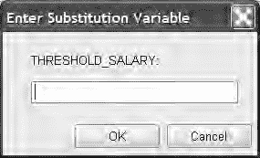

您以前可能在 SQL*Plus 中使用过与号（&）和双与号（&&）标记技术来在 SQL 语句中放置可替换参数。我们的方法表明，这种技术实际上几乎在 Oracle 的所有查询工具接口中都得到支持，例如 SQL Developer、SQL Worksheet 和 APEX SQL Command 工具。更妙的是，甚至一些第三方工具如 TOAD 也支持相同的语法。

我们将通过使用以下 SQL 语句查询薪资超过特定值的所有员工来展示我们的方法。我们将使用一个参数来表示阈值薪资，由用户在运行时提供。

```sql
select employee_id, last_name, salary
from hr.employees
where salary > &threshold_salary
```
通过 SQL*Plus 执行此查询会给出熟悉的 `THRESHOLD_SALARY` 值提示：
`Enter value for threshold_salary: 15000`

我们输入了值 15000。我们的参数被替换，并显示结果。

```text
old 3: where salary > &threshold_salary
new 3: where salary > 15000

EMPLOYEE_ID LAST_NAME                 SALARY
----------- ------------------------- ------
100        King                      24000
101        Kochhar                   17000
102        De Haan                   17000
```
但是看看当我们通过 SQL Developer 发出相同的 SQL 时会发生什么。它理解 Oracle 在查询工具中表示参数（或替换变量）的符号，并在一个直观的对话框中提示您输入参数，如图 11-1 所示。

**图 11-1.** SQL Developer 提示输入 SQL 参数。

正如您所料，再次输入值 15000，SQL Developer 执行相同的替换。图 11-2 显示 SQL Developer 返回了相同的结果，如您所愿。

[www.it-ebooks.info](http://www.it-ebooks.info/)

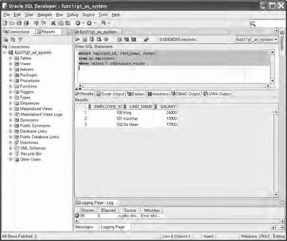

**图 11-2.** SQL Developer 接受并正确使用 Oracle 风格的 SQL 参数。

### 工作原理
在 SQL*Plus 开发的早期，就添加了对与号样式替换变量的支持，以允许用户将参数值传递给他们的查询。Oracle 确保相同的技术可用于其大多数（如果不是全部）后续查询工具，其他公司的产品也纷纷效仿，最著名的是 TOAD。

单与号和双与号样式的参数都可以在所有这些工具中使用。对于那些不熟悉两者区别的人来说，单与号参数是临时替换变量，在一个 SQL 语句中获取并使用一次值。如果您使用单与号替换变量重新执行该语句，您将被再次要求提供一个值。双与号参数创建一个永久替换变量。您提供的第一个值将在您的会话期间持续作为替换值。

SQL*Plus 风格的替换变量与应用程序代码中预处理语句的绑定变量之间存在重要区别。我们的方法，以及您编写的任何使用替换变量的其他 SQL，都是通过使用客户端字符串替换技术工作的。在将语句传递给 Oracle 数据库之前，SQL*Plus、SQL Developer 或您选择的工具会找到 SQL 中的替换变量。查询工具本身会提示输入要替换的值，并使用字符串函数将变量标记替换为您提供的值。只有这样，SQL


## 替换变量与绑定变量

`语句`被发送至 Oracle 进行解析和执行。这意味着数据库永远不会知晓替换变量的存在，也不会知道在该语句接收之前所经历的字符串操作。

预处理语句中的绑定变量处理方式则截然不同。在任何使用绑定变量的高级语言中（例如`PL/SQL`、`Java`或`C#`），你传递给 Oracle 进行准备和执行的`SQL`语句都包含其绑定变量标记。Oracle 知晓该语句存在绑定变量，并会据此优化查询的执行计划。当你为带有绑定变量的预处理语句提供数值时，这些值会被发送至 Oracle，由 Oracle 负责处理正确替换绑定变量并执行所得语句的底层机制。对于绑定变量，Oracle 完全知晓其存在，并在数据库层面深入参与其使用。

##### 11-3. 在分组结果中返回详细列

### 问题

在对多种数据进行聚合操作时，你需要在同一行中包含不参与分组的其他结果列，同时不改变聚合的粒度。例如，你需要聚合各部门中任期最长和最短的员工数据，同时希望包含这些员工的更多详细信息列，而无需将它们包含在`GROUP BY`子句中。

### 解决方案

使用 Oracle 中与`MAX`和`MIN`等函数等效的分析函数，结合嵌套的`SELECT`语句，可以在不影响聚合粒度的情况下，为聚合行添加额外的详细信息。

我们的方法使用每个部门内员工的`HIRE_DATE`，以及诸如员工姓名和员工标识符等有用信息。接下来的`SQL`代码块展示了针对我们具体问题的解决方案，但可以应用于每一个类似的请求，以返回与聚合数据结合的额外详细数据。

```sql
select department_id, employee_id, first_name, last_name,
case
when hire_date = first_hire and hire_date = last_hire
then '任期最短和最长'
when hire_date = first_hire then '任期最长'
when hire_date = last_hire then '任期最短'
end Department_Tenure
from (
select department_id, employee_id, first_name, last_name, hire_date,
max(hire_date) over(partition by department_id) first_hire,
min(hire_date) over(partition by department_id) last_hire
from hr.employees
) Hire_Dates
where hire_date in (first_hire, last_hire)
order by department_id, department_tenure;
```

[www.it-ebooks.info](http://www.it-ebooks.info/)

结果展示了聚合操作按预期工作，正确识别出任期最短和最长的员工，并连同这些员工的额外详细信息一起返回。

```
DEPARTMENT_ID EMPLOYEE_ID FIRST_NAME LAST_NAME DEPARTMENT_TENURE
------------- ----------- ----------- --------- ----------------------------
10 200 Jennifer Whalen 任期最短和最长
20 202 Pat Fay 任期最长
20 201 Michael Hartstein 任期最短
30 119 Karen Colmenares 任期最长
30 114 Den Raphaely 任期最短
40 203 Susan Mavris 任期最短和最长
50 128 Steven Markle 任期最长
50 122 Payam Kaufling 任期最短
...
```

### 工作原理

如果我们尝试使用普通的`SELECT`语句来查找`MIN`和`MAX`，我们的`SELECT`语句将如下一个`SQL`代码块所示。

```sql
select department_id, employee_id, first_name, last_name,
min(hire_date), max(hire_date)
from hr.employees
group by department_id, employee_id, first_name, last_name;
```

我们得到的结果完全无用，因为我们被迫按非聚合列（如`FIRST_NAME`和`EMPLOYEE_ID`）进行分组，而其中一些列的值是唯一的！

```
DEPARTMENT_ID EMPLOYEE_ID FIRST_NAME LAST_NAME MIN(HIRE_DATE) MAX(HIRE_DATE)
------------- ----------- ---------- --------- -------------- --------------
20 201 Michael Hartstein 17-FEB-96 7-FEB-96
20 202 Pat Fay 17-AUG-97 17-AUG-97
60 103 Alexander Hunold 03-JAN-90 03-JAN-90
60 107 Diana Lorentz 07-FEB-99 07-FEB-99
```


# 第 11 章 ■ 常见的报告问题

100 113 Luis Popp 1999-12-07 1999-12-07

...

我们没有用于聚合的分组，所有员工都作为详细行返回，他们自己的 `HIRE_DATE` 同时作为最早和最晚的值——这输出相当无意义，即使它在技术上是准确的。

如果我们省略 `GROUP BY` 子句中希望作为详情包含的列，Oracle 完全有理由报错，如下面的 SQL 代码块所示。

[www.it-ebooks.info](http://www.it-ebooks.info/)

```sql
select department_id, employee_id, first_name, last_name,
min(hire_date), max(hire_date)
from hr.employees
group by department_id;
```

```sql
select department_id, employee_id, first_name, last_name,
*
ERROR at line 1:
ORA-00979: not a GROUP BY expression
```

通过在内联视图中使用 `MIN` 和 `MAX` 的分析函数版本，我们的方法解决了这个问题。这个方法通过“预期”许多行会被外部 `SELECT` 语句丢弃来工作，并确保内联视图中的每一行都有必要的详情。我们方法中的内联视图生成的结果（为节省空间而截断）如下所示。

```
DEPARTMENT_ID EMPLOYEE_ID FIRST_NAME LAST_NAME HIRE_DATE FIRST_HIRE LAST_HIRE
------------- ----------- ---------- --------- ---------- --------- ---------
10 200 Jennifer Whalen 17-SEP-87 17-SEP-87 17-SEP-87
20 201 Michael Hartstein 17-FEB-96 17-AUG-97 17-FEB-96
20 202 Pat Fay 17-AUG-97 17-AUG-97 17-FEB-96
30 114 Den Raphaely 07-DEC-94 10-AUG-99 07-DEC-94
30 119 Karen Colmenares 10-AUG-99 10-AUG-99 07-DEC-94
30 115 Alexander Khoo 18-MAY-95 10-AUG-99 07-DEC-94
30 116 Shelli Baida 24-DEC-97 10-AUG-99 07-DEC-94
30 117 Sigal Tobias 24-JUL-97 10-AUG-99 07-DEC-94
30 118 Guy Himuro 15-NOV-98 10-AUG-99 07-DEC-94
...
```

分析函数 `MIN` 和 `MAX` 有效地记录了每个部门中最早和最晚入职员工的雇佣日期，关联到每一位员工——即使他们自己既不是最早也不是最晚入职的员工。起初，这看起来有些奇怪，但这就是外部 `SELECT` 语句发挥作用的地方。我们的主 `SELECT` 使用了以下 `WHERE` 子句。

```sql
where hire_date in (first_hire, last_hire)
```

这有效地丢弃了所有行，只保留员工的 `HIRE_DATE` 与计算出的 `FIRST_HIRE` 或 `LAST_HIRE` 日期相匹配的行。然后，我们的 `CASE` 语句简单地评估剩余行的 `HIRE_DATE` 是否与 `FIRST_HIRE` 或 `LAST_HIRE` 匹配，并为我们的报告输出一个有意义的字符串。

##### 11-4. 将结果排序到等大小的分组中

### 问题

你需要为报告将数据分组到等大小的分组中。例如，你想根据客户的订单价值将他们按四分位数排序，以便识别出你的大客户。

[www.it-ebooks.info](http://www.it-ebooks.info/)

### 解决方案

使用 Oracle 的两种分组式分析函数来执行简单的分组排序。`NTILE` 提供等高度（等高）分组排序，而 `WIDTH_BUCKET` 提供等宽度、直方图式的分组排序。

为了根据消费情况找出客户的四分位数，我们将使用 `NTILE` 函数。

这将为我们提供等大小的四分位数进行分析。下面的 SQL 检查按客户统计的订单总额，返回我们所需的四分位数。

```sql
select customer_id, order_total,
ntile(4) over (order by order_total desc) as order_quartile
from oe.orders;
```

简略的结果让你对四分位数的分布情况有所了解。

```
CUSTOMER_ID ORDER_TOTAL ORDER_QUARTILE
----------- ----------- --------------
147 295892 1
150 282694.3 1
149 268651.8 1
...
168 45175 2
102 42283.2 2
...
169 15760.5 3
116 14685.8 3
...
103 78 4
167 48 4
```

在许多公司中，一种常见的销售技巧是让客户代表针对最高的四分位数，确保这些客户获得特殊待遇和支持，以使大订单持续流入。根据 48 美元的订单，客户 167 不太可能得到这种关注。

### 工作原理

`NTILE` 函数的一般形式是指定用于分组的分组数量，以及用于排序以确定分组的数据。用伪 SQL 表示，其一般形式如下：

```
NTILE(<分组数量>) over (<用于确定分组的分区和排序>)
```

在我们的方法中，我们指示 Oracle 使用 `NTILE(4)` 创建四个分组，这样我们可以创建四个组以满足四分位数的通常含义。`OVER (ORDER BY ORDER_TOTAL DESC)` 子句指示 Oracle 按 `ORDER_TOTAL` 降序排序数据，以便为每一行分配到相关的分组/四分位数。无论数据如何排序，排在第一位的将被分配到第一个分组，因此在分析函数中选择升序或降序排序控制了高值或低值被认为是位于第一个还是最后一个分组。

请记住，这个排序并不决定数据最终显示的顺序。它只控制 `NTILE` 函数的分组分配。示例结果看起来按分组整齐排序，但这只是巧合。如果你的数据量很大，或者 Oracle 使用并行查询执行，你可能会发现结果以不同的顺序返回。当然，分组分配仍然是正确的。

要控制呈现的顺序，请使用常规的 `ORDER BY` 子句，如下面的 SQL 所示。

```sql
select customer_id, order_total,
ntile(4) over (order by order_total desc) as order_quartile
from oe.orders
order by 2 desc, 3;
```

这种排序确保你总是在结果中首先看到最高价值的订单，即那些位于第一个四分位数的订单。

你可以通过将基础查询包装在一个带有 `COUNT` 函数的简单外部 `SELECT` 中，来验证 `NTILE` 是否产生了等大小的分组。下面的 SQL 显示了客户订单数据如何在分组之间平衡。

```sql
select order_quartile, count(*) as bucket_count
from (
select customer_id, order_total,
ntile(4) over (order by order_total desc) as order_quartile
from oe.orders )
group by order_quartile
order by order_quartile;
```

```
ORDER_QUARTILE BUCKET_COUNT
-------------- ------------
1 27
2 26
3 26
4 26
```

你可以看到 Oracle 如何处理订单数量不能完美整除到我们四个分组中的事实，并因此近似实现了完美的平衡。

##### 11-5. 创建报告直方图

### 问题

你想将客户销售数据分组到直方图可视化中进行报告。例如，你想报告有多少客户根据其总订单额（以 50,000 美元为倍数）落入不同的组。

[www.it-ebooks.info](http://www.it-ebooks.info/)

### 解决方案

Oracle 的 `WIDTH_BUCKET` 分析函数根据指定的分组要求在你的数据上生成直方图。将 `WIDTH_BUCKET` 与常规的 `SUM` 函数结合使用，可以让你将直方图结果构建成有意义的报告。下面的 SQL 显示了基于客户销售额以 50,000 美元为分组的直方图数字。

```sql
select count(*) Customer_Count, total_spend_histogram * 50000 Spend_Bucket from
(select customer_id, sum(order_total),
width_bucket(sum(order_total),0,500000,10) as total_spend_histogram
from oe.orders
group by customer_id)
group by total_spend_histogram * 50000
order by 2;
```

销售由许多小客户主导，少数大客户的业务量接近五十万美元。

```
CUSTOMER_COUNT SPEND_BRACKET
-------------- -------------
27 50000
7 100000
3 150000
5 200000
1 250000
2 300000
1 400000
1 450000
8 rows selected.
```

### 工作原理

`WIDTH_BUCKET` 函数根据提供给函数的上限和下限，将源数据拆分为若干个分组。`WIDTH_BUCKET` 的一般结构如下所示：

```
WIDTH_BUCKET
```


# 第 11 章 ■ 常见报表问题

##### 11-6. 按相对排名过滤结果

### 问题

您希望过滤查询结果，以找到在排序结果中处于任意位置的行。例如，您希望模拟其他数据库的 top N 或第 n 个结果的查询功能。

### 解决方案

从 Oracle 11g Release 2 开始，Oracle 引入了新的获取第 n 个结果的功能。在 11g Release 2 被广泛部署之前，您应该使用现有的分析函数 `ROW_NUMBER` 来确定任何分组中的第 n 个结果，或 top N 结果。

对于我们的方案，我们希望找出业务部门中每个部门薪资第三高的员工。接下来的 SQL 语句在嵌套子查询中使用 `ROW_NUMBER`，使我们能够快速找到每个区域薪资第三高的获得者。

```sql
select department_id, last_name, salary as third_salary
from (
  select department_id, last_name, salary,
    row_number()
    over (partition by department_id order by salary desc) sal_position
  from hr.employees )
sal_by_dept
where sal_by_dept.sal_position = 3;
```

```
DEPARTMENT_ID LAST_NAME THIRD_SALARY
------------- --------- -------------
30 Baida 2900
50 Kaufling 7900
60 Austin 4800
80 Errazuriz 12000
90 De Haan 17000
100 Chen 8200
```

每个部门薪资第三高的员工及其相应薪资都被列出。

### 工作原理

我们的方案使用了 Oracle 普遍存在的分析函数 `ROW_NUMBER` 来帮助识别哪些行应作为组内的第 n 项返回。基于 `ROW_NUMBER` 的查询结果随后被用作外部查询中的一个内联视图。外部查询通过 `WHERE` 子句来定位目标行。

从内联视图开始，关键组件是 `ROW_NUMBER` 函数的 `OVER` 子句。

```sql
row_number()
over (partition by department_id order by salary desc) sal_position
```

在这里，我们指示 Oracle 按 `DEPARTMENT_ID` 将源数据划分为子组。在这些组内，我们按薪资值降序对数据进行排序，然后就可以应用 `ROW_NUMBER` 值。我们给生成的行号命名为 `SAL_POSITION`。以下是该内联视图产生的（部分）中间工作数据：

```
DEPARTMENT_ID LAST_NAME SALARY SAL_POSITION
------------- --------- ------- ------------
...
30 Raphaely 11000 1
30 Khoo 3100 2
`30` `Baida` `2900` `3`
30 Tobias 2800 4
...
50 Fripp 8200 1
50 Weiss 8000 2
`50` `Kaufling` `7900` `3`
50 Vollman 6500 4
...
```

您可以看到，突出显示的行在其各自部门中拥有第三高的薪资，并被赋予了 `SAL_POSITION` 编号 3，该编号源自我们的 `ROW_NUMBER` 表达式。

---

(`expression or column`, `lower bound`, `upper bound`, `number of buckets`) 从我们方案中的内联视图子查询向外进行，我们首先要求 Oracle 使用 `WIDTH_BUCKET` 根据客户的 `SUM` 或 `ORDER_TOTAL` 值，在 0 和 500000 的边界之间将我们的数据分成 10 个存储桶。如果我们单独运行内部的 `SELECT` 语句，将会收集到以下结果：

```sql
select customer_id, sum(order_total),
  width_bucket(sum(order_total),0,500000,10) as total_spend_histogram
from oe.orders
group by customer_id
```

```
CUSTOMER_ID SUM(ORDER_TOTAL) TOTAL_SPEND_HISTOGRAM
----------- ---------------- ---------------------
101 190395.1 4
102 69211.4 2
103 20591.4 1
104 146605.5 3
105 61376.5 2
...
```

内联视图的结果易于解释。客户 101 在所有订单中的总花费为 190395.10 美元。这使其位于第 4 个存储桶中，该桶包含 150001 到 200000 美元之间的值。下一个客户 102 在第 2 个存储桶中，依此类推。

我们在外部 SQL 中使用内联视图的结果，来计算每个存储桶中的客户数量。作为最后的修饰，我们将客户组的直方图存储桶乘以值 50000，以按照我们方案问题最初要求的那样，以 50000 的倍数报告直方图。


# 第 11 章 ■ 常见的报表问题

从这一点来看，外部查询的操作就清晰了。我们有一个简单的`SELECT`语句，用于从内联视图中选择我们需要的列，以及一个`WHERE`子句，用于查找`SAL_POSITION`等于 3 的记录。这个技术是灵活的，因为你只需要改变最后的`WHERE`子句，使用不同的值，就能找到不同的第 n 个值。以下是此方法的通用形式。

```
select <从内联视图中选择所需的行>
from (
  select <所需的行>,
         row_number()
           over (
             partition by <分区列>
             order by <用于确定第 n 个值的列>
           ) <你的列别名>
  from <目标表>
) <内联视图别名>
where <内联视图别名>.<你的列别名> = <第 n 个位置>;
```

你可能希望调整的一个方面是排名的确定方式。你可以用`RANK`或`DENSE_RANK`分析函数替代`ROW_NUMBER`，以控制并列或缺失值如何影响你的第 n 个结果的确定。

##### 11-7. 在数据集上比较假设

### 问题

你有两组或多组类似的数据，需要在集合层面进行比较。具体来说，你想使用一种公认的假设比较方法，处理存储在 Oracle 中的数据——而无需将数据迁移到其他工具或系统——例如，比较两个州居民的相似购买历史。

### 解决方案

Oracle 提供了许多公认的假设检验统计函数，包括用于 F 检验、T 检验、方差分析（ANOVA）等诸多函数。许多读者可能想知道这些函数到底有什么用，更重要的是，为什么它们可能对比较数据集有用。

统计学学生会知道，像 T 检验这样的检验有助于建立线性回归模型，并推断两组之间的统计均值和方差的差异。通俗地说，T 检验可以帮助你做出决策，例如，判断你是通过在线渠道还是直接零售店能卖出更多商品，或者了解某个特定收入群体是否影响了你的销售额。T 检验告诉你两组之间的差异是真实存在的，还是由抽样或测量误差造成的假象。

[www.it-ebooks.info](http://www.it-ebooks.info/)

`啤酒与统计确实相配`

T 检验是由爱尔兰健力士啤酒厂的员工发明的，该厂的老板坚信运用统计学可以酿造出更好的啤酒。这包括检查从更优质的啤酒花或大麦可能对啤酒产生什么影响，一直到确定雇佣牛津和剑桥大学的顶尖人才是否会让啤酒厂受益更多。

在其发明之时，T 检验被认为是健力士啤酒最好的商业秘密之一，但幸运的是，时间的推移意味着你可以在商业数据管理任务以及任何你可能喜欢的啤酒饮用中受益于它。

对于我们的方法，我们将尝试确定美国新泽西州和纽约州的居民在相同收入水平上是否具有统计显著性的购买历史。

接下来的`SQL`语句调用了 T 检验的几种不同形式来评估这两组的销售历史数据。

```
select substr(cust_income_level, 1, 22) income_level,
       avg(case when cust_state_province = 'NJ' then amount_sold else null end) NJ_sales,
       avg(case when cust_state_province = 'NY' then amount_sold else null end) NY_sales,
       stats_t_test_indepu(cust_state_province, amount_sold, 'STATISTIC', 'NY') T_observed,
       stats_t_test_indepu(cust_state_province, amount_sold) two_sided_p_value
from sh.customers c, sh.sales s
where c.cust_id = s.cust_id
  and c.cust_state_province in ('NY','NJ')
group by rollup(cust_income_level)
order by income_level, NJ_sales, NY_sales, t_observed;
```

结果起初看起来有点深奥，但对训练有素的人来说，它们表明我们的新泽西州和纽约州居民样本在统计上并不相关，即使在他们收入相似的情况下也是如此。


# 第 11 章 ■ 常见报告问题

## 工作原理

我们配方的机制可分为两个部分。第一部分，使用`CASE`表达式以及分组和排序子句来选择薪资等级和平均购买额，这是典型的 SQL。第二部分是 T 检验技术的核心，来自于两次调用`STATS_T_TEST_INDEPU`函数。

虽然 T 检验的统计定义通常相当复杂，但 Oracle 执行的计算可以用通俗的语言来解释。本质上，`STATS_T_TEST_INDEPU`函数检验的是两个我们知道数量不等，并且我们预期其均值存在显著差异的组，*同时*这两个组的方差也不同。

考虑到这些注意事项，我们的检验试图确定两个样本集是否相关，如果是，相关程度如何。用通俗的话说，我们正试图确定新泽西州和纽约州居民的购买习惯是否相似，尽管两个州的购买者数量不同、收入等级不同、购买的产品价值也不同。

我们得出的观测 T 值和双侧检验 P 值在每个收入等级之间差异显著。对于训练有素的统计学家来说，这表明对于我们的许多收入组来说，我们在基础数据中看到的购买行为差异可能是由于抽样误差或所比较的两个收入等级的样本量较小造成的。例如，`190,000 - 249,999`收入等级的 T 值为`6.66684928`，表明存在显著的抽样问题。查看基础数据，这几乎可以肯定是因为在这个收入等级中，只有一位新泽西州居民进行了一次购买。我们可以有把握地说，该组在统计上与纽约州同一收入等级不具有可比性，或者无关。

| 收入等级                 | 新泽西州销售额 | 纽约州销售额 | 观测 T 值   | 双侧 P 值      |
|--------------------------|----------------|--------------|-----------|--------------|
| A: 30,000 以下            | 355.49         |              |           |              |
| B: 30,000 - 49,999       | 69.5092135     | 76.8800909   | .823635357| .410381645   |
| C: 50,000 - 69,999       | 117.665082     | 178.304286   | 2.07992326| .038877289   |
| D: 70,000 - 89,999       | 87.3445326     | 88.2114295   | .107196057| .914642507   |
| E: 90,000 - 109,999      | 117.349201     | 74.2791951   | -3.9997919| .000067875   |
| F: 110,000 - 129,999     | 83.0574793     | 107.932624   | 2.10680901| .035346513   |
| G: 130,000 - 149,999     | 113.41765      | 107.76663    | -.67993691| .496585995   |
| H: 150,000 - 169,999     | 87.9378656     | 75.5795925   | -1.0492257| .294347158   |
| I: 170,000 - 189,999     | 61.99          | 106.499274   | .980448064| .422460165   |
| J: 190,000 - 249,999     | 17.99          | 104.578557   | 6.66684928| .008117071   |
| K: 250,000 - 299,999     | 87.341512      | 8.7281255    | -2.1514597| .032154957   |
| L: 300,000 及以上         | 64.43125       | 126.332644   | 2.79656692| .005747719   |
|                          | 98.6444766     | 95.11524     | -.93404774| .350301558   |

[www.it-ebooks.info](http://www.it-ebooks.info/)

## 11-11. 用文本图形化表示数据分布

### 问题

你想在基本的 SQL 报告中包含简单的图表或直方图。你不想将数据导出到制图或 GUI 工具，而是希望使用 SQL 语句和字符串操作在原生 SQL 中创建 ASCII 艺术风格的图形。

### 解决方案

在报告中打印 ASCII 风格图形的需求不一定常见，所以当它出现时，解决方案需要一点横向思维。呈现事物规模的最佳方法之一是使用条形图，在 Oracle 中，我们可以使用`RPAD`函数将一串相同的字符打印到指定长度，以模拟条形图的外观。

接下来的 SQL 语句使用`RPAD`和简单的计算来打印一个员工工资对比的条形图，该图表由`X`字符组成，以象征特定员工工资的规模。

```sql
select employee_id, last_name, rpad('X',floor(salary/1000), 'X') salary_graph from hr.employees
order by salary desc;
```

结果正好产生我们想要的简单图表。如果有帮助，可以尝试将本书侧过来，使你的图表从底部的 X 轴“升起”，而不是从侧面。

[www.it-ebooks.info](http://www.it-ebooks.info/)


# 第十一章 ■ 常见的报告问题

```
EMPLOYEE_ID LAST_NAME SALARY_GRAPH
----------- --------- -------------------------
100         King      XXXXXXXXXXXXXXXXXXXXXXXX
101         Kochhar   XXXXXXXXXXXXXXXXX
102         De Haan   XXXXXXXXXXXXXXXXX
145         Russell   XXXXXXXXXXXXXX
146         Partners  XXXXXXXXXXXXX
201         Hartstein XXXXXXXXXXXXX
205         Higgins   XXXXXXXXXXXX
108         Greenberg XXXXXXXXXXXX
147         Errazuriz XXXXXXXXXXXX
168         Ozer      XXXXXXXXXXX
148         Cambrault XXXXXXXXXXX
...
```

为了节省空间，我们将结果截断在了十行，但请亲自尝试这个方法，看看具有长尾的 ASCII 图表是什么样子。此技术的其他有用实现方式包括可视化重叠的时间窗口，例如项目任务或资源分配。

## 工作原理

我们这个方法实现图表展示的关键是 `RPAD` 函数，它只是简单地按照指示的次数重复同一个字符——本例中是 `X` 字符。为了创建一个与员工工资成比例的图表，我们只需向 `RPAD` 传递工资值。在我们的方法中，我们将工资除以 1000 后向下取整，这样可以提供相对大小相同的图表，而无需为薪水最高的员工生成 24000 个 `X`。

在这个方法中，这意味着工资在 8000 到 9000 之间的人将打印八个 `X`，而工资在 9000 到 10000 之间的人将打印十个 `X`，依此类推。

这个方法有一个特殊之处。`RPAD` 函数遵循 Oracle 的 `NULL` 处理规则，因此我们不能从一个空字符串（Oracle 视为 `NULL`）开始并向其添加 `X`。在实践中，这意味着 `RPAD` 风格的图表必须至少有一个字符。如果这种低级别的准确性对您很重要，请将 `RPAD` 函数包装在 `CASE` 表达式中，以便为那些应该用无字符表示的行替换一个真正的 `NULL` 值。

##### 11-9. 直接从数据库生成网页报告

### 问题

您希望直接从数据库生成图形化的网页报告，而无需使用额外的报告应用程序来生成 HTML。例如，您希望获得所有员工相对工资的图形化描绘。

### 解决方案

虽然您可能不认为 Oracle 是网站的 GUI 设计器，但使用像 `ROUND`、`TO_CHAR`、`||` 字符串连接和字面字符串这样的简单函数，可以生成构成 HTML 页面或报告的所有文本元素。

下一个 SQL 语句构建了所有必需的 HTML，以比较图表的形式展示员工工资。

```sql
select
  case rownum
    when 1 then
      '<html>' || chr(10) ||
      '<head>' || chr(10) ||
      '<style type="text/css">' || chr(10) ||
      ' body {background-color: Lavender;}' || chr(10) ||
      ' table.outer {width: 80%; border: Black solid 1px;}' || chr(10) ||
      ' table.inner {width: 100%; border: none;}' || chr(10) ||
      ' th {background-color: LightSteelBlue; color: WhiteSmoke;}' || chr(10) ||
      ' .bar {background-color: LightSlateGray;}' || chr(10) ||
      ' .empty {background-color: Lavender;}' || chr(10) ||
      ' .left {text-align: left; padding-left: 5px;}' || chr(10) ||
      ' .right {text-align: right; padding-right: 5px;}' || chr(10) ||
      '</style>' || chr(10) ||
      '</head>' || chr(10) ||
      '<body>' || chr(10) ||
      '<center>' || chr(10) ||
      '<table class="outer">' || chr(10) ||
      '<tr>' || chr(10) ||
      '<th width="15%">Employee ID</th>' || chr(10) ||
      '<th width="20%">Last Name</th>' || chr(10) ||
      '<th>Salary Graph</th>' || chr(10) || '</tr>'
    else ''
  end ||
  '<tr><td class="right">' || to_char(employee_id) || '</td>' || chr(10) ||
  '<td class="left">' || last_name || '</td>' || chr(10) ||
  '<td class="left">' ||
    '<table class="inner">' || chr(10) ||
    '<tr><td class="bar" width="' ||
      to_char(round(100 * salary / maxsalary)) ||
      '%">' || chr(38) || 'nbsp;</td>' || chr(10) ||
    '<td class="empty" width="' ||
      to_char(100 - round(100 * salary / maxsalary)) ||
      '%">' || chr(38) || 'nbsp;</td></tr>' || chr(10) ||
    '</table></td></tr>' || chr(10) ||
  case rownum
```


# 第 11 章 ■ 常见报表问题

## 工作原理

不要被用于生成我们 HTML 的 SQL 语句的长度吓倒。我们可以将该语句分解为四个部分，使其易于理解，之后你就会明白创建更复杂的 HTML 输出是多么简单。

从本方法末尾的内联视图开始，我们查询基础员工薪资数据，以获取几个有助于构建 HTML 的值。我们内联视图的 SQL 如下所示，后面是单独运行时的输出。

```sql
select employee_id, last_name, salary,
count(*) over () as row_count,
max(salary) over () as maxsalary
from hr.employees
order by salary desc
```

```
EMPLOYEE_ID LAST_NAME SALARY ROW_COUNT MAXSALARY
----------- --------- ------ --------- ---------
100 King 24000 110 24000
101 Kochhar 17000 110 24000
102 De Haan 17000 110 24000
145 Russell 14010 110 24000
146 Partners 13510 110 24000
...
```

我们选择员工的 ID、姓氏和`薪资`，并将其与分析函数结合，以返回结果集中的总行数以及最高薪资。

我们开始在 SQL 的前面部分使用其中一些值。我们的方法通过连接字面量来构建报告的完整 HTML 页头和页脚。它通过评估外部`SELECT`语句的`ROWNUM`来确定将页头和页脚注入结果的正确位置。控制这部分的方法的简略片段如下所示。

```sql
select
case rownum
when 1 then
<许多连接以形成 HTML 页头的字面量字符串>
else ''
end ||
...
case rownum
when row_count then
<连接以形成 HTML 页脚的字面量字符串>
else ''
end
...
```

当处理第一行结果（`ROWNUM`为 1）时，对于 HTML 报告的正文，我们的方法会添加所有必要的 HTML 页头。当遇到`ROWNUM`等于内联视图中计算出的`ROW_COUNT`的那一行时，它知道已经遇到了结果的最后一行。此时，它会追加 HTML 页脚。

我们方法的剩余部分是构建带有彩色条以表示比较薪资水平的表格行的部分。`SELECT`语句的这部分如下所示。

```sql
...
'<tr><td class="right">' || to_char(employee_id) || '</td>' || chr(10) ||
'<td class="left">' || last_name || '</td>' || chr(10) ||
'<td class="left">' ||
'<table class="inner">' || chr(10) ||
'<tr> <td class="bar" width="' ||
to_char(round(100 * salary / maxsalary)) ||
'%">' || chr(38) || 'nbsp;</td>' || chr(10) ||
```

生成的文本是产生网页所需的完整 HTML 页面。一个简短的示例如下文本块所示：

```html
<html>
<head>
<style type="text/css">
body {background-color: Lavender;}
table.outer {width: 80%; border: Black solid 1px;}
table.inner {width: 100%; border: none;}
th {background-color: LightSteelBlue; color: WhiteSmoke;}
.bar {background-color: LightSlateGray;}
.empty {background-color: Lavender;}
.left {text-align: left; padding-left: 5px;}
.right {text-align: right; padding-right: 5px;}
</style>
</head>
<body>
<center>
<table class="outer">
<tr>
<th width="15%">员工 ID</th>
<th width="20%">姓氏</th>
<th>薪资图表</th>
</tr><tr><td class="right">100</td>
<td class="left">King</td>
<td class="left"><table class="inner">
<tr><td class="bar" width="100%">&nbsp;</td>
<td class="empty" width="0%">&nbsp;</td></tr>
</table></td></tr>
...
```

[www.it-ebooks.info](http://www.it-ebooks.info/)

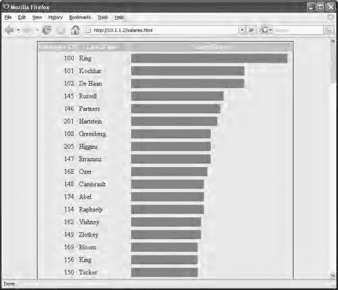

当然，阅读原始 HTML 并不能完全给你图形化的冲击力，因此，将结果假脱机到文件并在浏览器中查看的效果如图 11-3 所示。

`图 11-3.` 在浏览器中显示的薪资 HTML 报告输出


[www.it-ebooks.info](http://www.it-ebooks.info/)

# 第 11 章 ■ 常见报表问题

```sql
'<td class="empty" width="' ||
to_char(100 - round(100 * salary / maxsalary)) ||
'%">' || chr(38) || 'nbsp;</td></tr>' || chr(10) ||
'</table></td></tr>' || chr(10) ||
...
```

HTML 报表的主体是一个表格生成的，其中每一行本身也是一个表格。这些独立的行具有由两个表格单元格构成的表格结构。以粗体显示的代码是计算的核心。首先，左侧的表格单元格宽度被设定为与员工工资占最高工资的比例成正比。因此，对于工资为 24000（即最高工资）的员工 King，这个表格单元格的宽度占外部表格宽度的 100%。该员工的右侧单元格宽度则计算为 100 减去为第一个单元格计算出的百分比。对于 King 来说，这意味着右侧单元格宽度为零。HTML 头部包含样式表信息，将左侧单元格颜色设为蓝色，而右侧单元格颜色则与背景色匹配，使其看起来是透明的。

随着我们在内联视图中浏览的员工其`SALARY`金额占最高工资的比例越来越小，左侧表格单元格的尺寸会按比例缩小，而右侧表格单元格的尺寸则会按比例增长。这就能呈现出表示比例工资的、尺寸正确的图形条效果。

■ **注意** 我们要感谢我们出色的技术编辑 Stéphane Faroult，感谢他为本配方提供的想法。

[www.it-ebooks.info](http://www.it-ebooks.info/)

[www.it-ebooks.info](http://www.it-ebooks.info/)

# 第 12 章

■ ■ ■

# 清洗数据

有时，你会发现自己在从某些数据源提取信息并将其导入关系数据库的环境中工作。信息的来源可能是电子表格、CSV 文件、其他数据库等等。例如，在数据仓库环境中，从几个不同的数据库源获取数据并将其导入到一个集中的报表数据库是很常见的做法。

当将数据从一个源移动到另一个目标时，如果源数据类型与目标数据类型不同，有时会出现转换问题。在这些情况下，你必须检查源数据，以确保它可以加载到目标数据库中。例如，你可能有一个需要导入到 Oracle 数据库中 `TIMESTAMP` 数据类型字段的字符串。或者，你可能正在从一个没有为表定义主键的系统迁移数据，那么在加载到目标数据库之前，你需要检测出任何重复的行。

在某些环境中，你可能有一个自动化的 ETL（提取、转换和加载）过程来执行数据清洗。然而，即使你使用的是功能丰富的 ETL 工具，你仍然会遇到需要快速使用 SQL 来对数据问题进行故障排除的情况。如果 ETL 过程中断或产生不一致的结果，你将不得不使用 SQL 来验证数据。

在传输数据时，你会发现需要使用 SQL 来确保数据符合目标数据库的业务规则。这类活动被广泛地称为 *数据清洗*（或数据清理）。本章展示了开发人员和 DBA 在将数据从一个数据源移动到另一个数据源时常用的 SQL 技术。

##### 12-1. 检测重复行

### 问题

你正尝试向一个表添加主键约束：

```sql
alter table d_prods add constraint d_prods_pk primary key(d_prod_id);
```

287

[www.it-ebooks.info](http://www.it-ebooks.info/)

# 第 12 章 ■ 清洗数据

然后你收到了这条错误消息：

```
ORA-02437: cannot validate (STAR1.D_PRODS_PK) - primary key violated
```

你需要找出哪些行是重复的。

### 解决方案

使用带有 `GROUP BY` 和 `HAVING COUNT` 子句的 `SELECT` 语句。下面的代码清单根据 `PARTY_ID` 列中的值显示了 `PARTIES` 表中的重复行：

```sql
select
count(*)
```


# 第 12 章 ■ 数据清洗

##### 12-2. 删除重复行

### 问题
你想要从表中删除重复的行。

### 解决方案
使用关联子查询从表中删除重复行。以下示例从 `PARTIES` 表中删除 `PARTY_ID` 列上存在重复值的重复行：

```
delete from parties a
where a.rowid <
    (select max(b.rowid)
       from parties b
      where a.party_id = b.party_id);
```

在执行这样的删除语句之前，你应该先运行一个类似于配方 12-1 的查询，以确定将有多少数据会被删除。

### 工作原理
数据库中的每一行都有一个唯一的 `ROWID`。解决方案部分中的 `DELETE` 语句将任意删除所有具有相同 `PARTY_ID` 的行，只保留 `ROWID` 最高的那一行。

如果你的唯一标识符由多个列组成，请在关联子查询的 `WHERE` 子句中使用所有这些列。例如，如果你的逻辑主键由 `FIRST_NAME` 和 `LAST_NAME` 组成，请执行以下 SQL 语句来删除重复项：

```
delete from parties a
where a.rowid <
    (select max(b.rowid)
       from parties b
      where a.first_name = b.first_name
        and a.last_name = b.last_name);
```

接下来列出的是本配方解决方案部分中 SQL 的一个轻微变体：

```
delete from parties
 where rowid not in
    (select max(rowid)
       from parties
      group by party_id);
```

使用此查询还是前一个查询，取决于 SQL 编码偏好。如果你为每个查询生成执行计划，你会注意到两者在成本上差异不大。

## 12-3. 判断数据是否可以作为数值加载

### 问题
你有一个在旧系统中被定义为字符串的字段，但在新数据库中将迁移到数值型字段。你已经将数据加载到一个临时的暂存表中，并且想要确定是否有任何字符数据无法干净地转换为数值数据类型。

### 解决方案
你需要创建一个小的 PL/SQL 函数：

```
create or replace function isnum(v_in varchar2)
return varchar is
  val_err exception;
  pragma exception_init(val_err, -6502); -- 字符到数字转换错误
  scrub_num number;
begin
  scrub_num := to_number(v_in);
  return 'Y';
exception
  when val_err then
    return 'N';
end;
/
```

如果传入 `ISNUM` 函数的值是一个数字，则返回 `Y`。如果该值无法转换为数字，则返回 `N`。

### 工作原理
你可以使用 `ISNUM` 函数来检测列中的数据是否为数值。该函数为 `ORA-06502` 字符到数字转换错误定义了一个 PL/SQL 预编译异常。当遇到此错误时，异常处理程序会捕获它并返回 `N`。

你可以使用此函数来判断一个字符是否能转换为数字。例如，假设你有一个名为 `STAGE` 的表，其中包含一个名为 `HOLD_COL` 的列，其值如下：

```
HOLD_COL
------------------------------
1
c
3
$
```


# 数据清洗技术笔记

## 1032.22

**32423432234234432x**

以下查询使用 `ISNUM` 函数来判断表中是否存在非数值数据：

`select hold_col from stage where isnum(hold_col)='N';`

预期输出如下：

`HOLD_COL`
`------------------------------`
`c`
`$`
`32423432234234432x`

## 12-4. 判断数据是否能作为日期加载

### 问题
旧系统中定义为字符串的字段，在新数据库中将迁移到日期数据类型。数据已加载到临时暂存表中，需要确定是否有字符数据无法干净地转换为日期数据类型。

### 解决方案
需要创建一个小型 PL/SQL 函数：

```
create or replace function isdate(p_in varchar2, f_in varchar2)
return varchar is
  scrub_dt date;
begin
  scrub_dt := to_date(p_in, f_in);
  return 'Y';
exception when others then
  return 'N';
end;
/
```

`ISDATE` 函数接受两个值：字符数据和日期格式掩码。如果传入函数的值是有效日期，则返回 `Y`。如果无法转换为日期，则返回 `N`。

### 工作原理
`ISDATE` 函数可用于检测列中的字符数据是否有效。例如，假设有一个名为 `STAGE` 的表，其中包含一个名为 `HOLD_COL` 的列，其值如下：

`HOLD_COL`
`------------------------------`
`20090130`
`20090132`
`20090229`
`20091430`
`20090330`

以下查询使用 `ISDATE` 函数判断是否有字符数据不符合 `YYYYMMDD` 日期格式：

`select hold_col`
`from stage`
`where isdate(hold_col,'YYYYMMDD') = 'N';`

无法映射到有效日期的值如下：

`HOLD_COL`
`------------------------------`
`20090132`
`20090229`
`20091430`

## 12-5. 执行大小写不敏感查询

### 问题
已加载大量大小写混合的数据。希望查询时如同数据全是小写（或全是大写）。

### 解决方案
如果使用的是 Oracle Database 10 *g* 或更高版本，可以使用 `ALTER SESSION` 语句来启用大小写不敏感的 `>`、`<` 和 `=` 比较运算符。要启用大小写不敏感搜索，需修改 `NLS_SORT` 和 `NLS_COMP` 参数：

`alter session set nls_sort=binary_ci;`
`alter session set nls_comp=linguistic;`

这些设置允许进行大小写不敏感的搜索。可以运行以下查询来选择所有 `john` 值（不区分大小写）：

`select * from parties where first_name = 'john';`

`FIRST_NAME`
`------------------------------`
`John`
`JOHN`
`john`

### 工作原理
在 Oracle Database 10 *g* 之前，必须使用 `UPPER` 或 `LOWER` SQL 函数来执行大小写不敏感的搜索，例如：

`select * from parties where upper(first_name) = 'JOHN';`

■ **提示**：Oracle 不会访问对列应用了 SQL 函数的索引。为了解决这个问题，可以创建基于函数的索引。

其他确保搜索中不受大小写影响的常用技术包括：

- 使用触发器强制字符串以全大写或全小写插入。
- 在表中添加一列，用于存储该字符串的全大写或全小写版本。

在 Oracle Database 10 *g* 或更高版本中，将 `NLS_SORT` 设置为 `BINARY_CI` 并将 `NLS_COMP` 设置为 `LINGUISTIC` 的组合会指示 SQL 在比较操作时忽略大小写。`NLS_SORT` 参数确定字符数据的排序类型。`NLS_SORT` 设置为 `BINARY_CI` 表示排序行为不区分大小写。`NLS_COMP` 参数影响 SQL 操作的行为。将 `NLS_COMP` 设置为 `LINGUISTIC` 会指示 SQL 执行值的语言学比较。


# 二进制排序与语言排序

对字符数据进行排序时，排序通常基于字符编码方案的数值。这被称为二进制排序。二进制排序在处理英文字母时效果良好，因为 ASCII 和 EBCDIC 字符编码方案为英文字母定义了升序的数值。

例如，字符 `A` 的 ASCII 十进制值为 65；字符 `B` 的十进制值为 66，依此类推。

然而，当存在非英语语言的字符时，排序可能会产生不理想的结果。在这种情况下，基于所使用语言的语言排序顺序更为合适。例如，要指定法语语言排序：

```sql
alter session set nls_sort = French;
```

你可以通过在 SQL 语句中直接使用 `NLSSORT` 函数来覆盖会话设置：

```sql
select first_name from parties
order by nlssort(first_name,'nls_sort = French');
```

## 12-6. 数据混淆

### 问题

你的数据库正在接受审计，但它包含姓名和社会保障号码等应保持私密的信息。你需要以一种无法直接读取该数据的形式向审计员展示，但审计员仍然能够察觉数据中的模式。如果审计过程发现欺诈行为，则可以根据具体情况提供真实的姓名和社会保障号码。

[www.it-ebooks.info](http://www.it-ebooks.info/)

## 第 12 章 ■ 数据清洗

### 解决方案

使用内置的 SQL 函数 `TRANSLATE` 将每个字符值转换为另一个不同的值。这里是一个简单的例子：

```sql
select translate('ORACLE',
                 'ABCDEFGHIJKLMNOPQRSTUVWXYZ',
                 'ZYXWVUTSRQPONMLKJIHGFEDCBA')
from dual;
```

输出如下：

```
TRANSL
------
LIZXOV
```

要将混淆后的值转回其原始值，再次使用 `TRANSLATE` 函数：

```sql
select translate('LIZXOV',
                 'ABCDEFGHIJKLMNOPQRSTUVWXYZ',
                 'ZYXWVUTSRQPONMLKJIHGFEDCBA')
from dual;
```

如果你需要混淆大量数据，将 `TRANSLATE` 函数放在 PL/SQL 包中并使用该包来混淆数据会更高效。这里是一个简单的例子：

```sql
create or replace package obfus is
  function obf(clear_string varchar2) return varchar2;
  function unobf(obs_string varchar2) return varchar2;
end obfus;
/
--
create or replace package body obfus is
  fromstr varchar2(62) := '0123456789ABCDEFGHIJKLMNOPQRSTUVWXYZ' ||
                          'abcdefghijklmnopqrstuvwxyz';
  tostr   varchar2(62) := 'defghijklmnopqrstuvwxyzabc3456789012' ||
                          'KLMNOPQRSTUVWXYZABCDEFGHIJ';
--
  function obf(clear_string varchar2) return varchar2 is
  begin
    return translate(clear_string, fromstr, tostr);
  end obf;
```

[www.it-ebooks.info](http://www.it-ebooks.info/)

## 第 12 章 ■ 数据清洗

```sql
--
  function unobf(obs_string varchar2) return varchar2 is
  begin
    return translate(obs_string, tostr, fromstr);
  end unobf;
end obfus;
/
```

现在，可以通过调用 `OBF` 函数来混淆表中的列：

```sql
update emp set emp_name = obfus.obf(emp_name),
               ssn      = obfus.obf(ssn);
```

可以使用 `UNOBF` 函数将列值设置回其原始值：

```sql
update emp set emp_name = obfus.unobf(emp_name),
               ssn      = obfus.unobf(ssn);
```

> **注意** 这种用字母表中固定位置之后的另一个字符来替代单个字母字符的过程，在密码学中被称为*凯撒密码*。例如，单字符移位意味着 `A` 由 `B` 表示，`B` 由 `C` 表示，依此类推。该方法得名于罗马皇帝尤利乌斯·凯撒，他使用这种加密技术与他的将军们通信。

在某些情况下，你可能需要对数据进行混淆。混淆是将数据改动到足以让真实值无法通过简单查看数据就被识别出来的程度。混淆*并非*一种使数据不可读的安全方式，也不是加密的替代品。


加密是一种安全的方法，可以使数据不可读且难以解密。如果你需要加密数据，请使用 `DBMS_CRYPTO` 包或 `Oracle Advanced Security` 选项中提供的加密功能。

当你需要使数据不可读但仍保留一般字符模式时，混淆可能更合适。在这些情况下，加密效果不佳，因为它会将数据转换为超出正常 ASCII 字符范围的值。

## 工作原理

`TRANSLATE` 函数执行逐字符替换，一次替换一个字符。它接受三个输入参数：要翻译的字符串、源字符和目标字符。

`TRANSLATE` 函数非常适合数据混淆。

[www.it-ebooks.info](http://www.it-ebooks.info/)

# 第 12 章 ■ 数据清理

有时 `TRANSLATE` 函数会与 `REPLACE` 函数混淆，但 `REPLACE` 函数是用一个字符串替换另一个字符串，而 `TRANSLATE` 函数则是交换一个字符与另一个字符。以下是一个使用 `REPLACE` 的简单示例：

```sql
select replace('scrappple','ppp','bb')
from dual;
```

输出显示 `ppp` 字符串已被 `bb` 字符串替换：

```
REPLACE
--------
scrabble
```

##### 12-7. 删除所有索引

### 问题

你正在向表中插入大量数据，并希望尽可能快地加载数据。出于性能考虑，你希望在插入数据之前删除表上的索引。

### 解决方案

为表删除所有索引的最简单方法是使用 SQL 生成所需的 SQL。以下示例生成为 `F_SALES` 表删除所有索引所需的 SQL：

```sql
select 'drop index ' || index_name || ';'
from user_indexes where table_name='F_SALES';
```

以下是一些示例输出：

```
'DROPINDEX'||INDEX_NAME||';'
------------------------------------------
drop index F_SALES_FK1;
drop index F_SALES_FK2;
drop index F_SALES_FK3;
drop index F_SALES_FK4;
drop index F_SALES_FK5;
```

[www.it-ebooks.info](http://www.it-ebooks.info/)

# 第 12 章 ■ 数据清理

### 工作原理

在加载大型数据仓库表时，有时在加载前删除表的索引，然后在数据加载完成后重新创建它们，效率会更高。这对于与星型模式事实表关联的位图索引尤其如此。

在删除任何索引之前，请确保你有重新创建索引所需的 DDL。你不想让自己陷入删除了索引却不知道如何重新创建它们的境地。理想情况下，你拥有用于创建索引的原始 DDL 脚本。如果没有，请使用 `DBMS_METADATA` 包来生成索引创建 DDL，如下所示：

```sql
select dbms_metadata.get_ddl('INDEX', index_name)
from user_indexes
where table_name = upper('&table_name');
```

如果你从 `SQL*Plus` 运行前面的 SQL，请务必将 `LONG` 变量设置为一个较大的值，以便能够查看所有文本。

删除和重新创建索引的另一种方法是将它们标记为不可用，然后重建它们。以下是一个生成用于将表的所有索引更改为不可用状态所需 SQL 的脚本：

```sql
select 'alter index ' || index_name || ' unusable;'
from user_indexes where table_name=upper('&table_name');
```

以下是一个生成用于重建表的所有索引所需 SQL 的脚本：

```sql
select 'alter index ' || index_name || ' rebuild;'
from user_indexes where table_name=upper('&table_name');
```

如果你想在脚本中捕获解决方案部分中的 SQL 语句输出，请使用 `SQL*Plus` 的 `SET` 命令关闭一些默认的反馈设置，如下列代码所示：

```sql
set verify off feedback off pagesize 0
spool drop_ind.sql
select 'drop index ' || index_name || ';'
from user_indexes where table_name='F_SALES';
spool off;
```

`VERIFY` 参数会关闭包含替换变量的行的前后图像。


`FEEDBACK` 参数控制显示受 SQL 语句影响的行数。当 `PAGESIZE` 参数设置为 `0` 时，将抑制标题和分页符。

[www.it-ebooks.info](http://www.it-ebooks.info/)

# 第 12 章 ■ 数据清理

关闭各种显示设置后，脚本使用 `SPOOL` 命令将输出发送到文件。现在，您可以按如下方式运行捕获的输出文件中包含的删除命令：`SQL> @drop_ind.sql`

##### 12-8. 禁用约束

### 问题
您试图截断一个表，但收到以下错误消息：`ORA-02266: unique/primary keys in table referenced by enabled foreign keys`。进一步调查后，您发现 Oracle 不允许在父表（其主键被子表中的启用外键引用）上执行截断操作。您需要在继续截断操作之前禁用外键约束。

### 解决方案
如果您需要截断父表，必须首先禁用所有引用该父表主键的已启用外键约束。运行此查询以确定需要禁用的约束名称：

```sql
select
  b.table_name primary_key_table
 ,a.table_name fk_child_table
 ,a.constraint_name fk_child_table_constraint
from dba_constraints a
    ,dba_constraints b
where a.r_constraint_name = b.constraint_name
  and a.r_owner = b.owner
  and a.constraint_type = 'R'
  and b.owner = upper('&table_owner')
  and b.table_name = upper('&table_name');
```

在此示例中，只有一个外键依赖项：

```
PRIMARY_KEY_TABLE FK_CHILD_TABLE        FK_CHILD_TABLE_CONST
-------------------- -------------------- --------------------
D_DATES              F_SALES              F_SALES_FK1
```

[www.it-ebooks.info](http://www.it-ebooks.info/)

# 第 12 章 ■ 数据清理

使用 `ALTER TABLE` 语句禁用表上的约束。在本例中，只有一个外键需要禁用：

`alter table f_sales disable constraint f_sales_fk1;`

现在可以截断父表了：

`truncate table d_dates;`

截断操作完成后，不要忘记重新启用外键约束，如下所示：

`alter table f_sales enable constraint f_sales_fk1;`

在多用户系统中，有可能在外部键约束被禁用期间，另一个会话已向子表插入数据。如果发生这种情况，当您尝试重新启用外键时，会看到以下错误：

`ORA-02298: cannot validate (<owner>.<constraint>) - parent keys not found`。在这种情况下，您可以使用 `ENABLE NOVALIDATE` 子句。这指示 Oracle 不验证任何现有行，但验证在约束重新启用后添加的行：`alter table f_sales enable novalidate constraint f_sales_fk1;`

要清理违反约束的行，首先确保在您的模式中已创建 `EXCEPTIONS` 表。如果没有 `EXCEPTIONS` 表，请使用此脚本创建一个：`SQL> @?/rdbms/admin/utlexcpt.sql`

接下来，使用 `EXCEPTIONS INTO` 子句将违反约束的行填充到 `EXCEPTIONS` 表中：

```sql
alter table f_sales modify constraint f_sales_fk1 validate
exceptions into exceptions;
```

只要存在违反约束的行，此语句仍将抛出 `ORA-02298` 错误。该语句还会将任何有问题的行的记录插入到 `EXCEPTIONS` 表中。现在，您可以使用 `EXCEPTIONS` 表的 `ROW_ID` 列来删除任何违反约束的记录。

这里我们看到需要从 `F_SALES` 表中删除一行：

[www.it-ebooks.info](http://www.it-ebooks.info/)

# 第 12 章 ■ 数据清理

```sql
select * from exceptions;
```

```
ROW_ID            OWNER        TABLE_NAME    CONSTRAINT
----------------- ------------ ------------- ---------------
AAAFVmAAFAAAAihAAA INV_MMGT    F_SALES       F_SALES_FK1
```

要删除有问题的记录，请发出 `DELETE` 语句：

`delete from f_sales where rowid = 'AAAFVmAAFAAAAihAAA';`


# 工作原理

Oracle 的一个便利特性是，你可以禁用和启用约束，而无需删除并重新创建它们。这意味着你无需手头准备重新创建已删除约束所需的 DDL 语句。

如果一个表定义了主键，并且该主键被子表中一个已启用的外键约束引用，你就不能 `TRUNCATE` 该表——即使子表中没有任何行。Oracle 会阻止你这样做，因为在多用户系统中，在你截断子表之后和随后截断父表之前的间隙，另一个会话有可能向子表中插入行。

在这种情况下，Oracle 谨慎地不允许你截断父表。

同时请记住，`TRUNCATE` 是一个 DDL 命令，它执行后会自动提交当前事务。因此，你无法回滚 `TRUNCATE` 操作，也无法将两个独立表的 `TRUNCATE` 操作作为单个事务处理。请将 `TRUNCATE` 的行为与 `DELETE` 进行比较。

Oracle 确实允许你在约束（引用子表的约束）启用的情况下，使用 `DELETE` 语句从父表中删除行。这是因为 `DELETE` 会生成撤销数据、具有读一致性，并且可以被回滚。

你可以使用 `DISABLE` 子句的 `CASCADE` 选项来禁用主键和所有依赖的外键约束。例如，下面这行代码禁用了与 `D_DATES_PK` 主键约束相关的所有外键约束：

```sql
alter table d_dates disable constraint d_dates_pk cascade;
```

前面的语句不会级联通过所有依赖层级。它只会禁用直接依赖于 `D_DATES_PK` 的外键约束。另外请记住，没有 `ENABLE...CASCADE` 语句。要重新启用约束，你必须查询数据字典来确定哪些约束已被禁用，然后逐个重新启用它们。

有时在加载数据时，你会遇到这种情况：在加载数据前（例如从模式级别导入）禁用所有外键会很方便。在这些情况下，`imp` 工具只是按字母顺序导入表，并不确保子表在父表之前导入。此外，你可能希望并行运行多个导入作业以利用并行硬件。在这种场景下，你可以禁用外键，执行导入，然后重新启用外键。下面是一个使用 SQL 生成 SQL 来禁用某个用户所有外键约束的脚本：

```sql
set lines 132 trimsp on head off feed off verify off echo off pagesize 0
spo dis_dyn.sql
select 'alter table ' || a.table_name
|| ' disable constraint ' || a.constraint_name || ';'
from dba_constraints a
,dba_constraints b
where a.r_constraint_name = b.constraint_name
and a.r_owner = b.owner
and a.constraint_type = 'R'
and b.owner = upper('&table_owner');
spo off;
```

这个脚本生成一个名为 `dis_dyn.sql` 的文件，该文件禁用了某个用户的所有外键约束。接下来列出的是一个类似的脚本，用于生成一个包含重新启用某个用户外键约束命令的文件：

```sql
set lines 132 trimsp on head off feed off verify off echo off pagesize 0
spo enable_dyn.sql
select 'alter table ' || a.table_name
|| ' enable constraint ' || a.constraint_name || ';'
from dba_constraints a
,dba_constraints b
where a.r_constraint_name = b.constraint_name
and a.r_owner = b.owner
and a.constraint_type = 'R'
and b.owner = upper('&table_owner');
spo off;
```

启用约束时，默认情况下 Oracle 会检查数据是否违反约束定义。如果你相当确定数据完整性良好，并且不想因为重新验证约束而产生性能开销，那么在重新启用约束时可以使用 `NOVALIDATE` 子句。下面是一个例子：

```sql
select 'alter table ' || a.table_name
|| ' modify constraint ' || a.constraint_name || ' enable novalidate;'
from dba_constraints a
,dba_constraints b
where a.r_constraint_name = b.constraint_name
and a.r_owner = b.owner
and a.constraint_type = 'R'
and b.owner = upper('&table_owner');
```

`NOVALIDATE` 子句指示 Oracle 不验证正在启用的约束，但它会强制执行任何新的 DML 活动都必须遵守约束定义。

你可能还会遇到需要禁用主键或唯一键约束的情况。例如，你可能想执行大规模数据加载，并且出于性能原因，你想禁用主键和唯一键约束。你不想为插入的每一行都进行检查而产生开销。

用于禁用外键的通用技术同样适用于禁用主键或唯一键。运行此查询以显示某个用户的主键和唯一键约束：

```sql
select
a.table_name
,a.constraint_name
,a.constraint_type
from dba_constraints a
where a.owner = upper('&table_owner')
and a.constraint_type in ('P','U')
order by a.table_name;
```

以下是一些示例输出：

```
TABLE_NAME                     CONSTRAINT_NAME                C
------------------------------ ------------------------------ -
DEPT                           SYS_C006507                    P
D_DATES                        D_DATES_UK1                    U
D_DATES                        D_DATES_PK                     P
```

一旦确定了表名和约束名，就使用 `ALTER TABLE` 语句来禁用约束：

```sql
alter table d_dates disable constraint d_dates_pk;
```

Oracle 不允许你禁用被外键引用的主键或唯一键约束。你必须先禁用外键约束。

此外，如果你确信数据不需要验证，请考虑使用 `NOVALIDATE` 子句：

```sql
alter table d_dates modify constraint d_dates_pk enable novalidate;
```

这将指示 Oracle 在启用约束时不验证数据，但会对约束启用后修改的任何数据进行验证。

## 禁用触发器

### 问题

你正准备加载大量数据。在向表中插入数据时，你不想让触发器影响性能。此外，你想按原样加载源数据；你不希望触发器在数据加载时执行并修改数据。你想在执行数据加载前禁用触发器。

### 解决方案

你可以禁用单个触发器或表上的所有触发器。你可以通过查询 `DBA/ALL/USER_TRIGGERS` 视图来查看表的触发器。例如：

```sql
select trigger_name, status
from user_triggers where table_name='CLUSTER_BUCKETS';
```

输出如下：

```
TRIGGER_NAME                  STATUS
------------------------------ --------
CLUSTER_BUCKETS_BU_TR1        ENABLED
```

现在使用 `ALTER TRIGGER` 语句来禁用触发器：

```sql
alter trigger CLUSTER_BUCKETS_BU_TR1 disable;
```

如果你想禁用表上的所有触发器，请使用 `ALTER TABLE...DISABLE ALL TRIGGERS` 语句：

```sql
alter table cluster_buckets disable all triggers;
```

将数据加载到表中后，你可以按如下方式重新启用所有触发器：

```sql
alter table cluster_buckets enable all triggers;
```


# 第 12 章 ■ 数据清洗

当你需要向表中进行大规模数据加载时，出于性能考虑，有时需要禁用表上的所有触发器。如果数据加载操作涉及多个表，你可以使用 SQL 生成 SQL 来为某个用户的所有表禁用触发器：

```
select 'alter table ' || table_name || ' disable all triggers;'
from user_tables;
```

完成数据加载后，你需要重新启用触发器。以下是用于生成 SQL 以重新启用某个用户所有表触发器的 SQL：

```
select 'alter table ' || table_name || ' enable all triggers;'
from user_tables;
```

当你重新启用触发器时，触发器不会运行。触发器的状态只是从 `DISABLED` 更改为 `ENABLED`。一旦触发器被启用，对于任何后续的、会导致触发器执行的 SQL 语句，它都将执行。因此，你需要通过 SQL 查询来验证数据，以确定在触发器被禁用期间加载的数据是否有违反任何关键业务规则的情况。

##### 12-10. 从表中删除数据

### 问题

你想高效地清空一个大表中的所有数据。

### 解决方案

使用 `TRUNCATE` 命令来删除表中的数据。此示例删除 `F_SALES` 表中的所有数据：

```
truncate table f_sales;
```

```
表已截断。
```

默认情况下，Oracle 会释放表所使用的所有空间，除了由 `MINEXTENTS` 表存储参数定义的空间。如果你不希望 `TRUNCATE` 语句释放区，请使用 `REUSE STORAGE` 参数：

```
truncate table f_sales reuse storage;
```

### 工作原理

Oracle 将表的高水位线定义为段中已用空间和未用空间之间的边界。当你创建一个表时，Oracle 会根据 `MINEXTENTS` 表存储参数为表分配一定数量的区。每个区包含若干个数据块。在向表插入数据之前，所有数据块都未被使用，高水位线为零。

`TRUNCATE` 语句将表的高水位线重置为零。当你使用 `DELETE` 语句删除表中的数据时，高水位线不会改变。使用 `TRUNCATE` 语句并重置高水位线的一个优点是，全表扫描将只搜索高水位线以下的数据块。这可能对性能产生显著影响。

**注意：** 你可以通过 `DBMS_SPACE` 包来确定高水位线以下数据块的空间使用情况。

#### 高水位线与性能

Oracle 在执行查询时有时需要扫描表的每个数据块（高水位线以下）。这被称为全表扫描。如果表中已有大量数据被删除，即使是一个空表，全表扫描也可能需要很长时间才能完成。

你可以运行这个简单的测试来检测此问题：

1.  `SQL> set autotrace trace statistics`
2.  运行执行全表扫描的查询
3.  比较处理的行数与逻辑 I/O 次数

如果处理的行数很少但逻辑 I/O 次数很高，那么高水位线以下的空闲数据块数量可能存在问题。要重新调整高水位线，你必须为该表启用行移动，然后使用 `ALTER TABLE...SHRINK SPACE` 语句。

`TRUNCATE` 语句是一条 DDL 语句。这意味着 Oracle 在它运行后会自动提交该语句（以及当前事务），因此无法回滚 `TRUNCATE` 语句。

如果你需要能够在删除数据时回滚，你应该使用 `DELETE` 语句。然而，`DELETE` 语句的缺点是它会生成大量的 undo 和 redo 信息。

因此，对于大型表，`TRUNCATE` 语句通常是删除数据最有效的方式。


我们应当注意，从表中删除数据的另一种方法是删除并重新创建表。

然而，这意味着您还必须重新创建属于该表的任何索引、约束、授权或触发器。此外，当您删除表时，该表将暂时不可用，直到您重新创建它并重新发放任何所需的授权。通常，删除并重新创建表仅在开发或测试环境中可以接受。

##### 12-11. 显示模式差异

**问题**

您拥有测试和生产数据库。您想确定测试数据库模式与生产数据库模式之间是否存在任何对象差异。您无法访问昂贵的图形工具来显示模式之间的差异。您想知道可以使用哪些 SQL 技术来显示两个模式之间的对象差异。

**解决方案**

显示两个模式之间差异的基本技术如下：

1.  如果模式位于两个不同的数据库中，请创建数据库链接以指向这两个不同的环境。
2.  使用 `MINUS` 集合运算符查询数据字典视图以显示差异。

以下示例演示了如何显示模式差异。在此示例中，我们连接到一个中央数据库，该数据库可以通过 Oracle Net 访问两个远程数据库。我们想查看这两个远程数据库中的模式差异。首先，我们创建指向两个不同环境的数据库链接。此示例使用 SQL*Plus 变量来定义用于创建数据库链接的两个不同模式和密码：

```sql
define user1=ccim_dev
define user1_pwd=ccim_pwd
define user2=ccim_prod
define user2_pwd=abc123
define conn1=@db1
define conn2=@db2

create database link db1 connect to &&user1 identified by &&user1_pwd using 'sb-db5:1521/sb6';
create database link db2 connect to &&user2 identified by &&user2_pwd using 'db-prod1:1521/scaprd';
```

创建数据库链接后，运行 SQL 语句以从数据字典视图显示元数据差异。接下来的两条语句使用 `MINUS` 集合运算符来确定表名是否存在任何差异：

```sql
prompt ...Tables in db1 NOT IN db2
select table_name
from user_tables&&conn1
minus
select table_name
from user_tables&&conn2;

prompt ...Tables in db2 NOT IN db1
select table_name
from user_tables&&conn2
minus
select table_name
from user_tables&&conn1;
```

如果您想将本地模式与远程模式进行比较，则只需要一个数据库链接。在这种情况下，您还需要将一个连接变量定义为空，例如：`define conn2=''`

现在，您可以作为本地用户连接到您的数据库，并将远程模式与本地模式进行比较。

如果您想比较同一数据库中两个模式中的对象，则必须修改脚本以包含 `OWNER` 并使用 `DBA` 或 `ALL` 数据字典视图（而不是 `USER`）。

### 工作原理

在本方法的解决方案部分，我们展示了一个简单的示例，说明如何使用数据字典来确定两个模式在表名方面是否存在任何差异。它通过使用 `MINUS` 集合运算符来显示存在于第一个模式但不存在于第二个模式的数据字典行来比较模式。然后运行另一个类似的查询，但这次它检查存在于第二个模式但不存在于第一个模式的行。

以下是一个更完整的比较两个模式对象的示例。此脚本比较多个不同的数据字典视图以查找元数据差异：

```sql
spo diff.txt

prompt Default or temp tablespace in db1 NOT IN db2
select default_tablespace, temporary_tablespace
from user_users&&conn1
minus
select default_tablespace, temporary_tablespace
from user_users&&conn2;

prompt Default or temp tablespace in db2 NOT IN db1
select default_tablespace, temporary_tablespace
from user_users&&conn2
minus
select default_tablespace, temporary_tablespace
from user_users&&conn1;

prompt Tablespace quotas in db1 NOT IN db2
select tablespace_name, max_bytes
from user_ts_quotas&&conn1
minus
select tablespace_name, max_bytes
from user_ts_quotas&&conn2;

prompt Tablespace quotas in db2 NOT IN db1
select tablespace_name, max_bytes
from user_ts_quotas&&conn2
minus
select tablespace_name, max_bytes
from user_ts_quotas&&conn1;

prompt Objects in db1 NOT IN db2
select object_name, object_type
from user_objects&&conn1
minus
select object_name, object_type
from user_objects&&conn2 order by 2;

prompt Objects in db2 NOT IN db1
select object_name, object_type
from user_objects&&conn2
minus
select object_name, object_type
from user_objects&&conn1 order by 2;

prompt Tables in db1 NOT IN db2
select table_name
from user_tables&&conn1
minus
select table_name
from user_tables&&conn2;

prompt Tables in db2 NOT IN db1
select table_name
from user_tables&&conn2
minus
select table_name
from user_tables&&conn1;

prompt Indexes in db2 NOT IN db1
select table_name, index_name, index_type, uniqueness
from user_indexes&&conn2
minus
select table_name, index_name, index_type, uniqueness
from user_indexes&&conn1 order by 1, 2;

prompt Table columns db1 NOT IN db2
select table_name, column_name
from user_tab_columns&&conn1
minus
select table_name, column_name
from user_tab_columns&&conn2 order by 1,2;

prompt Table columns in db2 NOT IN db1
select table_name, column_name
from user_tab_columns&&conn2
minus
select table_name, column_name
from user_tab_columns&&conn1 order by 1,2;

spo off;
```

前面的脚本只是您如何使用数据字典视图来报告模式之间元数据差异的示例。我们并未将所有可能的检查类型都包含在脚本中。

相反，我们在此包含了足够的内容，为您提供一个示例，说明如何查找开发人员和 DBA 寻找的最常见类型的差异。我们已在 Apress 网站 (http://www.apress.com) 的源代码部分包含了此脚本的完整版本。

如果您可以访问诸如 Enterprise Manager Change Management Pack 之类的工具，您也可以使用它来显示两个模式之间的差异。快速的 Google 搜索将显示数十种可用于比较模式的工具。本方法的目的不是与这些工具竞争，而是表明您可以快速创建一组 SQL 语句来显示模式差异。这些语句可以根据您的环境需要轻松地进行扩充和增强。

# 第 13 章

## 树形结构数据

树形结构——分层数据——无处不在。除了您后院或附近公园里可能有一棵有树干和树枝的真树之外，您还可能参加一个篮球锦标赛，其对阵图是基于时间的树形结构版本，最终只有一支队伍在锦标赛结束时位于根节点。在您的工作中，管理结构本质上是一个树形结构，老板或所有者在顶部，经过一层或多层管理才到达位于树底部的时薪员工。


# 第 13 章 ■ 树形结构数据

整个数据库管理系统都围绕层次数据构建。IBM 公司最受欢迎的产品之一，信息管理系统（IMS），出现在 20 世纪 60 年代末，并为层次数据和事务速度进行了优化。尽管它仍然是 IBM 最畅销的产品之一，但其实现方式使得在不进行额外编码的情况下，难以以多种方式访问数据。XML 是一种相对较新的表示树形结构数据的方式，它提供了标准化的数据交换，但如果你尝试以替代顺序遍历 XML 文档，则会很有挑战性。在 20 世纪 70 年代末，Oracle 及其关系数据库架构开始解决层次模型的不灵活性，并提供对使用内置功能对一个或多个表进行层次遍历的支持。

图 13-1 显示了两个层次树；它们可能在不同的表中，也可能在同一个表中。


**图 13-1.** *来自单个数据库表的两个树中的层次（树形结构）数据*

如你将在本章的一个示例中看到的，Oracle 可以在同一张表中处理多棵树而没有任何问题。树中每个节点的键通常是主键或候选键。一个给定的节点可以有零个、一个或多个子节点；一个给定的子节点只能有一个父节点。在遍历树时，经常使用*级别*的概念；它指定了一个节点距离树的根节点有多远，其中级别 1 是根节点所在的级别。根据它们在层次结构中的位置，每个级别的一行可以是两种类型之一。以下是我们将在本章中使用的定义：

`Root`: 层次结构中最高的行

`Child`: 任何非根行

`Parent`: 任何拥有子行的行

`Leaf`: 没有任何子行的行

在图 13-1 中，节点 1 和 3 是根节点，19 和 27（以及每棵树底部的许多其他节点）是叶节点，除叶节点外的所有节点都是父节点。除根节点外的所有节点都是子节点。一个节点不能同时拥有四种角色中的三种或全部四种，而只有一行的表是唯一一种节点可以同时是根节点和叶节点的情况。

在本章中，我们将介绍访问单个表或跨多个表的层次数据的大部分方法。在层次查询中你会看到的关键子句是`CONNECT BY`和`START WITH`。`CONNECT BY`子句指定了你希望如何将行与其前驱和后继链接起来；正如你将看到的示例，这个子句也可能包含其他过滤器。通常，你的查询中也会有一个`START WITH`子句，但这不是必需的。你使用`START WITH`来指定你希望从层次结构中的哪个位置开始检索行。如果你的表中有多个层次结构，如图 13-1 中的例子，这将特别有用。你也可以使用`START WITH`来排除层次结构的顶层节点。

在许多情况下，你的层次数据可能不一致。例如，你的数据库可能无意中表明员工 Smith 向 King 汇报，员工 Jones 向 Smith 汇报，而员工 King 向 Jones 汇报。这显然不是一个有效的业务条件，Oracle 会自动检测这些情况并返回错误消息；或者，你可以使用`NOCYCLE`与`CONNECT_BY_ISCYCLE`一起使用，以轻松识别那些后继同时也是层次结构中某处前驱的行。

其他伪列使你的层次查询对报表更有用。`LEVEL`伪列返回当前行的树深度。在图 13-1 中，节点 1 和 3 将返回`LEVEL`值 1，节点 5 和 15 将返回`LEVEL`值 2，依此类推。用`CONNECT_BY_ROOT`限定的列返回该列在层次结构顶部的值，与查询结果中当前行的级别编号无关。

有时你想看到“大局”，你可以使用`SYS_CONNECT_BY_PATH`函数来构建一个字符串，其中包含从树根到当前节点的列值。伪列`CONNECT_BY_ISLEAF`指示该行是否是叶节点，换句话说，是否是层次结构中分支底部的节点。

你可能会发现需要对层次查询的结果进行排序。然而，标准的`ORDER BY`不会产生预期的结果，因为排序是跨所有行的，而不是在层次结构的每个级别内进行的。在层次结构中，你将使用`ORDER SIBLINGS BY`子句来在其父行内对列的子集进行排序。

本章的示例将涵盖所有这些子句的变体，至少为你提供一个模板，用于创建你的应用程序所需的任何类型的层次查询。虽然你可以在 Java 或 C++等过程语言中模拟大部分（如果不是全部）这些功能，但使用 Oracle 内置层次查询功能的易用性、清晰性和效率使其成为一个轻松的选择。

## 13-1. 从顶部到底部遍历层次数据

### 问题

你需要从包含层次数据的表中生成报表，从上到下遍历层次结构，并清晰地标识层次结构中每行的级别。

### 解决方案

使用`CONNECT BY`子句指定层次查询，使用`PRIOR`操作符定义父节点之间的链接条件，并结合`LEVEL`伪列和`LPAD`在报表中提供视觉辅助。在以下示例中，管理团队希望获得一份显示公司管理结构的报告，清晰地显示每个高级经理下的下属：

```sql
select employee_id, level,
lpad(' ',(level-1)*3) || last_name || ', ' || first_name full_name
from employees
start with manager_id is null
connect by manager_id = prior employee_id
;
```

```
EMPLOYEE_ID LEVEL FULL_NAME
---------------------- ------------------- -----------------------------
100       1     King, Steven
101       2     Kochhar, Neena
108       3     Greenberg, Nancy
109       4     Faviet, Daniel
110       4     Chen, John
111       4     Sciarra, Ismael
112       4     Urman, Jose Manuel
113       4     Popp, Luis
200       3     Whalen, Jennifer
203       3     Mavris, Susan
204       3     Baer, Hermann
205       3     Higgins, Shelley
206       4     Gietz, William
102       2     De Haan, Lex
103       3     Hunold, Alexander
104       4     Ernst, Bruce
105       4     Austin, David
106       4     Pataballa, Valli
107       4     Lorentz, Diana
...
201       2     Hartstein, Michael
202       3     Fay, Pat
107 rows selected
```

该查询根据员工在公司管理结构中的位置按比例缩进结果。

### 工作原理

你在解决方案中看到的 SQL 关键字和子句是你在大多数层次查询中都会看到的：`LEVEL`伪列用于指示当前行（节点）距离根节点有多远，`START WITH`子句用于指示从何处开始树导航，`CONNECT BY`用于指定父节点和子节点如何连接。此外，你几乎总是使用一元操作符`PRIOR`来指定父行中与子行（当前行）的链接列具有相同值的列。

`START WITH`子句表示我们希望从`MANAGER_ID`为 NULL 的行开始导航。

# 第 13 章 ■ 树形结构数据

某个员工的 `MANAGER_ID` 是 `NULL`，换句话说，就是公司的所有者或总裁，他不再向公司中的任何人汇报。如果公司有两个所有者（两人的 `MANAGER_ID` 均为 `NULL`），查询仍然有效：在返回完一棵树的员工后，查询会返回表中另一个层次结构的所有下属（子）行。此场景由图 13-1 中的层次结构表示，其中节点 1 和 3 是两位公司所有者。

[www.it-ebooks.info](http://www.it-ebooks.info/)

如果我们知道员工编号永不改变，我们也可以使用这个 `START WITH` 子句：

```sql
start with employee_id = 100
```

此外，如果表中有两个层次结构，并且公司的共同所有者的 `EMPLOYEE_ID` = 250，那么 `START WITH` 子句将如下所示：

```sql
start with employee_id in (100,250)
```

此解决方案添加了一个可视化元素以及一些额外的格式，以使查询结果更具可读性。`LPAD` 函数根据当前行在层次结构中的深度（由 `LEVEL` 伪列定义），在每个全名前添加相应数量的空格字符。

从底向上遍历树结构与在 `CONNECT BY` 子句中切换连接列一样简单直观。如果你想以相反的顺序（从底向上）查看层次结构，从 Diana Lorentz（员工编号 107）开始，你的 `SELECT` 语句将如下所示：

```sql
select employee_id, level,
lpad(' ',(level-1)*3) || last_name || ', ' || first_name full_name
from employees
start with employee_id = 107
connect by employee_id = prior manager_id
;
```

```
EMPLOYEE_ID LEVEL FULL_NAME
---------------------- ---------------------- ----------------------------
        107       1 Lorentz, Diana
        103       2 Hunold, Alexander
        102       3 De Haan, Lex
        100       4 King, Steven
4 rows selected
```

如果你省略 `START WITH` 子句，你将得到所有员工及其经理，以及他们经理的经理，以此类推，直到回到 King（至少在这家公司；King 是整个层次结构顶端所有人的经理）。以下是省略 `START WITH` 子句的查询返回的几行数据：

```sql
select employee_id, level,
lpad(' ',(level-1)*3) || last_name || ', ' || first_name full_name
from employees
connect by employee_id = prior manager_id
;
```

[www.it-ebooks.info](http://www.it-ebooks.info/)

```
EMPLOYEE_ID LEVEL FULL_NAME
---------------------- ---------------------- --------------------------------------
        100       1 King, Steven
        101       1 Kochhar, Neena
        100       2 King, Steven
        102       1 De Haan, Lex
        100       2 King, Steven
        103       1 Hunold, Alexander
        102       2 De Haan, Lex
        100       3 King, Steven
        104       1 Ernst, Bruce
        103       2 Hunold, Alexander
        102       3 De Haan, Lex
        100       4 King, Steven
...
```

此查询的输出将 King 作为没有上级的员工包含在内，此外，对于其他每一位员工，他也会出现在其所属层次结构分支的末端。

##### 13-2. 在层次级别内对节点排序

### 问题

你希望对层次结构中位于同一父行下、同一级别的行进行排序。

### 解决方法

在 `ORDER BY` 子句中使用 `SIBLINGS` 关键字。如果你想按姓氏对每个经理下的员工进行排序，标准的 `ORDER BY` 子句将不起作用，因为它会独立于树形层次结构中的级别对姓氏进行排序。相反，你必须使用 `ORDER SIBLINGS BY` 子句，如下例所示：

```sql
select employee_id, level,
lpad(' ',(level-1)*3) || last_name || ', ' || first_name full_name
from employees
start with manager_id is null
connect by manager_id = prior employee_id
order `siblings` by last_name, first_name
;
```

[www.it-ebooks.info](http://www.it-ebooks.info/)

```
EMPLOYEE_ID LEVEL FULL_NAME
---------------------- ---------------------- ---------------------------------
        100       1 King, Steven
        148       2 Cambrault, Gerald
        172       3 Bates, Elizabeth
        169       3 Bloom, Harrison
        170       3 Fox, Tayler
        173       3 Kumar, Sundita
        168       3 Ozer, Lisa
        171       3 Smith, William
        102       2 De Haan, Lex
        103       3 Hunold, Alexander
        105       4 Austin, David
        104       4 Ernst, Bruce
```

# 第 13 章 ■ 树形数据

##### 13-3. 从层次表生成路径名

### 问题

Linux 系统管理员正在文件系统中创建与公司管理结构相匹配的目录结构，她希望数据库管理员能通过利用 Oracle 的层次特性来帮助她节省首次创建目录结构的时间。

### 解决方案

对`EMPLOYEES`表使用层次查询，并在其中应用`SYS_CONNECT_BY_PATH`函数。以下是一个示例：

```sql
select
'/u01/empl' ||
SYS_CONNECT_BY_PATH(last_name, '/') ||
'/' ||
SUBSTR(first_name, 1, 1) ||
LOWER(SUBSTR(first_name, 2)) ||
'.' ||
LOWER(job_id) ||
'@' ||
department_id ||
'.dir' as path_name
from employees
start with manager_id is null
connect by manager_id = prior employee_id
order siblings by last_name, first_name
;
```

排序在每个层级进行。在 King 之下，直接下属按字母顺序排列在第二级：Cambrault、De Haan 和 Errazuriz。在第三级的 Cambrault 之下，其直接下属同样按字母顺序排序。

树的“修剪”操作很简单。假设管理层不希望在此报告中看到 Gerald Cambrault 及其下属。这意味着我们要从树中修剪掉整个分支。为此，必须在`CONNECT BY`子句中作为一个附加条件过滤掉要移除分支的顶端，如下所示：

```sql
select employee_id, level,
lpad(' ',(level-1)*3) || last_name || ', ' || first_name full_name
from employees
start with manager_id is null
connect by manager_id = prior employee_id
  and not (last_name = 'Cambrault' and first_name = 'Gerald')
order siblings by last_name, first_name
;
```

```text
EMPLOYEE_ID LEVEL FULL_NAME
---------------------- ---------------------- ---------------------------------
         100      1 King, Steven
         102      2   De Haan, Lex
         103      3     Hunold, Alexander
         105      4       Austin, David
         104      4       Ernst, Bruce
         107      4       Lorentz, Diana
         106      4       Pataballa, Valli
         147      2   Errazuriz, Alberto
         166      3     Ande, Sundar
         167      3     Banda, Amit
         163      3     Greene, Danielle
         165      3     Lee, David
         164      3     Marvins, Mattea
         162      3     Vishney, Clara
...
         149      2   Zlotkey, Eleni
         174      3     Abel, Ellen
         178      3     Grant, Kimberely
         175      3     Hutton, Alyssa
         179      3     Johnson, Charles
         177      3     Livingston, Jack
         176      3     Taylor, Jonathon

已选择 100 行
```

如果决定报告只排除 Gerald Cambrault 个人，但仍保留其下属员工，则过滤条件应放在`WHERE`子句中，如下所示：

```sql
select employee_id, level,
lpad(' ',(level-1)*3) || last_name || ', ' || first_name full_name
from employees
where not (last_name = 'Cambrault' and first_name = 'Gerald')
start with manager_id is null
connect by manager_id = prior employee_id
order siblings by last_name, first_name
;
```

```text
EMPLOYEE_ID LEVEL FULL_NAME
---------------------- ---------------------- ---------------------------------
         100      1 King, Steven
         172      3   Bates, Elizabeth
         169      3   Bloom, Harrison
         170      3   Fox, Tayler
         173      3   Kumar, Sundita
         168      3   Ozer, Lisa
         171      3   Smith, William
         102      2   De Haan, Lex
         103      3     Hunold, Alexander
         105      4       Austin, David
         104      4       Ernst, Bruce
         107      4       Lorentz, Diana
         106      4       Pataballa, Valli
         147      2   Errazuriz, Alberto
         166      3     Ande, Sundar
         167      3     Banda, Amit
         163      3     Greene, Danielle
         165      3     Lee, David
         164      3     Marvins, Mattea
         162      3     Vishney, Clara
...
         149      2   Zlotkey, Eleni
         174      3     Abel, Ellen
         178      3     Grant, Kimberely
         175      3     Hutton, Alyssa
         179      3     Johnson, Charles
         177      3     Livingston, Jack
         176      3     Taylor, Jonathon

已选择 106 行
```

现在报告中第三级出现了一些虚构的员工。虽然不清楚他们的直接主管是谁，但我们知道他们为一位姓氏在字母表中排在 DeHaan 之前的经理工作！这种修剪方法在修剪树的叶（底部）节点时通常更有用。


# 在 Oracle 中使用 `CONNECT BY` 子句生成管理路径

sys_connect_by_path(lower(last_name)||'.'||lower(first_name),'/') mgmt_path from employees
start with manager_id is null
connect by prior employee_id = manager_id;

MGMT_PATH
/u01/empl/king.steven
/u01/empl/king.steven/kochhar.neena
/u01/empl/king.steven/kochhar.neena/greenberg.nancy
/u01/empl/king.steven/kochhar.neena/greenberg.nancy/faviet.daniel
/u01/empl/king.steven/kochhar.neena/greenberg.nancy/chen.john
/u01/empl/king.steven/kochhar.neena/greenberg.nancy/sciarra.ismael
/u01/empl/king.steven/kochhar.neena/greenberg.nancy/urman.jose manuel
/u01/empl/king.steven/kochhar.neena/greenberg.nancy/popp.luis
/u01/empl/king.steven/kochhar.neena/whalen.jennifer
/u01/empl/king.steven/kochhar.neena/mavris.susan
/u01/empl/king.steven/kochhar.neena/baer.hermann
/u01/empl/king.steven/kochhar.neena/higgins.shelley
/u01/empl/king.steven/kochhar.neena/higgins.shelley/gietz.william
/u01/empl/king.steven/de haan.lex
/u01/empl/king.steven/de haan.lex/hunold.alexander
...
/u01/empl/king.steven/zlotkey.eleni/grant.kimberely
/u01/empl/king.steven/zlotkey.eleni/johnson.charles
/u01/empl/king.steven/hartstein.michael
/u01/empl/king.steven/hartstein.michael/fay.pat
107 rows selected

系统管理员在每行开头添加 `mkdir` 命令，这个过程是自动化的，至少对于创建初始目录结构而言是如此。

## 工作原理

本示例中的问题和解决方案看起来有点刻意，但这只是因为我们希望使用任何 Oracle 安装中都提供的 `HR.EMPLOYEES` 表。此外，一些员工的姓氏和名字中包含空格，这会在系统管理员尝试创建目录时引起 Linux 的抱怨。要解决这个问题，只需添加一个对 `TRANSLATE` 函数的调用以删除所有出现的空格字符。

[www.it-ebooks.info](http://www.it-ebooks.info/)

### 第 13 章 ■ 树形结构数据

本解决方案使用了许多层次查询特性，就像前一个示例一样。在 `employees` 表中，`MANAGER_ID` 列是员工经理所在行的外键。因此，这是 `SELECT` 语句这部分的要求：
```sql
connect by prior employee_id = manager_id
```
`CONNECT BY` 子句引入了链接根节点、父节点和子节点行的条件。在此示例中，`CONNECT BY` 子句将当前行中的 `MANAGER_ID` 连接到父行中的 `EMPLOYEE_ID`。您可以重写该子句如下，产生相同的结果：`connect by manager_id = prior employee_id`

您通常只使用一个 `PRIOR` 操作符，但如果链接条件跨越多个列，则可以在 `CONNECT BY` 子句中使用多个 `PRIOR` 操作符。您也可以像本章第一个示例中所做的那样，使用过滤条件来限制结果集中的行。

您很少会省略 `PRIOR` 操作符，因为这是 Oracle 链接父行和子行的方式。在某些情况下，您可以省略 `PRIOR` 操作符而只保留一个过滤条件，正如您将在本章后面的一个示例中看到的那样。

该查询使用 `START WITH` 来指示层次结构中的起始点。如果某个员工没有经理（通常是老板或所有者），则 `MANAGER_ID` 列为 `NULL`，因此 `START WITH MANAGER_ID IS NULL` 给了我们想要的结果。但是，您也可以根据表中任何其他列的值从层次结构中的任何位置开始。在此示例中，您只想显示 Neena Kochhar 及其下属员工的层次结构：
```sql
select
sys_connect_by_path(lower(last_name)||'.'||lower(first_name),'/') mgmt_path from employees
start with last_name = 'Kochhar'
connect by prior employee_id = manager_id
;

MGMT_PATH
/kochhar.neena
/kochhar.neena/greenberg.nancy
/kochhar.neena/greenberg.nancy/faviet.daniel
/kochhar.neena/greenberg.nancy/chen.john
/kochhar.neena/greenberg.nancy/sciarra.ismael
/kochhar.neena/greenberg.nancy/urman.jose manuel
/kochhar.neena/greenberg.nancy/popp.luis
/kochhar.neena/whalen.jennifer
/kochhar.neena/mavris.susan
```


# 第 13 章 ■ 树形结构数据

/kochhar.neena/baer.hermann

/kochhar.neena/higgins.shelley

/kochhar.neena/higgins.shelley/gietz.william

已选择 12 行

[www.it-ebooks.info](http://www.it-ebooks.info/)

最后，解决方案使用 `SYS_CONNECT_BY_PATH` 函数来为我们提供从根节点（由 `START WITH` 子句指定）到表中当前行的子节点或叶节点的完整路径。它有两个参数：你希望出现在层次结果中的列，以及层次结构中节点之间使用的分隔符。要重写解决方案查询以适用于 Windows 操作系统，你只需要更改结果每一行的前缀和分隔符字符：

```sql
select
    'D:\EMPL' ||
    sys_connect_by_path(lower(last_name)||'_'||first_name,'\') mgmt_path
from employees
start with manager_id is null
connect by prior employee_id = manager_id
;
```

```
MGMT_PATH
------------------------------------------------------------
D:\EMPL\king_steven
D:\EMPL\king_steven\kochhar_neena
D:\EMPL\king_steven\kochhar_neena\greenberg_nancy
D:\EMPL\king_steven\kochhar_neena\greenberg_nancy\faviet_daniel
D:\EMPL\king_steven\kochhar_neena\greenberg_nancy\chen_john
D:\EMPL\king_steven\kochhar_neena\greenberg_nancy\sciarra_ismael
...
D:\EMPL\king_steven\zlotkey_eleni\johnson_charles
D:\EMPL\king_steven\hartstein_michael
D:\EMPL\king_steven\hartstein_michael\fay_pat
已选择 107 行
```

## 13-4. 识别层次表中的叶节点数据

### 问题

管理团队想要一份区分经理和非经理的报告，这意味着你需要区分层次表中的叶节点与根节点和分支节点。

### 解决方案

使用 `CONNECT_BY_ISLEAF` 伪列来识别不是任何其他行父节点的行——换句话说，就是识别叶节点。下面是一个展示如何执行此操作的示例：

```sql
select
    lpad(' ',(level-1)*3) || last_name || ', ' || first_name full_name,
    level, connect_by_isleaf is_leaf
from employees
start with manager_id is null
connect by prior employee_id = manager_id
;
```

```
FULL_NAME                                 LEVEL    IS_LEAF
----------------------------------- ---------- ---------
King, Steven                                  1          0
Kochhar, Neena                                2          0
Greenberg, Nancy                              3          0
Faviet, Daniel                                4          1
Chen, John                                    4          1
Sciarra, Ismael                               4          1
Urman, Jose Manuel                            4          1
Popp, Luis                                    4          1
Whalen, Jennifer                              3          1
Mavris, Susan                                 3          1
Baer, Hermann                                 3          1
Higgins, Shelley                              3          0
Gietz, William                                4          1
De Haan, Lex                                  2          0
Hunold, Alexander                             3          0
Ernst, Bruce                                  4          1
Austin, David                                 4          1
Pataballa, Valli                              4          1
Lorentz, Diana                                4          1
...
Hartstein, Michael                            2          0
Fay, Pat                                      3          1
已选择 107 行
```

为了清晰起见，此解决方案包含了 `CONNECT_BY_ISLEAF` 列的值。要过滤掉非叶节点，可以使用 `WHERE` 子句来保留 `CONNECT_BY_ISLEAF = 1` 的行。

识别根节点很简单：如果一个节点的父键为 `NULL`，则它是根节点。注意，一个没有兄弟节点的根节点同时也是一个叶节点！

### 工作原理

当你想要查看树中每个分支底部的行时，`CONNECT_BY_ISLEAF` 伪列非常方便。如果你想要查看树顶部的行，可以选择 `LEVEL = 1` 的行。

正如你所料，如果你只想查看树的分支（不是根也不是叶），你可以选择任何不在第 1 层且不是叶节点的行。例如：

```sql
select
    lpad(' ',(level-1)*3) || last_name || ', ' || first_name full_name,
    level, connect_by_isleaf is_leaf
from employees
where level > 1 and connect_by_isleaf = 0
start with manager_id is null
connect by prior employee_id = manager_id
;
```

```
FULL_NAME                                 LEVEL    IS_LEAF
----------------------------------- ---------- -----------
Kochhar, Neena                                2          0
Greenberg, Nancy                              3          0
Higgins, Shelley                              3          0
De Haan, Lex                                  2          0
Hunold, Alexander                             3          0
Raphaely, Den                                 2          0
Weiss, Matthew                                2          0
Fripp, Adam                                   2          0
Kaufling, Payam                               2          0
Vollman, Shanta                               2          0
Mourgos, Kevin                                2          0
Russell, John                                 2          0
Partners, Karen                               2          0
Errazuriz, Alberto                            2          0
Cambrault, Gerald                             2          0
Zlotkey, Eleni                                2          0
Hartstein, Michael                            2          0
已选择 17 行
```


# 第 13 章 ■ 树形结构数据

换句话说，该查询返回了公司所有中层经理！

## 查询叶节点并显示完整路径

最后，你可能只想看到叶节点（非经理的员工），但在报告的同一行中同时包含该叶节点之上的完整树形结构。为此，你可以使用解决方案中的方法，并添加在方案 13-3 中介绍的 `SYS_CONNECT_BY_PATH` 函数。

```sql
select
  last_name || ', ' || first_name full_name, level lvl,
  sys_connect_by_path(lower(last_name)||'.'||lower(first_name),'/') mgmt_path
from employees
where connect_by_isleaf = 1
start with manager_id is null
connect by prior employee_id = manager_id
;
```

[www.it-ebooks.info](http://www.it-ebooks.info/)

```
FULL_NAME                LVL MGMT_PATH
-------------------      --- ---------------------------------------------------------
Faviet, Daniel           4   /king.steven/kochhar.neena/greenberg.nancy/faviet.daniel
Chen, John               4   /king.steven/kochhar.neena/greenberg.nancy/chen.john
Sciarra, Ismael          4   /king.steven/kochhar.neena/greenberg.nancy/sciarra.ismael
Urman, Jose Manuel       4   /king.steven/kochhar.neena/greenberg.nancy/urman.jose manuel
Popp, Luis               4   /king.steven/kochhar.neena/greenberg.nancy/popp.luis
Whalen, Jennifer         3   /king.steven/kochhar.neena/whalen.jennifer
Mavris, Susan            3   /king.steven/kochhar.neena/mavris.susan
Baer, Hermann            3   /king.steven/kochhar.neena/baer.hermann
...
Hutton, Alyssa           3   /king.steven/zlotkey.eleni/hutton.alyssa
Taylor, Jonathon         3   /king.steven/zlotkey.eleni/taylor.jonathon
Livingston, Jack         3   /king.steven/zlotkey.eleni/livingston.jack
Grant, Kimberely         3   /king.steven/zlotkey.eleni/grant.kimberely
Johnson, Charles         3   /king.steven/zlotkey.eleni/johnson.charles
Fay, Pat                 3   /king.steven/hartstein.michael/fay.pat

89 rows selected
```

## 查询叶节点并仅显示顶级经理

如果你只想看到每个叶节点所在层级顶端经理的名字，而不是所有中间层级的经理，可以使用 `CONNECT_BY_ROOT` 来返回层级顶端的行，如下例所示：

```sql
select
  last_name || ', ' || first_name full_name, level lvl,
  connect_by_root last_name top_last_name,
  connect_by_root first_name top_first_name
from employees
where connect_by_isleaf = 1
start with manager_id is null
connect by prior employee_id = manager_id
;
```

```
FULL_NAME                LVL TOP_LAST_NAME   TOP_FIRST_NAME
----------------------    --- --------------  --------------
Ernst, Bruce             4   King            Steven
Austin, David            4   King            Steven
Pataballa, Valli         4   King            Steven
Lorentz, Diana           4   King            Steven
...
Johnson, Charles         3   King            Steven
Fay, Pat                 3   King            Steven

80 rows selected
```

[www.it-ebooks.info](http://www.it-ebooks.info/)

## 从第二层开始查询

为了举一个更有趣的例子，让我们基于前一个查询，从层级的第二级开始，显示不管理任何人的员工，以及直接向 King 汇报的中间经理。`SELECT` 语句如下：

```sql
select
  last_name || ', ' || first_name full_name, level lvl,
  connect_by_root last_name top_last_name,
  connect_by_root first_name top_first_name
from employees
where connect_by_isleaf = 1
start with manager_id = 100
connect by prior employee_id = manager_id
;
```

```
FULL_NAME                LVL TOP_LAST_NAME   TOP_FIRST_NAME
-----------------------   ---- -------------- --------------
Faviet, Daniel           3    Kochhar         Neena
Chen, John               3    Kochhar         Neena
Sciarra, Ismael          3    Kochhar         Neena
Urman, Jose Manuel       3    Kochhar         Neena
Popp, Luis               3    Kochhar         Neena
Whalen, Jennifer         2    Kochhar         Neena
Mavris, Susan            2    Kochhar         Neena
Baer, Hermann            2    Kochhar         Neena
Gietz, William           3    Kochhar         Neena
Ernst, Bruce             3    De Haan         Lex
Austin, David            3    De Haan         Lex
Pataballa, Valli         3    De Haan         Lex
Lorentz, Diana           3    De Haan         Lex
Khoo, Alexander          2    Raphaely        Den
...
Abel, Ellen              2    Zlotkey         Eleni
Hutton, Alyssa           2    Zlotkey         Eleni
Taylor, Jonathon         2    Zlotkey         Eleni
Livingston, Jack         2    Zlotkey         Eleni
Grant, Kimberely         2    Zlotkey         Eleni
Johnson, Charles         2    Zlotkey         Eleni
Fay, Pat                 2    Hartstein       Michael

89 rows selected
```

`LVL` 列现在显示了他们与向 King 汇报的员工之间的管理层级数加一。

[www.it-ebooks.info](http://www.it-ebooks.info/)


##### 13-5. 检测层次数据中的循环

## 问题

对一个层次表进行了更新，现在针对该表运行的任何层次查询都会产生此错误消息：

SQL 错误：ORA-01436：用户数据中存在 CONNECT BY 循环

你需要找出被错误更新、导致此错误消息的行。

## 解决方案

在 `CONNECT BY` 子句中使用 `CONNECT_BY_ISCYCLE` 伪列和 `NOCYCLE` 关键字，以强制 Oracle 运行查询但停止返回在层次结构中导致循环的行。例如：

```sql
select employee_id, manager_id, level lvl,
connect_by_iscycle is_cycle,
lpad(' ',(level-1)*3) || last_name || ', ' || first_name full_name
from employees
start with last_name = 'Kochhar'
connect by nocycle manager_id = prior employee_id
;
```

EMPLOYEE_ID MANAGER_ID LVL IS_CYCLE FULL_NAME
------------ ------------ --- -------- -----------------------
101 113 1 0 Kochhar, Neena
108 101 2 0 Greenberg, Nancy
109 108 3 0 Faviet, Daniel
110 108 3 0 Chen, John
111 108 3 0 Sciarra, Ismael
112 108 3 0 Urman, Jose Manuel
113 108 3 1 Popp, Luis
200 101 2 0 Whalen, Jennifer
203 101 2 0 Mavris, Susan
204 101 2 0 Baer, Hermann
205 101 2 0 Higgins, Shelley
206 205 3 0 Gietz, William

12 行已选择

[www.it-ebooks.info](http://www.it-ebooks.info/)

第 13 章 ■ 树形结构数据

由 Kochhar 领导的部门中的员工层次结构被错误地修改，`IS_CYCLE = 1` 的行标识了导致数据循环的行。该部门的经理 Kochhar 现在有一个 `EMPLOYEE_ID = 113` (Popp) 的经理，其管理结构沿着树向上回溯至 Kochhar。必须将 Kochhar 的 `MANAGER_ID` 更改为另一个不在其管理层次结构中的下属员工。

## 工作原理

任何维护层次结构表或表集合的应用程序都不应允许产生循环的编辑。然而，错误仍然会发生，例如绕过应用程序逻辑对表进行手动编辑。检测循环源是一个两步过程：首先，识别导致循环的行。然而，如本场景所示，该行可能不是被错误更新的行。第二步是获取该行信息（通常是主键）并查找可能错误引用了被标记行的其他行。对于像上面示例这样的小结果集，可能很容易发现循环，但对于返回数百或数千行的查询，你将不得不使用如下查询：

```sql
select employee_id, manager_id, last_name, first_name
from employees
where manager_id in
(
    select employee_id
    from employees
    where connect_by_iscycle = 1
    start with last_name = 'Kochhar'
    connect by nocycle manager_id = prior employee_id
);
```

修复问题需要使用之前的查询识别导致循环的行的正确父节点，然后更新连接这些行的列：

```sql
update employees
set manager_id = 100
where employee_id = 101
;
```

员工 Kochhar 现在已被更新为具有正确经理（King）的原始值，该经理不是她的直接或间接下属！

# 13-6. 生成固定数量的序列主键

## 问题

你想要生成一个包含 1000 个数字的序列表作为虚拟表，以便后续填充新表。然而，使用序列无法实现，除非你使用 PL/SQL 或其他编程语言创建表。你可以使用现有表，但其行数可能太少或太多，无法满足你的需求。

[www.it-ebooks.info](http://www.it-ebooks.info/)

第 13 章 ■ 树形结构数据

## 解决方案

你可以利用 Oracle `CONNECT BY` 层次特性的一个鲜为人知（直到现在）的副作用，即不指定 `START WITH` 或 `CONNECT BY` 子句。以下是生成 1000 行序列的方法：

```sql
select level new_pk from dual connect by level <= 1000;
```

NEW_PK
...
已选择 1000 行


# 第 13 章 ■ 树状结构数据

## 工作原理

表面上看，很难理解这个查询是如何工作的；如果你不常使用 `CONNECT BY` 和 `START WITH`，可能会觉得更难懂。让我们分解一下，并回顾 `CONNECT BY` 的工作原理，从 `SELECT` 语句的高亮部分开始：

```
select level new_pk from dual connect by level <= 1000;
```

`LEVEL` 返回的值将作为我们的主键，我们为结果列分配了一个新名称。记住，`LEVEL` 是一个伪列，仅在层次查询中可用。到目前为止，这相当直接。但我们如何让 `LEVEL` 递增到 1000 或其他用户定义的值呢？让我们看看语句的下一部分：

```
select level new_pk from dual connect by level <= 1000;
```

同样，我们没有偏离已知领域太远。`DUAL` 表将始终只有一行和一列，列名为 `DUMMY`，其值为 `X`。如果这个表消失，或者拥有多于一行，那么毫不夸张地说，几乎所有 Oracle 数据库应用程序都会在短时间内灾难性地失败。但是，我们如何从仅有一行中获取 1000 行呢？让我们看看语句的下一部分：`select level new_pk from dual connect by level <= 1000;`

当你使用 `CONNECT BY` 时，Oracle 会遍历表中定义的树结构，`LEVEL` 列表示你在层次结构中向下深入了多少层。但是，`DUAL` 只有一行，所以我们的树只有一层，对吗？并不完全是。记住，`CONNECT BY` 子句通常包含一元运算符 `PRIOR`，以告诉 Oracle 如何遍历树并将前一行连接到当前行。由于这里没有 `START WITH` 子句或 `PRIOR` 运算符，这个 `SELECT` 语句的评估过程如下：

1.  Oracle 找到层次结构的根行。由于没有 `START WITH` 子句，Oracle 从结果集中唯一的行开始，它处于 `LEVEL = 1`。
2.  检索下一个子行；由于除了 `LEVEL <= 1000` 之外没有其他 `CONNECT BY` 条件，Oracle 将前一行连接到自身作为下一个子行返回，并增加 `LEVEL` 的值。
3.  Oracle 评估 `CONNECT BY` 条件，查看是否已完成行检索；如果没有，Oracle 继续执行步骤 2 以返回更多子行。
4.  满足 `CONNECT BY` 条件后，查询完成结果返回。

最后，我们有语句的最后一部分，高亮显示如下：

```
select level new_pk from dual connect by level <= 1000;
```

我们必须以某种方式限制结果，指定 `LEVEL <= 1000` 告诉 Oracle 在达到 1000 时停止。如果我们没有这个过滤器，查询将无限期运行，直到你取消语句或关闭数据库为止。你不能指定没有过滤器或层次连接条件的 `CONNECT BY`；因此，如果你铁了心要运行一个永远不会结束的查询，你必须写类似这样的东西：

```
select level new_pk from dual connect by 1=1;
```

你还可以通过在 `SELECT` 语句中嵌入一些过程式 SQL 代码来进一步增强该语句。在这个变体中，你希望创建一个具有唯一主键的表，以及第二列，当主键是奇数时该列值为 `ODD`，当主键是偶数时该列值为 `EVEN`：

```
select level new_pk,

case

when mod(level,2) = 1 then 'ODD'

else 'EVEN'

end odd_or_even

from dual connect by level <= 1000;
```

```
NEW_PK ODD_OR_EVEN
---------------------- -----------
1 奇数
2 偶数
3 奇数
4 偶数
5 奇数
6 偶数
7 奇数
8 偶数
...
995 奇数
996 偶数
997 奇数
998 偶数
999 奇数
1000 偶数
已选择 1000 行
```

你可以使用这个 `SELECT` 语句作为 `CTAS`（Create Table As Select）操作的基础，并添加一些额外的列，正如你将在下一节中看到的。


[www.it-ebooks.info](http://www.it-ebooks.info/)

# 第 14 章

■ ■ ■

# 处理 XML 数据

回溯到互联网泡沫那平静美好的岁月，似乎人类已知的每一个问题都能通过应用一种技术来解决——XML 就是答案！快进十年，XML 已成为信息技术日常生活的一部分。无论是作为 Web 服务 SOAP 协议的一部分，还是作为 BPEL（Web 服务的业务流程执行语言）工作流的基础，抑或是作为通用的数据交换机制，XML 正越来越多地进入数据库的世界。

Oracle 从 Oracle 9*i*开始增加对 XML 的支持，并不断增强其能力，使得 11*g* Release 2 中的 XML 成为一等公民，其“比喻性的袖子”里藏着丰富的技巧。这里介绍的方法混合了入门示例和更复杂的任务，既适合初学者，也适合有 Oracle 中 XML 使用经验的老手。

##### 14-1. 将 SQL 转换为 XML

### 问题

你需要将数据库中传统形式存储的数据转换为 XML。例如，你需要从员工数据中动态创建 XML，以便将员工记录发送给第三方。

### 解决方案

Oracle 提供了许多不同的函数用于将数据转换为 XML 格式。函数数量如此之多，源于 XML 在数据库中的演变历程，从 Oracle 9*i*的早期包含，到今天 Oracle 中惊人的灵活性。Oracle 提供的一些用于将关系数据转换为 XML 的主要函数是`SYS_XMLGEN`、`DBMS_XMLGEN`和`XMLELEMENT`。每个函数都可以解决这个特定问题，但各自有其特点。

我们选择使用`SYS_XMLGEN`来动态转换一行数据。我们采用一个用户定义类型作为辅助类型，将目标数据从关系形式映射到对象关系形式，以便可以直接传递给`SYS_XMLGEN`。`SYS_XMLGEN`函数基于一行或类似行的表达式返回一块 XML。它可以接受字面值、单列或用户定义类型作为输入参数。我们创建如下所示的`EMPLOYEE_MAP_TYPE`，将`HR.EMPLOYEES`表中的关系数据映射到一个可直接供`SYS_XMLGEN`使用的用户定义类型。

[www.it-ebooks.info](http://www.it-ebooks.info/)

第 14 章 ■ 处理 XML 数据

```sql
create or replace type employee_map_type as object (
  employee_id    number(6),
  first_name     varchar2(20),
  last_name      varchar2(25),
  email          varchar2(25),
  phone_number   varchar2(20),
  hire_date      date,
  job_id         varchar2(10),
  salary         number(8,2),
  commission_pct number(2,2),
  manager_id     number(6),
  department_id  number(4)
);
/
```

我们现在使用`EMPLOYEE_MAP_TYPE`类型作为催化剂，将关系存储的数据送入 XML 处理和输出。接下来的过程返回一个格式正确、表示给定员工详细信息的 XML 文档。

```sql
create or replace procedure employee_xml (emp_id IN number)
as
  xml_employee xmltype;
begin
  select
    sys_xmlgen
      (employee_map_type
        (e.employee_id,
         e.first_name,
         e.last_name,
         e.email,
         e.phone_number,
         e.hire_date,
         e.job_id,
         e.salary,
         e.commission_pct,
         e.manager_id,
         e.department_id)
      ) into xml_employee
  from hr.employees e
  where e.employee_id = emp_id;

  dbms_output.put_line(xml_employee.getclobval());
end;
/
```

现在我们可以调用`EMPLOYEE_XML`过程来获取 XML 形式的员工数据。

```sql
call employee_xml(150);
```

输出结果：

```xml
<?xml version="1.0"?>
<ROW>
  <EMPLOYEE_ID>150</EMPLOYEE_ID>
  <FIRST_NAME>Peter</FIRST_NAME>
  <LAST_NAME>Tucker</LAST_NAME>
  <EMAIL>PTUCKER</EMAIL>
  <PHONE_NUMBER>011.44.1344.129268</PHONE_NUMBER>
  <HIRE_DATE>30-JAN-97</HIRE_DATE>
  <JOB_ID>SA_REP</JOB_ID>
  <SALARY>10000</SALARY>
  <COMMISSION_PCT>.3</COMMISSION_PCT>
  <MANAGER_ID>145</MANAGER_ID>
  <DEPARTMENT_ID>80</DEPARTMENT_ID>
</ROW>
```

调用完成。

### 工作原理

我们的方法分两部分来构建可重用的组件，将员工数据转换为 XML。`SYS_XMLGEN`函数的一个限制是它不能接受多列或表格结果作为输入——例如`SELECT * …`语句的结果。虽然`DBMS_XMLGEN`过程可以做到这一点，但使用该方法的额外复杂性很高，我们希望避免。我们利用`SYS_XMLGEN`能够操作任意复杂度的用户定义类型的能力。我们的`EMPLOYEE_MAP_TYPE`模拟了`HR.EMPLOYEES`表的列名和数据类型。

我们通过声明一个变量`XML_EMPLOYEE`来保存生成的员工数据的 XML 版本，从而创建了`EMPLOYEE_XML`过程。

到目前为止，我们的过程非常直接。下一步调用`SYS_XMLGEN`：

```sql
select
  sys_xmlgen
    (employee_map_type
      (e.employee_id,
       e.first_name,
       e.last_name,
       e.email,
       e.phone_number,
       e.hire_date,
       e.job_id,
       e.salary,
       e.commission_pct,
       e.manager_id,
       e.department_id)
    ) into xml_employee
from hr.employees e
where e.employee_id = emp_id;
```

在这里，我们使用`EMPLOYEE_MAP_TYPE`将`SELECT`语句的结果动态转换为我们自定义的用户定义数据类型。此时，我们有了一个`SYS_XMLGEN`可以接受的参数。`SYS_XMLGEN`调用的结果然后通过`INTO`子句被定向到`XML_EMPLOYEE`变量。

此时，`XML_EMPLOYEE`变量保存着我们想要的 XML 格式数据。为了让普通用户看到 XML，我们需要一个技巧，该技巧依赖于 Oracle 中 XML 的底层存储模型。在底层，XML 可以以多种方式存储和管理。最常见的是作为`CLOB`，我们可以利用这一点来调用`CLOB`方法以检索 XML。过程的最后一行在我们的`XML_EMPOYEE`变量上调用`GETCLOBVAL`函数，并将结果传递给`DBMS_OUTPUT.PUT_LINE`以便在屏幕上打印（如果你在 SQL*Plus 中运行，别忘了执行`SET SERVEROUTPUT ON`）。

## XMLTYPE 存储的多种形式

Oracle 为`XMLTYPE`数据提供了四种不同的存储机制。这些不同的方法源于 XML 的本质——通常是具有明确定义结构的大块文本。正是这种大尺寸与隐藏在其中的模式或结构之间的张力，导致了存储效率与索引、吞吐量与事务处理能力之间的权衡。

`XMLTYPE`数据类型的四种存储方法是：

- **对象关系型：** XML 数据被分解为自动创建的对象关系行，非常适合基于元素的访问、更新和处理。对象关系存储每次作为单一对象访问时，都需要处理开销来重组完整的 XML 文档。
- **CLOB：** 使用字符大对象方法存储 XML，可以轻松处理整个 XML 文档，保留格式、空格等。更新 XML 中的单个元素或在元素级别进行索引时，会引入额外的开销。
- **混合型：** 对象关系存储和`CLOB`存储之间的折中方案，混合型试图为以文档为中心的`CLOB`存储增加元素级别的性能增强。
- **二进制 XML：** Oracle 中最新的 XML 存储形式，这种方法以“后解析”格式存储 XML 文档，XML 结构的检查已经完成。底层存储使用压缩的二进制形式，增加了空间效率，同时提升了处理效率。

基于 Oracle 的旧应用程序和设计通常会在对象关系存储和`CLOB`存储之间做选择，具体取决于系统是以元素/处理为中心还是以文档/吞吐量为中心。任何基于 Oracle 的新开发都应倾向于新的`二进制 XML`存储机制——尽管对于强调极高吞吐量或重度元素级操作的极端情况，应该使用`CLOB`或对象关系存储选项进行基准测试。


# 第 14 章 ■ 处理 XML 数据

##### 14-2. 以原生形式存储 XML

### 问题

您需要将原生 XML 数据存储到数据库的关系表中。XML 需要作为接收到的完整 XML 文档存储。

### 解决方案

Oracle 通过支持多种不同形式（从原生 XMLTYPE 表到各种函数）使得原生 XML 存储变得简单。关键在于找到工作量最小的方法。对于无需修改的 XML 数据，或可通过 XSLT 提取部分 XML 的情况，使用直接的 `XMLTYPE` 数据类型转换是最简便的方法。

在常规操作中，您不一定需要显示 XML，因此可以用为过程声明的额外 `OUT` 参数赋值来替代 `DBMS_OUTPUT` 调用。我们解决方案的结构将变为以下通用形式。

```sql
create or replace procedure employee_xml
(emp_id IN number, xml_employee OUT xmltype)
as
-- 无需将 xml_employee 指定为局部变量
[www.it-ebooks.info](http://www.it-ebooks.info/)

-- 此处为现有解决方案的过程逻辑
-- 不调用 dbms_output.put_line
end;
/
```

此解决方案变体要求调用的应用程序能够理解返回的 `XMLTYPE` 类型变量。

**提示** 我们的解决方案每次调用过程时都使用 `EMPLOYEE_MAP_TYPE` 执行到 XML 的动态转换。您可以通过使用一个物化列来保存 `EMPLOYEE` 数据（以用户定义类型的形式备用），从而提高此方法的速度并降低过程的复杂性。这会增加 `INSERT` 和 `UPDATE` 时的开销，但能加速通过此过程的检索。

我们的解决方案使用 `XMLTYPE` 将新的仓库定义存储在 `OE.WAREHOUSES` 表中。这使我们能够将 XML 直接存储在 Oracle 中，实际上使 XML 的内部结构对于添加到数据库的目的而言变得不透明。Oracle 的众多 XML 函数支持在插入时无需额外工作即可使用和管理 XML 中的元素、标签和值。表结构非常简单，如下所示。

```sql
Name                                      Null?    Type
----------------------------------------- -------- ------------------
WAREHOUSE_ID                              NOT NULL NUMBER(3)
WAREHOUSE_SPEC                                     SYS.XMLTYPE
WAREHOUSE_NAME                                     VARCHAR2(35)
LOCATION_ID                                        NUMBER(4)
WH_GEO_LOCATION                                    MDSYS.SDO_GEOMETRY
```

我们可以使用以下包含 `XMLTYPE` 转换的 `INSERT` 语句，插入一个位于伦敦、拥有 15000 平方英尺建筑面积及其他详细信息的新仓库。

```sql
insert into oe.warehouses
(warehouse_id, warehouse_spec, warehouse_name, location_id)
values
(10,
xmltype('
<?xml version="1.0"?>
<Warehouse>
<Building>Owned</Building>
<Area>15000</Area>
<Docks>1</Docks>
<DockType>Side load</DockType>
<WaterAccess>Y</WaterAccess>
<RailAccess>Y</RailAccess>
<Parking>Street</Parking>
<VClearance>10 ft</VClearance>
</Warehouse>'),
'London',
2300);
```

请注意，对 `XMLTYPE` 的调用已进行格式化以便于页面阅读。在实际使用中，如果元素之间包含回车符、换行符和空格，转换到 `XMLTYPE` 将引发 `ORA-31011: XML parsing failed` 错误。在随 *Oracle SQL Recipes* 提供的代码示例中，您将看到 `INSERT` 语句的 `XMLTYPE` 调用被格式化在一行上。

```sql
insert into oe.warehouses
…
xmltype('<?xml version="1.0"?><Warehouse><Building>Owned</Building>…'),
…
```

### 工作原理

我们的解决方案利用了 Oracle 能够将 XML 作为另一种数据类型处理的能力。我们使用 `XMLTYPE` 调用将提供的文本转换为 `XMLTYPE` 数据类型。在底层，`XMLTYPE` 支持 `CLOB` 语义，因为它在内部存储为 `CLOB`。这意味着我们可以使用相同的转换方法，向 `XMLTYPE` 传递一个最大可达 4GB 的字符串。我们决定缩短示例以节省篇幅！

正如转换到其他数据类型会对精度、长度等强制执行规则一样，转换到 `XMLTYPE` ...


## 验证 XML 数据

Oracle 为 XML 数据强制实施一些特定规则。如果你的列或表是使用 XML 模式定义的，那么该模式将用于验证数据，确保必需的元素存在并且整体结构符合模式。这被称为有效性测试。如果没有使用模式，如我们的 `OE.WAREHOUSES` 表，XML 数据结构的另一个完整性检查仍然会被强制执行：也就是“格式良好”测试。在此测试中，Oracle 确保提供的 XML 具有匹配的开始和结束标签，并且元素嵌套正确。

如果你试图存储格式错误的 XML 数据，就可以看到格式良好测试的实际效果。下面的代码故意破坏了我们仓库的 XML 格式，省略了结束的 `</Warehouse>` 元素标签。

```sql
-- intentionally invalid SQL
insert into oe.warehouses
(warehouse_id, warehouse_spec, warehouse_name, location_id)
values
(10,
xmltype('<?xml version="1.0"?><Warehouse><Building>Owned</Building>'),
'London',
2300);
```

```
xmltype('<?xml version="1.0"?><Warehouse><Building>Owned</Building>'),
*
ERROR at line 5:
ORA-31011: XML parsing failed
ORA-19202: Error occurred in XML processing
LPX-00007: unexpected end-of-file encountered
ORA-06512: at "SYS.XMLTYPE", line 310
ORA-06512: at line 1
```

注意那个加粗的晦涩错误消息。意外的文件结束是 Oracle 告诉你它到达了数据末尾却没有找到预期的结束元素标签的方式。这不是世界上最好的错误消息，但现在你知道该找什么了。

## 14-3\. 为关系型使用拆分 XML

### 问题

你需要从 XML 文档中提取单个元素值用于其他计算。例如，你需要从 XML 文档中提取文本和数值，用于计算和详细报告仓库的空间信息。

### 解决方案

Oracle 提供了 `XMLTABLE` 函数，可以使用 XQuery 和列映射到传统 Oracle 数据类型来操作 XML 文档。通过 `XMLTABLE`，我们可以以关系的方式识别和使用 XML 文档中的数据元素。

我们的下一个示例使用 `XMLTABLE` 来识别 `OE.WAREHOUSES` 表中仓库的许多细节，包括建筑类型、仓库的 floor space area、码头访问权限等。

```sql
select
  shredded_warehouses."Building",
  shredded_warehouses."FloorArea",
  shredded_warehouses."#Docks",
  shredded_warehouses."DockType",
  shredded_warehouses."WaterAccess",
  shredded_warehouses."RailAccess",
  shredded_warehouses."Parking",
  shredded_warehouses."VertClearance"
from oe.warehouses,
  xmltable
    ('/Warehouse'
      passing warehouses.warehouse_spec
      columns
        "Building" varchar2(8) path '/Warehouse/Building',
        "FloorArea" number path '/Warehouse/Area',
        "#Docks" number path '/Warehouse/Docks',
        "DockType" varchar2(10) path '/Warehouse/DockType',
        "WaterAccess" varchar2(8) path '/Warehouse/WaterAccess',
        "RailAccess" varchar2(7) path '/Warehouse/RailAccess',
        "Parking" varchar2(7) path '/Warehouse/Parking',
        "VertClearance" varchar(9) path '/Warehouse/VClearance'
    ) shredded_warehouses;
```

```
Building  FloorArea  #Docks  DockType     WaterAcc  RailAcc  Parking  VertClear
--------  ---------  ------  -----------  --------  -------  -------  ----------
Owned     25000      2       Rear load    Y         N        Street   10 ft
Rented    50000      1       Side load    Y         N        Lot      12 ft
Rented    85700      N       N            N         N        Street   11.5 ft
Owned     103000     3       Side load    N         Y        Lot      15 ft
```

将数据拆分成表格形式后，我们就可以在普通查询、函数、PL/SQL 过程等中使用它了。

### 工作原理

我们示例的关键是使用 `XMLTABLE` 函数来完成从 XML 中提取元素值的繁重工作。查看原始 XML 数据，我们正在寻找存储在 `WAREHOUSE_SPEC` 列中的给定 XML 文档中加粗的值。

```xml
<?xml version="1.0"?>
<Warehouse>
  <Building> Owned</Building>
  <Area> 25000</Area>
  <Docks> 2</Docks>
  <DockType> Rear load</DockType>
  <WaterAccess> Y</WaterAccess>
  <RailAccess> N</RailAccess>
  <Parking> Street</Parking>
  <VClearance> 10 ft</VClearance>
</Warehouse>
```

`XMLTABLE` 函数接受一个或多个 XQuery 表达式，应用于 `XMLTYPE` 数据的引用列或表达式。`XMLTABLE` 的一般形式如下所示。

```sql
xmltable(
  <XQuery to apply>,
  <Source XMLTYPE column or expression>,
  <Column definition optionally mapped with XQuery path expression>
)
```

我们没有太多空闲章节来讨论文档对象模型以及 XQuery 与 SQL 的区别，但你可以将每列的可选 `PATH` 表达式视为指示 `XMLTABLE` 函数如何在找到指定的基本元素（在我们的例子中是 `'/Warehouse'`）时遍历 XML 树结构。

我们的示例指示 Oracle 遍历 `OE.WAREHOUSES` 的 `WAREHOUSE_SPEC` 列，寻找 `<Warehouse>` 元素。接下来，我们在 `columns` 子句中使用 XPath 表达式 `'/Warehouse/Building'` 来查找嵌套在 `<Warehouse>` 元素下的名为 `<Building>`` 的子元素。标签内的值被转换为 `VARCHAR2(8)` 类型，并命名为 `"Building"`。然后对指定的任何其他列重复此过程，从而构建出 XML 的拆分版本。

`XMLTABLE` 函数的结果在我们的示例中被视为一个内联视图，我们为表达式起了一个别名 `SHREDDED_WAREHOUSES`。然后我们在 `SELECT` 列表中使用这个别名，就像使用任何其他内联视图的结果一样。我们同样可以在任何类型的查询、函数或 PL/SQL 块中引用来自 `XMLTABLE` 的 `SHREDDED_WAREHOUSES` 结果。

## 14-4\. 从 XML 文档中提取关键 XML 元素

### 问题

你需要在其他处理中提取 XML 的子部分，包括元素名称、属性和值。例如，你需要从仓库 XML 文档中提取一部分 XML 传递给 XSLT 进程。

### 解决方案

Oracle 的 `EXTRACT` 函数支持 `XMLTYPE` 数据类型，并提供通过将结果作为 `XMLTYPE` 值返回来保留 XML 元素名称和属性结构的能力。

我们的示例使用 `EXTRACT` 函数从 `OE.WAREHOUSES` 表中的仓库中选择 `<VClearance>` 元素及其属性和数据。下一个 SQL 显示了与该函数一起使用的 XPath 表达式，用于查找我们想要的 XML 子部分。

```sql
select
  extract(warehouse_spec, 'Warehouse/VClearance') as VClearance_XML
from oe.warehouses;
```

```
VCLEARANCE_XML
------------------------------------------------------
<VClearance>10 ft</VClearance>
<VClearance>12 ft</VClearance>
<VClearance>11.5 ft</VClearance>
<VClearance>15 ft</VClearance>
…
```

每个返回的值是匹配在 `<Warehouse>` 元素下找到的 `<VClearance>` 元素的 XML 子树。

### 工作原理

`EXTRACT` 函数使用 XPath 表达式来遍历文档对象模型。它旨在从源 XML 文档中返回格式良好的 XML 片段。当 `EXTRACT` 函数找到与 XPath 查询中表达的最低级别匹配的元素时，它会返回从该元素开始的 XML 文档部分，同时保留所有元素名称、属性和值。在我们的示例中，这意味着当 `EXTRACT` 遇到 `<VClearance>` 元素时，它开始从该元素及其嵌套的所有子元素返回 XML。


## 14-5\. 生成复杂的 XML 文档

### 问题

你需要将数据库中的各种传统数据转换为 XML 格式。你特别希望创建一个比简单的表到 XML 转换更复杂的 XML 文档，例如，将某些关系值作为属性处理，并对来自员工数据样本的值进行不同级别的嵌套。

### 解决方案

Oracle 提供了大量令人眼花缭乱的函数和过程，用于从常规数据生成 XML。对于我们陈述的问题，我们将假设我们希望将员工的 `EMPLOYEE_ID` 用作根元素的 XML 属性，而不是其自身的元素。我们还希望提供关于薪资的更多细节，将支付周期指定为一个属性，并添加货币细节。像 `DBMS_XMLGEN` 或 `SYS_XMLGEN` 这样的工具需要笨拙的干预才能提供这种级别的 XML 特定数据调整。

在处理需要精心制作 XML 结果的需求时，较低级别的函数 `XMLROOT`、`XMLELEMENT` 和 `XMLATTRIBUTE` 提供了对所需 XML 结构的细粒度控制。接下来的语句使用这些函数来生成我们配方所要求的精巧 XML。

```sql
select XMLRoot(
    XMLElement("Employee",
        XMLAttributes(employee_id as "Employee_ID"),
        XMLElement("FirstName", first_name),
        XMLElement("LastName", last_name),
        XMLElement("Salary",
            XMLAttributes('Monthly' as "Period"),
            XMLElement("Amount", salary),
            XMLElement("Currency", 'USD'))
    ),
    VERSION '1.0') Employee_XML
from hr.employees
where employee_id = 205;
```

结果产生了我们所需的数据，格式是一个格式良好的 XML 文档，包含正确的 XML 头。

```xml
<?xml version="1.0"?>
<Employee Employee_ID="205">
  <FirstName>Shelley</FirstName>
  <LastName>Higgins</LastName>
  <Salary Period="Monthly">
    <Amount>12000</Amount>
    <Currency>USD</Currency>
  </Salary>
</Employee>
```

### 工作原理

我们的配方使用了 `XMLROOT`、`XMLELEMENT` 和 `XMLATTRIBUTES` 函数来构建表示员工数据所需的 XML 结构。

使用 `XMLROOT` 提供了必要的 XML 头，将我们的结果从 XML 片段转变为一个完整的 XML 文档。`XMLROOT` 生成如下所示的头行。

```xml
<?xml version="1.0"?>
```

对大多数人来说，这只是一个语义上的区别，但当测试 XML 是否为一个完整的 XML 文档的有效性时，正确的头部元素是必需的。

你可以将 `XMLELEMENT` 视为 XML 版本的 `PUT_LINE` 和连接命令 `||`。调用 `XMLELEMENT` 会输出源列或表达式以及提供的元素名称，以形成结果的 XML 构建块。使用 `XMLELEMENT` 的技巧在于记住两个能力。你可以根据需要将任意多个对 `XMLELEMENT` 的调用串联起来（就像你可以连接任意数量的字符串一样），并且它所操作的表达式本身可以是另一个对 `XMLELEMENT` 的调用。这种调用的嵌套会在输出中产生等效的嵌套元素。你可以在配方中的这个代码片段中看到这一点。

```sql
…
XMLElement("Salary",
    XMLAttributes('Monthly' as "Period"),
    XMLELEMENT("Amount", salary),
    XMLELEMENT("Currency", 'USD')
…
```

在这里，我们指示 Oracle，`<Salary>` 元素由一个对 `XMLATTRIBUTES` 的调用和两个对 `XMLELEMENT` 的调用组成。虽然这比调用 `DBMS_XMLGEN` 或 `SYS_XMLGEN` 更为繁琐，但关键在于能够用简单的命令控制结构。这些系统包都不提供超越简单的、单层 XML 的结构化结果的能力。这就是 `XMLELEMENT` 提供所需功能的地方。

我们对 `XMLATTRIBUTES` 的调用指示 Oracle 将给定的列或表达式作为父级 `XMLELEMENT` 调用所创建元素的属性。例如，在刚刚显示的代码片段中，我们使用 `XMLATTRIBUTES` 为 `<Salary>` 元素创建一个 `Period` 属性，并给该属性赋值 `Monthly`。在 XML 数据管理中一个非常常见的技术是，将名义上的主键值或值作为属性包含在实体的根元素或父元素中，而不是将它们作为子元素单独放置。你可以看到我们对来自 `HR.EMPLOYEES` 表的 `EMPLOYEE_ID` 值来源采用了这种方法。我们使用如下所示的调用使其成为 `<Employee>` 元素的一个属性。

```sql
XMLAttributes(employee_id as "Employee_ID")
```

## 14-6\. 验证 XML 模式

### 问题

你希望对存储在数据库中的 XML 数据强制执行 XML 模式有效性。仓库规范当前存储时未经有效模式检查，你希望对照适当的模式检查这些数据，以确保其结构和内容符合模式的规定。

### 解决方案

Oracle 提供了 `DBMS_XMLSCHEMA.REGISTERSCHEMA` 函数来在 Oracle 数据库内定义 XML 模式。我们已经创建了必要的 XML 模式并将其托管在本地 Web 服务器上。如下所示，我们在 `REGISTERSCHEMA` 调用中嵌入对此模式的引用，以使 Oracle 能够找到并注册该模式。

```sql
begin
    dbms_xmlschema.registerschema(
        schemaurl=>'http://localhost/transfer/warehouse_schema.xsd',
        schemadoc=>
'<?xml version="1.0" encoding="utf-8"?>
<xs:schema
    targetNamespace="http://tempuri.org/XMLSchema.xsd"
    elementFormDefault="qualified"
    >
  <xs:element name="warehouse_spec">
    <xs:complexType>
      <xs:sequence>
        <xs:element name="Building" type="xs:string" minOccurs="1"
                    xdb:SQLName="BUILDING" />
        <xs:element name="Area" type="xs:unsignedInt" minOccurs="1"
                    xdb:SQLName="AREA" />
        <xs:element name="Docks" type="xs:unsignedInt" minOccurs="1"
                    xdb:SQLName="DOCKS" />
        <xs:element name="DockType" type="xs:string" minOccurs="1"
                    xdb:SQLName="DOCKTYPE" />
        <xs:element name="WaterAccess" type="xs:boolean" minOccurs="1"
                    xdb:SQLName="WATERACCESS" />
        <xs:element name="RailAccess" type="xs:boolean" minOccurs="0"
                    xdb:SQLName="RAILACCESS" />
        <xs:element name="Parking" type="xs:string" minOccurs="0"
                    xdb:SQLName="PARKING" />
        <xs:element name="VClearance" type="xs:string" minOccurs="0"
                    xdb:SQLName="VCLEARANCE" />
      </xs:sequence>
    </xs:complexType>
  </xs:element>
</xs:schema>');
end;
/


#### 第 14 章：处理 XML 数据

通过我们的模式，并由 `DBMS_XMLSCHEMA.REGISTERSCHEMA` 隐式解析其正确性和完整性，我们现在可以使用它来检查数据库中对应的 `XMLTYPE` 列，以查看存在的 XML 是否符合该模式。用 XML 术语来说，此测试确定了 XML 的有效性。

```sql
select w.warehouse_id,
case
when
  w.warehouse_spec.isSchemaValid
  ('http://localhost/transfer/warehouse_schema.xsd',
   'warehouse_spec') = 1 then 'Valid'
when
  w.warehouse_spec.isSchemaValid
  ('http://localhost/transfer/warehouse_schema.xsd',
   'warehouse_spec') is null then 'Undefined'
else 'Invalid'
end XML_Validity
from oe.warehouses w;
```

我们的结果提供了每个 `WAREHOUSE_SPEC` XML 文档相对于 XML 模式有效性的人类可读摘要。

```
WAREHOUSE_ID XML_VALIDITY
------------ ------------
           1 Valid
           2 Valid
           3 Valid
           4 Valid
       5 Undefined
       6 Undefined
       7 Undefined
       8 Undefined
       9 Undefined
```

## 工作原理

我们的方法首先使用 `DBMS_XMLSCHEMA` 包，通过 `REGISTERSCHEMA` 函数来处理 XML 模式。此注册为我们提供了两个功能。首先，它允许 Oracle 识别其可以从中获取模式的外部位置。这使得模式的未来用户无需自己跟踪模式的位置。其次，也是最重要的，`REGISTERSCHEMA` 会解析模式以检查语法上的正确性和完整性。XML 模式本身也是 XML 文档，因此可以测试它们是否格式良好，以确保元素被正确嵌套、关闭等，并可以对照 W3C 的 XML 模式标准测试它们自身的有效性。

`REGISTERSCHEMA` 函数可以从多种位置获取 XML 模式，例如我们方法中作为 `VARCHAR` 提供的文本，以及从 `BFILE` 或 `URI` 引用。我们已将该模式包含在网站 *Oracle SQL Recipes*，www.oraclesqlrecipes.com 上，因此您在自行探索此方法时无需重新输入文本。

详细描述 XML 模式的语法和设计选择可能需要一整本书。然而，我们的模式中有几个值得注意的方面有助于 Oracle XML 管理。首先是包含了 Oracle 用于数据库相关 XML 的命名空间。模式头中的 `xmlns:ora="http://xmlns.oracle.com/oxml"` 条目允许我们使用 Oracle 特定的数据类型作为类型属性。它还允许我们添加 `SQLName` 映射，以帮助 Oracle 执行子元素索引和其他管理任务。

我们的模式经过验证并在 Oracle 中注册后，我们知道它可以安全地用作对 XML 数据的有效性测试（甚至可以用作检查约束）。我们的 `OE.WAREHOUSES` 表在 `WAREHOUSE_SPEC` 列中以 XML 形式保存仓库的描述，并且该模式是为该仓库数据设计的。任何 `XMLTYPE` 数据都包含用于执行各种 XML 处理的成员函数，我们使用 `ISSCHEMAVALID` 函数根据 XML 模式测试 `WAREHOUSE_SPEC` 数据。`ISSCHEMAVALID` 对有效数据返回 1，对无效数据返回 0，对未找到数据的情况返回 `NULL`。我们没有将这种简写形式直接呈现给用户，而是将 `ISSCHEMAVALID` 的调用包装在 `CASE` 块中，以便为三种可能的结果返回人类可读的值 `Valid`、`Invalid` 和 `Undefined`。

##### 14-7. 就地更改 XML

### 问题

您需要修改存储在 `XMLTYPE` 列中的数据，而不影响每个 XML 条目中的其他元素。例如，您需要将描述仓库占地面积的 XML 数据从英制单位更改为公制单位。

### 解决方案

使用 Oracle 的 `UPDATEXML` 函数来更新 `XMLTYPE` 数据类型或 XML 文档的任何部分。由于我们更新的源数据位于 `WAREHOUSE_SPEC` 列（类型为 `XMLTYPE`）中，因此我们还使用 `EXTRACTVALUE` 函数来查找我们希望更新的目标 `<Area>` 元素，以便我们可以在一个语句中完成整个方法。接下来的 SQL 显示了 `UPDATEXML` 和 `EXTRACTVALUE` 如何协同工作，将 `<Area>` 元素从英制单位更改为公制单位。

```sql
update oe.warehouses
set warehouse_spec =
  updatexml(
    warehouse_spec,
    '/Warehouse/Area/text()',
    extractvalue(
      warehouse_spec,
      'Warehouse/Area')*0.09290304
  );
```

我们可以使用接下来开发的 SQL 来查看新计算的占地面积值。

```sql
select
  extractvalue(warehouse_spec, 'Warehouse/Area')
from oe.warehouses;
```

```
EXTRACTVALUE(WAREHOUSE_SPEC,'WAREHOUSE/AREA')
--------------------------------------------
                               2322.576
                               4645.152
                             7961.790528
                              9569.01312
...
```

> **注意：** 1 平方英尺正好等于 0.09290304 平方米，这得益于现代英制英寸被定义为恰好 2.54 厘米。

### 工作原理

我们的方法使用两个 XML 函数一起执行仓库占地面积从平方英尺到平方米的明显就地更新。更新语句的整体结构对于任何熟悉 SQL 的人来说都很熟悉。

```sql
update oe.warehouses
set warehouse_spec = <calculation of new space>;
```

正是新空间的计算需要两个 XML 函数 `UPDATEXML` 和 `EXTRACTVALUE`。`UPDATEXML` 的调用采用以下通用形式。

```sql
updatexml(<XMLTYPE column>, <XPath Expression>, <New Value>)
```

对于我们的方法，我们以 `WAREHOUSE_SPEC` 列为目标，并使用 `XPath` 表达式 `/Warehouse/Area/text()` 来定位 `<Area>` 元素的值。如果我们省略 `XPath` 表达式中的 `/text()` 部分，我们将告诉 `UPDATEXML` 同时更改值和元素标签以及 `<Area>` 的任何属性。

为了计算 `UPDATEXML` 的新值，我们使用 `EXTRACTVALUE` 来提取每一行当前的 `<Area>` 元素值。`EXTRACTVALUE` 显式地从 `XPath` 表达式返回值，因此我们不需要在 `XPath` 路径中包含对 `/text()` 的调用。对于返回的每个值，我们乘以 0.09290304，将平方英尺的值转换为平方米的值。这为我们提供了 `UPDATEXML` 用来更改 `<Area>` 元素值的最终值。

### 当更新不仅仅是更新时

我们对 `UPDATEXML` 的描述表明 `<Area>` 元素的就地更新只是表面上的。我们并不是想暗示更新没有发生：它确实发生了。然而，值得注意的是，Oracle 中的 `XMLTYPE` 数据可以作为 `CLOB` 数据之一存储在内部。与 `CLOB` 数据一样，您无法更新部分值。相反，在更新时，您需要用新构建的数据形式替换现有数据。因此，在我们的示例中，完整的 `WAREHOUSE_SPEC` `XMLTYPE` 值连同新的 `<Area>` 值一起被重写回 Oracle。这意味着即使对大型 XML 块进行小幅更新，也可能对性能和日志记录产生影响。

#### 第 15 章：分区

如果您处理大型表和索引，当行数增长到数亿时，您在某些时候会遇到性能下降的问题。即使针对适当索引的表执行的高效编写的 SQL，随着表和索引大小增长到千兆字节、兆字节甚至更高，最终也会变慢。对于这种情况，您必须制定一种策略，使您的数据库能够随着数据量的增长而扩展。

Oracle 提供了两个关键的可扩展性特性：并行处理和分区——这些机制即使在数据库规模巨大时也能实现良好的性能。并行处理允许 Oracle 启动多个执行线程以利用多个硬件资源。分区允许表或索引的子集被独立管理。本章的重点是分区策略。


分区允许您创建由独立物理段组成的逻辑表或索引。表或索引的每个分区都具有相同的逻辑结构（如列定义），但可以物理存储在独立的容器中。换言之，您可以将每个分区存储在其专属的表空间及相关数据文件中。这使您能够将一个大型逻辑对象作为一组更小、更易于维护的物理片段进行管理。

本章将使用与分区相关的多种术语。表 15-1 描述了使用本章示例时需要熟悉的专业术语含义。

**表 15-1.** Oracle 分区术语

| 术语 | 含义 |
| :--- | :--- |
| 分区 | 将单个逻辑表或索引透明地实现为多个独立、更小的物理段。 |
| 分区键 | 决定行存储于哪个分区的一列或多列。 |
| 分区边界 | 分区之间的分界线。 |
| 单级分区 | 使用单一方法进行分区。 |
| 复合分区 | 组合多种方法进行分区。 |
| 子分区 | 分区内的次级分区。 |
| 独立分区 | 能够单独访问分区以执行维护操作，且不影响其他分区的可用性。 |
| 分区修剪 | 消除不必要的分区。Oracle 会检测 SQL 语句需要访问的分区，并移除（修剪）所有无需访问的分区。 |
| 分区连接 | 当两个表按相同键分区并进行连接时，Oracle 可将连接操作拆分为在分区之间执行的多个小型连接，从而提升性能。 |
| 本地索引 | 使用与其表相同的分区键。 |
| 全局索引 | 不使用与其表相同的分区策略。 |

如果您主要处理小型 OLTP 数据库，可能无需构建分区表和索引。但如果您维护大型 OLTP 数据库或数据仓库环境，使用分区技术很可能带来显著收益。分区是设计和构建可扩展数据库系统的关键技术。

本章面向处理大型数据库的开发人员和 DBA。Oracle 提供了一套强大的方法，可将表和索引拆分为更小的子集。例如，您可以按日期范围（如按月或按年）划分表数据。表 15-2 概述了多种可用的分区策略。

**表 15-2.** 分区策略

| 分区类型 | 描述 |
| :--- | :--- |
| 范围分区 | 允许基于日期、数字或字符的范围进行分区。 |
| 列表分区 | 当分区值可明确归类为特定列表（如州/省或区域代码）时非常适用。 |
| 哈希分区 | 在无明显分区键时，可实现行的均匀分布。 |
| 复合分区 | 允许组合使用其他分区策略。 |
| 间隔分区 | 扩展范围分区功能，当新分区键值超出当前最大范围时自动创建新分区。 |
| 引用分区 | 适用于基于父表列对子表进行分区。 |
| 虚拟分区 | 允许基于虚拟列进行分区。 |
| 系统分区 | 由插入数据的应用程序决定应使用的分区。 |

本章前几节将介绍 Oracle 提供的各类分区策略，后续章节则深入探讨多种分区维护操作。

## 15-1. 判断表是否需要分区

**问题**

您有一个大型表，不确定是否应对其进行分区。

**解决方案**

以下是判断表是否需要分区的经验准则：
- 表大小超过 2GB
- 表行数超过 1000 万，且随着数据增长 SQL 操作速度持续下降


- 如果你预知表将会变得很大，最好在创建表时就将其设置为分区表，而不是等到表增长导致性能下降时再重新构建为分区表

- 行的划分方式应便于并行操作，例如加载、归档、检索或备份与恢复

一条通用规则是：任何超过 2 GB 的表都是潜在的候选分区表。

运行此查询以显示数据库中占用空间最大的前几个对象：

```sql
select * from (
select owner, segment_name, segment_type, sum(extents) num_ext, sum(bytes) tot from dba_segments
group by owner, segment_name, segment_type order by sum(extents) desc) where rownum < 10;
```

以下是该查询的部分输出结果：

```
OWNER SEGMENT_NAME SEGMENT_TYPE NUM_EXT TOT
--------------- --------------------- --------------- ---------- ----------
REP_MV REG_QUEUE_REP TABLE 6273 6577717248
CIA_STAR F_DOWNLOADS_IDX1 INDEX 2927 3069181952
REP_MV CWP_USER_PROFILE TABLE 2332 2445279232
```

输出显示该数据库中存在可能受益于分区的大型表。

除了查看对象大小之外，如果你能将数据划分得有利于操作，例如加载数据、查询、备份、归档和删除，那么你应该考虑使用分区。例如，如果你处理一个大型表，其中包含的数据经常通过特定的时间范围（如天、周、月或年）来访问，那么考虑分区是合理的。

[www.it-ebooks.info](http://www.it-ebooks.info/)

#### 第 15 章：分区

## 工作原理

表尺寸大，加上充分的业务理由，意味着你应该考虑分区。请记住，对表进行分区会有更多的设置和维护工作。然而，在初始设置时进行分区，要比等到表增长到难以管理的大小后再尝试转换容易得多。

`注意` 目前，分区是一项需要额外付费的选项，仅在 Oracle 企业版中可用。你必须根据业务需求自行决定分区是否值得付出这个成本。

##### 15-2. 按范围分区

### 问题

你工作在一个采用星型模式的数据仓库环境中。你有一个事实表，其中包含一个表示日期的数字列。例如，值 `20100101` 代表 2010 年 1 月 1 日。

你想基于这个数字列对事实表进行分区。

### 解决方案

使用 `PARTITION BY RANGE` 子句按范围对表进行分区。以下示例根据数字范围创建了三个分区：

```sql
create table f_regs
(reg_count number
,d_date_id number
)
partition by range (d_date_id)(
partition p_2009 values less than (20100101),
partition p_2010 values less than (20110101),
partition p_max values less than (maxvalue)
);
```

你可以通过运行以下查询查看有关分区表的信息：

```sql
select table_name,partitioning_type,def_tablespace_name from user_part_tables;
```

[www.it-ebooks.info](http://www.it-ebooks.info/)

#### 第 15 章：分区

以下是部分输出结果：

```
TABLE_NAME PARTITION DEF_TABLESPACE_NAME
-------------------- --------- -------------------------
F_REGS RANGE USERS
```

要查看表内分区的信息，可以执行如下查询：

```sql
select table_name, partition_name, high_value from user_tab_partitions;
```

以下是一些示例输出：

```
TABLE_NAME PARTITION_NAME HIGH_VALUE
-------------------- ------------------------------ ---------------
F_REGS P_2009 20100101
F_REGS P_2010 20110101
F_REGS P_MAX MAXVALUE
```

### 工作原理

`PARTITION BY RANGE` 子句使用一个分区列（也称为分区键）来确定一行将被插入到哪个分区。在本方案中，`D_DATE_ID` 列是分区列。

`VALUES LESS THAN` 子句创建了分区界限，定义了行将被插入到哪个分区。例如，分区键值为 `20100202` 的行将被插入到 `P_2010` 分区（`P_2010` 分区的高值定义为 `20110101`）。


