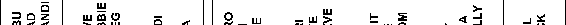
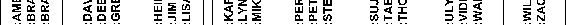
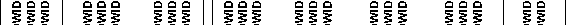
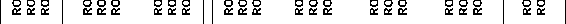

# 第 18 章 ■ 对象管理

##### 18-3. 移动表

### 问题
你需要将一个表移动到不同的表空间。

### 解决方案
使用 `ALTER TABLE MOVE` 语句将表从一个表空间移动到另一个表空间。此示例将 `PARTIES` 表移动到 `MTS` 表空间。
```sql
alter table parties move tablespace mts;
```
你可以通过查询 `USER_TABLES` 来验证表是否已移动：
```sql
select table_name, tablespace_name from user_tables where table_name='PARTIES';
```
```
TABLE_NAME           TABLESPACE_NAME
-------------------- --------------------
PARTIES              MTS
```

### 工作原理
有时你需要将表从一个表空间移动到另一个表空间。可能存在管理问题，或者表的使用方式与最初预期不同，出于组织上的考虑，将表放在不同的表空间更合理。

当你移动一个表时，它的所有索引都会变得不可用。这是因为表的索引结构中包含 `ROWID`。表的 `ROWID` 包含有关物理位置的信息。由于当表从一个表空间移动到另一个表空间时，表的 `ROWID` 会发生变化（因为表行现在物理上位于不同的数据文件中），表上的任何索引都包含不正确的信息。要重建索引，请使用 `ALTER INDEX ... REBUILD` 命令。

#### Oracle Rowid
每个表中的每一行都有一个地址。行的地址由以下组合确定：
* 数据文件号
* 块号
* 行在块内的位置
* 对象号

可以通过查询 `ROWID` 伪列来显示表中某一行的地址。例如：
```sql
select rowid, emp_id from emp;
```
这是一些示例输出：
```
ROWID              EMP_ID
------------------ ----------
AAAFWXAAFAAAAlWAAA 1
```
`ROWID` 伪列值并非物理存储在数据库中。Oracle 在你查询时计算其值。`ROWID` 内容显示为 base 64 值，可包含字符 `A-Z`、`a-z`、`0-9`、`+` 和 `/`。你可以通过 `DBMS_ROWID` 包将 `ROWID` 值转换为有意义的信息。

例如，要显示行存储所在的相对文件号，请执行以下语句：
```sql
select dbms_rowid.rowid_relative_fno(rowid), emp_id from emp;
```
这是一些示例输出：
```
DBMS_ROWID.ROWID_RELATIVE_FNO(ROWID) EMP_ID
------------------------------------ ----------
5                                    1
```
`ROWID` 值可用于 SQL 语句的 `SELECT` 和 `WHERE` 子句中。在大多数情况下，`ROWID` 唯一标识一行。但是，不同表中的行可能存储在同一个簇中，因此可能包含具有相同 `ROWID` 的行。

##### 18-4. 重命名对象

### 问题
你的模式中有一个过时的表。在删除该表之前，你想先重命名它，看看是否有人会抱怨无法再访问它。

### 解决方案
使用 `ALTER TABLE ... RENAME` 语句重命名表。此示例将表从 `PRODUCTS` 重命名为 `PRODUCTS_OLD`：
```sql
alter table products rename to products_old;
```
在你确定该表不再被使用后，可以将其删除：
```sql
drop table products_old;
```
> **注意** 有关删除表的完整详细信息，请参见技巧 18-5。

### 工作原理
在 Oracle 中，你可以重命名许多不同的对象，例如：
* 表
* 列
* 索引
* 约束
* 触发器

在删除表之前重命名它是一种常见做法，因为它为你提供了一种快速恢复的方法，以防该表仍在被使用。重命名对象的另一个好理由是确保它符合你的数据库命名标准。

以下是一些简短的示例，展示了如何重命名其他对象类型。以下代码将 `PRODUCTS` 表的列之一从 `PRODUCT_ID` 重命名为 `PRODUCT_NO`：
```sql
alter table products rename column product_id to product_no;
```
下一行将索引从 `PRODID` 重命名为 `PROD_IDX1`：
```sql
alter index prodid rename to prod_idx1;
```
同样地，你可以重命名约束。下一行代码将约束从 `MAST_CON` 重命名为 `MAST_FK1`：
```sql
alter table details rename constraint mast_con to mast_fk1;
```
下一个示例将触发器从 `F_SHIPMENTS_BU_TR1` 重命名为 `F_AU_TR2`：
```sql
alter trigger f_shipments_bu_tr1 rename to f_au_tr2;
```
请注意，在同一个模式中创建两个同名的对象是可能的。例如，你可以在同一个模式中创建一个表和一个索引，并赋予它们相同的名称。但是，你不能在同一个模式中创建一个表和一个视图并赋予它们相同的名称。

要理解哪些对象可以在模式内以相同名称创建（或哪些不能），你必须理解命名空间的概念。*命名空间* 是模式内对象的分组，其中不能有两个对象具有相同的名称。模式内不同分组（即不同命名空间）中的对象可以具有相同的名称。

以下对象在模式内共享相同的命名空间：
* 表
* 视图
* 物化视图
* 私有同义词
* 序列
* 存储过程
* 函数
* 包
* 用户定义类型

以下每个对象在模式内都有自己的命名空间：
* 索引
* 约束
* 触发器
* 簇
* 私有数据库链接
* 维度

因此，创建一个与函数或过程同名的触发器是可能的。然而，表和视图位于同一个命名空间中，因此不能同名。每个模式对于其拥有的对象都有自己的命名空间。因此，两个不同的模式可以创建同名的表。

这些对象在数据库中各自拥有自己的命名空间：
* 角色
* 公共同义词
* 公共数据库链接
* 表空间
* 配置文件
* 初始化文件 (`spfile` 和 `init.ora`)


因为之前对象的命名空间不包含在模式内，所以这些对象必须在整个数据库中具有唯一的名称。

[www.it-ebooks.info](http://www.it-ebooks.info/)

## 第 18 章 ■ 对象管理

##### 18-5. 删除表

#### 问题

你想从用户中移除一个对象，例如表。

#### 解决方案

使用 `DROP TABLE` 语句来删除表。此示例删除了一个名为 `INVENTORY` 的表：
```sql
drop table inventory;
```
你应该会看到以下确认信息：
```sql
Table dropped.
```
如果你尝试删除一个其主键或唯一键被子表中的外键引用的表，你会看到类似这样的错误：
```sql
ORA-02449: unique/primary keys in table referenced by foreign keys
```
你需要么删除被引用的外键约束，要么在删除父表时使用 `CASCADE CONSTRAINTS` 选项：
```sql
drop table inventory cascade constraints;
```

#### 工作原理

你必须是表的所有者或拥有 `DROP ANY TABLE` 系统权限才能删除表。如果你有 `DROP ANY TABLE` 权限，你可以在表名前加上模式名来删除不同模式中的表：
```sql
drop table inv_mgmt.inventory;
```
如果表名前没有用户名，Oracle 会假定你要删除当前用户中的表。

如果你正在使用 `RECYCLEBIN` 功能，`DROP TABLE` 会在逻辑上将表标记为已删除并重命名它。重命名后的表被放入一个称为 `RECYCLEBIN` 的逻辑容器中。该表会保留在你的 `RECYCLEBIN` 中，直到你手动移除它或 Oracle 需要空间给其他对象。这意味着，与被删除表相关的空间直到你清空 `RECYCLEBIN` 后才会被释放。如果你想清空 `RECYCLEBIN` 的全部内容，请使用 `PURGE RECYCLEBIN` 语句：
```sql
SQL> purge recyclebin;
```

[www.it-ebooks.info](http://www.it-ebooks.info/)

如果你想绕过 `RECYCLEBIN` 功能并永久删除一个表，请使用 `DROP TABLE` 语句的 `PURGE` 选项：
```sql
drop table inventory purge;
```
如果你使用 `PURGE` 选项，表将被永久删除。你将无法使用 `FLASHBACK TABLE` 语句（详情参见配方 18-6）来恢复该表。该表使用的所有空间都会被释放，所有相关的索引和触发器也会被删除。

##### 18-6. 撤消删除表

#### 问题

你不小心删除了一个表，并希望恢复它。

#### 解决方案

首先确认你想要恢复的表是否在回收站中：
```sql
SQL> show recyclebin;
```
```
ORIGINAL NAME RECYCLEBIN NAME OBJECT TYPE DROP TIME
---------------- ------------------------------ ------------ -------------------
PURCHASES BIN$YzqK0hN3Fh/gQHdAPLFgMA==$0 TABLE 2009-02-18:17:23:15
```
接下来，使用 `FLASHBACK TABLE...TO BEFORE DROP` 语句来恢复被删除的表：
```sql
flashback table purchases to before drop;
```
> **注意** 你不能对在 `SYSTEM` 表空间中创建的表执行 `FLASHBACK TABLE...TO BEFORE DROP`。

#### 工作原理

在 Oracle 数据库 10*g* 及更高版本中，当发出 `DROP TABLE` 语句时，表实际上被重命名（重命名为以 `BIN$` 开头的名称）并放入回收站。回收站是一种机制，允许你查看与被删除对象相关联的一些元数据。你可以通过查询 `DBA_SEGMENTS` 来查看有关重命名对象的完整元数据：
```sql
select segment_name, segment_type, tablespace_name
from dba_segments
where segment_name like 'BIN%';
```
```
SEGMENT_NAME SEGMENT_TYPE TABLESPACE_NAME
------------------------------ ------------------ ---------------
BIN$YzqK0hN4Fh/gQHdAPLFgMA==$0 TABLE MTS
```
`FLASHBACK TABLE` 语句只是简单地将表重命名回其原始名称。默认情况下，在 Oracle 数据库 10*g* 及更高版本中，`RECYCLEBIN` 功能是启用的。你可以通过将 `RECYCLEBIN` 初始化参数设置为 `OFF` 来更改默认设置。

我们建议你不要禁用 `RECYCLEBIN` 功能。保持此功能启用并清空 `RECYCLEBIN` 以移除你想要永久删除的对象更安全。如果你想永久删除一个表，请使用 `DROP TABLE` 语句的 `PURGE` 选项。

##### 18-7. 创建索引

#### 问题

你遇到了性能问题。你已经识别出一个用作搜索条件的高选择性列。你想在表上添加一个索引。

#### 解决方案

Oracle 中的默认索引类型是 B 树（平衡树）索引。要在现有表上创建 B 树索引，请使用 `CREATE INDEX` 语句。此示例在 `D_SOURCES` 表上创建了一个索引，指定 `D_SOURCE_ID` 作为列：
```sql
create index d_sources_idx1 on d_sources(d_source_id);
```
默认情况下，Oracle 会尝试在你的默认表空间中创建索引。使用以下语法指示 Oracle 在特定表空间中构建索引：
```sql
create index d_sources_idx1 on d_sources(d_source_id) tablespace dim_index;
```
如果你没有为索引指定任何物理存储属性，索引将从表空间继承其属性。这通常是管理索引存储的一种可接受的方法。

要查看索引元数据信息，请查询 `DBA_INDEXES`、`USER_INDEXES` 或 `ALL_INDEXES` 数据字典视图。例如，此查询显示当前连接用户的所有索引信息：
```sql
select
  table_name
  ,index_name
  ,index_type
  ,tablespace_name
  ,status
from user_indexes
order by table_name;
```

[www.it-ebooks.info](http://www.it-ebooks.info/)

#### 是否重建索引

在过去（大约版本 7 左右），为了性能，DBA 们会定期地重建索引。几乎每个 DBA 都有一个类似于下面列出的脚本，该脚本使用 SQL 为模式生成重建索引所需的 SQL：
```sql
SPO ind_build_dyn.sql
SET HEAD OFF PAGESIZE 0 FEEDBACK OFF;
SELECT 'ALTER INDEX ' || index_name || ' REBUILD;'
FROM user_indexes;
SPO OFF;
SET FEEDBACK ON;
```
然而，对于较新版本的 Oracle，重建索引是否能带来任何形式的性能提升是值得商榷的。更多详情请参考 Oracle 的 My Oracle Support（以前称为 MetaLink）网站。特别是，文档 ID 555284.1 包含一个脚本，用于检测索引是否可能需要重建。

#### 工作原理

索引是一个可选的数据库对象，主要用于提高性能。Oracle 中的索引工作原理很像书末尾的索引，它将页码与感兴趣的信息关联起来。在书中查找信息时，通常先查看索引，然后转到感兴趣的页面要快得多。如果没有索引，你将不得不扫描书的每一页来查找信息。

索引是与表分开的对象，可以独立于表创建和删除。就像表一样，索引需要存储空间。此外，索引会带来一些开销，因为 Oracle 必须在关联表中插入、更新或删除数据时维护索引。因此，只有在你确定索引能提高性能时才应添加索引。有关提高 SQL 查询性能的详细信息，请参见第 19 章。

索引定义与表和列相关联。索引结构存储了行的 `ROWID` 和构建索引所基于的列数据的映射。`ROWID` 通常唯一标识数据库中的一行。`ROWID` 包含物理定位一行的信息（数据文件、块和行在块中的位置）。


默认情况下，当你在 Oracle 中创建索引时，其类型将是平衡的 B-tree 结构。图 18-1 展示了一个在名字列上创建的 B-tree 索引的平衡树状结构。当 Oracle 访问该索引时，它从称为`root block`的顶部节点开始。它使用此块来确定接下来要读取哪个二级块。二级块指向多个叶节点，这些叶节点包含一个`ROWID`和名字值。在此结构中，需要三次 I/O 操作才能找到`ROWID`。一旦确定了`ROWID`，Oracle 将使用它来读取包含该`ROWID`的表块。

[www.it-ebooks.info](http://www.it-ebooks.info/)










