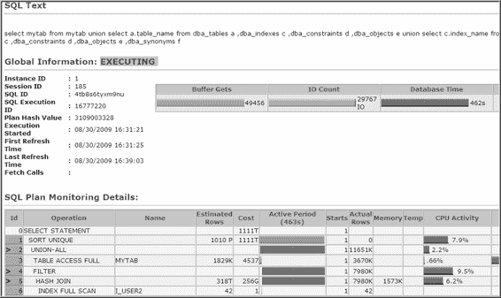

# 第 19 章 ■ SQL 监控与调优

```sql
a.sid
,a.status
,to_char(a.sql_exec_start,'yymmdd hh24:mi') start_time
,a.plan_line_id
,a.plan_operation
,a.plan_options
,a.output_rows
,a.workarea_mem mem_bytes
,a.workarea_tempseg temp_bytes
from v$sql_plan_monitor a
,v$sql_monitor b
where a.status NOT LIKE '%DONE%'
and a.key = b.key
order by a.sid, a.sql_exec_start, a.plan_line_id;
```

以下是部分输出列表（为适应页面显示，内存列已被移除）：

```
SID STATUS START_TIME Plan ID PLAN_OPERATION PLAN_OPTIONS OUTPUT_ROWS
------ --------- ------------ ------- ---------------- ------------- -----------
184 EXECUTING 090326 17:31 0 SELECT STATEMENT 0
1 SORT ORDER BY 0
2 HASH GROUP BY 0
3 HASH JOIN 693940
4 TABLE ACCESS FULL 7
5 TABLE ACCESS FULL 693940
```

你现在可以观察 Oracle 逐步执行执行计划中的每一行，并更新相应的行数、内存使用字节数和临时空间使用字节数。

### 工作原理

在调优 SQL 查询时，你可能想知道执行计划中的哪些步骤消耗了最多的资源。`V$SQL_PLAN_MONITOR`视图提供了使用资源最多的步骤的信息。该视图中的统计信息每秒更新一次。

你还可以使用`DBMS_SQLTUNE`包的`REPORT_SQL_MONITOR`函数，生成关于执行计划中查询进度的实时文本、HTML 或 XML 格式报告。

■ 注意 截至本书撰写时，使用`DBMS_SQLTUNE`包需要额外许可，它是 Oracle 调优包的一部分。

下一个示例演示了如何生成这样的报告。如果你在 SQL*Plus 中运行此命令，请确保使用`SET`命令将变量设置为合适的值，以便查看结果：

[www.it-ebooks.info](http://www.it-ebooks.info/)

```sql
SQL> SET LINES 3000 PAGES 0 LONG 1000000 TRIMSPOOL ON
```

如果你没有向`REPORT_SQL_MONITOR`传递任何参数，Oracle 默认会报告最后监控的查询：

```sql
select dbms_sqltune.report_sql_monitor from dual;
```

这是输出的一小部分：

```
Global Information
Status : DONE (ALL ROWS)
Instance ID : 1
Session ID : 185
SQL ID : 1nzw6bfkm0pry
SQL Execution ID : 16777218
Plan Hash Value : 2855621993
Execution Started : 07/17/2009 15:35:31
First Refresh Time : 07/17/2009 15:35:37
Last Refresh Time : 07/17/2009 15:37:21
| Elapsed | Cpu | IO | Fetch | Buffer | Reads | Writes |
| Time(s) | Time(s) | Waits(s) | Calls | Gets | | |
| 100 | 13 | 86 | 275 | 22827 | 24866 | 6231 |
```

你也可以指示`REPORT_SQL_MONITOR`报告特定的会话 ID 或 SQL ID。此示例报告会话 ID 为 185 的正在被监控的 SQL：

```sql
select dbms_sqltune.report_sql_monitor(session_id=>185) from dual;
```

默认情况下，`REPORT_SQL_MONITOR`生成文本报告。如果你愿意，可以创建 HTML 或 XML 格式的报告。此示例生成 HTML 报告，使用 SQL*Plus 的`SPOOL`命令将输出捕获到一个文件：

```sql
SET LINES 3000 PAGES 0 LONG 1000000 TRIMSPOOL ON
SPOOL out.html
select dbms_sqltune.report_sql_monitor(session_id=>185,
event_detail => 'YES' ,report_level => 'ALL' ,type => 'HTML'
)
from dual;
SPOOL OFF;
```

现在你可以从浏览器打开 HTML 文件，查看如图 19-1 所示的格式良好的图形化报告。

[www.it-ebooks.info](http://www.it-ebooks.info/)



图 19-1. 使用 `DBMS_SQLTUNE.REPORT_SQL_MONITOR` 生成的 HTML 报告

## 19-3. 确定剩余 SQL 工作量

### 问题

一个 SQL 查询已经运行了很长时间，你想知道是否有办法判断它还需要多久才能完成。

### 解决方案

使用`V$SESSION_LONGOPS`视图来近似估算查询剩余的运行时间。要在 SQL*Plus 中查看输出，你需要使用`SET`和`COLUMN`命令来格式化输出。运行以下查询以获取当前正在运行的 SQL 语句进度的估计值：

```sql
SET LINESIZE 141 TRIMSPOOL ON PAGES 66
COL username FORMAT A8 HEAD "User|Name"
```


