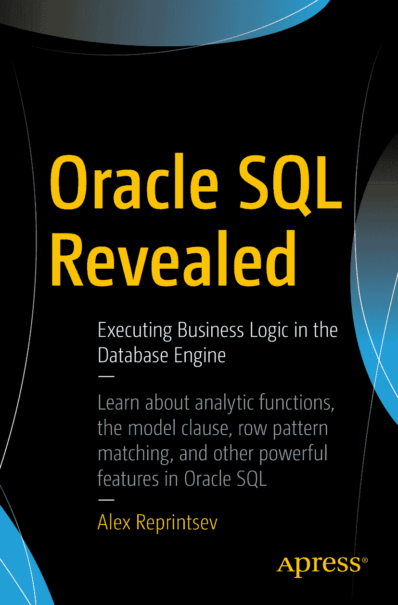

# 亚历克斯·列普里采夫 《Oracle SQL 揭秘：在数据库引擎中执行业务逻辑》

## 作者：亚历克斯·列普里采夫

本书作者引用的任何源代码或其他补充材料，读者均可通过本书产品页面在 GitHub 上获取，地址为 `[www.apress.com/9781484233719`](http://www.apress.com/9781484233719)。如需更详细信息，请访问 `[`www.apress.com/source-code``](http://www.apress.com/source-code)。

ISBN 978-1-4842-3371-9
e-ISBN 978-1-4842-3372-6
`[`doi.org/10.1007/978-1-4842-3372-6``](https://doi.org/10.1007/978-1-4842-3372-6)
国会图书馆控制号：2018937895
© 亚历克斯·列普里采夫 2018

本作品受版权保护。作者保留所有商业权利，无论涉及材料的全部或部分，具体包括翻译、转载、插图重用、朗诵、广播、缩微胶片或其他任何物理方式的复制，以及信息存储和检索、电子改编、计算机软件，或目前已知或未来开发的类似或不同方法的权利。关于这些商业权利，已向出版商授予非独占许可。商标名称、标识和图像可能出现在本书中。我们并非每次出现商标名称、标识或图像时都使用商标符号，而是仅以编辑方式并为了商标所有者的利益而使用这些名称、标识和图像，无侵犯商标之意。本书中使用商品名称、商标、服务标志和类似术语，即使未特别标明，也不应被视为表达这些术语是否受专有权约束的意见。虽然本书中的建议和信息在出版时被认为是真实和准确的，但作者、编辑或出版商均不对可能出现的任何错误或遗漏承担任何法律责任。出版商对本出版物所含材料不作任何明示或暗示的保证。本书采用无酸纸印刷。

本书通过 Springer Science+Business Media New York（地址：233 Spring Street, 6th Floor, New York, NY 10013；电话：1-800-SPRINGER；传真：(201) 348-4505；电子邮件：`orders-ny@springer-sbm.com`；网址：`www.springeronline.com`）面向全球图书贸易发行。Apress Media, LLC 是一家位于加利福尼亚州的有限责任公司，其唯一成员（所有者）是 Springer Science + Business Media Finance Inc (SSBM Finance Inc)。SSBM Finance Inc 是一家特拉华州的公司。

###### 引言

本书的主要目的是描述 SQL 在实现复杂逻辑方面的能力，特别是 Oracle SQL 方言的特定功能。SQL，尤其是 Oracle 方言，是一种极其强大的语言，能够让你用极少的代码以高度可扩展的方式获得结果。

本书面向具有任何关系型 DBMS 工作经验以及基本 SQL 知识的读者。特别是，最好能理解 SQL 是一种声明式语言，因此它描述的是“要获得什么”，而不是“如何获得结果”。同样，了解查询计划是什么以及如何阅读它也是极为可取的。

第一部分详细概述了 Oracle 中用于数据选择的 SQL 功能以及一些基本的 SQL 概念。关于基于成本的优化器的信息被刻意最小化，这样读者就不会陷入细枝末节，而可以专注于实现业务逻辑和理解 SQL 引擎机制的功能。然而，完全跳过某些概念是不可能的，因此有一章专门讨论查询转换。

Oracle 的功能和特性随着版本更新而不断演进，因此有时会提及不同的 Oracle 版本 10g (10.2.0.5)、11g (11.2.0.4) 和 12c (12.1.0.2, 12.2.0.1) 以突出这些变化。Oracle 在引入新功能的同时，也致力于修复现有错误，因此我尽量不提及那些已修复且对于描述 SQL 可能性不重要的错误。非常重要的一点是，要记住 Oracle 的这种演进意味着，5 年、10 年或 15 年前的最佳实践，在新版本上可能根本不是最佳方法。

目标是，一方面提供对功能的全面分析，另一方面最小化页数。因此，几乎每一章的叙述都迅速从基本概念推进到复杂细节。有时读者可能会有疑问，而这些问题将在后续文本中得到解答，所以请继续阅读，希望你能找到所需的说明或更多细节。

本书第二部分涵盖了许多可以使用 Oracle SQL 方言解决的实际任务。有时也提供了 PL/SQL 解决方案，只是为了突显 SQL 当前的限制，或者为了说明即使 SQL 解决方案看起来简洁易懂，从性能角度来看 PL/SQL 可能是更优的选择。你可以在第二部分的第一章中找到许多 `PL/SQL` 优于 `Vanilla SQL` 的实际案例。

我认为没有必要收集那些只需要 PL/SQL 编程的算法测验，因为 PL/SQL 是另一种带有一些面向对象扩展的过程式语言，所以读者可以找到各种关于算法和编程的书籍，并尝试用 PL/SQL 实现这些程序。要了解 PL/SQL 相对于普通过程式语言的优势，请参阅附录中的注释 [8]。此外，PL/SQL 具有许多与 SQL 引擎高效交互的功能，附录中的注释 [9] 可能是一个很好的起点。

## 目录

### 第一部分：特性与原理

#### 第 1 章：连接
- ANSI 连接 6
- 其他类型的连接 10
- Oracle 特定语法 15
- ANSI 语法与 Oracle 原生语法对比 23
- Oracle 原生语法的局限性 23
- 集合解嵌套 36
- 相关内联视图与子查询 39
- ANSI 语法到原生语法的转换 43
- 清晰性与可读性 52
- 混合使用语法 56
- 控制执行计划 60
- ANSI 语法的局限性 61
- 本章小结 65

#### 第 2 章：查询转换
- 本章小结 82

#### 第 3 章：分析函数
- 函数的差异性与可互换性 98
- 本章小结 102

#### 第 4 章：聚合函数
- 透视与逆透视操作符 110
- CUBE、ROLLUP、GROUPING SETS 113
- 本章小结 118

#### 第 5 章：层次查询：CONNECT BY
- 伪列生成详解 135
- 本章小结 138

#### 第 6 章：递归子查询因子化
- 遍历层次结构 146
- 再谈循环检测 151
- 当前实现的局限性 156
- 本章小结 158

#### 第 7 章：MODEL 子句
- 性能简要分析 187
- MODEL 子句的并行执行 193
- 本章小结 197

#### 第 8 章：行模式匹配：MATCH_RECOGNIZE
- 本章小结 216

#### 第 9 章：查询子句的逻辑执行顺序
- 本章小结 233

#### 第 10 章：图灵完备性
- 本章小结 242

### 第二部分：PL/SQL 与 SQL 解决方案

#### 第 11 章：何时 PL/SQL 优于原生 SQL
- 分析函数的特殊性 246
- 提取终止条件 246
- 避免多次排序 264
- 类迭代计算 272
- 当没有高效的内置访问方法时 273
- 组合性质的问题 279
- 连接与子查询的特殊性 287
- 连接的特殊性 288
- 子查询的局限性 299
- 本章小结 303

#### 第 12 章：解决 SQL 趣题
- 转换为十进制数制 305
- 解决方案 305
- 连通分量 308
- 解决方案 310
- 排序依赖 314
- 解决方案 316
- 带偏移的百分位数 320
- 解决方案 320
- 连续的 N 个 1 325
- 解决方案 325
- 下一个值 328
- 解决方案 329
- 下一个分支 332
- 解决方案 333
- 随机子集 342
- 解决方案 342
- 覆盖范围 347
- 解决方案 348
- 齐肯多夫表示法 349
- 解决方案 350
- 最佳路径 356
- 解决方案 357
- 相似性分组 362
- 解决方案 363
- 篮子问题 367
- 解决方案 369
- 最长递增子序列 372
- 解决方案 373
- 奎因 377
- 解决方案 377
- 本章小结 378

## 附录 A：实用 Oracle 链接
- 381

## 索引
- 383

## 关于作者

