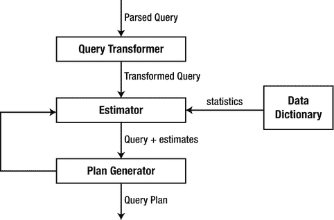

# 第一部分
## 特性与理论

第 1 至 10 章遵循以下 Oracle SQL 特性列表进行组织：

1.  所有连接都可以在查询中隐式指定；但有时使用子查询是有意义的，例如，为了更高效地实现`ANTI`/`EQUI`连接。关联标量子查询可能比外连接更高效，这得益于标量子查询缓存。
2.  查询转换使得两个文本差异很大的查询可能拥有相同的执行计划和性能。另一方面，查询转换并非万能药，有时需要手动重构查询以获得最佳性能。
3.  分析函数是一项宝贵的特性，有助于在不使用连接的情况下实现复杂逻辑。另一方面，它们几乎总是需要排序，这在数据量大的情况下可能成为问题。
4.  聚合函数允许我们对数据进行分组并计算聚合值，同时也可实现一些复杂的扁平化或透视逻辑。
5.  `Connect by`是遍历层次结构或生成列表的最佳工具；然而，尽管内置了处理循环的能力，但当性能至关重要时，不应使用它来遍历图。
6.  递归子查询因子化扩展了遍历层次结构的能力，使得可以引用在上一层级计算的值。当递归子查询因子化用于数据集的迭代转换时，应考虑到每次迭代都会生成一个新的记录集，这会导致大量的内存消耗。与`model`子句相比的一个功能优势是，你可以在每一步计算多个度量。而在`model`子句的情况下，第一个度量会对所有指定行进行计算，然后是第二个，以此类推。
7.  `Model`是最强大的 SQL 特性，但它主要在特定场景下表现出色。`Model`可能需要大量的 CPU 和内存消耗，对于数百万行的数据扩展性不够好；然而，在分区模型的并行执行情况下，性能可以得到显著提升。
8.  行模式匹配为记录集分析增加了显著的灵活性。该特性是唯一能够以可扩展且高效的方式，使用纯 SQL 解决广泛任务范围的方法，此外，对于那些也能用分析函数解决的任务，它还表现出稍好的性能。
9.  一个查询块可能包含各种子句，包括连接、聚合和分析，甚至混合了高级特性，如`model`子句和模式匹配。重要的是要从逻辑角度理解这将如何执行，以及使用内联视图的优缺点。
10. 已证明 SQL 是图灵完备的语言，并且在学术目的上展示了如何使用迭代模型实现任意算法。然而，SQL 是一种声明性语言，是为操作数据而设计的，而不是用于迭代计算。

Tom Kyte 多年来多次写道：“如果可能的话，你应该在单个 SQL 语句中完成。” 我想稍微详细阐述一下这个观点。即使我们不考虑递归子查询因子化、`model`子句、行模式匹配和`connect by`这些高级特性，仍有一些任务使用 PL/SQL 解决会更高效。第 11 章将考虑各种例子来提供更多背景信息。

## 1. 连接

大多数实际查询需要组合来自多个表的数据，而不是只查询单个表。逻辑可以封装在视图中，以向最终用户隐藏复杂性，但数据库无论如何都需要访问多个表来获取结果集。查询结果中并不一定需要包含查询中所有表的数据；例如，某些表可能用于过滤其他表的数据。

来自两个表的数据可以使用`join`（`join`关键字并非必需，后文将展示）、子查询（可以是关联的或非关联的）、横向视图（从`Oracle 12c`开始支持）或集合运算符（`union`/`union all`/`intersect`/`minus`）进行组合。

任何使用集合运算符或子查询实现的逻辑都可以用连接重写，但从性能角度来看，这并不总是最优的。此外，语义上等效的查询在应用查询转换后（详见第 2 章“查询转换”）可能被重写为相同的查询，或者即使未被重写为相同的查询，也可能具有相同的执行计划。在旧版本中，可以使用表运算符来模拟横向视图。

展望未来，让我提一下，一些只使用单个表的查询可能不太容易理解，并且可能包含相当复杂的逻辑，但这种情况比较少见（你可以在第二部分找到很多这样的查询）。

本章涵盖连接（包括 ANSI 和传统的 Oracle 外连接语法）以及有关子查询、横向视图和连接方法的一些细节。


##### ANSI 连接

以下表格将用于演示。

*   交叉连接（也称为笛卡尔积）。它返回两个表行的所有可能组合。

```sql
    select *
    from t1
    cross join t2;
    ID N         ID N
    ---------- - ---------- -
    1 A          2 B
    1 A          0 X
    0 X          2 B
    0 X          0 X
    Listing 1-2
    交叉连接
```

*   内连接 – 一种连接类型，仅返回来自连接表的、满足连接谓词（即谓词计算结果为 `TRUE`）的行。

```sql
    select *
    from t1
    join t2
    on t1.id = t2.id;
    ID N         ID N
    ---------- - ---------- -
    0 X          0 X
    Listing 1-3
    内连接
```

```sql
create table t1(id, name) as
select 1, 'A' from dual union all select 0, 'X' from dual;
create table t2(id, name) as
select 2, 'B' from dual union all select 0, 'X' from dual;
Listing 1-1
用于演示的表
```

在 `join` 关键字之前的表称为“左连接表”，在 `join` 关键字之后的表称为“右连接表”。对于内连接，哪个表是左表、哪个是右表并不重要，因为对于相同的表和连接谓词，结果总是相同的。

谓词不一定总是相等条件；它可以是任何计算结果为 `TRUE`、`FALSE` 或 `UNKNOWN` 的表达式。`UNKNOWN` 的行为几乎与 `FALSE` 相同；如果给定两行的连接谓词计算结果为 `UNKNOWN`，那么它们将不会成为结果集的一部分。然而，如果原子谓词使用 `AND`、`OR`、`NOT` 条件组合，那么当子表达式计算结果为 `UNKNOWN` 而不是 `FALSE` 时，结果可能会不同。例如，`NOT FALSE` 计算结果为 `TRUE`，但 `NOT UNKNOWN` 计算结果为 `UNKNOWN`。

在讨论连接时，“条件”、“谓词”和“标准”这些术语可以互换使用。

并不要求必须在谓词中使用来自两个表的列。“`t1.id > 0`”也是一个有效的连接条件。表 `t2` 的所有行都满足这个条件，而表 `t1` 只有一行满足。

```sql
select *
from t1
join t2
on t1.id > 0;
ID N         ID N
---------- - ---------- -
1 A          2 B
1 A          0 X
Listing 1-4
谓词仅涉及一个表的内连接
```

如果一个连接条件对于一个表中的一行和另一个表中的多行计算结果为 `TRUE`，那么该行将在结果中重复多次。例如，下面示例中的连接条件 “`t1.id <= t2.id`” 对于左连接表中 `id = 0` 的行和右连接表中的两行计算结果为 `TRUE`，因此 `id = 0` 的行在结果中出现了两次。同样的推理也适用于第二张表中 `id = 2` 的行。

*   外连接 – 一种连接类型，返回与内连接相同的行（即，两张表中满足连接条件的行）以及来自左连接表（对于左连接）、右连接表（对于右连接）或两张表（对于全外连接）的、不满足连接条件的行，并在其他表的列位置用 `NULL` 值填充。

```sql
select *
from t1
join t2
on t1.id <= t2.id;
ID N   ID N
---- - ---- -
0 X    0 X
0 X    2 B
1 A    2 B
Listing 1-5
非等值谓词的内连接
```

```sql
select *
from t1
left join t2
on t1.id = t2.id;
ID N         ID N
---------- - ---------- -
0 X          0 X
1 A
Listing 1-6
左外连接
```

```sql
select *
from t1
right join t2
on t1.id = t2.id;
ID N         ID N
---------- - ---------- -
0 X          0 X
2 B
Listing 1-7
右外连接
```

```sql
select *
from t1
full join t2
on t1.id = t2.id;
ID N         ID N
---------- - ---------- -
0 X          0 X
2 B
1 A
Listing 1-8
全外连接
```

在示例 1-6、1-7 和 1-8 中没有使用不必要的 `outer` 关键字，因为关键字 `left`/`right`/`full` 本身就表明了连接是外连接。同样地，如果在连接中未使用 `left`/`right`/`full` 中的任何一个关键字，那么它就是内连接，因此没有意义再使用 `inner` 关键字来明确指定。

通常，开发人员在现实任务中不使用右连接，因为总是可以用左连接来代替，这使得语句更易于理解并提高了可读性。

当查询中连接多个表（数据集）时，Oracle 会先连接前两个表，然后将生成的结果集与第三个数据集连接，依此类推。对于内连接，连接的顺序没有逻辑限制，CBO（基于成本的优化器）可以按任何顺序连接表，而不管表在查询文本中如何列出。对于 ANSI 外连接，查询中连接的顺序很重要——详情请参阅“清晰度与可读性”章节。

##### 其他类型的连接

*   等值连接。如果所有连接条件都包含相等运算符，则该连接称为等值连接；否则称为非等值连接（Theta 连接）。示例 1-3、1-6、1-7 和 1-8 是等值连接的例子。示例 1-4 和 1-5 是非等值连接。

等值连接的一个特例是自然连接。自然连接使用隐式的连接条件，即两张表中同名列（即名称相同的列）上的相等谓词。这引入了潜在的危险，因为如果表结构发生变化，连接条件也可能随之改变。

```sql
select * from t1 natural join t2;
ID N
---------- -
0 X
Listing 1-9
自然连接
```

可以指定自然连接是内连接还是外连接。

```sql
create table t(id, name, dummy) as select 1, 'A', 'dummy' from dual;
select * from t1 natural left join t;
ID N DUMMY
---------- - -----
1 A dummy
0 X
Listing 1-10
外连接形式的自然连接
```

如果两个表中没有共同的列，那么自然连接将有效地成为交叉连接。

另一种基于相同列的等值连接是命名列连接。它允许我们列出所有用于连接条件的列，并且即使在表结构改变后也能保留连接条件。

```sql
select * from t1 join t2 using (id);
ID N N
---------- - -
0 X X
Listing 1-11
命名列连接
```

使用此语法时，共同列仅从一个表中出现在结果中。在示例 1-9 和 1-10 的自然连接情况下也会发生同样的事情。

*   半连接。当使用 “`in (subquery)`” 或 “`exists (correlated subquery)`” 等条件时，会发生这种连接类型。结果只包含来自一个表的列，并且即使子查询中的多行满足条件，也只从该表返回一行。

```sql
    create table t0(id, name) as
    select 0, 'X' from dual union all select 0, 'X' from dual;
    select t1.* from t1 where t1.id in (select id from t0);
    ID N
    ---------- -
    0 X
    select t1.* from t1 where exists (select id from t0 where t1.id = t0.id);
    ID N
    ---------- -
    0 X
    select t1.* from t1 join t0 on t1.id = t0.id;
    ID N
    ---------- -
    0 X
    0 X
    Listing 1-12
    半连接
```

*   反连接。工作方式类似于半连接，但返回在第二张表中没有匹配项的行。当使用谓词 “`not in (subquery)`” 或 “`not exists (correlated subquery)`” 时会出现反连接。如果使用 “`not in`” 且子查询包含 `NULL` 值，则结果将没有行。如果条件对某些行计算结果为 `UNKNOWN` 并且使用 “`not exists`” 条件，那么这些行将不会出现在结果中；但如果子查询表中用于连接的列包含 `NULL` 值，结果不一定为空。这种逻辑差异可以在查询计划操作名称 `HASH JOIN ANTI NA` 中看到。

###### 引言

```
select t1.* from t1 where t1.id not in (select id from t0);
select * from table(dbms_xplan.display_cursor(format => 'basic'));
select t1.* from t1 where not exists (select id from t0 where t1.id = t0.id);
select * from table(dbms_xplan.display_cursor(format => 'basic'));
-----------------------------------
| Id  | Operation          | Name |
-----------------------------------
|   0 | SELECT STATEMENT   |      |
|   1 |  HASH JOIN ANTI NA |      |
|   2 |   TABLE ACCESS FULL| T1   |
|   3 |   TABLE ACCESS FULL| T0   |
-----------------------------------
-----------------------------------
| Id  | Operation          | Name |
-----------------------------------
|   0 | SELECT STATEMENT   |      |
|   1 |  HASH JOIN ANTI    |      |
|   2 |   TABLE ACCESS FULL| T1   |
|   3 |   TABLE ACCESS FULL| T0   |
-----------------------------------
清单 1-13
反连接
```

此处以及后续许多示例中，SQL*PLUS 的输出可能为了可读性和格式化目的而进行了修剪。

某些 SQL 引擎允许我们显式指定 `SEMI`/`ANTI`。例如，Cloudera Impala 有关键字 `left/right semi join`、`left/right anti join`。

```
> select * from t1 left anti join t2 on t1.id = t2.id;
+----+
| id |
+----+
| 1  |
+----+
Fetched 1 row(s)
> select * from t1 right anti join t2 on t1.id = t2.id;
+----+
| id |
+----+
| 2  |
+----+
Fetched 1 row(s)
清单 1-14
Cloudera Impala ANTI 连接语法
```

##### Oracle 特定语法

ANSI 连接语法是在 Oracle 9i 中引入的。在此之前，为了连接表，所有表都必须在 `from` 子句中指定，连接条件则放在 `where` 子句中。Oracle 特定的语法（也称为 Oracle 原生语法）用于外连接的出现要早得多，甚至可以追溯到 Oracle 5 等版本。

清单 1-3 中的内连接可以改写为以下方式，如清单 1-15 所示。

```
select * from t1, t2 where t1.id = t2.id;
清单 1-15
内连接的另一种形式
```

尽管此语句没有关键字 “`join`”，但它完全符合 ANSI 标准。

在支持 ANSI 之前，指定左连接或右连接的唯一方法是使用 Oracle 特定语法。在列名附近使用构造 `(+)` 表示连接是外连接。清单 1-6 和清单 1-7 中的左外连接和右外连接可以用以下方式表达，如清单 1-16 所示。

```
select * from t1, t2 where t1.id = t2.id(+);
select * from t1, t2 where t1.id(+) = t2.id;
清单 1-16
用于左外连接和右外连接的 Oracle 原生语法
```

在第一种情况下，表 `t1` 是内表，表 `t2` 是左外连接表；在第二种情况下，表 `t1` 是右外连接表，表 `t2` 是内表。

全外连接无法使用原生语法以每个表仅使用一次的方式来表达。通常，开发人员会使用 `union all` 组合两个查询来模拟它。

```
select *
from t1, t2
where t1.id = t2.id(+)
union all
select *
from t1, t2
where t1.id(+) = t2.id
and t1.id is null;
清单 1-17
使用 Oracle 原生语法模拟全外连接
```

谈到外连接，理解“连接前谓词”和“连接后谓词”的概念非常重要（Metalink 文档 ID 14736.1）。如前所述，在 ANSI 外连接描述中，如果在外表中没有匹配的行，则结果集中的列将填充 `NULL` 值。连接前谓词和连接后谓词之间的区别在于，连接前谓词在 `NULL` 扩充之前被求值，而连接后谓词在逻辑上是在之后被求值的。换句话说，连接前谓词可视为连接条件，连接后谓词可视为过滤条件。

```
select *
from t1, t2
where t1.id = t2.id(+)
and t2.id is null;
ID N         ID N
---------- - ---------- -
1 A
清单 1-18
Oracle 原生语法中的连接前谓词和连接后谓词
```

清单 1-18 中的表达式 “`t1.id = t2.id(+)`” 是连接前谓词，而 “`t2.id is null`” 是连接后谓词。表 `t1` 中 `id = 1` 的行在连接条件 “`t1.id = t2.id(+)`” 下，没有来自表 `t2` 的匹配行，因此为来自 `t2` 的列填充了 `NULL` 值，之后应用了 “`t2.id is null`” 的过滤。

需要重点提及的是，对内表的过滤谓词可能会（将会）在连接之前应用，但这并不违反连接前谓词和连接后谓词的定义。这是优化的一部分，你可以在第 2 章“查询转换”的末尾找到更多细节，其中提到了“选择”操作。

请分析清单 1-19 中哪些谓词是连接前谓词，哪些是连接后谓词（答案将在代码片段之后给出）。


```sql
create table t3 as
select rownum - 1 id, mod(rownum, 2) sign from dual connect by level <= 3;
```

###### 1) 预连接与后连接谓词示例

```sql
select *
from t3
left join t1
on t1.id = t3.id
order by t3.id;
```

```
ID       SIGN         ID N
---------- ---------- ---------- -
0          1          0 X
1          0          1 A
2          1
```

```sql
select *
from t3
left join t1
on t1.id = t3.id
and t1.id = 1
order by t3.id;
```

```
ID       SIGN         ID N
---------- ---------- ---------- -
0          1
1          0          1 A
2          1
```

```sql
select *
from t3
left join t1
on t1.id = t3.id
where t1.id = 1
order by t3.id;
```

```
ID       SIGN         ID N
---------- ---------- ---------- -
1          0          1 A
```

```sql
select *
from t3, t1
where t1.id(+) = t3.id
and t1.id(+) = 1
order by t3.id;
```

```
ID       SIGN         ID N
---------- ---------- ---------- -
0          1
1          0          1 A
2          1
```

```sql
select *
from t3, t1
where t1.id(+) = t3.id
and t1.id = 1
order by t3.id;
```

```
ID       SIGN         ID N
---------- ---------- ---------- -
1          0          1 A
```

**Listing 1-19 预连接与后连接谓词**

第一个查询简单地演示了左外连接。第三个和第五个查询中的谓词 `“t1.id = 1”` 是后连接谓词，而第二个和第四个查询中类似的谓词是预连接谓词。在第四个查询中，我们使用 `(+)` 将谓词标记为预连接，而在第二个查询中，它是预连接是因为它属于外连接子句的一部分。

预/后连接谓词的概念仅对外连接有意义。外连接的强制性要求是拥有一个包含来自两个表的列，并且在其中一个列旁边有 `(+)` 的谓词。

让我们考虑以下两个查询。

```sql
select *
from t3, t1
where 0 = 0
and t1.id(+) > 1
order by t3.id;
```

```
no rows selected
```

```sql
select *
from t3, t1
where nvl2(t3.id, 0, 0) = nvl2(t1.id(+), 0, 0)
and t1.id(+) > 1
order by t3.id;
```

```
ID       SIGN         ID N
---------- ---------- ---------- -
0          1
1          0
2          1
```

**Listing 1-20 外连接与 `(+)` 的存在性**

第一个查询没有返回行，因为没有指定表之间是外连接。然而，在第二个查询中，通过使用一个总是求值为 `TRUE` 的谓词，明确指定了 `t1` 是左外连接表。

如果表中的某些列被标记了 `(+)` 而其他列没有，那么 Oracle 可能会应用转换 “外连接转内连接转换”（关于查询转换的更多细节将在下一章中找到）。

```sql
select * from t1 left join t2 on t1.id = t2.id where t1.name = t2.name;
select * from t1, t2 where t1.id = t2.id(+) and t1.name = t2.name;
```

**Listing 1-21 转换为内连接的外连接**

在这种情况下使用外连接语法（无论是 ANSI 还是 Oracle 原生语法）是没有意义的，而且可能非常误导人，因此应始终避免。

有时，使用 Oracle 原生语法指定谓词是预连接的可能有点挑战。如果预连接谓词包含两个表或外连接表，那么很容易指定它，如 `Listing 1-19` 中的第四个情况所示。然而，如果预连接谓词只包含内表，那么我们需要使用外连接表的一列来定义谓词的预连接性质。

```sql
select *
from t3
left join t1
on t3.id = t1.id
and t3.sign = 1
order by 1;
```

```
ID       SIGN         ID N
---------- ---------- ---------- -
0          1          0 X
1          0
2          1
```

**Listing 1-22 ANSI 语法中针对内表的预连接谓词**

因此，为了表明针对内表的谓词是预连接的，我们可以使用，例如，外连接表 `rowid` 的技巧。

```sql
select *
from t3, t1
where t3.id = t1.id(+)
and nvl2(t1.rowid(+), t3.sign, null) = 1
order by 1;
```

```
ID       SIGN         ID N
---------- ---------- ---------- -
0          1          0 X
1          0
2          1
```

**Listing 1-23 针对内表的预连接谓词与 `rowid` 技巧**

另一种方法是使用 `case` 表达式（关于这种方法的更多细节可以在下一节“Oracle 原生语法的限制”中找到），对于等值条件，这可以很容易地用 `decode` 来表达。

```sql
select *
from t3, t1
where case when t3.sign = 1 then t3.id end = t1.id(+)
order by 1;
```

```
ID       SIGN         ID N
---------- ---------- ---------- -
0          1          0 X
1          0
2          1
```

```sql
select *
from t3, t1
where decode(t3.sign, 1, t3.id) = t1.id(+)
order by 1;
```

```
ID       SIGN         ID N
---------- ---------- ---------- -
0          1          0 X
1          0
2          1
```

**Listing 1-24 针对内表的预连接谓词与 `case` (`decode`) 表达式方法**

`case` 表达式的左边部分仅在满足条件 `“t3.sign = 1”` 时才求值为 `t3.id`，而表达式的右边部分表明表是外连接的。与使用 `rowid` 的技巧不同，在这种情况下，原始查询中的两个谓词被合并为一个谓词。

##### ANSI 与 Oracle 原生语法

ANSI 语法和原生语法各有优缺点。有些人认为 ANSI 语法是“语法糖”，因为它提高了可读性，但最终查询会被 SQL 引擎转换为原生语法。然而，有两个例外：全连接和外连接分区。这意味着无法通过使用 Oracle 原生语法来实现相同的执行计划。在所有其他情况下，使用 ANSI 语法的查询在原生语法中都有语义等价的形式，并具有相同的查询计划；然而，在 Oracle 12c 之前，使用这种等价形式并非总是可行，因为一些功能对开发人员不可用——特别是 `lateral` 视图。本小节致力于全面比较——ANSI 与 Oracle 原生语法——如果你对这些细节不感兴趣，可以自由跳过比较，直接阅读本章末尾的结论。


##### Oracle 原生语法的限制

1.  `IN`、`OR` 条件不允许出现在预连接谓词中。清单 1-25 中的查询在 Oracle 10g 中失败，但从 Oracle 11g 开始可以正常工作。一个可能的解决方法是使用 `case 表达式`。

    ```
        select *
        from t1, t2
        where t1.id = t2.id(+)
        and t2.id(+) in (1, 2, 3);
        and t2.id(+) in (1, 2, 3)
        *
        ERROR at line 4:
        ORA-01719: outer join operator (+) not allowed in operand of OR or IN
        select *
        from t1, t2
        where t1.id = t2.id(+)
        and case when t2.id(+) in (1, 2, 3) then 1 end = 1;
        ID N         ID N
        ---------- - ---------- -
        1 A
        0 X
        Listing 1-25
        In-predicate in Oracle 10g
    ```

    清单 1-26 中的查询在 Oracle 10g 中可以正常工作，并且如果 `t2.id` 是整数，则它与原始查询等效。

    ```
        select *
        from t1, t2
        where t1.id = t2.id(+)
        and t2.id(+) between 1 and 3
        Listing 1-26
        Between-predicate
    ```

    一些带有 `IN 谓词` 的查询在所有版本（包括 Oracle 11gR2 和 Oracle12cR2）中都会因 `ORA-01719` 而失败。在这种情况下，`case 表达式` 也可能是一个解决方法。

    ```
        select * from t1 left join t2 on t2.id in (t1.id - 1, t1.id + 1);
        ID N         ID N
        ---------- - ---------- -
        0 X
        1 A          0 X
        1 A          2 B
        select * from t1, t2 where t2.id(+) in (t1.id - 1, t1.id + 1);
        select * from t1, t2 where t2.id(+) in (t1.id - 1, t1.id + 1)
        *
        ERROR at line 1:
        ORA-01719: outer join operator (+) not allowed in operand of OR or IN
        select *
        from t1, t2
        where case when t2.id(+) in (t1.id - 1, t1.id + 1) then 1 end = 1;
        Listing 1-27
        In-predicate in Oracle 11g, 12c
    ```

    一个 Oracle 12c 查询可以使用相关联的内联视图重写。关键字 `“lateral”` 用于此目的。

    ```
        select *
        from t1,
        lateral (select *
        from t2
        where t2.id = t1.id - 1
        or t2.id = t1.id + 1)(+) v;
        Listing 1-28
        Lateral view workaround for in-predicate
    ```

    Oracle 优化器团队对 `lateral view` 的定义如下：`lateral view` 是一个内联视图，其中包含一个引用 `FROM` 子句中位于其之前的其他表的相关性。在 Oracle 12c 中，也添加了支持相关性的 `ANSI` 语法，用于交叉连接 (`cross apply`) 和外连接 (`outer apply`)。

    ```
        select *
        from t1
        outer apply (select *
        from t2
        where t2.id = t1.id - 1
        or t2.id = t1.id + 1) v
        Listing 1-29
        ANSI syntax for lateral views
    ```

    以下示例在所有支持 `ANSI` 的 Oracle 版本中也会因 `ORA-01719` 而失败。

    ```
        select *
        from t1
        left join t2
        on t1.id = t2.id
        or t1.id = 1;
        ID N         ID N
        ---------- - ---------- -
        0 X          0 X
        1 A          0 X
        1 A          2 B
        select * from t1, t2 where t1.id = t2.id(+) or t1.id = 1;
        select * from t1, t2 where t1.id = t2.id(+) or t1.id = 1
        *
        ERROR at line 1:
        ORA-01719: outer join operator (+) not allowed in operand of OR or IN
        Listing 1-30
        Another example of in-predicate in Oracle 11g, 12c
    ```

    解决方法是相同的——`case 表达式` 或 `lateral/outer apply`。如果谓词是使用合取 (`AND`) 而不是析取 (`OR`) 组合的，则更容易用 `case 表达式` 解释技巧的本质。

    ```
        select *
        from t1, t2
        where t1.id = t2.id(+) and t1.id = 1;
        ID N         ID N
        ---------- - ---------- -
        1 A
        select *
        from t1, t2
        where t1.id = t2.id(+) and t1.id = nvl2(t2.id(+), 1, 1);
        ID N         ID N
        ---------- - ---------- -
        0 X
        1 A
        select *
        from t1, t2
        where case when t1.id = t2.id(+) and t1.id = 1 then 1 end = 1;
        ID N         ID N
        ---------- - ---------- -
        0 X
        1 A
        Listing 1-31
        Conjunction predicates
    ```

    谓词 «`t1.id = 1`» 在第一种情况中是后连接的，在第二种情况中使用了 `nvl2` 技巧来指定与 1 的比较是预连接谓词；最后，使用 `case 表达式` 来指定谓词的不可分离性：一个 `case` 中的一个条件不能是预连接的而另一个是后连接的。现在我们来看析取谓词。

    ```
        select *
        from t1
        left join t2
        on t1.id = t2.id
        or t1.id = 1;
        ID N         ID N
        ---------- - ---------- -
        0 X          0 X
        1 A          0 X
        1 A          2 B
        Listing 1-32
        Disjunction predicates
    ```

    此查询中的连接条件意味着如果 `t1.id = 1`，则将此行与 `t2` 中的所有行连接；否则执行等值连接。直接转换为原生语法可能如清单 1-33 所示。

    ```
        select *
        from t1, t2
        where t1.id = t2.id(+)
        or t1.id = 1;
        where t1.id = t2.id(+)
        *
        ERROR at line 3:
        ORA-01719: outer join operator (+) not allowed in operand of OR or IN
        Listing 1-33
        Disjunction predicates, native syntax
    ```

    Oracle 不允许你执行此查询；然而我们可能注意到，如果 «`t1.id = 1`» 是后连接的，该查询就没有意义，但 SQL 引擎本不应考虑逻辑含义。因此让我们尝试明确指定两个条件都是预连接谓词，但这种情况下查询也会因 `ORA-01719` 而失败。

    ```
        select *
        from t1, t2
        where t1.id = t2.id(+)
        or t1.id = nvl2(t2.id(+), 1, 1);
        Listing 1-34
        Disjunction, pre-join predicates, native syntax
    ```

    最后，如果我们使用 `case 表达式`，它有助于指定条件的不可分离性并获得期望的结果。

    ```
        select *
        from t1, t2
        where case when t1.id = 1 or t1.id = t2.id(+) then 1 end = 1;
        ID N         ID N
        ---------- - ---------- -
        0 X          0 X
        1 A          0 X
        1 A          2 B
        Listing 1-35
        Disjunction, case-expression workaround
    ```

2.  预连接谓词不能包含标量子查询（此限制在 Oracle 12c 中已移除）。

    ```
        select *
        from t3
        left join t1
        on t1.id = t3.id
        and t1.id = (select count(*) from dual)
        order by t3.id;
        ID         ID N
        ---------- ---------- -
        1          1 A
        select *
        from t3, t1
        where t1.id(+) = t3.id
        and t1.id(+) = (select count(*) from dual)
        order by t3.id;
        order by t3.id
        *
        ERROR at line 5:
        ORA-01799: a column may not be outer-joined to a subquery
        Listing 1-36
        Pre-join predicates containing scalar subqueries
    ```

    可以应用以下解决方法之一：
    *   带有标量子查询过滤器的内联视图
    *   `select` 列表中带有标量子查询的内联视图
    *   将 `t1` 外连接到 `t3` 和标量子查询（从 12c 开始工作；否则会因 `ORA-01417` 失败）

    ```
        select t3.id, v.id, v.name
        from t3,
        (select id, name from t1 where t1.id = (select count(*) from dual)) v
        where t3.id = v.id(+)
        order by t3.id;
        select t3.id, t1.id, t1.name
        from (select t3.*, (select count(*) from dual) cnt from t3) t3, t1
        where t3.id = t1.id(+)
        and t3.cnt = t1.id(+)
        order by t3.id;
        select t3.id, t1.id, t1.name
        from t3, t1, (select count(*) cnt from dual) v
        where t3.id = t1.id(+)
        and v.cnt = t1.id(+)
        order by t3.id;
        Listing 1-37
        Workarounds for outer join with predicate containing scalar subqery
    ```

3.  一个表最多只能与另一个表进行外连接（此限制在 Oracle 12c 中已移除）。

    ```
        select *
        from t1, t2, t t3
        where t1.id = t2.id
        and t1.id = t3.id(+)
        and t2.name = t3.name(+);
        and t1.id = t3.id(+)
        *
        ERROR at line 4:
        ORA-01417: a table may be outer joined to at most one other table
        Listing 1-38
        Table outer joined with two tables. Native syntax
    ```


内联视图可以作为一种变通方案使用（请参阅清单 1-40 中适用于 Oracle 11g 的转换后查询）。ANSI 语法可能如下所示。

```
select *
from t1
join t2
on t1.id = t2.id
left join t t3
on t1.id = t3.id
and t2.name = t3.name;
ID N         ID N         ID N DUMMY
---------- - ---------- - ---------- - -----
0 X          0 X
Listing 1-39
与两个表进行外连接的表。ANSI 语法
```

如果我们检查 ANSI 语法的转换后查询，那么 Oracle 11g 将创建一个额外的内联视图（非横向视图），其中联接了 `t1` 和 `t2`，而 Oracle 12c 的查询将如上所示采用原生语法。转换后的查询如下所示（有关如何查看转换后查询的详细信息将在下一章“查询转换”中提供）。

```
11g
select "from$_subquery$_003"."ID"   "ID",
"from$_subquery$_003"."NAME" "NAME",
"from$_subquery$_003"."ID"   "ID",
"from$_subquery$_003"."NAME" "NAME",
"T3"."ID"                    "ID",
"T3"."NAME"                  "NAME",
"T3"."DUMMY"                 "DUMMY"
from (select "T1"."ID"   "ID",
"T1"."NAME" "NAME",
"T2"."ID"   "ID",
"T2"."NAME" "NAME"
from "T1" "T1", "T2" "T2"
where "T1"."ID" = "T2"."ID") "from$_subquery$_003",
"T" "T3"
where "from$_subquery$_003"."NAME" = "T3"."NAME"(+)
and "from$_subquery$_003"."ID" = "T3"."ID"(+)
12c
select "T1"."ID"    "ID",
"T1"."NAME"  "NAME",
"T2"."ID"    "ID",
"T2"."NAME"  "NAME",
"T3"."ID"    "ID",
"T3"."NAME"  "NAME",
"T3"."DUMMY" "DUMMY"
from "T1" "T1", "T2" "T2", "T" "T3"
where "T1"."ID" = "T3"."ID"(+)
and "T2"."NAME" = "T3"."NAME"(+)
and "T1"."ID" = "T2"."ID"
Listing 1-40
两个表联接的转换后查询
```

本节最后一个详细示例更多是关于原生联接的特性，而非其局限。如果一个表与另一个表作为内表联接，同时与第三个表作为外表联接，那么如何指定仅包含该表列的谓词可能就不那么显而易见了。因此，在下面的示例中，表 `t2` 与 `t1` 作为外表联接，与 `t3` 作为内表联接，问题是：如何在原生语法中指定谓词“`tt2.name is not null`”。

```
create table tt1 as select 'name' || rownum name from dual connect by level <= 3;
create table tt2 as select 'x_name' || rownum name from dual connect by level <= 2;
create table tt3 as select 'y_x_name' || rownum name from dual;
select tt1.name, tt2.name, tt3.name
from tt1
left join tt2
on tt2.name like '%' || tt1.name || '%'
left join tt3
on tt3.name like '%' || tt2.name || '%'
and tt2.name is not null;
NAME       NAME       NAME
---------- ---------- ----------
name1      x_name1    y_x_name1
name2      x_name2
name3
Listing 1-41
内/外联接表
```

如果我们尝试使用原生语法，那么无论我们是否对“`tt2.name is not null`”使用 `(+)`，都会得到错误的结果。

```
select tt1.name, tt2.name, tt3.name
from tt1, tt2, tt3
where tt2.name(+) like '%' || tt1.name || '%'
and tt3.name(+) like '%' || tt2.name || '%'
and tt2.name is not null;
NAME       NAME       NAME
---------- ---------- ----------
name1      x_name1    y_x_name1
name2      x_name2
select tt1.name, tt2.name, tt3.name
from tt1, tt2, tt3
where tt2.name(+) like '%' || tt1.name || '%'
and tt3.name(+) like '%' || tt2.name || '%'
and tt2.name(+) is not null;
NAME       NAME       NAME
---------- ---------- ----------
name1      x_name1    y_x_name1
name2      x_name2
name3                 y_x_name1
Listing 1-42
内/外联接表与原生语法
```

为了明确指定该条件是针对 `t2` 和 `t3` 的联接前谓词，我们可以使用“Oracle 特有语法”一节中描述的方法。

```
nvl2(tt2.name, 0, null) = nvl2(tt3.rowid(+), 0, 0)
```

因此，该谓词表明 `t3` 是与 `t2` 进行外连接的，并且如果“`tt2.name`“不为 null，则它计算为 TRUE。

考虑到查询的具体情况，我们可以将下面的谓词

```
and tt3.name(+) like '%' || tt2.name || '%'
and nvl2(tt2.name, 0, null) = nvl2(tt3.rowid(+), 0, 0)
```

合并成一个

```
and tt3.name(+) like nvl2(tt2.name, '%' || tt2.name || '%', null)
```

适用于 Oracle 12c 的另一个可能的变通方案是使用 `横向视图`；实际上，对于此查询，Oracle 在从 ANSI 语法转换后，为所有版本都创建了一个 `横向视图`。


##### 展开集合与关联查询

###### 展开集合

让我们考虑一个包含嵌套表列的表。

```sql
create or replace type numbers as table of number
/
create table tc (id int, nums numbers) nested table nums store as nums_t
/
insert into tc
select -1 id, numbers(null) nums from dual
union all select 0 id, numbers() nums from dual
union all select 1 id, numbers(1) nums from dual
union all select 2 id, numbers(1,2) nums from dual;
```
**代码清单 1-43** 包含嵌套表列的表

如果我们需要在子表非空时展开它，可以使用以下方法之一。

```sql
select tc.id, x.column_value
from tc, table(tc.nums) x -- 1
--from tc, lateral(select * from table(tc.nums)) x -- 2
--from tc cross apply (select * from table(tc.nums)) x -- 3
--from tc cross join table(tc.nums) x -- 4
;
ID COLUMN_VALUE
---------- ------------

1            1
2            1
2            2
```
**代码清单 1-44** 展开嵌套表

第二种和第三种方法从 Oracle 12c 开始有效。

让我们把逻辑弄得更复杂一点：我们需要展开表，并且即使嵌套表为空也要返回那些行。

```sql
select tc.id, x.column_value
from tc, table(tc.nums)(+) x -- 1
--from tc, lateral(select * from table(tc.nums))(+) x -- 2
--from tc cross apply (select * from table(tc.nums))(+) x -- 3
--from tc outer apply (select * from table(tc.nums)) x -- 4
--from tc, table(tc.nums) x where nvl2(x.column_value(+), 0, 0) = nvl2(tc.id, 0, 0) -- 5
--from tc left join table(tc.nums) x on nvl2(x.column_value, 0, 0) = nvl2(tc.id, 0, 0) -- 6
;
ID COLUMN_VALUE
---------- ------------

1            1
2            1
2            2
```
**代码清单 1-45** 展开嵌套表并保留其中为空的行

关于这种方法有几个重要的注意事项：

*   混合使用 `cross apply` 和 `(+)` 的语法能得到正确结果，但这并未文档化，应避免使用。
*   在选项 #5 和 #6 中使用了包含两个表的永真谓词。选项 #5 在 Oracle 12cR1 之前的所有版本中由于错误返回了不正确的结果（缺少 `id = 0` 的行）。在 Oracle 12cR2 上，所有选项都返回原始表中的所有行以及展开后的行。

如果嵌套表未被存储，那么在所有版本（包括 Oracle 12cR2）中，选项 #6 都会返回不正确的结果。

```sql
with tc as
(select -1 id, numbers(null) nums from dual
union all select 0 id, numbers() nums from dual
union all select 1 id, numbers(1) nums from dual
union all select 2 id, numbers(1,2) nums from dual)
select tc.id, x.column_value
from tc left join table(tc.nums) x on nvl2(x.column_value, 0, 0) = nvl2(tc.id, 0, 0);
ID COLUMN_VALUE
---------- ------------

1            1
2            1
2            2
```
**代码清单 1-46** 尝试使用 ANSI 外连接展开表

对此行为的一个描述是 Bug 20363558：对嵌套表进行 ANSI 连接返回错误结果。

对于 12c 之前的版本，ANSI 语法的一种可能解决方法如下：

```sql
select tc.id, x.column_value
from tc cross join table(case when cardinality(tc.nums) = 0 then numbers(null) else tc.nums end) x
```
**代码清单 1-47** 在 12c 之前的版本上使用 ANSI 语法展开表

如果我们使用嵌套可变数组（varray）而不是嵌套表，例如：

```sql
create or replace type num_array as varray(32767) of number
/
create table tc (id int, nums num_array)
/
```
**代码清单 1-48** 嵌套可变数组

无论可变数组是存储的还是动态构造的，选项 #6 的结果都将是错误的。

因此，如果我们使用外部关联表操作符——`table(…)(+)` 或 Oracle 12c 的 `apply` 语法，查询会返回正确结果。另一方面，如果我们尝试使用外连接（包括 ANSI 和原生语法），并且无论嵌套表/可变数组是否持久化，查询都可能返回不正确的结果。

###### 关联内联视图与子查询

之前已经多次演示了如何使用 `lateral`/`apply` 关键字来实现关联内联视图。在 12c 之前，可以通过表操作符和 `cast` + `multiset`/`collect` 实现类似功能（Oracle 11g 中一个未文档化的选项是 `event 22829`）。这种方法明显的缺点是需要为集合创建 SQL 类型。

如果我们需要为每一行生成行数等于 `id` 的行，那么对于 Oracle 12c，可以使用以下方法。

```sql
select t3.id, v.idx
from t3,
lateral (select rownum idx
from dual
where rownum <= t3.id
connect by rownum <= t3.id)(+) v;
select t3.id, v.idx
from t3
outer apply (select rownum idx
from dual
where rownum <= t3.id
connect by rownum <= t3.id) v;
```
**代码清单 1-49** 关联内联视图，12c

在 Oracle 12c 之前，可以按照代码清单 1-50 所示实现。

```sql
select t3.id, v.column_value idx
from t3,
table(cast(multiset (select rownum
from dual
where rownum <= t3.id
connect by rownum <= t3.id) as sys.odcinumberlist))(+) v;
select t3.id, v.column_value idx
from t3,
table (select cast(collect(rownum) as sys.odcinumberlist)
from dual
where rownum <= t3.id
connect by rownum <= t3.id)(+) v;
```
**代码清单 1-50** 关联内联视图，11g

基于性能原因，`cast` + `multiset` 的选项更可取。

在所有情况下，结果如下：

```sql
ID        IDX
---------- ----------

1          1
2          1
2          2
```

严格来说，在 Oracle 12c 之前，我们使用的是外部关联表操作符，而不是内联视图。

对于 Oracle 12c 之前的版本，关联子查询（表操作符和 `cast` + `multiset`/`collect`）的另一个限制是关联名称的可见性仅限于一层深度。在下面的例子中，`m2`、`m4`、`m5` 只能在 Oracle 12c 中计算（所有表达式在逻辑上是等价的）。

```sql
select id,
greatest((select min(id) mid from t3 where t3.id > t.id), 1) m1,
(select max(mid)
from (select min(id) mid
from t3
where t3.id > t.id
union
select 1 from dual) z) m2,
(select max(value(v))
from table(cast(multiset (select min(id) mid
from t3
where t3.id > t.id
union
select 1 from dual) as sys.odcinumberlist)) v) m3,
(select max(value(v))
from table (select cast(collect(mid) as sys.odcinumberlist) col
from (select min(id) mid
from t3
where t3.id > t.id
union
select 1 from dual) z) v) m4,
(select value(v)
from table(cast(multiset (select max(mid)
from (select min(id) mid
from t3
where t3.id > t.id
union
select 1 from dual) z) as
sys.odcinumberlist)) v) m5
from t3 t
where t.id = 1;
ID        M1        M2        M3        M4        M5
---------- ---------- ---------- ---------- ---------- --------
1         2         2         2         2         2
```
**代码清单 1-51** 表达式中主表列的可见性

并不总是可能将（标量）子查询简化为只有一层深度；对于 Oracle 12 之前的版本，在这种情况下一种可能的解决方法是将逻辑封装在 UDF 中，然后在选择列表中指定它，或者重写查询使用显式连接代替（标量）子查询。在 Oracle 12c 中，标量子查询也应谨慎使用，因为有时它们可能会被 SQL 引擎错误地或低效地转换。

本节最后一个重点——`lateral`/`apply` 不允许像 `collect`/`multiset` 那样灵活的关联。例如，无法指定从主表的列开始。如果我们取消注释 “`t1.id`”，代码清单 1-52 中的最后一个查询将因 “ORA-00904: "T1" . "ID": invalid identifier” 而失败。

```sql
select t1.*,
l.*
from t1,
table(cast(multiset (select id
from t3
start with t3.id = t1.id
connect by prior t3.id + 1 = t3.id) as numbers)) l;
select t1.*, l.*
from t1,
table (select cast(collect(id) as numbers)
from t3
start with t3.id = t1.id
connect by prior t3.id + 1 = t3.id) l;
select t1.*, l.*
from t1,
lateral (select id
from t3
start with t3.id = 0 -- t1.id
connect by prior t3.id + 1 = t3.id) l;
```
**代码清单 1-52** 表表达式和 lateral 视图中主表列的可见性

##### ANSI 转原生语法转换

让我们使用以下表和查询来演示转换过程。

```sql
create table fact as (select 1 value, 1 dim_1_id, 1 dim_2_id, 'A' type from dual);
create table dim_1 as (select 1 id, 1 dim_n_id from dual);
create table dim_n as (select 1 id, 1 value from dual);
create table map as (select 1 value, 'DETAILED VALUE' category from dual);
select fact.*, map.*
from fact
join dim_1
on dim_1.id = fact.dim_1_id
join dim_n
on dim_1.dim_n_id = dim_n.id
left join map
on fact.type in ('A', 'B', 'C')
and ((map.category = 'FACT VALUE' and map.value = fact.value) or
(map.category = 'DETAILED VALUE' and map.value = dim_n.value));
```

*清单 1-53：用于演示 ANSI 到原生语法转换的表和查询*

```sql
select "FACT"."VALUE"               "VALUE",
"FACT"."DIM_1_ID"            "DIM_1_ID",
"FACT"."DIM_2_ID"            "DIM_2_ID",
"FACT"."TYPE"                "TYPE",
"VW_LAT_3C55142F"."ITEM_1_0" "VALUE",
"VW_LAT_3C55142F"."ITEM_2_1" "CATEGORY"
from "FACT" "FACT",
"DIM_1" "DIM_1",
"DIM_N" "DIM_N",
lateral((select "MAP"."VALUE" "ITEM_1_0", "MAP"."CATEGORY" "ITEM_2_1"
from "MAP" "MAP"
where ("FACT"."TYPE" = 'A' or "FACT"."TYPE" = 'B' or
"FACT"."TYPE" = 'C')
and ("MAP"."CATEGORY" = 'FACT VALUE' and
"MAP"."VALUE" = "FACT"."VALUE" or
"MAP"."CATEGORY" = 'DETAILED VALUE' and
"MAP"."VALUE" = "DIM_N"."VALUE")))(+) "VW_LAT_3C55142F"
where "DIM_1"."DIM_N_ID" = "DIM_N"."ID"
and "DIM_1"."ID" = "FACT"."DIM_1_ID"
```

*清单 1-54：转换为原生语法后的查询*

这里的关键点是，Oracle 创建了一个**不可合并的横向视图**。逻辑上等效的原生语法查询可以实现为以下形式（在 Oracle 12c 之前的版本中，由于 `map` 表无法同时与 `fact` 和 `dim_n` 进行外连接，查询会因 “ORA-01417: a table may be outer joined to at most one other table” 而失败，因此无法在不使用额外内联视图的情况下实现查询）。

```sql
select *
from (select fact.*, dim_n.value as value_1
from fact, dim_1, dim_n
where dim_1.id = fact.dim_1_id
and dim_1.dim_n_id = dim_n.id) sub,
map
where case when decode(map.rowid(+), map.rowid(+), sub.type) in ('A', 'B', 'C') then 1 end = 1
and decode(map.category(+), 'FACT VALUE', sub.value, 'DETAILED VALUE', sub.value_1) = map.value(+);
```

*清单 1-55：手动重写为原生语法的查询*

ANSI 版本具有更好的可读性，但在原生语法情况下，Oracle 不会创建不可合并的关联内联视图，这使我们能够获得更好的性能，因为 SQL 引擎在这些情况下可以使用 `HASH JOIN`。这种连接方法对于横向视图是不可能的。

##### 关于谓词形式的重要说明

一个非常重要的点是，如果我们使用与原生语法形式相同的谓词用于 ANSI 语法，那么就不会创建横向视图。

```sql
select fact.*, map.*
from fact
join dim_1
on dim_1.id = fact.dim_1_id
join dim_n
on dim_1.dim_n_id = dim_n.id
left join map
on case when decode(map.rowid, map.rowid, fact.type) in ('A', 'B', 'C') then 1 end = 1
and decode(map.category, 'FACT VALUE', fact.value, 'DETAILED VALUE', dim_n.value) = map.value
```

*清单 1-56：从原生语法复制了谓词的 ANSI 语法*

上面的查询被转换为以下形式，查询计划中不存在 `VIEW` 操作，这意味着查询中存在不可合并的视图。

```sql
select "FACT"."VALUE"    "VALUE",
"FACT"."DIM_1_ID" "DIM_1_ID",
"FACT"."DIM_2_ID" "DIM_2_ID",
"FACT"."TYPE"     "TYPE",
"MAP"."VALUE"     "VALUE",
"MAP"."CATEGORY"  "CATEGORY"
from "FACT"  "FACT",
"DIM_1" "DIM_1",
"DIM_N" "DIM_N",
"MAP"   "MAP"
where case when decode("MAP".ROWID(+), "MAP".ROWID(+), "FACT"."TYPE") in ('A', 'B', 'C') then 1 end = 1
and "MAP"."VALUE"(+) = decode("MAP"."CATEGORY"(+), 'FACT VALUE', "FACT"."VALUE", 'DETAILED VALUE', "DIM_N"."VALUE")
and "DIM_1"."DIM_N_ID" = "DIM_N"."ID"
and "DIM_1"."ID" = "FACT"."DIM_1_ID"
```

*清单 1-57：修正了谓词的 ANSI 版本转换后查询*

ANSI 到原生语法的转换从一个 Oracle 版本到另一个版本持续演进，一些查询在转换后即使在旧版本中会导致横向视图创建，现在也不再产生横向视图。

如前所述，`full join` 和 `left/right join partition by` 不会被转换为原生语法。

### 演示 `partition by`

为了演示后者，让我们考虑以下需求。对于表 `“presentation”` 中的每个演讲者，显示所有星期几以及每个星期几的演讲次数。

```sql
create table week(id, day) as
select rownum,
to_char(trunc(sysdate, 'd') + level - 1,
'fmday',
'NLS_DATE_LANGUAGE = English')
from dual
connect by rownum <= 7;
create table presentation(name, day, time) as
select 'John', 'monday', '14' from dual
union all
select 'John', 'monday', '9' from dual
union all
select 'John', 'friday', '9' from dual
union all
select 'Rex', 'wednesday', '11' from dual
union all
select 'Rex', 'friday', '11' from dual;
```

*清单 1-58：用于演示 join partition by 的表*

可以通过使用以下查询来实现结果。

```sql
select p.name, w.day, count(p.time) cnt
from week w
left join presentation p partition by (p.name)
on w.day = p.day
group by p.name, w.day, w.id
order by p.name, w.id;
```
```
NAME DAY              CNT
---- --------- ----------
John monday             2
John tuesday            0
John wednesday          0
John thursday           0
John friday             1
John saturday           0
John sunday             0
Rex  monday             0
Rex  tuesday            0
Rex  wednesday          1
Rex  thursday           0
Rex  friday             1
Rex  saturday           0
Rex  sunday             0
14 rows selected.
```

*清单 1-59：Join partition by*

```sql
select "from$_subquery$_003"."NAME_0" "NAME",
"from$_subquery$_003"."QCSJ_C000000000300000_2" "DAY",
count("from$_subquery$_003"."TIME_4") "CNT"
from (select "P"."NAME" "NAME_0",
"W"."ID"   "ID_1",
"W"."DAY"  "QCSJ_C000000000300000_2",
"P"."DAY"  "QCSJ_C000000000300001",
"P"."TIME" "TIME_4"
from "PRESENTATION" "P" partition by("P"."NAME")
right outer join "WEEK" "W"
on "W"."DAY" = "P"."DAY") "from$_subquery$_003"
group by "from$_subquery$_003"."NAME_0",
"from$_subquery$_003"."QCSJ_C000000000300000_2",
"from$_subquery$_003"."ID_1"
order by "from$_subquery$_003"."NAME_0", "from$_subquery$_003"."ID_1"
```

*清单 1-60：转换后的最终查询*

`“partition by (p.name)”` 意味着将为 `presentation` 表中的每个 `name` 连接 `week` 表的所有行。不使用此功能也可以实现相同的结果，但需要额外的连接。

```sql
select w.name, w.day, count(p.time) cnt
from (select p0.name, w0.*
from (select distinct name from presentation) p0, week w0) w,
presentation p
where w.day = p.day(+)
and w.name = p.name(+)
group by w.name, w.day, w.id
order by w.name, w.id;
```

*清单 1-61：Join partition by 的变通方法*

##### SEMI 与 ANTI 连接

让我们考虑 SEMI 连接 `“select t1.* from t1 where t1.id in (select id from t0)”` 转换后的最终查询

```sql
select "T1"."ID" "ID", "T1"."NAME" "NAME"
from "M12"."T0" "T0", "M12"."T1" "T1"
where "T1"."ID" = "T0"."ID"
```

*清单 1-62：SEMI 连接的转换后查询*

SEMI 连接谓词没有特殊表示法，因此最终查询中的条件看起来像一个简单的等式谓词；然而，原始查询的连接方法是 `HASH JOIN SEMI`（类似的推理也适用于 ANTI 连接）。如果你尝试为转换后的查询构建执行计划，那么连接方法将只是 `HASH JOIN`。因此，在处理转换后的最终查询时需要特别注意——它们只是转换后查询的表示形式，在所有情况下可能与原始查询在语义上并不等效。我们可以通过在 select 列表中添加 `distinct` 和 `t1.rowid` 来获得所需的结果，但性能与 SEMI 连接不同——先连接再在结果上应用 distinct，与为 `t1` 中的每一行查找满足连接条件的一行是不同的。


##### SQL 查询优化

###### 引言

可以为查询指定另一种连接方法（在此例中为`NESTED LOOPS SEMI`），或使用优化器提示完全禁用所有转换。

```sql
select t1.* from t1 where t1.id in (select /*+ use_nl(t0) */ id from t0);
select /*+ no_query_transformation */ t1.* from t1 where t1.id in (select id from t0);
```

在第二种情况下，`Oracle`会对来自`T1`的每一行对`T0`进行全表扫描（如果`T0(id)`上存在索引，则可能是索引访问）以找到第一个匹配项。

```
| Id  | Operation          | Name |
|   0 | SELECT STATEMENT   |      |
|   1 |  FILTER            |      |
|   2 |   TABLE ACCESS FULL| T1   |
|   3 |   TABLE ACCESS FULL| T0   |

Predicate Information (identified by operation id):

1 - filter( EXISTS (SELECT 0 FROM "T0" "T0" WHERE "ID"=:B1))
3 - access("ID"=:B1)
```
*代码清单 1-63*
*禁用转换后的查询计划*

一般情况下，原始查询和转换后查询的计划可能不同，并且如前所述，转换后的最终查询是最终执行内容的类`SQL`表示。

在使用基于成本的优化器（`CBO`）时，外观差异很大的原始查询可能被转换为相同的最终查询，并因查询转换而导致相同的执行计划。

另一方面，在使用基于规则的优化器（`RBO`）最终查询时，查询的编写方式对查询计划有相当大的影响。在这种情况下，查询计划是根据预定义的规则集和非常有限的转换数量构建的。许多连接方法并未为`RBO`实现；特别是，没有`SEMI JOIN`。

```sql
select /*+ rule */ t1.* from t1 where t1.id in (select id from t0);
```

```
| Id  | Operation             | Name     |
|   0 | SELECT STATEMENT      |          |
|   1 |  MERGE JOIN           |          |
|   2 |   SORT JOIN           |          |
|   3 |    TABLE ACCESS FULL  | T1       |
|*  4 |   SORT JOIN           |          |
|   5 |    VIEW               | VW_NSO_1 |
|   6 |     SORT UNIQUE       |          |
|   7 |      TABLE ACCESS FULL| T0       |

Predicate Information (identified by operation id):

4 - access("T1"."ID"="ID")
filter("T1"."ID"="ID")
```
*代码清单 1-64*
*由`RBO`构建时的查询计划*

`CBO`在`Oracle 7.3`中引入，并从那时起得到了极大改进；此外，自`Oracle 10g`起`RBO`已被弃用，`Oracle`不建议在任何情况下使用它。上面的例子是为了说明`RBO`缺少某些连接方法，而且手动重写查询可能不像过去那样重要。

###### 清晰度与可读性

让我们使用一个简单的模型，其中包含一个具有单一维度的两个坐标的事实表。

```sql
create table fact_ as (select 1 value, 1 dim_1_id, 2 dim_2_id from dual);
create table dim_ as (select rownum id, 'name'||rownum name from dual connect by rownum <= 2);
```
*代码清单 1-65*
*用于星型模型的简单模型*

如果需要获取两个坐标的维度属性，可以使用`ANSI`语法完成，如代码清单 1-66 所示。

```sql
select *
from fact_ f
join dim_ d1 on f.dim_1_id = d1.id
join dim_ d2 on f.dim_2_id = d2.id
```
*代码清单 1-66*
*使用`ANSI`连接事实表与维度表*

`ANSI`语法在清晰度和可读性方面的亮点：

1.  每个维度的连接条件被分离到对应的`on`子句中。对于内连接和复杂的连接条件，在`where`子句还是在`on`子句中指定谓词可能并不明显。在这种情况下，下一条规则可能有所帮助：`where`子句应仅包含按事实表进行的过滤。对于外连接，则不需要这样的规则。
2.  对于外连接，不需要创建额外的内联/横向视图。此特性也可能被视为一个缺点，因为可读性导致对查询计划的控制更有问题（另请参见“控制执行计划”部分）。
3.  对连接谓词有额外的验证。只能使用在当前表之前列出的那些表。例如，下面的查询将失败并提示“`ORA-00904: “D2”. “ID”: invalid identifier.`”

```sql
    select *
    from fact_ f
    join dim_ d1 on f.dim_1_id = d2.id
    join dim_ d2 on f.dim_2_id = d2.id
```
*代码清单 1-67*
*`ANSI`语法谓词的验证*

在原生语法的情况下，所有谓词都列在`where`子句中。通过使用内联视图可以获得额外的控制。我们也可以在`where`子句中引入各种谓词指定规范，但如果一个查询包含，比如说，`20`个表的连接，无论如何，这些谓词看起来都会有点混乱。如果我们对内连接使用`ANSI`，可以交叉连接所有表，然后在`where`子句中列出所有谓词，但没有人遵循这种荒谬的方法，因为分离连接条件极大地提高了可读性。
4.  `ANSI`语法为每个谓词明确定义了它所属的特定连接。在原生语法的情况下，并不总是容易指定一个谓词是否只包含一个表（这在“`Oracle`原生语法的限制”部分中已展示）。

`ANSI`语法的灵活性允许我们编写一些不易理解的巧妙查询。我不建议使用这些功能，但了解它们的存在很重要。

因此，在`from`和`join`子句中改变表的顺序可能会影响查询结果。

以下查询的结果不同，因为在第一种情况下，`Oracle`将`t1`与`t2`连接，然后将结果集与`t3`连接，而在第二种情况下，它将`t2`与`t3`连接，然后将结果集与`t1`连接。

```sql
select t1.*, t2.*, t3.*
from t1
full join t2
on t1.id = t2.id
join t3
on t2.id = t3.id
order by t1.id;
```
```
ID N         ID N         ID
---------- - ---------- - ----------
0 X          0 X          0
2 B          2
```

```sql
select t1.*, t2.*, t3.*
from t2
join t3
on t2.id = t3.id
full join t1
on t1.id = t2.id
order by t1.id;
```
```
ID N         ID N         ID
---------- - ---------- - ----------
0 X          0 X          0
1 A
2 B          2
```
*代码清单 1-68*
*更改`ANSI`语法的连接顺序*

然而，可以在不更改查询文本中表的顺序的情况下更改连接的顺序。

```sql
select t1.*, t2.*, t3.*
from t1
full join (t2 join t3 on t2.id = t3.id) on t1.id = t2.id
order by t1.id;
```
```
ID N         ID N         ID
---------- - ---------- - ----------
0 X          0 X          0
1 A
2 B          2
```
*代码清单 1-69*
*在表引用的位置指定连接子句*

如果我们移除括号，这个查询可能看起来更加模糊。尽管如此，此功能是有文档记载的，并且`join_clause`可以在表引用的位置指定。在简单情况下，如下所示：

```sql
-- table_reference in ()
select * from (dual);
-- join_clause in ()
select * from (dual cross join dual);
```
*代码清单 1-70*
*`table_reference` 和 `join_clause`*


###### 混合语法

有些人喜欢使用原生语法，而另一些人则倾向于只使用**ANSI**语法。在极少数情况下，在同一查询的不同层级（或在不同的子查询中）混合使用**ANSI**和原生语法可能是可以接受的。例如，如果团队的开发标准是**ANSI**，但该标准不允许你通过在后台创建内联视图来修复执行计划，或者你遇到了某个**ANSI**的错误或限制（请参阅“**ANSI**的限制”一节），就可能发生这种情况。

更令人惊讶的是，**Oracle**甚至允许你在单个 `from` 子句中混合使用**ANSI**和原生语法。以下示例将演示一些糟糕的实践。我认为任何人都不应该这样使用，但重要的是，如果你遇到这样的查询，要理解发生了什么。

因此，如果你指定了**ANSI**的 `inner join` 并在连接条件中添加了 `(+)` 运算符，那么实际上**Oracle**会将其作为外连接执行。

```
select * from t1 join t2 on t1.id = t2.id(+)
select "T1"."ID"   "ID",
"T1"."NAME" "NAME",
"T2"."ID"   "ID",
"T2"."NAME" "NAME"
from "T1" "T1", "T2" "T2"
where "T1"."ID" = "T2"."ID"(+)
Listing 1-71
混合语法的原始查询与转换后查询
```

让我们继续看 Listing 1-72 中的下一个查询。

```
select *
from t1, t2
left join t3
on t3.id = t2.id + 1;
ID N         ID N         ID
---------- - ---------- - ----------
0 X          0 X          1
1 A          0 X          1
0 X          2 B
1 A          2 B
Listing 1-72
from 子句中的混合语法
```

请注意，表 `t1` 和 `t2` 是使用逗号列出的，而 `t3` 是使用**ANSI**连接添加的。转换后的查询如 Listing 1-73 所示。

```
select "T1"."ID"   "ID",
"T1"."NAME" "NAME",
"T2"."ID"   "ID",
"T2"."NAME" "NAME",
"T3"."ID"   "ID"
from "T1" "T1", "T2" "T2", "T3" "T3"
where "T3"."ID"(+) = "T2"."ID" + 1
Listing 1-73
from 子句中混合语法的转换后查询
```

让我们将所有连接指定为**ANSI**风格，并添加一个额外的条件。

```
select *
from t1
cross join t2
left join t3
on t3.id = t2.id + 1
and t3.id = t1.id;
ID N         ID N         ID
---------- - ---------- - ----------
1 A          0 X          1
0 X          0 X
1 A          2 B
0 X          2 B
Listing 1-74
混合查询被重写为 ANSI 格式并附带额外的谓词
```

如果我们尝试对上述查询使用混合语法，它将失败，这意味着在 `t3` 的 `on` 子句中只有 `t2` 是可见的。

```
select *
from t1, t2
left join t3
on t3.id = t2.id + 1
and t3.id = t1.id;
and t3.id = t1.id
*
ERROR at line 5:
ORA-00904: "T1"."ID": invalid identifier
Listing 1-75
混合语法与复杂谓词
```

如果我们尝试在 `where` 子句中使用 `(+)` 为 `t1` 和 `t3` 的连接指定谓词，那么查询会因 `ORA-25156` 而失败。

```
select *
from t1, t2
left join t3
on t3.id = t2.id + 1
where t3.id(+) = t1.id;
where t3.id(+) = t1.id
*
ERROR at line 5:
ORA-25156: old style outer join (+) cannot be used with ANSI joins
Listing 1-76
混合语法以及 where 和 on 子句中的谓词
```

理论上，当 `from` 子句包含**ANSI**语法和 `(+)` 运算符时，应该总是引发 `«ORA-25156»` 错误，或者当 `from` 子句中使用了不同连接样式时引发另一个异常。但演示的混合语法查询示例在**Oracle 10g**、**11g** 和 **12c** 上却能成功运行。

###### 控制执行计划

如前所述，由于在后台创建了 LATERAL/内联视图，使用**ANSI**语法时某些提示可能会失效。此外，有些提示不能与**ANSI**一起使用，特别是 `qb_name`。当有人尝试在主查询提示中指定内联视图中的表时，这个提示可能非常有用。

让我们使用 `“select * from table(dbms_xplan.display_cursor(format => ‘BASIC ALIAS’));”` 来检查下面查询的别名。

```
select --+ qb_name(q)
*
from t1
join t2
on t1.id = t2.id;
select --+ qb_name(q)
*
from t1, t2
where t1.id = t2.id;
Listing 1-77
指定 qb_name 提示
```

结果如下所示（对于**ANSI**语法，提示失效了），见 Listing 1-78。

```
Query Block Name / Object Alias (identified by operation id):

1 - SEL$695B99D2
2 - SEL$695B99D2 / T1@SEL$1
3 - SEL$695B99D2 / T2@SEL$1
Query Block Name / Object Alias (identified by operation id):

1 - Q
2 - Q / T1@Q
3 - Q / T2@Q
Listing 1-78
使用 qb_name 后的别名
```

###### ANSI 的限制

在 **Oracle 12c** 之前，在子查询中使用**ANSI**语法存在一个限制。不过，我得说这是一个错误而不是限制。

如果我们在连接条件中使用主查询的列，它会因 `ORA-00904` 而失败。

```
select t3.id,
(select count(t2.rowid) + count(t1.rowid)
from t2
join t1
on t2.id = t1.id
and t2.id = t3.id) x
from t3
order by t3.id;
and t2.id = t3.id) x
*
ERROR at line 6:
ORA-00904: "T3"."ID": invalid identifier
Listing 1-79
在 ANSI 连接谓词中使用主查询的列
```

我们可以摆脱关联标量子查询，改为使用显式连接来避免错误（添加 `t3.rowid` 到 `group by` 是因为不能保证 `t3.id` 是唯一的）。

```
select t3.id, count(t2.rowid) + count(t1.rowid) x
from t3
left join(t2 join t1 on t2.id = t1.id) on t3.id = t2.id
group by t3.rowid, t3.id
order by t3.id;
ID          X
---------- ----------
0          2
1          0
2          0
Listing 1-80
使用显式连接替代关联标量子查询
```

如果 `t3.id` 的基数较低，由于标量子查询缓存，标量子查询可能出于性能原因更可取。

如果我们将谓词 `“t2.id = t3.id”` 移到 `where` 子句中，那么查询就能正常工作。

```
select t3.id,
(select count(t2.rowid) + count(t1.rowid)
from t2
join t1
on t2.id = t1.id
where t2.id = t3.id) x
from t3
order by t3.id;
Listing 1-81
将包含主查询列的谓词移入 where 子句
```

然而，这种变通方法并不总是可行的，因为连接可能是外连接，并且条件中包含来自主查询的列。Listing 1-82 中的查询是在 **Oracle 12c** 上执行的（在旧版本上会失败）。

```
select t3.id,
(select count(t2.rowid) + count(t1.rowid)
from t2
left join t1
on t2.id = t1.id
and t3.id > 0
where t2.id = t3.id) x
from t3
order by t3.id;
ID          X
---------- ----------
0          1
1          0
2          1
Listing 1-82
标量子查询中的 ANSI 外连接
```

在 **11g** 中，如果我们将逻辑移到 `select` 列表表达式中，可以避免错误，但这种方法不能被认为是合适的变通方法。参见 Listing 1-83。

```
select t3.id,
(select count(t2.rowid) + decode(sign(t3.id), 1, count(t1.rowid), 0)
from t2
left join t1
on t2.id = t1.id
where t2.id = t3.id) x
from t3
order by t3.id;
ID          X
---------- ----------
0          1
1          0
2          1
Listing 1-83
避免标量子查询中 ANSI 外连接错误
```

更好的方法是使用外部关联表操作符（`numbers` 类型定义在“Unnesting Collections”一节中），如 Listing 1-84 所示。

```
select t3.id,
(select count(t2.rowid) + count(tt.column_value)
from t2
left join table(cast(multiset (select nvl2(t2.rowid, 1, null)
from t1
where t2.id = t1.id
and t3.id > 0) as numbers)) tt
on 1 = 1
where t2.id = t3.id) x
from t3
order by t3.id;
Listing 1-84
在标量子查询中将 table 操作符与 ANSI 连接结合使用
```

最后，查询可以被重写为使用原生连接，如 Listing 1-85 所示。

```
select t3.id,
(select count(t2.rowid) + count(t1.rowid)
from t2, t1
where t2.id = t3.id
and t2.id = t1.id(+)
and decode(sign(t3.id), 1, 0) = nvl2(t1.id(+), 0, 0)) x
from t3
order by t3.id;
Listing 1-85
在标量子查询中使用原生连接替代 ANSI 连接
```

同样的问题也发生在 `where` 子句中使用**ANSI**和关联子查询时，所以这并非 `select` 列表中的标量子查询所特有。


##### 总结

通常情况下，当查询从多个表返回数据（或一个表被多次引用）时，来自不同表的数据集必须连接成单一的结果集（除非使用集合运算符——如`union`/`union all`/`intersect`/`minus`——进行组合）。连接可以通过使用`join`关键字显式指定，或使用 Oracle 原生语法或子查询隐式指定。（`ANTI`）`SEMI`连接可以通过使用`(not) in/exists`条件来指定。

相同的逻辑可以用截然不同的方式来实现，但对于不同但语义等效的查询，并不总能获得相同的执行计划。在查询执行期间，它会被转换为原生语法并应用各种转换——额外的细节将在下一章中解释。

谈到`ANSI`语法与原生语法，值得一提的是`ANSI`提供了更好的可读性和清晰度；然而，原生语法允许更好地控制执行计划。两种类型的`ANSI`连接——全连接和`outer partition by`——无法用原生语法表达，因此它们与`ANSI`等效项具有相同的执行计划。

`ANSI`语法比原生语法引入得晚得多，并且最初有大量的错误。然而，正如在“集合取消嵌套”一节中所示，即使在`Oracle 12c`中仍然存在一些错误，并且可能出现在`ANSI`和原生语法中。

## 2. 查询转换

相同的逻辑可以使用各种但语义等效的查询来实现，这些查询看起来完全不同，但具有相同的执行计划和性能。这是作为查询转换的结果实现的——原始查询被转换成相同的最终查询。

例如，列表 [2-1] 中的查询具有相同的性能和执行计划。最后一个查询有微小的差异——连接方法是`HASH JOIN ANTI NA`，而对于所有其他查询则是`HASH JOIN ANTI`，因此如果`t2.id`包含空值，最后一个查询的结果集将为空。

```sql
select t1.* from t1 left join t2 on t1.id = t2.id where t2.id is null;
select t1.* from t1 where not exists (select t2.id from t2 where t1.id = t2.id);
select t1.* from t1, t2 where t1.id = t2.id(+) and t2.id is null;
select t1.* from t1 where t1.id not in (select t2.id from t2);
```
**列表 2-1**
实现`ANTI`连接的不同方式

要检查应用的转换和最终查询，需要在执行语句之前设置事件`10053`或启用`SQL`优化器跟踪（这些命令的详细描述超出了本书的范围，更多信息可以在[1]中找到）。

```sql
alter session set events 'trace[rdbms.SQL_Optimizer.*]';
alter session set events '10053 trace name context forever, level 1';
```
**列表 2-2**
为转换启用跟踪

最终查询文本将在跟踪文件的“最终转换后查询：******* UNPARSED QUERY IS *******”部分中找到。对于上面所有的查询，它将是完全相同的（语句中的模式名称已被手动移除），如列表 [2-3] 所示：

```sql
SELECT "T1"."ID" "ID","T1"."NAME" "NAME" FROM "T2", "T1" WHERE "T1"."ID"="T2"."ID"
```
**列表 2-3**
`ANTI`连接的转换后查询

如果你执行这个查询，它不会返回预期的结果。这是因为在跟踪文件中没有`ANTI`连接的特殊表示法——即使它在关系代数中存在。`ANTI`（或`SEMI`）连接并不是唯一一种最终查询的查询计划与原始查询的查询计划不匹配的情况。还有许多其他的例子，其中一个将在第 5 章“分层查询：connect by”中展示，用于解释`connect by + join + where`的工作原理。

要检查转换后的最终查询，你还可以使用`Oracle 12c`中添加的存储过程`dbms_utility.expand_sql_text`（从`Oracle 11.2.0.3`开始，有一个未公开的`dbms_sql2.expand_sql_text`用于相同目的）；但是，它的输出可能与我们在跟踪文件中看到的不同，因此我建议使用跟踪文件作为更可靠的来源。

转换引擎是查询优化器的一部分，优化器的总体架构如图 [2-1] 所示。它由三个主要组件组成：转换器、评估器和计划生成器。


**图 2-1**
查询优化器组件

转换也被称为逻辑优化，而计划生成器（搜索不同的访问路径、连接方法和连接顺序）负责物理优化。请参阅[2]、[3]中的更多细节。

转换分为两个主要类别（更多信息可在文档和[4]中找到）：

*   基于成本的转换——根据成本应用，例如，`or-expansion`；
*   基于启发式的转换——根据启发式应用，例如，简单/复杂视图合并。

因此，基于成本的转换仅在转换后的查询成本低于原始查询的成本时才应用，而基于启发式的转换在满足某些条件时总是应用（条件因转换而异）。

##### Oracle 查询转换：CBO、RBO 与启发式转换

大多数转换仅在启用 CBO（基于成本的优化器）时才生效；然而，即使使用 RBO（基于规则的优化器），其中一些转换也可能被应用（需要提醒的是，RBO 已弃用，提供此信息是为了阐明其内部工作原理）。

例如，代码清单 2-4 中的查询显示，OR 扩展有两种不同的实现代码。

```
with sql_feature as
(select lpad(' ', (level - 1) * 2) || replace(f.sql_feature, 'QKSFM_', '') feature,
sys_connect_by_path(replace(f.sql_feature, 'QKSFM_', ''), '->') feature_path,
f.description
from v$sql_feature f, v$sql_feature_hierarchy fh
where f.sql_feature = fh.sql_feature
connect by fh.parent_id = prior f.sql_feature
start with fh.sql_feature = 'QKSFM_ALL')
select *
from sql_feature
where lower(replace(description, '-', ' ')) like 'or %';
FEATURE     FEATURE_PATH                        DESCRIPTION
----------  ----------------------------------  -----------
OR_EXPAND   ->ALL->COMPILATION->CBO->OR_EXPAND  OR expansion
USE_CONCAT  ->ALL->COMPILATION->TRANSFORMATION            ->HEURISTIC->USE_CONCAT             Or-optimization
```
代码清单 2-4
OR 扩展的 SQL 特性层级

让我们看一个 OR 扩展的具体示例。

```
create table tr(id primary key, name) as
select rownum, lpad('#',rownum,'#') from dual connect by level <= 10;
var p number;
exec :p := null;
select /*+ gather_plan_statistics */ * from tr where id = :p or (id is not null and :p is null);
select * from table(dbms_xplan.display(format => 'basic predicate'));
PLAN_TABLE_OUTPUT

Plan hash value: 2631158932

| Id  | Operation                     | Name         |

|   0 | SELECT STATEMENT              |              |
|   1 |  CONCATENATION                |              |
|*  2 |   FILTER                      |              |
|*  3 |    TABLE ACCESS FULL          | TR           |
|*  4 |   FILTER                      |              |
|   5 |    TABLE ACCESS BY INDEX ROWID| TR           |
|*  6 |     INDEX UNIQUE SCAN         | SYS_C0011913 |

Predicate Information (identified by operation id):

2 - filter(:P IS NULL)
3 - filter("ID" IS NOT NULL)
4 - filter(:P IS NOT NULL)
6 - access("ID"=:P)
```
代码清单 2-5
OR 扩展

如果绑定变量的值为空，那么 Oracle 将对表`TR`进行全表扫描；否则，它将执行索引唯一扫描。从语义上讲，这个查询等价于下一个查询：

```
select *
from tr
where id is not null
and :p is null
union all
select *
from tr
where id = :p
and :p is not null
```
代码清单 2-6
手动 OR 扩展

代码清单 2-7 显示了转换后的最终查询：

```
SELECT "TR"."ID" "ID","TR"."NAME" "NAME" FROM "TR" WHERE "TR"."ID"=NVL(:B1,"TR"."ID")
```
代码清单 2-7
OR 扩展后的最终查询

如你所见，根据查询文本无法判断转换是否已被应用。在其他情况下，例如如果`ID`上没有索引或者索引不具有选择性，则无法应用此转换。如果你想强制优化器执行（或不执行）OR 扩展，可以使用提示`use_concat`或`no_expand`。

现在让我们启用 RBO，考虑一个稍微简单点的例子。

```
explain plan for
select /*+ rule */ * from tr where id = any (:bind1, :bind2);
Explained.
select * from table(dbms_xplan.display(format => 'basic predicate'));
PLAN_TABLE_OUTPUT

Plan hash value: 2176406400

| Id  | Operation                    | Name         |

|   0 | SELECT STATEMENT             |              |
|   1 |  CONCATENATION               |              |
|   2 |   TABLE ACCESS BY INDEX ROWID| TR           |
|*  3 |    INDEX UNIQUE SCAN         | SYS_C0011913 |
|   4 |   TABLE ACCESS BY INDEX ROWID| TR           |
|*  5 |    INDEX UNIQUE SCAN         | SYS_C0011913 |
PLAN_TABLE_OUTPUT

Predicate Information (identified by operation id):

3 - access("ID"=TO_NUMBER(:BIND2))
5 - access("ID"=TO_NUMBER(:BIND1))
filter(LNNVL("ID"=TO_NUMBER(:BIND2)))
19 rows selected.
```
代码清单 2-8
RBO 与 OR 扩展

因此，在这种情况下，OR 扩展也被触发了，但此转换不是 CBO 的一部分，并且是以不同的方式实现的。由于在启用 RBO 时不考虑成本，因此该转换不能是基于成本的。

接下来我们讨论启发式转换，并考虑视图合并。为了在 Oracle 12c 中重现它，可能需要使用语句“`alter session set optimizer_adaptive_reporting_only = true;`”禁用自适应计划。

```
explain plan for
select name, cnt
from t3
join (select id, max(name) name, count(*) cnt from tr group by id) sub
on sub.id = t3.id;
Explained.
select * from table(dbms_xplan.display(format => 'basic predicate'));
PLAN_TABLE_OUTPUT

Plan hash value: 1900897066

| Id  | Operation                     | Name         |

|   0 | SELECT STATEMENT              |              |
|   1 |  HASH GROUP BY                |              |
|   2 |   NESTED LOOPS                |              |
|   3 |    NESTED LOOPS               |              |
|   4 |     TABLE ACCESS FULL         | T3           |
|*  5 |     INDEX UNIQUE SCAN         | SYS_C0011582 |
|   6 |    TABLE ACCESS BY INDEX ROWID| TR           |

Predicate Information (identified by operation id):

5 - access("ID"="T3"."ID")
18 rows selected.
```
代码清单 2-9
视图合并

那么这里发生了什么？Oracle 扫描表`T3`，然后使用索引访问从`TR`获取对应的行，最后一步应用`group by`。最终查询如代码清单 2-10 所示：

```
SELECT MAX("TR"."NAME") "NAME",COUNT(*) "CNT" FROM "T3", "TR" WHERE "TR"."ID"="T3"."ID" GROUP BY "TR"."ID","T3".ROWID
```
代码清单 2-10
视图合并后的最终查询

可以使用提示`merge`或`no_merge`影响视图合并转换；然而，如果对上面的查询关闭此转换，那么另一个转换——谓语下推——将被应用。要完全禁用所有转换，我们可以使用`no_query_transformation`提示。此情况下的原始查询和转换后的最终查询如下代码清单 2-11 所示。

```
select --+ no_query_transformation
name, cnt
from t3
join (select id, max(name) name, count(*) cnt from tr group by id) sub
on sub.id = t3.id;
select "from$_subquery$_004"."NAME_0" "NAME",
"from$_subquery$_004"."CNT_1"  "CNT"
from (select "SUB"."NAME" "NAME_0", "SUB"."CNT" "CNT_1"
from "T3",
(select "TR"."ID" "ID",
max("TR"."NAME") "NAME",
count(*) "CNT"
from "TR"
group by "TR"."ID") "SUB"
where "SUB"."ID" = "T3"."ID") "from$_subquery$_004"
```
代码清单 2-11
禁用转换后的原始查询与最终查询

如你所见，即使所有转换都被禁用了，ANSI 语法也被转换成了 Oracle 原生语法。这将比启用转换的原始查询慢 100 倍以上。

在极少数情况下，基于成本的转换和启发式转换都可能导致性能下降；然而，最好能找出根本原因并禁用特定的转换，而不是禁用所有转换。

假设我们有表`fact_`和`dim_`，没有参照完整性约束，我们的目标是检查事实表中的所有 ID 是否都存在于维度表中。

```
create table fact_ as
select rownum value, rownum - 1 dim_1_id, rownum dim_2_id from dual connect by rownum <= 1e6;
create table dim_ as
select rownum id, 'name'||rownum name from dual connect by rownum <= 1e6;
```
代码清单 2-12
`fact_`和`dim_`表

如果我们为事实表中的每一列分别进行检查，那么查询会被转换为`HASH JOIN ANTI NA`，运行速度非常快。

```
select * from fact_ f where dim_1_id not in (select id from dim_);
select * from fact_ f where dim_2_id not in (select id from dim_);
```
代码清单 2-13
分别检查维度 ID 的存在性


然而，如果我们尝试使用清单 2-14 中的查询来检查这一点，速度将会非常慢。该查询无法被转换为使用两次 `HASH JOIN ANTI`——这是由于当前实现的限制所致。

```
explain plan for
select *
from fact_ f
where dim_1_id not in (select id from dim_)
or dim_2_id not in (select id from dim_);
Explained.
select * from table(dbms_xplan.display(format => 'basic predicate'));
PLAN_TABLE_OUTPUT

Plan hash value: 481481104

| Id  | Operation          | Name  |

|   0 | SELECT STATEMENT   |       |
|*  1 |  FILTER            |       |
|   2 |   TABLE ACCESS FULL| FACT_ |
|*  3 |   TABLE ACCESS FULL| DIM_  |
|*  4 |   TABLE ACCESS FULL| DIM_  |

Predicate Information (identified by operation id):

1 - filter( NOT EXISTS (SELECT 0 FROM "DIM_" "DIM_" WHERE
LNNVL("ID":B1)) OR  NOT EXISTS (SELECT 0 FROM "DIM_" "DIM_" WHERE
LNNVL("ID":B2)))
3 - filter(LNNVL("ID":B1))
4 - filter(LNNVL("ID":B1))
20 rows selected.
Listing 2-14
检查维度 ID 的存在性。慢速版本
```

如果我们手动重写查询并创建一个内联视图，那么它的速度会再次变快，如清单 2-15 所示。

```
explain plan for
select *
from (select * from fact_ f where dim_1_id not in (select id from dim_))
where dim_2_id not in (select id from dim_);
Explained.
select * from table(dbms_xplan.display(format => 'basic predicate'));
PLAN_TABLE_OUTPUT

Plan hash value: 1918822958

| Id  | Operation                | Name  |

|   0 | SELECT STATEMENT         |       |
|*  1 |  HASH JOIN ANTI NA       |       |
|*  2 |   HASH JOIN RIGHT ANTI NA|       |
|   3 |    TABLE ACCESS FULL     | DIM_  |
|   4 |    TABLE ACCESS FULL     | FACT_ |
|   5 |   TABLE ACCESS FULL      | DIM_  |

Predicate Information (identified by operation id):

1 - access("F"."DIM_2_ID"="ID")
2 - access("DIM_1_ID"="ID")
18 rows selected.
Listing 2-15
检查维度 ID 的存在性。快速版本
```

您可能已经注意到了关于过滤操作的一个有趣细节——它有三个子操作。在我们的案例中，一个操作用于事实表，两个操作用于维度表以检查两个 ID。过滤的第一个子操作是行源，它被过滤，而其他的是用于检查过滤条件的行源。一旦为当前行找到了第一个匹配项，Oracle 就会继续处理主行源的下一个。

谈到连接，Oracle 中只有三种连接方法——`MERGE JOIN`（合并连接）、`HASH JOIN`（哈希连接）、`NESTED LOOPS`（嵌套循环）——与过滤操作不同，它们都只能操作两个行源。

查询转换的数量从一个版本到另一个版本不断增加，它们的能力也日益增强；例如，在 Oracle 11gR2 中添加了标量子查询展开转换，可以显著提高某些查询的性能。另一方面，让转换引擎变得足够智能，从而完全避免手动查询重写，这恐怕不太可能。

除了查询转换之外，在优化阶段还会对查询应用许多其他转换，从 ANSI 到本地语法的转换，再到列投影。需要注意的重要细节：

*   转换可能会影响查询计划和查询性能，但通常无法仅根据最终查询文本来判断转换是否已被应用。要进行详细分析，可以从优化器跟踪的“查询转换 (QT)”部分开始。
*   区分查询优化器转换和其他转换（如 ANSI 到本地语法的转换）非常重要。后者适用于所有查询，无论查询优化器转换是否启用。如果原始查询包含以下内容，ANSI 语法可能会出现在最终查询中：
    *   `full join`（全连接）；
    *   `left/right join partition by`（左/右连接分区依据）。
*   另一个非常重要的 CBO 特性是自动生成附加谓词，也称为传递闭包（Metalink 文档 ID 68979.1）。简单来说，如果我们从一个形如 `where t1.id = t2.id and t1.id = 1 and t2.id = 1` 的条件中移除第二个或第三个谓词，它将会被自动生成。
*   下一个要提及的转换是列投影。投影是五种关系代数操作之一：选择、投影、并、差、连接。Iggy Fernandez 撰写了一些关于关系代数的优秀入门文章：SQL Sucks [5]，Explaining the EXPLAIN PLAN [6]。为了演示列投影，让我们执行下面的查询：

```
    with t_ as (select id, id, name from t)
    select name from t_;
    ```

它返回了结果而没有任何错误，因为实际上，它被转换为下面的查询（应用投影后，只有 name 列保留）：

```
    SELECT "T"."NAME" "NAME" FROM "T" "T"
    ```

另一方面，由于显而易见的原因，Oracle 不允许我们使用上面的带因子查询来创建视图。像许多其他流行的关系数据库管理系统一样，Oracle 应用了以下启发式规则：
    *   尽早进行投影“从行源中消除不必要的列”；
    *   尽早进行选择“过滤掉不必要的行”。实际上，这意味着内表上的连接后谓词将在连接之前应用。在 CBO 的上下文中，这意味着“如果这样做能产生成本更低的计划，则尽早应用”。
*   优化器跟踪中的最终查询只是对最终将执行内容的 SQL 类表示，在所有情况下可能并不等同于原始查询的语义。在某些情况下，原始查询和最终查询的计划可能不同。此外，最终查询可能不会返回与原始查询相同的结果，例如，因为 ANTI/SEMI 连接没有特殊的表示法，它们的谓词只是像相等谓词那样显示。
*   如图 2-1 所示，转换发生在计划生成之前，查询提示在转换后可能会变得不可用。例如，如果在视图合并后内联视图被消除，并且您在提示中使用了它的别名，那么该提示就不再有效。

##### 总结

查询转换为开发者编写查询提供了极大的灵活性，它们使得查询文本差异很大的查询最终可能拥有相同的查询计划，甚至可能是相同的最终查询文本。得益于查询转换，我们无需关心查询操作的顺序。例如，如果您连接两个表并计算某些聚合，Oracle 将决定先做什么——`group by` 还是 `join`——如果这样做是可行的。此外，转换使我们能够避免代码重复——例如，或扩展可以将一个查询展开为多个带有 `union all` 的分支，而传递闭包有助于避免“不必要”的谓词。

然而，转换引擎并非“银弹”，开发者在编写查询时应遵循最佳实践，以帮助优化器做出正确的决策并构建最优计划。转换引擎恐怕永远不会智能到可以完全避免手动查询重写。

除了查询转换之外，SQL 引擎还应用了许多其他转换，例如将 ANSI 转换为本地语法，以及列投影或列选择等启发式方法。


