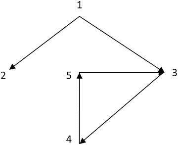

# 5. 层次查询：Connect By

##### 概要

聚合函数允许我们为每个组计算单个结果行。除了各种内置聚合函数外，开发人员还可以实现自己的用户定义聚合函数（同样可以作为带`over`子句的分析函数使用），或者使用`collect`函数将行聚合到集合中，并通过用户定义函数对其应用任意逻辑。大多数内置聚合函数是可交换的，因此组内行的顺序无关紧要；然而，像`listagg`或`percentile_cont`这样的函数则需要`within group`关键字后指定的顺序。顺序对于`collect`或`xmlagg`函数也很重要，并且可以在函数本身中指定。

与分析函数所示的方式类似，Oracle 允许我们使用`keep`关键字和`first`/`last`函数，根据指定的顺序访问组中的第一个（或最后一个）值。这在需要查找组中的最小或最大值及其相应属性时非常有用。

有时，分组可以帮助避免额外的连接（JOIN）；然而，这种情况相当罕见。此外，分组可以替代`pivot`来“扁平化”数据，但使用内置功能更为可取。

## Connect By 子句

`connect by`子句用于查询以父子关系存储的层次结构，这也称为邻接表模型。简单来说，该模型意味着为每个子代存储一个父-子对。通常，邻接表可以表示有向图，而不仅仅是层次树；在这种情况下，该列表描述了图中顶点的邻居集合。因此，邻接表模型的范围更广，而父-子模型是其实现之一。

列表 [5-1] 展示了一个基于父子关系构建层次结构并使用 Oracle 层次查询伪列的查询。

```sql
create table tree as
select 2 id, 1 id_parent from dual
union all select 3 id, 1 id_parent from dual
union all select 4 id, 3 id_parent from dual
union all select 5 id, 4 id_parent from dual
union all select 11 id, 10 id_parent from dual
union all select 12 id, 11 id_parent from dual
union all select 13 id, 11 id_parent from dual;
select connect_by_root id_parent root,
level lvl,
rpad(' ', (level - 1) * 3, ' ') || t.id as id,
prior id_parent grand_parent,
sys_connect_by_path(id, '->') path,
connect_by_isleaf is_leaf
from tree t
start with t.id_parent in (1, 10)
connect by prior t.id = t.id_parent;
ROOT      LVL ID       GRAND_PARENT PATH          IS_LEAF
-------- ----------- ------------------------ ---------------
1      1 2                ->2                        1
1      1 3                ->3                        0
1      2    4           1 ->3->4                     0
1      3       5        3 ->3->4->5                  1
10      1 11               ->11                       0
10      2    12         10 ->11->12                   1
10      2    13         10 ->11->13                   1
Listing 5-1
查询父子关系
```

构建层次结构必须指定：
*   **根** – 在示例中，我们构建了根父 ID 等于 1 和 10 的两棵树；
*   父与子之间的关系。`prior`是一个一元运算符，返回给定表达式（通常是列）对于当前行的直接父行的值。

列表 [5-1] 中演示的其他层次查询特性：
*   `connect_by_root` – 一元运算符，返回根行的表达式值。
*   `level` 和 `connect_by_isleaf` – 伪列，分别返回每个行的层次深度（层级）以及节点是否为叶节点的标志。
*   `sys_connect_by_path` – 函数，返回从根到节点并带有给定分隔符的路径。

`prior`运算符不仅可以在`connect by`子句中使用，也可以在`select`列表中使用，但它只能对给定表达式应用一次。例如，如果目标是选择向上两级的父 ID，那么可以对`id_parent`列应用`prior` – 参见列表 [5-1] 中`grand_parent`的表达式。

`Connect by`使用深度优先搜索方法遍历层次结构，因此在处理同一级别的下一个节点之前，会处理当前节点的所有后代。可以使用“order siblings by”来指定同一级别内的顺序。在这种情况下，Oracle 也会使用深度优先搜索，但父节点的子节点顺序可能会改变。列表 [5-2] 展示了在先前查询中指定`order siblings by t.id desc`后的结果。不能保证第一级节点会按照“order siblings by”中指定的顺序排序，因为我们无法说它们有一个共同的父节点。

```
select decode(grouping(client_id), 1, '所有客户', client_id) as client_id,
decode(grouping(product_id), 1, '所有产品', product_id) as product_id,
sum(quantity) cnt,
group_id() group_id
from orders
group by grouping sets(client_id, product_id,(),())
order by client_id, product_id;
CLIENT_ID       PRODUCT_ID             CNT   GROUP_ID
--------------- --------------- ---------- ----------
1               所有产品             7          0
2               所有产品             4          0
所有客户     1                        3          0
所有客户     2                        2          0
所有客户     3                        1          0
所有客户     4                        3          0
所有客户     5                        2          0
所有客户     所有产品            11          0
所有客户     所有产品            11          1
已选择 9 行。
```

Without these capabilities, the same result can be achieved using multiple table scans and groupings for each grouping set. On the other hand, it’s doable using a single table scan and Cartesian join with slices, but performance of built-in functionality will be better because it’s optimized to calculate aggregates by different attributes for the same recordset.

```sql
select client_id, product_id, sum(quantity) cnt, slice
from (select decode(instr(slice, 'client'), 0,
'所有客户', client_id) as client_id,
decode(instr(slice, 'product'), 0,
'所有产品', product_id) as product_id,
quantity,
slice
from orders,
(select 'client, product' slice from dual
union all select 'client' from dual
union all select '总计' from dual))
group by client_id, product_id, slice
order by client_id, product_id;
```

因此，PIVOT 可以用 GROUP BY 重写，UNPIVOT 可以用笛卡尔积模仿，而 GROUP BY CUBE/ROLLUP/GROUPING SETS 可以用笛卡尔积和简单的 GROUP BY 替代。然而，内置功能不仅使查询更简洁、更易于理解，而且性能明显更好。

本章最后要提及的是，聚合函数可以嵌套或与分析函数混合使用，这在第 9 章“查询子句的逻辑执行顺序”中有更详细的解释。

##### 代码清单 5-2
##### 兄弟节点排序

```
ROOT     LVL ID    ----GRAND_PARENT PATH       IS_LEAF
-------- --------------- -------------------------- ------
10     1 11                 ->11                   0
10     2    13           10 ->11->13               1
10     2    12           10 ->11->12               1
1     1 3                  ->3                    0
1     2    4             1 ->3->4                 0
1     3       5          3 ->3->4->5              1
1     1 2                  ->2                    1
```

如果 `connect by` 与连接（join）在同一个查询块中指定，那么 Oracle 会按以下顺序处理层级查询：连接（包括在 where 子句中指定的连接）、`connect by`、所有剩余的 where 子句谓词。

让我们创建以下表来进行演示：

```
drop table tree;
drop table nodes;
create table tree(id, id_parent) as
select rownum, rownum - 1 from dual connect by level <= 4;
create table nodes(id, name, sign) as
select rownum, 'name' || rownum, decode(rownum, 3, 0, 1)
from dual connect by rownum <= 4;
```

在代码清单 5-3 的第二个和第三个查询中，`sign` 过滤是在构建层级结构之前应用的，而在第一个查询中，它是在层级结构构建之后应用的。

```
select t.*, n.name
from tree t, nodes n
where t.id = n.id
and n.sign = 1
start with t.id_parent = 0
connect by prior t.id = t.id_parent;
ID  ID_PARENT NAME
---------- ---------- -----------------------------------------
1          0 name1
2          1 name2
4          3 name4
select *
from (select t.*, n.name
from tree t, nodes n
where t.id = n.id
and n.sign = 1) t
start with t.id_parent = 0
connect by prior t.id = t.id_parent;
ID  ID_PARENT NAME
---------- ---------- -----------------------------------------
1          0 name1
2          1 name2
select t.*, n.name
from tree t
join nodes n
on t.id = n.id
and n.sign = 1
start with t.id_parent = 0
connect by prior t.id = t.id_parent;
ID  ID_PARENT NAME
---------- ---------- -----------------------------------------
1          0 name1
2          1 name2
```

##### 代码清单 5-3
## Connect by 与连接

对于使用 ANSI 连接的原始查询，经过转换后的最终查询包含一个笛卡尔积连接（Cartesian join），而连接谓词则被移到了 “start with” 和 “connect by” 子句中。然而，更符合逻辑的预期是，在转换后的查询中会看到一个内联视图（inline view），其上再应用 `connect by`。因此，如果你为转换后的查询构建执行计划，它将与原始查询的执行计划不同，连接类型将是 “MERGE JOIN CARTESIAN”。

```
select "T"."ID" "ID", "T"."ID_PARENT" "ID_PARENT", "N"."NAME" "NAME"
from "TREE" "T", "NODES" "N"
start with "T"."ID_PARENT" = 0
and "T"."ID" = "N"."ID"
and "N"."SIGN" = 1
connect by "T"."ID_PARENT" = prior "T"."ID"
and "T"."ID" = "N"."ID"
and "N"."SIGN" = 1
```

对于代码清单 5-3 中第一个查询的转换结果，看起来也有点出乎意料——正如你所看到的，连接条件从 where 子句移到了 “start with” 和 “connect by” 子句中。

```
select "T"."ID" "ID", "T"."ID_PARENT" "ID_PARENT", "N"."NAME" "NAME"
from "TREE" "T", "NODES" "N"
where "N"."SIGN" = 1
start with "T"."ID_PARENT" = 0
and "T"."ID" = "N"."ID"
connect by "T"."ID_PARENT" = prior "T"."ID"
and "T"."ID" = "N"."ID"
```

我想再次强调，这些转换后的查询与原始查询的执行计划是不同的；即使它们在语义上是等效的，转换后文本的查询性能会差很多，因为层级结构将建立在笛卡尔积连接之上。

说到外连接（outer joins），无论它们是在 “join” 子句还是 “where” 子句中指定都没有区别，因为包含 `(+)` 的谓词会在构建层级结构之前被求值。

同样值得一提的是，如果目标是获取所有后代直到特定层级，那么在 “connect by” 条件中指定 `"level <= n"` 过滤比在 where 子句中指定更有意义，因为这样会在达到特定层级时停止构建层级结构。否则，层级结构将为所有层级构建，之后才会应用 where 过滤器。

另一个重点是，`connect by` 条件只对层级大于 1 的节点进行求值。第一层级的节点必须使用 “start with” 子句进行过滤。例如，无论你在 connect by 条件中指定 `"level <= 1"` 还是 `"level <= 0"`，所有第一层级的节点都会被返回。

`Connect by` 允许你遍历有向图，即使它们包含环。参见图 5-1。



图 5-1
##### 有向图

```
with graph (id, id_parent) as
(select 2, 1 from dual
union all select 3, 1 from dual
union all select 4, 3 from dual
union all select 5, 4 from dual
union all select 3, 5 from dual)
select level lvl, graph.*, connect_by_iscycle cycle
from graph
start with id_parent = 1
connect by nocycle prior id = id_parent;
LVL         ID  ID_PARENT      CYCLE
---------- ---------- ---------- ----------
1          2          1          0
1          3          1          0
2          4          3          0
3          5          4          1
```

`id = 3` 的节点是 `id = 5` 的节点的子节点，并且在我们访问 `id = 5` 的节点时，它已经被处理过了。在这种情况下，该节点的层级构建会停止，并被标记为环。换句话说，如果当前行的子节点同时也是其祖先节点，则 `connect_by_iscycle` 等于 1。

在一般情况下，使用 “connect by” 子句时，“start with” 和 `prior` 运算符都不是强制性的。这常用于生成序列。代码清单 5-4 展示了几种方法。

```
select level id from dual connect by level <= 10;
select rownum id from dual connect by rownum <= 10;
select rownum id from (select * from dual connect by 1 = 1)
where rownum <= 10;
```

##### 代码清单 5-4
## 使用 connect by 生成序列

这些查询不会识别出环，因为在 connect by 条件中没有使用 `prior` 运算符引用父记录。因此，当不存在父子关系时，环就不可能存在。尝试在 “connect by” 条件中添加谓词 `«prior 1 = 1»` 来执行代码清单 5-4 中的任意查询。

文档中说：“在层级查询中，[connect by] 条件中的一个表达式必须使用 PRIOR 运算符进行限定，以引用父行。” 因此，如果你想引用父行，就必须使用 `prior` 运算符，但你并不被强制去引用它——也就是说，`connect by` 不仅可以用于遍历层级结构。

`prior` 运算符的关键点是，其中引用的值必须在构建层级结构之前就存在。此外，当你使用 `prior` 运算符时，不能引用在层级查询中计算的列。这意味着无法累积计算子节点的值。然而，对于递归子查询因子分解（Recursive subquery factoring），则没有这样的限制，这将在下一章中展示。

为了演示这个限制，让我们考虑一个任务：目标是生成与函数 `f` 返回的相同序列（类型 `numbers` 在“集合转置（Unnesting Collections）”一节中已定义）。

```
create or replace function f(n in number) return numbers as
result numbers := numbers();
begin
result.extend(n + 1);
result(1) := 1;
for i in 2 .. n + 1 loop
result(i) := round(100 * sin(result(i - 1) + i - 2));
end loop;
return result;
end f;
/
```


##### 递归序列生成与循环处理

该函数返回一个递归序列，其中当前值等于前一个值与其索引之和的正弦值，该和乘以 100 并取整。代码中使用`i-2`是因为元素索引从零开始。

为了突出序列的递归特性，它也可以用递归函数来定义。

```sql
create or replace function f(n in number) return numbers as
result numbers;
begin
if n = 0 then return numbers(1);
else
result := f(n - 1);
result.extend;
result(n + 1) := round(100 * sin(result(n) + n - 1));
return result;
end if;
end f;
/
```

鉴于正弦值范围在[-1, 1]之间，且函数值乘以 100 并取整，因此可以为序列生成所有可能的值——即范围[-100, 100]。基于此假设，可以使用`connect by`来生成序列。

清单 5-5 中的查询仅生成前 14 个值而非 21 个，因为第 14 行被识别为一个循环。

```sql
with t as
(select -100 + level - 1 result from dual connect by level <= 201)
select level - 1 as id, result, connect_by_iscycle cycle
from t
start with result = 1
connect by nocycle round(100 * sin(prior result + level - 2)) = result
and level <= 21;
ID     RESULT      CYCLE
---------- ---------- ----------
0          1          0
1         84          0
2        -18          0
3         29          0
4         55          0
5         64          0
6        -11          0
7         96          0
8         62          0
9         77          0
10        -92          0
11        -31          0
12        -91          0
13         44          1
```
**清单 5-5** 使用`connect by`生成递归序列值

在`connect by`子句中添加`prior sys_guid() is not null`的技巧有助于我们避免循环并生成所有元素。`sys_guid()`返回唯一值，因此已生成的任何行都不会被视为当前行的子行；从而不会识别出循环。请参阅清单 5-6 查看此方法的实际应用。

```sql
with t as
(select -100 + level - 1 result from dual connect by level <= 201)
select level - 1 as id, result, connect_by_iscycle cycle
from t
start with result = 1
connect by nocycle round(100 * sin(prior result + level - 2)) = result
and prior sys_guid() is not null
and level <= 21;
ID     RESULT      CYCLE
---------- ---------- ----------
0          1          0
1         84          0
2        -18          0
3         29          0
4         55          0
5         64          0
6        -11          0
7         96          0
8         62          0
9         77          0
10        -92          0
11        -31          0
12        -91          0
13         44          0
14         44          0
15         99          0
16         78          0
17        -25          0
18        -99          0
19         63          0
20         31          0
```
**清单 5-6** 在生成递归序列时处理具有相同值的元素

现在我们看到没有识别出循环，因此可以移除`nocycle`关键字。

总结循环识别的细节：
*   只有当`connect by`条件包含`prior`运算符时，才能识别循环。
*   如果我们对任何返回唯一值的函数应用`prior`运算符，则不会识别循环，因为在这种情况下，具有相同值的行不被视为层次结构中的相同节点。

这种遍历预生成值的方法甚至可以在递归公式引用前两次迭代的值时使用，但在这种情况下，有必要生成所有可能的前一个元素和它之前元素的组合。清单 5-7 展示了如何使用此方法生成斐波那契数。

```sql
with t as
(select rownum id from dual connect by rownum <= power(2, 15) / 15),
pairs as
(select t1.id id1, t2.id id2
from t t1, t t2
where t2.id between (1 / 2) * t1.id and (2 / 3) * t1.id
union all
select 1, 0 from dual
union all
select 1, 1 from dual)
select rownum lvl, id2 fib
from pairs
start with (id1, id2) in ((1, 0))
connect by prior id1 = id2
and prior (id1 + id2) = id1
and level <= 15;
LVL        FIB
---------- ----------
1          0
2          1
3          1
4          2
5          3
6          5
7          8
8         13
9         21
10         34
11         55
12         89
13        144
14        233
15        377
15 rows selected.
```
**清单 5-7** 使用`connect by`生成斐波那契数

我们可以注意到，对于所有大于 1 的元素，有`F[i] < 2^i/i`且`F[i-1]`在½ * F[i]和¾ *F[i]之间，这些条件被用来减少预生成组合的数量。与前面的例子不同，这里不需要使用`prior sys_guid`技巧，因为该序列对于所有大于 1 的元素都是单调递增的，因此不可能遇到循环。

经过时间随层级呈指数增长，这种方法不能用于实际任务；主要意图是演示`connect by`子句的特性。

`sys_guid`技巧也可用于生成每行的副本数量。

```sql
with t as
(select 'A' value, 2 cnt from dual
union all
select 'B' value, 3 cnt from dual)
select *
from t
connect by level <= cnt
and prior value = value
and prior sys_guid() is not null;
V        CNT
- ----------
A          2
A          2
B          3
B          3
B          3
```

如你所见，查询中没有`start with`条件，因此第一层包含所有行，并且连接在每个值的范围内执行，直到生成`cnt`行。使用`sys_guid`技巧是为了避免循环，因为每个根的所有行都具有相同的值。生成每行指定副本数量的其他方法很多，`connect by`并不是最佳方式。

在遍历有向图时也可以使用此技巧。它会阻止 Oracle 识别循环，因此同一循环可能被遍历多次。正如预期的那样，所有行的`cycle`列都等于零。

```sql
select level lvl, graph.*, connect_by_iscycle cycle
from graph
start with id_parent = 1
connect by nocycle prior id = id_parent
and prior sys_guid() is not null
and level <= 10;
LVL         ID  ID_PARENT      CYCLE
---------- ---------- ---------- ----------
1          2          1          0
1          3          1          0
2          4          3          0
3          5          4          0
4          3          5          0
5          4          3          0
6          5          4          0
7          3          5          0
8          4          3          0
9          5          4          0
10          3          5          0
```

如果目标是选择所有边，包括闭合循环的边，那么我们可以添加条件`prior id_parent is not null`，如清单 5-8 所示。在这种情况下，如果我们访问了同一个节点两次，循环将被识别。更多细节可在下一章的“再次讨论循环”一节中找到。

```sql
select level lvl, graph.*, connect_by_iscycle cycle
from graph
start with id_parent = 1
connect by nocycle prior id = id_parent
and prior id_parent is not null;
LVL         ID  ID_PARENT      CYCLE
---------- ---------- ---------- ----------
1          2          1          0
1          3          1          0
2          4          3          0
3          5          4          0
4          3          5          1
```
**清单 5-8** 通过添加`prior id_parent is not null`影响循环检测


##### 伪列生成详解

我们已经探讨了层次查询中 `join`、`connect by` 和 `where` 子句的工作原理。当查询包含伪列时，无法简单地说它们的值是在某个特定查询子句之前还是之后生成的，但我们可以陈述以下规则：

*   当生成新层级的行时，`level` 会递增。
*   当新行被添加到结果集中时，`rownum` 会递增。

清单 5-9 通过一个示例演示了上述陈述。

```
create table t_two_branches(id, id_parent) as
(select rownum, rownum - 1 from dual connect by level <= 10
union all
select 100 + rownum, 100 + rownum - 1 from dual connect by level <= 10
union all
select 0, null from dual
union all
select 100, null from dual);
select rownum rn,
level lvl,
replace(sys_connect_by_path(rownum, '~'), '~') as path_rn,
replace(sys_connect_by_path(level, '~'), '~') as path_lvl,
sys_connect_by_path(id, '~') path_id
from t_two_branches
where mod(level, 3) = 0
start with id_parent is null
connect by prior id = id_parent;
RN    LVL PATH_RN     PATH_LVL     PATH_ID
------ -------- ------- ------------ --------------------------
1      3 111         123          ~0~1~2
2      6 111222      123456       ~0~1~2~3~4~5
3      9 111222333   123456789    ~0~1~2~3~4~5~6~7~8
4      3 444         123          ~100~101~102
5      6 444555      123456       ~100~101~102~103~104~105
6      9 444555666   123456789    ~100~101~102~103~104~105~106~107~108
6 rows selected.
清单 5-9
level 和 rownum 伪列生成的具体情况
```

对于两个分支中的每一个，Oracle 都生成了 9 个层级和 3 行：第 1-3 行属于第一个分支，第 4-6 行属于第二个分支。`path_rn` 和 `path_lvl` 列帮助我们理解了伪列值是如何生成的。从技术上讲，`where` 子句是在构建层次结构时进行评估的，而不是之后。

另外，指出当 `rownum`/`level` 用于 `connect by` 子句时的差异也很有趣。

```
select rownum rn,
level lvl,
replace(sys_connect_by_path(rownum, '~'), '~') as path_rn,
replace(sys_connect_by_path(level, '~'), '~') as path_lvl,
sys_connect_by_path(id, '~') path_id
from t_two_branches
start with id_parent is null
connect by prior id = id_parent
and rownum <= 2;
RN        LVL PATH_RN         PATH_LVL        PATH_ID
---------- ---------- --------------- --------------- ---------
1          1 1               1               ~0
2          2 12              12              ~0~1
3          1 3               1               ~100
select rownum rn,
level lvl,
replace(sys_connect_by_path(rownum, '~'), '~') as path_rn,
replace(sys_connect_by_path(level, '~'), '~') as path_lvl,
sys_connect_by_path(id, '~') path_id
from t_two_branches
start with id_parent is null
connect by prior id = id_parent
and level <= 2;
RN        LVL PATH_RN         PATH_LVL        PATH_ID
---------- ---------- --------------- -------- ----------------
1        1 1                  1              ~0
2        2 12                12              ~0~1
3        1 3                  1              ~100
4        2 34                12              ~100~101
清单 5-10
在 "connect by" 条件中使用 level 和 rownum 的区别
```

在第一种情况下，Oracle 为第一个分支返回两行，并为第二个分支返回一行根节点行。尽管 `connect by` 条件对于该行是 false，但 `start with` 是 true；因此所有根节点都出现在结果中。在第二种情况下，Oracle 简单地遍历所有分支直到指定的层级，显然 `rownum` 是单调递增的。

##### 总结

`connect by` 子句是 Oracle 的一个特有特性，可用于遍历父子层次结构或生成没有父子依赖关系的序列。通常，此特性允许遍历任何有向图，并且可以使用 `nocycle` 关键字来处理环路。

