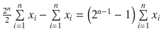
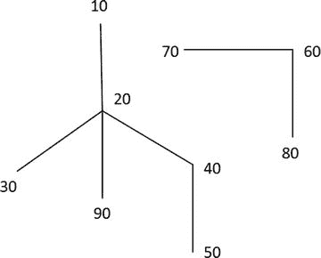
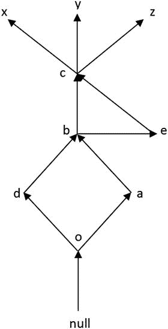
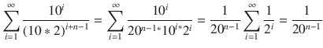

# 7. `Model`

可以说，`model` 子句是 SQL 中最强大的功能，这意味着它可以用来解决许多使用 SQL 原本无法解决的任务。这不仅是因为 `model` 子句极大地扩展了声明式 SQL 的可能性，还因为它为 SQL 在记录集之上引入了迭代计算的能力。另一方面，`model` 子句在可扩展性方面存在一些问题，而且总体上，`model` 子句大放异彩的问题类别是相当有限的。在许多情况下，即使可以通过 `model` 子句实现结果，PL/SQL 也往往是更优的选择，不过我们还是从基础开始讲起。

`model` 子句允许你将记录集视为一个多维立方体，通过将列映射到三组：分区、维度和度量。

*   分区指定了逻辑组，`model` 规则会独立地应用于各个分区。指定分区可能有助于显著提升并行执行的能力。
*   维度列用于定义多维立方体，默认情况下，所有维度的组合唯一标识立方体中的单元格。从另一个角度看，我们可以这么说——用于唯一标识电子表格中的一行或多维数组中的一个值。
*   度量是多维立方体的值，可以使用 `model` 规则进行计算。通常，度量是数值，但与其他许多多维分析工具不同，Oracle 支持日期、字符串甚至 RAW 值作为度量。

分区、维度和度量不仅可以映射到查询的列，也可以指定为表达式。

让我们通过清单 7-1 中的例子来看看它是如何工作的。

```sql
with t(id, value) as
(
select 1, 3 from dual
union all select 2, 9 from dual
union all select 3, 8 from dual
union all select 5, 5 from dual
union all select 10, 4 from dual
)
select * from t
model
-- 返回更新后的行
dimension by (id)
measures (value, 0 result)
-- 规则
(
result[id >= 5] = sum(value)[id <= cv(id)],
result[0] = value[10] + value[value[1]]
);
ID      VALUE     RESULT
---------- ---------- ----------
1          3          0
2          9          0
3          8          0
5          5         25
10          4         29
0                    12
清单 7-1
model 子句的基本示例
```

我们通过 `ID` 列定义了一个维度和两个度量：一个映射到 `value` 列，另一个初始值为零。

规则 `result[id >= 5] = sum(value)[id <= cv(id)]` 仅应用于维度值大于或等于 5 的行，在我们的例子中意味着两行——`ID = 5` 和 `ID = 10` 的行。表达式的值是维度值小于或等于当前维度值的所有行的度量值总和。当规则左侧引用了多行时，右侧使用 `cv` 函数来访问当前的维度值。

##### 注意

在 Oracle 10g Release 1 的文档中，你可能还会看到 `currentv` 函数，但在后续版本的文档中它不再出现，尽管看起来它仍然有效。类似地，`model` 关键字可以与 `spreadsheet` 关键字互换使用，但后者已不再有文档记载。

规则 `result[0] = value[10] + value[value[1]]` 表示维度值为 0 的单元格的度量值是 `ID = 10` 和 `ID = value[1]`（即 3）的度量值之和。请注意，维度值为 0 的单元格在原始记录集中并不存在，而是在 `model` 子句求值期间被添加的。稍后将展示，这种行为是可以调整的。`value[value[1]]` 是嵌套单元格引用的一个例子。

因此，我们可以将度量视为多维数组的值，而维度是寻址这些值的索引；然而，度量值也可以用于访问单元格。

如果我们取消清单 7-1 中 `return updated rows` 的注释，那么结果将只包含应用了规则的行——即 ID 为 5、10 和 0 的行。默认值是 `return for all rows`。`rules` 关键字是可选的，除非你想指定迭代次数。

有两种表示法来寻址单元格——`symbolic dimension reference`（符号维度引用）和 `positional dimension reference`（位置维度引用）。在符号维度引用的情况下，必须存在一个包含维度名称的谓词；否则，维度引用就是位置的——例如，常量值、表达式甚至是 `for` 循环。这些表示法之间的差异对于规则的左侧非常重要，左侧标识了将被右侧值更新的单元格。

可以使用关键字 `update`/`upsert all`/`upsert` 来指定 Oracle 处理缺失单元格的方式。`Update` 只更新现有单元格，`upsert`（默认值）更新现有单元格，并在位置引用的情况下创建缺失单元格，而 `upsert all` 在符号引用所使用的维度值存在于原始记录集中时，也会为混合引用创建缺失单元格。让我们通过清单 7-2 所示的具体例子来看看它是如何工作的。

```sql
with t(dim1, dim2, value) as
(
select 0, 0, 1 from dual
union all select 0, 1, 2 from dual
union all select 1, 0, 3 from dual
)
select * from t
model
dimension by (dim1, dim2)
measures (value, cast(null as number) result)
rules upsert all
(
result[0, 0] = -1,
result[dim1=1, dim2=0] = -3,
result[-1, for dim2 in (select count(*) from dual)] = -4,
result[-2, dim2=1] = -10,
result[-3, dim2=-1] = -100,
result[-4, -1] = -1000
)
order by dim1, dim2;
DIM1       DIM2      VALUE     RESULT
---------- ---------- ---------- ----------
-4         -1                 -1000
-2          1                   -10
-1          1                    -4
0          0          1         -1
0          1          2
1          0          3         -3
清单 7-2
Upsert all 实战
```

清单 7-2 的查询输出中有 3 行原始行和 3 行创建的行。值为 -4 和 -1000 的单元格被添加，是因为两个维度都使用了位置表示法。值为 -10 的单元格被添加，是因为符号表示法 `dim2=1` 的值存在于原始记录集中，即使 `dim1` 的位置值不存在。值为 -100 的度量未被添加，是因为符号表示法中用于 `dim2` 的值 -1 不存在。单元格 `[0, 1]` 的度量值未知，因为没有为它指定规则。最后，单元格 `[0, 0]` 和 `[dim1=1, dim2=0]` 的结果被计算，因为它们存在于原始记录集中。

如果我们指定 `upsert`，那么度量 -10 将从结果集中排除；如果我们指定 `update`，那么结果值为 -4 和 -1000 的单元格也将消失。

简而言之，当我们只处理现有数据时，使用符号引用；而如果可能需要添加新单元格——例如，在预测或插值的情况下——则可以使用位置引用。当某些维度是固定的而其他维度可以通过添加新成员来扩展时，混合引用是有意义的。

如果我们想引用维度的所有成员，可以在位置引用中使用关键字 `any`，或在符号引用中使用 `is any` 谓词。两种情况下的行为是相同的——规则应用于维度的所有成员，并且不能创建新成员。

当规则的左侧引用多行时，顺序可能非常重要，如清单 7-3 所示。


代码清单 7-3
##### 在规则左侧指定顺序

```sql
with t(id, value) as
(select rownum, rownum from dual connect by level <= 3)
select *
from t
model
dimension by (id)
measures (value, 100 r1, 100 r2)
(
r1[any] order by id asc  = nvl(r1[cv(id)-1], 0) + value[cv(id)],
r2[id is any] order by id desc = nvl(r2[cv(id)-1], 0) + value[cv(id)]
)
order by id;
ID      VALUE         R1         R2
---------- ---------- ---------- ----------
1          1          1          1
2          2          3        102
3          3          6        103
```

当我们指定升序时，结果是一个累积和；而对于降序，结果则完全不同。我们得到了 `102` 和 `103`，它们是当前行的 `value` 度量与上一行 `r2` 度量（初始化为 `100`）的和。对于第一行，没有“上一行”，所以结果就是该行的 `value` 度量值。

如果规则应用于多行，在左侧指定顺序总是有意义的，因为

*   它能提升性能；
*   它增加了方案的清晰度；
*   它有助于避免 `ORA-32637: Self cyclic rule in sequential order MODEL.`（顺序 MODEL 中的自循环规则）错误。

代码清单 7-4 展示了一个递归度量的例子。Oracle 无法解析这种依赖关系，但如果我们取消 `/*order by id*/` 的注释，结果就能成功计算。试着在不运行查询的情况下猜测一下结果。

代码清单 7-4
##### 递归度量

```sql
with t as
(select rownum id from dual connect by level <= 3)
select *
from t
model
dimension by (id)
measures (id result)
rules
(
result[any] /*order by id*/ = sum(result)[any]
);
(select rownum id from dual connect by level <= 3)
*
ERROR at line 2:
ORA-32637: Self cyclic rule in sequential order MODEL
```

默认情况下，所有规则都按照它们在查询中指定的顺序进行求值。这也可以使用可选的关键字 `sequential order`（顺序）来显式指定。如果我们指定 `automatic order`（自动顺序），则这种行为可能会改变，它会考虑单元格之间的依赖关系。

代码清单 7-5
##### 使用自动规则排序的模型

```sql
with t as
(select rownum id from dual connect by level <= 3)
select *
from t
model
dimension by (id)
measures (0 t1, 0 x, 0 t2)
rules automatic order
(
t1[id] = x[cv(id)-1],
x[id] = cv(id),
t2[id] = x[cv(id)-1]
)
order by id;
ID         T1          X         T2
---------- ---------- ---------- ----------
1                     1
2          1          2          1
3          2          3          2
```

如果你在代码清单 7-5 中省略 `automatic order`，那么 `t1` 的值将为 `NULL`、`0`、`0`。

正如已经展示的，你可以为同一个度量指定多个规则；此外，即使你为同一个度量和相同的单元格指定多个规则，Oracle 也不会报错；然而，这应该避免。例如，我们可以在代码清单 7-5 的查询中添加第四个规则 `t1[id] = x[cv(id)] + t2[cv(id)]`，但之后，规则 `t1[id] = x[cv(id)-1]` 就完全被覆盖了，应该移除。

无论指定什么顺序，规则都是一个接一个计算的。这意味着首先对左侧引用的所有单元格求值第一条规则，然后对左侧引用的所有单元格求值第二条规则，依此类推。换句话说，规则是按列应用而不是按行应用。

关键字 `automatic order`/`sequential order` 定义了一个查询计划。对于 `sequential order`，你会在计划中看到 `SQL MODEL ORDERED`；而对于 `automatic order`，根据是否存在循环依赖，它可能是 `SQL MODEL CYCLIC`（循环）或 `SQL MODEL ACYCLIC`（非循环）。

在简单情况下，循环依赖可能发生在同一个度量的作用域内（当第一个规则中一个单元格引用另一个，而第二个规则中反过来引用），或者发生在不同度量但相同单元格的情况下。坦率地说，我没有遇到过带有循环依赖的有用模型示例，所以我建议你始终以正确的顺序指定规则并使用默认值 `sequential order`；另外，为每个引用多个单元格的规则指定左侧的顺序。

在 `ORDERED`/`ACYCLIC` 模型的情况下，如果所有规则都使用单个单元格引用，你可能还会在计划中看到 `FAST`（快速）。

例如，对于这条规则

```sql
rules automatic order (x[1] = cv(id), x[-1] = cv(id))
```

计划中将出现 `SQL MODEL ACYCLIC FAST`；而对于这条

```sql
rules automatic order (x[for id in (1, -1)] = cv(id))
```

或这条

```sql
rules automatic order (x[id in (1, -1)] = cv(id))
```

它将是 `SQL MODEL ACYCLIC`。

第二个和第三个例子之间的逻辑区别在于，第二个使用位置引用，而第三个使用符号引用，因此如果源记录集中缺少某些单元格，结果将会不同。

如果我们为代码清单 7-4 的查询指定 `automatic order`，Oracle 将抛出模型不收敛的异常。

代码清单 7-6
##### 具有循环规则和自动顺序的模型

```sql
with t as
(select rownum id from dual connect by level <= 3)
select *
from t
model
dimension by (id)
measures (id result)
rules automatic order
(
result[any] /*order by id*/ = sum(result)[any]
);
from t
*
ERROR at line 4:
ORA-32634: automatic order MODEL evaluation does not converge
```

根据文档，“收敛被定义为模型的进一步执行不会改变模型中任何单元格值的状态”。根据经验我们可以推断，最多使用三步（四步）来检查收敛性。

代码清单 7-7
##### 检查收敛性

```sql
select * from (select 1 x from dual)
model dimension by (x) measures (0 as result, 64 tmp)
rules automatic order
(result[1]=ceil(tmp[1]/4), tmp[1]=result[1]);
X     RESULT        TMP
---------- ---------- ----------
1          1          1
select * from (select 1 x from dual)
model dimension by (x) measures (0 as result, 65 tmp)
rules automatic order
(result[1]=ceil(tmp[1]/4), tmp[1]=result[1]);
select * from (select 1 x from dual)
*
ERROR at line 1:
ORA-32634: automatic order MODEL evaluation does not converge
```

在第一种情况下，(`result`, `tmp`) 的值依次是 `16`、`4`、`1`，然后又是 `1`——模型收敛了；在第二种情况下，第三步和第四步的值不匹配，这导致了异常。

当没有循环依赖时（例如，参考代码清单 7-5 进行验证），`automatic order` 可以将计划操作从 `MODEL ORDERED` 更改为 `MODEL ACYCLIC`，但只需通过以适当的顺序指定规则也可以达到预期的结果。

到目前为止的所有例子中（严格来说，不包括非循环模型的例子），模型规则只被求值一次；然而，可以迭代地对规则进行求值，直到满足终止条件。为了演示迭代计算，让我们使用与代码清单 6-5 相同的区间和函数来实现二分法。


```
with t as (select 0 id from dual)
select *
from t
model
dimension by (id)
measures ((1+2)/2 x, 1 x0, 2 x1)
rules iterate (1e2) until abs(x[0]-previous(x[0])) < 1e-2
(
x[iteration_number+1] = x[0],
x0[iteration_number+1] = case when sign(y(x[0])) =
sign(y(x0[iteration_number]))
then x[0]
else x0[iteration_number]
end,
x1[iteration_number+1] = case when sign(y(x[0])) =
sign(y(x1[iteration_number]))
then x[0]
else x1[iteration_number]
end,
x[0] = (x0[iteration_number+1] + x1[iteration_number+1])/2
)
order by id ;
ID          X         X0         X1
---------- ---------- ---------- ----------
0  1.4140625          1          2
1        1.5          1        1.5
2       1.25       1.25        1.5
3      1.375      1.375        1.5
4     1.4375      1.375     1.4375
5    1.40625    1.40625     1.4375
6   1.421875    1.40625   1.421875
选择了 7 行。
代码清单 7-8
使用迭代模型实现二分法
```

`Iteration_number` 是一个返回整数的函数，代表从 0 开始完成模型规则迭代的次数。在上面的例子中，最大可能的迭代次数被限制为 100（此值只能使用常量指定，不能是表达式）；但是，存在一个终止条件 `abs(x[0]-previous(x[0])) < 1e-2`，这意味着当前迭代的根与上一次迭代的根之间的绝对差应小于 0.01。因此，计算在第 6 步停止，结果与使用子查询分解子句（subquery factoring clause）计算的结果相同——`1.4140625`。`previous` 函数用于引用上一次迭代的值。

无法根据查询计划判断模型是否是迭代的。查询计划操作与非迭代模型相同。此外，启用了运行时执行统计信息时，计划中的统计信息列不会反映迭代次数。代码清单 7-8 的查询计划如下所示。

```sql
select * from dbms_xplan.display_cursor(format => 'IOSTATS LAST');

| Id | Operation                | Name | Starts | E-Rows | A-Rows |      A-Time      |

|  0 | SELECT STATEMENT         |      |      1 |        |      7 | 00:00:00.01 |
|  1 |  SORT ORDER BY           |      |      1 |      1 |      7 | 00:00:00.01 |
|  2 |   SQL MODEL ORDERED FAST |      |      1 |      1 |      7 | 00:00:00.01 |
|  3 |    FAST DUAL             |      |      1 |      1 |      1 | 00:00:00.01 |
```

在 MODEL 子句中，我们可以定义 `引用模型`，用作“查找数组”。

```sql
with sales(year, currency, value) as
(select '2015', 'GBP', 100 from dual
union all select '2015', 'USD', 200 from dual
union all select '2015', 'EUR', 300 from dual
union all select '2016', 'GBP', 400 from dual
union all select '2016', 'EUR', 500 from dual)
, usd_rates(currency, rate) as
(select 'GBP', 1.45 from dual
union all select 'USD', 1 from dual
union all select 'EUR', 1.12 from dual)
select *
from sales
model
reference usd_rates_model on (select * from usd_rates)
dimension by (currency)
measures (rate)
main sales_model
dimension by (year, currency)
measures (value, 0 usd_value)
(
usd_value[any, any] order by year, currency =
value[cv(year), cv(currency)] * usd_rates_model.rate[cv(currency)]
)
order by 1, 2;
YEAR CUR      VALUE  USD_VALUE
---- --- ---------- ----------
2015 EUR        300        336
2015 GBP        100        145
2015 USD        200        200
2016 EUR        500        560
2016 GBP        400        580
代码清单 7-9
使用引用模型
```

正如本章开头所述，所有维度的组合唯一标识了数据立方体中的一个单元格，但如果你指定了 `unique single reference` 关键字，则可以放宽此规则。代码清单 7-10 中的查询，在寻址方式的默认值（唯一维度）下，会抛出异常 `ORA-32638: Non unique addressing in MODEL dimensions`。

```sql
with t(id, value) as
(select trunc(rownum/2), rownum from dual connect by level <= 3)
select *
from t
model
unique single reference
dimension by (id)
measures (value, 0 result)
(result[0] = 111)
order by id;
ID      VALUE     RESULT
---------- ---------- ----------
0          1        111
1          2          0
1          3          0
代码清单 7-10
具有唯一单一引用的模型
```

关于基本功能最后要提到的是空值的处理。对于 MODEL 子句有两个特殊函数 `presentv`/`presentnnv`，其工作方式类似于 `nvl2`。`Presentv` 检查在 MODEL 子句执行前记录集中是否存在该值，而 `presentnnv` 除此之外还检查该值是否不为空。代码清单 7-11 展示了 `presentv`、`presentnnv` 和 `nvl2` 之间的区别。

```sql
with t(id) as
(select cast('base' as varchar2(10)) from dual)
select *
from t
model
ignore nav
dimension by (id)
measures (cast(null as varchar2(10)) msr_base,
cast(null as varchar2(10)) msr_calc,
to_number(null) num)
(
msr_base['calc'] = '1',
msr_base['presentv'] = presentv(msr_base['base'], '+', '-'),
msr_base['presentnnv'] = presentnnv(msr_base['base'], '+', '-'),
msr_base['nvl2'] = nvl2(msr_base['base'], '+', '-'),
msr_calc['presentv'] = presentv(msr_base['calc'], '+', '-'),
msr_calc['presentnnv'] = presentnnv(msr_base['calc'], '+', '-'),
msr_calc['nvl2'] = nvl2(msr_base['calc'], '+', '-'),
num[any] = num[-1]
)
order by id;
ID         MSR_BASE   MSR_CALC          NUM
---------- ---------- ---------- ----------
base                                      0
calc       1                              0
nvl2       -          +                   0
presentnnv -          -                   0
presentv   +          -                   0
代码清单 7-11
比较 presentv、presentnnv 和 nvl2 的结果
```

当你指定 `ignore nav` 时，缺失的数值度量被视为零而非空。在默认行为 `keep nav` 下，`num` 列的所有值都将为空。

分析函数可以在 MODEL 子句中使用以实现高级逻辑。代码清单 7-12 展示了一个使用示例。

```sql
with t(value) as
(select column_value from table(sys.odcivarchar2list('A','B','C','D','E')))
select *
from t
model
ignore nav
dimension by (row_number() over (order by value) id)
measures (value, cast(null as varchar2(4000)) result, count(*) over () num)
(
result[mod(id, 2) = 1] = listagg(value, ', ') within group (order by id) over (),
num[mod(id, 2) = 1] = count(*) over (order by id desc)
)
order by id;
ID VALUE      RESULT            NUM
---------- ---------- ---------- ----------
1 A          A, C, E             3
2 B                              5
3 C          A, C, E             2
4 D                              5
5 E          A, C, E             1
代码清单 7-12
MODEL 子句中的分析函数
```

相同的逻辑可以使用聚合函数以如下方式实现：

```sql
result[mod(id, 2) = 1] = listagg(value, ', ') within group (order by null)[mod(id, 2) = 1],
num[mod(id, 2) = 1] = count(*)[mod(id, 2) = 1 and id >= cv(id)]
```

MODEL 子句中的聚合函数与常规聚合函数的关键区别在于，MODEL 子句中的聚合函数不需要分组。相反，你需要为聚合函数指定单元格的范围。

与分析函数不同，聚合函数允许灵活地寻址单元格范围。但是分析函数接受度量和维度作为参数，而聚合函数只能应用于度量。此外，当使用分析函数时，无法在规则的左侧指定排序。代码清单 7-13 中的规则 1 和规则 3 分别展示了分析函数和聚合函数的局限性。
```


## 模型子句中分析函数与聚合函数的局限性
```sql
select *
from (select rownum id from dual connect by rownum = cv(id)]
-- 4)
r2[any] = sum(value)[id >= cv(id)]
)
```

为了探索聚合函数寻址的灵活性，让我们回到前面关于分析函数局限性的示例（清单 7-6）。第一个局限性根本不是问题。清单 7-14 展示了如何通过两个坐标计算距离为 5 以内的点数。

##### 清单 7-14
模型子句中的聚合函数，支持按多维度进行条件寻址
```sql
with points as
(select rownum id, rownum * rownum x, mod(rownum, 3) y
from dual
connect by rownum <= 6)
, t as
(select p.*,
-- 基于 x 坐标计算距离为 5 以内的点数       -- 当涉及多于一个坐标时，无法用分析函数解决       count(*) over(order by x range between 5 preceding and 5 following) cnt,       -- 计算到点 (3, 3) 的距离总和       -- 按 id 排序，从无界前行到当前行       -- 如果要求计算其他行与当前行之间的距离，而不是到某个常量点的距离，则无法用分析函数解决
round(sum(sqrt((x - 3) * (x - 3) + (y - 3) * (y - 3)))
over(order by id),
2) dist
from points p)
select *
from t
model
dimension by (x, y)
measures (id, cnt, dist, 0 cnt2)
rules
(
cnt2[any, any] = count(*)[x between cv(x) - 5 and cv(x) + 5,
y between cv(y) - 1 and cv(y) + 1]
)
order by id;
```

然而，对于第二个局限性，没有直接的解决方案，因为无法在聚合函数的表达式中引用当前行的度量值。作为一种变通方法，我们可以使用迭代模型，并执行与行数一样多的迭代，以维护两个包含当前行坐标的辅助度量值。思路如清单 7-15 所示，但这种方法看起来有些笨拙，且性能不佳。

##### 清单 7-15
使用迭代模型作为聚合函数局限性的变通方案
```sql
with points as
(select rownum id, rownum * rownum x, mod(rownum, 3) y
from dual
connect by rownum <= 6)
select *
from points
model
dimension by (id)
measures (id i, x, y, 0 x_cur, 0 y_cur, 0 dist2)
rules iterate (1e6) until i[iteration_number+2] is null
(
x_cur[any] = x[iteration_number + 1],
y_cur[any] = y[iteration_number + 1],
dist2[iteration_number + 1] =
round(sum(sqrt((x - x_cur) * (x - x_cur) +
(y - y_cur) * (y - y_cur)))[id <= cv(id)], 2)
)
order by id;
```

如你所见，辅助度量 `x_cur` 和 `y_cur` 必须在所有迭代中为所有行初始化。为了用当前行的值 `(x, y)` 填充 `(x_cur, y_cur)`，我们使用了 `[iteration_number + 1]`，因为行编号从 1 开始，而 `interation_number` 从 0 开始。度量 `dist2` 在每次迭代中仅针对单行进行计算。

鉴于有时聚合函数和分析函数在模型子句中可以互换，我们将在性能分析期间进一步讨论这个问题。

### 使用模型子句生成递归序列

让我们继续讨论具体任务。清单 7-16 展示了如何使用模型来生成前面章节讨论的递归序列。

```sql
select *
from dual
model
dimension by (0 id)
measures (1 result)
rules
(
result[for id from 1 to 20 increment 1] =
round(100 * sin(result[cv(id)-1] + cv(id) - 1))
);
select *
from (select rownum lvl, rownum - 1 result
from dual connect by level <= 2)
model
ignore nav
dimension by (lvl)
measures (result)
rules
(
result[for lvl from 3 to 15 increment 1] =
result[cv(lvl)-1] + result[cv(lvl)-2]
);
```

模型允许我们使用先前阶段计算的值，类似于递归子查询因式分解。从逻辑角度看，两者之间的关键区别在于，模型按列应用规则和计算值（度量），而不是按行；而递归子查询因式分解在处理下一行之前，会为当前行计算所有表达式。更多细节可参见第 12 章的测验“篮子”。

此外，与递归子查询因式分解不同，模型提供了一种简单的方法来引用任何其他行的度量值；因此，例如在生成斐波那契数列时，无需使用辅助列。递归子查询因式分解的可见性仅限于上一次迭代的记录集。

尽管递归子查询因式分解和模型可用于解决相同的任务，但它们的能力完全不同，且设计目的不同，因此使用相同的术语并不十分恰当。谈及递归子查询因式分解时，我们可以说“引用先前层级计算的值”或“引用父记录的计算值”，而对于模型子句，更准确的说法是“引用前一个维度成员的度量值”。

递归子查询因式分解旨在能够多次应用相同逻辑，并特别用于处理层次数据；而模型子句则旨在进行类似电子表格的计算，并处理多维数据。

### 模型子句的使用场景

总结使用场景，在以下情况下使用模型是合理的：

1.  类似电子表格的计算。简而言之，这意味着根据其他单元格或其范围的值来计算单元格。简单的表达式通常可以重写以使用其他 SQL 功能：分析函数和/或额外的连接。例如，如果我们有月度销售信息，并想计算与第一个月的比例，我们可以使用模型：
    ```sql
    with t as
    (select rownum id, 100 + rownum - 1 value from dual connect by level <= 12)
    select *
    from t
    model
    dimension by (id)
    measures (value, 0 ratio)
    rules
    (ratio[any] order by id = value[cv(id)]/value[1])
    ```
    同时，使用分析函数也可以轻松计算：
    ```sql
    select id, value, value / first_value(value) over(order by id) ratio from t
    ```
    这是一个更综合的例子：计算当前行值与 `ref_id` 所引用行值的比例。
    ```sql
    exec dbms_random.seed(100);
    create table t as
    select rownum id,
    100 + rownum - 1 value,
    trunc(dbms_random.value(1, 10 + 1)) ref_id
    from dual
    connect by level <= 10;
    ```
    模型解决方案如下：
    ```sql
    select *
    from t
    model
    dimension by (id)
    measures (value, ref_id, 0 ratio)
    rules
    (
    ratio[any] order by id =
    round(value[cv(id)] / value[ref_id[cv(id)]], 3)
    );
    ```
    ```
    ID      VALUE     REF_ID      RATIO
    ---------- ---------- ---------- ----------
    1        100          6       .952
    2        101          7       .953
    3        102          7       .962
    4        103          8       .963
    5        104          3      1.02
    6        105          5      1.01
    7        106         10       .972
    8        107          4      1.039
    9        108          2      1.069
    10        109          7      1.028
    ```
    同样的结果也可以通过自连接（或使用清单 3-3 中的方法的分析函数）实现：
    ```sql
    select t1.*, round(t1.value / t2.value, 3) ratio
    from t t1
    join t t2
    on t1.ref_id = t2.id
    order by t1.id
    ```


## 模型子句的使用场景

然而，有时更复杂的表达式可能需要多次连接以及大量使用分析函数、聚合函数和其他 SQL 功能，而使用模型子句和紧凑规则可以完成同样的事情。值得一提的是，模型子句存在一些可扩展性问题，因此，即使解决方案简洁明了，在真实数据量上测试它总是有意义的，并且如果模型扩展性不足，则切换到包括`PL/SQL`在内的替代方法。另一方面，用于类电子表格计算的客户端应用程序，如`Excel`，并非设计用于处理大数据量。例如，`Excel 2016`的最大行数是 100 万，而模型可以轻松处理这个量级的数据而不会出现明显的性能下降，更不用说结果可以在服务器端计算，无需将数据提取到客户端。

2. 计算使用纯 SQL 无法实现的复杂结果。

有时，Oracle 账户用于报告系统时只有`select`权限，因此无法为结果创建表函数和类型。当然，这可以在另一个模式中创建并授予报告系统用户权限，但模型减少了真正必要的情况。模型也可能是为物化视图实现复杂逻辑的好方法——尽管模型计算可能开销较大，但这对于终端用户来说可能是察觉不到的。

通常，人们会在并非最佳选项时使用模型子句：
*   生成序列，其中当前值可能基于初始值推导——例如，日期范围。在这种情况下，使用`connect by`生成会更快。
*   各种字符数据处理，从将字符串拆分为标记到计算字符串中的表达式。要拆分字符串，可以使用`connect by`；对于更复杂的操作，最好将逻辑封装在`PL/SQL`甚至 C 函数中。
*   在数据中查找特定序列——例如，没有间隔的整数子序列。更好的工具是模式匹配或分析函数。
*   计算总计和小计。`group by rollup/grouping sets/cube`就是为此目的设计的。
*   转置。这是`pivot/unpivot`操作符的工作。
*   所有其他可以避免使用它的情况。☺

##### 性能简要分析

模型子句的具体特点在于，用于建模的完整记录集被加载到内存中。结果列的数量是固定且预定义的（等于分区数+维度数+度量数），但行数是变化的，可能多于、少于或等于初始记录集中的行数。

为了分析可扩展性，让我们测量生成递归序列的不同方法的性能，该序列使用`sin`函数，最初在关于`connect by`（第 5 章）的章节中介绍。这些方法包括`PL/SQL`函数、递归子查询分解和模型。你可以在相应的章节中找到所有代码。

对于`PL/SQL`函数，我们将计算行数递增时所有元素的和：1e5, 2e5, 3e5, 4e5, 5e5, 1e6。函数`f`的递归和非递归实现性能大致相同，因此你可以使用其中任何一种进行重现。

```
select sum(value(t)) result from table(f(1e5)) t;
```

类似地，我们将测量递归子查询分解和模型方法的耗时，以代替`PL/SQL`函数。

使用了聚合函数来获取单行结果并避免获取；我们的主要目标是生成序列。为了完整起见，让我们也考虑一个迭代模型，它不生成序列而是计算元素之和。

```
select cumul
from dual
model
dimension by (0 id)
measures (1 result, 1 cumul)
rules iterate (1e5)
(
result[0] =  round(100 * sin(result[0] + iteration_number)),
cumul[0] = cumul[0] + result[0]
);
```

对于所有方法，大部分时间都花在 CPU 上，执行统计信息如表 7-1 所示。

**表 7-1**

序列生成的执行统计

| 行数 | PL/SQL | 递归 WITH | 模型 | 迭代模型 |
| --- | --- | --- | --- | --- |
| `1e5` | `01.18` | `02.29` | `03.22` | `01.86` |
| `2e5` | `02.43` | `04.52` | `12.68` | `03.35` |
| `3e5` | `03.47` | `07.58` | `27.93` | `05.00` |
| `4e5` | `04.70` | `10.31` | `53.45` | `06.90` |
| `5e5` | `05.82` | `12.85` | `01:18.57` | `08.58` |
| `1e6` | `11.80` | `27.32` | `05:01.87` | `17.00` |

此外，生成过程中消耗了大量的`PGA`内存；另一方面，只有递归`WITH`使用了临时表空间（这可以通过手动内存管理来避免，正如本节后面将要展示的——因此递归`WITH`的性能可能会稍好一些）。

对于模型和递归子查询分解，内存类别（`v$process_memory.category`）是`SQL`，而对于`PL/SQL`函数则是`PL/SQL`，这是相当符合预期的。你可以深入查看`v$sql_workarea.operation_type`，对于模型子句将是`SPREADSHEET`，对于递归`WITH`将是`CONNECT-BY (SORT)`。

`v$active_session_history.pga_allocated`和`v$active_session_history.temp_space_allocated`是跟踪内存使用动态增长的良好来源。如果需要更详细的分析，你可能需要使用`v$process_memory_detail`性能视图。

如你所见，模型表现出较差的性能，并且耗时随行数增长呈非线性增长。迭代模型看起来好得多，但严格来说它没有解决原始任务——生成序列；它只计算了元素之和。另一方面，通常模型是在现有数据之上使用，而不是生成新数据，但无论如何，大数据量仍然是一个问题。

对于这个任务，递归`WITH`的性能和可扩展性远优于模型子句，但对于许多其他任务，模型可能是更好的方法。如前所述，递归`WITH`在每次迭代时添加一个新的记录集，但对于模型来说这不是必需的，因此如果你需要对某个记录集迭代应用一组转换，那么模型可能是更好的方法。


# SQL 模型子句性能分析

用于生成递归序列的模型子句的查询计划很简单——迭代模型使用`SQL MODEL ORDERED FAST`，非迭代模型使用`SQL MODEL ORDERED`。

清单 7-17 展示了一个包含模型子句的查询，由于其中的分析/聚合函数，该查询需要一些额外的操作。让我们分别针对 1e6 行和 1.2e6 行（增加 20%）执行带有分析函数的查询，并对聚合函数执行相同操作。此查询中根本不需要模型，它纯粹用于性能分析。

```
select *
from
(select *
from (select rownum id from dual connect by rownum = cv(id))]
)
order by id
)
where rownum <= 3;
ID      VALUE           RESULT
---------- ---------- ----------------
1          1     500000500000
2          2     500000499999
3          3     500000499997
清单 7-17
模型子句中的分析/聚合函数
```

对于 1e6 行，两种情况的执行时间均为 4 秒——这并不令人惊讶，因为聚合函数和分析函数的计划是相同的。但当我们将行数增加 20%时，耗时跃升至 8 秒。

```
| Id  | Operation                          | Name |
|   0 | SELECT STATEMENT                   |      |
|   1 |  COUNT STOPKEY                     |      |
|   2 |   VIEW                             |      |
|   3 |    SORT ORDER BY STOPKEY           |      |
|   4 |     SQL MODEL ORDERED              |      |
|   5 |      VIEW                          |      |
|   6 |       COUNT                        |      |
|   7 |        CONNECT BY WITHOUT FILTERING|      |
|   8 |         FAST DUAL                  |      |
|   9 |      WINDOW (IN SQL MODEL) SORT    |      |
清单 7-18
包含分析/聚合函数的模型执行时间
```

当增加行数时，查询执行没有足够的内存，因此 Oracle 开始使用临时表空间——这是非线性耗时增长的原因。您可以通过为相应的`SQL_ID`运行以下查询来验证这一点。

```
select pga_allocated / (1024 * 1024) pga_mb,
temp_space_allocated / (1024 * 1024) temp_mb,
ash.*
from v$active_session_history ash
where sql_id = ''
order by sample_time desc
```

让我们切换到手动内存管理，并将排序内存增加到最大可能值——2GB。

```
alter session set workarea_size_policy = manual;
alter session set sort_area_size = 2147483647;
```

此更改后的耗时为 5 秒，这意味着与记录数呈线性依赖关系。不过，最好让 Oracle 管理内存，仅针对特定查询并在有充分理由时才使用手动内存管理。

最后要提到的是，在没有模型且使用默认内存设置的情况下，1.2e6 行的执行时间仅为 2 秒。我要重申，当所需结果可以在不使用模型子句的情况下实现时，应避免使用它。

```
select *
from (select t.*, sum(id) over(order by id desc) result
from (select rownum id from dual
connect by rownum <= 1.2e6) t
order by id)
where rownum <= 3;
```

关于性能的观察总结如下：

*   模型子句导致密集的内存使用。总会有一个“SPREADSHEET”工作区操作，但对于核心复杂逻辑，可能会有“WINDOW (SORT)”等其他操作。
*   规则评估和操作大型工作区可能需要大量 CPU 资源。
*   当然，带有运行时执行统计信息的查询计划是宝贵的信息来源——它显示了哪个操作最消耗资源以及每个操作的内存使用情况。
*   在某些情况下，分区模型和并行执行可以显著提高性能——这将在下一节中进一步研究。

## 模型并行执行

为了分析模型并行执行，让我们考虑以下任务：对于每个分区，我们需要计算一个运行总和，当达到某个预定义限制时，该总和会清零。

清单 7-19 展示了计算限制为 3e3（3000）的运行总和的模型查询。

```
create table t (part int, id int, value int);
begin
for i in 1 .. 80 loop
dbms_random.seed(i);
insert into t
select i, rownum id, trunc(dbms_random.value(1, 1000 + 1)) value
from dual
connect by rownum  3e3 then value[cv(id)]
else x[cv(id)-1] + value[cv(id)]
end,
sid[any] order by id = userenv('sid')
)
清单 7-19
用于条件运行总和计算的模型子句
```

相同的逻辑可以使用并行管道函数实现。弱`REF CURSOR`参数只允许按`ANY`分区，因此我们创建了强`REF CURSOR`以按`hash(part)`分区。`part`列也在`order by`子句中指定，因为不能保证每个从属进程只有一个分区。此外，表函数要求结果使用 SQL 集合类型。

```
create or replace type to_3int as object (part int, x int, sid int)
/
create or replace type tt_3int as table of to_3int
/
create or replace package pkg as
type refcur_t is ref cursor return t%rowtype;
end;
/
create or replace function f_running(p in pkg.refcur_t) return tt_3int
pipelined
parallel_enable(partition p by hash(part)) order p by(part, id) is
rec  p%rowtype ;
prev p%rowtype;
x    int := 0;
begin
loop
fetch p
into rec;
exit when p%notfound;
if rec.id = 1 then
x := rec.value;
elsif x > 3e3 then
x := rec.value;
else
x := x + rec.value;
end if;
pipe row(to_3int(rec.part, x, userenv('sid')));
prev := rec;
end loop;
return;
end;
/
清单 7-20
用于并行处理的管道函数
```

性能测试在具有 80 个 CPU 内核的服务器上完成，以详细分析并行执行对性能的影响。使用不同的 DOP（并行度）执行以下查询，以测量 PL/SQL 方法的耗时。

```
select count(distinct sid) c, sum(x*part) s
from table(f_running(cursor(select /*+ parallel(2) */ * from t)));
```

类似地，使用包含模型子句的内联视图代替表运算符来测试模型方法。

表 7-2 展示了两种方法的执行统计数据以及耗时比。如您所见，即使对于串行执行，模型子句也比 PL/SQL 方法更快；此外，它更有效地利用了并行执行。对于 DOP 20，模型运行速度比 PL/SQL 函数快 3 倍以上。将 DOP 增加到 40 会对 PL/SQL 的性能产生负面影响，因为管理并行执行的开销成本抑制了收益。

表 7-2
并行执行统计

| DOP | 实际 DOP | PL/SQL | 模型 | 比率 |
| --- | --- | --- | --- | --- |
| `串行` | `1` | `01:47.37` | `53.34` | `2.01` |
| `4` | `4` | `36.59` | `15.83` | `2.31` |
| `10` | `10` | `19.78` | `08.72` | `2.27` |
| `20` | `19` | `16.22` | `05.24` | `3.1` |
| `40` | `34` | `18.72` | `04.35` | `4.3` |

需要注意的是，用于序列生成的 PL/SQL 方法更好，而对于此任务，模型更快。这是因为我们在第一种情况下使用了数字集合，但在第二种情况下使用了对象集合。Oracle 需要额外的 CPU 资源来为每一行构造对象。此外，序列生成需要`sin`和`round`函数，而条件运行总和的逻辑中只使用了原始操作。逻辑越复杂，为每行构造对象的影响就越小。


并行处理的另一个关键细节是分区。当我们为模型子句指定分区时，其中的数据将完全隔离，并且规则会针对每个分区独立评估；但在管道函数的情况下，无法保证每个从属进程只有一个分区，因此在实现逻辑时需要牢记这一点。

还需要提及最后一个细节——两种方法的实际并行度（DOP）是相同的，这并不奇怪，因为 DOP 是在 SQL 查询中指定的，最终由 SQL 引擎负责将数据分发到各个从属会话。

##### 总结

模型子句是 Oracle SQL 最强大的功能。理论上，迭代模型允许我们实现任意复杂度的算法（参见第 10 章“图灵完备性”）。另一方面，模型子句可能导致过度的 CPU 和内存消耗，并且对于某些其他方法（包括 PL/SQL）根据数据量表现出线性可扩展性的任务，它并不具备线性可扩展性。然而，可以利用并行执行来处理分区模型，这使得 SQL 建模成为某些任务的完美工具。

对于类似电子表格的计算，使用模型是有意义的，它允许实现复杂的规则，同时避免多次连接。同样，当希望避免使用过程化方法时，特别是在模型用于物化视图且响应时间不是关键因素的情况下，模型也可能是实现复杂逻辑的合适工具。

# 8. 行模式匹配：match_recognize

查找和分析数据中模式的能力一直被广泛需要，但在 Oracle 12c 之前，SQL 无法实现。

这在许多业务领域都是必需的，例如安全应用和欺诈检测，或者金融应用和定价分析。SQL 中的原生模式匹配功能有助于避免在客户端或中间件应用服务器中构建复杂的定制解决方案，而是使用易于共享的 SQL 查询。

这是 Oracle 特有的 SQL 功能中的最后一项，但在深入探讨之前，让我们简要回顾一下 SQL 的演变。

基本 SQL——实现了关系代数的五种主要操作——只允许行级可见性。

聚合函数引入了组级可见性，但组是由特定表达式定义的，该表达式对于组中的所有行必须相同，并且每行只属于一个组。

分析函数允许窗口级可见性。窗口定义对所有行是相同的；然而，`windowing_clause`增加了一些灵活性，使得当前行的属性可以通过范围/行指定为偏移值。

模式匹配是下一个级别的灵活性；为了匹配记录集中的模式，它被视为一个行序列——其思想类似于正则表达式，其中输入字符串被视为字符序列。每行可以属于零个、一个或多个匹配。

让我们重用清单 3-4 中的表`atm`。我们可以使用下面的查询获取金额等于 5 的所有行。

```
select * from atm where amount = 5
```

同样的结果可以通过`match_recognize`实现。

```
select *
from atm
match_recognize
( all rows per match
pattern (five)
define
five as five.amount = 5
) mr
order by ts;
TS            AMOUNT
--------- ----------
03-JUL-16          5
03-JUL-16          5
```

显然，模式匹配并非为此类任务设计，例如，如果`amount`列上有索引，Oracle 将不会使用它（尽管如果你同时指定模式匹配和 where 子句，则可以使用索引）。查询计划如下所示（`FINITE AUTOMATON`在`dbms_xplan`的输出中被截断）。

```
| Id  | Operation                                        | Name |
|   0 | SELECT STATEMENT                                 |      |
|   1 |  SORT ORDER BY                                   |      |
|   2 |   VIEW                                           |      |
|   3 |    MATCH RECOGNIZE BUFFER DETERMINISTIC FINITE AU|      |
|   4 |     TABLE ACCESS FULL                            | ATM  |
```

让我们看一个稍微复杂的例子。

```
alter session set NLS_DATE_FORMAT = 'mi';
Session altered.
select *
from atm
match_recognize
( order by ts
measures
strt.amount start_amount,
final last(up.amount) end_amount,
running count(*) as cnt,
match_number() as match,
classifier() as cls
all rows per match
after match skip past last row
pattern (strt down* up*)
define
down as down.amount  prev(up.amount)
) mr
order by ts;
TS START_AMOUNT END_AMOUNT        CNT      MATCH CLS            AMOUNT
-- ------------ ---------- ---------- ---------- ---------- ----------
01           85        100          1          1 STRT               85
03           85        100          2          1 DOWN               15
05           85        100          3          1 UP                100
07           40         85          1          2 STRT               40
09           40         85          2          2 DOWN               30
11           40         85          3          2 UP                 50
13           40         85          4          2 UP                 85
15           60        100          1          3 STRT               60
17           60        100          2          3 DOWN                5
19           60        100          3          3 UP                100
21           25         80          1          4 STRT               25
23           25         80          2          4 UP                 30
25           25         80          3          4 UP                 80
27            5         35          1          5 STRT                5
29            5         35          2          5 UP                 35
```

这里定义的模式是一个标记为`strt`的行，零个或多个标记为`down`的行，以及零个或多个标记为`up`的行。实际上，`strt`、`down`和`up`被称为模式变量。当金额小于前一行的金额时，一行被标记为`down`；相应地，当金额大于前一行的金额时，标记为`up`。如果我们将`amount`和`ts`之间的关系可视化，那么每个匹配将是一个 V 形，或者如果缺少另一部分，则只是其上升或下降部分。

`all rows per match`意味着匹配到的每一行都包含在模式匹配输出中。如果指定`one row per match`，那么对于找到的每个模式匹配，结果集中将有一行。在第一种情况下，输出生成方式类似于分析函数，而在第二种情况下，则类似于聚合函数。

模式匹配有两个特定的内置度量。`match_number`从 1 开始对匹配进行编号，并为特定匹配中的所有行分配相同的编号。`classifier`显示哪一行映射到了哪个模式变量。除了`match_number`函数之外，所有度量都在给定匹配的范围内进行评估。

注意

你可以使用`subset`关键字定义模式变量的联合，以便在度量中一起引用它们。例如，`SUBSET STDN = (STRT, DOWN)`。这些分组也可以在`define`子句中引用，以指定其他模式变量的定义。用法示例见清单 8-3。

表达式`running count(*)`用于在匹配内对行进行编号。`final count(*)`可用于显示匹配中的总行数。类似地，表达式`final last(up.amount)`意味着对于匹配中的所有行，我们显示映射到`up`模式变量的最后一个（最大的）值。


##### Oracle 模式匹配与分析函数

`after match skip past last row` 表示每当一次匹配完成时，新的搜索将从匹配中最后一行之后的一行重新开始。可以改变此行为，使得新搜索从已完成匹配的某一行开始；因此，行可能属于多个匹配。新搜索不能从与前一次搜索相同的行开始；否则 Oracle 会抛出异常 `ORA-62517: Next match starts at the same point the last match started`。在边界情况下，新搜索可以从当前匹配的第二行开始。

可以使用分析函数轻松计算相同的匹配组和分类器，如清单 8-1 所示。

```sql
select ts,
       amount,
       count(decode(cls, 'STRT', 1)) over(order by ts) match,
       cls
from (select ts,
             amount,
             case
                 when lag(cls) over(order by ts) = 'UP' and cls <> 'UP' then
                      'STRT'
                 else
                     cls
             end cls
      from (select atm.*,
                   nvl(case
                          when amount > lag(amount) over(order by ts) then
                               'UP'
                       end,
                       'STRT') cls
            from atm))
order by ts;
-- 清单 8-1
-- 使用分析函数实现模式匹配逻辑
```

如果我们更改模式，使得只匹配完整的 V 形（包含上升和下降分支）- `strt down+ up+`，那么一些行将不属于任何匹配模式。如果我们希望将它们作为结果的一部分查看，则可以在模式中指定替代项：`strt down+ up+|dummy+?`，或者使用选项 `with unmatched rows`，即 `all rows per match with unmatched rows`。

```sql
select *
from atm
match_recognize
( order by ts
  measures
       strt.amount start_amount,
       final last(up.amount) end_amount,
       running count(*) as cnt,
       match_number() as match,
       classifier() as cls
  all rows per match
  after match skip past last row
  pattern (strt down+ up+|dummy+?)
  define
       down as down.amount < prev(up.amount)
) mr
order by ts;
-- TS 起始金额 结束金额        CNT      匹配 CLS          金额
-- -- ------------ ---------- ---------- ---------- ---------- --------
-- 01           85        100          1          1 STRT             85
-- 03           85        100          2          1 DOWN             15
-- 05           85        100          3          1 UP              100
-- 07           40         85          1          2 STRT             40
-- 09           40         85          2          2 DOWN             30
-- 11           40         85          3          2 UP               50
-- 13           40         85          4          2 UP               85
-- 15           60        100          1          3 STRT             60
-- 17           60        100          2          3 DOWN              5
-- 19           60        100          3          3 UP              100
-- 21                                  1          4 DUMMY            25
-- 23                                  1          5 DUMMY            30
-- 25           80         35          1          6 STRT             80
-- 27           80         35          2          6 DOWN              5
-- 29           80         35          3          6 UP               35
```

我相信无需赘言，这个查询也可以改写为使用分析函数。

清单 8-2 显示了标记序列中斐波那契数的查询。

```sql
with t as (select rownum id from dual connect by rownum <= 55)
select * from t
match_recognize
( order by id
  all rows per match
  pattern ((fib|{-dummy-})+)
  define fib as (id = 1 or id = 2 or id = last(fib.id, 1) + last(fib.id, 2)));
-- ID
-- 清单 8-2
-- 使用模式匹配标记斐波那契数
```

这个查询不能用分析函数重写，因为当我们标记一行时，需要考虑到目前为止已标记的行。

这里还有几个更有趣的细节需要提及。像 `define` 子句中的 `last` 这样的函数在匹配组的范围内工作。这意味着，如果我们想访问匹配变量的两个前值，那么整个序列必须是一次匹配。为了避免中断匹配，我们在模式中使用了替代项。语法 `{--}` 意味着用此标签标记的行将不会成为结果的一部分，即使它们是匹配的一部分。最后，关键的一点是，行是预先生成的，模式匹配只是帮助标记了所需的行。因此，模式匹配不能像`model`或递归子查询因子化那样根据某些规则生成数据；然而，它可以用于填充数据缺口。

假设我们有一个包含区间的表，目标是添加缺失的区间。对于下面的数据，缺失的区间是 `(5, 6)`、`(15, 19)` 和 `(26, 29)`。

```sql
with t(s, e) as (
    select 1, 4 from dual
    union all select 7, 8 from dual
    union all select 9, 10 from dual
    union all select 11, 14 from dual
    union all select 20, 25 from dual
    union all select 30, 40 from dual)
```

清单 8-3 显示了如何使用模式匹配添加缺失区间。`X` 模式变量用于标记匹配中的连续区间，`Y` 标记如果当前区间与前一个区间之间有间隙的区间。我们从 `Y` 开始搜索下一个匹配，因此带有前置间隙的区间在结果中出现两次——被标记为 `Y` 和 `STRT`。对于那些标记为 `Y` 的行，我们用它们来计算缺失区间的起点和终点，而标记为 `Y` 的行数等于缺失区间的数量。为了正确处理最后一行，我们添加了一个虚假区间 `(1e10, 1e10)`。

```sql
select mr.*
from (select * from t union all
      select 1e10, 1e10 from dual)
match_recognize
( order by s
  measures
       classifier() cls,
       decode(classifier(), 'Y', last(cont.e) + 1, s) strt,
       decode(classifier(), 'Y', s - 1, e) end
  all rows per match with unmatched rows
  after match skip to last y
  pattern (strt x* y)
  subset cont = (strt, x)
  define x as x.s = prev(x.e) + 1
) mr
where s < 1e10
order by strt, end ;
-- S CLS         STRT        END          E
-- ---------- ----- ---------- ---------- ----------
-- 1 STRT           1          4          4
-- 7 Y              5          6          8
-- 7 STRT           7          8          8
-- 9 X              9         10         10
-- 11 X             11         14         14
-- 20 Y             15         19         25
-- 20 STRT          20         25         25
-- 30 Y             26         29         40
-- 30 STRT          30         40         40
-- 9 行已选择。
-- 清单 8-3
-- 使用模式匹配填充数据间隙
```

前面已经提到，在某些情况下，模式匹配的逻辑可以使用分析函数重新实现。现在，让我们基于一个特定任务比较两种方法的性能：在包含数字 0 到 9 的表中，找出所有连续的 1、2、3 组合。

```sql
exec dbms_random.seed(1);
create table digit as
select rownum id, trunc(dbms_random.value(0, 9 + 1)) value
from dual
connect by rownum <= 2e6;
```

清单 8-4 显示了使用模式匹配的解决方案。与之前的所有示例不同，我们指定了 `one row per match`，以将每次匹配的三个匹配行分组为一行。


##### 清单 8-4：使用模式匹配查找元素 (1, 2, 3) 的组合

```sql
select decode(v_id, v1_id, 1, v2_id, 2, v3_id, 3) v1,
decode(v_id + 1, v1_id, 1, v2_id, 2, v3_id, 3) v2,
decode(v_id + 2, v1_id, 1, v2_id, 2, v3_id, 3) v3,
count(*) cnt
from digit
match_recognize
( order by id
measures
least(v1.id, v2.id, v3.id) v_id,
(v1.id) v1_id,
(v2.id) v2_id,
(v3.id) v3_id
one row per match
after match skip to next row
pattern (permute (v1, v2, v3))
define
v1 as v1.value = 1,
v2 as v2.value = 2,
v3 as v3.value = 3)
group by decode(v_id, v1_id, 1, v2_id, 2, v3_id, 3),
decode(v_id + 1, v1_id, 1, v2_id, 2, v3_id, 3),
decode(v_id + 2, v1_id, 1, v2_id, 2, v3_id, 3)
order by 1, 2, 3;
```

```
V1         V2         V3        CNT
---------- ---------- ---------- ----------
1          2          3       2066
1          3          2       1945
2          1          3       2027
2          3          1       1971
3          1          2       1962
3          2          1       2015
```

指定了关键字 `after match skip to next row` 以便捕获所有组合。例如，在 ID 区间 (709, 719) 上有两个重叠的序列 1, 3, 2 和 3, 2, 1，ID 为 715 和 716 的行是两个不同匹配的一部分。

```sql
select * from digit where id between 709 and 719;
```

```
ID      VALUE
---------- ----------
709          9
710          3
711          2
712          4
713          6
714          1
715          3
716          2
717          1
718          5
719          0
```

关键字 `permute` 意味着我们考虑 `v1`、`v2`、`v3` 的所有可能组合。为了定义匹配到的排列，我们推导匹配的 ID 并使用 `decode` 逻辑。模式匹配后的行数等于匹配组的数量，而分组后的行数不超过 6 —— 即 1, 2, 3 的排列数。

##### 清单 8-5：使用分析函数查找元素 (1, 2, 3) 的组合

清单 8-5 展示了一种使用分析函数的方法。对于每一行，我们推导出前两行，并检查它们是否唯一且属于集合 (1, 2, 3)。

```sql
select v1, v2, v3, count(*) cnt
from (select row_number() over(order by id) rn,
value v3,
lag(value, 1) over(order by id) v2,
lag(value, 2) over(order by id) v1
from digit)
where rn > 2
and v1 in (1, 2, 3)
and v2 in (1, 2, 3)
and v3 in (1, 2, 3)
and v1 <> v2
and v1 <> v3
and v2 <> v3
group by v1, v2, v3
order by 1, 2, 3;
```

顺便说一下，类似的逻辑也可以用于模式匹配；在这种情况下，我们可以避免使用 `decode`、`permute` 和分组。

```sql
pattern (v1 v2 v3)
define
v1 as v1.value = any (1, 2, 3),
v2 as v2.value = any (1, 2, 3)
and v2.value <> v1.value,
v3 as v3.value = any (1, 2, 3)
and v3.value <> v2.value
and v3.value <> v1.value)
```

##### 清单 8-6：查找元素 (1, 2, 3) 组合的查询计划

清单 8-6 展示了带有运行时执行统计信息的查询计划（为了格式化目的，`starts` 列恒等于 1 并被手动移除）。

```sql
select * from table(dbms_xplan.display_cursor(format => 'IOSTATS LAST'));
```

```
| Id | Operation             | Name  | E-Rows  | A-Rows  |    A-Time   | Buffers |
-------------------------------------------------------------------------------------------
|  0 | SELECT STATEMENT      |       |         |      6  | 00:00:04.85 |    3712 |
|  1 |  SORT GROUP BY        |       |     10  |      6  | 00:00:04.85 |    3712 |
|* 2 |   VIEW                |       |   2000K |  11986  | 00:00:04.85 |    3712 |
|  3 |    WINDOW SORT        |       |   2000K |   2000K | 00:00:03.91 |    3712 |
|  4 |     TABLE ACCESS FULL | DIGIT |   2000K |   2000K | 00:00:00.16 |    3712 |
```

```
| Id | Operation               | Name  | E-Rows  | A-Rows  |      A-Time     | Buffers |
-----------------------------------------------------------------------------------------------
|  0 | SELECT STATEMENT        |       |         |      6  | 00:00:02.74 |    3712 |
|  1 |  SORT GROUP BY          |       |   2000K |      6  | 00:00:02.74 |    3712 |
|  2 |   VIEW                  |       |   2000K |  11986  | 00:00:02.73 |    3712 |
|  3 |    MATCH RECOGNIZE SORT |       |   2000K |  11986  | 00:00:02.72 |    3712 |
|  4 |     TABLE ACCESS FULL   | DIGIT |   2000K |   2000K | 00:00:00.16 |    3712 |
```

如你所见，第一个查询中模式匹配和聚合所花费的时间小于第二个查询中仅分析所用的经过时间。另请注意，`Reads` 列不存在，这意味着所有表块都在缓冲区缓存中。

谈到性能，值得一提的是，类似于 `model` 子句，你可以利用并行执行的能力——特别是当数据可以被分区时。在“模型并行执行”一节中，我比较了模型与 PL/SQL。让我们通过添加一个模式匹配解决方案来完善这幅图景。

```sql
select --+ parallel(10)
*
from t
model
match_recognize
(
partition by part
order by id
measures
sum(value) x,
userenv('sid') sid
all rows per match
pattern(x+)
define
x as sum(value) - value <= 3e3
) mr;
```

在相同并行度的情况下，它的运行速度比模型方法快约 3 倍。

模式匹配基于状态机，模式本身定义了状态机是：

*   确定性有限自动机 (DFA) - 每个转换由其源状态和事件唯一确定；
*   非确定性有限自动机 (NFA) - 下一状态不仅取决于当前事件，还可能取决于任意数量的后续事件。

在第一种情况下，使用高效算法，你会在计划中看到 `MATCH RECOGNIZE SORT DETERMINISTIC FINITE AUTOMATON`；而在第二种情况下，需要回溯，计划中将包含操作 `MATCH RECOGNIZE SORT`。如果在应用模式匹配之前记录集已按要求排序，则可能会出现关键字 `BUFFER` 而不是 `SORT`。

##### 清单 8-7：带回溯的模式匹配

清单 8-7 包含一个生成 NFA 的查询，原因是模式变量 `y` 的量词。如果 `y` 匹配了 3 次但对 `z` 的测试失败，那么状态机会回溯并再次尝试匹配 `z`——这正是识别第二个组时发生的情况。如果我们指定 `pattern (x y{3} z)`，那么将使用 DFA，但只会有一个匹配。

```sql
with t as (select rownum id from dual connect by rownum <= 10)
select * from t
match_recognize
( order by id
measures
match_number() match,
classifier() cls
all rows per match with unmatched rows
pattern (x y{2, 3} z)
define
z as x.id + z.id <= 15
) mr;
```

```
ID      MATCH CLS
---------- ----------
1          1 X
2          1 Y
3          1 Y
4          1 Y
5          1 Z
6          2 X
7          2 Y
8          2 Y
9          2 Z

10 rows selected.
```

尽管功能强大，模式匹配目前仍有一些限制。特别是：

*   在 `define` 子句和 `measures` 子句中只能使用有限的聚合函数子集。例如，你不能使用 `listagg` 或 `UDAG`。这会导致 `ORA-62512: This aggregate is not yet supported in MATCH_RECOGNIZE clause`。关于模式匹配中聚合函数的更多细节可以在第 12 章的测验“相似组”中找到。
*   你可以在 `define` 子句中使用子查询，但它们不能是关联子查询。否则查询会失败并报错 `ORA-62510: Correlated subqueries are not allowed in MATCH_RECOGNIZE clause`。我相信原因是为了不混合有限自动机和 SQL 引擎的执行。


##### 总结

行模式匹配极大地扩展了 SQL 用于数据分析的能力。此功能使我们能够执行复杂的分析，否则这类分析将需要分析函数、聚合函数、连接和子查询。在某些情况下，`match_recognize` 是使用 SQL 以高效且可扩展的方式获取结果的唯一途径。即使对于那些可以通过分析函数重写来实现模式匹配的情况，其性能表现也更为出色。这可以类比于 `pivot/unpivot` 操作符，它们虽可被交叉连接/分组所替代，但新功能通常比传统方法的表现稍好。

类似正则表达式的语法允许以简洁的方式定义模式，这简化了可维护性并提高了可读性。最终，模式匹配是 SQL 能力上的一次重大突破，无疑是一个实用的功能。

# 9. 查询子句的逻辑执行顺序

Oracle 允许在同一个查询块中组合各种查询子句，从连接、过滤和分组等基本功能，到模型子句或模式匹配等高级构造。有时，无法仅使用单个 `select ... from` 查询块来实现所需的结果，因此你可能需要在查询中创建额外的内联视图——例如，当你想要按分析函数的值进行过滤时。然而，即使你能够使用单个查询块实现整个逻辑——也并非总是必要的，因为 Oracle 可以在查询转换过程中消除内联视图。此外，在某些情况下，额外的内联视图可能有助于提高性能，这将在本章末尾展示。

本章从逻辑角度介绍查询块中子句的执行顺序，这有助于以简洁的方式实现复杂逻辑。

假设我们有一个仅包含一个 `select` 关键字的单条 `select` 语句——即没有子查询或内联视图。基本的执行顺序如下：

1.  `from`, `join`, `where`
2.  `connect by`
3.  `group by`
4.  `having`
5.  分析函数
6.  `select` 列表 (`distinct`, 标量子查询等)
7.  `order by`

然而，这需要一些澄清。

1.  `join`、`where` 和 `connect by` 组合使用的具体细节已在第 5 章“分层查询：Connect by”中介绍。此外，正如“伪列生成详解”一节所演示的，严格来说，说 `where` 子句中的谓词在 `connect by` 之前或之后执行都是不准确的。
2.  尽管逻辑上，连接后谓词应该在连接前谓词之后评估，但实际上，如果这样能产生成本更低的执行计划，它们可能会更早被应用。
3.  查询转换可能会影响单个查询块的实际执行顺序。例如，如果发生了“Distinct Placement”转换，`distinct` 可能在连接之前应用——从技术上讲，Oracle 会创建额外的内联视图。
4.  了解特定查询执行顺序的宝贵信息来源当然是查询计划。它将显示谓词何时被应用、聚合和分析函数何时执行、以及各种排序（如果有的话）在何时进行等等。

所有这些转换和优化只有在不会改变结果的前提下才能发生，但更重要的是，实际执行顺序在 CBO（基于成本的优化器）转换后可能会发生变化——“Distinct Placement”转换就是一个简单的例子。

有时，开发者编写的代码基于对执行顺序的错误假设，这可能是危险的。以下是一些需要注意的地方。

1.  你不应该基于同一个查询块中某些过滤器会在其他过滤器之前应用的假设来构建逻辑，或者依赖于特定的执行计划。下面的例子演示了当查询计划改变时，查询可能会如何失败。

```
create table t01(id, value, constraint pk_t01 primary key(id)) as
select 1, '1' from dual union all
select 2, '2' from dual union all
select 0, 'X' from dual;
create table t02(id, value) as
select 1, 1 from dual union all
select 2, 2 from dual;
select
* from t01 join t02 using (id, value);
select *
from table(dbms_xplan.display_cursor(format => 'basic predicate'));
select --+ no_index(t01)
* from t01 join t02 using (id, value);
select *
from table(dbms_xplan.display_cursor(format => 'basic predicate'));
```

在第一种情况下，Oracle 执行了嵌套循环，通过 ID 进行访问，并在连接后的记录集上应用了值过滤器；而在第二种情况下，执行的是哈希连接，由于在尝试将 X 转换为数字时发生了隐式转换，查询会因 `ORA-01722: invalid number` 错误而失败。

```
select
* from t01 join t02 using (id, value);
ID      VALUE
---------- ----------
1          1
2          2
-----------------------------------------------
| Id  | 操作                        | 名称   |
-----------------------------------------------
|   0 | SELECT STATEMENT             |        |
|   1 |  NESTED LOOPS                |        |
|   2 |   NESTED LOOPS               |        |
|   3 |    TABLE ACCESS FULL         | T02    |
|*  4 |    INDEX UNIQUE SCAN         | PK_T01 |
|*  5 |   TABLE ACCESS BY INDEX ROWID| T01    |
-----------------------------------------------
谓词信息 (由操作 ID 标识):
---------------------------------------------------
4 - access("T01"."ID"="T02"."ID")
5 - filter("T02"."VALUE"=TO_NUMBER("T01"."VALUE"))
select --+ no_index(t01)
* from t01 join t02 using (id, value);
错误:
ORA-01722: 无效数字
-----------------------------------
| Id  | 操作               | 名称 |
-----------------------------------
|   0 | SELECT STATEMENT   |      |
|*  1 |  HASH JOIN         |      |
|   2 |   TABLE ACCESS FULL| T02  |
|   3 |   TABLE ACCESS FULL| T01  |
-----------------------------------
谓词信息 (由操作 ID 标识):
---------------------------------------------------
1 - access("T02"."VALUE"=TO_NUMBER("T01"."VALUE") AND
"T01"."ID"="T02"."ID")
```

##### 1. 你不能依赖复合条件中谓词的求值顺序

例如，在下面的两个查询中，谓词按照指定的顺序求值，因此第一个查询失败，第二个查询成功执行。给定 `id < 3` 对于第三行为 false，Oracle 没有求值第二个条件。

```
select id, case when 1 / (id - 3) < 0 and id < 3 then 1 end x
from (select rownum id from dual connect by level <= 3);
错误:
ORA-01476: 除数为零
select id, case when id < 3 and 1 / (id - 3) < 0 then 1 end x
from (select rownum id from dual connect by level <= 3);
ID          X
---------- ----------
1          1
2          1
```

关键点是，不保证有这种求值顺序。例如，下面的两个查询都会失败，无论谓词如何指定。

```
create table t03 as
select 'A' id from dual union all select '123' from dual;
表已创建。
select * from t03
where id >= 100 and regexp_like(id, '\d+');
where id >= 100 and regexp_like(id, '\d+')
*
第 2 行出现错误:
ORA-01722: 无效数字
select * from t03
where regexp_like(id, '\d+') and id >= 100;
where regexp_like(id, '\d+') and id >= 100
*
第 2 行出现错误:
ORA-01722: 无效数字
```

为了确保某些谓词在其他谓词之前求值，我们可以使用 `case` 表达式。

```
select * from t03
where case when regexp_like(id, '\d+') then id end >= 100;
ID
---
```

##### 2. 不保证标量子查询或确定性函数的执行次数

当然，你可能想使用各种优化技术，如标量子查询缓存，或通过使其具有确定性来减少特定函数的执行次数，但你不应依赖会有特定的执行次数，特别是单次执行。

让我们回到查询子句的执行顺序，看一下 `connect by` 与分析函数和聚合函数的混合。

```
select
id,
count(*) cnt,
max(level) max_lvl,
max(rownum) max_rn,
sum(id + count(*)) over(order by id) summ
from (select column_value id from table(numbers(0, 0, 1)))
group by id
start with id = 0
connect by prior id + 1 = id;
ID        CNT    MAX_LVL     MAX_RN       SUMM
---------- ---------- ---------- ---------- ----------
0          2          1          3          2
1          2          2          4          5
```

最初 Oracle 构建了一棵树 0, 1, 0, 1（四行，两级），并为 `rownum` 和 `level` 伪列生成了值。之后，记录集被分组，最后计算了分析函数。

正如关于执行顺序的列表中所述，分析函数在 `group by` 之后、`distinct` 之前执行。因此，在 select 列表中使用带有 `distinct` 的分析函数是 `distinct` 无法在没有额外内联视图的情况下被 `group by` 替换的一个例子。

让我们创建一个表，并演示更多 `group by` 不能代替 `distinct` 的例子。

```
create table tt as
select rownum id, mod(rownum, 2) value
from dual connect by level <= 3;
```

这两个查询在逻辑上是相同的，并产生相同的输出：

```
select distinct value from tt
select value from tt group by value
```

然而，在以下情况下，`group by` 无法在不使用额外内联视图的情况下使用，因为 select 列表中的表达式在 `group by` 之后求值。

```
select distinct row_number() over(partition by id order by null) rn, value
from tt;
RN      VALUE
---------- ----------
1          0
1          1
select distinct (select count(*) from tt) cnt, value from tt;
CNT      VALUE
---------- ----------
3          1
3          0
select distinct sys_connect_by_path(value, '->') path, value
from tt
connect by 1 = 0;
PATH            VALUE
---------- ----------
->1                 1
->0                 0
```

为了检查 `distinct` 和通过 `rownum` 过滤的行为，让我们创建另一个表：

```
create table tt1 as
(select trunc(rownum / 2) id from dual connect by level <= 5);
select * from tt1;
ID
```

尽管过滤条件指定为返回三行，但下面的查询只返回两行，因为过滤后返回三行，其中只有两行是唯一的。内联视图用于 `from` 子句中以保证顺序。

```
select distinct id
from (select * from tt1 order by id)
where rownum <= 3;
ID
```

使用 `group by` 不需要额外的内联视图也可以完成，因为所有用于分组以及过滤条件的表达式都可以在 `group by` 之前求值。

```
select id
from (select * from tt1 order by id)
where rownum <= 3
group by id;
```

让我们更详细地分析聚合函数和分析函数混合在同一查询块中的情况。来自列表 9-1 的第一个查询返回两行，如原表所示，但第二个查询只返回一行，因为整个记录集在分析之前被聚合了。

```
select count(*) over() cnt1
from (select column_value id from table(numbers(1, 1)));
CNT1

select count(*) over() cnt1, count(*) cnt2
from (select column_value id from table(numbers(1, 1)));
CNT1       CNT2
---------- ----------
1          2
```

列表 9-1
混合聚合和分析函数

聚合和分析函数可以嵌套。要理解列表 9-2 的结果，请记住聚合函数先求值，然后在其上应用分析函数。

```
select value,
count(*) agg,
count(*) over() an,
sum(count(*)) over(order by value) agg_an
from tt
group by value;
VALUE        AGG         AN     AGG_AN
---------- ---------- ---------- ----------
0          1          2          1
1          2          2          3
```

列表 9-2
嵌套聚合和分析函数


一些开发者会试图避免使用内联视图，尽管并无特别原因；但在其他情况下，从性能角度看，这确实会产生差异。清单 9-3 展示了将清单 9-2 中的查询改写为使用内联视图并稍微简化后的版本（不含分析计数），以及它们经过转换后的版本和执行计划。

```
select t.*, sum(agg) over(order by value) agg_an
from (select value, count(*) agg, count(*) over() an
from tt
group by value) t;
select "T"."VALUE" "VALUE",
"T"."AGG" "AGG",
"T"."AN" "AN",
sum("T"."AGG") over(order by "T"."VALUE"
range between unbounded preceding and current row) "AGG_AN"
from (select "TT"."VALUE" "VALUE",
count(*) "AGG",
count(*) over() "AN"
from "TT" "TT"
group by "TT"."VALUE") "T";

| Id  | Operation             | Name |

|   0 | SELECT STATEMENT      |      |
|   1 |  WINDOW SORT          |      |
|   2 |   VIEW                |      |
|   3 |    WINDOW BUFFER      |      |
|   4 |     HASH GROUP BY     |      |
|   5 |      TABLE ACCESS FULL| TT   |

select t.*, sum(agg) over(order by value) agg_an
from (select value, count(*) agg
from tt
group by value) t;
select "TT"."VALUE" "VALUE",
count(*) "AGG",
sum(count(*)) over(order by "TT"."VALUE"
range between unbounded preceding and current row) "AGG_AN"
from "TT" "TT"
group by "TT"."VALUE";

| Id  | Operation           | Name |

|   0 | SELECT STATEMENT    |      |
|   1 |  WINDOW BUFFER      |      |
|   2 |   SORT GROUP BY     |      |
|   3 |    TABLE ACCESS FULL| TT   |

清单 9-3
使用内联视图替代嵌套的聚合和分析函数
```

如你所见，Oracle 未能为第一个查询消除内联视图，但更重要的是——它们的执行计划不同。第二个查询的执行计划与使用嵌套函数的原始查询的执行计划相同；然而列 `"an"` 并未被计算。另一方面，第一个查询返回的结果与原始查询相同，但从执行计划中我们看到有两个 `WINDOW` 操作，并且顶层函数需要自己进行排序。这意味着在这种情况下，出于性能考虑，你可能需要使用嵌套函数。从技术上讲，第二个查询应用了复杂的视图合并转换，但无法应用于第一个查询。

聚合函数也可以嵌套。你可能记得无法在 `listagg` 函数中使用 `distinct` 关键字，但如果结果预期是单行，那么嵌套聚合可以帮助从连接中移除重复项，如清单 9-4 所示。

```
select listagg(id, ',') within group(order by id) list
from (select column_value id, rownum rn
from table(numbers(1, 2, 3, 5, 2)));
LIST

1,2,2,3,5
select listagg(max(id), ',') within group(order by max(id)) list
from (select column_value id, rownum rn
from table(numbers (1, 2, 3, 5, 2)))
group by id;
LIST

1,2,3,5
要在连接之前执行按 id 的聚合，只需在一个位置指定聚合函数 max 即可。
listagg(id, ',') within group(order by max(id)) list
listagg(max(id), ',') within group(order by id) list
清单 9-4
嵌套的聚合函数
```

当聚合函数被嵌套时，结果总是单行，并且只允许一层深度的嵌套。

如果我们想在相关标量子查询中连接唯一值，这个功能可能非常有用。清单 9-5 演示了几种方法，但第二种方法仅在 `12c` 中有效，而在 `11g` 中会因 `ORA-00904: "T1"."ID": invalid identifier` 而失败，因为关联名的作用域仅限于一层深度。

```
select t1.*,
(select listagg(max(t2.name), ', ') within group(order by t2.name)
from t2
where t1.id = t2.id
group by t2.name) x1,
(select listagg(t2.name, ', ') within group(order by t2.name)
from (select distinct name from t2 where t1.id = t2.id) t2) x2
from t1;
清单 9-5
在相关标量子查询中连接唯一值
```

正如本章开头所提到的，有时内联视图是必须的，例如，如果你想在 `where` 子句中使用分析函数的结果。在其他情况下，它可能是可选的，如在混合了分析和聚合函数的查询中所示。在这种情况下，是否使用内联视图以便于阅读查询，或者摆脱它以使其更简洁并避免不必要的层次，这取决于你的决定。

在一般情况下，无法根据执行计划判断一个查询是否包含（可合并的）内联视图。如前所述，摆脱内联视图可能会改变执行计划并对性能产生积极影响；然而，额外的内联视图也可能带来性能的提升。

让我们创建一个执行时间接近一秒的函数来演示这种情况。

```
create or replace function f return number is
begin
dbms_lock.sleep(1);
return 1;
end f;
/
```

清单 9-6 中的第一个查询耗时 6 秒，因为函数对每一行都计算了两次。第二个查询耗时 2 秒，这是由于标量子查询缓存——函数为第一行计算了一次，结果被缓存。最后，第三个查询仅耗时 1 秒，因为我们可以重用内联视图中缓存的标量值用于两个表达式。

```
select id, value, f + 1 f1, f - 1 f2 from tt t;
ID      VALUE         F1         F2
---------- ---------- ---------- ----------
1          1          2          0
2          0          2          0
3          1          2          0
Elapsed: 00:00:06.04
select id, value, (select f from dual) + 1 f1, (select f from dual) - 1 f2
from tt t;
ID      VALUE         F1         F2
---------- ---------- ---------- ----------
1          1          2          0
2          0          2          0
3          1          2          0
Elapsed: 00:00:02.02
select id, value, ff + 1 f1, ff - 1 f2
from (select tt.*, (select f from dual) ff from tt) t;
ID      VALUE         F1         F2
---------- ---------- ---------- ----------
1          1          2          0
2          0          2          0
3          1          2          0
Elapsed: 00:00:01.02
清单 9-6
使用内联视图和标量子查询缓存提高性能
```

即使是特定的 Oracle 子句，如模式匹配或 `model`，也可以在同一查询块中组合。

```
select * from dual
match_recognize (all rows per match pattern (x) define x as 1 = 1)
model dimension by (1 id) measures (0 result) rules ();
```

在这种情况下，`match_recognize` 将首先应用，`model` 将在其上执行；此外，每个子句相互隔离，因此如果你想在应用逻辑之前以特定方式处理记录集，可能必须为每个子句指定分区和排序。

##### 总结

本文通过示例探讨了关于查询子句逻辑执行的一些细节。当逻辑相当复杂时，即使不是必需的，也有必要使用多个查询块——这是出于可维护性的目的。然而，你必须确保内联视图按预期合并，以免对性能产生负面影响。并非总是可以避免内联视图——例如，当需要按分析函数的结果进行过滤时。此外，在某些情况下，内联视图可能会提高性能，正如本章末尾所演示的那样。内联视图也可作为 Bug 的变通方案（例如，在旧版本中，当 `connect by` 和分析函数混合在同一查询块时存在许多 Bug），以及用于控制转换——你可以禁用视图合并并单独控制每个子查询中的转换。


# 10. 图灵完备性

##### 图灵完备性概述

图灵完备性是计算机科学中一个非常重要的概念，因为一个模型具备图灵完备性意味着它可以执行任何算法，无论该算法多么复杂、使用了何种数据结构，或者需要多少存储空间和时间来评估它。SQL 可以被视为另一种计算模型，尽管它并非设计用于实现任何算法或业务逻辑，但为了完整性，分析它是否是图灵完备的也很有趣。此外，正如将在下一章“当 PL/SQL 优于原生 SQL 时”中展示的，有时即使一个算法可以很容易地用纯 SQL 实现，它也并非获得结果的最佳方式。

在计算理论中，一个数据操作规则系统（或计算模型）被称为是图灵完备的，如果它可以用来模拟任何图灵机。这类系统的例子包括：处理器的指令集、一种编程语言、一个元胞自动机，甚至是终极精简指令集计算机（URISC）。另一方面，一些广为人知的计算模型并不是图灵完备的——例如，确定性有限自动机（DFA）。

根据丘奇-图灵论题，“所有物理上可计算的函数都是图灵可计算的”，换句话说，如果某个计算模型可以模拟图灵机，那么它就可以实现任何可计算函数。

证明一种语言是否是图灵完备的最简单方法之一，是实现一个称为 **规则 110** 的基本元胞自动机，该自动机是图灵完备的——证明可以在附录的注释 [7] 中找到。

##### 规则 110 元胞自动机

在一个基本元胞自动机中，一个由 0 和 1 组成的一维模式根据一组简单的规则演化。模式中的一个点在新一代中是 0 还是 1，取决于它的当前值以及它两个邻居的值，如表 10-1 所描述。对于第一个符号，其左邻居是纸带上的最后一个符号；对于最后一个符号，其右邻居是第一个符号。

**表 10-1** 规则 110 自动机的规则集

| 当前模式 | 111 | 110 | 101 | 100 | 011 | 010 | 001 | 000 |
|---|---|---|---|---|---|---|---|---|
| 中心单元格的新状态 | 0 | 1 | 1 | 0 | 1 | 1 | 1 | 0 |

它被称为规则 110，是因为新的状态序列 `01101110` 解释为一个二进制数时，对应于十进制值 110。

清单 10-1 展示了对初始纸带 `000000000010000000000000010000` 运行规则 110 的前 19 步评估示例。

```
PART STR
---------- ----------------------------------------
1 000000000010000000000000010000
2 000000000110000000000000110000
3 000000001110000000000001110000
4 000000011010000000000011010000
5 000000111110000000000111110000
6 000001100010000000001100010000
7 000011100110000000011100110000
8 000110101110000000110101110000
9 001111111010000001111111010000
10 011000001110000011000001110000
11 111000011010000111000011010000
12 101000111110001101000111110001
13 111001100010011111001100010011
14 001011100110110001011100110110
15 011110101111110011110101111110
16 110011111000010110011111000010
17 110110001000111110110001000111
18 011110011001100011110011001100
19 110010111011100110010111011100
20 110111101110101110111101110101
```
**清单 10-1** 规则 110 的评估示例

##### 使用 SQL 实现 规则 110

清单 10-2 展示了如何使用递归子查询因子化和分析函数来实现规则 110。简而言之，纸带被转换成一个记录集，其中一行代表一个符号，分析函数用于推导每个值的邻居；生成所需步数的符号后，它们被连接成字符串。

```
with t0 as
(select '000000000010000000000000010000' str from dual),
t1 as
(select 1 part, rownum rn, substr(str, rownum, 1) x
from t0
connect by substr(str, rownum, 1) is not null),
t2(part, rn, x) as
(select part, rn, cast(x as char(1))
from t1
union all
select part + 1,
rn,
case nvl(lag(x) over(order by rn),
last_value(x) over(order by rn rows
between current row and unbounded following))
|| x ||
nvl(lead(x) over(order by rn),
first_value(x) over(order by rn rows
between unbounded preceding and current row))
when '111' then '0'
when '110' then '1'
when '101' then '1'
when '100' then '0'
when '011' then '1'
when '010' then '1'
when '001' then '1'
else '0'
end
from t2
where part < 20)
select part, listagg(x) within group(order by rn) str
from t2
group by part
order by 1;
```
**清单 10-2** 使用递归子查询因子化实现 规则 110

如果没有分析函数，就无法推导邻居的值，因为递归查询名称在递归分支中只能被引用一次，因此不允许使用包含递归查询名称的子查询进行自连接。因此，我认为在递归分支中不支持分析函数的 SQL 不是图灵完备的；不过这一点还有待证明。

##### 关于算法实现与图灵完备性的讨论

一旦证明了元胞自动机可以用来实现任何算法，人们可能会问“如何实际用它来做到这一点？例如，实现一个非常简单的两数相加的例程。”为了做到这一点，0 和 1 的模式必须同时被视为数据和代码，因此必须以特定方式构造输入纸带。换句话说，算法必须编码在输入纸带中——而不是在 SQL 中。

关于规则 110 最后要提的一点是，即使不使用迭代，也可以使用 `model` 子句相对简单地实现任意长度纸带的计算。不过，此类 SQL 模拟速度相当慢，只能用于学术目的。

从学术角度来看，`model` 子句还有另一个有趣的特点——如果你能消除嵌套循环（这在理论上总是可能的），它就可以用来实现任何算法。为了演示这一点，让我们看一下清单 10-3 中展示的冒泡排序算法。

```
declare
s varchar2(4000) := 'abcd c*de 01';
n number := length(s);
j number := 1;
k number := 1;
x number := 1;
i number := 1;
begin
while x > 0 loop
x := 0;
for j in 1 .. n - k loop
i := i + 1;
if substr(s, j + 1, 1) < substr(s, j, 1) then
s := substr(s, 1, j - 1) || substr(s, j + 1, 1) ||
substr(s, j, 1) || substr(s, j + 2);
x := 1;
end if;
end loop;
k := k + 1;
end loop;
dbms_output.put_line(i || s);
end;
```
**清单 10-3** 符号字符串的冒泡排序

我们重复嵌套循环，直到当前 `while` 循环迭代中至少发生一次交换，这通过变量 `x` 来标记。

在清单 10-4 中将其转换为单个 `while` 循环后，我们引入了一个额外的标志 `c`。这个标志类似于清单 10-3 中的 `x`，而 `x` 本身始终等于 1，并且只有在“内层循环”完成时才可能重置为零，因此只有当我们处理完当前步骤的所有符号且没有发生交换（即 `c = 0`）时，算法才能终止。

```
declare
s varchar2(4000) := 'abcd c*de 01';
n number := length(s);
j number := 1;
k number := 1;
x number := 1;
i number := 1;
c number := 0;
begin
while x > 0 loop
i := i + 1;
c := case when substr(s, j + 1, 1) < substr(s, j, 1)
then 1
else case when j = 1 then 0 else c end
end;
s := case when substr(s, j + 1, 1) < substr(s, j, 1)
then substr(s, 1, j - 1) || substr(s, j + 1, 1) ||
substr(s, j, 1) || substr(s, j + 2)
else s
end;
x := case when j = n - k and c = 0 then 0 else 1 end;
k := case when j = n - k then k + 1 else k end;
j := case when j - 1 = n - k then 1 else j + 1 end;
end loop;
dbms_output.put_line(i || s);
end;
```
**清单 10-4** 使用单个 while 循环的冒泡排序


要使用模型子句实现此逻辑，我们必须：

*   声明必要的变量（列）；
*   用等号“=”替换赋值操作符“:=”；
*   将分隔语句的分号替换为逗号，以分隔模型中的规则；
*   为寻址添加 `[0]` —— 逻辑应用于由 `rn = 0` 标识的单个字符串。

`清单 10-5` 展示了一种 SQL 方法。在所有三种情况下，结果都是相同的，并且都执行了 64 次迭代才得到它。

```sql
with t as (select 'abcd c*de 01' s from dual)
select i, s
from t
model
dimension by (0 rn)
measures (length(s) n, 1 j, 1 k, 1 x, 1 i, 0 c, s)
rules iterate(60) until x[0]=0
(
i[0] = i[0] + 1,
c[0] = case when substr(s[0], j[0] + 1, 1) < substr(s[0], j[0], 1)
then 1
else case when j[0] = 1 then 0 else c[0] end
end,
s[0] = case when substr(s[0], j[0] + 1, 1) < substr(s[0], j[0], 1)
then substr(s[0], 1, j[0] - 1) || substr(s[0], j[0] + 1, 1) ||
substr(s[0], j[0], 1) || substr(s[0], j[0] + 2)
else s[0]
end,
x[0] = case when j[0] = n[0] - k[0] and c[0] = 0 then 0 else 1 end,
k[0] = case when j[0] = n[0] - k[0] then k[0] + 1 else k[0] end,
j[0] = case when j[0] - 1 = n[0] - k[0] then 1 else j[0] + 1 end
);
```

`清单 10-5` 使用模型子句实现的冒泡排序

##### 总结

本文展示了递归子查询分解使 SQL 具备了图灵完备性。此外，还演示了如何使用迭代模型来实现任意算法。然而，尽管功能强大，SQL 并非一种用于迭代计算的语言。同样，正如第 7 章关于模型子句的“性能简析”小节所示，即使对于简单的算法，PL/SQL 也可能比递归子查询分解或模型子句更快。关于 PL/SQL 何时是比 SQL 更优选择的更多细节，可以在下一章——“何时 PL/SQL 优于原生 SQL”中找到。

# 第二部分
PL/SQL 与 SQL 解决方案

## PL/SQL 与模式

第 12 章中的任务列表及演示的解决方案对应于以下 Oracle 特性：

| # | 问题 | CB | AF | RW | M | PM | PL |
| --- | --- | --- | --- | --- | --- | --- | --- |
| 1 | 转换为十进制 | + |   |   |   |   | + |
| 2 | 连通分量 | + |   |   |   |   | + |
| 3 | 排序依赖 | + |   |   |   |   | + |
| 4 | 带偏移的百分位数 |   | + |   |   |   |   |
| 5 | 连续 N 个 1 |   | + |   | + | + |   |
| 6 | 下一个值 |   | + |   | + | + |   |
| 7 | 下一个分支 |   | + |   | + | + |   |
| 8 | 随机子集 |   |   | + | + |   | + |
| 9 | 覆盖范围 | + | + |   |   | + |   |
| 10 | Zeckendorf 表示 | + |   | + | + | + |   |
| 11 | 最佳路径 |   | + |   |   | + |   |
| 12 | 相似性分组 |   |   |   | + | + |   |
| 13 | 购物篮 |   |   | + | + |   |   |
| 14 | 最长递增子序列 |   |   |   | + |   | + |
| 15 | 奎因 |   |   |   |   |   |   |

**图例**

`AF`: 分析函数
`CB`: 连接 BY
`RW`: 递归 WITH
`M`: 模型
`PM`: 模式匹配
`PL`: PL/SQL

## 11. 何时 PL/SQL 优于原生 SQL

前文已多次提到，对于许多任务，与其使用模型子句或递归子查询分解等高级 Oracle 特性，不如在 PL/SQL 中实现逻辑，以获得更好的性能和可扩展性。然而，即使问题仅用基本的 SQL 特性就能解决，PL/SQL 可能仍是获取结果集更好的选择。通常，原因是由于 SQL 的局限性或当前实现方式，或是 SQL 查询的特殊性。SQL 是一种声明性语言，其在 Oracle RDBMS 中的实现并非开源；因此，对于底层发生的事情，只能进行一定程度的控制。以下尝试对 PL/SQL 解决方案优于原生 SQL 的情况进行分类；请记住，这种分类是相对的，某些情况可能属于多个类别。

##### 分析函数的特殊性

分析功能是极其强大的特性，它们显著扩展了可使用纯 SQL 高效解决的任务集。另一方面，正如相应章节（第 3 章）所示，分析功能存在一些功能上的限制，以及在实现方面的一些特殊性，这可能是无法达到最优性能的原因。


##### 获取终止

本小节第一个问题的核心在于，无法高效地在查询中指定获取行应持续到某个条件为假为止。分析函数只是一个能够通过纯 SQL 实现这一目标的功能，但并非总是以高效的方式实现。

让我们考虑一种需要根据某个条件终止获取或停止返回行的情况。清单 11-1 展示了一个包含交易信息的表，目标是返回所有最新的交易，直到总金额达到上限 X（或者直到返回了 N 个特定的行）。

至少可以立即提出三种不同的方法：

*   使用分析函数；
*   在表（管道化）函数中实现逻辑；
*   获取数据并在客户端验证终止条件。

```
exec dbms_random.seed(1);
create table transaction(id int not null, value number not null);
insert --+ append
into transaction
select rownum, trunc(1000 * dbms_random.value + 1) value
from dual
connect by rownum <= 3e6;
create index idx_tran_id on transaction(id);
exec dbms_stats.gather_table_stats(user, 'transaction');
```

清单 11-1
交易表

测试在 Oracle 12.1.0.2 上进行，配置如下：

1.  启用了运行时执行统计信息。

```
alter session set statistics_level = all;
```

2.  禁用了自适应计划。

```
alter session set "_optimizer_adaptive_plans" = false;
```

使用以下命令显示执行计划：

```
select *
from table(dbms_xplan.display_cursor(format => 'IOSTATS LAST'));
```

使用 `IOSTATS` 而非 `ALLSTATS` 主要是为了格式化目的——以便执行计划能适应页面宽度。可以通过使用 `MEMSTATS` 或 `ALLSTATS` 来显示有关内存使用的统计信息。

首先，让我们考虑一个稍微简化的任务：只需返回最近的 10 笔交易。第一种方法是使用带有 `order by` 和 `rownum` 过滤的内联视图。参见清单 11-2。

```
select *
from (select * from transaction order by id desc)
where rownum <= 10;
ID      VALUE
---------- ----------
3000000        875
2999999        890
2999998        266
2999997        337
2999996        570
2999995        889
2999994        425
2999993         64
2999992        140
2999991        638
10 rows selected.
```

清单 11-2
使用 `rownum` 限制行数

查询几乎立即返回了结果——少于百分之一秒。

```
| Id | Operation                     |Name         | Starts | E-Rows | A-Rows |   A-Time    | Buffers|
|  0 | SELECT STATEMENT              |             |      1 |        |     10 | 00:00:00.01 |      7 |
|* 1 |  COUNT STOPKEY                |             |      1 |        |     10 | 00:00:00.01 |      7 |
|  2 |   VIEW                        |             |      1 |     10 |     10 | 00:00:00.01 |      7 |
|  3 |    TABLE ACCESS BY INDEX ROWID| TRANSACTION |      1 |  3000K |     10 | 00:00:00.01 |      7 |
|  4 |     INDEX FULL SCAN DESCENDING| IDX_TRAN_ID |      1 |     10 |     10 | 00:00:00.01 |      4 |
```

这是通过按降序读取索引并通过 `rowid` 访问表来获取值实现的，但关键点在于，获取 10 行后读取就停止了。

现在让我们使用分析函数实现该逻辑。参见清单 11-3。

```
select t1.id, t1.value
from (select row_number() over(order by id desc) rn, t0.*
from transaction t0) t1
where rn <= 10;
```

清单 11-3
使用 `row_number` 限制行数

尽管执行计划中没有 `Reads` 列（这意味着所有数据都是从内存而非磁盘读取的——即 `Buffers`），但执行耗时超过了 2 秒（比第一种方法慢数倍）。

```
| Id | Operation                 | Name        | Starts | E-Rows | A-Rows |   A-Time    | Buffers |
|  0 | SELECT STATEMENT          |             |      1 |        |     10 | 00:00:02.05 |    6047 |
|* 1 |  VIEW                     |             |      1 |     10 |     10 | 00:00:02.05 |    6047 |
|* 2 |   WINDOW SORT PUSHED RANK |             |      1 |  3000K |     10 | 00:00:02.05 |    6047 |
|  3 |    TABLE ACCESS FULL      | TRANSACTION |      1 |  3000K |  3000K | 00:00:00.46 |    6047 |
```

`WINDOW SORT PUSHED RANK` 操作意味着排序会持续进行，直到返回指定行数，但该操作的输入数据是表中的所有行。换句话说，这意味着扫描了整张表，但只为指定行数保证了顺序。

使用分析函数时，我们也可以利用索引中数据已排序这一事实，但在这种情况下，我们必须使用额外的连接，如清单 11-4 所示。

```
select t2.*
from (select --+ cardinality(10) index_desc(t0 idx_tran_id)
row_number() over(order by id desc) rn, rowid row_id
from transaction t0) t1
join transaction t2
on t1.row_id = t2.rowid
where t1.rn <= 10;
```

清单 11-4
使用 `row_number` 限制行数 - 优化版本

我们在内联视图中显式指定了访问方法以避免全表扫描，并提示了低基数，以便 Oracle 执行嵌套循环。执行时间少于百分之一秒——与使用 `rownum` 过滤的方法类似。额外的连接充当了 `TABLE ACCESS BY USER ROWID`，而不是第一种方法中的 `TABLE ACCESS BY INDEX ROWID`。

```
| Id | Operation                       | Name        | Starts | E-Rows | A-Rows |   A-Time    | Buffers |
|  0 | SELECT STATEMENT                |             |      1 |        |     10 | 00:00:00.01 |       6 |
|  1 |  NESTED LOOPS                   |             |      1 |     10 |     10 | 00:00:00.01 |       6 |
|* 2 |   VIEW                          |             |      1 |     10 |     10 | 00:00:00.01 |       4 |
|* 3 |    WINDOW NOSORT STOPKEY        |             |      1 |     10 |     10 | 00:00:00.01 |       4 |
|  4 |     INDEX FULL SCAN DESCENDING  | IDX_TRAN_ID |      1 |  3000K |     11 | 00:00:00.01 |       4 |
|  5 |      TABLE ACCESS BY USER ROWID | TRANSACTION |     10 |      1 |     10 | 00:00:00.01 |       2 |
```

关于简化任务最后要提到的一点是，如果限制是通过常量或绑定变量指定的，则可以实现最优计划。如果我们使用标量子查询 `(select 10 from dual)`，那么执行计划将如下所示。

```
| Id | Operation                        | Name        | Starts | E-Rows | A-Rows |   A-Time    | Buffers |
|  0 | SELECT STATEMENT                 |             |      1 |        |     10 | 00:00:03.37 |    6971 |
|  1 |  NESTED LOOPS                    |             |      1 |     10 |     10 | 00:00:03.37 |    6971 |
|* 2 |   VIEW                           |             |      1 |     10 |     10 | 00:00:03.37 |    6969 |
|  3 |    WINDOW NOSORT                 |             |      1 |     10 |  3000K | 00:00:02.91 |    6969 |
|  4 |     INDEX FULL SCAN DESCENDING   | IDX_TRAN_ID |      1 |  3000K |  3000K | 00:00:01.11 |    6969 |
|  5 |      FAST DUAL                   |             |      1 |      1 |      1 | 00:00:00.01 |       0 |
|  6 |   TABLE ACCESS BY USER ROWID     | TRANSACTION |     10 |      1 |     10 | 00:00:00.01 |       2 |
```

你可能会注意到，`WINDOW NOSORT STOPKEY` 操作变成了 `WINDOW NOSORT`，这意味着索引被完全扫描了。因此，如果限制是通过子查询计算的，你可能希望将查询拆分成两个，并对限制使用绑定变量。

让我们回到原始任务：我们需要获取最新的行，直到总金额达到限制值；假设为 5000。

显然，在这种情况下不能使用 `rownum` 过滤。清单 11-5 展示了一种通过累积和来限制行数的分析方法。


```
select t1.id, t1.value
from (select sum(value) over(order by id desc) s, t0.*
from transaction t0) t1
where s <= 5000;
ID      VALUE
---------- ----------
3000000        875
2999999        890
2999998        266
2999997        337
2999996        570
2999995        889
2999994        425
2999993         64
2999992        140
9 rows selected.
```

**清单 11-5**
使用 `SUM` 限制行数

从执行计划中可以看出，与使用 `row_number` 的原始查询（清单 11-3）相比，耗时要长得多。这是因为即使我们只需要结果集中的 9 行，所有行也被进行了排序。

| Id | Operation            | Name        | Starts | E-Rows | A-Rows |    A-Time   | Buffers | Reads | Writes |
|---|---|---|---|---|---|---|---|---|---|
|  0 | `SELECT STATEMENT`     |             |      1 |        |      9 | 00:00:13.59 |    6055 | 12746 |  11861 |
|* 1 |  `VIEW`                |             |      1 |  3000K |      9 | 00:00:13.59 |    6055 | 12746 |  11861 |
|  2 |   `WINDOW SORT`        |             |      1 |  3000K |  3000K | 00:00:13.07 |    6055 | 12746 |  11861 |
|  3 |    `TABLE ACCESS FULL` | `TRANSACTION` |      1 |  3000K |  3000K | 00:00:00.47 |    6047 |     0 |      0 |

**Reads/Writes** 列表示排序操作使用了临时表空间。让我们在将 `sort area size` 增加到其最大可能值后重新运行测试。

```
alter session set workarea_size_policy = manual;
alter session set sort_area_size = 2147483647;
```

| Id | Operation            | Name        | Starts | E-Rows | A-Rows |   A-Time    | Buffers |
|---|---|---|---|---|---|---|---|
|  0 | `SELECT STATEMENT`     |             |      1 |        |      9 | 00:00:04.95 |    6047 |
|* 1 |  `VIEW`                |             |      1 |  3000K |      9 | 00:00:04.95 |    6047 |
|  2 |   `WINDOW SORT`        |             |      1 |  3000K |  3000K | 00:00:04.48 |    6047 |
|  3 |    `TABLE ACCESS FULL` | `TRANSACTION` |      1 |  3000K |  3000K | 00:00:00.44 |    6047 |

进行此更改后，有足够的内存来执行排序，执行时间显著下降，但无论如何都没有必要对表中所有行进行排序。

假设 `ID` 是连续编号的（这在真实数据中极为罕见），我们可以使用基于递归子查询因子化的下一种方法。

```
with rec(id, value, s) as
(
select id, value, value
from transaction
where id = (select max(id) from transaction)
union all
select t.id, t.value, rec.s + t.value
from transaction t
join rec on rec.id - 1 = t.id
where rec.s + t.value <= 5000
)
select * from rec;
```

**清单 11-6**
使用递归子查询因子化限制行数 – 适用于连续编号

执行时间再次降至 1 厘秒。

|  Id | Operation                                  | Name        | Starts | E-Rows | A-Rows |   A-Time    | Buffers |
|---|---|---|---|---|---|---|---|
|   0 | `SELECT STATEMENT`                           |             |      1 |        |      9 | 00:00:00.01 |      35 |
|   1 |  `VIEW`                                      |             |      1 |      2 |      9 | 00:00:00.01 |      35 |
|   2 |   `UNION ALL (RECURSIVE WITH) BREADTH FIRST` |             |      1 |        |      9 | 00:00:00.01 |      35 |
|   3 |    `TABLE ACCESS BY INDEX ROWID BATCHED`     | `TRANSACTION` |      1 |      1 |      1 | 00:00:00.01 |       7 |
|*  4 |     `INDEX RANGE SCAN`                       | `IDX_TRAN_ID` |      1 |      1 |      1 | 00:00:00.01 |       6 |
|   5 |      `SORT AGGREGATE`                        |             |      1 |      1 |      1 | 00:00:00.01 |       3 |
|   6 |       `INDEX FULL SCAN (MIN/MAX)`            | `IDX_TRAN_ID` |      1 |      1 |      1 | 00:00:00.01 |       3 |
|   7 |    `NESTED LOOPS`                            |             |      9 |      1 |      8 | 00:00:00.01 |      28 |
|   8 |     `NESTED LOOPS`                           |             |      9 |      1 |      9 | 00:00:00.01 |      19 |
|   9 |      `RECURSIVE WITH PUMP`                   |             |      9 |        |      9 | 00:00:00.01 |       0 |
|* 10 |      `INDEX RANGE SCAN`                      | `IDX_TRAN_ID` |      9 |      1 |      9 | 00:00:00.01 |      19 |
|* 11 |     `TABLE ACCESS BY INDEX ROWID`            | `TRANSACTION` |      9 |      1 |      8 | 00:00:00.01 |       9 |

对于 Oracle 12c，处理 `ID` 编号中的间隙很容易（对于更早的版本，你可以使用第一章小节“关联内联视图和子查询”中描述的方法），如清单 11-7 所示。

```
with rec(id, value, s) as
(
select id, value, value
from transaction
where id = (select max(id) from transaction)
union all
select t.id, t.value, rec.s + t.value
from rec
cross apply (select max(id) id from transaction where id < rec.id) t0
join transaction t on t0.id = t.id
where rec.s + t.value <= 5000
)
cycle id set c to 1 default 0
select * from rec;
```

|  Id | Operation                                  | Name           | Starts | E-Rows | A-Rows |   A-Time    | Buffers |


##### 清单 11-7
使用递归子查询因子化限制行数——通用情况
```
|   0 | SELECT STATEMENT                           |                |      1 |        |      9 | 00:00:00.01 |     54 |
|   1 |  VIEW                                      |                |      1 |      2 |      9 | 00:00:00.01 |     54 |
|   2 |   UNION ALL (RECURSIVE WITH) BREADTH FIRST |                |      1 |        |      9 | 00:00:00.01 |     54 |
|   3 |    TABLE ACCESS BY INDEX ROWID BATCHED     | TRANSACTION    |      1 |      1 |      1 | 00:00:00.01 |      7 |
|*  4 |     INDEX RANGE SCAN                       | IDX_TRAN_ID    |      1 |      1 |      1 | 00:00:00.01 |      6 |
|   5 |      SORT AGGREGATE                        |                |      1 |      1 |      1 | 00:00:00.01 |      3 |
|   6 |       INDEX FULL SCAN (MIN/MAX)            | IDX_TRAN_ID    |      1 |      1 |      1 | 00:00:00.01 |      3 |
|   7 |    NESTED LOOPS                            |                |      9 |      1 |      8 | 00:00:00.01 |     47 |
|   8 |     NESTED LOOPS                           |                |      9 |      1 |      9 | 00:00:00.01 |     38 |
|   9 |      NESTED LOOPS                          |                |      9 |      1 |      9 | 00:00:00.01 |     19 |
|  10 |       RECURSIVE WITH PUMP                  |                |      9 |        |      9 | 00:00:00.01 |      0 |
|  11 |       VIEW                                 | VW_LAT_EC725798|      9 |      1 |      9 | 00:00:00.01 |     19 |
|  12 |        SORT AGGREGATE                      |                |      9 |      1 |      9 | 00:00:00.01 |     19 |
|  13 |         FIRST ROW                          |                |      9 |      1 |      9 | 00:00:00.01 |     19 |
|* 14 |          INDEX RANGE SCAN (MIN/MAX)        | IDX_TRAN_ID    |      9 |      1 |      9 | 00:00:00.01 |     19 |
|* 15 |      INDEX RANGE SCAN                      | IDX_TRAN_ID    |      9 |      1 |      9 | 00:00:00.01 |     19 |
|* 16 |     TABLE ACCESS BY INDEX ROWID            | TRANSACTION    |      9 |      1 |      9 | 00:00:00.01 |      9 |
```

你可能会注意到查询中的 `cycle` 子句。尽管对所有行而言循环标记都为零，但如果没有 `cycle` 子句，查询将因 `ORA-32044: 执行递归 WITH 查询时检测到循环` 而失败。这种行为并不完全正确，本章稍后将对此进行讨论。

好吧，在最新版本中，递归子查询因子化能以相当高效的方式获得结果，但如果我们需要实现比累计求和限制更复杂的逻辑，或者使用的是不支持递归子查询因子化的旧版本，该怎么办呢？清单 11-8 展示了如何将逻辑封装在一个 PL/SQL 函数中，以及创建所需类型的语句。

##### 清单 11-8
用于限制行数的类型与函数
```
create or replace type to_id_value as object(id int, value number)
/
create or replace type tt_id_value as table of to_id_value
/
create or replace function f_transaction(p_limit in number)
return tt_id_value
pipelined is
l_limit number := 0;
begin
for i in (select --+ index_desc(transaction idx_tran_id)
*
from transaction
order by id desc) loop
l_limit := l_limit + i.value;
if l_limit <= 5000 then
pipe row(to_id_value(i.id, i.value));
else
exit;
end if;
end loop;
end f_transaction;
/
```

平均执行时间是二百分之一秒。

##### 清单 11-9
使用 PL/SQL 函数限制行数
```
select * from table(f_transaction(p_limit => 5000));
ID      VALUE
---------- ----------
3000000        875
2999999        890
2999998        266
2999997        337
2999996        570
2999995        889
2999994        425
2999993         64
2999992        140
9 rows selected.
Elapsed: 00:00:00.02
```

让我们在提示 `--+ index_desc(transaction idx_tran_id)` 中添加一个独特的字符组合 `zzz`，并重新编译该函数，这样我们就能在 `v$sql` 中轻松找到所需语句的详细信息。执行几次之后，统计信息如下：

```
column sql_text format a50
select executions, rows_processed, sql_text
from v$sql v
where sql_text like '%index_desc(transaction idx_tran_id) zzz%'
and sql_text not like '%v$sql%';
EXECUTIONS ROWS_PROCESSED SQL_TEXT
---------- -------------- ------------------------------------
2             20 SELECT --+ index_desc(transaction idx_tran_id) zzz
* FROM TRANSACTION ORDER BY ID DESC
```

尽管查询中没有过滤器，但只处理（获取）了 20 行，这意味着如预期那样，每次执行处理了 10 行。

类似的方法也可以在客户端应用程序中实现，但将逻辑封装在 PL/SQL 函数中的能力非常重要。

关于带有限制的查询需要注意的最后一点是，所谓的 Top-N 查询已在 Oracle 12c 中引入。此功能并未对 SQL 引擎做出根本性改变，如果你查看 Top-N 语法转换后的最终查询，你会看到分析函数。因此，简而言之，Top-N 只是语法糖，避免使用它能在许多情况下编写出更高效的查询——特别是，你可以应用如清单 11-4 所示的优化技术。我认为引入此功能是基于以下原因：

*   市场原因。其他关系型数据库管理系统（RDBMS）有此功能，现在 Oracle 也有了；
*   简化从其他 RDBMS 的迁移；
*   为非专业数据库开发人员编写即时查询提供便利；对于复杂的、对性能至关重要的查询使用此功能并不合理。


##### 避免多次排序

关于分析函数的第二个用例将涉及由分析操作引起的排序。清单 11-10 展示了一个具有低基数维度的事实表。

```sql
exec dbms_random.seed(1);
create table fact_a as
select date '2010-01-01' + level / (60 * 24) dt,
trunc(3 * dbms_random.value()) dim_1_id,
trunc(3 * dbms_random.value()) dim_2_id,
trunc(1000 * dbms_random.value()) value
from dual
connect by level <= 3e6;
exec dbms_stats.gather_table_stats(user, 'fact_a');
```

**清单 11-10**
具有低基数维度的事实表

目标是按每个维度及其组合——`dim_1_id`、`dim_2_id`，并按照 `dt` 排序来计算累计总和。

```sql
select dt,
dim_1_id,
dim_2_id,
value,
sum(val) over(partition by dim_1_id order by dt) dim1_sum,
sum(val) over(partition by dim_2_id order by dt) dim2_sum,
sum(val) over(partition by dim_1_id, dim_2_id order by dt)
dim1_dim2_sum
from fact_a
order by dt
```

为了最小化提取次数，让我们使用以下查询，它只返回一行结果。

```sql
select to_char(sum(dim1_sum), lpad('9', 20, '9')) d1,
to_char(sum(dim2_sum), lpad('9', 20, '9')) d2,
to_char(sum(dim1_dim2_sum), lpad('9', 20, '9')) d12
from (select dt,
dim_1_id,
dim_2_id,
value,
sum(value) over(partition by dim_1_id order by dt) dim1_sum,
sum(value) over(partition by dim_2_id order by dt) dim2_sum,
sum(value) over(partition by dim_1_id, dim_2_id order by dt)
dim1_dim2_sum
from fact_a
order by dt);
D1                    D2                    D12
------------------- --------------------- ---------------------
749461709848354       749461230723892       249821726573778
```

查询计划中存在三次排序，尽管总是按照 `dt` 排序。这是因为分区的表达式不同。

```
| Id | Operation                | Name   | Starts | E-Rows  | A-Rows  |   A-Time    | Buffers | Reads | Writes |
|  0 | SELECT STATEMENT         |        |      1 |         |      1  | 00:01:21.85 |    9272 | 96051 |  90717 |
|  1 |  SORT AGGREGATE          |        |      1 |      1  |      1  | 00:01:21.85 |    9272 | 96051 |  90717 |
|  2 |   VIEW                   |        |      1 |   3000K |   3000K | 00:01:21.06 |    9272 | 96051 |  90717 |
|  3 |    SORT ORDER BY         |        |      1 |   3000K |   3000K | 00:01:20.05 |    9272 | 96051 |  90717 |
|  4 |     WINDOW SORT          |        |      1 |   3000K |   3000K | 00:01:11.46 |    9267 | 82098 |  76764 |
|  5 |      WINDOW SORT         |        |      1 |   3000K |   3000K | 00:00:42.91 |    9257 | 48721 |  45685 |
|  6 |       WINDOW SORT        |        |      1 |   3000K |   3000K | 00:00:20.28 |    9249 | 21504 |  20284 |
|  7 |        TABLE ACCESS FULL | FACT_A |      1 |   3000K |   3000K | 00:00:00.49 |    9240 |     0 |      0 |
```

总执行时间大约为 1 分 20 秒，并且从 `Reads`/`Writes` 列可以看出，所有三次排序都导致了从临时表空间的读写。让我们为排序设置最大可能的内存并重新运行查询。

```sql
alter session set workarea_size_policy = manual;
alter session set sort_area_size = 2147483647;
```

经过时间减少了四倍，并且所有排序都在内存中执行。

```
| Id | Operation                | Name   | Starts | E-Rows  | A-Rows  |   A-Time    | Buffers |
|  0 | SELECT STATEMENT         |        |      1 |         |      1  | 00:00:21.08 |    9240 |
|  1 |  SORT AGGREGATE          |        |      1 |      1  |      1  | 00:00:21.08 |    9240 |
|  2 |   VIEW                   |        |      1 |   3000K |   3000K | 00:00:20.41 |    9240 |
|  3 |    SORT ORDER BY         |        |      1 |   3000K |   3000K | 00:00:19.59 |    9240 |
|  4 |     WINDOW SORT          |        |      1 |   3000K |   3000K | 00:00:17.50 |    9240 |
|  5 |      WINDOW SORT         |        |      1 |   3000K |   3000K | 00:00:11.83 |    9240 |
|  6 |       WINDOW SORT        |        |      1 |   3000K |   3000K | 00:00:06.58 |    9240 |
|  7 |        TABLE ACCESS FULL | FACT_A |      1 |   3000K |   3000K | 00:00:00.47 |    9240 |
```

考虑到此查询中分析窗口的特性，我们可以使用 PL/SQL 关联数组和一个带有单次 `order by` 的游标来实现所需的逻辑。清单 11-11 展示了这种方法和所需的类型。

```sql
create or replace function f_fact_a return tt_fact_a
pipelined is
type tt1 is table of number index by pls_integer;
type tt2 is table of tt1 index by pls_integer;
l_dim1  tt1;
l_dim2  tt1;
l_dim12 tt2;
begin
for r in (select /*+ lvl 0 */
dt, dim_1_id, dim_2_id, value
from fact_a
order by dt) loop
-- NoFormat Start
l_dim1(r.dim_1_id) := case
when l_dim1.exists(r.dim_1_id)
then l_dim1(r.dim_1_id)
else 0
end + r.value;
l_dim2(r.dim_2_id) := case
when l_dim2.exists(r.dim_2_id)
then l_dim2(r.dim_2_id)
else 0
end + r.value;
l_dim12(r.dim_1_id)(r.dim_2_id) :=
case
when l_dim12.exists(r.dim_1_id)
and l_dim12(r.dim_1_id).exists(r.dim_2_id)
then l_dim12(r.dim_1_id)(r.dim_2_id)
else 0
end + r.value ;
-- NoFormat End
pipe row(to_fact_a(r.dt,
r.dim_1_id,
r.dim_2_id,
r.value,
l_dim1(r.dim_1_id),
l_dim2(r.dim_2_id),
l_dim12(r.dim_1_id) (r.dim_2_id)));
end loop;
end;
/

create or replace type to_fact_a as object
(
dt            date,
dim_1_id      number,
dim_2_id      number,
value         number,
dim1_sum      number,
dim2_sum      number,
dim1_dim2_sum number
)
/

create or replace type tt_fact_a as table of to_fact_a
/
```

**清单 11-11**
避免多次排序操作

让我们编译一个禁用了 PL/SQL 优化的函数。

```sql
alter session set plsql_optimize_level = 0;
alter function f_fact_a compile;
set timing on
select to_char(sum(dim1_sum), lpad('9', 20, '9')) d1,
to_char(sum(dim2_sum), lpad('9', 20, '9')) d2,
to_char(sum(dim1_dim2_sum), lpad('9', 20, '9')) d12
from table(f_fact_a)
order by dt;
```

平均执行时间约为 45 秒，这比 SQL 方法更差。

现在，让我们将参数值 `plsql_optimize_level` 改为 2（这是默认值），并在代码中将 `/*+ lvl 0 */` 替换为 `/*+ lvl 2 */` 后重新编译该函数。

平均执行时间变为 12-14 秒，这比 SQL 方法更好。

如此显著改进的原因在于，默认优化级别的提取大小（fetch size）是 100 行。你可以在 `v$sql` 视图中轻松验证这一点。

```sql
select regexp_substr(sql_text, '/.*/') hint,
executions,
fetches,
rows_processed
from v$sql s
where sql_text like '%FROM FACT_A%'
and sql_text not like '%v$sql%';
HINT            EXECUTIONS    FETCHES ROWS_PROCESSED
--------------- ---------- ---------- --------------
/*+ lvl 0 */             2    6000002        6000000
/*+ lvl 2 */             2      60002        6000000
```

因此，对于这个任务，PL/SQL 方法大约快 35%，但对于更多数量的累计总和，差异会更加显著。更重要的是，可以增加提取大小，这将使 PL/SQL 方法快数倍。关于此的更多信息可以在“从 PL/SQL 执行 SQL：最佳和最差实践”[9]中找到。


##### 迭代式计算

Oracle 至少提供了两种在 SQL 中基于记录集执行迭代式计算的方法：迭代模型和递归子查询因子化。迭代模型的源数据是单个记录集，您不能使用任何额外的数据结构（如列表或栈）；其次，可能只能有一个循环计数器（出于学术兴趣，第 10 章“图灵完备性”中展示了使用迭代模型实现的冒泡排序）。递归子查询因子化的特点是，在每次迭代中，您只能使用前一次迭代的数据，即使结果集包含所有迭代的数据。简而言之，这些功能的应用范围相当有限，更不用说可扩展性问题以及对内存和 CPU 的密集使用了。

您可以在下一章找到一些使用迭代模型或递归子查询因子化的解决方案，以及它们与 PL/SQL 方法的比较。然而，在本章中，我们将考虑几个可以使用纯 SQL 解决的任务，无需用到这些高级功能及其在 PL/SQL 中的替代方案。

##### 当没有有效的内置访问方法时

假设目标是返回一个非空、低基数列的不同值。

```sql
create table t_str(str varchar2(30) not null, padding varchar2(240));
insert into t_str
select 'AAA', lpad('x', 240, 'x') from dual
union all
select 'BBB', lpad('x', 240, 'x') from dual
union all
select lpad('C', 30, 'C'), lpad('x', 240, 'x') from dual
connect by rownum <= 3e6
union all
select 'DDD', lpad('x', 240, 'x') from dual;
create index t_str_idx on t_str(str);
exec dbms_stats.gather_table_stats(user,'t_str');
```

当然，一个简单的解决方案是使用 `distinct` 关键字。

```sql
select distinct str from t_str;
STR
------------------------------
BBB
AAA
CCCCCCCCCCCCCCCCCCCCCCCCCCCCCC
DDD
```

```
| Id | Operation              | Name      | Starts | E-Rows  | A-Rows  |   A-Time    | Buffers |
|----|------------------------|-----------|--------|---------|---------|-------------|---------|
|  0 | SELECT STATEMENT       |           |      1 |         |      4  | 00:00:01.04 |   17662 |
|  1 |  HASH UNIQUE           |           |      1 |      4  |      4  | 00:00:01.04 |   17662 |
|  2 |   INDEX FAST FULL SCAN | T_STR_IDX |      1 |   3000K |   3000K | 00:00:00.53 |   17662 |
```

执行时间超过 1 秒，并且需要近 18000 次逻辑读取。

列表 11-12 展示了如何使用递归子查询因子化来获取列的不同值列表。

```sql
with rec(lvl, str) as
(
  select 1, min(str) from t_str
  union all
  select lvl + 1, (select min(str) from t_str where str > rec.str)
  from rec
  where str is not null
)
select * from rec where str is not null;
```

```
| Id | Operation                                  | Name      | Starts | E-Rows | A-Rows |   A-Time    | Buffers |
|----|--------------------------------------------|-----------|--------|--------|--------|-------------|---------|
|  0 | SELECT STATEMENT                           |           |      1 |        |      4 | 00:00:00.01 |      13 |
|* 1 |  VIEW                                      |           |      1 |      2 |      4 | 00:00:00.01 |      13 |
|  2 |   UNION ALL (RECURSIVE WITH) BREADTH FIRST |           |      1 |        |      5 | 00:00:00.01 |      13 |
|  3 |    SORT AGGREGATE                          |           |      1 |      1 |      1 | 00:00:00.01 |       3 |
|  4 |     INDEX FULL SCAN (MIN/MAX)              | T_STR_IDX |      1 |      1 |      1 | 00:00:00.01 |       3 |
|  5 |    SORT AGGREGATE                          |           |      4 |      1 |      4 | 00:00:00.01 |      10 |
|  6 |     FIRST ROW                              |           |      4 |      1 |      3 | 00:00:00.01 |      10 |
|* 7 |      INDEX RANGE SCAN (MIN/MAX)            | T_STR_IDX |      4 |      1 |      3 | 00:00:00.01 |      10 |
|  8 |    RECURSIVE WITH PUMP                     |           |      5 |        |      4 | 00:00:00.01 |       0 |
```

列表 11-12 使用递归子查询因子化获取列的不同值

执行时间缩短了超过 100 倍，逻辑读取次数减少了超过 1000 倍。这是通过执行几次 "`INDEX RANGE SCAN (MIN/MAX)`" 操作而不是 "`INDEX FAST FULL SCAN`" 实现的。

列表 11-13 展示了如何使用 PL/SQL 函数为旧版 Oracle 实现类似的逻辑。

```sql
create or replace function f_str return strings
pipelined is
  l_min t_str.str%type;
begin
  select min(str) into l_min from t_str;
  pipe row(l_min);
  while true loop
    select min(str) into l_min from t_str where str > l_min;
    if l_min is not null then
      pipe row(l_min);
    else
      return;
    end if;
  end loop;
end f_str;
/
```

列表 11-13 用于获取列不同值的 PL/SQL 函数

让我们使用 `dbms_hprof` 包来分析性能：

```sql
exec dbms_hprof.start_profiling('UDUMP', '1.trc');
PL/SQL procedure successfully completed.
select column_value str from table(f_str);
STR
------------------------------
AAA
BBB
CCCCCCCCCCCCCCCCCCCCCCCCCCCCCC
DDD
exec dbms_hprof.stop_profiling;
PL/SQL procedure successfully completed.
select dbms_hprof.analyze('UDUMP', '1.trc') runid from dual;
     RUNID
----------
         4
```

列表 11-13 显示了分析结果。如您所见，第 5 行的查询执行了一次，第 8 行的查询执行了 4 次，总耗时 931 微秒，约 0.01 秒，这与使用递归子查询因子化的方法非常接近。

```sql
select pci.runid,
       level depth,
       rpad(' ', (level - 1) * 3, ' ') || fi.function as name,
       fi.subtree_elapsed_time,
       fi.function_elapsed_time,
       fi.calls
from (select runid, parentsymid, childsymid
      from dbmshp_parent_child_info
      union all
      select runid, null, 2 from dbmshp_runs) pci
join dbmshp_function_info fi
  on pci.runid = fi.runid
 and pci.childsymid = fi.symbolid
 and fi.function != 'STOP_PROFILING'
connect by prior childsymid = parentsymid
       and prior pci.runid = pci.runid
start with pci.parentsymid is null
       and pci.runid in (4);
```

```
RUNID  DEPTH NAME                        SUBTREE_ELAPSED_TIME FUNCTION_ELAPSED_TIME CALLS
----- ------ --------------------------- -------------------- --------------------- -----
    4      1 __plsql_vm                                   931                    16     3
    4      2   __anonymous_block                           77                    77     1
    4      2   F_STR                                      838                   110     2
    4      3     __static_sql_exec_line5                  198                   198     1
    4      3     __static_sql_exec_line8                  530                   530     4
```

列表 11-14 使用 `dbms_hprof` 的执行统计信息

SQL 语句的附加统计信息可以在 `v$sql` 中找到，如前面的示例所示。


##### 组合性质的问题

与数据相关的组合问题可能需要生成排列来分析元素的组合。SQL 提供了多种生成记录集的方法——`connect by`（层次查询）、`recursive subquery factoring`（递归子查询分解）和`model`子句；但如果你想在生成过程中引用或复用已生成的数据，这可能会很棘手或效率低下。

让我们考虑一个具体的例子：对于一组行，生成所有包含两个或更多元素的可能子集的数值总和。清单 11-15 展示了一个脚本，用于生成一个记录集，其中每个值都大于之前生成的所有值的总和；因此每个子集的总和都是唯一的。

```
exec dbms_random.seed(3);
create table t_num as
select id, num
from dual
model
dimension by (1 id)
measures (1 num)
(
num[for id from 2 to 19 increment 1] order by id =
sum(num)[any] + trunc(dbms_random.value(1, 11))
);
Listing 11-15
创建输入集
```

前三个元素的所有排列及其总和如下：

```
select * from t_num where id <= 3;
ID        NUM
---------- ----------
1          1
2          8
3         15
1 + 8 = 9
1 + 15 = 16
8 + 15 = 23
1 + 8 + 15 = 24
```

为了衡量性能，我们将计算总和以最小化获取操作，但主要目标是生成所有子集并计算其总和。n 个元素的所有子集数量为 `2^n`，包括空子集、单元素子集和原始集合本身。不包括单元素子集的总和等于  ，对于三行数据是 72，对于所有行数据是 536338548711。

```
select sum(num) * (power(2, count(*) - 1) - 1) total from t_num;
TOTAL
----------
```

至少有两种直接的方法可以使用 `connect by` 生成所有排列并计算它们的总和，如清单 11-16 所示。

```
with
t1 as
(select power(2, rownum-1) row_mask, num from t_num),
t2 as
(select rownum as total_mask
from (select count(*) as cnt from t1)
connect by rownum < power(2, cnt)
)
select count(*) cnt, sum(num) sum_num
from (select total_mask as id, sum(num) as num
from t2, t1
where bitand(row_mask, total_mask) != 0
group by total_mask
having count(*) > 1);
CNT       SUM_NUM
---------- -------------
524268  536338548711
Listing 11-16
Connect by + 连接以获取所有子集的总和
```

执行时间约为 25 秒，大部分时间花在执行嵌套循环和重新评估子查询 `t1` 524268 次上。如果我们在 `t1` 中指定 `materialized` 提示，则可以进行优化；之后执行时间下降到 14 秒。

```
---------------------------------------------------------------------------------------------------------------
| Id  | Operation                           | Name  | Starts  | E-Rows | A-Rows  |    A-Time   | Buffers  |
---------------------------------------------------------------------------------------------------------------
|   0 | SELECT STATEMENT                    |       |      1  |        |      1  | 00:00:25.81 |    1572K |
|   1 |  SORT AGGREGATE                      |       |      1  |      1 |      1  | 00:00:25.81 |    1572K |
|   2 |   VIEW                              |       |      1  |      1 |    524K | 00:00:25.70 |    1572K |
|*  3 |    FILTER                           |       |      1  |        |    524K | 00:00:25.54 |    1572K |
|   4 |     HASH GROUP BY                   |       |      1  |      1 |    524K | 00:00:25.36 |    1572K |
|   5 |      NESTED LOOPS                   |       |      1  |      1 |   4980K | 00:00:22.24 |    1572K |
|   6 |       VIEW                          |       |      1  |      1 |    524K | 00:00:01.39 |       3  |
|   7 |        COUNT                        |       |      1  |        |    524K | 00:00:01.17 |       3  |
|   8 |         CONNECT BY WITHOUT FILTERING|       |      1  |        |    524K | 00:00:00.98 |       3  |
|   9 |          VIEW                       |       |      1  |      1 |      1  | 00:00:00.01 |       3  |
|  10 |           SORT AGGREGATE            |       |      1  |      1 |      1  | 00:00:00.01 |       3  |
|  11 |            VIEW                     |       |      1  |     19 |     19  | 00:00:00.01 |       3  |
|  12 |             COUNT                   |       |      1  |        |     19  | 00:00:00.01 |       3  |
|  13 |              TABLE ACCESS FULL      | T_NUM |      1  |     19 |     19  | 00:00:00.01 |       3  |
|* 14 |       VIEW                          |       |    524K |      1 |   4980K | 00:00:19.37 |    1572K |
|  15 |        COUNT                        |       |    524K |        |   9961K | 00:00:10.07 |    1572K |
|  16 |         TABLE ACCESS FULL           | T_NUM |    524K |     19 |   9961K | 00:00:07.02 |    1572K |
---------------------------------------------------------------------------------------------------------------
```

我们可以通过使用 `sys_connect_by_path` 函数生成求和表达式并实现一个函数来计算它，从而避免连接——这种方法如清单 11-17 所示。

```
select count(*) cnt, sum(f_calc(path)) sum_num
from (select sys_connect_by_path(num, '+') || '+' as path
from t_num
where level > 1
connect by num > prior num);
create or replace function f_calc(p_str in varchar2) return number is
pragma udf;
result number := 0;
i      int := 0;
n      varchar2(30);
begin
while true loop
    i := i + 1;
    n := substr(p_str,
                instr(p_str, '+', 1, i) + 1,
                instr(p_str, '+', 1, i + 1) - instr(p_str, '+', 1, i) - 1);
    if n is not null then
        result := result + n;
    else
        exit;
    end if;
end loop;
return result;
end f_calc;
Listing 11-17
Connect by + UDF 以获取所有子集的总和
```

如果指定 `pragma udf`，执行大约需要 7 秒，否则需要 10 秒。大部分资源用于计算总和表达式，如果我们注释掉 `sum(f_calc(path))`，执行时间不到 1 秒。

现在让我们使用临时表来存储中间结果：

```
create global temporary table tmp(lvl int, x int, num number);
```

这使得仅用半秒钟就能生成所有组合的总和！

```
begin
insert into tmp (lvl, x, num)
    select 1, rownum, num from (select num from t_num order by num);
for c in (select rownum x, num
          from (select num from t_num order by num)) loop
    insert into tmp (lvl, x, num)
    select c.x, 0, tmp.num + c.num from tmp where tmp.x = c.x - 1;
    commit;
end loop;
end;
/
select count(*) cnt, sum(num) sum_num from tmp where lvl != 0;
CNT       SUM_NUM
---------- -------------
524268  536338548711
已用时间: 00:00:00.03
```


显然，对于此任务，**PL/SQL** 方法的性能远优于 **SQL**。PL/SQL 代码给人一种印象，即此逻辑也可以使用递归子查询因子化来实现。但有一个问题——在 **PL/SQL** 循环中，我们需要一个包含所有迭代数据的完整 `tmp` 表，而递归子查询因子化仅访问前一次迭代的数据。我们可以使用一个技巧，通过额外的联接将前一次迭代的记录集添加到当前迭代的记录集中。此方法如代码清单 11-18 所示。

```
with
r0(x, num) as
(select rownum, num from (select num from t_num order by num)),
rec(iter, lvl, x, num) as
(select 1, 1, rownum, num from r0
union all
select rec.iter + 1,
decode(z.id, 1, rec.lvl, rec.lvl + 1),
decode(z.id, 1, rec.x, 0),
decode(z.id, 1, rec.num, rec.num + r0.num)
from rec
join r0
on rec.iter + 1 = r0.x
join (select 1 id from dual union all select 2 id from dual) z
on (z.id = 1 or rec.x < r0.x)
where rec.iter < 15
)
select * from rec
where iter = 15 and lvl = 1;
代码清单 11-18
使用递归子查询因子化获取所有子集的和
```

尽管此方法有效并产生正确结果，但效率相当低，因为在每次迭代中，我们都会复制所有前一次迭代的数据。如果我们将 `sort_area_size` 设置为最大值，则耗时约为 30 秒，但无论如何，这主要是出于学术目的进行演示，以说明即使是简单的 **PL/SQL** 循环也可能无法通过递归子查询因子化高效地重新实现。

如果我们改变查询中的联接顺序，它将失败并出现 `ORA-32044: cycle detected while executing recursive WITH query` 错误，并且为了避免此错误，需要 `cycle` 子句，尽管这是一个逻辑上等效的查询，并且即使没有 `cycle` 子句，其执行计划也与代码清单 11-18 中的查询相同。

```
...
from rec
cross join (select 1 id from dual union all select 2 id from dual) z
join r0
on rec.iter + 1 = r0.x
where (z.id = 1 or rec.x < r0.x))
cycle iter set c to 1 default 0
...
```

本节分析了两项任务：在第一种情况下，迭代有助于避免扫描不必要的数据或“优化计划”；而第二项任务本身具有迭代性质。

##### 联接与子查询的特性

SQL 设计用于处理记录集，实际上只有三种联接方法——`HASH JOIN`（哈希联接）、`NESTED LOOPS`（嵌套循环）和 `MERGE JOIN`（合并联接）。它们都有各自的优缺点和适用范围；`HASH JOIN` 和 `MERGE JOIN` 不能像 `NESTED LOOPS` 那样用于任意谓词。

谈到子查询，存在一些限制，例如相关子查询的嵌套限制，这有时使得无法在子查询中实现复杂逻辑。这些限制以及其他一些细节和示例将在以下小节中讨论。

##### 联接的特性

在本小节中，我们将考虑一个任务，其中 **PL/SQL** 帮助以比 **SQL** 更高效的方式实现查找。

代码清单 11-19 展示了创建一个包含电话呼叫信息的表的脚本，该表包含电话号码和以分钟为单位的时长。

```
create table phone_call (num varchar2(11), duration int);
exec dbms_random.seed(1);
insert --+ append
into phone_call
select '01' || to_char(trunc(1e9 * dbms_random.value), 'fm099999999'),
trunc(dbms_random.value(1, 5 + 1))
from dual
connect by level <= 1e6;
commit;
exec dbms_stats.gather_table_stats(user, 'phone_call');
代码清单 11-19
包含电话呼叫信息的表
```

代码清单 11-20 展示了创建一个包含英国电话区号静态列表的表的脚本。如果您没有权限在 Oracle 中通过 `httpuritype` 获取它，可以使用 [`​www.​area-codes.​org.​uk/​uk-area-codes.​xlsx`](http://www.area-codes.org.uk/uk-area-codes.xlsx) 下载此列表并手动导入。

```
create table phone_code as
with tbl as
(select regexp_substr(httpuritype('http://www.area-codes.org.uk/full-uk-area-code-list.php')
.getclob(),
'.*?',
1,
1,
'n') c
from dual)
select *
from xmltable('/table/tr' passing xmltype((select c from tbl))
columns
code varchar2(6) path '/tr/td[1]',
area varchar2(50) path '/tr/td[2]')
order by 1;
exec dbms_stats.gather_table_stats(user, 'phone_call');
代码清单 11-20
包含电话区号列表的表
```

目标是计算每个区号的总时长。

预生成的数据中有一些特点：

1.  为简单起见，电话号码以 `01` 开头，但实际上前两位数字可以是 `01`、`02`、`03`、`05`、`07`、`08` 和 `09`。
2.  有些电话号码是不正确的，因为它们的区号不存在：例如，`0119`。这是生成的副作用，此类呼叫将从结果中排除。
3.  号码不是唯一的，这可以通过下面的查询轻松检查。

```
select count(*) cnt_all, count(distinct num) cnt_dist from phone_call;
CNT_ALL   CNT_DIST
---------- ----------
1000000     999490
```

谈到电话区号，一个区号可能是另一个区号的前缀。在这种情况下，作为电话号码前缀的最长区号才是实际的区号。

```
select *
from phone_code pc1
join phone_code pc2
on pc2.code like pc1.code || '%'
and pc2.code <> pc1.code
order by 1, 3;
CODE   AREA                        CODE   AREA
------ --------------------------- ------ --------------------
01387  Dumfries                    013873 Langholm
01524  Lancaster                   015242 Hornby
01539  Kendal                      015394 Hawkshead
01539  Kendal                      015395 Grange-Over-Sands
01539  Kendal                      015396 Sedbergh
01697  Brampton (6 figure numbers) 016973 Wigton
01697  Brampton (6 figure numbers) 016974 Raughton Head
01697  Brampton (6 figure numbers) 016977 Brampton (4 and 5 figure numbers)
01768  Penrith                     017683 Appleby
01768  Penrith                     017684 Pooley Bridge
01768  Penrith                     017687 Keswick
01946  Whitehaven                  019467 Gosforth
12 rows selected.
```

以 `01` 开头的可能前缀长度为 4、5 和 6 位数字。

```
select length(code) l, count(*) cnt
from phone_code
where code like '01%'
group by length(code)
order by 1;
L        CNT
---------- ----------
4         12
5        582
6         12
```

对于其他国家/地区，区号长度的范围可能要广泛得多，并且一个区号是另一个区号前缀的情况可能要多得多。

一个直接的解决方案如下：

```
select code, sum(duration) s
from (select ca.rowid,
num,
duration,
max(code)
keep(dense_rank first order by length(code) desc) code
from phone_call ca
left join phone_code co
on ca.num like co.code || '%'
group by ca.rowid, num, duration)
where code is not null
group by code
order by code;
```


为了最小化输出和获取开销，我们将使用一个聚合函数结合内联视图来进行性能测试。

##### 初始方法与分析

```
select sum(code * sum(duration)) s, count(*) cnt
from (select ca.rowid,
num,
duration,
max(code)
keep(dense_rank first order by length(code) desc) code
from phone_call ca
join phone_code co
on ca.num like co.code || '%'
group by ca.rowid, num, duration)
group by code;
S        CNT
---------- ----------
2884843733        606
select * from table(dbms_xplan.display_cursor(null,null,'IOSTATS LAST'));

|  Id | Operation               | Name       | Starts |E-Rows  | A-Rows  |   A-Time    | Buffers  |

|   0 | SELECT STATEMENT        |            |      1 |        |      1  | 00:01:08.44 |    1696K |
|   1 |  SORT AGGREGATE         |            |      1 |     1  |      1  | 00:01:08.44 |    1696K |
|   2 |   HASH GROUP BY         |            |      1 |     1  |    606  | 00:01:08.44 |    1696K |
|   3 |    VIEW                 |            |      1 |  2000K |    701K | 00:01:08.23 |    1696K |
|   4 |     SORT GROUP BY       |            |      1 |  2000K |    701K | 00:01:08.06 |    1696K |
|   5 |      NESTED LOOPS       |            |      1 |  2000K |    702K | 00:01:04.81 |    1696K |
|   6 |       TABLE ACCESS FULL | PHONE_CODE |      1 |   611  |    611  | 00:00:00.01 |       4  |
|*  7 |       TABLE ACCESS FULL | PHONE_CALL |    611 |  3273  |    702K | 00:01:04.57 |    1696K |

```

从执行计划中可以看出，执行期间没有使用临时表空间（没有`Reads/Writes`列），所有数据都从内存中读取。由于谓词中包含`like`运算符，唯一的连接方法是`NESTED LOOPS`。事实上，大部分时间都花在了`NESTED LOOPS`上，后续的分组和排序操作只增加了大约 3 秒钟。

为了将表缓存在内存中，你可能需要禁用直接路径读取——执行“`alter session set events '10949 trace name context forever, level 1';`”。

##### 使用交叉连接优化为哈希连接

既然我们提前知道`code`长度的可能范围，就可以利用这一点，通过添加一个辅助连接来获取给定范围内的所有前缀，从而实现`HASH JOIN`方法。

```
select sum(code * sum(duration)) s, count(*) cnt
from (select ca.rowid,
num,
duration,
max(code)
keep(dense_rank first order by length(code) desc) code
from phone_call ca
cross join (select rownum + 3 idx
from dual connect by rownum <= 3) x
join phone_code co
on substr(ca.num, 1, x.idx) = co.code
group by ca.rowid, num, duration)
group by code;

|  Id  | Operation                            | Name       | Starts | E-Rows  | A-Rows  |   A-Time    | Buffers |

|   0 | SELECT STATEMENT                      |            |      1 |         |      1  | 00:00:04.86 |    2781 |
|   1 |  SORT AGGREGATE                       |            |      1 |      1  |      1  | 00:00:04.86 |    2781 |
|   2 |   HASH GROUP BY                       |            |      1 |      1  |    606  | 00:00:04.86 |    2781 |
|   3 |    VIEW                               |            |      1 |   1000K |    701K | 00:00:04.65 |    2781 |
|   4 |     SORT GROUP BY                     |            |      1 |   1000K |    701K | 00:00:04.47 |    2781 |
|*  5 |      HASH JOIN                        |            |      1 |   1000K |    702K | 00:00:03.34 |    2781 |
|   6 |       TABLE ACCESS FULL               | PHONE_CODE |      1 |    611  |    611  | 00:00:00.01 |       4 |
|   7 |       MERGE JOIN CARTESIAN            |            |      1 |   1000K |   3000K | 00:00:01.44 |    2777 |
|   8 |        VIEW                           |            |      1 |      1  |      3  | 00:00:00.01 |       0 |
|   9 |         COUNT                         |            |      1 |         |      3  | 00:00:00.01 |       0 |
|  10 |          CONNECT BY WITHOUT FILTERING |            |      1 |         |      3  | 00:00:00.01 |       0 |
|  11 |           FAST DUAL                   |            |      1 |      1  |      1  | 00:00:00.01 |       0 |
|  12 |        BUFFER SORT                    |            |      3 |   1000K |   3000K | 00:00:00.79 |    2777 |
|  13 |         TABLE ACCESS FULL             | PHONE_CALL |      1 |   1000K |   1000K | 00:00:00.05 |    2777 |

```

经过此修改，性能显著提升，执行时间从 68 秒降至 5 秒——快了 10 倍以上！

交叉连接为每个数字生成三行，以提取相应长度的前缀，然后我们与电话区号连接，并为每个数字取最长的前缀。我们注意到，如果一个 6 位数的连接成功了，那么当前数字就没有必要再与更短的区号连接。理想情况下，最好能与一个有序集合连接直到第一个匹配项，但这在 SQL 中无法实现。另一方面，我们可以使用 PL/SQL 函数和关联数组进行查找，从而避免任何连接。

##### 使用 PL/SQL 函数与关联数组

```
create or replace package phone_pkg is
type tp_phone_code is table of int index by varchar2(6);
g_phone_code tp_phone_code;
function get_code(p_num in varchar2) return varchar2 deterministic;
end phone_pkg;
/
create or replace package body phone_pkg is
function get_code(p_num in varchar2) return varchar2 deterministic is
l_num varchar2(6);
begin
l_num := substr(p_num, 1, 6);
while (l_num is not null) and (not g_phone_code.exists(l_num)) loop
l_num := substr(l_num, 1, length(l_num) - 1);
end loop;
return l_num;
end;
begin
for cur in (select * from phone_code) loop
g_phone_code(cur.code) := 1;
end loop;
end phone_pkg;
/
select sum(code * sum(duration)) s, count(*) cnt
from (select ca.rowid, num, duration, phone_pkg.get_code(num) code
from phone_call ca
group by ca.rowid, num, duration)
group by code ;
S        CNT
---------- ----------
2884843733        607

|  Id | Operation              | Name       | Starts | E-Rows  | A-Rows  |   A-Time    | Buffers |

|   0 | SELECT STATEMENT       |            |      1 |         |      1  | 00:00:06.34 |    2777 |
|   1 |  SORT AGGREGATE        |            |      1 |      1  |      1  | 00:00:06.34 |    2777 |
|   2 |   HASH GROUP BY        |            |      1 |      1  |    607  | 00:00:06.34 |    2777 |
|   3 |    VIEW                | VM_NWVW_0  |      1 |   1000K |   1000K | 00:00:05.71 |    2777 |
|   4 |     HASH GROUP BY      |            |      1 |   1000K |   1000K | 00:00:00.92 |    2777 |
|   5 |      TABLE ACCESS FULL | PHONE_CALL |      1 |   1000K |   1000K | 00:00:00.06 |    2777 |

```

如你所见，性能比使用`HASH JOIN`的 SQL 方法稍差一些，但如果我们添加`pragma udf`，那么 PL/SQL 方法会更快。

```
|  Id | Operation              | Name       | Starts | E-Rows  | A-Rows  |   A-Time    | Buffers |

|   0 | SELECT STATEMENT       |            |      1 |         |      1  | 00:00:03.50 |    2777 |
|   1 |  SORT AGGREGATE        |            |      1 |      1  |      1  | 00:00:03.50 |    2777 |
|   2 |   HASH GROUP BY        |            |      1 |      1  |    607  | 00:00:03.50 |    2777 |
|   3 |    VIEW                | VM_NWVW_0  |      1 |   1000K |   1000K | 00:00:03.03 |    2777 |
|   4 |     HASH GROUP BY      |            |      1 |   1000K |   1000K | 00:00:00.85 |    2777 |
|   5 |      TABLE ACCESS FULL | PHONE_CALL |      1 |   1000K |   1000K | 00:00:00.05 |    2777 |

```

如果我们使函数具有确定性，并且只传递号码的前 6 位数字作为参数，还可以进一步改进。但是，随着区号数量和复杂性的增加，PL/SQL 方法将越来越比 SQL 方法更可取。


##### 子查询的限制

正如第一章已经提到的，任何需要连接两个及以上记录集的查询，都可以通过使用`join`关键字的显式连接来实现。然而，在某些情况下，子查询可能更可取——例如，如果我们需要根据复杂逻辑推导某个属性，可以使用标量子查询来利用标量子查询缓存，并避免在主查询中使用聚合或分析函数及其他复杂性。`where`子句中的子查询也可能比显式连接更可取——例如，当需要`ANTI`或`SEMI`连接时，请参阅第 12 章中的测验“Top Paths”以获取具体示例（尽管它不需要多层嵌套）。

有时，由于嵌套层级限制，无法在关联子查询中用多层结构实现复杂逻辑。这些限制文档记录不全，但很容易演示。

```sql
select t1.*,
(select *
from (select t2.name
from t2 where t2.id = t1.id order by t2.name) t
where rownum = 1) scalar
from t1;
ID N S
---------- - -
0 X X
1 A
select t1.*
from t1
where exists
(select 1
from t2
where t2.id = t1.id
and t2.id =
(select id
from (select id from t3 where t3.id = t1.id order by 1)
where rownum = 1));
ID N
---------- -
0 X
```

这些查询在 Oracle 12c 中运行正常，但在 11g 中会失败，报错 «`ORA-00904: "D1"."DUMMY": invalid identifier`»；在 Oracle 12c 中，对于更复杂的子查询，你仍可能遇到 `ORA-00904`。

当主查询中的标识符在子查询中不可见时，你可以将子查询中的逻辑在 `UDF` 中实现作为解决方法。此外，Oracle 12c 提供了 «`pragma udf`»，当在 SQL 中调用 `UDF` 时，它能提供额外的性能改进。

如果我们查看转换后的最终查询，可能会注意到引入了一个用于替代主查询中列的**人工绑定变量**。

```sql
select "T1"."ID" "ID",
"T1"."NAME" "NAME",
(select "T"."NAME" "NAME"
from (select "T2"."NAME" "NAME"
from "T2" "T2"
where "T2"."ID" = :b1
order by "T2"."NAME") "T"
where rownum = 1) "SCALAR"
from "T1" "T1"
select "T1"."ID" "ID", "T1"."NAME" "NAME"
from "T1" "T1"
where exists (select 0
from "T2" "T2"
where "T2"."ID" = "T1"."ID"
and "T2"."ID" = (select "from$_subquery$_003"."ID" "ID"
from (select "T3"."ID" "ID"
from "T3" "T3"
where "T3"."ID" = :b1
order by "T3"."ID")
"from$_subquery$_003"
where rownum = 1))
```

在 `UDF` 中实现逻辑与在子查询中实现逻辑的关键区别在于，`UDF` 返回的数据是**当前调用时**的数据，而子查询返回的数据是**查询开始时**的数据。

为了演示这种差异，让我们创建一个表和一个执行大约需要 5 秒的函数。

```sql
create table t_scn(id, name) as
select 1, 'A' from dual
union all select 2, 'B' from dual
union all select 3, 'C' from dual;
create or replace function f_get_name(p_id in int) return varchar2 is
begin
dbms_lock.sleep(5);
for i in (select * from t_scn where id = p_id) loop
return(i.name);
end loop;
end f_get_name;
/
```

在下面的查询运行时

```sql
select t_main.*,
(select name from t_scn where id = t_main.id) name1,
f_get_name(t_main.id) name2
from t_scn t_main;
```

让我们在并发会话中更新行

```sql
update t_scn set name = 'X' where id = 3;
commit;
```

主会话中的结果如下：

```sql
select t_main.*,
(select name from t_scn where id = t_main.id) name1,
f_get_name(t_main.id) name2
from t_scn t_main;
ID NAME  NAME1 NAME2
---------- ----- ----- -----
1 A     A     A
2 B     B     B
3 C     C     X
```

这意味着在查询执行期间，并发会话中的更改已被函数拾取。为避免这种情况，我们需要创建一个运算符。

```sql
create operator op_get_name binding (int) return varchar2 using f_get_name;
```

重复测试后，我们看到该运算符保证了与子查询相同的**一致性**。

```sql
select t_main.*,
(select name from t_scn where id = t_main.id) name1,
f_get_name(t_main.id) name2,
op_get_name(t_main.id) name3
from t_scn t_main;
ID NAME  NAME1 NAME2 NAME3
---------- ----- ----- ----- -----
1 A     A     A     A
2 B     B     B     B
3 C     C     X     C
```

##### 总结

如果一个记录集可以使用**原生** SQL 实现，那么这在绝大多数情况下是获得结果的最快方式。然而，对于某些特定任务，`PL/SQL` 可能更可取，这已在以下分类的示例中得到演示：

*   分析函数的特性；
*   类迭代计算；
*   连接和子查询的特性。

需要强调的是，从技术上讲，以下每种方法都在每个 `PL/SQL` 解决方案中使用过：

*   带 `PL/SQL` 处理的游标 `FOR` 循环；
*   封装在 `UDF` 中并在查询中使用；
*   SQL 语句的迭代执行。

我想再次强调，在游标 `FOR` 循环处理的情况下，**提取量**的大小非常重要。

在某些情况下，高级 SQL 特性（如递归子查询因式分解）有助于使用 SQL 高效地获得结果，否则将需要 `PL/SQL`。下一章包含一系列任务及其使用高级 SQL 特性的解决方案，以及不同方法的性能比较。

# 12. 解决 SQL 测验

在这最后一章中，我想通过一些现实中的具体任务及其 SQL 解决方案，来展示 Oracle SQL 的强大功能。任务的复杂性将有很大差异，不同解决方案的分析深度也会不同。对于少数任务，将同时提供 SQL 和 `PL/SQL` 解决方案，但本章的重点在于 **SQL 的能力**。

为了简单起见，我尽量剔除了所有不必要的细节，并使问题表述尽可能简单。

##### 转换为十进制数字系统

我们有一个某种字母表中的符号字符串，目标是将其转换为十进制。字母表中的第一个符号是零，第二个符号的值是一，第三个符号的值是二，依此类推。


###### 解决方案

首先从字母表为十六进制的情况开始。这种情况下，我们可以使用函数 `to_number()` 配合相应的格式模型，如清单 12-1 所示。

```
var x varchar2(30)
var alphabet varchar2(30)
exec :alphabet := '0123456789ABCDEF';
PL/SQL 过程已成功完成。
exec :x := '1A0A';
PL/SQL 过程已成功完成。
select to_number(:x, 'XXXX') num from dual;
NUM
----------
清单 12-1
将十六进制值转换为十进制
```

清单 12-2 展示了将字符串从任意字母表转换的 SQL 方法。

```
select sum(power(base, level - 1) *
(instr(:alphabet, substr(:x, -level, 1)) - 1)) num
from (select length(:alphabet) base from dual)
connect by level <= length(:x);
NUM
----------
清单 12-2
在 SQL 中将任意字母表的字符串转换为十进制
```

类似的逻辑可以在 PL/SQL 中实现，如清单 12-3 所示。

```
create or replace function f_10base(p_x        in varchar,
                                    p_alphabet in varchar
                                               default '0123456789ABCDEF')
  return number is
  result number := 0;
  l_base int := length(p_alphabet);
begin
  for i in 1 .. length(p_x) loop
    result := result + power(l_base, i - 1) *
              (instr(p_alphabet, substr(p_x, -i, 1)) - 1);
  end loop;
  return result;
end f_10base;
清单 12-3
在 PL/SQL 中从任意字母表转换为十进制
```

让我们比较一下这两种方法的性能。

```
select sum(f_10base('ABC' || rownum)) f from dual connect by level <= 1e6;
F
----------
4.1760E+16
已用时间: 00:00:16.61

select sum(num) f
from (select (select sum(power(base, level - 1) *
                        (instr(:alphabet, substr(x, -level, 1)) - 1)) num
              from (select length(:alphabet) base from dual)
              connect by level <= length(x)) num
      from (select 'ABC' || rownum x from dual connect by level <= 1e6));
F
----------
4.1760E+16
已用时间: 00:00:25.53
```

如你所见，PL/SQL 解决方案更快；尽管存在上下文切换。你可以使用 `dbms_hprof` 和 `dbms_xplan` 配合运行时执行统计信息，更详细地检查 PL/SQL 和 SQL 方法各自的时间花费在哪里。

为了完整起见，让我们测量一下内置函数的耗时。

```
select sum(to_number('ABC' || rownum, lpad('X', 10, 'X'))) f
from dual
connect by level <= 1e6;
F
----------
4.1760E+16
已用时间: 00:00:01.11
```

外部 C 函数的性能大约与内置函数相同。这个任务说明，在某些情况下，如果性能至关重要，SQL 和 PL/SQL 都不是最佳方法。

##### 连通分量

图论是一个庞大的学科，包含许多术语、典型任务列表以及表示图的各种方式。关系数据库管理系统并非处理通用图的最佳工具，但 SQL 在处理特定类别的图（称为层次结构）时可能非常高效。

在现实生活中，你可能会遇到涉及各种类型图的任务，理解如何应对这一挑战非常重要，因此本次和下一次测验是对该主题的快速接触。

在当前任务中，让我们考虑一个表示为边列表的无向图，如图 12-1 所示。


*图 12-1. 连通分量*

```
create table edge(x1, x2) as
select 10,20 from dual
union all select 50,40 from dual
union all select 20,30 from dual
union all select 20,40 from dual
union all select 60,70 from dual
union all select 80,60 from dual
union all select 20,90 from dual;
```

目标是对连通分量进行编号。上述数据的结果如下：

```
X        GRP
---------- ----------
10          1
20          1
30          1
40          1
50          1
60          2
70          2
80          2
90          1
已选择 9 行。
```

因此，在此示例中，每个节点属于两个连通分量之一，并且哪个是第一、哪个是第二并不关键。

###### 解决方案

清单 12-4 展示了对连通分量进行编号的 SQL 方法。

```
select x, dense_rank() over(order by min(root)) grp
from (select connect_by_root x1 root, x1, x2
      from edge
      connect by nocycle prior x1 in (x1, x2)
                  or prior x2 in (x1, x2))
unpivot(x for x12 in(x1, x2))
group by x
order by 1, 2;
清单 12-4
在 SQL 中对连通分量进行编号
```

鉴于该图是无向的，边 X1 – X2 意味着可以从 X1 遍历到 X2，反之亦然；因此，在 `connect by` 条件中指定了所有可能的父子关系组合来处理这种情况。

请注意，这里没有 `start with` 子句，所以对于每条边，我们构建所有连接的边，然后使用 `pivot` 在列 X 中返回所有连接的节点。最后，对于每个节点，我们推导出一个最小的根（定义为 X1 的起始值，但同样也可以是 X2 的起始值），并使用 `dense_rank` 对连通分量进行编号。

该查询看起来相当简洁，但实际上效率很低，因为同一条边被遍历了多次，但这是考虑所有可能连接的唯一方法。

然而，PL/SQL 方法可能非常高效，如清单 12-5 所示。通过单次表扫描和在关联数组中的快速查找即可实现所需结果。

```
create or replace type to_2int as object (x int, grp int)
/
create or replace type tt_2int as table of to_2int
/
create or replace function f_connected_component return tt_2int
  pipelined is
  i_list number := 0;
  i      number;
  n      number;
  k      number;
  type tp1 is table of binary_integer index by binary_integer;
  type tp2 is table of tp1 index by binary_integer;
  t1 tp1;
  t2 tp2;
begin
  for c in (select x1, x2 from edge) loop
    if not t1.exists(c.x1) and not t1.exists(c.x2) then
      i_list := i_list + 1;
      t1(c.x1) := i_list;
      t1(c.x2) := i_list;
      t2(i_list)(c.x1) := null;
      t2(i_list)(c.x2) := null;
    elsif t1.exists(c.x1) and not t1.exists(c.x2) then
      t1(c.x2) := t1(c.x1);
      t2(t1(c.x1))(c.x2) := null;
    elsif t1.exists(c.x2) and not t1.exists(c.x1) then
      t1(c.x1) := t1(c.x2);
      t2(t1(c.x2))(c.x1) := null;
    elsif t1.exists(c.x1) and t1.exists(c.x2) and t1(c.x1) != t1(c.x2) then
      n := greatest(t1(c.x1), t1(c.x2));
      k := least(t1(c.x1), t1(c.x2));
      i := t2(n).first;
      while (i is not null) loop
        t2(k)(i) := null;
        t1(i) := k;
        i := t2(n).next(i);
      end loop;
      t2.delete(n);
    end if;
  end loop;
  i := t1.first;
  for idx in 1 .. t1.count loop
    pipe row(to_2int(i, t1(i)));
    i := t1.next(i);
  end loop;
end;
清单 12-5
在 PL/SQL 中对连通分量进行编号
```

T1 数组包含每个节点所属的连通分量索引。T2 数组是分量的列表，其中每个分量是一个节点数组。实际上，引入 T2 是出于性能原因，因为如果某些边的节点属于不同的分量，那么我们需要重新对其中一个分量的节点进行编号，而每个分量的节点列表使此操作非常快速。

```
select x, dense_rank() over(order by grp) grp
from table(f_connected_component)
order by x;
```

两种方法的效率无法相提并论，坦率地说，对于此任务，SQL 方法根本不合理。你可以使用以下方法生成唯一的边：

```
exec dbms_random.seed(11);
create table edge as
select trunc(dbms_random.value(1, 100)) x1,
       trunc(dbms_random.value(1, 100)) x2
from dual
connect by level <= 61;
select count(distinct least(x1, x2) || ' ' || greatest(x1, x2)) from edge;
```

在我的笔记本电脑上，PL/SQL 方法耗时几毫秒，而 SQL 查询执行需要超过 3 分钟。如果你再多加几个元素，PL/SQL 的执行时间仍然在毫秒级，而 SQL 方法将需要数小时。


但需要注意的是，如果目标是返回特定节点的连通分量，而不是所有连通分量，那么如果节点已建立索引，全表扫描可能不是最优方法。在这种情况下，结合使用 SQL 和 PL/SQL 方法，通过广度优先搜索遍历图可能是最佳解决方案。即使在纯 SQL 中使用递归子查询分解也无法实现这一点，因为遍历图需要维护一个已访问节点的单一列表。

##### 排序依赖关系

在这个任务中，我们将在一个有向无环图（DAG）上实现一个算法。DAG 与层次结构的主要区别在于，层次结构中的每个节点都有一个父节点，而 DAG 中的某些节点可能有多个父节点和子节点。这可能导致 DAG 中从一个节点到另一个节点存在多条不同路径。SQL 可以比遍历无向图更高效地遍历有向图，`connect by` 条件看起来与层次结构中的相同，但节点之间可能存在多条路径的问题可能会导致效率低下。

清单 12-6 中的脚本创建了一个表，其中每一行表示两个对象之间的一个依赖关系。不存在循环依赖，但多个对象可能依赖于一个特定对象，同样，一个对象也可能引用许多其他对象。显然，这种数据是 DAG 而非层次结构。图形化展示见图 12-2，但请注意，边被表示为箭头，因为图是有向的。



图 12-2

有向无环图

```
create table d(name, referenced_name) as
(select null, 'o' from dual
union all select 'o', 'a' from dual
union all select 'o', 'd' from dual
union all select 'a', 'b' from dual
union all select 'd', 'b' from dual
union all select 'b', 'e' from dual
union all select 'b', 'c' from dual
union all select 'e', 'c' from dual
union all select 'c', 'x' from dual
union all select 'c', 'y' from dual
union all select 'c', 'z' from dual
);
```

清单 12-6

创建描述依赖关系的表

目标是从独立对象开始为依赖关系编号。因此，独立对象代表第一层级，依赖于独立对象且没有未访问依赖项的对象代表第二层级，依此类推。

###### 解决方案

清单 12-7 展示了一种直接对依赖关系排序的方法。

```
select referenced_name, max(level) ord, count(*) cnt
from d
start with not exists
(select 1 from d d_in where d_in.name = d.referenced_name)
connect by prior name = referenced_name
group by referenced_name
order by 2, 1;
R        ORD        CNT
- ---------- ----------
x          1          1
y          1          1
z          1          1
c          2          6
e          3          3
b          4         12
a          5          6
d          5          6
o          6         12
9 rows selected.
```

清单 12-7

在 SQL 中对依赖关系排序

因此 `x`、`y` 和 `z` 代表第一层级。第二层级仅包含节点 `c`。`b` 和 `e` 都引用了 `c`，但 `b` 还引用了 `e`，所以 `e` 必须排在 `b` 之前，这是唯一的第三层级节点。节点 `b` 代表第四层级，以此类推。

你可能注意到没有 `nocycle` 关键字，因为根据要求不存在循环。这种方法效率不高，因为它构建了从独立节点（我们不能称它们为叶子，因为我们的数据是 DAG 而非树）出发的所有可能路径，并多次访问相同的节点。例如，到达节点 `b` 有 6 条路径：`x->c->b`、`y->c->b`、`z->c->b`、`x->c->e->b`、`y->c->e->b`、`z->c->e->b`，因此它访问 `b` 的两个子节点各六次，导致 `b` 在结果集中出现了 12 次。

另一方面，我们可以使用广度优先搜索算法来遍历图，但这需要维护一个已访问节点的列表，这在纯 SQL 中是无法实现的。

清单 12-8 展示了使用管道函数的 PL/SQL 实现。我们在结果集合中维护一个已访问节点的列表，并使用当前集合来引用在上一次迭代中添加的节点。

```
create or replace type to_node as object (name varchar2(30), lvl  number)
/
create or replace type tt_node as table of to_node
/
create or replace function f_traverse return tt_node is
result  tt_node;
current tt_node;
tmp     tt_node;
lvl     int := 1;
begin
select to_node(referenced_name, lvl) bulk collect
into current
from (select distinct referenced_name
from d
where not exists
(select null from d d_in where d_in.name = d.referenced_name));
result := current;
while true loop
lvl := lvl + 1;
select to_node(name, lvl) bulk collect
into tmp
from (select distinct d1.name
from d d1
join table(current) cur
on d1.referenced_name = cur.name
-- 仅添加没有未访问子节点的节点
where not exists (select null
from d d2
left join table(result) r
on d2.referenced_name = r.name
where d1.name = d2.name
and r.name is null));
if tmp.count = 0 then
return result;
else
result  := result multiset union all tmp;
current := tmp;
end if;
end loop;
end f_traverse;
```

清单 12-8

在 PL/SQL 中对依赖关系排序

此算法返回所有层级（包括最后一层）的节点，这与展示的 SQL 方法不同。

```
select * from table(f_traverse) order by 2, 1;
NAME         LVL
----- ----------
x              1
y              1
z              1
c              2
e              3
b              4
a              5
d              5
o              6

10 rows selected.
```

通过在 `name` 和 `referenced_name` 上创建索引，并使用带索引的临时表来维护已访问节点列表，可以进一步提高性能。对于相对简单的 DAG，SQL 方法可能是可接受的，但如果依赖关系复杂，那么 PL/SQL 将表现得更好。例如，对于下面的数据，PL/SQL 方法将快 100 倍，但实际上这只是一个仅有 65 个节点的 DAG。

```
create table d as
select decode(type, 'to', 'x' || to_char(x + 1), 'n' || x || y) name,
decode(type, 'to', 'n' || x || y, 'x' || x) referenced_name
from (select to_char(trunc((rownum - 1) / 7) + 1) x,
to_char(mod(rownum, 7) + 1) y
from dual
connect by level <= 8 * 7) n,
(select 'from' type
from dual
union all
select 'to' from dual);
```

##### 带偏移的百分位数

现在我们来看一些涉及分析函数的测验题。

目标听起来很简单：对于每一行，计算一个固定值的百分位数，同时考虑从当前行开始到后续 `n` 行的行。

关于如何计算百分位数的详细解释可以在 Oracle 文档中关于 `percentile_cont` 函数的部分找到（你也可以使用 Excel 函数 - `PERCENTILE`）。

当 `x = 0.3` 且 `n = 4` 时，结果如下：

| 排序 | 值 | 百分位数 |
| --- | --- | --- |
| 1 | 10 | 64 |
| 2 | 333 | 95.5 |
| 3 | 100 | 82 |
| 4 | 55 | 338.5 |
| 5 | 1000 | 1000 |


###### 解决方案

当 `percentile_cont` 作为分析函数使用时，无法指定窗口子句，因此它会应用于整个分区。鉴于我们需要从当前行开始，对特定的行子集计算百分位，我们可以通过自连接获取所需的子集，并使用 `percentile_cont` 的聚合版本。参见代码清单 12-9。

```sql
create table flow(ord, value) as
select 1, 10 from dual
union all select 2, 333 from dual
union all select 3, 100 from dual
union all select 4, 55 from dual
union all select 5, 1000 from dual;
select t1.*, percentile_cont(0.3) within group(order by t2.value) pct
from flow t1
join flow t2 on t2.ord between t1.ord and t1.ord + 4
group by t1.ord, t1.value;
```

```
ORD      VALUE        PCT
---------- ----------
1         10         64
2        333       95.5
3        100         82
4         55      338.5
5       1000       1000
```

代码清单 12-9
使用自连接和 `percentile_cont` 计算带偏移的百分位

如果我们实现该函数文档中描述的计算逻辑，则可以在不使用 `percentile_cont` 的情况下获得相同的结果。参见代码清单 12-10。

```sql
select tt.*,
decode(frn, crn, frn_value,
(crn - rn) * frn_value + (rn - frn) * crn_value) percentile
from (select t.ord,
t.value,
t.rn,
t.frn,
t.crn,
max(decode(rnum, frn, v)) frn_value,
max(decode(rnum, crn, v)) crn_value
from (select t1.*,
t2.value v,
row_number() over(partition by t1.ord order by t2.value) rnum,
1 + 0.3 * (count(*) over(partition by t1.ord) - 1) rn,
floor(1 + 0.3 * (count(*) over(partition by t1.ord) - 1)) frn,
ceil(1 + 0.3 * (count(*) over(partition by t1.ord) - 1)) crn
from flow t1
join flow t2
on t2.ord between t1.ord and t1.ord + 4) t
group by t.ord, t.value, t.rn, t.frn, t.crn) tt
order by tt.ord;
```

```
ORD  VALUE   RN  FRN  CRN  FRN_VALUE  CRN_VALUE PERCENTILE
------- ------ ---- ---- ---- ---------- ----------
1     10  2.2    2    3          55        100         64
2    333  1.9    1    2          55        100       95.5
3    100  1.6    1    2          55        100         82
4     55  1.3    1    2          55       1000      338.5
5   1000    1    1    1        1000       1000       1000
```

代码清单 12-10
使用自连接和分析函数计算带偏移的百分位

因此，我们为每个子集计算 `frn` 和 `crn` 索引，导出相应的值，并在必要时执行线性插值。但我们真的需要自连接吗？

让我们考虑源表中值已排序的解决方案。代码清单 12-11 的结果与前两个查询不同，因为值是按 `ord` 排序的。

```sql
select ttt.*,
decode(frn, crn, frn_value, (crn - rn) * frn_value + (rn - frn) * crn_value) percentile
from (select tt.*,
nth_value(value, ord + frn - 1)
over(order by ord range between unbounded preceding and unbounded following) frn_v,
nth_value(value, ord + crn - 1)
over(order by ord range between unbounded preceding and unbounded following) crn_v,
last_value(value)
over(order by ord range between frn - 1 following and frn - 1 following) frn_value,
last_value(value)
over(order by ord range between crn - 1 following and crn - 1 following) crn_value
from (select t.*, floor(rn) frn, ceil(rn) crn
from (select t0.*,
1 +
0.3 * (count(*)
over(order by ord range between current row and 4 following) - 1) rn
from flow t0) t) tt) ttt;
```

```
ORD  VALUE   RN   FRN   CRN   FRN_V  CRN_V  FRN_VALUE  CRN_VALUE PERCENTILE
----- ------ ---- ----- ----- ------- ------ ---------- ----------
1     10  2,2     2     3      55    100         55        100         64
2     55  1,9     1     2      55    100         55        100       95,5
3    100  1,6     1     2      55    100        100        333      239,8
4    333  1,3     1     2      55    100        333       1000      533,1
5   1000    1     1     1      55    100       1000       1000       1000
```

代码清单 12-11
仅使用分析函数计算带偏移的百分位

每行对应的 `crn` 和 `frn` 索引值是通过两种完全不同的方式推导出来的——`nth_value`/`last_value`。此外，如果第二个参数不是常量，函数 `nth_value`（`crn_v` 和 `frn_v` 列）在 Oracle 11g 中会返回不正确的结果（此 bug 已在 12c 中修复）。

我们可以运行代码清单 12-9 中的查询并获得相同的结果，但是，如前所述，这种方法仅在值按 `ord` 排序时有效。如果情况并非如此，那么计算索引 `crn` 和 `frn` 根本不是问题，但使用分析函数推导出对应的值是不可能的——对于每一行，我们都需要对它自己的值子集进行排序（此逻辑在代码清单 12-10 中实现为 `row_number() over(partition by t1.ord order by t2.value) rnum`）。

##### N 个连续的 1

对于下面的表，目标是找到按 `id` 排序的、包含 10 个连续 1 的序列的数量。例如，如果有 11 个连续的 1，这意味着两个序列：从第 1 行到第 10 行，以及从第 2 行到第 11 行。

```sql
exec dbms_random.seed(1);
create table t_sign as
select rownum id,
case when trunc(dbms_random.value(1, 10 + 1)) > 3
then 1
else 0
end sign
from dual
connect by rownum <= 1e6;
```

###### 解决方案

有多种可能的解决方法：

*   多层分析函数
*   带有窗口子句的分析函数
*   MODEL 子句
*   模式匹配

下面你可以看到代码及其执行时间。执行了以下语句以避免临时表空间使用并确保工作区有足够的内存。

```sql
alter session set workarea_size_policy = manual;
alter session set sort_area_size = 2147483647;
```

结果如下：

```sql
select count(*) cnt
from (select t.*, sum(sign) over(partition by g order by id) s
from (select id, sign, sum(x) over(order by id) g
from (select t0.*,
decode(nvl(lag(sign) over(order by id), -1),
sign,
0,
1) x
from t_sign t0)
where sign  0) t)
where s >= 10;
```

```
CNT
---
999693

Elapsed: 00:00:03.11
```

```sql
select count(*)
from (select id,
sum(sign) over(order by id rows between 9 preceding and current row) s
from t_sign)
where s = 10;
```

```
COUNT(*)
---
999693

Elapsed: 00:00:01.45
```

```sql
select count(*) cnt from
(
select *
from t_sign
model
ignore nav
dimension by (id)
measures (sign, 0 s)
rules
(
s[any] order by id = decode(sign[cv()], 0, 0, s[cv()-1]+sign[cv()])
)
)
where s >= 10;
```

```
CNT
---
999693

Elapsed: 00:00:04.64
```

```sql
select count(*)
from t_sign
match_recognize
(
order by id
one row per match
after match skip to first one
pattern (strt one{9})
define
strt as strt.sign = 1,
one as one.sign = 1
) mr;
```

```
COUNT(*)
---
999693

Elapsed: 00:00:01.55
```

因此，最快的方法是模式匹配和带窗口子句的分析函数，其次是需要两次排序的多层分析函数解决方案，最后是 MODEL 子句。

##### 下一个更大的值

对于来自表的每一行

```sql
exec dbms_random.seed(1);
create table t_value as
select trunc(dbms_random.value(1, 1000 + 1)) value
from dual
connect by level <= 1e5;
```

推导出下一个更大的值。

示例结果：

| value | next_value |
| --- | --- |
| 1 | 2 |
| 2 | 3 |
| 2 | 3 |
| 3 | null |


###### 解答

由于值可能重复，无法使用前导函数，因此不能使用固定的偏移量。不过，与之前的测验类似，有多种解决方案：

*   使用多层分析函数
*   带有窗口子句的分析函数
*   模型子句
*   模式匹配

使用了聚合函数 `«sum(nvl(next_value, 0) - value)»` 以最小化数据获取。

```sql
select sum(nvl(next_value, 0) - value) s
from (select value, max(next_value) over(partition by value) next_value
from (select value,
decode(lead(value, 1) over(order by value),
value,
to_number(null),
lead(value, 1) over(order by value)) next_value
from t_value));
S

Elapsed: 00:00:02.33
select sum(nvl(next_value, 0) - value) s
from (select value,
min(value) over(order by value range between 1 following and 1 following) next_value
from t_value);
S

Elapsed: 00:00:01.79
select sum(nvl(next_value, 0) - value) s
from
(
select value, next_value
from t_value
model
dimension by (row_number () over (order by value desc) rn)
measures(value, cast(null as number) next_value)
rules
(
next_value[rn > 1] order by rn =
decode(value[cv()], value[cv()-1], next_value[cv()-1], value[cv()-1])
)
);
S

Elapsed: 00:00:05.94
select sum(nvl(next_value, 0) - value) s
from (select * from t_value union all select null from dual)
match_recognize
(
order by value nulls last
measures
final first (next_val.value) as next_value
all rows per match
after match skip to next_val
pattern (val+ {-next_val-})
define
val as val.value = first(val.value)
) mr;
S

Elapsed: 00:00:01.53
```

本测验最高效的解决方案同样是模式匹配和带窗口子句的分析函数，其次是使用前导（lead）和最大值（max）函数的方案，最后是模型子句方案。在窗口子句中使用最小必需窗口非常重要。例如，如果你指定 `“range between 1 following and unbounded following”`，结果虽然是正确的，但执行时间会比使用 `“range between 1 following and 1 following”` 高出几个数量级。

为模式匹配解决方案添加了一行特定的空值行，以便原始表的最后一行有后续行。

##### 下一个分支

让我们将“下一个分支”定义为遍历层次结构（例如行号大于当前行，但层级小于或等于当前层级）之后的最接近行。如果我们想对给定节点的所有子节点应用某些逻辑，这个值可能非常有用。

目标是找到一个不使用连接和子查询的解决方案。

使用连接的解决方案是显而易见的：

```sql
with t(id, parent_id, description, amount) as
(
select 1 id, null, 'top', 10  from dual
union all select 2, 1, 'top-one', 100 from dual
union all select 3, 2, 'one-one', 2000 from dual
union all select 4, 2, 'one-two', 3000 from dual
union all select 5, 1, 'top-two', 1000 from dual
union all select 6, 2, 'one-three', 300 from dual
union all select 7, 6, 'three-one', 1 from dual
)
, h as
(
select id, parent_id, description, amount, level l, rownum rn
from t
start with id = 1
connect by parent_id = prior id
)
select h.*,
(select min(rn)
from h h0
where h0.rn > h.rn
and h0.l <= h.l) next_branch
from h;
ID  PARENT_ID DESCRIPTI     AMOUNT    L     RN NEXT_BRANCH
------- ---------- --------- ---------- ---- ------ -----------
1            top               10    1      1
2          1 top-one          100    2      2           7
3          2 one-one         2000    3      3           4
4          2 one-two         3000    3      4           5
6          2 one-three        300    3      5           7
7          6 three-one          1    4      6           7
5          1 top-two         1000    2      7
7 rows selected.
```

对于 ID 为 (3, 4) 的行，下一个分支就是下一行，因为它的层级相同。对于 ID 为 (2, 6, 7) 的行，下一个分支是 RN = 7 的行，因为它的层级较低。

###### 解答

逻辑似乎可以很容易地用分析函数重写，但我们面临两个限制，这在之前关于分析函数的章节中已经演示过。

1.  在按多列排序时，无法指定多个范围。在这个特定案例中，我们无法为 `rn` 指定一个范围
    `rn range between 1 following and unbounded following`
    同时又为 `l` 指定一个范围
    `l range between unbounded preceding and current row`

2.  如果我们尝试只按一列排序，无论是 `l` 还是 `rn`，我们都必须在函数中通过第二列来限制行，但在函数的表达式中无法使用该属性的当前值。

正如在关于模型子句的章节中已经提到的，第一种情况可以很容易地使用模型子句实现，而第二种情况则需要迭代和一个辅助度量，在每次迭代中将其用作当前行给定属性的值。

代码清单 12-12 展示了使用模型子句的实现。

```sql
select *
from h
model
dimension by (l, rn)
measures (id, parent_id, rn xrn, 0 next_branch)
rules
(
next_branch[any, any] order by rn, l =
min(xrn)[l  cv(rn)]
);
L       RN         ID  PARENT_ID        XRN NEXT_BRANCH
------- -------- ---------- ---------- ---------- -----------
1        1          1                     1
2        2          2          1          2            7
3        3          3          2          3            4
3        4          4          2          4            5
3        5          6          2          5            7
4        6          7          6          6            7
2        7          5          1          7
7 rows selected.
select *
from h
model
dimension by (rn)
measures (id, parent_id, l, 0 l_cur, rn xrn, 0 next_branch)
rules iterate (1e6) until l[iteration_number+2] is null
(
l_cur[rn > iteration_number + 1] = l[iteration_number + 1],
next_branch[iteration_number + 1] =
min(case when l  cv(rn)]
)
order by rn;
RN     ID  PARENT_ID     L    L_CUR      XRN NEXT_BRANCH
-------- ------ ---------- ----- -------- -------- -----------
1      1                1        0        1
2      2          1     2        1        2           7
3      3          2     3        2        3           4
4      4          2     3        3        4           5
5      6          2     3        3        5           7
6      7          6     4        3        6           7
7      5          1     2        4        7
7 rows selected.
```

**代码清单 12-12** 使用模型子句查找下一个分支

我相信无需多说，第一种方法比第二种带有迭代和辅助度量的方法更高效，但如果我们做出一些假设，使用分析函数可以提供更好的解决方案，如代码清单 12-13 所示。

```sql
select h0.*,
nullif(max(rn) over(order by s range between current
row and x - 1e-38 following),
count(*) over()) + 1 next_branch
from (select h.*,
power(2 * 10, 1 - l) x,
sum(power(2 * 10, 1 - l)) over(order by rn) s
from h) h0;
ID  PARENT_ID     L    RN          X          S NEXT_BRANCH
------ ---------- ----- ----- ---------- ---------- -----------
1                1     1          1          1
2          1     2     2        ,05       1,05           7
3          2     3     3      ,0025     1,0525           4
4          2     3     4      ,0025      1,055           5
6          2     3     5      ,0025     1,0575           7
7          6     4     6    ,000125   1,057625           7
5          1     2     7        ,05   1,107625
7 rows selected.
```

**代码清单 12-13** 使用分析函数查找下一个分支

如果我们假设每个节点的直接后代不超过 10 个，那么对于第 n 层的给定节点，所有可能后代节点的 x 值之和可以计算为以下级数的和




换言之，所有后代节点的 `x` 值之和不会超过给定节点的 `x` 值。更具体地说：对于第一层的节点，其和的极限等于 1；对于第二层的节点，该极限等于 0.05，依此类推。

实际上，深度受到数字精度的限制。我们假设 `x` 与其所有后代节点的 `x` 值之和的差值永远不会小于 `1e-38`，因此窗口子句为 `range between current row and x - 1e-38 following`；这样窗口就包含了当前节点及其所有后代节点。如果我们定义范围为 `range between 1e-38 following and x - 1e-38 following`，那么窗口将仅包含所有后代节点。

最终，我们成功地计算出了一个列 `s`，它可以用来定义一个以 `x` 为范围的窗口。这种技术使我们能够解决各种需要对给定节点（可能包括节点本身）的所有后代应用某种逻辑的任务。

例如，如果我们需要计算所有后代节点的数量或其总和（包括当前节点的值），则可以按照清单 12-14 所示的方式完成。

```sql
select h0.*,
count(*) over(order by s range between 1e-38 following and x - 1e-38 following) cnt_children,
sum(amount) over(order by s range between current row and x - 1e-38 following) h_sum
from (select h.*,
power(2 * 10, 1 - l) x,
sum(power(2 * 10, 1 - l)) over(order by rn) s
from h) h0;
ID  PARENT_ID  DESCRIPTI   AMOUNT   L     RN        X         S    CNT_CHILDREN   H_SUM
---- ---------- ---------- -------- --- ------ -------- --------- --------------- -------
1            top              10   1      1        1         1               6    6411
2          1 top-one         100   2      2      ,05      1,05               4    5401
3          2 one-one        2000   3      3    ,0025    1,0525               0    2000
4          2 one-two        3000   3      4    ,0025     1,055               0    3000
6          2 one-three       300   3      5    ,0025    1,0575               1     301
7          6 three-one         1   4      6  ,000125  1,057625               0       1
5          1 top-two        1000   2      7      ,05  1,107625               0    1000
7 rows selected.
```
*清单 12-14 使用窗口函数对所有后代节点应用逻辑*

如果没有分析函数，这将需要连接/子查询或 `MODEL` 子句。然而，Oracle 12c 提供了另一种方法——模式匹配。

```sql
select *
from (select h.*, power(2 * 10, 1 - l) x from h)
match_recognize
(
order by rn
measures
first (id) as id,
first (parent_id) as parent_id,
first (l) as l,
first (rn) as rn,
final count(*)-1 cnt_children,
final sum(amount) h_sum
one row per match
after match skip to next row
pattern (y+)
define
y as sum(x) < 2 * first(x)
) mr;
ID  PARENT_ID       L         RN CNT_CHILDREN      H_SUM
------- ---------- ------- ---------- ------------ ----------
1                  1          1            6        6411
2          1       2          2            4        5401
3          2       3          3            0        2000
4          2       3          4            0        3000
6          2       3          5            1         301
7          6       4          6            0           1
5          1       2          7            0        1000
7 rows selected.
```

在这个解决方案中，我们使用了一个带聚合函数的条件 `sum(x) < 2 * first(x)` 来代替累积求和。一个等效的、同时使用 `x` 和 `s` 的条件是 `last(s) - first(s) < first(x)`。然而，如果使用 `max(s) - min(s) < first(x)`，查询会因 ORA-03113 错误而失败（版本 12.2.0.1.0, 12.1.0.2.0）。在模式匹配中，特定函数 `first`/`last` 比聚合函数 `min`/`max` 更可取，因为我们知道 `s` 是单调递增的。

也可以使用带有 `min`/`max` 的规则；但如果我们使用所有行（`all rows`）而不是单行（`one row`）并进行过滤，这显然会引入额外的成本。

```sql
select *
from (select h.*,
power(2 * 10, 1 - l) x,
sum(power(2 * 10, 1 - l)) over(order by rn) s
from h) h0
match_recognize
(
order by rn
measures
final count(*)-1 cnt_children,
final sum(amount) h_sum,
count(*) cnt
all rows per match
after match skip to next row
pattern (y+)
define
y as max(s) - min(s) < first(x)
) mr
where cnt = 1;
```

最后，使用模式匹配时最重要的细节是，如果我们想查找下一个分支或对所有后代节点应用某些逻辑，则无需使用基于和极限的技巧。我们只需指定一个匹配所有后代的模式，并从每一行开始搜索——`after match skip to next row`。

```sql
select *
from h
match_recognize
(
order by rn
measures
classifier() cls,
first (id) as id,
first (parent_id) as parent_id,
first (l) as l,
first (rn) as rn,
first (amount) as amount,
final count(child.*) cnt_children,
final sum(amount) h_sum
one row per match
after match skip to next row
pattern (strt child+|no_children)
define
child as child.l > strt.l
) mr;
CLS             ID     PARENT_ID    L  RN     AMOUNT   CNT_CHILDREN   H_SUM
-----------  ----- ------------- ---- --- ---------- -------------- -------
CHILD            1                  1   1         10              6    6411
CHILD            2             1    2   2        100              4    5401
NO_CHILDREN      3             2    3   3       2000              0    2000
NO_CHILDREN      4             2    3   4       3000              0    3000
CHILD            6             2    3   5        300              1     301
NO_CHILDREN      7             6    4   6          1              0       1
NO_CHILDREN      5             1    2   7       1000              0    1000
7 rows selected.
```

##### 随机子集

对于一个包含 `n` 行、具有主键且值从 1 到 `n` 无间隔的表：

```sql
create table t_id_value as
select rownum id, 'name' || rownum value from dual connect by rownum <= 2e6;
alter table t_id_value add constraint pk_t_id_value primary key (id);
```

目标是返回 `k` 个唯一的随机行，使得每一行出现在结果中的概率对所有行都相等。为简单起见，我们假设 `k` 等于 10。


###### 解决方案

一个简单的解决方案如下：

```sql
select *
from (select * from t_id_value order by dbms_random.value)
where rownum <= 10;
```

在这个案例中，我们为所有行生成`dbms_random.value`，然后取值最低的前 10 行。

如果表很宽——即包含许多列或一些长字符串，那么我们可以通过仅排序`rowid`并引入额外的连接来优化排序。

```sql
select *
from t_id_value
where rowid in
(select *
from (select rowid from t_id_value order by dbms_random.value)
where rownum <= 10);
```

对于本任务引入的表，所演示的优化并未带来显著的性能提升。

鉴于所有`ID`都从 1 开始且没有间隙，我们可以使用下面的方法生成 10 个随机`ID`。

```sql
select *
from t_id_value
where id in (select trunc(dbms_random.value(1,
(select max(id) from t_id_value) + 1))
from dual
connect by level <= 10);
```

然而，存在我们生成重复值的可能性。例如，下面的查询返回了 9 行而不是 10 行：

```sql
exec dbms_random.seed(48673);
PL/SQL procedure successfully completed.
select *
from t_id_value
where id in (select trunc(dbms_random.value(1,
(select max(id) from t_id_value) + 1))
from dual
connect by level <= 10);
ID VALUE
---------- --------------------------------------------
564703 name564703
917426 name917426
1230672 name1230672
1837951 name1837951
1367140 name1367140
248223 name248223
873017 name873017
581109 name581109
1206874 name1206874
9 rows selected.
```

我们可以通过预先生成一些保留行并选择`k`个唯一行来规避这个问题。然而，为了避免哪怕是理论上的重复机会，我们需要验证第`k`个行生成时所有已生成的行是否唯一。如果不是，则生成一个新行并重新验证。这种引用所有已生成行的方法可以使用`model`子句或递归子查询因子来实现。

```sql
select *
from t_id_value
where id in
(
select distinct x
from dual
model return updated rows
dimension by (0 id)
measures(0 i, 0 x, (select max(id) from t_id_value) max_id)
rules
iterate (1e9) until i[0] = 10
(
x[iteration_number] = trunc(dbms_random.value(1, max_id[0] + 1)),
i[0] = case when iteration_number < 10 - 1
then 0 else count(distinct x)[any] end
)
);
```

如果我们使用`exec dbms_random.seed(48673)`，那么验证将执行两次：在第 10 行生成后和第 11 行生成后，但在大多数情况下，验证只会发生一次。

一个使用递归子查询因子的解决方案如下：

```sql
with rec(lvl, batch)
as (select 1,
numbers(trunc(dbms_random.value(1, 2e6 + 1)))
from dual
union all
select lvl + 1,
batch multiset union all
numbers(trunc(dbms_random.value(1, 2e6 + 1)))
from rec
where case when lvl < 10 then 0
-- cardinality(set())
-- does not work in recursive member
else (select count(*) from table(set(rec.batch)))
end < 10)
select *
from t_id_value
where id in (select column_value
from (select *
from (select * from rec t order by lvl desc)
where rownum = 1),
table(batch));
```

我们在数据类型为`numbers`的列`batch`中累加生成的值，并从第`k`次迭代开始检查唯一性，类似于`model`解决方案。为简单起见，最大值被硬编码，而不是使用标量子查询。

SQL 方法的缺点是，我们需要扫描所有生成的值来检查唯一性，这对于大的`k`来说可能效率低下。如果我们使用关联数组，PL/SQL 可以帮助避免这一点（此逻辑可以封装在管道函数中并在 SQL 中使用）。

```sql
declare
type tp_arr is table of binary_integer index by binary_integer;
arr tp_arr;
i   int := 0;
begin
while true loop
arr(trunc(dbms_random.value(1, 2e6 + 1))) := null;
i := i + 1;
if i >= 10 and arr.count = 10 then
exit;
end if;
end loop;
i := arr.first;
while (i is not null) loop
dbms_output.put_line(i);
i := arr.next(i);
end loop;
end;
/
```

另一方面，我们需要生成的值越多，第一种按随机值排序的方法就越可取。另外我想强调，所有生成`k`个唯一值的方法仅在没有间隙的情况下才有效。因此，如果主键是`varchar2`，那么我们可能需要读取所有数据并将所有行映射到数组或整数。

##### 覆盖范围

对于包含从`a`到`b`的范围的表，满足`b > a`且`a`是唯一的：

```sql
create table t_range(a, b) as
(select 1, 15 from dual
union all select 3, 17 from dual
union all select 6, 19 from dual
union all select 10, 21 from dual
union all select 17, 26 from dual
union all select 18, 29 from dual
union all select 20, 32 from dual
union all select 24, 35 from dual
union all select 28, 45 from dual
union all select 30, 49 from dual);
```

我们需要返回覆盖范围 (1:15), (17:26), (28:45)，也就是说，我们从具有最小`a`的行开始，然后挑选`a`大于当前`b`的最小`a`的行，依此类推。

###### 解决方案

相对简单，可以使用`connect by`和分析函数来解决，但在这种情况下性能相当低效。

```sql
select a, b
from (select a,
b,
min(a) over(order by a range between b - a following
and unbounded following) as next_a,
min(a) over() start_a
from t_range)
start with a = start_a
connect by prior next_a = a;
A          B
---------- ----------
1         15
17         26
28         45

select a, b
from (select a, b, lag(a) over(order by a) as lag_a from t_range)
start with lag_a is null
connect by a >= prior b and lag_a < prior b;
A          B
---------- ----------
1         15
17         26
28         45
```

一个非常优雅且高效的解决方案可以使用模式匹配来展示。

```sql
select *
from t_range
match_recognize
(
order by a
all rows per match
pattern((x|{-dummy-})+)
define
x as nvl(last(x.b, 1), 0) <= x.a
) mr;
A          B
---------- ----------
1         15
17         26
28         45
```

有一些使用`model`子句的替代解决方案，但它们的性能比模式匹配解决方案差。

##### Zeckendorf 表示法

Zeckendorf 定理指出，每个正整数都可以唯一地表示为一个或多个不连续的斐波那契数之和，且该和不包括任何两个连续的斐波那契数。

对于任何给定的正整数，可以使用贪心算法找到 Zeckendorf 表示，在每个阶段选择最大的可能的斐波那契数。

我们的目标是为表`n`中的所有数字找到满足 Zeckendorf 定理条件的表示。

```sql
create table n(num) as select 222 from dual union all select 3690 from dual;
```

预期结果是：

```sql
NUM PATH
---------- ------------------------------
222 144+55+21+2
3690 2584+987+89+21+8+1
```

为简单起见，假设我们有一个表`fib(lvl, value)`，其中包含前 20 个斐波那契数。数字可以使用本书描述的众多方法之一生成。

###### 解法

可以使用 `connect by` 实现一个暴力解法，如下所示。

*   生成所有小于给定数字的斐波那契数的排列；
*   仅筛选那些和值等于给定数字的排列；
*   筛选具有最少元素数量的排列。

```sql
with n_fib as
(select num, value, lvl, max(lvl) over(partition by num) max_lvl
from n
join fib
on fib.value <= n.num
and sys_guid() is not null)
select num,
max(substr(path, 2)) keep(dense_rank first order by p_lvl) path
from (select num, path, p_lvl
from permutation p
join fib
on instr(p.path || '+', '+' || fib.value || '+') > 0
group by num, path, p_lvl
having sum(value) = num)
group by num
order by num;
```
*列表 12-15 使用 connect by 的 Zeckendorf 表示法*

显然，这种方法效率极低。作为替代，我们可以对每个输入数字，按降序循环遍历斐波那契数，并在每一步中，如果当前斐波那契数与已标记数字的和不超过输入数字，则标记该当前斐波那契数。这种迭代逻辑可以使用递归子查询因式分解来实现，例如。

```sql
with n_fib as
(select num, value, lvl, max(lvl) over(partition by num) max_lvl
from n
join fib
on fib.value <= n.num),
rec(lvl, num, f, s) as
(select 1, n_fib.num, n_fib.value, 0
from n_fib
where n_fib.lvl = n_fib.max_lvl
union all
select rec.lvl + 1, l.num, l.value, rec.f + rec.s
from rec
cross apply (select *
from (select *
from n_fib
where n_fib.num = rec.num
and n_fib.value + rec.s + rec.f <= rec.num
order by lvl desc)
where rownum = 1) l)
cycle lvl set c to 1 default 0
select num, listagg(f, '+') within group(order by f desc) path
from rec
group by num
order by num;
```
*列表 12-16 使用递归子查询因式分解和 cross apply 的 Zeckendorf 表示法*

列表 12-16 中使用了侧向视图，以便在每一步获取满足条件的最大斐波那契数。如前一章“何时 PL/SQL 优于原生 SQL”中提到的，如果在递归成员中存在多个连接或侧向视图，可能会出现假阳性循环检测；使用了 `cycle` 子句来处理这种情况。

通过使用标量子查询代替侧向视图，可以简化和优化此解决方案——在这种情况下，查询可以在 Oracle 11g 上执行。

```sql
with rec(lvl, num, f, s) as
(select 1,
n.num,
(select max(fib.value) from fib where fib.value <= n.num),
0
from n
union all
select lvl + 1,
d.num,
(select max(fib.value)
from fib
where fib.value <= d.num - (d.f + d.s)),
d.f + d.s
from rec d
where d.s + d.f < d.num)
select num, listagg(f, '+') within group(order by f desc) path
from rec
group by num
order by num;
```
*列表 12-17 使用递归子查询因式分解的 Zeckendorf 表示法。简化版*

如你所见，两种方法都会对 `fib` 表进行多次扫描。为避免多次扫描，我们可以连接表 `n` 和 `fib`，并在连接后的记录集上应用 `model` 子句。

```sql
with n_fib as
(select num, value, lvl
from n
join fib
on fib.value <= n.num)
, m as
(select *
from n_fib
model
ignore nav
partition by (num part)
dimension by (lvl)
measures (num, value, 0 x)
rules
(
x[any] order by lvl desc =
case when x[cv(lvl)+1] + value[cv(lvl)] <= num[cv(lvl)]
then x[cv(lvl)+1] + value[cv(lvl)]
else x[cv(lvl)+1]
end
))
select num, listagg(f, '+') within group(order by f desc) path
from (select num, max(value) f from m group by num, x)
group by num
order by num;
```
*列表 12-18 使用 model 子句的 Zeckendorf 表示法*

最终，最有效的解决方案可以使用模式匹配来实现。

```sql
select num,
(select listagg(value, '+')
within group(order by value desc) path
from (select n.num, fib.value from n, fib) y
match_recognize
(
order by value desc
all rows per match
pattern((x|{-dummy-})+)
define
x as sum(x.value) <= num
) mr
) path
from n;
```
*列表 12-19 使用模式匹配的 Zeckendorf 表示法*

我们本可以在 `match_recognize` 子句中使用显式的 `fib` 表连接和 `partition by num order by value desc`，而不是标量子查询。

使用递归子查询因式分解的实现无法在关联标量子查询中完成，因为在这种情况下无法引用主表的列。

让我们用一个简单的例子来演示这一点：

```sql
select t.*,
(with rec(lvl) as (select /*t.id*/ 5 lvl from dual
union all
select rec.lvl + 1 from rec where lvl < 10)
select listagg(lvl, ', ') within group(order by lvl)
from rec) str
from (select 5 id from dual) t;
```

如果取消注释 `t.id`，查询将失败并显示 `ORA-00904: "T"."ID": invalid identifier`。

##### 顶级路径

对于包含路径列表的表，仅返回那些没有子路径的路径。

```sql
create table t_path(path) as
select '/tmp/cat/' from dual
union all select '/tmp/cata/' from dual
union all select '/tmp/catb/' from dual
union all select '/tmp/catb/catx/' from dual
union all select '/usr/local/' from dual
union all select '/usr/local/lib/liba/' from dual
union all select '/usr/local/lib/libx/' from dual
union all select '/var/cache/' from dual
union all select '/var/cache/'||'xyz'||rownum||'/' from dual
connect by level <= 1e6;
```
*列表 12-20 路径列表*

对于列表 12-20 中的数据，预期结果如下：

```sql
PATH

/tmp/cat/
/tmp/cata/
/tmp/catb/
/usr/local/
/var/cache/
```

###### 解决方案

一个直接的解决方案是基于 `like` 进行自连接并过滤。这种方法的主要缺点是，由于连接谓词，连接方法只能是 `NESTED LOOPS`，或者从技术上讲，对于内表的每一行，都需要对外表进行一次全表扫描。如果使用 `not exists` 代替外连接，性能可以稍微改善——在这种情况下，Oracle 会为内表的每条记录扫描外表，直到找到第一个匹配项为止。

```sql
select t_path.path
from t_path
left join t_path t_top
on t_path.path like t_top.path || '%_/'
where t_top.path is null;
PATH

/tmp/cat/
/tmp/cata/
/tmp/catb/
/usr/local/
/var/cache/
Elapsed: 00:00:34.54
```

```sql
select path
from t_path
where not exists (select null
from t_path t_top
where t_path.path like t_top.path || '%_/');
PATH

/tmp/cat/
/tmp/cata/
/tmp/catb/
/usr/local/
/var/cache/
Elapsed: 00:00:09.63
```

代码清单 12-21 使用连接/子查询过滤顶级路径

在将查询重写为 `not exists` 执行后，时间减少了两倍以上。如果在子查询中指定额外的过滤条件 `and where rownum = 1`，由于过滤器的工作方式，这对性能没有影响。

显然，大部分时间都花在了连接和评估 `like` 谓词上，最好能摆脱它。我们可以为每个路径派生所有子路径，如果某些路径有共同的子路径，则只返回那些具有最少子路径数的路径，如代码清单 12-22 所示。

```sql
with t0 as
(select path,
length(path) - length(replace(path, '/')) - 1 depth,
substr(path, 1, instr(path, '/', 1, l.id + 1)) token
from t_path,
lateral (select rownum id
from dual
connect by level <
length(path) - length(replace(path, '/'))) l),
t1 as (select t0.*, min(depth) over(partition by token) m from t0)
select path from t1 group by path, depth having depth = min(m)
order by path;
PATH

/tmp/cat/
/tmp/cata/
/tmp/catb/
/usr/local/
/var/cache/
Elapsed: 00:00:22.78
```

代码清单 12-22 使用 lateral 视图和 group by 过滤顶级路径

在这种情况下，`lateral` 视图也会导致 `NESTED LOOPS`，这相当消耗 CPU，最终执行时间介于代码清单 12-21 中的第一个和第二个查询之间。

如果最大可能的路径深度是事先已知的，那么我们可以实现以下方法：对于每个子路径，我们检查当前路径在子路径之后是否包含内容（`p[i]` 不是 `null`），并且是否存在另一个路径终止于此子路径（`m[i] = 0`），如果是，则过滤掉当前路径。

```sql
select path
from (select t1.*,
min(nvl2(p2, 1, 0)) over(partition by p1) m2,
min(nvl2(p3, 1, 0)) over(partition by p1, p2) m3,
min(nvl2(p4, 1, 0)) over(partition by p1, p2, p3) m4,
min(nvl2(p5, 1, 0)) over(partition by p1, p2, p3, p4) m5
from (select path,
substr(path, i1, i2 - i1) p1,
substr(path, i2, i3 - i2) p2,
substr(path, i3, i4 - i3) p3,
substr(path, i4, i5 - i4) p4,
substr(path, i5, i6 - i5) p5
from (select path,
instr(path, '/', 1, 1) i1,
instr(path, '/', 1, 2) i2,
instr(path, '/', 1, 3) i3,
instr(path, '/', 1, 4) i4,
instr(path, '/', 1, 5) i5,
instr(path, '/', 1, 6) i6
from t_path) t0) t1)
where not (m2 = 0 and p2 is not null or m3 = 0 and p3 is not null or
m4 = 0 and p4 is not null or m5 = 0 and p5 is not null);
PATH

/tmp/cat/
/tmp/cata/
/tmp/catb/
/usr/local/
/var/cache/
Elapsed: 00:00:13.68
```

代码清单 12-23 使用巧妙的分析函数过滤顶级路径

`not exists` 的解决方案比代码清单 12-23 中的查询更快；然而，后者是基于一些假设，而前者是一种更通用的方法。对于使用分析函数的查询，大部分时间都花在了排序上。同样重要的是要注意，`sort_area_size` 被设置为最大值，并且没有一个查询需要磁盘 I/O。

最后一个解决方案使用了模式匹配。

```sql
select *
from t_path
match_recognize
(
order by path
measures
first(path) path
one row per match
pattern(x+)
define
x as path like first(path) || '%'
) mr;
PATH

/tmp/cat/
/tmp/cata/
/tmp/catb/
/usr/local/
/var/cache/
Elapsed: 00:00:00.89
```

执行时间不到一秒！算法非常简单：我们检查当前组中的第一个路径是否是当前路径的子路径；如果不是，则开始一个新组。

对于 12c 之前的 Oracle 版本，最佳解决方案是使用 PL/SQL 管道化函数，只需一次表扫描，并采用与模式匹配类似的逻辑。换句话说，这个测验是另一个很好的例子，说明游标 `for` 循环在某些情况下可能比普通的 SQL 更好。

##### 相似组

根据以下逻辑将行组合成一个相似组：我们从最小值到最大值遍历所有行，如果组中存在某行的值与当前值的差值不超过 1，则标记当前行。

对于下面的数据，除了 `ID` 为 6 和 8 的行之外，所有行都应属于该组。

```sql
create table t_resemblance(id, value) as
(select 1, 1 from dual
union all select 2, 2 from dual
union all select 3, 2.5 from dual
union all select 4, 3.4 from dual
union all select 5, 0.4 from dual
union all select 6, 5 from dual
union all select 7, -0.5 from dual
union all select 8, -2 from dual
union all select 9, -1 from dual
union all select 10, 3 from dual
union all select 11, 4 from dual
union all select 12, 5 from dual);
```

第 12 行是该组的一部分，尽管它的值等于未被标记的第 6 行。这是因为在检查第 12 行时，组中包含了值为 4 的第 11 行。


###### 解决方案

对于集合中的每个元素，都存在另一个元素，使得两者之间的差值不超过 1；因此，根据传递律，我们可以在将当前元素添加到组之前，仅检查它与上下界的关系。

在纯 SQL 中，这个逻辑可以通过迭代模型实现。

```sql
select *
from t_resemblance
model
ignore nav
dimension by (row_number() over (order by id) id)
measures(value, 0 mi, 0 ma, 0 flag)
rules iterate (1e9) until value[iteration_number + 2] = 0
(
flag[iteration_number + 1] =
case when value[iteration_number + 1] between
mi[iteration_number] - 1 and ma[iteration_number] + 1
or iteration_number = 0
then 1 end,
mi[iteration_number + 1] =
decode(flag[iteration_number + 1], 1, least(mi[iteration_number],
value[iteration_number + 1]), mi[iteration_number]),
ma[iteration_number + 1] =
decode(flag[iteration_number + 1], 1, greatest(ma[iteration_number],
value[iteration_number + 1]), ma[iteration_number])
);
ID      VALUE         MI         MA       FLAG
---------- ---------- ---------- ---------- ----------
1          1          0          1          1
2          2          0          2          1
3        2.5          0        2.5          1
4        3.4          0        3.4          1
5         .4          0        3.4          1
6          5          0        3.4
7        -.5        -.5        3.4          1
8         -2        -.5        3.4
9         -1         -1        3.4          1
10          3         -1        3.4          1
11          4         -1          4          1
12          5         -1          5          1
12 rows selected.
```

该算法遍历记录集，每次迭代仅更改一行的度量值。它更新组的上下界并标记当前元素。

迭代是必要的，因为我们必须为每一行更新多个度量。如果使用带有 `ANY` 的规则，那么模型会先对所有行计算第一条规则，然后再计算第二条规则，依此类推。

考虑到逻辑的具体情况，我们可以尝试使用模式匹配子句来接近解决方案，但在这种情况下，我们会面临几个限制：

*   如果在定义子句中使用聚合函数，它会应用于所有行，包括当前行。因此，我们无法将当前值与迄今为止匹配值的最小值/最大值进行比较。
*   不能在定义子句中使用度量，并且更无法使用前一行的度量值。原因在于度量是在找到匹配之后才进行评估的。

我们可以回想一下，可以使用 `next()` 函数，但在这种情况下，我们需要将其应用于偏移一行的值。下面通过使用一个新列 `vv` 而不是 `value` 来进行演示。

```sql
select *
from (select t.*, lag(value, 1, value) over(order by id) vv
from (select id, value
from t_resemblance t
union all select null, null from dual) t)
match_recognize
(
order by id
measures
match_number() match,
classifier() cls,
min(x.value) mi,
max(x.value) ma
all rows per match
pattern((x|dummy)+)
define
x as (next(x.vv) >= min(x.vv) - 1 and next(x.vv) <= max(x.vv) + 1)
-- x as (next(x.vv) between min(x.vv) - 1 and max(x.vv) + 1)
) mr
where id is not null;
ID    MATCH CLS        MI       MA      VALUE         VV
-------- -------- ----- ------- -------- ---------- ----------
1        1 X           1        1          1          1
2        1 X           1        2          2          1
3        1 X           1      2.5        2.5          2
4        1 X           1      3.4        3.4        2.5
5        1 X          .4      3.4         .4        3.4
6        1 DUMMY      .4      3.4          5         .4
7        1 X         -.5      3.4        -.5          5
8        1 DUMMY     -.5      3.4         -2        -.5
9        1 X          -1      3.4         -1         -2
10        1 X          -1      3.4          3         -1
11        1 X          -1        4          4          3
12        1 X          -1        5          5          4
12 rows selected.
```

我们还必须添加一个具有 `null` ID 值的额外行，以正确处理原始记录集中的最后一行。使用 `min()`/`max()` 函数并以 `x.value` 作为参数来返回每一步的上下界，但这仅用于信息展示。所有逻辑都在定义子句的一行中实现。如果使用 `next()` 函数和 `between` 操作符，查询将引发异常 “`ORA-62508: illegal use of aggregates or navigation operators in MATCH_RECOGNIZE clause`”；这就是为什么使用了带有两个条件的规则。

关于这个任务最后需要注意的一点是，还可以使用递归子查询因子化来实现另一个解决方案，但模式匹配方案效率要高得多。

##### 篮子分配

目标是将物品分配到具有定义容量的篮子中。我们从最小到最大的标识符循环遍历篮子，并根据物品的优先级进行分配。如果某个物品已分配到特定篮子，则它不能被分配到任何其他篮子。对于每个篮子，物品的总金额不能超过篮子金额。

对于以下数据：

```sql
with
baskets(basket_id, basket_amount) as
( select 100, 500000 from dual union all
select 200, 400000 from dual union all
select 300, 1000000 from dual
),
inventory(item_id, item_amount) as
( select 1000001, 50000 from dual union all
select 1000002, 15000 from dual union all
select 1000003, 250000 from dual union all
select 1000004, 350000 from dual union all
select 1000005, 45000 from dual union all
select 1000006, 100500 from dual union all
select 1000007, 200500 from dual union all
select 1000008, 30050 from dual union all
select 1000009, 400500 from dual union all
select 1000010, 750000 from dual
),
eligibility(basket_id, item_id, priority_level) as
( select 100, 1000003, 1 from dual union all
select 100, 1000004, 2 from dual union all
select 100, 1000002, 3 from dual union all
select 100, 1000005, 4 from dual union all
select 200, 1000004, 1 from dual union all
select 200, 1000003, 2 from dual union all
select 200, 1000001, 3 from dual union all
select 200, 1000005, 4 from dual union all
select 200, 1000007, 5 from dual union all
select 200, 1000006, 6 from dual union all
select 300, 1000002, 1 from dual union all
select 300, 1000009, 2 from dual union all
select 300, 1000010, 3 from dual union all
select 300, 1000006, 4 from dual union all
select 300, 1000008, 5 from dual
)
```

预期结果如下：

```
BASKET_ID PRIORITY_LEVEL  ITEM_ID BASKET_AMOUNT   ITEM_AMOUNT  RESULT
---------- -------------- -------- -------------  ----------- -------
100              1  1000003        500000       250000  250000
100              2  1000004        500000       350000       0
100              3  1000002        500000        15000  265000
100              4  1000005        500000        45000  310000
200              1  1000004        400000       350000  350000
200              2  1000003        400000       250000       0
200              3  1000001        400000        50000  400000
200              4  1000005        400000        45000       0
200              5  1000007        400000       200500       0
200              6  1000006        400000       100500       0
300              1  1000002       1000000        15000       0
300              2  1000009       1000000       400500  400500
300              3  1000010       1000000       750000       0
300              4  1000006       1000000       100500  501000
300              5  1000008       1000000        30050  531050
15 rows selected.
```


###### 解决方案

此任务的主要复杂性在于我们需要跟踪已分配的次数。否则，解决方案将相当简单，并类似于“曾肯道夫表示法”。这个细节也使得无法使用模式匹配来求解。

我们将使用一个联合记录集作为来源，因此引入一个因子化查询 `t`。

```
t(basket_id, item_id, basket_amount, item_amount, priority_level) as
( select e.basket_id,
e.item_id,
b.basket_amount,
i.item_amount,
e.priority_level
from eligibility e
join baskets b
on b.basket_id = e.basket_id
join inventory i
on i.item_id = e.item_id
order by basket_id, priority_level)
```

代码清单 12-24 展示了如何使用 `model` 子句来解决此问题。

```
select *
from t
model
dimension by (basket_id, priority_level, item_id)
measures (basket_amount, item_amount, 0 result)
rules
(
result[any, any, any] order by basket_id, priority_level, item_id =
case when max(result)[any, any, cv(item_id)] = 0 and
nvl(max(result)[cv(basket_id),priority_level < cv(priority_level),any],0) +
item_amount[cv(basket_id),cv(priority_level),cv(item_id)]
<= max(basket_amount)[cv(basket_id),cv(priority_level),any]
then nvl(max(result)[cv(basket_id),priority_level < cv(priority_level),any],0) +
item_amount[cv(basket_id),cv(priority_level),cv(item_id)]
else 0
end
)
order by 1, 2;
```
代码清单 12-24: 使用 model 子句分配物品

`basket_id` 和 `priority_level` 的组合足以进行唯一寻址，但 `item_id` 被添加到维度中，以便我们能够判断某个特定物品是否已被使用。整个逻辑在一个紧凑的规则中实现，但它使用了一些具有不同寻址方式的聚合函数，这使得解决方案的效率不高。

我们可以注意到，使用一种类似于前一个测验“相似分组”中的方法是可行的，在那个方法中，我们以特定顺序遍历记录集，并为每一行计算多个度量值。在这种情况下，度量值是 `is_used`（一个标识特定物品是否已分配给特定篮子的标志）、`total`（每个篮子的运行总计）和 `str`（已分配物品的拼接）。实现可以使用迭代模型（如同前一个任务）或递归子查询因子化。后者在代码清单 12-25 中展示。

```
with t0 as
(select t.*, row_number() over (order by basket_id, priority_level) rn
from t),
rec (basket_id, item_id, basket_amount, item_amount, priority_level,
rn, total, is_used, str) as
(select t.basket_id, t.item_id, t.basket_amount,
t.item_amount, t.priority_level, t.rn,
case when t.item_amount <= t.basket_amount
then t.item_amount else 0 end,
case when t.item_amount <= t.basket_amount then 1 end,
cast(case when t.item_amount <= t.basket_amount
then ',' || t.item_id end as varchar2(4000))
from t0 t where rn = 1
union all
select t.basket_id, t.item_id, t.basket_amount,
t.item_amount, t.priority_level, t.rn,
case when decode(t.basket_id, r.basket_id, r.total, 0)
+ t.item_amount <= t.basket_amount
and instr(r.str, t.item_id) = 0
then decode(t.basket_id, r.basket_id, r.total, 0)
+ t.item_amount
else decode(t.basket_id, r.basket_id, r.total, 0)
end,
case when decode(t.basket_id, r.basket_id, r.total, 0)
+ t.item_amount <= t.basket_amount
and instr(r.str, t.item_id) = 0
then 1
end,
case when decode(t.basket_id, r.basket_id, r.total, 0)
+ t.item_amount <= t.basket_amount
and instr(r.str, t.item_id) = 0
then r.str || ',' || t.item_id
else r.str
end
from t0 t
join rec r on t.rn = r.rn + 1)
select * from rec;
```
代码清单 12-25: 使用递归子查询因子化分配物品

已分配物品的拼接用于检查当前物品是否已被分配，但我们可以使用一个集合（collection）而不是字符串，以避免 `varchar2` 长度的限制。无论如何，我们必须为每一行填充已使用物品的列表，这对内存消耗和整体性能都有负面影响。

尽管使用 `model` 的解决方案相当简洁，但对于相对较小的数据量（大约数千行）来说，其性能是合理的。如果你将 `t0` 插入到一个按 `rn` 建立索引的临时表中，以便 Oracle 在每次迭代中通过索引只访问单行，那么递归子查询因子化的性能可以得到改善。

最高效的解决方案将是使用 PL/SQL 函数，该函数使用游标 FOR 循环和一个已分配物品的关联数组，以最快地检查物品是否已被分配。

##### 最长递增子序列

最长递增子序列问题是在给定序列中找到一个子序列，该子序列的元素按从低到高的顺序排序，并且子序列尽可能长。这个子序列不一定是连续的。针对数据库，我们将在一系列行中寻找最长的子序列。

例如，对于序列

```
14, 15, 9, 11, 16, 12, 13
```

预期结果是

```
9, 11, 12, 13
```

为简单起见，我们将推导最长递增子序列的长度，而不返回子序列本身。对于上述数据，正确答案是 4。

###### 解决方案

与之前所有任务不同，让我们从一种 PL/SQL 方法开始。这个问题可以使用**动态规划**以相当高效的方式解决。

因此，假设我们需要为当前元素计算子序列长度 `L`，并且对于已分析的元素，`L` 值已经计算好。在这种情况下，当前元素的 `L` 值等于所有小于当前元素的前序元素中的 `max(L)` 值再加 1。这听起来可能有点复杂，但实现起来相当简单。让我们重用“Unnesting Collections”一节中的类型 `numbers` 和“Iterative-Like computations”一节中的表 `tmp`，`lvl` 代表当前步骤的长度，`x` 是序号，`num` 是值。

```sql
declare
    t numbers := numbers(14, 15, 9, 11, 16, 12, 13);
begin
    delete from tmp;
    for i in 1 .. t.count loop
        insert into tmp
            (lvl, x, num)
        values
            ((select nvl(max(lvl), 0) + 1 from tmp where num < t(i)), i, t(i));
    end loop;
end;
/
```

```
PL/SQL procedure successfully completed.
```

```sql
select * from tmp;
```

```
       LVL          X        NUM
---------- ---------- ----------
         1          1         14
         2          2         15
         1          3          9
         2          4         11
         3          5         16
         3          6         12
         4          7         13

7 rows selected.
```

要获取所有元素的 `max(lvl)`，我们需要扫描 `tmp` 表。另一种选择是使用 PL/SQL 变量并在每次迭代时更新它。鉴于对于每个元素我们都要扫描所有前序元素，该算法的计算复杂度为 `O(n²)`。同样，扫描所有前序元素的必要性使得使用递归子查询因式分解的实现变得不合理；请查看“Iterative-Like computations”一节以获取更多细节。

回到 PL/SQL，如果我们使用一个辅助数组来保存最长递增子序列并在每次迭代时刷新它，算法可以得到改进。刷新遵循以下原理：我们查找小于当前值的最大值，并将当前值放在找到的值之后。二分查找在对数时间 `O(log[2]n)` 内运行，因此总计算复杂度为 `O(n * log[2]n)`。

```sql
declare
    x    numbers := numbers(14, 15, 9, 11, 16, 12, 13);
    m    numbers := numbers();
    l    int;
    newl int;
    v    varchar2(4000);
    -- 数组 M 中小于 p 的最大元素的索引
    function f(p in number) return int as
        lo  int;
        hi  int;
        mid int;
    begin
        lo := 1;
        hi := l;
        while lo <= hi loop
            mid := floor((lo + hi) / 2);
            if x(m(mid)) < p then
                lo := mid + 1;
            else
                hi := mid - 1;
            end if;
        end loop;
        return hi;
    end;
begin
    for i in 1 .. x.count loop
        newl := f(x(i)) + 1;
        if newl > l then
            l := newl;
            m.extend;
        end if;
        m(newl) := i;
        v := '';
        for j in 1 .. l loop
            v := v || ' ' || x(m(j));
        end loop;
        dbms_output.put_line(i || ' ' || v);
    end loop;
end;
/
```

```
1  14
2  14 15
3  9 15
4  9 11
5  9 11 16
6  9 11 12
7  9 11 12 13
PL/SQL procedure successfully completed.
```

`l` 是每次迭代时最长递增子序列的长度。

SQL 实现可以使用 `model` 子句完成。

```sql
with t(id, value) as
    (select rownum, column_value from table(numbers(14, 15, 9, 11, 16, 12, 13)))
select *
from t
model
    dimension by (id, value)
    measures(0 l)
    (l[any, any] order by id = nvl(max(l)[id < cv(id),value < cv(value)],0) + 1)
order by 1;
```

该方法类似于 PL/SQL 中的第一个解决方案，但由于无法在纯 SQL 中像使用 PL/SQL 那样高效地实现第二个解决方案。当我们使用 `model` 时，我们处理的是包含列和行的扁平数据集（即使我们认为它是一个多维数组），并且无法使用任何辅助数据结构来优化解决方案。

##### Quine（自产生程序）

最后一个测验更多是为了趣味，而不是为了展示 Oracle SQL 特性。Quine 是一个不接受任何输入，并以其自身源代码的副本作为唯一输出的程序。你可以在互联网上找到各种编程语言的许多解决方案，我将不专注于 PL/SQL 解决方案，因为其方法与 Pascal 等语言非常相似。展示 SQL 方法则更有趣一些。

###### 解决方案

其中一个要求是程序（在我们的例子中是 SQL 查询）不能访问外部源来读取其代码。因此，下面的查询不能被视为一个完整的解决方案。

```sql
set pagesize 0 linesize 90
select sql_text||';'from v$sqlarea join v$session using(sql_id)where sid=userenv('sid');
select sql_text||';'from v$sqlarea join v$session using(sql_id)where sid=userenv('sid');
```

另一方面，以下两个解决方案满足所有要求。

```sql
select substr(rpad(1,125,'||chr(39)),26)from
dual;select substr(rpad(1,125,'||chr(39)),26)from
dual;
select substr(rpad(1,125,'||chr(39)),26)from
dual;select substr(rpad(1,125,'||chr(39)),26)from
dual;
```

```sql
select
replace('@''[@'||chr(93)||''')from dual;','@',q'[select
replace('@''[@'||chr(93)||''')from dual;','@',q]')from dual;
select
replace('@''[@'||chr(93)||''')from dual;','@',q'[select
replace('@''[@'||chr(93)||''')from dual;','@',q]')from dual;
```

也许你可以在 Oracle SQL 中写出更短的 quine？

##### 总结

*这里展示了*通过选定的任务，Oracle 专有 SQL 比标准 SQL 强大得多，并且一些任务可以用非常少的代码以高度可扩展的方式解决。我特别想强调 Oracle 12c 的一个新特性——模式匹配，它使得能够以非常高效的方式解决各种任务，否则这些任务将需要大量的 PL/SQL 代码。

一些复杂任务可以使用递归子查询因式分解或带有 `model` 子句的方法解决，其性能与 PL/SQL 相比具有竞争力。这两种方法都不需要对象集合，这与使用管道函数的 PL/SQL 方法不同。`model` 子句的优点是代码简洁，并且在分区使用和并行执行时具有出色的可扩展性。递归子查询因式分解的优点是在 SQL 引擎范围内执行，并且不需要在每次迭代时进行上下文切换。

然而，如果你需要实现一个可能需要额外数据结构和执行控制的复杂算法，那么 PL/SQL 往往是更优的方法。但是，当你切换到过程语言来处理数据时，你总是应该有一个答案来说明为什么对于你的特定任务它比 SQL 更好。最后需要注意的一点是：如果你必须实现一些需要大量 CPU 的密集计算，那么外部库和使用 C 语言实现可能是最佳选择。

细节确实很重要，因此在决定优选方法之前，你必须考虑特定任务的具体情况，并比较不同方法在你所用 Oracle 版本上的表现。


# 实用 Oracle 链接

1.  CBO 内幕探秘：10053 事件 [`http://www.centrexcc.com/A%20Look%20under%20the%20Hood%20of%20CBO%20-%20the%2010053%20Event.pdf`](http://www.centrexcc.com/A%20Look%20under%20the%20Hood%20of%20CBO%20-%20the%2010053%20Event.pdf)
2.  闭合 Oracle 11g 中的查询处理循环 [`http://www.vldb.org/pvldb/1/1454178.pdf`](http://www.vldb.org/pvldb/1/1454178.pdf)
3.  Oracle 优化器详解执行计划 [`http://www.oracle.com/technetwork/database/bi-datawarehousing/twp-explain-the-explain-plan-052011-393674.pdf`](http://www.oracle.com/technetwork/database/bi-datawarehousing/twp-explain-the-explain-plan-052011-393674.pdf)
4.  Oracle 数据库 10g 第 2 版中的查询优化 [`http://www.oracle.com/technetwork/database/bi-datawarehousing/twp-general-query-optimization-10gr-130948.pdf`](http://www.oracle.com/technetwork/database/bi-datawarehousing/twp-general-query-optimization-10gr-130948.pdf)
5.  SQL 很糟糕 [`http://www.nocoug.org/download/2006-08/SQL_Sucks_NoCOUG_Journal_Article_Part_2.pdf`](http://www.nocoug.org/download/2006-08/SQL_Sucks_NoCOUG_Journal_Article_Part_2.pdf)
6.  解释执行计划 [`https://nocoug.files.wordpress.com/2014/08/nocoug_journal_201408.pdf`](https://nocoug.files.wordpress.com/2014/08/nocoug_journal_201408.pdf)
7.  初等元胞自动机的普遍性 [`http://www.complex-systems.com/pdf/15-1-1.pdf`](http://www.complex-systems.com/pdf/15-1-1.pdf)
8.  绝对典型 - 类型全解及其如何驱动 PL/SQL 互操作性 [`https://technology.amis.nl/wp-content/uploads/images/AbsolutelyTypical_UKOUG2011_jellema.zip`](https://technology.amis.nl/wp-content/uploads/images/AbsolutelyTypical_UKOUG2011_jellema.zip)
9.  在 PL/SQL 中执行 SQL：最佳与最差实践 [`http://www.oracle.com/technetwork/database/features/plsql/overview/doing-sql-from-plsql-129775.pdf`](http://www.oracle.com/technetwork/database/features/plsql/overview/doing-sql-from-plsql-129775.pdf)

## 索引

A `邻接表` 模型 `聚合函数` 原子类型结果 `笛卡尔积连接` `collect` 函数连接集合元素 `cube` 定义 `EAV 模型` `grouping` 与 `grouping_id` 解析 `pivot` `XML` `rollup` `UDAG` unpivot 操作符 分析函数 聚合函数 避免连接 定义 区别与互换性 最大日期 最大值 分区 无界范围获取 终止条件 `PL/SQL` 函数 递归 `子查询因子化` `row_number` `sum` 事务 类型和函数 vs 连接 方法 执行计划 `last_value` 与 忽略空值 限制 `listagg` 与 `stragg` 逻辑实现 `order by` `partition by` 部分 查询重写 ANSI `连接` `Cloudera Impala` 交叉连接 演示表 全外连接 内连接 等值条件 非等值谓词 左外连接 限制 预连接谓词，内表 右外连接 反连接 B `篮子` 模式子句 模式匹配 递归 `子查询因子化` 内置访问方法 `dbms_hprof` `PL/SQL` 函数 递归 `子查询因子化` 平凡解 C `Connect by` 子句 邻接表模型 循环检测，`prior id_parent is not null` 循环识别 深度优先搜索方法 有向图 斐波那契数生成 生成序列 处理元素，递归序列和连接 `level` 与 `rownum`，区别 排序同级节点 父子关系 伪列 递归序列，生成值 `sys_connect_by_path` 函数 `sys_guid` 递归函数 连通分量 循环 构建层次结构 检测 `ID` `ID_PARENT` 手工实现逻辑 D 确定性有限自动机 (`DFA`) E, F 初等元胞自动机 实体-属性-值 (`EAV`) 模型 扁平化 `group by` `pivot` 操作符 等值连接 G 图论 贪心算法 H 基于启发式的变换 最终查询 视图合并 层次查询 参见 `Connect by` 子句 I 迭代式计算 内置访问方法 迭代模型 递归 `子查询因子化` J, K 连接 ANSI 参见 `ANSI` 连接 反连接 命名列连接 自然外连接 自然连接 电话呼叫 电话区号 半连接 12 L 查询子句的逻辑执行顺序 聚合与分析函数 内联视图 混合 嵌套 澄清 编码，错误假设 谓词评估 查询失败 标量子查询缓存 唯一值，关联标量子查询 内联视图 最长递增子序列 M `match_recognize` 聚合函数 分析函数 回溯 `DFA` 斐波那契数 填充数据缺口 有限自动机 `NFA` 模式匹配 模式变量 查询计划 模型子句 聚合函数 分析函数 自动规则排序 二分法 检查收敛性 循环规则与自动排序 维度 度量 `order by` `id` `ORDERED/ACYCLIC` 模型 并行执行模型 查询 管道函数 统计 分区 性能 位置维度引用 `presentv`，`presentnnv` 与 `nvl2` 递归度量 递归序列 引用模型 `SQL` 能力 符号维度引用 唯一单一引用 N 命名列连接 自然连接 `N` 个连续的 1 嵌套聚合函数 下一分支 聚合函数 分析函数 应用逻辑，后代 连接 模型子句 Oracle 12c 模式匹配 开窗子句 非确定性有限自动机 (`NFA`) O Oracle 特定语法 `full join` 内连接 外连接 与 (`+`) 的存在 预连接与后连接谓词 预连接谓词，内表 使用 `rowid` 的技巧，外表 `ORDERED/ACYCLIC` 模型 排序依赖 `DAGs` 有向无环图 `PL/SQL` `OR-扩展` 最终查询 手工与 `RBO` `SQL` 特性 层次结构 外自然连接 P 模式匹配 模式变量 `PL/SQL` 组合问题 输入集 连接 递归 `子查询因子化` `UDF` 迭代式计算 参见迭代式计算 连接 参见连接 性能与可扩展性 排序操作 低基数维度 多个 `子查询` 限制 伪列生成 `level` 与 `rownum` `level` 与 `rownum`，区别 规则 Q 查询变换 `ANTI` 连接 基于代价的 检查维度 `IDs` 的存在 快速版本 单独 慢速版本 列投影 禁用的变换 过滤操作 基于启发式的 连接方法 逻辑优化 `OR-扩展` 查询优化器组件 `RBO` 与 `OR-扩展` `SQL` 优化器追踪 R 随机子集 递归 `子查询因子化` 算法 构建层次结构 `connect by` 结果 循环 定义 查找根节点 限制 递归序列 辅助列 二分法 集合列 遍历层次结构 广度优先与深度优先搜索 函数 `stop_at` 查询 层次数据 相似性组 S 半连接 解决 `SQL` 测验 篮子 参见篮子 连通分量 `PL/SQL` 方法 `SQL` 方法 转换为十进制 任意字母表中的 `PL/SQL` 十六进制值 字符串 任意字母表中 覆盖范围 最长递增子序列 `N` 个连续的 1 下一分支 参见下一分支 下一个值 排序依赖 分位数与移位 分析函数 `percentile_cont` 函数 自连接与分析函数 自连接与 `percentile_cont` 奎因 随机子集 相似性组 前 N 条路径 参见前 N 条路径 `Zeckendorf` 表示 参见 `Zeckendorf` 表示 `SQL` 优化器追踪 子查询 T 前 N 条路径 过滤 连接/子查询 lateral 与 `group by` 巧妙的分析 模式匹配 变换引擎 图灵完备性 冒泡排序算法 模型子句 单个 while 循环 符号串 Church-Turing 论题 数据操作规则 规则 110 求值 递归 `子查询因子化` 规则集 U, V, W, X, Y, Z 用户自定义聚合 (`UDAG`) Z `Zeckendorf` 表示 `connect by` 斐波那契数 贪心算法 模型子句 模式匹配 递归 `子查询因子化` 递归 `子查询因子化` 与 `cross apply` 标量子查询
