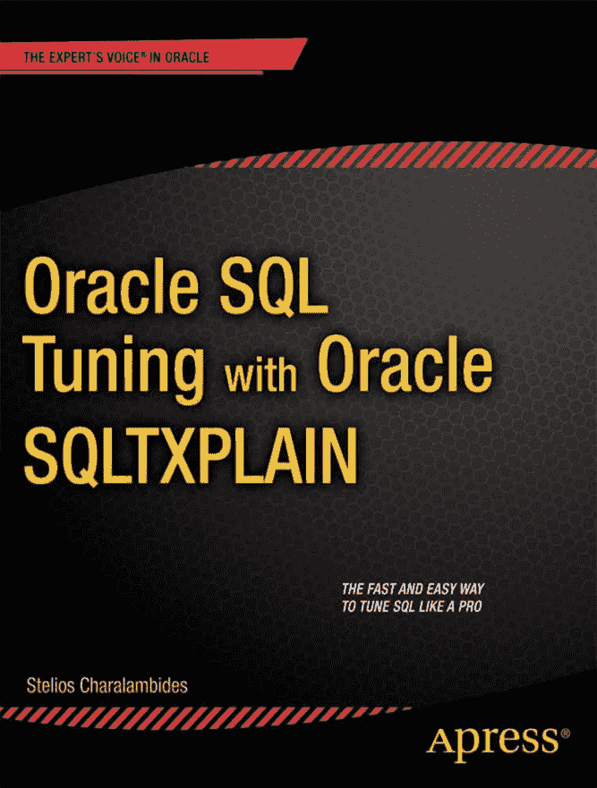

# Oracle SQL Tuning with Oracle SQLTXPLAIN

Oracle SQL Tuning with Oracle SQLTXPLAIN

斯泰利奥斯·查拉兰比季斯

## 版权声明

Oracle SQL Tuning with Oracle SQLTXPLAIN
版权所有 © 2013 斯泰利奥斯·查拉兰比季斯

本作品受版权法保护。无论涉及材料的整体还是部分，出版商保留所有权利，特别是翻译、转载、插图 reuse、朗诵、广播、缩微胶片或其他任何物理方式的复制，以及信息存储与检索、电子改编、计算机软件等方面的权利，无论是现在已知或未来开发的方法。此法律保留的例外情况包括为评论或学术分析目的而摘录的简短片段，或专门为输入和执行于计算机系统而提供的材料，仅供作品的购买者专用。仅在出版商所在地版权法现行版本的规定下，才允许复制本出版物或其部分内容，并且必须始终获得施普林格（Springer）的许可。使用许可可通过版权结算中心的 RightsLink 获取。侵权行为将根据相应的版权法追究责任。

## ISBN 信息

ISBN-13 (平装): 978-1-4302-4809-5
ISBN-13 (电子): 978-1-4302-4810-1

## 商标说明

本书中可能出现商标名称、标识和图像。我们并非在每次使用商标名称、标识和图像时都附带商标符号，而是仅在编辑性质上并为了商标所有者的利益而使用这些名称、标识和图像，无商标侵权之意。

在本出版物中使用商品名称、商标、服务标志及类似术语，即使未特别标识，也不应被视为表达意见，判断其是否可能受专有权保护。

## 免责声明

尽管本书中的建议和信息在出版时被认为是真实和准确的，但作者、编辑或出版商均不对可能出现的任何错误或遗漏承担任何法律责任。出版商对本出版物所含材料不作任何明示或暗示的保证。

## 编辑与制作团队

总裁兼出版商：保罗·曼宁
主编：乔纳森·詹尼克
策划编辑：克里斯·纳尔逊
技术审校：马克·博巴克

编辑委员会：史蒂夫·安格林，马克·贝克纳，尤安·白金汉，加里·康奈尔，路易斯·科里根，摩根·埃特尔，乔纳森·詹尼克，乔纳森·哈塞尔，罗伯特·哈钦森，米歇尔·洛曼，詹姆斯·马克汉姆，马修·穆迪，杰夫·奥尔森，杰弗里·佩珀，道格拉斯·庞迪克，本·雷诺-克拉克，多米尼克·沙克沙夫特，格温南·斯皮林，马特·韦德，汤姆·韦尔什

协调编辑：阿纳米卡·潘楚
文案编辑：迈克尔·桑德林
排版：SPi Global
索引：SPi Global
美术设计：SPi Global
封面设计师：安娜·伊什琴科

## 发行与购买信息

本书通过 Springer Science+Business Media New York 面向全球图书贸易发行，地址：233 Spring Street, 6th Floor, New York, NY 10013。电话 `1-800-SPRINGER`，传真 `(201) 348-4505`，电子邮件 `orders-ny@springer-sbm.com`，或访问 `www.springeronline.com`。Apress Media, LLC 是一家加利福尼亚州有限责任公司，其唯一成员（所有者）是 Springer Science + Business Media Finance Inc (SSBM Finance Inc)。SSBM Finance Inc 是一家特拉华州公司。

有关翻译信息，请发送电子邮件至 `rights@apress.com`，或访问 `www.apress.com`。

Apress 和 friends of ED 的图书可批量购买用于学术、企业或推广用途。大多数图书也提供电子书版本和许可证。更多信息，请参考我们的批量销售-电子书许可网页 `www.apress.com/bulk-sales`。

作者在文中引用的任何源代码或其他补充材料，读者均可访问 `www.apress.com` 获取。有关如何查找图书源代码的详细信息，请访问 `www.apress.com/source-code/`。

我将此书献给我美丽的家人，他们包容了我古怪的工作时间和无数个被笔记本电脑“绑住”的夜晚。这段旅程即将抵达终点。一如既往，莱斯莉（Lesley）是我的核心支柱。没有她，我将一事无成。感谢你帮助我实现了这一切。

## 章节概览

关于作者

关于技术审校

致谢

前言

引言

 第 1 章：`SQLTXPLAIN`简介

 第 2 章：基于成本的优化器环境

 第 3 章：对象统计信息如何导致你的执行计划出错

 第 4 章：数据倾斜如何导致你的执行时间波动不定

 第 5 章：查询转换的故障排除

 第 6 章：通过概要文件强制执行计划

 第 7 章：自适应游标共享

 第 8 章：动态采样与基数反馈

 第 9 章：在 Data Guard 物理备库中使用`SQLTXPLAIN`

 第 10 章：比较执行计划

 第 11 章：构建良好的测试用例

 第 12 章：使用`XPLORE`调查意外的计划变更

 第 13 章：跟踪文件、`TRCANLZR`以及修改`SQLT`行为

 第 14 章：运行健康检查

 第 15 章：结语

 附录 A：安装`SQLTXPLAIN`

 附录 B：CBO 参数 (11.2.0.1)

 附录 C：工具配置参数

索引

## 目录

 关于作者

 关于技术审校

 致谢

 前言

 引言

 第 1 章：`SQLTXPLAIN`简介

`SQLT`是什么？

`SQLT`的故事是怎样的？

为什么你没听说过`SQLT`？

我是如何了解到`SQLT`的？

`SQLT`入门

如何获取`SQLT`副本？

如何安装`SQLT`？

运行你的第一份`SQLT`报告

何时使用`SQLTXTRACT`，何时使用`SQLTXECUTE`

你的第一份`SQLT`报告

一些简单的导航

如何解读`SQLT`报告

基数与选择性

什么是成本？

阅读执行计划章节

连接方法

小结

##  第 2 章：基于成本的优化器环境

### 系统统计信息

### 基于成本的优化器参数

### Siebel 环境考量

### 提示

### 变更历史

### 列统计信息

### 超出范围的值

### 高估与低估

### 神秘变更之谜

### 小结

##  第 3 章：对象统计信息如何导致您的执行计划出错

### 什么是统计信息？

### 对象统计信息

### 分区

### 过时的统计信息

### 采样大小

### 如何收集统计信息

### 保存、恢复和锁定统计信息

### 午夜截断之谜

### 小结

##  第 4 章：偏斜度如何导致您的执行时间多变

### 偏斜度

### 什么是偏斜度？

### 如何判断数据是否偏斜

### 偏斜度如何影响执行计划

### 直方图

### 直方图类型

### 何时使用直方图

### 如何添加和移除直方图

### 绑定变量

### 什么是绑定变量？

### 什么是绑定变量窥探与绑定捕获？

### `Cursor_Sharing` 及其取值

### 可变执行时间之谜

### 小结

##  第 5 章：查询转换的故障排除

### 什么是查询转换？

### `10053` 跟踪文件

### 如何获取 `10053` 跟踪文件？

### `10053` 跟踪文件里有什么？

### 什么是查询转换？

### 我们为何要禁用查询转换？

## 优化器参数

### 优化器提示

### 成本计算

### 小结

##  第 6 章：通过配置文件强制执行计划

### 什么是 `SQL Profile`？

### `SQLT` 的 `SQL Profile` 从何而来？

### 您能用 `SQL Profile` 做什么？

### 如何确认您正在使用 `SQL Profile`？

### 如何将 `SQL Profile` 从一个数据库迁移到另一个数据库？

### 小结

