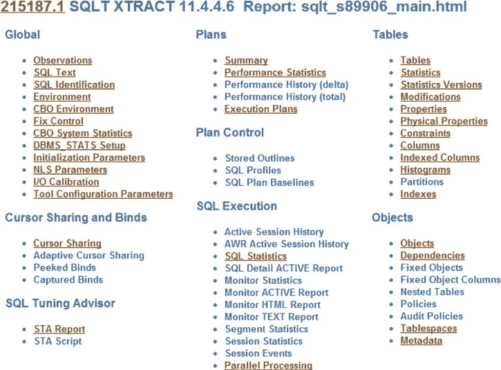
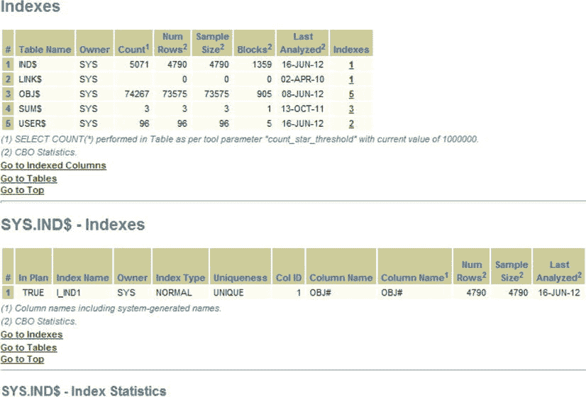
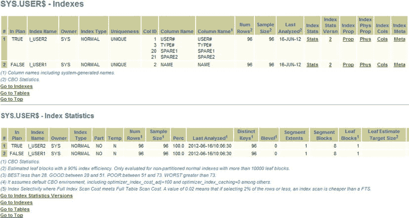
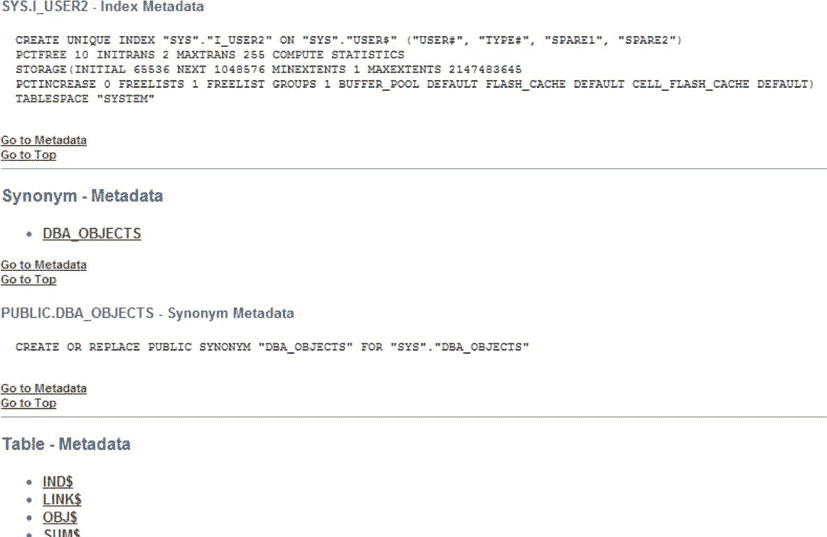
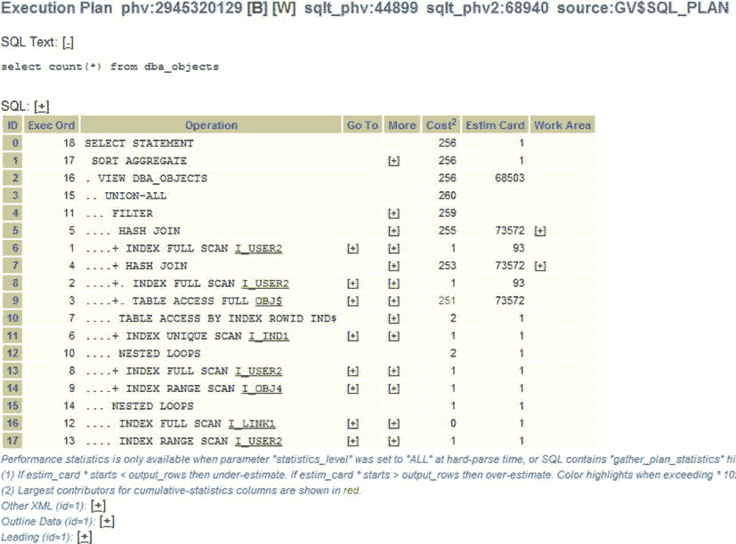
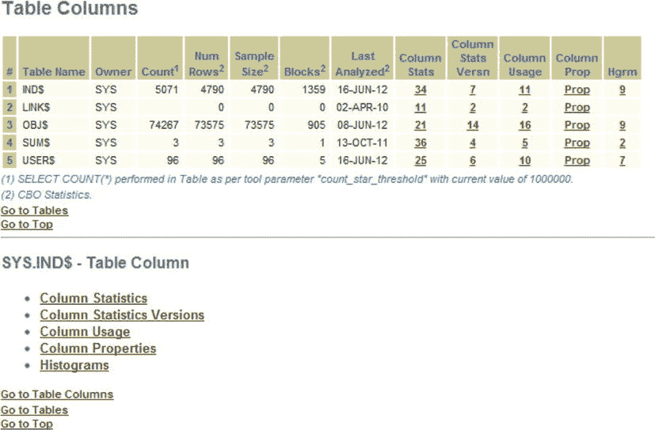
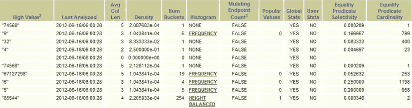

# SQLT 报告的安装与运行

## 安装步骤

1.  下载适合您环境的 SQLT zip 文件（请参阅前面的步骤）。
2.  将 zip 文件解压到合适的位置。
3.  导航到解压目录下的“install”目录（在我的情况下是 `C:\Document and Settings\Stelios\Desktop\SQLT\sqlt\install`，您的位置会不同）。
4.  以 `sys` 身份连接，例如：`sqlplus / as sysdba`。
5.  确保您的数据库正在运行。
6.  运行 `sqcreate.sql` 脚本。
7.  对第一个选项选择默认值。（我们将在附录 A 中详细介绍安装细节。）
8.  输入并确认 SQLTXPLAIN（SQLT 包的所有者）的密码。
9.  选择 SQLTXPLAIN 用户存放其包和数据的表空间（在我的情况下是 `USERS`）。
10. 选择 SQLTXPLAIN 用户的临时表空间（在我的情况下是 `TEMP`）。
11. 然后输入数据库中将使用 SQLT 包来解决调优问题的用户的 `username`。通常是运行有问题的 SQL 的架构（在我的情况下是 `STELIOS`）。
12. 然后输入“T”、“D”或“N”。这反映了您对调优和诊断包的许可证级别。大多数站点同时拥有两者，因此您可以输入“T”（这也是默认值）。我的测试系统在我的 PC 上（一个没有生产能力的评估平台），因此我也会输入“T”。如果您只有诊断包，请仅输入“D”；如果您没有这些许可证，请输入“N”。

最后您将看到的消息是“SQCREATE completed. Installation completed successfully.”。

## 运行您的第一个 SQLT 报告

SQLT 安装完成后即可使用。请记住，安装包是作为 `sys` 完成的，而运行报告是作为目标用户完成的。另外请注意，虽然我使用了 Oracle 安装文件中可用的许多标准架构示例，但您的平台和确切的 Oracle 版本可能不同，因此请不要期望您的结果与我的完全相同。但是，您的结果将与我的相似，并且您在您的环境中看到的结果应该仍然有意义。

1.  现在退出 SQL 并将目录更改为 `...\SQLT\run`。在我的情况下是 `C:\Documents and Settings\Stelios\Desktop\SQLT\sqlt\run`。从这里以目标用户身份登录到 SQLPLUS。
2.  然后输入以下 SQL（这将是我们要调整的语句）：

    ```sql
    SQL > select count(*) from dba_objects;
    ```

3.  然后从以下 SQL 获取 `SQL_ID` 值：

    ```sql
    SQL > select sql_id from v$sqlarea where sql_text like 'select count(*) from dba_objects%';
    ```

    在我的情况下，`SQL_ID` 是 `g4pkmrqrgxg3b`。

4.  现在我们从目标架构（本例中为 `STELIOS`）执行我们的第一个 SQLT 工具 `sqltxtract`，使用以下命令：

    ```sql
    SQL > @sqltxtract g4pkmrqrgxg3b
    ```

5.  输入 SQLTXPLAIN 的密码（您在安装期间输入的密码）。如果一切顺利，您将看到的最后一条消息是“SQLTXTRACT completed”。
6.  现在在 `run` 目录下创建一个 `zip` 目录，并将创建的 zip 文件复制到 `zip` 目录中。然后解压它。
7.  最后，从您喜欢的浏览器导航到并打开名为 `sqlt_s<nnnnn>_main.html` 的文件。符号“nnnnn”代表为使所有 SQLT 报告在您的机器上唯一而创建的数字。在我的情况下，该文件名为 `sqlt_s89906_main.html`。

恭喜！您已经获得了第一个可供查看的 SQLT XTRACT 报告。

## 何时使用 SQLTXTRACT 与 SQLTXECUTE

SQLT XTRACT 是最容易创建的报告，因为它不需要在生成报告时执行 SQL。该报告可以在语句执行后收集。另一方面，SQLTXECUTE 会执行 SQL 语句，因此具有更好的运行时信息和访问实际返回行的能力。这意味着它可以评估执行计划中步骤的估计基数的准确性（请参阅本章后面的“基数和选择性”）。SQLTXECUTE 将为您提供更多信息，但并非总是可以使用此方法，可能因为您处于生产环境中，或者 SQL 语句当前需要运行三天，而这正是您首先调查它的原因。我们将研究 SQLTXECUTE 和 SQLTXTRACT 报告（以及其他 SQLT 选项）。现在，我们将专注于一个非常简单的 SQL 语句上的简单 SQLTXTRACT 报告。那么，让我们开始吧。

## 您的第一份 SQLT 报告

在我们过于深入 SQLT 主报告的使用细节之前，请先看一下 图 1-1。这是一个全新的 SQLT 调优世界的开始。您兴奋吗？您应该兴奋。这个标题页仅仅是开始。从这里我们将了解一些基本的导航，以便让您了解有什么可用以及 SQLT 在导航方面是如何工作的。然后我们将看看 SQLT 实际上报告了关于 SQL 的什么信息。



图 1-1 .  SQLT 报告的顶部部分显示了指向许多区域的链接。

## 一些简单的导航

让我们从基础开始。每个超链接部分都有一个“返回顶部”超链接，可让您返回到顶部。各部分中包含大量信息，您可能会迷失方向。其他相关的超链接将分组在“返回顶部”超链接上方。例如，如果我点击“索引”（“表”标题下的最后一个链接），我将看到如 图 1-2 所示的页面。



图 1-2 .  报告的“索引”部分。

在我们迷失在 SQLT 报告中之前，让我们再次看一下标题页（图 1-1）。主要部分涵盖了系统的各个方面。

*   CBO 环境
*   游标共享
*   自适应游标共享
*   SQL 调优顾问 (STA) 报告
*   执行计划（如果计划更改，将会有多个计划）
*   SQL*Profiles
*   概要
*   执行统计信息
*   表元数据
*   索引元数据
*   列定义
*   外键

花点时间浏览一下报告。

您注意到表格内某些数据上的超链接了吗？SQLT 收集了它能找到的所有信息并将其全部交叉引用。

因此，例如，像之前一样从顶部的主报告（图 1-1）继续：

1.  点击“索引”，即“表”下的最后一个标题。
2.  在“索引”标题的“索引”列下，数字是超链接的（参见 图 1-2）。我点击了 `USERS$` 记录的 2。

现在您可以看到该表中列的详细信息（参见 图 1-3）。作为一个例子，我们在这里看到索引 `I_USER2` 在我的查询执行中被使用了（“执行计划中”列的值设置为 `TRUE`）。



图 1-3 .  索引统计信息的详细信息。

3.  现在，在“索引元数据”列中（图 1-3 的最右侧），为 `I_USER2` 索引点击“元数据”超链接，以显示如 图 1-4 所示的索引元数据。




## 如何分析 SQLT 报告

图 1-4 展示了从 “Meta” 超链接可以看到关于一个索引的元数据信息。

这里我们看到了创建这个索引所需的语句。你有脚本来执行它吗？嗯，SQLT 能做得更好更快。那么，在你看过 SQLT 报告之后，你该如何着手解决问题呢？你打开了报告，只有一秒钟来做决定。你会去哪里看？

嗯，这要视情况而定。

## 如何分析 SQLT 报告

如同任何方法论一样，针对不同的情况需要采用不同的方法。一旦你确定 SQL 有问题，就可以使用 SQLT 报告。拿到 SQLT 报告后，你会看到一个首页，它会引导你到许多不同的地方（没人会从头到尾按顺序读完一份 SQLT 报告）。那么，你会从主页面去哪里呢？

如果你完全确信执行计划是错的，你可能会直接前往 “Execution Plans” 并查看执行计划的历史记录。我们稍后会详细讨论如何查看它们。

假设你认为系统整体变慢了。那么你可能需要查看报告的 “Observations” 部分。

也许你的统计信息出了问题，那么你肯定需要查看报告 “Tables” 下的 “Statistics” 部分。

我上面提到的所有部分，都是你处理每个问题时都可能会参考的。目的是构建你 SQL 语句的完整图景，理解与查询相关的统计信息，理解基于成本的优化器（CBO）环境，并尝试进入它的“思维”。它为什么那样做？为什么它与你认为应该做的不一致？SQLT 报告就是优化器向你解释它为什么决定那样做的原因。除了少数错误，CBO 通常有充分的理由去做它所做的事。你的工作是设置好环境，使 CBO 与你的世界观一致，从而更快地运行 SQL！

## 基数与选择性

我写这本书的目标，除了让你成为超级 SQL 调优专家外，就是尽可能避免术语，并尽可能简单地解释调优概念。毕竟我们是 DBA，不是天体物理学家或火箭科学家。

所以在解释这些术语之前，理解为什么这些概念对 CBO 操作和你理解系统上运行的 SQL 至关重要。我们首先来看基数（cardinality）。它的定义是，如果一个谓词选择了某个特定列，期望该列返回的行数。如果表没有统计信息，那么这个数字基本上是基于行数、最小值和最大值以及空值数量的启发式猜测。如果你收集了统计信息，这些信息会帮助完善猜测，但它仍然是一个猜测。如果你查看表的每一行（收集 100% 的统计信息），它可能仍然是一个猜测，因为数据可能已经改变，或者数据可能是倾斜的（我们稍后会介绍偏斜度）。这个枯燥的定义并不真正贴近现实生活，所以我们来看一个例子。点击 SQLT 报告顶部的 “Execution Plans” 超链接，显示如 图 1-5 所示的执行计划。



图 1-5 .  “Execution Plan” 部分中的执行计划

在 “Execution Plan” 部分，你会看到 “Estim Card” 列。在我的例子中，查看 `TABLE ACCESS FULL OBJ$` 步骤。在 “Estim Card” 列下，值是 73,572。记住，基数是执行计划中某个步骤返回的行数。CBO（基于表的统计信息）会对基数有一个估计。“Estim Card” 列显示的是 CBO 期望从查询步骤中得到的结果。73,572 表示 CBO *期望* 从这个步骤得到 73,572 条记录，但实际上得到了 73,235。那么，对于基数（执行计划中某个步骤返回的行数）的估计，CBO 做得有多好？在我们这个简单的例子中，我们可以通过执行下面展示的查询来进行非常简单的直接比较。

```
SQL> select count(*) from dba_objects;
  COUNT(*)
----------
     73235
SQL>
```

所以基数是实际将返回的行数，但优化器当然无法预先知道答案。它必须猜测。这个猜测可能好也可能坏，取决于统计信息和偏斜度。当然，直方图在这里可以提供帮助。

关于选择性（selectivity）的例子，让我们看看通过从主页的 `Tables` 选项中选择 `Columns` 得到的页面（参考 图 1-1），如 图 1-6 所示。



图 1-6 .  SQLT 报告的 “Table Column” 部分

查看 “SYS.IND$ - Table Column” 部分。从 “Table Columns” 页面，如果我们点击 “Column Stats” 列下的 “34”，我们将看到 `SYS.IND$` 索引的列统计信息。图 1-7 显示了从 “High Value” 列到 “Equality Predicate Cardinality” 列的页面子集。查看 “Equality Predicate Selectivity” 和 “Equality Predicate Cardinality” 列（最后两列）。查看第一行 `OBJ#` 的值。



图 1-7 .  选择性在 “Equality Predicate Selectivity” 列中

选择性是 0.000209，基数是 1。

这可以解释为：“我期望这个等式谓词返回 1 行，这相当于 0.000209 的机会（1 表示肯定，0 表示不可能），或者用百分比表示，如果我得到匹配的行，我将获得整个表的 0.0209%。”

注意，随着基数的增加，选择性也会增加。选择性只在 0 到 1 之间变化（或者如果你喜欢，0% 到 100%），而基数 *应该* 只在 0 到表中的总行数（不包括空值）之间变化。我说 *应该* 是因为这些值是基于统计信息的。如果你对一个分区（假设它有 1000 万行）收集了统计信息，然后你截断了该分区，但没有告诉优化器（即，你没有收集新的统计信息，也没有清除旧的统计信息），会发生什么？如果你要求 CBO 在这种情况下生成执行计划，它可能期望从该分区的谓词中获得 1000 万行。它可能“认为”全表扫描是一个好计划。它可能会因为信息不佳而尝试做错误的事情。

总结一下，基数是期望的行数，而选择性是同样的东西，只是在 0 到 1 的范围内。那么，为什么这一切对 CBO 和制定好的执行计划如此重要呢？简短的回答是，CBO 正在努力为你制定最快、最简单的方式来获取结果。如果 CBO 对执行计划中各步骤将返回的行数有所了解，那么它就可以尝试执行计划的不同变体，并选择工作量最小、结果最快的方案。这就引出了“成本（cost）”的概念，我们将在下一节中介绍。

## 什么是成本？


