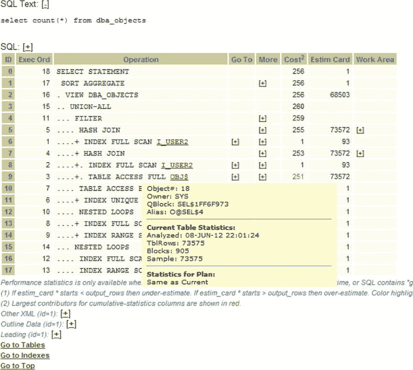
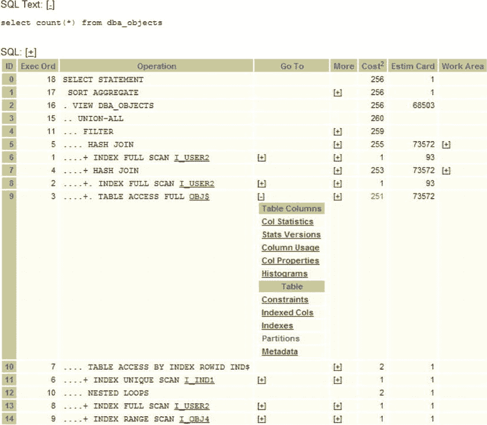
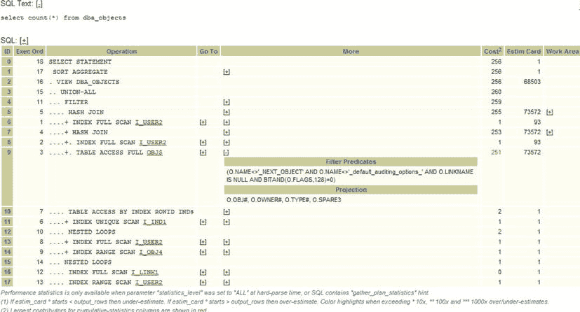

# Oracle SQL 执行计划与成本分析

## 系统指标与成本计算

我们获得了对象的基数后，就可以利用系统中的其他信息来计算任何操作的成本。系统中的其他信息包括：

*   磁盘速度
*   CPU 速度
*   CPU 数量
*   数据库块大小

这些指标可以轻松从系统中提取，也显示在 SQLT 报告中（在“`Environment`”部分）。现在可以计算系统为任何特定步骤使用的 I/O 和 CPU 资源量，从而推导出一个确定的成本。这是所有调优的关键概念。优化器总是在尝试降低操作的成本。我不打算详细介绍这些成本是如何计算的，因为确切的数值并不重要。你只需要知道这一点：**数值越高越糟糕**，而糟糕可能源于更高的基数（可能基于过时的统计信息），并且如果你的磁盘 I/O 速度设置错误（可能过于乐观地偏低），那么即使在有索引可用的情况下，全表扫描也可能更受青睐。成本也可以直接转换为（空闲系统上的）耗时，但这可能并不是大多数情况下你最需要的信息，因为你几乎总是试图减少执行时间，即降低成本。正如我们将在下一节看到的，你可以从 SQLT 获取该信息。在某些情况下，SQLT 还会生成一个 10053 跟踪文件，因此你可以查看成本计算的具体细节。

## 执行计划的阅读方法

我们之前已经见过执行计划部分。它看起来很有趣，左侧参差不齐，还有很多超链接。这一切意味着什么？这是一个相当简单的执行计划，因为它不像 SIEBEL 或 PeopleSoft 的执行计划那样长达数页。

阅读执行计划有一些简单的步骤。我相信阅读执行计划的方法不止一种，但这是我处理问题的方式。请记住，在这些例子中，如果你熟悉正在检查的 SQL 片段，你可能会直接跳到你认为有问题的部分；但一般来说，如果你是第一次看到执行计划，你会从查看几个关键成本开始。

第一个也是最重要的成本是整个查询的总成本。这总是显示为“ID 0”，并且总是执行计划的第一行。在我们的例子（如图 1-5 所示）中，成本是 256。因此，要获取整个查询的成本，只需看第一行。这也是最后执行的步骤（“`Exec Ord`”是 18）。执行顺序不是从上到下，Oracle 引擎将按照“`Exec Ord`”列所示的值顺序执行步骤。所以，如果我们跟踪执行过程，Oracle 引擎将按以下顺序执行：

1.  `INDEX FULL SCAN I_USER2`
2.  `INDEX FULL SCAN I_USER2`
3.  `TABLE ACCESS FULL OBJ$`
4.  `HASH JOIN`
5.  `HASH JOIN`
6.  `INDEX UNIQUE SCAN I_IND1`
7.  `TABLE ACCESS BY INDEX ROWID IND$`
8.  `INDEX FULL SCAN I_USERS2`
9.  `INDEX RANGE SCAN I_OBJ4`
10. `NESTED LOOP`
11. `FILTER`
12. `INDEX FULL SCAN I_LINK1`
13. `INDEX RANGE SCAN I_USERS2`
14. `NESTED LOOPS`
15. `UNION-ALL`
16. `VIEW DBA_OBJECTS`
17. `SORT AGGREGATE`
18. `SELECT STATEMENT`

然而，没有人会这样表示 SQL 语句的计划。重要的是要认识到，左侧的参差不齐提供了步骤如何执行的信息。缩进较少的操作表示在内部（缩进更多的）操作上执行的外部操作。例如，步骤 2、3 和 4 可以理解为：“使用`I_USERS2`执行索引全扫描，然后对`OBJ$`执行全表扫描，并将这些结果进行`HASH JOIN`以产生一个结果集。”每个操作为缩进较少的部分产生结果，直到最终结果呈现给`SELECT (ID = 0)`。

“`Operation`”列也标有“+”和“–”以指示缩进相等的部分。这对于对齐操作以查看一个操作正在处理哪些结果集很有帮助。例如，重要的是要认识到步骤 5 的`HASH JOIN`正在使用来自步骤 1、4、2 和 3 的结果。我们稍后会看到更复杂的例子。同样重要的是要认识到，所示的成本也是每个操作的聚合成本。所以第一行显示的成本是整个操作的成本，我们还可以看到整个操作的大部分成本来自步骤 3。（SQLT 会以红色显示成本最高的操作）。现在让我们更详细地看看步骤 1（如图 1-5 所示）。在我们的简单例子中，这是：

```
INDEX FULL SCAN I_USER2
```

让我们将整行翻译成英文：“首先为我执行索引`I_USERS2`的全扫描。我估计将返回 93 行，根据你当前的系统统计信息（单块读取时间和多块读取时间以及 CPU 速度），成本将为 1。”

第二和第三步是另一个`INDEX FULL SCAN`和对`OBJ$`的`TABLE ACCESS FULL`。这第三步的成本是 251。整个 SQL 语句的总成本是 256（首行）。因此，如果我们希望优化这个语句，我们知道收益必须来自这第三步（总成本 256 中它占了 251 的成本）。现在，将你的光标悬停在步骤 3 的“TABLE”一词上（参见图 1-8）。



图 1-8。通过“悬停”在链接上可以获取更多详细信息

请注意如何显示有关对象的信息。

*   `Object#`: 18
*   `Owner`: SYS
*   `Qblock`: SEL$1FF6F973
*   `Alias`: O@SEL$4
*   当前表统计信息：
*   `Analyzed`: 08-JUN-12 22:01:24
*   `TblRows`: 73575
*   `Blocks`: 905
*   `Sample` 73575

只需将鼠标悬停在对象上，你就可以获得其所有者、查询块名称、上次分析时间以及对象的大小。

现在让我们看看“`Go To`”列。注意到该列下的“+”了吗？点击步骤 3 对应的“+”，你将得到一个类似图 1-9 的结果。



图 1-9。通过展开执行计划上的部分可以显示更多超链接

因此，从执行计划出发，你可以直接跳转到“`Col Statistics`”或“`Stats Versions`”或其他许多内容。你根据自己目前的理解以及你认为执行计划哪里有问题来决定下一步去哪里。现在关闭那个展开的区域，点击步骤 3“`More`”列下的“+”（参见图 1-10）



图 1-10。这里我们看到“More”标题下的扩展内容

现在我们看到了过滤谓词和投影。这些可以帮助你理解优化器在执行计划的哪一行考虑谓词，以及哪些值用于过滤器。

在第一个执行计划正上方有一个名为“`Execution Plans`”的部分。这列出了 Oracle 引擎为该 SQL 看到的所有不同执行计划。因为执行计划可以存储在系统中的多个地方，所以在报告的“`Execution Plans`”部分中很可能有多个条目。其来源将被注明（在“`Source`”列下）。以下是我遇到过的来源列表：

*   `GV$SQL_PLAN`
*   `GV$SQLAREA_PLAN_HASH`
*   `PLAN_TABLE`
*   `DBA_SQLTUNE_PLANS`
*   `DBA_HIST_SQL_PLAN`


SQLT 会尽可能多地在多个位置查找执行计划，以便为您提供全面的选项。当 SQLT 收集此信息时，它会查看与每个计划相关的成本，并用红色的“W”（最差）和绿色的“B”（最佳）进行标记。在我的简单测试案例中，“最佳”和“最差”是相同的，因为实际只有一个执行计划。但是，您会注意到有三条记录：一条来自挖掘内存 `GV$SQL_PLAN`，一条来自 `PLAN_TABLE`（即 `EXPLAIN PLAN`），还有一条来自 `DBA_SQLTUNE_PLANS`（SQL 调优分析器），其来源是 `DBA_SQLTUNE_PLANS`。

当您在这里拥有许多记录（或许是很长的历史记录）时，您可以回溯查看哪些计划是最佳的，并尝试找出它们发生变化的原因。注意变化的时间点有时至关重要，因为它能帮助您精准定位到导致情况恶化的变更。

在我们深入探讨“执行计划”章节的更多细节用法之前，我们需要更复杂的示例。

## 连接方法

本书侧重于使用 SQLT 进行非常实用的性能调优。我尽量避免不必要的概念和调优细枝末节。因此，我不会涵盖所有可用的连接方法，也不会介绍所有可能包含性能相关信息的 DBA 表，或者每一个提示。这些内容在众多资料中都有详细记载，尤其是 Oracle 性能指南（我推荐阅读）。然而，我们需要介绍一些基本概念，以确保我们能从使用 SQLT 中获得最大收益。例如，这里有一些简单的连接。顾名思义，连接是一种将两个数据集“连接”在一起的方式：一个数据集可能包含姓名和年龄，另一个表可能包含姓名和收入水平。在这种情况下，您可以“连接”这些表以获取特定年龄和收入水平的人的姓名。正如操作名称所暗示的，必须有东西能将两个数据集连接起来：在我们的例子中，就是姓名。那么，有哪些简单的连接呢？（即我们在 SQLT 报告中会看到的那些）。

*   `哈希连接 (HASH JOINS, HJ)` – `较小`的表被散列并放入内存。然后扫描`较大`的表以查找与内存中散列值匹配的行。如果大小表顺序颠倒，这种方式效率低下。如果表不大，这种方式效率低下。如果较小的表无法完全放入内存，那么这就不仅仅是效率低下了：情况会非常糟糕！
*   `嵌套循环 (NESTED LOOP, NL)` – 如果表较小，嵌套循环连接更合适。请注意上面的执行计划示例中，一个是 `HASH JOIN`，另一个是 `NESTED LOOP`。为什么为每个任务选择了不同的连接方式？每种连接方法的细节及其相关成本可以从 `10053 跟踪文件`中确定。通过调整优化器参数 `Optimizer_index_cost_adj` 和 `optimizer_index_caching` 来提升索引和 NL 的使用是一种常见做法。但这通常不是一个制胜策略。这些参数应设置为默认值 `100` 和 `0`。首先应致力于正确获取对象和系统统计信息。
*   `笛卡尔连接 (CARTESIAN JOINS)` – 通常效果不佳。第一张表的每一行都被用作键来访问第二张表的每一行。如果连接表中的行数非常少，这种连接方式尚可。在大多数生产环境中，如果您看到这种情况发生，那么一定有问题，通常是统计信息的问题。
*   `排序合并连接 (SORT MERGE JOINS, SMJ)` – 如果内存允许，通常会在内存中进行连接。如果基数很高，那么您会期望看到 SMJ 和 HJ。

## 本章小结

在本章中，我们介绍了使用 `SQLTXTRACT` 的基础知识。这是 SQLT 的一种简单方法，不会执行有问题的 SQL 语句。它从所有可能的来源提取所需信息，并将其呈现在报告中。

在本章中，我们了解了 SQLT 的简单下载和安装。您已经看到，在本地数据库上安装 SQLT 可以花费很少时间，并且其使用非常简单。生成的报告易于解压，可用于调查 SQL 性能。在这个第一个例子中，我们简要提到了基数和选择性，以及它们如何影响基于成本的优化器的计划。现在，让我们探索 SQLT 的更多功能，并看一些更复杂的例子。

