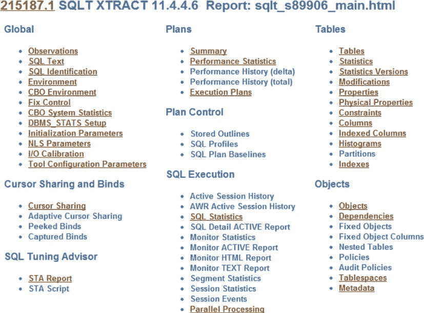
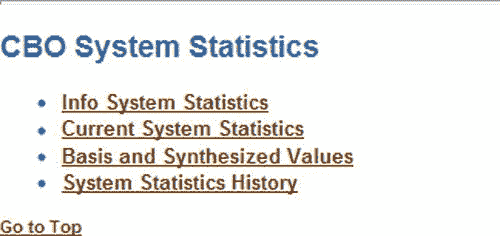
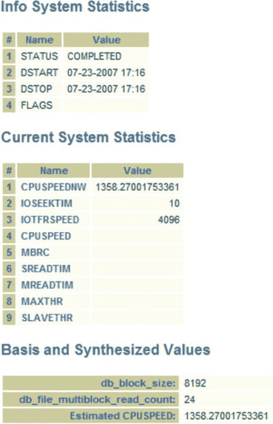
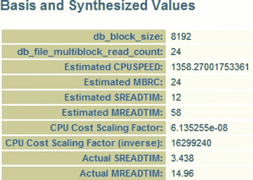
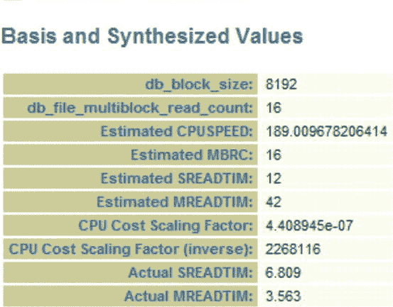
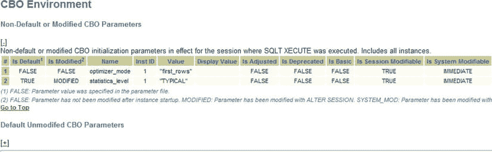
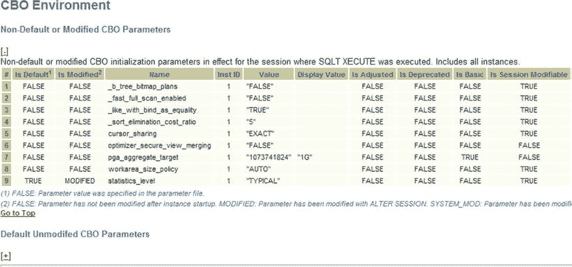
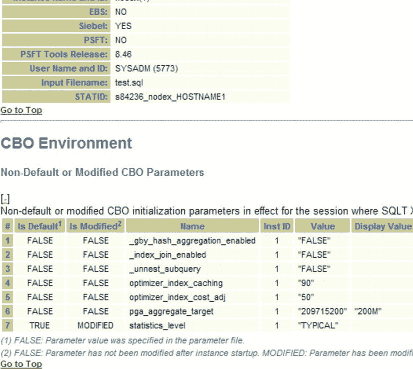
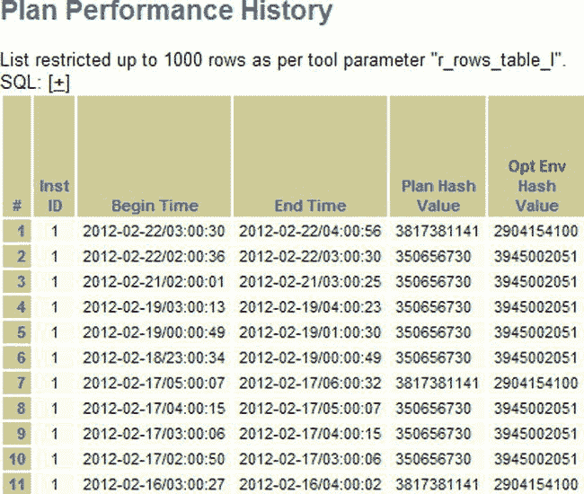

# 第 2 章


## 基于成本的优化器环境

当我在解决棘手的调优问题时，常常会想起那个来到地球尝试开车的外星人的故事。他阅读了所有相关资料，了解了引擎涉及的物理原理。听起来很有趣。他坐到驾驶座上，转动点火开关；引擎平稳地运转起来，电子设备也启动了。他系好安全带，试探性地踩下油门踏板。什么也没发生。啊！也许是手刹没松。他松开手刹，再次踩下油门。还是什么也没发生。后来，他站在车外，纳闷为什么车动不了，还奇怪为什么车顶会接触路面。

我这个有点奇怪的类比，是想指出在调优某样东西之前，你需要大致了解它应该是什么样子。`200ms` 的单块读取时间合理吗？系统统计信息应该收集 `1 分钟` 吗？对于大表连接，我们应该使用哈希连接吗？在经验丰富的人眼中，有 `1001` 件事看起来不对劲，但对优化器来说，这就是事实。

就像那个外星人一样，基于成本的优化器 (CBO) 正努力从您的系统中获取最佳性能。它知道一些基本规则和推测（启发式方法），但不了解您特定的系统或数据。您必须告诉它您拥有什么。您必须告诉外星人，黑色圆形的橡胶东西需要接触路面。如果您对优化器“撒谎”，那么它可能会得出错误的执行计划，而我说的错误是指计划执行性能会很差。在极少数情况下，启发式方法被不恰当地使用，或者代码中存在错误，导致 CBO 采取不恰当的捷径（查询转换），从而给出错误的结果。除此之外，优化器通常表现不佳是因为它一开始得到的信息质量就不高。给它高质量的信息，您通常就能获得良好的性能。

那么，如何判断“环境”是否适合您的系统呢？在本章中，我们将探讨这个环境的多个方面。我们将从（常被忽视的）系统统计信息开始，然后查看影响 CBO 的数据库参数。我们会简要提及 Siebel 环境，并简单看一下直方图（下一章将更详细地介绍）。最后，我们会探讨高估和低估的问题（SQLT 的最佳功能之一就是突出显示这些问题），然后深入一个真实案例，在那里您可以扮演侦探，通过研究示例来磨练您的调优技巧（不要偷看答案）。事不宜迟，让我们从系统统计信息开始。

### 系统统计信息


系统统计信息是基于成本的优化器环境中常被忽视的部分。如果系统未收集任何系统统计信息，那么 SQLT 的“当前系统统计信息”部分将显示许多重要的系统参数为空。示例如图 2-3 所示。它会对这些值进行猜测。但您为何要在意这些值是否提供给优化器呢？没有这些值，优化器将凭其最佳猜测来调整一系列关键操作的时间估算。这将导致在应使用全表扫描时却使用了不合适的索引，反之亦然。这些设置至关重要，以至于在某些工作负载发生变化（例如从日间 OLTP 转向夜间 DW（数据仓库）环境）的动态环境中，应加载不同的系统统计信息集。在本节中，我们将探讨这些设置为何影响优化器、应如何以及何时收集它们，以及在 SQLT 报告中需要关注什么。

让我们回顾一下 HTML 报告第一部分的样貌（参见图 2-1）。请记住，这是一个包含多个部分的巨大 HTML 页面。



图 2-1 .  SQLT 报告的顶部部分

从主屏幕的“全局”部分，选择“CBO 系统统计信息”。这将带您进入可以看到标题“CBO 系统统计信息”的部分（参见图 2-2）。



图 2-2 .  “CBO 系统统计信息”部分

现在点击“信息性系统统计信息”。图 2-3 显示了您将看到的内容。



图 2-3 .  “信息性系统统计信息”部分

“信息性系统统计信息”部分显示了关于您环境的许多重要信息。此截图还显示了“当前系统统计信息”以及“基础值和合成值”部分的顶部。

注意`系统统计信息`收集开始的时间。它始于 2007 年 7 月 23 日（相当久以前了）。此后工作负载变化大吗？是否添加了任何新设备？新的`SAN`驱动器？更快的磁盘？所有这些都可能影响系统的性能特征。您甚至可能拥有一个在不同时间段需要不同系统统计信息集的系统。

注意到系统统计信息还有其他奇怪之处吗？开始和结束时间几乎相同。开始和结束时间`应该`被安排为代表性工作负载的`开始`和`结束`时刻收集系统特征信息。这些值意味着它们是在数据库创建时设置且从未更改过。查看图 2-4 中显示的“基础值和合成值”部分。



图 2-4 .  来自“信息性系统统计信息”部分正下方的“基础值和合成值”部分

预估的`SREADTIM`（单块读取时间，毫秒）和`MREADTIM`（多块读取时间，毫秒）分别为 12 毫秒和 58 毫秒，而实际值（其下方）为 3.4 毫秒和 15 毫秒。这些是好的值吗？可能难以判断，因为现代`SAN`系统能提供极高的 I/O 读取速率。对于传统的非 SAN 系统，通常期望多块读取时间高于单块读取时间，通常分别在 9 毫秒和 22 毫秒左右。在此案例中，它们处于合理范围内。单块读取时间小于多块读取时间（您会预期如此，对吧？）。

现在在图 2-5 中查看来自另一个系统的截图。




图 2-5. 信息系统统计信息下的基准值与合成值部分

注意到实际 `SREADTIM` 和实际 `MREADTIM` 有什么异常之处了吗？

除了实际 `SREADTIM` 为 6.809 毫秒（一个较低的值）而实际 `MREADTIM` 为 3.563 毫秒（同样是一个较低的值）这一事实之外，问题在于实际 `MREADTIM` 小于 `SREADTIM`。如果你看到这样的数值，你应该警惕一种可能性：全表扫描的成本可能会被计算得比需要单块读取的操作更低。

对优化器而言，`MREADTIM` 小于 `SREADTIM` 意味着什么？这大致相当于你告诉优化器，汽车车顶贴地倒着开也没问题。这是本末倒置的。如果优化器将图 2-5 中的值当作事实，它会倾向于选择涉及多块读取的执行步骤。例如，优化器会偏好全表扫描。这对你的运行时执行来说可能非常糟糕。另一方面，如果你拥有一个快速的 SAN 系统，你的实际 `MREADTIM` 可能确实很低。

以上只是一个错误数值如何将优化器引入歧途的例子。在这个特定案例中，实际上没有实际值、仅依赖优化器的猜测（即估计的 `SREADTIM` 和 `MREADTIM` 值）反而会更好。那些猜测会比这些实际值更准确。

如何修正我刚刚描述的这种情况？这比你想象的要容易得多。解决此类问题的步骤如下所列：

1.  选择一个能代表你工作负载的时间段。例如，你可以有一个名为 `WORKLOAD` 的日间工作负载。
2.  创建一个表来存放统计信息。在下面的例子中，我们将表命名为 `SYSTEM_STATISTICS`。
3.  在所选时间段内运行 `GATHER_SYSTEM_STATS` 过程来收集统计信息。
4.  使用 `DBMS_STATS.IMPORT_SYSTEM_STATS` 导入这些统计信息。

让我们更详细地查看在 2 小时间隔内收集系统统计信息的步骤。第一步，我们创建一个表来存放将要收集的值。第二步，我们调用例程 `DBMS_STATS.GATHER_SYSTEM_STATS`，其 `INTERVAL` 参数设置为 120 分钟。请记住，`interval` 参数的选择应能反映你具有代表性的工作负载周期。

```
exec DBMS_STATS.CREATE_STAT_TABLE ('SYS','SYSTEM_STATISTICS');
BEGIN
   DBMS_STATS.GATHER_SYSTEM_STATS ('interval',interval => 120, stattab => 'SYSTEM_STATISTICS', statid => 'WORKLOAD');
END;
/
execute DBMS_STATS.IMPORT_SYSTEM_STATS(stattab => 'SYSTEM_STATISTICS', statid => 'WORKLOAD', statown => 'SYS');
```
完成上述操作后，你可以从 SQLT 报告或一个 `SELECT` 语句中查看这些值。

```
SQL> select * from sys.aux_stats$;

SNAME                          PNAME                               PVAL1 PVAL2
------------------------------ ------------------------------ ---------- ------------------
SYSSTATS_INFO                  STATUS                                    COMPLETED
SYSSTATS_INFO                  DSTART                                    09-29-2012 11:01
SYSSTATS_INFO                  DSTOP                                     09-29-2012 11:02
SYSSTATS_INFO                  FLAGS                                   0
SYSSTATS_MAIN                  CPUSPEEDNW                        972.327
SYSSTATS_MAIN                  IOSEEKTIM                              10
SYSSTATS_MAIN                  IOTFRSPEED                           4096
SYSSTATS_MAIN                  SREADTIM                            8.185
SYSSTATS_MAIN                  MREADTIM                           55.901
SYSSTATS_MAIN                  CPUSPEED                              972
SYSSTATS_MAIN                  MBRC
SYSSTATS_MAIN                  MAXTHR
SYSSTATS_MAIN                  SLAVETHR
```


### 基于成本的优化器参数

CBO 决策过程（用于制定你的执行计划）的另一个输入是 CBO 参数。这些参数控制着基于成本的优化器行为的各个方面。例如，`optimizer_dynamic_sampling` 控制着 SQL 执行时要进行的动态采样级别。如果能快速查看每个系统，并看到那些参数列表被从默认值修改过，岂不是很好？使用 SQLT，在“CBO 环境”下就能立即找到这个列表。

图 2-6 就是一个几乎没有任何改动的例子。这很容易看出来，因为在这个 SQLT HTML 报告的这一部分只有 2 行记录。其中 `optimizer_mode` 已被从默认值修改。如果你在这里看到数百个条目，那么你应该仔细查看这些条目，并评估被修改的参数中是否有任何导致了问题。这个例子代表了一位喜欢让系统保持原样的 DBA。



图 2-6 . CBO 环境部分。仅 2 条记录表明系统非常接近默认设置。

图 2-7 展示了一个不止两个参数被从默认设置修改过的例子。现在，不再是前一个例子的 2 行，我们有 8 个非默认值。每一个这样的参数都需要被证明其合理性。



图 2-7 . 具有许多非标准参数设置的 CBO 环境。

我们还设置了 4 个隐藏参数（它们以下划线开头）。在这个例子中，每一个隐藏参数都应该被仔细研究，看看是否能解释其原因。如果你保存了仔细的记录或注释了你的更改，你可能会知道为什么 `_b_tree_bitmap_plans` 被设置为 FALSE。然而，像这样的参数常常会毫无解释地在系统中设置多年。

以下是常见的解释：

*   有人很久以前改的，我们不知道为什么，而且他/她现在已经离开了。
*   我们不想改，怕会破坏什么东西。

这个部分很有用，通常可以给你一些关于过去（也许你刚到当前站点）更改了什么的线索。要特别注意隐藏参数。Oracle 支持团队会仔细检查这些参数，并判断它们存在的理由是否仍然成立。通常来说，隐藏参数不太可能对你有益，尤其是当你不知道它们是干什么用的时候。当然，你不能直接从生产系统中移除它们。你必须在测试系统上执行关键的 SQL 语句，然后在那个测试系统上移除那些参数，看看对整个优化器成本有什么影响。

如果你精通了这个操作，你甚至可以为不同的工作负载设置不同的统计表，导入它们，并在不需要时删除旧的统计信息。要删除现有的统计信息，你会使用

```sql
SQL> execute DBMS_STATS.DELETE_SYSTEM_STATS;
```

然而，关于设置和删除系统统计信息，有一点需要警惕。这种操作会影响系统中每一个 SQL 的 CBO 行为。因此，对这些参数的任何更改都应该谨慎进行，并在合适的测试环境中彻底测试。

### Siebel 环境考量

有些环境很特殊，仅仅是因为 Oracle 工程部门认为一套特殊的参数对它们更好。Siebel Systems 客户关系管理（CRM）应用程序就是这种情况。Oracle 工程部门已经确定了一些隐藏参数，能使你的系统获得最佳性能。如果你的系统是 Siebel，那么在“环境”部分你会看到类似图 2-8 所示的内容。



图 2-8 . 一个 Siebel CRM 环境的参数设置示例。

Siebel 调优的“必去之处”是“Oracle 数据库上 Siebel CRM 应用程序的性能调优指南”白皮书。可以在说明 781927.1 中找到。这份文档中有很多有用的信息，但关于优化器参数，第 9 页列出了为获得良好性能而应设置的非默认参数。例如，`optimizer_index_cashing` 应设置为 0。

在这些值都正确之前，甚至不要尝试在 Siebel 系统上调整你的 SQL。例如，在上述 Siebel 系统上，如果出现性能问题，第一步将是根据说明 781927.1 修正所有错误的参数。除非这个基础已经到位，否则你不可能期望从一个 Siebel CRM 系统中获得稳定的性能。

### 提示

创建提示是为了让 DBA 和开发人员能够对优化器被允许做出的选择施加一些控制。一个提示的例子是 `USE_NL`。在下面的例子中，我创建了两个最小化的表，分别叫做 `test` 和 `test2`，每个表只有一行数据。不出所料，如果我让优化器选择计划，它会使用 `MERGE JOIN CARTESIAN`，因为这些表中都只有一行数据。

```sql
SQL> select
  test.col1,
  test2.col1
from
  test,
  test2
where
  test.col1=test2.col1;
      COL1       COL1
---------- ----------
         1          1
         1          1
SQL> set autotrace traceonly explain;
SQL> /
Execution Plan
Plan hash value: 1571755046

| Id  | Operation            | Name  | Rows  | Bytes | Cost (%CPU)| Time     |

|   0 | SELECT STATEMENT     |       |     2 |    52 |     6   (0)| 00:00:01 |
|   1 |  MERGE JOIN CARTESIAN|       |     2 |    52 |     6   (0)| 00:00:01 |
|   2 |   TABLE ACCESS FULL  | TEST2 |     1 |    13 |     3   (0)| 00:00:01 |
|   3 |   BUFFER SORT        |       |     2 |    26 |     3   (0)| 00:00:01 |
|*  4 |    TABLE ACCESS FULL | TEST  |     2 |    26 |     3   (0)| 00:00:01 |

Predicate Information (identified by operation id):

4 - filter("TEST"."COL1" = "TEST2"."COL1")
Note

- dynamic sampling used for this statement (level=2)
SQL> list
  1* select
  test.col1,
  test2.col1
from
  test,
  test2
where
  test.col1=test2.col1
```

上面的命令 `list` 显示了之前的 DML（数据操作语言）。然后我修改了 SQL，加入了一个提示。所有提示的语法都以 `/*+` 开头，以 `*/` 结尾。对于 `USE_NL`，括号内的部分可以接受多个代表表的条目（可以是表名，如我们的例子，或者如果是别名的话）。这是修改后的查询。

```sql
SQL> select /*+ USE_NL(test) */ * from test, test2 where test.col1=test2.col1;

Execution Plan

Plan hash value: 74026472

| Id  | Operation          | Name  | Rows  | Bytes | Cost (%CPU)| Time     |

|   0 | SELECT STATEMENT   |       |     2 |    52 |     6   (0)| 00:00:01 |
|   1 |  NESTED LOOPS      |       |     2 |    52 |     6   (0)| 00:00:01 |
|   2 |   TABLE ACCESS FULL| TEST2 |     1 |    13 |     3   (0)| 00:00:01 |
|*  3 |   TABLE ACCESS FULL| TEST  |     2 |    26 |     3   (0)| 00:00:01 |

Predicate Information (identified by operation id):

3 - filter("TEST"."COL1"="TEST2"."COL1")
Note

-   dynamic sampling used for this statement (level=2)
```

注意第二个执行计划中是如何使用了 `NESTED LOOP` 的。

我们是在对优化器说：“我们知道你没我们聪明，所以忽略规则吧，在这一点上就按我们想的做。”


## 使用 Hints 的考量与执行计划分析

有时使用提示是正确的，但有时却是错误的。偶尔，提示是从旧代码中继承下来的，而移除它们以期望性能提升，则需要开发者有足够的勇气。提示也是优化器（CBO）在制定执行计划过程中的一种数据输入形式。之所以常常需要提示，是因为提供给优化器的其他信息是错误的。例如，如果对象统计信息错误，你可能就需要 `需要` 给优化器一个提示，因为它的统计信息是错的。

这是使用提示的正确方式吗？不是。这样使用提示的问题在于，它可能在被应用时是正确的，但后来可能就错了，而事实上很可能就是如此。如果你想调优代码，首先移除那些提示，让优化器自由运行，去“感受”数据的脉动，摆脱束缚。确保它拥有良好且最新的统计信息，然后看看它会得出什么结果。

### 获取 SQL 文本与执行计划

你总是可以通过点击 SQLT 报告顶部的“SQL Text”链接来获取你正在评估的 SQL 文本。这是另一个查询示例。这次我们使用了一个包含两个别名的 `USE_NL` 提示。

```sql
SQL> set autotrace traceonly explain;
SQL> select cust_first_name, amount_sold
  2  from customers C, sales S
  3  where c.cust_id=s.cust_id and amount_sold>100;
SQL> REM
SQL> REM 这是执行计划
SQL> REM
```

```
执行计划

Plan hash value: 3549450340

| Id  | Operation            | Name      | Rows  | Bytes |TempSpc| Cost (%CPU)| Time     |

|   0 | SELECT STATEMENT     |           |   144K|  3107K|       |  1118   (2)| 00:00:14 |
|*  1 |  HASH JOIN           |           |   144K|  3107K|  1304K|  1118   (2)| 00:00:14 |
|   2 |   TABLE ACCESS FULL  | CUSTOMERS | 55500 |   650K|       |   405   (1)| 00:00:05 |
|   3 |   PARTITION RANGE ALL|           |   144K|  1412K|       |   496   (4)| 00:00:06 |
|*  4 |    TABLE ACCESS FULL | SALES     |   144K|  1412K|       |   496   (4)| 00:00:06 |

谓词信息 (由操作 ID 标识):

1 - access("C"."CUST_ID"="S"."CUST_ID")
   4 - filter("AMOUNT_SOLD">100)
```

我只展示了执行计划的一部分，因为我们只对操作（在“Operation”列下）感兴趣。`Id` 为 1 的操作显示的是哈希连接。这可能是合理的，因为 `sales` 表中有超过 90 万行数据。拥有最多行的对象（本例中是 `SALES`）首先被读取，然后是 `CUSTOMERS`（只有 55,500 行）。因此，如果我们决定改用嵌套循环，我们会像这样在代码中添加一个提示：

```sql
SQL> select /*+ USE_NL(C S) */
  cust_first_name,
  amount_sold
from
  customers C,
  sales S
where
  c.cust_id=s.cust_id
  and amount_sold>100;
```

```
执行计划

Plan hash value: 4237376444

| Id  | Operation                    | Name         | Rows  | Bytes | Cost (%CPU)| Time     |

|   0 | SELECT STATEMENT             |              |   144K|  3107K|   145K  (1)| 00:29:03 |
|   1 |  NESTED LOOPS                |              |       |       |            |
|   2 |   NESTED LOOPS               |              |   144K|  3107K|   145K  (1)| 00:29:03 |
|   3 |    PARTITION RANGE ALL       |              |   144K|  1412K|   496   (4)| 00:00:06 |
|*  4 |     TABLE ACCESS FULL        | SALES        |   144K|  1412K|   496   (4)| 00:00:06 |
|*  5 |    INDEX UNIQUE SCAN         | CUSTOMERS_PK |     1 |       |     0   (0)| 00:00:01 |
|   6 |   TABLE ACCESS BY INDEX ROWID| CUSTOMERS    |     1 |    12 |     1   (0)| 00:00:01 |

谓词信息 (由操作 ID 标识):

4 - filter("AMOUNT_SOLD">100)
   5 - access("C"."CUST_ID"="S"."CUST_ID")
```

提示被包含在 `/*+` 和 `*/` 之间，和之前一样。这些提示括号内的任何内容都会被优化器考虑。但重要的是要认识到，提示（本例中是 `USE_NL(C S)`）必须是有效的。注意现在操作已经改变了。现在的计划是使用嵌套循环，而不是哈希连接。成本比哈希连接计划高得多，达到了 145,000，但优化器必须遵守这个提示，因为它是有效的。如果提示无效，则不会产生错误，优化器会继续执行，就像没有提示一样。看看会发生什么。

```sql
SQL> select /*+ MY_HINT(C S) */ cust_first_name, amount_sold
from
  customers C, sales S
where c.cust_id=s.cust_id and amount_sold>100;
```

```
执行计划

Plan hash value: 3549450340

| Id  | Operation            | Name      | Rows  | Bytes |TempSpc| Cost (%CPU)| Time     |

|   0 | SELECT STATEMENT     |           |   144K|  3107K|       |  1118   (2)| 00:00:14 |
|*  1 |  HASH JOIN           |           |   144K|  3107K|  1304K|  1118   (2)| 00:00:14 |
|   2 |   TABLE ACCESS FULL  | CUSTOMERS | 55500 |   650K|       |   405   (1)| 00:00:05 |
|   3 |   PARTITION RANGE ALL|           |   144K|  1412K|       |   496   (4)| 00:00:06 |
|*  4 |    TABLE ACCESS FULL | SALES     |   144K|  1412K|       |   496   (4)| 00:00:06 |

谓词信息 (由操作 ID 标识):

1 - access("C"."CUST_ID"="S"."CUST_ID")
   4 - filter("AMOUNT_SOLD">100)
```

优化器看到了我的提示，但没有将其识别为有效的提示，于是忽略了它并自行决定，本例中它回到了哈希连接。

### 执行历史变更

在调查性能问题时，了解 SQL 性能何时发生变化至关重要。像“昨天还好好的”这样的模糊报告不够精确，尽管它们可能通过将你的分析引导到 SQLT 报告中的特定时间段来提供帮助。优化器环境的每一次更改（参数更改）都有时间戳。每次执行更改时，都会创建一个新的执行计划，该计划也有时间戳。每次执行 SQL 语句时，其度量指标都会被收集并存储在 AWR 存储库中。这与 Oracle 中自动建议 SQL 改进功能使用的数据源相同。SQLT 利用这些数据源来构建你所选 SQL ID 的执行历史。这座信息宝库只需在 SQLT HTML 报告顶部点击一下即可访问。点击“Plans”标题下的“Performance History”链接。根据你的 SQL 在系统中执行的次数，你可能会看到类似图 2-9 中的截图。完整的 HTML 报告中还有其他列，但我们现在将讨论限制在“Opt Env Hash Value”上。



图 2-9 .  优化器环境哈希值（Optimizer Env Hash Value）在 2 月 22 日从 3945002051 变为 2904154100。这意味着 CBO 环境在那一天有某些方面发生了变化。

查看图 2-9 中该语句历史的“Opt Env Hash Value”。对于我们正在分析的这一条 SQL 语句，根据其“开始时间”和“结束时间”列表，我们看到其他变化正在发生。例如，执行计划哈希值（针对同一条 SQL 语句）改变了，“Opt Env Hash Value”也改变了。它的值是`2904154100`，直到 2012 年 2 月 17 日。然后它变为`3945002051`，再变回`2904154100`，然后又变回`3945002051`（在 2 月 18 日）。优化器环境的某些方面在那些日期发生了变化。这些变化是改善了情况还是使之恶化？请注意，每次优化器哈希值变化时，执行计划的哈希值也随之变化。有某人或某事在改变优化器的环境并影响执行计划。

### 列统计信息


