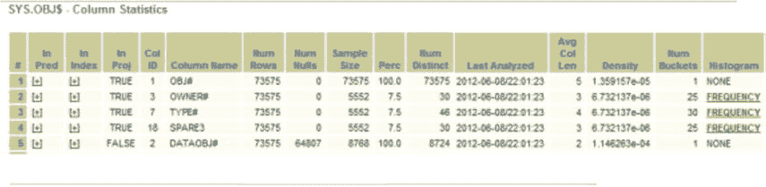
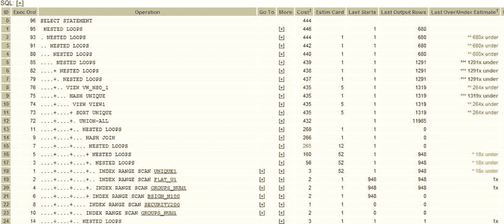
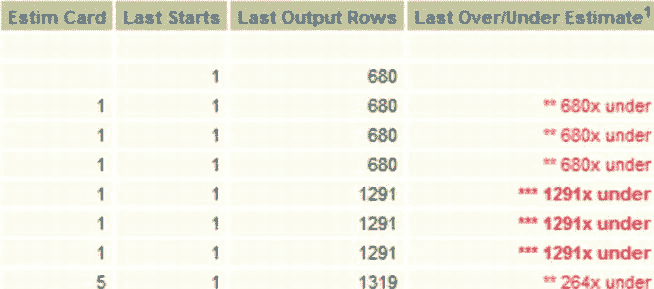
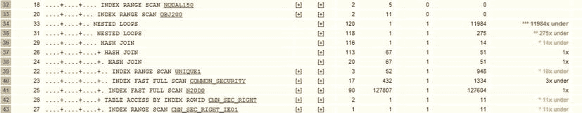

# 观察与直方图问题

其中一个 SQLT 报告示例（我们查看的第一个）在观察部分包含以下行：

| TABLE | SYS.OBJ$ | 表包含 4 个在谓词中引用的列，其不同值的数量与桶的数量不匹配。 |

如果我按照主 HTML 报告顶部的链接查看列统计信息（点击“Columns”然后“Column Statistics”），可以在图 2-10 中看到结果。

图 2-10 .  列统计信息

统计信息的第二行对应`OWNER#`表列。向右看`Num Distinct`值。您会看到它是 30，表示估计的不同值数量。收集统计信息时，可能确实有大约 30 个不同的值。但请注意“Histogram”列！它显示了一个包含 25 个桶的`FREQUENCY`类型直方图。在`FREQUENCY`类型直方图中，每个可能的值都有一个用于保存该值数量的桶。例如，如果从 1 到 255 的每个值都只有一个值，那么每个桶将包含一个“1”。如果第一个桶（标记为“1”）中有 300，这表示值 1 在数据中出现了 300 次。优化器使用这些保存在桶中的数字来计算检索与该值相关的数据的成本。因此，在上面的例子中，检索“1”会比从同一个表中检索“2”成本更高（因为“1”的值更多）。如果我们有 10 个桶（每个桶有其`FREQUENCY`值），然后我们尝试检索某些数据并找到一个“11”，那么优化器必须猜测这个新值从未被收集过，并对值的可能性做出某些假设（例如，对于高于最大值和低于最小值的情况，可能性会急剧下降）。范围中间没有桶的值会被插值。因此，如果您拥有的桶少于 255 个，那么在`FREQUENCY`直方图中拥有少于实际桶数是没有充分理由的。这没有任何意义。这种异常的结果是，为`OWNER#`列保存的直方图信息将缺少五个不同的值。如果这些不同的值很常见，并且您正在故障排除的查询恰好在谓词中使用了它们，优化器将不得不猜测它们的基数。

想象一下，例如以下情况：

1.  想象一个包含“STELIOS”和“STEVEN”两个桶的直方图。现在我们添加第三个桶“STEPHAN”，他恰好是`OBJ$`中对象的所有者。
2.  假设`STELIOS`和`STEVEN`的直方图值如下：
    *   `STELIOS` – 100 个对象
    *   `STEVEN` – 110 个对象
    *   这意味着对于这个特定表，`STELIOS`拥有 100 条对象记录，`STEVEN`拥有 110 条对象记录。因此，当创建直方图时，`STELIOS`和`STEVEN`的桶分别填充了 100 和 110。
3.  进一步假设`STEPHAN`实际拥有 500 个对象，因此他在表中有 500 条记录。优化器并不知道这一点，因为`STEPHAN`是在收集统计信息之后的某个时间创建的。

优化器现在猜测`STEPHAN`的基数为 105，而实际上`STEPHAN`有 500 个对象。因为`STEPHAN`按字母顺序介于`STELIOS`和`STEVEN`之间，优化器假定`STEPHAN`的`Num Distinct`值介于其他两个用户的值之间（105 是相邻两个桶的平均值）。结果是 CBO 对基数的猜测将偏离很远。我们会在执行计划中看到这一点（例如，如果我们运行`SQLT XECUTE`，会是一个低估），然后我们可以深入查看`OWNER#`列，并发现列统计信息是错误的。要解决这个问题，我们会为`SYS.OBJ$`收集统计信息。当然，在这种情况下，由于我们使用的示例是`SYS`对象，收集统计信息有特殊过程，但通常这种问题会发生在用户表上，应使用正常的`DBMS_STATS`收集过程。

## 超出范围值

当 CBO 必须在两个值之间猜测基数时，它所面临的情况已经足够糟糕，但还不如下一种情况：谓词中的值超出范围——要么大于统计信息所见的最大值，要么小于统计信息所见的最小值。在这些情况下，优化器假设超出范围值的估计值逐渐趋近于零。如果该值远高于最高值，优化器可能会估计一个非常低的基数，例如 1。基数为 1 可能会促使优化器尝试笛卡尔连接，如果实际基数是 10,000，这将导致非常差的性能。解决此类问题的方法将是相同的。

1.  使用`XECUTE`获取执行计划。
2.  在“执行计划”部分查看执行计划，并如前所述查看“more”下的谓词。
3.  查看谓词中列的统计信息，看看是否有问题。麻烦迹象的例子包括：
    *   a. 缺失的桶（如前一节所述）
    *   b. 没有直方图但数据高度偏斜

当数据在当前数据集的高端或低端插入时，超出范围的值可能特别麻烦。无论如何，通过研究`SQLT`中出现的直方图，您很有机会了解您的数据及其随时间的变化情况。这对于设计调整 SQL 或收集良好统计信息的策略来说是宝贵的信息。

### 高估与低估

现在让我们看一个 SQL 片段的示例，它有如此多的连接，以至于操作数量达到了 96 个。参见图 2-11，它显示了生成的执行计划的一小部分。

图 2-11 .  执行计划的一小部分，包含 96 个步骤

我们如何处理有 96 个或更多步骤的执行计划？我们是否需要将该计划交给开发团队并告诉他们去调优？使用`SQLT`，您不需要这样做。

让我们更详细地查看此页面，放大右上角部分并查看屏幕上的高估和低估部分（参见图 2-12）。

图 2-12 .  显示执行计划高估和低估部分的右上角区域

我们知道图 2-12 是一个 `SQLT XECUTE` 报告（我们知道这点是因为报告中包含了过高和过低的估算值）。但这些过高和过低的估算值具体是什么呢？"最近过高/过低估算"列中的数字表示，对于该操作，优化器预期的实际行数出错了多少倍。返回的行数也依赖于前一个操作返回的行数。因此，举例来说，如果我们按照"执行顺序"（参见图 2-11）逐步跟踪操作计数，我们会得到以下步骤：

1.  `索引范围扫描` 实际返回了 948 行
2.  `索引范围扫描` 实际返回了 948 行
3.  步骤 1 和步骤 2 的结果被输入到一个 `嵌套循环` 中，该循环实际返回了 948 行
4.  `索引范围扫描` 实际返回了 948 行
5.  `嵌套循环`（前一步结果与步骤 3 结果的组合）

依此类推。处理这类问题的最佳方法是阅读执行计划中的步骤，理解它们，查看过高和过低的估算值，并由此确定需要重点关注的环节。

现在来看图 2-13。步骤 ID 34（这是图 2-13 中的第三行，也是执行计划中的第 33 步。记住执行顺序由操作名称左侧紧邻的数字显示，例如 `索引范围扫描`）显示低估了 11,984。这个 `嵌套循环` 是其下方部分操作的结果。我们可以点击"更多"列中的"+"号，深入探究估算值如此的原因。通过"更多"列，我们可以查看访问谓词，并了解为何估算的基数与实际返回的行数存在差异。

图 2-13. 过高和过低的估算值可以是很好的线索

因此，对于这样的大型语句，我们会处理每个访问谓词、每个过高和过低的估算值，从估算误差最大的开始，逐步到最小的，直到弄清楚每一个的原因。在某些情况下，原因可能是统计信息过时。在其他情况下，可能是数据分布不均。有了 `SQLT`，查看一个 200 行的执行计划就不再是一件令人畏惧的事情了。如果你能针对优化器关注的每个误差（它预期 10 行却得到了 1000 行）进行处理，你就能一步步地修正执行计划。你不需要用提示（hint）来强行让 `CBO` 变成你*猜测*可能正确的形状。你只需要确保它拥有良好的系统性能统计信息、单块和多块读取时间统计信息、CPU 速度统计信息和对象统计信息。一旦所有正确的统计信息到位，优化器就会生成一个好的执行计划。如果执行计划有时正确有时错误，那么你可能正在处理数据分布不均的情况，在这种情况下，你需要考虑使用直方图。我们将在第 4 章中更详细地专门讨论偏斜度。

## 神秘变更之谜

现在你已经对 `SQLT` 及其使用方法有了一些了解，我们可以看一个事先对问题一无所知的例子。场景如下：

一位开发人员找到你，说他的 SQL 在前一天下午 3 点之前都运行良好。它按照他期望和预期的方式执行哈希连接，所以他去吃了午饭。当他回来时，执行计划完全变了。开始使用各种奇怪的位图索引。他的数据没有改变，他也没有收集任何新的统计信息。发生了什么？他最后说："真的，我什么都没改。"

一旦你确认数据没有变化，并且没有人添加（或删除）任何新索引后，你要求提供一份 `SQLT XECUTE` 报告（因为这个 SQL 运行时间相当短，而且这是一个开发系统）。

拿到报告后，你查看执行计划。你碰巧首先看到的是图 2-14 中的那个计划。

