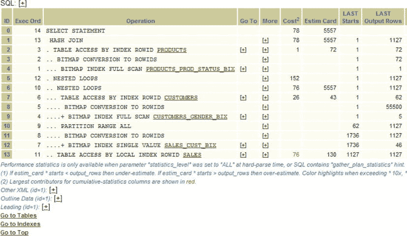
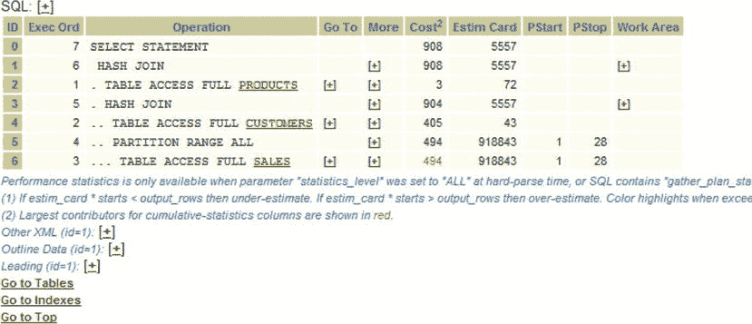
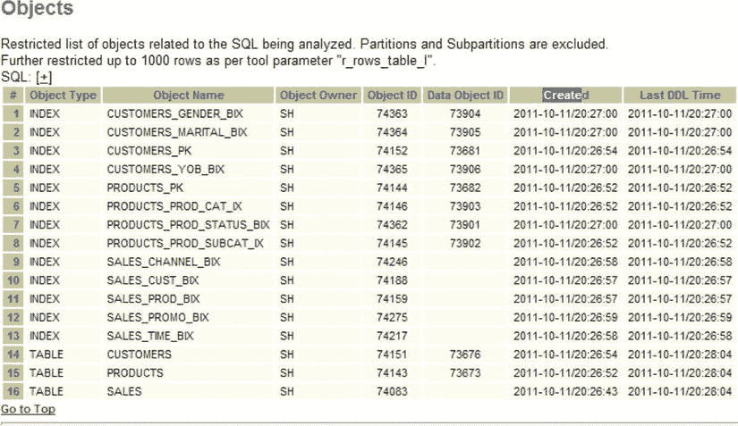
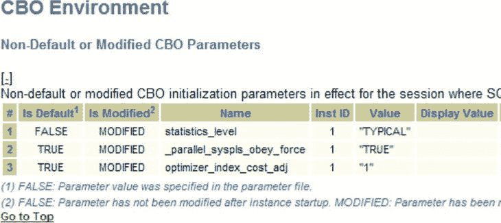
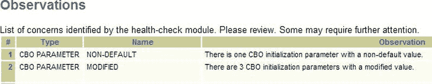

# 执行计划分析与调优



图 2-14 .  正在研究的执行计划

查看该计划，您可以确认开发者关于“奇怪”的执行计划和奇怪的位图索引的说法。实际上，这个计划本身并无奇怪之处。只是第一步是：

```
... BITMAP INDEX FULL SCAN PRODUCTS_PROD_STATUS_BIX
```

这一步不在开发者最初的计划中。因此开发者认为它很奇怪。对于我们正在处理的这一个 SQL 语句，我们怀疑至少存在 2 个执行计划（一个 SQL 语句可以有数十个执行计划，而 SQLT 会捕获所有这些计划）。

在执行计划列表的下方，我们看到确实有使用哈希连接和全表扫描的计划。请参见图 2-15，它显示了开发者正在处理的同一个 SQL 的不同执行计划。在此执行计划中，返回的行与之前的执行计划相同，总成本为 908。



图 2-15 .  显示哈希连接的执行计划

到目前为止，我们知道有一个涉及哈希连接和位图索引的计划，而早先有使用全表扫描的计划。如果我们查看统计信息收集的时间，会发现确实是在这些查询执行之前收集的统计信息。这是一件好事，因为统计信息应该在查询执行之前收集！

 `注意`  顺便提一下，SQLT 能够快速轻松地呈现所有相关信息是其最大的优势。它让侦探工作不再需要猜测。如果没有 SQLT，您可能需要费力编写查询来显示统计信息收集的时间。而使用 SQLT，统计信息收集的时间就在报告中。您可以在思考问题的同时进行检查！

因此，统计信息没有改变，SQL 文本也没有改变。可能是在午餐期间添加了一个索引。您可以通过查看报告的对象部分来确认，如图 2-16 所示。



图 2-16 .  对象信息及创建时间

图 2-16 中的对象部分将确认索引`PRODUCTION_PROD_STATUS_BIX`的创建日期。如您所见，在`BITMAP INDEX FULL SCAN`中使用的索引是很久以前创建的。那么我们现在处于什么情况？

让我们回顾一下事实：
*   没有添加新的索引。
*   计划已更改——它使用了更多的索引。
*   统计信息没有变化。

现在您需要考虑还有什么可以改变执行计划。以下是一些可能性：
*   系统统计信息。我们检查了这些，它们看起来正常。了解正常情况的样子对此有帮助。
*   提示（Hints）。我们检查确认。SQL 文本中没有提示。
*   CBO 参数。我们查看并看到了图 2-17 中的值。



图 2-17 .  CBO 环境部分

图 2-17 显示了`statistics_level`，`_parallel_syspls_obey_force`和`optimizer_index_cost_adj`。这是在“非默认 CBO 参数”部分，所以您知道它们不是正常值。由于`optimizer_index_cost_adj`是一个用于调整优化器为索引计算成本的参数，这可能与我们执行计划的更改有关。然后注意到“观察结果”部分（见图 2-18）突出显示存在非标准参数。



图 2-18 .  HTML 报告的“观察结果”部分显示了非默认参数观察，在本例中为 1 个非默认参数

如果您查找`optimizer_index_cost_adj`，您会看到其默认值是 100，而不是 1。所以现在您有了一个可行的理论：问题可能出在这个参数上。

现在您可以转到用户终端，运行他的查询，将会话的`optimizer_index_cost_adj`值设置为 100，重新运行查询，并查看不同的执行计划。我们在下面看到结果。

```
Execution Plan

Plan hash value: 725901306

| Id  | Operation             | Name      | Rows  | Bytes | Cost (%CPU)| Time     ||

|   0 | SELECT STATEMENT      |           |  5557 |   303K|   908   (3)| 00:00:11 ||
|*  1 |  HASH JOIN            |           |  5557 |   303K|   908   (3)| 00:00:11 ||
|   2 |   TABLE ACCESS FULL   | PRODUCTS  |    72 |  2160 |     3   (0)| 00:00:01 ||
|*  3 |   HASH JOIN           |           |  5557 |   141K|   904   (3)| 00:00:11 ||
|*  4 |    TABLE ACCESS FULL  | CUSTOMERS |    43 |   516 |   405   (1)| 00:00:05 ||
|   5 |    PARTITION RANGE ALL|           |   918K|    12M|   494   (3)| 00:00:06 ||
|   6 |     TABLE ACCESS FULL | SALES     |   918K|    12M|   494   (3)| 00:00:06 ||

Predicate Information (identified by operation id):

1 - access("S"."PROD_ID"="P"."PROD_ID")
   3 - access("C"."CUST_ID"="S"."CUST_ID")
   4 - filter("C"."CUST_FIRST_NAME"='Theodorick')
SQL> alter session set optimizer_index_cost_adj=1;
Session altered.
SQL> @q2
Execution Plan
Plan hash value: 665279032

| Id  | Operation                           | Name                     |Rows |Bytes|Cost(%CPU)|
|   0 | SELECT STATEMENT                    |                          | 5557| 303K|  78   (7)|
|*  1 |  HASH JOIN                          |                          | 5557| 303K|  78   (7)|
|   2 |   TABLE ACCESS BY INDEX ROWID       | PRODUCTS                 |   72|2160 |   1   (0)|
|   3 |    BITMAP CONVERSION TO ROWIDS      |                          |     |     |          |
|   4 |     BITMAP INDEX FULL SCAN          | PRODUCTS_PROD_STATUS_BIX |     |     |          |
|   5 |   NESTED LOOPS                      |                          |     |     |          |
|   6 |    NESTED LOOPS                     |                          | 5557| 141K|  76   (6)|
|*  7 |     TABLE ACCESS BY INDEX ROWID     | CUSTOMERS                |   43| 516 |  26   (4)|
|   8 |      BITMAP CONVERSION TO ROWIDS    |                          |     |     |          |
|   9 |       BITMAP INDEX FULL SCAN        | CUSTOMERS_GENDER_BIX     |     |     |          |
|  10 |     PARTITION RANGE ALL             |                          |     |     |          |
|  11 |      BITMAP CONVERSION TO ROWIDS    |                          |     |     |          |
|* 12 |       BITMAP INDEX SINGLE VALUE     | SALES_CUST_BIX           |     |     |          |
|  13 |    TABLE ACCESS BY LOCAL INDEX ROWID| SALES                    |  130|1820 |  76   (6)|
Predicate Information (identified by operation id):
   1 - access("S"."PROD_ID"="P"."PROD_ID")
   7 - filter("C"."CUST_FIRST_NAME"='Theodorick')
  12 - access("C"."CUST_ID"="S"."CUST_ID")
```

现在我们有了原因和解决方案，可以将其应用于单个会话或整个系统。

当然，下一步是找出为什么`optimizer_index_cost_adj`被这样设置，但那是另一个故事了，涉及那位初级 DBA（或者至少希望不是您！）他认为是在会话级别设置该参数，但结果却是系统级别。

## 摘要


