# 对象统计信息如何使你的执行计划出错

在本章中，我们学习了基于成本的优化器算法的输入项以及这些输入项如何影响优化器。为了使优化器能够有效且高效地工作，需要以反映你的环境使用情况和业务需求的方式来考虑和设置这些输入项。`SQLTXPLAIN` 通过收集信息并以易于理解的方式展示，有助于处理所有环境方面的考量。`SQLTXPLAIN` 还能有帮助地突出显示那些异常元素，以便你能更严格地审视它们，并决定这些元素是否必要且是否符合你的意图。在下一章中，我们将讨论 `CBO` 环境中最重要的方面之一：对象统计信息。这些统计信息到目前为止收集起来最耗时，并且非常频繁地是性能问题的根源。我们将探讨缺乏统计信息、统计信息收集时机不当以及这项重要维护工作的其他要素所带来的影响。


在本章中，我们将讨论一个如果你正在进行 `SQL` 调优就被认为非常重要的话题。收集对象统计信息至关重要；这就是为什么 Oracle 花费了如此多的时间和精力，使统计信息收集过程尽可能简单和轻松。他们知道，在大多数情况下，`DBA` 们在压力下需要在允许的微小维护窗口内尽快完成工作，他们会选择最简单直接的方式。如果有一个复选框写着“点击我，你所有的统计信息烦恼都将结束”，他们会点击它，然后转向下一个问题。

当然，自动程序多年来已经改进，用于自动收集对象（尤其是列）统计信息的最新算法非常复杂。然而，这并不意味着你可以忽视它们。你需要关注正在收集的内容，并确保它适合你的数据结构和查询。在本章中，我们将介绍分区如何影响你的执行计划和统计信息捕获。我们还将探讨如何处理抽样错误、如何锁定统计信息以及何时应该执行此操作。如果这听起来很无聊，那么 `SQLT` 就介入其中，使整个过程变得更简单、更快速。让我们从对象统计信息开始。

### 什么是统计信息？

当 `SQL` 性能不佳时，质量差的统计信息是最常见的原因。质量差的统计信息涵盖范围广泛的可能缺陷：

*   样本量不足。
*   样本收集不频繁。
*   某些对象没有样本。
*   在不需要时收集直方图。
*   在需要时未收集直方图。
*   在错误的时间收集统计信息。
*   在直方图上使用非常小的样本量进行收集。
*   未使用更高级的选项（如扩展统计信息）来设置相关列之间的关联。
*   依赖自动样本收集而不检查收集的内容。

至关重要的是要认识到，基于成本的优化器 (`CBO`) 的使命是制定一个运行快速的执行计划，并快速制定它。让我们稍微分解一下：

*   “快速制定。” 优化器几乎没有时间进行解析或获取对象的统计信息，或者尝试多种连接方法的变体，更不用说检查 `SQL` 优化并制定它认为良好的计划了。它不能花费很长时间来做这件事，否则，制定计划所花的时间可能比执行工作本身还要长。
*   “运行快速。” 这里，关键理念是“实际耗时”很重要。`CBO` 并非试图最小化 `I/O` 或 `CPU` 周期，它只是试图减少经过的时间。如果你有多个 `CPU`，并且 `CBO` 能有效地利用它们，它将选择并行执行计划。

第 1 章 讨论了基数，即满足谓词的行数。这意味着任何操作的成本由三类操作组成：

*   单块读取的成本
*   多块读取的成本
*   执行所有操作所用 `CPU` 的成本

当你看到一个成本为 1,000 时，这实际意味着什么？执行计划中一个操作的成本为 1,000，意味着所花费的时间大约相当于进行 1,000 次单块读取的成本。所以在这种情况下，1,000 x 12 毫秒，得出 12 秒（12 毫秒是典型的单块读取时间）。

那么，`CBO` 采取哪些步骤来确定最佳执行计划呢？用非常宽泛的术语来说，查询会被转换（应用任何适用的快捷方式），然后通过查看表的大小并决定哪个表在连接中作为内表、哪个作为外表来生成计划。会尝试不同的连接顺序和不同的访问方法。这里的“尝试”是指优化器将经历有限数量的步骤（记住，它的目标是快速制定计划）来计算每个选项的成本，并通过排除过程得到最佳计划。有时优化器尝试的选项并不是完整的计划列表，这意味着它可能错过最佳计划；但这极为罕见。

这是操作的估算阶段。如果正在评估的操作是全表扫描，这将基于行数、行的平均长度、磁盘子系统的速度等进行估算。

现在我们知道了优化器在尝试为你获取正确计划时做了什么，我们可以看看当对象统计信息具有误导性时可能会出什么问题。

### 对象统计信息

构成对象统计信息的主要组件是表和索引。为简化讨论，我们将主要关注表统计信息，但相同的原则适用于所有对象。在上面提到的硬解析的估算阶段，即估算表的大小和选择连接方式的阶段，表中的行数至关重要。一个简单的例子是在嵌套循环连接和哈希连接之间做出选择。如果行数错误，那么连接方法可能就是错误的。统计信息可能出错的其他方式是过时。让我们看图 3-1 中的示例。在此示例中，我们看到 `TABLE_A`（一个非分区表）的“表统计信息”，其 `行数` 值为 87,116，分析比例为 100%。

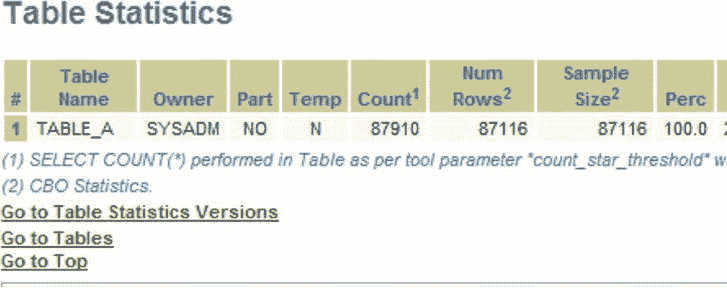

图 3-1 。在“表统计信息”部分，你可以看到表中的行数、样本大小以及此样本代表的数据集总百分比

对象统计信息是 `CBO` 的重要输入，但即使这些信息在统计信息过时的情况下也可能误导优化器。`CBO` 还会使用过去的执行历史记录来确定是否需要更好的抽样（基数反馈），或者利用绑定变量窥探来确定使用众多潜在执行计划中的哪一个。许多人依赖将所有设置为 `AUTO`，但这并非万能药。如果你不了解并监控自动设置为你做了什么，当错误发生时你可能无法察觉。

为了澄清，用最简单的话说，为什么当统计信息过时优化器会出错？毕竟，一旦你收集了关于表的所有这些统计信息，为什么还要再次收集呢？让我们做一个思想实验，就像坐在维也纳电车上的爱因斯坦那样。


假设你被告知某个分区中只有很少的几行（`<1,000` 行）。你很可能会进行全表扫描而不使用索引，但如果你的统计信息已过时，并且在上次运行统计信息之后加载了大量数据（比如 250 万行），并且所有这些数据都匹配你的谓词条件，那么你的执行计划就会是**次优的**。这是调优术语中对“性能回退”的说法，而“性能回退”在调优术语中也就是“对你的经理来说太慢了”。这突显了在正确时间收集统计信息的重要性；是在数据加载**之后**，而不是之前。

到目前为止，我们已经提到了表统计信息，以及这些统计信息需要具备正确的质量和及时性。多年来，随着数据集变得越来越大，表也变得越来越大。一些单独的表变得非常大（达到 TB 级别）。这使得处理这些表变得更加困难，纯粹是因为对这些表的操作耗时更长。Oracle 公司很早就看到了这一趋势，并引入了表分区。这些迷你表将大表按不同的键拆分成更小的部分。一个常见的键是日期。因此，一个表的一个分区可能覆盖 2012 年。这限制了这些分区的大小，并允许对各个分区单独执行操作。这是一项伟大的创新（需要相应的许可费用），它简化了 DBA 的许多日常工作，并为 SQL 优化提供了极佳的优化器机会。例如，如果一个分区是按日期分区的，并且你在谓词中使用了日期，那么你可能能够使用**分区修剪**，即只查看匹配的分区。拥有此特性，一方面为响应时间的改善带来了巨大机会，另一方面也加大了你犯错的可能性。就像表一样，分区也需要为其收集良好的统计信息才能有效工作。

### 分区

分区是处理大型数据集的好方法，特别是那些不断增长的数据集。使用范围分区，或者更好的是，使用间隔分区。这些工具允许将“旧”数据和“新”数据分开并区别对待，例如归档旧数据或对其进行压缩。无论出于何种原因，许多机构都使用分区来组织其数据。特别是基于日期的分区，在分区刚创建后，通常会创建一个包含零行或极少数行的新分区（有关这种情况的示例，请参见 图 3-2）。新的分区 `MAIN_TABE_201202` 有零行（它刚刚被创建），但其他分区有数百万行。

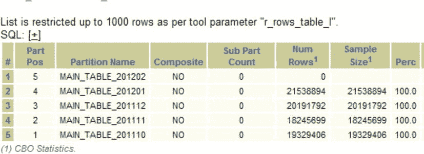

图 3-2 . 一个新创建的分区将具有与旧分区不同的特征。在本例中，`MAIN_TABLE_201202` 中的行数为零

对于刚刚完成的分区，任何新添加的数据都不会导致实际数据与统计信息之间发生巨大变化，但对于新创建的分区，优化器目前认为该分区有零行。如果就在收集统计信息几小时后，现在有 10,000 行数据，这将如何影响执行计划？这种分区的“初始化”可能对执行计划产生巨大影响，那种影响会随着时间推移而出现和消失。例如，在月初表现很差，然后逐渐变好。

这类情况需要仔细把握统计信息收集的时机和良好的采样比例。在新分区创建后的一段时间内，可能有些时期需要采用更高的分区采样收集百分比，以便收集该时间段内任何异常偏斜的数据。意识到正在发生（或可能发生）什么，就已经成功了一半。如果数据加载后不久进行更多的统计信息收集不是一种可行的选择，那么你可能不得不求助于 SQL 概要文件，甚至提示。

### 过时的统计信息

从 SQLT 的角度来看，如果表中超过 10% 的数据发生了变化，那么该统计信息会在“过时统计信息”列中被标记为“YES”。在下面的示例中（图 3-3），你可以看到一个具有过时统计信息的索引。

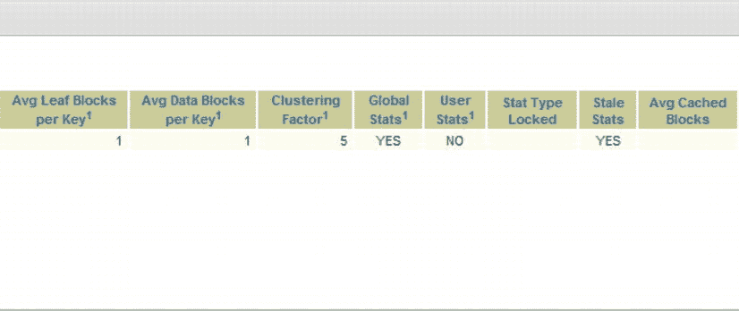

图 3-3 . 在此示例中显示了一个索引行，其“过时统计信息”列为“YES”，表示该索引的统计信息已过时

你应该如何处理这些信息？这取决于具体情况。有时过时的统计信息不是问题；即使表的变化超过了 10%，数据在统计意义上可能仍然相同。10% 是一个相当随意的数字，在某些情况下，你可能会觉得它太低或太高。如果是这样，你总是可以更改它：

`SQL> exec dbms_stats.set_table_prefs(null,'USER2','STALE_PERCENT',5)`

话虽如此，如果你在特定表或索引的“过时统计信息”列中看到“YES”，你应该怎么做？简单的答案（再次）是“视情况而定”。这就像一个谋杀悬疑故事。如果你已经怀疑是管家干的，然后你看到他口袋里有一把枪，那可能就是一个很好的线索。

这里的关键点是，该列将是一个线索，表明某些地方出了问题，并且可能在你当前的调查中具有重要意义。例如，假设你有一个表，每天创建并加载一个间隔分区。除非你在新分区加载数据后每天都运行统计信息收集，否则它的统计信息将被标记为“过时”。关键是要认识到，统计信息收集是 Oracle 提供的一个工具，你可以以多种不同的方式使用它。这种控制必须基于你对架构、数据模型以及你预期在数据库上运行的查询的了解。

### 采样大小

这是统计信息收集最受热议的要点之一。许多站点依赖于 `DBMS_STATS.AUTO_SAMPLE_SIZE`，对于某些情况（如果不是大多数情况）来说，这是一个不错的选择，但它并不完美。它只是一个良好的起点。如果你的查询没有问题，并且统计信息收集在合理的时间内运行，那就保持默认设置，去做些更有用的事情吧。

如果你努力收集所需的统计信息级别以使你的在线日常高效运行，你可能需要仔细查看你正在收集的统计信息。如果 100% 采样不可行，那么计算一下你实际有多少时间，并尝试达到那个百分比。审视你收集的内容，看看是否全部需要。如果你在收集模式统计信息，那么问问自己：模式中的所有表都在使用吗？你是否在没有偏斜度的列上收集统计信息？在这种情况下，你是在浪费资源收集那些对优化器无关紧要的信息。理所当然地，更改统计信息收集采样大小应谨慎进行，逐步调整，并留出足够的时间来评估效果。这正是测试系统的用途。

你可以通过从 SQLT 报告中单击 `DBMS_STATS` 设置超链接，查看你在系统上设置的内容（图 3-4）。

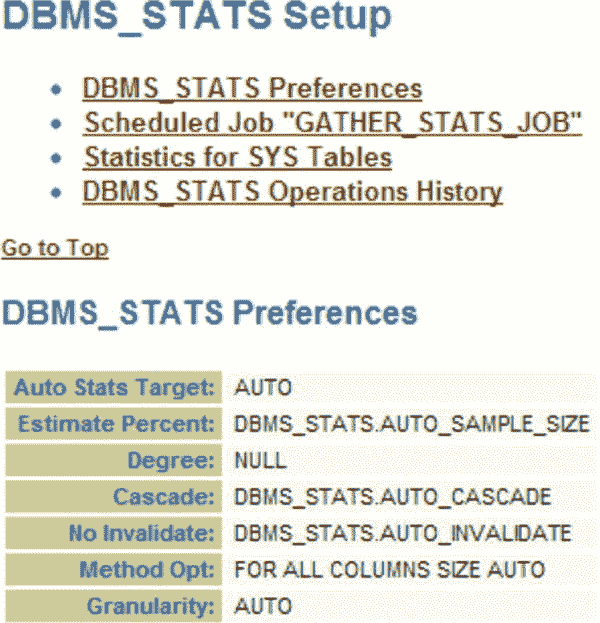

图 3-4 . 检查你的 `DBMS_STATS` 首选项设置总是好的。在此示例中，所有设置均为默认值

在这里你可以看到 `DBMS_STATS` 的首选项。所有设置都是 `AUTO`。采样大小是 `DBMS_STATS.AUTO_SAMPLE_SIZE`；级联设置是 `DBMS_STATS.AUTO_CASCADE`；方法选项设置为 `FOR ALL COLUMNS SIZE AUTO`。


这些设置中的任何一项会导致问题吗？一般来说不会。然而，有时样本大小可能会非常小。这是算法设计者有意为之，旨在减少收集这些列统计信息所花费的时间。如果太多样本相似，算法就会判定没有必要进一步查找，并结束对该列的信息收集。如果我们从`SQLT`报告的顶部点击`columns`，就能看到报告的`Table Columns`（表列）区域。在这里，我们可以看到列统计信息。特别值得关注的是样本大小及其所代表的百分比（大约在报告的中部位置）。有关该区域的示例，请参见图 3-5（我只显示了报告的第 8 至 12 列）。请注意，有些样本大小非常小。

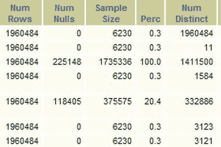

图 3-5。在这个`列统计信息`示例中（通过点击报告顶部的`Columns`超链接找到），自动采样大小收集到的样本非常小，仅为 0.3%。

那么，我们是如何得到如此小的样本大小的呢？想象一下整理你的袜子。你是个十足的袜子爱好者，有十个装满袜子的抽屉。你想知道自己有多少种袜子。你查看第一个抽屉，随机拿出一双袜子。黑色的。第二双也是黑色，第三双还是。你会继续拿下去吗？还是你现在就假设所有的袜子都是黑色的？你看到问题所在了。算法试图高效工作，会进行随机抽样，但如果运气不好，它可能拿到太多相似的样本并就此放弃。想象一下，如果有数百万双袜子，除了一双（金底银条纹）外全是黑色。在你的随机样本中很可能找不到那双特殊的袜子。但再进一步假设，你特别喜欢那双金银条纹袜，每天都想穿。在这种情况下，你会始终对袜子抽屉进行全表扫描（因为你认为大多数袜子是黑色，并且你认为所有要找的彩色袜子分布情况都一样）。这听起来有违直觉，但你需要明白，优化器对列中数据的实际分布一无所知，它只有一个样本（而且是非常小的样本）。然后，它将针对那个抽屉总结出的规则应用于所有的袜子查找。事实上，你的袜子颜色分布是高度偏斜的，而那一双稀有的袜子恰恰是你一直想要查询的。数据的情况完全相同。随机样本可能无法捕捉到稀有的偏斜值，而如果这些值在查询中很常见，你可能就需要调整列的样本大小了。

### 如何收集统计信息

`SQLT`可以帮助你制定在创建统计信息收集计划时可以采用的方法论。对于具有真实工作负载的预生产环境，你会明智地对关键的`SQL`语句（即那些性能不佳的）运行`SQLT`报告，并查看整体性能。不要仅依赖整体运行时来判断你的工作负载是否没问题。选择由`AWR`或`SQL Tuning Advisor`识别出的顶级`SQL`语句。你甚至可以从`Enterprise Manager`（企业管理器）中挑选它们（见图 3-6）。

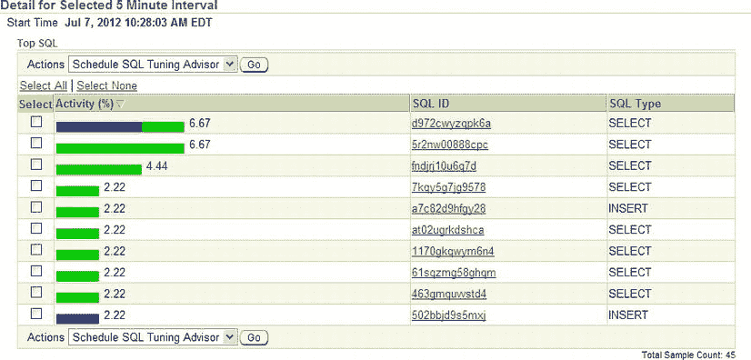

图 3-6。你甚至可以从`OEM`中选择要研究的顶级`SQL`。

然后运行一个`SQLT XTRACT`报告，并查看这些`SQL`的统计信息。记住，你挑选的是系统上的资源消耗大户，因此你需要调整这些`SQL`的统计信息收集方式，以在可能的情况下改善其性能，同时避免对其他查询产生不利影响。如果你看到小的样本大小，`且它们正在对性能产生不利影响`，那么你就找到了一个需要修改统计信息收集的候选对象。

在 11g 中，你可以在许多不同粒度级别上设置统计信息收集的首选项；在数据库级别（`dbms_stats.set_database_prefs`）、模式级别（`dbms_stats.set_schema_prefs`）或表级别（`dbms_stats.set_table_prefs`）。不要仅仅因为性能差就盲目地增加百分比。查看性能不佳的`SQL`，并调整那些`SQL`语句的统计信息收集。将所有统计信息收集比例都调到 100%只会浪费资源，而且在某些情况下，仍然无法收集到足够的列统计信息。这就是为什么了解实际发生的情况至关重要。

### 保存、恢复和锁定统计信息

保存和恢复统计信息可能极其有用。在早前的例子中，你看到在错误的时间收集统计信息可能会破坏你的执行计划。如果你在表为空时收集了统计信息，那么当表中有代表性数据集时，你需要再次收集统计信息。另一方面，如果你在表中的数据具有代表性时收集了统计信息，你可以保存该收集结果，并在以后为该表恢复它。这应该能让你正确地表示新加载的表，同时在方便的时间收集统计信息。

你还可以在方便的时间锁定统计信息。

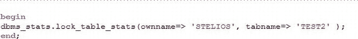

图 3-7。如果你的表统计信息变化非常大，锁定它们可能是更好的选择。

以下是一个收集对象统计信息并将其保存到名为`MYSTATS2`的表中的示例序列。

```
SQL> create table test2 as select object_id from dba_objects;

表已创建。

SQL> exec dbms_stats.gather_table_stats('STELIOS','TEST2');

PL/SQL 过程已成功完成。

SQL> exec dbms_stats.create_stat_table('STELIOS','MYSTATS2');

PL/SQL 过程已成功完成。

SQL> delete from test2;

已删除 73419 行。

SQL> commit;

提交完成。

SQL> select count(*) from test2;

  COUNT(*)
----------
         0

SQL> exec dbms_stats.import_table_stats('STELIOS','TEST2',null,'MYSTATS2');

PL/SQL 过程已成功完成。

SQL>
```

这些简单的步骤就是保存统计信息供以后使用所需的全部操作。这正是`SQLT`在收集关于`SQL`语句的信息时为你做的事情。对象的统计信息被收集在一起，并放入`ZIP`文件中，这样你就可以构建测试用例，让查询像在生产环境一样工作，却不需要数据。我们将在第 11 章中介绍如何创建测试用例。这是你使用`SQLT`能获得的最有用的工具之一。

### 午夜截断案

是时候看看我们侦探系列的第二个案例了。你刚到现场，看到一个有很多提示的查询。当你询问此事以及为什么它有这么多提示时，你被告知如果移除这些提示，执行计划就是错误的。你还注意到，笛卡尔连接已被`_optimizer_cartesian_enabled=FALSE`禁用（见图 3-8）。

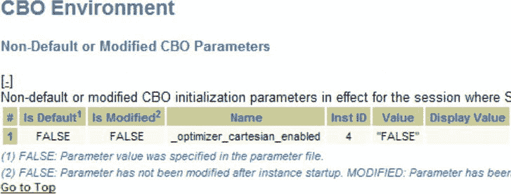

图 3-8。`CBO 环境`部分常常能揭示“古怪”的参数设置。

我并不是建议你贸然介入每种情况，不加思考地移除提示，但带有提示的`SQL`有时是其他地方出错的迹象。通常，罪魁祸首是莫里亚蒂，当然，我是指统计信息！不要有偏见，始终要以证据为准，所以首先要做的就是收集证据。在一个复制的环境中，你运行不带提示的查询。

首先查看执行计划，特别是内存中的那个（见图 3-9）。

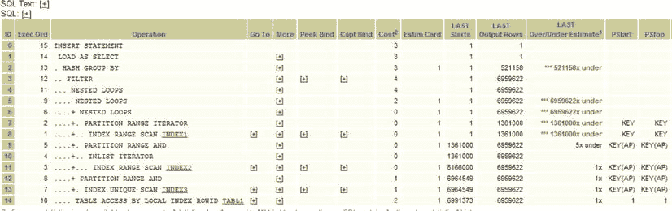

图 3-9。这个执行计划有一个显而易见的问题（红框高亮显示）。


幸运的是，SQLT 已经为你完成了所有工作。通过一次 `SQLT XECUTE`，你可能已经看到，在当前的执行计划中，执行步骤 1，即 `INDEX RANGE SCAN`，优化器预期的 `基数` 为 1。（要查看这一点，请看 `执行顺序` 列，向下找到“1”。这是第一个要执行的行。）

然后横向阅读，直到你找到 `预估基数` 列。在这里你会看到值“1”。但由于这是一个 `SQLT XECUTE` 操作，SQL 已经被执行，而实际返回的行数超过了百万。预期是 1 行，但实际有 100 万行。这是一个重要的线索，表明有地方出错了。此时的问题是“为什么优化器认为 `基数` 会是 1”？

看看 `成本` 列。你会看到预期的成本是 0。优化器认为检索这些数据没有成本。

要继续遵循这种基于证据的追踪路径，你必须了解索引统计信息的状况。

查看一下索引。你可以展开 `转到` 列中的按钮以显示更多链接（参见 图 3-10）。

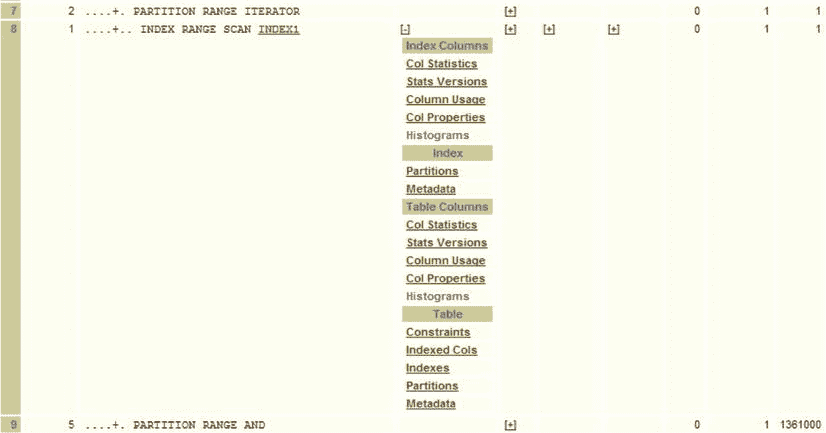

图 3-10 . 执行计划中“更多”列下的扩展可以显示指向其他信息的更多链接

然后，点击“索引列”或“表列”标题下的 `列统计信息` 来显示列统计信息（参见 图 3-11）。

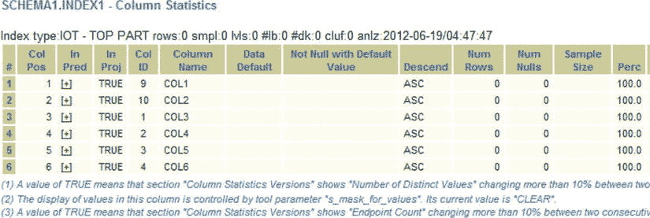

图 3-11 . 列统计信息显示没有行

在这里你可以看到一个有趣的情况。所有列的行数都是 0。这意味着在收集统计信息时表是空的。那么，父表的统计信息是什么时候收集的呢？为此，你需要父表名。点击返回按钮回到执行计划，这次点击表列部分下的 `列统计信息` 来显示表统计信息（参见 图 3-12）。

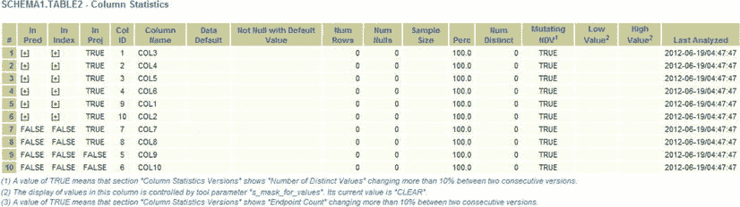

图 3-12 . 表统计信息显示在收集统计信息时没有行

你会看到 `TABLE 2` 上收集了 100%的统计信息，表中没有行，并且收集发生在凌晨 04:47。这是一个相当典型的统计信息收集时间。现在你必须问，数据从何而来，以及在凌晨 4 点表中是否真的有 0 行。为此，点击主页上的“表”超链接以显示表详细信息（参见 图 3-13）。

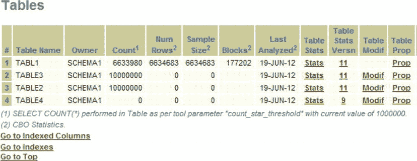

图 3-13 . 表详细信息部分显示了我们可以去哪里查看修改信息

这里显示了一个有趣的新列，即 `表修改` 列。点击 `TABLE 2` 的“修改”超链接以查看修改历史（参见 图 3-14）。

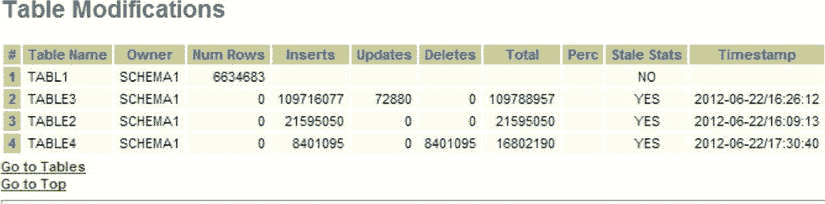

图 3-14 . 表修改部分显示了行的插入、删除和更新情况

 **注意** 我知道你在想什么。SQLT 真是个源源不断提供帮助的工具。我知道所有这些信息都在数据库里，可以通过合适的查询获取，但 SQLT 已经为你做好了。你不需要回到数据库去查找。SQLT 已经收集好了，以防万一。

现在你可以看到表的修改情况，并带有时间戳。阅读 `TABLE 2` 条目所在行。表中最初有零行，然后插入了大约 200 万行，没有更新也没有删除，这导致表中大约有 200 万行。由于这个变化（超过了 10%的变更），统计信息变得陈旧，而这发生在下午 4:09。

现在的步骤很清楚了。表是空的。收集了统计信息。添加了 200 万行，运行了查询，优化器估计 `基数` 为 1（记住，如果值是 0，它会向上舍入为 1），因此计算出 `NESTED LOOPS`（甚至更糟的 `CARTESIAN JOINS`）是可以的，结果大错特错。

既然你知道了发生了什么，就可以用几种不同的方式来解决问题（如果看起来合适的话）：

*   你可以在不同的时间收集统计信息。
*   你可以根据需要导出并导入统计信息。
*   你可以在表有数据时冻结统计信息。

可能还有更多方法。解决方案本身不是这里的重点。关键在于，一旦你知道了发生了什么，你就可以设计一个适合你情况的解决方案。你还可以看到为什么在这个案例中需要 `_optimizer_cartesian_enabled=FALSE`。存在一种可能性，优化器可能会选择笛卡尔积连接，因为其中一个关键步骤的 `基数` 是 1（这是少数几种 `CARTESIAN JOIN` 有意义的情况之一）。你可以非常简单地测试你的理论。在 `TABLE 2` 完全加载后，收集统计信息。然后重试查询，或者更好的是，直接检查执行计划会是什么。

优化器拿到了糟糕的统计信息，“决定”做一些看起来没有道理的事情。SQLT 收集了足够的信息，让你能够看到优化器为什么这样做，然后你可以设置统计信息收集方式，使优化器不再出错。优化器是你的朋友，是一段几乎总是正确的神奇代码，只要它得到了所需的信息。

## 总结

在本章中，我们通过实际例子清楚地看到，统计信息确实会产生真正的影响，而仅仅把所有事情都设为自动并不总是最佳策略。你需要注意你收集了哪些统计信息、这些统计信息的质量以及你收集它们的频率。要特别小心列直方图。SQLT 帮助你快速高效地完成这项工作，并且比一大堆脚本能提供更多信息。我们在本章中触及了偏斜度；但在下一章中，我们将深入细节，看看什么是偏斜度以及它如何影响你的执行计划。

