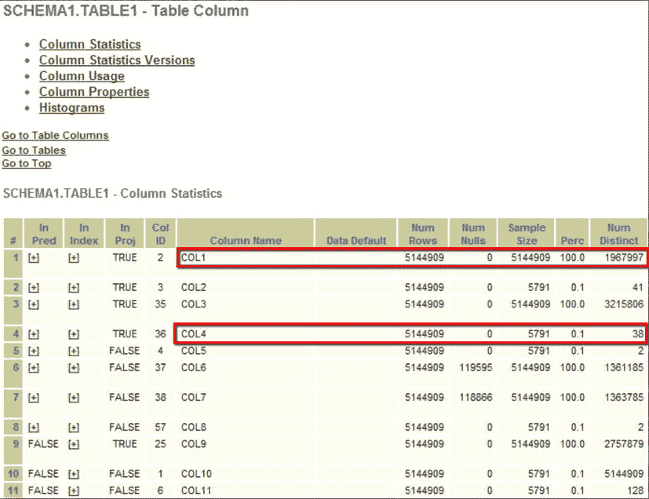

# 用最简单的话来说

用最简单的话来说，表是数据的一种表示形式，而偏斜度是数据集的一种属性，它会导致特定列谓词的匹配数量出乎意料地多或出乎意料地少。例如，如果我们绘制六月、七月和八月在五金店花费的美元金额图表，我们可能会发现花费金额的变动幅度仅为 10%。每周的变动性会非常低。如果现在我们扩展时间线，把感恩节和圣诞节包括进来，我们就会发现花费金额在这些日期前后达到峰值，因此金额可能是“正常”六月至八月金额的两倍或三倍。如果我们只有六月至八月的数据来预测未来，我们可能会预期一个低得多的支出水平。这种在感恩节和圣诞节前后出乎意料的大额支出将产生一个偏斜的数据集。

如果我们改为绘制每个人每次访问的花费金额，并以每 10 美元为一组进行分组，我们会发现另一种分布。少数人的花费在 0 至 10 美元范围内，可能更多在 10.01 至 20 美元范围内。这个趋势会持续上升到某个峰值，然后下降。大多数人会在某个特定范围内消费，然后我们会有一些“大手笔”的顾客，他们会花费数千美元。花费金额与花费在这个范围内的人数关系的图表将会是偏斜的。如果每个人来商场都花费完全相同的金额，那么所有人都会落在同一个范围。所有其他范围的值都将为零。这将是一个高度偏斜的数据集。

这突显了一个关键点，数据库管理员（DBA）和开发人员应时刻警惕：你是否真正理解你的数据？有时这可能很难，因为列的命名方式并不明显。这正是数据库设计者、开发人员和 DBA 必须紧密合作以获得良好结构、相关索引以及主键和外键的地方。在某些数据库中，你会发现如果抽样设置为自动，你会收集到列统计信息（有时样本量非常小），但由于没有偏斜度，这些信息并无用处。在图 4-1 中，我们看到关于为表`TABLE 1`中每一列收集了哪些统计信息。



图 4-1. 表列统计信息，显示了样本大小和不同值的数量。

在收集的`SQLT`报告图表中，我们看到在“表列”部分，针对特定表`TABLE 1`，许多列已收集了列统计信息。查看`COL1`的高亮部分。它收集了 100%的统计信息。`COL4`收集了 0.1%。为什么`COL1`和`COL4`之间存在如此巨大的差异？这是因为自动抽样算法仅为`COL4`的样本大小选择了 5,791 行。让我解释一下优化器在对这些列进行抽样时做了什么。

在这种情况下，对于表`TABLE 1`，针对**每一**列`COL1`、`COL2`、`COL3`、`COL4`等，统计信息收集算法正在从表中抽样值。样本大小显示在“样本大小”列中。因此，如果`COL1`是花费金额，那么统计信息抽样算法会抽样这些列并发现存在某种数据分布（正如我们上面讨论的）。如果`COL4`是商店名称，它会抽样数据并发现存在一定数量的不同值（本例中是 38 个）。然而，在每种情况下，都有 5,144,909 行数据。该算法具体如何决定样本大小并未记录，但很明显，如果第一个样本是“Joe’s Hardware”，第二个样本是“Joe’s Hardware”，第三个样本也是“Joe’s Hardware”，那么统计信息收集算法在抽到第一千个样本后可能开始“猜测”，它抽样的所有值在统计上都非常接近。如果你的数据高度偏斜，并且在`COL4`的整个列总体中只有一个值，例如“Sally’s Hardware”，那么通过随机抽样，统计信息收集算法可能会漏掉这个值。进一步假设，尽管“Sally’s Hardware”这个值非常罕见，但它却被用作此查询谓词中的值。在 Oracle 10g 中，根据谓词使用的第一个值，你很可能最终得到一个次优的执行计划。在 11g 中，你将有自适应游标共享（Adaptive Cursor Sharing）来帮助你（我们在第 7 章中会更多地讨论这一点）。另一方面，然而，如果你知道你的数据以这种方式高度偏斜，并且你看到你的自动抽样样本大小非常小，你很可能会决定选择更大的样本大小可能是个好主意。

## 如何判断数据是否偏斜

偏斜度如此重要，以至于作为 DBA 或开发人员，你应该警惕那些可能包含偏斜数据的列。当数据集像今天这样庞大时，要立即判断一个数据集是否偏斜是非常困难的。`SQLTXPLAIN`通过显示直方图的统计信息（如果有的话）使这项工作对你来说容易得多。

那么，如何判断数据是否偏斜呢？查看收集的数据有不止一种方法，但所有方法都依赖于抽样。最简单的抽样方法是使用查询（如下所示）。在这个简单的例子中，我们使用`CTAS`（Create Table As Select）语句从一个已知（至少对我来说是）偏斜的数据集中创建了一个测试表`test3`：`dba_objects`视图的`object_type`列。`dba_objects`视图列出了数据库中对象的属性，包括对象类型。有许多不同的对象类型：例如，`table`（这是一个非常常见的对象类型）和`dimension`（这是一个非常罕见的对象类型）。一旦我们创建了一个名为`test3`的测试表，它将包含 73,583 行，我们就可以对每种类型的对象数量进行抽样：这将使我们了解数据集的偏斜度。

```sql
SQL> create table test3 (object_type) as select object_type from dba_objects;
Table created.

SQL> select object_type, count(object_type)
  from test3 group by object_type order by count(object_type);
```


