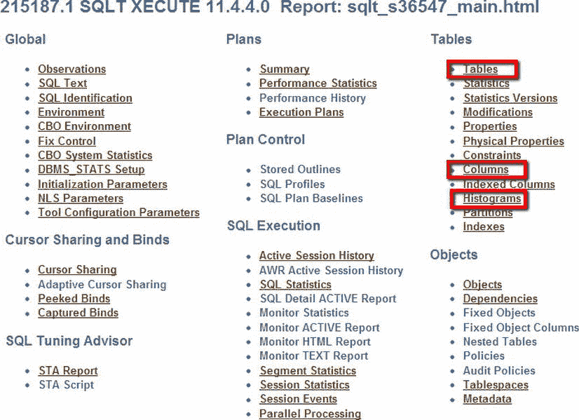
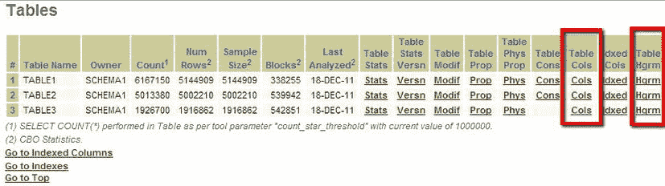
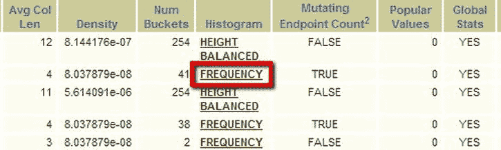
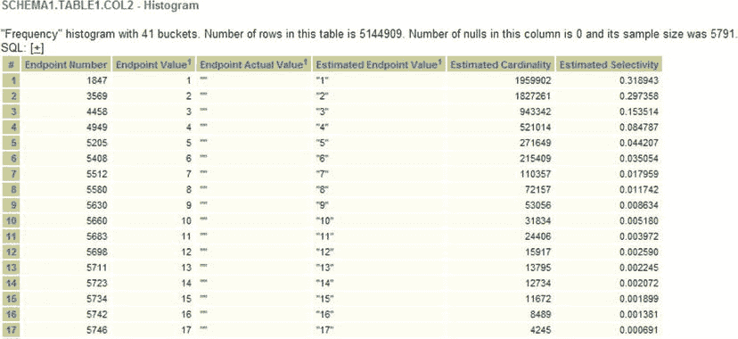
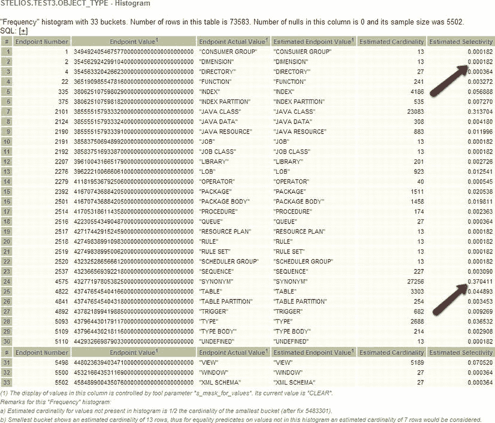
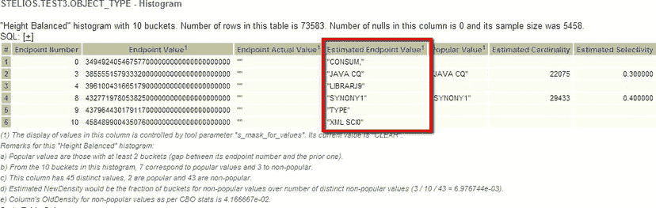
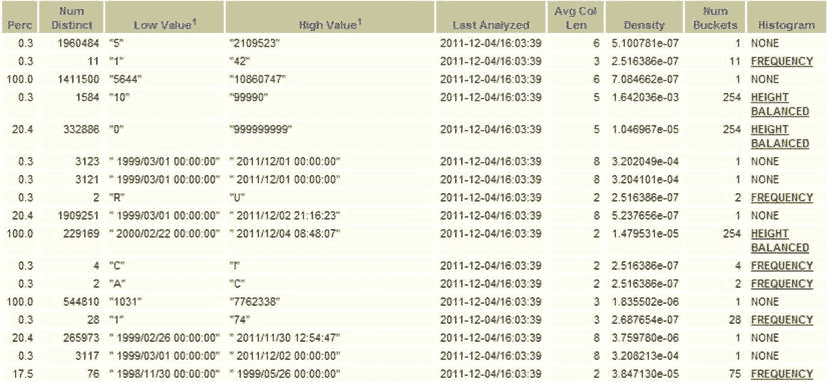

# 数据偏斜与直方图

## 数据库对象类型分布示例

以下表格展示了数据库中对象类型及其对应的数量：

```
OBJECT_TYPE         COUNT(OBJECT_TYPE)
------------------- ------------------
RULE                                 1
DATABASE LINK                        1
LOB PARTITION                        1
EDITION                              1
DESTINATION                          2
JAVA SOURCE                          2
SCHEDULE                             3
MATERIALIZED VIEW                    3
SCHEDULER GROUP                      4
DIMENSION                            5
CONTEXT                              7
UNDEFINED                            9
INDEXTYPE                            9
WINDOW                               9
CLUSTER                             10
RESOURCE PLAN                       10
JOB CLASS                           13
JOB                                 14
EVALUATION CONTEXT                  14
DIRECTORY                           14
PROGRAM                             19
RULE SET                            23
CONSUMER GROUP                      25
QUEUE                               39
XML SCHEMA                          52
OPERATOR                            55
PROCEDURE                          159
LIBRARY                            183
TYPE BODY                          241
SEQUENCE                           242
TABLE PARTITION                    258
FUNCTION                           304
JAVA DATA                          328
INDEX PARTITION                    420
TRIGGER                            620
JAVA RESOURCE                      834
LOB                                995
PACKAGE BODY                      1269
PACKAGE                           1329
TYPE                              2827
TABLE                             3113
INDEX                             4134
VIEW                              5263
JAVA CLASS                       22917
SYNONYM                          27802
```

上面的示例显示了数据库中的对象类型与这些对象类型的数量。这里的“桶”（`bucket`）指的是`object_type`的值（“桶”现在常用来表示数据集中涵盖的值范围）。例如，对象类型`SYNONYM`（示例中的最后一行）有 27,802 个值。有时桶可以是一周中的某天，比如星期六或星期日；有时可以是原色，比如红色或蓝色；有时桶也可以是一个范围，比如“2011 年的日期”。在每种情况下，这些值都是你在绘制图表时会放在 X 轴上的值。从现在开始，我们将使用术语“桶”来表示所讨论的值范围。

一旦你执行了查询，你将看到有助于你决定数据偏斜程度的信息。然而，请注意，几乎所有数据在某种程度上都是偏斜的。即使在我们上一节关于超市支出的例子中，数据也是偏斜的。你需要回答的问题是：它是否偏斜到足以给我的查询带来问题？10%的变异性通常不会引起问题，但如果你有一个桶包含了 90%的样本，那么数据就是高度偏斜的。因此，关于偏斜度的判断在一定程度上是主观的。在上面的查询示例中，如果我查询的是表`test3`，并且我的谓词值是`SYNONYM`，那么我可能会返回比针对值`RESOURCE PLAN`进行查询时多得多的行。请参见下面的示例代码。如果我们对罕见值进行采样，我们只能得到 10 个值。

```
SQL> select count(*) from test3 where object_type='SYNONYM';

COUNT(*)

SQL> select count(*) from test3 where object_type='RESOURCE PLAN';

COUNT(*)

```

我们是否关心这种偏斜度？数据是否非常偏斜？从技术上讲，即使是最轻微的偏离“常态”也可以归类为偏斜，但这个术语现在通常指那种会使执行计划不稳定的偏斜程度。然而，从更客观的角度来看，如果你看到如上例所示，某些谓词返回的值是其他谓词的 10 倍以上，那么这就是非常偏斜的。如果你看到最常见值与最不常见值的比率大于或等于 1.5，你就可以开始考虑偏斜度作为一个因素了。

SQLT 使得收集这类查询信息的工作变得容易得多。它展示了列直方图的数据分布。首先，在报告顶部（参见图 4-2），我们可以点击“Tables”（表）、“Columns”（列），或者我们也可以点击“Histograms”（直方图）。在这个例子中，我们将点击“Tables”，因为这可能是你在调查中最可能遵循的路径。



**图 4-2** .  SQLXECUTE 报告的顶部

“Tables”页面向我们展示了图 4-3 中的屏幕。



**图 4-3** .  报告的表部分

从图 4-3（它只显示了屏幕的左侧），我们现在可以点击任何单个表的“Cols”（列）超链接以查看列详情。在这个例子中，我们正在查看 TABLE 1，因此我们点击相应的链接。这使我们进入了图 4-4 所示的屏幕（它是屏幕的右侧），我在其中高亮显示了“FREQUENCY”超链接，它将带我们进入 TABLE 1 的 COL2 的直方图。



**图 4-4** .  COL2 的直方图超链接

通过点击 COL2 的“FREQUENCY”直方图，我们到达了图 4-5 所示的屏幕。“FREQUENCY”（频率）和“HEIGHT BALANCED”（高度均衡）这两种类型的直方图将在后面的部分讨论，但可以说，它们都是表示桶频率的方法。



**图 4-5** .  来自 SQLT 的示例直方图

该图显示，对于值为“1”，估计基数（cardinality）约为 190 万，而对于值“17”，估计基数约为 4000。这些数据偏斜吗？当然是。在图 4-5 中，估计基数按流行度进行了排序，但情况并非总是如此。请看我们示例表`test3`的图 4-6。



**图 4-6** .  针对我们的 test3 示例的另一个示例直方图表。SYNONYM 很受欢迎

在这个示例直方图中，我们看到了列显示中呈现的基本事实：桶的数量（33）、表中的行数、空值的数量以及样本大小。在这个案例中，样本大小非常小。

这些数据看起来高度偏斜。对于“端点实际值”（Endpoint Actual Value）为“DIMENSION”的情况，估计选择率（selectivity）是 0.000182。对于 JAVA_CLASS，选择率是 0.313704。这意味着，由于空值数量为 0，如果针对`object_type`的谓词使用值“JAVA CLASS”，将近三分之一的表将被返回。如果谓词使用值“JAVA RESOURCE”，那么选择率仅为 0.011996，基数为 883，而“JAVA CLASS”的基数为 23,083。即使面对如此高度偏斜的数据，你也可以问自己：“这种偏斜度与我的查询相关吗？”如果列`object_type`没有参与你的查询，那么这种偏斜度对你来说就不重要。

## 偏斜度如何影响执行计划


现在我们了解了偏斜度是什么，以及特定 SQL 语句在 SQLT 报告中如何显示统计数据，接下来应该探讨偏斜度如何可能导致执行计划出现问题。

假设我们想查询上个月与我们有业务往来的每个金融机构的所有财务交易总和。很可能在描述字段中包含机构名称，可能有一个`company_ID`来代表公司，以及一个字段来表示财务交易的金额。当然，我们可能还有许多其他字段，但就偏斜度而言，我们关心的是这些。我们可以查询此表，找出所有`company_ID`与我们当前查找的公司匹配的记录总和。如果我们选择了一个业务往来不多的公司，可能只会得到几条记录。优化器很可能预期某些公司只有一条记录，因此可能选择执行笛卡尔积连接。然而，如果该公司是美国银行，我们可能会预期有数千（甚至数百万）笔交易。在这种情况下，哈希连接可能是更好的选择。对于这两种极端情况，“好”的执行计划大相径庭。

如果对美国银行的记录使用笛卡尔积连接，当 Oracle 试图在数千条记录上执行笛卡尔积时，性能将灾难性下降。即便是 Exadata 也无法应对这样的错误。因此，根据谓词值的不同，我们很可能需要不同的执行计划。要解决这类问题，我们需要考虑有哪些选项：移除直方图、改进直方图、使用自适应游标共享或更改查询。对于在这些情况下该怎么做，没有一成不变的规则。SQLT 会显示发生了什么以及偏斜度如何影响执行计划；然后，你可以与开发人员一起，决定哪种策略最适合你的情况：添加或删除哪些索引，以及收集哪些直方图是有帮助的。

### 直方图

直方图是一个令人困惑的主题，除非你知道它是什么。不同文档中使用且有时相互矛盾的术语也无助于理解。因此，让我从定义“桶”开始。桶是特定列的值的范围。例如，如果我们有一个 TRUE_OR_FALSE 列，并且它只能有两个值（TRUE 或 FALSE），那么我们最多可以有两个桶：每个桶会有一个值来描述 TRUE 的数量和 FALSE 的数量。直方图是一种数据表示形式，它描述了不同数据值范围的相对分布情况。

### 直方图类型

我们已经笼统地讨论了直方图，但 Oracle 目前对任何类型的直方图都有 254 个桶的限制。这意味着它无法存储一列超过 254 种类型的值的频率。可以想象，与几乎任何事物的任何可能取值范围相比，这是一个非常小的数字！“油漆颜色”、“银行名称”、“邮政编码”：大多数直方图都需要超过 254 个桶。如果不同值的数量（在 SQLT 报告中显示为 NDV）大于 254，并且统计信息收集过程检测到了这一点，那么你将不得不以某种方式将数据分布压缩到比不同值数量更少的桶中。如果发生这种情况，你就将优化器暴露在不完整信息的风险之下，这可能对你的执行计划产生不利影响。回顾一下图 4-6。你会看到从 5,502 行的样本中产生了 33 个桶。而实际上我们知道有 45 个不同的值。看看下面这个读取表中所有数据的查询结果：

```sql
SQL> select count(distinct object_type) from test3;

COUNT(DISTINCTOBJECT_TYPE)
--------------------------
                        45
```

不同值数量的真实答案是 45。统计抽样得到的答案是 33。统计信息采样器，即使采样了 5,502 行，也不够幸运，未能找到`object_type`所有可能的不同值。尽管如此，它还是生成了一个频率型直方图，因为没有超过 254 的限制。关键是，尽管是频率型直方图，并非所有值都被代表了。如果我们人为地将桶的数量压缩到 10 个，会发生什么？

```sql
SQL> exec dbms_stats.set_table_prefs(
  ownname=>'STELIOS',
  tabname=>'TEST3',
  pname=>'method_opt',
  pvalue=>'for all columns size 10');

PL/SQL procedure successfully completed.
```

现在我们得到了另一种类型（两种可能类型中的另一种）的直方图，即基于高度的直方图（参见图 4-7）。



图 4-7 . 一个包含 10 个桶的基于高度的直方图

在基于高度的直方图中，值类型会根据桶进行计数，并被标记为流行或不流行。如果不流行，则分配一个桶。例如，看看桶号 1，它代表按字母顺序低于“CONSUM”的对象类型的值：例如，“CLUSTER”和“CONSUMER GROUP”。因为一个桶可能对应多个值，其中一些我们可能没有遇到，所以终点是估计的。我们知道没有“SYNONY1”这种对象类型，但它是桶 5、6、7 和 8 的标签。如你所见，只有 10 个桶时，对对象类型（实际上有 45 个不同类型）的数据分布估计非常差。使用质量如此差的直方图，我们很可能最终得到一些糟糕的执行计划。因此，重要的是我们要知道何时使用直方图，何时它们是一种阻碍。

### 何时使用直方图

如果你使用优化器统计信息收集的默认值，那么你很可能会在一些你没注意到的列上拥有直方图。如果你有一个性能不佳的查询，或者一个你想要调优的查询，你可能需要检查收集到的信息以确保其合理。在决定是否在一列上创建直方图时，需要考虑一些指导原则。直方图旨在处理偏斜数据，因此如果你的数据偏斜度不高，那么直方图就没有用处。一个例子可能是表记录的时间戳。如果数据库活动每天都发生，并且我们每天有 100 笔交易，每笔都有一个时间戳，那么日期列上的直方图将无济于事。在频率直方图中，这相当于所有桶的高度都相同。如果没有偏斜度，直方图对我们没有帮助。这只是意味着我们花了夜间时间收集不需要的统计信息。正如我之前提到的，自动样本大小在数据几乎没有偏斜时非常聪明地知道何时停止采样，因此你可能不会因此损失太多时间。

如果你的数据偏斜度很高，那么直方图可能对你非常重要；但如果你确实有直方图，你应该通过 SQLT 检查直方图是否合适且正确。在图 4-8 中，我们看到了 TABLE 1 的列统计信息。



图 4-8 . 部分列统计信息摘录


