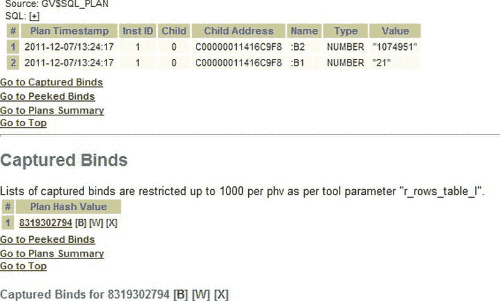
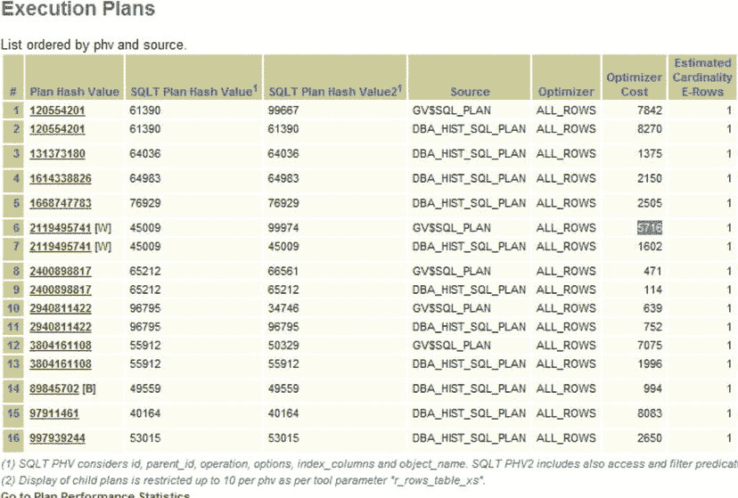
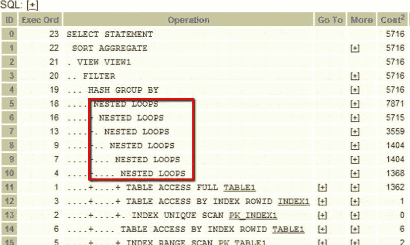
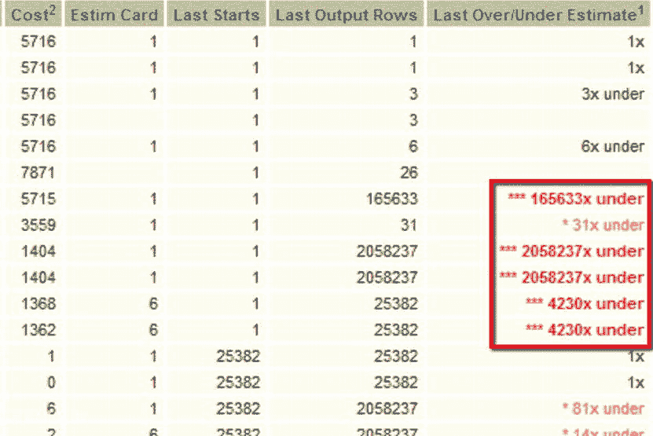
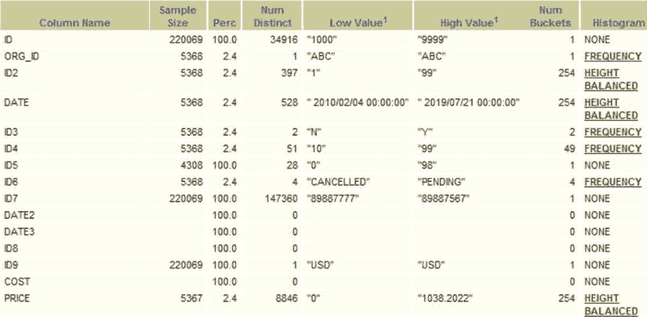

# 直方图问题与绑定变量

除了许多列的样本率非常低（0.3%）之外，我们还有一些桶计数与不同值的数量不匹配。最后一个条目显示有 76 个不同的值，但只有 75 个桶。这意味着有一个值甚至未出现在 17.5%的样本量中。在这种情况下，您必须查看直方图（此处为频率直方图）并判断该直方图是否有用。如果您判断数据没有偏斜，因此直方图没有用，那么可以移除该直方图，并更改表首选项以不收集此列的统计信息。如果您发现数据确实存在偏斜，则需要收集更好的统计信息。这意味着需要为此列收集更大的样本量。您可以通过设置表首选项或在主要统计信息作业之后运行特定作业来收集数据。

### 如何添加和移除直方图

如果您想移除列的直方图，可以简单地使用 `dbms_stats` 过程，如下例所示。

```
SQL> exec dbms_stats.delete_column_stats(
  ownname=>'STELIOS',
  tabname=>'TEST3',
  colname=>'OBJECT_TYPE',col_stat_type=>'HISTOGRAM');
PL/SQL procedure successfully completed.
```

但是，这不会永久删除统计信息。下次统计信息作业遇到该表时，它可能会决定再次需要同一列的列统计信息。如果您正在测试查询的执行情况，则可以一次性移除列的统计信息。移除列统计信息可能使您能够重新解析语句，并查看执行计划是否受到实质性影响。如果您想永久移除列统计信息收集，则可以设置表首选项，如下例所示，将 `method_opt` 值设置为 `"FOR ALL COLUMNS SIZE 1"`，这意味着没有列直方图。

```
SQL> exec dbms_stats.set_table_prefs(
  ownname=>'STELIOS',
  tabname=>'TEST3',
  pname=>'method_opt',
  pvalue=>'FOR ALL COLUMNS SIZE 1');

PL/SQL procedure successfully completed.
```

如果表有您需要统计信息的其他列，您可能决定设置首选项，以便只忽略某一特定列的列统计信息。以下是此命令的示例。

```
SQL> exec dbms_stats.set_table_prefs(
  ownname=>'STELIOS',
  tabname=>'TEST3',
  pname=>'method_opt',
  pvalue=>'FOR COLUMNS OBJECT_TYPE SIZE 1');

PL/SQL procedure successfully completed.
```

另一方面，如果您想添加列统计信息，可以使用 `dbms_stats.get_column_stats` 命令手动收集它们。

### 绑定变量

绑定变量是新 Oracle DBA 可能不会立即意识到的奥秘之一。另一方面，开发人员会一直使用绑定变量，并且对定义和含义感到 familiar。如果您熟悉变量及其值的概念，那么从绑定变量中无需理解更多内容。它只是 Oracle 版本的变量。变量（和绑定变量）只是一个值的符号名称，该值可以根据代码的需要而变化。然而，绑定窥视和绑定捕获是更特定于 Oracle 的概念，它们是允许优化器在存在偏斜时做出更好决策的技术。绑定变量、偏斜度和绑定窥视都与 `CURSOR_SHARING` 协同工作以改进 CBO 计划。我们将在以下部分介绍所有这些概念及其工作原理。

### 什么是绑定变量？

既然我们已经进入了直方图的世界并查看了偏斜度，我们看到用作谓词的值可能会对返回的行数产生重大影响。在下面的示例中，我们看到根据我们选择“EDITION”还是“TABLE”，我们会得到不同的计数。

```
SQL> select count(*) from test3 where object_type='EDITION';
  COUNT(*)

SQL> select count(*) from test3 where object_type='TABLE';
  COUNT(*)

```

如果我们想在 SQL 中避免字面值（这些字面值都会被单独解析，并会对性能产生不利影响），我们可能会引入绑定变量。绑定变量是一种通过设置参数值将参数传递给例程的方法。下面我展示一个简单的过程，使用名为 `b1` 的绑定变量来计算 TEST3 中不同对象类型的数量。

```
SQL> set serveroutput on;
SQL> create or replace procedure object_count(b1 in char)
  2  as
  3    object_count number;
  4    begin
  5    select count(*) into object_count from test3 where object_type=b1;
  6    dbms_output.put_line(b1||' = '||object_count);
  7    end;
  8  /

Procedure created.
```

如果我们运行此过程几次，可以看到传入并使用了不同的值。

```
SQL> exec object_count('EDITION');
EDITION = 1

PL/SQL procedure successfully completed.

SQL> exec object_count('TABLE');
TABLE = 3113

PL/SQL procedure successfully completed.
```

在上面的例子中，`b1` 接受了值“EDITION”，然后是值“TABLE”。过程中实际完成工作的文本是一个简单的 `select` 语句。它的谓词是 `object_type=b1`。就优化器而言，查询的文本没有改变。

### 什么是绑定窥视和绑定捕获？

通过使用绑定变量，我们将绑定变量的实际值隐藏在优化器之外。我们这样做是有充分理由的。我们希望避免为每个具有不同谓词值的 SQL 进行过度解析。当数据没有偏斜且您的执行计划不太可能根据传入的绑定变量值而改变时，这是一个很好的策略。对于偏斜数据，优化器可以从知道传递给 SQL 的绑定变量值中受益。这个过程被称为“绑定窥视”，是在硬解析期间完成的。另一方面，绑定捕获是在 SQL 执行期间使用的实际绑定变量值的快照。在这种情况下，用于绑定（此处为 `b1`）的值被收集并可供 SQLT 使用。在下面的例子中（图 4-9），我们看到了 SQLT 报告中显示捕获的绑定值的部分。



图 4-9. 捕获的绑定示例输出

在偏斜度很重要且您怀疑绑定值将优化器引向错误路径的情况下，您可能需要查看“捕获的绑定”部分。结合捕获的绑定和时间戳（以及任何关于性能不佳的报告），您可以追踪为什么特定语句决定执行错误的操作。

## Cursor_Sharing 及其值

Oracle 引入 `CURSOR_SHARING` 参数来解决未使用绑定变量的代码所引起的问题。当不使用绑定变量时，优化器必须解析 SQL 文本。这是一个昂贵的操作，如果唯一改变的是字面值，这可能是浪费时间。

`CURSOR_SHARING` 有三个可能的值：`EXACT`、`FORCE` 和 `SIMILAR`。`EXACT` 是默认值，告诉优化器在遇到每个 SQL 文本时分别考虑它。如果您的应用程序编写良好，并且按照最有效的方式使用绑定和字面值，那么保持 `EXACT` 不变是最佳选择。

将 `CURSOR_SHARING` 设置为 `FORCE` 会告诉优化器为所有谓词使用绑定（并会生成自己的名称）。如果您有一个编写不良的应用程序，并且您希望利用使用绑定变量带来的性能提升，而无需修改应用程序以使用绑定变量，那么您将使用此值。


将 `CURSOR_SHARING` 设置为 `SIMILAR` 自 11g 版本起已被废弃，不应再使用。但值得一提的是，它曾是 `CURSOR_SHARING=FORCE` 的一个“智能”版本。在大多数情况下，它会创建系统定义的绑定变量，除非该绑定变量以某种方式影响了优化。它并非一个完整的解决方案，而自适应游标共享的引入是对 `CURSOR_SHARING=SIMILAR` 的一个巨大改进。需要注意 `CURSOR_SHARING` 参数的值，以便理解绑定变量是否生效。在 SQL 报告的 SQL 文本部分，您还会看到，如果字面量已被绑定变量替换，它们将具有系统定义的名称。

## 变量执行时间案例

有时，拥有一个稍长但稳定的执行时间，比拥有一个稍快但不稳定的执行计划更好。不稳定的执行时间（执行时间可能大幅波动）会给批处理作业的调度带来问题。在此示例案例中，执行时间从未稳定过。您处于预生产环境中，希望获得有关可采取哪些措施来提高执行时间稳定性的信息。您有一个优势，即拥有一个包含代表性查询和数据的测试环境。因此，在测试之后，您查阅了 `AWR` 报告，并决定有一个特定查询需要关注，因为它有时耗时很长。我们获取其 `SQL_ID` 并生成 `SQLT`。我们想知道执行计划出了什么问题，因此我们查看了“执行计划”部分，如 图 4-10 所示。



图 4-10 . 显示了许多不同的执行计划

在“执行计划”部分，我们看到存在许多不同的执行计划。为什么会有这么多不同的执行计划？让我们首先看看最差的执行计划，如 图 4-11（屏幕左侧）和 图 4-12（屏幕右侧）所示。我们在 图 4-11 中看到了许多嵌套循环步骤，在 图 4-12 中看到了许多低估。



图 4-11 . 通过点击图 4-10 执行计划列表中的“W”所选中的最差执行计划



图 4-12 . 用 *** 高亮的数字显示了优化器非常大的估算偏差

由于我们有实际返回的行数，我们可以查看高估和低估。我们遇到了相当多的估算偏差，所以有些地方不对劲。可能不止一个问题。既然第一步，第 11 行，已经“错了”，偏差达 4,230 倍，我们应该从那里开始。查看 图 4-13，因为它显示了表 1 的列统计信息。您看到任何值得注意的东西了吗？（实际表格包含比图中显示更多的信息。为了可读性，我删除了一些表列。）



图 4-13 . 表 1 的列统计信息

让我们看看 `ID` 列的统计信息。样本大小良好，为 100%，并且有 34,916 个不同值：这超过了我们 254 个存储桶所能容纳的数量。因此，如果我们有直方图，它将是一个高度平衡的直方图，但在“直方图”列下我们看到“无”。那么 `ORG_ID` 呢？只有 2.4% 的样本，且仅有一个不同值，高低值都是“ABC”。此外，我们有一个只有一个存储桶的频率直方图。毫不意外，其选择性将是 1.0，但同样地，这个直方图对我们没有任何作用，因为它毫无意义。另一方面，它不可能对可变的执行计划有贡献。那么让我们看看 `ID2` 列，其样本为 2.4%，有 397 个不同值和一个高度平衡的直方图。如果我们详细查看直方图，会发现有很多流行值，但我们继续看。DATE 列有一个高度平衡的直方图：这合理吗？这取决于 DATE 列代表什么。但通常，带有直方图的 DATE 列应引起怀疑。`ID3` 列同样是 2.4% 样本，有两个不同值：“Y”和“N”。如果我们查看直方图，会发现“N”的选择性为 0.03，“Y”的选择性为 0.97。仅这一点就可能影响返回的行数。看起来确实存在一些倾斜数据。但我们继续看。接下来是 `ID4` 列，有 51 个不同值和 49 个存储桶，所以现在情况看起来不那么好了。它的直方图显示选择性在 0.005 到 0.1 之间。这是 20 倍的差异：这意味着这是另一个倾斜列，而且存储桶数量是错误的。`ID5` 列没有直方图，`ID6` 列的存储桶数量错误：同样是倾斜的。在这样的报告中，您会花时间查看每一列，因为有时真正的罪魁祸首是您最后查看的东西；但在本例中，我们存在直方图采样不佳、直方图不合适以及可能缺失直方图的问题。

在这种情况下，您会尽力设置正确的直方图，在不需要的地方消除它们，在需要的地方添加它们。

## 总结

倾斜度是 `SQL` 中最难理解的概念之一，也是最麻烦的问题之一。Oracle 软件历经多次迭代，尝试了许多方法来解决这个问题，有些尝试比其他更成功，但自适应游标共享是迄今为止最成功的。尽管不稳定的执行计划可能导致各种波折，但 `SQLTXPLAIN` 能提供信息，帮助您稳定执行计划并收集正确的统计信息。在下一章中，我们将探讨优化器在解析过程中进行的查询转换，以使您的执行计划能够快速执行。

