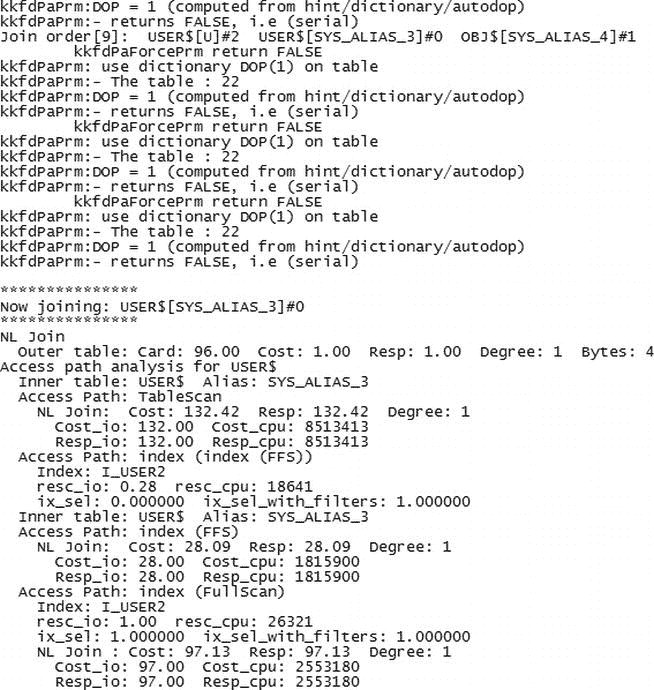

# 第 5 章


## 查询转换故障排除

Oracle 查询优化器是一段令人惊叹的代码，经过多年发展和改进（或许途中也走过一些弯路），旨在生成既易于生成又能快速运行的执行计划。优化器在过程中使用了许多“技巧”来提高执行速度，并以与您未修改的 `SQL` 结果相同的方式实现执行计划。这些“技巧”（或启发式方法）有时包括查询转换。


### 什么是查询转换？

查询转换，顾名思义，就是将 SQL 查询从其原始文本转变为不同的形式：但它仍然给出相同的结果。这有点像说你想从伦敦去纽约，而你决定经由奥兰多，好好休息一下，游览迪士尼世界，享受阳光，然后沿着东海岸开车北上。查询转换会使用启发式规则来优化你的行程。其中一条启发式规则可能是：“如果你的起点和目的地之间有直飞航班，那么避免在其他地点转机。”或者你也可以重写规则，改为“最小化你旅程中的经停点次数”。我相信你能看出，即使对于我这个简单的例子，情况也可能变得相当复杂。如果你真的很想见到米老鼠呢？那么计划就更难改变了。有时候，即使是看起来像米老鼠一样简单的查询，在你试图快速高效地完成旅程时也会带来问题。

为了解释从 SQL 查询的角度看，“查询转换”意味着什么，让我们看一个简单的例子。问问你自己一个问题。这个查询可以简化吗？

```
SQL> select * from (select * from sales); -- 查询 1
```

这个查询“显然”可以简化为

```
SQL> select * from sales; -- 查询 2
```

这大概是查询转换最简单的例子。查询 1 被转换成了查询 2。这个查询转换不会导致版本 1 和版本 2 的查询结果不同。这种特定的转换被称为“子查询解嵌套”。每种转换都有其名称以及为确保最终结果正确且优化而必须遵循的一套规则。基于成本的优化器认识到这一点了吗？让我们请优化器为一个非常简单的查询计算一个执行计划；但我们会使用一个提示来告诉它不要使用任何查询转换。以下是 SQL 和执行计划。

```
SQL> select /*+ no_query_transformation */ * from (select * from sales);
执行计划

Plan hash value: 2635429107

| Id  | Operation           | Name  | Rows  | Bytes | Cost (%CPU)| Time     | Pstart| Pstop |

|   0 | SELECT STATEMENT    |       |   918K|    76M|   503   (5)| 00:00:07 |       |       |
|   1 |  PARTITION RANGE ALL|       |   918K|    76M|   503   (5)| 00:00:07 |     1 |    28 |
|   2 |   VIEW              |       |   918K|    76M|   503   (5)| 00:00:07 |       |       |
|   3 |    TABLE ACCESS FULL| SALES |   918K|    25M|   503   (5)| 00:00:07 |     1 |    28 |

```

从这个例子我们看到，优化器选择了对 `SALES` 进行全表扫描。这是必需的，因为圆括号内有 `select * from sales`。然后优化器选择在那个数据上创建一个视图，并选择所有分区来创建选出的数据。所以优化器收集了括号内的所有数据，然后呈现给下一个 `select`。现在，让我们给优化器一个机会来展示它有多聪明。现在我们运行查询，但不带我们的提示。这样优化器就可以使用查询优化了。

```
SQL> select  * from (select * from sales);
执行计划

Plan hash value: 1550251865

| Id  | Operation           | Name  | Rows  | Bytes | Cost (%CPU)| Time     | Pstart| Pstop |

|   0 | SELECT STATEMENT    |       |   918K|    25M|   503   (5)| 00:00:07 |       |       |
|   1 |  PARTITION RANGE ALL|       |   918K|    25M|   503   (5)| 00:00:07 |     1 |    28 |
|   2 |   TABLE ACCESS FULL | SALES |   918K|    25M|   503   (5)| 00:00:07 |     1 |    28 |

```

现在我们看到优化器选择了一个更简单的计划。`VIEW` 步骤被消除了，实际上现在的执行计划与没有子查询的 select 语句相同：

```
SQL> select * from sales;

执行计划

Plan hash value: 1550251865

| Id  | Operation           | Name  | Rows  | Bytes | Cost (%CPU)| Time     | Pstart| Pstop |

|   0 | SELECT STATEMENT    |       |   918K|    25M|   503   (5)| 00:00:07 |       |       |
|   1 |  PARTITION RANGE ALL|       |   918K|    25M|   503   (5)| 00:00:07 |     1 |    28 |
|   2 |   TABLE ACCESS FULL | SALES |   918K|    25M|   503   (5)| 00:00:07 |     1 |    28 |

```

为了证明查询转换确实在起作用，我在下面展示一个嵌套 `select` 语句的例子，我们从执行计划中看到，优化器为每一层都添加了一个视图。这是因为我通过提示 `/*+ no_query_transformation */` 告诉了优化器不要使用任何查询转换。

```
SQL> select /*+ no_query_transformation */ * from (select * from (select * from (
select * from sales)));
执行计划

Plan hash value: 1018107371

| Id  |Operation             |Name  |Rows  | Bytes | Cost (%CPU)| Time     | Pstart| Pstop |

|   0 |SELECT STATEMENT      |      |  918K|    76M|   503   (5)| 00:00:07 |       |       |
|   1 | PARTITION RANGE ALL  |      |  918K|    76M|   503   (5)| 00:00:07 |     1 |    28 |
|   2 |  VIEW                |      |  918K|    76M|   503   (5)| 00:00:07 |       |       |
|   3 |   VIEW               |      |  918K|    76M|   503   (5)| 00:00:07 |       |       |
|   4 |    VIEW              |      |  918K|    76M|   503   (5)| 00:00:07 |       |       |
|   5 |     TABLE ACCESS FULL|SALES |  918K|    25M|   503   (5)| 00:00:07 |     1 |    28 |

```

如果我们回到本章开头的原始问题“这个查询可以简化吗？”，我们看到在这个简单情况下答案是“可以”。这在一定程度上回答了这个问题：“我们为什么要简化查询？”这个问题的答案是，基于成本的优化器知道一些规则，它可以使用这些规则来让执行引擎免于做某些工作。给出的例子非常简单，仅用于说明目的，但它确实解释了为什么我们需要进行查询转换。

你可能会问的下一个问题是，“如果 CBO 知道所有这些简化我查询的规则，为什么我还需要了解它，这和 SQLT 有什么关系？”让我先回答第二个问题。

SQLT 作为一个常规操作，会生成许多有用的不同文件。主要的一个是我们到目前为止看过的 HTML 文件，但也有跟踪文件。其中一个跟踪文件是“10053”跟踪文件，我将在下一节解释。第一个问题的答案很简单，那就是当 CBO 出错时，我们有时需要查看 10053 跟踪文件，以获取关于优化器在解析期间做出了哪些决策的更详细信息。然后你可以对照你认为合理的步骤来检查这些步骤，并判断优化器是否在犯错误，或者统计信息不足，或者有其他输入以某种方式影响了优化器，从而导致了性能不佳的 SQL。

## 10053 跟踪文件

10053 跟踪文件是请求跟踪一条 SQL 语句的结果。更准确地说，它是请求跟踪优化器为生成执行计划所采取的步骤。其内容冗长且隐晦，但如果你想了解查询转换过程中发生了什么，它极其有用。

## 如何获取 10053 跟踪文件？

SQLTXPLAIN 会自动生成 10053 跟踪文件，并将其放在主报告目录中。它的文件名中包含 10053，所以很容易识别。这是来自 SQLT 报告目录的文件名示例：

```
sqlt_s89909_10046_10053_execute.trc
```

如果你想手动收集 10053 跟踪文件（即不使用 SQLTXPLAIN），那么可以使用以下命令：

```
SQL> ALTER SESSION SET MAX_DUMP_FILE_SIZE = UNLIMITED;
SQL> ALTER SESSION SET TRACEFILE_IDENTIFIER = 'MY_10053_TRACE';
SQL> ALTER SESSION SET EVENTS '10053 TRACE NAME CONTEXT FOREVER, LEVEL 1';
SQL> select sysdate from dual;
SQL> exit
```


## 跟踪文件的位置与命名

在我的案例中，这会在我的电脑 `F:\app\Stelios\diag\rdbms\snc1\snc1\trace` 目录下生成一个跟踪文件（文件扩展名为 `.trc`）。文件名为 `snc1_ora_2872_MY_10053_TRACE.trc`。具体位置取决于你的操作系统和系统参数。这就是为什么设置 `tracefile_identifier` 参数很有用，它提供了一种简便方法，让你能在众多文件中轻松找到自己的文件。请注意，在我的例子中，实例名（snc1）和 ora 位于文件名的开头，然后是 `tracefile_identifier` 的值，最后是标准扩展名构成了完整的文件名。我们还设置了 `max_dump_file_size=unlimited`，以防止文件恰好在到达感兴趣的部分时被截断。

## 10053 跟踪文件里有什么？

我记得当我第一次查看 10053 文件时（那是很多年前了），心里想的是：*这些都是什么乱码，我怎么可能理解得了？* 这些内容都没有文档记录，并且有许多、许多信息的简短代码无处可查。不过，情况并没有听起来那么糟：简单来说，10053 跟踪文件是基于成本的优化器在解析相关查询时“思考过程”的日志。它本质上是优化器考虑的每一个步骤的日志。它通常不被认为是面向用户的文件，所以尽管它纯文本，却相当难以理解且非常冗长。毕竟，这个文件的编写是为了调试优化过程，因此必须包含优化器所做的一切的详细信息。该文件是创建出来供支持人员修复在优化器中发现的问题的。据我所知，没有人试图让这个文件变得用户友好。图 5-1 展示了一个来自 10053 跟踪文件的示例片段。



图 5-1 . 一个示例 10053 跟踪文件的部分内容

尽管 10053 跟踪文件中的文字难以理解，我们还是能看到一些开始变得有意义的信息片段。例如，我们提到过 NL 是 “nested loop” 的缩写，这是一种连接方式。我们看到正在分析 `USER$` 的访问路径。`USER$` 是此查询涉及的表之一。我们还看到对 Cost（成本）的引用（我们在第 1 章 和 第 2 章 中讨论过），以及看到对不同类型访问的引用。例如，index (FFS) – 这是 Index Fast Full Scan 的缩写。这就是处理 10053 跟踪文件的方法。不要试图去理解它的每一行。你无法做到，因为除非你是 Oracle 的开发人员，否则有些行无法解码。有几种不同的方法可以获取 10053 跟踪文件信息。最简单的方法是使用 SQLT XTRACT（如第 1 章所述）。这将生成一个 10053 跟踪文件并将其包含在 ZIP 文件中。然而，有时你并不需要 SQLT 提供的所有信息，也许你只想要 10053 跟踪文件本身，这种情况下，你可以使用 `DBMS_SQLDIAG` 包，只要你有感兴趣的 SQL 语句的 SQL ID。

`DBMS_SQLDIAG` 的另一个优点是，你不需要执行该语句。只要你有 SQL ID，就可以获取 10053 跟踪文件。不过，此功能仅从 11g Release 2 开始可用。步骤如下：

1.  首先，我们通过知道 SQL 中的文本来查找 `sql_id`，我们可以搜索 `v$sql`。
2.  然后，我们可以使用 `dbms_sqldiag.dump_trace` 例程来获取 10053 跟踪文件。这会将跟踪文件放在 `user_dump_dest` 位置，我们可以用任何文本编辑器查看它。

让我们看看这些步骤的实际操作：

```sql
SQL> column sql_text format a30
SQL> select sysdate from dual;
SYSDATE
---------
05-OCT-12

SQL> select sql_id from v$sql where sql_text like 'select sysdate from dual%';

SQL_ID
-------------
7h35uxf5uhmm1

SQL> execute dbms_sqldiag.dump_trace(p_sql_id=>'7h35uxf5uhmm1',
  p_child_number=>0,
  p_component=>'Compiler',p_file_id=>'DIAG');

PL/SQL procedure successfully completed.

SQL> show parameter user_dump_Dest

NAME                  TYPE                             VALUE
--------------------- -------------------------------- -------
user_dump_dest        string    f:\app\stelios\diag\rdbms\snc1\snc1\trace

SQL> host dir f:\app\stelios\diag\rdbms\snc1\snc1\trace\*DIAG*.trc
 Volume in drive F is My Passport
 Volume Serial Number is 1E65-69CC

Directory of f:\app\stelios\diag\rdbms\snc1\snc1\trace

09/15/2012  12:41 PM              1,096 snc1_diag_2548.trc
10/05/2012  12:54 PM             68,133 snc1_ora_4980_DIAG.trc
              2 File(s)          69,229 bytes
              0 Dir(s)  788,285,857,792 bytes free

SQL> host notepad f:\app\stelios\diag\rdbms\snc1\snc1\trace\snc1_ora_4980_DIAG.trc
```

这种方法是事件基础设施的一部分，还有一个额外优势，即它可以捕获位于 PL/SQL 块内的 SQL 语句的跟踪。下面展示了一个例子。创建了一个包规范和包体来计算圆的面积。然后我们在 PL/SQL 包中识别 SQL ID，并仅跟踪匹配的语句。

```sql
SQL> host type area.sql
create or replace package getcircarea as
  function getcircarea(radius number)
  return number;
end getcircarea;
/

create or replace package body getcircarea as
  function getcircarea (radius number) return number
  is area number(8,2);
  begin
    select 3.142*radius*radius into area from dual;
    return area;
  end;
  end getcircarea;
/

set serveroutput on size 100000;

declare
  area number(8,2);
  begin
    area:= getcircarea.getcircarea(10);
    dbms_output.put_line('Area is '||area);
  end;
/

SQL> select sql_text, sql_id from v$sqlarea where sql_text like '%3.142%';

SQL_TEXT                     SQL_ID
--------------------------- -------------
SELECT 3.142*:B1 *:B1 FROM DUAL  9rjmrhbjuasav
select sql_text, sql_id from v$sqlarea where sql_text like '%3.142%' ggux6y542z8mr

alter session set tracefile_identifier='PLSQL';
alter session set events 'trace[rdbms.SQL_Optimizer.*][sql:9rjmrhbjuasav]';

SQL> @area

Package created.

Package body created.

Area is 314.2

PL/SQL procedure successfully completed.

Session altered.

SQL> host dir f:\app\stelios\diag\rdbms\snc1\snc1\trace\*.trc
 Volume in drive F is My Passport
 Volume Serial Number is 1E65-69CC

Directory of f:\app\stelios\diag\rdbms\snc1\snc1\trace

10/06/2012  09:49 AM               2,593 snc1_dbrm_2404.trc
10/06/2012  09:46 AM               1,175 snc1_j000_4956.trc
10/06/2012  09:46 AM             130,630 snc1_ora_4804_PLSQL.trc
10/06/2012  06:00 AM                 973 snc1_vkrm_2948.trc
               4 File(s)         135,371 bytes
               0 Dir(s)  799,840,133,120 bytes free
```

不要再因为 SQL 在 PL/SQL 块内而借口说无法获取跟踪文件了。你可以之后用以下命令关闭该 SQL ID 的跟踪：

```sql
ALTER SESSION SET EVENTS 'trace[rdbms.SQL_Optimizer.*]off';
```

收集 10053 的老方法是使用 `alter session`，前面提到过，这种方法效果很好。它也更容易记住，并且是迄今为止收集跟踪最受欢迎的方式，因为它适用于大多数版本的 Oracle。

```sql
ALTER SESSION SET EVENTS '10053 trace name context forever, level 1';
```

### 什么是查询转换？

既然我们知道如何获取 10053（而 SQLT 使得这一点特别容易），我们需要看一些可以在其上执行的查询（以及一些查询转换）的示例。正如我们在本章前面提到的，查询转换是优化器为了将一条 SQL 语句改变为另一条逻辑上相同（并将给出相同结果）的 SQL 语句而执行的过程。

以下是一些常见的查询转换及其代码：

*   子查询解嵌套：`SU`
*   复杂视图合并：`CVM`
*   连接谓词下推：`JPPD`


