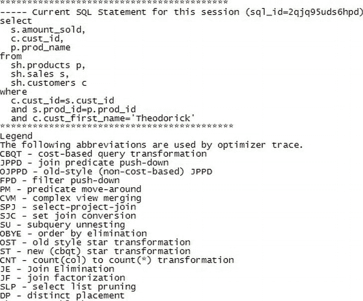
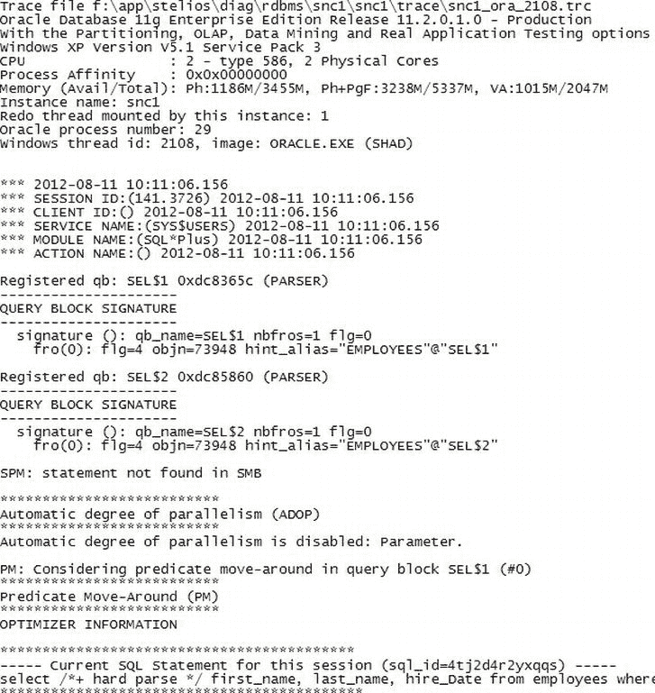
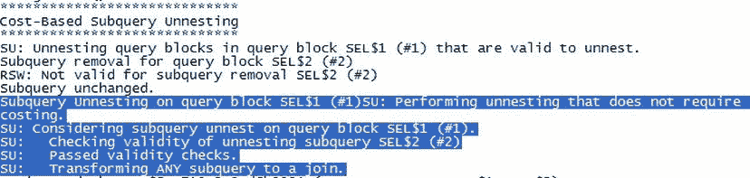
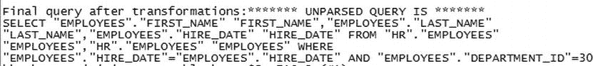
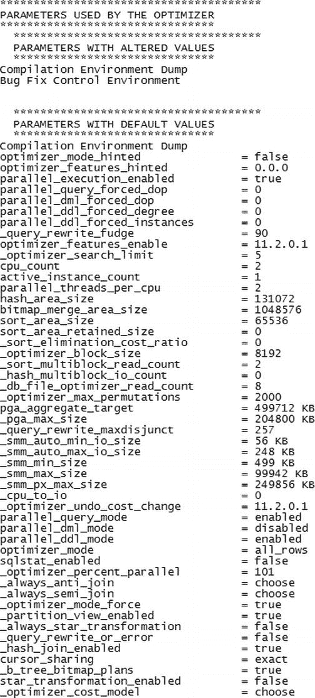
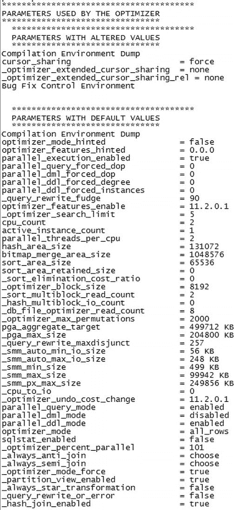
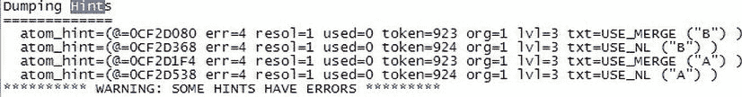
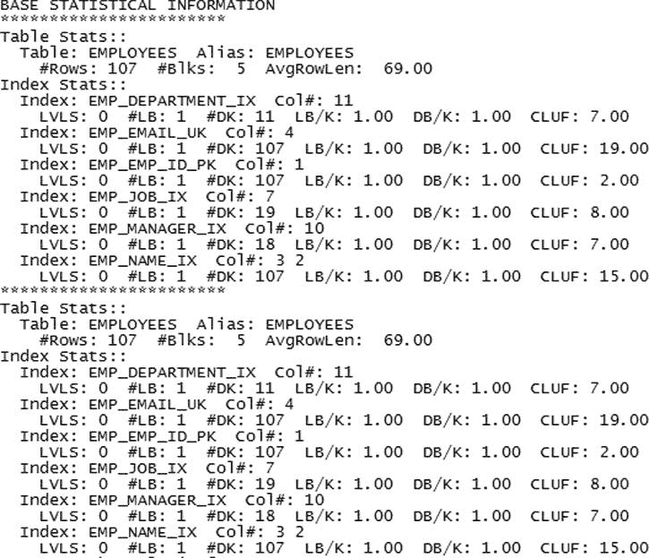
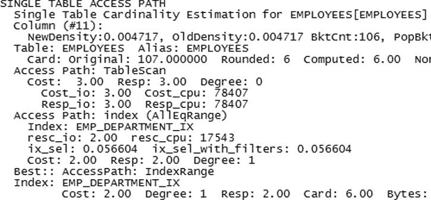
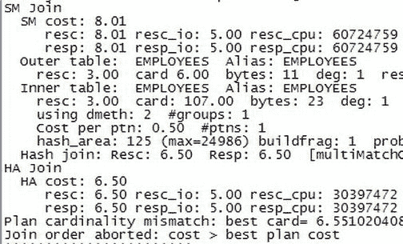

# 查看 10053 跟踪文件与理解查询转换

幸运的是，如果你想获得所有缩写及其含义的完整列表，可以在 10053 跟踪文件的“Legend”部分查看。请参考图 5-2 中的示例。每个 10053 跟踪文件都会显示这样一个部分，它展示了所有 SQL 语句可能用到的所有查询转换。这个部分并不针对正在被分析的特定 SQL 语句。



**图 5-2**  10053 跟踪文件的 Legend 部分

## 子查询非嵌套

子查询非嵌套是我们列表中的第一个查询转换，其正式定义是：一种将子查询转换为外部查询中的连接的查询转换技术，这随后允许优化器将子查询中的表纳入连接顺序、访问路径和连接方法的考虑范围。我们将通过这个例子来探讨查询优化，因为它是一个常用的技术；相关的示例也易于解释和生成！

一个可以使用子查询非嵌套的示例查询是：

```
Select
first_name,
last_name,
hire_Date
from employees
where
hire_date IN (
select hire_date from employees where department_id = 30
);
```

子查询部分位于括号内，在这个子查询示例中我们使用了 `IN`。

让我们看看当我们使用事件 10053 跟踪这个查询时会发生什么，如下所示：

```
SQL> connect hr/hr
Connected.
SQL> alter session set max_dump_file_size=unlimited;

Session altered.

SQL> alter session set events '10053 trace name context forever, level 1';

Session altered.

SQL> select /*+ hard parse */ first_name, last_name, hire_Date
  2  from employees where hire_date in
  3  (select hire_date from employees where
  4  department_id=30);

FIRST_NAME           LAST_NAME                 HIRE_DATE
-------------------- ------------------------- ---------
Den                  Raphaely                  07-DEC-02
Alexander            Khoo                      18-MAY-03
Shelli               Baida                     24-DEC-05
Sigal                Tobias                    24-JUL-05
Guy                  Himuro                    15-NOV-06
Karen                Colmenares                10-AUG-07

6 rows selected.

SQL> connect / as sysdba
Connected.
SQL> show parameter user_dump_Dest

NAME                                 TYPE        VALUE
------------------------------------ ----------- ------------------------------
user_dump_dest                       string      f:\app\stelios\diag\rdbms\snc1
                                                 \snc1\trace
```

跟踪文件位于 `user_dump_dest` 所指向的任何位置。如果我们编辑该跟踪文件，将看到图 5-3 中所示的头部信息。



**图 5-3**  示例 10053 跟踪文件的第一页

我们看到了通常的签名文本，告诉我们操作系统、Oracle 版本等信息。本次讨论的重要部分是确认我们期望解析的 SQL 语句是否出现在“Current SQL statement for this session”部分（位于图 5-3 的底部）。在我们的例子中，我们在原始 SQL 中添加了提示 `/*+ hard parse */`，这个提示也出现在了 10053 部分的“Current SQL section”下。因此我们可以基本确定这是正确的 SQL。

那么，我们如何知道子查询非嵌套是否发生了呢？我们在 10053 跟踪文件中搜索与图 5-4 类似的文本。我们应该搜索“subquery unnesting”，但我在图中高亮了与子查询非嵌套相关的部分。注意这些行开头的“SU”。这告诉你优化器正在考虑该查询的子查询非嵌套转换。



**图 5-4**  10053 跟踪文件中的文本显示了子查询非嵌套的发生过程

我们还可以看到转换后的新 SQL 是什么。请参阅图 5-5 来查看我们的测试查询被转换成了什么。



**图 5-5**  转换后的最终查询

这个查询在语义上看起来和原始查询一样吗？原始查询是：

```
Select
first_name,
last_name,
hire_Date
from employees
where
hire_date IN (
select hire_date from employees where department_id = 30
);
```

而这是新的查询：

```
Select
first_name,
last_name,
hire_date
from employees A, employees B
where
A.hire_date = B.hire_date
and
A.department_id=30;
```

通过上面这个相当简单的例子，我们了解了什么是子查询非嵌套。子查询非嵌套的目标是允许优化器可能使用其他连接方式或表顺序，以更高效地获得满意的结果。换句话说，通过移除子查询，我们给了优化器更多的自由去使用其他连接方式，因为我们把表名提升到了主查询的层级。子查询非嵌套有许多变体。例如，子查询可能使用 `NOT IN` 或 `NOT EXISTS`。我们不会涵盖这种技术的所有变体和组合，也不会介绍其他查询转换。（你可以轻松地就查询转换写一整本书。）只需知道 10053 跟踪文件会列出它考虑过的内容并显示它所执行的操作。此时你应该问的问题是：“如果它能正常工作，我为什么要在意优化器‘底层’在做什么？”

## 为什么要禁用查询转换？

在某些情况下，你可能希望关闭特定的转换：例如，当优化器的错误导致问题时。这可能是因为 Oracle 支持建议进行更改或指出某个查询转换存在问题。在你管理的系统上，你也可能会看到下面显示的一些隐藏参数。以下是一些可以影响 CBO（基于成本的优化器）进行查询转换的基于成本的优化器参数：

*   `_complex_view_merging`
*   `_convert_set_to_join`
*   `_unnest_subquery`
*   `_optimizer_cost_based_transformation`
*   `_optimizer_extend_jppd_view_types`
*   `_optimizer_filter_pred_pullup`
*   `_optimizer_group_by_placement`
*   `_optimizer_improve_selectivity`
*   `_optimizer_join_elimination_enabled`
*   `_optimizer_join_factorization`
*   `_optimizer_multi_level_push_pred`
*   `_optimizer_native_full_outer_join`
*   `_optimizer_order_by_elimination_enabled`
*   `_optimizer_push_pred_cost_based`
*   `_optimizer_unnest_all_subqueries`
*   `_optimizer_unnest_corr_set_subq`
*   `_optimizer_squ_bottomup`
*   `_optimizer_null_aware_antijoin`
*   `_pred_move_around`
*   `_push_join_predicate`

以下是一些影响此行为的提示：

*   `first_rows(n)`
*   `no_query_transformation`
*   `unnest`
*   `no_unnest`
*   `push_pred`
*   `no_push_pred`
*   `push_subq`
*   `native_full_outer_join`
*   `no_push_subq`
*   `no_set_to_join`
*   `qb_name`


这绝不是影响优化器的所有隐藏参数的完整列表。这些参数可用于开启或关闭某些功能。例如，`unnest_subquery` 的默认值为 `TRUE`（适用于 Oracle 9.0 及之后版本）。在大多数情况下，只有在你进行 SQL 调优，并发现某些提示或系统参数未能如预期般改变执行计划时，才会注意到相关问题。在某些情况下，仅仅是性能不足（或性能突然变化）这一迹象，就可能暗示存在问题。仅在 Oracle 支持人员要求时，才应设置这些参数。它们通常只在短时间内被设置，用于调试与这些转换相关的特定问题以及相关的错误，但你没有理由不向 Oracle 提交服务请求，询问是否可以尝试某些操作。Oracle 的支持人员都非常乐于助人且通情达理（真的）。

## 优化器参数

幸运的是，10053 跟踪文件列出了优化器参数及其默认值，因此你可以判断是否有任何更改。在标题为 **“PARAMETERS USED BY THE OPTIMIZER”**（如 图 5-6 所示）的部分中，我们看到了这些参数的前几项条目。请注意，**“Compilation Environment Dump”** 和 **“Bug Fix Control Environment”** 是同时存在于“已更改值”和“默认值”部分的小标题。在我们这个案例中，“已更改值”部分下的这两个小节都没有任何已更改的值。在“默认值”部分，第一个显示带有默认值的实际参数是 `optimizer_mode_hinted`（设置为 `false`）。所有参数（包括隐藏参数）都会列出。然而，自行尝试修改这些参数风险自负。如果支持人员要求你更改其中某个参数，那是因为他们正在帮助你解决与优化器相关的某些问题。另请注意，任何非默认参数都会在一个名为 **“PARAMETERS WITH ALTERED VALUES”** 的单独部分中显示。



图 5-6 .  10053 跟踪文件的优化器参数部分

举个例子，让我们看看如果将参数 `cursor_sharing` 从其默认值 `EXACT` 更改为 `FORCE` 会发生什么。这里我们将 `cursor_sharing` 设置为 `FORCE`（之前是 `EXACT`）。然后我们请求一个 10053 跟踪并执行一个查询；接着我们前往 `user_dump_dest` 查看 10053 跟踪文件，并找到包含参数的部分。以下是执行的命令：

```
SQL> show parameter cursor_sharing
NAME                                 TYPE        VALUE
------------------------------------ ----------- ---------------------------
cursor_sharing                       string      EXACT
_optimizer_extended_cursor_sharing  = none
_optimizer_extended_cursor_sharing_rel = none

SQL> alter system set cursor_sharing=FORCE scope=memory;

System altered.

SQL> alter session set events '10053 trace name context forever, level 1';

Session altered.

SQL> explain plan for select count(*) from dba_objects;

Explained.
```

在下面的图（图 5-7）中，我们看到 `cursor_sharing` 已被更改为 `force`。



图 5-7 .  在这里我们看到参数 `cursor_sharing` 已被更改为 `FORCE`

我们看到 10053 跟踪文件对于追踪隐藏和非隐藏的优化器参数非常有用。现在我们将看看优化器提示。

### 优化器提示

如果你在 SQL 中使用任何优化器提示，检查这些提示是否被使用是一个好主意。优化器会尽力使用给予它的提示，但如果使用存在问题，则不会使用这些提示。优化器忽略提示的原因包括语法不正确或提示与其他提示冲突。如果提示正确，优化器将会使用它们。让我们看一个涉及我们之前处理的查询的例子。现在，凭借我们对子查询展开的了解，我们将以不同方式编写查询并尝试几个提示。首先，我们运行不带提示的查询并查看执行计划。它将显示一个哈希连接。然后我们将提示使用嵌套循环连接。我们会确认这一点，但再次查看执行计划。最后，我们将使用相互冲突的提示，并看到执行计划恢复为哈希连接。

```
SQL> set autotrace traceonly explain;
set lines 100
select
  a.first_name, a.last_name, a.hire_date
  from employees a, employees b
  where a.hire_date = b.hire_date
  and a.department_id=30
/
Execution Plan

Plan hash value: 2254211361

| Id  | Operation                    | Name              | Rows  | Bytes | Cost (%CPU)| Time     |

| 0   | SELECT STATEMENT             |                   |     7 |   238 |     6  (17)| 00:00:01 |
|*1   |  HASH JOIN                   |                   |     7 |   238 |     6  (17)| 00:00:01 |
| 2   |   TABLE ACCESS BY INDEX ROWID| EMPLOYEES         |     6 |   156 |     2   (0)| 00:00:01 |
|*3   |    INDEX RANGE SCAN          | EMP_DEPARTMENT_IX |     6 |       |     1   (0)| 00:00:01 |
| 4   |   TABLE ACCESS FULL          | EMPLOYEES         |   107 |   856 |     3   (0)| 00:00:01 |

Predicate Information (identified by operation id):

1 - access("A"."HIRE_DATE"="B"."HIRE_DATE")
   3 - access("A"."DEPARTMENT_ID"=30)
```

```
SQL> select /*+ use_nl(a b) */
  a.first_name, a.last_name, a.hire_date
  from employees a, employees b
  where a.hire_date = b.hire_date
  and a.department_id=30
/
Execution Plan

Plan hash value: 3321434377

| Id  | Operation                  | Name              | Rows  | Bytes | Cost (%CPU)| Time     |

|   0 | SELECT STATEMENT           |                   |     7 |   238 |    12   (0)| 00:00:01 |
|   1 |  NESTED LOOPS              |                   |     7 |   238 |    12   (0)| 00:00:01 |
|   2 | TABLE ACCESS BY INDEX ROWID| EMPLOYEES         |     6 |   156 |     2   (0)| 00:00:01 |
|*  3 |  INDEX RANGE SCAN          | EMP_DEPARTMENT_IX |     6 |       |     1   (0)| 00:00:01 |
|*  4 | TABLE ACCESS FULL          | EMPLOYEES         |     1 |     8 |     2   (0)| 00:00:01 |

Predicate Information (identified by operation id):

3 - access("A"."DEPARTMENT_ID"=30)
   4 - filter("A"."HIRE_DATE"="B"."HIRE_DATE")
```

```
SQL> select /*+ use_nl(a b) use_merge(a b) */
  a.first_name, a.last_name, a.hire_date
  from employees a, employees b
  where a.hire_date = b.hire_date
  and a.department_id=30
/

Execution Plan

Plan hash value: 2254211361

| Id  | Operation                   | Name             | Rows  | Bytes | Cost (%CPU)| Time     |

|   0 |SELECT STATEMENT             |                  |     7 |   238 |     6  (17)| 00:00:01 |
|*  1 | HASH JOIN                   |                  |     7 |   238 |     6  (17)| 00:00:01 |
|   2 |  TABLE ACCESS BY INDEX ROWID|EMPLOYEES         |     6 |   156 |     2   (0)| 00:00:01 |
|*  3 |   INDEX RANGE SCAN          |EMP_DEPARTMENT_IX |     6 |       |     1   (0)| 00:00:01 |
|   4 |  TABLE ACCESS FULL          |EMPLOYEES         |   107 |   856 |     3   (0)| 00:00:01 |

Predicate Information (identified by operation id):

1 - access("A"."HIRE_DATE"="B"."HIRE_DATE")
   3 - access("A"."DEPARTMENT_ID"=30)
```


让我们逐步分析每个步骤，看看能否理解发生了什么。在第一次执行中，我们允许优化器自行决定。如果想确认没有隐藏参数影响优化器，也可以通过查看`10053`跟踪文件来验证。因此在第一步中，优化器选择了`哈希连接`。在第二次执行中，我们决定（无论出于什么原因）尝试改用`嵌套循环`，于是在 SQL 中使用了提示`use_nl (a b)`。请记住，`(a b)`代表此提示中要连接的两个表的别名。令人满意的是，新的执行计划确实使用了`嵌套循环`。目前为止一切顺利。

现在，在第三次执行中，我们想进一步调整，并使用额外的提示`use_merge(a b)`。这看似有些矛盾，但我们想了解优化器会如何处理。它会使用`哈希连接`，还是`排序合并连接`，或者从两者中选择最佳方案？查看生成的执行计划后，我们发现它两样都没选，而是用了`哈希连接`。因此，与其猜测，我们现在生成了这个"异常"行为的`10053`跟踪文件。在此步骤中，我们将转储文件大小设为无限，请求`10053`跟踪文件，运行包含两个待查提示的 SQL，然后执行该 SQL。

```
SQL> alter session set max_dump_file_size=unlimited;

Session altered.

SQL> alter session set events '10053 trace name context forever, level 1';

Session altered.

SQL> set autotrace off;
SQL> select /*+ use_nl(a b) user_merge (a b) */
  2  a.first_name, a.last_name, a.hire_date
  3  from employees a, employees b
  4  where a.hire_date=b.hire_date
  5  and a.department_id=30
  6  /

FIRST_NAME           LAST_NAME                 HIRE_DATE
-------------------- ------------------------- ---------
Den                  Raphaely                  07-DEC-02
Alexander            Khoo                      18-MAY-03
Shelli               Baida                     24-DEC-05
Sigal                Tobias                    24-JUL-05
Guy                  Himuro                    15-NOV-06
Karen                Colmenares                10-AUG-07

6 rows selected.
```

通过检查文本内容，我们确认正在查看正确的`10053`跟踪文件，确实，提示与之匹配。现在如果搜索"hint"一词，会在跟踪文件末尾找到一个名为"Dumping Hints"的部分。请参见图 5-8。



图 5-8 . `10053`跟踪文件的提示部分

这个小部分中需要注意的重要一点是`used=0`。这意味着该提示未被使用，被完全忽略了。实际上两个提示都被忽略了，这使得优化器能够自行决策，从而导致使用了`哈希连接`。SQL 的执行没有产生错误，我们没有从优化器得到任何关于提示有误的错误信息。这些信息被隐藏在（如果我们请求了）`10053`跟踪文件中。那么问题出在哪里呢？`err`代码为 4，表示与其他提示存在冲突。在这种情况下，两个提示相互抵消了。这里需要注意的重要一点是，上面第三次执行 SQL 并未生成错误。优化器识别了这些提示，发现它们彼此冲突，于是忽略它们并制定一个不考虑这些提示的计划。

### 成本计算

优化器最重要的工作是比较不同执行计划之间的成本。当然，这是总体目标。执行计划的成本由其每一行的成本组成，而每一行又基于依赖于统计信息的计算。不同计划的计算基于不同的访问路径、连接方法以及查询不同部分的访问顺序。听起来很有趣，不是吗？如果你有七个不同的表，你可以选择七种处理顺序（即七的阶乘，相当于`7x6x5x4x3x2x1`）！这总共有 5,040 种方式，这还不算最初访问这些表的不同方式。优化器选择一个合理的计划，挑选外表并逐层推进，尝试几种组合，并快速排除那些成本已经超过先前尝试过的计划的选项（这是高度简化的）。因此，例如，如果优化器猜测第一个计划的成本是 1,000，那么当第二个计划在成本计算到一半达到 1,500 时，它就会被放弃。在这种情况下，无需继续计算。它这样做是为了在总体硬解析耗时中节省时间。它知道你渴望得到结果。一旦你知道`10053`是关于优化器如何基于这种方法推导其计划的故事，这个跟踪文件就开始变得有意义了。

在提供了关于参数、所考虑的 SQL 以及任何可能适用的查询转换的一些基本信息后，基于成本的优化器开始介绍访问相关对象成本的一些基本信息。例如，在图 5-9 中展示了关于表`EMPLOYEES`的一些基本信息（在此例中展示了两次）。



图 5-9 . `10053`中显示 BASE STATISTICAL INFORMATION 的部分

一旦我们获得了关于表及其索引的所有这些基本信息（注意在此基本信息中我们也有了聚簇因子`CLUF`），我们就可以开始确定以最低成本获取信息的方式。例如，CBO 将考虑单表访问路径，并由此考虑`全表扫描`（成本为 3）或`索引（AllEqRange）`（成本为 2），然后告诉我们哪个成本最低：`最佳:: 访问路径：索引范围扫描`。图 5-10 展示了`10053`中的相关部分。



图 5-10 . 优化器对表`EMPLOYEES`的看法

完成这一步后，优化器开始考虑连接顺序，在此例中仅与另一个版本的`EMPLOYEES`表进行连接。图 5-11 展示了优化器放弃计算的一个例子。



图 5-11 . 优化器因成本高于当前最佳而放弃一个连接

## 总结

既然我们已经介绍了可以从`10053`跟踪文件中获取的部分信息，你也就了解了它的用处。通过仔细阅读跟踪文件，你现在应该能够看出优化器选择其行为的原因：它考虑了哪些访问路径以及为何拒绝其中一些。如果你认为某些访问路径本不该被拒绝，你应该能够追溯到根本原因，并回答所有 DBA 那个由来已久的问题：“为什么它没有使用我的索引？”

