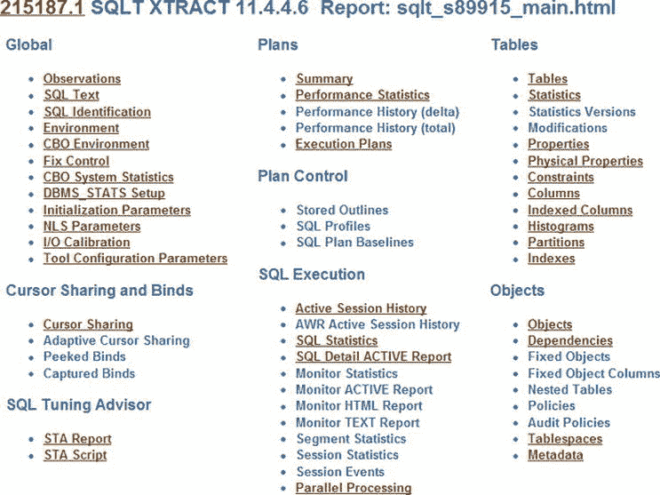
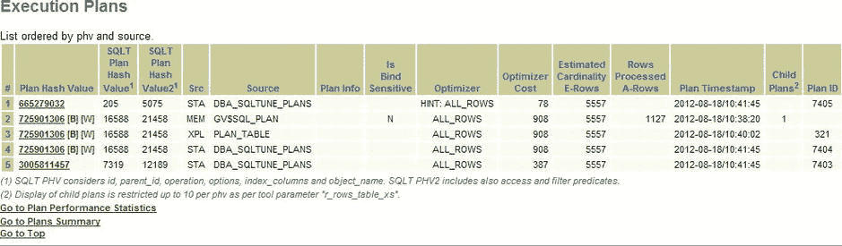

# 了解 SQL 配置文件

至此，我们已了解什么是 SQL 配置文件及其对优化器的呈现形式。我们也明白，对一个 SQL 语句保持不变的配置文件可能并非良策。话虽如此，我们仍清楚地认识到，使生产数据库恢复运行状态可能是成败的关键。因此，在所有这些前提和限制条件下，让我们探究一下 SQLT 是从何处获取其 SQL 配置文件的。

## SQLT 从何处获取其 SQL 配置文件？

获取为你创建 SQL 配置文件的脚本很简单。SQLT 可从 `XTRACT` 方法和 `XECUTE` 方法生成所需的脚本。我们在 `第 1 章` 中看到了如何生成 `XTRACT` 报告，并在 `第 3 章` 中介绍了 `XECUTE`。请记下报告的 SQLT ID（而非 SQL ID）以及你想要的执行计划哈希值。参见下图 `图 6-1`。它显示了 SQLT ID，即标题“Report: `sqlt_s89915_main.html`”中的数字。在本例中，SQLT ID 为 `89915`。



`图 6-1` .  标题页显示了生成配置文件所需的 SQLT ID

执行计划哈希值 (`PHV`) 可从报告的“执行计划”部分获取。 参见 `图 6-2`，该部分显示了可用的执行计划哈希值。



`图 6-2` .  可用的执行计划及其执行计划哈希值 (`PHV`)

现在我们同时拥有了 SQLT ID 和 `PHV`。在 SQLT 安装目录下的 `utl` 目录中，我们现在可以运行生成配置文件的脚本，如下例所示。但在生产系统上执行此操作之前，应咨询 Oracle 支持，确保你的步骤是经过验证且受支持的操作。只需提交一个服务请求，负责调优支持的友好人员会非常乐意帮助你。以下是显示 `utl` 目录中文件的目录列表。从该目录中，我们首先启用配置文件创建，然后运行生成配置文件的例程，确保传入 SQLT ID 和 `PHV`。我展示了脚本的输出，最后展示了新创建的文件。就这么简单。

```
C:\Documents and Settings\Stelios\Desktop\SQLT\sqlt\utl>dir
 Volume in drive C has no label.
 Volume Serial Number is 77E9-80B4

Directory of C:\Documents and Settings\Stelios\Desktop\SQLT\sqlt\utl

09/01/2012  09:23 AM    <DIR>          .
09/01/2012  09:23 AM    <DIR>          ..
07/02/2011  12:49 AM               130 10053.sql
04/02/2012  12:43 PM             4,828 coe_gen_sql_profile.sql
08/18/2012  11:25 AM             1,185 coe_gen_sql_profile_.zip
06/02/2012  05:28 AM            10,305 coe_load_sql_baseline.sql
04/02/2012  12:43 PM            12,007 coe_load_sql_profile.sql
05/02/2012  11:27 AM            18,248 coe_xfr_sql_profile.sql
07/02/2011  12:49 AM               101 flush.sql
08/18/2012  11:25 AM                33 missing_file.txt
07/02/2011  12:49 AM               184 plan.sql
06/02/2012  05:28 AM            22,527 profiler.sql
06/02/2012  05:28 AM            73,472 pxhcdr.sql
06/02/2012  05:28 AM            71,213 roxecute.sql
06/02/2012  05:28 AM            70,126 roxtract.sql
08/11/2011  03:46 AM               475 sel.sql
02/02/2012  01:19 PM               435 sel_aux.sql
06/02/2012  05:28 AM           160,393 sqlhc.sql
01/03/2012  12:04 AM             2,891 sqltcdirs.sql
08/11/2011  03:46 AM             4,014 sqlthistfile.sql
08/11/2011  03:46 AM             3,116 sqlthistpurge.sql
04/02/2012  12:43 PM             3,694 sqltimp.sql
04/02/2012  12:43 PM             2,927 sqltimpfo.sql
01/03/2012  12:04 AM             3,545 sqltlite.sql
03/02/2012  04:06 PM             3,900 sqltmain.sql
09/01/2012  09:23 AM             6,582 sqltprofile.log
01/03/2012  12:04 AM             5,469 sqltprofile.sql <<<我们要使用的脚本
08/18/2012  09:33 AM                74 x.sql
02/18/2012  10:04 AM    <DIR>          xgram
02/02/2012  12:15 PM    <DIR>          xhume
06/01/2012  09:39 AM    <DIR>          xplore
              27 File(s)        486,021 bytes
               5 Dir(s)  11,102,261,248 bytes free

C:\Documents and Settings\Stelios\Desktop\SQLT\sqlt\utl>sqlplus stelios/oracle

SQL*Plus: Release 11.2.0.1.0 Production on Sat Sep 1 09:24:34 2012

Copyright (c) 1982, 2010, Oracle.  All rights reserved.

Connected to:
Oracle Database 11g Enterprise Edition Release 11.2.0.1.0 - Production
With the Partitioning, OLAP, Data Mining and Real Application Testing options

SQL> EXEC sqltxplain.sqlt$a.set_param('custom_sql_profile', 'Y');

PL/SQL procedure successfully completed.

SQL> @sqltprofile 89915 3005811457
```

请注意，`sqltxplain.sqlt$a.set_param` 过程是启用此功能所必需的。当我们运行 `sqltprofile.sql` 时（传入有效的 SQLT ID 和有效的执行计划哈希值 [分别是第一个和第二个数字]），我们将看到与下图类似的结果：

```
... 请稍候 ...

STAID MET INSTANCE SQL_TEXT
----- --- -------- ------------------------------------------------------------
89906 XTR snc1     select count(*) from dba_objects
89909 XEC snc1     select   s.amount_sold,   c.cust_id,   p.prod_name from   sh
89910 XEC snc1     select  s.amount_sold,c.cust_id,p.prod_name from sh.products
89911 XEC snc1     select  s.amount_sold,c.cust_id,p.prod_name from sh.products
89912 XTR snc1     select  s.amount_sold,c.cust_id,p.prod_name from sh.products
89913 XTR snc1     select sql_id from v$sql where sql_text like '%select count(
89914 XTR snc1     select count(*) from test3 where object_type like '%TAB%' an
89915 XTR snc1     select  s.amount_sold,c.cust_id,p.prod_name from sh.products
89916 XTR snc1     select  s.amount_sold,c.cust_id,p.prod_name from sh.products
参数 1:
STATEMENT_ID (必需)

PLAN_HASH_VALUE ATTRIBUTE
--------------- ---------

725901306 [B][W]

参数 2:
PLAN_HASH_VALUE (必需)

传递给 sqltprofile 的值:
∼∼∼∼∼∼∼∼∼∼∼∼∼∼∼∼∼∼∼∼∼∼∼∼∼∼∼∼∼
STATEMENT_ID   : "89915"
PLAN_HASH_VALUE: "3005811457"
... 正在从 sqlt 存储库中提取 sqlt_s89915_p3005811457_sqlprof.sql ...
sqlt_s89915_p3005811457_sqlprof.sql 已生成
SQLTPROFILE 已完成。
SQL>
```


脚本已经运行完毕，那么从哪里可以找到用于创建 SQL Profile 的脚本呢？该 SQL 脚本与配置文件脚本位于同一目录。下面的目录命令展示了该文件，我已用“新文件”指针标出。

```
C:\Documents and Settings\Stelios\Desktop\SQLT\sqlt\utl>dir *.sql
 Volume in drive C has no label.
 Volume Serial Number is 77E9-80B4

Directory of C:\Documents and Settings\Stelios\Desktop\SQLT\sqlt\utl

07/02/2011  12:49 AM               130 10053.sql
04/02/2012  12:43 PM             4,828 coe_gen_sql_profile.sql
06/02/2012  05:28 AM            10,305 coe_load_sql_baseline.sql
04/02/2012  12:43 PM            12,007 coe_load_sql_profile.sql
05/02/2012  11:27 AM            18,248 coe_xfr_sql_profile.sql
07/02/2011  12:49 AM               101 flush.sql
07/02/2011  12:49 AM               184 plan.sql
06/02/2012  05:28 AM            22,527 profiler.sql
06/02/2012  05:28 AM            73,472 pxhcdr.sql
06/02/2012  05:28 AM            71,213 roxecute.sql
06/02/2012  05:28 AM            70,126 roxtract.sql
08/11/2011  03:46 AM               475 sel.sql
02/02/2012  01:19 PM               435 sel_aux.sql
06/02/2012  05:28 AM           160,393 sqlhc.sql
01/03/2012  12:04 AM             2,891 sqltcdirs.sql
08/11/2011  03:46 AM             4,014 sqlthistfile.sql
08/11/2011  03:46 AM             3,116 sqlthistpurge.sql
04/02/2012  12:43 PM             3,694 sqltimp.sql
04/02/2012  12:43 PM             2,927 sqltimpfo.sql
01/03/2012  12:04 AM             3,545 sqltlite.sql
03/02/2012  04:06 PM             3,900 sqltmain.sql
01/03/2012  12:04 AM             5,469 sqltprofile.sql
09/01/2012  09:29 AM             4,147 sqlt_s89915_p3005811457_sqlprof.sql <<<New file
08/18/2012  09:33 AM                74 x.sql
              24 File(s)        478,221 bytes
               0 Dir(s)  11,099,074,560 bytes free
```

