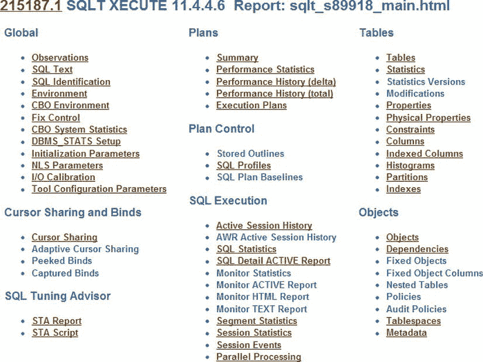
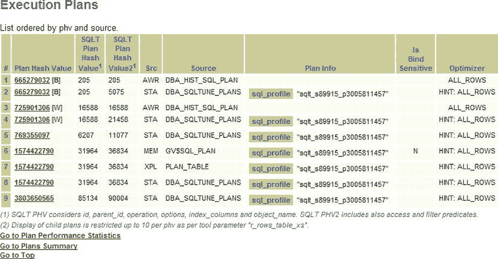
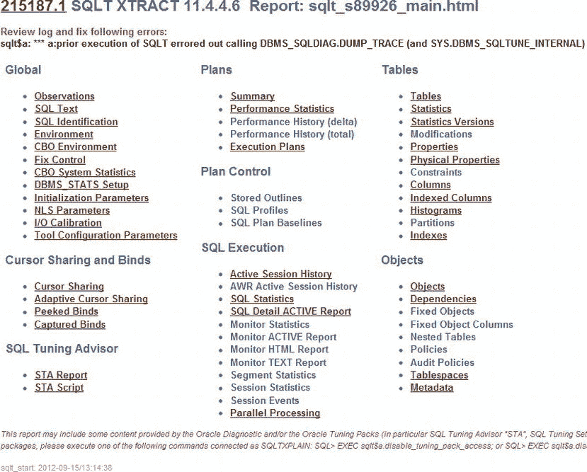
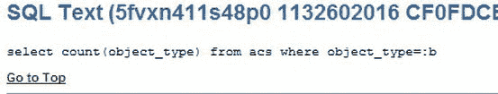
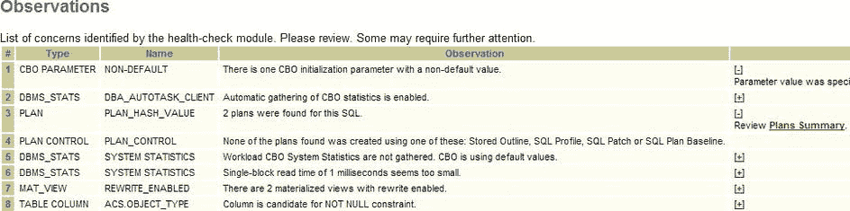
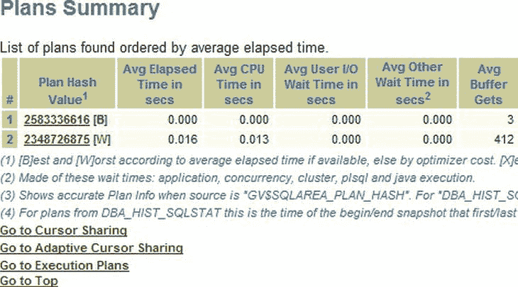
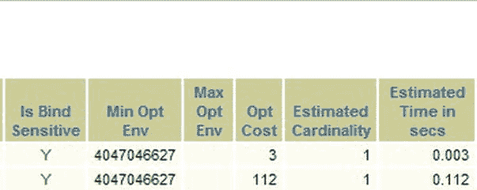
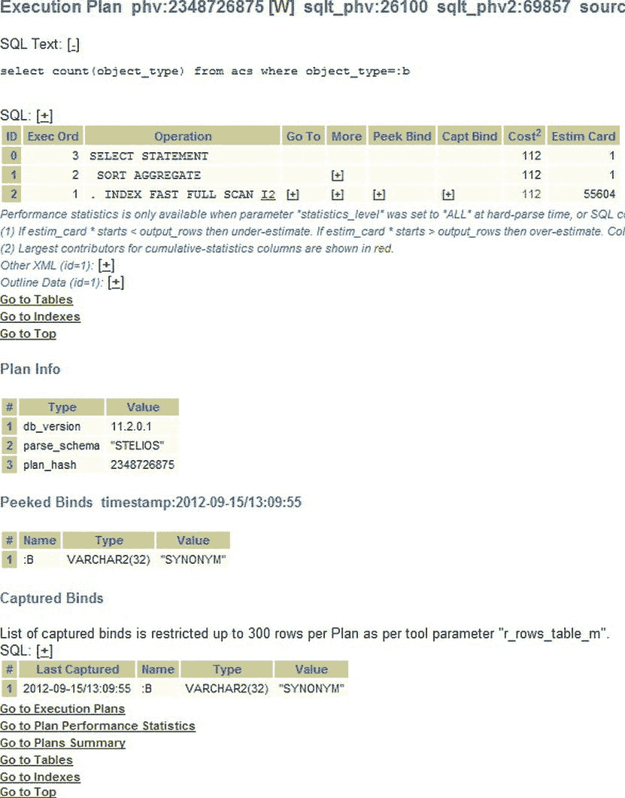
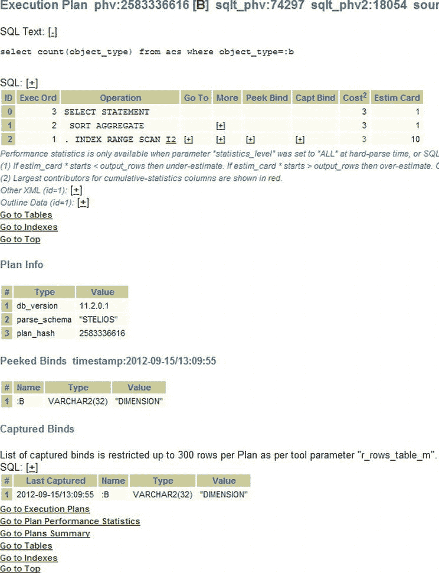
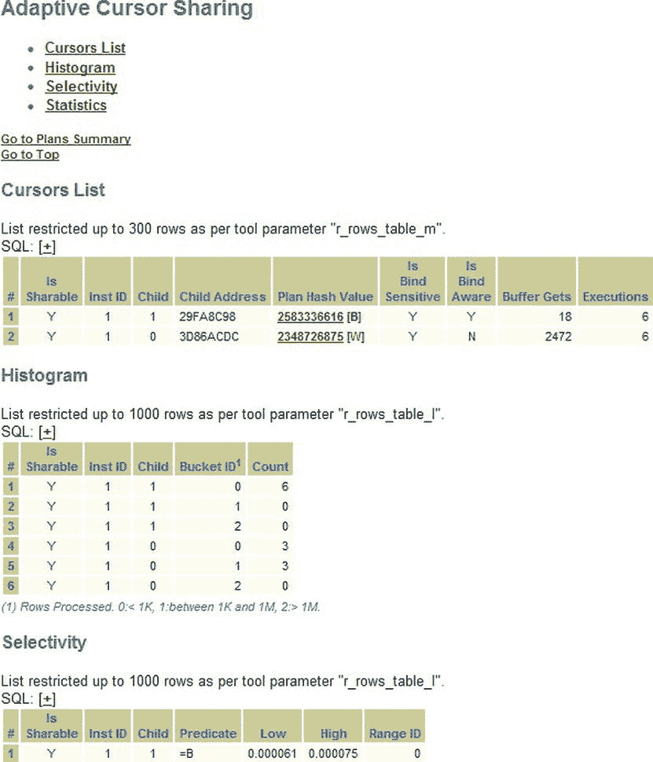

# SQL Profile 能用来做什么？

现在我们有了 `sqlt_s89915_p3005811457_sqlprof.sql` 脚本，能用它来做什么呢？简而言之，我们可以在 SQL 正在执行的数据库上运行这个脚本，它将**冻结**该 SQL ID 的执行计划。它也可以用于在另一个系统上冻结执行计划。例如，如果你的开发系统拥有正确的执行计划，而生产系统却没有，你就可以**转移**执行计划。在某些情况下，生产数据库可能因为某个关键的 SQL 使用了错误的执行计划，导致运行速度过慢，无法在执行时间窗口内完成，从而使数据库处于不可用的状态，此时仅凭这个脚本就值回本书的价钱。让我们来看看这个脚本。

```
SPO sqlt_s89915_p3005811457_sqlprof.log;
SET ECHO ON TERM ON LIN 2000 TRIMS ON NUMF 99999999999999999999;
REM
REM $Header: 215187.1 sqlt_s89915_p3005811457_sqlprof.sql 11.4.4.6 2012/09/01 carlos.sierra $
REM
REM Copyright (c) 2000-2012, Oracle Corporation. All rights reserved.
REM
REM AUTHOR
REM   carlos.sierra@oracle.com
REM
REM SCRIPT
REM   sqlt_s89915_p3005811457_sqlprof.sql
REM
REM SOURCE
REM   Host    : LOCUTUS
REM   DB Name : SNC1
REM   Platform: 32-bit Windows
REM   Product : Oracle Database 11g Enterprise Edition (Production)
REM   Version : 11.2.0.1.0
REM   Language: US:AMERICAN_AMERICA.WE8MSWIN1252
REM   EBS     : NO
REM   Siebel  : NO
REM   PSFT    : NO
REM
REM DESCRIPTION
REM   此脚本由 SQLT 工具自动生成。
REM   它包含用于创建自定义 SQL Profile 的 SQL*Plus 命令，
REM   该配置基于计划哈希值 3005811457。
REM   由该脚本创建的自定义 SQL Profile 将影响其签名
REM   与下方 SQL 文本签名相匹配的 SQL 命令的计划。
REM   请审阅 SQL 文本并酌情调整。
REM
REM PARAMETERS
REM   无。
REM
REM EXAMPLE
REM   SQL> START sqlt_s89915_p3005811457_sqlprof.sql; <<< 注意 1.
REM
REM NOTES
REM   1. 应以 SYSTEM 或 SYSDBA 身份运行。
REM   2. 用户必须拥有 CREATE ANY SQL PROFILE 权限。
REM   3. 源系统和目标系统可以相同或相似。
REM   4. 创建此自定义 SQL Profile 后，如需删除：
REM      EXEC DBMS_SQLTUNE.DROP_SQL_PROFILE('sqlt_s89915_p3005811457'); <<<注意 2.
REM   5. 请注意，使用 DBMS_SQLTUNE 需要 Oracle 调优包的许可。 <<< 注意 3.
REM   6. 如果你通过在 SQL 中添加 Hint 来生成期望的计划，
REM      可以从下方的 SQL 文本片段中移除这些临时的 Hint。
REM      这样，你可以为原始 SQL 创建一个自定义 SQL Profile，
REM      但其计划捕获自添加了 Hint 的 SQL。
REM
WHENEVER SQLERROR EXIT SQL.SQLCODE;

VAR signature NUMBER;

DECLARE
  sql_txt CLOB;
  h       SYS.SQLPROF_ATTR;
  PROCEDURE wa (p_line IN VARCHAR2) IS
  BEGIN
    DBMS_LOB.WRITEAPPEND(sql_txt, LENGTH(p_line), p_line);
  END wa;
BEGIN
  DBMS_LOB.CREATETEMPORARY(sql_txt, TRUE); <<< 注意 4
  DBMS_LOB.OPEN(sql_txt, DBMS_LOB.LOB_READWRITE);
  -- 下方的 SQL 文本片段长度不必相同。
  -- 因此，如果你编辑了 SQL 文本（即移除了临时的 Hint），
  -- 则无需编辑或重新对齐未修改的片段。
  wa(q'[select  s.amount_sold,c.cust_id,p.prod_name from sh.products p,s]'); <<< 注意 5
  wa(q'[h.sales s,sh.customers c where
  c.cust_id=s.cust_id and s.prod_]');
  wa(q'[id=p.prod_id and c.cust_first_name='Theodorick' ]');
  DBMS_LOB.CLOSE(sql_txt);
  h := SYS.SQLPROF_ATTR(
  q'[BEGIN_OUTLINE_DATA]',
  q'[SWAP_JOIN_INPUTS(@"SEL$1" "P"@"SEL$1")]',
  q'[USE_HASH(@"SEL$1" "P"@"SEL$1")]',
  q'[NLJ_BATCHING(@"SEL$1" "S"@"SEL$1")]',
  q'[USE_NL(@"SEL$1" "S"@"SEL$1")]',
  q'[LEADING(@"SEL$1" "C"@"SEL$1" "S"@"SEL$1" "P"@"SEL$1")]',
  q'[FULL(@"SEL$1" "P"@"SEL$1")]',
  q'[INDEX(@"SEL$1" "S"@"SEL$1" ("SALES"."CUST_ID"))]',
  q'[INDEX(@"SEL$1" "C"@"SEL$1" ("CUSTOMERS"."CUST_FIRST_NAME" "CUSTOMERS"."CUST_ID"))]',
  q'[OUTLINE_LEAF(@"SEL$1")]',
  q'[ALL_ROWS]',
  q'[DB_VERSION('11.2.0.1')]',
  q'[OPTIMIZER_FEATURES_ENABLE('11.2.0.1')]',
  q'[IGNORE_OPTIM_EMBEDDED_HINTS]',
  q'[END_OUTLINE_DATA]');

:signature := DBMS_SQLTUNE.SQLTEXT_TO_SIGNATURE(sql_txt); <<< 注意 6

DBMS_SQLTUNE.IMPORT_SQL_PROFILE ( <<< 注意 7
    sql_text    => sql_txt,
    profile     => h,
    name        => 'sqlt_s89915_p3005811457',
    description => 's89915_snc1_locutus 6ga32aw0dn2sd 3005811457 '||:signature,
    category    => 'DEFAULT',
    validate    => TRUE,
    replace     => TRUE,
    force_match => FALSE /* TRUE:FORCE (即使 SQL 中字面值不同也匹配). FALSE:EXACT (类似于 CURSOR_SHARING) */ );

DBMS_LOB.FREETEMPORARY(sql_txt);
END;
/


```sql
WHENEVER SQLERROR CONTINUE;
SET ECHO OFF;
PRINT signature
PRO
PRO ... 手动定制的 SQL 配置文件已创建
PRO
SET TERM ON ECHO OFF LIN 80 TRIMS OFF NUMF "";
SPO OFF;
PRO
PRO SQLPROFILE 已完成。
```

你无需了解这段代码的任何工作细节；在紧急情况下，你只需按照指示操作，然后让你的系统按要求运行即可。

1.  `SQL> START sqlt_s89915_p3005811457_sqlprof.sql;` - 这是运行 SQL 脚本的方式。如注意事项中所说，你应该使用具有足够权限的账户，例如 `SYS`。
2.  `SQL> EXEC DBMS_SQLTUNE.DROP_SQL_PROFILE('sqlt_s89915_p3005811457');` 如果出于某种原因你不希望保留此配置文件（例如，你已经找到了 SQL 性能问题的长期解决方案），你可以执行这条命令，该 SQL 配置文件将被删除。
3.  你必须拥有 Oracle 许可，才能在应用此代码的系统上使用调优包。
4.  这是创建 `LOB` 以存储你的 SQL 文本的代码。
5.  一系列对过程 `wa`（Write Append，写入追加）的调用被用于存储越来越多的 SQL 文本，直到全部存储在 `sql_text` 中。
6.  为 SQL 文本创建签名。
7.  导入 SQL 配置文件。过程 `IMPORT_SQL_PROFILE` 接受以下参数：
    *   a.  查询的 `sql_text`
    *   b.  查询的提示（`h`）
    *   c.  SQL 配置文件的名称（在此示例中为 `sqlt_s89915_p3005811457`）
    *   d.  一些描述该配置文件的文本，基于 SQLT ID、SQL ID、计划哈希值和签名。
    *   e.  一个类别，设置为 `DEFAULT`
    *   f.  一个用于验证 SQL 配置文件的设置
    *   g.  一个用于替换相同 SQL 文本上任何现有配置文件的设置
    *   h.  一个 `force_match` 标志，默认设置为 `FALSE`，但如果你的 SQL 使用字面量并且你希望所有出现的该 SQL 都使用相同的配置文件，则应设置为 `TRUE`。

让我们看一个脚本运行的例子。在这个例子中我没有设置 `force_match` 标志，因为我不需要它，但在一个使用包含字面量的 SQL 的系统上，我会将 `force_match` 标志设置为 `TRUE`。在下面的例子中，我运行了上面创建的配置文件脚本。这个脚本现在是一个独立的脚本，它为特定的 SQL ID 生成配置文件，并使用特定 PHV 的计划。它没有其他用途。因此它不接受参数。我们知道脚本已经完成，因为我们看到了消息 “SQLPROFILE completed”。一旦这个脚本执行完毕，除了找到长期解决方案之外，就没什么可做的了！

```
C:\Documents and Settings\Stelios\Desktop\SQLT\sqlt\utl>sqlplus stelios/oracle

SQL*Plus: Release 11.2.0.1.0 Production on Sat Sep 1 10:53:17 2012

Copyright (c) 1982, 2010, Oracle.  All rights reserved.

Connected to:
Oracle Database 11g Enterprise Edition Release 11.2.0.1.0 - Production
With the Partitioning, OLAP, Data Mining and Real Application Testing options

SQL> @sqlt_s89915_p3005811457_sqlprof.sql
SQL> REM
SQL> REM $Header: 215187.1 sqlt_s89915_p3005811457_sqlprof.sql 11.4.4.6 2012/09/01 carlos.sierra $
SQL> REM
SQL> REM Copyright (c) 2000-2012, Oracle Corporation. All rights reserved.
SQL> REM
SQL> REM 作者
SQL> REM   carlos.sierra@oracle.com
SQL> REM
SQL> REM 脚本
SQL> REM   sqlt_s89915_p3005811457_sqlprof.sql
SQL> REM
SQL> REM 来源
SQL> REM   主机    : LOCUTUS
SQL> REM   数据库名: SNC1
SQL> REM   平台    : 32 位 Windows
SQL> REM   产品    : Oracle Database 11g Enterprise Edition (Production)
SQL> REM   版本    : 11.2.0.1.0
SQL> REM   语言    : US:AMERICAN_AMERICA.WE8MSWIN1252
SQL> REM   EBS     : NO
SQL> REM   Siebel  : NO
SQL> REM   PSFT    : NO
SQL> REM
SQL> REM 描述
SQL> REM   此脚本由 SQLT 工具自动生成。
SQL> REM   它包含用于创建定制 SQL 配置文件的 SQL*Plus 命令，
SQL> REM   基于计划哈希值 3005811457。
SQL> REM   由此脚本创建的定制 SQL 配置文件，
SQL> REM   将影响签名与下方 SQL 文本匹配的 SQL 命令的执行计划。
SQL> REM   请检查 SQL 文本并相应调整。
SQL> REM
SQL> REM 参数
SQL> REM   无。
SQL> REM
SQL> REM 示例
SQL> REM   SQL> START sqlt_s89915_p3005811457_sqlprof.sql;
SQL> REM
SQL> REM 注意事项
SQL> REM   1. 应作为 SYSTEM 或 SYSDBA 运行。
SQL> REM   2. 用户必须具有 CREATE ANY SQL PROFILE 权限。
SQL> REM   3. 源系统和目标系统可以是相同或相似的。
SQL> REM   4. 创建此定制 SQL 配置文件后，如需删除：
SQL> REM         EXEC DBMS_SQLTUNE.DROP_SQL_PROFILE('sqlt_s89915_p3005811457');
SQL> REM   5. 请注意，使用 DBMS_SQLTUNE 需要 Oracle 调优包的许可。
SQL> REM   6. 如果你修改了 SQL 并添加了提示以生成期望的计划，
SQL> REM         你可以从下面的 SQL 文本片段中移除人工添加的提示。
SQL> REM         这样，你可以为原始 SQL 创建一个定制的 SQL 配置文件，
SQL> REM         但其执行计划是从修改后的 SQL（带有提示）中捕获的。
SQL> REM
SQL> WHENEVER SQLERROR EXIT SQL.SQLCODE;
SQL>
SQL> VAR signature NUMBER;
SQL>
SQL> DECLARE
  2    sql_txt CLOB;
  3    h          SYS.SQLPROF_ATTR;
  4    PROCEDURE wa (p_line IN VARCHAR2) IS
  5    BEGIN
  6      DBMS_LOB.WRITEAPPEND(sql_txt, LENGTH(p_line), p_line);
  7    END wa;
  8  BEGIN
  9    DBMS_LOB.CREATETEMPORARY(sql_txt, TRUE);
 10    DBMS_LOB.OPEN(sql_txt, DBMS_LOB.LOB_READWRITE);
 11    -- 下面的 SQL 文本片段不必长度相同。
 12    -- 所以如果你编辑了 SQL 文本（即移除了临时的提示），
 13    -- 无需编辑或重新对齐未修改的片段。
 14    wa(q'[select     s.amount_sold,c.cust_id,p.prod_name from sh.products p,s]');
 15    wa(q'[h.sales s,sh.customers c where
 16    c.cust_id=s.cust_id and s.prod_]');
 17    wa(q'[id=p.prod_id and c.cust_first_name=''Theodorick'' ]');
 18    DBMS_LOB.CLOSE(sql_txt);
 19    h := SYS.SQLPROF_ATTR(
 20    q'[BEGIN_OUTLINE_DATA]',
 21    q'[SWAP_JOIN_INPUTS(@"SEL$1" "P"@"SEL$1")]',
 22    q'[USE_HASH(@"SEL$1" "P"@"SEL$1")]',
 23    q'[NLJ_BATCHING(@"SEL$1" "S"@"SEL$1")]',
 24    q'[USE_NL(@"SEL$1" "S"@"SEL$1")]',
 25    q'[LEADING(@"SEL$1" "C"@"SEL$1" "S"@"SEL$1" "P"@"SEL$1")]',
 26    q'[FULL(@"SEL$1" "P"@"SEL$1")]',
 27    q'[INDEX(@"SEL$1" "S"@"SEL$1" ("SALES"."CUST_ID"))]',
 28    q'[INDEX(@"SEL$1" "C"@"SEL$1" ("CUSTOMERS"."CUST_FIRST_NAME" "CUSTOMERS"."CUST_ID"))]',
 29    q'[OUTLINE_LEAF(@"SEL$1")]',
 30    q'[ALL_ROWS]',
 31    q'[DB_VERSION(''11.2.0.1'')]',
 32    q'[OPTIMIZER_FEATURES_ENABLE(''11.2.0.1'')]',
 33    q'[IGNORE_OPTIM_EMBEDDED_HINTS]',
 34    q'[END_OUTLINE_DATA]');

36    :signature := DBMS_SQLTUNE.SQLTEXT_TO_SIGNATURE(sql_txt);
```


## 如何确认你正在使用 SQL 配置文件？

要确认 SQL 配置文件正在生效，我们需要从 SQL 提示符运行 SQL 或重新运行 SQLT，并查看显示正在使用的 SQL 配置文件的部分。下面是一个示例，其中我手动运行了 SQL 并获得了执行计划。

```
SQL> @q1
1127 rows selected.

Execution Plan

Plan hash value: 1574422790

| Id  |Operation                           |Name                |Rows |Cost (%CPU)|Time    |

|   0 |SELECT STATEMENT                    |                    | 5557| 7035   (1)|00:01:25|
|*  1 | HASH JOIN                          |                    | 5557| 7035   (1)|00:01:25|
|   2 |  TABLE ACCESS FULL                 |PRODUCTS            |   72|    3   (0)|00:00:01|
|   3 |  NESTED LOOPS                      |                    |     |           |        |
|   4 |   NESTED LOOPS                     |                    | 5557| 7032   (1)|00:01:25|
|*  5 |    TABLE ACCESS BY INDEX ROWID     |CUSTOMERS           |   43| 2366   (1)|00:00:29|
|   6 |     BITMAP CONVERSION TO ROWIDS    |                    |     |           |        |
|   7 |      BITMAP INDEX FULL SCAN        |CUSTOMERS_GENDER_BIX|     |           |        |
|   8 |    PARTITION RANGE ALL             |                    |     |           |        |
|   9 |     BITMAP CONVERSION TO ROWIDS    |                    |     |           |        |
|* 10 |      BITMAP INDEX SINGLE VALUE     |SALES_CUST_BIX      |     |           |        |
|  11 |   TABLE ACCESS BY LOCAL INDEX ROWID|SALES               |  130| 7032   (1)|00:01:25|

Predicate Information (identified by operation id):

1 - access("S"."PROD_ID"="P"."PROD_ID")
   5 - filter("C"."CUST_FIRST_NAME"='Theodorick')
  10 - access("C"."CUST_ID"="S"."CUST_ID")
Note

- SQL profile "sqlt_s89915_p3005811457" used for this statement
Statistics

0  recursive calls
          0  db block gets
       5782  consistent gets
          0  physical reads
          0  redo size
      49680  bytes sent via SQL*Net to client
       1241  bytes received via SQL*Net from client
         77  SQL*Net roundtrips to/from client
          0  sorts (memory)
          0  sorts (disk)
       1127 rows processed
```

如果你查看执行计划，你会看到附加了一个注释，说明 `此语句使用了 SQL 配置文件 "sqlt_s89915_p3005811457"`。如果针对此系统和此 SQL ID 运行了 SQLT XECUTE 报告，你将看到此标题页（参见 图 6-3），从中可以查看创建的执行计划。



图 6-3 . 显示 SQLT HTML 报告 `sqlt_s89918_main.html` 文件的顶部

从这里，点击执行计划。我们现在看到 `sql_profile` 文本出现在计划信息列中并被高亮显示。参见 图 6-4，它显示了报告的此部分。



图 6-4 . 显示 SQLT HTML 报告的执行计划部分。这是页面的左侧。页面右侧有更多详细信息。注意计划信息列中 `sql_profile` 的使用

## 如何将 SQL 配置文件从一个数据库转移到另一个数据库？

在许多情况下，SQLT 被认为对数据库操作侵入性太强（其实不然），或者特定站点有严格的规定，禁止直接在生产数据库上使用 SQLT。在这种情况下，通常会有一个开发或预演环境，可以在其中针对代表性的工作负载（即数据足够且最新的）运行测试 SQL。类似这样的情况下，你通常可以在开发或预演环境中获得正确的执行计划，但在生产环境中却不行。可能是因为你没有时间来更正统计信息，或者其他因素阻止你及时更正生产环境。在这种情况下，在与 Oracle 支持确认后，你可以在一个系统上创建 SQL 配置文件并将其转移到生产环境。你可以遵循 Oracle 支持说明 “如何将 SQL 配置文件从一个数据库移动到另一个数据库 [ID 457531.1]” 中描述的步骤，或者遵循此处描述的步骤，这些步骤是使用 SQLT 的说明步骤的简化版本。

1.  在你的预演或开发系统上创建 SQL 配置文件脚本（如上所述）。SQL 配置文件应基于与你将要转移 SQL 配置文件的生产系统上的 SQL 文本匹配的 SQL 文本。此步骤的最终结果是一个 SQL 配置文件。
2.  在开发或预演系统上，使用以下命令创建一个预演表：
    ```
    SQL> exec dbms_sqltune.create_stgtab_sqlprof(table_name=>'STAGE', schema_name='STELIOS');
    ```
3.  使用以下命令将 SQL 配置文件打包到刚刚创建的预演区中：
    ```
    SQL> exec dbms_sqltune.pack_stgtab_sqlprof(staging_table_name=>'STAGE',  profile_name=>' sqlt_s89915_p3005811457');
    ```
4.  使用 `exp` 或 `expdp` 从开发或预演系统导出 SQL 配置文件预演表。
5.  使用 `imp` 或 `impdp` 将转储文件导入生产环境。
6.  使用以下命令解包预演表：
    ```
    SQL> exec dbms_sqltune.unpack_stgtab_sqlprof(replace=>TRUE, staging_table_name=>'STAGE');
    ```

一旦你执行了这些步骤，你的目标 SQL 就应该使用来自开发或预演环境的执行计划运行。你可以像之前那样获取执行计划来检查它。

## 总结

如你所见，SQLT 如果使用得当，是一个强大的工具。与使用 SQLT 相比，传统的调优可能会显得缓慢而繁琐。本书的主要目标是让你熟悉 SQLT，然后让你足够频繁地使用 SQLT，从而能够快速高效地调优 SQL。在下一章中，我们将探讨 11g 中引入的一个名为 **自适应游标共享** 的功能。关于此功能如何工作、何时被使用以及在什么情况下使用存在很多困惑。SQLT 在主报告中有一个专门针对自适应游标共享的部分。

## 第 7 章


**自适应游标共享**


毫无疑问，自适应游标共享（Adaptive Cursor Sharing）是优化器中最容易被误解和令人困惑的领域之一。这还因为该功能有时被称为"智能游标共享"或"绑定变量感知窥探"，使其更加难以理解。自适应游标共享在 11g 版本中引入，旨在处理那些不断变化的棘手绑定变量。SQLTXTRACT 工具的主报告顶部有一个名为"游标共享与绑定变量"的部分。请参阅图 7-1 以帮助您回忆。自适应游标共享部分位于屏幕的左下角。



图 7-1 。自适应游标共享部分可在屏幕左下角找到。

理解优化器的这一功能，文档的帮助也不大。它并非完全清晰明了，并且缺乏一些理解该功能运作时所必需的细节。我将用简单的术语解释这一功能，并展示其实际应用的例子。如果您的系统中此功能很重要，您将能更好地理解正在发生的情况及其原因。您也可以选择完全禁用此功能。

## 绑定变量及其必要性

然而，在我们深入探讨自适应游标共享之前，需要先介绍一些先决知识，这将有助于您理解后续讨论以及 ACS 的发展历史。绑定变量是 ACS 所依赖的 SQL 关键组件。程序员在 Oracle 系统中使用它们，因为多年来 Oracle 一直告诉他们，包含大量字面值的系统是不好的。这在大多数情况下确实如此，但即使在今天，您仍然会看到系统因为字面值而生成数十万个游标。这通常是因为 SQL 是由自动生成 SQL 的应用程序创建的。以下是一个 SQL 语句中绑定变量和等效语句中字面值的例子：

```
variable b varchar2(5);
exec :b := 'TABLE'
select count(object_type) from acs where object_type=:b;
select count(object_type) from acs where object_type='TABLE';
```

这里的绑定变量是 `b`，它在 SQL 语句（本例中是 `select`）中用来代表值 `'TABLE'`。人们可能会合理地问："为什么我们需要绑定变量？"，因为我们完全可以直接使用：

```
select count(object_type) from acs where object_type='TABLE';
```

答案是，在繁忙的系统上，硬解析的开销是难以承受的，并且每个 SQL 游标的详细信息都必须保存在共享池中，这可能是一个巨大的内存开销。如果每次都因为绑定变量值变化而让基于代价的优化器详细检查每个语句，那么不同语句的解析成本将完全相同；我们不希望这样做。在遥远的过去（8i 版本），绑定变量已经存在，但使用并不广泛。Oracle 认为应该使用更多绑定变量来提高性能，但不一定非要用绑定变量不可。于是引入了 `cursor_sharing` 参数。

### CURSOR_SHARING 参数

引入的解决方案是 `cursor_sharing` 参数，其可能值为 `EXACT` 或 `FORCE`。默认值是 `EXACT`，这不会改变行为：即，如果 SQL 语句中有字面值，则对其进行解析和执行。如果解析开销过高，您可以考虑将该值设置为 `FORCE`。在这种情况下，字面值（在上面的例子中是 'TABLE'）将被系统定义的绑定变量（例如 `SYS_B_0`）替换。这在某些情况下提高了性能，但在绑定变量的值对执行计划有影响的情况下（换句话说，数据分布倾斜）会导致问题。具有罕见值和常见值的谓词会使用相同的系统生成绑定变量，从而得到相同的执行计划。这有时会引发问题，因此后来创建了绑定变量窥探来帮助解决。以下是一个展示该行为的例子：

```
SQL> alter session set cursor_sharing='FORCE';
会话已更改。
SQL> @q4
  COUNT(*)
----------
     18432
SQL> host type q4.sql
select  count(*) from sh.products p,sh.sales s,sh.customers c where
  c.cust_id=s.cust_id and s.prod_id=p.prod_id and
  c.cust_first_name='Stelios' ;
SQL> select sql_id from v$sqlarea where sql_text like 'select  count(*) from sh.products p,sh.sales s,sh.customers c where%';
SQL_ID
---------------
7d16bm8ub2w1g
SQL> select sql_text from v$sqlarea where sql_id='7d16bm8ub2w1g';
SQL_TEXT
--------------------------------------------------
select  count(*) from sh.products p,sh.sales s,sh.customers c where   c.cust_id=s.cust_id and s.prod_id=p.prod_id and c.cust_first_name=:"SYS_B_0"

SQL> alter session set cursor_sharing='EXACT';
会话已更改。
SQL> @q4
  COUNT(*)
----------
     18432
SQL> select sql_id from v$sqlarea where sql_text like 'select  count(*) from sh.products p,sh.sales s,sh.customers c where%';
SQL_ID
---------------
7d16bm8ub2w1g
fqsukcqvrby36
SQL> select sql_text from v$sqlarea where sql_id='fqsukcqvrby36';
SQL_TEXT
--------------------------------------------------
select  count(*) from sh.products p,sh.sales s,sh.customers c where   c.cust_id=s.cust_id and s.prod_id=p.prod_id and c.cust_first_name='Stelios'
```

在上面的例子中，我将 `cursor_sharing` 的默认值改为了 `FORCE`。我的 SQL 语句随之改变，包含了一个名为 `SYS_B_0` 的系统定义绑定变量。然后我将值设回 `EXACT`，绑定值消失，被字面值取代。这是预期的行为。

## 绑定变量窥探

在 9i 版本中，Oracle 引入了绑定变量窥探。绑定变量窥探用于在硬解析过程中查看绑定变量使用的值，以确定合适的执行计划。`cursor_sharing` 参数还引入了一个新的可能值 `SIMILAR`。如果解析时认为合适，就会生成一个新的执行计划；否则（基于窥探结果）执行计划保持不变。这样做的问题是，如果第一个执行计划对后续计划来说并不理想，那么您就被困在一个执行效果不佳的计划中了。

### 绑定敏感和绑定感知游标


11g 引入了一个新的混合系统，称为**自适应游标共享（ACS）**，它在何时引入新执行计划方面更为精细。同时引入了“**绑定敏感**”和“**绑定感知**”的概念。当绑定变量的值`可能`影响执行计划时，即为绑定敏感。绑定敏感意味着优化器怀疑某些值可能需要新的执行计划，但尚不确定。可以将绑定敏感视为开始意识到需要更多执行计划的第一步。在意识到之前，你必须先对绑定变量敏感。如果你多次运行 SQL，使得不同绑定变量的缓冲区获取次数发生显著变化，最终该游标会被标记为“绑定感知”。换句话说，我们从绑定敏感（我们有绑定变量）发展到绑定感知（这些绑定变量对缓冲区获取次数产生了显著影响）。你可以通过查看`SQLTXPLAIN`报告来追踪绑定敏感度和绑定感知值的变化过程。

## 设置绑定敏感游标

要展示 ACS 的行为需要进行一些设置。概括地说，我们在示例代码中将执行以下步骤。下方将展示相应代码：

1.  创建测试表
2.  向测试表中插入偏斜数据。应有足够多的行以允许多种执行计划的可能性。
3.  展示数据的偏斜程度
4.  创建索引以使其能在执行计划中使用
5.  收集统计信息，包括所有列的直方图
6.  在若干次执行中选择常见值和罕见值，直至 ACS 被激活
7.  在`SQLTXECUTE`中检查结果

```
-- 设置
drop table acs;
create table acs(object_id number, object_type varchar2(19));
insert into acs select object_id, object_type from dba_objects;
insert into acs select object_id, object_type from dba_objects;
select object_type, count(*) from acs group by object_type order by count(object_type);
create index i1 on acs(object_id);
create index i2 on acs(object_type);
exec dbms_stats.gather_table_stats('STELIOS','ACS', estimate_percent=>100, method_opt=>'FOR ALL COLUMNS SIZE 254');
prompt 现在我们有了一张表，ACS，其中包含偏斜数据。
-- 现在我们做一些查询...
variable b varchar2(19);
@@acs_query 'SYNONYM'
@@acs_query 'TABLE'
@@acs_query 'SYNONYM'
@@acs_query 'DIMENSION'
@@acs_query 'DIMENSION'
@@acs_query 'DIMENSION'
@@acs_query 'DIMENSION'
@@acs_query 'DIMENSION'
@@acs_query 'DIMENSION'
@@acs_query 'DIMENSION'
@@acs_query 'DIMENSION'
@@acs_query 'DIMENSION'
```

我们再次选择了`dba_objects`作为伪随机数据的良好来源。在这个案例中，我们感兴趣的是这张表中 SYNONYM 类型远多于 DIMENSION 类型这一事实。脚本`acs_query.sql`包含以下内容：

```
exec :b := '&1'
select count(object_type) from acs where object_type=:b;
```

该脚本的输出如下所示：

```
SQL>@acs

Table dropped.

Table created.

73378 rows created.

73378 rows created.

OBJECT_TYPE           COUNT(*)
------------------- ----------
RULE                         2
LOB PARTITION                2
EDITION                      2
DESTINATION                  4
JAVA SOURCE                  4
SCHEDULE                     6
MATERIALIZED VIEW            6
SCHEDULER GROUP              8
DIMENSION                   10 <<<DIMENSION 的计数
CONTEXT                     14
INDEXTYPE                   18
UNDEFINED                   18
WINDOW                      18
CLUSTER                     20
RESOURCE PLAN               20
JOB CLASS                   26
DIRECTORY                   28
JOB                         28
EVALUATION CONTEXT          30
PROGRAM                     38
RULE SET                    46
CONSUMER GROUP              50
QUEUE                       80
XML SCHEMA                 104
OPERATOR                   110
PROCEDURE                  320
LIBRARY                    366
TABLE PARTITION            478
TYPE BODY                  480
SEQUENCE                   484
FUNCTION                   604
JAVA DATA                  656
INDEX PARTITION            800
TRIGGER                   1234
JAVA RESOURCE             1668
LOB                       2032
PACKAGE BODY              2536
PACKAGE                   2658
TYPE                      5656
TABLE                     6192 <<<表的计数
INDEX                     8122
VIEW                     10340
JAVA CLASS               45834
SYNONYM                  55604 <<<同义词的计数

44 rows selected.

Index created.

Index created.

PL/SQL procedure successfully completed.

现在我们有了一张表，ACS，其中包含偏斜数据。

PL/SQL procedure successfully completed.

COUNT(OBJECT_TYPE)

55604 <<<这是同义词的计数

PL/SQL procedure successfully completed.

COUNT(OBJECT_TYPE)

6192 <<<这是表的计数

PL/SQL procedure successfully completed.

COUNT(OBJECT_TYPE)

PL/SQL procedure successfully completed.
COUNT(OBJECT_TYPE)

10 <<<DIMENSION 的计数

PL/SQL procedure successfully completed.

COUNT(OBJECT_TYPE)

PL/SQL procedure successfully completed.

COUNT(OBJECT_TYPE)

PL/SQL procedure successfully completed.

COUNT(OBJECT_TYPE)

PL/SQL procedure successfully completed.

COUNT(OBJECT_TYPE)

PL/SQL procedure successfully completed.

COUNT(OBJECT_TYPE)

PL/SQL procedure successfully completed.
COUNT(OBJECT_TYPE)

```

让我们总结一下发生了什么。我们创建了一个测试表，用偏斜数据填充它，选择了一个常用值、一个中等常用值、一个常用值，最后多次选择了一个罕见值。我们预期罕见值会使用索引范围扫描，而常用值会使用全表扫描或快速全索引扫描。如果我们生成一份`SQLT XTRACT`报告（一份`SQLTXECUTE`报告同样适用），我们现在就可以检查发生了什么。

## 使用 SQLTXTRACT 报告检查 ACS

`SQLTXTRACT`和`SQLTXECUTE`报告都会收集 ACS 信息。这两种`SQLTXPLAIN`报告都会收集绑定变量信息（如果有的话），并在清晰的报告中向你展示这些信息。我们的示例报告恰好是`SQLTXTRACT`报告，但导航和示例对两种`SQLTXPLAIN`报告都适用。首先，我们可以检查是否选择了正确的 SQL：参见图 7-2，它显示了带有一个绑定变量的 SQL，符合预期。



图 7-2 .  显示带有绑定变量的 SQL

如果我们从主`SQLTXTRACT`报告顶部的超链接导航到观察部分，可以看到有一个观察结果：该 SQL 语句存在多个执行计划。参见图 7-3，它显示了这一点：




图 7-3。显示了"观察结果"部分（注意，针对一条 SQL 找到了两个执行计划）

如果我们现在点击"计划摘要"，就会跳转到"计划摘要"部分，其中显示了两个执行计划（如预期那样）。一个计划几乎是瞬间完成的，另一个耗时 0.016 秒。你可以猜测，较快的执行时间与谓词值被设置为 `DIMENSION`（较罕见的值）时相关联。有关执行计划的详细信息，请参见图 7-4。



图 7-4。两个执行计划，一个快，一个慢。一个与 `DIMENSION` 相关，另一个与 `SYNONYM` 相关

上图是"计划摘要"部分的左侧。正如预期，我们看到对于值 `Plan Hash Value 2348726875`，执行更慢、CPU 使用率更高、缓冲区读取更多，因为这是与谓词值 `SYNONYM` 相关联的计划。如果我们查看同一部分的右侧，会看到更多佐证（见图 7-5）。



图 7-5。"计划摘要"部分的右侧显示，第二个计划哈希值具有更高的成本和更高的预计秒数

要确认这一点，请点击较慢计划的计划哈希值超链接。这将带我们进入该计划的详细信息。请参见图 7-6。



图 7-6。在这里我们看到了执行计划、窥探到的绑定变量和捕获到的绑定变量

正如预期，当使用值 `SYNONYM` 时，执行速度较慢。这是因为表中有 55,604 个值匹配"`SYNONYM`"。因此，快速全表扫描似乎是合适的。如果我们查看 `DIMENSION`（仅匹配 10 行）的执行计划，会看到成本仅为 3，且计划基于`索引范围扫描`。请参见显示此内容的图 7-7。



图 7-7。显示了与 `DIMENSION`（一个罕见值）相关联的计划的执行计划详细信息

现在，让我们回到报告顶部并点击"自适应游标共享"。这将带我们来到图 7-8 所示的部分。



图 7-8。显示了关于自适应游标共享的部分

关于"自适应游标共享"的部分需要一些解释。此部分的游标列表，显示了与 SQL 文本相关的所有子游标。有一个子游标 0 和一个子游标 1。子游标 (1) 与 `DIMENSION` 值相关（因为它出现在 `SYNONYM` 值之后）。我们还在"是否绑定敏感"列下看到，两个子游标都是绑定敏感的，并且在此情况下（因为我们多次运行了与 `DIMENSION` 相关的语句），对于子游标 1，我们还有一个"是否绑定感知"的值为"Y"。当存在带有相关直方图的绑定变量时，游标始终是绑定敏感的。如果我们查看整个过程中 `IS_BIND_SENSITIVE` 和 `IS_BIND_AWARE` 的值，会看到如下内容：
```
SQL> select IS_BIND_SENSITIVE S, IS_BIND_AWARE A from v$sqlarea where sql_id=' 5fvxn411s48p0';

S A
- -
Y N <<<第一次执行后 (SYNONYM)

Y N <<<第二次执行后 (TABLE)

Y N <<<第三次执行后 (SYNONYM)

Y N <<<第四次执行后 (DIMENSION)

Y N <<<第五次执行后 (DIMENSION)

Y N <<<第六次执行后 (DIMENSION)

Y N <<<第七次执行后 (DIMENSION)
Y Y

Y N <<<第八次执行后 (DIMENSION)
Y Y

Y N <<<第九次执行后 (DIMENSION)
Y Y

Y N <<<第十次执行后 (DIMENSION)
Y Y
```


Y N <<<第 11 次执行后（维度）
Y Y

Y N <<<第 12 次执行后（维度）
Y Y
```

在这种情况下，对于所有子游标，`绑定敏感`列始终设置为“是”。但第二个子游标是如何创建的，又是在何时创建的呢？该算法未公开或未记录在案，但线索可在《自适应游标共享》章节的直方图标题下找到。查看`桶 ID`列。似乎只有三个桶：`0`、`1` 和 `2`。底部的注释提到，`0`桶代表小于 1 千次。`1`桶代表大于 1 千次但小于 1 百万次，而`2`桶代表所有超过 1 百万次的情况。因此，对于游标`0`（请记住，这是`同义词`和`表`的值），总共有六次执行，所有执行的缓冲区获取都少于 1 百万次。对于子游标编号`1`，情况则不同。它的六次执行中，每一次的缓冲区获取都少于 1 千次。这就是为什么在第七次执行后，创建了一个新的、具有绑定感知能力的子游标。一些数据库管理员将此称为“预热桶”。其理念是，如果谓词值很少出现，就没有必要创建一个新桶（以及随之而来的开销）。我们也通过这个宽泛的标准来判断一个谓词是否与另一个子游标相同。一旦游标具备绑定感知能力，它就可以用于匹配那些被窥视的绑定值。在这个简单的例子中，这意味着基于绑定值，可以生成并使用两个执行计划。

本章涵盖了自适应游标共享是什么以及其工作原理。所展示的示例是一个简单的一维示例；只有一个列包含倾斜数据。如果你有一个包含多个倾斜数据列的表，那么你可能会得到这些列的不同组合，每种组合都会生成它们自己的子游标。自适应游标共享通过为每个列创建一系列选择性范围来支持这一点。

自适应游标共享会出错吗？

与所有试图提升性能的功能一样，在极少数情况下，性能实际上会下降。如果你感觉执行计划不稳定，或者选择了错误的计划，你始终可以通过设置以下参数来禁用自适应游标共享（在首先咨询 Oracle 支持后）：

```
SQL> alter system set "_optimizer_extended_cursor_sharing_rel"=NONE scope=both;
SQL> alter system set "_optimizer_extended_cursor_sharing"=none scope=both;
```

现在我们已经禁用了自适应游标共享，再次运行 `acs.sql` 的结果是什么？

```
SQL> @acs
表已删除。
表已创建。
已创建 73377 行。
已创建 73377 行。
OBJECT_TYPE           COUNT(*)
------------------- ----------
EDITION                      2
RULE                         2
LOB PARTITION                2
DESTINATION                  4
JAVA SOURCE                  4
SCHEDULE                     6
MATERIALIZED VIEW            6
SCHEDULER GROUP              8
DIMENSION                   10
CONTEXT                     14
INDEXTYPE                   18
UNDEFINED                   18
WINDOW                      18
RESOURCE PLAN               20
CLUSTER                     20
JOB CLASS                   26
JOB                         28
DIRECTORY                   28
EVALUATION CONTEXT          30
PROGRAM                     38
RULE SET                    46
CONSUMER GROUP              50
QUEUE                       80
XML SCHEMA                 104
OPERATOR                   110
PROCEDURE                  320
LIBRARY                    366
TABLE PARTITION            478
TYPE BODY                  480
SEQUENCE                   484
FUNCTION                   604
JAVA DATA                  656
INDEX PARTITION            800
TRIGGER                   1234
JAVA RESOURCE             1668
LOB                       2032
PACKAGE BODY              2536
PACKAGE                   2658
TYPE                      5648
TABLE                     6194
INDEX                     8126
VIEW                     10340
JAVA CLASS               45834
SYNONYM                  55604

已选择 44 行。

索引已创建。

索引已创建。

PL/SQL 过程已成功完成。

现在我们有了一个包含倾斜数据的表，但自适应游标共享已禁用。
PL/SQL 过程已成功完成。

COUNT(OBJECT_TYPE)

S A
- -
N N

PL/SQL 过程已成功完成。

COUNT(OBJECT_TYPE)

S A
- -
N N

PL/SQL 过程已成功完成。

COUNT(OBJECT_TYPE)

S A
- -
N N

PL/SQL 过程已成功完成。

COUNT(OBJECT_TYPE)

S A
- -
N N

PL/SQL 过程已成功完成。

COUNT(OBJECT_TYPE)

S A
- -
N N

PL/SQL 过程已成功完成。

COUNT(OBJECT_TYPE)

S A
- -
N N

PL/SQL 过程已成功完成。

COUNT(OBJECT_TYPE)

S A
- -
N N

PL/SQL 过程已成功完成。

COUNT(OBJECT_TYPE)

S A
- -
N N

PL/SQL 过程已成功完成。

COUNT(OBJECT_TYPE)

S A
- -
N N

PL/SQL 过程已成功完成。

COUNT(OBJECT_TYPE)

S A
- -
N N

PL/SQL 过程已成功完成。

COUNT(OBJECT_TYPE)

S A
- -
N N

PL/SQL 过程已成功完成。

COUNT(OBJECT_TYPE)

S A
- -
N N
```

在这里，我们看到 `IS-BIND_SENSITIVE` 和 `IS_BIND_AWARE` 在整个练习过程中没有变化。没有游标被标记为绑定敏感或绑定感知。

总结

在本章中，我们介绍了自适应游标共享的基本行为。我们还看到它如何是 Oracle 多年来引入的各种功能的演进。毫无疑问，这个领域还会有进一步的发展。借助 `SQLTXPLAIN`，我们可以收集有关自适应游标共享的信息，并获得足够的信息来判断它是否有益。在下一章中，我们将介绍另外两个功能：动态采样和基数反馈，它们试图在执行计划出现问题时对其进行修正。

