# 第 8 章


## 动态采样与基数反馈

想象一下，你被分配了一项任务：整理一所房子里的一些书籍，找出所有书名中包含“维也纳”一词的书。你被告知书房里有两三本书，如果你需要的话，书桌里还有一个索引。自然地，对于两三本甚至十几本书，使用书桌里的索引是没有意义的，你只需要逐一查看书名，就能快速找到所有书名包含“维也纳”的书。不幸的是，你不知道的是，自从上次有人看过这些书之后，房主已经买下了当地公共图书馆的全部藏书，而你只是在开始之后才发现这一点。如果你坚持原计划，这将是非常漫长的一天。

在本章中，我们将看到 Oracle 的动态采样和基数反馈功能如何能帮助我们可怜的图书管理员。我们将看到，这两个功能在解析过程的开始和结束时协同工作，以快速得到正确的答案。我们将了解到动态采样和基数反馈并非总是被使用，并且我们会知道这些情况何时出现。在牢记这些知识的同时，我们还将通过 `SQLTXPLAIN` 来看一个神秘的案例。这次谁是反派，谁是英雄？

动态采样？

可怜的优化器必须应对偶尔遇到的糟糕对象统计信息（我们在第 3 章中讨论过），或者完全缺失统计信息的情况。Oracle 开发了动态采样和基数反馈，并非只是为了放任这种情况发生并接受缺失或糟糕的统计信息有时会导致糟糕的执行计划。这两个强大的功能协同工作，以修正缺失或糟糕的统计信息。`SQLT` 会在检测到使用了动态采样以及基数反馈时进行报告。让我们看一个示例报告。图 8-1 显示了如今熟悉的 `SQLTXPLAIN` 主报告的顶部。

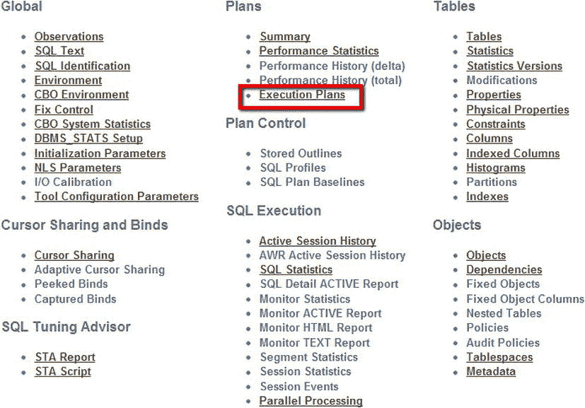

图 8-1。 `SQLTXPLAIN` 报告顶部


从这里，如果我们点击"执行计划"，自然会进入报告显示当前 SQL 所有已知执行计划的部分。如果使用了动态采样，我们会在报告的"计划信息"部分看到一条消息。有关使用了动态采样的报告示例，请参阅图 8-2。此图仅显示了页面的左侧部分。

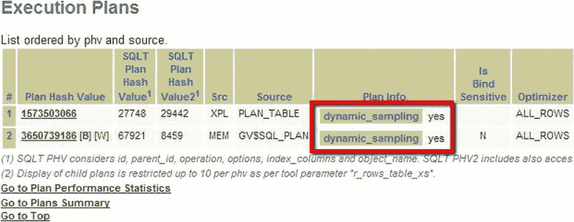
图 8-2。两个执行计划都使用了动态采样。

## 什么是动态采样？

那么动态采样被用到了，但它到底是什么呢？它是一种通过在编译过程*期间*收集统计信息来改进查询统计信息的方法。然而，不要因此就认为你可以忽略统计信息的收集。你不能。动态采样并非良好统计信息的替代品。它是避免生成糟糕执行计划的最后一道防线。用最简单的话来说，优化器经历的步骤如下所示：

1.  优化器开始解析查询。
2.  在解析过程中，优化器会评估对象统计信息的状态。
3.  如果优化器发现某些统计信息缺失，它可能会进行一些动态采样。采样量，甚至是否进行动态采样，将取决于`optimizer_dynamic_sampling`的值。
4.  如果不进行动态采样，则优化过程的其余部分继续进行，并在可用的地方使用统计信息。
5.  如果要进行动态采样，采样量由`optimizer_dynamic_sampling`确定，并生成一个动态查询来收集信息。
6.  如果进行了动态采样，则收集到的统计信息将用于生成更好的执行计划。

在图 8-2 中，我们看到使用了动态采样，但没有任何地方标明参数的值。这可以在报告的 CBO 环境部分看到。（请参阅下面的"如何查找`optimizer_dynamic_sampling`的值"部分。）请记住，这一切都*在*查询执行之前和解析过程中发生。

## 如何控制动态采样

如前所述，动态采样由`optimizer_dynamic_sampling`的值控制。可以在系统级别或会话级别设置，或者通过在 SQL 中使用提示来设置。这些不同的选项允许对动态采样的行为进行非常精细的控制，并为不同的 SQL（使用提示）和不同的会话（例如登录触发器）设置不同的行为方式。以下是所有这些选项的示例。（我将值设为 4。你可以设置 0 到 10 之间的任何值。）首先在会话级别设置。

```sql
SQL> alter session set optimizer_dynamic_sampling=4 ;
Session altered.
```

如果你正在测试一些 SQL，希望快速看到不同值对执行计划的影响，而不影响其他人，你可能希望在会话级别设置该参数。你也可以在当前实例中设置该值而不使其永久生效。

```sql
SQL> alter system set optimizer_dynamic_sampling=4 scope=memory;
System altered.
```

如果你在系统级别进行测试，并希望在永久更改之前确认这是系统的正确选择，你可能需要这样做。一旦你确定在系统级别设置此值是合适的，你可以按照如下所示进行设置。

```sql
SQL> alter system set optimizer_dynamic_sampling=4 scope=spfile;
System altered.
```

在系统级别设置该值会修改`spfile`，以便在数据库下次启动时应用。如果你想进行更细粒度的更改，也许是针对单个 SQL，你可能需要使用提示。此参数的提示版本可以采用两种形式：游标级别和表级别版本。因此，例如，为游标设置：

```sql
SQL> select /*+ dynamic_sampling (4) */ count(*) from dba_objects;
  COUNT(*)
```

此提示有一个不同的形式，允许你为表设置采样级别。这变得非常具体：你可能会想，如果你知道这个特定对象的统计信息缺失，为什么你没有收集真实的统计信息呢？

```sql
SQL> select /*+ dynamic_sampling (dba_objects 4) */ count(*) from dba_objects;
  COUNT(*)
```

正如我前面提到的，采样量以及是否进行采样取决于动态采样参数的值。大多数系统将采用默认值 2。

```sql
C:\Documents and Settings\Stelios>sqlplus / as sysdba
SQL*Plus: Release 11.2.0.1.0 Production on Sat Oct 13 11:47:40 2012
Copyright (c) 1982, 2010, Oracle.  All rights reserved.
Connected to:
Oracle Database 11g Enterprise Edition Release 11.2.0.1.0 - Production
With the Partitioning, OLAP, Data Mining and Real Application Testing options
SQL> show parameter optimizer_dynamic_sampling
NAME                                 TYPE        VALUE
------------------------------------ ----------- ----------------------------
optimizer_dynamic_sampling           integer     2
```

如果设置了默认值并使用了动态采样，那么优化器将尝试对 64 个数据块进行采样，除非查询是并行的（请参阅下面的"动态采样与并行语句"部分）。这不是表或索引大小的百分比，而是一个固定的块数。采样的行数取决于一个块中能容纳多少行。请记住，动态采样的目标是在查询执行前的*最后一刻*获取一些非常基本的统计信息。为了最小化这种开销，采样大小以块为单位设置为一个明确定义的值，该值不会随表行的大小而膨胀或收缩。动态采样这样设计是为了防止解析过程在大型表上消耗过多资源。如果动态采样过程发生（我们可以在 SQLTXPLAIN 报告中检查），收集到的样本可能有助于使执行计划比原本更好。该参数的值（如前所述）从 0 到 10 不等，并控制动态采样的操作。如果`optimizer_dynamic_sampling`被设置为

*   `0`: 在任何情况下都不使用动态采样。
*   `1`: 如果至少有 1 个未分析、未索引、未分区的表，并且该表大于 32 个块，则对 32 个块进行采样。这意味着如果表有索引或是分区表或小于 32 个块，则不会进行动态采样。
*   `2`: 如果至少有一个表没有统计信息，无论它是否有索引，则对 64 个块进行采样。分区表和索引表也包括在内。与级别 1 不同（其中一些表会被排除），此级别将应用于所有没有统计信息的表。
*   `3`: 如果至少有一个表没有统计信息，并且`where`子句中使用了表达式，则对 64 个块进行采样。这是试图解决`where`子句中表达式的问题，因为在那里制定正确的执行计划可能很棘手。这比级别 2 限制性更强。与级别 2 一样，这仍然适用于所有表。
*   `4`: 如果至少有一个表没有统计信息，并且在同一表的谓词上使用了`OR`或`AND`运算符，则对 64 个块进行采样。这是试图处理复杂谓词的问题。这比级别 2 限制性更强。与级别 2 一样，此级别也适用于索引表和分区表。


对于介于 5 到 8 之间的值，其规则与`optimizer_dynamic_sampling`设置为 4 时保持不变，但样本大小会增加，每次翻倍。因此，值为 5 时样本大小为 128 个块，值为 8 时样本大小为 1024 个块。对于级别 9，样本大小为 4086。对于值 10，则对所有块进行采样。正如您所想，设置此值可能会带来非常大的开销。如果我们要生成针对`sales`表的查询的 10053 跟踪文件，可以输入以下命令：
```
SQL> ALTER SESSION SET MAX_DUMP_FILE_SIZE = UNLIMITED;
SQL> ALTER SESSION SET TRACEFILE_IDENTIFIER = '10053_TRACE';
SQL> ALTER SESSION SET EVENTS '10053 TRACE NAME CONTEXT FOREVER, LEVEL 1';
SQL> select /*+ PARSE 5 */ count(*) from sales;
SQL> exit
```

在这里，我将转储文件大小（跟踪文件）设置为无限大，并在自动生成的文件名后附加了一个字符串，这样通过设置`TRACEFILE_IDENTIFIER`值为`10053_TRACE`，我就可以轻松找到该文件。生成的跟踪文件名将由 sid（本例中为`snc1`）、字符串“ora”、会话号（本例中为 5556）以及我附加的字符串组成。您的文件名会不同，但如果您使用一个合理的`TRACEFILE_IDENTIFIER`值，您应该能够轻松找到您的跟踪文件。如果您想查看开销，可以在使用了动态采样的查询的 10053 跟踪文件中查找。如果您搜索 10053 跟踪文件，您将看到一个类似于下文的节选。（为清晰起见，我已删除了部分文本。）

现在，如果我们查看`user_dump_dest`位置，会找到一个名为`snc1_ora_5556_10053_TRACE.trc`的文件。如果我们在这个文件中搜索字符串“dynamic sampling”，将会看到以下节选。
```
*** 2012-12-01 12:59:17.671
** 执行动态采样初始检查。 **
** 动态采样初始检查返回 TRUE (级别 = 4). <<<动态采样值
*** 2012-12-01 12:59:18.078
** 生成的动态采样查询: <<<生成了一个动态查询
    查询文本 :
SELECT /* OPT_DYN_SAMP */ /*+ ALL_ROWS IGNORE_WHERE_CLAUSE NO_PARALLEL(SAMPLESUB) opt_param('parallel_execution_enabled', 'false') NO_PARALLEL_INDEX(SAMPLESUB) NO_SQL_TUNE */ NVL(SUM(C1),0), NVL(SUM(C2),0) FROM (SELECT /*+ NO_PARALLEL("SALES") FULL("SALES") NO_PARALLEL_INDEX("SALES") */ 1 AS C1, 1 AS C2 FROM "SALES" SAMPLE BLOCK (2.035048 , 1) SEED (1) "SALES") SAMPLESUB

*** 2012-12-01 12:59:18.093
** 已执行的动态采样查询:
    级别 : 4
    采样百分比 : 2.035048 <<<对表进行了约 2%的采样
    总分区数 : 28 <<<表中共有 28 个分区。
      用于采样的分区数 : 28
    实际样本大小 : 18860 <<<使用的样本大小
    过滤后的样本基数 : 18860
    原始基数 : 145484 <<<基数的原始估计值
    表统计信息的块计数 : 1769
    用于采样的块计数: 1769
    最大采样块数 : 64
    采样块数 : 36
    最小选择率估计值 : -1.00000000
** 使用的动态采样基数 : 926759 <<<新的基数估计值
** 动态采样更新了表基数。
```

让我逐步解释这个 10053 跟踪文件中发生的事情。首先我们看到检测到`optimizer_dynamic_sampling`级别为 4。然后生成了一个动态采样查询。查询文本已显示。此查询提示中使用了许多有趣的选项

*   `/* OPT_DYN_SAMP */` - 这不是提示，只是一个注释
*   `/*+ ALL_ROWS` – `ALL_ROWS`提示，一个标准提示
*   `IGNORE_WHERE_CLAUSE` – 此提示忽略任何`WHERE`子句
*   `NO_PARALLEL(SAMPLESUB)` – 不允许并行执行，此动态查询的开销不得占用过多资源
*   `opt_param('parallel_execution_enabled','false')` – 禁用并行执行
*   `NO_PARALLEL_INDEX` – 禁用并行索引计划
*   `NO_SQL_TUNE */ - 未文档化的提示`

然后执行动态采样查询，根据参数值 4，我们能够采样大约 2%的行。您可以在查询中看到，采样的块是随机的（`SEED (1)`），并且我们使用了`SAMPLE`子句，该子句从表中采样块。那么，动态采样查询是否起到了作用？基数的原始估计值是 145,484。动态采样查询执行后，新的估计值是 926,759。这比实际值 918,843 要接近得多。控制参数的值相当重要；接下来我们将了解如何查明其值。

## 如何找到 `optimizer_dynamic_sampling` 的值

我们可以通过查看 SQLT 报告的“CBO 环境”部分来了解`optimizer_dynamic_sampling`的实际使用值。超链接显示在下面的图 8-3 中。

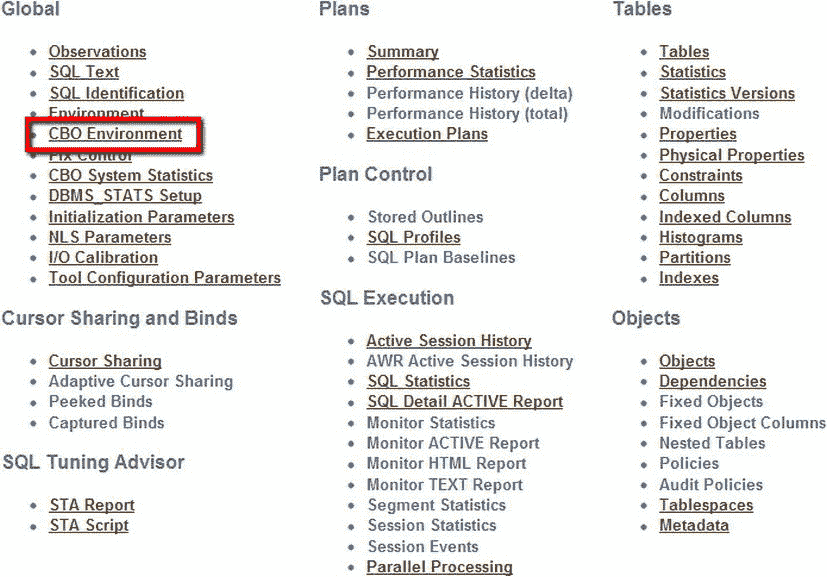

图 8-3。将您带到非默认 CBO 参数的超链接

点击该链接后，我们会看到报告的“CBO 环境”部分，其中显示了`optimizer_dynamic_sampling`的值等内容。参见图 8-4。

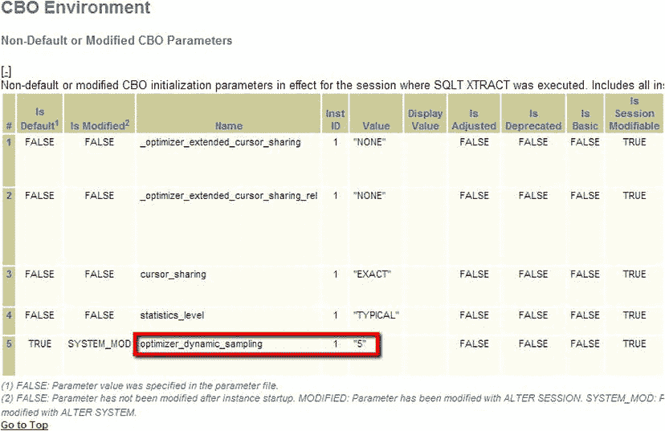

图 8-4。`optimizer_dynamic_sampling`的值被设置为非默认值 5

图 8-4 还向我们显示，`optimizer_dynamic_sampling`的值是通过`ALTER SYSTEM`语句更改的。我们之所以知道这一点，是因为在“已修改”列下我们看到了`SYSTEM_MOD`。我们也可以通过查看 SQL 语句的 10053 跟踪（如我们之前所做的那样）来查明其值，或者直接显示该值：
```
SQL> show parameter optimizer_dynamic_sampling

NAME                                 TYPE        VALUE
------------------------------------ ----------- --------------
optimizer_dynamic_sampling           integer     4
```

## 动态采样与并行语句

判断是否应对并行执行计划使用动态采样的规则与串行执行的语句略有不同。并行语句本身就被认为是资源密集型的，因此动态采样的少量开销对于确保良好的执行计划是值得的。其逻辑是，如果该值设置为默认值（`optimizer_dynamic_sampling=2`），则忽略 64 块的样本大小，实际样本大小通过查看表大小和谓词复杂性来确定。如果存在非默认值，则规则与串行执行语句相同。

## 我应该设置什么动态采样值？

关于动态采样的一般经验法则是，首先您不应依赖此功能。请记住，动态采样是为了 catch 优化过程中因缺少统计信息而可能导致的潜在问题。如果您的查询性能不符合预期，动态采样不应是您的首选。您应该先获取一份`SQLTXPLAIN`报告并查看它。对于并行语句，特别是当您有复杂谓词且至少有一个表缺少统计信息时，您很可能会最终使用动态采样。

如果您看到使用了动态采样（如前面图 8-2 所示），那么您应该检查为什么使用了它，以及您可以做些什么来避免使用它。如果您在表上已有统计信息但仍然看到动态采样，那么一种可能性是您有复杂谓词并且没有使用扩展统计信息（在第 3 章中提到过）。


如果由于某些原因您想使用动态采样，但发现其采样级别过低或未产生预期的执行计划，您可以通过调整 `optimizer_dynamic_sampling` 的值来提高采样级别。但请注意，务必在测试系统上验证这些更改，并进行小幅调整以观察其开销是否过大。选择一个具有代表性的 SQL，并观察其在不同参数值下的表现。如果您未对此参数进行过测试，请保持其默认值。

若希望完全禁用此功能，请将该值设为 0。

有些情况下，动态采样是唯一可用的选择。例如，在查询过程中填充的表不会有良好的统计信息（因为它们很可能在收集统计信息的维护窗口期间是空的）。全局临时表就是动态采样适用的一个好例子。

如果说动态采样是您获得正确执行计划的最后机会，那么基数反馈则为您提供了在第二次执行时修正执行计划的机会。

## 基数反馈

基数反馈是一种校正基数（Cardinality）的简单而优雅的方法。它无需陷入无尽的复杂计算来确定正确的基数，而是等待执行计划中每一步的结果，将其存储在共享池中，并在后续执行中参考这些信息，以期这些信息能为我们提供关于上次执行效果的良好洞察。这种简单技术自然有其自身的陷阱，例如，我们如何防止结果在不同的估计值之间来回跳变？让我们看看其中的一些细节。

## 基数反馈如何工作？

如果关于每个 SQL 的信息没有被存储在内存中供同一 SQL 的后续执行访问，基数反馈就无法工作。让我们看看我们可以访问哪些信息。我们将运行一个简单的查询，然后获取该次执行的实际基数和估计基数，接着在动态采样和基数反馈均被禁用的情况下运行两次查询，并比较估计返回行数和实际返回行数。然后我们将启用基数反馈并重复实验。第一步，我们检查 `optimizer_dynamic_sampling` 的值，发现它被设置为 0，意味着此功能已禁用。

```sql
SQL> show parameter optimizer_dynamic_sampling
NAME                                 TYPE        VALUE
------------------------------------ ----------- ------------
optimizer_dynamic_sampling           integer     0 <<<DS disabled
SQL> alter system set "_optimizer_use_feedback"=FALSE; <<CFB disabled
System altered.
```

 `注意` 我们也可以使用提示 `/*+ opt_param('_optimizer_use_feedback' 'false') */` 来禁用基数反馈。

接下来，我们创建一个从 `dba_objects` 填充数据的测试表。我们使用提示 `/*+ gather_plan_statistics */` 以确保能获取到我们想要查看的执行计划的良好统计信息。

```sql
SQL> create table test1 as select (object_id) from dba_objects;
Table created.
SQL> select /*+ gather_plan_statistics */ count(*) from test1;
  COUNT(*)
```

现在我们使用 `dbms_xplan.display_cursor` 来获取执行计划以及与该执行相关的统计信息。这是 Oracle 11g 引入的一个非常不错的功能。

```sql
SQL> select * from table(dbms_xplan.display_cursor(null,null,'ALLSTATS LAST'));
PLAN_TABLE_OUTPUT
SQL_ID  gtukt6kw8yjm6, child number 0

select /*+ gather_plan_statistics */ count(*) from test1
Plan hash value: 3896847026

| Id  | Operation          | Name  | Starts | E-Rows | A-Rows |   A-Time   | Buffers | Reads  |

|   0 | SELECT STATEMENT   |       |      1 |        |      1 |00:00:00.09 |     116 |    112 |
|   1 |  SORT AGGREGATE    |       |      1 |      1 |      1 |00:00:00.09 |     116 |    112 |
|   2 |   TABLE ACCESS FULL| TEST1 |      1 |   9965 |  73532 |00:00:00.18 |     116 |    112 |

14 rows selected.
```

我们在这行看到估计值 (`E-Rows`) 与实际行数 (`A-Rows`) 相比相当差。这个估计值差到足以触发使用基数反馈，但在本例中该功能是关闭的。因此，如果我们第二次运行查询，预计 `E-Rows` 不会有改善；而实际情况确实如此。

```sql
SQL> select /*+ gather_plan_statistics */  count(*) from test1;
  COUNT(*)

SQL> select * from table(dbms_xplan.display_cursor(null,null,'ALLSTATS LAST'));
PLAN_TABLE_OUTPUT
SQL_ID  gtukt6kw8yjm6, child number 0

select /*+ gather_plan_statistics */ count(*) from test1
Plan hash value: 3896847026

| Id  | Operation          | Name  | Starts | E-Rows | A-Rows |   A-Time   | Buffers | Reads  |

|   0 | SELECT STATEMENT   |       |      1 |        |      1 |00:00:00.09 |     116 |    112 |
|   1 |  SORT AGGREGATE    |       |      1 |      1 |      1 |00:00:00.09 |     116 |    112 |
|   2 |   TABLE ACCESS FULL| TEST1 |      1 |   9965 |  73532 |00:00:00.18 |     116 |    112 |

14 rows selected.
```

此计划的估计基数 (`E-Rows`) 并未改善。`E-Rows` 值没有变化；尽管估计值偏差很大，优化器并未做出任何更改。我们实验的下一步是启用基数反馈。

```sql
SQL> alter system set "_optimizer_use_feedback"=TRUE;
System altered.
```

现在我们重复整个步骤序列，发现在最后一步我们得到了：

```sql
SQL> select * from table(dbms_xplan.display_cursor(null,null,'ALLSTATS LAST'));
PLAN_TABLE_OUTPUT
SQL_ID  gtukt6kw8yjm6, child number 3

select /*+ gather_plan_statistics */ count(*) from test1
Plan hash value: 3896847026

| Id  | Operation          | Name  | Starts | E-Rows | A-Rows |   A-Time   | Buffers |

|   0 | SELECT STATEMENT   |       |      1 |        |      1 |00:00:00.02 |     116 |
|   1 |  SORT AGGREGATE    |       |      1 |      1 |      1 |00:00:00.02 |     116 |
|   2 |   TABLE ACCESS FULL| TEST1 |      1 |  73532 |  73532 |00:00:00.18 |     116 |

Note
-----
- cardinality feedback used for this statement
```

我们在 `Note` 部分看到优化器留下了一条信息，表明基数反馈已被使用。在上面的例子中，我们最初估计有 9,965 行，实际行数为 73,532 行。在没有基数反馈、动态采样或新对象统计信息的情况下，我们最初的估计相当糟糕。由于估计行数“显著”不同，因此使用了基数反馈。虽然没有明文规定“显著”差异是多少，但大约 8 倍的差异就足够了。

系统内置了安全机制，以防止基数在不同估计值之间来回跳变，因此经过少量迭代后，计划就会稳定下来。实际基数存储在 `SGA` 中这一事实也解释了为什么基数反馈信息不是持久的——如果实例重启，基数反馈信息将会丢失，因为内存中保存的信息并非持久化存储。

## 如何判断是否使用了基数反馈？

判断基数反馈是否已被使用的最简单方法是使用 `SQLTXPLAIN` 报告。点击“执行计划”（如 图 8-1 所示），如果您的某些执行计划使用了基数反馈，您将在“Plan Info”列下看到 `cardinality_feedback yes`。示例请参见 图 8-5。

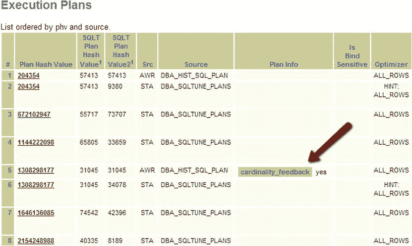

图 8-5 . “执行计划”部分显示某个执行计划使用了基数反馈


为了强调**基数反馈**是一种备用机制，其使用情况也在 SQLTXPLAIN 报告的“观察结果”部分中被特别标出。请参阅图 8-6 中的对应章节，你可以通过点击 SQLTXPLAIN 主报告顶部的“观察结果”超链接到达该处。

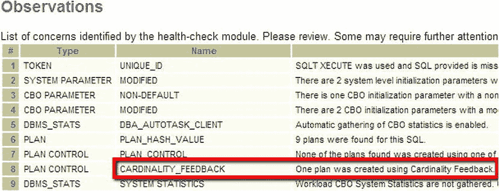

图 8-6 。基数反馈的使用情况被显示为一种类型为 PLAN_CONTROL 的观察结果。

## 何时使用基数反馈？

缺乏统计信息或存在“复杂”谓词（导致查询的基数难以确定）的情况，会给基数反馈一个机会来改进 E-Rows（估计行数）。以下是一个带有“复杂”谓词的 SQL 示例：

```
SQL> select product_name from order_items ord, product_information pro
  where ord.unit_price= 15 and quantity > 1
  and pro.product_id = ord.product_id;
```

这里我们有一个对 `unit_price` 的过滤（必须等于 15 且 `quantity` 必须大于 1）。这种情况并不罕见，因此基数反馈可能会被经常使用。然而，请记住我们之前提到的，该语句至少需要执行一次，优化器才能存储实际的行数，以便将其与估计的行数进行比较。如果已经使用了动态采样（因为需要且未被禁用），那么基数反馈将不会被使用。同样地，由于绑定变量可能引发的问题（特别是在数据分布倾斜的情况下），对于涉及绑定变量的语句部分，也不会使用基数反馈。

如果你发现基数反馈对你的站点或 SQL 语句没有用处，可以在支持人员的协助下，使用以下命令禁用它：

```
SQL> alter system set "_optimizer_use_feedback" = FALSE;
```

如果你想禁用单个语句，可以在 SQL 中加入此提示：

```
/*+ opt_param('_optimizer_use_feedback' 'false') */
```

一个 `select sysdate from dual` 语句就变成了：

```
SQL> select /*+ opt_param('_optimizer_use_feedback' 'false') */ sysdate from dual;
```

基数反馈在实例重启后不会持久保存，因此最好从其他来源获取统计信息，首选 `dbms_stats`，但请记住基数反馈默认是启用的。

## 基数反馈和动态采样如何协同工作？

我相信你可以想象，如果动态采样和基数反馈同时作用于同一个语句，可能会发生冲突，并且开销可能会翻倍。不像动态采样可以为不同的标准和不同级别的采样收集进行设置，基数反馈（除了禁用它之外）没有可调的控制项。Oracle 已经通过内置的安全措施考虑到了这些潜在的冲突和开销。例如，如果使用了动态采样，基数反馈就不会被使用。动态采样可以对单个语句使用多次，而基数反馈为单个 SQL 语句收集信息只允许运行有限的次数。这些安全措施旨在发现问题，但也经过精心设计以确保安全措施本身不会带来太大的开销。

现在我们已经对这两个特性有了一些了解，让我们看一个同时涉及这两个特性的神秘案例。

## 同卵双胞胎案例

这是 DBA 世界中经常发生的情况：两个看起来完全相同的系统，一个是从另一个克隆而来，但某些 SQL 的性能却大相径庭。自然，你可以怀疑是不同的 DDL、统计信息或操作流程、不同的资源分配、不同的工作负载等等。当硬件相同且数据库相互克隆时，可能的选择就变得有限了。在这种情况下，我们通过实验发现，某个特定的 SQL 在系统 A（比如纽约）上表现良好，而在克隆的系统 B（比如伦敦）上表现糟糕。SQL 是相同的，系统是相同的，参数设置也是相同的。让我向你展示你可以遵循哪些步骤，使用 SQLT 来解决这样的问题。

解决这个问题的方法有很多种。毫无疑问，你只收集 10046 跟踪文件也可以做到，但我们看看如何使用 SQLTXPLAIN 来完成。一步一步来。首先，如果我们为两条 SQL 语句收集 SQLT：一份是为纽约的（正常执行）生成的 SQLT XECUTE 报告，另一份是为伦敦的“问题双胞胎”（执行时间过长）生成的 SQLT XTRACT 报告。从 SQLTXPLAIN 报告的顶部（参见图 8-7），我们通过点击“执行计划”来查看执行计划列表。

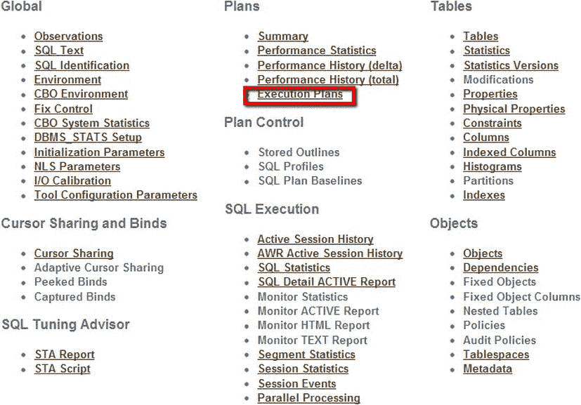

图 8-7 。SQLT 报告的顶部。我们点击“执行计划”。

这是针对问题系统（伦敦）的。我们看到基数反馈正在起作用，所以一定是发生了某些事情导致这个特性被触发。我们还看到（图 8-8）某些执行（使用了基数反馈的地方）的估计基数差异很大。我们还看到，在使用了基数反馈的地方，`optimizer_cost` 非常高。

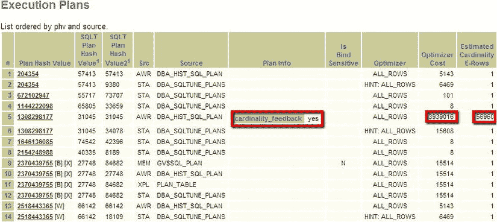

图 8-8 。伦敦的问题双胞胎显示正在使用基数反馈，并且估计基数的值很高。

既然我们在比较好系统和坏系统，我们现在应该看看纽约好系统的执行计划。记住这两个系统是相同的（相同的硬件、相同的数据库版本、相似的数据量、相同的表和索引）。以下是好系统报告的相同部分（参见图 8-9）

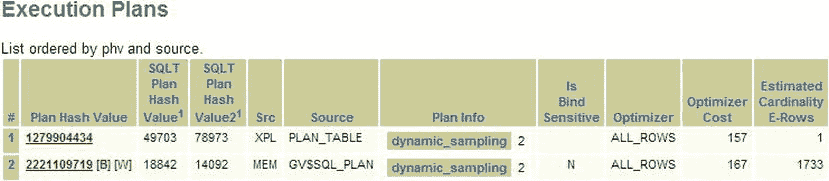

图 8-9 。纽约的好双胞胎显示使用了动态采样，并且估计基数的值较小。

我们还看到伦敦的执行计划比纽约多得多。我们知道，当涉及不良统计信息时，有时会使用动态采样和基数反馈，因此一个合理的调查途径是查看查询中主要对象的统计信息。在我们的整个调查过程中，我们应该思考 SQLT 提供的信息：“为什么使用了动态采样？为什么使用了基数反馈？为什么它们不同？” 从报告的顶部，我们点击“统计信息”。我们看到好系统（图 8-10）在“临时”列下有一个“Y”。同时，在“行数”、“样本大小”或“百分比”下没有值。`TABLE4` 值得关注，因为我们将看到坏系统报告的相同部分在这方面非常不同。

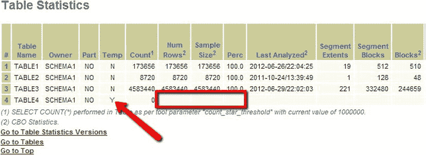

图 8-10 。好系统的表统计信息。


在我们草率下结论之前（这在调查性能问题时应极力避免），我们需要查看有问题的系统并进行对比（参见 图 8-11）。我们的计划是找出这两个系统之间可能导致一个使用动态采样而另一个使用基数反馈的差异之处。

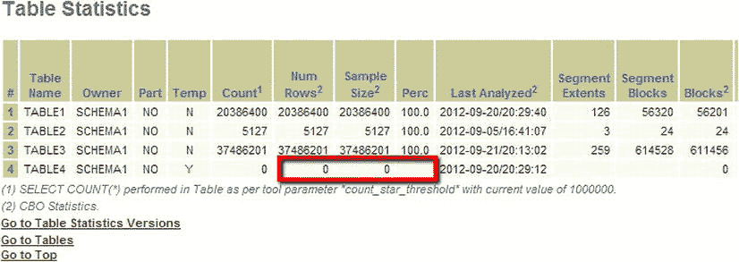

图 8-11. 有问题的系统的表统计信息

现在将两者放在一起看，我们发现了一些非常有趣的现象。两个数据库都显示 `TABLE4` 是一个临时表，且针对这一张表，这两个系统的统计信息收集情况是不同的。我们还看到 `TABLE1` 的数据量也不同，但至少目前看来，`TABLE4` 的差异似乎更值得关注，因为它的计数为 0，行数也为 0。我们将 `TABLE1` 的问题作为备选思路。因此，让我们检查一下 `TABLE4` 的元数据，看看它是如何定义的。（我们可以通过点击报告顶部的“元数据”轻松获取此信息。参见 图 8-12。

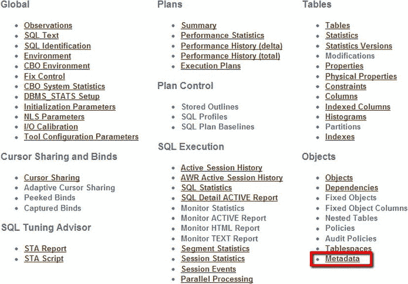

图 8-12. 从 `SQLTXECUTE` 报告的顶部，我们可以导航至该查询所有对象的元数据

然后，从报告中标有“元数据”的部分，我们可以通过点击“表”超链接来选择表元数据，如 图 8-13 所示。请注意，如果我们想调查索引，这里还有一个指向索引元数据的链接。

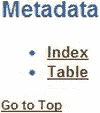

图 8-13. 我们拥有元数据的对象类型列表，本例中是表和索引

`SQLTXPLAIN` 报告的表元数据显示了所有表的链接，这些表位于生成报告所针对的查询中。参见 图 8-14。本例中有四个表。我们目前感兴趣的是第四个表，因此我们点击“`TABLE4`”超链接。

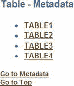

图 8-14. 我们拥有元数据的表对象列表

这将我们带到报告中显示 `TABLE4` 元数据的部分。我们看到它是一个带有 `ON COMMIT PRESERVE ROWS` 子句的全局临时表。我们看到的 DDL 如下：

```sql
 CREATE GLOBAL TEMPORARY TABLE "SCHEMA1"."TABLE4"
   (   "COLUMN1" NUMBER(10,0),
       "COLUMN2" NUMBER(10,0),
       "COLUMN3" NUMBER(10,0)
   ) ON COMMIT PRESERVE ROWS
```

这张表没什么特别之处。这是一个全局临时表的默认创建方式，可以在 SQL 处理期间供多个会话使用。如果开发人员希望在表中保留一些临时数据供应用程序的后续步骤处理，这通常会包含在应用程序设计中。DDL（元数据）中的 `on commit preserve` 部分确保提交到表中的数据会被保留。对于这类表，通常期望在处理结束时，有时是在处理开始时清理表中的数据。这里需要注意的关键点是，在有问题的系统上，为该表收集了统计信息（参见 图 8-11）。`TABLE4` 有一个最后分析的日期，但在良好的系统上没有。如果我们查看收集到的 `TABLE4` 的统计信息，会发现表当时是空的。这些统计信息随后会阻止动态采样被激活（因为 `TABLE4` 有“良好”的统计信息），但不会阻止基数反馈，因为在处理过程中加载的数据会使基数估计出错。这听起来像一个可行的理论。不知何故，在有问题的系统上为 `TABLE4` 收集了统计信息，而在良好的系统上则没有。在良好的系统上，该表没有被分析。这将允许动态采样在运行时估计统计数据并确定一个良好的执行计划。有了这个可行的理论，我们现在可以构建一个测试用例（在第 13 章中描述），并通过删除全局临时表的统计信息，尝试从有问题的测试用例中获得良好的执行计划。

## 总结

动态采样和基数反馈是很有用的功能，适用于统计信息缺失的少数情况。然而，良好的统计信息是无可替代的。由于复杂功能的相互作用，可能会产生表现出奇怪行为的情况。即使看似相同的系统，如果关键组件被更改（有时是无意的），其行为也可能大不相同。`SQLTXPLAIN` 由于收集了所有信息，是解决大多数 SQL 调优难题最快、最简便的方法。在下一章中，我们将更详细地了解特殊的 Data Guard 物理备用环境以及 `SQLT` 如何提供帮助。

