# 在 Data Guard 环境中使用 XTRSBY

SQL> CREATE OR REPLACE PROCEDURE set_trace
       /* grant alter session to <user> */
       /* create this procedure on both sites */
       as
         c1  integer;
         r1 integer;
         c2  integer;
         r2 integer;
         BEGIN
           c1:=dbms_sql.open_cursor;
          dbms_sql.parse(c1,
            'alter session set events
            ''10046 trace name context forever, level 8''',dbms_sql.v7);
            r1:=dbms_sql.execute(c1);
            dbms_sql.close_cursor(c1);
            c2:=dbms_sql.open_cursor;
            dbms_sql.parse(c2,
              'alter session set events
              ''10053 trace name context forever, level 1''', dbms_sql.v7);
            r2:=dbms_sql.execute(c2);
            dbms_sql.close_cursor(c2);
          END;
    /
CREATE OR REPLACE PROCEDURE set_trace
*
ERROR at line 1:
ORA-00604: error occurred at recursive SQL level 1
ORA-16000: database open for read-only access
```

显然这是不被允许的。因此，如果我们不能创建 `SQLTXPLAIN` 模式或任何存储过程，那么如何针对这个数据库使用 `XTRACT` 呢？`XTRSBY` 通过使用本地用户（位于读/写数据库上）并创建通过数据库链接访问只读数据库的存储过程来解决这个问题。

## 如何使用 XTRSBY？

我们刚刚看到了一些在 Data Guard 物理备用数据库上无法发生的事情。这时 `XTRSBY` 就可以发挥作用，完成 `XTRACT` 所能做的大部分工作。我说“大部分”是因为 `XTRSBY` 在结果上与 `XTRACT` 并不完全相同（我们将在“XTRSBY 报告是什么样子？”一节中看到差异）。然而，报告中包含足够的信息来帮助调优 Data Guard 实例上的查询。那么，我们如何让 `XTRSBY` 在 Data Guard 数据库上工作呢？在 Data Guard 备用数据库上启用 `XTRSBY` 的简要步骤如下：

1.  在主数据库上安装 `SQLTXPLAIN`（我们已经在本书的第 1 章中介绍过）。
2.  允许 DDL 被传播到备用数据库。
3.  为 `SQLTXPLAIN` 模式创建一个指向备用数据库的数据库链接（我将在下面给出一个示例）。
4.  从主数据库运行 `XTRSBY`，指定备用数据库上 SQL 的 SQL ID 和数据库链接。
5.  报告在主数据库上生成。

上述步骤 1 在第 1 章中已有介绍。步骤 2 是等待模式被传播（或作为正常 Data Guard 操作的一部分被复制）到备用数据库的问题。步骤 3 仅仅是创建一个公共数据库链接（或可从 `SQLTXPLAIN` 访问的链接）：以下是我为创建一个连接到只读数据库的公共可用数据库链接而输入的命令。

```
SQL> show user
USER is "SYS"
SQL> create public database link "TO_STANDBY" connect to sqltxplain identified by oracle using '(DESCRIPTION=(ADDRESS=(PROTOCOL=TCP)(HOST=localhost)(Port=1521))(connect_data=(SID=SNC2)))';

Database link created.

SQL> select sysdate from dual@to_standby;

SYSDATE

28-OCT-12
```

在这里，我使用了一个只读数据库来模拟备用数据库，因此在我的公共数据库链接连接字符串中使用了 `localhost`。在实际示例中，您应该使用备用数据库的主机名。此外，在我的示例中我使用了 `PUBLIC` 数据库链接，但您的站点可能有关于创建数据库链接的标准，要求您创建私有链接或两段式链接（其中链接信息和密码是分开指定的）。只要 `SQLTXPLAIN` 有权访问该链接以找到备用数据库，例程 `xtrsby.sql` 就应该可以工作。

一旦这些先决条件到位，我们就可以通过在主数据库上运行 `sqlxtrsby` 来使用 `XTRSBY` 收集有关备用数据库 SQL 的信息。

首先，让我们在备用数据库上创建一些 SQL。这将等同于在备用数据库上运行的报告。

```
SQL> select count(1) from dba_objects where object_type ='DIMENSION';

COUNT(1)

SQL> select sql_id from v$sql where sql_text like 'select count(1) from dba_objects where object_type =''DIMENSION''';

SQL_ID

gaz0dgkpffqrr

SQL>
```

在上面的步骤中，我们运行了一些任意的 SQL 并获取了该 SQL 的 SQL ID。记住，我们是在备用数据库（我们的报告可能运行的地方）上运行的 SQL。我们无法在 Data Guard 物理备用数据库上存储任何数据，因此现在我们必须通过数据库链接从主数据库捕获有关该 SQL 的信息：

```
SQL> @sqltxtrsby gaz0dgkpffqrr to_standby

PL/SQL procedure successfully completed.

Parameter 1:
SQL_ID or HASH_VALUE of the SQL to be extracted (required)

Parameter 2:
DBLINK to SQLTXPLAIN in the stand-by database (required)

Paremeter 3:
SQLTXPLAIN password (required)

Enter value for 3:

At this point enter the password for SQLTXPLAIN

. . . please wait . . .
```

这是为简洁起见而缩短的输出：

```
Archive:  sqlt_s96365_xtrsby_gaz0dgkpffqrr.zip
  Length      Date    Time    Name
---------  ---------- -----   ----
     3060  10/30/2012 13:00   sqlt_s96365_driver.zip
     1159  10/30/2012 13:00   sqlt_s96365_export_driver.sql
    46903  10/30/2012 13:00   sqlt_s96365_lite.html
    12448  10/30/2012 13:00   sqlt_s96365_log.zip
  1788199  10/30/2012 13:00   sqlt_s96365_main.html
    15498  10/30/2012 13:00   sqlt_s96365_readme.html
      222  10/30/2012 13:00   sqlt_s96365_remote_driver.sql
   217088  10/30/2012 13:00   sqlt_s96365_tc.zip
      193  10/30/2012 13:00   sqlt_s96365_tcb_driver.sql
      172  10/30/2012 13:00   sqlt_s96365_tc_script.sql
       65  10/30/2012 13:00   sqlt_s96365_tc_sql.sql
  3183654  10/30/2012 13:00   sqlt_s96365_trc.zip
---------                     -------
  5268661                     12 files

File sqlt_s96365_xtrsby_gaz0dgkpffqrr.zip for gaz0dgkpffqrr has been created.

SQLTXTRSBY completed.
```

这会在运行 `SQLTXPLAIN` 例程的目录中生成 zip 文件。如果我们解压这个 zip 文件，会看到以下内容：

```
10/31/2012  12:03 PM    <DIR>          .
10/31/2012  12:03 PM    <DIR>          ..
10/30/2012  01:00 PM             3,060 sqlt_s96365_driver.zip
10/30/2012  01:00 PM             1,159 sqlt_s96365_export_driver.sql
10/30/2012  01:00 PM            46,903 sqlt_s96365_lite.html
10/30/2012  01:00 PM            12,448 sqlt_s96365_log.zip
10/30/2012  01:00 PM         1,788,199 sqlt_s96365_main.html
10/30/2012  01:00 PM            15,498 sqlt_s96365_readme.html
10/30/2012  01:00 PM               222 sqlt_s96365_remote_driver.sql
10/30/2012  01:00 PM           217,088 sqlt_s96365_tc.zip
10/30/2012  01:00 PM               193 sqlt_s96365_tcb_driver.sql
10/30/2012  01:00 PM               172 sqlt_s96365_tc_script.sql
10/30/2012  01:00 PM                65 sqlt_s96365_tc_sql.sql
10/30/2012  01:00 PM         3,183,654 sqlt_s96365_trc.zip
              12 File(s)      5,268,661 bytes
               2 Dir(s)   7,211,745,280 bytes free
```

我们会看到主要的 `sqlt_s96365_main.html` 文件，但文件比“正常”的 `sqltxtract` 运行要少：没有 10053 跟踪文件，没有 sql profile 脚本，也没有 SQL 调优顾问报告。这是因为备用数据库的只读状态限制了可以执行的操作。正如您所看到的，生成 `XTRSBY` 报告只是稍微复杂一些。已经描述的额外步骤是需要一个额外的链接，并且需要在调用例程时传入链接名称。这些就是让 `XTRSBY` 工作所需的全部。

## XTRSBY 报告是什么样子？

现在您有了报告，我们可以用它做什么？让我们看另一个示例报告的顶部。参见图 9-1。

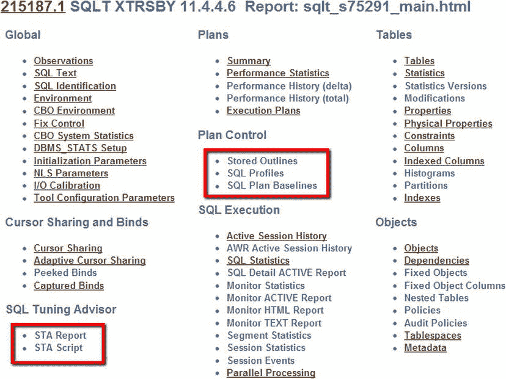

图 9-1 . SQLT XTRSBY 报告的顶部。某些功能不可用


# XTRSBY 与 roxtract 工具的使用

## XTRSBY 中的执行计划

某些功能不可用。例如，在图 9-1 中，我高亮显示了两个没有链接的部分，因为它们在`XTRSBY`中不可用。这是因为备机上的例程无法运行（我们在本章前面已经看到了会发生什么）。那么执行计划呢？它们和往常一样可见。你将在图 9-2 中看到，收集的信息没有真正的区别。

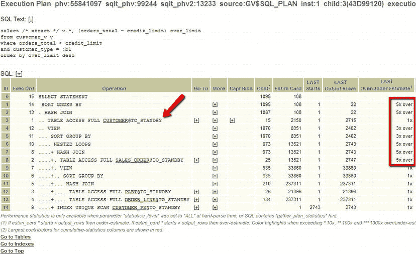

图 9-2 . 由`XTRSBY`收集的执行计划显示了所使用的链接

在图 9-2 中，我们看到第 2 章和第 3 章中描述的所有常用功能都存在，并且可以以相同的方式解释。在这个新示例中（在另一台机器上创建），链接名称仍然称为`TO_STANDBY`，显示在执行计划中。我们还看到，在“环境”标题下（我们可以通过点击报告顶部的“环境”来访问），显示了备机数据库链接。参见图 9-3。

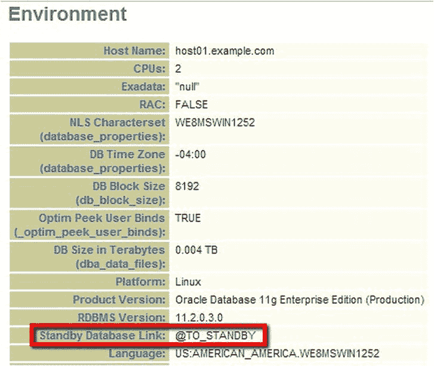

图 9-3 . 备机数据库链接显示在“环境”部分中

除了这些微小的差异外，`SQLTXPLAIN`报告是相同的。尽管`XTRSBY`在其有限的方式中非常有用，但我们仍然需要在备机系统本身上收集一些信息。在早期版本的`SQLT`（例如，11.4.4.6）中，只读工具`roxtract.sql`会被使用。这个工具现在被`SQLHC`（见第 14 章）取代了。只读（`ro`）工具仍然有用，如果你有旧版本的`SQLT`，你可能仍然想使用这个工具。该工具的名称带有`RO`前缀，表示它是一个只读工具，并且具有主要`XTRACT`工具的大部分功能。然而，从`SQLT`的 11.4.5.1 版本开始，它就不再可用。

## roxtract 工具简介

`SQLT`目录的`utl`区域有许多有用的实用程序。其中之一是`roxtract.sql`。这个只读例程专为在只读数据库中运行而设计，因此非常适合用于以只读模式打开的 Data Guard 物理备机数据库。我敢肯定你已经在问，这个例程与我们刚才看到的`xtrsby.sql`例程有什么不同。简单的答案是，远程运行（如`xtrsby.sql`）通过数据库链接并不能获得所有信息。有些事情在本地做更好，我们很快就会看到`roxtract.sql`产生什么。这个例程直接在只读的 Data Guard 备机数据库上运行（使用具有适当权限的账户），并在本地生成报告，而不像`xtrsby.sql`，它在读写数据库上生成报告。为了获取这些额外信息，我们必须使用`utl`目录中提供的例程。以下是在 Windows 系统上的目录列表。

```
C:\Documents and Settings\Stelios\Desktop\SQLT\sqlt\utl>dir
 Volume in drive C has no label.
 Volume Serial Number is 77E9-80B4
```

```
Directory of C:\Documents and Settings\Stelios\Desktop\SQLT\sqlt\utl
```

```
11/03/2012  10:08 AM    <DIR>          .
11/03/2012  10:08 AM    <DIR>          ..
07/02/2011  12:49 AM               130 10053.sql
04/02/2012  12:43 PM             4,828 coe_gen_sql_profile.sql
08/18/2012  11:25 AM             1,185 coe_gen_sql_profile_.zip
06/02/2012  05:28 AM            10,305 coe_load_sql_baseline.sql
04/02/2012  12:43 PM            12,007 coe_load_sql_profile.sql
05/02/2012  11:27 AM            18,248 coe_xfr_sql_profile.sql
07/02/2011  12:49 AM               101 flush.sql
08/18/2012  11:25 AM                33 missing_file.txt
07/02/2011  12:49 AM               184 plan.sql
06/02/2012  05:28 AM            22,527 profiler.sql
06/02/2012  05:28 AM            73,472 pxhcdr.sql
06/02/2012  05:28 AM            71,213 roxecute.sql
11/03/2012  10:08 AM             3,441 roxtract.log
06/02/2012  05:28 AM            70,126 roxtract.sql <<< Read Only Procedure
08/11/2011  03:46 AM               475 sel.sql
02/02/2012  01:19 PM               435 sel_aux.sql
06/02/2012  05:28 AM           160,393 sqlhc.sql
01/03/2012  12:04 AM             2,891 sqltcdirs.sql
08/11/2011  03:46 AM             4,014 sqlthistfile.sql
08/11/2011  03:46 AM             3,116 sqlthistpurge.sql
04/02/2012  12:43 PM             3,694 sqltimp.sql
04/02/2012  12:43 PM             2,927 sqltimpfo.sql
01/03/2012  12:04 AM             3,545 sqltlite.sql
03/02/2012  04:06 PM             3,900 sqltmain.sql
09/01/2012  12:16 PM             6,802 sqltprofile.log
01/03/2012  12:04 AM             5,469 sqltprofile.sql
09/01/2012  12:16 PM             4,021 sqlt_s89910_p725901306_sqlprof.sql
09/01/2012  10:53 AM             4,548 sqlt_s89915_p3005811457_sqlprof.log
09/01/2012  09:29 AM             4,147 sqlt_s89915_p3005811457_sqlprof.sql
08/18/2012  09:33 AM                74 x.sql
02/18/2012  10:04 AM    <DIR>          xgram
02/02/2012  12:15 PM    <DIR>          xhume
06/01/2012  09:39 AM    <DIR>          xplore
              30 File(s)        498,251 bytes
               5 Dir(s)   7,103,299,584 bytes free
```

## roxtract 工具的使用示例

正如我们上面看到的，`roxtract.sql`可以在`SQLT`解压区域的`utl`目录中找到。你仍然需要此过程存在于目标系统上，但你不需要`SQLTXPLAIN`模式，实际上对于`roxtract.sql`，你是以`SYS`身份运行脚本。这是此案例中的目标 SQL：

```
SQL>
select /*+ GATHER_PLAN_STATISTICS MONITOR*/
  cust_first_name,
  amount_sold
from
  customers C,
  sales S
where
  c.cust_id=s.cust_id
  and amount_sold > 1750
```

现在我们获取`SQL_ID`：

```
SQL> select sql_id from v$sqlarea where sql_text like 'select /*+ GATHER_PLAN_STATISTICS%';
SQL_ID
----------------
dck1xz983xa8c
```

现在我们有了`SQL_ID`，就可以从`SYS`账户运行`roxtract`脚本。注意，我们必须输入`SQL_ID`、许可级别以及是否要选择 10053 信息。注意没有提示输入`SQLTXPLAIN`模式密码，因为我们不使用它。

```
SQL>@roxtract
Parameter 1:
Oracle Pack License (Tuning, Diagnostics or None) [T|D|N] (required)
Enter value for 1: T <<<You must enter a value here
PL/SQL procedure successfully completed.

Parameter 2:
SQL_ID of the SQL to be analyzed (required)

Enter value for 2: dck1xz983xa8c <<<This is the SQL ID we are investigating

Parameter 3:
EVENT 10053 Trace (on 11.2 and higher) [Y|N]

Enter value for 3: Y <<<We want a 10053 trace file.

PL/SQL procedure successfully completed.

Values passed:
∼∼∼∼∼∼∼∼∼∼∼∼∼
License: "T"
SQL_ID : " dck1xz983xa8c"
Trace  : "Y"

PL/SQL procedure successfully completed.
```


```sql
SQL>DEF script = 'roxtract';
SQL>DEF method = 'ROXTRACT';
```

--
-- 公共部分开始
--

```sql
SQL>DEF mos_doc = '215187.1';
SQL>DEF doc_ver = '11.4.4.6';
SQL>DEF doc_date = '2012 年 6 月 2 日';
SQL>DEF doc_link = 'https://support.oracle.com/CSP/main/article?cmd=show&type=NOT&id=';
SQL>DEF bug_link = 'https://support.oracle.com/CSP/main/article?cmd=show&type=BUG&id=';
```

-- 如果执行时间较长，跟踪脚本以便诊断
```sql
SQL>ALTER SESSION SET TRACEFILE_IDENTIFIER = "^^script._^^unique_id.";
```

会话已更改。

已用时间：00:00:00.00
```sql
SQL>ALTER SESSION SET STATISTICS_LEVEL = 'ALL';
```

我已省略了大部分输出，因为它非常长。输出以以下内容结束：

```
忽略下面的 CP 或 COPY 错误
'cp' 不是内部或外部命令，也不是可运行的程序或批处理文件。
f:\app\stelios\diag\rdbms\snc2\snc2\trace\snc2_ora_5768_DBMS_SQLDIAG_10053_20121103_111817.trc
        已复制 1 个文件。
  正在添加: roxtract_SNC2_locutus_11.2.0.1.0_dck1xz983xa8c_20121103_111855_10053_trace_from_cursor.trc (164 字节安全性) (压缩了 80%)
roxtract_SNC2_locutus_11.2.0.1.0_dck1xz983xa8c_20121103_111855.zip 的测试 OK

已创建 ROXTRACT 文件：
roxtract_SNC2_locutus_11.2.0.1.0_dck1xz983xa8c_20121103_111855_main.html.
roxtract_SNC2_locutus_11.2.0.1.0_dck1xz983xa8c_20121103_111855_monitor.html.
```

从上图可以看出，一个 zip 文件已经被创建。如果我们将此 zip 文件的内容解压到一个目录中，将会看到若干个文件。

```
2012/11/03  11:22    <DIR>          .
2012/11/03  11:22    <DIR>          ..
2012/11/03  11:18            17,035 roxtract.log
2012/11/03  11:19           133,666 roxtract_SNC2_locutus_11.2.0.1.0_dck1xz983xa8c_20121103_111855_10053_trace_from_cursor.trc
2012/11/03  11:19           122,477 roxtract_SNC2_locutus_11.2.0.1.0_dck1xz983xa8c_20121103_111855_main.html
2012/11/03  11:19            10,113 roxtract_SNC2_locutus_11.2.0.1.0_dck1xz983xa8c_20121103_111855_monitor.html
               4 个文件        283,291 字节
               2 个目录   7,103,459,328 可用字节
```

我们看到四个文件，其中一个是 `roxtract.sql` 过程的日志。其余三个文件代表了 XTRSBY 缺失的部分输出。第一个是 10053 跟踪文件，这是我们特别要求的。我们在第 5 章对此进行了广泛讨论，因此无需再详述其内容。另外两个是 HTML 文件，一个是 “main” HTML 文件，另一个是 “monitor” HTML 文件。让我们看看 `roxtract.sql` 提供了哪些信息。

## roxtract 报告是什么样的？

第一份报告 `roxtract_SNC2_locutus_11.2.0.1.0_dck1xz983xa8c_20121103_111855_main.html`（在此示例中）是 roxtract 主报告。它是 `SQLTXTRACT` 报告的精简版本，但尽管如此，它仍然是一个非常有用的 HTML 文件。让我们看看此 HTML 文件的顶部，如图 9-4 所示。

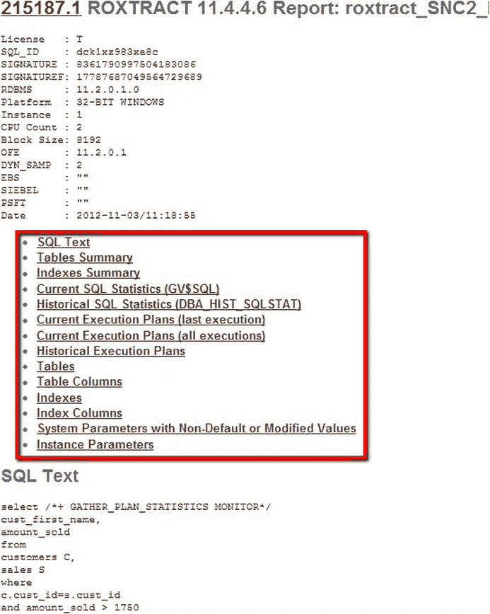

图 9-4 . HTML ROXTRACT 报告顶部

如你所见，roxtract 比强大的 `XTRACT` 报告功能要弱一些。它涵盖的部分数量减少了，但你仍然拥有执行计划、表信息和许多其他部分。

roxtract 提供的另一个文件是 `roxtract_SNC2_locutus_11.2.0.1.0_dck1xz983xa8c_20121103_111855_monitor.html`。该 HTML 默认显示“计划统计信息”选项卡，如图 9-5 所示。

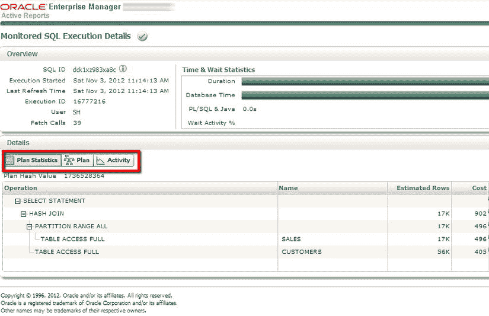

图 9-5 . 监控执行详情页面的左侧部分

上图仅显示了报告的左侧部分。我们看到了预期的执行步骤、估计的行数以及相关的成本。我们还可以访问菜单，该菜单允许我们在不同的显示方式之间进行选择。报告的右侧向我们展示了有关实际返回行数、I/O 请求以及任何等待活动的更多信息。对于这条 SQL 来说，没什么太多可说的，但你需要知道这些条目是存在的。参见图 9-6。

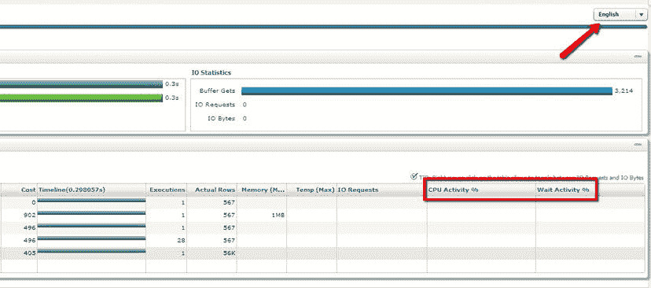

图 9-6 . 监控执行详情页面的右侧部分

甚至还有一个按钮可以更改报告的语言。下拉列表包括英语、德语、西班牙语、法语、意大利语、韩语和其他语言。如果你点击图 9-5 中高亮显示的“计划”选项卡，你还可以获得执行计划的流程图版本（如图 9-7 所示）。

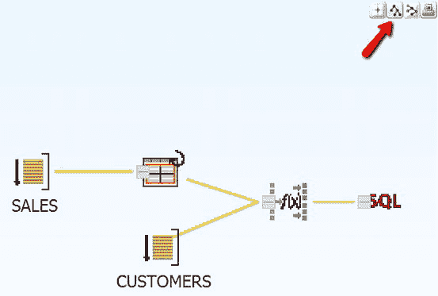

图 9-7 . 显示执行计划的流程图表示

一些开发人员更喜欢这种执行计划的表示方式，他们甚至可以选择流程是从左到右还是从下到上。

## 总结

在本章中，我们涵盖了 Data Guard 调优的特殊情况，以及 SQLTXPLAIN 为我们提供的用于处理这种情况的实用程序。你不应将 Data Guard 视为一个黑盒，认为如果它以只读模式打开就无法进行调优。许多公司都这样做，但你应该能够在需要时调查性能问题。现在，借助 XTRSBY 及其可靠的助手 `roxtract.sql`，你就可以做到。在下一章中，我们将处理执行计划的比较。这是一种非常强大的技术，用于确定执行计划中发生了什么变化：相信我，在执行计划中，没有什么东西是一成不变的。

## 第 10 章


# 比较执行计划

比较执行计划是最有用的诊断测试之一。如果你足够幸运，拥有一个好的执行计划，你可以使用该计划作为指导，使糟糕的执行计划符合要求。在第 6 章中，我们讨论了使用 SQL Profiles 将计划应用到另一个数据库的 SQL 上，以作为一种应急选项。然而，假设你有更多的时间来考虑差异并尝试正确地修复它，而不是使用 SQL Profile 这个创可贴。`SQLTCOMPARE` 就是完成这项工作的工具。它将比较两个目标系统上相同的 SQL，并生成一份描述差异的报告。你甚至可以从两个目标系统导入 SQLTXPLAIN 存储库，并在那里进行比较。本章是纯粹的 SQLTXPLAIN 章节，我们将使用 SQLTXPLAIN 的方法 `SQLTCOMPARE`，并展示如何利用我们从前面章节学到的调优知识来诊断问题。

## 如何使用 SQLTCOMPARE？

我们将通过一个实际示例更详细地介绍使用 `SQLTCOMPARE` 的步骤，但大致上使用 `SQLTCOMPARE` 的步骤如下：


# 使用 SQLTCOMPARE 比较 SQL 执行

## 操作步骤
1.  获取你正在调查的 SQL 在两个目标数据库上的`SQL ID`。它应该是相同的。
2.  然后，在**两个目标系统**上针对此 SQL 运行一个主要方法。
3.  记录两次主要方法运行的`statement ID`。
4.  创建一个目录来存放你的主要方法压缩文件。
5.  将两个主要方法解压到各自的目录中。
6.  在主要方法目录内再创建一个目录，专门存放测试用例文件（该文件来自主要方法文件内的一个压缩文件：是的，压缩包中的压缩包）。我们将在第 11 章详细查看测试用例。
7.  将测试用例文件解压到专门的测试用例区域。
8.  然后，将一个`statement ID`的存储库导入到另一个数据库，或者将两个存储库都导入到第三个数据库（这是我们将会使用的方法）。
9.  最后，运行`SQLTCOMPARE`。

## SQLTCOMPARE 简介
`SQLTCOMPARE`依赖`SQLT`存储库中的信息进行比较，并且必须拥有从其中一个主要方法收集的信息。主要方法有：

*   `XTRACT`（我们在第 1 章介绍过）
*   `XECUTE`（同样在第 1 章介绍过）
*   `XTRXEC`
*   `XPLAIN`
*   `XTRSBY`（我们在第 9 章介绍过）

由于`SQLTCOMPARE`可以与任何主要方法一起使用，它也可用于比较来自两个不同系统的 SQL 语句，或来自主数据库和备用数据库的 SQL 语句（如果你使用`XTRSBY`）。它甚至可用于比较在两个不同平台上的执行：例如，Linux 和 Windows，以及来自不同版本的数据库。例如，可以将 Linux 上的 10g 与 Solaris 上的 11g 进行比较。

## 实际示例
在这个例子中，我们将比较以下语句在两个目标数据库上的执行，但这些步骤适用于任何 SQL：

```
SQL> host type chapter10_01.sql
select
  s.amount_sold,
  c.cust_id,
  p.prod_name
from
  sh.products p,
  sh.sales s,
  sh.customers c
where
  c.cust_id=s.cust_id
  and s.prod_id=p.prod_id
  and c.cust_first_name='Theodorick';
```

通常，如果你的批处理时间不同，或者你的 OLTP 性能有明显差异，并且你正在调查数据库以寻找差异时，你会注意到特定 SQL 的性能差异。你也可以在迁移前评估两个不同平台的相对性能。出于本示例的目的，我们注意到目标 SQL 在系统 1 和系统 2 上的执行计划不同。我们在系统 2 上从系统 1 创建了表，并且数据库位于相同的平台和硬件上，但我们看到执行计划存在一些差异。在第一个数据库上，我们看到以下执行计划：

```
SQL> set autotrace traceonly explain
SQL> set lines 200
SQL> /
Execution Plan

Plan hash value: 725901306

| Id |Operation              |Name      | Rows  | Bytes | Cost (%CPU)| Time     | Pstart| Pstop

|  0 |SELECT STATEMENT       |          |  5557 |   303K|   908   (3)| 00:00:11 |       |      |
|* 1 | HASH JOIN             |          |  5557 |   303K|   908   (3)| 00:00:11 |       |      |
|  2 |  TABLE ACCESS FULL    |PRODUCTS  |    72 |  2160 |     3   (0)| 00:00:01 |       |      |
|* 3 |  HASH JOIN            |          |  5557 |   141K|   904   (3)| 00:00:11 |       |      |
|* 4 |   TABLE ACCESS FULL   |CUSTOMERS |    43 |   516 |   405   (1)| 00:00:05 |       |      |
|  5 |   PARTITION RANGE ALL
|          |   918K|    12M|   494   (3)| 00:00:06 |     1 |   28 |
|  6 |    TABLE ACCESS FULL  |SALES     |   918K|    12M|   494   (3)| 00:00:06 |     1 |   28 |

Predicate Information (identified by operation id):

1 - access("S"."PROD_ID"="P"."PROD_ID")
   3 - access("C"."CUST_ID"="S"."CUST_ID")
   4 - filter("C"."CUST_FIRST_NAME"='Theodorick')
```

在第二个系统上，我们看到执行计划略有不同：

```
SQL> set autotrace traceonly explain
SQL> set lines 200
SQL> /

Execution Plan

Plan hash value: 3857478275

| Id  | Operation           | Name      | Rows  | Bytes | Cost (%CPU)| Time     |

|   0 | SELECT STATEMENT    |           |  2789
|   473K
|  1652   ( 2
)| 00:00:20
|
|*  1 |  HASH JOIN          |           |  2789
|   473K
|  1652   ( 2
)| 00:00:20
|
|   2 |   TABLE ACCESS FULL | PRODUCTS  |    72 |  6480
|     3   (0)| 00:00:01
|
|*  3 |   HASH JOIN         |           |  2789
|   228K
|  1648   (1)| 00:00:20
|
|*  4 |    TABLE ACCESS FULL| CUSTOMERS |    17
|   765
|   409   ( 1
)| 00:00:05
|
|   5 |    TABLE ACCESS FULL| SALES     |   860K
|    31M
|  1235   (1)| 00:00:15
|

Predicate Information (identified by operation id):

1 - access("S"."PROD_ID"="P"."PROD_ID")
   3 - access("C"."CUST_ID"="S"."CUST_ID")
   4 - filter("C"."CUST_FIRST_NAME"='Theodorick')

Note

dynamic sampling used for this statement (level=2)
```

成本不同，计划的细节也不同，可能还有其他差异，但这并不是这里的重点。`SQLTCOMPARE`能告诉我们这两段相同但表现不同的 SQL 之间有什么区别吗？在非`SQLTXPLAIN`的世界里，我们现在会开始搜索系统之间的差异，一个一个地查看所有可能的嫌疑人，使用他们所有的特殊工具，这将是一个冗长且容易出错的过程。然而，使用`SQLTCOMPARE`，我们收集所有信息，并一次性完成所有内容的比较。然后我们再决定什么是重要的。

## 收集主要方法存储库数据
收集`SQLTXPLAIN`数据的步骤就是我们已经使用的标准方法。在这个例子中，我们将使用`SQLTXECUTE`。回顾一下，步骤是识别`SQL ID`，创建一个包含 SQL 语句的文件（包括任何绑定变量），然后在两个系统上运行`SQLTXECUTE`。

我们已经提到了上面的 SQL 语句，我们可以在两个系统上检查`SQL ID`是否相同。在系统 1 和 2 上我们得到：

```
SQL> select sql_id from v$sqlarea where sql_text like 'select  %Theodorick%';

SQL_ID

2qjq95uds6hpd
```

这是一个简单但重要的步骤。如果没有验证`SQL_ID`是相同的，我们可能在比较稍有不同的 SQL。那样的话，比较将无法工作。对于我们使用的每种主要方法，我们都在收集关于 SQL 语句的信息，我们需要记下`statement ID`（而不是`SQL ID`）。这是`SQLTXPLAIN`分配给 SQLT 方法运行的语句编号。所以，在第一个系统上，我们像这样运行`SQLTXECUTE`：

```
SQL> @sqltxecute chapter10_01.sql
```

文件`chapter10_01.sql`包含上面提到的 SQL。当`SQLTXECUTE`方法完成时，我们看到这个输出。

```
File sqlt_s96376_xecute.zip for chapter10_01.sql has been created.

SQLTXECUTE completed.
```

这里我们记录下`statement ID`，在这个例子中是`96376`。同样地，在第二个系统上，我们运行相同的 SQL（记得我们检查了`SQL ID`），并使用相同的文件再次运行`SQLTXECUTE`。第二个系统的输出是：

```
File sqlt_s73560_xecute.zip for chapter10_01.sql has been created.

SQLTXECUTE completed.
```

## 准备主要方法存储库数据


执行 `sqltxecute` 会创建包含重要信息的 ZIP 文件。这些 ZIP 文件中的信息包含如何将数据导入另一个 SQLT 仓库的说明，但首先你必须解压主 ZIP 文件。从在目标系统上执行两个主要方法的结果来看，我们看到语句 ID 分别为 `96376`（低 CBO 成本）和 `73560`（较高的 CBO 成本）。在这种情况下，我创建了两个目录：`sqlt_s96376` 和 `sqlt_s73560`，每个目录中都有对应的 ZIP 文件，我随后对它们进行了解压。正如我们所了解的，每个目录都包含许多文件，但在这种情况下，我们感兴趣的是名为 `sql_snnnnn_readme.html` 的 readme 文件。如有疑问（当然也包括本书），这就是你的首选文件。该文件中描述了执行许多功能（包括 SQLTCOMPARE 操作）的确切步骤。这是我们在第一个目标系统上运行的 SQLTXECUTE 报告的 readme 文件顶部（参见图 10-1）。

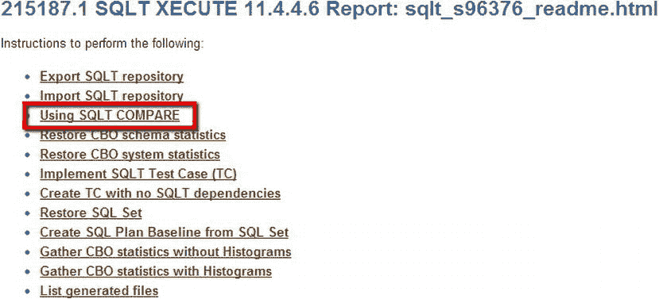
图 10-1 . readme 文件的顶部

如果我们点击报告中这一部分的“使用 SQLT COMPARE”超链接，就会跳转到描述我们需要采取哪些步骤将数据导入新数据库（或实际上是同一个数据库）以进行比较的说明部分。有关 `s96376` 的 readme 部分，请参见图 10-2。

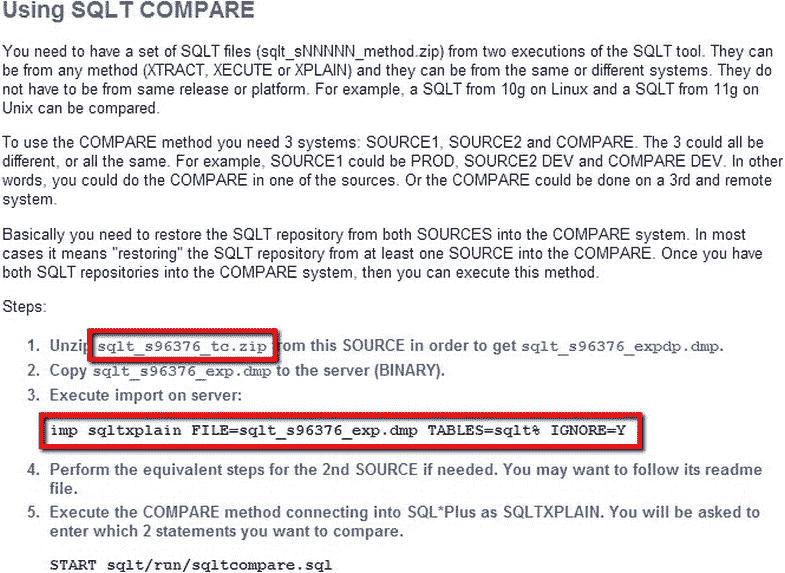
图 10-2 . SQLTCOMPARE 的说明展示了导入过程

注意，我们必须解压主 SQLT ZIP 文件内部的 `sqlt_s96376_tc.zip` 文件。我们将在第 11 章（关于构建良好测试用例）中对测试用例文件做更多操作。不过目前，我们只需要关注测试用例 ZIP 文件内部的转储文件。我已经将此文件解压到解压区域内的一个名为 `TC` 的目录中。现在，确保你的 SID 指向正确的数据库（在我的情况下，我正导入到第三个数据库），我们执行指令将数据导入我们的第三个数据库。

## 导入仓库数据

导入仓库数据是运行 `SQLTCOMPARE` 之前的最后一步。只要我们在此过程中跟踪了各种 ZIP 文件，那么导入文件应该只是一个简单的操作。

```
imp sqltxplain file=sqlt_s96376_exp.dmp tables=sqlt% ignore=y

Import: Release 11.2.0.1.0 - Production on Sat Nov 17 14:38:09 2012

Copyright (c) 1982, 2009, Oracle and/or its affiliates.  All rights reserved.

Password:

Connected to: Oracle Database 11g Enterprise Edition Release 11.2.0.1.0 - Production
With the Partitioning, OLAP, Data Mining and Real Application Testing options

Export file created by EXPORT:V11.02.00 via conventional path
import done in WE8MSWIN1252 character set and AL16UTF16 NCHAR character set
. importing SQLTXPLAIN's objects into SQLTXPLAIN
. importing SQLTXPLAIN's objects into SQLTXPLAIN
. . importing table          "SQLT$_SQL_STATEMENT"          1 rows imported
. . importing table             "SQLT$_AUX_STATS$"         13 rows imported
. . importing table    "SQLT$_DBA_AUTOTASK_CLIENT"          1 rows imported
. . importing table "SQLT$_DBA_COL_STATS_VERSIONS"        248 rows imported
. . importing table         "SQLT$_DBA_COL_USAGE$"         13 rows imported

---Output removed for clarity

. . importing table          "SQLT$_STGTAB_SQLSET"          7 rows imported
. . importing table  "SQLT$_V$SESSION_FIX_CONTROL"        406 rows imported
. . importing table     "SQLT$_WRI$_ADV_RATIONALE"          2 rows imported
. . importing table         "SQLT$_WRI$_ADV_TASKS"          2 rows imported
Import terminated successfully without warnings.
```

这已将第一个数据库（执行计划良好的那个）所需的信息导入到第三个数据库的 `SQLTXPLAIN` 模式中。现在我们为第二个数据库重复整个过程。

```
imp sqltxplain file=sqlt_s73560_exp.dmp tables=sqlt% ignore=y
Import: Release 11.2.0.1.0 - Production on Sat Nov 17 14:48:31 2012

Copyright (c) 1982, 2009, Oracle and/or its affiliates.  All rights reserved.

Password:

Connected to: Oracle Database 11g Enterprise Edition Release 11.2.0.1.0 - Production
With the Partitioning, OLAP, Data Mining and Real Application Testing options

Export file created by EXPORT:V11.02.00 via conventional path
import done in WE8MSWIN1252 character set and AL16UTF16 NCHAR character set
. importing SQLTXPLAIN's objects into SQLTXPLAIN
. importing SQLTXPLAIN's objects into SQLTXPLAIN
. . importing table          "SQLT$_SQL_STATEMENT"          1 rows imported
. . importing table             "SQLT$_AUX_STATS$"         13 rows imported
. . importing table    "SQLT$_DBA_AUTOTASK_CLIENT"          1 rows imported
. . importing table         "SQLT$_DBA_COL_USAGE$"          5 rows imported
---Output removed for clarity
. . importing table          "SQLT$_STGTAB_SQLSET"          6 rows imported
. . importing table  "SQLT$_V$SESSION_FIX_CONTROL"        406 rows imported
. . importing table     "SQLT$_WRI$_ADV_RATIONALE"          8 rows imported
. . importing table         "SQLT$_WRI$_ADV_TASKS"          2 rows imported
. . importing table "SQLT$_WRI$_OPTSTAT_AUX_HISTORY"         18 rows imported
Import terminated successfully without warnings.
```

现在剩下的就是运行 `SQLTCOMPARE` 方法了。该方法的脚本在“运行”区域。以 `SQLTXPLAIN` 身份登录后，我们运行 `SQLTCOMPARE`。

## 运行 SQLTCOMPARE

一旦我们导入了数据，就可以运行 `SQLTCOMPARE`。我们可以在命令行带参数或不带参数运行。在这种情况下，我将省略参数，以便我们可以看到提示信息：

```
SQL> @sqltcompare
. . . please wait . . .

STAID MET INSTANCE SQL_TEXT
----- --- -------- ------------------------------------------------------------
73560 XEC snc2     select   s.amount_sold,   c.cust_id,   p.prod_name from   sh
96376 XEC snc1     select   s.amount_sold,   c.cust_id,   p.prod_name from   sh

Parameter 1:
STATEMENT_ID1 (required)

Enter value for 1: 96376

Parameter 2:
STATEMENT_ID2 (required)

Enter value for 2: 73560
```

我们看到 `SQLTCOMPARE` 方法立即识别出可以比较的语句并展示给我们（因为我们没有在命令行指定语句 ID）。我们良好的执行计划在 `snc1` 上运行（语句 ID `96376`），而我们不太好的执行计划在 `snc2`（一个新创建的数据库）上运行。我总是喜欢将好的与差的进行比较，因此对于第一个语句 ID，我将输入 `96376`，对于第二个，我将输入剩下的唯一语句 ID `73560`。（当你进行自己的比较时，你可以按任何你喜欢的方式比较 SQL，但我喜欢“好 vs. 差”的约定，以便以正确的方式专注于发现差异）。

现在，我们看到每个实例上每个语句的执行计划哈希值历史记录，这样我们可以选择要比较哪些计划哈希值。在这种情况下，我将比较两个系统上的最佳计划。

```
PLAN_HASH_VALUE SQLT_PLAN_HASH_VALUE STATEMENT_ID ATTRIBUTE
--------------- -------------------- ------------ ---------
      725901306                16588        96376 [B][W]
     2025531852                21473        96376
     3852404249                68517        96376

Parameter 3:
PLAN_HASH_VALUE1 (required if more than one)

Enter value for 3: 725901306

PLAN_HASH_VALUE SQLT_PLAN_HASH_VALUE STATEMENT_ID ATTRIBUTE
--------------- -------------------- ------------ ---------
     3850511567                 8739        73560
     3857478275                 9628        73560 [B][W]
     3858714362                69559        73560

Parameter 4:
PLAN_HASH_VALUE2 (required if more than one)
```


# 阅读 SQLTCOMPARE 报告

```
Enter value for 4: 3857478275
Values passed to sqltcompare:
∼∼∼∼∼∼∼∼∼∼∼∼∼∼∼∼∼∼∼∼∼∼∼∼∼∼∼∼
STATEMENT_ID1   : "96376"
STATEMENT_ID2   : "73560"
PLAN_HASH_VALUE1: "725901306"
PLAN_HASH_VALUE2: "3857478275"

. . . 请稍候 . . .

15:03:03 sqlt$c: => compare_report
15:03:03 sqlt$a: -> common_initialization
15:03:03 sqlt$a: ALTER SESSION SET NLS_NUMERIC_CHARACTERS = ".,"
15:03:03 sqlt$a: <- common_initialization
15:03:03 sqlt$c: -> header
15:03:03 sqlt$c: -> sql_text
15:03:03 sqlt$c: -> sql_identification
15:03:03 sqlt$c: -> environment
15:03:03 sqlt$c: -> nls_parameters
15:03:03 sqlt$c: -> io_calibration
15:03:03 sqlt$c: -> cbo_environment
15:03:03 sqlt$c: -> fix_control
15:03:03 sqlt$c: -> cbo_system_statistics
15:03:03 sqlt$c: -> execution_plan
15:03:03 sqlt$c: plan 96376 "GV$SQL_PLAN" "725901306" "-1" "1" "1" "43F746F4"
15:03:03 sqlt$c: plan 73560 "GV$SQL_PLAN" "3857478275" "-1" "1" "0" "2A13E128"
15:03:03 sqlt$c: -> tables
15:03:04 sqlt$c: -> table_partitions
15:03:04 sqlt$c: -> indexes
15:03:04 sqlt$c: -> index_partitions
15:03:04 sqlt$c: -> columns
15:03:05 sqlt$c: -> footer_and_closure
15:03:05 sqlt$c: <= compare_report

sqlt_s96376_s73560_compare.html 文件已生成

SQLTCOMPARE 已完成。
```

现在我们得到了一个名为 `sqlt_s96376_s73560_compare.html` 的文件：

```
C:\Documents and Settings\Stelios\Desktop\SQLT\sqlt\run>dir *compare*.html
 Volume in drive C has no label.
 Volume Serial Number is 77E9-80B4

Directory of C:\Documents and Settings\Stelios\Desktop\SQLT\sqlt\run

11/17/2012  03:03 PM           355,957 sqlt_s96376_s73560_compare.html
               1 File(s)        355,957 bytes
               0 Dir(s)   7,088,697,344 bytes free
```

## 分析 SQLTCOMPARE 报告

通过运行 `SQLTCOMPARE` 生成的 HTML 文件包含了对比两个目标数据库执行计划哈希值的信息。在这个案例中，第一个系统比第二个系统稍快。造成这种情况的原因可能有很多，但这里的关键是要看报告中提供了哪些可供调查的部分。我们已经知道执行计划略有不同。以下是我们的示例中 `SQLTCOMPARE` 报告的顶部（参见 图 10-3）。

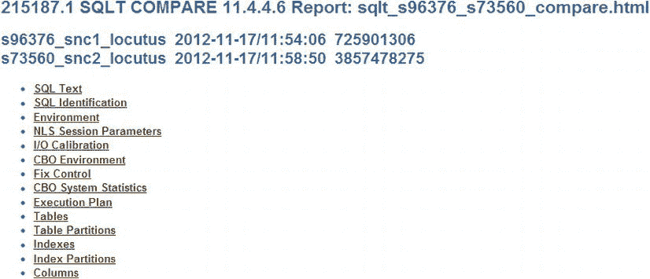

图 10-3 . `SQLTCOMPARE` 报告的顶部

如果我们点击报告顶部的 SQL Identification 超链接，我们将看到差异（如果有的话），如 图 10-4 所示。

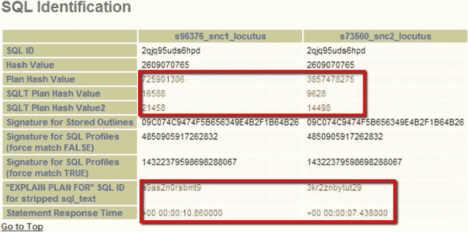

图 10-4 . SQL Identification 显示了一些基本差异

请注意，我们确实选择了相同的 SQL ID，但有一些条目标记为红色（在 图 10-4 中用方框高亮标出），以表示存在差异。这种显示差异的方法在整个报告中并非一致使用。有时，对于不太重要的差异，部分会标记为琥珀色，但通常标记为红色的差异是重要的，应该在继续之前予以注意和理解。

## 环境部分

下一部分是环境部分，其示例如 图 10-5 所示。

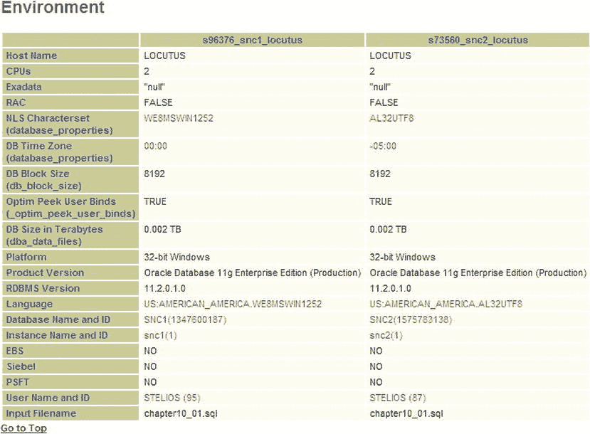

图 10-5 . `SQLTCOMPARE` 报告的环境部分

在这里，相同之处与不同之处同样重要。我们可以立即看到，CPU 数量相同，RAC 环境相同，块大小也相同。但也存在一些差异：字符集、时区等。

## 报告部分概览

在主 HTML 对比报告中（如 图 10-3 所示），我们可以从上到下进行浏览。这不像主 `SQLTXTRACT` 或 `SQLTXECUTE` 报告那样冗长复杂。报告还包含以下部分：

*   SQL 文本
*   SQL 标识
*   环境
*   NLS 会话参数
*   I/O 校准
*   CBO 参数
*   Fix control
*   CBO 系统统计信息
*   执行计划
*   表信息
*   表分区信息
*   索引信息
*   索引分区信息
*   列信息
*   捕获的绑定变量
*   已窥探的绑定变量

## 对比执行计划

当然，报告中还包含执行计划（如 图 10-6 所示）。这里的很多信息与你在 `SQLTXRACT` 报告中看到的信息完全相同，因此我们不会在此过多赘述。需要注意的重要一点是，它为你提供了许多特性的便捷并排对比，包括执行计划（参见 图 10-6）。这是一种快速发现差异的好方法，特别是当你的执行计划有数百行而只有一行不同时（是的，这种情况确实会发生，而且确实会对执行时间产生巨大影响）。

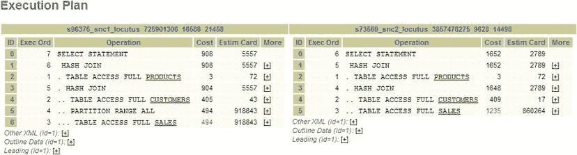

图 10-6 . 来自两个系统的执行计划并排对比

## 计划摘要

最重要的部分是计划摘要。它显示了被对比的两个 SQL 语句的平均 elapsed 时间和 CPU 时间。我们在 图 10-7 中看到一个例子。

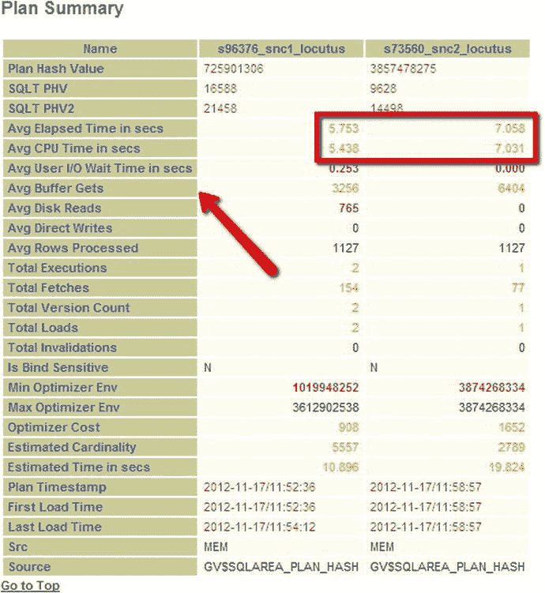

图 10-7 . 报告中的计划摘要部分

我们不仅能看到两个语句在 elapsed 时间上的对比（如果两个系统的负载不同，这可能会产生误导），还能看到以秒为单位的 CPU 时间和平均缓冲区获取次数，后者通常是衡量一个执行计划相对于同一 SQL 的另一次运行效果好坏的良好指标。我已经用箭头标出了缓冲区获取次数。自然，计划摘要中的每一行都在告诉我们一些信息。下面我列出了我认为重要的项目：


# SQL 性能指标与测试用例构建

## 性能指标概述

在比较 SQL 性能时，以下指标至关重要：

*   `Avg. Elapsed Time in secs`：如果系统负载相当，此指标明确指示 SQL 的性能。
*   `Avg. CPU Time in secs`：将 CPU 时间与总耗时对比，可判断 SQL 是否受 CPU 限制。
*   `Avg. User I/O Wait Time in secs`：衡量 I/O 所花费的时间，可判断是否受 I/O 限制。
*   `Avg. Buffer Gets`：在活动频繁、难以判断单次运行相对性能的繁忙系统上，是同一 SQL 不同运行间良好的比较指标。
*   `Avg. Disk Reads`：显示有多少读取操作访问了磁盘。
*   `Avg. Direct Writes`：指示有多少 I/O 是直接写入。
*   `Avg. Rows Processed`：在数据相同的情况下，比较时期望此值相同。
*   `Total Executions`：了解 SQL 在每个系统上运行的次数。
*   `Total Fetches`：衡量所有执行中返回的数据量。
*   `Total Version Count`：系统上找到的游标版本数量的计数。
*   `Total Loads`：SQL 被加载的次数。
*   `Total Invalidations`：显示 SQL 失效的次数。
*   `Is Bind Sensitive`：在第 7 章中讨论。
*   `Min Optimizer Environment`：显示最小优化器环境哈希值。
*   `Max Optimizer Environment`：显示最大优化器环境哈希值（此值与前一个值对于比较环境值很有用）。
*   `Optimizer Cost`：用于比较总体成本。
*   `Estimated Cardinality`：用于查看优化器的估计值。
*   `Estimated Time in Seconds`：优化器计算的另一种度量。
*   `Plan Time Stamp`：显示执行计划的计算时间。
*   `First Load Time`：计划首次加载到内存的时间。
*   `Last Load Time`：计划最后一次加载到内存的时间。
*   `Src`：显示信息的来源。
*   `Source`：显示在此案例中使用的来源是 `GV$SQLAREA_PLAN_HASH`。

我们看到许多不同的部分，但 `SQLTCOMPARE` 并不够智能以告诉我们所有情况下什么才是重要的。在此案例中，我们可以确认第二个目标系统的耗时略高于第一个系统。报告中使用的琥珀色表示比较结果差异不大，不足以引发问题，但如果不存在其他更紧迫的问题，可能仍需调查。在百分比方面，“Avg User I/O Wait Time in secs”差异非常大（因为其中一个值为 0.000），因此以红色高亮显示。磁盘读取（`disk reads`）也是如此。其他差异（如计划时间戳）不那么重要，但仍以红色显示。请记住，这些只是指导方针，您必须根据您对环境和情况的了解来决定什么差异是重要的。`SQLTCOMPARE` 的作用是向您展示差异，以便您快速做出明智的决策。

## 总结

比较两个 SQL 语句 ID 和计划哈希值是一种极其宝贵的方法，可以突出那些单独检查时可能不明显的差异。`SQLTCOMPARE` 对于确认用户或开发人员检测到的差异、从而排除其他导致差异的原因也至关重要。不同的环境通常难以比较，因为有太多因素会影响执行计划。`SQLTCOMPARE` 收集所有可用信息，并以简单易读的报告并排展示。这再次体现了 `SQLTXPLAIN` 如何让复杂的工作变得快速而简单。在下一章中，我们将探讨如何构建良好的测试用例以及如何利用它们来修改您的执行计划。

# 第 11 章


## 构建良好的测试用例

偶尔会遇到一些性能调优问题，通过检查 `SQLTXTRACT` 或 `SQLTXECUTE` 报告无法明显得出解决方案。所有常见的嫌疑因素都已排除，可能需要更彻底的调查。在这种情况下，构建一个测试用例以允许在主要环境之外进行实验是很有用的。如果您正在测试环境中调查有问题的 SQL，通常您会尝试使该环境与您试图复制的环境保持一致。这通常非常困难，因为有许多影响环境的因素需要复制。以下是其中一些因素：

*   硬件
*   软件
*   CBO 参数
*   对象统计信息
*   数据字典统计信息
*   数据
*   表聚簇因子
*   索引
*   序列
*   表

还有许多其他因素；有些因素对您的问题可能至关重要，而另一些则可能不是。您可以尝试用传统方式构建测试用例，即导出数据和相关统计信息到测试环境，但这容易出错且是手动过程，除非您已经编写了脚本来完成此操作。幸运的是，`SQLT` 只需几个非常简单的步骤就能完成构建测试用例所需的一切。它是平台无关的，因此例如您可以在 Windows 上运行 Solaris 测试用例；它易于使用且自动化。通常无法复制的唯一东西是数据（因为这通常会使测试用例过大）。然而，如果需要，也可以包含数据（我们在本章末尾提供了一个示例）。

 **警告** 仅在您可以轻松替换的环境中运行测试用例设置脚本。设置测试环境所涉及的一些脚本会更改操作环境。您需要 `SYS` 权限才能执行这些操作是有充分理由的。它们会改变系统设置。通常，您会为测试用例创建一个独立的数据库，并在您的环境中仅使用该测试用例。完成测试用例后，您会删除整个数据库。重复使用这样的数据库将是一个危险的操作。任何数量的 CBO 参数都可能已被更改。**仅在废弃数据库中设置测试用例。特此警告。**

## 您能用测试用例做什么？

在某些情况下，调优可能是一项棘手的工作。在开始调查问题之前，您必须了解执行计划的各个部分在做什么。有时这种理解来自于对 SQL 及其环境的副本进行调试。您可以添加索引、更改提示、更改优化器参数、删除直方图统计信息——可能性无穷无尽。这类操作并非随机进行，而是基于对当前问题的一些理解（或至少是您当时掌握的尽可能多的理解）。

所有这些调试都无法在生产环境中进行，在开发环境中也常常难以进行，因为风险太高，您案例的某些方面可能会影响他人：例如公共同义词或序列。另一方面，如果您能建立一个包含良好测试用例的小型私有数据库，您就可以更改各种参数而不会直接影响任何人。只要数据库的版本相同，您将获得基本相同的行为。我说“基本”是因为在某些情况下（例如 Exadata），需要更接近您所复制环境的环境来处理特定问题。例如，混合列压缩（Hybrid columnar compression）无法在非 Exadata 环境中完成。自 Oracle 发布以来，DBA 和开发人员一直在为其环境编写脚本来创建测试用例，但随着环境复杂性的增加，设置健壮的良好测试用例所需的时间越来越长。这些手工制作的测试用例很有用，但创建起来过于耗时。`SQLT` 通过自动收集所有必需的元数据和统计信息，为您完成了所有艰苦的工作。

## 构建测试用例


# 创建 SQLT 测试用例

要创建一个测试用例，只需运行一份 SQLT 报告，无需其他操作。单独运行 `SQLTXTRACT` 就会生成创建测试用例所需的全部信息。下面是一个示例目录，展示了主要的 SQLT 压缩包内的文件。

```
12/11/2012  08:47 PM             6,705 sqlt_s11992_driver.zip
12/11/2012  08:46 PM             3,452 sqlt_s11992_lite.html
12/11/2012  08:47 PM            12,646 sqlt_s11992_log.zip
12/11/2012  08:46 PM           507,040 sqlt_s11992_main.html
12/11/2012  08:46 PM            11,979 sqlt_s11992_readme.html
12/11/2012  08:46 PM             2,722 sqlt_s11992_sql_detail_active.html
12/11/2012  08:46 PM           909,869 sqlt_s11992_tc.zip
<<<测试用例文件
12/11/2012  08:46 PM            30,764 sqlt_s11992_tcx.zip
<<<测试用例快速文件
12/11/2012  08:46 PM               404 sqlt_s11992_tc_script.sql
12/11/2012  08:46 PM               297 sqlt_s11992_tc_sql.sql
12/11/2012  08:47 PM         1,012,953 sqlt_s11992_trc.zip
```

我在上面的目录列表中高亮显示了两个文件。第一个文件 `sqlt_s11992_tc.zip` 是标准测试用例文件。我们将在下一节讨论如何使用此文件。第二个文件 `sqlt_s11992_tcx.zip` 是一个较新的创新（截至 2012 年 12 月），我们将在“测试用例快速模式”部分进行讨论。

## 逐步创建测试用例

创建测试用例的第一步是在 SQLT 主目录下创建一个子目录。然后，将 `sqlt_s11992_tc.zip` 文件复制到该目录并解压。这将创建多个文件，我们将逐一描述。以下是一个示例列表。

```
12/11/2012  08:46 PM               132 10053.sql
12/11/2012  08:46 PM               103 flush.sql
12/11/2012  08:46 PM               279 plan.sql
12/11/2012  08:46 PM               404 q.sql
12/11/2012  08:46 PM                38 readme.txt
12/11/2012  08:46 PM               424 sel.sql
12/11/2012  08:46 PM               378 sel_aux.sql
12/11/2012  08:46 PM               448 setup.sql
12/11/2012  08:46 PM               267 sqlt_s11992_del_hgrm.sql
12/11/2012  08:46 PM         7,708,672 sqlt_s11992_exp.dmp
12/11/2012  08:46 PM               683 sqlt_s11992_import.sh
12/11/2012  08:46 PM             5,077 sqlt_s11992_metadata.sql
12/11/2012  08:46 PM               244 sqlt_s11992_purge.sql
12/11/2012  08:46 PM             9,720 sqlt_s11992_readme.txt
12/11/2012  08:46 PM               362 sqlt_s11992_restore.sql
12/11/2012  08:46 PM            84,648 sqlt_s11992_set_cbo_env.sql
12/11/2012  08:46 PM             1,285 sqlt_s11992_system_stats.sql
12/11/2012  08:46 PM           909,869 sqlt_s11992_tc.zip
12/11/2012  08:46 PM               141 tc.sql
12/11/2012  08:46 PM               965 tc_pkg.sql
12/11/2012  08:46 PM               117 xpress.sh
12/11/2012  08:46 PM             1,087 xpress.sql
```

此目录中的文件，连同 SQLT，已足以在您的数据库上创建一个测试用例。在下一节中，我们将详细查看这些文件。

## 测试用例文件说明

该目录中的脚本和其他文件设计为协同工作，以简单快速地生成测试用例。我在下面列出了每个文件及其用途。稍后我们将看到这些文件如何协同工作以产生一个逼真的测试环境。

*   `10053.sql` – 设置级别为 1 的 10053 跟踪。
*   `flush.sql` – 刷新共享池。
*   `plan.sql` – 显示最近执行的 SQL 的执行计划，并将输出假脱机到 `plan.log`。它使用 `dbms_xplan.display_cursor` 过程。
*   `q.sql` – 正在调查的 SQL 语句。
*   `readme.txt` – 说明文档。内容非常简洁，例如：“以 sys 用户连接并执行 `setup.sql`。”
*   `sel.sql` – 计算谓词选择性。这个小脚本依赖于 `sel_aux.sql`（见下文），提示输入表名和谓词，然后给出预测的基数（cardinality）和选择性。下面有一个使用 `sel.sql` 的示例。
*   `sel_aux.sql` – 根据不同的谓词，与 `sel.sql` 一起产生预期的基数和选择性。
*   `setup.sql` – 设置系统统计信息，创建测试用户和元数据，导入对象统计信息和优化器环境，执行测试查询并显示执行计划。
*   `sqlt_snnnnn_del_hgrm.sql` – 删除测试用例（TC）模式的直方图。
*   `sqlt_snnnnn_exp.dmp` – 包含统计信息的转储文件。
*   `sqlt_snnnnn_import.sh` – SQLT 对象导入脚本的 Unix 版本。
*   `sqlt_snnnnn_metadat.sql` – 从 `setup.sql` 调用的脚本；创建测试用例用户和用户对象。
*   `sqlt_snnnnn_purge.sql` – 从 SQLT 存储库中移除对测试用例 SQL 的引用。
*   `sqlt_snnnnn_readme.txt` – 特定测试用例的文档，包含关于导出和导入 SQLT 存储库、使用 `SQLT COMPARE`（在第 10 章中介绍）、恢复 CBO 统计信息以及在快速模式和自定义模式下实现测试用例的简要说明。
*   `sqlt_snnnnn_restore.sql` – 将 CBO 统计信息导入到测试用例中。
*   `sqlt_snnnnn_set_cbo_env.sql` – 为测试用例设置 CBO 环境。
*   `sqlt_snnnnn_system_stats.sql` – 在测试系统上设置系统统计信息。
*   `tc.sql` – 运行测试 SQL 并显示执行计划。
*   `tc_pkg.sql` – 为小测试用例文件创建 `tc.zip` 文件。
*   `xpress.sh` – 运行 `xpress.sql` 的脚本的 Unix 版本。构建整个测试用例。
*   `xpress.sql` – 在快速模式下构建整个测试用例的 SQL 脚本。

如您所见，一旦解压缩，`TC` 目录中就有相当多的文件。其中大部分是从 `xpress.sql` 和 `setup.sql` 中调用的，因此我们不会对每个文件都进行详细介绍，但有些文件有一些有趣的独立功能，我们将在构建测试用例后进行查看。

## SQL 语句示例

请记住，SQLT 一次只针对一条 SQL 语句进行调优。在我们的示例案例中，我们将使用以下 SQL：

```sql
select
  country_name, sum(AMOUNT_SOLD)
from sales s, customers c, countries co
where
  s.cust_id=c.cust_id
  and co.country_id=c.country_id
  and country_name in (
    'Ireland','Denmark','Poland','United Kingdom',
     'Germany','France','Spain','The Netherlands','Italy')
  group by country_name order by sum(AMOUNT_SOLD);
```

这个示例 SQL 计算欧盟各国消费总额。以下是运行此查询的结果：

```
COUNTRY_NAME                             SUM(AMOUNT_SOLD)
---------------------------------------- ----------------
Poland                                            8447.14
Denmark                                        1977764.79
Spain                                          2090863.44
France                                         3776270.13
Italy                                          4854505.28
United Kingdom                                 6393762.94
Germany                                        9210129.22

7 rows selected.
```


# 如何快速构建测试用例（XPRESS.sql）

此示例中，具体功能并不重要。我们只需 SQL ID（`fp2wkm07dr0nd`）和一份 SQLT XTRACT 报告。此处的目的是在另一个模式中构建一个测试用例，然后调整环境，以便我们能够隔离地测试不同的理论。按照常规方法（如第 1 章和第 3 章所述），我们收集一份 SQLT XTRACT 报告，然后将 zip 文件放在一个方便的位置。本例中，放在 `/run` 目录下。

首先，我们创建一个目录来存放 SQLTXTRACT 报告文件。我在这个目录下创建了一个 `TC` 目录，并将测试用例的 zip 文件放入其中。现在我们有了测试用例目录并已解压文件，最快最简单的做法是设置测试用例用户。请记住，执行此操作需要以 SYS 身份登录。这是因为 `xpress.sql` 中的某些步骤会更改数据库环境，而这个环境不能与其他人共享。所有警告已说明，让我们继续创建测试用例。

首先运行 `xpress.sql`。脚本会在不同部分暂停，以便您有机会检查步骤和是否有错误。如果没有错误，通常按回车键进入下一部分。脚本中的每个步骤都由类似这样的标题突出显示：

```
1/7 按 ENTER 键为 statement_id 64661 创建 TC 用户和模式对象。
```

以下列表提供了脚本步骤的高级视图。接下来，我们将更详细地查看其中的几个步骤：

1.  创建测试用例用户及其用户对象（包括表和索引），用户名格式为 `TCnnnn`。在第一步中，系统会提示您输入测试用例用户名的后缀。此时您可以直接按回车，或输入后缀如 `DEV`。在此部分结束时，您应检查是否存在任何无效对象。有效对象也会列出。
2.  从 SQL 仓库中清除该 SQL 语句的先前版本。
3.  将 SQL 语句导入 SQL 仓库，并使用导入工具恢复系统环境。系统将提示您输入 `SQLTXPLAIN` 用户的密码。此步骤是为什么不应在您无法承受丢失风险的系统上运行 `xpress` 的原因之一。
4.  恢复测试用户模式对象统计信息。
5.  恢复系统统计信息。
6.  连接到测试模式并设置 CBO 环境。
7.  设置测试模式环境，执行 SQL 并显示执行计划。

一旦到达此阶段，假设过程中没有错误，您就可以自由地对测试用例环境进行更改（请记住，这是一个在测试后可以丢弃的系统）。您可以根据需要更改任何内容以提高测试用例的性能，或者有时您可能想更改测试用例的某些部分以更全面地理解正在发生的情况以及执行计划为何如此。接下来，我们将更详细地查看上述七个步骤。我们将查看示例输出并解释发生了什么。我们将逐步完成所有步骤，以建立一个可供您操作的测试用例。

## 步骤 1：创建测试用例用户和模式对象

在步骤 1 中，系统要求您确认是否要创建一个测试用例用户（本例中为 `TC64661`）及其模式对象。

```
1/7 按 ENTER 键为 statement_id 64661 创建 TC 用户和模式对象。
```

如果按 Enter 键，则完成步骤 1。此步骤将运行脚本 `sqlt_snnnnn_metadata.sql`。系统会提示您输入测试用例用户后缀。典型值可能是 "_1"，但您可以按 RETURN 接受默认值，即无后缀。然后创建元数据对象，如表、索引以及任何约束、函数、包、视图或其他元数据。在此步骤结束时，会显示这些对象的状态。它们应该都是有效的。以下是我的示例的屏幕输出。

```
SQL>
SQL> /**********************************************************************/
SQL>
SQL> REM PACKAGE
SQL>
SQL>
SQL> /**********************************************************************/
SQL> REM VIEW
SQL>
SQL>
SQL> /**********************************************************************/
SQL>
SQL> REM FUNCTION, PROCEDURE, LIBRARY and PACKAGE BODY
SQL>
SQL>
SQL> /**********************************************************************/
SQL>
SQL> REM OTHERS
SQL>
SQL>
SQL>
SQL> /**********************************************************************/
SQL>
SQL> SET ECHO OFF VER OFF PAGES 1000 LIN 80 LONG 8000000 LONGC 800000;

PL/SQL 过程已成功完成。

:VALID_OBJECTS
--------------------------------------------------------------------------------
VALID TABLE TC64661 COUNTRIES
VALID TABLE TC64661 CUSTOMERS
VALID TABLE TC64661 SALES
VALID INDEX TC64661 COUNTRIES_PK
VALID INDEX TC64661 CUSTOMERS_GENDER_BIX
VALID INDEX TC64661 CUSTOMERS_MARITAL_BIX
VALID INDEX TC64661 CUSTOMERS_PK
VALID INDEX TC64661 CUSTOMERS_YOB_BIX
VALID INDEX TC64661 SALES_CHANNEL_BIX
VALID INDEX TC64661 SALES_CUST_BIX
VALID INDEX TC64661 SALES_PROD_BIX
VALID INDEX TC64661 SALES_PROMO_BIX
VALID INDEX TC64661 SALES_TIME_BIX

:INVALID_OBJECTS
--------------------------------------------------------------------------------

SQL> REM 如果存在无效对象：检查日志，修复错误并重新执行。
SQL> SPO OFF;
SQL> SET ECHO OFF;

2/7 按 ENTER 键从 SQLT 仓库中清除 statement_id 64661。
```

在我的示例中，所有元数据对象都是有效的，并且我没有包、视图、函数或过程。由于没有无效对象，我按 Return 键继续步骤 2。

## 步骤 2：从仓库中清除先前的 SQL 语句

在步骤 2 中，运行 `sqlt_snnnnn_purge.sql`。这会从 SQLT 仓库中清除与正在分析的 SQL 语句相关的所有数据。根据需要重新加载测试用例是常见操作。脚本输出如下所示。

```
SQL> @@sqlt_s64661_purge.sql
SQL> REM 从本地 SQLT 仓库中清除 statement_id 64661。只需从 sqlplu 执行 "@sqlt_s64661_purge.sql"
SQL> SPO sqlt_s64661_purge.log;
SQL> SET SERVEROUT ON;
SQL> EXEC sqltxplain.sqlt$a.purge_repository(64661, 64661);
15:13:56 sqlt$a: 正在清除仓库
15:13:57 sqlt$a: TRUNCATE TABLE SQLI$_DB_LINK
15:13:57 sqlt$a: TRUNCATE TABLE SQLI$_FILE
15:13:57 sqlt$a: TRUNCATE TABLE SQLI$_STATTAB_TEMP
15:13:57 sqlt$a: TRUNCATE TABLE SQLI$_STGTAB_SQLPROF
15:13:57 sqlt$a: TRUNCATE TABLE SQLI$_STGTAB_SQLSET
15:13:57 sqlt$a: TRUNCATE TABLE SQLT$_AUX_STATS$
15:13:57 sqlt$a: TRUNCATE TABLE SQLT$_DBA_AUDIT_POLICIES
15:13:57 sqlt$a: TRUNCATE TABLE SQLT$_DBA_AUTOTASK_CLIENT
15:13:57 sqlt$a: TRUNCATE TABLE SQLT$_DBA_COL_STATS_VERSIONS
15:13:58 sqlt$a: TRUNCATE TABLE SQLT$_DBA_COL_USAGE$
15:13:58 sqlt$a: TRUNCATE TABLE SQLT$_DBA_CONSTRAINTS
15:13:58 sqlt$a: TRUNCATE TABLE SQLT$_DBA_DEPENDENCIES
15:13:58 sqlt$a: TRUNCATE TABLE SQLT$_DBA_HISTGRM_STATS_VERSN
15:13:58 sqlt$a: TRUNCATE TABLE SQLT$_DBA_HIST_ACTIVE_SESS_HIS
在此部分结束时，系统会提示您继续步骤 3。
15:14:03 sqlt$a: 已截断 128 张表
15:14:03 sqlt$a: -> delete_sqltxplain_stats
15:14:07 sqlt$a: <- delete_sqltxplain_stats

PL/SQL 过程已成功完成。
```


SQL> SET SERVEROUT OFF;
SQL> SPO OFF;
SQL> SET ECHO OFF;

第 3 步（共 7 步）：按 ENTER 键以导入 SQLT 存储库，对应语句 ID 为 64661。

第 3 步将从目标系统收集的数据导入 SQLT 存储库。你会看到以下提示。

```
SQL> HOS imp sqltxplain FILE=sqlt_s64661_exp.dmp TABLES=sqlt% IGNORE=Y

Import: Release 11.2.0.1.0 - Production on Sat Dec 15 15:20:18 2012

Copyright (c) 1982, 2009, Oracle and/or its affiliates.  All rights reserved.
Password:
```

你需要输入在安装该工具时为 `SQLTXPLAIN` 设置的密码。当你输入密码并按 Enter 键后，导入即开始。下面是一个示例。

```
已连接到: Oracle Database 11g Enterprise Edition Release 11.2.0.1.0 - Production
With the Partitioning, OLAP, Data Mining and Real Application Testing options

导出文件由 EXPORT:V11.02.00 通过常规路径创建
导入操作在 WE8MSWIN1252 字符集和 AL16UTF16 NCHAR 字符集中完成
. 正在将 SQLTXPLAIN 的对象导入到 SQLTXPLAIN
. 正在将 SQLTXPLAIN 的对象导入到 SQLTXPLAIN
. . 正在导入表                  "SQLT$_SQL_STATEMENT"          1 行已导入
. . 正在导入表               "SQLT$_AUX_STATS$"         13 行已导入
. . 正在导入表      "SQLT$_DBA_AUTOTASK_CLIENT"          1 行已导入
. . 正在导入表   "SQLT$_DBA_COL_STATS_VERSIONS"        452 行已导入
. . 正在导入表           "SQLT$_DBA_COL_USAGE$"         14 行已导入
. . 正在导入表          "SQLT$_DBA_CONSTRAINTS"         39 行已导入
. . 正在导入表       "SQLT$_DBA_HIST_PARAMETER"      75307 行已导入
. . 正在导入表     "SQLT$_DBA_HIST_PARAMETER_M"         22 行已导入
. . 正在导入表        "SQLT$_DBA_HIST_SNAPSHOT"        214 行已导入
. . 正在导入表         "SQLT$_DBA_HIST_SQLTEXT"          1 行已导入
. . 正在导入表   "SQLT$_DBA_HISTGRM_STATS_VERSN"       2983 行已导入
. . 正在导入表          "SQLT$_DBA_IND_COLUMNS"         10 行已导入
. . 正在导入表       "SQLT$_DBA_IND_PARTITIONS"        140 行已导入
. . 正在导入表       "SQLT$_DBA_IND_STATISTICS"        150 行已导入
. . 正在导入表   "SQLT$_DBA_IND_STATS_VERSIONS"        298 行已导入
. . 正在导入表              "SQLT$_DBA_INDEXES"         10 行已导入
. . 正在导入表              "SQLT$_DBA_OBJECTS"        181 行已导入
. . 正在导入表   "SQLT$_DBA_OPTSTAT_OPERATIONS"        471 行已导入
. . 正在导入表   "SQLT$_DBA_PART_COL_STATISTICS"        196 行已导入
. . 正在导入表      "SQLT$_DBA_PART_HISTOGRAMS"       2942 行已导入
. . 正在导入表     "SQLT$_DBA_PART_KEY_COLUMNS"          6 行已导入
. . 正在导入表             "SQLT$_DBA_SEGMENTS"        175 行已导入
. . 正在导入表             "SQLT$_DBA_TAB_COLS"         40 行已导入
. . 正在导入表       "SQLT$_DBA_TAB_HISTOGRAMS"        524 行已导入
. . 正在导入表       "SQLT$_DBA_TAB_PARTITIONS"         28 行已导入
. . 正在导入表       "SQLT$_DBA_TAB_STATISTICS"         31 行已导入
. . 正在导入表   "SQLT$_DBA_TAB_STATS_VERSIONS"         60 行已导入
. . 正在导入表               "SQLT$_DBA_TABLES"          3 行已导入
. . 正在导入表          "SQLT$_DBA_TABLESPACES"          6 行已导入
. . 正在导入表               "SQLT$_DBMS_XPLAN"         66 行已导入
. . 正在导入表        "SQLT$_GV$NLS_PARAMETERS"         19 行已导入
. . 正在导入表            "SQLT$_GV$PARAMETER2"        345 行已导入
. . 正在导入表         "SQLT$_GV$PARAMETER_CBO"        275 行已导入
. . 正在导入表            "SQLT$_GV$PQ_SYSSTAT"         20 行已导入
. . 正在导入表    "SQLT$_GV$PX_PROCESS_SYSSTAT"         15 行已导入
. . 正在导入表      "SQLT$_GV$SYSTEM_PARAMETER"        344 行已导入
. . 正在导入表                      "SQLT$_LOG"       1522 行已导入
. . 正在导入表                 "SQLT$_METADATA"        117 行已导入
. . 正在导入表   "SQLT$_NLS_DATABASE_PARAMETERS"         20 行已导入
. . 正在导入表             "SQLT$_OUTLINE_DATA"         26 行已导入
. . 正在导入表           "SQLT$_PLAN_EXTENSION"          9 行已导入
. . 正在导入表                "SQLT$_PLAN_INFO"          6 行已导入
. . 正在导入表           "SQLT$_SQL_PLAN_TABLE"          9 行已导入
. . 正在导入表                  "SQLT$_STATTAB"       3626 行已导入
. . 正在导入表    "SQLT$_V$SESSION_FIX_CONTROL"        406 行已导入
. . 正在导入表   "SQLT$_WRI$_OPTSTAT_AUX_HISTORY"        243 行已导入
导入成功完成，没有警告。
```


# 4. 恢复测试用例对象统计信息

## 4/7 按 ENTER 键恢复 TC64661 的模式对象统计信息。

正如你从导入的对象列表中所看到的，第 3 步导入了 SQLT 在 SQLTXTRACT 期间捕获的信息，并将其存储在 SQLT 存储库中。然后系统会提示你继续执行第 4 步，该步骤将恢复测试用例对象的统计信息。

### 步骤 4 操作说明

4.  按 Enter 键继续执行第 4 步。在第 4 步中，我们会从 SQLT 存储库中为测试用例替换数据字典信息。这就是为什么你执行此操作的系统必须是一个你可以重新创建的系统。第 4 步的显示内容如下：

```
SQL> @@sqlt_s64661_restore.sql
SQL> REM Restores schema object stats for statement_id 64661 from local SQLT repository into data dictionary. Just execute "@sqlt_s64661_resore.sql" from sqlplus.
SQL> SPO sqlt_s64661_restore.log;
SQL> SET SERVEROUT ON;
SQL> EXEC sqltxplain.sqlt$a.import_cbo_stats(p_statement_id => 's64661', p_schema_owner => '&&tc_user.', p_include_bk => 'N');
remapping stats into user TC64661(120)
obtain statistics staging table version for this system
statistics version for this system: 5
+-----+
upgrade/downgrade of sqli$_stattab_temp to version 5 as per this system
restoring cbo stats for table TC64661.COUNTRIES
restoring cbo stats for table TC64661.CUSTOMERS
restoring cbo stats for table TC64661.SALES
deleting conflicting rows from tables:
wri$_optstat_histgrm_history, _histhead_history, and _tab_history
deleting conflicting wri$_optstat_ind_history
restoring wri$_optstat_tab_history
restoring wri$_optstat_ind_history
restoring wri$_optstat_histhead_history
restoring wri$_optstat_histgrm_history
deleted 30 rows from wri$_optstat_tab_history
deleted 18 rows from wri$_optstat_ind_history
deleted 226 rows from wri$_optstat_histhead_history
deleted 0 rows from wri$_optstat_histgrm_history
restored 60 rows into wri$_optstat_tab_history
restored 298 rows into wri$_optstat_ind_history
restored 452 rows into wri$_optstat_histhead_history
restored 2983 rows into wri$_optstat_histgrm_history
+
|
|   Stats from id "s64661_snc1_locutus"
|   have been restored into data dict
|
|           METRIC   IN STATTAB  RESTORED  OK
|     -------------  ----------  --------  --
|       STATS ROWS:        3626      3626  OK
|           TABLES:           3         3  OK
|       TABLE PART:          28        28  OK
|    TABLE SUBPART:           0         0  OK
|          INDEXES:          10        10  OK
|       INDEX PART:         140       140  OK
|    INDEX SUBPART:           0         0  OK
|          COLUMNS:         498       498  OK
|      COLUMN PART:        2947      2947  OK
|   COLUMN SUBPART:           0         0  OK
|     AVG AGE DAYS:        14.5      14.5  OK
|
+

PL/SQL procedure successfully completed.

SQL> SET SERVEROUT OFF;
SQL> SPO OFF;
SQL> SET ECHO OFF;
```

# 5. 恢复系统统计信息

## 5/7 按 ENTER 键恢复系统统计信息。

我们刚刚将对象统计信息导入到 `TC64661`（从存储库中）到系统中，使它们成为测试模式的统计信息。在此过程结束时，我们看到每个对象的统计信息都已成功导入，然后系统会提示你继续执行第 5 步。

### 步骤 5 操作说明

5.  现在在第 5 步中，我们删除现有的系统统计信息（我之前提到过，你只应在可以替换且没有生产数据、没有其他用户的系统上执行此操作吗？）。然后，为系统统计信息设置新值。之后系统会提示你继续执行第 6 步。

```
SQL> EXEC DBMS_STATS.DELETE_SYSTEM_STATS;

PL/SQL procedure successfully completed.

SQL> EXEC DBMS_STATS.SET_SYSTEM_STATS('CPUSPEEDNW', 1683.65129195846);

PL/SQL procedure successfully completed.

SQL> EXEC DBMS_STATS.SET_SYSTEM_STATS('IOSEEKTIM', 10);

PL/SQL procedure successfully completed.

SQL> EXEC DBMS_STATS.SET_SYSTEM_STATS('IOTFRSPEED', 4096);

PL/SQL procedure successfully completed.

SQL>
SQL> SPO OFF;
SQL> SET ECHO OFF;
```

# 6. 连接为 TC64661 并设置 CBO 环境

## 6/7 按 ENTER 键连接为 TC64661 并设置 CBO 环境。

### 步骤 6 操作说明

6.  在第 6 步中，我们连接为测试用户。你会在输出中看到这一行：

```
SQL> CONN &&tc_user./&&tc_user.
Connected.
SQL> @@sqlt_s64661_set_cbo_env.sql
The script sqlt_s64661_set_cbo_env.sql will set the CBO environment. It is an important and you will be prompted before you run it.
SQL> ALTER SESSION SET optimizer_features_enable = '11.2.0.1';

Session altered.

SQL>
SQL> SET ECHO OFF;
```

### 执行 CBO 环境设置命令

按 ENTER 键执行 `ALTER SYSTEM/SESSION` 命令以设置 CBO 环境。

当你此时按 Enter 键时，*所有* CBO 环境设置都会被设置为 SQL 来源系统中的值。在我的案例中，日志文件顶部包含以下内容：

```
/*************************************************************************************/
SQL>
SQL> REM Non-Default or Modified Parameters
SQL>
SQL> -- enable modification monitoring. isdefault="TRUE" ismodified="SYSTEM_MOD" issys_modifiable="IMMEDIATE"
SQL> ALTER SYSTEM SET "_dml_monitoring_enabled" = TRUE SCOPE=MEMORY;

System altered.

SQL>
SQL> -- optimizer secure view merging and predicate pushdown/movearound. isdefault="TRUE" ismodified="SYSTEM_MOD" issys_modifiable="IMMEDIATE"
SQL> ALTER SYSTEM SET optimizer_secure_view_merging = TRUE SCOPE=MEMORY;

System altered.

SQL>
SQL> -- number of CPUs for this instance. isdefault="TRUE" ismodified="SYSTEM_MOD" issys_modifiable="IMMEDIATE"
SQL> ALTER SYSTEM SET cpu_count = 2 SCOPE=MEMORY;

System altered.

SQL> -- number of parallel execution threads per CPU. isdefault="TRUE" ismodified="SYSTEM_MOD" issys_modifiable="IMMEDIATE"
SQL> ALTER SYSTEM SET parallel_threads_per_cpu = 2 SCOPE=MEMORY;

System altered.

SQL>
SQL> -- Maximum size of the PGA memory for one process. isdefault="TRUE" ismodified="SYSTEM_MOD" issys_modifiable="IMMEDIATE"
SQL> ALTER SYSTEM SET "_pga_max_size" = 209715200 SCOPE=MEMORY;

System altered.

SQL>
SQL> -- optimizer use feedback. isdefault="TRUE" ismodified="SYSTEM_MOD"
SQL> ALTER SESSION SET "_optimizer_use_feedback" = TRUE;

Session altered.

SQL>
SQL> -- optimizer dynamic sampling. isdefault="TRUE" ismodified="SYSTEM_MOD"
SQL> ALTER SESSION SET optimizer_dynamic_sampling = 0;

Session altered.
```

注意我们是如何更改系统参数的。例如，`optimizer_dynamic_sampling` 被设置为 `0`。这不是默认值，正如我们在第 8 章中学到的。除了非默认的系统参数外，我们还设置了会话参数。以下是从日志文件中截取的一部分，我们在此设置了许多隐藏的会话参数：

```
SQL>
SQL> -- compute join cardinality using non-rounded input values
SQL> ALTER SESSION SET "_optimizer_new_join_card_computation" = TRUE;

Session altered.

SQL>
SQL> -- null-aware antijoin parameter
SQL> ALTER SESSION SET "_optimizer_null_aware_antijoin" = TRUE;

Session altered.

SQL> -- Use subheap for optimizer or-expansion
SQL> ALTER SESSION SET "_optimizer_or_expansion_subheap" = TRUE;

Session altered.

SQL>
SQL> -- Eliminates order bys from views before query transformation
SQL> ALTER SESSION SET "_optimizer_order_by_elimination_enabled" = TRUE;

Session altered.
```

注意前面的例子中包含了隐藏参数。在下一个例子中，我们甚至设置了 `fix_control` 参数。`fix_control` 参数控制数据库中包含的某些错误修复是启用还是禁用。以下是日志文件中修复控制部分的摘录（我们将在下一章中详细讨论修复控制）。

```
SQL>
SQL> -- remove distribution method optimization for insert/update qbc (ofe 11.2.0.1) (event 0)
SQL> ALTER SESSION SET "_fix_control" = '6376551:1';

Session altered.
```

# 7. 执行测试用例

在步骤 7 中，我们终于可以执行测试用例中的 SQL 了。以测试用例用户身份执行测试用例，将输出查询结果以及查询的执行计划。在我们的示例中，结果大致如下所示：

```
SQL> @@tc.sql
SQL> REM 在测试用例上执行 SQL 然后生成执行计划。只需从 sqlplus 执行"@tc.sql"。
SQL> SET APPI OFF SERVEROUT OFF;
SQL> @@q.sql
SQL> REM $Header: 215187.1 sqlt_s64661_tc_script.sql 11.4.4.6 2012/12/13 carlos.sierra $
SQL>
SQL> select
  2   /* ^^unique_id */  country_name, sum(AMOUNT_SOLD)
  3  from sh.sales s, sh.customers c, sh.countries co
  4  where
  5    s.cust_id=c.cust_id
  6    and co.country_id=c.country_id
  7    and country_name in (
  8      'Ireland','Denmark','Poland','United Kingdom',
  9       'Germany','France','Spain','The Netherlands','Italy')
 10    group by country_name order by sum(AMOUNT_SOLD);

COUNTRY_NAME                             SUM(AMOUNT_SOLD)
---------------------------------------- ----------------
Poland                                            8447.14
Denmark                                        1977764.79
Spain                                          2090863.44
France                                         3776270.13
Italy                                          4854505.28
United Kingdom                                 6393762.94
Germany                                        9210129.22

7 rows selected.

SQL> @@plan.sql
SQL> REM 显示最近执行的 SQL 的执行计划。只需从 sqlplus 执行"@plan.sql"。
SQL> SET PAGES 2000 LIN 180;
SQL> SPO plan.txt;
SQL> SELECT * FROM TABLE(DBMS_XPLAN.DISPLAY_CURSOR);

PLAN_TABLE_OUTPUT
----------------------------------------------------------------------------------------
---------------------------------------
SQL_ID  0zskj9bd07jdy, child number 0
-------------------------------------
select  /* ^^unique_id */  country_name, sum(AMOUNT_SOLD) from sh.sales
s, sh.customers c, sh.countries co where   s.cust_id=c.cust_id   and
co.country_id=c.country_id   and country_name in (
'Ireland','Denmark','Poland','United Kingdom',
'Germany','France','Spain','The Netherlands','Italy')   group by
country_name order by sum(AMOUNT_SOLD)

Plan hash value: 2938593747
----------------------------------------------------------------------------------------
| Id | Operation              | Name     | Rows  | Bytes | Cost (%CPU)| Time     | Pstart | Pstop |
----------------------------------------------------------------------------------------
|  0 | SELECT STATEMENT       |          |       |       |   947 (100)|          |        |       |
|  1 |  SORT ORDER BY         |          |     9 |   315 |   947  (7)| 00:00:12 |        |       |
|  2 |   HASH GROUP BY        |          |     9 |   315 |   947  (7)| 00:00:12 |        |       |
|*  3 |    HASH JOIN           |          |   435K|    14M|   909  (3)| 00:00:11 |        |       |
|*  4 |     HASH JOIN          |          | 26289 |   641K|   409  (1)| 00:00:05 |        |       |
|*  5 |      TABLE ACCESS FULL | COUNTRIES|     9 |   135 |     3  (0)| 00:00:01 |        |       |
|  6 |      TABLE ACCESS FULL | CUSTOMERS| 55500 |   541K|   406  (1)| 00:00:05 |        |       |
|  7 |     PARTITION RANGE ALL|          |   918K|  8973K|   494  (3)| 00:00:06 |      1 |    28 |
|  8 |      TABLE ACCESS FULL | SALES    |   918K|  8973K|   494  (3)| 00:00:06 |      1 |    28 |
----------------------------------------------------------------------------------------

Predicate Information (identified by operation id):
---------------------------------------------------

3 - access("S"."CUST_ID"="C"."CUST_ID")
   4 - access("CO"."COUNTRY_ID"="C"."COUNTRY_ID")
   5 - filter(("COUNTRY_NAME"='Denmark' OR "COUNTRY_NAME"='France' OR
              "COUNTRY_NAME"='Germany' OR "COUNTRY_NAME"='Ireland' OR "COUNTRY_NAME"='Italy' OR
              "COUNTRY_NAME"='Poland' OR "COUNTRY_NAME"='Spain' OR "COUNTRY_NAME"='The Netherlands' OR
              "COUNTRY_NAME"='United Kingdom'))
```

请注意，在我的案例中，查询返回了结果，因为我保留了 SQL 中的模式名，并且数据恰好存在于相同的模式中。通常情况并非如此，查询的结果通常是返回空数据，但执行计划相同。让我重复一遍：测试用例可以工作，具有相同的执行计划，但没有数据。`基于成本的优化器`仅基于统计信息对表的描述进行工作，我们在导入步骤中替换了这些统计信息。由于通常测试用例系统中没有数据，你将得到如下输出（这里我将`sh.sales`、`sh.countries`和`sh.customers`替换为`sales`、`countries`和`customers`，因为这些表现在存在于测试用例模式中，但其中没有数据）。

```
SQL> @tc
SQL> REM 在测试用例上执行 SQL 然后生成执行计划。只需从 sqlplus 执行"@tc.sql"。
SQL> SET APPI OFF SERVEROUT OFF;
SQL> @@q.sql
SQL> REM $Header: 215187.1 sqlt_s64661_tc_script.sql 11.4.4.6 2012/12/13 carlos.sierra $
SQL>
SQL>
SQL> select
  2   /* ^^unique_id */  country_name, sum(AMOUNT_SOLD)
  3  from sales s, customers c, countries co
  4  where
  5    s.cust_id=c.cust_id
  6    and co.country_id=c.country_id
  7    and country_name in (
  8      'Ireland','Denmark','Poland','United Kingdom',
  9       'Germany','France','Spain','The Netherlands','Italy')
 10    group by country_name order by sum(AMOUNT_SOLD);

no rows selected <<<未返回任何数据。这里没有数据。

SQL> @@plan.sql
SQL> REM 显示最近执行的 SQL 的执行计划。只需从 sqlplus 执行"@plan.sql"。
SQL> SET PAGES 2000 LIN 180;
SQL> SPO plan.txt;
SQL> SELECT * FROM TABLE(DBMS_XPLAN.DISPLAY_CURSOR);

PLAN_TABLE_OUTPUT
----------------------------------------------------------------------------------------
SQL_ID  f43bszax8xh07, child number 0
-------------------------------------
select  /* ^^unique_id */  country_name, sum(AMOUNT_SOLD) from sales s,
customers c, countries co where   s.cust_id=c.cust_id   and
co.country_id=c.country_id   and country_name in (
'Ireland','Denmark','Poland','United Kingdom',
'Germany','France','Spain','The Netherlands','Italy')   group by
country_name order by sum(AMOUNT_SOLD)
```


执行计划哈希值：2938593747
```
----------------------------------------------------------------------------------------
|Id |操作               |名称     |行数  |字节 |成本(%CPU)|时间    |起始分区| 结束分区 |
----------------------------------------------------------------------------------------
|  0|SELECT STATEMENT       |         |      |      |  947(100)|        |      |       |
|  1| SORT ORDER BY         |         |    9 |  315 |  947  (7)|00:00:12|      |       |
|  2|  HASH GROUP BY        |         |    9 |  315 |  947  (7)|00:00:12|      |       |
|* 3|   HASH JOIN           |         |  435K|   14M|  909  (3)|00:00:11|      |       |
|* 4|    HASH JOIN          |         |26289 |  641K|  409  (1)|00:00:05|      |       |
|* 5|     TABLE ACCESS FULL |COUNTRIES|    9 |  135 |    3  (0)|00:00:01|      |       |
|  6|     TABLE ACCESS FULL |CUSTOMERS|55500 |  541K|  406  (1)|00:00:05|      |       |
|  7|    PARTITION RANGE ALL|         |  918K| 8973K|  494  (3)|00:00:06|    1 |    28 |
|  8|     TABLE ACCESS FULL |SALES    |  918K| 8973K|  494  (3)|00:00:06|    1 |    28 |
----------------------------------------------------------------------------------------
```

谓词信息（通过操作 ID 识别）：
3 - 访问条件("S"."CUST_ID"="C"."CUST_ID")
4 - 访问条件("CO"."COUNTRY_ID"="C"."COUNTRY_ID")
5 - 过滤条件(("COUNTRY_NAME"='Denmark' OR "COUNTRY_NAME"='France' OR
           "COUNTRY_NAME"='Germany' OR "COUNTRY_NAME"='Ireland' OR
           "COUNTRY_NAME"='Italy' OR "COUNTRY_NAME"='Poland' OR
           "COUNTRY_NAME"='Spain' OR "COUNTRY_NAME"='The Netherlands' OR
           "COUNTRY_NAME"='United Kingdom'))

现在我们已经到达了测试用例中可以开展一些工作的阶段，即探索环境设置并进行修改，以观察我们能实现什么效果，或者观察在显微镜下的 SQL 如何被影响以实现我们的目标。

## 探索执行计划

既然我们有了一个测试用例，我们就可以通过改变那些可能影响执行计划的因素来探索执行计划。我在下面列出了一些：

-   优化器参数
-   SQL 提示
-   优化器版本
-   SQL 的结构
-   添加或删除索引
-   系统统计信息
-   对象统计信息

在这些环境因素中，最后两个需要通过例程来设置对象统计信息。设置对象统计信息是可以做到的，但这超出了本书的范围。系统统计信息也可以设置和测试；但同样，这通常不是进行的测试，因为它意味着你是在为不同的机器做规划。（我在本节末尾给出了一个简短的例子。）使用测试用例最常探索的是优化器参数和 SQL 的结构。

虽然这种测试可以用其他方式完成（`set autotrace`、`EXPLAIN PLAN`等），但设置环境可能既耗时又棘手。即使你设置了一个与其他环境完全相同的环境，你又怎么知道一切都设置正确了呢？优化器以相同的方式工作，并在你测试时生成执行计划。使用 SQLT 测试用例，所有内容都被导入，无一遗漏。你每次都能得到正确的环境。如果你复制了数据，你还将拥有一个与源环境非常相似的副本。这种工作方法的另一个优点是，系统环境也可以被改变。

## 优化器参数

如果一个开发者来找你，说如果`optimizer_index_cost_adj`被设置为 10，我的 SQL 就能正常工作，那么你现在就可以在自己的测试环境中用测试用例来测试这个建议了。当然，好（或坏）的调优建议可能来自任何来源；这里的重点是，你可以采纳一个建议，通过你构建的测试用例将其输入优化器，并查看成本和执行计划会是什么样子。下面我们看到这样一个例子。请注意，我是在会话级别设置优化器参数，但这通常是将其设置为系统级别参数的前奏。顺便说一句，我建议你不要在没有经过充分测试的真实系统上进行这样的更改，因为这样的更改很容易影响到其他 SQL。这是在探索如果环境不同，优化器能为我们做什么。所以结果如下。

```
执行计划哈希值：2917593948

|Id |操作                             |名称                |行数 |成本(%CPU)|起始分区|结束分区 |
|  0|SELECT STATEMENT                      |                    |     |  593(100)|      |      |
|  1| SORT ORDER BY                        |                    |    9|  593 (12)|      |      |
|  2|  HASH GROUP BY                       |                    |    9|  593 (12)|      |      |
|* 3|   HASH JOIN                          |                    | 435K|  555  (6)|      |      |
|* 4|    HASH JOIN                         |                    |26289|  243  (2)|      |      |
|* 5|     TABLE ACCESS FULL                |COUNTRIES           |    9|    3  (0)|      |      |
|  6|     TABLE ACCESS BY INDEX ROWID      |CUSTOMERS           |55500|  239  (1)|      |      |
|  7|      BITMAP CONVERSION TO ROWIDS     |                    |     |          |      |      |
|  8|       BITMAP INDEX FULL SCAN         |CUSTOMERS_GENDER_BIX|     |          |      |      |
|  9|    PARTITION RANGE ALL               |                    | 918K|  306  (7)|    1 |   28 |
| 10|     TABLE ACCESS BY LOCAL INDEX ROWID|SALES               | 918K|  306  (7)|    1 |   28 |
| 11|      BITMAP CONVERSION TO ROWIDS     |                    |     |          |      |      |
| 12|       BITMAP INDEX FULL SCAN         |SALES_PROMO_BIX     |     |          |    1 |   28 |

谓词信息（通过操作 ID 识别）：
3 - 访问条件("S"."CUST_ID"="C"."CUST_ID")
4 - 访问条件("CO"."COUNTRY_ID"="C"."COUNTRY_ID")
5 - 过滤条件(("COUNTRY_NAME"='Denmark' OR "COUNTRY_NAME"='France' OR
           "COUNTRY_NAME"='Germany' OR "COUNTRY_NAME"='Ireland' OR
           "COUNTRY_NAME"='Italy' OR "COUNTRY_NAME"='Poland' OR
           "COUNTRY_NAME"='Spain' OR "COUNTRY_NAME"='The Netherlands' OR
           "COUNTRY_NAME"='United Kingdom'))
```

在这个例子中，为了清晰起见，我移除了部分执行计划列。我们可以看到成本已经从 947 降到了 593。让我强调一下接下来的这一点，因为它非常重要。这并不意味着更改`optimizer_index_cost_adj`是个好主意：相反，这意味着如果优化器环境设置正确，优化器可以选择一个更好的计划。在这种情况下，下一步将是调查为什么优化器选择了次优的计划。这里需要记住的重要事实是，测试用例让你能够确认存在一个更好的计划。

## 添加和移除提示

在我之前的例子中，我们看到设置会话参数可以改变执行计划，并且在我们的测试系统上，我们无需所有数据就能看到这些变化。我们看到设置`optimizer_index_cost_adj`产生了影响，也许我们需要一个索引提示来帮助。因此，将`optimizer_index_cost_adj`设置回默认值 100，然后我随意选择了索引`SALES_CUST_BIX`（我们稍后会看到这不是一个好选择）。我修改 SQL 以包含提示`/*+ INDEX(S SALES_CUST_BIX) */`并运行`tc.sql`。在我的情况下，结果是：


# 执行计划分析

| 操作 Id | 操作 | 名称 | 成本(%CPU) |
|----|-----------|------|------------|
| 0 | SELECT STATEMENT | | 3787(100) |
| 1 | SORT ORDER BY | | 3787 (2) |
| 2 | HASH GROUP BY | | 3787 (2) |
| *3 | HASH JOIN | | 3749 (1) |
| *4 | HASH JOIN | | 409 (1) |
| *5 | TABLE ACCESS FULL | COUNTRIES | 3 (0) |
| 6 | TABLE ACCESS FULL | CUSTOMERS | 406 (1) |
| 7 | PARTITION RANGE ALL | | 3334 (1) |
| 8 | TABLE ACCESS BY LOCAL INDEX ROWID | SALES | 3334 (1) |
| 9 | BITMAP CONVERSION TO ROWIDS | | |
| 10 | BITMAP INDEX FULL SCAN | SALES_CUST_BIX | |

**谓词信息（通过操作 ID 标识）：**

*   3 - 访问(`"S"."CUST_ID"="C"."CUST_ID"`)
*   4 - 访问(`"CO"."COUNTRY_ID"="C"."COUNTRY_ID"`)
*   5 - 过滤((`"COUNTRY_NAME"`='Denmark' OR `"COUNTRY_NAME"`='France' OR `"COUNTRY_NAME"`='Germany' OR `"COUNTRY_NAME"`='Ireland' OR `"COUNTRY_NAME"`='Italy' OR `"COUNTRY_NAME"`='Poland' OR `"COUNTRY_NAME"`='Spain' OR `"COUNTRY_NAME"`='The Netherlands' OR `"COUNTRY_NAME"`='United Kingdom'))

我已从执行计划显示中移除了一些列，以强调重要列。在此示例中，我们看到成本增加了，因此我们判断这个**提示**对我们没有帮助。检查此提示效果的步骤是修改 `q.sql`（添加提示）并运行 `tc.sql`。无需其他操作。

## 优化器的版本

假设我们将 SQL 从 10g 版本升级或转移到了 11g 版本。我们认为执行计划可能在这两个版本之间发生了变化。我们可以通过将 `optimizer_features_enable` 更改为 `'10.2.0.5'` 来测试这个想法。然后，我们可以通过在会话级别设置该参数并重新测试来轻松简单地完成此操作。

执行此测试的步骤是：

```sql
SQL> alter session set optimizer_features_enable='10.2.0.5';
SQL> @tc
```

在这种情况下，我们看到执行计划没有变化，但在其他情况下我们可能会看到一些变化，通常 11g 版本的执行计划更好，但并非总是如此。请记住，`optimizer_features_enable` 就像一个超级开关，可以开启或关闭数据库中的许多功能。将此参数设置为某个功能引入之前的版本值，可以关闭任何新功能。例如，通过将此参数设置为 `10.2.0.5`（一个该功能尚不存在的数据库版本），您可以禁用 SQL 计划管理。这不是针对任何特定问题的推荐解决方案，但如果它改善了特定 SQL 的性能，将有助于给开发人员或 DBA 一个线索，即解决方案可能在于研究后续版本中引入的新功能之一。由于 `optimizer_features_enable` 参数没有带来差异，我们将其设置回 `11.2.0.1`。

## SQL 的结构

测试用例一旦构建，就允许您以多种方式研究目标 SQL，包括更改 SQL 本身，只要您的 SQL 不包含任何新表（这些表未被 XTRACT 捕获），您就可以以相同的方式测试 SQL。在此示例中，我将 SQL 从

```sql
select /*+ INDEX(S SALES_CUST_BIX) */
  country_name, sum(AMOUNT_SOLD)
from sales s, customers c, countries co
where
  s.cust_id=c.cust_id
  and co.country_id=c.country_id
  and country_name in ('Ireland','Denmark','Poland',
  'United Kingdom','Germany','France','Spain','The Netherlands','Italy')
  group by country_name order by sum(AMOUNT_SOLD);
```

更改为

```sql
select /*+ INDEX(S SALES_CUST_BIX) */
  country_name, sum(AMOUNT_SOLD)
from sales s, customers c, countries co
where
  s.cust_id=c.cust_id
  and co.country_id=c.country_id
  and country_name in ( select country_name from sh.countries where
  country_name in ('Ireland','Denmark','Poland',
  'United Kingdom','Germany','France','Spain','The Netherlands','Italy')
)
  group by country_name order by sum(AMOUNT_SOLD);
```

在这种情况下，执行计划没有变化，优化器使用了一项查询优化功能（正如我们在第 5 章中讨论的那样），为我们提供了相同的执行计划。因此，我们可以撤销此更改，并尝试对索引进行一些更改。

# 索引

我们目前由于提示 `/*+ INDEX(S SALES_CUST_BIX) */` 而使用了一个索引。我们看到执行计划如下所示：

| 操作 Id | 操作 | 名称 | 行数 | 成本(%CPU) | Pstart | Pstop |
|----|-----------|------|------|------------|--------|-------|
| 0 | SELECT STATEMENT | | | 3793(100) | | |
| 1 | SORT ORDER BY | | 9 | 3793 (2) | | |
| 2 | HASH GROUP BY | | 9 | 3793 (2) | | |
| *3 | HASH JOIN RIGHT SEMI | | 435K | 3755 (1) | | |
| *4 | TABLE ACCESS FULL | COUNTRIES | 9 | 3 (0) | | |
| *5 | HASH JOIN | | 435K | 3749 (1) | | |
| *6 | HASH JOIN | | 26289 | 409 (1) | | |
| *7 | TABLE ACCESS FULL | COUNTRIES | 9 | 3 (0) | | |
| 8 | TABLE ACCESS FULL | CUSTOMERS | 55500 | 406 (1) | | |
| 9 | PARTITION RANGE ALL | | 918K | 3334 (1) | 1 | 28 |
| 10 | TABLE ACCESS BY LOCAL INDEX ROWID | SALES | 918K | 3334 (1) | 1 | 28 |
| 11 | BITMAP CONVERSION TO ROWIDS | | | | | |
| 12 | BITMAP INDEX FULL SCAN | SALES_CUST_BIX | | | 1 | 28 |

**谓词信息（通过操作 ID 标识）：**

*   3 - 访问(`"COUNTRY_NAME"`=`"COUNTRY_NAME"`)
*   4 - 过滤((`"COUNTRY_NAME"`='Denmark' OR `"COUNTRY_NAME"`='France' OR `"COUNTRY_NAME"`='Germany' OR `"COUNTRY_NAME"`='Ireland' OR `"COUNTRY_NAME"`='Italy' OR `"COUNTRY_NAME"`='Poland' OR `"COUNTRY_NAME"`='Spain' OR `"COUNTRY_NAME"`='The Netherlands' OR `"COUNTRY_NAME"`='United Kingdom'))
*   5 - 访问(`"S"."CUST_ID"="C"."CUST_ID"`)
*   6 - 访问(`"CO"."COUNTRY_ID"="C"."COUNTRY_ID"`)
*   7 - 过滤((`"COUNTRY_NAME"`='Denmark' OR `"COUNTRY_NAME"`='France' OR `"COUNTRY_NAME"`='Germany' OR `"COUNTRY_NAME"`='Ireland' OR `"COUNTRY_NAME"`='Italy' OR `"COUNTRY_NAME"`='Poland' OR `"COUNTRY_NAME"`='Spain' OR `"COUNTRY_NAME"`='The Netherlands' OR `"COUNTRY_NAME"`='United Kingdom'))

但我们怀疑使用索引是个坏主意，因此我们希望在不更改代码的情况下禁用它。

```sql
SQL> alter index sales_cust_bix invisible;
SQL> @tc
```

| 操作 Id | 操作 | 名称 | 行数 | 成本(%CPU) | Pstart | Pstop |
|----|-----------|------|------|------------|--------|-------|


## 谓词信息（由操作 ID 标识）：

3 - 访问(`"COUNTRY_NAME"`=`"COUNTRY_NAME"`)
   4 - 过滤((`"COUNTRY_NAME"`='Denmark' OR `"COUNTRY_NAME"`='France' OR `"COUNTRY_NAME"`='Germany' OR
              `"COUNTRY_NAME"`='Ireland' OR `"COUNTRY_NAME"`='Italy' OR `"COUNTRY_NAME"`='Poland' OR `"COUNTRY_NAME"`='Spain' OR
              `"COUNTRY_NAME"`='The Netherlands' OR `"COUNTRY_NAME"`='United Kingdom'))
   5 - 访问(`"S"."CUST_ID"`=`"C"."CUST_ID"`)
   6 - 访问(`"CO"."COUNTRY_ID"`=`"C"."COUNTRY_ID"`)
   7 - 过滤((`"COUNTRY_NAME"`='Denmark' OR `"COUNTRY_NAME"`='France' OR `"COUNTRY_NAME"`='Germany' OR
              `"COUNTRY_NAME"`='Ireland' OR `"COUNTRY_NAME"`='Italy' OR `"COUNTRY_NAME"`='Poland' OR `"COUNTRY_NAME"`='Spain' OR
              `"COUNTRY_NAME"`='The Netherlands' OR `"COUNTRY_NAME"`='United Kingdom'))

正如预期的那样，索引 `sales_cust_bix` 不再被使用。我们现在看到一个不同的执行计划，看起来稍微好一些（成本为 3347，而之前的成本是 3793）。最后，我们移除了提示，并决定需要一台性能两倍于当前的机器才能获得更好的响应时间。

## 设置系统统计信息

作为设置系统统计信息能力的示例，我将对我的测试设备执行这些步骤。如果你想对你的临时测试环境做类似的事情，使其与另一个环境相似，你可以获取系统统计信息并手动设置它们，就像我在这个示例中将要做的那样。从上面的示例中，我们目前的最佳成本是 947。我们还知道我们的源机器（我的旧笔记本电脑）的 CPU 速度为 1683 MHz，I/O 寻道时间为 10ms，I/O 传输速度为 4096。在这个示例中，我将把 CPU 速度设置为当前值的 10 倍：

```sql
EXEC DBMS_STATS.SET_SYSTEM_STATS('CPUSPEEDNW', 16830.00);
```

然后，当我们下一次运行测试用例（在刷新共享池之后）时，我们得到这个执行计划：

```
|Id  |Operation              |Name     | Rows  | Bytes | Cost (%CPU)| Time     | Pstart| Pstop |
|  0 |SELECT STATEMENT       |         |       |       |   897 (100)|          |       |       |
|  1 | SORT ORDER BY         |         |     9 |   315 |   897   (2)| 00:00:11 |       |       |
|  2 |  HASH GROUP BY        |         |     9 |   315 |   897   (2)| 00:00:11 |       |       |
|* 3 |   HASH JOIN           |         |   435K|    14M|   891   (1)| 00:00:11 |       |       |
|* 4 |    HASH JOIN          |         | 26289 |   641K|   408   (1)| 00:00:05 |       |       |
|* 5 |     TABLE ACCESS FULL |COUNTRIES|     9 |   135 |     3   (0)| 00:00:01 |       |       |
|  6 |     TABLE ACCESS FULL |CUSTOMERS| 55500 |   541K|   404   (0)| 00:00:05 |       |       |
|  7 |    PARTITION RANGE ALL|         |   918K|  8973K|   482   (1)| 00:00:06 |     1 |    28 |
|  8 |     TABLE ACCESS FULL |SALES    |   918K|  8973K|   482   (1)| 00:00:06 |     1 |    28 |
```

请注意，在这种情况下，执行计划并未改变；然而，我们确实看到响应时间从 12 秒略微减少到了 11 秒，并且成本也略有降低。查询的大部分成本在于 I/O，而 CPU 对执行时间并非至关重要。由此我们可以得出结论，如果我们想要一台更大更好的笔记本电脑，一个更重要的参数是关注磁盘的传输速度而不是 CPU 的速度（当然，就这个查询而言）。在你的测试环境中尝试此类设置可以让你发现对于改进你的环境性能什么是重要的，并通过让你专注于重要的方面而忽略不那么重要的方面来节省时间。

### 对象统计信息

你也可以为查询中的所有对象设置对象统计信息，但这是一项棘手的操作，不建议用于此类探索。查看 10053 跟踪文件以了解成本为何如此，比更改成本然后观察结果要好。

## 调试优化器

创建和使用测试用例主要是你期望 Oracle 支持人员为你做的事情。他们将获取你提供的测试用例文件并进行充分的探索，以便能够解决你的问题。你也可以使用测试用例文件（如我上面所述）在一个没有其他人使用的独立测试环境中进行一些测试。测试用例例程主要用于探索优化器的行为。测试用例文件中的一切都是为了让优化器认为它是在原始源系统上。如果存在一个导致优化器以不恰当的方式改变其执行计划的错误，那么 Oracle 支持人员将使用测试用例，可能结合你的数据，来确定是存在真正的错误，还是某种并非错误的意外行为。有时在极少数情况下，某些特定的执行计划可能导致错误暴露，在这种情况下，有时你可以通过设置一些优化器环境因素来避免错误。

## 其他测试用例工具

好像能够在独立测试环境中探索你的 SQL 还不够，SQLT 还提供了进一步的工具来理解任何特定 SQL 中发生的情况。有时你想做的不仅仅是更改环境设置并重试查询。就像一把可靠的瑞士军刀，SQLT 几乎为每项工作都准备了工具。

## sel.sql 是做什么的？

`Sel` 是一个很好的小工具，如果它还没有被写出来，你可能会自己写一个。以下是 `sel.sql` 的代码：

```sql
REM 使用 CBO 计算谓词选择性。需要 sel_aux.sql。
SPO sel.log;
SET ECHO OFF FEED OFF SHOW OFF VER OFF;
PRO
COL table_rows NEW_V table_rows FOR 999999999999;
COL selectivity FOR 0.000000000000 HEA "Selectivity";
COL e_rows NEW_V e_rows FOR 999999999999 NOPRINT;
ACC table PROMPT 'Table Name: ';
SELECT num_rows table_rows FROM user_tables WHERE table_name = UPPER(TRIM('&&table.'));
@@sel_aux.sql
```


此例程在设置好列格式后提示访问的表，然后调用 `sel_aux.sql`：

```
REM 使用 CBO 计算谓词选择性。需要 sel.sql。
PRO
ACC predicate PROMPT '请输入 &&table. 表的谓词: ';
DELETE plan_table;
EXPLAIN PLAN FOR SELECT /*+ FULL(t) */ COUNT(*) FROM &&table. t WHERE &&predicate.;
SELECT MAX(cardinality) e_rows FROM plan_table;
SELECT &&e_rows. "计算基数", ROUND(&&e_rows./&&table_rows., 12) 选择性 FROM DUAL;
@@sel_aux.sql
```

`sel_aux.sql` 使用 `explain plan` 通过从 `explain plan` 填充的 `plan_table` 中选择相关信息来确定基数和选择性。它会显示测试用例中任何特定谓词和表的计算基数与选择性。在例程结束时，会再次调用 `sel_aux`，以便有机会为谓词选择不同的值或完全不同的谓词。因此，如果您正在研究与特定值相关的问题，可能希望使用 `sel.sql` 来测试基数。在下面的示例中，我选择 `SALES` 表进行调查，并且对 `CUST_ID` 为 `100` 和 `200` 时针对 `SALES` 的查询基数感兴趣。

```
SQL> @sel

表名: sales

TABLE_ROWS

sales 表的谓词: cust_id=100

计算基数      选择性
---------- ---------------
       130  0.000141482277

sales 表的谓词: cust_id=200

计算基数      选择性
---------- ---------------
       130  0.000141482277

sales 表的谓词: cust_id between 100 and 300

计算基数      选择性
---------- ---------------
      2080  0.002263716435

sales 表的谓词:
```

我可以看到，统计信息估计 `SALES` 表中 `CUST_ID` 的基数为 `130`。`cust_id=200` 时也看到了相同的值。由于我在此系统上也有数据，因此可以看到实际值是多少。

```
SQL> select count(*) From sh.sales where cust_id=100;

COUNT(*)

SQL> select count(*) From sh.sales where cust_id=200;

COUNT(*)

SQL> select count(*) From sh.sales where cust_id between 100 and 300;

COUNT(*)
```

请注意，每个估计值都是错误的。估计值偏差如此之大，以至于使用 `BETWEEN` 子句给出的估计值是 `2,080`，而实际值是 `18,091`。由此我们可以看到，对象上的统计信息需要改进。也许在 `CUST_ID` 列上创建直方图会有所帮助。

### `sqlt_snnnnn_del_hgrm.sql` 的作用是什么？

如果未正确采样或使用不当，直方图常常会导致问题。在这种情况下，您可以使用测试用例实用程序尝试删除直方图，以查看其对执行计划的影响。在此示例中，我们删除了在测试模式下注册的所有直方图。

```
SQL> @sqlt_s64661_del_hgrm.sql
输入 tc_user 的值: TC64661
delete_column_hgrm: TC64661.CBO_STAT_TAB_4TC.<partname>.C1
delete_column_hgrm: TC64661.CBO_STAT_TAB_4TC.<partname>.C2
delete_column_hgrm: TC64661.CBO_STAT_TAB_4TC.<partname>.C3
delete_column_hgrm: TC64661.CBO_STAT_TAB_4TC.<partname>.C4
delete_column_hgrm: TC64661.CBO_STAT_TAB_4TC.<partname>.C5
delete_column_hgrm: TC64661.CBO_STAT_TAB_4TC.<partname>.CH1
delete_column_hgrm: TC64661.CBO_STAT_TAB_4TC.<partname>.D1
delete_column_hgrm: TC64661.CBO_STAT_TAB_4TC.<partname>.FLAGS
delete_column_hgrm: TC64661.CBO_STAT_TAB_4TC.<partname>.N1
delete_column_hgrm: TC64661.CBO_STAT_TAB_4TC.<partname>.N10
delete_column_hgrm: TC64661.CBO_STAT_TAB_4TC.<partname>.N11
delete_column_hgrm: TC64661.CBO_STAT_TAB_4TC.<partname>.N12
delete_column_hgrm: TC64661.CBO_STAT_TAB_4TC.<partname>.N2
delete_column_hgrm: TC64661.CBO_STAT_TAB_4TC.<partname>.N3
delete_column_hgrm: TC64661.CBO_STAT_TAB_4TC.<partname>.N4
delete_column_hgrm: TC64661.CBO_STAT_TAB_4TC.<partname>.N5
delete_column_hgrm: TC64661.CBO_STAT_TAB_4TC.<partname>.N6
delete_column_hgrm: TC64661.CBO_STAT_TAB_4TC.<partname>.N7
delete_column_hgrm: TC64661.CBO_STAT_TAB_4TC.<partname>.N8
delete_column_hgrm: TC64661.CBO_STAT_TAB_4TC.<partname>.N9
delete_column_hgrm: TC64661.CBO_STAT_TAB_4TC.<partname>.STATID
delete_column_hgrm: TC64661.CBO_STAT_TAB_4TC.<partname>.TYPE
delete_column_hgrm: TC64661.CBO_STAT_TAB_4TC.<partname>.VERSION
delete_column_hgrm: TC64661.COUNTRIES.<partname>.COUNTRY_ID
delete_column_hgrm: TC64661.COUNTRIES.<partname>.COUNTRY_ISO_CODE
delete_column_hgrm: TC64661.COUNTRIES.<partname>.COUNTRY_NAME
delete_column_hgrm: TC64661.COUNTRIES.<partname>.COUNTRY_NAME_HIST
delete_column_hgrm: TC64661.COUNTRIES.<partname>.COUNTRY_REGION
delete_column_hgrm: TC64661.COUNTRIES.<partname>.COUNTRY_REGION_ID
delete_column_hgrm: TC64661.COUNTRIES.<partname>.COUNTRY_SUBREGION
delete_column_hgrm: TC64661.COUNTRIES.<partname>.COUNTRY_SUBREGION_ID
delete_column_hgrm: TC64661.COUNTRIES.<partname>.COUNTRY_TOTAL
delete_column_hgrm: TC64661.COUNTRIES.<partname>.COUNTRY_TOTAL_ID
delete_column_hgrm: TC64661.CUSTOMERS.<partname>.COUNTRY_ID
delete_column_hgrm: TC64661.CUSTOMERS.<partname>.CUST_CITY
delete_column_hgrm: TC64661.CUSTOMERS.<partname>.CUST_CITY_ID
delete_column_hgrm: TC64661.CUSTOMERS.<partname>.CUST_CREDIT_LIMIT
delete_column_hgrm: TC64661.CUSTOMERS.<partname>.CUST_EFF_FROM
delete_column_hgrm: TC64661.CUSTOMERS.<partname>.CUST_EFF_TO
delete_column_hgrm: TC64661.CUSTOMERS.<partname>.CUST_EMAIL
delete_column_hgrm: TC64661.CUSTOMERS.<partname>.CUST_FIRST_NAME
delete_column_hgrm: TC64661.CUSTOMERS.<partname>.CUST_GENDER
delete_column_hgrm: TC64661.CUSTOMERS.<partname>.CUST_ID
delete_column_hgrm: TC64661.CUSTOMERS.<partname>.CUST_INCOME_LEVEL
delete_column_hgrm: TC64661.CUSTOMERS.<partname>.CUST_LAST_NAME
delete_column_hgrm: TC64661.CUSTOMERS.<partname>.CUST_MAIN_PHONE_NUMBER
delete_column_hgrm: TC64661.CUSTOMERS.<partname>.CUST_MARITAL_STATUS
delete_column_hgrm: TC64661.CUSTOMERS.<partname>.CUST_POSTAL_CODE
delete_column_hgrm: TC64661.CUSTOMERS.<partname>.CUST_SRC_ID
delete_column_hgrm: TC64661.CUSTOMERS.<partname>.CUST_STATE_PROVINCE
delete_column_hgrm: TC64661.CUSTOMERS.<partname>.CUST_STATE_PROVINCE_ID
delete_column_hgrm: TC64661.CUSTOMERS.<partname>.CUST_STREET_ADDRESS
delete_column_hgrm: TC64661.CUSTOMERS.<partname>.CUST_TOTAL
delete_column_hgrm: TC64661.CUSTOMERS.<partname>.CUST_TOTAL_ID
delete_column_hgrm: TC64661.CUSTOMERS.<partname>.CUST_VALID
delete_column_hgrm: TC64661.CUSTOMERS.<partname>.CUST_YEAR_OF_BIRTH
delete_column_hgrm: TC64661.SALES.<partname>.AMOUNT_SOLD
delete_column_hgrm: TC64661.SALES.<partname>.CHANNEL_ID
delete_column_hgrm: TC64661.SALES.<partname>.CUST_ID
delete_column_hgrm: TC64661.SALES.<partname>.PROD_ID
delete_column_hgrm: TC64661.SALES.<partname>.PROMO_ID
delete_column_hgrm: TC64661.SALES.<partname>.QUANTITY_SOLD
delete_column_hgrm: TC64661.SALES.<partname>.TIME_ID

PL/SQL 过程已成功完成。
```


在这种情况下，执行计划没有差异，因此我们知道直方图对此查询没有影响。当然，我们不能回到目标系统删除这些直方图，因为可能有其他 SQL 依赖这些直方图来有效执行。

## `sqlt_snnnnn_tcx.zip` 文件的作用是什么？

在最新版本的 SQLT 中，您可以创建不依赖目标平台上 SQLT 的测试用例。换句话说，一旦您运行了 `SQLTXECUTE` 或 `SQLTXTRACT`，您就可以获取测试用例（如前面章节所述），并使用 `sqlt_snnnnn_tcx.zip` 文件在目标平台上创建测试用例，而无需依赖 SQLT 安装在该数据库上。在本节中，我将使用与之前相同的 SQL，在一个未安装 SQLT 的新数据库上创建测试用例。和往常一样，我已经将此 zip 文件中的文件放入一个子目录中。现在，在我的新标准数据库上，我将使用文件列表中提供的 `install.sql` 脚本来安装测试用例。以下是我创建的 `sqlt_s11996_tcx` 目录中的文件列表。

```
12/29/2012  09:59 AM               132 10053.sql
12/29/2012  09:59 AM               103 flush.sql
12/29/2012  09:59 AM               118 install.sh
12/29/2012  09:59 AM               960 install.sql
12/29/2012  09:59 AM             2,911 pack_tcx.sql
12/29/2012  10:03 AM             2,209 plan.log
12/29/2012  09:59 AM               279 plan.sql
12/29/2012  09:50 AM               324 q.sql
12/29/2012  09:59 AM               424 sel.sql
12/29/2012  09:59 AM               378 sel_aux.sql
12/29/2012  09:59 AM         1,193,984 sqlt_s11996_exp2.dmp
12/29/2012  10:02 AM               596 sqlt_s11996_imp2.log
12/29/2012  10:02 AM            44,263 sqlt_s11996_metadata1.log
12/29/2012  09:59 AM            29,223 sqlt_s11996_metadata1.sql
12/29/2012  10:02 AM           106,511 sqlt_s11996_metadata2.log
12/29/2012  09:59 AM            95,604 sqlt_s11996_metadata2.sql
12/29/2012  10:02 AM             3,272 sqlt_s11996_schema_stats.log
12/29/2012  09:59 AM             2,174 sqlt_s11996_schema_stats.sql
12/29/2012  10:02 AM           109,835 sqlt_s11996_set_cbo_env.log
12/29/2012  09:59 AM            84,672 sqlt_s11996_set_cbo_env.sql
12/29/2012  10:02 AM             1,658 sqlt_s11996_system_stats.log
12/29/2012  09:59 AM             1,285 sqlt_s11996_system_stats.sql
12/29/2012  09:59 AM           103,448 sqlt_s11996_tcx.zip
12/29/2012  09:59 AM               141 tc.sql
```

所有这些文件都可以从我们之前见过的 TC 文件中识别出来。对我们来说，新的有趣文件是 `install.sql`，它在我们的新数据库中安装测试用例。如果我们运行这个脚本，会看到最后一页如下所示，其中测试用例用户（本例中是 `TC11996`）已被创建，并且测试 SQL 已运行。

```
EXPLAINED SQL STATEMENT:

select   country_name, sum(AMOUNT_SOLD) from sales s, customers c,
countries co where   s.cust_id=c.cust_id   and
co.country_id=c.country_id   and country_name in
('Ireland','Denmark','Poland','United
Kingdom','Germany','France','Spain','The Netherlands','Italy')   group
by country_name order by sum(AMOUNT_SOLD)
Plan hash value: 2938593747

| Id  | Operation              | Name      | Rows  | Cost (%CPU)|

|   0 | SELECT STATEMENT       |           |       |   947 (100)|
|   1 |  SORT ORDER BY         |           |     9 |   947   (7)|
|   2 |   HASH GROUP BY        |           |     9 |   947   (7)|
|*  3 |    HASH JOIN           |           |   435K|   909   (3)|
|*  4 |     HASH JOIN          |           | 26289 |   409   (1)|
|*  5 |      TABLE ACCESS FULL | COUNTRIES |     9 |     3   (0)|
|   6 |      TABLE ACCESS FULL | CUSTOMERS | 55500 |   406   (1)|
|   7 |     PARTITION RANGE ALL|           |   918K|   494   (3)|
|   8 |      TABLE ACCESS FULL | SALES     |   918K|   494   (3)|

Predicate Information (identified by operation id):

3 - access("S"."CUST_ID"="C"."CUST_ID")
   4 - access("CO"."COUNTRY_ID"="C"."COUNTRY_ID")
   5 - filter(("COUNTRY_NAME"='Denmark' OR "COUNTRY_NAME"='France' OR
               "COUNTRY_NAME"='Germany' OR "COUNTRY_NAME"='Ireland' OR
               "COUNTRY_NAME"='Italy' OR "COUNTRY_NAME"='Poland' OR
               "COUNTRY_NAME"='Spain' OR "COUNTRY_NAME"='The Netherlands' OR
               "COUNTRY_NAME"='United Kingdom'))
36 rows selected.
SQL> SPO OFF;
SQL> show user
USER is "TC11996"
```

这个数据库是全新的。没有 `SH` 模式（我在创建数据库后删除了该模式）也没有 SQLT 模式（我从未在此数据库上安装 SQLT）。所有模式都是标准账户，然而，如果我以 `TC11996` 身份登录，我就可以执行我的测试用例，并像通常使用 SQLT 时那样，进行所有尝试改进执行计划的操作。

TCX 还有一个有时很有用的额外功能。有一个名为 `pack_tcx.sql` 的文件，它允许您更紧凑地打包测试用例。如果运行此文件，会生成一个名为 `tcx.zip` 的新 zip 文件，其中包含如下所示的文件（在您情况下，其中一些文件名会有所不同）。

```
12/29/2012  09:59 AM               132 10053.sql
12/29/2012  09:59 AM               103 flush.sql
12/29/2012  09:59 AM               279 plan.sql
12/29/2012  09:50 AM               324 q.sql
12/29/2012  10:29 AM                74 readme.txt
12/29/2012  10:29 AM             1,447 setup.sql
12/29/2012  09:59 AM            95,604 sqlt_s11996_metadata2.sql
12/29/2012  09:59 AM            84,672 sqlt_s11996_set_cbo_env.sql
12/29/2012  09:59 AM             1,285 sqlt_s11996_system_stats.sql
12/29/2012  10:30 AM         1,136,640 TC11996_expdat.dmp
```

这些文件会被（通过 `pack_tcx.sql`）自动解压。这次我们只以 `sys` 身份运行 `setup.sql`，测试用例用户就被创建了。虽然当您已经安装了 SQLT（我鼓励您这样做）时，这些创建测试用例的额外选项可能显得有点多余，但这些越来越小的、能展示您的问题 SQL 和执行计划的测试用例，在试图说服他人（例如 Oracle 支持人员）您确实存在问题时，是极其有帮助的。您的测试用例中包含的无关细节越少（只要它仍然能展示问题），就越有利于解决问题。

## 包含测试用例数据

SQLT 测试用例默认不包含应用程序数据。这是因为问题（1）与应用程序数据无关，（2）数据量太大，或（3）数据具有某种特权，不能向其他人展示。在极少数情况下，可能需要数据来展示问题。幸运的是，只要能克服其他障碍，SQLT 提供了一个选项允许这样做。在 SQLT 的后期版本中，您可以这样做：

```
SQL> EXEC SQLTXADMIN.sqlt$a.set_param('tcb_export_data', 'TRUE');

PL/SQL procedure successfully completed.
```

在旧版本的 SQLT 中，在安装目录的 `sqcpkgi.pkb` 文件中找到这部分代码，并将 `FALSE` 改为 `TRUE`。这是更改前的代码片段：

```
EXECUTE IMMEDIATE
  'BEGIN DBMS_SQLDIAG.EXPORT_SQL_TESTCASE ( '||
  'directory     => :directory, '||
  'sql_id        => :sql_id, '||
  'exportData    => FALSE , '||  <<<将此处改为 TRUE
  'timeLimit     => :timeLimit, '||
  'testcase_name => :testcase_name, '||
  'testcase      => :testcase ); END;'
```

然后重新构建这个包。

```
SQL> @sqcpkgi.pkb

Package body created.

No errors.
```

一旦您选择了此选项，就可以运行 `sqltxecute.sql`（或 `sqltxtract.sql`）并收集包含应用程序数据的测试用例。此后的所有设置步骤完全相同，您运行 `xpress.sql` 并按照前面章节概述的步骤操作。

## 总结


我希望您能与我一同欣赏测试用例工具的各项功能。它们既强大又灵活。这也开启了调优新世界的大门。一旦您拥有一个可以修改的测试用例（在独立系统上），您就可以无止境地探索 CBO 环境，寻找最佳性能。随着您对 SQL 和调优概念知识的增长，您将能够尝试越来越多的方法来改进执行计划。您所有这些努力的基石将是 `SQLTXPLAIN` 的测试用例工具。在下一章中，我们将探讨一种使用测试用例来寻找问题解决方案的方法。使用 `XPLORE` 方法，您将用大锤来砸开坚果。

# 第 12 章


# 使用 XPLORE 调查意外的执行计划变更

我相信到现在您已经意识到，如果您想调优 Oracle SQL，熟悉 `SQLTXPLAIN` 是一件相当酷的事情。在第 11 章中，我们讨论了测试用例工具，以及它如何能构建一个完整的测试环境来测试 SQL、系统参数、优化器设置、对象统计信息，实际上包含了足够的设置，使得优化器表现得如同在源系统上一样。一旦您达到那种状态，您就拥有了一个绝佳的环境去探索优化器的选择。这种智能的、有方向的方法在您对问题可能是什么有一个大致概念，并且您怀疑自己距离解决方案仅差几步之遥时，是极其富有成效的。在那种情况下，您可以创建测试用例，尝试您的更改，然后测试结果。这是解决调优问题的好方法，但是如果您在 Oracle 升级或打补丁后，对某些 SQL 出现性能回退的原因毫无头绪，或者某个 SQL 执行计划意外变更，那该怎么办？您可能有数百个参数更改可以尝试，但逐一检查将耗费太长时间。另一方面，计算机非常擅长处理数百种选择以找出最佳方案，而这正是 `XPLORE` 所做的。

## 何时应该使用 XPLORE？

`XPLORE` 方法在设计时只有一个目的：对一条 SQL 语句进行强力攻击，尝试每一个可能的参数选择，然后向您展示答案。尽管 `XPLORE` 可以探索优化器环境的许多变化，但它被设计用于一个特定目标：发现由 Oracle 引擎升级和补丁引起的缺陷。它并非设计用于直接调优 SQL，因为 `SQLT` 的其他部分有充足的功能来处理该场景。尽管如此，如果您已经用尽了所有想法需要一点提示，或者您在新的 SQL 上遇到了缺陷并且认为修复控制更改可能有所帮助，它仍然可以在非升级情况下使用。它旨在处理已发生升级且系统运行正常，但有一两个 SQL 出于某些未明确说明的原因出现性能回退的情况。在这种情况下，可能是 Oracle 引擎的某些功能升级导致特定的 SQL 不再是最优的。一般来说，SQL 性能会随着版本迭代而提升，但每次版本升级，如果数千条 SQL 得到改善，可能有一两条会变得更差。如果那一两条 SQL 恰好对您的运营至关重要，您将需要 `XPLORE` 来找出原因。您能使用 `XPLORE` 来调优那些只需稍作调整的语句吗？如果您运行了 `XPLORE`，它提出了一些可能有益的参数更改，这些更改可能会给您一些改进的思路。但这通常不是 `XPLORE` 的最佳用途。

## XPLORE 如何工作？

`XPLORE` 依赖于一个可工作的测试用例（如第 11 章所述）。您必须使用 `XECUTE` 或 `XTRACT` 创建一个包含测试用例文件的 zip 文件。一旦您完成了创建测试用例的步骤，您将拥有一个 `XPLORE` 可以基于其工作的测试用例。一旦这个测试用例准备就绪，`XPLORE` 就开始工作。它会生成一个脚本，其中包含每一个可用优化器参数的每一个可能值，包括隐藏参数以及修复控制设置（我们稍后会讨论这些）。然后，该脚本针对所有参数的每一个可能值运行测试用例，并生成一个包含结果的 HTML 文件。所有这些测试的结果都进行了总结，并通过超链接链接到 HTML 文件中的执行计划和更改的设置。这对基于成本的优化器来说是一次真正的考验，但请记住，这里没有数据（通常情况下）。

使用 `XPLORE` 有四个基本步骤。

1.  获取对测试用例的访问权限。
2.  为测试用例设置基线环境。
3.  创建一个可以运行您的测试用例的脚本。
4.  创建一个超级脚本，该脚本将使用您的测试用例运行所有可能的值。

让我们更详细地讨论每个步骤。

您必须能够无错误地运行 `q.sql` 并能够生成执行计划。这两点都是要求，因为如果 SQL 无法运行，您就无法生成执行计划，而如果无法生成执行计划，您就无法计算成本。没有成本，您就无法进行探索。

第二步允许您为测试用例设置一些特殊的特性，这些特性适用于所有测试的变体。无论您在这里选择什么（可能是一个优化器参数、一个修复控制或其他环境设置），都将在 `XPLORE` 过程的每次迭代之前完成。如果您确定您正在调查的问题具有某些您不想偏离的特性，您可能会选择这样做。然后您就让强力方法接管。

第三步是根据您的设置生成一个通用脚本，该脚本用作超级脚本的框架。

最后一步是使用这个框架脚本来遍历您所选选项（优化器参数、修复控制和 Exadata 参数）的所有可能值，以创建一个完成所有工作的非常大的脚本。这个大的脚本（超级脚本）收集所有执行的信息，并将所有信息放入一个 HTML 文档中。这就是您随后手动查看并运用您的智慧进行分析的 HTML 文档。

## XPLORE 可以更改什么？

正如我们前面提到的，`XPLORE` 可以查看更改优化器参数、修复控制设置和特殊 Exadata 参数的效果。它不能用于测试不良统计信息、数据倾斜、索引更改或类似的数据库对象结构更改。如果您选择 CBO 参数，您将只得到一份涵盖标准 CBO 参数（包括隐藏参数）的报告。这比包含修复控制设置的报告要短得多。如果您怀疑某个与缺陷相关的优化器功能是问题的原因，那么您可以选择使用修复控制设置并忽略优化器参数。如果您怀疑是 Exadata 特定的问题，那么您可以选择仅与 Exadata 相关的参数。Exadata 特定参数不多（16 个），因此我认为在这里列出它们会很有用。您可以从 `sqlt$_v$parameter_exadata` 获取此列表。您可以为“常规”的非 Exadata 参数获取类似的列表，但该列表太长，无法在此处列出（共有 275 个参数，我在附录 B 中列出了它们）。

```sql
SQL> select name, description from sqlt$_v$parameter_exadata;

NAME                                 DESCRIPTION
```


## Oracle Xplore 参数与 Fix Control 说明

_kcfis_cell_passthru_enabled         不对单元格执行智能 IO 过滤
_kcfis_rdbms_blockio_enabled         在智能 IO 模块中对 RDBMS 使用块 IO 而非智能 IO
_kcfis_storageidx_disabled           不在存储单元上使用存储索引优化
_kcfis_control1                      Kcfis control1
_kcfis_control2                      Kcfis control2
cell_offload_processing              启用 SQL 处理卸载到单元格
_slave_mapping_enabled               当值为 TRUE 时启用从属映射
_projection_pushdown                 投影下推
_bloom_filter_enabled                启用或禁用布隆过滤器
_bloom_vector_elements               布隆过滤器向量中的元素数量
_bloom_predicate_enabled             启用或禁用布隆过滤器谓词下推
_bloom_predicate_pushdown_to_storage 启用或禁用布隆过滤器谓词下推到存储
_bloom_folding_enabled               启用布隆过滤器折叠
_bloom_pushing_max                   布隆过滤器推送大小上限
_bloom_pruning_enabled               启用使用布隆过滤的分区修剪
parallel_force_local                 强制单实例执行

16 行已选择。

使用此方法，优化器参数、修复控制设置和特殊的 Exadata 参数是您可以探索的唯一内容，但请记住，您仍然可以更改基线环境并每次重新运行探索。每次 XPLORE 迭代都需要相当长的时间，因此如果您进行此类更改，需要在投入 XPLORE 运行之前确保方向正确。

**XPLORE 无法更改的内容**

XPLORE 无法更改您的 SQL 结构，也不会建议创建或删除表上的索引。它纯粹是用于发现当 CBO 参数更改或修复控制更改时发生的变化。尽管 XPLORE 不能为您更改这些内容，但您可以自由修改 `q.sql` 中的查询并重新运行 XPLORE。例如，您可能决定需要更改索引类型或删除一个索引。这同样超出了 XPLORE 的范围，但可以用更好的方式完成。

**什么是修复控制？**

Oracle 是一个极其灵活的产品，拥有许多特性和错误修复，其中一些默认关闭，一些默认开启。修复控制是 Oracle 内部允许将错误修复从 0（FALSE）更改为 1（TRUE）或反之的机制。可以想象，以这种方式启用或禁用错误修复应仅在可丢弃的数据库上进行，因为它可能会严重损害您的数据库（在进行任何此类更改之前，请开立支持请求）。让我们从 `xplore_script_1.sql`（整个 XPLORE 过程的主脚本）中使用的众多设置中查看一个示例。我们将以 6897034 修复控制参数为例。还有许多其他类似的修复控制参数，我们不会一一描述，但它们都以类似方式控制。这个特定的修复控制参数控制着在估算基数时考虑 NULL 行的错误修复。当 `"_fix_control"` 为 true 时，优化器会考虑 NULL 值。这里我们将其设置为 FALSE，这在真实场景中可能不是您想做的事情。

```
ALTER SESSION SET "_fix_control" = '6897034:0';
```

脚本 `xplore_script_1.sql` 是 XPLORE 过程的主驱动脚本，它将在 XPLORE 的一次迭代中将此修复控制设置从其默认值更改为非默认值。在此例中，它将从 1 更改为 0。设置为 1 时，此修复控制设置开启；设置为 0 时，此修复控制功能关闭。我们可以通过查询 `v$system_fix_control` 来找出此修复控制设置所代表的功能是什么。下面我展示一个查询，用于在本地数据库中查询此特定修复控制设置的含义：

```
SQL> select
  BUGNO,
  VALUE,
  DESCRIPTION,
  OPTIMIZER_FEATURE_ENABLE,
  IS_DEFAULT
from
  v$system_fix_control
where
  bugno=6897034;

BUGNO      VALUE DESCRIPTION           OPTIMIZER_FEATURE_ENABLE  IS_DEFAULT
---------- ---------- --------------------- ------------------------- ----------
   6897034          1 index cardinality est 10.2.0.5                           1
                      imates not taking int
                      o account NULL rows
```

在这个特定案例中，错误编号 6897034 与索引基数估算以及这些估算与行中 NULL 值的关系有关。这可能是一个相当严重的问题，因此默认情况下设置为 1（TRUE）。我运行的脚本会将其设置为 0，以查看这是否会对执行计划产生影响。此值设置为 1 的最早 Oracle 版本是 10.2.0.5。在之前的版本 10.2.0.4 中，该值为 0（或者该错误修复尚未引入）。

记得我说过 `optimizer_features_enable` 就像一个超级开关。嗯，我们现在可以通过将 `optimizer_features_enable` 设置为 10.2.0.4 并观察此特定修复控制的变化来测试这一点。首先我显示 `optimizer_features_enable` 的当前值，然后显示修复控制的当前值。接着我将超级参数更改为 10.2.0.4（先在会话级别，然后在系统级别）。我需要设置的值是 10.2.0.5 之前的值，即修复控制的 `OPTIMIZER_FEATURE_ENABLE` 列的值。（是的，列名是 `OPTIMIZER_FEATURE_ENABLE,`，而参数是 `optimizer_features_enable`）。在系统级别设置超级参数后，我重新查询修复控制的值，看到超级参数已经发挥作用，并将修复控制设置为该版本应有的值。

```
SQL> show parameter optimizer_features_enable;

NAME                                 TYPE        VALUE
------------------------------------ ----------- ------------------------------
optimizer_features_enable            string      11.2.0.1

SQL> select
  BUGNO,
  VALUE,
  DESCRIPTION,
  OPTIMIZER_FEATURE_ENABLE,
  IS_DEFAULT
from
  v$system_fix_control
where
  bugno=6897034;

BUGNO      VALUE DESCRIPTION           OPTIMIZER_FEATURE_ENABLE  IS_DEFAULT
---------- ---------- --------------------- ------------------------- ----------
   6897034          1 index cardinality est 10.2.0.5                           1
                      imates not taking int
                      o account NULL rows

SQL> alter session set optimizer_features_enable='10.2.0.4';

Session altered.

SQL> select
  BUGNO,
  VALUE,
  DESCRIPTION,
  OPTIMIZER_FEATURE_ENABLE,
  IS_DEFAULT
from
  v$system_fix_control
where
  bugno=6897034;

BUGNO      VALUE DESCRIPTION           OPTIMIZER_FEATURE_ENABLE  IS_DEFAULT
---------- ---------- --------------------- ------------------------- ----------
   6897034          1 index cardinality est 10.2.0.5                           1
                      imates not taking int
                      o account NULL rows

SQL> alter system set optimizer_features_enable='10.2.0.4' scope=memory;

System altered.

SQL> select
  BUGNO,
  VALUE,
  DESCRIPTION,
  OPTIMIZER_FEATURE_ENABLE,
  IS_DEFAULT
from
  v$system_fix_control
where
  bugno=6897034;
```


## 一个 XPLORE 会话示例

| 错误编号 | 值 | 描述 | 优化器特性启用 | 是否默认 |
| :--- | :--- | :--- | :--- | :--- |
| 6897034 | 0 | 索引基数估算未考虑 NULL 行 | 10.2.0.5 | 1 |

```
如果我们运行超级脚本，它会执行此步骤，从而设置此参数。结果将是在 XPLORE 脚本的那个步骤中，我们的会话采用了一个非默认的设置。这个参数不太可能改善你的查询，但也不是完全不可能。想象一个情况，某些 SQL 依赖于一个有缺陷的基数计算，然后通过应用针对错误 6897034 的修复程序将其“修复”。接着该 SQL 可能会出现性能回退（表现变差），并可能看起来像是升级到 10.2.0.5 导致 SQL 出错了。然而，XPLORE 方法只是在应用一种蛮力方法；它强制遍历每一个选项，并让你运用自己的智慧来决定哪些是重要的，哪些不是。现在我们知道了 XPLORE 的工作原理、何时使用它以及如何使用它。我们也知道 XPLORE 并非调优问题的万能药，它只是调优瑞士军刀上的又一件工具。在我们看一个 XPLORE 会话示例之前，让我先解释一下 SQL 监控器。
```

## 什么是 SQL 监控报告？

实时 SQL 监控功能在 11g 中引入，默认情况下是关闭的。如果 SQL 使用超过五秒的 CPU 时间或并行运行，实时监控将会开启。如果启用此功能，统计信息指标将在 SQL 执行期间收集，并存储几分钟。在此期间，视图 `v$sql_monitor` 和 `v$sql_plan_monitor` 包含性能信息。收集的信息类型可由 `type` 参数控制，我选择了 `active`，它会产生一个 HTML 报告类型的显示（这是 11g 第 2 版中的新功能）。这些详细信息特别有用，因为它显示了每个步骤对 CPU 和 I/O 资源的使用情况。这对于确定查询的哪些部分需要调查，以及如果你在比较 SQL，查询的哪些部分发生了显著变化非常有帮助。下面我列出了获取 SQL 监控器 HTML 报告通常需要执行的命令集。

1.  在查询中添加提示 `/*+ monitor */`。这会导致 CBO 监控该查询，即使它运行时间少于五秒或不是并行执行。
2.  运行你的查询。
3.  获取 SQL_ID (`select sql_id from v$sql_text where sql_text like '%<在此处输入你的 SQL 文本>%';`)
4.  然后执行此代码：

```
set trimspool on
set trim on
set pages 0
set linesize 1000
set long 1000000
set longchunksize 1000000
spool sqlmon_active_1st_run.html
select dbms_sqltune.report_sql_monitor(sql_id=>'&sqlid',type=>'active') from
dual;
spool off
```

这将生成一个 HTML 文件，类似于图 12-1 中的文件。

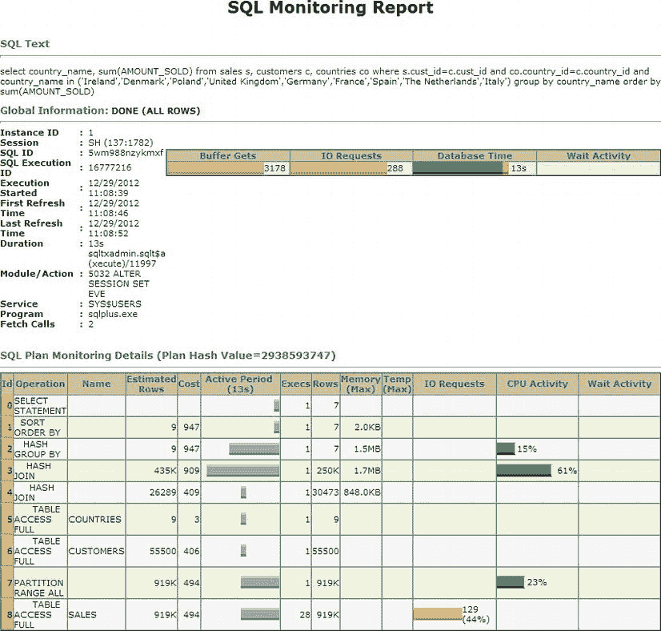

图 12-1. 一个典型的 SQL 监控报告

既然我们知道了 SQL 监控器 HTML 报告是什么，我们会看到 XPLORE 会话默认会为我们创建它们。让我们看看创建 XPLORE 报告所需的步骤。

## 构建你的测试用例

正如我之前提到的，不先构建测试用例就无法运行 XPLORE。在这个例子中，我使用了与第 11 章中相同的测试用例。通过导航到 `utl` 下的 `xplore` 目录，我可以轻松运行 XPLORE 的安装脚本。

```
C:\Documents and Settings\Stelios\Desktop\SQLT 11.4.4.6\sqlt\utl\xplore>sqlplus / as sysdba
SQL*Plus: Release 11.2.0.1.0 Production on Mon Dec 17 19:37:00 2012
Copyright (c) 1982, 2010, Oracle.  All rights reserved.
Connected to:
Oracle Database 11g Enterprise Edition Release 11.2.0.1.0 - Production
With the Partitioning, OLAP, Data Mining and Real Application Testing options
SQL> @install
Test Case User: TC64661
Password: TC64661
```

这个安装脚本授予测试用例用户足够的权限（DBA）以运行后续的脚本。请记住，这只能在容易更换的独立系统上运行。脚本以如下内容结束：

```
Package created.
No errors.
Package body created.
No errors.
Installation completed.
You are now connected as TC64661.
1. Set CBO env if needed
2. Execute @create_xplore_script.sql
```

第一步“如果需要则设置 CBO 环境”是在提醒你，如果你的测试用例需要设置任何环境设置，并且你希望这些设置对于测试用例的所有运行都保持不变，那么你必须在这里设置。然后这会被应用到基线，并在为每个测试执行脚本之前执行。通过向安装脚本提供测试用例用户，你已将该用户更改为系统的 DBA，并允许它更改所有系统参数和修复控制设置。测试用例用户也知道需要运行的脚本，然后将开始构建模板脚本，接着是超级脚本。

## 构建第一个脚本

这第一个脚本只是收集你为 XPLORE 会话设置的配置，然后用这些参数调用 `xplore.create_xplore_script`。这是脚本中的那行代码：

```
EXEC xplore.create_xplore_script(
  '&&xplore_method.',         <<<此参数可接受 XECUTE 或 XPLAIN 值
  '&&include_cbo_parameters.',<<<是否包含 CBO 参数
  '&&include_exadata_parameters.',<<<是否包含 Exadata 特定参数
  '&&include_fix_control.',   <<<是否包含修复控制
  '&&generate_sql_monitor_reports.'); <<<是否生成 SQL 监控报告。
```

这些设置都会对最终创建的报告产生影响。`xplore_method` 控制 XPLORE，允许它以 XPLAIN 模式或 XECUTE 模式运行。在 XPLAIN 模式下，不会执行 SQL。XPLAIN 模式对于大多数情况通常足够快。XECUTE 会执行 SQL，如果同时存在数据，那么这可能需要很长时间才能完成。需要澄清的是，这里的 XECUTE 选项与 XECUTE 方法无关：我们在这里谈论的是 XPLORE 工具的一个选项。如果 SQL 可以相对快速地执行，或者你有足够的时间等待结果，那么 XECUTE 将为你提供更多信息。


# 构建超级脚本

接下来的两个参数用于控制您希望探索的参数组。您可以选择探索所有参数，即尝试所有 CBO 参数以及所有 Exadata 特有参数的值。如果您的测试用例来自 Exadata 机器，那么您可能也会对选择此选项感兴趣。如果您的测试用例并非来自 Exadata，则没有必要选择此选项，因为这些测试只会在 Exadata 机器上生效。然后，您可以选择设置修复控制参数（我们在本章前面的章节中提到过）。如果您怀疑自己遇到了优化器错误，可能会对这些参数感兴趣。当您运行此脚本并输入所需参数时，将会生成一个新的、更大的脚本。

# 构建超级脚本

现在我们进入运行 XPLORE 会话前的最后一步。首先需要做的是将测试 SQL 脚本复制到 `utl\xplore` 目录。这是为了让 XPLORE 会话能够访问该脚本。就我而言，我执行的命令是：

```
>copy "C:\Documents and Settings\Stelios\Desktop\SQLT 11.4.4.6\sqlt\run\sqlt_s64661\TC\q.sql"
"C:\Documents and Settings\Stelios\Desktop\SQLT 11.4.4.6\sqlt\utl\xplore\q.sql"
```

我们运行 `create_xplore_script.sql`，它将提示输入前一节描述的参数。这里我们看到一个脚本运行示例，我们选择了 XPLAIN 模式，并选择探索 CBO 参数、Exadata 参数和修复控制参数，同时生成 SQL 监控报告。

```
SQL> @create_xplore_script.sql
Parameter 1:
XPLORE Method: XECUTE (default) or XPLAIN
"XECUTE" requires /* ^^unique_id */ token in SQL
"XPLAIN" uses "EXPLAIN PLAN FOR" command
Enter "XPLORE Method" [XECUTE]: XPLAIN
Parameter 2:
Include CBO Parameters: Y (default) or N
Enter "CBO Parameters" [Y]: Y
Parameter 3:
Include Exadata Parameters: Y (default) or N
Enter "EXADATA Parameters" [Y]: Y
Parameter 4:
Include Fix Control: Y (default) or N
Enter "Fix Control" [Y]: Y
Parameter 5:
Generate SQL Monitor Reports: N (default) or Y
Only applicable when XPLORE Method is XECUTE
Enter "SQL Monitor" [N]: Y
Review and execute @xplore_script_1.sql
```

现在创建的脚本非常长。我们可以通过查看文件顶部附近的一些条目来大致了解这个脚本的内容。

```
1\. SET DEF ON ECHO OFF TERM ON APPI OFF SERVEROUT ON SIZE 1000000 NUMF "" SQLP SQL>;
2\. SET SERVEROUT ON SIZE UNL;
3\. SET ESC ON SQLBL ON;
4\. SPO xplore_script_1.log;
5\. COL connected_user NEW_V connected_user FOR A30;
6\. SELECT user connected_user FROM DUAL;
7\. PRO
8\. PRO Parameter 1:
9\. PRO Name of SCRIPT file that contains SQL to be xplored (required)
10\. PRO
11\. SET DEF ^ ECHO OFF;
12\. DEF script_with_sql = '¹';
13\. PRO
14\. PRO Parameter 2:
15\. PRO Password for ^^connected_user. (required)
16\. PRO
17\. DEF user_password = '²';
18\. PRO
19\. PRO Value passed to xplore_script.sql:
20\. PRO ∼∼∼∼∼∼∼∼∼∼∼∼∼∼∼∼∼∼∼∼∼∼∼∼∼∼∼∼∼∼∼∼∼
21\. PRO SCRIPT_WITH_SQL: ^^script_with_sql
22\. PRO
23\. PRO -- begin common
24\. PRO DEF _SQLPLUS_RELEASE
25\. PRO SELECT USER FROM DUAL;
26\. PRO SELECT TO_CHAR(SYSDATE, 'YYYY-MM-DD HH24:MI:SS') current_time FROM DUAL;
27\. PRO SELECT * FROM v$version;
28\. PRO SELECT * FROM v$instance;
29\. PRO SELECT name, value FROM v$parameter2 WHERE name LIKE '%dump_dest';
30\. PRO SELECT directory_name||' '||directory_path directories FROM dba_directories WHERE directory_name LIKE 'SQLT$%' OR directory_name LIKE 'TRCA$%' ORDER BY 1;
31\. PRO -- end common
32\. PRO
33\. SET VER ON HEA ON LIN 2000 PAGES 1000 TRIMS ON TI OFF TIMI OFF;
```

我在代码中添加了行号，因为值得详细解释其中一些行的情况。有些行只是 `PROMPT`，这只是一个空行。

*   **`1\. 设置 DEF ON ECHO OFF TERM ON APPI OFF SERVEROUT ON SIZE 1000000 NUMF "" SQLP SQL>;`** - 设置输出的默认格式，因为脚本依赖该格式以在运行时生成可用的 HTML 文件。
*   **`2\. 设置 SERVEROUT ON SIZE UNL;`** - 确保输出大小无限制。
*   **`3\. 设置 ESC ON SQLBL ON;`** - 开启 `ESCAPE` 模式和空行模式。
*   **`4\. SPO xplore_script_1.log;`** - 我们正在假脱机到的脚本文件。
*   **`5\. COL connected_user NEW_V connected_user FOR A30;`** - 设置 `connected_user` 列的格式。
*   **`6\. 选择 user connected_user FROM DUAL;`** - 获取连接的用户。
*   **`8\. PRO 参数 1:`** - 获取脚本名称。
*   **`9\. PRO 包含待探索 SQL 的脚本文件的名称 (必需)`** - 提示信息。
*   **`11\. 设置 DEF ^ ECHO OFF;`** - 设置更多环境配置。
*   **`12\. DEF script_with_sql = '¹';`** - 将变量名 (`script_with_sql`) 设置为 `'¹'`。
*   **`15\. PRO ^^connected_user. 的密码 (必需)`** - 获取测试用例用户的密码。
*   **`17\. DEF user_password = '²';`** - 将测试用例用户的密码设置为变量 `user_password`。
*   **`21\. PRO SCRIPT_WITH_SQL: ^^script_with_sql`** - 获取脚本文件名并设置变量 `script_with_sql`。
*   **`25\. PRO 选择 USER FROM DUAL;`** - 选择当前连接的用户。
*   **`26\. PRO 选择 TO_CHAR(SYSDATE, 'YYYY-MM-DD HH24:MI:SS') current_time FROM DUAL;`** - 选择日期和时间。
*   **`27\. PRO 选择 * FROM v$version;`** - 选择当前版本。
*   **`28\. PRO 选择 * FROM v$instance;`** - 选择实例信息。
*   **`29\. PRO 选择 name, value FROM v$parameter2 WHERE name LIKE '%dump_dest';`** - 显示转储目标。
*   **`30\. PRO 选择 directory_name||' '||directory_path directories FROM dba_directories WHERE directory_name LIKE 'SQLT$%' OR directory_name LIKE 'TRCA$%' ORDER BY 1;`** - 检查 Oracle 目录是否已设置。
*   **`33\. 设置 VER ON HEA ON LIN 2000 PAGES 1000 TRIMS ON TI OFF TIMI OFF;`** - 在通用部分的末尾，设置所需的格式环境。

这是通用代码的结束。现在我们有一个在循环中生成的代码。我展示这个脚本的第一部分：

```
--
 1\. 设置 ECHO ON;
 2\. --如果断开连接，请怀疑错误 6356566，如果需要，在下方行中取消注释解决方法
 3\. --ALTER SESSION SET "_cursor_plan_unparse_enabled" = FALSE;
 4\. WHENEVER SQLERROR EXIT SQL.SQLCODE;
 5\. --
 6\. COL run_id NEW_V run_id FOR A4;
 7\. 选择 LPAD((NVL(MAX(run_id), 0) + 1), 4, '0') run_id FROM xplore_test;
 8\. --
 9\. DELETE plan_table_all WHERE statement_id LIKE 'xplore_{001}_[^^run_id.]_(%)';
10\. 执行 xplore.set_baseline(1);
11\. --
12\. 设置 BLO .
13\. GET ^^script_with_sql.
14\. .
15\. C/;/
16\. 0 EXPLAIN PLAN SET statement_id = 'xplore_{001}_[^^run_id.]_(00000)' INTO plan_table_all FOR
17\. L
18\. /
19\. 执行 xplore.snapshot_plan('xplore_{001}_[^^run_id.]_(00000)', 'XPLAIN', 'Y');
20\. WHENEVER SQLERROR CONTINUE;
```

这 20 行是 XPLORE 的核心。我将解释这里发生的事情。


# 脚本核心逻辑注释

*   第 1–4 行：确保`echo`开启以便获取输出，并让错误终止 SQL 执行。
*   第 5–8 行：设置列`run_id`的格式，并从表`xplore_test`中选择当前的`run_id`。
*   第 9 行：删除`PLAN_TABLE`中所有与即将执行的语句匹配的条目。
*   第 10 行：设置我们用户决定在每次 XPLORE 迭代执行前设置的基线。
*   第 11–14 行：将块终止符设置为“.”，获取脚本（本例中为`q.sql`），并停止块。
*   第 15–17 行：从文件中移除刚获取的脚本中的“;”，并用空格替换（我们将用“/”而不是“;”来执行）；然后设置第`0`行为`EXPLAIN PLAN`等，用`L`追加从文件获取的 SQL，并执行组合语句。完整的行应如下所示：

```sql
    EXPLAIN PLAN SET statement_id = 'xplore_{001}_[0001]_(00001)' INTO plan_table_all FOR select /* ^⁰⁰¹ */  country_name, sum(AMOUNT_SOLD) from sh.sales s, sh.customers c, sh.countries co where s.cust_id=c.cust_id and co.country_id=c.country_id and country_name in ('Ireland','Denmark','Poland','United Kingdom','Germany','France','Spain','The Netherlands','Italy') group by country_name order by sum(AMOUNT_SOLD);
```

*   第 18–20 行：执行上述语句，并使用`snapshot_plan`例程捕获计划表中的所有信息及其他信息，并将其全部存储在内部 SQLT 存储库中，以便在最终报告结束时输出。

一旦你审查了此脚本并确信它会产生正确的结果，就可以运行`xplore_script_1.sql`。我知道我在这里的细节阐述超出了使用脚本所需的范围，但这些行正是 XPLORE 方法的核心。我们可以更深入地探讨`xplore.pkb`中的过程`snapshot_plan`，但这超出了本书的范围。

## 运行脚本

运行脚本只需执行`xplore_script_1.sql`。下面我展示了脚本的第一次运行过程，并收集了参数：

```sql
SQL>@xplore_script_1.sql
TC64661

Parameter 1:
Name of SCRIPT file that contains SQL to be xplored (required)
Note: SCRIPT must contain comment /* ^^unique_id */
Enter value for 1: q.sql
Parameter 2:
Password for TC64661 (required)
Enter value for 2: TC64661
Value passed to xplore_script.sql:
∼∼∼∼∼∼∼∼∼∼∼∼∼∼∼∼∼∼∼∼∼∼∼∼∼∼∼∼∼∼∼∼∼
SCRIPT_WITH_SQL: q.sql
-- begin common
DEF _SQLPLUS_RELEASE
SELECT USER FROM DUAL
SELECT TO_CHAR(SYSDATE, 'YYYY-MM-DD HH24:MI:SS') current_time FROM DUAL
SELECT * FROM v$version
SELECT * FROM v$instance
SELECT name, value FROM v$parameter2 WHERE name LIKE '%dump_dest'
SELECT directory_name||' '||directory_path directories FROM dba_directories WHERE directory_name LIKE 'SQLT
' ORDER BY 1
-- end common
SQL>--in case of disconnects, suspect 6356566 and un-comment workaround in line below if needed
SQL>--ALTER SESSION SET "_cursor_plan_unparse_enabled" = FALSE;
SQL>WHENEVER SQLERROR EXIT SQL.SQLCODE;
SQL>--
SQL>COL run_id NEW_V run_id FOR A4;
SQL>SELECT LPAD((NVL(MAX(run_id), 0) + 1), 4, '0') run_id FROM xplore_test;
RUN_

SQL>--
SQL>DELETE plan_table_all WHERE statement_id LIKE 'xplore_{001}_[^^run_id.]_(%)';
old   1: DELETE plan_table_all WHERE statement_id LIKE 'xplore_{001}_[^^run_id.]_(%)'
new   1: DELETE plan_table_all WHERE statement_id LIKE 'xplore_{001}_[0001]_(%)'
```

我们现在已设置好环境，必须在运行我们正在研究的脚本之前设置任何基线。

```sql
SQL>EXEC xplore.set_baseline(1);
--
-- begin set_baseline
--
--
-- end set_baseline
--
SQL>--
SQL>ALTER SESSION SET STATISTICS_LEVEL = ALL;
SQL>DEF unique_id = "xplore_{001}_[^^run_id.]_(00000)"
SQL>@^^script_with_sql.
SQL>REM $Header: 215187.1 sqlt_s64661_tc_script.sql 11.4.4.6 2012/12/13 carlos.sierra $
SQL>
SQL>
SQL>select
  2   /* ^^unique_id */  country_name, sum(AMOUNT_SOLD)
  3  from sh.sales s, sh.customers c, sh.countries co
  4  where
  5    s.cust_id=c.cust_id
  6    and co.country_id=c.country_id
  7    and country_name in (
  8      'Ireland','Denmark','Poland','United Kingdom',
  9       'Germany','France','Spain','The Netherlands','Italy')
 10    group by country_name order by sum(AMOUNT_SOLD);
old   2:  /* ^^unique_id */  country_name, sum(AMOUNT_SOLD)
new   2:  /* xplore_{001}_[0001]_(00000) */  country_name, sum(AMOUNT_SOLD)
COUNTRY_NAME                             SUM(AMOUNT_SOLD)
---------------------------------------- ----------------
Poland                                            8447.14
Denmark                                        1977764.79
Spain                                          2090863.44
France                                         3776270.13
Italy                                          4854505.28
United Kingdom                                 6393762.94
Germany                                        9210129.22
SQL>EXEC xplore.snapshot_plan('xplore_{001}_[^^run_id.]_(00000)', 'XECUTE', 'Y');
SQL>WHENEVER SQLERROR CONTINUE;
SQL>--
```

在这第一次运行之后，我们看到确实得到了结果（因为我选择在 XPLORE 中放入数据）。这次运行的数据将被收集，与所有其他运行一起存入 SQLT 存储库，准备在运行结束时生成报告。

# 查看结果

当脚本最终完成（如果有数据，可能需要数小时）时，你会看到消息指示 HTML 文件正在被压缩，主报告正在创建。“XPLORE Completed”消息是一个重要线索，表明我们现在可以阅读报告了。以下是 XPLORE 运行结束时的输出。

```sql
 adding: xplore_sql_monitor_report_1_00728.html (164 bytes security) (deflated 81%)
  adding: xplore_sql_monitor_report_1_00729.html (164 bytes security) (deflated 80%)
  adding: xplore_sql_monitor_report_1_00730.html (164 bytes security) (deflated 80%)
  adding: xplore_sql_monitor_report_1_00731.html (164 bytes security) (deflated 80%)
test of xplore_sql_monitor_report_1.zip OK
  adding: xplore_report_1.html (164 bytes security) (deflated 96%)
  adding: xplore_script_1.log (164 bytes security) (deflated 98%)
  adding: xplore_script_1.sql (164 bytes security) (deflated 95%)
  adding: xplore_sql_monitor_report_1.zip (164 bytes security) (stored 0%)
test of xplore_1.zip OK
        zip warning: error deleting xplore_script_1.sql
XPLORE Completed.
Disconnected from Oracle Database 11g Enterprise Edition Release 11.2.0.1.0 - Production
With the Partitioning, OLAP, Data Mining and Real Application Testing options
```

一个名为`xplore_1.zip`的新文件已被创建，它位于我们运行 XPLORE 脚本的目录中。

```cmd
C:\Documents and Settings\Stelios\Desktop\SQLT 11.4.4.6\sqlt\utl\xplore>dir
 Volume in drive C has no label.
 Volume Serial Number is 77E9-80B4

Directory of C:\Documents and Settings\Stelios\Desktop\SQLT 11.4.4.6\sqlt\utl\xplore
```


# 文件列表与使用说明

## 目录内容

```
12/22/2012  12:28 PM    <DIR>          .
12/22/2012  12:28 PM    <DIR>          ..
08/11/2011  01:19 AM             1,696 create_xplore_script.sql
07/09/2011  07:01 PM               325 drop_sys_views.sql
08/11/2011  12:46 AM               499 drop_user_objects.sql
08/11/2011  12:46 AM               537 install.sql
12/13/2012  08:53 PM               452 q.sql
08/11/2011  12:46 AM             2,622 readme.txt
07/09/2011  07:01 PM             3,972 sys_views.sql
08/11/2011  12:46 AM               184 uninstall.sql
08/11/2011  12:46 AM             6,844 user_objects.sql
04/02/2012  10:43 AM            58,807 xplore.pkb
10/11/2011  06:29 AM             2,843 xplore.pks
12/22/2012  12:28 PM         3,839,878 xplore_1.zip
12/22/2012  09:45 AM           301,600 xplore_script_1.sql
12/22/2012  09:31 AM             3,239 xplore_script_2.log
12/22/2012  09:29 AM           301,600 xplore_script_2.sql
12/22/2012  09:33 AM             2,341 xplore_script_3.log
12/22/2012  09:32 AM           301,600 xplore_script_3.sql
              17 File(s)      4,829,039 bytes
               2 Dir(s)   6,701,252,608 bytes free
```

## 使用报告

要使用此报告，最好创建一个子目录并解压 `xplore_1.zip` 中的文件。压缩文件中包含一个 HTML 文件（主报告）、一个运行日志文件以及运行过的 `xplore` 脚本。目前我们唯一感兴趣的文件是 HTML 文件。如果用浏览器打开此文件，会发现它比正常的 XECUTE 或 XTRACT 报告简洁得多。它以一个简单的标题“`XPLORE Report for baseline:1 runid:1`”开始，然后直接就是大量的数字。报告的“Plans Summary”部分显示了我们的一条 SQL 的所有已发现执行计划。让我们看一下图 12-2，它展示了报告的这一部分。这是通往报告所有其他部分的起点。

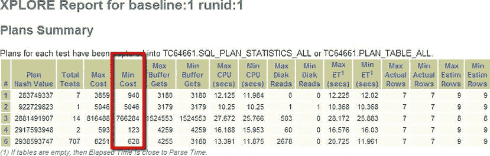
图 12-2 . XPLORE 报告的顶部部分

在这个案例中只有 5 个不同的执行计划（这是一段非常简单的 SQL）。例如，`PHV` 922729823 只有一个测试，因此其最大和最小成本相同，都是 5046，这并不奇怪。原始计划的成本是 947，所以这个选项显然不是好的选择。如果我们看看那个测试是什么，就能明白为什么结果不好。滚动到图 12-3 所示的部分，它显示了“Plans Summary”正下方的“Discovered Plans”。这里我想知道为什么我原始的成本 947 会增加到 5046。箭头指向一个超链接，点击它可以带我到同一报告的不同部分，那里详细说明了这次测试的情况。见图 12-3，它显示了报告的“Discovered Plans”部分。

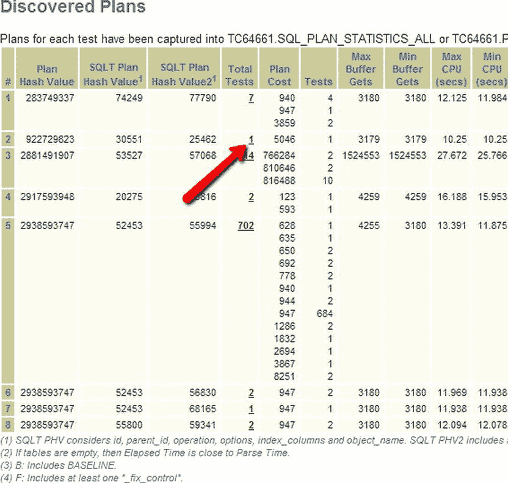
图 12-3 . 你可以通过点击“Total Tests”列下的超链接来查看测试详情

一旦我们点击这个超链接，就会被带到报告的一个部分，显示做了什么以及发生了什么。图 12-4 显示了这个特定 `PHV` 的详细信息。

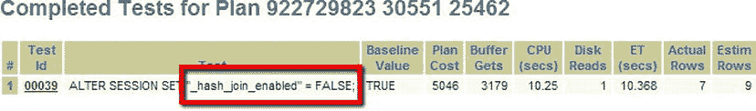
图 12-4 . `PHV` 922729823 的详细信息

我们可以看到，这个 `PHV` 的测试是将 `"_hash_join_enabled"=FALSE`。如果我们查看此 SQL 的 XTRACT 报告的原始执行计划（见图 12-5）就能明白。

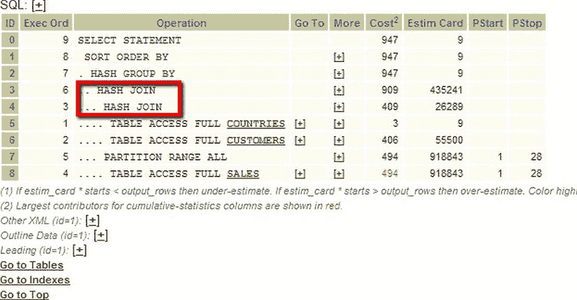
图 12-5 . XTRACT 报告中显示的原始执行计划

原始计划是对 `COUNTRIES` 和 `CUSTOMERS` 使用“`TABLE ACCESS FULL`”，然后使用哈希连接，接着再将其与对 `SALES` 的“`TABLE ACCESS FULL`”的结果进行另一次哈希连接。此计划的核心是使用哈希连接。现在我们的 `XPLORE` 通过设置隐藏参数禁用了这个选项，难怪计划的成本变得更高了。如果我们点击图 12-4 中“`Test Id`”列下的数字，就能看到实际选择了哪个计划。这就是我们看到的计划。

```
|Id |Operation                        |Name         | Cost (%CPU)| Buffers |  1Mem |  O/1/M   |
|  0|SELECT STATEMENT                 |             |  5046 (100)|    3179 |       |          |
|  1| SORT ORDER BY                   |             |  5046   (3)|    3179 |  2048 |     1/0/0|
|  2|  HASH GROUP BY                  |             |  5046   (3)|    3179 |   770K|     1/0/0|
|  3|   MERGE JOIN                    |             |  5008   (2)|    3179 |       |          |
|  4|    SORT JOIN                    |             |   825   (1)|    1461 |   546K|     1/0/0|
|  5|     MERGE JOIN                  |             |   632   (1)|    1461 |       |          |
|* 6|      TABLE ACCESS BY INDEX ROWID|COUNTRIES    |     2   (0)|       2 |       |          |
|  7|       INDEX FULL SCAN           |COUNTRIES_PK |     1   (0)|       1 |       |          |
|* 8|      SORT JOIN                  |             |  630   (1) |    1459 |   615K|     1/0/0|
|  9|       TABLE ACCESS FULL         |CUSTOMERS    |   406   (1)|    1459 |       |          |
|*10|    SORT JOIN                    |             |  4183   (2)|    1718 |  1763K|     1/0/0|
| 11|     PARTITION RANGE ALL         |             |   494   (3)|    1718 |       |          |
| 12|      TABLE ACCESS FULL          |SALES        |   494   (3)|    1718 |       |          |
```

正如预期，没有哈希连接的迹象。优化器尊重了我们的要求并避免了它，但这对我们的计划产生了不利影响，所以我们知道不要强制优化器不使用哈希连接。这就是智能分析发挥作用的地方。我们知道哈希连接在这里是个好主意，但 `XPLORE` 的蛮力方法并不知道。

## 寻找最佳执行计划

那么，关于计划如何变得更糟就讲这么多。让我们回到计划摘要（见图 12-2），现在看看是否有任何改进。我们看到 `PHV` 2917593948 有一个很大的改进。这里我们看到一个计划，其最小成本是 123（远低于我们原始计划的成本 947）。如果我们再看“Discovered Plans”部分，会发现有两个测试完成。如果我们现在点击超链接“2”，就能看到这个 `PHV` 的完整测试（见图 12-6）。

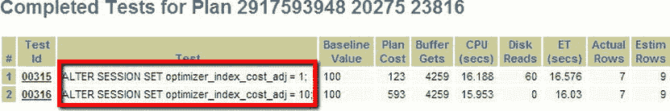
图 12-6 . `PHV` 2917593948 的测试详情

我们立即看到，这个案例成本如此之低的原因是我们将 `optimizer_index_cost_adj` 设置为 1。换句话说，我们强制使用了索引。我们可以通过点击超链接 315 来查看测试 315 使用的计划。这就是我们看到的计划（为清晰起见，我已删除了一些列）。

```
|Id  |Operation                             | Name                 | Cost (%CPU)| Reads  |
```


## 分析原始执行计划

|  0 | SELECT STATEMENT                      |                      |   123 (100)|     60 |
|  1 | SORT ORDER BY                        |                      |   123  (54)|     60 |
|  2 | HASH GROUP BY                       |                      |   123  (54)|     60 |
|* 3 | HASH JOIN                          |                      |    84  (33)|     60 |
|* 4 | HASH JOIN                         |                      |    31  (10)|      4 |
|* 5 | TABLE ACCESS FULL                | COUNTRIES            |     3   (0)|      0 |
|  6 | TABLE ACCESS BY INDEX ROWID      | CUSTOMERS            |    27   (8)|      4 |
|  7 | BITMAP CONVERSION TO ROWIDS     |                      |            |      4 |
|  8 | BITMAP INDEX FULL SCAN         | CUSTOMERS_GENDER_BIX |            |      4 |
|  9 | PARTITION RANGE ALL               |                      |    49  (41)|     56 |
| 10 | TABLE ACCESS BY LOCAL INDEX ROWID| SALES                |    49  (41)|     56 |
| 11 | BITMAP CONVERSION TO ROWIDS     |                      |            |     56 |
| 12 | BITMAP INDEX FULL SCAN         | SALES_PROMO_BIX      |            |     56 |

看起来在本例中使用位图索引是有用的，因为其成本如此之低。我们不禁要问，为什么优化器最初没有选择该索引，为此我们需要查看原始 XTRACT 报告中的统计信息。我们从系统观察中看到，`optimizer_dynamic_sampling` 被设置为 1（因此在本例中不会进行动态采样）。参见 图 12-7，该图展示了 XTRACT 报告中的此项设置。

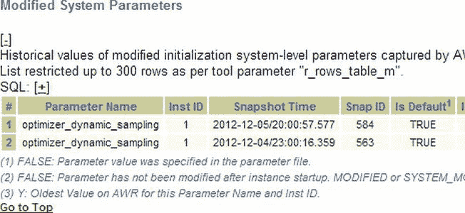

图 12-7。优化器动态采样被设置为 1。

由于动态采样的值为 1，我们知道动态采样可以发生，但在本例中并未发生，因为涉及的表并非未编入索引（有关基数反馈和动态采样的详细信息，请参见 第 8 章）。尽管未使用动态采样不能成为生成错误执行计划的借口，但这可以解释为何如果统计信息缺失，该计划未被动态采样所保存。

## 回顾原始测试案例

如果我们查看原始报告中的观察结果，会发现许多分区统计信息缺失且已过时（但在我这里这并不重要，因为数据是静态的）。然而，由于看起来统计信息是导致选择了错误执行计划的原因，我将更新它们并重试该 SQL。

我用来收集新的最新统计信息的 SQL 是：

```
SQL> exec dbms_stats.gather_Table_stats(ownname=>'TC64661',
  tabname=>'SALES', estimate_percent=>dbms_stats.auto_sample_size,cascade=>TRUE)

PL/SQL procedure successfully completed.

SQL> exec dbms_stats.gather_Table_stats(ownname=>'TC64661',
  tabname=>'COUNTRIES', estimate_percent=>dbms_stats.auto_sample_size,cascade=>TRUE);

PL/SQL procedure successfully completed.

SQL> exec dbms_stats.gather_Table_stats(ownname=>'TC64661',
  tabname=>'CUSTOMERS', estimate_percent=>dbms_stats.auto_sample_size,cascade=>TRUE);

PL/SQL procedure successfully completed.
```

请记住，在本例中，我还使用了来自源表的数据（这并非总是如此）。如果我对所有相关表收集了最新的统计信息（如上所示）并重新运行测试用例，我会得到如下执行计划：

```
SQL> @tc

COUNTRY_NAME                             SUM(AMOUNT_SOLD)
---------------------------------------- ----------------
Poland                                            8447.14
Denmark                                        1977764.79
Spain                                          2090863.44
France                                         3776270.13
Italy                                          4854505.28
United Kingdom                                 6393762.94
Germany                                        9210129.22

7 rows selected.

PLAN_TABLE_OUTPUT

SQL_ID  f43bszax8xh07, child number 0

select  /* ^^unique_id */  country_name, sum(AMOUNT_SOLD) from sales s,
customers c, countries co where   s.cust_id=c.cust_id   and
co.country_id=c.country_id   and country_name in (
'Ireland','Denmark','Poland','United Kingdom',
'Germany','France','Spain','The Netherlands','Italy')   group by
country_name order by sum(AMOUNT_SOLD)

Plan hash value: 1235134607

| Id  | Operation                       | Name         | Rows  | Bytes | Cost (%CPU)| Time     |
|   0 | SELECT STATEMENT                |              |       |       |     4 (100)|          |
|   1 |  SORT ORDER BY                  |              |     1 |    87 |     4  (50)| 00:00:01 |
|   2 |   HASH GROUP BY                 |              |     1 |    87 |     4  (50)| 00:00:01 |
|   3 |    NESTED LOOPS                 |              |     1 |    87 |     2   (0)| 00:00:01 |
|   4 |     NESTED LOOPS                |              |     1 |    52 |     2   (0)| 00:00:01 |
|   5 |      PARTITION RANGE ALL        |              |     1 |    26 |     2   (0)| 00:00:01 |
|   6 |       TABLE ACCESS FULL         | SALES        |     1 |    26 |     2   (0)| 00:00:01 |
|   7 |      TABLE ACCESS BY INDEX ROWID| CUSTOMERS    |     1 |    26 |     0   (0)|          |
|*  8 |       INDEX UNIQUE SCAN         | CUSTOMERS_PK |     1 |       |     0   (0)|          |
|*  9 |     TABLE ACCESS BY INDEX ROWID | COUNTRIES    |     1 |    35 |     0   (0)|          |
|* 10 |      INDEX UNIQUE SCAN          | COUNTRIES_PK |     1 |       |     0   (0)|          |

Predicate Information (identified by operation id):

8 - access("S"."CUST_ID"="C"."CUST_ID")
   9 - filter(("COUNTRY_NAME"='Denmark' OR "COUNTRY_NAME"='France' OR "COUNTRY_NAME"='Germany' OR
              "COUNTRY_NAME"='Ireland' OR "COUNTRY_NAME"='Italy' OR "COUNTRY_NAME"='Poland' OR "COUNTRY_NAME"='Spain'
              OR "COUNTRY_NAME"='The Netherlands' OR "COUNTRY_NAME"='United Kingdom'))
  10 - access("CO"."COUNTRY_ID"="C"."COUNTRY_ID")

36 rows selected.
```

这个计划甚至比 XPLORE 找到的计划还要好。它的成本是 4。我们找到这个计划是因为我们使用了 XPLORE 来给我们一个提示。这个提示就是，除了 `SALES` 表之外，对所有表使用索引都是个好主意。我们需要对 `SALES` 表进行 `TABLE ACCESS FULL`，因为我们是在对一个大的国家组进行销售总额求和。然而，对其他表使用 `TABLE ACCESS FULL` 没有意义。这个例子得出这样的结果并不奇怪（我就是这么设计的），但现实生活中的例子也完全如此。通常的发现步骤是：

1.  某个 SQL 发生了一些意外情况（通常会变慢）。
2.  获取 XTRACT 测试用例。
3.  通过研究报告来发现 SQL 或其环境的问题所在。
4.  如果上一步失败了，运行 XPLORE，有时会发现一个值得考虑的有趣改动（比如我们上面例子中的 `optimizer_index_cost_adj`）。
5.  我们将 XPLORE 得到的“好”计划与 XTRACT 得到的“坏”计划进行比较，并弄清楚在优化器步骤方面的差异是什么。在我们的例子中，就是缺少了索引的使用。
6.  再次回顾 XTRACT 报告，看看是否能确定本该发生的操作为何没有发生（在我们的例子中是“为什么没有使用索引”）。
7.  修改原始测试环境以使优化器操作发生，并再次比较执行计划的成本。
8.  如果第 7 步达到了预期的效果，则进行更多测试，如果一切如预期进行，就实施这个改进。


这些步骤是标准调优方法的示例：测试、进行单次更改、再次测试。测试用例使您能够快速高效地完成此操作。随着您对 `XTRACT` 的熟练度提高，您会发现使用 `XPLORE` 并非必需。这有点像天气预报：“天气预报的准确性与预报员头上的灰白数量成正比。”本章要记住的教训是，虽然我们发现将 `optimizer_index_cost_adj` 设置为 `1` 使我们的执行计划好得多，但那并非解决方案。那只是促使我们找到了真正的解决方案，即修复统计信息。

换句话说，我们发现了一个与升级无关的问题（即统计信息是错误的），但 `XPLORE` 暗示了解决方案。这就是 `XPLORE` 令人惊奇之处。再次说明，它主要用于确定优化器发生了哪些变化（由于升级）以及哪些变化可能导致执行计划退化。然而，如果我们 *在紧急情况下* 使用 `XPLORE`，我们可能会在某个执行计划中找到一个解决问题的核心思路，即使原始问题可能与优化器行为的变化无关。

## XPLORE 中的其他信息

在我们的 `XPLORE` 示例中，我们直接专注于寻找最佳计划，并未停下来查看 `XPLORE` 提供的所有其他信息。这里我们将简要介绍一些需要提及的其他部分。

### 基线

第一个是“基线”部分，它显示了每次测试的设置。请参见 图 12-8，该图显示了 `XPLORE` 报告基线部分的顶部内容。

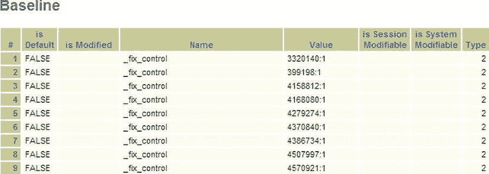

图 12-8 .  `XPLORE` 中基线报告的顶部部分

报告的这一部分显示了测试的起始位置。它首先列出了测试数据库上启动前的所有修复控制设置，然后继续列出所有优化器参数（包括隐藏参数）。

### SQL 监视器报告

除了主报告中的所有信息外，在 `XPLORE` 压缩文件中还创建了一个压缩文件（是的，一个压缩文件内的压缩文件）。这个名为 `xplore_sql_monitor_report_1.zip` 的压缩文件包含了脚本每次执行的 SQL 监视器 HTML 输出。这是一个庞大的信息量。您永远不会查看每一个这样的执行报告，但如果您有数据并且最终确定了一个您喜欢的计划，例如上面我们的测试 ID 315，那么我们可以更仔细地研究这一个测试的 SQL 监视器报告。像往常一样，您应该创建一个目录并将压缩文件放在那里。然后解压缩文件。在此目录中，您最终将得到 732 个 HTML 报告：每个测试一个，以及一个显示脚本如何创建的 SQL 文件。让我们看其中一个监视器报告，具体是报告 315。查看 图 12-9，该图显示了测试 ID 315 的监视器报告的左侧部分。

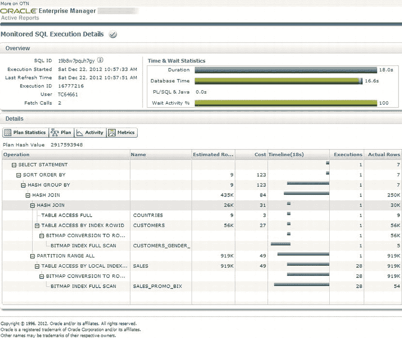

图 12-9 .  测试 ID 315 的 SQL 监视器报告左侧部分

我们可以看到执行计划和每一步的成本，但也可以看到计划每一步花费的时间量。我们可以看到大部分时间都花在了 `SALES_PROMO_BIX` 的 `BITMAP INDEX FULL SCAN` 上。事实上，如果我们将鼠标悬停在这个位图索引的持续时间条上，我们将看到该步骤的持续时间（以秒为单位）。如果我们查看同一报告的右侧部分（如 图 12-10 所示）。

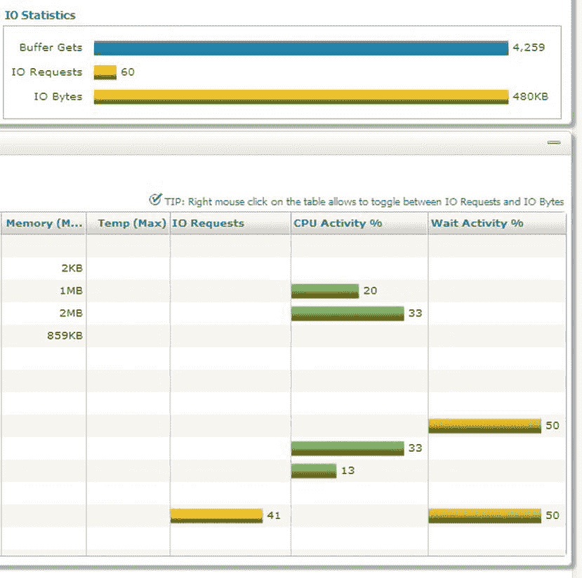

图 12-10 .  SQL 监视器报告中计划 ID 315 的右侧部分

这显示了 50% 的等待活动是针对 `CUSTOMERS` 上的 `BITMAP INDEX FULL SCAN`，另外 50% 是针对 `SALES` 上的 `BITMAP INDEX FULL SCAN`。因为此计划是通过将 `optimizer_index_cost_adj` 设置为 `1` 获得的，我们可以看到索引被不恰当地使用了，并且这个更改导致了比原始糟糕计划更好的计划。有了这些信息，我们知道处理这两个索引是改进执行时间的方法，因为它们是等待时间的最大贡献者。

## 总结

我希望您对 `XPLORE` 能为您做的事情印象深刻，特别是与 `XTRACT` 和 `XECUTE` 结合使用时，当然还有您对优化器工作原理的了解。尽管本章中的示例是一个简单明了的 SQL 片段，但同样的方法可以应用于非常复杂的 SQL 和执行计划。大块的 SQL 可以分解为更小的步骤，并按重要性顺序进行处理，重要性由每一步的成本决定。`XPLORE` 可以调查所有可能影响优化器计算的更改，而这在数据库版本更改导致优化器发生变化时最为常见。明智地使用 `XPLORE`，您将能捕获更多那些出错的麻烦 SQL。

我必须强调，所有的 `XPLORE` 活动都必须在可丢弃的数据库上运行。值得重申的是，设置环境变量、系统参数和统计信息这些 `XPLORE` 所做的操作，可能会对您与他人共享的任何系统造成严重破坏。

尽管 `XPLORE` 功能强大且灵活，但它并不是通用调优的理想工具，但在某些意外发生变化的情况下它极为有用。在下一章中，我们将看看 `SQLT` 中可用的更高级方法。

# 第 13 章


## 跟踪文件、TRCANLZR 和修改 SQLT 行为

即使有 `SQLT` 帮助您，有时您仍然需要查看 `10046` 跟踪文件并进行分析以确定发生了什么。如何分析和解释 `10046` 文件超出了本书的范围。这方面的标准指南是 Cary Millsap 的著作 *Optimizing Oracle Performance*（O'Reilly 2003）。（这本书现在有点过时，但仍然包含关于 `10046` 跟踪文件的有用信息。）然而，如何更轻松地收集这些跟踪文件并对其进行格式化以便更容易解释，并未超出本书的范围，因为 `SQLT` 提供了多种方法来更快、更轻松地收集这些信息。

`10046` 跟踪文件是 Oracle 引擎执行 SQL 时活动的日志文件。这些文件难以解释，充满了晦涩的代码，而且非常长。`10053` 跟踪文件（正如我在第 5 章中提到的）同样晦涩难懂，而且也很长。当 SQL 语句并行执行并且启用了 `10046` 跟踪时，每个协助执行的从属进程都会创建自己的跟踪文件。这使得对并行执行中发生的事情的解释和理解变得更加困难。您可能有数百个跟踪文件都与同一个 SQL 相关，它们并行工作并相互通信以实现共同目标。当这些复杂情况出现问题时，仅仅收集正确的跟踪文件就可能很困难，更不用说分析这些跟踪文件并从可能成百上千的跟踪文件中获取连贯的信息了。

在本章中，我将描述以下方法，从最简单到更复杂。我将尝试在更简单案例的基础上解释更复杂的案例。


## 工具概述

*   `10046` 是原始的跟踪文件或信息文件。
*   `TKPROF` 提供了对 `10046` 跟踪文件的高层次视图。其输入是 `10046` 跟踪文件，输出是 `TKPROF` 报告。
*   `TRCASPLIT` 接收原始的 `10046` 和 `10053` 跟踪文件，从中分离出 `10046` 跟踪文件信息。这些数据随后可以输入给 `TKPROF` 或任何其他需要 `10046` 跟踪的实用程序。
*   `10053` 是解析期间优化器选择的原始跟踪文件。
*   `TRCANLZR` 接收原始的 `10046` 数据并生成图形化报告，使理解数据更容易。
*   `TRCAXTR` 接收原始的 `10046` 跟踪并生成一份 `SQLTXTRACT` 报告。

上述每个工具都接收混合在一起的 `10046` 或 `10046` 和 `10053`，并产出某种更简洁的信息版本。

我们将从收集 `10046` 跟踪的方法开始，然后看看最古老的可用工具 `TKPROF`（它自 Oracle 7 起就存在，并非 `SQLT` 的一部分），接着我们将研究 `TRCASPLIT`，它用于分离 `10046` 和（通常）`10053` 跟踪信息。可以将此方法视为高级工具中最简单的一种。然后我们将研究收集 `10053` 跟踪。`TRCANLZR` 是下一步，它处理单个或多个文件以生成 `TKPROF` 的扩展版本。与 `TKPROF` 不同，`TRCANLZR` 是 `SQLT` 的一部分。

最后，我们将讨论 `TRCAXTR`，它结合了 `TRCANLZR` 和 `XTRACT` 来生成关于多个 SQL 的报告。每个部分都将借助一个 SQL 示例进行解释。

## 10046 跟踪

`10046` 本质上是 Oracle 引擎在处理您的 SQL 语句时的活动的低级日志记录工具。它生成一个称为“跟踪”文件的文件，该文件是一个文本文件，包含执行低级步骤的详细信息。根据选择的跟踪级别，可以将此跟踪配置为收集等待事件、绑定变量和绑定值（可选择的级别见下文）。收集此信息存在开销，它可能消耗大量磁盘空间，并在生成跟踪文件时占用正在执行语句的资源。

## 为什么收集 10046 跟踪？

收集 `10046` 跟踪不是一项可以掉以轻心的活动。如上所述，它会消耗大量资源（尤其是磁盘空间）。考虑到收集 `10046` 跟踪的开销，您不会轻易选择收集此信息。除非有充分的理由，否则通常不会收集它。为了解决通过查看高层次聚合信息无法解决的性能调优问题，才会专门收集 `10046` 跟踪。在这些更困难的情况下，需要一些低级别信息（这些信息在聚合中丢失了）作为我们正在解决的谜题的关键线索。这是因为它包含了 SQL 执行期间发生的非常详细的信息。

`10046` 跟踪也可以通过其他方式启用跟踪来产生，例如在系统级别或跟踪另一个会话而不是您自己的会话。收集的信息是相同的，解码也是相同的；只是启动跟踪的方法会改变。在每种情况下，跟踪文件都是一个独立的文件，位于 `user_dump_dest` 区域（对于 11g Release 1 及以上版本，由 `diagnostic_dest` 参数控制）。

### 10046 解码

有些人会直接阅读 `10046`；这可能是有用的，因为它包含有时在聚合中未包含的低级别信息（这是聚合的本质）。以下是一个典型的 SQL `10046` 跟踪文件片段。

```
EXEC #1:c=0,e=162,p=0,cr=0,cu=0,mis=0,r=0,dep=0,og=1,plh=2938593747,tim=6801557607
WAIT #1: nam='SQL*Net message to client' ela= 6 driver id=1111838976 #bytes=1 p3=0 obj#=-1 tim=6801557680
WAIT #1: nam='Disk file operations I/O' ela= 821 FileOperation=2 fileno=5 filetype=2 obj#=-1 tim=6801559064
*** 2012-12-26 09:59:43.625
WAIT #1: nam='asynch descriptor resize' ela= 4 outstanding #aio=0 current aio limit=4294967295 new aio limit=257 obj#=-1 tim=6802577972
WAIT #1: nam='asynch descriptor resize' ela= 2 outstanding #aio=0 current aio limit=4294967295 new aio limit=257 obj#=-1 tim=6802578401
FETCH #1:c=0,e=1020838,p=0,cr=3180,cu=0,mis=0,r=1,dep=0,og=1,plh=2938593747,tim=6802578585
WAIT #1: nam='SQL*Net message from client' ela= 302 driver id=1111838976 #bytes=1 p3=0 obj#=-1 tim=6802578974
WAIT #1: nam='SQL*Net message to client' ela= 3 driver id=1111838976 #bytes=1 p3=0 obj#=-1 tim=6802579032
FETCH #1:c=0,e=45,p=0,cr=0,cu=0,mis=0,r=6,dep=0,og=1,plh=2938593747,tim=6802579064
STAT #1 id=1 cnt=7 pid=0 pos=1 obj=0 op='SORT ORDER BY (cr=3180 pr=0 pw=0 time=0 us cost=947 size=315 card=9)'
STAT #1 id=2 cnt=7 pid=1 pos=1 obj=0 op='HASH GROUP BY (cr=3180 pr=0 pw=0 time=18 us cost=947 size=315 card=9)'
STAT #1 id=3 cnt=250069 pid=2 pos=1 obj=0 op='HASH JOIN  (cr=3180 pr=0 pw=0 time=1261090 us cost=909 size=15233435 card=435241)'
```

很容易理解，对吧？ 在下面的小节中，我将展示一个可用于查看跟踪文件中出现的部分类型并进行至少部分解码的 `10046` 跟踪文件。以下是 SQL 示例：

```
SQL> alter session set events '10046 trace name context forever, level 64';

Session altered.

SQL> select count(*) from sh.sales;

COUNT(*)
----------
513605

SQL> exit
```

我将 `10046` 跟踪文件的解码分为三个主要部分：头部、主体部分记录格式以及每行详细信息的解码。

## 头部信息

虽然头部本身不是 SQL 执行的一部分，但查看头部很重要。这是我执行的 SQL 的示例头部。

```
Trace file f:\app\stelios\diag\rdbms\snc1\snc1\trace\snc1_ora_7892.trc
Oracle Database 11g Enterprise Edition Release 11.2.0.1.0 - Production
With the Partitioning, OLAP, Data Mining and Real Application Testing options
Windows XP Version V5.1 Service Pack 3
CPU                 : 2 - type 586, 2 Physical Cores
Process Affinity    : 0x0x00000000
Memory (Avail/Total): Ph:988M/3455M, Ph+PgF:2515M/5337M, VA:1251M/2047M
Instance name: snc1
Redo thread mounted by this instance: 1
Oracle process number: 20
Windows thread id: 7892, image: ORACLE.EXE (SHAD)

*** 2013-02-03 12:41:50.754
*** SESSION ID:(16.15175) 2013-02-03 12:41:50.754
*** CLIENT ID:() 2013-02-03 12:41:50.754
*** SERVICE NAME:(SYS$USERS) 2013-02-03 12:41:50.754
*** MODULE NAME:(sqlplus.exe) 2013-02-03 12:41:50.754
*** ACTION NAME:() 2013-02-03 12:41:50.754
```

头部部分为后续信息设定了场景。应检查此部分以确保您正在查看正确的跟踪文件。例如，正确的实例和正确的时间。此部分还为您提供有关节点上资源的一些基本信息，例如内存可用量（参见 “Memory (Avail/Total)” 行）和 CPU 数量。`10046` 跟踪在此部分之后立即开始。

## 主要的 10046 跟踪部分

一旦我们进入主要的 `10046` 跟踪部分，我们会看到由分隔符界定的每条信息对应一行。显示了一个示例。我截断了右边的行，因为我们专注于行开头的文本，并强调跟踪文件具有逻辑结构。我们在每行的开头看到代码词：


# Oracle 10046 跟踪记录详解

```
==============
PARSING IN CURSOR – 给出光标编号
select  - 这是代为发出的语句
END OF STMT – 标记 SQL 语句结束
PARSE – 现在我们解析语句
EXEC – 现在我们执行语句
FETCH – 现在我们为语句获取行
STAT – 状态信息
WAIT – 等待某事
XCTEND - 事务结束
CLOSE – 关闭光标，我们已完成此语句。
==============
```

以下是原始形式的外观（我截断了右侧的行以使其不那么混乱）。

```
CLOSE #2:c=0,e=19,dep=0,type=1,tim=839550052037
=====================
PARSING IN CURSOR #2 len=29 dep=0 uid=0 oct=3 lid=0 tim=843704111499 hv=3864810328
select count(*) from sh.sales
END OF STMT
PARSE #2:c=0,e=88,p=0,cr=0,cu=0,mis=0,r=0,dep=0,og=1,plh=1123225294,tim=843704111495
EXEC #2:c=0,e=134,p=0,cr=0,cu=0,mis=0,r=0,dep=0,og=1,plh=1123225294,tim=843704111781
WAIT #2: nam='SQL*Net message to client' ela= 10 driver id=1111838976 #bytes=1 p3=0
FETCH #2:c=0,e=2502,p=0,cr=140,cu=0,mis=0,r=1,dep=0,og=1,plh=1123225294,tim=843704114422
STAT #2 id=1 cnt=1 pid=0 pos=1 obj=0 op='SORT AGGREGATE (cr=140 pr=0 pw=0 time=0 us)'
STAT #2 id=2 cnt=54 pid=1 pos=1 obj=0 op='PARTITION RANGE ALL PARTITION: 1 28 (cr=140
STAT #2 id=3 cnt=54 pid=2 pos=1 obj=0 op='BITMAP CONVERSION COUNT (cr=140 pr=0 pw=0 t
STAT #2 id=4 cnt=54 pid=3 pos=1 obj=74275 op='BITMAP INDEX FAST FULL SCAN SALES_PROMO
WAIT #2: nam='SQL*Net message from client' ela= 301 driver id=1111838976 #bytes=1 p3=0
FETCH #2:c=0,e=5,p=0,cr=0,cu=0,mis=0,r=0,dep=0,og=0,plh=1123225294,tim=843704115083
WAIT #2: nam='SQL*Net message to client' ela= 5 driver id=1111838976 #bytes=1 p3=0 ob

*** 2013-02-03 13:51:07.597
WAIT #2: nam='SQL*Net message from client' ela= 2865946 driver id=1111838976 #bytes=1
XCTEND rlbk=0, rd_only=1, tim=843706981465
CLOSE #2:c=0,e=31,dep=0,type=0,tim=843706981612
```

尽管原始的 10046 跟踪看起来令人生畏，但它具有布局符合逻辑的巨大优势。这使得用工具解码相对容易。例如，`TKPROF`（我们稍后会提到）可以读取这个原始文件并生成聚合文件。这类工具的缺点是，文件的解释可能会遗漏您需要的细节，或者解码可能出错，导致您看到错误的信息并可能得出错误的结论。

## 解码记录与关键字

10046 跟踪的主要部分由记录关键字（位于行首）和记录内的关键字（详细关键字）组成，它们提供了有关正在发生的事情的详细信息。表 13-1 提供了记录关键字的解码。

### 表 13-1. 10046 记录关键字

| 记录关键字 | 描述 |
| --- | --- |
| `APPNAME` | 应用程序名称设置 |
| `PARSING IN CURSOR #n` | 当前正在解析的光标编号 |
| `PARSE ERROR` | 如果存在解析错误则出现 |
| `ERROR` | 如果存在错误则出现 |
| `END OF STMT` | SQL 语句结束已标记 |
| `PARSE #n` | 正在被解析的光标编号 |
| `BINDS #n` | 如果选择了绑定信息，则显示绑定信息 |
| `EXEC #n` | 正在被执行的光标编号 |
| `FETCH #n` | 正在获取行的光标编号 |
| `RPC` | 远程过程调用 |
| `SORT UNMAP` | 关闭操作系统临时文件 |
| `STAT #n` | 光标编号的状态信息 |
| `UNMAP` | 临时段关闭 |
| `CLOSE #n` | 关闭光标，我们已完成此语句 |
| `WAIT #n` | 等待事件 |
| `XCTEND` | 事务结束 |

详细关键字出现在记录本身中，并位于记录关键字之后。下表涵盖了所使用的大多数关键字；但是，可能存在其他关键字。

| 详细关键字 | 描述 |
| --- | --- |
| `act` | 动作 |
| `ad` | SQL 的地址 |
| `c` | 使用的 CPU 秒数 |
| `card` | 估计的基数 |
| `cnt` | 行数 |
| `cost` | 优化器成本 |
| `cr` | 一致性读取次数 |
| `cu` | 当前模式一致性读取 |
| `dep` | 光标的深度。0 代表顶级语句。`dep=1` 和 `2` 表示涉及触发器，`dep=3` 表示从触发器调用的触发器。 |
| `dty` | 数据类型 |
| `e` | 以微秒为单位的已用时间 |
| `err` | 标准错误代码 |
| `flg` | 指示绑定状态的标志 |
| `hv` | 哈希值 |
| `len` | 表示 SQL 语句的字符串的字符计数 |
| `lid` | 特权用户 ID |
| `mis` | 共享池未命中次数 |
| `mod` | 模块名称 |
| `mx1` | 绑定变量的最大长度 |
| `oct` | Oracle 命令类型（`2`=插入，`3`=选择，`6`=更新，`7`=删除，`26`=锁定表，`35`=修改数据库，`42`=修改会话，`44`=提交，`47`=匿名块，`45`=回滚） |
| `nam` | 等待的名称 |
| `oacflg` | 绑定选项 |
| `obj` | 对象 ID |
| `og` | 优化器目标。`1`=`ALL_ROWS`, `2`=`FIRST_ROWS`, `3`=`RULE`, `4`=`CHOOSE` |
| `op` | 正在执行的操作。例如 `PARTITION RANGE ALL`, `SORT AGGREGATE` 等。 |
| `p` | 从磁盘读取的物理块 |
| `p1`, `p2`, `p3` | 给定等待的参数 |
| `pr` | 物理读取 |
| `pre` | 精度 |
| `pid` | 行源的父 ID |
| `pw` | 物理写入 |
| `r` | 返回的行数 |
| `rd_only` | 提交时数据库中未更改数据 |
| `rlbk` | 回滚。`0`=`Commit`，`1`=`Rollback` |
| `size` | 估计大小（以字节为单位） |
| `sqlid` | 单引号内的 SQL ID |
| `tim` | 时间戳。以百万分之一秒为单位测量。 |
| `time` | 以微秒为单位的已用时间 |
| `uid` | 执行解析的模式的用户 ID |
| `value` | 绑定变量的值 |

因此，例如，给定原始 10046 跟踪文件中的这一行：

```
PARSE #2:c=0,e=88,p=0,cr=0,cu=0,mis=0,r=0,dep=0,og=1,plh=1123225294,tim=843704111495
```

我们可以将其翻译为：

“我们正在解析光标编号 2，它直接从应用程序发出，已用时间为 88 微秒，未进行任何物理读取，也未进行任何一致性读取或当前模式读取。光标未进行硬解析，未返回任何行，光标深度为顶级，优化器目标为 `ALL_ROWS`，计划哈希值为 `1123225294`，时间戳为 `843704111495`。”

如您所见，这些密集的跟踪信息包含大量信息。许多工具已经围绕解释和管理这些信息而发展起来。但为什么我们需要这个跟踪文件呢？

## 如何收集 10046 跟踪

收集 10046 有不同的方法和不同的级别。如果您有直接执行 SQL 语句的权限，那么您可以使用以下命令收集 SQL 跟踪：

```
SQL> alter session set sql_trace=true
```

要关闭此功能：

```
SQL> alter session set sql_trace=false
```

或者，如果您想调整跟踪级别（下面讨论）：

```
SQL> alter session set events '10046 trace name context forever, level n'
```

要关闭此功能：

```
SQL> alter session set events '10046 trace name context off'
```

您也可以使用 `oradebug` 命令为另一个会话（PID 为 `n`）启用跟踪。

```
SQL> oradebug setorapid n
SQL> oradebug event 10046 trace name contect forever, level m;
```

这将为 PID `n` 发布级别为 `m` 的 10046 跟踪。

您甚至可以使用登录触发器（即会话登录到数据库时触发的触发器）来跟踪会话。在用户会话开始之前，会执行一些命令来为该会话启用跟踪。“触发”代码通常以类似以下内容开始：

```
Create or replace trigger Start_10046_trace after logon on database
  begin
  execute immediate 'alter session set timed_statistics=true';
  execute immediate 'alter session set events "10046 trace name context forever, level 4" '
end;
```


上述触发器将追踪每一个登录数据库的会话。您可能希望通过检查用户或其他用户上下文来限制收集的追踪信息量，从而控制追踪文件的大小。您还可能希望为每个追踪文件进行标识，并将文件大小设置为无限制。在这些情况下，您应该在 `10046` 追踪命令之前添加如下代码：

```
execute immediate 'alter session set max_dump_file_size=unlimited';
```

和/或

```
execute immediate 'alter session set tracefile_identifier="My_trace"';
```

## 不同级别的追踪

不同类型的调查会收集不同的信息。以下是截至 11g 版本的各级别及其作用。默认级别收集的信息最少，从而保护您免受追踪文件过大的困扰。使用选项 `4` 时，您还会收集关于绑定变量的信息。

*   `01` – 默认
*   `04` – 标准 + 绑定
    *   在此解析级别，我们会看到一个 `BINDS` 部分

    ```
        BINDS #1:
         Bind#0
          oacdty=02 mxl=22(22) mxlc=00 mal=00 scl=00 pre=00
          oacflg=03 fl2=1000000 frm=00 csi=00 siz=24 off=0
          kxsbbbfp=0e90cbb8  bln=22  avl=02  flg=05
          value=100
        ```

*   `8` – 标准 + 等待
    *   在此追踪级别，我们会看到等待事件，指示我们在语句执行中时间花费在何处。
*   `12` – 标准 + 等待和绑定
    *   在此级别，我们不仅收集绑定信息，还收集等待事件。
*   `16` – 为每次执行生成 `STAT` 行转储
*   `32` – 从不转储执行统计信息
*   `64` – 自适应转储 `STAT` 行 (11.2.0.2+)

生成此追踪的一个典型示例如下：

1.  找到 `USER_DUMP_DEST` 的位置
2.  如果可能，将文件大小设置为 `unlimited`
3.  将 `statistics_level` 设置为 `all`
4.  根据上述值选择追踪级别

以下是一组示例步骤，首先为追踪文件名设置标识符，这将使您能轻松找到追踪文件。

1.  设置标识符：

    ```
        SQL> alter session set tracefile_identifier='10046_STELIOS';
        会话已更改。
        ```

2.  现在我想确保如果追踪文件太长也不会丢失信息，因此我将其大小设置为 `unlimited`。

    ```
        SQL> alter session set max_dump_file_size=unlimited;
        会话已更改。
        ```

3.  将 `statistics_level` 参数设置为 `all` 以收集尽可能多的信息。

    ```
        SQL> alter session set statistics_level=all;
        会话已更改。
        ```

4.  现在设置 `10046` 追踪事件以 `级别 12`（包括绑定和等待）收集追踪信息。

    ```
        SQL> alter session set events '10046 trace name context forever, level 12';
        会话已更改。
        ```

5.  现在执行我的 SQL

    ```
        SQL> @q3

    COUNTRY_NAME                             SUM(AMOUNT_SOLD)
        ---------------------------------------- ----------------
        Poland                                            8447.14
        Denmark                                        1977764.79
        Spain                                          2090863.44
        France                                         3776270.13
        Italy                                          4854505.28
        United Kingdom                                 6393762.94
        Germany                                        9210129.22

    已选择 7 行。
        ```

6.  然后关闭追踪

    ```
        SQL> alter session set events '10046 trace name context off';
        ```

这是运行的 SQL：

```
select
  country_name, sum(AMOUNT_SOLD)
from sh.sales s, sh.customers c, sh.countries co
where
  s.cust_id=c.cust_id
  and co.country_id=c.country_id
  and country_name in (
    'Ireland','Denmark','Poland','United Kingdom',
     'Germany','France','Spain','The Netherlands','Italy')
  group by country_name order by sum(AMOUNT_SOLD);
```

 **注意** 如果您想跟随这些示例操作，收集您自己的追踪文件并亲自查看，您可以轻松地使用这些示例中的所有代码来完成。所有使用的数据和示例都依赖于每个数据库安装时附带的标准示例方案。如果您没有 `SH` 和 `HR` 方案，您可以在安装时选择安装示例方案，或之后按照此处 `http://docs.oracle.com/cd/E14072_01/server.112/e10831/installation.htm#sthref33` 的说明手动添加它们。

7.  最后我想找到该文件，因此我查看 `user_dump_dest` 的值

    ```
        SQL> show parameter user_dump_dest

    NAME                                 TYPE        VALUE
        ------------------------------------ ----------- ------------------------------
        user_dump_dest                       string      f:\app\stelios\diag\rdbms\snc1
                                                         \snc1\trace
        ```

如果您想查看原始的 `10046` 追踪文件，这一切都很好，但如果您想更快地解释发生了什么该怎么办呢？首先，我们将看看处理 `10046` 追踪的最古老工具之一，`TKPROF`，它至今仍被用于获取正在发生事件的概览。`TKPROF` 不是 `SQLT` 的一部分；但由于它很常用，我们将简要提及。

## TKPROF

毫无疑问，有些人可以阅读原始的 `10046` 追踪文件（一旦您收集了短代码的翻译，这并不难），但这是一个相当低效的方法。这就像列出一个足球中每个原子的位置、速度和方向，而实际上您可以聚合信息，仅用几个参数来描述球的轨迹。`TKPROF` 聚合信息并呈现高层次概览的摘要。`TKPROF` 不是 `SQLT` 的一部分，并且自 Oracle 早期版本就已存在。

`TKPROF` 最好通过一个例子来解释：我们将以上述方式生成的追踪文件为例，生成 `TKPROF` 输出。要使用 `TKPROF`，只需运行 `TKPROF` 命令并输入追踪文件。

```
>tkprof trca_e68572_10046.trc output = trca_e68572_10046.txt
TKPROF: Release 11.2.0.1.0 - Development on Wed Dec 26 11:08:49 2012
Copyright (c) 1982, 2009, Oracle and/or its affiliates.  All rights reserved.
```

如果我们查看 `TKPROF` 输出文件并找到我们的 SQL，我们会看到这类信息：

```
*******************************************************************************/
select
  country_name, sum(AMOUNT_SOLD)
from sh.sales s, sh.customers c, sh.countries co
where
  s.cust_id=c.cust_id
  and co.country_id=c.country_id
  and country_name in (
    'Ireland','Denmark','Poland','United Kingdom',
     'Germany','France','Spain','The Netherlands','Italy')
  group by country_name order by sum(AMOUNT_SOLD)

call     count       cpu    elapsed       disk      query    current        rows
------- ------  -------- ---------- ---------- ---------- ----------  ----------
Parse        1      0.09       0.09          0          0          0           0
Execute      1      0.00       0.00          0          0          0           0
Fetch        2     12.20      12.24          0       3180          0           7
------- ------  -------- ---------- ---------- ---------- ----------  ----------
total        4     12.29      12.34          0       3180          0           7

解析期间库缓存未命中：1
优化器模式：ALL_ROWS
解析用户 ID：SYS
```


# SQL 执行计划与 TRCASPLIT 工具

## 执行计划输出

```
Rows     Row Source Operation
-------  ---------------------------------------------------
 7       SORT ORDER BY (cr=3180 pr=0 pw=0 time=15 us cost=947 size=315 card=9)
 7       HASH GROUP BY (cr=3180 pr=0 pw=0 time=21 us cost=947 size=315 card=9)
250069   HASH JOIN  (cr=3180 pr=0 pw=0 time=11059983 us cost=909 size=15233435 card=435241)
30473    HASH JOIN  (cr=1462 pr=0 pw=0 time=453228 us cost=409 size=657225 card=26289)
 9       TABLE ACCESS FULL COUNTRIES (cr=3 pr=0 pw=0 time=20 us cost=3 size=135 card=9)
55500    TABLE ACCESS FULL CUSTOMERS (cr=1459 pr=0 pw=0 time=112536 us cost=406 size=555000 card=55500)
918843   PARTITION RANGE ALL PARTITION: 1 28 (cr=1718 pr=0 pw=0 time=5428724 us cost=494 size=9188430 card=918843)
918843   TABLE ACCESS FULL SALES PARTITION: 1 28 (cr=1718 pr=0 pw=0 time=1892572 us cost=494 size=9188430 card=918843)

耗时包括等待以下事件：
  事件名称                                     等待次数   最大等待时间  总等待时间
  ----------------------------------------   ----------  ------------  ------------
  SQL*Net message to client                       2        0.00          0.00
  asynch descriptor resize                        3        0.00          0.00
  SQL*Net message from client                     2      574.61        574.61
```

## TKPROF 与 TRCASPLIT 工具介绍

在 SQL 的 `TKPROF` 输出中，我们能看到 SQL 语句、一个描述“解析”、“执行”和“获取”执行时间的摘要部分，以及执行计划和等待时间的简要描述。请将此类信息与 10046 跟踪文件解读的相关章节进行比较。您认为哪种更快？我知道我更喜欢看哪种。这种信息聚合方式使得解读正在发生的事情变得更加简单和快速。现在我们已经简要提到了 10046 跟踪（并且我们在第 5 章 中提到了 10053 跟踪），让我们来看看 `TRCASPLIT` 能为我们做什么。

### TRCASPLIT 功能与使用

`TRCASPLIT` 是 `SQLT` 中可用的第一个跟踪实用程序，它简单地将 10046 跟踪与其他跟踪分开。虽然理论上这可能是一个简单的任务，但手动操作会非常困难且容易出错。`TRCASPLIT` 可以立即完成这项工作，并将结果呈现在一个 zip 文件中。首先让我展示我们将要收集的内容，然后我们将进行收集，最后使用 `TRCASPLIT` 进行拆分。

在本例中，我们将同时收集 10046 和 10053 跟踪文件信息。换句话说，我们将同时打开用于运行 SQL 和解析 SQL 的调试信息。和之前一样，我们还将通过设置转储文件大小为 `unlimited` 来确保转储文件不被截断，并将统计信息收集级别设置为所有可能的最高级别。

```
SQL> alter session set tracefile_identifier='10046_10053';
会话已更改。
SQL> alter session set max_dump_file_size=unlimited;
会话已更改。
SQL> alter session set statistics_level=all;
会话已更改。
SQL> alter session set events '10046 trace name context forever, level 12';
会话已更改。
SQL> alter session set events '10053 trace name context forever, level 1';
会话已更改。
SQL> alter system flush shared_pool;
系统已更改。
SQL> @q3
```

我相信我们不需要再次查看此查询的结果。我们需要查看的是创建的跟踪文件。在跟踪文件中，我们可以看到明显是 10046 类型的行，例如：

```
STAT #1 id=6 cnt=55500 pid=4 pos=2 obj=74151 op='TABLE ACCESS FULL CUSTOMERS (cr=1459 pr=0 pw=0 time=112536 us cost=406 size=555000 card=55500)'
STAT #1 id=7 cnt=918843 pid=3 pos=2 obj=0 op='PARTITION RANGE ALL PARTITION: 1 28 (cr=1718 pr=0 pw=0 time=5428724 us cost=494 size=9188430 card=918843)'
STAT #1 id=8 cnt=918843 pid=7 pos=1 obj=74083 op='TABLE ACCESS FULL SALES PARTITION: 1 28 (cr=1718 pr=0 pw=0 time=1892572 us cost=494 size=9188430 card=918843)'
```

这些与 10046 跟踪相关，但我们也会看到：

```
***************************************
优化器使用的参数
********************************
  *************************************
  值被更改的参数
  ******************************
编译环境转储
sqlstat_enabled                     = true
optimizer_dynamic_sampling          = 4
statistics_level                    = all
```

这些行被识别为 10053 跟踪。我们看不到任何与代码执行行和等待相关的逻辑 10046 跟踪信息。行首也没有与正在发生的事情相关的代码。任何设计用于解码 10046 的程序此时都必须停止并寻求帮助，但 `TRCASPLIT` 通过筛选两种类型的信息来帮助我们。要拆分它们，我们只需要运行 `sqltrcasplit.sql`。在此示例中，我将跟踪目录中生成的跟踪文件复制到了本地目录。只需要向 `sqltrcasplit.sql` 传递一个参数，即需要拆分的跟踪文件的名称。

```
C:\Documents and Settings\Stelios\Desktop\SQLT 11.4.5.1\sqlt\run>sqlplus stelios/password
SQL*Plus: Release 11.2.0.1.0 Production on Wed Dec 26 10:50:43 2012
Copyright (c) 1982, 2010, Oracle.  All rights reserved.
Connected to:
Oracle Database 11g Enterprise Edition Release 11.2.0.1.0 - Production
With the Partitioning, OLAP, Data Mining and Real Application Testing options
SQL> @sqltrcasplit.sql
PL/SQL 过程已成功完成。
参数 1:
跟踪文件名 (必需的)
输入 1 的值:
输入 1 的值: snc1_ora_2796_10046_10053.trc
传递给 sqltrcasplit.sql 的值:
TRACE_FILENAME: snc1_ora_2796_10046_10053.trc
PL/SQL 过程已成功完成。
正在拆分 snc1_ora_2796_10046_10053.trc
***
*** 注意：
*** 如果您看到下面的错误，则表示 SQLTXPLAIN 未安装：
***   PLS-00201: 标识符 'SQLTXADMIN.SQLT$A' 必须声明。
*** 在这种情况下，请查找安装期间创建的 NN_*.log 文件中的错误。
***
SQLT_VERSION


## SQLT 执行日志
SQLT 版本号：`11.4.5.1`
SQLT 版本日期：`2012-11-27`
安装日期：`2012-12-26/08:20:26`
... 请稍候 ...
要监控进度，请登录到另一个会话并执行：
```sql
SQL> SELECT * FROM SQLTXADMIN.trca$_log_v;
```
... 正在拆分跟踪文件 ...
执行 ID：`68572` 开始于 `2012-12-26 10:57:15`
如果提前终止，请阅读位于 SQL*Plus 默认目录中的 `trcanlzr_error.log`

/*************************************************************************************/
`10:57:15 => trcanlzr`
`10:57:15 file_name:"snc1_ora_2796_10046_10053.trc"`
`10:57:15 analyze:"NO"`
`10:57:15 split:"YES"`
`10:57:15 tool_execution_id:"68572"`
`10:57:15 directory_alias_in:"SQLT$STAGE"`
`10:57:15 file_name_log:""`
`10:57:15 file_name_html:""`
`10:57:15 file_name_txt:""`
`10:57:15 file_name_10046:""`
`10:57:15 file_name_10053:""`
`10:57:15 out_file_identifier:""`
`10:57:15 调用 trca$p.parse_main`
`10:57:15 => parse_main`
`10:57:15 正在分析 f:\app\stelios\diag\rdbms\snc1\snc1\trace (SQLT$STAGE) 中的输入文件 snc1_ora_2796_10046_10053.trc`
`10:57:15 -> parse_file`
`10:57:15 正在解析 f:\app\stelios\diag\rdbms\snc1\snc1\trace 中的文件 snc1_ora_2796_10046_10053.trc`
`10:57:32 已解析 snc1_ora_2796_10046_10053.trc (输入 11167513 字节，解析为 11167513 字节)`
`10:57:32 <- parse_file`
`10:57:32 已解析 1 个文件 (输入 11167513 字节)`
`10:57:32 第一个跟踪文件：f:\app\stelios\diag\rdbms\snc1\snc1\trace\snc1_ora_2796_10046_10053.trc`
`10:57:32 <= parse_main`
`10:57:32 <= trcanlzr`
/*************************************************************************************/
跟踪分析器已成功执行。
此日志文件中没有致命错误。
执行 ID：`68572` 完成于 `2012-12-26 10:57:32`
跟踪拆分完成。
请检查第一个 `sqltrcasplit_error.log` 文件以了解可能的致命错误。
请检查下一个 `trca_e68572.log` 文件以查看解析消息和总计信息。
正在将生成的文件复制到本地目录
  正在添加：`trca_e68572.log` (164 字节安全性) (压缩了 65%)
  正在添加：`trca_e68572_10046.trc` (164 字节安全性) (压缩了 93%)
  正在添加：`trca_e68572_not_10046.trc` (164 字节安全性) (压缩了 91%)
  正在添加：`sqltrcasplit_error.log` (164 字节安全性) (压缩了 79%)
正在删除：`sqltrcasplit_error.log`
文件 `trca_e68572.zip` 已创建。
SQLTRCASPLIT 已完成。

## SQLTRCASPLIT 工具说明
脚本执行完毕后，我本地目录中会有一个名为 `trca_e68572.zip` (在我的示例中) 的 zip 文件，其中包含拆分的结果。如果我创建一个目录并将 zip 文件中的文件解压到此目录，我会看到有两个文件。一个命名为 `trca_e68572_10046.trc`，另一个命名为 `trca_e68572_not_10046.trc`。现在我们可以查看不包含 10053 跟踪信息的 10046 跟踪文件，这使得解读变得不那么困难。

## TRCANLZR 工具介绍
TRCANLZR 用于分析多个跟踪文件并生成一份聚合的信息表单。在下面的例子中，我添加了一个并行提示 (`parallel hint`) 来强制并行执行，从而产生了多个跟踪文件。这是我使用的带有提示的 SQL。

```sql
select /*+ parallel (s, 2) */
  country_name, sum(AMOUNT_SOLD)
from sh.sales s, sh.customers c, sh.countries co
where
  s.cust_id=c.cust_id
  and co.country_id=c.country_id
  and country_name in (
    'Ireland','Denmark','Poland','United Kingdom',
     'Germany','France','Spain','The Netherlands','Italy')
  group by country_name order by sum(AMOUNT_SOLD);
```

一旦我启用了 10046 跟踪（请参阅前面的部分“我们如何收集 10046 跟踪”），跟踪目录中就会有许多跟踪文件。为了让 TRCANLZR 知道要分析哪些文件，我创建了一个名为 `control.txt` 的文本文件，其中列出了跟踪目录中与该 SQL 执行相关的文件名。这是 `control.txt` 的内容。

```text
snc1_p003_3480_10046.trc
snc1_p003_3480.trc
snc1_p002_5284_10046.trc
snc1_p002_5284.trc
snc1_p001_4320_10046.trc
snc1_p001_4320.trc
snc1_p000_3600_10046.trc
snc1_p000_3600.trc
snc1_j000_4656.trc
```

顺便说一句，文件名 `control.txt` 是硬编码的，是 SQLT 的一部分。你必须使用这个文件名。另请注意，在此情况下，有些文件包含文本“10046”，有些则不包含。请记住，除非你通过以下方式指定，否则 10046 跟踪文件的名称中通常不会包含文本 10046：

`alter session set tracefile_identifier='10046'`

当我运行 `sqltracnlzr.sql` 时，系统会提示我输入控制文件名或要分析的跟踪文件。就我而言，我有多个跟踪文件，所以我输入了 `control.txt`。此文件与跟踪文件位于同一目录中。`sqltrcanlzr` 的执行以以下屏幕结束。

```text
  正在添加：trca_e68578.html (164 字节安全性) (压缩了 92%)
  正在添加：trca_e68578.log (164 字节安全性) (压缩了 90%)
  正在添加：trca_e68578.txt (164 字节安全性) (压缩了 87%)
  正在添加：trca_e68578_nosort.tkprof (164 字节安全性) (压缩了 78%)
  正在添加：trca_e68578_sort.tkprof (164 字节安全性) (压缩了 78%)
  正在添加：sqltrcanlzr_error.log (164 字节安全性) (压缩了 86%)
正在删除：sqltrcanlzr_error.log

文件 trca_e68578.zip 已创建。

SQLTRCANLZR 已完成。
```

在 SQLT 的运行目录中，我现在有了一个 zip 文件，像往常一样，我为它创建了一个目录并将文件解压到该目录中。此目录中的 HTML 文件就是跟踪分析器文件。它首先列出了它分析的跟踪文件列表。参见 图 13-1。

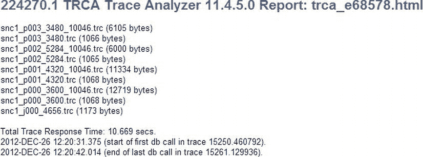

图 13-1 . TRCANLZR 报告的顶部

文件顶部的这个列表确保我们拥有正确的 TRCANLZR 输出。其下方是报告各部分的摘要，可直接跳转。参见 图 13-2。

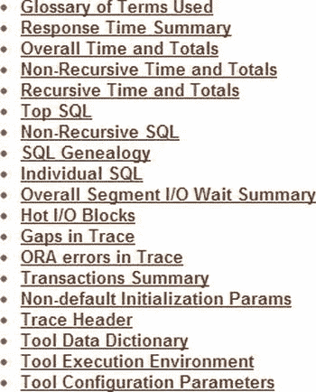

图 13-2 . 页眉部分包含指向报告其他部分的链接

看 图 13-2。这里有很多部分，都包含有用的信息。第一部分是“所用术语表”。你可能很想直接跳到“响应时间摘要”，因为“所用术语表”听起来很乏味。如果你确实进入了“所用术语表”，乍一看似乎内容不多。参见 图 13-3。准确理解所用的每个术语对于理解报告至关重要，因此应该检查“所用术语表”。你只需要点击标题下的加号即可获取详细信息。参见 图 13-3，它显示了我展开该部分后的屏幕。

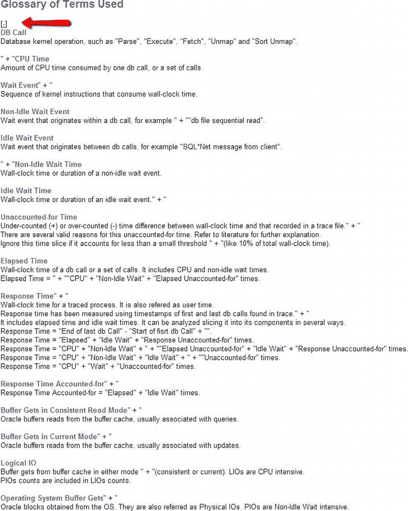

图 13-3 . 所用术语表通常不显示

## 报告术语解读
我提到术语表的原因是 TRCANLZR 需要被正确解读。存在许多时间度量，每一个都需要被理解，你才能正确理解发生了什么。例如，“响应时间”是用户如果坐在终端前运行 SQL 时所感知到的时间度量。该时间由实际工作（Elapsed）和非空闲等待时间组成。空闲等待时间可以忽略，因为它们是由于最终用户未响应造成的（通常显示为 `SQL*Net message from client`）。非空闲等待时间通常由 SQL 执行步骤期间发生的活动组成，例如从磁盘获取数据。一旦我们明确了这些定义，就可以查看“响应时间摘要”。参见 图 13-4，它显示了一个 SQL 的响应时间摘要示例（这是一个简单的 SQL，没有复杂情况）。

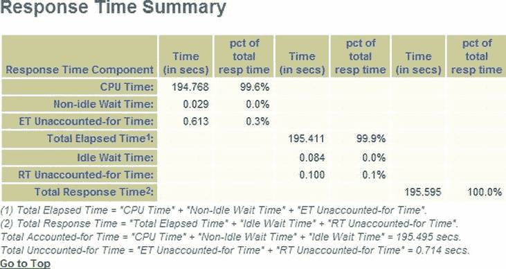

图 13-4 . 显示的响应时间摘要

此响应时间摘要显示了以下信息


