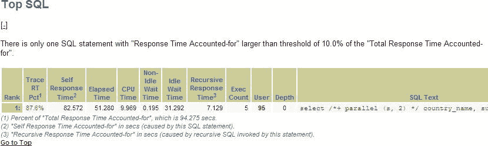
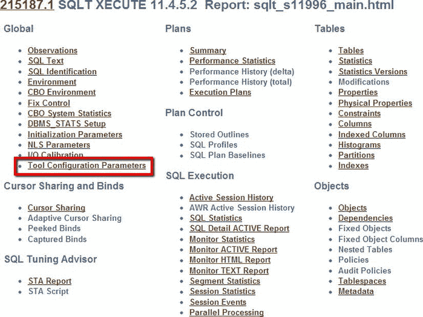
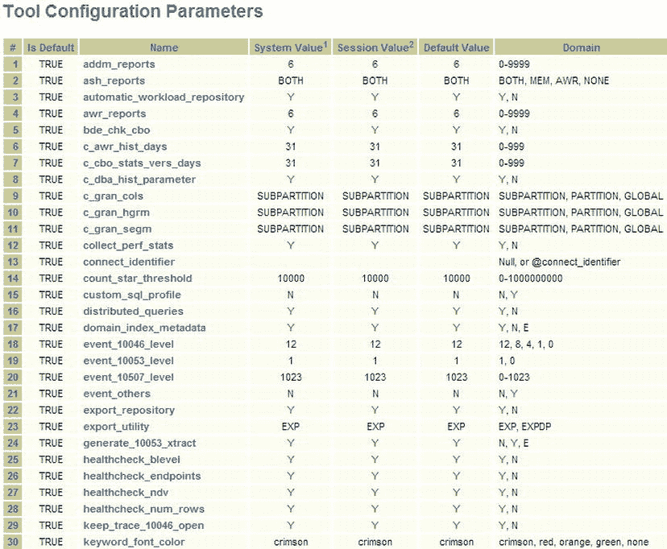
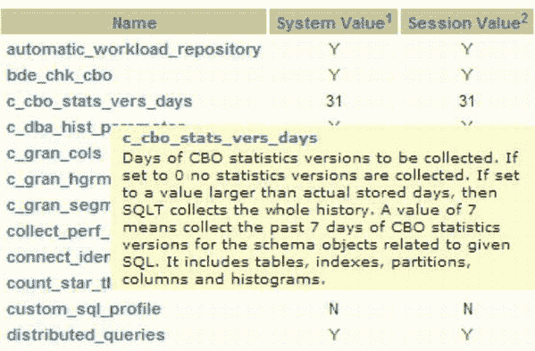
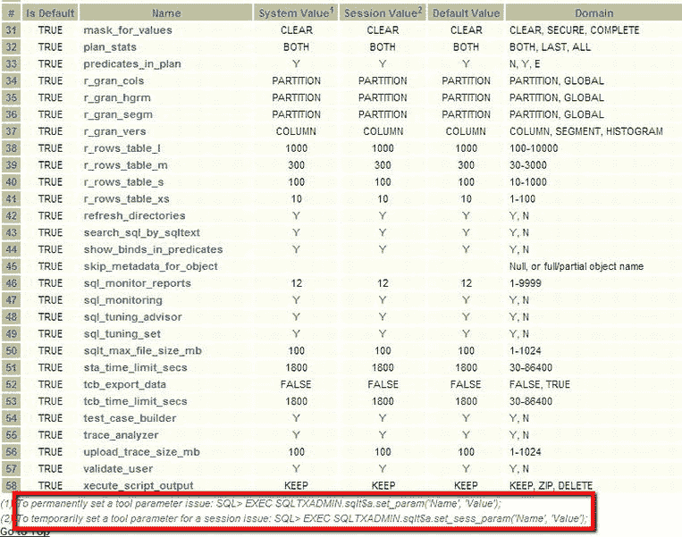

# TRCANLZR 报告分析与 TRCAXTR 工具

*   CPU 时间为 194.768 秒
*   非空闲等待时间为 0.029 秒
*   未计入的已用时间为 0.613 秒
*   上述各项时间的百分比
*   总已用时间，即本例中 CPU 时间、非空闲等待时间和未计入时间的总和 195.411
*   空闲等待时间为 0.084 秒
*   未计入的时间为 0.1 秒
*   所有内容的总时间为 195.595 秒

这是所有跟踪文件信息的汇总。它让你了解时间花费在何处，以及上表中哪一项值得关注。在本例中，99.6% 的时间都花费在 CPU 上，因此任何改进都应从这里着手。此类报告还会列出所有相关的 SQL（例如，如果是递归 SQL），因此你将在报告中看到一个“顶级 SQL”部分（参见 图 13-5）。



图 13-5 . TRCANLZR 报告的“顶级 SQL”部分

## TRCAXTR

TRCAXTR 是一个组合报告工具，它接受与 TRCANLZR（如上一节所述）相同的参数，但随后会从报告中确定顶级 SQL 并通过 XTRACT 运行它。在上面的例子中，顶级 SQL 将是 图 13-5 中“SQL 文本”标题下的那一个。你通过在命令行输入以下内容来运行 `sqltrcxtr.sql`：

```sql
SQL> @sqltrcxtr.sql
```

系统将提示你输入与 TRCANLZR 相同的参数，但在该工具结束后，系统将提示你输入运行 XTRACT 的参数。

系统将提示你输入以下参数：

*   包含跟踪文件的文件，或包含跟踪文件的控制文件（如前所述，`control.txt` 是“控制”文件，可以包含多个跟踪文件名）
*   SQLTXPLAIN 密码

这个过程非常长，因为它会遍历所有跟踪文件，为每个 SQL 生成 XTRACT。顶级的 zip 文件名为 `sqlt_snnnnn_set.zip`。该文件包含跟踪文件中每个 SQL 的所有 XTRACT。这个简单的例程，参数很少，却能产生非常多需要分析的文件。它可以快速收集整个会话的信息，但请注意，生成的 zip 文件可能非常大。

## 修改 SQLT 行为

SQLT 有很多方面和许多可用的工具。尽管如此，仍然存在 SQLT 可以做得更好或需要修改以帮助处理某些情况的情况。幸运的是，这可以通过设置参数来改变 SQLT 的行为。如果我们看一下熟悉的第一页主报告（见 图 13-6），我们会看到“工具配置参数”链接。



图 13-6 . 工具配置选项位于全局部分下

如果我们点击这个链接，就会看到可以在 SQLT 中设置以更改行为或选项的参数列表。这里的许多选项用于开启或关闭功能，例如 `ash_reports`。“域”列列出了可能的值，在本例中是“Y”或“N”。



图 13-7 . 配置参数的第一页

如果你对这些参数的含义有疑问，只需将鼠标悬停在参数上，就会显示描述性注释。你可以在 图 13-8 中看到。（为方便起见，附录 C 包含了这些参数及其描述的完整列表。）



图 13-8 . 将鼠标悬停在参数名称上以获取详细描述

这些参数使得 SQLT 实用程序比原本更加灵活和有用。在第二页末尾（见 图 13-9），我们看到了设置这些参数的方式描述：

要为所有会话设置工具的值：

```sql
SQL> EXEC SQLTXADMIN.sqlt$a.set_param('Name', 'Value');
```

要仅为一个会话设置值：

```sql
SQL> EXEC SQLTXADMIN.sqlt$a.set_sess_param('Name', 'Value');
```



图 13-9 . 配置参数的第二页

有了这些选项，我们就可以，例如，制作更小的测试用例，或者限制审查的 AWR 记录数量，或者排除测试用例构建器。

## 总结

在本章中，我们介绍了可用于分析 SQLT 中可用的跟踪文件的工具。这些是 TKPROF 所无法提供的特殊工具，在你需要分析 10046 跟踪文件时非常有用。在大多数情况下，SQLT XTRACT 仍然是辅助调优的最佳工具，但有时你面对的是一个繁忙的系统，没有显示出特定的 SQL 进行调查。在这种情况下，TRCANLZR 可以帮助找到有问题的 SQL。如果你也使用 TRCAXTR，那么你可以结合两者的优点。

